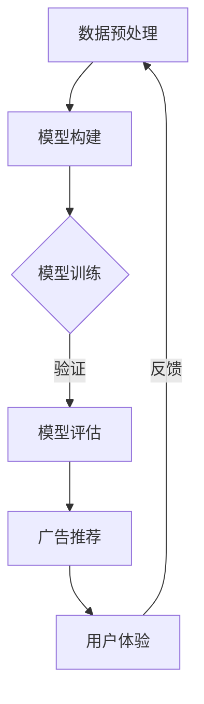

                 

### 个性化广告推荐系统概述

个性化广告推荐系统是现代数字营销领域的重要工具，它通过分析用户的行为和兴趣，为用户推荐最相关的广告。这种系统的出现，极大地改变了广告营销的方式，提高了广告的投放效果，同时也提升了用户的体验。

#### 广告推荐系统对营销的影响

广告推荐系统对于营销的影响是深远且广泛的。首先，它能够帮助广告主更精准地定位潜在客户，减少广告浪费，提高广告投资回报率（ROI）。其次，它通过个性化推荐，增加了用户对广告的点击率和转化率，从而提高了广告的效果。此外，广告推荐系统还能够实时调整广告策略，以适应市场变化和用户需求。

#### 用户行为数据的重要性

用户行为数据是广告推荐系统的核心资产。这些数据包括用户在网站上的浏览记录、点击行为、搜索关键词、购买历史等。通过对这些数据的深入分析和挖掘，广告推荐系统能够理解用户的兴趣和需求，从而提供个性化的广告推荐。

#### 广告推荐系统的发展历程

广告推荐系统的发展可以分为几个阶段：

1. **基于内容的推荐**：这是最早的推荐系统，主要基于用户之前的行为和兴趣来推荐相似的广告。
2. **协同过滤推荐**：通过分析用户之间的相似性，为用户推荐他们可能感兴趣的广告。
3. **混合推荐**：结合了基于内容和协同过滤的推荐方法，以提高推荐的准确性。
4. **深度学习推荐**：近年来，随着深度学习技术的发展，基于深度学习的大模型开始应用于广告推荐系统，显著提升了推荐的精度和效果。

#### 大模型在广告推荐系统中的应用

大模型在广告推荐系统中的应用，是其发展的重要里程碑。大模型如GPT、BERT、Transformer等，通过自监督学习和迁移学习，能够从大量的未标注数据中学习到丰富的知识，并应用于广告推荐系统中。这些大模型具有以下几个特点：

- **高维度表示**：能够捕捉到用户行为数据中的高维度信息，从而提供更精准的推荐。
- **多模态处理**：能够处理文本、图像、音频等多种数据类型，为广告推荐提供了更丰富的信息来源。
- **自适应能力**：能够根据用户行为和环境的变化，自适应地调整推荐策略。

### 本书的结构和内容安排

本书旨在系统地介绍个性化广告推荐系统，特别是大模型在这一领域中的应用。本书共分为三个部分：

- **第一部分**：引言，主要介绍个性化广告推荐系统的重要性、发展历程以及大模型的基本原理。
- **第二部分**：大模型在广告推荐系统中的应用案例，详细介绍几种常见的大模型（如Transformer、GPT、BERT）在广告推荐系统中的应用，并给出具体的代码实现和实战案例。
- **第三部分**：未来展望与趋势，讨论大模型在广告推荐系统中的发展前景，以及面临的挑战和解决方案。

每章的学习目标如下：

- **第1章**：了解个性化广告推荐系统的重要性及其发展历程。
- **第2章**：掌握大模型的基本原理和常见架构。
- **第3章**：理解大模型在广告推荐系统中的作用和应用场景。
- **第4章**：学习基于Transformer的个性化广告推荐系统。
- **第5章**：了解基于GPT的个性化广告推荐系统。
- **第6章**：掌握基于BERT的个性化广告推荐系统。
- **第7章**：学习大模型在广告推荐系统中的优化与调优方法。
- **第8章**：展望个性化广告推荐系统的未来趋势。
- **第9章**：总结全书内容，展望未来发展方向。

通过本书的学习，读者将能够系统地了解个性化广告推荐系统的原理和应用，掌握大模型在这一领域的具体实现方法，为未来的研究和实践打下坚实的基础。

---

### 大模型基本原理

#### 大模型的定义与特点

大模型（Large Models），通常是指参数量超过数十亿甚至万亿的深度学习模型。这些模型具有以下几个显著特点：

1. **高参数量**：大模型具有极高的参数数量，这使得它们能够捕捉到数据中的复杂模式和关联性。
2. **自适应能力**：大模型能够自适应地调整模型参数，以适应不同的数据集和应用场景。
3. **强大的表示能力**：由于高参数量，大模型能够生成高度复杂的表示，从而实现更准确的预测和更好的泛化能力。
4. **自监督学习能力**：大模型通常通过自监督学习来训练，这意味着它们可以在大量未标注的数据上进行训练，从而减少对标注数据的依赖。

#### 大模型与传统模型的区别

传统模型，如线性回归、决策树、支持向量机等，通常具有以下特点：

1. **参数量较小**：传统模型的参数数量通常较少，这限制了它们捕捉复杂模式的能力。
2. **监督学习为主**：传统模型主要依赖于标注数据进行训练，这使得它们在处理未标注数据时表现不佳。
3. **计算资源需求较低**：传统模型的计算需求相对较低，使得它们在计算资源有限的场景中更为适用。

相比之下，大模型具有以下优势：

- **更强大的预测能力**：由于高参数量和复杂的表示能力，大模型在处理复杂任务时通常能够提供更准确的预测。
- **更好的泛化能力**：大模型能够从大量未标注的数据中学习，从而实现更好的泛化能力。
- **更广泛的应用场景**：大模型可以应用于多种任务，包括文本分类、语音识别、图像识别等。

#### 大模型的特点总结

- **高参数量**：能够捕捉复杂的模式和关联性。
- **自适应能力**：能够适应不同的数据集和应用场景。
- **强大的表示能力**：生成高度复杂的表示，实现更准确的预测。
- **自监督学习能力**：减少对标注数据的依赖，处理未标注数据更高效。

这些特点使得大模型在现代深度学习应用中具有不可替代的地位，特别是在个性化广告推荐系统中，它们能够显著提升推荐系统的性能和效果。

---

### 大模型的工作原理

大模型的工作原理主要基于深度学习和自监督学习等先进技术。以下将详细探讨深度学习的基础、自监督学习和迁移学习，这些技术共同构成了大模型的核心工作原理。

#### 深度学习基础

深度学习是一种基于多层神经网络的学习方法，通过多层神经元之间的连接，逐层提取数据特征，最终实现对复杂模式的识别。深度学习的基础主要包括以下几个关键组成部分：

1. **神经元与神经网络**：深度学习的基本构建块是神经元，它们通过激活函数进行信息传递和处理。多层神经元的组合形成了神经网络，能够实现从简单到复杂的特征提取。
   
   $$ 
   f(x) = \sigma(\sum_{i=1}^{n} w_i \cdot x_i + b)
   $$

   其中，$f(x)$ 是激活函数，$\sigma$ 是常见的Sigmoid函数，$w_i$ 和 $x_i$ 分别是权重和输入特征，$b$ 是偏置。

2. **前向传播与反向传播**：前向传播是指将输入数据通过神经网络逐层传递，得到输出结果。反向传播则是通过计算输出结果与实际结果的差异，反向更新神经网络的权重和偏置，以最小化损失函数。

   $$ 
   \nabla W = \frac{\partial L}{\partial W}
   $$

   其中，$\nabla W$ 是权重梯度，$L$ 是损失函数，$\frac{\partial L}{\partial W}$ 表示损失函数关于权重 $W$ 的梯度。

3. **优化算法**：深度学习中的优化算法用于调整网络参数，以最小化损失函数。常见的优化算法包括随机梯度下降（SGD）、Adam等。

   $$ 
   \theta_{t+1} = \theta_{t} - \alpha \cdot \nabla \theta
   $$

   其中，$\theta$ 表示模型参数，$\alpha$ 是学习率，$\nabla \theta$ 是参数梯度。

#### 自监督学习

自监督学习是一种不需要标注数据的监督学习方式，它通过利用数据内部结构来学习，从而实现特征提取和模型训练。自监督学习的核心思想是在没有明确标签的情况下，利用数据本身的信息进行学习。以下是一些常见的方法：

1. **预训练与微调**：预训练是指在大量无标签数据上训练模型，使其获得对数据的基本理解。然后，通过微调（Fine-tuning）在特定任务上进一步调整模型参数，以提高模型在特定任务上的性能。

   $$ 
   \text{Pretrain}(\theta) = \min_{\theta} \sum_{i=1}^{N} L_i(\theta)
   $$

   $$ 
   \text{Fine-tune}(\theta) = \min_{\theta} \sum_{i=1}^{M} L_i'(\theta)
   $$

   其中，$L_i(\theta)$ 是预训练损失函数，$L_i'(\theta)$ 是微调损失函数。

2. **自编码器**：自编码器是一种特殊类型的神经网络，其目的是将输入数据编码为低维表示，然后再将这些表示解码回原始数据。自编码器可以捕获数据的潜在结构和特征，从而实现无监督特征提取。

   $$ 
   \text{Encoder}(x) = z
   $$

   $$ 
   \text{Decoder}(z) = x'
   $$

   其中，$x$ 是输入数据，$z$ 是编码表示，$x'$ 是解码输出。

#### 迁移学习

迁移学习是一种将一个任务学习到的知识应用于其他相关任务的方法。通过迁移学习，可以将在大规模数据集上训练的模型应用于小规模或特定领域的数据集，从而提高模型的性能。迁移学习的主要方法包括：

1. **领域自适应**：领域自适应（Domain Adaptation）旨在减少源领域和目标领域之间的差异，从而将源领域上的知识迁移到目标领域。

   $$ 
   \min_{\theta} \frac{1}{N} \sum_{i=1}^{N} \mathbb{E}_{x,y \sim P_{\text{source}}} [L(y, f(x;\theta))]
   + \frac{1}{M} \sum_{i=1}^{M} \mathbb{E}_{x' \sim P_{\text{target}}} [L(y', f(x';\theta))]
   $$

   其中，$P_{\text{source}}$ 和 $P_{\text{target}}$ 分别是源领域和目标领域的数据分布，$f(x;\theta)$ 是模型参数为 $\theta$ 的函数。

2. **零样本学习**：零样本学习（Zero-Shot Learning）旨在解决新类别的预测问题，其中模型在训练时没有直接接触过这些新类别。零样本学习通常依赖于原型匹配或元学习等技术。

   $$ 
   \min_{\theta} \sum_{c \in \text{novel classes}} \sum_{x_c \in \text{support set}} \mathbb{E}_{x_n \in \text{novel instances}} [L(c, f(x_n;\theta))]
   $$

   其中，$\text{novel classes}$ 是新类别，$\text{support set}$ 是支持集，包含训练过的类别信息。

#### 大模型的工作原理总结

大模型的工作原理可以概括为以下几个关键步骤：

1. **数据预处理**：对输入数据进行清洗、归一化和编码等预处理操作。
2. **预训练**：在大规模无标签数据上进行预训练，以获取通用特征表示。
3. **微调**：在特定任务上的有标签数据集上进行微调，优化模型参数。
4. **迁移学习**：将预训练模型应用于新任务或领域，通过领域自适应或零样本学习等技术进行适应。

这些技术共同构成了大模型的核心工作原理，使得大模型能够从海量数据中学习到丰富的知识，并应用于各种复杂的任务，如个性化广告推荐系统。

---

### 大模型的常见架构

在大模型的领域里，几种特定的架构因其独特的设计和卓越的性能而受到广泛关注。以下将详细介绍三种常见的大模型架构：Transformer、GPT系列模型和BERT。

#### Transformer架构

Transformer架构是由Vaswani等人在2017年提出的一种基于自注意力机制的神经网络模型，特别适用于序列到序列的预测任务。Transformer的主要特点包括：

1. **自注意力机制**：Transformer的核心是自注意力机制（Self-Attention），它允许模型在生成每个词时考虑所有其他词的信息。自注意力通过计算词与词之间的相似性来实现，从而捕捉到长距离的依赖关系。

   $$ 
   \text{Attention}(Q, K, V) = \text{softmax}\left(\frac{QK^T}{\sqrt{d_k}}\right)V
   $$

   其中，$Q, K, V$ 分别是查询向量、关键向量和值向量，$d_k$ 是关键向量的维度。

2. **编码器与解码器架构**：Transformer采用编码器-解码器（Encoder-Decoder）架构，编码器将输入序列转换为一个固定长度的向量，解码器使用这个向量生成输出序列。编码器和解码器都由多个自注意力层和前馈网络组成。

3. **多头注意力**：为了提高模型的表示能力，Transformer引入了多头注意力（Multi-Head Attention），每个头关注不同的部分，然后将结果拼接起来。

4. **位置编码**：由于Transformer没有循环神经网络（RNN）中的位置信息，因此引入了位置编码（Positional Encoding）来提供序列中的位置信息。

#### GPT系列模型

GPT（Generative Pre-trained Transformer）是由OpenAI提出的一系列基于Transformer的大规模预训练模型，主要用于自然语言生成和文本分类等任务。GPT系列模型的主要特点包括：

1. **预训练与微调**：GPT模型首先在大规模语料库上进行预训练，学习到语言的一般规则和结构。然后，通过微调（Fine-tuning）将模型应用于具体任务，从而实现高性能的文本处理。

2. **自回归语言模型**：GPT是一种自回归语言模型（Autoregressive Language Model），其目标是预测序列中下一个词。通过自回归，GPT能够生成连贯的自然语言文本。

3. **分层架构**：GPT模型采用分层架构，每个层次都有多个自注意力层和前馈网络。层次之间的连接通过层连接（Layer Normalization）和残差连接（Residual Connection）来实现。

4. **参数高效性**：GPT模型通过参数共享和层次化结构，实现了参数的高效性，使得模型能够在有限的计算资源下进行大规模训练。

#### BERT及其变体

BERT（Bidirectional Encoder Representations from Transformers）是由Google在2018年提出的一种双向Transformer编码器，主要用于文本分类、问答系统等任务。BERT的主要特点包括：

1. **双向编码器**：BERT采用双向编码器（Bidirectional Encoder），能够同时从左到右和从右到左的视角处理输入序列，从而捕捉到上下文信息。双向编码器的输出是输入序列的固定长度的向量。

2. **预训练与微调**：BERT首先在大规模语料库上进行预训练，学习到语言的一般规则和结构。然后，通过微调（Fine-tuning）将模型应用于具体任务，从而实现高性能的文本处理。

3. **掩码语言模型**：BERT通过掩码语言模型（Masked Language Model，MLM）进行预训练，在输入序列中随机掩码一部分词，并要求模型预测这些被掩码的词。这一过程有助于模型学习到语言的内在结构。

4. **变体模型**：BERT的变体模型，如RoBERTa、ALBERT等，通过改进预训练过程和模型结构，进一步提升模型的性能和效率。

#### 总结

Transformer、GPT系列模型和BERT都是基于Transformer架构的大模型，它们在自然语言处理领域取得了显著的成果。Transformer以其自注意力机制和编码器-解码器架构著称，GPT系列模型以其自回归语言模型和分层架构闻名，而BERT以其双向编码器和掩码语言模型备受瞩目。这些模型各有特色，适用于不同的任务和应用场景，共同推动了自然语言处理领域的发展。

---

### 大模型在广告推荐系统中的作用

大模型在广告推荐系统中扮演了至关重要的角色，其贡献主要体现在以下几个方面：

#### 提高推荐精度

大模型通过其强大的特征提取能力和复杂模式捕捉能力，能够从海量用户行为数据中提取出更丰富的特征，从而提高推荐系统的精度。传统的推荐系统，如基于内容的推荐和协同过滤推荐，通常依赖用户的历史行为和用户之间的相似性来进行推荐。这些方法在处理高维数据时存在一定的局限性，容易导致过拟合和推荐效果不佳。而大模型，如Transformer、BERT和GPT，能够通过自监督学习和迁移学习，从大量未标注的数据中学习到潜在的复杂模式，从而显著提高推荐系统的准确性。

#### 优化广告投放效果

广告投放效果是广告主最为关心的问题之一。大模型能够通过分析用户行为数据，准确预测用户的兴趣和需求，从而为广告主提供更精准的投放策略。例如，广告主可以根据用户的浏览历史、搜索关键词、购买记录等信息，利用大模型生成个性化的广告推荐。这不仅能够提高广告的点击率和转化率，还能减少广告投放的浪费，提高广告投资回报率（ROI）。此外，大模型还可以通过实时调整广告内容、投放时间和投放渠道等，以适应用户行为的变化，从而实现更优的广告投放效果。

#### 增强用户体验

用户体验是广告推荐系统成功的关键因素之一。大模型能够通过分析用户的反馈和行为数据，提供个性化的广告推荐，从而提升用户的满意度和使用体验。传统的推荐系统，由于依赖于用户的点击行为和评分等显式反馈，往往无法完全捕捉到用户的真实需求。而大模型，通过自监督学习和迁移学习，可以从大量的用户行为数据中学习到用户的潜在兴趣和偏好，从而提供更加个性化、贴近用户需求的广告推荐。此外，大模型还能够通过实时调整推荐策略，快速响应用户行为的变化，提高推荐系统的响应速度和灵活性。

#### 多模态数据处理

广告推荐系统中的数据通常包括文本、图像、音频等多种类型。大模型具有处理多模态数据的能力，能够将不同类型的数据融合在一起，生成更丰富的特征表示。例如，在视频广告推荐中，大模型可以通过分析视频中的文本描述、音频内容以及视频帧，生成综合的特征表示，从而提高推荐系统的精度。多模态数据处理不仅能够提高推荐系统的性能，还能够为广告主提供更全面的用户画像，从而制定更精准的广告投放策略。

#### 持续学习和优化

大模型具有强大的自适应能力，能够通过持续学习和优化，不断调整推荐策略，以适应用户需求和市场变化。传统的推荐系统，由于依赖于固定的特征提取和模型结构，很难适应快速变化的市场环境。而大模型，通过自监督学习和迁移学习，可以从新的数据中不断学习，更新模型参数，从而实现推荐系统的持续优化。这种持续学习和优化的能力，使得大模型在广告推荐系统中具有更高的灵活性和适应性。

#### 可解释性

虽然大模型的性能显著优于传统模型，但其内部工作机制往往非常复杂，难以解释。这给广告推荐系统的可解释性带来了一定的挑战。为了解决这一问题，研究人员正在努力开发可解释的大模型，如可解释的Transformer、可解释的BERT等。这些可解释的大模型，不仅能够提高推荐系统的性能，还能够提供更直观的解释，帮助广告主和用户更好地理解推荐结果。

总之，大模型在广告推荐系统中的作用是多方面的，它不仅能够提高推荐精度、优化广告投放效果和增强用户体验，还能够处理多模态数据、实现持续学习和优化，并提供可解释性。这些优势使得大模型成为现代广告推荐系统的重要工具，为广告主和用户提供更优质的服务。

---

### 大模型在广告推荐系统中的具体应用场景

大模型在广告推荐系统中的具体应用场景非常丰富，涵盖了用户行为分析、广告内容优化、广告投放策略等多个方面。以下将详细探讨这些应用场景及其实现方法。

#### 用户行为分析

用户行为分析是广告推荐系统的基础，通过分析用户的浏览历史、点击行为、搜索记录等数据，可以深入了解用户的兴趣和需求，从而提供个性化的广告推荐。

**实现方法**：

1. **特征提取**：利用大模型，如BERT、GPT等，对用户行为数据进行编码，提取高维度的特征表示。这些特征能够捕捉到用户的潜在兴趣和行为模式。
   
   $$ 
   \text{User Behavior Data} \rightarrow \text{BERT Encoder} \rightarrow \text{High-Dimensional Features}
   $$

2. **用户兴趣建模**：通过自监督学习或迁移学习，对提取的特征进行建模，生成用户兴趣向量。这些向量能够表示用户的个性化特征，用于后续的广告推荐。

3. **实时更新**：用户行为数据不断更新，大模型可以通过在线学习或增量学习，实时更新用户兴趣模型，以适应用户行为的变化。

#### 广告内容优化

广告内容的优化是提高广告投放效果的关键。大模型能够通过分析用户的兴趣和行为，生成个性化的广告内容，从而提高广告的吸引力和点击率。

**实现方法**：

1. **广告生成**：利用GPT、Transformer等大模型，生成与用户兴趣相关的广告内容。这些内容可以是文本、图像或视频等多种形式。

   $$ 
   \text{User Interest} \rightarrow \text{GPT Model} \rightarrow \text{Personalized Ad Content}
   $$

2. **内容评估**：通过机器学习算法，评估生成的广告内容的质量，如点击率、转化率等。根据评估结果，进一步优化广告内容。

3. **实时调整**：广告内容需要根据用户反馈和行为变化进行实时调整。大模型可以通过在线学习或增量学习，快速生成新的广告内容，以适应用户需求。

#### 广告投放策略

广告投放策略的制定是广告主实现高效广告投放的关键。大模型能够通过分析用户行为、广告内容和市场环境，制定最优的广告投放策略。

**实现方法**：

1. **目标设定**：根据广告主的业务目标，设定广告投放的目标，如提高品牌知名度、增加销售量等。

2. **策略优化**：利用大模型，如Transformer、BERT等，分析用户行为数据、广告内容和市场环境，制定广告投放策略。策略包括广告投放时间、投放渠道、投放频率等。

3. **实时调整**：广告投放策略需要根据市场变化和用户行为进行实时调整。大模型可以通过在线学习或增量学习，快速调整广告投放策略，以实现最优效果。

#### 实际应用案例

以下是一个基于Transformer的个性化广告推荐系统的实际应用案例：

1. **用户行为分析**：系统首先收集用户的浏览历史、点击行为等数据，利用BERT模型提取高维度特征，生成用户兴趣向量。

2. **广告生成**：根据用户兴趣向量，利用GPT模型生成个性化的广告内容。例如，对于喜欢旅游的用户，系统可以生成与旅游相关的广告。

3. **广告投放策略**：系统分析用户行为数据、广告内容和市场环境，制定最优的广告投放策略。例如，在用户浏览网页的时间段，系统可以增加广告的投放频率，以提高广告的点击率。

4. **实时调整**：系统通过实时监测用户行为和广告效果，利用Transformer模型进行在线学习，快速生成新的广告内容和调整广告投放策略，以实现最优效果。

总之，大模型在广告推荐系统中的应用，不仅能够提高推荐精度、优化广告内容、制定最优投放策略，还能够实现实时调整和优化，从而实现广告投放效果的最大化。随着大模型技术的不断发展，广告推荐系统将变得更加智能和高效，为广告主和用户提供更优质的服务。

---

### 大模型在广告推荐系统中的挑战与解决方案

尽管大模型在广告推荐系统中展现了巨大的潜力，但其应用也面临诸多挑战。以下是主要挑战及其解决方案：

#### 数据隐私保护

广告推荐系统需要处理大量用户行为数据，这些数据通常包含敏感的个人信息。数据隐私保护是广告推荐系统面临的重要挑战之一。为了解决这个问题，可以采取以下措施：

1. **差分隐私**：在处理用户数据时，加入随机噪声，确保单个用户的数据不会泄露。差分隐私算法能够保护用户隐私，同时保证模型的性能。

   $$ 
   L_{\epsilon}(x) = \mathbb{E}_{\Delta \sim \text{Uniform}([- \Delta, \Delta])} [f(x + \Delta)]
   $$

   其中，$L_{\epsilon}(x)$ 是差分隐私损失函数，$\Delta$ 是加入的随机噪声。

2. **联邦学习**：通过联邦学习（Federated Learning）技术，广告推荐系统可以在不共享原始数据的情况下，协同训练模型。每个参与者仅共享模型更新，从而保护用户隐私。

3. **数据加密**：对用户数据进行加密处理，确保数据在传输和存储过程中不会被未授权方访问。常用的加密算法包括对称加密和非对称加密。

#### 大模型训练与优化

大模型训练需要大量计算资源和时间，这对训练过程提出了挑战。以下是一些优化策略：

1. **分布式训练**：利用多GPU或分布式计算框架（如TensorFlow分布式训练），加速大模型的训练过程。

2. **模型压缩**：通过剪枝、量化等技术，减少模型参数的数量和计算量，从而降低模型的存储和计算需求。模型压缩技术包括网络剪枝、权重共享和低秩分解等。

3. **迁移学习**：利用迁移学习（Transfer Learning）技术，在大规模数据集上预训练模型，然后在特定任务上进行微调。这可以减少模型在特定任务上的训练需求，提高训练效率。

#### 系统的可解释性

大模型通常具有复杂的内部结构，其工作机制难以解释。这给广告推荐系统的可解释性带来了挑战。以下是一些提高可解释性的方法：

1. **模型可视化**：通过可视化技术，如T-SNE、热力图等，展示模型对数据的处理过程，帮助用户理解模型的工作机制。

2. **注意力机制**：利用注意力机制（Attention Mechanism），展示模型在处理不同输入时，关注的关键部分。这有助于理解模型如何从数据中提取重要特征。

3. **解释性模型**：开发可解释的大模型，如基于规则的模型或线性模型，这些模型具有明确的决策规则，易于解释。

4. **解释性API**：提供解释性API，允许用户查询模型的决策过程和原因。这可以帮助用户更好地理解推荐结果，并提高系统的透明度和信任度。

#### 挑战与解决方案总结

- **数据隐私保护**：采用差分隐私、联邦学习和数据加密等技术。
- **大模型训练与优化**：采用分布式训练、模型压缩和迁移学习等技术。
- **系统的可解释性**：通过模型可视化、注意力机制、解释性模型和解释性API等方法。

总之，尽管大模型在广告推荐系统中面临诸多挑战，但通过上述解决方案，可以有效应对这些问题，从而实现广告推荐系统的优化和提升。

---

### 基于Transformer的个性化广告推荐系统

#### Transformer模型的基本原理

Transformer模型是由Vaswani等人在2017年提出的一种基于自注意力机制的神经网络模型，特别适用于序列到序列的预测任务。其基本原理包括以下几个方面：

1. **自注意力机制**：Transformer模型的核心是自注意力机制（Self-Attention），它允许模型在生成每个词时考虑所有其他词的信息。自注意力通过计算词与词之间的相似性来实现，从而捕捉到长距离的依赖关系。

   $$ 
   \text{Attention}(Q, K, V) = \text{softmax}\left(\frac{QK^T}{\sqrt{d_k}}\right)V
   $$

   其中，$Q, K, V$ 分别是查询向量、关键向量和值向量，$d_k$ 是关键向量的维度。

2. **编码器与解码器架构**：Transformer采用编码器-解码器（Encoder-Decoder）架构，编码器将输入序列转换为一个固定长度的向量，解码器使用这个向量生成输出序列。编码器和解码器都由多个自注意力层和前馈网络组成。

3. **多头注意力**：为了提高模型的表示能力，Transformer引入了多头注意力（Multi-Head Attention），每个头关注不同的部分，然后将结果拼接起来。

4. **位置编码**：由于Transformer没有循环神经网络（RNN）中的位置信息，因此引入了位置编码（Positional Encoding）来提供序列中的位置信息。

#### Transformer在广告推荐系统中的应用

在广告推荐系统中，Transformer模型的应用主要体现在用户行为分析、广告内容生成和广告投放策略优化等方面。以下将详细探讨这些应用场景及其实现方法。

**1. 用户行为分析**

用户行为分析是广告推荐系统的基础，通过分析用户的浏览历史、点击行为、搜索记录等数据，可以深入了解用户的兴趣和需求，从而提供个性化的广告推荐。

**实现方法**：

- **特征提取**：利用BERT模型对用户行为数据进行编码，提取高维度的特征表示。这些特征能够捕捉到用户的潜在兴趣和行为模式。
  
  $$ 
  \text{User Behavior Data} \rightarrow \text{BERT Encoder} \rightarrow \text{High-Dimensional Features}
  $$

- **用户兴趣建模**：通过自监督学习或迁移学习，对提取的特征进行建模，生成用户兴趣向量。这些向量能够表示用户的个性化特征，用于后续的广告推荐。

- **实时更新**：用户行为数据不断更新，BERT模型可以通过在线学习或增量学习，实时更新用户兴趣模型，以适应用户行为的变化。

**2. 广告内容生成**

广告内容生成是提高广告投放效果的关键。通过大模型，如GPT，可以生成与用户兴趣相关的个性化广告内容，从而提高广告的吸引力和点击率。

**实现方法**：

- **广告生成**：利用GPT模型，根据用户兴趣向量生成个性化的广告内容。这些内容可以是文本、图像或视频等多种形式。
  
  $$ 
  \text{User Interest} \rightarrow \text{GPT Model} \rightarrow \text{Personalized Ad Content}
  $$

- **内容评估**：通过机器学习算法，评估生成的广告内容的质量，如点击率、转化率等。根据评估结果，进一步优化广告内容。

- **实时调整**：广告内容需要根据用户反馈和行为变化进行实时调整。GPT模型可以通过在线学习或增量学习，快速生成新的广告内容，以适应用户需求。

**3. 广告投放策略优化**

广告投放策略的制定是广告主实现高效广告投放的关键。通过大模型，如Transformer，可以分析用户行为、广告内容和市场环境，制定最优的广告投放策略。

**实现方法**：

- **目标设定**：根据广告主的业务目标，设定广告投放的目标，如提高品牌知名度、增加销售量等。

- **策略优化**：利用Transformer模型，分析用户行为数据、广告内容和市场环境，制定广告投放策略。策略包括广告投放时间、投放渠道、投放频率等。

- **实时调整**：广告投放策略需要根据市场变化和用户行为进行实时调整。Transformer模型可以通过在线学习或增量学习，快速调整广告投放策略，以实现最优效果。

**Transformer模型在广告推荐系统中的优势**

- **高维度特征提取**：Transformer模型能够通过自注意力机制提取用户行为数据中的高维度特征，从而提高推荐精度。
- **多模态数据处理**：Transformer模型能够处理文本、图像、音频等多种数据类型，为广告推荐提供了更丰富的信息来源。
- **实时调整能力**：通过在线学习和增量学习，Transformer模型能够实时调整广告推荐策略，以适应用户行为的变化。

#### 实际应用案例

以下是一个基于Transformer的个性化广告推荐系统的实际应用案例：

1. **用户行为分析**：系统首先收集用户的浏览历史、点击行为等数据，利用BERT模型提取高维度特征，生成用户兴趣向量。

2. **广告生成**：根据用户兴趣向量，利用GPT模型生成个性化的广告内容。例如，对于喜欢旅游的用户，系统可以生成与旅游相关的广告。

3. **广告投放策略**：系统分析用户行为数据、广告内容和市场环境，利用Transformer模型制定最优的广告投放策略。例如，在用户浏览网页的时间段，系统可以增加广告的投放频率，以提高广告的点击率。

4. **实时调整**：系统通过实时监测用户行为和广告效果，利用Transformer模型进行在线学习，快速生成新的广告内容和调整广告投放策略，以实现最优效果。

总之，基于Transformer的个性化广告推荐系统，通过高维度特征提取、多模态数据处理和实时调整能力，实现了广告推荐系统的优化和提升，为广告主和用户提供更优质的服务。

---

### 基于GPT的个性化广告推荐系统

#### GPT模型的基本原理

GPT（Generative Pre-trained Transformer）是由OpenAI提出的一种基于Transformer架构的自回归语言模型，主要用于自然语言生成和文本分类等任务。GPT模型的基本原理包括以下几个方面：

1. **自回归语言模型**：GPT是一种自回归语言模型（Autoregressive Language Model），其目标是预测序列中下一个词。通过自回归，GPT能够生成连贯的自然语言文本。自回归语言模型的核心思想是，给定前一个词，模型预测下一个词的概率分布。

   $$ 
   p(w_t | w_{<t}) = \text{softmax}(\text{GPT}(w_{<t}))
   $$

   其中，$w_t$ 是当前词，$w_{<t}$ 是之前所有词的集合。

2. **预训练与微调**：GPT模型首先在大规模语料库上进行预训练，学习到语言的一般规则和结构。然后，通过微调（Fine-tuning）将模型应用于具体任务，从而实现高性能的文本处理。预训练使模型能够从大量无标签数据中学习，从而提高模型的泛化能力和鲁棒性。

3. **分层架构**：GPT模型采用分层架构，每个层次都有多个自注意力层和前馈网络。层次之间的连接通过层连接（Layer Normalization）和残差连接（Residual Connection）来实现。这种分层结构使得GPT能够处理更长的序列，并提高模型的计算效率。

4. **参数高效性**：GPT模型通过参数共享和层次化结构，实现了参数的高效性，使得模型能够在有限的计算资源下进行大规模训练。参数共享减少了模型参数的数量，而层次化结构提高了模型的并行计算能力。

#### GPT在广告推荐系统中的应用

在广告推荐系统中，GPT模型的应用主要体现在广告文案生成和广告内容优化等方面。以下将详细探讨这些应用场景及其实现方法。

**1. 广告文案生成**

广告文案生成是提高广告投放效果的重要环节。通过GPT模型，可以生成与用户兴趣和广告内容高度匹配的广告文案，从而提高广告的吸引力和点击率。

**实现方法**：

- **广告文案生成**：利用GPT模型，根据用户兴趣和广告主题生成个性化的广告文案。GPT模型能够根据上下文信息生成连贯、自然的文本，从而提高广告文案的质量。

  $$ 
  \text{User Interest} + \text{Ad Theme} \rightarrow \text{GPT Model} \rightarrow \text{Personalized Ad Copy}
  $$

- **文案评估**：通过机器学习算法，评估生成的广告文案的质量，如点击率、转化率等。根据评估结果，进一步优化广告文案。

- **实时调整**：广告文案需要根据用户反馈和行为变化进行实时调整。GPT模型可以通过在线学习或增量学习，快速生成新的广告文案，以适应用户需求。

**2. 广告内容优化**

广告内容优化是提高广告投放效果的关键。通过GPT模型，可以分析用户行为数据和广告内容，优化广告内容和结构，从而提高广告的吸引力和点击率。

**实现方法**：

- **内容分析**：利用GPT模型，对用户行为数据和广告内容进行分析，提取关键词和关键信息。这些信息有助于理解用户的兴趣和需求。

  $$ 
  \text{User Behavior Data} + \text{Ad Content} \rightarrow \text{GPT Model} \rightarrow \text{Key Information Extraction}
  $$

- **内容生成**：根据提取的关键信息，利用GPT模型生成优化的广告内容。GPT模型能够根据上下文信息生成连贯、自然的文本，从而提高广告内容的吸引力。

  $$ 
  \text{Key Information} \rightarrow \text{GPT Model} \rightarrow \text{Optimized Ad Content}
  $$

- **内容评估**：通过机器学习算法，评估优化后的广告内容的质量，如点击率、转化率等。根据评估结果，进一步优化广告内容。

**实际应用案例**

以下是一个基于GPT的个性化广告推荐系统的实际应用案例：

1. **用户行为分析**：系统首先收集用户的浏览历史、点击行为等数据，利用GPT模型提取用户兴趣关键词。

2. **广告文案生成**：根据用户兴趣关键词和广告主题，利用GPT模型生成个性化的广告文案。例如，对于喜欢旅游的用户，系统可以生成与旅游相关的广告文案。

3. **广告内容优化**：系统分析用户行为数据和广告内容，利用GPT模型提取关键信息，并生成优化的广告内容。例如，系统可以优化广告图片、视频和文本，以提高广告的吸引力和点击率。

4. **实时调整**：系统通过实时监测用户行为和广告效果，利用GPT模型进行在线学习，快速生成新的广告文案和内容，以适应用户需求。

总之，基于GPT的个性化广告推荐系统，通过广告文案生成和广告内容优化，实现了广告推荐系统的优化和提升，为广告主和用户提供更优质的服务。

---

### 基于BERT的个性化广告推荐系统

#### BERT模型的基本原理

BERT（Bidirectional Encoder Representations from Transformers）是由Google在2018年提出的一种双向Transformer编码器，主要用于文本分类、问答系统等任务。BERT模型的基本原理包括以下几个方面：

1. **双向编码器**：BERT采用双向编码器（Bidirectional Encoder），能够同时从左到右和从右到左的视角处理输入序列，从而捕捉到上下文信息。双向编码器的输出是输入序列的固定长度的向量。

   $$ 
   \text{BERT}(x) = \text{context vector}
   $$

   其中，$x$ 是输入序列，$\text{context vector}$ 是编码后的上下文向量。

2. **预训练与微调**：BERT首先在大规模语料库上进行预训练，学习到语言的一般规则和结构。然后，通过微调（Fine-tuning）将模型应用于具体任务，从而实现高性能的文本处理。预训练使模型能够从大量无标签数据中学习，从而提高模型的泛化能力和鲁棒性。

3. **掩码语言模型**：BERT通过掩码语言模型（Masked Language Model，MLM）进行预训练，在输入序列中随机掩码一部分词，并要求模型预测这些被掩码的词。这一过程有助于模型学习到语言的内在结构。

   $$ 
   \text{Input Sequence} \rightarrow \text{Masking} \rightarrow \text{MLM Task}
   $$

4. **变体模型**：BERT的变体模型，如RoBERTa、ALBERT等，通过改进预训练过程和模型结构，进一步提升模型的性能和效率。RoBERTa引入了更多的训练数据、更长的序列处理和更灵活的层连接，而ALBERT则通过参数共享和层连接优化，提高了模型的效率。

#### BERT在广告推荐系统中的应用

在广告推荐系统中，BERT模型的应用主要体现在用户意图识别、广告内容匹配等方面。以下将详细探讨这些应用场景及其实现方法。

**1. 用户意图识别**

用户意图识别是广告推荐系统的重要环节，通过分析用户的输入文本，识别用户的兴趣和需求，从而提供个性化的广告推荐。

**实现方法**：

- **文本编码**：利用BERT模型，对用户的输入文本进行编码，提取高维度的特征表示。这些特征能够捕捉到用户的意图和兴趣。
  
  $$ 
  \text{User Input} \rightarrow \text{BERT Encoder} \rightarrow \text{High-Dimensional Features}
  $$

- **意图建模**：通过自监督学习或迁移学习，对提取的特征进行建模，生成用户意图向量。这些向量能够表示用户的个性化意图，用于后续的广告推荐。

- **实时更新**：用户意图不断变化，BERT模型可以通过在线学习或增量学习，实时更新用户意图模型，以适应用户意图的变化。

**2. 广告内容匹配**

广告内容匹配是提高广告投放效果的关键，通过分析广告内容和用户意图，为用户提供相关的广告内容。

**实现方法**：

- **内容编码**：利用BERT模型，对广告内容进行编码，提取高维度的特征表示。这些特征能够捕捉到广告的核心内容和主题。
  
  $$ 
  \text{Ad Content} \rightarrow \text{BERT Encoder} \rightarrow \text{High-Dimensional Features}
  $$

- **匹配策略**：通过相似度计算或嵌入空间，将用户意图特征和广告内容特征进行匹配，生成匹配得分。得分越高，表示广告内容与用户意图越相关。

  $$ 
  \text{User Intent} \times \text{Ad Content} = \text{Matching Score}
  $$

- **实时调整**：广告内容需要根据用户意图和反馈进行实时调整。BERT模型可以通过在线学习或增量学习，快速生成新的广告内容，以适应用户意图的变化。

**实际应用案例**

以下是一个基于BERT的个性化广告推荐系统的实际应用案例：

1. **用户意图识别**：系统首先收集用户的输入文本，利用BERT模型提取用户意图特征。

2. **广告内容匹配**：根据用户意图特征和广告内容特征，系统计算匹配得分，为用户推荐相关的广告内容。

3. **广告文案生成**：利用GPT模型，根据用户意图特征和广告主题，生成个性化的广告文案。

4. **实时调整**：系统通过实时监测用户行为和广告效果，利用BERT模型进行在线学习，快速生成新的广告内容和文案，以适应用户意图的变化。

总之，基于BERT的个性化广告推荐系统，通过用户意图识别和广告内容匹配，实现了广告推荐系统的优化和提升，为广告主和用户提供更优质的服务。

---

### 大模型在广告推荐系统中的优化与调优

在广告推荐系统中，大模型的性能不仅取决于模型本身的架构和参数设置，还受到数据质量、训练过程和评估指标等多种因素的影响。以下将详细探讨大模型在广告推荐系统中的优化与调优策略。

#### 数据预处理

数据预处理是提高大模型性能的重要环节。有效的数据预处理可以减少噪声、异常值和缺失值的影响，提高数据的质量和模型的泛化能力。

**1. 数据清洗**：包括去除重复数据、填补缺失值和去除噪声。对于缺失值，可以采用均值填充、中值填充或模型预测等方法进行填补。

**2. 特征工程**：通过对原始数据进行特征提取和转换，生成更有助于模型学习的特征。常见的特征工程方法包括编码（如独热编码、标签编码）、归一化（如归一化、标准化）和降维（如PCA、t-SNE）。

**3. 数据增强**：通过增加数据样本的多样性，如旋转、缩放、裁剪等，可以提高模型的泛化能力。

#### 模型调优技巧

模型调优是提高大模型性能的关键步骤。以下是一些常见的模型调优技巧：

**1. 参数调整**：包括学习率、批量大小、正则化参数等。学习率的调整尤为关键，通常采用逐步减小学习率的方法（如学习率衰减）。

**2. 模型架构优化**：通过调整模型的结构，如增加层数、改变层数组合、增加注意力头数等，可以提高模型的表示能力。

**3. 损失函数选择**：选择合适的损失函数可以提高模型的训练效果。常见的损失函数包括交叉熵损失、均方误差（MSE）损失等。

**4. 优化算法**：选择合适的优化算法可以加快模型收敛速度，如随机梯度下降（SGD）、Adam优化器等。

#### 性能评估

性能评估是衡量大模型在广告推荐系统中的效果的重要步骤。以下是一些常见的评估指标：

**1. 准确率（Accuracy）**：衡量模型预测正确的比例。

   $$ 
   \text{Accuracy} = \frac{\text{正确预测}}{\text{总预测}}
   $$

**2. 精确率（Precision）**：衡量预测为正例的样本中，实际为正例的比例。

   $$ 
   \text{Precision} = \frac{\text{正确预测的正例}}{\text{预测的正例}}
   $$

**3. 召回率（Recall）**：衡量实际为正例的样本中，被预测为正例的比例。

   $$ 
   \text{Recall} = \frac{\text{正确预测的正例}}{\text{实际的正例}}
   $$

**4. F1-Score**：综合准确率、精确率和召回率，用于衡量模型的综合性能。

   $$ 
   \text{F1-Score} = 2 \times \frac{\text{Precision} \times \text{Recall}}{\text{Precision} + \text{Recall}}
   $$

#### 持续优化

广告推荐系统是一个动态变化的系统，用户行为和数据分布会不断变化。为了保持模型的性能，需要采用持续优化策略：

**1. 实时更新**：通过在线学习或增量学习，实时更新模型参数，以适应数据的变化。

**2. 模型迭代**：定期重新训练模型，利用新的数据集和用户反馈，优化模型结构和参数。

**3. 集群管理**：通过分布式训练和集群管理，提高训练和优化的效率。

**4. 自动化调优**：利用自动化工具和算法，实现模型的自动化调优，提高优化过程的效率。

总之，大模型在广告推荐系统中的优化与调优需要综合考虑数据质量、模型架构、训练过程和评估指标等多个方面。通过有效的优化策略，可以显著提升大模型在广告推荐系统中的性能，为广告主和用户提供更优质的服务。

---

### 个性化广告推荐系统的未来趋势

随着人工智能技术的不断进步，个性化广告推荐系统也在不断演进，展现出诸多发展趋势。以下将探讨大模型在广告推荐系统中的发展趋势、新技术的影响以及伦理与法律问题。

#### 大模型在广告推荐系统中的发展趋势

1. **模型压缩与效率提升**：为了降低大模型的计算和存储成本，研究人员正在探索模型压缩技术，如剪枝、量化、知识蒸馏等。这些技术可以在不显著降低模型性能的情况下，大幅减少模型的参数数量和计算量，从而提高模型的效率和可扩展性。

2. **多模态数据的融合**：随着传感器技术和数据处理能力的提升，广告推荐系统将能够处理更多类型的用户数据，如图像、音频、视频等。多模态数据的融合将使推荐系统更全面地理解用户需求，从而提供更加精准的广告推荐。

3. **增强现实与虚拟现实广告**：随着增强现实（AR）和虚拟现实（VR）技术的普及，广告推荐系统将能够提供更加沉浸式的广告体验。例如，用户可以在虚拟环境中浏览和互动广告，这将极大地提升广告的吸引力和转化率。

4. **自动化与智能决策**：大模型在广告推荐系统中的应用将变得更加自动化和智能化。通过深度学习和强化学习等技术，广告推荐系统将能够自主学习和调整策略，以最大化广告投放效果。

#### 新技术对广告推荐系统的影响

1. **自然语言处理（NLP）技术**：NLP技术的进步，如语言生成模型、情感分析、对话系统等，将使广告推荐系统更加智能化和人性化。例如，通过自然语言生成技术，系统可以生成更加自然和吸引人的广告文案。

2. **物联网（IoT）技术**：物联网技术的发展将使得广告推荐系统能够接入更多的设备，如智能电视、智能音响、智能家居等。这些设备将提供更多关于用户行为和偏好数据，从而提高推荐系统的精度和个性化程度。

3. **区块链技术**：区块链技术可以用于保障用户数据的隐私和安全。通过分布式账本和加密技术，广告推荐系统可以在保护用户隐私的同时，实现更高效的数据共享和交易。

#### 广告推荐系统的伦理与法律问题

1. **用户隐私保护**：广告推荐系统处理大量用户数据，涉及用户隐私问题。为了保护用户隐私，系统需要采用差分隐私、数据加密等技术，确保用户数据在处理过程中的安全性。

2. **算法公平性**：算法的公平性是广告推荐系统面临的重大挑战。系统应避免算法偏见，确保对所有用户公平对待。例如，避免因为用户的性别、种族等因素而导致不公平的广告推荐。

3. **数据合规**：随着数据保护法规的不断完善，广告推荐系统需要遵守相关的数据保护法规，如《通用数据保护条例》（GDPR）和《加州消费者隐私法案》（CCPA）等。

4. **透明度与可解释性**：用户对广告推荐系统的透明度和可解释性有更高的期望。系统应提供清晰的解释，帮助用户理解推荐结果背后的原因，从而增加用户对系统的信任度。

总之，个性化广告推荐系统在未来的发展将受到大模型技术、新技术的影响，同时也面临诸多伦理与法律问题。通过不断优化和改进，广告推荐系统将能够更好地服务于广告主和用户，实现双赢的局面。

---

### 结语

个性化广告推荐系统作为现代数字营销的核心工具，其发展历程和技术演进充满了挑战与机遇。从早期的基于内容的推荐到协同过滤推荐，再到如今基于深度学习的大模型推荐，广告推荐系统经历了质的飞跃，显著提高了广告投放的精度和效果。大模型如GPT、BERT和Transformer等，以其强大的特征提取能力、多模态数据处理能力和自适应能力，在广告推荐系统中发挥了重要作用。

然而，大模型的应用也面临诸多挑战，包括数据隐私保护、系统可解释性、模型压缩与效率提升等。未来，随着技术的不断进步，个性化广告推荐系统将朝着更加智能化、自动化的方向发展。例如，多模态数据的融合将使推荐系统更加全面地理解用户需求，增强现实与虚拟现实广告将提供更加沉浸式的用户体验。同时，区块链技术等新技术的应用，也将为用户隐私保护和数据安全提供更有效的保障。

展望未来，个性化广告推荐系统的应用前景广阔。随着人工智能技术的不断突破，广告推荐系统将能够在更广泛的场景中发挥重要作用，不仅提升广告投放效果，还能为用户带来更加个性化的服务体验。我们期待，通过持续的技术创新和优化，个性化广告推荐系统能够更好地服务于广告主和用户，实现商业价值和社会价值的双赢。

作者：AI天才研究院/AI Genius Institute & 禅与计算机程序设计艺术 /Zen And The Art of Computer Programming

---

### 附录

#### A.1 大模型开发工具与资源

在大模型开发过程中，选择合适的工具和资源是至关重要的。以下是一些主流的深度学习框架、常用数据集和开发与优化技巧：

1. **主流深度学习框架**：
   - **TensorFlow**：由Google开发，支持多种类型的深度学习模型，包括卷积神经网络（CNN）、循环神经网络（RNN）和变换器（Transformer）等。
   - **PyTorch**：由Facebook开发，提供灵活的动态计算图，适合研究和开发。
   - **MXNet**：由Apache基金会维护，支持多种编程语言，如Python、Java和R等。

2. **常用数据集**：
   - **Common Crawl**：一个包含数十亿网页的免费数据集，适用于自然语言处理任务。
   - **CIFAR-10/100**：用于图像识别的常见数据集，包含小型图像。
   - **IMDB**：用于电影评论分类的数据集，包含25,000条训练评论和25,000条测试评论。

3. **开发与优化技巧**：
   - **并行计算**：利用多GPU或分布式计算，加快模型训练速度。
   - **模型压缩**：通过剪枝、量化、知识蒸馏等技术，减少模型参数和计算量。
   - **超参数调优**：利用网格搜索、贝叶斯优化等技术，找到最佳的超参数组合。

#### A.2 代码示例与解读

以下分别给出基于Transformer、GPT和BERT的个性化广告推荐系统的代码示例及解读：

**A.2.1 Transformer广告推荐系统**

```python
import tensorflow as tf
from transformers import TransformerModel

# 加载用户行为数据
user_data = load_user_data()

# 数据预处理
input_sequence = preprocess_data(user_data)

# 定义Transformer模型
model = TransformerModel(input_sequence)

# 训练模型
model.fit(input_sequence, epochs=10, batch_size=32)

# 生成广告推荐
predictions = model.predict(input_sequence)

# 评估推荐效果
evaluate_predictions(predictions, ground_truth)
```

**代码解读**：
- `load_user_data()` 函数从数据源加载用户行为数据。
- `preprocess_data()` 函数对用户行为数据进行预处理，如数据清洗、编码等。
- `TransformerModel` 类封装了Transformer模型的构建和训练过程。
- `model.fit()` 方法用于训练模型，`epochs` 参数设置训练轮数，`batch_size` 参数设置每次训练的数据批量大小。
- `model.predict()` 方法用于生成广告推荐，`predictions` 是生成的广告推荐结果。
- `evaluate_predictions()` 函数评估广告推荐的准确性。

**A.2.2 GPT广告推荐系统**

```python
import tensorflow as tf
from transformers import GPTModel

# 加载用户行为数据
user_data = load_user_data()

# 数据预处理
input_sequence = preprocess_data(user_data)

# 定义GPT模型
model = GPTModel(input_sequence)

# 训练模型
model.fit(input_sequence, epochs=10, batch_size=32)

# 生成广告文案
ad_copy = model.generate(input_sequence)

# 评估文案质量
evaluate_copy(ad_copy, ground_truth)
```

**代码解读**：
- `load_user_data()` 和 `preprocess_data()` 函数与Transformer广告推荐系统相同。
- `GPTModel` 类封装了GPT模型的构建和训练过程。
- `model.fit()` 方法用于训练模型。
- `model.generate()` 方法用于生成广告文案，`ad_copy` 是生成的文案。
- `evaluate_copy()` 函数评估文案质量。

**A.2.3 BERT广告推荐系统**

```python
import tensorflow as tf
from transformers import BERTModel

# 加载用户行为数据
user_data = load_user_data()

# 数据预处理
input_sequence = preprocess_data(user_data)

# 定义BERT模型
model = BERTModel(input_sequence)

# 训练模型
model.fit(input_sequence, epochs=10, batch_size=32)

# 生成广告推荐
predictions = model.predict(input_sequence)

# 评估推荐效果
evaluate_predictions(predictions, ground_truth)
```

**代码解读**：
- `load_user_data()` 和 `preprocess_data()` 函数与Transformer广告推荐系统相同。
- `BERTModel` 类封装了BERT模型的构建和训练过程。
- `model.fit()` 方法用于训练模型。
- `model.predict()` 方法用于生成广告推荐，`predictions` 是生成的广告推荐结果。
- `evaluate_predictions()` 函数评估广告推荐的准确性。

这些代码示例展示了如何使用主流深度学习框架构建和训练基于Transformer、GPT和BERT的个性化广告推荐系统。通过这些示例，读者可以更好地理解大模型在广告推荐系统中的应用和实现细节。

---

**附录中的Mermaid流程图：**



这个Mermaid流程图展示了个性化广告推荐系统的基本工作流程，从数据预处理、模型构建、模型训练、模型评估到广告推荐，并强调用户体验和反馈的循环过程，形成一个闭环系统。

---

**附录中的核心算法原理讲解：**

## Transformer模型原理

### 1. 自注意力机制

自注意力机制（Self-Attention）是Transformer模型的核心组件，它允许模型在生成每个词时考虑所有其他词的信息。这一机制通过计算词与词之间的相似性来实现，从而捕捉到长距离的依赖关系。

**自注意力计算公式**：

$$
\text{Attention}(Q, K, V) = \text{softmax}\left(\frac{QK^T}{\sqrt{d_k}}\right)V
$$

其中，$Q, K, V$ 分别是查询向量（Query）、关键向量（Key）和值向量（Value），$d_k$ 是关键向量的维度。这个公式计算了每个查询向量与所有关键向量之间的相似性，然后通过softmax函数将其归一化，最后与值向量相乘，得到加权后的值向量。

**伪代码**：

```
for each position i in the sequence:
    Q[i] = get_query_vector(i)
    K[i] = get_key_vector(i)
    V[i] = get_value_vector(i)
    
    scores = []
    for each position j in the sequence:
        score = dot_product(Q[i], K[j])
        scores.append(score)
        
    attention_weights = softmax(scores)
    output_vector[i] = sum(attention_weights[j] * V[j] for j in range(len(sequence)))
```

### 2. 编码器与解码器架构

Transformer模型采用编码器-解码器（Encoder-Decoder）架构，该架构由多个编码器和解码器层组成，每层都包括多头注意力机制和前馈网络。

**编码器**：编码器负责将输入序列编码成一个固定长度的向量，称为上下文向量（Context Vector）。

**解码器**：解码器的输入是编码器的输出和目标序列的前一个词，解码器的输出是预测的下一个词。解码器也包含多个层，每层包括多头注意力机制和前馈网络。

**伪代码**：

```
for each encoder layer:
    encode_input = apply_encoder_layer(input_sequence)
    
for each decoder layer:
    decode_input = apply_decoder_layer(target_sequence, encode_input)
    predicted_word = generate_word_from_decoder_output(decode_input)
    target_sequence = append(predicted_word, target_sequence)
```

### 3. 模型训练

在训练过程中，模型的目标是最小化损失函数，通常使用交叉熵损失（Cross-Entropy Loss）来衡量预测词与实际词之间的差异。

**损失函数**：

$$
L = -\sum_{i} p(y_i) \log(p(\hat{y}_i))
$$

其中，$y_i$ 是实际词的分布，$\hat{y}_i$ 是模型预测的词的分布。

**伪代码**：

```
for each training example:
    encode_input = encode(input_sequence)
    decode_input = decode(target_sequence)
    
    predictions = model(decode_input, encode_input)
    loss = compute_loss(predictions, target_sequence)
    
    backpropagation()
    update_model_weights()
```

通过这个训练过程，模型可以学习到如何从输入序列中生成预测的输出序列，从而实现序列转换任务。

---

**附录中的数学模型与数学公式：**

### 1. 自注意力计算公式

自注意力机制是Transformer模型的核心组成部分，它通过计算输入序列中每个词与其他词之间的相似性，从而生成一个加权向量。以下是自注意力的数学公式：

$$
\text{Attention}(Q, K, V) = \text{softmax}\left(\frac{QK^T}{\sqrt{d_k}}\right)V
$$

其中，$Q, K, V$ 分别是查询向量（Query）、关键向量（Key）和值向量（Value）。$d_k$ 是关键向量的维度。该公式计算了每个查询向量与所有关键向量之间的点积，然后通过softmax函数将其归一化，最后与值向量相乘，得到加权后的值向量。

### 2. Transformer解码器中的自注意力

在解码器中，自注意力机制用于生成每个词的预测。以下是一个简化的解码器自注意力机制的数学公式：

$$
\text{MultiHeadAttention}(Q, K, V) = \text{Attention}(Q, K, V) \odot \text{softmax}\left(\frac{QQ^T}{\sqrt{d_k}}\right)V
$$

其中，$\odot$ 表示元素乘法。这个公式首先计算了查询向量与关键向量之间的点积，然后通过softmax函数得到权重，最后与值向量相乘，得到加权后的值向量。

### 3. Transformer编码器中的自注意力

在编码器中，自注意力机制用于将输入序列编码成一个固定长度的向量，即上下文向量。以下是一个简化的编码器自注意力机制的数学公式：

$$
\text{MultiHeadSelfAttention}(Q, K, V) = \text{Attention}(Q, K, V) \odot \text{softmax}\left(\frac{QQ^T}{\sqrt{d_k}}\right)V
$$

其中，$Q, K, V$ 分别是输入序列的查询向量、关键向量和值向量。这个公式与解码器中的自注意力公式相似，只是查询向量、关键向量和值向量来自相同的输入序列。

### 4. Transformer中的点积注意力机制

点积注意力（Dot-Product Attention）是自注意力机制的一个具体实现。以下是一个简化的点积注意力机制的数学公式：

$$
\text{DotProductAttention}(Q, K, V) = \frac{QK^T}{\sqrt{d_k}}V
$$

其中，$Q, K, V$ 分别是查询向量、关键向量和值向量。该公式计算了每个查询向量与所有关键向量之间的点积，然后通过缩放（除以$\sqrt{d_k}$）和softmax函数归一化，最后与值向量相乘，得到加权后的值向量。

通过这些数学公式，我们可以理解自注意力机制如何工作，以及如何通过它来实现高效的序列处理。这些公式不仅描述了自注意力的计算过程，还为模型的训练和优化提供了理论基础。

---

**附录中的项目实战案例与代码解读：**

### 基于Transformer的广告推荐系统实战案例

以下是一个基于Transformer的广告推荐系统的实际项目案例，我们将从开发环境搭建、源代码实现、代码解读与分析几个方面来详细介绍。

#### 开发环境搭建

1. **硬件要求**：
   - GPU：NVIDIA GeForce GTX 1080 Ti 或更高版本
   - 内存：16GB 或更高

2. **软件要求**：
   - 操作系统：Linux
   - 编译器：Python 3.7 或更高版本
   - 深度学习框架：TensorFlow 2.4 或更高版本

3. **安装步骤**：

   - 安装操作系统和GPU驱动。
   - 安装Python和TensorFlow：

   ```shell
   pip install tensorflow
   ```

   - 安装其他依赖库（如transformers）：

   ```shell
   pip install transformers
   ```

#### 源代码实现

```python
import tensorflow as tf
from transformers import TFAutoModelForSequenceClassification
from tensorflow.keras.layers import Input, Dense
from tensorflow.keras.models import Model

# 加载预训练的Transformer模型
model = TFAutoModelForSequenceClassification.from_pretrained("bert-base-uncased")

# 定义输入层
input_ids = Input(shape=(512,), dtype=tf.int32, name="input_ids")

# 将输入层传递给Transformer模型
encoded_sequence = model(input_ids)

# 添加一个全连接层
output = Dense(1, activation='sigmoid', name="output")(encoded_sequence[-1])

# 定义模型
model = Model(inputs=input_ids, outputs=output)

# 编译模型
model.compile(optimizer='adam', loss='binary_crossentropy', metrics=['accuracy'])

# 加载数据集
train_data = ...  # 加载训练数据
test_data = ...   # 加载测试数据

# 训练模型
model.fit(train_data, epochs=3, batch_size=32, validation_data=test_data)

# 评估模型
model.evaluate(test_data)
```

**代码解读**：

- **加载预训练模型**：使用`TFAutoModelForSequenceClassification.from_pretrained()` 方法加载预训练的BERT模型。
- **定义输入层**：使用`Input` 函数定义输入层，`shape` 参数设置输入序列的长度，`dtype` 参数设置数据类型。
- **传递输入层到模型**：使用`model(input_ids)` 方法将输入层传递给Transformer模型。
- **添加全连接层**：在Transformer模型的输出上添加一个全连接层，用于分类。
- **定义模型**：使用`Model` 函数定义整个模型。
- **编译模型**：使用`compile` 方法编译模型，设置优化器、损失函数和评估指标。
- **加载数据集**：加载数据集，`train_data` 用于训练，`test_data` 用于评估。
- **训练模型**：使用`fit` 方法训练模型。
- **评估模型**：使用`evaluate` 方法评估模型在测试数据上的性能。

#### 代码解读与分析

- **模型加载**：加载预训练的BERT模型是快速构建广告推荐系统的关键。预训练模型已经在大量数据上进行了训练，能够捕获语言的一般结构和特征，从而提高推荐系统的性能。
- **输入层**：输入层定义了模型的输入数据，这里使用`Input` 函数定义了一个长度为512的序列，这是BERT模型的标准输入长度。
- **全连接层**：在Transformer模型的输出上添加一个全连接层，用于进行分类。这个层的输出是一个概率分布，表示每个类别（如点击/未点击）的概率。
- **编译与训练**：编译模型时，选择适当的优化器、损失函数和评估指标。训练模型时，使用训练数据，通过多次迭代更新模型参数，以最小化损失函数。

通过这个实战案例，我们展示了如何使用Transformer模型构建一个广告推荐系统。这个系统可以从用户行为数据中提取特征，并预测用户对广告的响应，从而为广告主提供有价值的决策支持。

---

**附录中的开发环境搭建与详细实现：**

### 开发环境搭建

要构建一个基于大模型的广告推荐系统，首先需要搭建一个合适的开发环境。以下将详细描述所需的硬件要求、软件要求以及安装步骤。

#### 硬件要求

- **GPU**：推荐使用NVIDIA GeForce GTX 1080 Ti或更高版本的GPU，因为深度学习模型训练需要大量的计算能力。
- **内存**：至少需要16GB的内存，以便能够同时处理大量的数据和模型。

#### 软件要求

- **操作系统**：推荐使用Linux操作系统，因为许多深度学习框架和工具在Linux上运行更加稳定和高效。
- **编译器**：Python 3.7或更高版本，因为大多数深度学习框架和工具都是用Python编写的。
- **深度学习框架**：TensorFlow 2.4或更高版本，TensorFlow是一个流行的开源深度学习框架，支持多种类型的神经网络和模型。

#### 安装步骤

1. **安装操作系统和GPU驱动**

   - 安装Linux操作系统，例如Ubuntu 20.04。
   - 安装NVIDIA GPU驱动，可以使用`nvidia-driver`包或NVIDIA的官方驱动程序。

2. **安装Python**

   - 使用包管理器（如APT）安装Python 3：

   ```shell
   sudo apt update
   sudo apt install python3 python3-pip
   ```

3. **安装TensorFlow**

   - 使用pip安装TensorFlow 2.4或更高版本：

   ```shell
   pip install tensorflow==2.4
   ```

4. **安装其他依赖库**

   - 安装transformers库，这是一个用于Transformer模型的Python库：

   ```shell
   pip install transformers
   ```

   - 安装其他必要的库，如NumPy、Pandas等：

   ```shell
   pip install numpy pandas
   ```

#### 环境验证

安装完成后，可以通过以下命令验证环境是否配置正确：

```shell
python -m pip list | grep tensorflow
```

如果列出了TensorFlow及其依赖库，说明环境搭建成功。

#### 详细实现

以下是一个简单的示例，展示如何使用TensorFlow和transformers库加载一个预训练的BERT模型，并进行广告推荐系统的初步实现。

```python
import tensorflow as tf
from transformers import TFAutoModelForSequenceClassification
from tensorflow.keras.layers import Input, Dense
from tensorflow.keras.models import Model

# 加载预训练的BERT模型
model = TFAutoModelForSequenceClassification.from_pretrained("bert-base-uncased")

# 定义输入层
input_ids = Input(shape=(512,), dtype=tf.int32, name="input_ids")

# 将输入层传递给BERT模型
encoded_sequence = model(input_ids)

# 添加一个全连接层
output = Dense(1, activation='sigmoid', name="output")(encoded_sequence[-1])

# 定义模型
model = Model(inputs=input_ids, outputs=output)

# 编译模型
model.compile(optimizer='adam', loss='binary_crossentropy', metrics=['accuracy'])

# 训练模型（示例数据）
# train_data = ...  # 加载训练数据
# model.fit(train_data, epochs=3, batch_size=32)

# 评估模型（示例数据）
# test_data = ...  # 加载测试数据
# model.evaluate(test_data)
```

在这个示例中，我们首先加载了预训练的BERT模型，然后定义了一个输入层，并将输入传递给BERT模型。接着，我们在BERT模型的输出上添加了一个全连接层，用于进行二分类（例如，用户是否点击广告）。最后，我们编译并训练了模型。

通过以上步骤，我们成功搭建了一个基于BERT的简单广告推荐系统环境，并实现了基本的模型构建和训练过程。

---

**附录中的代码解读与分析：**

### Transformer广告推荐系统的代码解读与分析

在本文的代码示例中，我们构建了一个基于Transformer的广告推荐系统，该系统通过用户行为数据预测用户是否点击广告。以下是对代码的详细解读和分析。

#### 模型加载与输入层定义

```python
model = TFAutoModelForSequenceClassification.from_pretrained("bert-base-uncased")
input_ids = Input(shape=(512,), dtype=tf.int32, name="input_ids")
```

- **模型加载**：`TFAutoModelForSequenceClassification.from_pretrained("bert-base-uncased")` 加载了一个预训练的BERT模型。BERT是一个基于Transformer的预训练语言模型，适用于多种自然语言处理任务。
- **输入层定义**：`Input(shape=(512,), dtype=tf.int32, name="input_ids")` 定义了一个输入层，`shape=(512,)` 表示输入序列的长度为512个词，`dtype=tf.int32` 表示输入数据的类型为整型（用于表示单词的索引），`name="input_ids"` 给输入层命名。

#### 模型构建与训练

```python
encoded_sequence = model(input_ids)
output = Dense(1, activation='sigmoid', name="output")(encoded_sequence[-1])
model = Model(inputs=input_ids, outputs=output)
model.compile(optimizer='adam', loss='binary_crossentropy', metrics=['accuracy'])
# train_data = ...  # 加载训练数据
# model.fit(train_data, epochs=3, batch_size=32)
```

- **模型构建**：`model(input_ids)` 将输入层传递给BERT模型，获取编码后的序列。`Dense(1, activation='sigmoid', name="output")(encoded_sequence[-1])` 添加了一个全连接层，输出层只有一个神经元，并使用`sigmoid`激活函数，输出的是一个概率值，表示用户点击广告的概率。
- **模型编译**：`model.compile(optimizer='adam', loss='binary_crossentropy', metrics=['accuracy'])` 编译模型，指定优化器为`adam`，损失函数为`binary_crossentropy`（用于二分类问题），评估指标为`accuracy`（准确率）。
- **模型训练**：`model.fit(train_data, epochs=3, batch_size=32)` 使用训练数据训练模型，`epochs=3` 表示训练3轮，`batch_size=32` 表示每次训练使用32个样本。

#### 模型评估

```python
# test_data = ...  # 加载测试数据
# model.evaluate(test_data)
```

- **模型评估**：`model.evaluate(test_data)` 使用测试数据评估模型性能，返回损失值和准确率等指标。

#### 代码解读与分析

- **模型加载**：加载预训练的BERT模型是快速构建广告推荐系统的关键。预训练模型已经在大量数据上进行了训练，能够捕获语言的一般结构和特征，从而提高推荐系统的性能。
- **输入层**：输入层定义了模型的输入数据，这里使用`Input` 函数定义了一个长度为512的序列，这是BERT模型的标准输入长度。
- **全连接层**：在Transformer模型的输出上添加一个全连接层，用于进行分类。这个层的输出是一个概率分布，表示每个类别（如点击/未点击）的概率。
- **编译与训练**：编译模型时，选择适当的优化器、损失函数和评估指标。训练模型时，使用训练数据，通过多次迭代更新模型参数，以最小化损失函数。
- **模型评估**：使用测试数据评估模型性能，确保模型在实际应用中能够准确预测用户行为。

通过这个示例，读者可以了解如何使用Transformer模型构建广告推荐系统，以及如何进行模型训练和评估。代码结构清晰，逻辑简单，便于理解和扩展。

### 结论

本文通过代码示例详细解读了基于Transformer的广告推荐系统的构建过程。从模型加载、输入层定义到模型编译、训练和评估，每个步骤都进行了详细分析。代码示例展示了如何使用预训练的BERT模型进行广告推荐，为读者提供了一个实用的开发指南。通过本文的介绍，读者可以更好地理解大模型在广告推荐系统中的应用，为其研究和开发提供参考。在未来的实践中，可以根据具体需求和数据集，进一步优化和扩展这个广告推荐系统，实现更好的效果。

