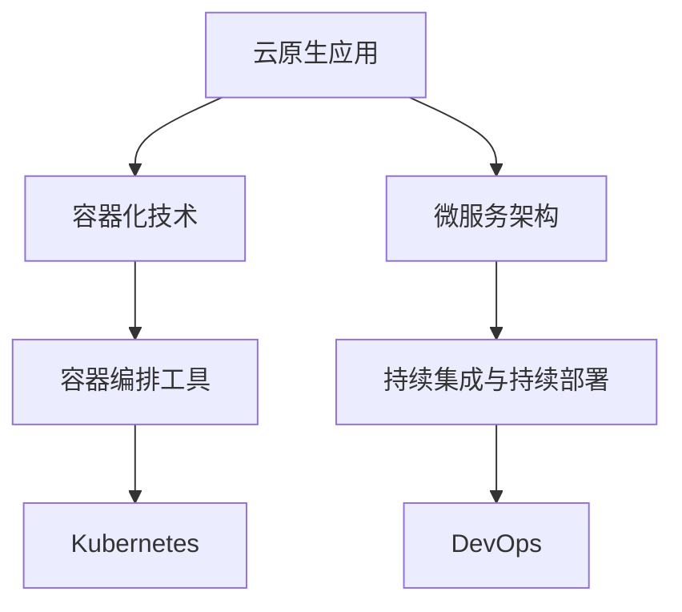

                 

### 《云原生应用开发：12因素应用方法论》

> **关键词：** 云原生、12因素、容器化、微服务、持续集成、持续部署

> **摘要：** 本文深入探讨云原生应用开发，特别是12因素应用方法论，包括其概念、架构设计、性能优化、安全性以及未来趋势。通过详细讲解核心概念、算法原理、项目实战，帮助开发者掌握云原生应用的构建与运维。

----------------------------------------------------------------

#### 引言

云原生（Cloud Native）是一种新兴的应用开发方法，它利用云计算的优势，使得应用能够快速、弹性地扩展，提高敏捷性和可维护性。随着容器技术、微服务架构和自动化工具的普及，云原生应用已经成为现代软件开发的趋势。本文将围绕云原生应用开发的核心方法——12因素应用方法论，展开深入探讨。

12因素应用方法论是由PaaS提供商Heroku提出的一套最佳实践，旨在指导开发者构建和部署云原生应用。它涵盖了应用开发中的诸多关键方面，如环境配置、依赖管理、服务发现、持续集成与持续部署等。本文将详细解读12因素的核心原则和应用场景，帮助开发者更好地理解和实践云原生应用开发。

文章结构如下：

1. **云原生应用概述**：介绍云原生技术的发展历程、特点以及典型应用场景。
2. **12因素应用方法论基础**：解读12因素概述、核心原则及其适用范围。
3. **云原生应用架构设计**：讲解容器与容器编排、云原生服务的构建与部署。
4. **云原生应用的持续集成与持续部署**：探讨CI/CD原理和实践。
5. **云原生应用的性能优化与安全性**：分析性能优化方法和安全威胁与防护。
6. **云原生应用的监控与故障处理**：构建监控体系与故障恢复策略。
7. **云原生应用开发实践**：通过实战案例展示云原生应用的构建过程。
8. **云原生应用的未来趋势**：展望云原生技术的发展方向和企业策略。
9. **附录**：提供云原生应用开发工具与资源。

通过本文的阅读，开发者将能够全面了解云原生应用开发的原理、方法和实践，为实际项目开发提供有力支持。

#### 第一部分：云原生应用概述

##### 第1章：云原生应用的概念与特点

云原生（Cloud Native）是一种利用云计算环境构建和运行应用程序的方法论，它强调应用的可扩展性、弹性、自动化和灵活性。云原生应用通常基于微服务架构，利用容器技术、服务网格和自动化工具实现高效、可靠的部署和管理。

**1.1 云原生技术的发展历程**

云原生概念起源于云计算和虚拟化技术的发展。以下是云原生技术发展的几个关键阶段：

1. **虚拟化技术**：虚拟化技术使得物理服务器可以虚拟化为多个虚拟机，提高了资源利用率和灵活性。
2. **容器技术**：容器技术（如Docker）提供了轻量级的虚拟化环境，使得应用程序及其依赖项可以被封装和独立运行。
3. **微服务架构**：微服务架构将大型应用程序分解为多个小型、独立的模块，每个模块负责一个特定的功能，便于管理和扩展。
4. **服务网格**：服务网格（如Istio）提供了分布式服务之间的通信和监控机制，增强了系统的可观测性和安全性。
5. **自动化工具**：自动化工具（如Kubernetes）提供了自动化部署、扩缩容、监控和管理的能力，提高了运维效率。

**1.2 云原生应用的优势与挑战**

云原生应用具有以下优势：

1. **可扩展性**：云原生应用可以轻松水平扩展，以满足不断增长的业务需求。
2. **弹性**：云原生应用能够自动适应资源需求的变化，确保系统的高可用性。
3. **灵活性**：云原生应用支持不同的运行环境，便于在不同的云平台和硬件上部署。
4. **敏捷性**：云原生应用的开发和部署周期更短，提高了开发和运维效率。
5. **可恢复性**：云原生应用具备自动恢复机制，能够快速从故障中恢复。

然而，云原生应用也面临一些挑战：

1. **复杂性**：云原生架构复杂，需要开发者具备一定的技能和经验。
2. **学习曲线**：云原生技术和工具繁多，开发者需要投入时间和精力进行学习和实践。
3. **成本**：云原生应用的初期投入较大，包括硬件、软件和培训等成本。
4. **安全性**：云原生环境需要加强安全管理，以防止数据泄露和攻击。

**1.3 云原生应用的典型应用场景**

云原生应用适用于多种场景，以下是其中几种典型的应用场景：

1. **互联网服务**：电商平台、社交媒体、在线视频等互联网服务可以通过云原生架构实现快速扩展和弹性部署。
2. **大数据与人工智能**：大数据处理和人工智能应用通常需要大量计算资源，云原生架构可以提供高效的计算和存储资源。
3. **移动应用**：移动应用的后端服务可以通过云原生架构实现高效、可靠的部署和管理。
4. **物联网**：物联网设备产生的海量数据可以通过云原生应用进行处理和分析。
5. **企业级应用**：企业级应用可以通过云原生架构实现灵活的部署和高效的运维。

总的来说，云原生应用开发已经成为现代软件开发的重要趋势，它为开发者提供了强大的工具和方法论，帮助他们构建灵活、可靠、高效的应用程序。

#### 12因素应用方法论基础

##### 第2章：12因素概述

12因素应用方法论是由PaaS提供商Heroku提出的一套最佳实践，旨在指导开发者构建和部署云原生应用。这个方法论不仅适用于初创公司，也为大型企业提供了可靠的指导。12因素涵盖了应用的各个方面，包括环境配置、依赖管理、服务发现、持续集成与持续部署等。

**2.1 12因素概述**

12因素包括以下内容：

1. **配置管理**：应用配置应存储在外部配置文件中，而不是硬编码在代码中。这有助于应用的灵活性和可维护性。
2. **依赖声明**：应用依赖应通过显式声明，而不是通过环境变量或外部脚本。这有助于确保依赖的一致性和可重现性。
3. **一次性部署**：部署过程应尽可能简单，不应包括安装或配置操作。这有助于加快部署速度并减少部署过程中的错误。
4. **执行环境**：应用应在容器化环境中运行，以确保环境的一致性和可移植性。
5. **备份和恢复**：应用应具备自动备份和恢复机制，以确保数据的安全和可靠性。
6. **日志记录**：应用应记录详细的日志，以便进行故障排除和性能分析。
7. **静态文件服务**：应用静态文件（如CSS、JavaScript和图像）应通过独立的静态文件服务器提供服务，以提高性能和可访问性。
8. **健康检查**：应用应定期进行健康检查，以确保服务的稳定性和可用性。
9. **基线代码**：应用应保持基线代码库，以方便版本控制和协同工作。
10. **自动化部署**：部署过程应自动化，以确保部署的可靠性和一致性。
11. **监控和报警**：应用应配备监控和报警系统，以便及时发现和解决问题。
12. **服务发现和配置管理**：应用应支持服务发现和配置管理，以便在分布式环境中自动发现和配置服务。

**2.2 12因素的核心原则**

12因素的核心原则包括以下几个方面：

1. **可移植性**：应用应在任何环境中都能运行，不受特定操作系统的限制。
2. **可扩展性**：应用应能够轻松水平扩展，以应对不断增长的业务需求。
3. **自动化**：部署、监控和故障恢复过程应尽可能自动化，以提高运维效率。
4. **可观测性**：应用应具备良好的日志记录和监控机制，以便进行故障排除和性能分析。
5. **可靠性**：应用应具备备份和恢复机制，以确保数据的安全和服务的稳定。

**2.3 12因素的适用范围与限制**

12因素适用于各种规模的应用，包括初创公司、中型企业和大型企业。以下是其适用范围和限制：

1. **适用范围**：
   - 初创公司：12因素有助于初创公司快速构建和部署应用，提高市场竞争力。
   - 中型企业：12因素可以帮助企业提高开发效率、降低运维成本，提高业务的灵活性。
   - 大型企业：12因素适用于大型企业的分布式应用架构，有助于提升系统的可靠性和可扩展性。

2. **限制**：
   - 学习成本：12因素涉及多个方面，开发者需要投入时间和精力进行学习和实践。
   - 技术栈依赖：12因素要求开发者具备一定的技术栈，如容器技术、微服务架构等。
   - 部署成本：初期部署需要一定的投入，包括硬件、软件和培训等成本。

总的来说，12因素应用方法论为开发者提供了一套完整的最佳实践，帮助他们构建灵活、可靠、高效的云原生应用。虽然适用过程中存在一定的挑战，但其带来的收益远远超过了成本。

#### 第二部分：云原生应用架构设计

##### 第3章：容器与容器编排

云原生应用的核心在于容器化，容器技术使得应用及其依赖项可以被封装在独立的运行环境中，确保了环境的一致性和可移植性。容器编排则是管理这些容器的过程，确保应用能够高效、可靠地运行。在这一章节中，我们将深入探讨容器与容器编排的基本概念、主要工具及其配置。

**3.1 容器的定义与特点**

容器是一种轻量级的、可移植的计算环境，它封装了应用程序及其依赖项，使得应用可以在不同的操作系统、硬件和云平台上运行。以下容器的主要特点：

1. **轻量级**：容器不包含操作系统，仅包含必要的运行时库和资源，因此具有非常低的资源占用。
2. **可移植性**：容器可以跨不同的操作系统和硬件平台运行，提高了应用的兼容性。
3. **隔离性**：容器通过命名空间和cgroup实现了资源隔离，确保了容器之间的相互独立。
4. **一致性**：容器提供了一个一致的环境，避免了因环境差异导致的问题。
5. **灵活性**：容器可以动态调整资源分配，提高了系统的可扩展性。

**3.2 容器编排工具介绍**

容器编排工具用于自动化管理容器的生命周期，包括部署、扩展、监控和故障恢复。目前最流行的容器编排工具包括Docker和Kubernetes。

**3.2.1 Docker**

Docker是一个开源的容器化平台，它提供了创建、运行和分发容器的工具。以下是Docker的一些关键特性：

1. **容器镜像**：Docker镜像是一个静态的文件系统，包含了应用程序及其依赖项。通过Dockerfile，开发者可以定义如何构建和配置容器镜像。
2. **容器管理**：Docker提供了命令行工具，用于创建、启动、停止、删除和管理容器。
3. **Docker Compose**：Docker Compose是一个用于定义和运行多容器Docker应用程序的工具。通过YAML文件，开发者可以定义服务、网络和卷等配置。
4. **容器网络**：Docker内置了容器网络功能，支持容器之间的通信和隔离。

**3.2.2 Kubernetes**

Kubernetes是开源的容器编排平台，由Google设计并维护。以下是Kubernetes的一些关键特性：

1. **集群管理**：Kubernetes管理多个节点上的容器，提供了节点调度、负载均衡和故障转移等功能。
2. **资源管理**：Kubernetes提供了资源管理功能，包括CPU、内存、存储等资源的分配和限制。
3. **服务发现和负载均衡**：Kubernetes提供了内置的服务发现和负载均衡功能，确保容器之间的通信和外部访问。
4. **部署和管理**：Kubernetes提供了部署、扩缩容、监控和故障恢复等管理功能，确保应用的高可用性和可靠性。
5. **插件和扩展**：Kubernetes支持各种插件和扩展，如监控、日志收集、网络策略和安全策略等。

**3.3 容器网络与存储配置**

容器网络和存储是容器编排的重要组成部分，它们决定了容器之间的通信和数据存储方式。

**3.3.1 容器网络**

容器网络配置决定了容器如何相互通信。以下是一些常见的容器网络配置方法：

1. **主机网络**：容器直接连接到宿主机的网络，具有宿主机的IP地址和端口。这种方法简单但容易导致端口冲突和网络隔离问题。
2. **桥接网络**：容器通过虚拟桥接设备连接到宿主机的网络，具有独立的IP地址和端口。这种方法提供了良好的隔离性，但需要配置桥接网络。
3. **overlay网络**：容器通过虚拟网络设备连接到宿主机的网络，支持跨宿主机通信。这种方法提供了灵活的网络拓扑，但需要额外的配置和管理。

**3.3.2 容器存储**

容器存储配置决定了容器如何存储和访问数据。以下是一些常见的容器存储配置方法：

1. **宿主机文件系统**：容器直接访问宿主机的文件系统。这种方法简单但不够灵活，容易导致数据丢失。
2. **卷（Volume）**：卷是一个可以独立于容器存在的存储实体，容器可以挂载卷来访问数据。卷可以持久化数据，即使在容器重启或删除后数据仍然存在。
3. **外部存储系统**：容器通过外部存储系统（如NFS、Ceph等）访问数据。这种方法提供了良好的扩展性和可靠性，但需要额外的配置和管理。

通过合理的容器网络和存储配置，开发者可以构建高效、可靠的云原生应用架构，确保容器之间良好的通信和数据存储。

在接下来的章节中，我们将进一步探讨云原生服务的构建与部署、持续集成与持续部署，以及性能优化与安全性等重要主题。

#### 第4章：云原生服务的构建与部署

云原生服务的构建与部署是确保应用在云环境中高效运行的关键环节。这一章节将详细讨论服务发现与负载均衡、容器化服务的部署与维护，以及CI/CD流程设计和日志管理等内容。

**4.1 服务发现与负载均衡**

在分布式系统中，服务发现和负载均衡是确保服务高可用性和性能的重要机制。

**服务发现**：服务发现是指自动识别和注册系统中的服务，以便客户端能够找到并调用它们。服务发现通常通过以下几种方式实现：

1. **基于文件的发现**：服务注册中心通过文件系统或配置中心存储服务信息，客户端定期查询文件或配置中心以获取服务地址。
2. **基于DNS的发现**：服务注册中心将服务信息注入到DNS服务器，客户端通过DNS查询获取服务地址。
3. **基于API的发现**：服务注册中心提供RESTful API，客户端通过调用API获取服务地址。

**负载均衡**：负载均衡是指将请求分布到多个服务实例上，以避免单个实例过载。负载均衡策略包括：

1. **轮询（Round Robin）**：将请求按顺序分配给每个服务实例。
2. **最少连接（Least Connections）**：将请求分配给当前连接数最少的服务实例。
3. **IP哈希（IP Hash）**：根据客户端IP地址进行哈希，将请求分配给具有相同哈希值的服务实例。

在现代云原生架构中，常见的负载均衡工具包括Kubernetes的Service和Ingress资源。Kubernetes Service提供内部负载均衡，将集群内的流量分配到不同的Pod。Ingress则用于管理外部访问，将HTTP/HTTPS请求转发到相应的服务。

**4.2 容器化服务的部署与维护**

容器化服务的部署与维护是云原生应用的重要组成部分，涉及CI/CD流程、监控和日志管理等多个方面。

**CI/CD流程设计**：CI/CD（持续集成/持续部署）是一种自动化软件交付流程，旨在加快开发周期、减少错误和提高代码质量。

1. **持续集成（CI）**：CI是指自动化构建和测试代码，确保代码库始终处于可发布状态。CI流程包括以下步骤：
   - 源代码获取：从版本控制系统（如Git）获取最新的代码。
   - 构建镜像：构建容器镜像，将代码和依赖项打包。
   - 测试：运行单元测试、集成测试等，确保代码质量。
   - 部署：将构建成功的镜像部署到测试或生产环境。

2. **持续部署（CD）**：CD是指自动化部署代码到生产环境，确保部署过程的可靠性和一致性。CD流程包括以下步骤：
   - 部署准备：更新依赖项、配置和资源。
   - 部署验证：确保部署成功，执行功能测试和性能测试。
   - 回滚策略：在部署失败时，自动回滚到上一个稳定版本。

为了实现CI/CD，常用的工具包括Jenkins、GitLab CI/CD、CircleCI等。这些工具支持自动化构建、测试和部署，减少了人为干预，提高了开发效率。

**监控与日志管理**：监控和日志管理是确保应用稳定运行的关键环节。

1. **监控**：监控是指实时跟踪应用的性能、健康状态和资源利用率。常用的监控工具包括Prometheus、Grafana、Zabbix等。这些工具可以收集和可视化应用指标，帮助开发者及时发现和解决问题。

2. **日志管理**：日志管理是指记录和存储应用运行过程中的日志信息，以便进行故障排除和性能分析。常用的日志管理工具包括ELK（Elasticsearch、Logstash、Kibana）堆栈、Graylog、Grafana Logs等。这些工具可以收集、存储和查询日志数据，提供实时分析和可视化。

通过合理的服务发现与负载均衡、CI/CD流程设计以及监控和日志管理，开发者可以构建高效、可靠的云原生服务，确保应用在云环境中稳定运行。

在下一章节中，我们将进一步探讨云原生应用的持续集成与持续部署，以及性能优化与安全性等重要主题。

#### 第5章：云原生应用的持续集成与持续部署

持续集成（Continuous Integration，CI）和持续部署（Continuous Deployment，CD）是现代软件开发中重要的实践方法，旨在加快软件交付速度，提高软件质量，并减少风险。在本章节中，我们将深入探讨CI/CD的原理、实践方法和最佳实践，以帮助开发者更好地实现云原生应用的持续集成与持续部署。

**5.1 持续集成（CI）原理与实践**

持续集成是一种软件开发实践，通过将开发者的代码定期合并到主干分支，并进行自动化构建和测试，确保代码库始终处于可发布状态。CI的核心目标是减少集成风险、提高代码质量、加快开发周期。

**CI原理：**

1. **代码合并**：开发者将代码提交到版本控制系统，如Git，CI系统会定期获取代码库的最新版本。
2. **自动化构建**：CI系统会自动构建代码，包括编译、打包和安装依赖项等，确保代码可以在环境中运行。
3. **测试执行**：CI系统会运行单元测试、集成测试和性能测试，验证代码的正确性和稳定性。
4. **反馈与报告**：测试结果会反馈给开发者和团队，报告包括通过和失败的测试用例，以及相关的错误信息。

**CI实践方法：**

1. **建立CI流程**：使用CI工具（如Jenkins、GitLab CI、CircleCI等）定义CI流程，包括构建脚本、测试脚本和部署脚本等。
2. **配置代码库**：将代码库连接到CI工具，配置触发规则，如定期触发或每次代码提交触发。
3. **自动化测试**：编写自动化测试脚本，包括单元测试、集成测试和性能测试，确保测试覆盖面广泛。
4. **反馈机制**：确保测试结果及时反馈给开发和测试团队，支持实时监控和问题跟踪。

**5.2 持续部署（CD）原理与实践**

持续部署是CI的延伸，它通过自动化部署代码到生产环境，确保部署过程的可靠性和一致性。CD的目标是减少手动部署环节，提高部署速度和可靠性。

**CD原理：**

1. **部署准备**：在部署前，CI系统会准备部署环境，包括配置、依赖项和资源。
2. **部署验证**：部署过程会执行一系列验证步骤，如健康检查、功能测试和性能测试，确保部署成功。
3. **回滚策略**：在部署失败时，CD系统会自动回滚到上一个稳定版本，确保系统的稳定性和可用性。

**CD实践方法：**

1. **部署脚本**：编写部署脚本，包括部署配置、部署步骤和验证步骤，确保部署过程自动化和可重复。
2. **自动化部署**：使用CI/CD工具（如Jenkins、GitLab CI/CD、AWS CodePipeline等）配置部署流程，确保部署自动化。
3. **环境隔离**：在部署过程中，使用隔离环境（如测试环境、预发布环境）进行验证，确保部署过程不会影响生产环境。
4. **监控与报警**：部署完成后，持续监控应用性能和稳定性，配置报警机制，及时发现和解决问题。

**5.3 DevOps文化与最佳实践**

DevOps是一种文化和实践方法，旨在通过协作和自动化，加快软件交付速度，提高软件质量。CI/CD是DevOps的重要组成部分，以下是一些DevOps文化和最佳实践：

1. **团队合作**：DevOps强调开发、测试、运维团队之间的紧密协作，打破组织壁垒，提高团队整体效率。
2. **自动化**：通过自动化工具和流程，减少手动操作，提高部署速度和可靠性。
3. **持续反馈**：持续收集反馈，包括用户反馈、监控数据等，及时调整和优化部署流程。
4. **持续学习**：不断学习和掌握新技术、新方法，提高团队的技术水平和竞争力。
5. **安全至上**：在CI/CD过程中，重视安全性，确保代码、配置和部署过程都符合安全标准。

通过持续集成与持续部署，开发者可以构建高效、可靠的云原生应用，加快软件交付速度，提高软件质量。同时，结合DevOps文化和最佳实践，可以进一步优化开发、测试和运维流程，提高团队的协作效率。

在下一章节中，我们将进一步探讨云原生应用的性能优化与安全性，以帮助开发者构建更加高效和安全的云原生应用。

#### 第6章：云原生应用性能优化

云原生应用的性能优化是确保其高效运行的关键。在这一章节中，我们将详细探讨应用性能优化的方法、调度策略与资源管理，以及网络性能优化等内容，帮助开发者提高云原生应用的整体性能。

**6.1 应用性能优化的方法与工具**

优化云原生应用性能的方法多种多样，以下是一些常见的方法和工具：

1. **代码优化**：通过对代码进行重构和优化，减少不必要的计算和资源消耗。例如，使用更高效的算法和数据结构，减少循环和递归调用等。

2. **数据库优化**：数据库是应用性能的关键因素之一。优化数据库查询、索引和缓存策略，可以提高数据库性能。此外，合理设计数据库表结构和索引，减少数据查询时间。

3. **缓存**：缓存是将常用数据存储在内存中的技术，可以显著提高应用响应速度。常用的缓存工具包括Redis、Memcached等。

4. **负载均衡**：通过负载均衡器，将请求分配到多个服务器实例上，避免单点过载，提高整体系统的性能和可用性。Kubernetes内置了负载均衡功能，可以使用Service和Ingress资源进行配置。

5. **监控系统**：使用性能监控系统（如Prometheus、Grafana等），实时监控应用的性能指标，如CPU使用率、内存使用率、响应时间等，及时发现性能瓶颈并进行优化。

**6.2 调度策略与资源管理**

调度策略和资源管理是优化云原生应用性能的重要方面。以下是一些常用的策略和工具：

1. **资源限制与分配**：在Kubernetes中，通过配置Pod的CPU和内存限制，确保应用在合理的资源范围内运行。资源限制可以防止应用占用过多资源，影响其他应用的性能。

2. **水平扩展**：通过自动扩缩容策略，根据负载情况动态增加或减少应用实例数量，确保系统在高负载下保持性能。Kubernetes的Horizontal Pod Autoscaler（HPA）提供了自动扩缩容功能。

3. **垂直扩展**：通过增加服务器的硬件资源（如CPU、内存、存储等），提高单个服务器的性能。在Kubernetes中，可以通过增加Node资源来支持更重的应用实例。

4. **调度器策略**：Kubernetes的调度器根据一系列策略将Pod调度到合适的节点上。常用的策略包括最匹配节点、负载均衡、Pod亲和性等。

5. **容器编排工具**：容器编排工具（如Kubernetes、Docker Swarm等）提供了丰富的调度和资源管理功能，帮助开发者优化应用性能。

**6.3 网络性能优化**

网络性能是云原生应用性能的关键因素之一。以下是一些常见的网络性能优化方法：

1. **服务网格**：服务网格（如Istio、Linkerd等）提供了分布式服务之间的通信和监控机制，可以提高网络性能和可观测性。服务网格通过控制流量流经特定的路径，优化服务之间的通信。

2. **负载均衡**：使用负载均衡器（如Kubernetes的Ingress、Nginx等）将请求分配到多个后端服务器实例上，减少单点瓶颈，提高网络性能。

3. **网络带宽优化**：通过增加网络带宽、使用更快的网络硬件设备，提高网络传输速度。在云环境中，可以使用云服务商提供的网络优化工具（如AWS VPC、Azure Load Balancer等）。

4. **DNS优化**：优化DNS解析速度和缓存策略，减少服务之间的通信延迟。

5. **网络监控**：使用网络监控工具（如Prometheus、NetFlow等），实时监控网络性能指标，如带宽利用率、延迟、丢包率等，及时发现和解决问题。

通过以上方法，开发者可以全面优化云原生应用的性能，确保其在高负载、高并发的情况下保持高效稳定运行。在下一章节中，我们将进一步探讨云原生应用的安全性，帮助开发者构建安全的云原生环境。

#### 第7章：云原生应用的安全性

随着云原生应用的普及，其安全性日益受到关注。云原生环境具有分布式、动态和弹性的特点，这为安全性带来了新的挑战。在这一章节中，我们将详细探讨云原生应用的安全威胁与防护、服务网格与安全策略，以及数据加密与访问控制等内容，帮助开发者构建安全的云原生应用。

**7.1 云原生应用的安全威胁与防护**

云原生应用面临多种安全威胁，包括以下几个方面：

1. **容器逃逸**：容器逃逸是指攻击者通过漏洞或恶意代码从容器中逃脱，获取宿主机的权限。防范容器逃逸的措施包括：
   - 限制容器权限：通过cgroup和命名空间限制容器访问宿主机的资源。
   - 使用最小权限原则：容器只具有执行其任务的最低权限。
   - 容器镜像扫描：定期扫描容器镜像，检测潜在的恶意代码或漏洞。

2. **应用程序漏洞**：云原生应用可能包含漏洞，如未授权访问、代码注入等。防范应用程序漏洞的措施包括：
   - 应用安全编码实践：遵循安全编码规范，避免常见的安全漏洞。
   - 定期安全审计和测试：对应用进行安全审计和渗透测试，及时发现和修复漏洞。
   - 使用安全依赖库：确保依赖库的安全性和可靠性。

3. **服务网格安全**：服务网格（如Istio、Linkerd等）提供了服务之间的通信，但也可能成为攻击目标。防范服务网格安全的措施包括：
   - 配置安全策略：通过定义服务间的访问控制策略，限制服务之间的通信。
   - 监控服务网格流量：使用监控工具（如Prometheus、Grafana等）实时监控服务网格流量，发现异常行为。

4. **数据泄露**：云原生应用在处理和存储数据时，可能面临数据泄露的风险。防范数据泄露的措施包括：
   - 数据加密：对敏感数据进行加密，确保数据在传输和存储过程中安全。
   - 访问控制：使用访问控制机制，确保只有授权用户可以访问敏感数据。

**7.2 服务网格与安全策略**

服务网格为云原生应用提供了分布式服务之间的通信和监控机制，同时也带来了安全挑战。以下是一些关键的安全策略：

1. **身份验证与授权**：服务网格通过身份验证和授权机制，确保只有授权的服务可以访问其他服务。常用的身份验证机制包括基于令牌的认证（如JWT）、基于证书的认证等。

2. **访问控制策略**：服务网格支持定义访问控制策略，限制服务之间的通信。策略可以基于服务名称、IP地址、用户角色等进行限制。

3. **加密通信**：服务网格使用TLS加密通信，确保服务之间的数据传输安全。同时，可以使用Mutual TLS（MTLS）确保双方身份的验证。

4. **安全审计**：服务网格提供了审计功能，记录服务之间的通信日志，方便进行安全监控和故障排查。

**7.3 数据加密与访问控制**

数据加密和访问控制是保障云原生应用数据安全的关键措施。以下是一些实现方法：

1. **数据加密**：在云原生应用中，可以使用以下方法对数据进行加密：
   - 传输加密：使用TLS等协议对数据传输进行加密。
   - 存储加密：使用加密存储（如AES）对存储在数据库或文件系统中的数据进行加密。
   - 数据库加密：使用数据库自身的加密功能，对敏感数据进行加密存储。

2. **访问控制**：访问控制是一种基于角色的权限管理机制，可以确保只有授权用户可以访问敏感数据。以下是一些访问控制的方法：
   - 基于角色的访问控制（RBAC）：根据用户的角色分配权限，确保用户只能访问其角色允许的数据。
   - 基于属性的访问控制（ABAC）：根据用户属性（如用户身份、时间、位置等）进行访问控制。
   - 多因素认证（MFA）：结合密码、指纹、短信验证码等多因素认证，提高访问安全性。

通过上述安全威胁与防护措施、服务网格安全策略以及数据加密与访问控制，开发者可以构建安全的云原生应用，保障数据安全和系统稳定性。在下一章节中，我们将探讨云原生应用的监控与故障处理，帮助开发者确保应用的高可用性和可靠性。

#### 第8章：云原生应用的监控与故障处理

云原生应用的高可用性和可靠性至关重要，因此在运行过程中，监控和故障处理是确保应用稳定运行的关键环节。在本章节中，我们将详细探讨云原生应用的监控体系构建、故障处理与恢复策略，以及持续反馈与改进的方法。

**8.1 监控体系构建**

构建一个有效的监控体系是确保云原生应用稳定运行的基础。以下是一些关键的监控要素：

1. **指标收集**：收集应用性能指标，如CPU使用率、内存使用率、磁盘I/O、网络流量等。常用的监控工具包括Prometheus、Grafana、Zabbix等。

2. **日志收集**：收集应用日志，包括错误日志、访问日志等。使用ELK（Elasticsearch、Logstash、Kibana）堆栈、Graylog、Grafana Logs等工具进行日志收集和分析。

3. **监控策略**：定义监控策略，包括阈值设置、告警规则等。根据应用的业务需求和运行状态，设置合理的监控阈值和告警规则，确保及时发现和响应异常情况。

4. **可视化与报警**：使用监控工具的可视化功能，将监控数据以图表、仪表板的形式展示，方便监控人员实时了解应用状态。配置报警机制，通过邮件、短信、电话等方式通知相关人员，确保及时处理异常。

5. **自动化监控**：通过脚本或CI/CD工具，实现自动化监控和报警，减少人为干预，提高监控效率。

**8.2 故障处理与恢复策略**

在云原生环境中，故障处理和恢复策略至关重要。以下是一些关键的故障处理步骤和恢复策略：

1. **故障检测**：通过监控工具和日志分析，及时发现故障信号。例如，CPU使用率异常升高、磁盘I/O过高等。

2. **故障隔离**：在确定故障范围后，隔离故障组件，避免影响其他正常运行的组件。在云原生环境中，容器编排工具（如Kubernetes）提供了良好的故障隔离机制。

3. **故障恢复**：根据故障类型和影响范围，采取相应的恢复措施。例如，重启故障容器、扩容节点、回滚部署等。在Kubernetes中，可以使用滚动更新、蓝绿部署等策略，确保故障恢复过程平滑、可靠。

4. **灾难恢复**：制定灾难恢复计划，包括备份数据、启用备用硬件、切换到备用环境等。在云原生环境中，可以使用多云部署、跨区域备份等技术，提高系统的灾难恢复能力。

5. **故障记录与总结**：记录故障处理过程和恢复结果，进行总结和分析，发现潜在问题，优化故障处理和恢复策略。

**8.3 持续反馈与改进**

持续反馈与改进是确保云原生应用稳定运行和不断提升的重要环节。以下是一些关键措施：

1. **用户反馈**：收集用户反馈，了解用户对应用的体验和意见，及时响应用户需求，优化产品功能。

2. **性能分析**：定期对应用性能进行分析，发现性能瓶颈和改进点，优化代码、数据库、缓存等。

3. **安全审计**：定期进行安全审计，检查应用的安全性，发现和修复安全漏洞。

4. **运维优化**：优化运维流程和工具，提高部署、扩缩容、监控等环节的效率。

5. **知识共享**：定期组织技术分享和培训，提升团队的技术水平和协作能力。

通过构建完善的监控体系、制定有效的故障处理和恢复策略，以及持续反馈与改进，开发者可以确保云原生应用的高可用性和可靠性，为用户提供稳定、高效的服务。

#### 第9章：云原生应用项目实战

在本文的最后一部分，我们将通过一个实际的云原生应用项目，展示如何从零开始构建和部署一个基于微服务架构的Web应用。这个项目将涵盖技术选型、架构设计、开发流程和工具链的搭建，以及性能优化和安全性考量等方面。

**9.1 项目背景与目标**

项目名称：一个在线购物平台，提供商品浏览、购物车、订单管理和用户注册等功能。

项目目标：
1. 构建一个可扩展、高可用、易于维护的微服务架构。
2. 实现快速开发、持续集成和自动化部署。
3. 保证应用的高性能和安全。

**9.2 技术选型与架构设计**

技术选型：

- **前端**：Vue.js框架，用于构建用户界面。
- **后端**：使用Spring Boot构建微服务，分别实现商品管理、订单管理、用户管理等模块。
- **数据库**：MySQL用于存储用户数据、商品信息和订单数据。
- **容器化**：使用Docker容器化应用，确保环境一致性和可移植性。
- **容器编排**：使用Kubernetes进行容器编排和管理。
- **服务网格**：使用Istio进行服务间的通信和安全控制。
- **CI/CD**：使用Jenkins进行持续集成和部署。
- **监控**：使用Prometheus和Grafana进行监控。

架构设计：

- **用户服务**：负责用户注册、登录、权限管理等。
- **商品服务**：负责商品信息的存储、查询和管理。
- **订单服务**：负责订单的创建、查询、支付处理等。
- **购物车服务**：负责用户购物车信息的存储和管理。
- **API网关**：使用Nginx作为API网关，负责路由请求和处理跨域请求。

**9.3 开发流程与工具链**

开发流程：

1. **需求分析**：与产品团队合作，明确项目需求和功能点。
2. **架构设计**：设计系统架构，确定技术选型和模块划分。
3. **编码与单元测试**：按照模块划分，进行编码和单元测试。
4. **集成测试**：将各个模块集成并进行测试，确保模块之间的接口正确。
5. **持续集成**：使用Jenkins实现持续集成，自动化构建、测试和部署。
6. **部署**：使用Kubernetes和Istio进行自动化部署和管理。

工具链搭建：

1. **代码仓库**：使用Git进行版本控制。
2. **Dockerfile**：编写Dockerfile文件，用于构建应用镜像。
3. **Kubernetes配置文件**：编写Kubernetes配置文件（如deployment.yaml、service.yaml），用于部署和管理应用。
4. **Jenkinsfile**：编写Jenkinsfile，定义CI/CD流程。
5. **监控配置**：配置Prometheus和Grafana，收集和展示应用性能指标。

**9.4 性能优化与安全性考量**

性能优化：

1. **缓存**：使用Redis缓存商品信息，减少数据库查询次数。
2. **数据库优化**：使用数据库连接池，优化数据库性能。
3. **负载均衡**：使用Nginx作为负载均衡器，将请求分配到多个后端服务实例上。
4. **网络优化**：使用服务网格（如Istio）优化服务间的通信。

安全性考量：

1. **身份验证与授权**：使用OAuth2.0和JWT进行用户身份验证和授权。
2. **加密**：对敏感数据进行加密，如用户密码、支付信息等。
3. **安全审计**：使用Istio进行安全审计，记录服务间的通信日志。
4. **访问控制**：使用Kubernetes RBAC进行访问控制，限制对资源的访问。
5. **安全培训**：定期进行安全培训，提高团队的安全意识。

通过以上步骤，开发者可以构建一个功能完善、性能优越、安全可靠的云原生应用。在实际项目开发过程中，还需不断优化和改进，以应对不断变化的需求和挑战。

### 第10章：云原生应用的未来趋势

随着云计算、容器技术和微服务架构的不断发展，云原生应用已经成为现代软件开发的主流趋势。在本章节中，我们将探讨云原生技术的最新发展、未来趋势，以及企业如何在云原生转型中制定策略。

**10.1 云原生技术的最新发展**

1. **服务网格**：服务网格（如Istio、Linkerd等）已经成为云原生技术的重要组成部分，它提供了分布式服务之间的通信和安全控制，提高了系统的可观测性和安全性。随着服务网格的成熟，未来将有更多的企业采用这一技术。

2. **边缘计算**：随着5G网络的推广，边缘计算逐渐成为云原生应用的新热点。边缘计算将计算和存储能力推向网络边缘，使得应用能够更快响应用户请求，提高用户体验。

3. **无服务器架构**：无服务器架构（Serverless）使得开发者无需管理底层基础设施，只需关注应用逻辑。随着Kubernetes Serverless项目（如Kubeless、Knative等）的发展，无服务器架构在云原生应用中的应用将更加广泛。

4. **混合云与多云**：企业越来越倾向于使用混合云和多云策略，以充分利用不同云服务的优势。混合云和多云环境下的云原生应用需要具备良好的可移植性和兼容性。

**10.2 云原生应用的未来展望**

1. **自动化**：随着人工智能和机器学习技术的发展，云原生应用的自动化程度将进一步提高。自动化工具和平台将帮助开发者简化开发、测试和运维流程，提高生产效率。

2. **实时性与可观测性**：未来云原生应用将更加注重实时性和可观测性。通过利用实时数据处理和分析技术，企业可以更快地响应用户需求，同时提高系统的可维护性和可扩展性。

3. **可持续性与环保**：随着环保意识的提高，云原生应用的发展也将更加注重可持续性和环保。利用云计算和容器技术的效率优势，企业可以减少资源浪费，降低碳排放。

4. **开发体验**：未来云原生应用的开发体验将更加友好。开发工具和平台将提供更丰富的功能，帮助开发者更快地构建和部署应用，降低开发门槛。

**10.3 企业在云原生转型中的策略与建议**

企业在进行云原生转型时，可以采取以下策略和建议：

1. **逐步转型**：云原生转型是一个长期的过程，企业应逐步推进，避免一次性全面转型带来的风险。可以从关键业务模块开始，逐步扩展到其他业务领域。

2. **团队培训**：云原生技术对开发者和运维人员提出了新的要求。企业应加强团队培训，提高团队的技术水平和实践经验。

3. **最佳实践**：遵循云原生最佳实践，如12因素应用方法论、容器编排和持续集成与持续部署等，可以提高云原生应用的构建和管理效率。

4. **安全与合规**：在云原生转型过程中，安全与合规是重中之重。企业应加强安全审计和监控，确保数据安全和隐私保护。

5. **持续优化**：云原生应用需要不断优化和改进。企业应持续跟踪新技术和新方法，结合业务需求进行技术迭代。

通过以上策略和建议，企业可以更好地实现在云原生环境下的转型，提高业务敏捷性和竞争力。

### 附录

**附录A：云原生应用开发工具与资源**

**A.1 主流云原生平台对比**

- **Kubernetes**：开源容器编排平台，提供了强大的自动化部署、扩展和管理功能。
- **Docker**：开源容器化平台，提供了容器镜像构建、运行和分发工具。
- **OpenShift**：基于Kubernetes的企业级容器平台，提供了丰富的开发生命周期工具。
- **EKS (Amazon Elastic Kubernetes Service)**：AWS提供的Kubernetes托管服务，简化了Kubernetes集群的管理。
- **Google Kubernetes Engine (GKE)**：Google提供的Kubernetes托管服务，提供了高性能和可扩展性。

**A.2 云原生应用开发工具**

- **Jenkins**：开源持续集成和持续部署工具，支持多种插件和集成。
- **GitLab CI/CD**：GitLab内置的持续集成和持续部署工具，支持自动化构建、测试和部署。
- **CircleCI**：云原生持续集成和持续部署平台，提供了灵活的工作流配置。
- **Docker Compose**：Docker提供的服务编排工具，用于定义和运行多容器Docker应用程序。
- **Kubernetes Dashboard**：Kubernetes提供的Web界面，用于管理和监控Kubernetes集群。

**A.3 云原生应用学习资源**

- **官方文档**：访问云原生相关项目的官方文档，获取最权威的技术指导。
- **在线教程**：各种在线平台（如Pluralsight、Udemy、Coursera）提供了丰富的云原生教程。
- **社区论坛**：参与云原生社区论坛（如Kubernetes Slack社区、Reddit、Stack Overflow），与开发者交流经验。
- **技术博客**：阅读技术博客（如Medium、Dev.to、DZone）中的云原生相关文章，了解最新动态。

通过以上工具和资源，开发者可以更好地掌握云原生应用开发的技能，加速项目开发过程。

### 核心概念与联系

**Mermaid 流程图**



通过这个流程图，我们可以清晰地看到云原生应用的核心概念及其相互关系。容器化技术提供了应用的封装和隔离，微服务架构实现了模块化的业务功能，容器编排工具（如Kubernetes）负责管理和调度容器，持续集成与持续部署（CI/CD）确保了快速交付，DevOps文化推动了开发与运维的融合。

### 核心算法原理讲解

**伪代码**

```plaintext
// 容器编排算法伪代码
function scheduleContainers(availableResources, containerRequirements):
    for each container in containerRequirements:
        if availableResources >= containerRequirements:
            allocateResource(availableResources, containerRequirements)
            deployContainer(container)
        else:
            return "Insufficient resources for container deployment"
    return "All containers deployed successfully"
```

**详细讲解：**

- **输入参数**：`availableResources` 表示当前集群中可用的资源，如CPU、内存等；`containerRequirements` 表示容器所需的资源。
- **算法逻辑**：遍历每个容器，检查其资源需求是否小于等于集群可用资源。如果满足，则为其分配资源并部署容器；否则，返回资源不足的错误信息。
- **输出结果**：如果所有容器部署成功，返回 "All containers deployed successfully"；否则，返回 "Insufficient resources for container deployment"。

### 数学模型和数学公式 & 详细讲解 & 举例说明

**数学公式**

$$
C = \frac{\sum_{i=1}^{n} (R_i \cdot P_i)}{T}
$$

**详细讲解：**

- $C$ 表示容器部署的总成本。
- $R_i$ 表示第 $i$ 个容器的资源需求，如CPU、内存等。
- $P_i$ 表示第 $i$ 个容器的定价。
- $T$ 表示总的可用资源。

**举例说明：**

假设有3个容器，资源需求和定价如下：

- 容器1：$R_1 = 2$（CPU核心），$P_1 = 5$（美元/核心/小时）
- 容器2：$R_2 = 4$（CPU核心），$P_2 = 10$（美元/核心/小时）
- 容器3：$R_3 = 1$（CPU核心），$P_3 = 3$（美元/核心/小时）

总资源 $T = 10$ CPU核心。

**计算总成本：**

$$
C = \frac{(2 \cdot 5) + (4 \cdot 10) + (1 \cdot 3)}{10} = \frac{10 + 40 + 3}{10} = 5.3
$$

因此，总成本为5.3美元每小时。

### 项目实战

**实战目标：** 使用Kubernetes部署一个简单的Web应用。

**开发环境搭建：**

- **环境要求**：Docker、Kubernetes 1.23及以上版本。
- **安装Docker**：在所有节点上安装Docker，确保其版本在19.03及以上。

```shell
sudo apt-get update
sudo apt-get install docker-ce docker-ce-cli containerd.io
sudo systemctl enable docker
sudo systemctl start docker
```

- **安装Kubernetes**：使用kubeadm工具安装Kubernetes集群。以下步骤以单节点集群为例。

```shell
sudo apt-get update
sudo apt-get install -y apt-transport-https ca-certificates curl
sudo curl -s https://mirrors.aliyun.com/kubernetes/apt/doc/apt-key.gpg | sudo apt-key add -
sudo cat <<EOF | sudo tee /etc/apt/sources.list.d/kubernetes.list
deb https://mirrors.aliyun.com/kubernetes/apt/ kubernetes-xenial main
EOF
sudo apt-get update
sudo apt-get install -y kubelet kubectl
sudo apt-mark hold kubelet kubectl
```

- **启动集群**：初始化Kubernetes集群。

```shell
sudo kubeadm init --pod-network-cidr=10.244.0.0/16
```

- **配置kubectl**：将当前用户添加到集群权限管理组。

```shell
sudo mkdir -p $HOME/.kube
sudo cp -i /etc/kubernetes/admin.conf $HOME/.kube/config
sudo chown $(id -u):$(id -g) $HOME/.kube/config
```

- **安装Pod网络插件**：这里使用Calico作为Pod网络插件。

```shell
kubectl apply -f https://docs.projectcalico.org/manifests/calico.yaml
```

**源代码详细实现和代码解读：**

**Dockerfile：**

```Dockerfile
# 使用官方Python镜像作为基础
FROM python:3.9-slim

# 设置工作目录
WORKDIR /app

# 将当前目录的代码复制到容器内
COPY . .

# 安装依赖
RUN pip install flask

# 运行Flask应用
CMD ["flask", "run", "--host=0.0.0.0"]
```

**代码解读与分析：**
- **Dockerfile：** 此Dockerfile定义了一个基于Python 3.9-slim的镜像。首先设置工作目录为`/app`，然后将应用源代码复制到该目录。接下来安装Flask依赖项，并设置CMD指令以启动Flask应用。

**应用部署文件（k8s-deployment.yaml）：**

```yaml
apiVersion: apps/v1
kind: Deployment
metadata:
  name: web-app
spec:
  replicas: 2
  selector:
    matchLabels:
      app: web-app
  template:
    metadata:
      labels:
        app: web-app
    spec:
      containers:
      - name: web-app
        image: web-app:latest
        ports:
        - containerPort: 80
```

**代码解读与分析：**
- **k8s-deployment.yaml：** 此部署文件定义了一个名为`web-app`的 Deployment，目标是部署2个副本。选择器标签用于匹配容器，模板部分定义了容器的标签和配置。容器名为`web-app`，使用最新的镜像版本，并暴露端口80以供外部访问。

**部署步骤：**
1. **构建并推送Docker镜像**：

```shell
docker build -t web-app:latest .
docker push web-app:latest
```

2. **应用部署文件**：

```shell
kubectl apply -f k8s-deployment.yaml
```

3. **验证部署**：

```shell
kubectl get pods
kubectl get svc
```

**验证部署：**
- 使用`kubectl get pods`查看Pod的状态，确保它们都处于`Running`状态。
- 使用`kubectl get svc`查看Service的状态，确保它成功创建了NodePort或LoadBalancer类型的Service。

通过以上步骤，我们成功部署了一个简单的Web应用，并验证了其正常运行。这只是一个基础示例，实际应用开发中可能需要更复杂的配置和优化。

