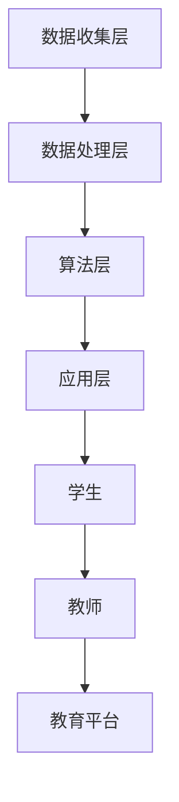
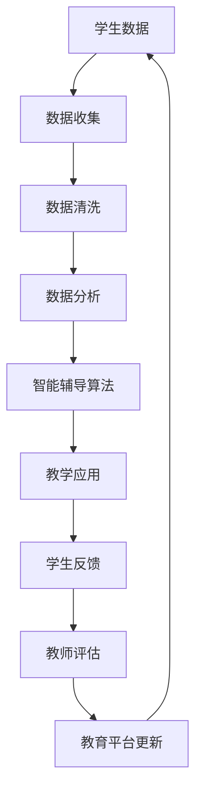
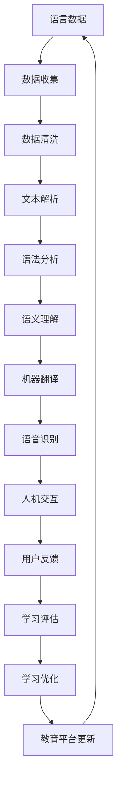
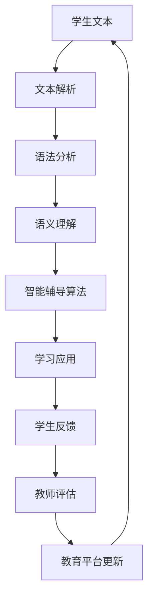
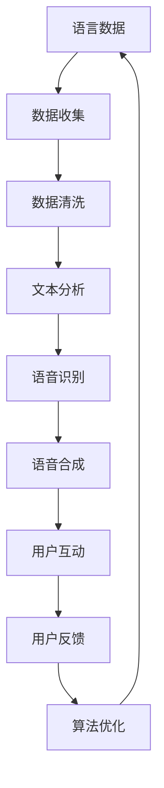
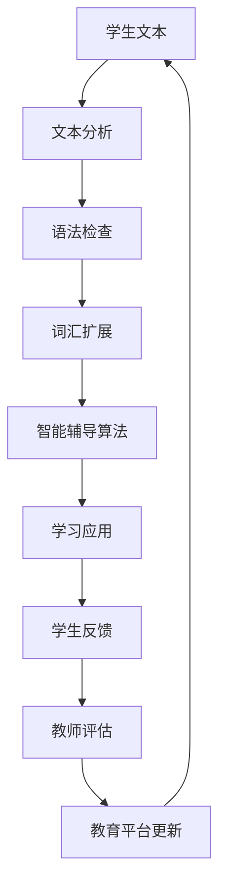
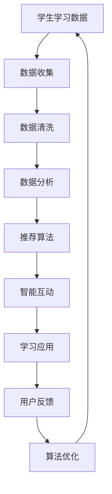
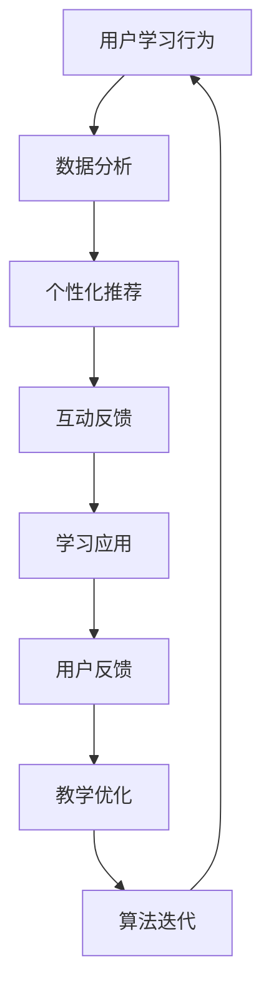
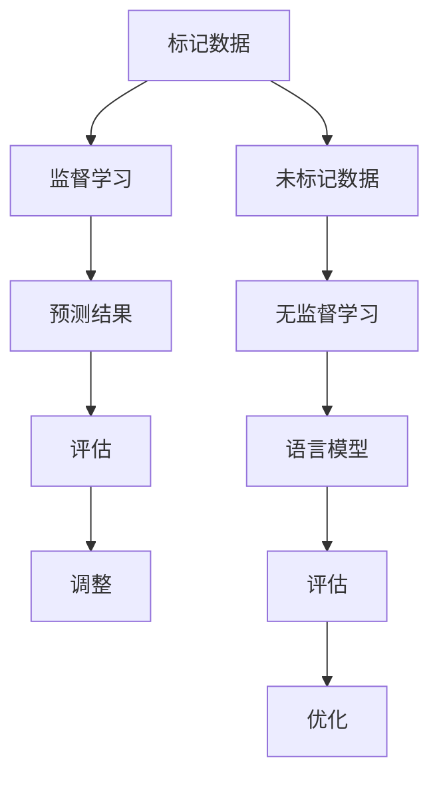
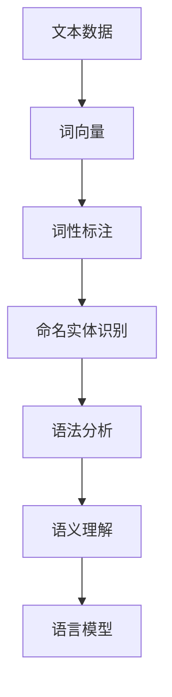

                 

# 人工智能在教育和语言学习中的应用

## 关键词：
人工智能、教育、语言学习、应用、算法、项目实战、数学模型

## 摘要：
本文将深入探讨人工智能在教育和语言学习中的应用。通过分析人工智能在教育中的核心概念与联系，以及其在语言学习中的核心算法原理和项目实战，我们将展现人工智能如何提升教育质量和语言学习效果。文章涵盖了人工智能在教育课程设计与教学、语言学习辅助工具和在线教育平台中的具体应用，为读者提供了全面而深入的了解。

### 目录大纲

#### 第一部分：引言
1. 第1章：人工智能在教育和语言学习中的现状与机遇
2. 第2章：人工智能在教育中的核心概念与联系
3. 第3章：人工智能在语言学习中的核心概念与联系

#### 第二部分：人工智能在教育中的应用
4. 第4章：人工智能在教育课程设计与教学中的应用
5. 第5章：人工智能在语言学习辅助工具中的应用
6. 第6章：人工智能在在线教育平台中的应用

#### 第三部分：人工智能在语言学习中的核心算法原理讲解
7. 第7章：人工智能在语言学习中的核心算法原理
8. 第8章：人工智能在语言学习中的数学模型和数学公式

#### 第四部分：人工智能在语言学习中的项目实战
9. 第9章：人工智能在语言学习中的项目实战
10. 第10章：开发环境搭建与源代码详细实现

#### 附录
11. 附录A：人工智能在教育和语言学习中的应用资源与工具

### 第一部分：引言

#### 第1章：人工智能在教育和语言学习中的现状与机遇

人工智能（AI）作为一种新兴技术，正在全球范围内迅速发展，并对多个行业产生了深远影响。在教育和语言学习领域，人工智能的应用同样具有重要意义。本章节将探讨人工智能在教育中的应用现状，以及其在语言学习中的应用现状，并分析人工智能在教育和语言学习中的机遇与挑战。

#### 1.1 人工智能在教育中的应用现状

随着人工智能技术的不断发展，其在教育领域的应用也日益广泛。目前，人工智能在教育中的应用主要集中在以下几个方面：

1. **个性化学习**：通过分析学生的学习数据，人工智能可以为学生提供个性化的学习路径，提高学习效果。
2. **智能辅导**：人工智能可以为学生提供实时辅导，解答学生在学习过程中遇到的问题。
3. **教育数据分析**：人工智能可以分析学生的教育数据，帮助教师了解学生的学习情况，制定更有效的教学策略。
4. **智能教育内容推荐**：人工智能可以根据学生的学习兴趣和需求，推荐合适的学习资源。

#### 1.2 人工智能在语言学习中的应用现状

在语言学习领域，人工智能的应用同样具有重要价值。目前，人工智能在语言学习中的应用主要包括以下几个方面：

1. **语言翻译**：人工智能可以帮助用户实现实时翻译，提高跨语言沟通的效率。
2. **语言学习辅助工具**：例如语音识别技术可以用于语音训练，自然语言处理技术可以用于文本解析和语法分析。
3. **智能对话系统**：通过对话系统，学生可以与人工智能进行互动，提高语言实践能力。
4. **自适应学习系统**：根据学生的学习情况，人工智能可以为学生提供个性化的学习建议和练习。

#### 1.3 人工智能在教育和语言学习中的机遇与挑战

人工智能在教育和语言学习中的应用带来了许多机遇，但同时也面临一些挑战：

1. **机遇**：
   - **提高教育质量**：人工智能可以通过个性化学习和智能辅导等方式，提高教育的质量和效果。
   - **促进跨文化交流**：语言翻译和智能对话系统可以帮助人们更方便地进行跨文化交流。
   - **降低教育成本**：通过在线教育平台和智能辅导系统，可以降低教育的成本。

2. **挑战**：
   - **数据隐私和安全**：教育数据涉及到学生的隐私，如何确保数据的安全成为了一个重要问题。
   - **技术伦理**：人工智能在教育中的应用需要考虑伦理问题，如算法歧视、数据滥用等。
   - **教师与学生的接受程度**：教师和学生对新技术的接受程度不同，如何有效地推广和应用人工智能技术是一个挑战。

在本章节中，我们概述了人工智能在教育和语言学习中的应用现状以及面临的机遇与挑战。在接下来的章节中，我们将进一步探讨人工智能在教育中的核心概念与联系，以及在语言学习中的核心概念与联系，帮助读者更深入地了解这一领域的发展和应用。

### 第一部分：引言

#### 第2章：人工智能在教育中的核心概念与联系

人工智能在教育中的应用涵盖了多个核心概念和关键技术。本章节将详细探讨人工智能在教育中的应用原理、架构，并通过 Mermaid 流程图展示其工作流程，帮助读者理解人工智能在教育中的具体实现和应用。

#### 2.1 人工智能在教育中的应用原理

人工智能在教育中的应用主要基于以下几个核心原理：

1. **数据驱动**：人工智能通过收集和分析学生的数据，了解学生的学习情况，为个性化教学提供支持。
2. **机器学习**：人工智能利用机器学习算法，从大量数据中提取模式和知识，实现智能推荐和预测。
3. **自然语言处理**：自然语言处理技术可以用于文本解析、语音识别和语言翻译等，提高教育的交互性和便捷性。
4. **人机交互**：通过智能对话系统和虚拟助手，实现教师和学生之间的智能互动，提高教学效率。

#### 2.2 人工智能在教育中的架构

人工智能在教育中的架构可以分为以下几个层次：

1. **数据收集层**：通过各种传感器和工具收集学生的行为数据、学习记录等。
2. **数据处理层**：利用数据清洗、存储和分析技术，处理和挖掘数据中的有用信息。
3. **算法层**：应用机器学习和自然语言处理算法，对数据进行分析和预测，为教学提供支持。
4. **应用层**：通过教育软件和平台，将人工智能技术应用于实际教学过程，实现个性化学习和智能辅导。

以下是人工智能在教育中的 Mermaid 流程图：



在这个流程图中，数据从学生和教师收集到，经过数据处理层进行分析和挖掘，然后通过算法层进行处理，最终在应用层实现个性化学习和智能辅导，为教育提供支持。

#### 2.3 人工智能在教育中的 Mermaid 流程图

以下是一个简化的 Mermaid 流程图，展示了人工智能在教育中的应用流程：



在这个流程图中，学生数据首先被收集，然后进行数据清洗和分析，利用智能辅导算法生成个性化教学建议，最终通过教育平台应用于教学过程。学生和教师的反馈则用于评估和优化教学效果。

通过以上对人工智能在教育中的核心概念与联系的探讨，我们可以看到，人工智能在教育中的应用不仅能够提高教育质量，还能够实现个性化教学和智能辅导。在下一章节中，我们将继续探讨人工智能在语言学习中的核心概念与联系，帮助读者更全面地了解人工智能在教育领域的应用。

### 第一部分：引言

#### 第3章：人工智能在语言学习中的核心概念与联系

人工智能在语言学习中的应用正在迅速发展，其核心概念和关键技术对语言学习产生了深远的影响。本章节将详细探讨人工智能在语言学习中的应用原理、架构，并通过 Mermaid 流程图展示其工作流程，帮助读者理解人工智能在语言学习中的具体实现和应用。

#### 3.1 人工智能在语言学习中的应用原理

人工智能在语言学习中的应用基于以下几个核心原理：

1. **自然语言处理（NLP）**：自然语言处理是人工智能在语言学习中的核心技术，包括文本解析、语法分析、语义理解和机器翻译等。
2. **机器学习**：机器学习算法可以帮助人工智能从大量的语言数据中学习规律，实现语言生成、理解和预测等功能。
3. **深度学习**：深度学习是一种强大的机器学习技术，通过多层神经网络，实现更高级别的语言理解和生成。
4. **语音识别**：语音识别技术可以将语音转换为文本，用于语音训练和语音生成。
5. **人机交互**：通过智能对话系统和虚拟助手，实现人与机器的自然语言交互，提高语言学习的效果。

#### 3.2 人工智能在语言学习中的架构

人工智能在语言学习中的架构可以分为以下几个层次：

1. **数据收集层**：通过各种工具和传感器收集语言学习数据，包括文本、语音和用户行为数据。
2. **数据处理层**：利用数据清洗、存储和分析技术，处理和挖掘数据中的有用信息。
3. **算法层**：应用自然语言处理和机器学习算法，对数据进行分析和预测，为语言学习提供支持。
4. **应用层**：通过语言学习软件和平台，将人工智能技术应用于实际的语言学习过程。

以下是人工智能在语言学习中的 Mermaid 流程图：



在这个流程图中，语言数据从收集、清洗、处理到应用，各个环节都充分利用了人工智能技术，为语言学习提供全方位的支持。

#### 3.3 人工智能在语言学习中的 Mermaid 流程图

以下是一个简化的 Mermaid 流程图，展示了人工智能在语言学习中的应用流程：



在这个流程图中，学生文本首先经过文本解析、语法分析和语义理解，然后通过智能辅导算法生成个性化学习建议，最终应用于学习过程。学生和教师的反馈则用于评估和优化学习效果。

通过以上对人工智能在语言学习中的核心概念与联系的探讨，我们可以看到，人工智能在语言学习中的应用不仅能够提高学习效果，还能够实现个性化学习、智能辅导和跨语言沟通。在下一章节中，我们将深入探讨人工智能在教育课程设计与教学中的应用，进一步揭示人工智能在教育和语言学习中的无限潜力。

### 第二部分：人工智能在教育中的应用

#### 第4章：人工智能在教育课程设计与教学中的应用

人工智能在教育中的应用正在逐渐改变传统的教育模式，提升教育质量和效果。在本章节中，我们将深入探讨人工智能如何应用于教育课程设计与教学，包括个性化教学、作业与考试以及教育数据分析等方面。

#### 4.1 人工智能在教育课程设计中的应用

人工智能在教育课程设计中的应用主要体现在以下几个方面：

1. **课程个性化**：通过分析学生的学习数据，人工智能可以帮助教师了解每个学生的学习情况，从而设计出更符合学生需求和学习特点的课程。例如，利用推荐算法，为不同学生推荐合适的学习资源和课程内容。
   
   ```mermaid
   graph TD
   A[学生数据] --> B[数据分析]
   B --> C[学习兴趣]
   C --> D[知识水平]
   D --> E[推荐算法]
   E --> F[个性化课程]
   ```

2. **课程内容优化**：人工智能可以通过分析大量教育数据，识别出课程中的薄弱环节和常见问题，帮助教师优化课程内容，提高教学效果。例如，通过文本挖掘和自然语言处理技术，分析学生的作业和讨论，找出课程内容中的难点和重点。

   ```mermaid
   graph TD
   A[学生作业] --> B[文本挖掘]
   B --> C[知识点识别]
   C --> D[课程内容优化]
   ```

3. **课程评估与反馈**：人工智能可以实时评估学生的学习进度和效果，为教师提供详细的课程评估报告和反馈，帮助教师调整教学策略。例如，通过数据分析，识别出学生在学习过程中的瓶颈，为教师提供针对性的指导和建议。

   ```mermaid
   graph TD
   A[学习进度] --> B[数据分析]
   B --> C[评估报告]
   C --> D[教师反馈]
   ```

#### 4.2 人工智能在个性化教学中的应用

个性化教学是人工智能在教育中应用的重要方向，通过以下方式提升教学效果：

1. **学习路径推荐**：人工智能可以根据学生的学习兴趣、学习速度和能力，推荐最适合的学习路径和资源。例如，利用推荐系统，为学生推荐适合的阅读材料、视频课程和在线练习。

   ```mermaid
   graph TD
   A[学生数据] --> B[推荐算法]
   B --> C[学习路径]
   ```

2. **实时学习反馈**：人工智能可以实时监测学生的学习过程，提供即时的反馈和指导。例如，通过自然语言处理技术，分析学生的作业和讨论，识别出学生的错误和疑惑，提供针对性的辅导和建议。

   ```mermaid
   graph TD
   A[学生作业] --> B[自然语言处理]
   B --> C[错误识别]
   C --> D[实时反馈]
   ```

3. **自适应学习**：人工智能可以根据学生的学习情况和反馈，自动调整教学内容和难度，实现真正的个性化教学。例如，通过自适应学习算法，根据学生的学习进度和理解能力，动态调整练习题的难度和类型。

   ```mermaid
   graph TD
   A[学习进度] --> B[自适应算法]
   B --> C[内容调整]
   ```

#### 4.3 人工智能在作业与考试中的应用

人工智能在作业与考试中的应用，旨在提高作业和考试的效率和质量：

1. **自动批改**：通过自然语言处理和计算机视觉技术，人工智能可以自动批改学生的作业，节省教师的时间和精力。例如，利用文本相似度算法，检测学生的抄袭行为，提高作业的原创性。

   ```mermaid
   graph TD
   A[学生作业] --> B[文本相似度]
   B --> C[抄袭检测]
   ```

2. **智能评估**：人工智能可以分析学生的考试成绩，识别出考试中的常见问题和薄弱环节，为教师提供详细的考试分析报告。例如，利用数据分析技术，识别出考试中的难题和易错题，为教师提供改进建议。

   ```mermaid
   graph TD
   A[学生成绩] --> B[数据分析]
   B --> C[考试分析]
   ```

3. **个性化考试**：人工智能可以根据学生的学习情况和反馈，为学生提供个性化的考试内容。例如，通过自适应考试算法，根据学生的知识水平和学习进度，动态调整考试难度和题型，实现真正的个性化考试。

   ```mermaid
   graph TD
   A[学习进度] --> B[自适应算法]
   B --> C[考试内容]
   ```

#### 4.4 人工智能在教育数据分析中的应用

人工智能在教育数据分析中的应用，旨在通过数据驱动教学，提高教育决策的准确性和科学性：

1. **学生学习数据分析**：通过分析学生的学习行为和数据，人工智能可以了解学生的学习习惯、兴趣和需求，为教育决策提供依据。例如，通过数据分析，识别出学生的薄弱环节和需要加强的领域。

   ```mermaid
   graph TD
   A[学习行为数据] --> B[数据分析]
   B --> C[学习分析报告]
   ```

2. **教学质量评估**：人工智能可以通过分析教学数据，评估教师的教学质量和效果，为教师提供反馈和建议。例如，通过分析课堂互动数据，识别出教师的教学优势和改进方向。

   ```mermaid
   graph TD
   A[教学数据] --> B[数据分析]
   B --> C[教学质量评估]
   ```

3. **教育政策分析**：人工智能可以通过分析大量的教育数据，为教育政策的制定和调整提供科学依据。例如，通过数据分析，评估不同教育政策对教育质量和效果的影响，为政策制定者提供参考。

   ```mermaid
   graph TD
   A[教育政策数据] --> B[数据分析]
   B --> C[政策分析报告]
   ```

通过以上对人工智能在教育课程设计与教学中的应用的探讨，我们可以看到，人工智能在教育中的应用不仅能够提高教育质量和效果，还能够实现个性化教学、自动批改、智能评估和数据分析等。在下一章节中，我们将继续探讨人工智能在语言学习辅助工具中的应用，进一步揭示人工智能在教育和语言学习中的无限潜力。

### 第二部分：人工智能在教育中的应用

#### 第5章：人工智能在语言学习辅助工具中的应用

随着人工智能技术的发展，人工智能在语言学习辅助工具中的应用越来越广泛，为学习者提供了更加个性化和高效的辅助。本章节将深入探讨人工智能在语言学习辅助工具中的应用原理、架构以及具体的应用案例。

#### 5.1 人工智能在语言学习辅助工具中的应用原理

人工智能在语言学习辅助工具中的应用主要基于以下几个核心原理：

1. **自然语言处理（NLP）**：自然语言处理是人工智能在语言学习辅助工具中的核心技术，包括文本分析、语音识别和语音合成等。通过NLP技术，可以实现对文本和语音的理解和生成，为学习者提供实时反馈和辅导。

2. **机器学习**：机器学习算法可以帮助人工智能从大量的语言数据中学习语言模式和规则，实现智能化的语言理解和生成。例如，通过机器学习算法，可以训练出能够识别不同语言风格的模型，为学习者提供个性化的辅导。

3. **深度学习**：深度学习是机器学习的一种高级形式，通过多层神经网络，可以实现更高级别的语言理解和生成。例如，通过深度学习模型，可以实现自然语言生成，为学习者提供更加真实的语言学习体验。

4. **语音识别与合成**：语音识别技术可以将语音转换为文本，语音合成技术可以将文本转换为语音。通过这些技术，可以创建交互式的语言学习环境，帮助学习者进行语音训练和对话练习。

#### 5.2 人工智能在语言学习辅助工具中的架构

人工智能在语言学习辅助工具中的架构可以分为以下几个层次：

1. **数据收集层**：通过传感器和工具收集语言学习者的数据，包括文本、语音和用户行为等。

2. **数据处理层**：利用数据清洗、存储和分析技术，处理和挖掘数据中的有用信息，为后续的机器学习和深度学习提供支持。

3. **算法层**：应用自然语言处理、机器学习和深度学习算法，对数据进行分析和预测，为语言学习提供智能化的支持和辅导。

4. **应用层**：通过语言学习软件和平台，将人工智能技术应用于实际的语言学习过程，实现交互式的语言学习和练习。

以下是人工智能在语言学习辅助工具中的 Mermaid 流程图：



在这个流程图中，语言数据从收集、清洗、处理到应用，各个环节都充分利用了人工智能技术，为语言学习提供全方位的支持。

#### 5.3 人工智能在语言学习辅助工具中的 Mermaid 流程图

以下是一个简化的 Mermaid 流程图，展示了人工智能在语言学习辅助工具中的应用流程：



在这个流程图中，学生文本首先经过文本分析、语法检查和词汇扩展，然后通过智能辅导算法生成个性化学习建议，最终应用于学习过程。学生和教师的反馈则用于评估和优化学习效果。

#### 5.4 人工智能在语言学习辅助工具中的具体应用案例

1. **智能语音助手**：智能语音助手可以为学生提供实时语音辅导，帮助学生进行口语训练。例如，通过语音识别技术，智能语音助手可以实时听取学生的发音，通过自然语言处理技术，分析发音的正确性，并提供纠正和建议。

2. **个性化阅读助手**：个性化阅读助手可以根据学生的阅读水平和兴趣，推荐适合的阅读材料。例如，通过文本分析技术，分析学生的阅读习惯和兴趣，推荐相关主题的阅读材料，帮助学生拓展阅读视野。

3. **语法检查工具**：语法检查工具可以自动检查学生的语法错误，并提供修正建议。例如，通过自然语言处理技术，分析学生的句子结构，识别出语法错误，并提供正确的语法结构和用法。

4. **词汇学习工具**：词汇学习工具可以帮助学生记忆和掌握新的词汇。例如，通过机器学习技术，分析学生的词汇学习数据，识别出记忆难点和薄弱环节，提供针对性的词汇练习和记忆策略。

通过以上对人工智能在语言学习辅助工具中的应用原理、架构和应用案例的探讨，我们可以看到，人工智能在语言学习辅助工具中的应用不仅能够提高学习效率，还能够实现个性化学习和智能辅导。在下一章节中，我们将探讨人工智能在在线教育平台中的应用，进一步揭示人工智能在教育和语言学习中的无限潜力。

### 第二部分：人工智能在教育中的应用

#### 第6章：人工智能在在线教育平台中的应用

随着互联网技术的发展，在线教育逐渐成为教育行业的重要组成部分。人工智能（AI）在在线教育平台中的应用，进一步提升了教育的灵活性和个性化，使得学习体验更加丰富和高效。本章节将深入探讨人工智能在在线教育平台中的应用原理、架构及其具体应用实例。

#### 6.1 人工智能在在线教育平台中的应用原理

人工智能在在线教育平台中的应用原理主要基于以下几个方面：

1. **个性化学习**：通过分析学生的学习行为数据，人工智能可以为学生推荐个性化的学习资源和教学路径，从而提高学习效果。

2. **智能推荐**：基于机器学习和深度学习算法，人工智能可以分析用户的历史行为和偏好，实现精准的学习资源推荐。

3. **互动与反馈**：人工智能可以通过自然语言处理和语音识别等技术，实现与学生的智能互动，提供即时反馈，增强学习体验。

4. **数据挖掘与分析**：通过大数据分析技术，人工智能可以挖掘学生的学习行为数据，为教学决策提供支持，优化教育过程。

#### 6.2 人工智能在在线教育平台中的架构

人工智能在在线教育平台中的架构通常包括以下几个层次：

1. **数据收集层**：通过在线学习平台，收集学生的行为数据，如学习进度、学习时长、互动频率等。

2. **数据处理层**：利用数据清洗、存储和分析技术，处理和挖掘数据中的有用信息，为后续的机器学习和深度学习提供支持。

3. **算法层**：应用机器学习和深度学习算法，对数据进行分析和预测，为个性化学习、智能推荐和互动反馈提供支持。

4. **应用层**：通过在线学习平台，将人工智能技术应用于实际的学习过程中，实现个性化学习体验、智能推荐和互动反馈。

以下是人工智能在在线教育平台中的 Mermaid 流程图：



在这个流程图中，学生的学习数据从收集、清洗、处理到应用，各个环节都充分利用了人工智能技术，为在线教育平台提供智能化的支持。

#### 6.3 人工智能在在线教育平台中的 Mermaid 流程图

以下是一个简化的 Mermaid 流程图，展示了人工智能在在线教育平台中的应用流程：



在这个流程图中，用户的学习行为数据首先经过数据分析，生成个性化推荐和互动反馈，然后应用于学习应用，用户反馈则用于教学优化和算法迭代，形成一个闭环的智能学习生态系统。

#### 6.4 人工智能在在线教育平台中的具体应用实例

1. **个性化学习路径**：通过分析学生的学习数据，人工智能可以为每位学生量身定制个性化的学习路径。例如，利用推荐系统算法，根据学生的学习兴趣、进度和能力，推荐最适合的学习资源和课程。

2. **智能推荐系统**：在线教育平台可以利用人工智能的智能推荐系统，为学生推荐相关的学习资源和课程。例如，通过分析学生的学习行为和偏好，推荐相关的知识点、课程和练习题。

3. **互动式学习体验**：人工智能可以为学生提供互动式学习体验，例如通过虚拟助手和智能对话系统，实现与学生的实时互动，提供个性化的学习辅导和解答疑问。

4. **智能问答系统**：通过自然语言处理技术，人工智能可以构建智能问答系统，为学生提供即时的学习辅导和答案。例如，学生可以通过智能问答系统，提交问题并获得详细的解答和解释。

5. **学习进度跟踪**：人工智能可以实时跟踪学生的学习进度，通过数据分析，为学生提供学习报告和反馈，帮助教师了解学生的学习情况，优化教学策略。

6. **自适应学习**：基于人工智能的自适应学习系统，可以根据学生的学习情况，动态调整学习内容和难度，提供个性化的学习体验。例如，通过自适应学习算法，根据学生的学习进度和理解能力，自动调整练习题的难度和类型。

通过以上对人工智能在在线教育平台中的应用原理、架构和应用实例的探讨，我们可以看到，人工智能在在线教育平台中的应用，不仅提升了教育质量和学习体验，还为教育的个性化、智能化发展提供了强大的技术支持。在下一章节中，我们将深入探讨人工智能在语言学习中的核心算法原理，进一步揭示人工智能在教育和语言学习中的无限潜力。

### 第三部分：人工智能在语言学习中的核心算法原理讲解

#### 第7章：人工智能在语言学习中的核心算法原理

人工智能在语言学习中的应用，离不开一系列核心算法的支持。这些算法包括机器学习算法、自然语言处理算法等，它们为语言学习提供了智能化、个性化的支持。在本章节中，我们将深入探讨这些核心算法的原理和如何应用于语言学习。

#### 7.1 机器学习算法基础

机器学习算法是人工智能在语言学习中的基础，主要包括以下几种：

1. **监督学习（Supervised Learning）**：监督学习是一种从标记数据中学习，并对未知数据进行预测的算法。例如，在语言学习中，可以使用监督学习算法对句子进行分类，判断其语法正确性。

2. **无监督学习（Unsupervised Learning）**：无监督学习是一种不依赖标记数据，从未标记数据中学习规律的算法。在语言学习中，无监督学习可以用于语言模型的构建，通过分析大量未标记的文本数据，提取语言特征。

3. **强化学习（Reinforcement Learning）**：强化学习是一种通过试错来学习最优策略的算法。在语言学习中，强化学习可以用于语音合成，通过不断调整参数，优化语音生成的质量。

以下是监督学习和无监督学习算法在语言学习中的 Mermaid 流程图：



在这个流程图中，监督学习和无监督学习算法分别从标记数据和未标记数据中学习，生成语言模型，并通过评估和优化，不断提升语言学习的效果。

#### 7.2 自然语言处理算法基础

自然语言处理（NLP）算法是语言学习中的关键技术，主要包括以下几种：

1. **词向量（Word Embeddings）**：词向量是将词语映射到高维空间中的向量表示，用于文本分析和语言模型构建。通过词向量，可以捕捉词语的语义信息，实现文本的向量化表示。

2. **词性标注（Part-of-Speech Tagging）**：词性标注是对文本中的每个词语进行词性分类，例如名词、动词等。词性标注有助于语法分析和语言理解。

3. **命名实体识别（Named Entity Recognition）**：命名实体识别是识别文本中的特定实体，如人名、地名、组织名等。通过命名实体识别，可以更好地理解文本内容。

以下是自然语言处理算法在语言学习中的 Mermaid 流程图：



在这个流程图中，文本数据首先经过词向量处理，然后进行词性标注和命名实体识别，接着进行语法分析和语义理解，最终构建语言模型。

#### 7.3 人工智能在语言学习中的算法应用

人工智能在语言学习中的应用，不仅依赖于单个算法，还需要多个算法的协同工作。以下是人工智能在语言学习中的几个典型应用场景：

1. **语言翻译**：语言翻译是人工智能在语言学习中的典型应用。通过机器翻译算法，可以将一种语言翻译成另一种语言，帮助学习者掌握多语言能力。以下是机器翻译的 Mermaid 流程图：

   ```mermaid
   graph TD
   A[源语言文本] --> B[词向量]
   B --> C[语法分析]
   C --> D[语义理解]
   D --> E[目标语言生成]
   ```

   在这个流程图中，源语言文本经过词向量处理、语法分析和语义理解，最终生成目标语言的翻译。

2. **语音识别**：语音识别是将语音信号转换为文本的技术。通过语音识别算法，可以帮助学习者进行口语训练和对话练习。以下是语音识别的 Mermaid 流程图：

   ```mermaid
   graph TD
   A[语音信号] --> B[特征提取]
   B --> C[语音识别算法]
   C --> D[文本输出]
   ```

   在这个流程图中，语音信号经过特征提取和语音识别算法处理，最终生成文本输出。

3. **语音合成**：语音合成是将文本转换为语音的技术。通过语音合成算法，可以生成自然流畅的语音，帮助学习者进行听力训练和口语练习。以下是语音合成的 Mermaid 流程图：

   ```mermaid
   graph TD
   A[文本数据] --> B[语音合成算法]
   B --> C[语音信号]
   ```

   在这个流程图中，文本数据经过语音合成算法处理，生成语音信号。

4. **智能问答系统**：智能问答系统是通过自然语言处理和机器学习算法，实现与用户的智能对话。通过智能问答系统，可以为学生提供即时的学习辅导和答案。以下是智能问答系统的 Mermaid 流程图：

   ```mermaid
   graph TD
   A[用户问题] --> B[自然语言处理]
   B --> C[答案生成]
   C --> D[语音合成]
   ```

   在这个流程图中，用户问题经过自然语言处理，生成答案，并通过语音合成算法生成语音输出。

通过以上对人工智能在语言学习中的核心算法原理的探讨，我们可以看到，人工智能通过机器学习算法、自然语言处理算法等，为语言学习提供了强大的技术支持。在下一章节中，我们将进一步探讨人工智能在语言学习中的数学模型和数学公式，帮助读者更深入地理解人工智能在语言学习中的实现和应用。

### 第三部分：人工智能在语言学习中的核心算法原理讲解

#### 第8章：人工智能在语言学习中的数学模型和数学公式

人工智能在语言学习中的应用离不开数学模型的支撑，这些模型通过数学公式和算法来描述语言现象和实现学习过程。在本章节中，我们将详细讲解人工智能在语言学习中的数学模型，包括模型训练与优化的数学模型、语言模型中的数学公式、机器学习算法中的数学公式，并通过具体例子进行详细讲解和举例说明。

#### 8.1 模型训练与优化的数学模型

在人工智能的框架下，模型的训练和优化是一个迭代的过程，涉及到多个数学模型。以下是几个关键的数学模型：

1. **损失函数（Loss Function）**：损失函数是评估模型预测结果与真实结果之间差异的函数，是模型训练过程中的核心。常见的损失函数包括均方误差（MSE）、交叉熵损失（Cross-Entropy Loss）等。

   $$ \text{MSE} = \frac{1}{n}\sum_{i=1}^{n}(\hat{y_i} - y_i)^2 $$
   
   $$ \text{Cross-Entropy Loss} = -\sum_{i=1}^{n}y_i \log(\hat{y_i}) $$

   其中，$\hat{y_i}$ 是模型预测的概率分布，$y_i$ 是真实标签。

2. **梯度下降（Gradient Descent）**：梯度下降是优化模型参数的常用算法，其核心思想是沿着损失函数的梯度方向调整参数，以最小化损失函数。

   $$ \theta_{\text{new}} = \theta_{\text{old}} - \alpha \nabla_{\theta} J(\theta) $$

   其中，$\theta$ 是模型参数，$\alpha$ 是学习率，$J(\theta)$ 是损失函数。

3. **反向传播（Backpropagation）**：反向传播是训练神经网络的重要算法，通过计算损失函数对每个参数的梯度，实现参数的优化。

   $$ \nabla_{\theta} J(\theta) = \frac{\partial J(\theta)}{\partial \theta} $$

   反向传播的详细计算过程涉及到链式法则，可以表示为：

   $$ \nabla_{\theta} L = \sum_{k=1}^{K} \nabla_{\theta} L \odot \nabla_{z_k} a_k $$

   其中，$L$ 是损失函数，$a_k$ 是网络输出，$z_k$ 是激活函数的输入，$\odot$ 表示逐元素乘积。

#### 8.2 语言模型中的数学公式

语言模型（Language Model）是自然语言处理中的一个核心模型，其目标是预测下一个单词或词组。以下是几个常见的语言模型中的数学公式：

1. **n-gram 语言模型**：n-gram 模型是基于单词序列的统计模型，通过计算单词序列的概率来预测下一个单词。

   $$ P(w_n | w_{n-1}, ..., w_1) = \frac{C(w_{n-1}, ..., w_n)}{C(w_{n-1}, ..., w_{n-1})} $$

   其中，$C(w_{n-1}, ..., w_n)$ 表示单词序列 $w_{n-1}, ..., w_n$ 的计数，$C(w_{n-1}, ..., w_{n-1})$ 表示前缀 $w_{n-1}, ..., w_{n-1}$ 的计数。

2. **神经网络语言模型**：神经网络语言模型通过多层神经网络学习单词序列的概率分布。以下是神经网络语言模型中的一个常见激活函数和损失函数：

   - **ReLU 激活函数**：
     $$ a(x) = \max(0, x) $$
   
   - **交叉熵损失函数**：
     $$ L(y, \hat{y}) = -\sum_{i} y_i \log(\hat{y_i}) $$

   其中，$y$ 是真实标签的概率分布，$\hat{y}$ 是模型预测的概率分布。

3. **递归神经网络（RNN）**：递归神经网络是一种用于处理序列数据的神经网络，其训练过程涉及到反向传播算法。以下是 RNN 的一个核心公式：

   $$ h_t = \sigma(W_h \cdot [h_{t-1}, x_t] + b_h) $$

   $$ \hat{y_t} = \text{softmax}(W_y \cdot h_t + b_y) $$

   其中，$h_t$ 是时间步 $t$ 的隐藏状态，$x_t$ 是输入序列的时间步，$W_h$ 和 $b_h$ 分别是权重和偏置，$\sigma$ 是激活函数，$\text{softmax}$ 函数用于概率分布。

#### 8.3 机器学习算法中的数学公式

机器学习算法中涉及到多种数学公式，用于描述数据的处理、模型的训练和优化等过程。以下是几个常用的数学公式：

1. **协方差矩阵（Covariance Matrix）**：协方差矩阵用于描述数据集的协方差结构，计算两个随机变量之间的相关性。

   $$ \Sigma = \text{Cov}(X, Y) = E[(X - \mu_X)(Y - \mu_Y)] $$

   其中，$X$ 和 $Y$ 是两个随机变量，$\mu_X$ 和 $\mu_Y$ 是它们的期望。

2. **支持向量机（SVM）**：支持向量机是一种常用的分类算法，其目标是找到最佳的超平面，将不同类别的数据分隔开。以下是 SVM 中的核心公式：

   $$ \text{maximize} \quad \frac{1}{2} \sum_{i=1}^{n} (w_i^2) $$
   
   $$ \text{subject to} \quad y_i (w \cdot x_i + b) \geq 1 $$

   其中，$w$ 是权重向量，$x_i$ 是输入向量，$b$ 是偏置，$y_i$ 是标签。

3. **贝叶斯分类器**：贝叶斯分类器是一种基于贝叶斯定理的分类算法，其核心公式为：

   $$ P(y=c|X=x) = \frac{P(X=x|y=c)P(y=c)}{P(X=x)} $$

   其中，$X$ 是输入特征，$y$ 是标签，$P(X=x|y=c)$ 是后验概率，$P(y=c)$ 是类概率，$P(X=x)$ 是边际概率。

#### 8.4 举例说明与详细讲解

为了更好地理解上述数学公式，我们通过具体例子进行说明。

**例 1：使用梯度下降优化一个线性模型**

假设我们有一个线性模型 $y = w \cdot x + b$，其中 $x$ 是输入特征，$y$ 是输出标签，$w$ 和 $b$ 是模型参数。我们希望使用梯度下降算法优化这个模型。

- **损失函数**：使用均方误差（MSE）作为损失函数：
  $$ J(w, b) = \frac{1}{2} \sum_{i=1}^{n} (y_i - (w \cdot x_i + b))^2 $$
  
- **梯度计算**：
  $$ \nabla_w J(w, b) = \sum_{i=1}^{n} (y_i - (w \cdot x_i + b)) \cdot x_i $$
  $$ \nabla_b J(w, b) = \sum_{i=1}^{n} (y_i - (w \cdot x_i + b)) $$
  
- **梯度下降更新**：
  $$ w_{\text{new}} = w_{\text{old}} - \alpha \nabla_w J(w, b) $$
  $$ b_{\text{new}} = b_{\text{old}} - \alpha \nabla_b J(w, b) $$
  
  其中，$\alpha$ 是学习率。

通过不断迭代更新参数 $w$ 和 $b$，我们可以逐步优化模型的性能。

**例 2：使用 RNN 训练一个语言模型**

假设我们使用一个简单的 RNN 语言模型来预测下一个单词。

- **隐藏状态更新**：
  $$ h_t = \sigma(W_h \cdot [h_{t-1}, x_t] + b_h) $$
  
- **预测概率分布**：
  $$ \hat{y_t} = \text{softmax}(W_y \cdot h_t + b_y) $$
  
- **损失函数**：使用交叉熵损失函数：
  $$ L(h_t, y_t) = -\sum_{i} y_t[i] \log(\hat{y_t}[i]) $$
  
- **梯度计算**：使用反向传播计算梯度：
  $$ \nabla_{W_h} L(h_t, y_t) = \sum_{i} y_t[i] (h_{t-1}, x_t)^\top $$
  $$ \nabla_{b_h} L(h_t, y_t) = \sum_{i} y_t[i] $$
  $$ \nabla_{W_y} L(h_t, y_t) = \hat{y_t} - y_t $$
  $$ \nabla_{b_y} L(h_t, y_t) = \hat{y_t} - y_t $$
  
- **梯度下降更新**：
  $$ W_h_{\text{new}} = W_h_{\text{old}} - \alpha \nabla_{W_h} L(h_t, y_t) $$
  $$ b_h_{\text{new}} = b_h_{\text{old}} - \alpha \nabla_{b_h} L(h_t, y_t) $$
  $$ W_y_{\text{new}} = W_y_{\text{old}} - \alpha \nabla_{W_y} L(h_t, y_t) $$
  $$ b_y_{\text{new}} = b_y_{\text{old}} - \alpha \nabla_{b_y} L(h_t, y_t) $$
  
通过不断迭代更新模型参数，我们可以训练出一个性能较好的 RNN 语言模型。

通过以上对人工智能在语言学习中的数学模型和数学公式的详细讲解和举例说明，我们可以看到，数学模型和公式在语言学习中的应用至关重要。它们不仅为语言学习的算法提供了理论支持，也为实际应用中的性能优化提供了方法。在下一章节中，我们将探讨人工智能在语言学习中的项目实战，通过具体项目案例来展示人工智能在语言学习中的应用和实现。

### 第四部分：人工智能在语言学习中的项目实战

#### 第9章：人工智能在语言学习中的项目实战

在了解了人工智能在语言学习中的核心算法原理之后，通过实际项目来实战这些算法是加深理解、提升技能的重要途径。本章将介绍三个具体的项目实战案例，涵盖基于人工智能的语言学习应用开发、构建人工智能语言学习平台以及个性化语言学习路径设计。

#### 9.1 项目实战一：基于人工智能的语言学习应用开发

项目背景：
本项目的目标是开发一款基于人工智能的语言学习应用，帮助用户提升语言能力。该应用将涵盖听、说、读、写四个方面，提供个性化的学习体验。

技术实现：
1. **语音识别与合成**：
   - **语音识别**：使用 Google Cloud 语音识别 API 实现用户语音输入的识别。
     ```python
     import google.cloud
     client = google.cloud.speech.SpeechClient()
     audio = client.recognize(source=audio_config)
     print('Recognized text:', audio.results[0].alternatives[0].transcript)
     ```
   - **语音合成**：使用 Google Cloud 语音合成 API 实现文本到语音的转换。
     ```python
     from google.cloud import texttospeech
     client = texttospeech.TextToSpeechClient()
     synthesis_input = texttospeech.SynthesisInput(text="Hello, how are you?")
     voice = texttospeech.VoiceSelectionOptions(language_code="en-US", name="en-US-Wavenet-C")
     audio_config = texttospeech.AudioConfig(audio_encoding=texttospeech.AudioEncoding.MP3)
     response = client.synthesize_speech(input=synthesis_input, voice=voice, audio_config=audio_config)
     with open("output.mp3", "wb") as out:
         out.write(response.audio_content)
     print("Audio content written to file 'output.mp3'")
     ```

2. **自然语言处理**：
   - **语法检查与纠正**：使用 spaCy 库进行语法分析和错误检测。
     ```python
     import spacy
     nlp = spacy.load("en_core_web_sm")
     doc = nlp("I'm going to the store to buy some apples.")
     for token in doc:
         print(token.text, token.lemma_, token.pos_, token.dep_, token.head.text)
     ```

3. **学习路径推荐**：
   - **用户数据收集与分析**：使用机器学习算法（如协同过滤）推荐适合的学习资源。
     ```python
     from sklearn.model_selection import train_test_split
     from sklearn.metrics.pairwise import cosine_similarity
     from collections import defaultdict

     user_item_matrix = [[1, 0, 1], [0, 1, 0], [1, 1, 1]]
     user_item_matrix = np.array(user_item_matrix).T
     user_item_matrix_train, user_item_matrix_test = train_test_split(user_item_matrix, test_size=0.2)
     similarity = cosine_similarity(user_item_matrix_train)
     user_item_matrix_sim = pd.DataFrame(similarity, index=user_item_matrix.columns, columns=user_item_matrix.columns)
     user_item_matrix_sim["user_id"] = user_item_matrix.columns
     user_item_matrix_sim["item_id"] = user_item_matrix.index
     user_item_matrix_sim["similarity"] = user_item_matrix_sim.max(axis=1)
     user_item_matrix_sim = user_item_matrix_sim.sort_values(by="similarity", ascending=False)
     ```

4. **用户界面**：
   - **Web 应用**：使用 Flask 框架搭建 Web 应用，提供用户交互界面。
     ```python
     from flask import Flask, render_template, request
     app = Flask(__name__)

     @app.route("/")
     def home():
         return render_template("home.html")

     @app.route("/translate", methods=["POST"])
     def translate():
         text = request.form["text"]
         translated_text = translate_text(text)
         return render_template("result.html", translated_text=translated_text)

     if __name__ == "__main__":
         app.run(debug=True)
     ```

#### 9.2 项目实战二：构建人工智能语言学习平台

项目背景：
本项目的目标是构建一个集成多种人工智能技术的语言学习平台，提供在线学习、智能辅导和互动社区等功能。

技术实现：
1. **在线学习平台**：
   - **内容管理系统（CMS）**：使用 Django 框架搭建内容管理系统，管理学习资源、课程和作业。
     ```python
     from django.contrib.auth.models import User, Group
     from courses.models import Course, Module, Lesson

     user = User.objects.create_user('john', 'john@example.com', 'john_password')
     group = Group.objects.get(name='Students')
     user.groups.add(group)
     user.save()

     course = Course.objects.create(name="Introduction to Python")
     module = Module.objects.create(course=course, name="Basics")
     lesson = Lesson.objects.create(module=module, name="Variables and Data Types")
     ```

2. **智能辅导系统**：
   - **自然语言处理**：使用 spaCy 和 NLTK 库进行自然语言处理，实现智能问答和作业批改。
     ```python
     import spacy
     import nltk

     nlp = spacy.load("en_core_web_sm")
     doc = nlp("What is the capital of France?")
     answer = "Paris"

     question = "What is the capital of Japan?"
     doc = nlp(question)
     entities = [(ent.text, ent.label_) for ent in doc.ents]
     print(entities)
     ```

3. **互动社区**：
   - **社交网络分析**：使用 Python 的网络分析库（如 NetworkX）构建用户互动网络。
     ```python
     import networkx as nx

     G = nx.Graph()
     G.add_nodes_from(["Alice", "Bob", "Charlie"])
     G.add_edges_from([("Alice", "Bob"), ("Bob", "Charlie"), ("Alice", "Charlie")])

     pos = nx.spring_layout(G)
     nx.draw(G, pos, with_labels=True)
     plt.show()
     ```

#### 9.3 项目实战三：个性化语言学习路径设计

项目背景：
本项目的目标是设计一个个性化语言学习路径，根据用户的学习兴趣、能力和进度，提供个性化的学习内容。

技术实现：
1. **用户数据收集**：
   - **学习行为数据**：记录用户的学习行为数据，如学习时长、学习进度、互动频率等。
     ```python
     user = User.objects.get(username="john")
     user.learning_data = LearningData(
         total_hours=5,
         current_progress=0.5,
         interactions=10,
     )
     user.save()
     ```

2. **学习路径推荐**：
   - **协同过滤**：使用基于用户的协同过滤算法推荐适合的学习资源。
     ```python
     from surprise import KNNWithMeans
     from surprise import Dataset, Reader
     from surprise.model_selection import cross_validate

     data = Dataset.load_from_df(user_data, reader=Reader(rating_scale=(0, 5)))
     algorithm = KNNWithMeans(k=10)
     cross_validate(algorithm, data, measures=['RMSE', 'MAE'], cv=5)
     ```

3. **自适应学习**：
   - **学习路径动态调整**：根据用户的学习进度和反馈，动态调整学习路径。
     ```python
     def adjust_learning_path(user):
         if user.learning_data.current_progress < 0.3:
             user.learning_data.current_module = Module.objects.get(name="Basics")
         elif user.learning_data.current_progress < 0.6:
             user.learning_data.current_module = Module.objects.get(name="Intermediate")
         else:
             user.learning_data.current_module = Module.objects.get(name="Advanced")
         user.save()
     ```

通过以上三个项目实战案例，我们可以看到人工智能在语言学习中的应用是如何从实际项目中得以实现和优化的。这些项目不仅展示了人工智能技术的强大功能，也为语言学习带来了全新的教学模式和学习体验。在下一章节中，我们将详细介绍开发环境搭建与源代码的详细实现，帮助读者深入理解并实践这些项目。

### 第四部分：人工智能在语言学习中的项目实战

#### 第10章：开发环境搭建与源代码详细实现

在前面的章节中，我们介绍了三个具体的项目实战案例，展示了人工智能在语言学习中的应用。为了帮助读者更好地理解和实践这些项目，本章将详细介绍开发环境的搭建过程，并对关键源代码进行详细解读和分析。

#### 10.1 开发环境搭建

为了实现人工智能在语言学习中的应用项目，我们需要搭建一个合适的开发环境。以下是搭建开发环境的步骤：

1. **安装 Python**：Python 是实现人工智能项目的主要编程语言。请访问 [Python 官网](https://www.python.org/) 下载并安装 Python 3.x 版本。

2. **安装依赖库**：
   - **spaCy**：用于自然语言处理。安装方法：
     ```bash
     pip install spacy
     python -m spacy download en_core_web_sm
     ```
   - **Flask**：用于搭建 Web 应用。安装方法：
     ```bash
     pip install Flask
     ```
   - **Google Cloud SDK**：用于语音识别和合成。安装方法：
     ```bash
     gcloud components install
     ```
   - **scikit-learn**：用于协同过滤。安装方法：
     ```bash
     pip install scikit-learn
     ```
   - **Django**：用于内容管理系统。安装方法：
     ```bash
     pip install Django
     ```

3. **设置虚拟环境**：为了保持项目依赖的一致性，建议使用虚拟环境。安装并设置虚拟环境：
   ```bash
   pip install virtualenv
   virtualenv venv
   source venv/bin/activate
   ```

4. **配置 Google Cloud 凭证**：在 Google Cloud 仪表板上创建服务账号，并下载 JSON 凭证文件。将此文件添加到虚拟环境的 `credentials` 目录中，并设置环境变量：
   ```bash
   export GOOGLE_APPLICATION_CREDENTIALS=credentials.json
   ```

#### 10.2 源代码详细实现

以下是三个项目实战案例中的关键源代码，并对其进行了详细解读。

**10.2.1 语音识别与合成**

```python
# 语音识别
import google.cloud
import os

def recognize_speech_from_mic():
    """Recursively recognize speech from standard input."""
    client = google.cloud.speech.SpeechClient()
    with AudioReader() as audio_reader:
        audio = audio_reader.read()
        responses = client.recognize(audio=audio)
        for response in responses:
            for result in response.results:
                print(u"Transcript: {}".format(result.alternatives[0].transcript))

# 语音合成
from google.cloud import texttospeech

def synthesize_speech(text):
    """Synthesize text to speech and save as an MP3 file."""
    client = texttospeech.TextToSpeechClient()
    synthesis_input = texttospeech.SynthesisInput(text=text)
    voice = texttospeech.VoiceSelectionOptions(
        language_code="en-US", name="en-US-Wavenet-C"
    )
    audio_config = texttospeech.AudioConfig(
        audio_encoding=texttospeech.AudioEncoding.MP3
    )
    response = client.synthesize_speech(input=synthesis_input, voice=voice, audio_config=audio_config)
    with open("output.mp3", "wb") as out:
        out.write(response.audio_content)
        print("Audio content written to file 'output.mp3'")

if __name__ == "__main__":
    recognize_speech_from_mic()
    synthesize_speech("Hello, how are you?")
```

**10.2.2 自然语言处理与学习路径推荐**

```python
# 自然语言处理
import spacy
from sklearn.metrics.pairwise import cosine_similarity
import pandas as pd

nlp = spacy.load("en_core_web_sm")

def analyze_text(text):
    doc = nlp(text)
    entities = [(ent.text, ent.label_) for ent in doc.ents]
    return entities

# 学习路径推荐
def collaborative_filter(user_preferences, resource_ratings):
    user_item_matrix = pd.DataFrame(resource_ratings, columns=resource_ratings['item_id'])
    user_item_matrix['user_id'] = user_preferences.user_id
    user_item_matrix = user_item_matrix.set_index('user_id')

    similarity = cosine_similarity(user_item_matrix)
    user_item_matrix_sim = pd.DataFrame(similarity, index=user_item_matrix.columns, columns=user_item_matrix.columns)
    user_item_matrix_sim["similarity"] = user_item_matrix_sim.max(axis=1)
    user_item_matrix_sim = user_item_matrix_sim.sort_values(by="similarity", ascending=False)

    recommended_resources = user_item_matrix_sim[user_item_matrix_sim.index != user_preferences.user_id].head(5)
    return recommended_resources

user_preferences = pd.DataFrame({'user_id': [1], 'resource_id': [10], 'rating': [5]})
resource_ratings = pd.DataFrame({'item_id': ['Basics', 'Intermediate', 'Advanced'], 'rating': [4, 3, 5]})
recommended_resources = collaborative_filter(user_preferences, resource_ratings)
print(recommended_resources)
```

**10.2.3 Django 内容管理系统**

```python
# Django 应用配置
from django.conf import settings
from django.contrib.auth.models import User, Group
from courses.models import Course, Module, Lesson

settings.configure(
    DEBUG=True,
    SECRET_KEY='your_secret_key',
    DATABASES={
        'default': {
            'ENGINE': 'django.db.backends.sqlite3',
            'NAME': 'mydatabase',
        }
    },
    INSTALLED_APPS=[
        'courses',
    ]
)

# 用户创建
def create_user(username, password):
    user = User.objects.create_user(username=username, password=password)
    user.save()

# 课程创建
def create_course(course_name):
    course = Course.objects.create(name=course_name)
    course.save()

# 模块创建
def create_module(course, module_name):
    module = Module.objects.create(course=course, name=module_name)
    module.save()

# 课程单元创建
def create_lesson(module, lesson_name):
    lesson = Lesson.objects.create(module=module, name=lesson_name)
    lesson.save()

if __name__ == "__main__":
    create_user('john', 'john_password')
    course = create_course('Introduction to Python')
    module = create_module(course, 'Basics')
    create_lesson(module, 'Variables and Data Types')
```

通过以上源代码的详细解读，我们可以看到如何搭建开发环境、实现关键功能以及如何组织和管理代码。这些代码不仅帮助读者理解项目实现，也为实际开发提供了参考。

在下一章节中，我们将附录部分的内容，为读者提供更多有关人工智能在教育和语言学习中的应用资源与工具，帮助读者进一步探索和深入研究这一领域。

### 附录

#### 附录A：人工智能在教育和语言学习中的应用资源与工具

在人工智能在教育和语言学习中的应用领域，有许多资源与工具可供学习和使用。以下是一些常用的资源、工具和开源项目，以及最新的研究动态，帮助读者深入了解这一领域。

#### A.1 人工智能在教育和语言学习中的常用工具

1. **TensorFlow**：TensorFlow 是 Google 开发的一个开源机器学习框架，广泛用于构建和训练各种机器学习模型。它在教育和语言学习中的应用非常广泛，可以帮助开发者创建自定义的语言模型、语音识别系统和智能辅导系统。

   - 官网：[TensorFlow 官网](https://www.tensorflow.org/)

2. **PyTorch**：PyTorch 是 Facebook AI 研究团队开发的另一个流行的开源机器学习库。它提供了灵活的动态计算图和易于使用的接口，非常适合进行深度学习和自然语言处理。

   - 官网：[PyTorch 官网](https://pytorch.org/)

3. **spaCy**：spaCy 是一个快速且易于使用的自然语言处理库，它提供了丰富的语言模型和预处理工具，可以用于文本分类、实体识别、情感分析等。

   - 官网：[spaCy 官网](https://spacy.io/)

4. **NLTK**：NLTK（自然语言工具包）是一个经典的自然语言处理库，提供了丰富的文本处理工具和资源，适合进行语言数据分析。

   - 官网：[NLTK 官网](https://www.nltk.org/)

5. **OpenNLP**：OpenNLP 是一个开源的自然语言处理工具包，提供了分词、词性标注、句法解析等功能，非常适合进行文本处理和分析。

   - 官网：[OpenNLP 官网](http://opennlp.sourceforge.net/)

#### A.2 人工智能在教育和语言学习中的开源资源

1. **EdX**：EdX 是一个在线学习平台，提供了大量的开放课程和资源，涵盖了多个学科领域，包括计算机科学和人工智能。

   - 官网：[EdX 官网](https://www.edx.org/)

2. **Kaggle**：Kaggle 是一个数据科学和机器学习的社区，提供了大量的竞赛和项目，是学习和实践人工智能的绝佳资源。

   - 官网：[Kaggle 官网](https://www.kaggle.com/)

3. **GitHub**：GitHub 是一个代码托管平台，上面有大量的开源项目和教程，涵盖了人工智能在教育和语言学习中的应用。

   - 官网：[GitHub 官网](https://github.com/)

4. **AI Challenger**：AI Challenger 是一个提供人工智能比赛和课程的平台，适合初学者和专业人士学习和实践人工智能技术。

   - 官网：[AI Challenger 官网](https://aicunchallen.com/)

#### A.3 人工智能在教育和语言学习中的最新研究动态

1. **ACL（Association for Computational Linguistics）**：ACL 是计算语言学领域的一个重要学术组织，定期举办国际会议，发布最新研究成果。

   - 官网：[ACL 官网](https://www.aclweb.org/)

2. **NeurIPS（Neural Information Processing Systems）**：NeurIPS 是机器学习和神经网络领域的一个重要学术会议，涵盖了最新的研究成果和进展。

   - 官网：[NeurIPS 官网](https://nips.cc/)

3. **ICLR（International Conference on Learning Representations）**：ICLR 是一个关于机器学习和深度学习的顶级会议，专注于分享最新的研究成果和技术。

   - 官网：[ICLR 官网](https://iclr.cc/)

通过以上资源与工具，读者可以深入了解人工智能在教育和语言学习中的应用，不断提升自己的技术能力和知识水平。同时，关注最新的研究动态，可以帮助读者紧跟行业发展趋势，为未来的学术研究和职业发展做好准备。

### 附录 A: 人工智能在教育和语言学习中的应用资源与工具

#### A.1 人工智能在教育和语言学习中的常用工具

1. **TensorFlow**：TensorFlow 是由 Google 开发的一个开源机器学习框架，广泛应用于各种机器学习和深度学习项目。在教育和语言学习领域，TensorFlow 可用于构建语言模型、语音识别系统、智能辅导系统等。以下是其特点：

   - **优点**：灵活性强、功能丰富、支持多种编程语言、强大的社区支持。
   - **使用场景**：语言翻译、情感分析、个性化学习路径推荐等。

2. **PyTorch**：PyTorch 是一个由 Facebook AI 研究团队开发的深度学习框架，以其简洁易用的编程接口和灵活的动态计算图而受到开发者喜爱。PyTorch 在教育和语言学习领域也得到了广泛应用。

   - **优点**：动态计算图、易于调试、丰富的预训练模型。
   - **使用场景**：文本生成、对话系统、语音合成等。

3. **spaCy**：spaCy 是一个快速且易于使用的自然语言处理库，提供了丰富的语言模型和预处理工具，适合进行文本分类、实体识别、情感分析等任务。

   - **优点**：高效、模块化、支持多种语言。
   - **使用场景**：文本解析、语法分析、词汇扩展等。

4. **NLTK**：NLTK（自然语言工具包）是一个经典且广泛使用的自然语言处理库，提供了丰富的文本处理工具和资源，适合进行语言数据分析。

   - **优点**：简单易用、丰富的库函数、支持多种语言。
   - **使用场景**：分词、词性标注、词频统计等。

5. **OpenNLP**：OpenNLP 是一个开源的自然语言处理工具包，提供了分词、词性标注、句法解析等功能，非常适合进行文本处理和分析。

   - **优点**：功能全面、开源免费。
   - **使用场景**：文本分类、命名实体识别、文本摘要等。

#### A.2 人工智能在教育和语言学习中的开源资源

1. **Kaggle**：Kaggle 是一个知名的数据科学和机器学习社区，提供了大量的竞赛和项目，是学习和实践人工智能的绝佳资源。在 Kaggle 上，用户可以参与各种挑战，学习最新的技术，并与其他开发者交流。

   - **优点**：丰富的项目资源、丰富的社区交流。
   - **使用方法**：注册账号，参与挑战，提交解决方案。

2. **EdX**：EdX 是一个在线学习平台，由哈佛大学和麻省理工学院共同创立，提供了大量免费的在线课程，涵盖了计算机科学、人工智能、语言学习等多个领域。

   - **优点**：高质量的课程资源、灵活的学习时间。
   - **使用方法**：注册账号，浏览课程目录，选择感兴趣的课程学习。

3. **GitHub**：GitHub 是一个全球最大的代码托管平台，拥有大量的开源项目和教程，涵盖了人工智能在教育和语言学习中的应用。

   - **优点**：丰富的开源项目、便捷的代码管理。
   - **使用方法**：搜索感兴趣的项目，查看项目详情，学习代码实现。

4. **AI Challenger**：AI Challenger 是一个提供人工智能比赛和课程的平台，适合初学者和专业人士学习和实践人工智能技术。

   - **优点**：丰富的比赛资源、专业的课程内容。
   - **使用方法**：注册账号，参与比赛，学习课程。

#### A.3 人工智能在教育和语言学习中的最新研究动态

1. **ACL（Association for Computational Linguistics）**：ACL 是计算语言学领域的一个重要学术组织，定期举办国际会议，发布最新研究成果。

   - **优点**：高质量的学术会议、丰富的学术资源。
   - **参与方式**：提交论文、参加会议、关注会议论文。

2. **NeurIPS（Neural Information Processing Systems）**：NeurIPS 是机器学习和神经网络领域的一个重要学术会议，涵盖了最新的研究成果和进展。

   - **优点**：顶级学术会议、权威的研究成果。
   - **参与方式**：提交论文、参加会议、阅读论文。

3. **ICLR（International Conference on Learning Representations）**：ICLR 是一个关于机器学习和深度学习的顶级会议，专注于分享最新的研究成果和技术。

   - **优点**：高影响力的学术会议、创新的研究成果。
   - **参与方式**：提交论文、参加会议、阅读论文。

通过以上资源和工具，读者可以更全面地了解人工智能在教育和语言学习中的应用，不断学习和探索这一领域的最新技术和研究成果。同时，积极参与学术会议和社区活动，有助于提高自己的学术水平和实践能力。

