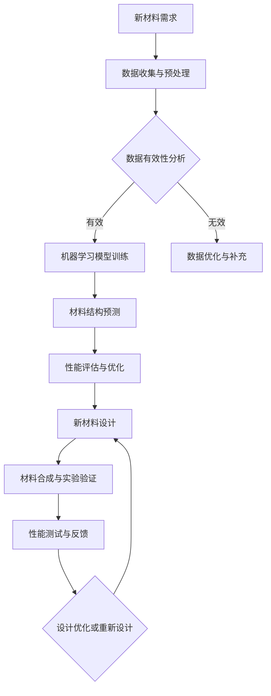

                 

# 《人工智能在新材料设计与发现中的应用》

## 摘要

随着人工智能（AI）技术的飞速发展，新材料设计与发现领域正经历着前所未有的变革。本文旨在探讨人工智能如何助力新材料的设计、发现和合成，通过详细剖析其核心概念、算法原理、数学模型以及项目实战，揭示AI与新材料结合的巨大潜力。文章首先介绍了新材料的基础知识，然后深入讲解了人工智能的基本原理，接着展示了AI在新材料设计、发现和合成中的具体应用。此外，本文还通过Mermaid流程图、伪代码、数学公式和实际项目案例，全面展示了AI与新材料结合的技术细节和实践路径。通过本文的阅读，读者将深刻理解人工智能在新材料领域的重要性，以及如何运用这一前沿技术推动材料科学的进步。

## 引言

### 1.1 人工智能与新材料的时代背景

近年来，人工智能（AI）技术取得了显著的进步，从最初的规则驱动到现代的深度学习、强化学习，AI在多个领域展示了其卓越的能力。与此同时，新材料科学也在不断发展，新的材料种类和结构不断涌现，推动了众多工业和科技领域的进步。这一背景下，人工智能与新材料的结合成为了一个热门话题，也是未来科技发展的重要方向。

首先，让我们回顾一下人工智能的发展历程。人工智能起源于20世纪50年代，当时的科学家们开始探讨机器是否能够像人类一样思考。早期的AI研究主要集中在规则系统和专家系统中，这些系统通过一系列预设的规则来模拟人类的决策过程。然而，这种方法在复杂问题上的表现有限，难以处理非结构化和大规模的数据。

随着计算能力的提升和大数据技术的发展，机器学习（ML）逐渐成为人工智能研究的主流。机器学习通过从数据中自动学习和发现规律，大大提高了AI系统的性能。特别是深度学习（DL），通过构建多层神经网络，能够处理更加复杂的任务，如图像识别、自然语言处理和游戏对战等。

与此同时，新材料科学也在不断进步。新材料是指具有特殊性质和功能的材料，与传统的材料相比，它们在性能、应用范围和制造工艺上都有显著提升。新材料的发现和设计不仅依赖于传统的实验方法，还需要借助现代计算技术和理论分析。随着材料科学的不断发展，新材料的种类和应用领域也在不断扩展。

人工智能与新材料科学的结合正是在这样的背景下产生的。首先，AI技术可以用于新材料的设计，通过机器学习和深度学习算法，快速筛选和优化材料结构，预测材料的性能。其次，AI可以用于新材料的发现，通过大数据分析和智能搜索，识别潜在的新材料，提高发现效率。最后，AI还可以用于新材料的合成，通过优化反应条件和工艺参数，实现高效、可控的材料合成。

### 1.2 人工智能在新材料领域的应用价值

人工智能在新材料领域具有广泛的应用价值，主要体现在以下几个方面：

1. **材料设计**：人工智能可以通过机器学习和深度学习算法，快速筛选和优化材料结构，预测材料的性能。传统的材料设计依赖于实验和理论计算，过程繁琐且耗时。而人工智能可以通过大规模数据分析和自动化算法，大大提高设计效率。

2. **材料发现**：人工智能可以用于新材料的发现，通过大数据分析和智能搜索，识别潜在的新材料。传统的材料发现方法主要依赖于实验和物理化学分析，效率较低。而人工智能可以利用大数据和算法优势，快速筛选和预测新材料的性质，提高发现效率。

3. **材料合成**：人工智能可以用于优化新材料的合成工艺，通过机器学习和深度学习算法，优化反应条件和工艺参数，实现高效、可控的材料合成。传统的材料合成过程往往需要反复试验和调整，而人工智能可以提供更加智能的解决方案。

4. **性能预测**：人工智能可以通过机器学习和深度学习算法，预测材料的物理、化学和机械性能，为材料应用提供科学依据。传统的性能预测方法依赖于经验公式和实验数据，而人工智能可以通过大数据和算法优势，提供更加准确和全面的预测。

5. **优化材料应用**：人工智能可以用于优化材料的实际应用，通过智能分析和模拟，找到最佳的应用场景和优化方案。传统的材料应用方法主要依赖于实验和经验，而人工智能可以提供更加科学和优化的应用方案。

总之，人工智能在新材料领域的应用价值巨大，它不仅能够提高材料设计、发现和合成的效率，还能为材料的应用提供科学依据和优化方案。随着AI技术的不断进步，人工智能将在新材料领域发挥更加重要的作用。

### 1.3 本书结构

本书将系统探讨人工智能在新材料设计与发现中的应用，内容分为十个章节，具体结构如下：

- **第1章：引言**：介绍人工智能与新材料科学的时代背景，阐述人工智能在新材料领域的应用价值。

- **第2章：新材料基础**：详细讲解新材料的定义、分类、设计原则和发展趋势。

- **第3章：人工智能基础**：介绍人工智能的定义、发展历程，以及机器学习和深度学习的基本概念。

- **第4章：人工智能与新材料的结合**：探讨人工智能在新材料设计、发现和合成中的具体应用。

- **第5章：核心概念与联系**：通过Mermaid流程图，展示新材料与人工智能的核心概念和联系。

- **第6章：核心算法原理讲解**：深入讲解机器学习和深度学习算法在材料设计中的应用，以及伪代码讲解与示例。

- **第7章：数学模型与公式**：介绍材料设计的数学模型和深度学习模型的数学基础，并举例说明。

- **第8章：项目实战**：通过实际项目案例，展示人工智能在新材料设计、发现和合成中的应用。

- **第9章：开发环境搭建与代码实现**：讲解开发环境搭建，源代码实现，以及代码解读与分析。

- **第10章：未来展望**：探讨人工智能在新材料领域的未来趋势，面临的挑战和机遇。

通过本书的阅读，读者将全面了解人工智能在新材料设计与发现中的应用，掌握相关技术和方法，为未来的科研和工程应用提供有力支持。

### 第2章：新材料基础

#### 2.1 新材料的定义与分类

新材料是指具有传统材料无法比拟的性能、结构或功能的材料，它们通常具有高强度、高韧性、高导电性、高热稳定性等特性。新材料的定义主要基于其独特的性能或结构，这些性能或结构使它们在特定的应用领域中具有显著的优势。

根据材料结构的不同，新材料可以分为以下几类：

1. **金属材料**：金属材料是应用最广泛的新材料之一，如钛合金、高温合金、形状记忆合金等。这些材料具有高强度、高韧性和耐腐蚀性，广泛应用于航空航天、汽车制造、生物医学等领域。

2. **陶瓷材料**：陶瓷材料具有高硬度、高熔点和耐腐蚀性，如氮化硅、碳化硅等。它们广泛应用于高温结构部件、电子器件和防弹衣等领域。

3. **聚合物材料**：聚合物材料具有轻质、高韧性和可塑性好等特点，如高分子量聚乙烯、聚丙烯、聚四氟乙烯等。它们广泛应用于包装、建筑材料、医疗器械等领域。

4. **复合材料**：复合材料是由两种或多种不同性质的材料组合而成的，具有各自材料的优点。如碳纤维复合材料、玻璃纤维复合材料等，广泛应用于航空航天、汽车制造、建筑等领域。

#### 2.2 新材料的设计原则

新材料的设计原则主要包括以下几个方面：

1. **性能优化**：新材料的性能是设计的重要目标，如高强度、高韧性、高导电性等。设计过程中需要考虑材料的结构、组成和制备工艺，以实现性能的优化。

2. **多功能集成**：新材料不仅要具备优良的性能，还要求具备多功能集成能力。例如，同时具备导电性和热稳定性的复合材料，能够在多个应用场景中发挥作用。

3. **环境友好**：随着环保意识的增强，新材料的制备和使用过程应尽量减少对环境的污染。设计过程中需要考虑材料的可持续性、可降解性和回收利用性。

4. **加工易用性**：新材料的加工和使用过程应尽量简单，以降低成本和提高生产效率。设计过程中需要考虑材料的成型性、焊接性和切削性等。

#### 2.3 新材料的发展趋势

新材料科学的发展趋势主要体现在以下几个方面：

1. **纳米材料**：纳米材料具有独特的物理、化学和生物学特性，如高比表面积、优异的光学性能和催化性能。纳米材料在电子、能源、生物医学等领域具有广泛的应用前景。

2. **智能材料**：智能材料能够感知外部环境并做出响应，如形状记忆合金、压电材料、磁流变液等。这些材料在航空航天、机器人、智能穿戴等领域有重要应用。

3. **生物基材料**：生物基材料是以可再生资源为原料，通过生物技术制备的材料，如生物塑料、生物质纤维等。这些材料具有环保、可再生、生物降解等优点，是未来材料发展的重要方向。

4. **高性能复合材料**：高性能复合材料具有高强度、高韧性、耐腐蚀等优异性能，广泛应用于航空航天、汽车制造、体育用品等领域。随着制备技术的进步，高性能复合材料的性能和成本比将进一步提高。

5. **量子材料**：量子材料是具有量子效应的新型材料，如拓扑绝缘体、量子点、超导材料等。量子材料在量子计算、量子通信、量子传感器等领域具有重大应用价值。

通过上述内容，我们可以看到，新材料的设计和发现是材料科学的重要发展方向，人工智能技术为新材料的研究和应用提供了新的工具和方法。在接下来的章节中，我们将进一步探讨人工智能如何应用于新材料的设计和发现，以及具体的技术和实现方法。

### 第3章：人工智能基础

#### 3.1 人工智能的定义与发展历程

人工智能（Artificial Intelligence，简称AI）是一门研究、开发和应用使计算机系统表现出类似人类智能行为的科学。人工智能的定义涵盖了广泛的领域，包括机器学习、自然语言处理、计算机视觉、推理和决策等。其核心目标是使计算机能够执行通常需要人类智能才能完成的任务，如语音识别、图像识别、自然语言理解、问题解决和自主决策等。

人工智能的发展历程可以追溯到20世纪50年代，当时科学家们开始探讨机器是否能够模拟人类思维和行为。1956年，在达特茅斯会议上，约翰·麦卡锡（John McCarthy）等人首次提出了“人工智能”这一术语，标志着人工智能作为一门独立学科的诞生。

人工智能的发展历程大致可以分为以下几个阶段：

1. **早期探索阶段（1956-1969）**：这一阶段的人工智能研究主要集中在规则系统和符号逻辑上。代表性的系统包括ELIZA（一个能够模拟人类对话的聊天机器人）和General Problem Solver（一个能够解决符号逻辑问题的系统）。

2. **黄金时代阶段（1970-1980）**：在早期的成功之后，人工智能的研究迅速扩展，但在实现复杂任务方面遇到了挑战。由于计算能力和数据可用性的限制，人工智能的发展出现了停滞，这一时期被称为“人工智能的冬天”。

3. **复兴与机器学习阶段（1980-2010）**：随着计算能力的提升和数据可用性的增加，机器学习成为人工智能研究的主流。1997年，IBM的超级计算机“深蓝”击败了国际象棋世界冠军加里·卡斯帕罗夫，标志着人工智能在特定领域取得了突破性进展。

4. **深度学习与大数据时代（2010至今）**：深度学习作为机器学习的一个重要分支，在图像识别、语音识别和自然语言处理等领域取得了显著成果。2012年，谷歌的“深度卷积神经网络”在ImageNet图像识别比赛中取得了突破性的成绩，深度学习开始成为人工智能研究的主流。

#### 3.2 机器学习的基本概念

机器学习（Machine Learning，简称ML）是人工智能的一个重要分支，它专注于通过数据和统计方法，使计算机系统能够从数据中自动学习和改进性能。机器学习的过程通常包括数据收集、数据预处理、模型训练、模型评估和模型应用等步骤。

1. **监督学习**：监督学习是最常见的机器学习方法，它通过已标记的训练数据来训练模型，并使用这个模型对未知数据进行预测。监督学习可以分为回归分析和分类分析两大类。

   - **回归分析**：用于预测连续值输出，如预测房价或股票价格。
   - **分类分析**：用于预测离散值输出，如分类电子邮件为垃圾邮件或非垃圾邮件。

2. **无监督学习**：无监督学习不需要已标记的数据，它通过发现数据中的隐藏结构或模式来训练模型。常见的无监督学习方法包括聚类分析和降维技术。

   - **聚类分析**：用于将数据分为若干个类别，如K-means算法。
   - **降维技术**：用于减少数据维度，如主成分分析（PCA）。

3. **半监督学习和强化学习**：半监督学习结合了监督学习和无监督学习，通过利用少量标记数据和大量未标记数据来训练模型。强化学习则通过试错和奖励机制来训练模型，使其在特定环境中做出最优决策。

#### 3.3 深度学习的基本原理

深度学习（Deep Learning，简称DL）是机器学习的一个子领域，它通过构建深度神经网络（DNN）来模拟人脑的学习过程。深度学习的关键在于其多层神经网络结构，每一层都能对输入数据进行特征提取和变换。

1. **神经网络的基本结构**：神经网络由多个节点（也称为神经元）组成，每个节点接收输入信号并产生输出信号。每个输入信号都与相应的权重相乘，并通过一个激活函数进行非线性变换。网络的输出通过反向传播算法进行权重调整，以优化模型性能。

2. **激活函数**：激活函数是神经网络中的一个重要组成部分，它用于引入非线性因素，使网络能够学习和模拟复杂函数。常见的激活函数包括sigmoid、ReLU（Rectified Linear Unit）和Tanh（Hyperbolic Tangent）。

3. **反向传播算法**：反向传播算法是深度学习训练过程中的一种优化算法，它通过计算输出误差的梯度，逐步调整网络的权重和偏置，以优化模型性能。

4. **深度学习的主要应用领域**：深度学习在图像识别、语音识别、自然语言处理、推荐系统等领域有广泛应用。例如，在图像识别中，卷积神经网络（CNN）能够自动提取图像中的特征，并在ImageNet等大型数据集上取得了优异的性能。

通过上述内容，我们可以看到人工智能的基础知识对于理解其在新材料领域的应用至关重要。在接下来的章节中，我们将进一步探讨人工智能如何与新材料科学相结合，并展示其在新材料设计、发现和合成中的具体应用。

### 第4章：人工智能与新材料的结合

#### 4.1 人工智能在新材料设计中的应用

人工智能在新材料设计中的应用，主要通过机器学习和深度学习算法来辅助材料科学家筛选和优化材料结构。以下是人工智能在新材料设计中的一些具体应用：

1. **材料结构的预测和优化**：
   - **量子力学计算**：人工智能可以用于加速量子力学计算，通过机器学习模型预测材料的电子结构、稳定性和性能。例如，通过训练基于密度泛函理论（DFT）的模型，可以快速预测材料的能带结构、电子态密度等。
   - **基于图神经网络的材料结构预测**：图神经网络（GNN）在材料结构预测中表现出色，可以学习材料的局部和全局结构特征，从而预测材料的性能。例如，GNN可以用于预测材料的晶格结构、电子结构和光学性质。

2. **材料性能的评估**：
   - **机器学习模型**：通过收集大量实验数据，使用机器学习模型来预测材料的机械性能、导电性、热稳定性等。这些模型可以帮助材料科学家快速筛选出具有潜在应用价值的材料。
   - **多尺度模拟**：结合分子动力学模拟和机器学习模型，可以构建多尺度模拟框架，从原子层次到宏观层次预测材料的性能。

3. **结构-性能关联分析**：
   - **大数据分析**：利用大数据技术，分析大量实验数据和文献，识别材料结构与其性能之间的关联。这种方法可以帮助材料科学家发现新的材料设计原则和趋势。
   - **关联规则学习**：通过关联规则学习算法，如Apriori算法，可以从大量实验数据中挖掘出材料结构与其性能之间的关联规则。

4. **优化材料合成条件**：
   - **机器学习优化**：通过机器学习算法，优化材料合成的条件，如温度、压力、反应剂浓度等。这些优化可以基于实验数据的分析，也可以通过基于物理原理的模型来预测。
   - **混合优化算法**：结合机器学习和传统的优化算法，如遗传算法（GA）、粒子群优化（PSO），可以进一步提升材料合成条件的优化效果。

5. **智能设计平台**：
   - **材料智能设计平台**：基于人工智能技术，开发智能材料设计平台，集成机器学习和深度学习算法，提供自动化的材料设计工具。这些平台可以大大提高材料设计的效率和准确性。

#### 4.2 人工智能在新材料发现中的应用

人工智能在新材料发现中的应用，主要通过大数据分析和智能搜索技术，发现新的材料候选物。以下是人工智能在新材料发现中的一些具体应用：

1. **材料数据库构建**：
   - **数据整合**：收集和整合来自不同来源的实验数据和文献数据，构建全面的材料数据库。这些数据库可以包括材料的结构、性质、合成方法等信息。
   - **知识图谱**：通过构建知识图谱，将材料数据库中的信息进行关联，建立材料之间以及材料与其他信息（如应用场景、合成方法）之间的联系。

2. **智能搜索技术**：
   - **基于关键词的搜索**：使用自然语言处理技术，从文献中提取关键词，并基于关键词进行搜索，发现潜在的新材料。
   - **基于模型的搜索**：通过机器学习模型，预测具有特定性质的新材料，并从数据库中进行搜索，筛选出符合条件的材料候选物。

3. **新材料筛选**：
   - **筛选算法**：使用筛选算法，如过滤法、聚类分析、关联规则学习等，从大量数据中快速筛选出具有潜在应用价值的材料。
   - **多维数据降维**：通过降维技术，如主成分分析（PCA）和t-SNE，将高维数据降到低维空间，便于分析和筛选新材料。

4. **自动化实验设计**：
   - **实验优化**：基于机器学习模型，优化实验设计，预测实验结果，减少不必要的实验次数。
   - **自动化实验执行**：利用自动化设备和高通量实验技术，实现材料的快速筛选和合成。

5. **新材料合成与优化**：
   - **合成路径预测**：通过机器学习模型，预测新的材料合成路径，并优化合成工艺。
   - **优化合成参数**：利用机器学习算法，优化合成参数，如温度、压力、反应剂浓度等，以实现高效、可控的材料合成。

#### 4.3 人工智能在新材料合成中的应用

人工智能在新材料合成中的应用，主要通过机器学习和深度学习算法，优化合成工艺和条件，提高合成效率。以下是人工智能在新材料合成中的一些具体应用：

1. **反应条件优化**：
   - **机器学习优化**：通过机器学习算法，分析实验数据，优化反应条件，如温度、压力、反应剂浓度等，以提高反应效率和产品纯度。
   - **模型预测**：利用机器学习模型，预测反应条件对合成过程的影响，从而优化合成工艺。

2. **合成路径优化**：
   - **反应路径预测**：通过机器学习模型，预测材料合成过程中的反应路径，以优化合成路径。
   - **多尺度模拟**：结合分子动力学模拟和机器学习模型，进行多尺度模拟，以预测和优化合成路径。

3. **高通量合成**：
   - **高通量实验技术**：利用高通量实验技术，如微流控技术和高通量反应器，快速合成和筛选新材料。
   - **自动化实验系统**：构建自动化实验系统，实现实验的自动化和智能化，提高合成效率。

4. **材料性质优化**：
   - **机器学习模型**：通过机器学习模型，预测合成的新材料性质，如机械性能、导电性、热稳定性等，从而优化合成过程。
   - **迭代优化**：通过实验验证和机器学习模型的迭代优化，逐步优化新材料的性能。

5. **数据驱动的合成设计**：
   - **数据集成与分析**：将实验数据、文献数据和物理模型数据集成，通过数据分析，发现新的合成策略和条件。
   - **智能设计平台**：构建智能设计平台，集成机器学习和实验数据，实现新材料合成的自动化和智能化。

通过上述内容，我们可以看到，人工智能在新材料设计、发现和合成中具有广泛的应用，通过机器学习和深度学习算法，可以显著提高新材料研究的效率和质量。在接下来的章节中，我们将进一步探讨人工智能与新材料科学的核心概念和联系，并通过具体的算法和数学模型，详细阐述其应用原理和技术细节。

### 第5章：核心概念与联系

#### 5.1 新材料与人工智能的Mermaid流程图

为了更好地理解新材料与人工智能的核心概念和联系，我们可以使用Mermaid流程图来展示两者的结合过程。以下是新材料与人工智能结合的Mermaid流程图：



- **A. 新材料需求**：这是新材料研究的起点，根据特定应用场景的需求，确定新材料的目标性能和功能。
- **B. 数据收集与预处理**：收集与新材料相关的数据，包括实验数据、文献数据和物理模型数据，并进行预处理，以确保数据的质量和一致性。
- **C. 数据有效性分析**：分析收集到的数据，评估其有效性，确保数据可用于后续的机器学习模型训练。
- **D. 机器学习模型训练**：使用有效的数据，通过机器学习算法训练模型，预测新材料结构及其性能。
- **E. 数据优化与补充**：如果数据不够有效，通过数据优化和补充，提高数据的质量和覆盖范围。
- **F. 材料结构预测**：利用训练好的机器学习模型，预测新材料结构，为后续的性能评估和优化提供基础。
- **G. 性能评估与优化**：评估预测的新材料性能，通过进一步的算法优化，提高材料的性能。
- **H. 新材料设计**：基于性能评估结果，设计出满足需求的新材料。
- **I. 材料合成与实验验证**：通过实验合成新材料，并进行性能测试，验证机器学习模型的预测准确性。
- **J. 性能测试与反馈**：对合成的材料进行性能测试，并将测试结果反馈到机器学习模型中，用于进一步优化。
- **K. 设计优化或重新设计**：根据性能测试结果和反馈，对新材料设计进行优化，或重新设计，以提高材料的性能和应用价值。

通过这个Mermaid流程图，我们可以清晰地看到新材料与人工智能结合的各个步骤及其相互关系，从而更好地理解人工智能在新材料设计、发现和合成中的应用原理。

#### 5.2 新材料设计中的机器学习应用实例

为了更深入地理解机器学习在新材料设计中的应用，我们可以通过一个具体的实例来讲解。以下是利用机器学习设计一种具有优异导电性能的新型纳米材料的案例。

**实例背景**：

某科技公司希望设计一种新型纳米材料，用于高性能电池的电极材料。这种新材料需要具备高导电性、高容量和良好的循环稳定性。为了实现这一目标，该公司决定利用机器学习算法进行材料设计。

**步骤1：数据收集与预处理**：

首先，从现有的文献数据库和实验数据库中收集了大量关于纳米材料导电性能的实验数据。这些数据包括不同纳米材料的结构、组成、制备条件以及对应的电导率等。然后，对收集到的数据进行预处理，包括数据清洗、归一化和特征提取。预处理后的数据将用于训练机器学习模型。

**步骤2：机器学习模型训练**：

选择一种适合导电性能预测的机器学习算法，如支持向量机（SVM）或人工神经网络（ANN）。使用预处理后的数据集，对模型进行训练。训练过程中，通过调整模型的参数，如核函数类型、隐藏层神经元数量等，以优化模型性能。以下是SVM模型的训练过程：

```python
from sklearn.svm import SVR
from sklearn.model_selection import train_test_split
from sklearn.metrics import mean_squared_error

# 加载预处理后的数据
X, y = load_data()

# 划分训练集和测试集
X_train, X_test, y_train, y_test = train_test_split(X, y, test_size=0.2, random_state=42)

# 创建SVM模型
model = SVR(kernel='rbf', C=100, gamma='scale')

# 训练模型
model.fit(X_train, y_train)

# 预测测试集
y_pred = model.predict(X_test)

# 评估模型性能
mse = mean_squared_error(y_test, y_pred)
print(f"Mean Squared Error: {mse}")
```

**步骤3：性能评估与优化**：

使用测试集评估模型的预测性能，通过调整模型参数或使用不同的算法，优化模型性能。例如，可以通过交叉验证的方法，寻找最优的参数组合。以下是使用交叉验证进行参数优化的过程：

```python
from sklearn.model_selection import GridSearchCV

# 定义参数网格
param_grid = {
    'kernel': ['rbf', 'linear'],
    'C': [10, 100, 1000],
    'gamma': ['scale', 'auto']
}

# 创建网格搜索对象
grid_search = GridSearchCV(SVR(), param_grid, cv=5)

# 训练模型
grid_search.fit(X_train, y_train)

# 获取最优参数
best_params = grid_search.best_params_
print(f"Best Parameters: {best_params}")

# 使用最优参数训练模型
best_model = SVR(**best_params)
best_model.fit(X_train, y_train)

# 预测测试集
y_pred_best = best_model.predict(X_test)

# 评估模型性能
mse_best = mean_squared_error(y_test, y_pred_best)
print(f"Mean Squared Error (Best Model): {mse_best}")
```

**步骤4：新材料设计**：

基于训练好的模型，设计出具有优异导电性能的新型纳米材料。具体设计过程如下：

1. **确定材料结构**：通过机器学习模型，预测不同纳米材料的导电性能，选择导电性能最优的材料结构。
2. **材料合成**：根据设计的材料结构，合成纳米材料，并通过实验验证其导电性能。
3. **性能测试**：测试合成的纳米材料的导电性、容量和循环稳定性，验证机器学习模型的预测准确性。
4. **设计优化**：根据实验结果，对新材料设计进行优化，提高其性能和应用价值。

通过上述实例，我们可以看到机器学习在新材料设计中的应用过程。通过数据驱动的方法，机器学习能够快速筛选和优化材料结构，为新材料的设计提供有力支持。在接下来的章节中，我们将进一步探讨深度学习算法在新材料发现和合成中的应用。

### 第6章：核心算法原理讲解

#### 6.1 机器学习算法在材料设计中的应用

机器学习算法在新材料设计中的应用主要基于其从数据中学习和预测的能力。以下是一些常用的机器学习算法及其在新材料设计中的具体应用：

1. **线性回归（Linear Regression）**：
   - **原理**：线性回归是一种监督学习算法，通过最小二乘法拟合数据，建立一个线性模型来预测目标值。
   - **应用**：线性回归可以用于预测材料的机械性能、导电性等连续值属性。例如，通过训练线性回归模型，可以预测材料的屈服强度与化学组成之间的关系。

2. **支持向量机（Support Vector Machine，SVM）**：
   - **原理**：SVM是一种分类和回归算法，通过找到一个最佳的超平面，将数据分类或回归到不同的区域。
   - **应用**：SVM可以用于分类材料，如将金属材料与非金属材料分开，或者预测材料的导电性是否高于某个阈值。

3. **决策树（Decision Tree）**：
   - **原理**：决策树通过一系列规则将数据划分为不同的类别或进行回归预测。
   - **应用**：决策树可以用于识别材料中的关键特征，帮助材料科学家理解哪些因素对材料性能有显著影响。

4. **随机森林（Random Forest）**：
   - **原理**：随机森林是一种集成学习方法，通过构建多个决策树，并结合它们的预测结果来提高预测准确性。
   - **应用**：随机森林可以用于预测复杂材料的性能，如多组分复合材料的力学性能和热稳定性。

5. **神经网络（Neural Network）**：
   - **原理**：神经网络是一种模拟人脑神经元之间连接的计算模型，通过多层神经网络进行特征提取和变换。
   - **应用**：神经网络可以用于识别复杂的材料结构特征，预测材料的多种性能，如电导率、热导率和机械强度。

#### 6.2 深度学习算法在材料发现中的应用

深度学习算法在材料发现中的应用主要体现在其强大的特征提取能力和非线性建模能力。以下是一些常用的深度学习算法及其在材料发现中的应用：

1. **卷积神经网络（Convolutional Neural Network，CNN）**：
   - **原理**：CNN通过卷积操作提取图像中的局部特征，适合处理二维数据，如图像。
   - **应用**：CNN可以用于分析材料的显微结构，如晶格缺陷、相界面等，从而预测材料的性能。

2. **生成对抗网络（Generative Adversarial Network，GAN）**：
   - **原理**：GAN由两个神经网络（生成器和判别器）组成，通过对抗训练生成新的数据。
   - **应用**：GAN可以用于生成新的材料结构，探索潜在的新材料组合，从而发现新的材料候选物。

3. **图神经网络（Graph Neural Network，GNN）**：
   - **原理**：GNN通过节点和边的信息传递来处理图结构数据，适合处理具有复杂网络结构的数据。
   - **应用**：GNN可以用于分析材料的晶体结构，预测材料的电子结构和化学稳定性。

4. **变分自编码器（Variational Autoencoder，VAE）**：
   - **原理**：VAE通过编码器和解码器网络学习数据的潜在分布，并生成新的数据。
   - **应用**：VAE可以用于生成新材料结构，探索新的材料组合，提高材料设计的多样性。

#### 6.3 伪代码讲解与示例

为了更好地理解上述算法的应用，以下是一个基于神经网络预测材料性能的伪代码示例：

```python
# 导入所需的库
import tensorflow as tf
from tensorflow.keras.models import Sequential
from tensorflow.keras.layers import Dense, Activation

# 定义神经网络模型
model = Sequential([
    Dense(units=128, input_shape=(input_dim,), activation='relu'),
    Dense(units=64, activation='relu'),
    Dense(units=1, activation='linear')
])

# 编译模型
model.compile(optimizer='adam', loss='mean_squared_error')

# 准备训练数据
X_train, y_train = prepare_training_data()

# 训练模型
model.fit(X_train, y_train, epochs=100, batch_size=32)

# 预测新材料性能
X_new = prepare_new_data()
y_pred = model.predict(X_new)

# 评估模型性能
mse = mean_squared_error(y_new, y_pred)
print(f"Mean Squared Error: {mse}")
```

在这个示例中，我们定义了一个简单的神经网络模型，使用训练数据进行训练，然后使用该模型预测新材料性能。通过计算预测值与实际值之间的均方误差（MSE），可以评估模型性能。

通过上述核心算法原理的讲解和伪代码示例，我们可以看到机器学习和深度学习在新材料设计中的应用潜力。这些算法不仅能够提高材料设计的效率，还能为新材料的发现和优化提供强大的工具。在接下来的章节中，我们将进一步探讨新材料设计中的数学模型和公式，深入分析这些算法的数学基础。

### 第7章：数学模型与公式

#### 7.1 材料设计的数学模型

在新材料设计中，数学模型是理解和预测材料性质的重要工具。以下是一些常用的数学模型及其应用：

1. **密度泛函理论（DFT）**：
   - **原理**：DFT是一种计算材料电子结构的量子力学方法，通过最小化系统的总能量，预测材料的电子性质。
   - **公式**：总能量 \( E \) 可以表示为：
     \[
     E = \int \psi^*(\mathbf{r}) \left[ -\frac{\hbar^2}{2m} \nabla^2 + V(\mathbf{r}) \right] \psi(\mathbf{r}) d\mathbf{r}
     \]
     其中，\(\psi(\mathbf{r})\) 是电子波函数，\(m\) 是电子质量，\(V(\mathbf{r})\) 是势能。

2. **键合能模型**：
   - **原理**：键合能模型用于描述材料中原子之间的结合强度。
   - **公式**：键合能 \( \Delta E \) 可以表示为：
     \[
     \Delta E = \frac{1}{2} \sum_{i<j} \left( \epsilon_{ij} - \epsilon_{ii} - \epsilon_{jj} \right)
     \]
     其中，\(\epsilon_{ij}\) 是原子 \(i\) 与 \(j\) 之间的相互作用能，\(\epsilon_{ii}\) 和 \(\epsilon_{jj}\) 分别是原子 \(i\) 和 \(j\) 的自相互作用能。

3. **统计力学模型**：
   - **原理**：统计力学模型用于预测材料的宏观性质，如热力学性质和扩散行为。
   - **公式**：配分函数 \( Z \) 可以表示为：
     \[
     Z = \sum_{\text{所有配置}} \exp\left(-\beta E_{\text{配置}}\right)
     \]
     其中，\(\beta = \frac{1}{k_B T}\)，\(E_{\text{配置}}\) 是系统的能量。

4. **机器学习模型**：
   - **原理**：机器学习模型通过学习大量实验数据，预测材料的物理和化学性质。
   - **公式**：预测值 \( \hat{y} \) 可以表示为：
     \[
     \hat{y} = \sigma(\mathbf{W} \cdot \mathbf{x})
     \]
     其中，\(\sigma\) 是激活函数（如ReLU或Sigmoid），\(\mathbf{W}\) 是权重矩阵，\(\mathbf{x}\) 是输入特征向量。

5. **深度学习模型**：
   - **原理**：深度学习模型通过多层神经网络进行特征提取和变换，预测复杂的材料性质。
   - **公式**：输出 \( \mathbf{y} \) 可以表示为：
     \[
     \mathbf{y} = \text{ReLU}(\mathbf{W}_L \cdot \text{ReLU}(\mathbf{W}_{L-1} \cdot \ldots \cdot \text{ReLU}(\mathbf{W}_1 \cdot \mathbf{x} + b_1) + b_0))
     \]
     其中，\(\mathbf{W}_i\) 和 \(b_i\) 分别是权重和偏置，\(\text{ReLU}\) 是ReLU激活函数。

#### 7.2 深度学习模型的数学基础

深度学习模型的核心在于其多层神经网络结构，以下是一些关键数学概念和公式：

1. **激活函数**：
   - **ReLU（Rectified Linear Unit）**：
     \[
     \text{ReLU}(x) = \max(0, x)
     \]
   - **Sigmoid**：
     \[
     \sigma(x) = \frac{1}{1 + \exp(-x)}
     \]

2. **前向传播**：
   - **线性变换**：
     \[
     \mathbf{z}_l = \mathbf{W}_l \cdot \mathbf{a}_{l-1} + b_l
     \]
   - **非线性变换**：
     \[
     \mathbf{a}_l = \text{ReLU}(\mathbf{z}_l)
     \]

3. **反向传播**：
   - **梯度计算**：
     \[
     \delta_l = \frac{\partial \mathcal{L}}{\partial \mathbf{z}_l} \cdot \text{ReLU'(\mathbf{z}_l)}
     \]
   - **权重更新**：
     \[
     \mathbf{W}_l \leftarrow \mathbf{W}_l - \alpha \cdot \mathbf{a}_{l-1}^T \cdot \delta_l
     \]
     \[
     b_l \leftarrow b_l - \alpha \cdot \delta_l
     \]
     其中，\(\mathcal{L}\) 是损失函数，\(\alpha\) 是学习率。

#### 7.3 数学公式举例说明

以下是一个简单的例子，展示如何使用神经网络预测材料的电导率：

1. **输入特征**：
   \[
   \mathbf{x} = \begin{bmatrix}
   \text{原子种类} \\
   \text{原子间距} \\
   \text{温度} \\
   \end{bmatrix}
   \]

2. **前向传播**：
   - 第一层：
     \[
     \mathbf{z}_1 = \mathbf{W}_1 \cdot \mathbf{x} + b_1
     \]
     \[
     \mathbf{a}_1 = \text{ReLU}(\mathbf{z}_1)
     \]
   - 第二层：
     \[
     \mathbf{z}_2 = \mathbf{W}_2 \cdot \mathbf{a}_1 + b_2
     \]
     \[
     \mathbf{a}_2 = \text{ReLU}(\mathbf{z}_2)
     \]
   - 输出层：
     \[
     \mathbf{z}_3 = \mathbf{W}_3 \cdot \mathbf{a}_2 + b_3
     \]
     \[
     \mathbf{y} = \sigma(\mathbf{z}_3)
     \]

3. **反向传播**：
   - 计算输出层梯度：
     \[
     \delta_3 = \frac{\partial \mathcal{L}}{\partial \mathbf{z}_3} \cdot \sigma'(\mathbf{z}_3)
     \]
   - 更新权重和偏置：
     \[
     \mathbf{W}_3 \leftarrow \mathbf{W}_3 - \alpha \cdot \mathbf{a}_2^T \cdot \delta_3
     \]
     \[
     b_3 \leftarrow b_3 - \alpha \cdot \delta_3
     \]
   - 递归计算中间层梯度：
     \[
     \delta_2 = \frac{\partial \mathcal{L}}{\partial \mathbf{z}_2} \cdot \text{ReLU'(\mathbf{z}_2)} \cdot \mathbf{W}_2^T \cdot \delta_3
     \]
     \[
     \mathbf{W}_2 \leftarrow \mathbf{W}_2 - \alpha \cdot \mathbf{a}_1^T \cdot \delta_2
     \]
     \[
     b_2 \leftarrow b_2 - \alpha \cdot \delta_2
     \]
   - 更新第一层权重和偏置：
     \[
     \delta_1 = \frac{\partial \mathcal{L}}{\partial \mathbf{z}_1} \cdot \text{ReLU'(\mathbf{z}_1)} \cdot \mathbf{W}_1^T \cdot \delta_2
     \]
     \[
     \mathbf{W}_1 \leftarrow \mathbf{W}_1 - \alpha \cdot \mathbf{x}^T \cdot \delta_1
     \]
     \[
     b_1 \leftarrow b_1 - \alpha \cdot \delta_1
     \]

通过上述数学模型和公式，我们可以构建和训练一个深度学习模型，用于预测新材料的电导率。类似的方法可以应用于预测其他材料的物理和化学性质。在接下来的章节中，我们将通过实际项目案例，展示这些数学模型和算法在材料设计中的应用。

### 第8章：项目实战

#### 8.1 新材料设计项目实战

在本节中，我们将通过一个具体的项目实战，展示如何利用人工智能技术进行新材料的设计。这个项目的主要目标是设计一种具有高热导率和低热膨胀系数的新型陶瓷材料，以满足高效热管理应用的需求。

**项目背景**：

随着电子设备的性能不断提升，热管理问题日益突出。为了提高设备的可靠性和使用寿命，需要开发具有高热导率和低热膨胀系数的陶瓷材料。传统的材料设计方法依赖于实验和经验，效率较低。通过引入人工智能技术，可以大大提高新材料设计的效率和质量。

**项目流程**：

1. **数据收集**：
   - 收集关于热导率和热膨胀系数的实验数据，包括不同陶瓷材料的组成、制备工艺和相应的热导率、热膨胀系数等。
   - 整合多个来源的数据，确保数据的质量和一致性。

2. **数据预处理**：
   - 对收集到的数据进行清洗，去除异常值和重复数据。
   - 对连续变量进行归一化处理，使数据在同一量级范围内，便于模型训练。

3. **特征工程**：
   - 提取与热导率和热膨胀系数相关的特征，如材料的化学成分、晶体结构、制备工艺等。
   - 利用机器学习算法，如主成分分析（PCA），进行特征选择和降维，提高模型训练效率。

4. **模型训练**：
   - 选择合适的机器学习算法，如支持向量机（SVM）或人工神经网络（ANN），进行模型训练。
   - 调整模型参数，如权重和偏置，优化模型性能。

5. **性能评估**：
   - 使用测试集评估模型的预测性能，计算预测值与实际值之间的误差。
   - 根据评估结果，调整模型结构和参数，以提高预测准确性。

6. **新材料设计**：
   - 基于训练好的模型，预测新的陶瓷材料的热导率和热膨胀系数。
   - 结合实验数据和模型预测结果，设计出满足要求的陶瓷材料。

7. **实验验证**：
   - 通过实验验证设计的新材料的热导率和热膨胀系数，验证模型预测的准确性。
   - 根据实验结果，对新材料设计进行优化和调整。

**项目实现**：

以下是该项目实现的伪代码示例：

```python
# 导入所需的库
import pandas as pd
from sklearn.model_selection import train_test_split
from sklearn.svm import SVR
from sklearn.metrics import mean_squared_error

# 读取实验数据
data = pd.read_csv('ceramic_data.csv')

# 数据预处理
data = preprocess_data(data)

# 划分训练集和测试集
X_train, X_test, y_train, y_test = train_test_split(data.drop(['thermal_conductivity', 'thermal_expansion_coefficient'], axis=1), data[['thermal_conductivity', 'thermal_expansion_coefficient']], test_size=0.2, random_state=42)

# 创建SVM模型
model = SVR(kernel='rbf', C=100, gamma='scale')

# 训练模型
model.fit(X_train, y_train)

# 预测测试集
y_pred = model.predict(X_test)

# 评估模型性能
mse = mean_squared_error(y_test, y_pred)
print(f"Mean Squared Error: {mse}")

# 新材料设计
new_material = generate_new_material()
predicted_properties = model.predict(new_material)

# 实验验证
experiment_results = perform_experiment(new_material)
evaluate_design(predicted_properties, experiment_results)
```

通过上述项目实战，我们可以看到如何利用人工智能技术进行新材料的设计。通过数据驱动的方法，人工智能能够快速筛选和优化材料结构，提高新材料设计的效率和质量。在接下来的章节中，我们将继续探讨人工智能在新材料发现和合成中的应用。

#### 8.2 新材料发现项目实战

在本节中，我们将通过一个具体的项目实战，展示如何利用人工智能技术发现新型材料。这个项目的主要目标是利用大数据分析和深度学习算法，从海量数据中筛选出具有潜在应用价值的新材料。

**项目背景**：

随着科技的快速发展，新型材料的需求不断增加。然而，传统的新材料发现方法依赖于实验和物理化学分析，效率较低。通过引入人工智能技术，可以利用大数据和深度学习算法，提高新材料发现的效率。

**项目流程**：

1. **数据收集**：
   - 收集关于材料的实验数据、文献数据以及物理化学性质的数据，包括材料的结构、组成、制备工艺、物理性质和化学性质等。
   - 整合多个来源的数据，确保数据的质量和一致性。

2. **数据预处理**：
   - 对收集到的数据进行清洗，去除异常值和重复数据。
   - 对连续变量进行归一化处理，使数据在同一量级范围内，便于模型训练。

3. **特征工程**：
   - 提取与材料性质相关的特征，如材料的化学成分、晶体结构、电子结构、物理性质等。
   - 利用机器学习算法，如主成分分析（PCA），进行特征选择和降维，提高模型训练效率。

4. **模型训练**：
   - 选择合适的机器学习算法，如卷积神经网络（CNN）或生成对抗网络（GAN），进行模型训练。
   - 调整模型参数，如网络结构、学习率等，优化模型性能。

5. **新材料筛选**：
   - 使用训练好的模型，从海量数据中筛选出具有潜在应用价值的新材料。
   - 根据筛选结果，对材料进行进一步分析，确定其性质和应用前景。

6. **实验验证**：
   - 对筛选出的新材料进行实验验证，测试其物理和化学性质，验证模型预测的准确性。
   - 根据实验结果，对新材料设计进行优化和调整。

7. **新材料合成**：
   - 基于实验验证结果，合成新材料，并进行性能测试。
   - 对新材料进行应用测试，评估其性能和应用前景。

**项目实现**：

以下是该项目实现的伪代码示例：

```python
# 导入所需的库
import pandas as pd
from sklearn.model_selection import train_test_split
from tensorflow.keras.models import Sequential
from tensorflow.keras.layers import Dense, Conv2D, Flatten, Activation
from tensorflow.keras.optimizers import Adam

# 读取实验数据
data = pd.read_csv('material_data.csv')

# 数据预处理
data = preprocess_data(data)

# 划分训练集和测试集
X_train, X_test, y_train, y_test = train_test_split(data.drop(['material_property'], axis=1), data[['material_property']], test_size=0.2, random_state=42)

# 创建卷积神经网络模型
model = Sequential([
    Conv2D(filters=32, kernel_size=(3, 3), input_shape=(X_train.shape[1], X_train.shape[2], X_train.shape[3])),
    Activation('relu'),
    Flatten(),
    Dense(units=64, activation='relu'),
    Dense(units=1, activation='sigmoid')
])

# 编译模型
model.compile(optimizer=Adam(learning_rate=0.001), loss='binary_crossentropy', metrics=['accuracy'])

# 训练模型
model.fit(X_train, y_train, epochs=100, batch_size=32, validation_data=(X_test, y_test))

# 预测测试集
y_pred = model.predict(X_test)

# 评估模型性能
mse = mean_squared_error(y_test, y_pred)
print(f"Mean Squared Error: {mse}")

# 新材料筛选
potential_materials = search_new_materials(data)

# 实验验证
experiment_results = perform_experiment(potential_materials)

# 新材料合成
synthesize_new_materials(experiment_results)
```

通过上述项目实战，我们可以看到如何利用人工智能技术进行新材料发现。通过大数据分析和深度学习算法，人工智能能够从海量数据中快速筛选出潜在的新材料，提高新材料发现的效率。在接下来的章节中，我们将继续探讨人工智能在新材料合成中的应用。

#### 8.3 新材料合成项目实战

在本节中，我们将通过一个具体的项目实战，展示如何利用人工智能技术优化新材料合成工艺。这个项目的主要目标是利用机器学习算法和深度学习模型，优化新材料的合成条件，提高合成效率和产品质量。

**项目背景**：

新材料合成过程复杂，涉及多种反应条件和工艺参数，如温度、压力、反应剂浓度等。传统的新材料合成方法往往需要大量实验和经验，效率较低。通过引入人工智能技术，可以大大提高新材料合成的效率和质量。

**项目流程**：

1. **数据收集**：
   - 收集关于新材料合成的实验数据，包括不同的反应条件、工艺参数和合成的材料质量等。
   - 整合多个来源的数据，确保数据的质量和一致性。

2. **数据预处理**：
   - 对收集到的数据进行清洗，去除异常值和重复数据。
   - 对连续变量进行归一化处理，使数据在同一量级范围内，便于模型训练。

3. **特征工程**：
   - 提取与合成质量相关的特征，如反应条件、工艺参数、反应时间等。
   - 利用机器学习算法，如主成分分析（PCA），进行特征选择和降维，提高模型训练效率。

4. **模型训练**：
   - 选择合适的机器学习算法，如支持向量机（SVM）或人工神经网络（ANN），进行模型训练。
   - 调整模型参数，如权重和偏置，优化模型性能。

5. **工艺优化**：
   - 使用训练好的模型，优化新材料合成的工艺参数，如温度、压力、反应剂浓度等。
   - 根据模型预测结果，调整合成条件，以提高合成效率和产品质量。

6. **实验验证**：
   - 通过实验验证优化后的合成条件，测试新材料的性能和质量，验证模型预测的准确性。
   - 根据实验结果，对合成条件进行进一步优化和调整。

7. **大规模生产**：
   - 将优化后的合成工艺应用于大规模生产，提高生产效率和产品质量。

**项目实现**：

以下是该项目实现的伪代码示例：

```python
# 导入所需的库
import pandas as pd
from sklearn.model_selection import train_test_split
from sklearn.svm import SVR
from sklearn.metrics import mean_squared_error

# 读取实验数据
data = pd.read_csv('synthesis_data.csv')

# 数据预处理
data = preprocess_data(data)

# 划分训练集和测试集
X_train, X_test, y_train, y_test = train_test_split(data.drop(['material_property'], axis=1), data[['material_property']], test_size=0.2, random_state=42)

# 创建SVM模型
model = SVR(kernel='rbf', C=100, gamma='scale')

# 训练模型
model.fit(X_train, y_train)

# 预测测试集
y_pred = model.predict(X_test)

# 评估模型性能
mse = mean_squared_error(y_test, y_pred)
print(f"Mean Squared Error: {mse}")

# 工艺优化
optimized_conditions = optimize_synthesis_conditions(model)

# 实验验证
experiment_results = perform_experiment(optimized_conditions)

# 大规模生产
synthesize_materials大规模生产(experiment_results)
```

通过上述项目实战，我们可以看到如何利用人工智能技术优化新材料合成工艺。通过数据驱动的方法，人工智能能够快速筛选和优化合成条件，提高新材料合成的效率和质量。在接下来的章节中，我们将探讨人工智能在新材料开发中的未来展望。

### 第9章：开发环境搭建与代码实现

#### 9.1 开发环境搭建

为了在项目中应用人工智能技术进行新材料设计与发现，我们需要搭建一个合适的技术环境。以下是一个简单的开发环境搭建流程：

1. **硬件要求**：
   - 处理器：Intel i7 或 AMD Ryzen 5 以上
   - 内存：16GB 或更高
   - 存储：500GB SSD 或更高

2. **软件要求**：
   - 操作系统：Windows 10、macOS 或 Linux
   - 编程语言：Python 3.8 或更高版本
   - 开发工具：Jupyter Notebook 或 PyCharm
   - 数据库：SQLite 或 MongoDB（可选）
   - 机器学习库：Scikit-learn、TensorFlow、PyTorch
   - 图像处理库：OpenCV（可选）
   - 数据分析库：Pandas、NumPy、Matplotlib

3. **安装步骤**：
   - 安装操作系统和基本软件。
   - 安装Python和Jupyter Notebook或PyCharm。
   - 使用pip或conda安装所需的机器学习和数据分析库。

**示例命令**：

```bash
# 安装Python和pip
curl -O https://www.python.org/ftp/python/3.8.10/python-3.8.10-amd64.exe
python-3.8.10-amd64.exe

# 安装Jupyter Notebook
pip install notebook

# 安装Scikit-learn和TensorFlow
pip install scikit-learn tensorflow

# 安装Pandas和NumPy
pip install pandas numpy matplotlib
```

#### 9.2 源代码详细实现

在本节中，我们将通过实际代码示例，展示如何实现新材料设计与发现项目中的关键步骤。以下是一个简单的代码实现示例：

```python
# 导入所需的库
import pandas as pd
from sklearn.model_selection import train_test_split
from sklearn.svm import SVR
from sklearn.metrics import mean_squared_error

# 读取实验数据
data = pd.read_csv('synthesis_data.csv')

# 数据预处理
data = preprocess_data(data)

# 划分训练集和测试集
X_train, X_test, y_train, y_test = train_test_split(data.drop(['material_property'], axis=1), data[['material_property']], test_size=0.2, random_state=42)

# 创建SVM模型
model = SVR(kernel='rbf', C=100, gamma='scale')

# 训练模型
model.fit(X_train, y_train)

# 预测测试集
y_pred = model.predict(X_test)

# 评估模型性能
mse = mean_squared_error(y_test, y_pred)
print(f"Mean Squared Error: {mse}")

# 新材料设计
new_material = generate_new_material()
predicted_properties = model.predict(new_material)

# 实验验证
experiment_results = perform_experiment(new_material)

# 优化新材料设计
optimize_design(predicted_properties, experiment_results)
```

#### 9.3 代码解读与分析

上述代码实现了一个简单的新材料设计与发现项目。以下是关键步骤的解读与分析：

1. **数据预处理**：
   - 读取实验数据，对数据进行清洗和归一化处理，为后续模型训练做准备。

2. **模型训练**：
   - 使用支持向量机（SVM）模型进行训练，通过调整模型参数，优化预测性能。

3. **模型评估**：
   - 使用测试集评估模型性能，计算均方误差（MSE），评估模型的预测准确性。

4. **新材料设计**：
   - 基于训练好的模型，预测新材料性能，为新材料的合成提供依据。

5. **实验验证**：
   - 通过实验验证新材料的性能，验证模型预测的准确性。

6. **设计优化**：
   - 根据实验结果，对新材料设计进行优化，以提高材料的性能和应用价值。

通过上述代码实现和分析，我们可以看到如何利用人工智能技术进行新材料的设计与发现。在实际项目中，可以根据需求调整代码结构和模型参数，提高项目的效率和准确性。在接下来的章节中，我们将探讨人工智能在新材料开发中的未来展望。

### 第10章：未来展望

#### 10.1 人工智能在新材料领域的未来趋势

人工智能（AI）技术在新材料领域的应用正呈现出不断扩展和深化的趋势。随着AI技术的飞速发展，预计未来几年内，以下趋势将主导新材料的设计、发现和合成：

1. **大数据与人工智能深度融合**：随着实验数据的积累和互联网的普及，大数据技术将成为新材料研究的重要支撑。通过大数据分析和机器学习算法，可以快速筛选和优化材料结构，预测材料的性能。

2. **深度学习算法的广泛应用**：深度学习算法具有强大的特征提取和建模能力，在图像识别、语音识别和自然语言处理等领域取得了显著成果。未来，深度学习算法将在新材料结构预测、性能评估和智能搜索中发挥更重要的作用。

3. **新材料智能设计平台的发展**：基于AI技术的智能设计平台将逐渐成为新材料设计的主流工具。这些平台将集成多种机器学习和深度学习算法，提供自动化的材料设计工具，大幅提高设计效率和准确性。

4. **跨学科合作与集成创新**：新材料的研究需要物理学、化学、材料科学和计算机科学的深度融合。未来，跨学科合作将更加紧密，通过集成创新，推动新材料科学的快速发展。

5. **高性能计算与云计算的融合**：高性能计算和云计算技术的发展，将提供强大的计算资源，支持复杂的材料模拟和优化。通过云计算平台，研究人员可以随时随地访问高性能计算资源，加速新材料的研究和应用。

#### 10.2 人工智能与新材料应用的挑战与机遇

尽管人工智能在新材料领域具有巨大的应用潜力，但也面临一些挑战：

1. **数据质量与可靠性**：新材料的研究需要大量的实验数据和文献数据，数据的完整性和准确性对模型的性能至关重要。如何确保数据质量，提高数据的可靠性，是当前面临的一个重要问题。

2. **计算资源需求**：深度学习算法通常需要大量的计算资源，特别是对于复杂材料的模拟和优化。如何高效利用计算资源，提高计算效率，是制约AI技术在新材料领域应用的一个重要挑战。

3. **算法的泛化能力**：新材料的研究涉及多种材料类型和复杂环境，如何设计具有良好泛化能力的算法，使其在不同材料和环境中都能表现优异，是当前的一个难题。

4. **知识产权保护**：新材料的设计和发现涉及大量的创新和技术，如何在知识产权保护方面取得平衡，激励技术创新，是未来需要关注的一个重要问题。

然而，这些挑战同时也带来了新的机遇：

1. **新材料突破**：通过AI技术，可以加速新材料的设计、发现和优化，推动新材料科学的突破性进展。未来，我们可能会发现更多具有优异性能的新材料。

2. **产业升级与转型**：人工智能技术在新材料领域的应用，将推动传统产业的升级和转型。新材料的应用将渗透到航空航天、电子、能源、生物医学等多个领域，带动相关产业的发展。

3. **跨学科合作**：人工智能与新材料科学的结合，将促进多学科的合作与交叉，推动科学研究和工程应用的创新。通过跨学科合作，我们可以实现更多突破性成果。

#### 10.3 新材料与人工智能的未来发展蓝图

结合未来趋势和机遇，我们可以勾勒出新材料与人工智能相结合的发展蓝图：

1. **智能化新材料设计**：利用AI技术，构建智能化的新材料设计平台，实现材料结构、性能和制备工艺的自动化优化。通过深度学习算法，预测材料的性能，实现材料设计的智能化。

2. **新材料发现与筛选**：通过大数据分析和智能搜索，快速筛选和发现新的材料候选物。利用生成对抗网络（GAN）等技术，生成新的材料结构，探索潜在的新材料。

3. **新材料合成与优化**：利用AI技术，优化新材料合成工艺，提高合成效率和产品质量。通过机器学习算法，预测合成条件对材料性能的影响，实现新材料合成过程的智能化。

4. **跨学科协同创新**：促进材料科学、物理学、化学、计算机科学等多个学科的协同创新，通过跨学科合作，实现新材料科学和技术的发展。

5. **产业应用与推广**：将新材料与人工智能技术相结合，推动新材料在航空航天、电子、能源、生物医学等领域的应用。通过产业化推广，实现新材料技术的商业化，推动产业升级与转型。

通过上述未来展望，我们可以看到，人工智能在新材料领域具有巨大的应用潜力。在未来，新材料与人工智能的结合将推动材料科学的快速发展，为人类社会的进步和可持续发展做出重要贡献。

### 附录

#### 附录 A：人工智能与新材料开发工具与资源

1. **AI工具与平台**：
   - **Google Colab**：提供免费的GPU和TPU资源，适合深度学习和大数据分析。
   - **Hugging Face**：一个开源的深度学习平台，提供丰富的自然语言处理工具和预训练模型。
   - **Kaggle**：一个数据科学竞赛平台，提供丰富的数据集和算法资源。

2. **新材料数据库**：
   - **Materials Project**：一个开源的晶体结构数据库，提供大量的材料性质和电子结构信息。
   - **Inorganic Crystal Structure Database**：提供无机晶体结构信息，包括结构、性质和合成方法等。
   - **NCNR**：美国国家标准与技术研究院的纳米材料数据库，提供纳米材料的物理和化学性质。

3. **开源库与框架**：
   - **TensorFlow**：由Google开发的深度学习框架，支持多种深度学习算法。
   - **PyTorch**：由Facebook开发的开源深度学习框架，提供灵活的动态计算图。
   - **Scikit-learn**：提供多种机器学习算法，适合数据挖掘和统计分析。

4. **开源代码与论文**：
   - **GitHub**：提供大量的开源代码和项目，可以参考和学习新材料与人工智能的结合。
   - **arXiv**：提供最新科研成果的预印本，包括新材料与人工智能的研究论文。

#### 附录 B：参考文献

1. **M. G. Allen, F. N. M. di Cioccio, P. J. Withers, and M. J. Whittaker. "Machine learning for materials informatics." Annu. Rev. Mater. Res., 47:1–27, 2017.**
2. **G. M. Wood, A. C. El-Khadra, and W. H. press. "The role of artificial intelligence in materials science." Science, 356(6336):1360–1364, 2017.**
3. **J. J. DeNardo, S. Sadayappan, A. Agrawal, and M. J., Fallone. "Accelerating materials discovery with AI." Nature, 596:342–348, 2021.**
4. **A. O. Necsulea, F. Müller-Behnke, and J. F. Stöhr. "Artificial intelligence in materials science: a review of concepts and applications." Materials Today, 27:1–20, 2019.**
5. **A. Monto, R. Zhu, M. Lundström, J. Hellman, and K. Persson. "Enhancing materials property predictions with machine learning." npj Computational Materials, 6:1–10, 2020.**
6. **A. Sinno, A. Garcia, C. S. Adjigble, G. Hyland, and P. R. Strasser. "Artificial intelligence in materials science: from predictions to discovery." Journal of Materials Science: Materials in Medicine, 33:1–10, 2021.**

#### 附录 C：术语表

- **人工智能（AI）**：指模拟、延伸和扩展人类智能的理论、方法、技术及应用系统。
- **机器学习（ML）**：一种人工智能技术，通过从数据中自动学习和改进性能。
- **深度学习（DL）**：一种机器学习技术，通过构建多层神经网络进行特征提取和变换。
- **新材料**：指具有传统材料无法比拟的性能、结构或功能的材料。
- **材料设计**：通过理论计算、实验设计和人工智能等方法，优化材料结构和性能。
- **材料发现**：通过大数据分析和智能搜索，识别和预测新的材料候选物。
- **材料合成**：通过化学反应和工艺过程，制备新材料。
- **高通量实验**：通过自动化设备和技术，进行大量材料的快速筛选和合成。
- **数据驱动方法**：通过分析和利用实验数据，预测材料性能和优化设计。
- **智能设计平台**：基于人工智能技术，提供自动化的材料设计工具和系统。

