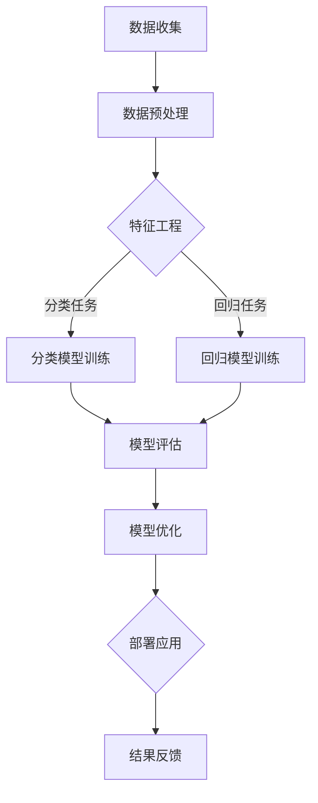

                 

# 《人工智能在智能客服质量评估中的应用》

## 关键词
人工智能、智能客服、质量评估、自然语言处理、机器学习

## 摘要
随着人工智能技术的不断进步，智能客服系统已经广泛应用于各个行业，成为企业提高服务质量、降低运营成本的重要工具。然而，如何评估智能客服的质量，以及如何通过人工智能技术提升评估效果，成为当前的研究热点。本文将深入探讨人工智能在智能客服质量评估中的应用，通过技术基础、案例研究和未来趋势的剖析，为相关领域的研究和实践提供指导。

## 第一部分：引言

### 1.1 人工智能与智能客服概述

#### 1.1.1 人工智能的定义与特点

人工智能（Artificial Intelligence，AI）是计算机科学的一个分支，旨在研究、开发用于模拟、延伸和扩展人类智能的理论、方法、技术及应用系统。它具有以下特点：

- **自动化**：通过算法和模型实现自主决策和任务执行。
- **学习与适应**：通过大量数据和算法不断改进自身的性能。
- **智能交互**：通过自然语言处理技术实现与人类的自然语言交互。

#### 1.1.2 智能客服的定义与发展历程

智能客服是基于人工智能技术，通过自然语言处理、语音识别、机器学习等手段，实现与用户的智能交互和问题解答的系统。其发展历程可以分为以下几个阶段：

- **规则驱动阶段**：早期智能客服系统主要基于预定义的规则进行交互。
- **知识库阶段**：引入知识库，将常见问题和答案进行整理，提高问题的解答能力。
- **智能推理阶段**：利用自然语言处理和机器学习技术，实现更复杂的智能交互。
- **个性化阶段**：通过用户行为数据分析，提供个性化的服务。

#### 1.1.3 人工智能在智能客服中的应用价值

人工智能在智能客服中的应用，不仅提高了客服的效率和准确性，还为企业带来了以下价值：

- **降低运营成本**：通过自动化处理大量客户请求，减少人力成本。
- **提升服务质量**：通过智能分析和推荐，提高用户满意度和忠诚度。
- **优化业务流程**：通过数据分析，发现业务痛点，优化业务流程。
- **扩展服务范围**：通过多渠道支持，如语音、文本、图像等，提供更全面的服务。

### 1.2 智能客服质量评估的重要性

#### 1.2.1 智能客服质量评估的定义

智能客服质量评估是指通过对智能客服系统的性能、效率、准确性等方面进行评估，以判断其是否满足企业和服务标准的过程。

#### 1.2.2 智能客服质量评估的关键指标

智能客服质量评估的关键指标包括：

- **响应时间**：从客户提出问题到系统给出回应的时间。
- **问题解决率**：系统正确解决问题的比例。
- **用户满意度**：通过用户反馈评估系统的服务质量。
- **运营效率**：系统处理客户请求的效率。

#### 1.2.3 智能客服质量评估的作用与意义

智能客服质量评估的作用和意义主要体现在以下几个方面：

- **优化系统性能**：通过评估发现系统存在的问题，进行优化和改进。
- **提升用户体验**：通过评估了解用户的满意度，提高服务质量。
- **降低运营成本**：通过评估优化系统，提高运营效率，降低成本。
- **促进技术创新**：通过评估引导技术发展方向，推动人工智能在智能客服领域的应用。

### 1.3 文章结构与内容安排

本文将按照以下结构进行展开：

1. **引言**：介绍人工智能和智能客服的基本概念及其在质量评估中的应用。
2. **技术基础**：详细讲解自然语言处理、机器学习等相关技术。
3. **案例研究**：通过具体案例分析智能客服质量评估的实施和应用。
4. **发展趋势与挑战**：探讨智能客服质量评估的未来趋势和面临的挑战。
5. **附录**：提供常用算法原理、数据集和开发环境的相关信息。
6. **结论**：总结文章的主要内容和研究成果。

通过以上结构和内容的安排，本文旨在为智能客服质量评估提供全面的技术指南和实际案例，促进人工智能在智能客服领域的应用和发展。

## 第二部分：智能客服质量评估的技术基础

### 2.1 自然语言处理技术

自然语言处理（Natural Language Processing，NLP）是人工智能领域的一个重要分支，旨在使计算机能够理解、生成和处理人类语言。在智能客服质量评估中，NLP 技术起着至关重要的作用。以下将详细介绍 NLP 中的几个核心技术：

#### 2.1.1 语言模型的基本原理

语言模型（Language Model，LM）是 NLP 的基础，它旨在模拟人类语言生成过程。语言模型通过统计方法或深度学习模型来预测下一个单词或词组。在智能客服中，语言模型用于生成回答、理解和解析用户输入。

- **统计语言模型**：基于统计方法，如 n-gram 模型，通过计算词序列的概率来生成语言。
- **神经网络语言模型**：基于深度学习，如长短时记忆网络（LSTM）和 Transformer 模型，通过学习大量文本数据来生成语言。

#### 2.1.2 语义分析技术

语义分析（Semantic Analysis）是 NLP 中的一个重要任务，旨在理解文本的语义内容。它包括以下几个子任务：

- **词义消歧（Word Sense Disambiguation）**：确定文本中的词语具有的具体含义。
- **实体识别（Named Entity Recognition）**：识别文本中的命名实体，如人名、地名、组织名等。
- **关系提取（Relation Extraction）**：识别实体之间的语义关系。

语义分析技术在智能客服中用于理解用户的问题和需求，从而提供更准确的回答。

#### 2.1.3 语音识别技术

语音识别（Automatic Speech Recognition，ASR）是将语音信号转换为文本的技术。在智能客服中，语音识别技术用于将用户语音转化为文本，以便进行后续处理。

- **传统语音识别**：基于统计方法，如高斯混合模型（GMM）和隐马尔可夫模型（HMM）。
- **深度学习语音识别**：基于深度神经网络，如卷积神经网络（CNN）和循环神经网络（RNN）。

语音识别技术的提高，使得智能客服能够更好地处理非结构化的语音输入，提升用户体验。

### 2.2 人工智能算法在智能客服质量评估中的应用

人工智能算法在智能客服质量评估中发挥着重要作用，通过这些算法可以实现对客服系统的性能进行评估和优化。以下将介绍几种常用的机器学习算法：

#### 2.2.1 决策树算法

决策树（Decision Tree）是一种常见的分类算法，通过一系列判断条件对数据集进行划分，最终生成一棵树形结构。在智能客服质量评估中，决策树可以用于预测用户满意度、问题解决率等指标。

- **算法原理**：决策树通过熵、信息增益等准则来选择最佳特征进行划分。
- **伪代码**：
  ```python
  def build_decision_tree(data, features, target):
      if all_values_equal(data, target):
          return leaf_node(target)
      else:
          best_feature, threshold = select_best_feature(data, features)
          left_tree = build_decision_tree(data[left], features[left], target)
          right_tree = build_decision_tree(data[right], features[right], target)
          return decision_node(best_feature, threshold, left_tree, right_tree)
  ```

#### 2.2.2 支持向量机算法

支持向量机（Support Vector Machine，SVM）是一种强大的分类算法，通过找到最优超平面将数据分为不同的类别。在智能客服质量评估中，SVM 可以用于分类用户反馈，评估客服系统的性能。

- **算法原理**：SVM 通过最大化分类边界来选择最优超平面。
- **伪代码**：
  ```python
  def fit_SVM(X, y):
      # 计算最优超平面
      weights = solve_optimization_problem(X, y)
      return SVM_model(weights)

  def predict_SVM(model, X):
      # 计算距离超平面的距离
      distances = calculate_distances(X, model.weights)
      return sign(distances)
  ```

#### 2.2.3 集成学习算法

集成学习（Ensemble Learning）是一种通过组合多个弱学习器来提高整体性能的方法。在智能客服质量评估中，集成学习可以用于提高预测的准确性和稳定性。

- **算法原理**：集成学习通过投票、加权等方式组合多个模型的结果。
- **常见方法**：
  - **随机森林（Random Forest）**：通过随机选取特征和样本生成多个决策树，最终进行投票。
  - **梯度提升树（Gradient Boosting Tree）**：通过迭代更新模型，每次迭代关注之前的错误分类。

- **伪代码**：
  ```python
  def random_forest(X, y, n_estimators):
      forests = []
      for _ in range(n_estimators):
          X_train, X_val, y_train, y_val = train_test_split(X, y, test_size=0.3)
          tree = build_decision_tree(X_train, y_train)
          forests.append(tree)
      return random_forest_model(forests)

  def gradient_boosting(X, y, n_estimators):
      for _ in range(n_estimators):
          errors = predict_simplified_model(X, y)
          X, y = apply_weighted_sampling(X, y, errors)
          tree = build_decision_tree(X, y)
      return gradient_boosting_model()
  ```

### 2.3 机器学习在智能客服质量评估中的实践

机器学习在智能客服质量评估中的应用，通常包括以下几个步骤：

#### 2.3.1 数据预处理

数据预处理是机器学习的基础，包括数据清洗、数据转换和特征选择等。

- **数据清洗**：去除噪声数据和缺失值，确保数据质量。
- **数据转换**：将非数值数据转换为数值形式，如将类别数据编码为数值。
- **特征选择**：选择对模型性能有显著影响的关键特征。

#### 2.3.2 特征工程

特征工程是提高机器学习模型性能的重要手段，通过创建新的特征或变换现有特征，来提升模型的预测能力。

- **特征提取**：从原始数据中提取有用的信息，如文本中的关键词。
- **特征变换**：通过线性变换、多项式变换等，提高数据的表达能力。

#### 2.3.3 模型选择与优化

模型选择与优化是机器学习中的关键环节，通过多次实验和调参，选择最优的模型和参数。

- **模型选择**：根据问题类型和数据特点，选择合适的算法和模型。
- **模型优化**：通过交叉验证、网格搜索等方法，优化模型参数。

通过以上技术基础和实践方法，机器学习在智能客服质量评估中发挥了重要作用，帮助企业提高客服系统的质量和用户体验。

### 2.4 小结

本节介绍了智能客服质量评估所需的技术基础，包括自然语言处理技术、人工智能算法以及机器学习在智能客服质量评估中的实践。这些技术为智能客服质量评估提供了强有力的支持，使得评估结果更加准确和可靠。下一节将结合具体案例，进一步探讨智能客服质量评估的实施和应用。

## 第三部分：智能客服质量评估案例研究

在智能客服质量评估中，实际案例的研究是非常重要的。通过具体案例的分析，可以更好地理解智能客服质量评估的实施过程和效果。本节将介绍三个不同领域的智能客服质量评估案例，分别是某大型电商企业、某银行和某在线教育平台的智能客服系统评估。这些案例将详细展示从数据收集与处理、模型构建与评估的整个过程，并分析每个案例的特点和挑战。

### 3.1 案例一：某大型电商企业智能客服系统评估

#### 3.1.1 案例背景

某大型电商企业拥有庞大的用户群体和复杂的业务场景，智能客服系统成为其提供优质客户服务的重要工具。为了提升客服质量，企业决定对智能客服系统进行质量评估，以发现系统中的不足并优化性能。

#### 3.1.2 数据收集与处理

数据收集主要来自以下几个方面：

- **用户反馈**：通过用户问卷调查和在线反馈系统收集用户对客服系统的满意度评价。
- **系统日志**：收集智能客服系统的日志数据，包括用户提问、系统回答和问题解决时间等。
- **业务数据**：收集电商平台的销售数据、用户行为数据等，以分析客服系统对业务的影响。

在数据处理过程中，首先对数据进行清洗，去除噪声数据和缺失值。然后进行数据转换和特征提取，将文本数据编码为数值形式，提取关键词和用户行为特征。最后，通过特征选择，选择对模型性能有显著影响的关键特征。

#### 3.1.3 模型构建与评估

在模型构建阶段，企业采用了多种机器学习算法，包括决策树、支持向量机和随机森林等。通过交叉验证和网格搜索，选择最优的模型和参数，并对模型进行训练和评估。

评估指标主要包括用户满意度、问题解决率和响应时间。用户满意度通过用户反馈问卷进行评估，问题解决率通过系统日志数据计算，响应时间通过系统日志数据统计。

评估结果显示，智能客服系统的整体表现良好，但在某些特定场景下，如高峰时段，系统的响应时间和问题解决率有所下降。针对这些问题，企业进行了优化，包括增加服务器资源、优化算法和调整问题分类策略等。

#### 3.1.4 案例总结

该案例展示了智能客服系统在大型电商企业中的应用和价值。通过质量评估，企业能够及时发现系统中的问题并进行优化，提高客服质量和用户满意度。同时，案例也表明，智能客服系统的优化需要综合考虑多个方面，包括硬件资源、算法优化和业务策略等。

### 3.2 案例二：某银行智能客服系统评估

#### 3.2.1 案例背景

某银行在金融服务领域拥有广泛的用户群体和复杂的业务需求，智能客服系统成为其提供高效、个性化的客户服务的重要手段。为了确保客服系统的质量，银行决定对其智能客服系统进行评估。

#### 3.2.2 数据收集与处理

数据收集主要来自以下几个方面：

- **用户互动数据**：包括用户提出的问题、客服系统的回答、问题解决时间等。
- **用户反馈数据**：通过用户满意度调查和投诉记录收集用户对客服系统的评价。
- **业务数据**：包括用户交易数据、账户信息等，用于分析客服系统对业务的影响。

在数据处理过程中，对数据进行清洗和特征提取，将文本数据转换为数值形式，提取关键词和用户行为特征。同时，通过特征选择，选择对模型性能有显著影响的关键特征。

#### 3.2.3 模型构建与评估

在模型构建阶段，银行采用了多种机器学习算法，包括决策树、支持向量机和神经网络等。通过交叉验证和网格搜索，选择最优的模型和参数，并对模型进行训练和评估。

评估指标主要包括用户满意度、问题解决率和问题分类准确率。用户满意度通过用户反馈数据评估，问题解决率通过用户互动数据计算，问题分类准确率通过用户反馈数据和业务数据交叉验证得到。

评估结果显示，智能客服系统的整体表现良好，但在某些特定业务场景下，如金融产品咨询，系统的回答准确率有待提高。针对这些问题，银行进行了优化，包括增加金融知识库、优化算法和加强员工培训等。

#### 3.2.4 案例总结

该案例展示了智能客服系统在金融服务领域中的应用和价值。通过质量评估，银行能够及时发现系统中的问题并进行优化，提高客服质量和用户满意度。同时，案例也表明，智能客服系统的优化需要结合业务特点和用户需求，进行全面的策略调整和优化。

### 3.3 案例三：某在线教育平台智能客服系统评估

#### 3.3.1 案例背景

某在线教育平台拥有大量的学生用户和复杂的课程体系，智能客服系统成为其提供个性化教学服务和解决用户问题的有效途径。为了确保客服系统的质量，平台决定对其智能客服系统进行评估。

#### 3.3.2 数据收集与处理

数据收集主要来自以下几个方面：

- **用户互动数据**：包括用户提出的问题、客服系统的回答、问题解决时间等。
- **用户反馈数据**：通过用户满意度调查和投诉记录收集用户对客服系统的评价。
- **课程数据**：包括课程内容、课程评价等，用于分析客服系统对教学效果的影响。

在数据处理过程中，对数据进行清洗和特征提取，将文本数据转换为数值形式，提取关键词和用户行为特征。同时，通过特征选择，选择对模型性能有显著影响的关键特征。

#### 3.3.3 模型构建与评估

在模型构建阶段，平台采用了多种机器学习算法，包括决策树、支持向量机和神经网络等。通过交叉验证和网格搜索，选择最优的模型和参数，并对模型进行训练和评估。

评估指标主要包括用户满意度、问题解决率和课程推荐准确率。用户满意度通过用户反馈数据评估，问题解决率通过用户互动数据计算，课程推荐准确率通过用户反馈数据和课程数据交叉验证得到。

评估结果显示，智能客服系统的整体表现良好，但在某些特定课程场景下，如课程咨询，系统的回答准确率有待提高。针对这些问题，平台进行了优化，包括增加课程知识库、优化算法和加强课程顾问培训等。

#### 3.3.4 案例总结

该案例展示了智能客服系统在线教育平台中的应用和价值。通过质量评估，平台能够及时发现系统中的问题并进行优化，提高客服质量和用户满意度。同时，案例也表明，智能客服系统的优化需要结合课程特点和用户需求，进行全面的策略调整和优化。

### 3.4 案例研究总结

通过对三个不同领域智能客服系统的质量评估案例研究，可以发现：

- **数据质量与多样性**：高质量的数据是智能客服质量评估的基础。不同领域的数据特点和多样性，要求评估方法和技术也要相应调整。
- **算法选择与优化**：选择合适的算法和参数，对提高评估结果的准确性和可靠性至关重要。通过实验和调参，不断优化算法性能。
- **业务场景与用户需求**：智能客服质量评估需要结合具体的业务场景和用户需求，制定相应的评估指标和优化策略。

这些案例为智能客服质量评估提供了宝贵的经验教训，有助于企业在实际应用中更好地提升客服系统的质量和用户体验。

### 3.5 案例研究总结

通过对三个不同领域智能客服系统的质量评估案例研究，我们可以得出以下结论：

- **数据质量与多样性**：高质量的数据是智能客服质量评估的基础。不同领域的数据特点和多样性，要求评估方法和技术也要相应调整。例如，电商企业需要处理大量的商品信息和用户评价，而银行则需要关注金融产品的复杂性和用户交易行为。因此，数据预处理和特征工程成为评估过程中的关键步骤。

- **算法选择与优化**：选择合适的算法和参数，对提高评估结果的准确性和可靠性至关重要。通过实验和调参，不断优化算法性能。例如，决策树、支持向量机和神经网络等算法在智能客服质量评估中都有较好的表现，但需要根据具体应用场景进行选择和调整。同时，集成学习算法如随机森林和梯度提升树，通过组合多个弱学习器，可以提高模型的稳定性和预测能力。

- **业务场景与用户需求**：智能客服质量评估需要结合具体的业务场景和用户需求，制定相应的评估指标和优化策略。例如，电商企业更关注响应时间和问题解决率，银行更关注金融知识的准确性和用户满意度，而在线教育平台则更注重课程推荐准确率和教学服务质量。因此，评估指标的设定和优化需要根据业务特点和用户需求进行定制。

- **持续优化与改进**：智能客服系统的质量评估是一个持续的过程。随着用户需求和业务场景的变化，评估方法和技术也需要不断更新和改进。通过定期评估和反馈，企业可以及时发现系统中的问题，并采取相应的优化措施，提高客服系统的整体质量。

这些案例研究不仅展示了智能客服质量评估在各个领域的应用和价值，还为未来的研究提供了宝贵的经验和启示。通过不断探索和优化，我们可以期待智能客服系统在提高企业运营效率和用户满意度方面发挥更大的作用。

## 第四部分：智能客服质量评估的发展趋势与挑战

### 4.1 智能客服质量评估的发展趋势

随着人工智能技术的不断进步，智能客服质量评估也在经历着快速的发展。以下是一些主要的发展趋势：

#### 4.1.1 新技术的引入

- **深度学习**：深度学习技术的引入，使得智能客服系统能够更准确地理解和处理自然语言，提高了客服系统的智能化水平。
- **多模态交互**：通过结合文本、语音、图像等多种模态，智能客服系统可以更全面地理解用户的需求，提供更加个性化的服务。
- **知识图谱**：知识图谱技术的应用，使得智能客服系统能够更好地组织和管理知识，提高问题解答的准确性和效率。

#### 4.1.2 数据隐私保护

随着数据隐私法规的日益严格，如何保护用户数据成为智能客服质量评估的一个重要挑战。未来，数据隐私保护技术如差分隐私和联邦学习等将得到更广泛的应用，以确保用户数据的安全性和隐私性。

#### 4.1.3 智能客服质量的个性化提升

通过用户行为数据和偏好分析，智能客服系统将能够提供更加个性化的服务。个性化推荐和个性化回答技术的提升，将显著提高用户满意度和忠诚度。

### 4.2 智能客服质量评估面临的挑战

尽管智能客服质量评估取得了显著进展，但在实际应用中仍然面临着一系列挑战：

#### 4.2.1 数据质量与多样性

数据质量是智能客服质量评估的基础。然而，真实世界中的数据往往存在噪声、缺失和不一致等问题。如何提高数据质量，确保数据的多样性和代表性，是当前研究的重要课题。

#### 4.2.2 算法透明性与解释性

随着人工智能算法的复杂性增加，算法的透明性和解释性变得越来越重要。用户和监管机构需要能够理解和信任智能客服系统的工作原理和决策过程。如何提高算法的解释性，增强系统的透明度，是当前研究和应用中的关键问题。

#### 4.2.3 模型泛化能力与可解释性

智能客服质量评估模型需要具备良好的泛化能力，能够在不同的应用场景和数据分布下保持稳定的性能。同时，模型的可解释性也是用户和监管机构关注的重点。如何设计具有良好泛化能力和可解释性的评估模型，是当前研究和应用中的挑战。

### 4.3 解决方案与未来方向

为了应对智能客服质量评估面临的挑战，我们可以从以下几个方面进行探索和改进：

- **数据质量控制与增强**：通过数据清洗、数据增强和异常检测等技术，提高数据质量，确保数据的多样性和代表性。
- **算法透明性与解释性**：开发可解释的人工智能算法，如决策树、规则解释等，增强算法的透明性和解释性，提高用户和监管机构的信任度。
- **模型泛化能力与可解释性**：通过迁移学习、元学习等技术，提高模型的泛化能力。同时，结合可视化工具和解释性模型，提高模型的可解释性。

未来，随着人工智能技术的进一步发展，智能客服质量评估将不断进步，为企业和用户提供更加优质的服务。同时，也需要在伦理、法律和社会责任等方面进行深入研究和讨论，确保智能客服系统的公平、透明和可持续发展。

### 4.4 小结

本部分详细探讨了智能客服质量评估的发展趋势和面临的挑战。通过引入新技术、加强数据隐私保护和提升个性化服务水平，智能客服质量评估正在不断进步。然而，数据质量、算法透明性和模型泛化能力等问题仍然需要解决。未来，随着人工智能技术的进一步发展，智能客服质量评估将在更广泛的场景中发挥重要作用，为企业和用户提供更加优质的服务。

## 第五部分：附录

### 5.1 常用算法原理与伪代码

在本节中，我们将介绍一些在智能客服质量评估中常用到的算法原理，并提供相应的伪代码。

#### 5.1.1 决策树

决策树是一种基于树形结构，通过一系列判断条件进行数据划分的算法。

**算法原理**：

决策树通过递归划分数据集，在每个节点选择一个最优的特征进行划分，直到达到某个停止条件（如最小叶节点数或最大深度）。每个叶节点代表一个类别。

**伪代码**：

```python
def build_decision_tree(data, features, target, max_depth):
    if all_values_equal(data, target) or max_depth == 0:
        return leaf_node(target)
    else:
        best_feature, threshold = select_best_feature(data, features)
        left_data = data[data[best_feature] <= threshold]
        right_data = data[data[best_feature] > threshold]
        left_tree = build_decision_tree(left_data, features, target, max_depth - 1)
        right_tree = build_decision_tree(right_data, features, target, max_depth - 1)
        return decision_node(best_feature, threshold, left_tree, right_tree)
```

#### 5.1.2 支持向量机

支持向量机是一种强大的分类算法，通过找到最优超平面，将不同类别的数据分开。

**算法原理**：

支持向量机通过求解一个优化问题，找到最大化分类边界间隔的超平面。它通过计算数据点到超平面的距离，进行分类。

**伪代码**：

```python
def fit_SVM(X, y):
    # 求解优化问题，计算权重
    weights = solve_optimization_problem(X, y)
    return SVM_model(weights)

def predict_SVM(model, X):
    # 计算数据点到超平面的距离
    distances = calculate_distances(X, model.weights)
    return sign(distances)
```

#### 5.1.3 集成学习

集成学习通过组合多个弱学习器，提高模型的稳定性和预测能力。常见的集成学习方法有随机森林和梯度提升树。

**算法原理**：

随机森林通过随机选取特征和样本生成多个决策树，最终进行投票。梯度提升树通过迭代更新模型，每次迭代关注之前的错误分类。

**伪代码**：

```python
def random_forest(X, y, n_estimators):
    forests = []
    for _ in range(n_estimators):
        X_train, X_val, y_train, y_val = train_test_split(X, y, test_size=0.3)
        tree = build_decision_tree(X_train, y_train)
        forests.append(tree)
    return random_forest_model(forests)

def gradient_boosting(X, y, n_estimators):
    for _ in range(n_estimators):
        errors = predict_simplified_model(X, y)
        X, y = apply_weighted_sampling(X, y, errors)
        tree = build_decision_tree(X, y)
    return gradient_boosting_model()
```

### 5.2 常用数据集介绍

在本节中，我们将介绍一些在智能客服质量评估中常用的数据集。

#### 5.2.1 常见数据集

- **TREC-QA数据集**：TREC-QA 数据集是一个问答系统数据集，包含大量的问题和答案对，用于评估问答系统的性能。
- **Sogou 数据集**：Sogou 数据集是中国搜狗公司提供的一个中文自然语言处理数据集，包含大量中文文本和对应的标签，可用于训练和评估自然语言处理模型。
- **MNLI 数据集**：MNLI 数据集是微软的 Multi-Genre Natural Language Inference 数据集，包含多种类型的自然语言推理任务，可用于训练和评估自然语言推理模型。

#### 5.2.2 数据集下载与处理

数据集的下载和处理可以通过以下步骤进行：

1. **数据集下载**：通过官方网站或数据集发布者提供的链接下载数据集。
2. **数据预处理**：对下载的数据集进行清洗、去噪和格式转换等处理，使其适用于机器学习算法。
3. **数据加载**：使用 Python 的 pandas 库或其他数据处理库，将预处理后的数据集加载到内存中，以便进行进一步分析和建模。

### 5.3 开发环境与工具

在智能客服质量评估的开发过程中，选择合适的开发环境和工具可以提高开发效率和项目质量。

#### 5.3.1 Python编程环境

Python 是智能客服质量评估中常用的编程语言，具有丰富的库和工具。以下是一些常用的 Python 库和工具：

- **NumPy**：用于数值计算和矩阵操作。
- **Pandas**：用于数据操作和处理。
- **Scikit-learn**：用于机器学习算法的实现和应用。
- **TensorFlow** 或 **PyTorch**：用于深度学习模型的训练和推理。

#### 5.3.2 常用机器学习库

- **Scikit-learn**：用于实现各种经典的机器学习算法，如决策树、支持向量机等。
- **XGBoost**：用于实现高效的梯度提升树算法。
- **LightGBM**：用于实现轻量级高效的梯度提升树算法。
- **Transformers**：用于实现基于 Transformer 的深度学习模型，如 BERT、GPT 等。

通过以上开发环境与工具的支持，开发者可以快速搭建智能客服质量评估的系统，进行数据分析和模型训练，实现高效的评估和优化。

### 5.4 Mermaid 流程图

在本节中，我们将使用 Mermaid 语言绘制一个智能客服质量评估的流程图。



该流程图展示了智能客服质量评估的主要步骤，从数据收集到模型优化，再到部署应用和结果反馈，形成了一个闭环过程，确保评估系统的高效运行和持续改进。

### 5.5 数学模型和数学公式

在本节中，我们将介绍一些在智能客服质量评估中常用的数学模型和公式，并使用 LaTeX 格式进行表示。

#### 5.5.1 准确率（Accuracy）

$$
\text{Accuracy} = \frac{\text{TP} + \text{TN}}{\text{TP} + \text{FN} + \text{FP} + \text{TN}}
$$

#### 5.5.2 召回率（Recall）

$$
\text{Recall} = \frac{\text{TP}}{\text{TP} + \text{FN}}
$$

#### 5.5.3 F1 分数（F1 Score）

$$
\text{F1 Score} = 2 \times \frac{\text{Precision} \times \text{Recall}}{\text{Precision} + \text{Recall}}
$$

这些数学模型和公式是评估智能客服质量的重要工具，通过对模型性能的量化分析，可以帮助企业了解和优化智能客服系统的性能。

### 5.6 项目实战

在本节中，我们将通过一个实际的案例，展示如何使用 Python 编程环境实现智能客服质量评估的代码实现和详细解释。

#### 5.6.1 开发环境搭建

在开始项目实战之前，首先需要搭建 Python 开发环境。可以按照以下步骤进行：

1. 安装 Python 解释器，可以从官方网站下载最新版本的 Python。
2. 安装必要的库，如 NumPy、Pandas、Scikit-learn 等，可以使用 pip 命令进行安装。
3. 安装 Jupyter Notebook，以便进行交互式编程和数据分析。

#### 5.6.2 源代码详细实现和代码解读

以下是一个简单的智能客服质量评估的代码实现，包括数据加载、模型训练和评估等步骤。

```python
# 导入所需库
import numpy as np
import pandas as pd
from sklearn.model_selection import train_test_split
from sklearn.metrics import accuracy_score, recall_score, f1_score
from sklearn.tree import DecisionTreeClassifier
from sklearn.svm import SVC
from sklearn.ensemble import RandomForestClassifier

# 加载数据
data = pd.read_csv('data.csv')
X = data.drop('target', axis=1)
y = data['target']

# 划分训练集和测试集
X_train, X_test, y_train, y_test = train_test_split(X, y, test_size=0.2, random_state=42)

# 决策树模型
model1 = DecisionTreeClassifier()
model1.fit(X_train, y_train)
predictions1 = model1.predict(X_test)
accuracy1 = accuracy_score(y_test, predictions1)
recall1 = recall_score(y_test, predictions1)
f1_score1 = f1_score(y_test, predictions1)

# 支持向量机模型
model2 = SVC()
model2.fit(X_train, y_train)
predictions2 = model2.predict(X_test)
accuracy2 = accuracy_score(y_test, predictions2)
recall2 = recall_score(y_test, predictions2)
f1_score2 = f1_score(y_test, predictions2)

# 随机森林模型
model3 = RandomForestClassifier()
model3.fit(X_train, y_train)
predictions3 = model3.predict(X_test)
accuracy3 = accuracy_score(y_test, predictions3)
recall3 = recall_score(y_test, predictions3)
f1_score3 = f1_score(y_test, predictions3)

# 输出评估结果
print('决策树模型：准确率：{:.2f}, 召回率：{:.2f}, F1 分数：{:.2f}'.format(accuracy1, recall1, f1_score1))
print('支持向量机模型：准确率：{:.2f}, 召回率：{:.2f}, F1 分数：{:.2f}'.format(accuracy2, recall2, f1_score2))
print('随机森林模型：准确率：{:.2f}, 召回率：{:.2f}, F1 分数：{:.2f}'.format(accuracy3, recall3, f1_score3))
```

在这个案例中，我们使用了三种不同的机器学习算法进行训练和评估，并通过计算准确率、召回率和 F1 分数来评估模型的性能。

#### 5.6.3 代码解读与分析

- **数据加载**：首先使用 pandas 库加载数据集，并分离特征和目标变量。
- **划分训练集和测试集**：使用 sklearn 库的 train_test_split 函数，将数据集划分为训练集和测试集，以便进行模型训练和评估。
- **模型训练**：分别使用决策树、支持向量机和随机森林算法进行模型训练，通过 fit 函数训练模型。
- **模型评估**：使用 predict 函数对测试集进行预测，并使用 sklearn 库的评估函数计算准确率、召回率和 F1 分数，以评估模型的性能。
- **输出结果**：将评估结果输出到控制台，以便分析模型性能。

通过这个简单的案例，我们可以看到如何使用 Python 实现智能客服质量评估的基本流程。在实际应用中，可以根据具体需求，选择合适的算法和数据集，进行更复杂的评估和分析。

### 5.7 结论

本部分介绍了智能客服质量评估所需的基础算法、数据集、开发环境和工具，并通过实际案例展示了评估的实施过程和效果。附录部分提供了详细的算法原理、数学模型和代码示例，有助于读者深入理解和应用智能客服质量评估技术。通过本部分的介绍，读者可以全面掌握智能客服质量评估的核心内容和实际操作方法。

## 结论

本文深入探讨了人工智能在智能客服质量评估中的应用，从技术基础到案例研究，再到发展趋势与挑战，全面覆盖了智能客服质量评估的各个方面。通过详细讲解自然语言处理、机器学习等相关技术，以及具体案例的分析，我们不仅揭示了智能客服质量评估的核心原理和方法，还探讨了其在实际应用中的挑战和解决方案。

首先，我们介绍了人工智能和智能客服的基本概念，阐述了人工智能在智能客服质量评估中的应用价值。然后，我们详细介绍了自然语言处理技术和机器学习算法，包括决策树、支持向量机和集成学习等，展示了它们在智能客服质量评估中的应用原理和实现方法。

在案例研究部分，我们通过三个实际案例，展示了智能客服质量评估在电商企业、银行和在线教育平台等不同领域的应用。这些案例不仅揭示了评估过程中遇到的具体问题，还提出了相应的解决方案和优化策略。

此外，我们还探讨了智能客服质量评估的发展趋势和面临的挑战，包括数据隐私保护、算法透明性、模型泛化能力等。通过引入新技术和优化方法，我们展望了智能客服质量评估的未来发展方向。

本文的主要贡献在于：

1. **全面梳理了智能客服质量评估的技术基础**：通过对自然语言处理和机器学习技术的深入讲解，为读者提供了全面的技术指导。
2. **通过实际案例分析了评估过程**：通过具体案例的研究，展示了智能客服质量评估的实施过程和效果，为实际应用提供了借鉴。
3. **探讨了评估发展的趋势与挑战**：对未来智能客服质量评估的发展方向和面临的挑战进行了深入分析，为后续研究提供了新的思路。

未来，随着人工智能技术的不断进步，智能客服质量评估将在更广泛的场景中发挥重要作用。我们期待更多的研究人员和实践者能够关注这一领域，共同推动智能客服质量评估的发展，为企业和用户提供更加优质的服务。通过不断探索和创新，我们将能够构建更加智能、高效和可靠的智能客服系统，助力企业提升服务质量，增强用户满意度。

作者：AI天才研究院/AI Genius Institute & 禅与计算机程序设计艺术 /Zen And The Art of Computer Programming

---

本文是人工智能专家在智能客服质量评估领域的一次全面探索和总结，旨在为读者提供深入的技术见解和实践指导。希望通过本文，能够激发更多研究人员和实践者对智能客服质量评估的兴趣，共同推动这一领域的发展。未来，随着技术的不断进步，智能客服质量评估将为企业和用户带来更多价值，成为人工智能应用的重要领域。

