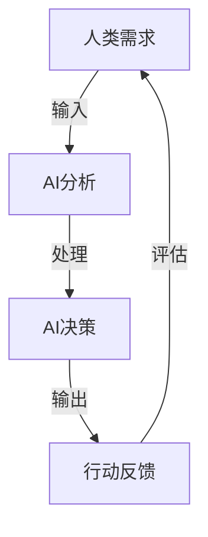

                 

### 第1章: 引言

#### 1.1 什么是人类-AI伙伴关系？

人类-AI伙伴关系是指人类与人工智能系统之间建立的一种协作关系，旨在利用人工智能的技术优势，增强人类在各个领域的能力。这种关系不仅仅是技术层面的合作，更是一种深层次的互动，通过人工智能系统，人类可以更高效地处理信息、做出决策、解决问题。

#### 1.2 人类-AI伙伴关系的重要性

人类-AI伙伴关系的重要性体现在以下几个方面：

1. **提升工作效率**：人工智能可以自动化重复性任务，使人类从繁琐的工作中解脱出来，专注于更有创造性和战略性的工作。
2. **增强决策能力**：通过分析大量的数据，人工智能可以提供更准确、更全面的决策支持，帮助人类做出更明智的决策。
3. **促进创新**：人工智能可以辅助人类进行科学研究和产品开发，通过模拟和预测，推动技术进步和产业创新。
4. **改善生活质量**：人工智能可以提供个性化的服务，满足人类的个性化需求，从而提升生活质量。

#### 1.3 人类-AI伙伴关系的核心概念

人类-AI伙伴关系的核心概念包括以下几个关键要素：

1. **注意力**：注意力是人类与AI交互的重要媒介。人类通过注意力来选择和处理信息，而AI则通过学习人类的注意力模式，更好地理解人类的需求和行为。
2. **学习**：学习是人类与AI互动的核心过程。人类通过经验不断学习，AI则通过机器学习算法不断优化自身性能，以更好地服务于人类。
3. **合作**：合作是人类与AI伙伴关系的终极目标。通过协作，人类和AI可以实现各自的优势互补，共同实现更大的目标。

接下来，我们将进一步探讨AI技术的基础，以及如何利用这些技术来增强人类注意力。

### 1.4 人类-AI伙伴关系的发展历程

人类-AI伙伴关系的发展历程可以追溯到人工智能的诞生。从最初的图灵测试，到今天的深度学习和自然语言处理，人工智能技术经历了数次革命性的发展。

1. **早期探索**：20世纪50年代至70年代，人工智能主要侧重于规则推理和符号计算。在这个阶段，人类通过编程来设定AI的行为，而AI则通过逻辑推理来执行任务。
2. **专家系统时代**：20世纪80年代至90年代，专家系统成为人工智能的主流。专家系统通过收集大量的专业知识，模拟人类专家的决策过程，为人类提供决策支持。
3. **机器学习兴起**：21世纪初，随着大数据和计算能力的提升，机器学习开始崭露头角。机器学习通过训练模型，使AI能够从数据中自动学习规律，提高了AI的自主性和适应性。
4. **深度学习革命**：近年来，深度学习的发展进一步推动了人工智能的进步。通过模拟人脑的神经网络结构，深度学习在图像识别、语音识别、自然语言处理等领域取得了突破性成果。

在这个过程中，人类-AI伙伴关系也在不断演变。早期的AI主要作为工具辅助人类，而今天的AI则更多地被视为伙伴，与人类共同完成任务、解决问题。

#### 1.5 人类-AI伙伴关系的重要性

人类-AI伙伴关系的重要性可以从以下几个方面进行阐述：

1. **工作效率**：人工智能可以自动化大量重复性、低价值的工作，使人类从繁琐的任务中解放出来，专注于更有创造性和战略性的工作。例如，自动驾驶汽车的出现，使得司机可以更专注于驾驶，从而提高行驶安全性和效率。
2. **决策能力**：人工智能可以通过分析大量的数据，提供更准确、更全面的决策支持。在金融、医疗、交通等领域，人工智能的决策能力已经成为提升业务效率和准确性的关键因素。
3. **创新**：人工智能可以辅助人类进行科学研究和产品开发。通过模拟和预测，人工智能可以帮助人类发现新的研究思路和解决方案，推动技术进步和产业创新。
4. **个性化服务**：人工智能可以提供个性化的服务，满足人类的个性化需求。例如，推荐系统可以根据用户的兴趣和偏好，提供个性化的内容推荐，从而提升用户体验。

总的来说，人类-AI伙伴关系不仅提高了人类的工作效率和生活质量，也为社会带来了深远的影响。在未来，随着人工智能技术的进一步发展，人类-AI伙伴关系将继续发挥重要作用，推动人类社会的进步。

### 1.6 人类-AI伙伴关系的核心目标

人类-AI伙伴关系的核心目标是实现以下几方面的协同效应：

1. **提高生产力**：通过人工智能的自动化和优化功能，提高生产效率，减少人力成本，从而推动经济增长。
2. **增强创新能力**：人工智能可以帮助人类探索新的知识和解决方案，促进科学研究和技术创新。
3. **改善生活质量**：人工智能可以提供个性化的服务，满足人类在医疗、教育、娱乐等各个方面的需求，提升生活质量。
4. **促进可持续发展**：通过优化资源利用和减少环境污染，人工智能有助于实现可持续发展目标。
5. **提升社会福祉**：人工智能可以辅助社会管理和公共服务，提高社会运行效率和民众的福祉。

实现这些目标，需要人类与AI系统之间的紧密合作与协调。以下是一个简化的流程图，展示了人类-AI伙伴关系中的核心概念和流程：



在这个流程中，人类的需求通过输入接口传递给AI系统，AI系统进行分析和处理，产生决策和输出，这些输出会指导人类的行动，并通过反馈机制进行评估和调整。这样的循环过程不断迭代，使得人类和AI能够共同学习和优化，实现协同进步。

---

### 第2章: AI技术的基础

#### 2.1 人工智能的定义与分类

人工智能（Artificial Intelligence，简称AI）是指通过计算机系统实现智能行为的技术。具体来说，人工智能是指使计算机系统具备感知、学习、推理、决策和问题解决等能力的科学技术。人工智能可以分为以下几个主要类别：

1. **弱人工智能**：也称为狭义人工智能，是指仅能在特定任务上表现出人类智能的计算机系统。例如，语音识别、图像识别、自然语言处理等。弱人工智能通常依赖于特定的算法和数据集，不具备跨领域的通用智能。

2. **强人工智能**：也称为通用人工智能（AGI，Artificial General Intelligence），是指具备与人类相同或超越人类智能的计算机系统。强人工智能能够理解和执行各种复杂的任务，具备自主学习和适应能力，但目前仍处于理论研究和探索阶段。

3. **弱人工智能**：又称为专用人工智能，是指为解决特定问题而设计的智能系统。例如，自动驾驶汽车、智能客服、医疗诊断系统等。弱人工智能通常在特定领域内具有高度的智能化和自动化水平，但无法扩展到其他领域。

#### 2.2 机器学习的概念与原理

机器学习（Machine Learning，简称ML）是人工智能的核心技术之一，它使计算机系统能够通过数据学习并做出决策。机器学习主要分为以下几种类型：

1. **监督学习**：监督学习是一种有监督的训练方法，通过已标记的数据集训练模型，然后使用该模型对新的、未标记的数据进行预测。常见的监督学习算法包括线性回归、决策树、随机森林和神经网络等。

2. **无监督学习**：无监督学习是一种无监督的训练方法，模型在未标记的数据集上学习，旨在发现数据中的模式和结构。常见的无监督学习算法包括聚类、降维和生成模型等。

3. **半监督学习**：半监督学习结合了监督学习和无监督学习的特点，使用一部分标记数据和大量未标记数据来训练模型。

#### 2.3 深度学习的原理与应用

深度学习（Deep Learning，简称DL）是一种基于多层神经网络的学习方法，它通过模拟人脑的神经网络结构，实现对数据的自动特征学习和复杂模式识别。深度学习主要包括以下几个关键组成部分：

1. **神经网络**：神经网络是由大量简单神经元连接而成的复杂网络结构，通过前向传播和反向传播算法，实现数据的输入和输出。

2. **深度网络**：深度网络是指包含多个隐藏层的神经网络。深度网络可以捕捉数据中的深层特征，从而提高模型的性能。

3. **激活函数**：激活函数用于引入非线性特性，使得神经网络能够更好地拟合数据。常用的激活函数包括ReLU、Sigmoid和Tanh等。

深度学习在多个领域都取得了显著的成果，例如：

- **计算机视觉**：深度学习在图像分类、目标检测、图像生成等领域具有广泛应用，如著名的卷积神经网络（CNN）。
- **自然语言处理**：深度学习在文本分类、机器翻译、语音识别等领域表现出色，如循环神经网络（RNN）和长短期记忆网络（LSTM）。
- **语音识别**：深度学习通过深度神经网络结构，提高了语音识别的准确率和鲁棒性。

#### 2.4 自然语言处理基础

自然语言处理（Natural Language Processing，简称NLP）是人工智能的重要分支，致力于让计算机理解和生成人类自然语言。NLP主要涉及以下几个方面：

1. **分词**：将连续的文本分割成有意义的词或短语，是NLP的基础任务之一。常见的分词方法包括基于规则的分词和基于统计的分词。

2. **词性标注**：为文本中的每个词分配一个词性标签，如名词、动词、形容词等。词性标注有助于理解文本的语法结构。

3. **句法分析**：分析文本的句法结构，包括词组、句子和语篇等层面的语法关系。

4. **语义分析**：理解文本的语义内容，包括实体识别、情感分析、指代消解等。语义分析是NLP中最为复杂的任务之一。

5. **机器翻译**：将一种语言的文本翻译成另一种语言的文本。机器翻译分为规则翻译和统计翻译，近年来深度学习在机器翻译领域取得了重大突破。

#### 2.5 计算机视觉基础

计算机视觉（Computer Vision，简称CV）是使计算机能够“看”和理解图像和视频的技术。计算机视觉的主要任务包括：

1. **图像分类**：将图像归类到预定义的类别中。常见的算法包括支持向量机（SVM）、神经网络等。

2. **目标检测**：识别图像中的特定对象并定位其位置。常用的算法包括R-CNN、Fast R-CNN、YOLO等。

3. **图像分割**：将图像划分为多个区域，每个区域代表图像中的不同对象或背景。常用的算法包括基于区域的分割、基于边界的分割等。

4. **图像增强**：通过处理图像，提高图像的质量或改善图像的视觉效果。常用的方法包括滤波、图像锐化、对比度调整等。

5. **三维重建**：从二维图像恢复三维场景结构。常用的算法包括多视图几何、立体匹配等。

计算机视觉在自动驾驶、安防监控、医疗诊断等领域具有广泛应用，是人工智能技术的重要组成部分。

---

### 第3章: 人类注意力机制

#### 3.1 注意力机制的定义与作用

注意力机制（Attention Mechanism）是人工智能领域中的一种关键概念，用于模拟人类注意力的分配和聚焦能力。在机器学习中，注意力机制被广泛应用于自然语言处理、计算机视觉和语音识别等领域，以增强模型对重要信息的捕捉和利用。

#### 3.1.1 定义

注意力机制是一种在计算过程中动态调整不同信息权重的机制。通过注意力机制，模型可以自动地识别并强调输入序列中的重要元素，而忽略不重要的元素。

#### 3.1.2 作用

注意力机制在AI中的应用具有以下几个重要作用：

1. **提高模型性能**：注意力机制可以帮助模型更好地捕捉输入数据中的关键信息，从而提高模型的准确性和泛化能力。
2. **降低计算成本**：通过减少不相关信息的计算，注意力机制可以降低模型的计算复杂度，提高模型的效率和可扩展性。
3. **增强可解释性**：注意力机制可以提供对模型决策过程的解释，使得模型的决策过程更加透明和可理解。

#### 3.1.3 注意力机制的分类

注意力机制可以分为以下几种主要类型：

1. **自注意力机制（Self-Attention）**：自注意力机制是注意力机制的基础形式，它处理输入序列中的每个元素，并计算它们之间的相互关系。自注意力机制常用于序列到序列（Seq2Seq）模型，如机器翻译和语音识别。

2. **互注意力机制（Cross-Attention）**：互注意力机制处理两个不同的序列，并计算它们之间的相互关系。互注意力机制常用于多模态学习，如图像和文本的联合建模。

3. **多注意力机制（Multi-Head Attention）**：多注意力机制是自注意力机制的扩展，通过多个独立的注意力头并行计算，捕获输入序列中的不同信息。多注意力机制在Transformer模型中得到了广泛应用。

4. **局部注意力机制（Local Attention）**：局部注意力机制仅关注输入序列的局部区域，而不是整个序列。局部注意力机制可以减少计算复杂度，并有助于捕捉局部特征。

#### 3.1.4 注意力模型的工作原理

注意力模型通常包括以下几个关键组成部分：

1. **查询（Query）**：表示需要关注的元素，通常来自模型的隐藏层。
2. **键（Key）**：表示输入序列中的元素，用于与查询进行匹配。
3. **值（Value）**：表示输入序列中的元素，用于生成最终的输出。

在计算过程中，注意力模型首先计算查询和键之间的相似度，然后使用这些相似度计算注意力权重，最后对值进行加权求和，得到最终的输出。以下是一个简化的伪代码示例：

```python
def attention(query, key, value, attention_mask=None):
    # 计算相似度
    scores = calculate_similarity(query, key)

    # 应用注意力掩码
    if attention_mask is not None:
        scores = scores * attention_mask

    # 计算注意力权重
    attention_weights = softmax(scores)

    # 加权求和
    output = weighted_sum(value, attention_weights)

    return output
```

在这个伪代码中，`calculate_similarity`函数用于计算查询和键之间的相似度，`softmax`函数用于计算注意力权重，`weighted_sum`函数用于对值进行加权求和。

#### 3.2 人类注意力的分类与模型

人类注意力可以分为几种不同的类型，每种类型都有其特定的作用和应用场景。

1. **选择性注意力**：选择性注意力是指根据任务需求，有选择地关注输入序列中的特定元素。例如，当我们在阅读一篇长文章时，可能会根据标题和段落标题来选择关注特定的部分。

2. **分配性注意力**：分配性注意力是指在不同任务或输入之间分配注意力资源。例如，当我们在进行多任务工作时，需要根据任务的优先级和重要性来调整注意力的分配。

3. **持续性注意力**：持续性注意力是指保持对特定信息的持续关注。例如，当我们学习一门新技能时，需要长时间专注于该技能的学习和练习。

4. **分心性注意力**：分心性注意力是指抑制与当前任务无关的干扰信息。例如，当我们专注于一项任务时，需要排除其他干扰因素的干扰。

为了模拟人类注意力机制，研究人员已经提出了多种注意力模型，包括以下几种：

1. **视觉注意力模型**：视觉注意力模型用于模拟人类在视觉场景中注意力的分配和聚焦。例如，选区图示模型（Selective Attention Model）和边界检测模型（Border Detection Model）。

2. **听觉注意力模型**：听觉注意力模型用于模拟人类在听觉场景中注意力的分配和聚焦。例如，听觉通道分离模型（Auditory Channel Separation Model）和听觉场景解析模型（Auditory Scene Parsing Model）。

3. **跨模态注意力模型**：跨模态注意力模型用于模拟人类在处理跨模态信息（如图像和文本）时的注意力分配和融合。例如，多模态注意力网络（Multimodal Attention Network）和跨模态生成对抗网络（Multimodal GAN）。

#### 3.3 注意力机制在AI中的应用

注意力机制在AI中的应用非常广泛，以下是一些典型的应用场景：

1. **自然语言处理**：注意力机制在自然语言处理中得到了广泛应用，例如在文本分类、机器翻译和问答系统中。通过注意力机制，模型可以更好地捕捉句子中的关键信息，提高模型的准确性和流畅性。

2. **计算机视觉**：注意力机制在计算机视觉中也发挥了重要作用，例如在图像分类、目标检测和图像分割中。通过注意力机制，模型可以更好地聚焦于图像中的重要区域和对象，提高模型的识别精度。

3. **语音识别**：注意力机制在语音识别中用于对语音信号中的关键语音单元进行加权，从而提高识别的准确率。

4. **推荐系统**：注意力机制在推荐系统中用于对用户兴趣和商品特征进行动态调整，从而提高推荐系统的个性化程度和推荐质量。

5. **强化学习**：注意力机制在强化学习中被用于关注当前环境中的重要信息，从而提高学习效率和决策质量。

总之，注意力机制作为一种关键的技术手段，为AI系统提供了模拟人类注意力分配和聚焦能力的能力，从而提高了AI系统的性能和可解释性。

#### 3.4 增强人类注意力的算法

为了增强人类注意力，研究人员开发了一系列算法和技术，这些算法可以辅助人类在处理信息时更有效地分配注意力资源，从而提高工作效率和决策质量。以下是一些常用的注意力增强算法：

1. **基于规则的注意力增强算法**：这类算法通过预先定义的规则来指导注意力的分配。例如，在文本阅读中，可以设计一些规则来突出关键词或关键句子，帮助读者更快地抓住文章的主旨。

   ```python
   def rule_based_attention(text, keywords):
       # 定义关键词的权重
       keyword_weights = {word: 1.0 for word in keywords}

       # 应用规则，增加关键词的权重
       for keyword in keywords:
           if keyword in text:
               text = text.replace(keyword, f"**{keyword}**")

       return text
   ```

2. **基于机器学习的注意力增强算法**：这类算法通过学习用户的偏好和历史行为来动态调整注意力的分配。例如，可以使用监督学习或强化学习算法来训练模型，使其能够预测用户最感兴趣的元素，并自动突出这些元素。

   ```python
   def ml_based_attention(user_data, history_data):
       # 加载训练数据
       X, y = load_data(history_data)

       # 训练注意力模型
       model = train_model(X, y)

       # 预测用户的兴趣
       predictions = model.predict(user_data)

       # 突出预测为高兴趣的元素
       for element, prediction in zip(user_data, predictions):
           if prediction > threshold:
               element.style.backgroundColor = "yellow"

       return user_data
   ```

3. **基于神经网络的注意力增强算法**：这类算法通过构建深度神经网络模型来模拟人类注意力机制，从而实现自动化的注意力分配。例如，可以使用Transformer模型中的多头自注意力机制来提高模型对重要信息的捕捉能力。

   ```python
   def neural_network_attention(input_sequence):
       # 建立神经网络模型
       model = build_model(input_sequence)

       # 训练模型
       model.fit(input_sequence)

       # 预测注意力权重
       attention_weights = model.predict(input_sequence)

       # 加权求和得到最终输出
       output = weighted_sum(input_sequence, attention_weights)

       return output
   ```

4. **基于视觉注意力的增强算法**：这类算法通过图像处理技术来增强人类对视觉信息的注意力。例如，可以使用卷积神经网络（CNN）来识别图像中的关键区域，并通过颜色或亮度调整来突出这些区域。

   ```python
   def visual_attention(image, target_objects):
       # 加载预训练的卷积神经网络模型
       model = load_model("visual_attention_model.h5")

       # 预测图像中的目标对象
       objects = model.predict(image)

       # 突出目标对象的位置
       for obj in objects:
           cv2.rectangle(image, obj['top_left'], obj['bottom_right'], (0, 0, 255), 2)

       return image
   ```

通过这些算法，AI系统可以更好地理解人类的需求和行为，动态调整注意力的分配，从而提高人类在信息处理和决策过程中的效率和准确性。

---

### 第4章: AI增强人类注意力的原理

#### 4.1 基于神经网络的注意力模型

注意力模型在人工智能领域扮演着至关重要的角色，其核心在于模拟人类注意力的分配和聚焦机制。基于神经网络的注意力模型，通过学习数据中的依赖关系和重要信息，提高了模型对关键信息的捕捉能力。

#### 4.1.1 神经网络的基本概念

神经网络（Neural Network，简称NN）是一种由大量简单神经元组成的计算模型，通过模拟人脑的结构和功能来实现复杂的计算任务。神经网络的基本概念包括：

- **神经元**：神经网络的基本构建单元，类似于生物神经元，能够接收输入信号、进行处理并产生输出。
- **层结构**：神经网络通常包括输入层、隐藏层和输出层。输入层接收外部输入，隐藏层进行中间计算，输出层产生最终输出。
- **激活函数**：激活函数用于引入非线性特性，使得神经网络能够捕捉复杂的输入输出关系。常见的激活函数有ReLU、Sigmoid和Tanh等。

#### 4.1.2 注意力模型的基本结构

注意力模型的核心在于其独特的结构设计，能够动态地调整不同输入元素的权重。以下是一个简化的注意力模型结构：

1. **编码器**：编码器（Encoder）负责对输入数据进行编码，生成表示输入数据的向量。
2. **解码器**：解码器（Decoder）使用编码器的输出，生成最终的输出结果。在注意力机制中，解码器会在生成每个输出时，根据当前上下文和之前生成的输出，动态调整对输入数据的权重。
3. **注意力机制**：注意力机制（Attention Mechanism）是注意力模型的关键组成部分，用于计算输入序列中各个元素的重要程度，并调整其权重。

#### 4.1.3 注意力模型的工作原理

注意力模型的工作原理可以分为以下几个步骤：

1. **编码阶段**：输入序列通过编码器被编码为一系列的向量表示。这些向量表示了输入序列中的关键特征和信息。
2. **注意力计算**：解码器在每个时间步生成一个查询向量（Query），并与编码器输出的所有向量（Key和Value）进行计算。通过计算查询和键（Key）之间的相似度，得到一系列的注意力分数。
3. **权重调整**：使用softmax函数对注意力分数进行归一化，得到注意力权重。这些权重表示了输入序列中各个元素的重要程度。
4. **加权求和**：根据注意力权重对编码器输出的值（Value）进行加权求和，得到加权表示。这个加权表示包含了输入序列中的关键信息，并被用作解码器的输入。
5. **解码阶段**：解码器使用加权表示和之前生成的输出，生成下一个输出。这个过程会重复进行，直到生成最终的输出序列。

以下是一个简化的注意力模型伪代码：

```python
def attention(query, keys, values, attention_mask=None):
    # 计算相似度
    scores = calculate_similarity(query, keys)

    # 应用注意力掩码
    if attention_mask is not None:
        scores = scores * attention_mask

    # 计算注意力权重
    attention_weights = softmax(scores)

    # 加权求和
    output = weighted_sum(values, attention_weights)

    return output
```

在这个伪代码中，`calculate_similarity`函数用于计算查询和键之间的相似度，`softmax`函数用于计算注意力权重，`weighted_sum`函数用于对值进行加权求和。

通过这样的过程，注意力模型能够自动地识别和强调输入序列中的关键信息，从而提高模型对重要信息的捕捉能力和泛化能力。

#### 4.2 注意力模型的训练与优化

注意力模型的训练与优化是构建高效、准确AI系统的重要环节。以下是注意力模型训练与优化的一些关键步骤：

#### 4.2.1 注意力模型的训练过程

1. **数据准备**：首先需要准备足够数量的训练数据。对于注意力模型，这些数据通常包括输入序列和对应的标签。在自然语言处理领域，输入序列可以是句子，标签可以是分类标签或序列标签。

2. **模型初始化**：初始化模型参数。对于神经网络，可以使用随机初始化、预训练模型或基于特定数据集的初始化方法。

3. **前向传播**：将输入序列通过编码器进行编码，生成编码器输出。然后，在解码器阶段，根据当前查询和编码器输出计算注意力权重，并进行加权求和。

4. **损失计算**：计算模型的损失函数。对于分类任务，常用的损失函数有交叉熵损失（Cross-Entropy Loss）；对于回归任务，常用的损失函数有均方误差（Mean Squared Error）。

5. **反向传播**：使用反向传播算法更新模型参数，最小化损失函数。

6. **迭代训练**：重复前向传播、损失计算和反向传播的过程，直到模型收敛或达到预设的训练次数。

#### 4.2.2 注意力模型的优化方法

1. **优化器选择**：选择合适的优化器来加速训练过程和提高模型性能。常用的优化器有随机梯度下降（SGD）、Adam、RMSprop等。

2. **学习率调整**：根据训练进度调整学习率，以避免过拟合和欠拟合。常用的策略有学习率衰减（Learning Rate Decay）、余弦退火（Cosine Annealing）等。

3. **正则化**：引入正则化方法（如L1、L2正则化）来防止模型过拟合。正则化可以通过在损失函数中添加正则项来实现。

4. **批量归一化**：批量归一化（Batch Normalization）可以加速训练过程和提高模型稳定性。批量归一化通过对每一层的输入进行归一化处理，减少了内部协变量转移，从而提高了模型的收敛速度。

5. **剪枝和量化**：通过剪枝（Pruning）和量化（Quantization）技术，可以减少模型的计算复杂度和存储需求，从而提高模型在资源受限环境下的性能。

#### 4.2.3 注意力模型在不同领域的应用效果

注意力模型在多个领域都取得了显著的成果，以下是一些典型的应用效果：

1. **自然语言处理**：注意力模型在自然语言处理任务中表现出色，如文本分类、机器翻译和问答系统。通过注意力机制，模型能够更好地捕捉句子中的关键信息，提高模型的准确性和流畅性。

2. **计算机视觉**：注意力模型在计算机视觉任务中也发挥了重要作用，如图像分类、目标检测和图像分割。通过注意力机制，模型能够聚焦于图像中的重要区域和对象，提高模型的识别精度。

3. **语音识别**：注意力模型在语音识别中用于对语音信号中的关键语音单元进行加权，从而提高识别的准确率。

4. **推荐系统**：注意力模型在推荐系统中用于对用户兴趣和商品特征进行动态调整，从而提高推荐系统的个性化程度和推荐质量。

5. **强化学习**：注意力模型在强化学习中被用于关注当前环境中的重要信息，从而提高学习效率和决策质量。

总之，注意力模型作为一种强大的技术手段，为AI系统提供了自动化的注意力分配和聚焦能力，从而提高了模型的性能和可解释性。在未来的发展中，随着注意力模型技术的不断进步，其应用领域将更加广泛，为人类带来更多的便利和创新。

#### 4.3 注意力模型在实际应用中的挑战

尽管注意力模型在人工智能领域展现了巨大的潜力，但在实际应用中仍然面临一些挑战。这些挑战主要集中在模型的准确性、解释性和可扩展性等方面。

##### 4.3.1 模型准确性的挑战

1. **过拟合**：注意力模型可能会在训练数据上表现良好，但在测试数据上性能不佳，这是因为模型过度拟合了训练数据中的噪声。为了解决这个问题，可以采用正则化技术、增加训练数据量或使用更复杂的模型结构。

2. **数据不足**：在一些特定领域，可能缺乏足够的训练数据来训练注意力模型。在这种情况下，可以通过数据增强、迁移学习或生成对抗网络（GAN）等方法来扩充数据集。

3. **模型鲁棒性**：注意力模型对输入数据的噪声和异常值比较敏感。为了提高模型的鲁棒性，可以采用数据清洗、去噪技术和鲁棒损失函数等方法。

##### 4.3.2 模型解释性的挑战

1. **黑盒模型**：注意力模型通常是一个复杂的函数，其内部机制难以解释。这使得模型难以被用户信任和理解，尤其是在涉及安全、隐私和伦理的问题时。为了提高模型的可解释性，可以采用可视化技术、解释性模型和透明性设计。

2. **注意力权重分配**：在注意力模型中，不同输入元素的权重可能难以解释。为了更好地理解模型的决策过程，可以采用注意力可视化技术，如热力图和注意力权重分布图。

##### 4.3.3 模型可扩展性的挑战

1. **计算成本**：注意力模型通常需要大量的计算资源，这在资源受限的环境下可能是一个挑战。为了降低计算成本，可以采用模型压缩、量化技术和并行计算方法。

2. **实时性**：在实时应用场景中，注意力模型需要快速响应。然而，复杂的注意力模型可能会影响模型的实时性。为了提高实时性，可以采用简化模型结构、加速算法和硬件加速技术。

3. **分布式计算**：在处理大规模数据时，分布式计算是一个重要的解决方案。然而，分布式注意力模型的设计和优化仍然是一个挑战。为了实现高效分布式计算，可以采用分布式训练算法、数据并行和模型并行技术。

总之，尽管注意力模型在实际应用中面临一些挑战，但随着技术的不断进步，这些挑战有望得到有效解决。通过改进模型设计、优化训练过程和提升计算效率，注意力模型将在更多领域发挥重要作用。

---

### 第5章: 人类-AI伙伴关系实例分析

#### 5.1 教育领域的实例分析

在教育领域，人类-AI伙伴关系通过个性化学习系统和基于注意力的学习工具，显著提升了教育质量和学习效率。

##### 5.1.1 个性化学习系统的设计

个性化学习系统旨在根据每个学生的特点和需求提供定制化的学习内容和路径。以下是一个简化的设计流程：

1. **需求分析**：收集学生的基础信息，如年龄、学习能力、兴趣和背景知识等。
2. **内容库构建**：建立丰富的学习内容库，包括文本、视频、音频和互动式学习材料等。
3. **算法实现**：使用基于注意力的算法，如协同过滤（Collaborative Filtering）和深度学习模型，推荐最适合的学习材料。
4. **用户交互**：设计直观的用户界面，使学生能够方便地选择学习内容、反馈学习进度和调整学习目标。

##### 5.1.2 基于注意力的作业推荐系统

基于注意力的作业推荐系统通过分析学生的学习状态和注意力水平，推荐适合的作业题目。以下是一个简化的实现流程：

1. **数据收集**：收集学生在学习过程中的行为数据，如学习时长、作业完成情况、考试成绩等。
2. **注意力模型训练**：使用监督学习算法，如决策树和随机森林，训练注意力模型，预测学生的学习状态。
3. **作业推荐**：根据注意力模型的预测结果，推荐难度适中、符合学生学习兴趣的作业题目。
4. **用户反馈**：收集学生对作业推荐的评价，不断优化推荐系统。

##### 5.1.3 基于注意力的学习评估系统

基于注意力的学习评估系统通过分析学生在学习过程中的注意力集中度，评估其学习效果。以下是一个简化的实现流程：

1. **注意力监测**：使用眼动追踪技术和脑电图（EEG）技术，监测学生在学习过程中的注意力集中度。
2. **数据分析**：使用自然语言处理（NLP）和机器学习算法，分析学生的行为数据和学习内容，识别关键知识点和学习难点。
3. **评估报告**：生成详细的学习评估报告，包括学生的注意力集中度、知识点掌握情况和改进建议。
4. **教学调整**：教师根据评估报告，调整教学策略，提高教学效果。

#### 5.2 工作效率提升的实例分析

在提高工作效率方面，人类-AI伙伴关系通过基于注意力的任务管理工具和自动化工具，帮助员工更有效地完成日常工作。

##### 5.2.1 基于注意力的任务管理系统

基于注意力的任务管理系统通过分析员工的工作行为和注意力水平，合理安排任务优先级。以下是一个简化的实现流程：

1. **数据收集**：收集员工的工作日志、邮件记录、会议记录等数据。
2. **注意力模型训练**：使用机器学习算法，如随机森林和梯度提升机（GBM），训练注意力模型，预测员工的工作状态和注意力水平。
3. **任务分配**：根据注意力模型的预测结果，将任务优先分配给状态最佳的员工。
4. **动态调整**：根据员工的反馈和工作表现，动态调整任务分配策略。

##### 5.2.2 基于注意力的邮件处理系统

基于注意力的邮件处理系统通过分析邮件的重要性和员工的注意力水平，自动化处理邮件。以下是一个简化的实现流程：

1. **邮件分类**：使用自然语言处理（NLP）技术，将邮件分类为高优先级、中优先级和低优先级。
2. **注意力模型预测**：使用注意力模型预测员工当前的工作状态和注意力水平。
3. **邮件处理**：根据邮件的重要性和员工的状态，自动化处理邮件，如回复、标记为已读、转发等。
4. **用户反馈**：收集用户对邮件处理效果的反馈，不断优化邮件处理系统。

##### 5.2.3 基于注意力的会议记录系统

基于注意力的会议记录系统通过分析会议中的关键讨论点和员工的注意力集中度，自动生成会议记录。以下是一个简化的实现流程：

1. **语音识别**：使用语音识别技术，将会议中的口语转化为文本。
2. **关键词提取**：使用自然语言处理（NLP）技术，提取会议中的关键讨论点和决策点。
3. **注意力监测**：使用眼动追踪技术和脑电图（EEG）技术，监测员工的注意力集中度。
4. **记录生成**：根据注意力监测结果和关键词提取结果，自动生成详细的会议记录。

通过这些实例，我们可以看到，基于注意力的AI工具在教育和工作效率提升方面具有巨大的潜力。未来，随着技术的进一步发展，人类-AI伙伴关系将在更多领域发挥重要作用。

---

### 第6章: 人类-AI伙伴关系的发展趋势

随着人工智能技术的不断进步，人类-AI伙伴关系正在迅速发展，并展现出巨大的潜力。在未来，我们可以预见人类-AI伙伴关系将向以下几个方向发展：

#### 6.1 未来人类-AI伙伴关系的愿景

1. **高度协作**：在未来的理想状态下，人类和AI将实现高度协作。AI系统能够深入理解人类的需求和行为，提供个性化的服务和支持，而人类则能够充分发挥自身的创造力和主观能动性，与AI共同完成任务。

2. **自我进化**：AI系统将具备自我学习和自我进化的能力，通过不断积累经验和优化算法，不断提升自身的性能和智能水平。这将使得AI系统能够更好地适应复杂多变的环境，提供更高质量的解决方案。

3. **跨领域融合**：人工智能将在各个领域实现深度融合，从教育、医疗、金融到制造业、服务业，AI将无处不在，成为人类生活和工作的有力助手。

4. **隐私保护与伦理**：随着AI技术的广泛应用，隐私保护和伦理问题将成为关键挑战。未来的AI系统将更加注重用户隐私保护，并在设计和应用过程中遵循伦理准则，确保技术进步不会损害人类的利益。

#### 6.2 技术挑战与伦理问题

1. **技术挑战**：
   - **计算资源**：随着AI模型变得越来越复杂，对计算资源的需求也越来越高。如何在有限的计算资源下高效训练和部署AI模型是一个重要挑战。
   - **数据隐私**：在收集和使用大量数据时，如何保护用户隐私成为一个关键问题。未来的AI系统需要更加注重数据安全和隐私保护。
   - **可解释性**：如何提高AI模型的可解释性，使得人类能够理解和信任AI的决策过程，是当前技术的一大挑战。

2. **伦理问题**：
   - **责任归属**：当AI系统出现错误或导致负面影响时，如何确定责任归属成为一个伦理问题。未来的法律法规需要明确AI系统与人类在决策过程中的责任划分。
   - **偏见与歧视**：如何防止AI系统在学习和决策过程中出现偏见和歧视，是一个重要的伦理问题。未来的AI系统需要更加公平和透明。
   - **人类角色**：随着AI技术的不断进步，人类在某些领域的角色可能会发生改变。如何重新定义人类在AI时代的角色和责任，是一个重要的社会问题。

3. **社会责任与可持续性**：
   - **社会责任**：AI技术的发展需要充分考虑社会公平、正义和可持续发展。未来的AI系统需要旨在促进社会的整体福祉。
   - **环境保护**：随着AI技术的普及，如何减少能源消耗和碳排放，实现绿色可持续发展，也是一个重要的社会责任。

#### 6.3 法律法规与政策指导

1. **国际法规与政策**：
   - **联合国人工智能伦理指南**：联合国在2019年发布了《人工智能伦理指南》，为全球各国提供了一份指导框架，旨在确保AI技术的伦理和安全。
   - **欧盟通用数据保护条例（GDPR）**：欧盟的GDPR对数据处理和隐私保护提出了严格的要求，对全球范围内的AI应用产生了深远影响。

2. **国家法规与政策**：
   - **中国新一代人工智能发展规划**：中国政府在2017年发布了《新一代人工智能发展规划》，明确了人工智能发展的重要性和目标，提出了多项政策措施。
   - **美国人工智能倡议**：美国政府也在推动人工智能的发展，通过制定相关政策，推动AI技术的研发和应用。

3. **企业与组织的规定与指导**：
   - **企业内部规范**：许多企业已经开始制定内部规范和指导原则，确保AI技术的合法、公正和透明使用。
   - **行业联盟与标准**：行业联盟和标准化组织也在积极制定AI技术的标准和规范，推动行业健康发展。

在未来，随着技术的不断进步和法律、政策的完善，人类-AI伙伴关系将不断发展，为人类社会带来更多的机遇和挑战。通过合作与协调，人类和AI将共同创造一个更加美好、智能和可持续的未来。

---

### 第7章: 结论与展望

#### 7.1 总结与回顾

在本篇博客中，我们深入探讨了人类-AI伙伴关系的概念、基础、原理和应用实例。通过分析，我们得出以下核心结论：

1. **核心概念**：人类-AI伙伴关系是一种通过人工智能技术增强人类能力的新型合作关系，其核心要素包括注意力、学习和合作。
2. **技术基础**：人工智能技术，特别是机器学习、深度学习、自然语言处理和计算机视觉，为人类-AI伙伴关系提供了强大的技术支持。
3. **应用实例**：在教育、工作效率提升和社交互动等领域，人类-AI伙伴关系已经展现出显著的效益，提高了教育质量、工作效率和用户体验。
4. **未来展望**：随着技术的不断进步，人类-AI伙伴关系将向更高效、更智能、更协作的方向发展，带来更多的创新和机遇。

#### 7.2 未来的发展方向

在未来，人类-AI伙伴关系的发展将朝着以下几个方向迈进：

1. **技术研发**：继续推动人工智能技术的发展，特别是在提高模型的准确性、可解释性和可扩展性方面。
2. **应用拓展**：深入挖掘AI在不同领域的应用潜力，从医疗、金融到制造业、服务业，实现AI技术的全面普及。
3. **伦理与法律**：加强对AI伦理和法律的研究，确保AI技术的合理使用和社会责任，建立完善的法律法规体系。

#### 7.3 对人类生活的影响

人类-AI伙伴关系将对人类生活产生深远的影响：

1. **生活质量**：通过提高工作效率和个性化服务，人类-AI伙伴关系将显著提升生活质量。
2. **人类角色**：随着AI技术的广泛应用，人类的角色和责任将发生转变，需要适应新的工作环境和生活方式。
3. **社会结构**：AI技术的普及将推动社会结构的变革，促进社会的公平、可持续发展和全球化进程。

总的来说，人类-AI伙伴关系是一个充满机遇和挑战的新领域。通过不断探索和创新，人类和AI将共同创造一个更加智能、高效和可持续的未来。

### 附录 A: 常用AI开发工具与资源

为了帮助读者更好地理解和实践AI技术，以下是一些常用的AI开发工具与资源：

#### A.1 TensorFlow

**基础概念**：
TensorFlow是Google开发的开源机器学习框架，用于构建和训练深度学习模型。

**使用方法**：
- 安装：使用pip安装TensorFlow，`pip install tensorflow`。
- 使用示例：
```python
import tensorflow as tf

# 创建一个简单的全连接神经网络
model = tf.keras.Sequential([
    tf.keras.layers.Dense(128, activation='relu', input_shape=(784,)),
    tf.keras.layers.Dense(10, activation='softmax')
])

# 编译模型
model.compile(optimizer='adam',
              loss='categorical_crossentropy',
              metrics=['accuracy'])

# 训练模型
model.fit(x_train, y_train, epochs=5)
```

**最佳实践**：
- 使用GPU加速训练过程。
- 适当调整学习率。
- 定期保存模型权重。

#### A.2 PyTorch

**基础概念**：
PyTorch是Facebook开发的开源深度学习框架，以其灵活性和易用性而受到广泛欢迎。

**使用方法**：
- 安装：使用pip安装PyTorch，`pip install torch torchvision`
- 使用示例：
```python
import torch
import torch.nn as nn
import torch.optim as optim

# 创建一个简单的卷积神经网络
class ConvNet(nn.Module):
    def __init__(self):
        super(ConvNet, self).__init__()
        self.conv1 = nn.Conv2d(1, 32, 3, 1)
        self.fc1 = nn.Linear(32 * 26 * 26, 128)
        self.fc2 = nn.Linear(128, 10)

    def forward(self, x):
        x = self.conv1(x)
        x = nn.functional.relu(x)
        x = torch.flatten(x, 1)
        x = self.fc1(x)
        x = nn.functional.relu(x)
        x = self.fc2(x)
        return x

model = ConvNet()

# 训练模型
optimizer = optim.SGD(model.parameters(), lr=0.01, momentum=0.9)
criterion = nn.CrossEntropyLoss()

for epoch in range(10):
    for inputs, targets in dataloader:
        optimizer.zero_grad()
        outputs = model(inputs)
        loss = criterion(outputs, targets)
        loss.backward()
        optimizer.step()
```

**最佳实践**：
- 使用DataLoader提高数据读取效率。
- 使用自动微分功能简化复杂模型的实现。
- 定期保存和加载模型权重。

#### A.3 其他常用框架与工具

**Keras**：
Keras是一个高级神经网络API，用于快速构建和训练深度学习模型。它支持TensorFlow和Theano后端。

**MXNet**：
MXNet是Apache基金会的一个开源深度学习框架，适用于云计算和移动设备。它支持动态计算图和静态计算图两种模式。

**Scikit-learn**：
Scikit-learn是一个开源机器学习库，用于数据挖掘和数据分析。它提供了丰富的算法和工具，适用于监督学习和无监督学习。

**Theano**：
Theano是一个Python库，用于定义、优化和评估数学表达式，主要用于构建深度学习模型。

**其他框架与工具**：
- **Caffe**：一个深度学习框架，特别适用于卷积神经网络。
- **CNTK**：微软开发的深度学习框架，支持动态计算图。
- **Pandas**：用于数据处理和分析的Python库。
- **NumPy**：用于数值计算和数据分析的Python库。

这些工具和资源为AI研究和开发提供了丰富的选择，读者可以根据自己的需求和项目特点进行选择和使用。通过掌握这些工具，读者可以更好地理解和应用人工智能技术，为未来的创新和发展奠定坚实的基础。

