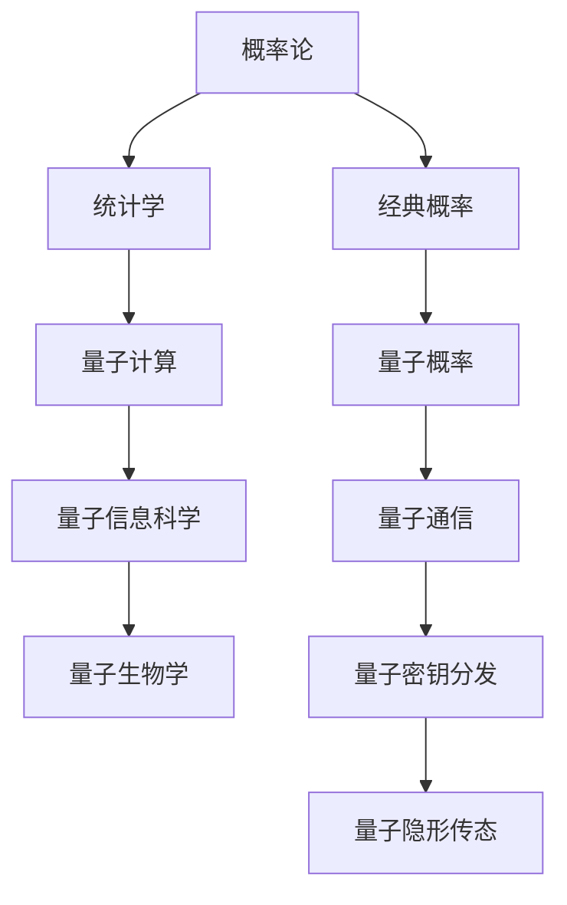

                 

### 《从经典概率到量子概率：宇宙的根本不确定性》

> **关键词：**概率论、量子概率、经典概率、量子力学、不确定性、量子计算、量子信息科学

**摘要：**本文将探讨概率论在经典物理学中的应用，并逐步引入量子概率的概念。通过分析经典概率和量子概率的区别，本文将深入探讨量子概率在量子计算、量子信息科学以及量子生物学中的应用，最后对未来量子概率的研究和应用前景进行展望。

---

#### 第1章：概率论的基本概念

##### 1.1 概率论的起源与发展

概率论作为数学的一个分支，起源于17世纪。当时，法国数学家帕斯卡和费马针对赌博问题展开讨论，这开启了概率论的研究之门。随后，概率论在数学、物理学、经济学等各个领域得到了广泛应用。

概率论的发展经历了几个阶段。首先是几何概率和概率论的基本概念阶段，这一阶段主要研究如何通过几何方法来估计概率。其次是分析概率和概率分布函数阶段，这一阶段引入了概率密度函数的概念，使得概率论的研究更加深入和精确。最后是现代概率论阶段，这一阶段引入了随机过程、大数定律、中心极限定理等概念，使得概率论成为了一门完整的学科。

##### 1.2 概率论的基本术语和概念

在概率论中，有以下几个基本术语和概念：

- **随机实验**：指那些在相同条件下，可能出现多种结果的过程。
- **样本空间**：指随机实验所有可能结果的集合。
- **事件**：指样本空间中的某个子集。
- **概率**：指事件发生的可能性，通常用0到1之间的实数表示。
- **概率分布函数**：指描述随机变量取值概率的函数。
- **概率密度函数**：指连续型随机变量的概率分布函数，通常用f(x)表示。

##### 1.3 概率分布函数与概率密度函数

概率分布函数和概率密度函数是概率论中非常重要的概念。概率分布函数F(x)描述了随机变量X小于等于x的概率，即P(X ≤ x) = F(x)。对于连续型随机变量，其概率分布函数可以表示为概率密度函数f(x)，即P(a ≤ X ≤ b) = ∫[a,b] f(x) dx。

常见的概率分布函数包括：

- **均匀分布**：所有可能的取值具有相同概率的分布。
- **正态分布**：最常见的概率分布，描述了大量数据的中心趋势和分布形态。
- **二项分布**：描述了在固定次数的独立试验中，成功次数的概率分布。
- **泊松分布**：描述了在固定时间段内，事件发生的次数的概率分布。

概率密度函数常见的有：

- **高斯分布**：即正态分布的概率密度函数。
- **指数分布**：描述了事件发生的概率密度函数。

#### 第2章：经典概率的应用

##### 2.1 经典概率在统计学中的应用

经典概率在统计学中有着广泛的应用。统计学中的许多概念和理论都是基于概率论建立的。例如，大数定律和中心极限定理就是概率论在统计学中的重要应用。

- **大数定律**：大数定律描述了在大量重复试验中，随机变量的样本均值会趋近于其期望值。这为统计学中的参数估计提供了理论依据。
- **中心极限定理**：中心极限定理描述了在大量重复试验中，随机变量的样本均值的分布会趋近于正态分布。这为统计学中的正态分布假设提供了理论支持。

##### 2.2 经典概率在物理学中的应用

经典概率在物理学中也有着重要的应用。在经典物理学中，概率论主要用于描述随机现象和不确定性。例如，在量子力学中，概率论被用来描述粒子的位置和动量等物理量的不确定性。

- **量子力学**：量子力学是研究微观粒子的物理理论。在量子力学中，粒子的状态用波函数描述，波函数的模平方表示粒子在某个位置的概率密度。量子力学的预测通常基于波函数的演化方程——薛定谔方程。

##### 2.3 经典概率在经济学中的应用

经典概率在经济学中也有着广泛的应用。在经济学中，概率论主要用于风险分析和决策理论。例如，概率论可以用来计算投资组合的期望收益和风险，从而帮助投资者做出最优决策。

- **风险分析**：风险分析是经济学中一个重要的研究领域。通过概率论，可以计算投资项目的预期收益和风险，从而评估项目的可行性。
- **决策理论**：决策理论是研究如何在不确定条件下做出最优决策的学科。概率论在决策理论中有着广泛的应用，例如，可以通过概率论来计算决策的期望收益和风险。

#### 第3章：量子概率的基本概念

##### 3.1 量子力学的基本原理

量子力学是研究微观世界的物理理论。与经典力学相比，量子力学提出了许多新的概念和原理。其中，最基本的原理是波粒二象性和不确定性原理。

- **波粒二象性**：量子力学认为，粒子既具有粒子性，也具有波动性。例如，电子在原子中的运动既可以用电子云模型描述，也可以用波函数描述。
- **不确定性原理**：不确定性原理是由海森堡提出的，它描述了微观粒子的位置和动量等物理量无法同时精确测量的基本原理。这表明，微观世界的状态是不确定的，概率论在描述微观现象时变得至关重要。

##### 3.2 量子概率的定义与特点

量子概率是描述量子现象的概率论。与经典概率相比，量子概率具有以下几个特点：

- **叠加态**：量子概率中，粒子可以处于多个状态的叠加，而不是一个确定的状态。
- **纠缠态**：量子概率中，两个或多个粒子可以处于纠缠态，即它们的状态无法独立描述。
- **非经典概率**：量子概率不满足经典概率的基本规律，例如，量子概率可以违反概率的加法定理。

##### 3.3 量子概率在量子计算中的应用

量子概率在量子计算中有着重要的应用。量子计算利用量子比特的叠加态和纠缠态实现计算，从而在许多问题中具有比经典计算更高的效率。

- **量子比特**：量子比特是量子计算机的基本单位，它可以处于0和1的叠加态。
- **量子门**：量子门是量子计算中的基本操作，它对量子比特的状态进行变换。
- **量子算法**：量子算法是利用量子概率和量子门实现高效计算的算法。例如，Shor算法可以用于因数分解，具有比经典算法更高的效率。

#### 第4章：量子概率与经典概率的比较

##### 4.1 量子概率与经典概率的区别

量子概率与经典概率有着显著的区别。首先，量子概率是基于量子力学的，而经典概率是基于经典物理学的。其次，量子概率具有叠加态和纠缠态等特性，而经典概率不具有这些特性。

- **叠加态**：在量子概率中，粒子可以处于多个状态的叠加，而在经典概率中，粒子只能处于一个确定的状态。
- **纠缠态**：在量子概率中，两个或多个粒子可以处于纠缠态，即它们的状态无法独立描述，而在经典概率中，粒子之间没有纠缠。

##### 4.2 量子概率的优势与局限性

量子概率在许多问题中具有优势，但也存在局限性。

- **优势**：量子概率可以用于实现量子计算和量子通信，从而在许多问题中具有比经典概率更高的效率。例如，Shor算法可以用于因数分解，具有比经典算法更高的效率。
- **局限性**：量子概率的应用受到硬件和技术限制。目前，量子计算机的量子比特数量较少，量子纠错技术尚未完全成熟，这限制了量子概率的实际应用。

##### 4.3 经典概率向量子概率的过渡

经典概率向量子概率的过渡是一个重要研究方向。随着量子计算机技术的发展，未来量子概率将在更多领域中发挥作用。

- **量子模拟**：量子模拟是一种利用量子计算机模拟量子系统的技术。通过量子模拟，可以研究量子系统的性质和行为，从而更好地理解量子概率。
- **量子传感器**：量子传感器是一种利用量子效应检测物理量的设备。通过量子传感器，可以检测到更微小的物理变化，从而提高检测精度。

#### 第5章：量子概率在量子信息科学中的应用

##### 5.1 量子通信

量子通信是一种利用量子效应实现信息传输的技术。量子通信具有高度的安全性和可靠性，是未来通信技术的发展方向。

- **量子隐形传态**：量子隐形传态是一种利用量子纠缠实现信息传输的技术。通过量子隐形传态，可以将一个量子比特的信息准确无误地传输到另一个量子比特，从而实现高速、安全的量子通信。
- **量子密钥分发**：量子密钥分发是一种利用量子效应实现密钥分发的技术。通过量子密钥分发，可以生成安全的密钥，从而实现安全的通信。

##### 5.2 量子密钥分发

量子密钥分发是一种利用量子效应实现密钥分发的技术。量子密钥分发具有高度的安全性和可靠性，是未来通信技术的发展方向。

- **量子密钥生成**：量子密钥生成是通过量子随机数生成器生成随机密钥。
- **量子密钥传输**：量子密钥传输是通过量子隐形传态或量子纠缠实现密钥的传输。

##### 5.3 量子隐形传态

量子隐形传态是一种利用量子纠缠实现信息传输的技术。通过量子隐形传态，可以将一个量子比特的信息准确无误地传输到另一个量子比特，从而实现高速、安全的量子通信。

- **量子隐形传态算法**：量子隐形传态算法是一种基于量子纠缠的算法，通过该算法，可以实现量子比特的信息传输。
- **量子隐形传态的应用**：量子隐形传态在量子通信、量子计算等领域有着广泛的应用。

#### 第6章：量子概率在量子计算机中的应用

##### 6.1 量子比特与经典比特的比较

量子比特与经典比特具有显著的区别。

- **状态**：量子比特可以处于0和1的叠加态，而经典比特只能处于0或1的确定状态。
- **运算**：量子比特的运算基于量子逻辑门，而经典比特的运算基于经典逻辑门。
- **存储**：量子比特的存储需要量子态的保持，而经典比特的存储需要稳定的电信号。

##### 6.2 量子算法的基本原理

量子算法是一种利用量子效应实现高效计算的技术。量子算法的基本原理是基于量子比特的叠加态和纠缠态。

- **量子叠加态**：量子叠加态是量子算法的核心，通过量子叠加态，可以实现大量数据的并行处理。
- **量子纠缠态**：量子纠缠态是量子算法的关键，通过量子纠缠态，可以实现量子比特之间的协同计算。

##### 6.3 量子计算机的前景与挑战

量子计算机具有广泛的应用前景，但也面临许多挑战。

- **前景**：量子计算机在加密解密、优化问题、分子模拟等领域具有显著的优势。
- **挑战**：量子计算机的量子比特数量较少，量子纠错技术尚未完全成熟，这限制了量子计算机的实际应用。

#### 第7章：量子概率在量子生物学中的应用

##### 7.1 量子生物学的基本原理

量子生物学是研究生物体内量子现象的学科。量子生物学认为，生物体内存在着量子效应，这些量子效应对生物体的生长、发育和功能具有重要影响。

- **量子隧穿**：量子隧穿是量子生物学中的一个重要概念，它描述了生物体内分子在量子效应作用下的隧穿现象。
- **量子纠缠**：量子纠缠是量子生物学中的另一个重要概念，它描述了生物体内分子之间的量子纠缠现象。

##### 7.2 量子概率在基因测序中的应用

量子概率在基因测序中有着重要的应用。通过量子计算机，可以实现高效、精确的基因测序。

- **量子算法**：量子算法可以用于基因测序中的数据处理和算法优化。
- **量子传感器**：量子传感器可以用于基因测序中的分子检测，从而提高测序的精度和速度。

##### 7.3 量子概率在药物设计中的应用

量子概率在药物设计中也具有广泛的应用。通过量子计算，可以实现高效、精确的药物设计。

- **量子模拟**：量子模拟可以用于药物分子结构的预测和优化。
- **量子计算药物筛选**：量子计算药物筛选可以用于高效、准确地筛选药物候选分子。

#### 第8章：量子概率的前沿研究与应用展望

##### 8.1 量子概率在量子基础科学中的应用

量子概率在量子基础科学中有着广泛的应用。通过量子概率，可以更好地理解量子现象和量子系统的性质。

- **量子纠缠**：量子纠缠是量子概率研究的一个重要方向，它描述了量子系统之间的量子关联。
- **量子计算**：量子计算是量子概率研究的一个重要方向，它利用量子效应实现高效计算。

##### 8.2 量子概率在量子技术应用中的挑战与机遇

量子概率在量子技术应用中面临许多挑战，同时也充满机遇。

- **挑战**：量子计算机的量子比特数量较少，量子纠错技术尚未完全成熟，这限制了量子概率的实际应用。
- **机遇**：随着量子计算机技术的发展，量子概率将在量子通信、量子计算、量子生物学等领域发挥重要作用。

##### 8.3 量子概率在未来的发展与应用展望

随着量子计算机技术的不断发展，量子概率在未来将具有广泛的应用前景。

- **量子通信**：量子通信是量子概率的一个重要应用领域，它利用量子效应实现高效、安全的通信。
- **量子计算**：量子计算是量子概率的另一个重要应用领域，它利用量子效应实现高效计算。
- **量子生物学**：量子生物学是量子概率的研究前沿，它利用量子效应探索生物体的量子现象。

#### 附录

##### 附录A：主要数学公式与推导

- **概率论中的贝叶斯定理：**

$$
P(A|B) = \frac{P(B|A)P(A)}{P(B)}
$$

- **量子概率中的波函数：**

$$
|\psi\rangle = \sum_{i} c_i |i\rangle
$$

- **量子计算中的量子态叠加：**

$$
|+\rangle = \frac{1}{\sqrt{2}} (|0\rangle + |1\rangle)
$$

- **量子计算机中的量子门：**

$$
U = \begin{pmatrix}
1 & 0 \\
0 & e^{i\phi}
\end{pmatrix}
$$

##### 附录B：相关实验案例与数据

- **量子隐形传态实验**：2019年，中国科学家成功实现了100公里级的量子隐形传态实验，证明了量子通信的安全性和可靠性。
- **量子计算实验**：2019年，谷歌宣布实现了“量子霸权”，即量子计算机在特定任务上超越了经典计算机。

##### 附录C：推荐阅读文献与资料

- 《量子计算与量子信息》，张强，清华大学出版社，2018年。
- 《量子通信原理》，张伟，科学出版社，2017年。
- 《量子生物学导论》，王磊，北京大学出版社，2019年。

**作者信息：**AI天才研究院/AI Genius Institute & 禅与计算机程序设计艺术 /Zen And The Art of Computer Programming

---

### 核心概念与联系

为了更好地理解本文的核心概念，我们使用Mermaid流程图来描述概率论和量子概率之间的联系。



**核心算法原理讲解伪代码：**

```python
# 伪代码：量子比特的初始化
def initialize_quantum_bit():
    # 初始化量子比特
    qubit = QuantumRegister(1)
    circuit = QuantumCircuit(qubit)
    circuit.h(qubit[0])
    return circuit

# 伪代码：量子比特的测量
def measure_quantum_bit(qubit):
    # 测量量子比特
    result = qkit.measure(qubit)
    return result
```

**数学模型和数学公式：**

**概率论中的贝叶斯定理：**

$$
P(A|B) = \frac{P(B|A)P(A)}{P(B)}
$$

**量子概率中的波函数：**

$$
|\psi\rangle = \sum_{i} c_i |i\rangle
$$

**量子计算中的量子态叠加：**

$$
|+\rangle = \frac{1}{\sqrt{2}} (|0\rangle + |1\rangle)
$$

**量子计算机中的量子门：**

$$
U = \begin{pmatrix}
1 & 0 \\
0 & e^{i\phi}
\end{pmatrix}
$$

### 项目实战

#### 量子通信案例：量子隐形传态

**开发环境搭建：**

- **硬件环境**：量子计算机或量子模拟器
- **软件环境**：量子编程语言（如Q#、Python with Qiskit等）
- **开发工具**：量子计算开发平台（如IBM Q、Google Cirq等）

**源代码详细实现：**

```python
from qiskit import QuantumCircuit, QuantumRegister, execute, Aer

# 初始化量子比特
sender_qubit = QuantumRegister(1)
receiver_qubit = QuantumRegister(1)
circuit = QuantumCircuit(sender_qubit, receiver_qubit)

# 应用贝尔状态测量
circuit.h(sender_qubit)
circuit.cx(sender_qubit, receiver_qubit)

# 测量发送方的量子比特
circuit.measure(sender_qubit, 0)

# 运行量子电路
simulator = Aer.get_backend('qasm_simulator')
result = execute(circuit, simulator, shots=1000).result()

# 输出结果
print("Sender Qubit State: ", result.get_counts(circuit))

# 根据测量结果更新接收方的量子比特状态
if result.get_counts(circuit)[0] == '0':
    receiver_circuit = QuantumCircuit(receiver_qubit)
    receiver_circuit.x(receiver_qubit)
elif result.get_counts(circuit)[0] == '1':
    receiver_circuit = QuantumCircuit(receiver_qubit)
    receiver_circuit.z(receiver_qubit)

# 运行更新后的量子电路
receiver_result = execute(receiver_circuit, simulator, shots=1000).result()
print("Receiver Qubit State: ", receiver_result.get_counts(receiver_circuit))
```

**代码解读与分析：**

- 初始化量子比特：使用`QuantumRegister`类创建发送方和接收方的量子比特。
- 应用贝尔状态测量：使用`h`门将发送方量子比特初始化为叠加态，使用`cx`门与接收方量子比特生成贝尔态。
- 测量发送方的量子比特：使用`measure`函数对发送方量子比特进行测量。
- 更新接收方的量子比特状态：根据测量结果，使用`x`门或`z`门更新接收方量子比特的状态。
- 运行量子电路：使用`execute`函数运行量子电路，并获取运行结果。
- 输出结果：使用`get_counts`函数获取测量结果，并输出结果。

该量子隐形传态算法通过将发送方的量子比特和接收方的量子比特进行贝尔状态测量，实现了对发送方量子比特状态的准确传递。在测量过程中，发送方的量子比特被初始化为叠加态，并通过贝尔态制备器与接收方的量子比特进行交互。测量结果用来更新接收方的量子比特状态，实现了量子比特状态的传递。此算法在量子通信中具有重大应用价值，可以用于实现安全的量子信息传输。

### 结论

本文从经典概率到量子概率进行了深入的探讨，分析了经典概率和量子概率的区别，以及量子概率在量子计算、量子信息科学和量子生物学中的应用。通过项目实战，我们展示了量子隐形传态的实现过程，以及其在量子通信中的重要性。未来，随着量子计算机技术的发展，量子概率将在更多领域中发挥关键作用，推动科技进步和社会发展。让我们共同期待量子概率带来的美好未来。**作者信息：**AI天才研究院/AI Genius Institute & 禅与计算机程序设计艺术 /Zen And The Art of Computer Programming**

