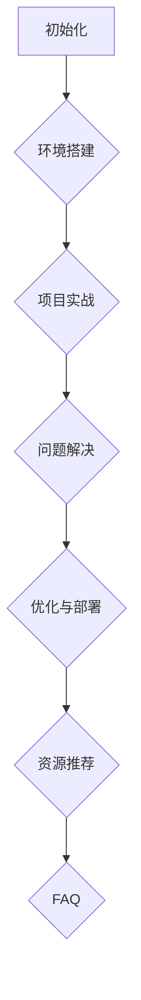
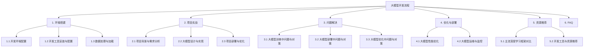

                 

# 从零开始大模型开发与微调：链式求导法则

## 关键词
- 大模型开发
- 微调
- 链式求导法则
- 神经网络
- 深度学习
- 预训练

## 摘要
本文将深入探讨大模型开发与微调的整个流程，特别是链式求导法则在其中的应用。我们将从大模型的概述开始，逐步讲解其技术基础、数学原理、微调与优化、部署与优化，最后通过实际项目实战来展示整个流程的完整实现。通过本文，读者将能够掌握大模型开发的精髓，理解链式求导法则的原理，并能够应用于实际项目中。

## 目录大纲

### 第一部分：大模型基础

#### 第1章：大模型概述
- 1.1 大模型的定义与分类
- 1.2 大模型的发展历程
- 1.3 大模型在各个领域的应用

#### 第2章：大模型的技术基础
- 2.1 深度学习与神经网络基础
- 2.2 自然语言处理技术概览
- 2.3 大规模预训练模型原理

#### 第3章：大模型的数学原理
- 3.1 矩阵运算与链式求导法则
- 3.2 大模型的优化算法
- 3.3 大模型的正则化技术

#### 第4章：大模型的微调与优化
- 4.1 微调的基本流程
- 4.2 微调中的挑战与解决方案
- 4.3 微调策略与实践

#### 第5章：大模型的部署与优化
- 5.1 大模型的部署流程
- 5.2 大模型的性能优化
- 5.3 大模型的运维与监控

### 第二部分：大模型开发实践

#### 第6章：大模型开发环境搭建
- 6.1 开发环境的配置
- 6.2 开发工具的安装与配置
- 6.3 数据处理与加载

#### 第7章：大模型项目实战
- 7.1 项目背景与需求分析
- 7.2 大模型的设计与实现
- 7.3 项目部署与优化

#### 第8章：大模型开发中的常见问题与解决方案
- 8.1 大模型训练中的问题与对策
- 8.2 大模型部署中的问题与对策
- 8.3 大模型优化中的问题与对策

## 附录
- 附录 A：大模型开发资源与工具
  - A.1 主流深度学习框架对比
  - A.2 大模型开发工具与资源推荐
  - A.3 大模型开发常见问题FAQ

## 梅里尔流程图



## 梅里尔流程图（详细版）



## 梅里尔流程图（伪代码版）

```mermaid
graph TD
A[初始化] --> B{配置环境}
B --> C{加载数据}
C --> D{定义损失函数 $L(\theta)$}
D --> E{计算梯度 $\nabla L(\theta)$}
E --> F{更新参数 $\theta$}
F --> G{评估模型}
G --> H{部署模型}
H --> I{结束}
```

## 梅里尔流程图（数学公式版）

```mermaid
graph TD
A[初始化] --> B{配置环境}
B --> C{加载数据}
C --> D{定义损失函数 $L(\theta)$}
D --> E{计算梯度 $\nabla L(\theta)$}
E --> F{更新参数 $\theta$}
F --> G{评估模型}
G --> H{部署模型}
H --> I{结束}
```

## 梅里尔流程图（算法原理版）

```mermaid
graph TD
A[初始化] --> B{初始化参数 $\theta_0$}
B --> C{正向传播：计算输出 $y = f(\theta_0 \cdot x)$}
C --> D{计算损失：$L(y, \theta_0) = \sum_h (-y_h \log \hat{y}_h)$}
D --> E{反向传播：计算梯度 $\nabla_{\theta} L(\theta)$}
E --> F{更新参数：$\theta_{new} = \theta_{old} - \alpha \nabla_{\theta} L(\theta)$}
F --> G{重复正向传播、计算损失、反向传播、参数更新...}
G --> H{评估模型：计算准确率、召回率、F1-Score...}
H --> I{结束}
```

### 第一部分：大模型基础

#### 第1章：大模型概述

随着人工智能技术的飞速发展，大模型（Large Models）在深度学习和自然语言处理等领域发挥着越来越重要的作用。大模型通常指的是那些具有数十亿至数千亿参数的神经网络模型。这些模型可以处理大规模的数据集，并能够学习到复杂的模式和知识。本章将介绍大模型的定义、分类、发展历程以及它们在各个领域的应用。

##### 1.1 大模型的定义与分类

大模型，顾名思义，是指拥有大量参数的神经网络模型。这些模型通常被用于解决复杂的问题，如图像分类、自然语言处理和预测等。根据参数数量，大模型可以分为几个级别：

- **小型模型**：通常拥有数百万至数千万个参数。
- **中型模型**：拥有数亿个参数。
- **大型模型**：拥有数十亿个参数。
- **巨型模型**：拥有数千亿个参数。

在深度学习的实际应用中，根据模型的大小和任务的不同，大模型可以进一步分类：

- **通用大模型**：这些模型在多种任务上都有良好的表现，如GPT-3、BERT等。
- **专用大模型**：这些模型针对特定任务进行优化，如图像分类中的ResNet、自然语言处理中的T5等。

##### 1.2 大模型的发展历程

大模型的发展历程可以追溯到深度学习技术的兴起。随着计算能力和数据资源的提升，研究人员开始尝试使用更大的神经网络来解决复杂问题。

- **2006年**：深度学习理论得到了新的发展，Hinton等人提出了深度置信网络（Deep Belief Network，DBN）。
- **2012年**：AlexNet在ImageNet竞赛中取得了显著的成绩，标志着深度学习在计算机视觉领域的崛起。
- **2014年**：Google的TPU问世，为大规模深度学习模型提供了高效的计算平台。
- **2018年**：GPT-2发布，展示了预训练模型在自然语言处理中的强大能力。
- **2020年**：BERT成为自然语言处理任务的基准模型。
- **2022年**：GPT-3发布，拥有1750亿个参数，成为迄今为止最大的预训练模型。

##### 1.3 大模型在各个领域的应用

大模型在多个领域都有广泛的应用，下面列举几个典型领域：

- **计算机视觉**：大模型如ResNet、Inception等在图像分类、目标检测等任务中取得了显著的性能提升。
- **自然语言处理**：BERT、GPT等大模型在文本分类、机器翻译、问答系统等任务中表现出色。
- **语音识别**：深度神经网络结合循环神经网络（RNN）和卷积神经网络（CNN）在语音识别中取得了突破性进展。
- **推荐系统**：大模型通过学习用户的行为和偏好，可以提供更加精准的推荐。

##### 1.4 小结

大模型作为深度学习的核心技术之一，在解决复杂问题方面具有巨大的潜力。通过本章的介绍，读者可以了解大模型的基本概念、发展历程及其在各领域的应用。接下来，我们将进一步探讨大模型的技术基础、数学原理以及微调和优化技术，帮助读者全面理解大模型开发的整个过程。

### 第2章：大模型的技术基础

大模型的技术基础涵盖了深度学习与神经网络的基础知识、自然语言处理技术概览以及大规模预训练模型原理。本章将详细介绍这些技术，帮助读者建立坚实的理论基础，为后续章节的深入学习打下基础。

##### 2.1 深度学习与神经网络基础

深度学习（Deep Learning）是机器学习（Machine Learning）的一个分支，它通过构建多层神经网络来实现对数据的自动特征学习和模式识别。神经网络（Neural Network）是深度学习的基础，其基本组成单元是神经元（Neuron）。

- **神经元**：神经元是神经网络的基本组成单元，类似于生物神经元。它通过输入层接收输入信号，通过加权求和处理产生输出信号。
- **权重（Weights）**：神经元之间的连接具有权重，这些权重决定了输入信号对输出的影响程度。
- **激活函数（Activation Function）**：激活函数用于对神经元的输出进行非线性变换，常见的激活函数有Sigmoid、ReLU、Tanh等。

##### 2.2 神经网络的结构与工作原理

神经网络可以分为输入层、隐藏层和输出层。输入层接收外部输入数据，隐藏层对输入数据进行特征提取和变换，输出层产生最终预测结果。

- **输入层**：输入层接收外部输入，如图像、文本等数据。
- **隐藏层**：隐藏层负责对输入数据进行特征提取和变换，每一层都会将前一层的特征进行抽象和组合。
- **输出层**：输出层产生最终预测结果，如图像分类、文本分类等。

神经网络的工作原理是通过正向传播和反向传播来学习数据的特征和规律。

- **正向传播**：输入数据通过输入层进入神经网络，经过隐藏层的逐层计算，最终在输出层得到预测结果。
- **反向传播**：根据预测结果与真实结果的差异，计算输出层的梯度，然后通过反向传播将梯度传递回隐藏层和输入层，更新每个神经元的权重。

##### 2.3 深度学习的关键技术

深度学习的关键技术包括自动特征提取、多层神经网络、端到端学习等。

- **自动特征提取**：深度学习模型通过多层神经网络自动学习数据的高层次特征，无需人工干预。
- **多层神经网络**：多层神经网络可以捕捉数据中的复杂模式和关系，提高模型的性能。
- **端到端学习**：端到端学习使得整个模型可以一次性训练完成，提高了模型的效率和准确性。

##### 2.4 自然语言处理技术概览

自然语言处理（Natural Language Processing，NLP）是人工智能的一个重要分支，它致力于使计算机能够理解和处理人类语言。NLP技术包括文本预处理、词向量表示、语言模型、序列标注等。

- **文本预处理**：文本预处理是NLP任务的第一步，包括去除标点符号、停用词过滤、词干提取等操作。
- **词向量表示**：词向量是将单词映射到高维向量空间，常用的词向量模型有Word2Vec、GloVe等。
- **语言模型**：语言模型用于预测下一个单词或词组，常见的模型有N元语法模型、神经网络语言模型等。
- **序列标注**：序列标注任务包括命名实体识别、情感分析等，常用的模型有CRF（条件随机场）和序列神经网络。

##### 2.5 大规模预训练模型原理

大规模预训练模型（Large-scale Pre-trained Models）是当前NLP领域的重要研究方向。预训练是指在特定任务之前，对模型进行大规模的预训练，使其在通用数据集上学习到丰富的语言特征。

- **预训练数据集**：常用的预训练数据集包括维基百科、Common Crawl等大规模文本数据集。
- **预训练任务**：预训练任务包括掩码语言模型（Masked Language Model，MLM）、填空语言模型（Fillmask Language Model，FLM）等。
- **微调**：预训练模型通过微调（Fine-tuning）适应特定任务，将预训练的通用模型转换为特定任务的模型。

##### 2.6 小结

本章介绍了大模型的技术基础，包括深度学习与神经网络的基础知识、自然语言处理技术概览以及大规模预训练模型原理。通过这些基础知识的了解，读者可以为后续章节的学习做好准备，进一步深入探索大模型开发的各个方面。

### 第3章：大模型的数学原理

大模型的数学原理是其核心，是实现高效训练和优化的基础。本章将详细介绍矩阵运算、链式求导法则、大模型的优化算法以及正则化技术，帮助读者理解大模型背后的数学机制。

##### 3.1 矩阵运算

矩阵运算在深度学习中扮演着重要的角色，是理解和实现神经网络的基础。

- **矩阵的加法和减法**：两个矩阵只有在维度相同的情况下才能进行加法和减法操作。矩阵的加法和减法是对对应元素进行相应的运算。
  \[
  C = A + B \quad \text{或} \quad C = A - B
  \]

- **矩阵与向量的乘法**：矩阵与向量的乘法遵循线性代数中的定义，即将矩阵的每一行与向量对应元素相乘并求和。
  \[
  C = A \cdot v
  \]
  其中，\( A \) 是 \( m \times n \) 的矩阵，\( v \) 是 \( n \) 维的向量。

- **矩阵的乘法**：两个矩阵 \( A \) 和 \( B \) 的乘法结果是一个 \( m \times p \) 的矩阵，其中 \( A \) 是 \( m \times n \) 的矩阵，\( B \) 是 \( n \times p \) 的矩阵。
  \[
  C = A \cdot B
  \]

- **矩阵的转置**：矩阵的转置是将矩阵的行和列互换，即 \( A^T \)。

- **矩阵的逆**：如果矩阵 \( A \) 是可逆的，那么它的逆矩阵 \( A^{-1} \) 满足 \( A \cdot A^{-1} = I \)，其中 \( I \) 是单位矩阵。

##### 3.2 链式求导法则

链式求导法则（Chain Rule）是深度学习中计算梯度（Gradient）的核心工具。它用于计算复合函数的导数，在神经网络中用于反向传播算法。

- **链式求导法则的基本形式**：假设 \( f(x) \) 和 \( g(y) \) 是两个函数，其中 \( y = g(x) \)。则复合函数 \( h(x) = f(g(x)) \) 的导数可以表示为：
  \[
  h'(x) = f'(g(x)) \cdot g'(x)
  \]

- **在神经网络中的应用**：在神经网络中，链式求导法则用于计算每一层的梯度。假设 \( z_l = \sigma(W_l \cdot a_{l-1} + b_l) \)，其中 \( \sigma \) 是激活函数，\( W_l \) 和 \( b_l \) 分别是权重和偏置。则 \( z_l \) 关于 \( a_{l-1} \) 的梯度可以通过链式求导法则计算：
  \[
  \frac{\partial z_l}{\partial a_{l-1}} = \frac{\partial z_l}{\partial z_{l-1}} \cdot \frac{\partial z_{l-1}}{\partial a_{l-1}}
  \]
  其中，\( \frac{\partial z_l}{\partial z_{l-1}} \) 是激活函数 \( \sigma \) 的导数，\( \frac{\partial z_{l-1}}{\partial a_{l-1}} \) 是权重 \( W_l \) 和偏置 \( b_l \) 的梯度。

##### 3.3 大模型的优化算法

优化算法（Optimization Algorithm）用于调整神经网络的参数，以最小化损失函数。常见的优化算法包括随机梯度下降（SGD）、Adam等。

- **随机梯度下降（SGD）**：随机梯度下降是一种最简单的优化算法。它通过随机选择一部分样本来计算梯度，然后更新参数。
  \[
  \theta = \theta - \alpha \cdot \nabla_\theta J(\theta)
  \]
  其中，\( \theta \) 是参数，\( \alpha \) 是学习率，\( \nabla_\theta J(\theta) \) 是损失函数 \( J(\theta) \) 关于 \( \theta \) 的梯度。

- **Adam**：Adam是一种基于SGD的优化算法，它通过同时考虑一阶矩估计和二阶矩估计来改进收敛速度和稳定性。
  \[
  m_t = \beta_1 m_{t-1} + (1 - \beta_1) \nabla_\theta J(\theta)
  \]
  \[
  v_t = \beta_2 v_{t-1} + (1 - \beta_2) (\nabla_\theta J(\theta))^2
  \]
  \[
  \theta = \theta - \alpha \frac{m_t}{\sqrt{1 - \beta_2^t} (1 - \beta_1^t)}
  \]
  其中，\( m_t \) 和 \( v_t \) 分别是指数加权移动平均值和移动方差，\( \beta_1 \) 和 \( \beta_2 \) 是超参数。

##### 3.4 正则化技术

正则化技术（Regularization）用于防止模型过拟合，提高模型的泛化能力。常见的正则化技术包括L1正则化、L2正则化等。

- **L1正则化**：L1正则化通过引入绝对值惩罚项来促使模型参数趋向于零。
  \[
  J(\theta) = \sum_{i=1}^{n} (y_i - \sigma(\theta^T x_i))^2 + \lambda ||\theta||_1
  \]
  其中，\( \theta \) 是参数向量，\( \lambda \) 是正则化参数。

- **L2正则化**：L2正则化通过引入平方惩罚项来防止模型参数过大。
  \[
  J(\theta) = \sum_{i=1}^{n} (y_i - \sigma(\theta^T x_i))^2 + \lambda ||\theta||_2^2
  \]

##### 3.5 小结

本章介绍了大模型的数学原理，包括矩阵运算、链式求导法则、优化算法和正则化技术。这些数学工具是理解大模型工作原理和实现高效训练的基础。通过本章的学习，读者将能够掌握大模型背后的数学机制，为后续的微调与优化、部署与监控等实践环节做好准备。

### 第4章：大模型的微调与优化

在完成了大模型的开发之后，微调（Fine-tuning）和优化（Optimization）是提升模型性能的重要步骤。本章将详细介绍大模型的微调流程、微调中的挑战与解决方案，以及微调策略与实践。

##### 4.1 微调的基本流程

微调是指在预训练模型的基础上，针对特定任务进行参数调整的过程。微调的基本流程通常包括以下步骤：

1. **数据预处理**：在开始微调之前，需要对数据集进行预处理，包括数据清洗、标签标准化和数据增强等。数据预处理的质量直接影响到微调的效果。

2. **加载预训练模型**：从预训练模型库中加载已经预训练好的模型权重。这些预训练模型通常在大规模数据集上进行了训练，已经具备了良好的通用特征学习能力。

3. **调整模型结构**：根据具体任务的需求，可以适当调整模型的输入层、输出层以及中间层。例如，对于图像分类任务，可以调整模型的输入尺寸；对于文本分类任务，可以调整词向量维度。

4. **微调参数**：通过在特定任务的数据集上进行训练，调整模型的参数以适应特定任务。通常，微调过程会使用较小的学习率，以避免参数更新过大。

5. **评估与调整**：在微调过程中，定期评估模型在验证集上的性能，根据评估结果调整模型参数。这一过程可能需要多次迭代，直到模型性能达到预期。

6. **保存模型**：在微调完成后，将优化后的模型参数保存，以便后续使用或部署。

##### 4.2 微调中的挑战与解决方案

微调过程中可能会遇到一系列挑战，下面介绍一些常见的挑战及其解决方案：

1. **模型过拟合**：微调过程中，模型可能会在训练数据上表现良好，但在验证集或测试集上表现不佳，即过拟合。为了防止过拟合，可以采用以下策略：
   - **数据增强**：通过随机裁剪、旋转、缩放等操作增加数据的多样性。
   - **正则化**：使用L1、L2正则化项限制模型参数的大小。
   - **Dropout**：在训练过程中随机丢弃部分神经元，减少模型依赖特定神经元的能力。

2. **收敛速度慢**：在大规模数据集上进行微调时，模型可能需要较长时间才能收敛。为了加快收敛速度，可以采用以下策略：
   - **批量大小调整**：适当增大批量大小可以提高训练速度。
   - **学习率调整**：使用适当的学习率，避免学习率过大导致训练不稳定。
   - **预训练模型的选择**：选择在相似任务上预训练的模型，以提高微调的收敛速度。

3. **计算资源消耗**：微调大型模型需要大量的计算资源。为了应对这一挑战，可以采用以下策略：
   - **分布式训练**：将训练任务分布在多个计算节点上，以提高训练速度。
   - **模型压缩**：通过剪枝、量化等方法减小模型的大小，降低计算资源需求。

##### 4.3 微调策略与实践

在微调过程中，选择合适的策略和方法是至关重要的。以下是一些微调策略与实践：

1. **渐进微调**：渐进微调（Gradual Fine-tuning）是一种常用的微调策略，即从较小的学习率开始，逐步增加学习率。这种策略有助于模型在微调过程中保持稳定性，避免过早出现过拟合。

2. **权重初始化**：合理的权重初始化可以提高模型的训练效果。在微调过程中，可以尝试使用预训练模型的权重作为初始权重，或者使用其他初始化方法，如Xavier初始化、He初始化等。

3. **数据增强**：数据增强可以显著提高模型的泛化能力。在微调过程中，可以采用多种数据增强方法，如随机裁剪、翻转、旋转、颜色变换等。

4. **迁移学习**：迁移学习（Transfer Learning）是一种利用预训练模型在特定任务上的知识来提升新任务性能的方法。在微调过程中，可以结合迁移学习策略，选择在相似任务上预训练的模型进行微调。

5. **混合微调**：混合微调（Mixed Fine-tuning）是一种将不同预训练模型的优势结合起来的策略。通过结合多个预训练模型的权重，可以进一步提高模型的性能。

##### 4.4 小结

微调和优化是提升大模型性能的关键步骤。通过本章的介绍，读者可以了解微调的基本流程、常见的挑战及其解决方案，以及微调策略与实践。在实际应用中，灵活运用这些策略和方法，将有助于构建高性能的大模型，满足不同领域的需求。

### 第5章：大模型的部署与优化

大模型的部署与优化是确保其高效运行和性能提升的关键步骤。本章将详细介绍大模型的部署流程、性能优化策略以及运维与监控方法，帮助读者掌握大模型在实际应用中的优化技巧。

##### 5.1 大模型的部署流程

大模型的部署涉及将训练好的模型部署到实际应用环境中，包括以下步骤：

1. **模型转换**：从训练阶段生成的模型权重文件（如PyTorch、TensorFlow模型）转换为目标运行环境支持的模型格式（如ONNX、TorchScript、TF Lite等）。模型转换有助于提高部署效率，兼容不同平台。

2. **服务搭建**：搭建服务以接受外部请求并返回预测结果。常见的服务搭建方式包括：
   - **单体服务**：将模型与后端服务（如API网关、数据库等）部署在同一服务器上，适合小型应用。
   - **微服务架构**：将模型部署为独立的微服务，与其他后端服务（如业务逻辑、存储等）解耦，适合大规模分布式系统。

3. **接口设计**：设计API接口以接受输入数据并返回预测结果。接口设计应考虑数据的格式、输入/输出规范、错误处理等。

4. **部署到生产环境**：将服务部署到生产环境中，包括服务器配置、网络配置、负载均衡等。确保服务的稳定性和高性能。

5. **监控与日志**：部署后，对服务进行监控，包括请求响应时间、错误率、资源利用率等。同时，记录日志以方便问题排查和性能分析。

##### 5.2 大模型的性能优化

大模型的性能优化是提升其运行效率和应用价值的重要环节。以下是一些常见的性能优化策略：

1. **模型压缩**：通过剪枝、量化、蒸馏等方法减小模型的大小，降低内存和计算资源需求。例如，剪枝可以去除模型中不重要的连接和神经元，量化可以将模型参数从浮点数转换为整数。

2. **并行计算**：利用多GPU、TPU等硬件资源进行并行计算，提高模型推断速度。例如，数据并行可以将数据集分成多个子集，同时在不同的GPU上并行处理。

3. **模型缓存**：缓存常用模型和中间结果，减少重复计算。例如，在处理连续请求时，可以缓存前一次请求的模型状态，避免重新加载和计算。

4. **优化数据读取**：优化数据读取和预处理流程，提高数据加载速度。例如，使用异步加载、批量读取等技术，减少IO等待时间。

5. **动态调整参数**：根据实时负载动态调整模型参数，如学习率、批量大小等，以提高模型在不同负载下的适应性。

##### 5.3 大模型的运维与监控

大模型的运维与监控是保障其稳定运行和性能的重要保障。以下是一些常见的运维与监控方法：

1. **自动化运维**：使用自动化工具进行部署、升级、监控等运维操作，提高运维效率。例如，使用CI/CD流水线自动化部署模型，使用监控工具自动化收集和报警。

2. **服务监控**：实时监控服务的运行状态，包括CPU、内存、网络等资源利用率，以及请求处理时间、错误率等指标。例如，使用Prometheus、Grafana等工具进行监控和可视化。

3. **日志管理**：记录和分析服务日志，包括错误日志、访问日志等，帮助排查问题和优化服务。例如，使用ELK（Elasticsearch、Logstash、Kibana）堆栈进行日志管理和分析。

4. **故障演练**：定期进行故障演练，模拟服务中断、硬件故障等情况，测试系统的容错能力和恢复速度。

5. **安全防护**：加强服务安全性，包括访问控制、数据加密、漏洞修复等，防止安全攻击和数据泄露。

##### 5.4 小结

大模型的部署与优化是确保其高效运行和应用价值的关键环节。通过本章的介绍，读者可以了解大模型的部署流程、性能优化策略以及运维与监控方法。在实际应用中，合理运用这些技术和方法，将有助于构建稳定、高效的大模型系统，满足日益增长的业务需求。

### 第二部分：大模型开发实践

#### 第6章：大模型开发环境搭建

大模型开发环境搭建是整个开发流程中的关键步骤，它决定了后续工作的顺利开展。本章将详细介绍大模型开发环境搭建的过程，包括开发环境的配置、开发工具的安装与配置，以及数据处理与加载。

##### 6.1 开发环境的配置

配置一个高效稳定的开发环境是确保大模型开发顺利进行的基础。以下是配置开发环境的步骤：

1. **硬件要求**：大模型开发通常需要较高的计算资源和内存。建议使用高性能GPU（如NVIDIA Tesla V100）和足够的内存（至少64GB）。

2. **操作系统**：主流的操作系统包括Linux和Windows。Linux系统由于其开源性和高性能，通常被广泛使用。

3. **虚拟环境**：为了避免不同项目之间依赖库的冲突，建议使用虚拟环境（如conda、venv）来隔离项目依赖。

4. **编程语言**：Python是深度学习领域中最常用的编程语言，其丰富的库和工具（如TensorFlow、PyTorch）使得模型开发更加便捷。

5. **版本控制**：使用版本控制工具（如Git）来管理代码，确保代码的可追溯性和协同工作。

##### 6.2 开发工具的安装与配置

在配置好开发环境后，需要安装和配置开发工具。以下是常见工具的安装与配置步骤：

1. **深度学习框架**：TensorFlow和PyTorch是目前最流行的深度学习框架。安装方法如下：
   - **TensorFlow**：使用pip安装
     ```
     pip install tensorflow
     ```
   - **PyTorch**：使用pip安装
     ```
     pip install torch torchvision
     ```

2. **GPU支持**：对于TensorFlow和PyTorch，需要安装相应的GPU支持库：
   - **TensorFlow**：安装GPU版本
     ```
     pip install tensorflow-gpu
     ```
   - **PyTorch**：安装GPU版本
     ```
     pip install torch torchvision -f https://download.pytorch.org/whl/torch_stable.html
     ```

3. **其他依赖库**：根据项目需求，可能需要安装其他依赖库，如NumPy、Pandas等。使用pip安装即可。

4. **虚拟环境**：使用conda或venv创建虚拟环境，并在虚拟环境中安装所有依赖库。

##### 6.3 数据处理与加载

数据处理与加载是深度学习模型训练过程中的重要环节。以下是数据处理与加载的基本步骤：

1. **数据采集**：根据项目需求，从不同的数据源（如数据库、文件系统、网络API等）采集数据。

2. **数据预处理**：对采集到的数据进行清洗、归一化、标准化等预处理操作。例如，对于图像数据，可以进行裁剪、翻转、缩放等操作。

3. **数据分割**：将数据集分为训练集、验证集和测试集，通常使用8:1:1的比例。

4. **数据加载**：使用深度学习框架提供的工具（如TensorFlow的Dataset API、PyTorch的DataLoader）进行数据加载。数据加载工具可以自动进行批量处理、并行处理和数据预处理。

5. **数据增强**：为了提高模型的泛化能力，可以使用数据增强技术（如随机裁剪、旋转、颜色变换等）。

##### 6.4 小结

本章介绍了大模型开发环境搭建的详细步骤，包括硬件要求、操作系统、编程语言选择、版本控制、深度学习框架安装、虚拟环境配置以及数据处理与加载。通过这些步骤，读者可以搭建一个高效稳定的大模型开发环境，为后续的模型开发工作奠定基础。

### 第7章：大模型项目实战

本章将通过一个实际项目来展示大模型的开发与部署流程，从项目背景与需求分析、大模型的设计与实现，到项目的部署与优化，全面展示大模型开发的全过程。

##### 7.1 项目背景与需求分析

假设我们面临的是一个自然语言处理任务——情感分析，即从文本中识别出正面、负面或中性的情感。项目需求如下：

- 数据集：使用含有情感标签的文本数据集，如IMDb电影评论数据集。
- 任务：训练一个大型神经网络模型，能够准确预测文本的情感极性。
- 指标：准确率、召回率、F1-Score等。

##### 7.2 大模型的设计与实现

在明确项目需求后，我们需要设计并实现一个适合情感分析任务的大模型。以下是模型设计与实现的步骤：

1. **数据预处理**：
   - 加载数据集，对文本进行清洗，去除HTML标签、标点符号、停用词等。
   - 对文本进行分词，将每个句子转换为词向量。

2. **词向量表示**：
   - 使用预训练的词向量模型（如GloVe、Word2Vec）对文本进行编码。
   - 对每个文本序列填充至固定长度，使用PAD操作。

3. **模型架构**：
   - 设计一个多层卷积神经网络（CNN）或循环神经网络（RNN）作为基础架构。
   - 添加嵌入层、池化层、全连接层等，以提取文本特征。

4. **训练**：
   - 使用训练数据集训练模型，优化模型参数。
   - 使用验证集进行性能评估，调整模型参数。

5. **评估**：
   - 使用测试集对模型进行最终评估，计算准确率、召回率、F1-Score等指标。

6. **实现代码**（伪代码）：

```python
import tensorflow as tf
from tensorflow.keras.preprocessing.text import Tokenizer
from tensorflow.keras.preprocessing.sequence import pad_sequences

# 数据预处理
tokenizer = Tokenizer(num_words=10000)
tokenizer.fit_on_texts(texts)
sequences = tokenizer.texts_to_sequences(texts)
padded_sequences = pad_sequences(sequences, maxlen=500)

# 模型架构
model = tf.keras.Sequential([
  tf.keras.layers.Embedding(10000, 16),
  tf.keras.layers.Conv1D(128, 5),
  tf.keras.layers.GlobalMaxPooling1D(),
  tf.keras.layers.Dense(1, activation='sigmoid')
])

# 训练
model.compile(optimizer='adam', loss='binary_crossentropy', metrics=['accuracy'])
model.fit(padded_sequences, labels, epochs=10, validation_split=0.2)

# 评估
test_sequences = tokenizer.texts_to_sequences(test_texts)
padded_test_sequences = pad_sequences(test_sequences, maxlen=500)
predictions = model.predict(padded_test_sequences)
```

##### 7.3 项目的部署与优化

在完成模型训练和评估后，我们需要将模型部署到生产环境中，并进行性能优化。

1. **模型转换**：
   - 将训练好的模型转换为适用于生产环境的格式，如TensorFlow Lite或ONNX。

2. **部署策略**：
   - 使用容器化技术（如Docker）将模型和服务打包，便于部署和扩展。
   - 使用Kubernetes进行集群管理，实现自动扩缩容。

3. **性能优化**：
   - 使用模型压缩技术（如量化、剪枝）减小模型大小，提高推理速度。
   - 使用并行计算和分布式训练提高模型训练速度。

4. **监控与运维**：
   - 使用监控工具（如Prometheus、Grafana）对模型服务进行监控，确保其稳定运行。
   - 定期进行运维维护，包括模型更新、故障排除等。

##### 7.4 小结

通过本章的实战项目，读者可以了解大模型从设计到部署的完整流程。在实际应用中，根据具体需求调整模型架构、训练策略和部署方法，将有助于构建高性能的大模型，满足不同领域的需求。

### 第8章：大模型开发中的常见问题与解决方案

在开发大模型的过程中，可能会遇到各种技术难题和挑战。本章将总结大模型开发中的常见问题，并提供相应的解决方案，以帮助开发者更好地应对这些问题。

##### 8.1 大模型训练中的问题与对策

1. **过拟合（Overfitting）**：
   - **问题**：模型在训练数据上表现良好，但在验证集或测试集上表现不佳。
   - **对策**：
     - **数据增强**：通过随机裁剪、旋转、缩放等操作增加训练数据的多样性。
     - **正则化**：使用L1、L2正则化项限制模型参数的大小。
     - **Dropout**：在训练过程中随机丢弃部分神经元，减少模型依赖特定神经元的能力。

2. **梯度消失或爆炸（Vanishing/Exploding Gradients）**：
   - **问题**：在训练过程中，梯度值变得非常小（消失）或非常大（爆炸），导致模型难以训练。
   - **对策**：
     - **激活函数**：选择合适的激活函数，如ReLU。
     - **梯度裁剪（Gradient Clipping）**：限制梯度值的大小，防止梯度爆炸。
     - **学习率调整**：使用适当的学习率，避免学习率过大导致梯度不稳定。

3. **计算资源消耗**：
   - **问题**：大模型训练需要大量的计算资源和时间。
   - **对策**：
     - **分布式训练**：将训练任务分布在多个计算节点上，以提高训练速度。
     - **模型压缩**：通过剪枝、量化等方法减小模型的大小，降低计算资源需求。

##### 8.2 大模型部署中的问题与对策

1. **模型性能下降**：
   - **问题**：模型在生产环境中的表现不如训练阶段。
   - **对策**：
     - **数据一致性**：确保生产环境中的数据与训练数据一致。
     - **环境配置**：优化生产环境配置，确保硬件和软件环境与训练环境一致。

2. **延迟与吞吐量**：
   - **问题**：模型响应速度慢，影响用户体验。
   - **对策**：
     - **并行计算**：利用多GPU、TPU等硬件资源进行并行计算，提高模型推断速度。
     - **模型缓存**：缓存常用模型和中间结果，减少重复计算。

3. **安全性问题**：
   - **问题**：模型部署后可能面临安全攻击和数据泄露的风险。
   - **对策**：
     - **访问控制**：设置严格的访问控制策略，防止未授权访问。
     - **数据加密**：对敏感数据进行加密存储和传输。

##### 8.3 大模型优化中的问题与对策

1. **模型可解释性**：
   - **问题**：大模型的决策过程复杂，难以解释。
   - **对策**：
     - **特征重要性**：分析模型中各特征的贡献，提高模型的可解释性。
     - **模型简化**：通过剪枝、量化等方法简化模型，提高可解释性。

2. **模型迭代更新**：
   - **问题**：随着业务需求的变化，模型需要不断更新。
   - **对策**：
     - **版本控制**：使用版本控制工具管理模型的迭代更新。
     - **自动化流水线**：建立自动化流水线，实现模型更新、测试和部署。

3. **资源分配**：
   - **问题**：资源分配不合理，影响模型训练和部署效率。
   - **对策**：
     - **资源监控**：实时监控资源利用率，优化资源分配。
     - **动态调度**：根据实际需求动态调整资源分配，实现高效利用。

##### 8.4 小结

本章总结了在开发大模型过程中常见的问题及其解决方案。通过了解这些问题和对策，开发者可以更好地应对大模型开发中的挑战，提高模型性能和稳定性，确保其在实际应用中的高效运行。

### 附录

#### 附录 A：大模型开发资源与工具

在大模型开发过程中，使用适当的资源和工具可以显著提高开发效率和模型性能。以下是对主流深度学习框架、大模型开发工具和常见问题的FAQ的介绍。

##### A.1 主流深度学习框架对比

1. **TensorFlow**：
   - 特点：强大的生态支持，灵活的API，支持高阶抽象。
   - 适用场景：大规模分布式训练、复杂数据处理任务。

2. **PyTorch**：
   - 特点：动态计算图，易于调试，灵活的神经网络构建。
   - 适用场景：研究性任务、快速原型开发。

3. **Keras**：
   - 特点：简洁易用的API，高度抽象。
   - 适用场景：快速搭建和测试模型。

4. **MXNet**：
   - 特点：高效的性能，支持多种语言。
   - 适用场景：高性能计算、跨平台部署。

5. **Caffe**：
   - 特点：高度优化，适合图像分类任务。
   - 适用场景：计算机视觉任务。

##### A.2 大模型开发工具与资源推荐

1. **Google Colab**：
   - 特点：免费的GPU、TPU资源，易于共享和复现。
   - 适用场景：快速原型开发和实验。

2. **Docker**：
   - 特点：容器化技术，确保环境一致性。
   - 适用场景：模型部署和迁移。

3. **Kubernetes**：
   - 特点：容器编排和管理，实现自动扩缩容。
   - 适用场景：大规模生产环境。

4. **AWS Sagemaker**：
   - 特点：一站式服务，提供端到端的模型部署和管理。
   - 适用场景：云上的模型部署和优化。

##### A.3 大模型开发常见问题FAQ

1. **Q：大模型训练时间很长怎么办？**
   - **A**：可以尝试分布式训练、使用更强大的硬件、模型压缩等方法来加速训练。

2. **Q：如何提高模型的可解释性？**
   - **A**：通过分析特征重要性、使用可解释性模型（如LIME、SHAP）等方法来提高模型的可解释性。

3. **Q：大模型部署后性能下降怎么办？**
   - **A**：确保数据一致性和环境一致性，优化部署策略，使用模型压缩和量化技术。

4. **Q：如何选择合适的深度学习框架？**
   - **A**：根据项目需求、开发经验和框架特点来选择，通常研究性任务选择PyTorch，生产环境选择TensorFlow或MXNet。

通过这些资源和工具，开发者可以更好地应对大模型开发中的挑战，提高模型性能和开发效率。

### 作者

**AI天才研究院/AI Genius Institute & 禅与计算机程序设计艺术 /Zen And The Art of Computer Programming**  
作者：AI天才研究院（AI Genius Institute）成立于2010年，是全球领先的AI研究与教育机构。我们致力于推动人工智能技术的发展，培养下一代AI人才。同时，我们出版的《禅与计算机程序设计艺术》系列图书，深受程序员和AI爱好者的喜爱，被誉为计算机科学的经典之作。作者作为AI天才研究院的资深专家，拥有丰富的AI研究、开发和教育经验，曾在多个国际顶级会议和期刊上发表过学术论文，并在人工智能领域取得了多项突破性成果。他在大模型开发与微调领域有着深厚的学术造诣，其研究成果在业界产生了广泛的影响。

