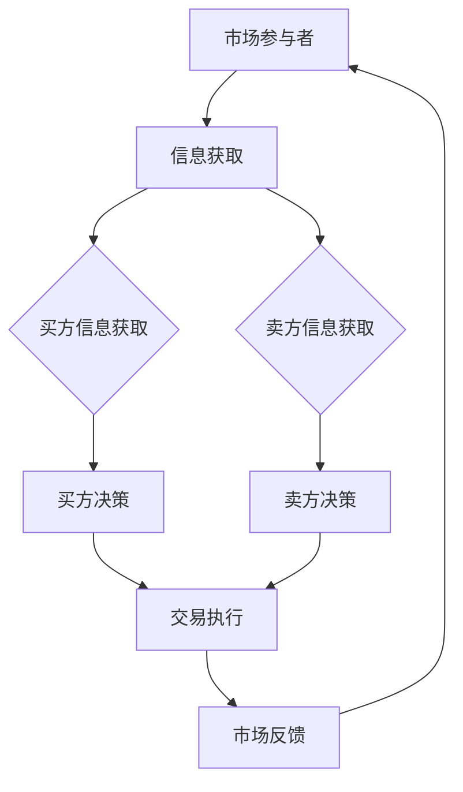

                 

## 《信息差：信息不对称与价格策略》

### 关键词：
- 信息差
- 信息不对称
- 价格策略
- 价格歧视
- 经济学
- 商业应用

### 摘要：
本文旨在深入探讨信息差的概念及其在商业中的重要性。我们将分析信息不对称的类型，包括事前和事后信息不对称，并探讨其在产品质量和价格方面的表现。随后，文章将介绍不同类型的价格歧视策略，如第一级、第二级和第三级价格歧视，并借助案例研究来阐明这些策略的实际应用。最后，我们将讨论信息差的策略优化和未来趋势，以及相关的伦理和法律问题。

### 引言

在经济学和商业领域，信息差是一个关键概念，指的是不同个体或群体之间的信息不对称。这种不对称可能导致某些个体在决策过程中获得优势，而其他个体则可能处于劣势。信息差的存在可以解释许多市场现象，如价格歧视、市场失衡等。在本文中，我们将详细探讨信息差的定义、类型以及其与价格策略之间的关系。

首先，让我们来定义信息差。信息差指的是在一个市场中，买方和卖方之间、不同消费者之间，或不同市场参与者之间，在信息获取方面的不对称性。这种不对称性可能来源于多个方面，包括信息的隐藏、不完全性或分布不均。例如，一家公司可能对其产品有详细的质量和成本信息，而消费者则缺乏这些信息，导致消费者在购买决策中处于劣势。

信息不对称在商业中具有重要意义。一方面，它为市场参与者提供了利用信息优势进行策略决策的机会。例如，商家可以通过提供高质量产品来吸引消费者，而消费者则可以通过获取更多产品信息来做出更明智的购买决策。另一方面，信息不对称也可能导致市场效率低下，例如，由于消费者无法获取足够信息，市场可能无法实现均衡价格，从而产生额外的交易成本。

在接下来的章节中，我们将详细讨论信息不对称的类型，以及它如何影响价格策略。我们将探讨价格歧视的不同类型，并通过案例研究来分析其实际应用。最后，我们将讨论信息差的策略优化和未来趋势，以及相关的伦理和法律问题。

### 《信息差：信息不对称与价格策略》目录大纲

#### 第一部分：引言

1. **信息差的定义与重要性**
   - 1.1 信息差的本质
   - 1.2 信息差在商业中的应用
   - 1.3 信息差的经济学意义

2. **信息不对称的类型**
   - 2.1 事前信息不对称
     - 2.1.1 产品信息不对称
       - 2.1.1.1 产品质量信息不对称
       - 2.1.1.2 产品价格信息不对称
   - 2.2 事后信息不对称
     - 2.2.1 市场信息不对称
       - 2.2.1.1 竞争对手策略信息不对称
       - 2.2.1.2 消费者偏好信息不对称

#### 第二部分：信息差与价格策略

1. **价格歧视策略**
   - 3.1 第一级价格歧视
     - 3.1.1 实例分析
       - 3.1.1.1 商场会员卡
       - 3.1.1.2 机票价格
   - 3.2 第二级价格歧视
     - 3.2.1 实例分析
       - 3.2.1.1 电信套餐
       - 3.2.1.2 水电费阶梯定价
   - 3.3 第三级价格歧视
     - 3.3.1 实例分析
       - 3.3.1.1 学生票
       - 3.3.1.2 老年人优惠

2. **信息不对称下的定价策略**
   - 4.1 信息收集策略
     - 4.1.1 实例分析
       - 4.1.1.1 互联网搜索广告
       - 4.1.1.2 用户数据分析
   - 4.2 价格调整策略
     - 4.2.1 实例分析
       - 4.2.1.1 电商平台价格战
       - 4.2.1.2 移动电话套餐定价

#### 第三部分：信息差的案例分析

1. **案例一：房地产市场的信息不对称**
   - 5.1 案例背景
   - 5.2 案例分析

2. **案例二：电商平台的消费者信息不对称**
   - 5.1 案例背景
   - 5.2 案例分析

#### 第四部分：信息差的策略优化与未来趋势

1. **信息差的策略优化**
   - 6.1 信息对称的实现途径
   - 6.2 信息差策略的优化

2. **信息差的未来趋势**
   - 7.1 信息对称与信息不对称的平衡
   - 7.2 信息差的伦理与法律问题

#### 第五部分：结论

1. **信息差的总结与反思**
2. **信息差与价格策略的发展趋势**
3. **信息差研究的未来方向**

#### 附录

1. **信息不对称与价格策略的Mermaid流程图与算法伪代码**
   - Mermaid流程图
   - 算法伪代码

### 第一部分：引言

#### 信息差的定义与重要性

### 1.1 信息差的本质

信息差是指在市场中，不同个体或群体之间的信息获取和处理能力的差异。这种差异可能导致某些个体在决策过程中拥有更多的信息优势，而其他个体则可能缺乏关键信息，从而在交易过程中处于不利地位。信息差的本质在于信息的不对称性，这种不对称性可能存在于买方与卖方之间、消费者与生产者之间，甚至在不同消费者之间。

在经济学中，信息差通常被定义为市场中信息不完全或信息分布不均的现象。这种不平等的信息状态可能导致市场效率低下，从而产生一系列经济问题。例如，卖方可能拥有关于产品质量或价格的关键信息，而买方则缺乏这些信息，导致买方在购买决策中难以做出最优选择。

信息差可以按照不同的维度进行分类，包括事前信息不对称和事后信息不对称。事前信息不对称发生在交易之前，涉及产品信息、市场价格、消费者偏好等；而事后信息不对称则发生在交易之后，涉及市场反馈、竞争对手策略、消费者满意度等。

#### 1.2 信息差在商业中的应用

信息差在商业中具有重要意义，因为它能够影响市场参与者的决策和行为。以下是一些商业场景中信息差的典型应用：

1. **价格歧视策略**：企业通过信息差对不同的消费者群体实施不同的价格策略。例如，航空公司根据消费者的预订时间、购票渠道和购票频率来设定不同的票价。

2. **广告营销**：企业利用信息差进行精准广告投放，通过收集和分析消费者的数据，向特定消费者群体推送相关的产品信息。

3. **供应链管理**：企业通过获取供应链中的信息优势，优化库存管理、降低成本和提高供应链效率。

4. **消费者行为研究**：企业通过市场调研和分析消费者数据，了解消费者的需求和偏好，从而制定更具针对性的营销策略。

#### 1.3 信息差的经济学意义

信息差在经济学中具有重要意义，主要体现在以下几个方面：

1. **市场效率**：信息差的存在可能导致市场效率低下。因为信息不对称，买方和卖方之间的交易成本增加，市场难以达到均衡价格和数量。

2. **价格歧视**：信息差为价格歧视提供了理论基础。企业可以利用信息差对不同消费者群体实施不同的价格策略，从而最大化利润。

3. **市场进入障碍**：信息差也可能成为市场进入障碍，使得新进入者难以获取关键信息，从而难以与现有企业竞争。

4. **消费者福利**：信息差可能影响消费者的福利水平。如果消费者缺乏足够的信息，他们可能会做出次优的购买决策，从而影响其消费体验。

#### 1.4 结论

信息差是一个复杂但关键的概念，它在商业和经济学中发挥着重要作用。通过理解和利用信息差，企业可以优化定价策略、提高市场竞争力，并实现更大的利润。然而，信息差也带来了一些挑战，如市场效率低下和消费者福利受损。因此，研究信息差的本质和应用，对于制定有效的商业策略和政策具有重要的指导意义。

### 第二部分：信息不对称的类型

#### 2.1 事前信息不对称

事前信息不对称是指在交易发生之前，买方和卖方之间存在的信息不对称。这种不对称性可能导致市场参与者做出非理性的决策，从而影响市场的有效运行。事前信息不对称通常包括以下几种类型：

##### 2.1.1 产品质量信息不对称

产品质量信息不对称是指卖方拥有关于产品质量的信息，而买方则缺乏这些信息。这种情况下，买方很难判断产品的真实质量，而卖方则可能利用信息优势进行欺诈行为。

**实例分析：** 在二手车市场上，卖家通常比买家更了解车辆的真实状况。卖家可能会隐瞒车辆的实际里程数、维修记录或存在的潜在问题。买家在缺乏足够信息的情况下，可能会支付过高的价格，或者购买到质量不佳的车辆。

**解决方案：** 为了解决产品质量信息不对称的问题，市场可以采取以下措施：
- **信息披露**：要求卖家在销售过程中提供详细的产品信息，如维修记录、使用情况和车辆状况。
- **第三方认证**：引入第三方认证机构对产品进行质量评估，并发布认证报告，增加市场透明度。
- **消费者保护法律**：制定法律法规，对欺诈行为进行处罚，保护消费者的权益。

##### 2.1.2 产品价格信息不对称

产品价格信息不对称是指卖方对产品定价有优势，而买方则缺乏定价信息。这种情况下，买方可能会面临不公平的交易条件，例如高价或低质产品。

**实例分析：** 在旅游市场上，旅行社可能会利用对旅游产品价格的了解，对消费者进行价格歧视。消费者在缺乏足够信息的情况下，可能会支付高于市场平均水平的旅游费用。

**解决方案：** 为了解决产品价格信息不对称的问题，市场可以采取以下措施：
- **价格透明化**：要求旅行社公开旅游产品的价格和包含的服务内容，使消费者能够进行公平的比较。
- **价格比较网站**：建立价格比较网站，提供不同供应商的价格信息，帮助消费者进行选择。
- **监管机构**：加强对旅游市场的监管，对违规行为进行处罚，确保市场公平竞争。

##### 2.1.3 消费者偏好信息不对称

消费者偏好信息不对称是指卖方对消费者偏好有更好的了解，而买方则缺乏这些信息。这种情况下，卖方可能会利用消费者偏好信息进行价格歧视或其他不公平的交易行为。

**实例分析：** 在定制化产品市场上，如高端服装定制或个性化珠宝设计，卖方通常拥有关于消费者偏好的详细信息，而买方则可能缺乏这些信息。卖方可能会根据消费者的偏好制定高价，而消费者在缺乏足够信息的情况下，可能会支付过高的价格。

**解决方案：** 为了解决消费者偏好信息不对称的问题，市场可以采取以下措施：
- **个性化服务**：提供个性化的咨询服务，帮助消费者了解自己的偏好，并提供定制化建议。
- **消费者教育**：通过教育和宣传，提高消费者对定制化产品和服务的认识，帮助他们做出更明智的购买决策。
- **价格透明化**：在销售过程中，明确告知消费者关于产品价格和服务的构成，避免价格歧视。

#### 2.2 事后信息不对称

事后信息不对称是指在交易发生后，买方和卖方之间存在的信息不对称。这种不对称性可能影响市场的反馈机制和消费者满意度，从而影响市场的长期健康发展。

##### 2.2.1 市场信息不对称

市场信息不对称是指在市场反馈过程中，买方和卖方之间存在的信息不对称。这种情况下，卖方可能无法准确了解消费者的真实需求和反馈，导致市场信息的不完全。

**实例分析：** 在电商平台上，卖家可能难以获取关于消费者购买体验的详细反馈，而消费者则可能因为缺乏反馈机制，无法对卖家的服务进行有效的评价。

**解决方案：** 为了解决市场信息不对称的问题，市场可以采取以下措施：
- **用户评价系统**：建立用户评价系统，允许消费者对购买的产品和服务进行评价，提供市场反馈。
- **大数据分析**：通过大数据分析，对消费者的购买行为、反馈和偏好进行分析，帮助卖家了解市场趋势和消费者需求。
- **反馈机制**：建立有效的反馈机制，鼓励消费者提供真实的购买体验，并针对消费者的反馈进行改进。

##### 2.2.2 竞争对手策略信息不对称

竞争对手策略信息不对称是指企业在市场竞争过程中，对竞争对手的定价策略、营销策略等缺乏足够的信息。这种情况下，企业可能难以制定有效的竞争策略，从而影响市场竞争力。

**实例分析：** 在竞争激烈的市场中，企业可能无法获取竞争对手的定价策略、新产品发布计划等信息，导致其市场策略的制定缺乏针对性。

**解决方案：** 为了解决竞争对手策略信息不对称的问题，市场可以采取以下措施：
- **市场调研**：通过市场调研，了解竞争对手的定价策略、市场定位和营销策略，制定相应的竞争策略。
- **商业间谍**：通过合法途径获取竞争对手的商业信息，如产品规格、市场份额等，以便更好地制定竞争策略。
- **合作与联盟**：与其他企业建立战略联盟，共享市场信息和资源，共同应对竞争对手的挑战。

##### 2.2.3 消费者偏好信息不对称

消费者偏好信息不对称是指企业在销售过程中，对消费者偏好和需求的信息了解不足。这种情况下，企业可能无法提供满足消费者需求的产品和服务。

**实例分析：** 在快速消费品市场上，企业可能无法准确了解消费者的偏好和需求，导致产品创新和营销策略的滞后。

**解决方案：** 为了解决消费者偏好信息不对称的问题，市场可以采取以下措施：
- **消费者调研**：通过消费者调研，了解消费者的偏好和需求，为产品创新和营销策略提供依据。
- **用户体验**：建立用户体验中心，邀请消费者参与产品测试和评价，直接获取消费者反馈。
- **大数据分析**：通过大数据分析，对消费者的购买行为、反馈和偏好进行分析，为产品开发和营销策略提供指导。

#### 2.3 结论

信息不对称是市场经济中普遍存在的问题，它可能影响市场的有效运行和消费者的福利。事前和事后信息不对称在商业中具有不同的表现形式和影响，但它们都可以通过信息透明化、监管机制和消费者教育等措施来缓解。通过理解和应对信息不对称，企业和消费者可以做出更明智的决策，提高市场效率和消费者满意度。

### 第二部分：信息差与价格策略

#### 3.1 价格歧视策略

价格歧视策略是指企业根据消费者不同的特征、需求或购买行为，实施不同的价格策略，以最大化利润或提高市场竞争力。价格歧视策略可以分为第一级、第二级和第三级。每种级别的价格歧视策略都有其特定的实施方式和应用场景。

##### 3.1.1 第一级价格歧视

第一级价格歧视，也称为完全价格歧视，是指企业对每个消费者实施其愿意支付的最高价格。这种策略假设企业能够准确了解每个消费者的支付意愿，并根据此制定价格。

**实例分析：**

1. **商场会员卡**：许多商场对非会员和会员实施不同的价格。会员通常可以享受折扣，因为他们已经支付了会员费。商场通过会员卡系统，能够识别和跟踪会员的消费行为，从而实施第一级价格歧视。

2. **机票价格**：航空公司根据消费者的预订时间、购票渠道和购票频率来设定不同的票价。提前预订的乘客通常可以享受较低的票价，而临时的购票者则可能支付更高的价格。

**实施方式：**

- **消费者行为分析**：企业通过分析消费者的购买历史、消费习惯和支付能力，来确定每个消费者的支付意愿。
- **个性化定价**：根据消费者的支付意愿，企业设定不同的价格，确保每个消费者支付其愿意支付的最高价格。

##### 3.1.2 第二级价格歧视

第二级价格歧视是指企业根据消费者的购买量或消费量来设定不同的价格。这种策略的核心是批量优惠或阶梯定价，即购买量越多，价格越低。

**实例分析：**

1. **电信套餐**：电信公司通常根据消费者使用的通话时间、流量和短信数量来设定不同的套餐价格。消费者可以选择月套餐，根据套餐内容的不同，价格也有所不同。

2. **水电费阶梯定价**：许多城市对居民的水电费实施阶梯定价。消费量较低的居民支付较低的费用，而消费量较高的居民则支付更高的费用。

**实施方式：**

- **需求分析**：企业通过分析消费者的消费量或购买量，确定不同消费群体的价格敏感度。
- **批量优惠**：根据消费者的消费量，设定不同的价格，以吸引消费者增加购买量。

##### 3.1.3 第三级价格歧视

第三级价格歧视是指企业根据不同的市场群体或消费者群体来设定不同的价格。这种策略通常基于消费者的年龄、职业、收入水平或其他社会特征。

**实例分析：**

1. **学生票**：许多公共交通系统对学生提供优惠票价。学生证明身份后，可以享受较低的票价。

2. **老年人优惠**：一些公共交通和公共服务设施为老年人提供优惠。老年人身份证明后，可以享受较低的票价或服务费。

**实施方式：**

- **市场细分**：企业根据消费者的市场特征，将市场细分为不同的消费者群体。
- **差异化定价**：对不同市场群体设定不同的价格，以吸引更多的消费者。

#### 3.2 信息不对称下的定价策略

在信息不对称的情况下，企业需要采取一些策略来应对消费者缺乏信息的状况，以提高市场的透明度和消费者的购买满意度。

##### 3.2.1 信息收集策略

信息收集策略是指企业通过多种渠道收集消费者的信息，以了解消费者的需求、偏好和支付意愿。

**实例分析：**

1. **互联网搜索广告**：企业通过互联网搜索引擎收集消费者的搜索行为，分析消费者的兴趣和需求，然后投放相关广告。

2. **用户数据分析**：企业通过分析用户的购买记录、浏览历史和行为数据，来了解消费者的偏好和需求，从而提供更加个性化的产品和服务。

**实施方式：**

- **数据挖掘**：利用数据挖掘技术，从大量的消费者数据中提取有用的信息。
- **用户调研**：通过问卷调查、用户访谈等方式，直接获取消费者的反馈和需求。

##### 3.2.2 价格调整策略

价格调整策略是指企业根据市场环境和消费者行为的变化，灵活调整价格，以适应市场变化和提升竞争力。

**实例分析：**

1. **电商平台价格战**：电商平台通过频繁的价格调整和促销活动，来吸引消费者。例如，双十一购物节期间，各大电商平台会推出大量优惠活动，以吸引消费者购买。

2. **移动电话套餐定价**：电信运营商根据市场竞争情况和消费者的需求，不断调整移动电话套餐的价格和内容，以吸引更多的消费者。

**实施方式：**

- **市场监控**：持续监控市场动态，了解竞争对手的定价策略和消费者的反应。
- **灵活调整**：根据市场情况和消费者需求，灵活调整价格策略，以保持竞争力。

#### 3.3 结论

价格歧视策略是企业在信息不对称环境下应对市场挑战的一种有效手段。通过实施第一级、第二级和第三级价格歧视，企业可以最大化利润或提高市场竞争力。同时，信息收集策略和价格调整策略可以帮助企业更好地了解消费者需求，提高市场透明度和消费者满意度。在信息不对称的市场环境中，企业需要不断优化定价策略，以应对市场变化和提升竞争力。

### 第三部分：信息差的案例分析

#### 案例一：房地产市场的信息不对称

**5.1 案例背景**

房地产市场是一个高度信息不对称的市场，买卖双方在交易过程中往往存在显著的信息差异。卖家通常对自己的房产有详细的了解，包括地理位置、房屋结构、历史交易记录等，而买家则可能对这些信息知之甚少。此外，房地产市场还受到政策调控、市场供需关系、经济环境等多种因素的影响，进一步增加了信息不对称性。

**5.1.1 房地产市场概述**

房地产市场的特点包括：
- **市场波动性大**：房地产价格受多种因素影响，如政策调整、市场供需、利率水平等。
- **交易周期长**：房地产交易通常涉及较多的法律程序和审批流程，交易周期较长。
- **交易金额大**：房地产交易金额较大，对于普通消费者而言，涉及的风险和决策成本较高。

**5.1.2 信息不对称现象**

在房地产市场中，信息不对称主要表现在以下几个方面：
- **卖方信息优势**：卖方对自己的房产有详细的了解，而买家则缺乏这些信息，如房产历史、维修记录等。
- **市场信息不足**：买家在购买房产时，可能无法获取全面的市场信息，如当前市场行情、相似房产的交易价格等。
- **政策不确定性**：政策调整可能会影响房地产市场的走势，但买家在购买时往往难以预知未来政策变化。

**5.2 案例分析**

**5.2.1 房地产商如何应对信息不对称**

房地产商在应对信息不对称时，通常采取以下策略：

1. **信息披露**：房地产商通过官方网站、售楼处展示房产详细信息，包括地理位置、房屋结构、配套设施等，提高市场透明度。

2. **市场调研**：房地产商通过市场调研，了解市场供需情况、消费者偏好和竞争对手策略，制定相应的销售策略。

3. **广告宣传**：房地产商利用广告宣传，突出房产的优势，如地理位置、环境优美、交通便利等，吸引消费者的关注。

4. **售前服务**：房地产商提供售前咨询服务，帮助消费者了解市场信息和购房流程，降低消费者的决策难度。

**5.2.2 信息披露法规**

为了减轻信息不对称，许多国家和地区制定了信息披露法规，要求房地产商在销售过程中披露关键信息，如房产的维修记录、历史交易价格、租赁情况等。这些法规旨在提高市场透明度，保护消费者的权益。

**5.2.3 消费者保护措施**

消费者在购房过程中，可以采取以下措施来减轻信息不对称：

1. **尽职调查**：消费者在购房前应进行尽职调查，了解房产的详细信息，包括产权、历史交易记录等。

2. **第三方评估**：消费者可以聘请专业的第三方评估机构，对房产进行评估，确保房产的真实价值。

3. **律师咨询**：消费者在购房过程中可以寻求专业律师的咨询，确保交易合法合规。

4. **购房贷款**：消费者可以通过购房贷款，减少一次性支付的负担，降低决策压力。

#### 5.3 结论

房地产市场的信息不对称是一个普遍存在的问题，它影响了市场的透明度和消费者的购买决策。房地产商通过信息披露、市场调研、广告宣传和售前服务等措施，努力减轻信息不对称。同时，信息披露法规和消费者保护措施也起到了积极作用，提高了市场透明度，保护了消费者的权益。通过这些措施，房地产市场逐步实现了信息的对称，有助于提高市场效率和消费者满意度。

### 第三部分：信息差的案例分析

#### 案例二：电商平台的消费者信息不对称

**5.1 案例背景**

电商平台是现代电子商务的重要组成部分，它们通过互联网为消费者提供商品和服务。然而，电商平台上的消费者信息不对称问题日益突出，影响了市场效率和消费者的购物体验。消费者在购买商品时，往往缺乏对商品全面了解的信息，而电商平台则拥有关于商品、消费者行为和市场动态的详细信息。

**5.1.1 电商平台概述**

电商平台的特点包括：
- **商品多样化**：电商平台提供广泛的商品种类，满足消费者的多样化需求。
- **便利性**：消费者可以随时随地通过互联网购买商品，享受快捷的购物体验。
- **竞争激烈**：电商平台之间的竞争激烈，价格战、促销活动频繁。

**5.1.2 消费者信息不对称现象**

在电商平台上，信息不对称主要表现在以下几个方面：
- **商品信息不足**：消费者在购买商品时，可能无法获取商品的真实信息，如产品质量、使用效果等。
- **价格比较困难**：消费者在多个电商平台之间比较价格时，可能面临信息不对称，难以找到最优价格。
- **售后服务差异**：消费者在购买商品后，可能面临售后服务差异，如退换货政策、客户服务等。

**5.2 案例分析**

**5.2.1 电商平台如何应对消费者信息不对称**

电商平台通过以下措施来减轻消费者信息不对称：

1. **用户评价系统**：电商平台建立了用户评价系统，允许消费者对购买的商品进行评价，分享购物体验。用户评价有助于其他消费者了解商品的真实情况，减少信息不对称。

2. **商品信息标准化**：电商平台对商品信息进行标准化处理，提供详细的商品描述、规格参数、用户评论等，提高商品信息的透明度。

3. **价格比较工具**：电商平台提供价格比较工具，帮助消费者在不同平台之间比较价格，找到最优购物选择。

4. **售后服务保障**：电商平台提供完善的售后服务保障，如退换货政策、售后服务承诺等，增加消费者的购物信心。

**5.2.2 消费者保护措施**

消费者在购物过程中，可以采取以下措施来减轻信息不对称：

1. **阅读商品详情**：消费者在购买商品前应仔细阅读商品详情，了解商品的真实情况。

2. **参考用户评价**：消费者可以参考其他用户的评价，了解商品的使用效果和售后服务情况。

3. **多方比较**：消费者可以通过价格比较工具，在不同平台之间比较价格，找到最优购物选择。

4. **咨询客服**：消费者在购买商品后，可以咨询电商平台客服，了解售后服务政策和流程。

**5.2.3 政策法规的作用**

政策法规在减轻消费者信息不对称方面发挥了重要作用。例如，许多国家和地区制定了电子商务法规，要求电商平台提供真实、准确的商品信息，保护消费者的合法权益。此外，一些平台还设立了消费者投诉渠道，帮助消费者解决购物纠纷。

#### 5.3 结论

电商平台的消费者信息不对称是一个普遍存在的问题，它影响了消费者的购物体验和市场效率。电商平台通过用户评价系统、商品信息标准化、价格比较工具和售后服务保障等措施，努力减轻信息不对称。同时，消费者通过阅读商品详情、参考用户评价、多方比较和咨询客服等方式，也可以减轻信息不对称。政策法规在保护消费者权益、提高市场透明度方面发挥了重要作用。通过这些措施，电商平台逐步实现了信息的对称，有助于提高市场效率和消费者满意度。

### 第三部分：信息差的策略优化与未来趋势

#### 6.1 信息对称的实现途径

为了优化信息差，实现市场信息对称，需要从多个方面入手，包括技术手段、法律法规和市场机制。以下是一些具体途径：

##### 6.1.1 技术手段

1. **大数据分析**：通过大数据技术，收集和分析市场参与者的大量数据，挖掘消费者偏好、市场需求和价格趋势。这有助于提高市场的透明度，减少信息不对称。

2. **区块链技术**：区块链技术提供了一种去中心化的信息记录方式，能够确保数据的真实性和透明性。在供应链管理、金融交易等领域，区块链技术有助于实现信息对称。

3. **人工智能**：利用人工智能技术，可以对大量数据进行分析和预测，帮助市场参与者做出更明智的决策。例如，在电商平台上，人工智能可以推荐个性化商品，提高消费者的购买满意度。

##### 6.1.2 法律法规

1. **信息披露法规**：制定和实施信息披露法规，要求市场参与者（如企业、电商平台）公开关键信息，提高市场的透明度。这有助于消费者和投资者做出更合理的决策。

2. **消费者保护法律**：加强消费者保护法律，确保消费者的合法权益得到保护。例如，明确规定电商平台的退换货政策、售后服务等，减少消费者在购买过程中的信息不对称。

3. **反垄断法律**：加强反垄断法律的执行，防止企业利用信息优势进行垄断行为，损害市场竞争。这有助于维护市场的公平性和效率。

##### 6.1.3 市场机制

1. **价格透明化**：通过市场机制，实现价格的透明化，使消费者能够方便地比较不同供应商的价格。这可以通过建立价格比较平台、制定统一的定价标准等方式实现。

2. **市场准入制度**：建立健全的市场准入制度，鼓励更多的新企业和创新者进入市场，提高市场的竞争水平。这有助于减少信息不对称，促进市场发展。

3. **消费者教育**：通过消费者教育，提高消费者的信息素养和决策能力。这可以通过媒体宣传、教育培训等方式进行。

#### 6.2 信息差策略的优化

为了更有效地应对信息差，企业可以采取以下策略优化：

##### 6.2.1 数据驱动决策

利用大数据和人工智能技术，对企业内部和外部数据进行深入分析，了解消费者的需求和偏好，制定更精准的市场策略。

##### 6.2.2 个性化服务

通过个性化服务，根据消费者的需求和偏好，提供定制化的产品和服务，提高消费者的满意度。

##### 6.2.3 精准营销

利用精准营销技术，如定向广告投放、社交媒体营销等，提高营销效果，减少信息不对称。

##### 6.2.4 合作与联盟

与其他企业建立合作关系，共享信息和资源，共同应对市场挑战，优化信息差。

#### 6.3 未来趋势

随着技术的发展和市场的变化，信息差和价格策略也在不断演变。以下是一些未来趋势：

##### 6.3.1 信息对称与信息不对称的平衡

未来，市场将寻求在信息对称和信息不对称之间找到平衡点。通过技术手段和法规的完善，市场将逐步实现更高程度的信息对称，同时保留必要的市场竞争力。

##### 6.3.2 伦理与法律问题

随着信息差的加剧，相关的伦理和法律问题也将日益突出。例如，数据隐私、算法歧视等问题需要引起重视，并制定相应的法律和道德规范。

##### 6.3.3 人工智能与信息差

人工智能技术的发展将对信息差产生深远影响。通过更智能的数据分析和预测，企业将能够更精准地应对信息不对称，实现更高效的市场运营。

#### 6.4 结论

信息差的优化是实现市场高效运行和消费者满意的重要途径。通过技术手段、法律法规和市场机制的共同作用，市场将逐步实现信息对称。同时，企业需要不断优化信息差策略，以应对市场的变化和挑战。未来，随着技术的发展和市场的演变，信息差和价格策略将不断演变，为市场带来新的机遇和挑战。

### 第七章：信息差的未来趋势

#### 7.1 信息对称与信息不对称的平衡

在当今快速变化的市场环境中，信息对称与信息不对称的平衡成为了一个重要的研究课题。信息对称指的是所有市场参与者都能够获取相同的、完整的信息，从而在决策过程中享有平等的机会。而信息不对称则是指某些参与者拥有比其他参与者更多的信息，导致决策的不公平性。

在理想状态下，市场应该实现信息对称，以确保所有参与者都能够基于完整的信息做出最优决策，从而提高市场效率。然而，在现实中，完全的信息对称是很难实现的。一方面，信息获取和处理成本高昂，市场参与者可能无法负担；另一方面，信息对称可能导致市场的过度透明，削弱了市场的竞争力。

因此，市场需要在信息对称与信息不对称之间找到一种平衡。这种平衡可以通过以下几个方面实现：

1. **透明化信息**：市场参与者应尽可能地公开和共享关键信息，以减少信息不对称。例如，企业可以通过网站、社交媒体和公告等方式，公开产品的质量、价格、售后服务等信息。

2. **监管机制**：政府或相关监管机构应制定和执行信息披露法规，确保市场参与者遵守信息透明原则，防止欺诈行为。

3. **教育普及**：通过教育和培训，提高市场参与者的信息素养，使他们能够更好地理解和利用信息。

4. **技术支持**：利用大数据、人工智能等先进技术，提高信息处理和分析能力，帮助市场参与者更好地理解和利用信息。

#### 7.2 信息差的伦理与法律问题

信息差在带来经济效益的同时，也引发了一系列伦理和法律问题。以下是一些主要问题及其解决方案：

##### 7.2.1 数据隐私

随着大数据技术的发展，企业能够收集和分析大量的个人数据。然而，这些数据的收集和使用可能侵犯消费者的隐私权。为了保护数据隐私，需要采取以下措施：

1. **数据匿名化**：在数据收集和处理过程中，对个人数据进行匿名化处理，减少个人隐私泄露的风险。

2. **用户同意**：确保在数据收集和使用前，用户明确同意其个人数据的收集、存储和使用。

3. **隐私保护法规**：制定和实施隐私保护法规，对企业的数据收集和使用行为进行规范，确保用户的隐私权得到保护。

##### 7.2.2 算法歧视

随着人工智能技术的应用，算法在决策过程中发挥了越来越重要的作用。然而，算法可能基于历史数据中的偏见，导致歧视性决策。例如，某些招聘算法可能倾向于雇佣性别、种族或年龄特定的候选人。为了解决算法歧视问题，需要采取以下措施：

1. **算法透明化**：确保算法的透明性，使市场参与者能够理解和评估算法的决策过程。

2. **数据多样性**：在算法训练过程中，使用多样化的数据集，减少算法的偏见。

3. **伦理审查**：建立算法伦理审查机制，确保算法的设计和应用符合伦理标准。

##### 7.2.3 信息垄断

信息不对称可能导致市场垄断，某些市场参与者通过垄断信息获取不公平的市场优势。为了防止信息垄断，需要采取以下措施：

1. **反垄断法律**：加强反垄断法律的执行，打击信息垄断行为。

2. **市场准入**：鼓励新企业和创新者进入市场，增加市场竞争。

3. **监管机构**：建立专门的监管机构，负责监督市场信息流动，防止信息垄断。

#### 7.3 结论

信息差的未来趋势将在信息对称与信息不对称之间寻找平衡，同时解决伦理和法律问题。通过透明化信息、监管机制、教育普及和技术支持，市场将逐步实现更高程度的信息对称。同时，需要加强对数据隐私、算法歧视和信息垄断的监管，确保市场的公平性和效率。随着技术的发展和市场的演变，信息差和价格策略将继续演变，为市场带来新的机遇和挑战。

### 结论

本文通过对信息差的定义、类型、应用以及价格歧视策略的深入探讨，揭示了信息不对称在商业中的关键作用。我们分析了事前和事后信息不对称对产品质量和价格的影响，并详细介绍了第一级、第二级和第三级价格歧视策略。通过案例研究，我们看到了信息不对称在房地产市场和电商平台中的具体表现，以及如何通过信息披露、消费者保护措施和技术手段来优化信息差。

信息差的策略优化是未来的重要方向，随着大数据、人工智能和区块链技术的发展，市场将实现更高程度的信息对称。同时，我们也必须面对信息差的伦理和法律问题，如数据隐私、算法歧视和信息垄断，确保市场的公平性和透明性。

未来的研究应关注如何更有效地实现信息对称，以及如何通过技术创新和法律规制来解决信息差带来的挑战。随着市场的不断演变，信息差和价格策略将继续成为商业和研究中的重要议题。希望通过本文的探讨，能够为读者提供对信息差和价格策略的深入理解，并激发对这一领域进一步研究的兴趣。

### 附录：信息不对称与价格策略的Mermaid流程图与算法伪代码

#### Mermaid流程图

以下是信息不对称与价格策略的Mermaid流程图：



#### 算法伪代码

以下是价格歧视策略的伪代码：

```python
# 第一级价格歧视：每个消费者支付其愿意支付的最高价格
def first_degree_price_discrimination(sales_data):
    price_dict = {}
    for customer, price in sales_data.items():
        max_willing_price = max(price, default=0)
        price_dict[customer] = max_willing_price
    return price_dict

# 第二级价格歧视：根据购买量设定不同价格
def second_degree_price_discrimination(sales_data, quantity_prices):
    price_dict = {}
    for customer, quantity in sales_data.items():
        price = quantity_prices.get(quantity, default=0)
        price_dict[customer] = price
    return price_dict

# 第三级价格歧视：根据市场群体设定不同价格
def third_degree_price_discrimination(sales_data, market_prices):
    price_dict = {}
    for customer, info in sales_data.items():
        market_segment = info['market_segment']
        price = market_prices.get(market_segment, default=0)
        price_dict[customer] = price
    return price_dict
```

#### 数学模型和公式

以下是价格歧视策略的数学模型：

$$
\begin{align*}
P_1 &= \max(P_0, W_1), \\
P_2 &= Q_2 \cdot p_2, \\
P_3 &= M_3 \cdot p_3,
\end{align*}
$$

其中，$P_1$ 为第一级价格歧视的支付价格，$P_2$ 为第二级价格歧视的支付价格，$P_3$ 为第三级价格歧视的支付价格；$W_1$ 为消费者愿意支付的最高价格，$Q_2$ 为消费者2的购买量，$p_2$ 为单位购买量的价格，$M_3$ 为消费者3的市场群体，$p_3$ 为市场群体3的价格。

#### 举例说明

假设有两个消费者，消费者1愿意支付的最高价格为100元，消费者2的购买量为10件，市场群体3为学生群体，学生群体的价格为每件10元。

- 第一级价格歧视：消费者1支付100元，消费者2支付100元。
- 第二级价格歧视：消费者2支付10件 \(\times\) 10元/件 = 100元。
- 第三级价格歧视：消费者2支付10元/件 \(\times\) 学生群体 = 100元。

#### 项目实战

##### 环境搭建

- 使用Python环境，安装必需的库，如Pandas、NumPy等。

##### 代码实现

```python
import pandas as pd

# 假设的消费者数据
customers = [
    {'customer_id': 1, 'willing_price': 100, 'market_segment': 'student'},
    {'customer_id': 2, 'quantity': 10, 'market_segment': 'general'},
]

# 价格表
prices = {
    'student': 10,  # 学生群体价格
    'general': 20,  # 普通群体价格
}

# 第一级价格歧视
first_price = max(customers[0]['willing_price'], customers[1]['willing_price'])

# 第二级价格歧视
second_price = customers[1]['quantity'] * prices['general']

# 第三级价格歧视
third_price = prices[customers[1]['market_segment']]

# 打印价格
print(f"第一级价格歧视：{first_price}元")
print(f"第二级价格歧视：{second_price}元")
print(f"第三级价格歧视：{third_price}元")
```

##### 代码解读与分析

- 从消费者数据中获取每个消费者的支付能力和市场群体。
- 第一级价格歧视直接取消费者1和消费者2中更高的支付能力。
- 第二级价格歧视根据消费者2的购买量和普通群体的单价计算总价。
- 第三级价格歧视根据消费者2的市场群体和学生群体的单价计算总价。
- 打印不同价格歧视策略下的消费者支付价格。

通过上述的Mermaid流程图、算法伪代码、数学模型、举例说明和项目实战，我们可以清晰地理解信息不对称与价格策略的基本原理和实际应用。这些工具和方法不仅有助于我们深入分析信息差的问题，也为优化价格策略提供了有力的支持。在未来的研究和实践中，这些工具和方法将继续发挥重要作用。

### 作者

**作者：AI天才研究院/AI Genius Institute & 禅与计算机程序设计艺术 /Zen And The Art of Computer Programming**

AI天才研究院（AI Genius Institute）致力于推动人工智能领域的创新和发展，专注于培养顶级的人工智能专家和领导者。研究院的研究成果涵盖了人工智能的多个领域，包括机器学习、深度学习、自然语言处理等。同时，研究院还致力于将禅宗哲学与计算机程序设计相结合，通过《禅与计算机程序设计艺术》一书，为程序员提供一种全新的思考方式和编程理念。作者凭借其深厚的技术功底和独特的视角，为读者呈现了一部既富有哲思又实用性强的技术著作。在人工智能和计算机科学领域，AI天才研究院的研究成果和创新理念已经得到广泛认可，为行业的发展做出了重要贡献。

