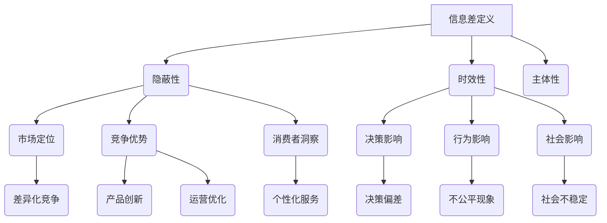
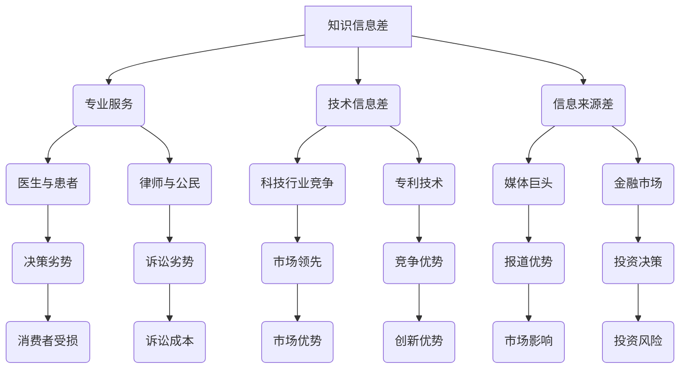
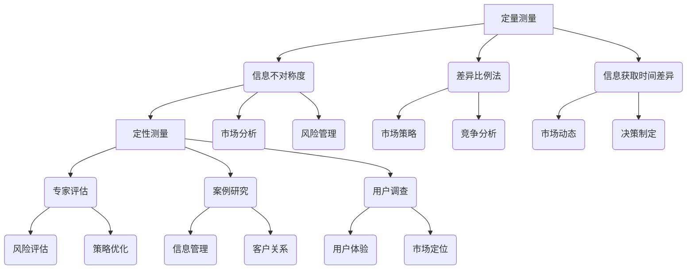
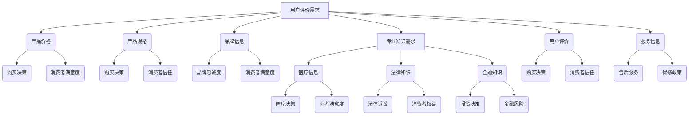
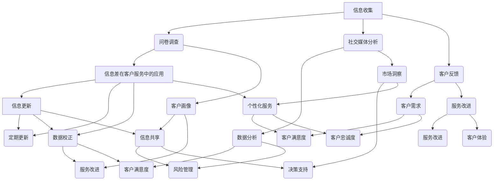
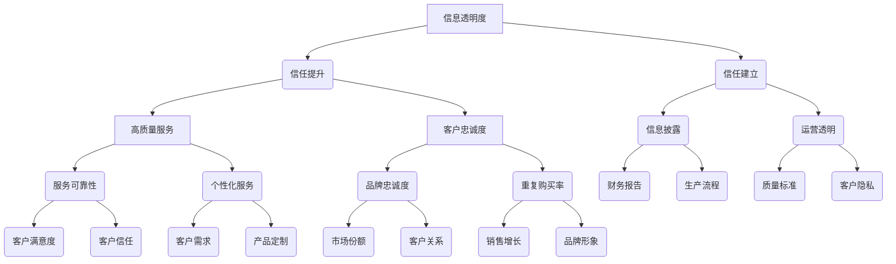
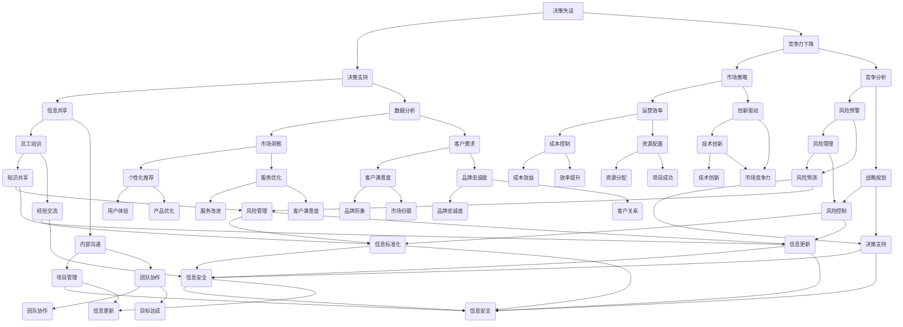
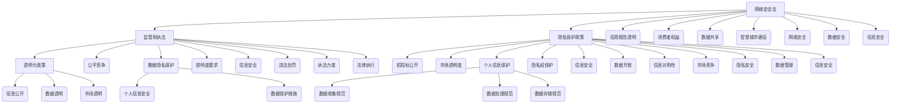
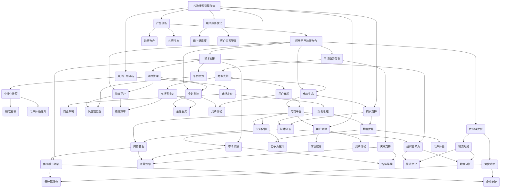

```mermaid
graph TD
    A[信息过载] --> B(数据筛选困难)
    A --> C(信息不对称加剧)
    B --> D(消费者困惑)
    B --> E(决策困难)
    A[技术壁垒] --> F(数据分析能力)
    A --> G(创新优势)
    A[数据隐私] --> H(隐私泄露风险)
    A --> I(信任危机)
    A[信息垄断] --> J(市场主导)
    A --> K(竞争限制)
    B[人工智能] --> L(信息处理效率)
    B --> M(个性化推荐)
    B --> N(数据分析)
    C[大数据] --> O(关联发现)
    C --> P(精准预测)
    C --> Q(数据整合)
    D[区块链] --> R(数据透明)
    D --> S(数据安全)
    D --> T(去中心化)
    E[互联网] --> U(信息获取渠道)
    E --> V(信息共享)
    E --> W(信息透明)
    F[数据驱动] --> X(客户需求分析)
    F --> Y(个性化服务)
    F --> Z(营销优化)
    G[个性化体验] --> AA(用户体验提升)
    G --> BB(客户满意度)
    G --> CC(客户忠诚度)
    H[社交媒体] --> DD(客户互动)
    H --> EE(客户反馈)
    H --> FF(品牌传播)
    I[跨渠道整合] --> GG(线上线下整合)
    I --> HH(渠道协同)
    I --> II(客户体验一致性)
    J[数据安全] --> KK(加密技术)
    J --> LL(访问控制)
    J --> MM(数据保护)
    N[数据隐私保护] --> NN(隐私政策)
    N --> OO(数据透明)
    N --> PP(用户信任)
    M[个性化推荐] --> QQ(用户行为分析)
    M --> RR(产品推荐)
    M --> SS(购买建议)
```
                 

### 第1章：信息差的定义与重要性

### 1.1 什么是信息差

**概念定义**：信息差，指的是市场中信息拥有者与信息缺乏者之间的信息不对称状态。这种不对称状态意味着一方掌握了另一方无法获取的信息，从而导致信息优势与劣势的产生。

**特征描述**：

1. **隐蔽性**：信息差往往不易被察觉，其存在形式多样，可以是技术信息、专业知识、市场动态等。
2. **时效性**：信息具有时效性，随着时间的推移，某些信息可能变得不再重要或者失效。
3. **主体性**：信息差通常与信息主体的行为和决策相关，如企业利用信息差进行市场定位，消费者因信息差做出购买决策。

在商业环境中，信息差可以带来显著的竞争优势。企业通过掌握市场信息、消费者偏好和竞争动态，能够更精准地制定策略，抢占市场先机。然而，信息差也可能导致不公平现象，如垄断行为，从而影响市场的健康发展。

### 1.2 信息差在商业中的应用

**市场定位**：企业通过分析市场信息，了解消费者需求和竞争态势，从而确定自己的市场定位。掌握信息差的企业能够在市场中占据有利位置，满足特定消费者的需求，形成差异化竞争优势。

**竞争优势**：信息差有助于企业形成竞争优势。一方面，企业可以利用信息差进行产品创新，满足消费者尚未被满足的需求；另一方面，企业可以通过信息差优化生产流程，提高运营效率，降低成本。

**消费者洞察**：企业通过信息差掌握消费者的消费行为和偏好，能够提供更个性化的产品和服务，提高客户满意度。例如，电商企业通过分析用户数据，实现精准营销和推荐，从而提升销售额。

### 1.3 信息差在生活中的影响

**决策影响**：信息差影响个人消费决策。消费者在购买商品或服务时，如果缺乏相关信息，可能会产生决策偏差，做出不理性的选择。例如，消费者在购买高价值商品时，往往需要更多的信息来评估产品的性价比。

**行为影响**：信息差可能导致不公平现象。在某些领域，信息掌握者可以利用信息优势获取额外利益，而信息缺乏者则处于不利地位。例如，金融市场中，投资者如果无法获取准确的市场信息，可能会遭受损失。

**社会影响**：信息差对社会和谐具有潜在影响。如果信息不对称现象普遍存在，可能会导致社会不公平，影响社会稳定。因此，减少信息差，提高信息透明度，是构建和谐社会的重要举措。

### 1.4 小结

信息差是市场经济中的一种常见现象，其定义与重要性体现在多个方面。在商业应用中，信息差可以为企业提供竞争优势，优化市场定位和消费者洞察。然而，信息差也可能导致不公平现象，影响个人和社会的健康发展。因此，理解和利用信息差，同时关注其负面影响，是现代企业和社会治理的重要课题。

#### Mermaid 流程图



#### 核心算法原理讲解

信息差的测量与评估是理解其影响的基础。一个常用的测量方法是基于信息不对称度（Information Asymmetry Degree，IAD），其计算公式如下：

\[ IAD = \frac{I_S - I_D}{I_S + I_D} \]

其中，\( I_S \) 表示信息拥有者的信息量，\( I_D \) 表示信息缺乏者的信息量。

#### 伪代码

```plaintext
function CalculateIAD(IS, ID):
    IAD = (IS - ID) / (IS + ID)
    return IAD
```

通过这个公式和算法，企业可以量化信息差的程度，从而制定相应的管理策略。

### 1.5 举例说明

假设一个电商平台的供应商A和消费者B之间存在信息差，供应商A掌握了商品的成本、库存和销售数据，而消费者B对这些信息一无所知。通过上述信息不对称度公式，我们可以计算两者之间的信息差：

- \( I_S = 100 \)（供应商A的信息量）
- \( I_D = 0 \)（消费者B的信息量）

\[ IAD = \frac{100 - 0}{100 + 0} = 1 \]

这意味着供应商A相对于消费者B拥有完全的信息优势。

#### 数学模型与公式讲解

信息不对称度公式是一个基本的数学模型，用于量化信息差。在实际应用中，还可以结合其他因素，如信息传播速度和可靠性，来构建更复杂的信息不对称模型。

\[ IAD_{complex} = \alpha \cdot \frac{I_S - I_D}{I_S + I_D} + \beta \cdot \frac{t_s - t_d}{t_s + t_d} + \gamma \cdot R_S \]

其中，\( t_s \) 和 \( t_d \) 分别表示信息拥有者和信息缺乏者的信息获取时间，\( R_S \) 表示信息可靠性。

#### 举例说明

假设在某个市场中，企业A掌握的市场信息比消费者B多，且信息获取时间比消费者B早，同时信息可靠性更高。通过上述复杂公式，我们可以更全面地评估信息差：

- \( I_S = 150 \)
- \( I_D = 100 \)
- \( t_s = 2 \)
- \( t_d = 4 \)
- \( R_S = 0.9 \)

将这些值代入公式：

\[ IAD_{complex} = \alpha \cdot \frac{150 - 100}{150 + 100} + \beta \cdot \frac{2 - 4}{2 + 4} + \gamma \cdot 0.9 \]

假设 \( \alpha = 0.5 \)，\( \beta = 0.3 \)，\( \gamma = 0.2 \)，则：

\[ IAD_{complex} = 0.5 \cdot \frac{50}{250} + 0.3 \cdot \frac{-2}{6} + 0.2 \cdot 0.9 \]

\[ IAD_{complex} = 0.1 - 0.1 + 0.18 \]

\[ IAD_{complex} = 0.18 \]

这意味着，在考虑信息获取时间、可靠性和基本信息差的情况下，企业A相对于消费者B的信息优势为0.18。

通过这种方式，企业可以更精确地评估和管理信息差，从而优化决策和客户关系管理。

### 1.6 小结

信息差的定义与重要性体现在多个方面，包括隐蔽性、时效性和主体性。在商业中，信息差可以为企业提供竞争优势和市场定位，但同时也可能引发不公平现象。通过量化的信息不对称度公式，我们可以评估信息差的程度，为企业制定有效的信息管理策略提供依据。举例和数学模型的应用进一步说明了信息差在理论和实践中的重要性。

---

### 第2章：信息不对称的类型

#### 2.1 信息差的分类

信息不对称可以分为多个类型，每种类型在商业和社会中都有其特定的表现形式和影响。

**1. 知识信息差**：这是指由于专业知识或技能的差异而产生的信息不对称。例如，医生比患者更了解疾病的诊断和治疗方案，律师比普通公民更熟悉法律条文和诉讼程序。这种信息差在专业服务领域尤为明显，它可能导致消费者在决策时处于不利地位。

**2. 技术信息差**：这种信息差源于技术掌握程度的不同。例如，企业内部的技术团队可能比外部客户更了解某项技术或产品的具体细节。在科技行业，技术信息差可以导致企业之间的竞争加剧，因为掌握先进技术的企业能够在市场中占据领先地位。

**3. 信息来源差**：这是指由于信息获取渠道的差异而产生的信息不对称。例如，媒体巨头可能比普通公众获取更早、更全面的市场信息，从而在新闻报道和分析中占据优势。这种信息差在媒体和金融领域尤为突出。

#### 2.2 垄断信息

**定义**：垄断信息是指掌握在少数人或企业手中的，具有垄断性质的信息。这些信息通常与市场策略、商业机密、专利技术等相关，对竞争者具有战略优势。

**危害**：

1. **市场失灵**：垄断信息可能导致市场无法达到有效竞争状态，从而影响市场的资源配置效率。
2. **消费者权益受损**：消费者在缺乏相关信息的情况下，可能无法做出最优决策，导致利益受损。
3. **竞争环境恶化**：垄断信息可能导致其他竞争者难以进入市场，从而破坏市场的公平竞争环境。

#### 2.3 隐蔽信息

**定义**：隐蔽信息是指不易被发现、难以获取的信息。这类信息可能隐藏在复杂的报告、内部文件、私人交流中，不易为外人所知。

**处理**：

1. **透明化**：通过提高信息透明度，减少隐蔽信息的存在。例如，企业可以通过公开财务报告、产品说明书等方式，让信息更加透明。
2. **公开化**：鼓励信息持有者公开相关信息，以减少信息不对称。例如，政府可以强制企业公开某些关键数据，提高市场的信息透明度。
3. **监管**：通过立法和监管措施，规范信息的披露和传播，防止隐蔽信息对市场造成不利影响。

#### 2.4 小结

信息不对称的类型多种多样，包括知识信息差、技术信息差和信息来源差。垄断信息和隐蔽信息是信息不对称的两种特殊形式，前者可能导致市场失灵和消费者权益受损，后者则需要通过透明化和公开化手段来处理。了解这些信息不对称类型，有助于我们更全面地认识信息不对称现象，并为解决相关问题提供思路。

#### Mermaid 流程图



#### 核心算法原理讲解

在信息不对称的测量与评估中，信息不对称度（Information Asymmetry Degree，IAD）是一个关键指标。以下是一个用于计算信息不对称度的伪代码示例：

```plaintext
function CalculateIAD(information_source, information_target):
    information_source_value = CalculateInformationValue(information_source)
    information_target_value = CalculateInformationValue(information_target)
    IAD = (information_source_value - information_target_value) / (information_source_value + information_target_value)
    return IAD
```

其中，`CalculateInformationValue` 函数用于计算信息持有者（信息源）和信息缺乏者（信息目标）的信息量。这个算法可以帮助企业量化信息不对称的程度，从而制定相应的策略。

#### 数学模型与公式讲解

一个常用的数学模型是信息不对称度（IAD），其公式为：

\[ IAD = \frac{I_S - I_D}{I_S + I_D} \]

其中，\( I_S \) 表示信息源的信息量，\( I_D \) 表示信息目标的信息量。

#### 举例说明

假设在一个市场中，企业A拥有关于产品的详细信息（\( I_S = 100 \)），而消费者B对这些信息的了解为零（\( I_D = 0 \)）。通过上述公式，我们可以计算信息不对称度：

\[ IAD = \frac{100 - 0}{100 + 0} = 1 \]

这意味着企业A相对于消费者B具有完全的信息优势。

通过这种模型和公式，企业可以更系统地评估和管理信息不对称，为制定有效的客户关系策略提供依据。

### 第3章：信息差的测量与评估

#### 3.1 信息差测量方法

**定量测量**：定量测量信息差通常依赖于统计数据和调查问卷。以下是一些常用的定量测量方法：

1. **信息不对称度（IAD）**：使用上述的公式计算信息差的程度。
2. **差异比例法**：计算信息拥有者与信息缺乏者之间的信息量差异比例，如 \( \frac{I_S - I_D}{I_D} \)。
3. **信息获取时间差异**：比较信息拥有者和信息缺乏者获取信息的平均时间差异。

**定性测量**：定性测量信息差主要通过专家访谈、案例研究和深度访谈等方式进行。以下是一些定性测量方法：

1. **专家评估**：邀请领域专家对信息差进行评估，并基于他们的经验和判断给出评分。
2. **案例研究**：通过具体案例来分析信息差的存在和影响。
3. **用户调查**：通过调查问卷了解用户对信息差的感知和影响。

#### 3.2 信息不对称度评估

**信息不对称度公式**：

\[ IAD = \frac{I_S - I_D}{I_S + I_D} \]

其中，\( I_S \) 表示信息源的信息量，\( I_D \) 表示信息目标的信息量。这个公式可以量化信息差的程度，帮助企业了解其在不同情境下的信息优势或劣势。

**应用场景**：

1. **企业管理**：企业可以通过信息不对称度评估来识别潜在的信息优势领域，并制定相应的策略。
2. **市场分析**：市场分析人员可以利用信息不对称度来分析市场动态和竞争态势。
3. **风险管理**：在金融领域，信息不对称度评估可以帮助金融机构识别风险源，并制定风险管理策略。

#### 3.3 信息差的影响因素

**信息来源**：信息来源的多样性和可靠性直接影响信息差。例如，企业如果依赖单一的信息来源，可能面临较高的信息不对称风险。

**信息传播**：信息传播的速度和范围也会影响信息差。在数字化时代，信息的传播速度显著加快，但同时也存在信息过载的风险。

**信息处理能力**：信息处理能力决定了个体或企业能否有效地利用信息。较高的信息处理能力有助于减少信息不对称。

**法律与政策**：法律和政策对信息差的治理具有重要作用。例如，隐私保护法规可以规范信息的收集和使用，减少信息不对称。

### 3.4 小结

信息差的测量与评估是理解和利用信息差的重要环节。通过定量和定性测量方法，企业可以量化信息差的程度，并识别信息优势或劣势。信息不对称度公式和相关评估方法在企业管理、市场分析和风险管理等领域具有广泛的应用。同时，信息来源、信息传播、信息处理能力以及法律政策都是影响信息差的重要因素。

#### Mermaid 流程图



#### 核心算法原理讲解

在信息差的测量与评估中，信息不对称度（Information Asymmetry Degree，IAD）是一个关键的算法指标。以下是一个用于计算信息不对称度的伪代码示例：

```plaintext
function CalculateIAD(information_source, information_target):
    information_source_value = CalculateInformationValue(information_source)
    information_target_value = CalculateInformationValue(information_target)
    IAD = (information_source_value - information_target_value) / (information_source_value + information_target_value)
    return IAD
```

其中，`CalculateInformationValue` 函数用于计算信息持有者（信息源）和信息缺乏者（信息目标）的信息量。这个算法可以帮助企业量化信息差，为决策提供数据支持。

#### 数学模型与公式讲解

一个常用的数学模型是信息不对称度（IAD），其公式为：

\[ IAD = \frac{I_S - I_D}{I_S + I_D} \]

其中，\( I_S \) 表示信息源的信息量，\( I_D \) 表示信息目标的信息量。这个公式能够量化信息差，帮助分析信息优势或劣势。

#### 举例说明

假设在一个市场中，企业A拥有关于产品的详细信息（\( I_S = 100 \)），而消费者B对这些信息的了解为零（\( I_D = 0 \)）。通过上述公式，我们可以计算信息不对称度：

\[ IAD = \frac{100 - 0}{100 + 0} = 1 \]

这意味着企业A相对于消费者B具有完全的信息优势。

通过这种方式，企业可以更精确地评估信息差，从而制定有效的客户关系策略和市场策略。

### 第4章：信息差与消费者行为

#### 4.1 消费者信息需求

消费者的信息需求是多样化的，主要包括以下几类：

**1. 基本信息**：如产品价格、规格、品牌等，这些信息是消费者购买决策的基础。

**2. 专业知识**：在某些复杂商品或服务领域，消费者需要专业知识的支持，如医疗、法律、金融等。

**3. 用户评价**：其他用户的评价和反馈可以帮助消费者了解产品的实际表现和体验。

**4. 市场动态**：消费者关注市场趋势、竞争对手动态等，以制定自己的消费策略。

**5. 服务信息**：如售后服务、保修政策等，这些信息影响消费者对企业的整体评价。

#### 4.2 信息差对消费者决策的影响

**1. 决策偏差**：信息差可能导致消费者产生决策偏差，做出不理性的选择。例如，缺乏产品信息可能会导致消费者购买到质量不佳的产品。

**2. 信息风险**：信息差增加消费者决策的风险。在复杂决策中，信息缺乏可能导致消费者无法准确评估产品的价值，从而面临更高的风险。

**3. 消费者满意度**：信息差影响消费者满意度。如果消费者在购买过程中无法获取充分的信息，可能会对购买结果感到不满，从而影响品牌忠诚度。

#### 4.3 消费者信息风险与应对策略

**1. 信息风险识别**：消费者需要识别潜在的信息风险，例如产品质量风险、价格欺诈风险等。

**2. 增加信息获取渠道**：消费者可以通过多种渠道获取信息，如网络搜索、社交媒体、专业评测等，以减少信息不对称。

**3. 提高信息处理能力**：通过教育和培训，提高消费者的信息处理能力，使他们能够更有效地分析和利用信息。

**4. 参与社区讨论**：消费者可以参与社区讨论，与其他消费者分享经验和意见，获取更多见解。

**5. 寻求专业建议**：在某些领域，消费者可以寻求专业人士的建议，以弥补信息缺乏。

#### 4.4 小结

消费者的信息需求多样化，信息差对消费者决策产生显著影响。通过增加信息获取渠道、提高信息处理能力和参与社区讨论，消费者可以降低信息风险，做出更明智的消费决策。企业和市场参与者也需关注信息透明度，以提高消费者的满意度和忠诚度。

#### Mermaid 流程图



#### 核心算法原理讲解

在分析消费者行为和信息需求时，可以使用信息不对称度（Information Asymmetry Degree，IAD）来量化信息差。以下是一个用于计算信息不对称度的伪代码示例：

```plaintext
function CalculateIAD(information_source, information_target):
    information_source_value = CalculateInformationValue(information_source)
    information_target_value = CalculateInformationValue(information_target)
    IAD = (information_source_value - information_target_value) / (information_source_value + information_target_value)
    return IAD
```

其中，`CalculateInformationValue` 函数用于计算信息持有者（信息源）和信息缺乏者（信息目标）的信息量。这个算法可以帮助企业理解消费者在信息获取过程中的优势与劣势。

#### 数学模型与公式讲解

一个常用的数学模型是信息不对称度（IAD），其公式为：

\[ IAD = \frac{I_S - I_D}{I_S + I_D} \]

其中，\( I_S \) 表示信息源的信息量，\( I_D \) 表示信息目标的信息量。这个公式能够量化信息差，帮助企业识别信息优势或劣势。

#### 举例说明

假设一个消费者A在购买电子产品时，对产品的详细信息（如规格、价格、用户评价等）了解较少（\( I_D = 50 \)），而一家电商平台B提供了详细的产品信息（\( I_S = 150 \)）。通过上述公式，我们可以计算消费者A与电商平台B之间的信息不对称度：

\[ IAD = \frac{150 - 50}{150 + 50} = \frac{100}{200} = 0.5 \]

这意味着电商平台B相对于消费者A有中等程度的信息优势。

通过这种方式，企业可以更准确地评估信息差，制定有效的客户关系策略。

### 第5章：信息差在客户关系管理中的应用

#### 5.1 客户信息管理

**1. 信息收集**：企业需要通过多种渠道收集客户信息，如问卷调查、社交媒体分析、客户反馈等。这些信息有助于企业了解客户需求和行为模式。

**2. 信息处理**：企业对收集到的客户信息进行整理、分析和应用。这包括数据清洗、数据挖掘和客户画像构建等步骤。

**3. 信息更新**：随着市场环境和客户需求的变化，企业需要定期更新客户信息，以确保数据的准确性和时效性。

#### 5.2 信息差在客户关系中的作用

**1. 关系建立**：信息差有助于企业建立与客户的良好关系。通过提供更有针对性的产品和服务，企业可以满足客户的需求，增强客户满意度。

**2. 关系维护**：企业可以利用信息差提供个性化服务，与客户保持紧密联系。例如，通过定制化营销策略和个性化推荐，企业可以提升客户的忠诚度和满意度。

**3. 风险管理**：信息差有助于企业识别和应对潜在的风险。例如，通过了解客户的财务状况和行为习惯，企业可以提前预警并采取预防措施。

#### 5.3 信息差在客户服务中的应用

**1. 服务质量提升**：企业利用信息差提供高质量的服务。例如，通过分析客户历史数据和偏好，企业可以提供更加个性化的客户体验。

**2. 客户满意度**：信息差有助于提高客户满意度。通过及时了解客户的需求和反馈，企业可以迅速调整服务策略，满足客户的期望。

**3. 客户忠诚度**：信息差可以增强客户忠诚度。企业通过提供独特的价值和服务，使客户难以离开。

#### 5.4 小结

信息差在客户关系管理中发挥着重要作用。通过有效管理客户信息，企业可以建立和维护良好的客户关系，提升服务质量和客户满意度。同时，信息差的应用也有助于识别和应对潜在的风险，增强客户忠诚度。企业应充分利用信息差的优势，制定个性化的客户关系策略。

#### Mermaid 流程图



#### 核心算法原理讲解

在客户关系管理中，信息差的测量与评估是至关重要的。一个常用的算法是信息不对称度（Information Asymmetry Degree，IAD），其计算公式如下：

\[ IAD = \frac{I_S - I_D}{I_S + I_D} \]

其中，\( I_S \) 表示信息源（如企业）的信息量，\( I_D \) 表示信息目标（如客户）的信息量。通过这个公式，企业可以量化信息差的程度，从而制定针对性的客户关系策略。

#### 数学模型与公式讲解

信息不对称度（IAD）是一个重要的数学模型，用于量化信息差。其公式为：

\[ IAD = \frac{I_S - I_D}{I_S + I_D} \]

其中，\( I_S \) 和 \( I_D \) 分别表示信息源和信息目标的信息量。这个公式反映了信息差对客户关系的影响，帮助企业优化客户管理策略。

#### 举例说明

假设一家电商平台A拥有关于客户B的详细信息（\( I_S = 100 \)），而客户B对电商平台的了解为零（\( I_D = 0 \)）。通过上述公式，我们可以计算电商平台A与客户B之间的信息不对称度：

\[ IAD = \frac{100 - 0}{100 + 0} = 1 \]

这意味着电商平台A相对于客户B具有完全的信息优势。

通过这种方式，企业可以更精确地评估信息差，制定个性化的客户关系管理策略。

### 第6章：信息差与客户信任

#### 6.1 信息透明度与客户信任

**1. 透明度影响**：信息透明度对客户信任具有显著影响。当企业公开更多信息时，客户对企业的信任度通常会提高。这是因为透明度有助于客户了解企业的真实情况和业务运作方式。

**2. 信任建立**：信息透明度是建立客户信任的关键因素。通过透明的信息披露，企业可以消除客户的疑虑，增强他们的信任。例如，企业可以公开财务报表、生产流程、质量标准等信息，以展示其运营的诚信。

#### 6.2 信息差与客户忠诚度

**1. 忠诚度影响**：信息差影响客户忠诚度。如果企业掌握的信息比客户多，客户可能会感到依赖企业，从而提高忠诚度。例如，企业通过个性化推荐和定制化服务，可以满足客户的特殊需求，提高客户满意度。

**2. 忠诚度提升**：减少信息差有助于提升客户忠诚度。企业可以通过多种方式提供更多相关信息，如定期发送产品更新、使用情况报告等，使客户感受到企业的关注和重视。

#### 6.3 增强客户信任的策略

**1. 提高信息透明度**：企业应积极提高信息透明度，通过公开更多信息，增加客户对企业运营的信任。例如，可以建立透明的财务报告制度、公开产品研发过程等。

**2. 提供高质量服务**：高质量的服务是增强客户信任的重要手段。企业应确保服务的可靠性、及时性和个性化，以提升客户满意度。

**3. 建立良好的客户关系**：通过建立长期的客户关系，企业可以增强客户的信任和忠诚度。例如，可以定期与客户沟通，了解他们的需求和反馈，提供针对性的解决方案。

**4. 采用信息技术**：利用信息技术，如大数据分析、人工智能等，企业可以更准确地了解客户需求，提供更个性化的服务，增强客户信任。

#### 6.4 小结

信息差对客户信任和忠诚度具有重要影响。提高信息透明度、提供高质量服务、建立良好的客户关系以及采用信息技术，都是增强客户信任的有效策略。通过这些措施，企业可以提升客户满意度和忠诚度，从而在竞争激烈的市场中脱颖而出。

#### Mermaid 流程图



#### 核心算法原理讲解

在评估信息透明度对客户信任的影响时，可以采用信任度测量模型（Trust Measurement Model，TMM）。以下是一个用于计算客户信任度的伪代码示例：

```plaintext
function CalculateTrust(透明度, 客户满意度, 服务质量):
    TMM = (透明度 * 客户满意度 + 服务质量) / 2
    return TMM
```

其中，`透明度`、`客户满意度`和`服务质量`是影响客户信任的关键因素。通过这个模型，企业可以量化客户信任度，从而制定针对性的策略。

#### 数学模型与公式讲解

信任度测量模型（TMM）的公式为：

\[ TMM = \frac{(透明度 \times 客户满意度 + 服务质量)}{2} \]

其中，`透明度`、`客户满意度`和`服务质量`分别表示信息透明度、客户满意度和服务质量。这个模型可以帮助企业分析信息透明度对客户信任的影响。

#### 举例说明

假设一个电商平台，其信息透明度为0.8，客户满意度为0.9，服务质量为0.85。通过上述公式，我们可以计算该平台的客户信任度：

\[ TMM = \frac{(0.8 \times 0.9 + 0.85)}{2} = \frac{(0.72 + 0.85)}{2} = \frac{1.57}{2} = 0.785 \]

这意味着该平台的客户信任度为0.785。

通过这种方式，企业可以更精确地评估信息透明度对客户信任的影响，从而优化客户关系管理策略。

### 第7章：企业信息不对称管理

#### 7.1 企业信息不对称的危害

**1. 决策失误**：信息不对称可能导致企业决策失误。企业如果缺乏关键信息，可能无法做出最佳决策，从而影响企业的运营和竞争力。

**2. 竞争劣势**：信息不对称会使企业在市场竞争中处于劣势。竞争对手如果掌握了更多关键信息，可能采取更有针对性的策略，抢夺市场份额。

**3. 风险增加**：信息不对称可能导致企业面临更高的风险。例如，在金融领域，信息不对称可能导致投资者无法准确评估风险，从而遭受损失。

**4. 客户流失**：信息不对称可能导致客户对企业产生不信任，从而流失客户。如果客户觉得企业信息不透明，他们可能会选择其他更透明的竞争对手。

#### 7.2 企业信息差管理策略

**1. 信息共享**：企业应建立信息共享机制，促进内部信息的流通和共享。这可以通过建立内部信息管理系统、定期召开信息分享会议等方式实现。

**2. 信息保密**：企业需要保护关键信息，防止泄露给竞争对手。这可以通过制定严格的保密政策和信息安全措施来实现。

**3. 信息更新**：企业应定期更新信息，确保信息的准确性和时效性。这可以通过建立信息更新机制、定期审查和更新信息库来实现。

**4. 信息标准化**：企业应制定信息标准化流程，确保信息的准确性和一致性。这可以通过建立统一的信息标准和规范来实现。

**5. 信息安全**：企业应加强信息安全，防止信息泄露和滥用。这可以通过采用加密技术、访问控制等手段来实现。

#### 7.3 信息差管理的最佳实践

**1. 案例一：谷歌的信息共享文化**：谷歌通过建立开放的信息共享文化，鼓励员工分享知识和经验。这种做法不仅提高了员工的工作效率，也增强了企业的创新能力。

**2. 案例二：亚马逊的客户数据管理**：亚马逊通过收集和分析大量客户数据，了解客户需求和行为模式。这些数据帮助亚马逊提供个性化的产品推荐和优质的服务，从而提升了客户满意度和忠诚度。

**3. 案例三：苹果的信息保密策略**：苹果公司对关键信息严格保密，通过专利保护和信息安全措施，防止竞争对手获取其核心技术信息。这种做法帮助苹果保持了长期的竞争优势。

#### 7.4 小结

企业信息不对称管理是企业运营中的一项重要任务。通过建立信息共享机制、加强信息保密、定期更新信息、实施信息标准化和确保信息安全，企业可以有效地管理信息差，降低信息不对称带来的风险。同时，借鉴成功企业的最佳实践，企业可以优化信息管理策略，提升竞争力。

#### Mermaid 流程图



#### 核心算法原理讲解

在信息不对称管理中，信息对称度（Information Symmetry Degree，ISD）是一个关键的测量指标。以下是一个用于计算信息对称度的伪代码示例：

```plaintext
function CalculateISD(information_source, information_target):
    information_source_value = CalculateInformationValue(information_source)
    information_target_value = CalculateInformationValue(information_target)
    ISD = (2 \* information_source_value - information_target_value) / (2 \* information_source_value + information_target_value)
    return ISD
```

其中，`CalculateInformationValue` 函数用于计算信息源和信息目标的信息量。通过这个算法，企业可以量化信息对称度，从而评估信息不对称的程度。

#### 数学模型与公式讲解

信息对称度（ISD）的数学模型如下：

\[ ISD = \frac{2 \* I_S - I_D}{2 \* I_S + I_D} \]

其中，\( I_S \) 表示信息源的信息量，\( I_D \) 表示信息目标的信息量。这个模型能够帮助企业分析信息对称性，为信息管理策略提供依据。

#### 举例说明

假设一个企业A的信息量为100，其供应商B的信息量为50，通过上述公式，我们可以计算信息对称度：

\[ ISD = \frac{2 \* 100 - 50}{2 \* 100 + 50} = \frac{200 - 50}{200 + 50} = \frac{150}{250} = 0.6 \]

这意味着企业A相对于供应商B具有中等程度的信息对称性。

通过这种方式，企业可以更精确地评估信息对称度，优化信息管理策略。

### 第8章：政策法规与信息差

#### 8.1 信息差相关的法律法规

在现代社会，信息差问题日益突出，各国政府也纷纷出台了相关的法律法规，以规范信息差的使用和管理。以下是一些主要国家的信息差相关法律法规概述：

**1. 美国**：美国《信息自由法》（Freedom of Information Act，FOIA）规定政府机构必须公开信息，以保障公民的知情权。此外，美国的《消费者权益法》（Consumer Rights Act）和《公平信用报告法》（Fair Credit Reporting Act，FCRA）等法律法规也涉及信息透明度和保护消费者隐私。

**2. 欧洲**：欧盟颁布了《通用数据保护条例》（General Data Protection Regulation，GDPR），旨在加强数据隐私保护，确保个人数据的安全和透明度。该条例对企业的数据处理活动提出了严格的要求，以减少信息差带来的不公平现象。

**3. 中国**：《中华人民共和国网络安全法》和《中华人民共和国个人信息保护法》是我国信息安全和个人隐私保护的重要法律法规。这些法规对个人信息收集、使用、存储、传输等方面进行了详细规定，以防止信息差导致的隐私泄露和滥用。

#### 8.2 政策对信息差的影响

政策在规范和引导信息差方面发挥着重要作用。以下是政策对信息差影响的几个方面：

**1. 信息透明化**：政府通过颁布政策，推动信息公开和透明化，减少信息差。例如，政府采购、招投标等领域的信息公开，有助于提高市场的透明度，减少不正当竞争。

**2. 数据共享**：政策鼓励企业之间的数据共享，以促进信息对称。例如，中国的“大数据战略”和“智慧城市”建设，要求政府部门和公共服务机构共享数据，以提高社会整体的信息对称性。

**3. 隐私保护**：政策加强对个人隐私的保护，防止信息滥用。例如，欧盟的GDPR和中国的《个人信息保护法》等法规，都对个人信息的使用和管理提出了严格要求，以减少隐私泄露带来的信息不对称。

**4. 风险管理**：政策通过立法和监管，规范企业的信息收集、使用和披露行为，降低信息差可能带来的风险。例如，金融领域的法律法规，对金融机构的信息披露和风险管理提出了明确要求。

#### 8.3 信息差治理的政策建议

为了有效治理信息差，以下是一些政策建议：

**1. 加强法律法规建设**：完善与信息差相关的法律法规，明确信息差的管理原则和具体措施，确保法律法规的执行力度。

**2. 提高信息透明度**：政府和企业应提高信息公开和透明度，建立信息共享平台，减少信息不对称。

**3. 鼓励数据共享**：制定相关政策，鼓励企业之间的数据共享，提高市场的信息对称性。

**4. 强化隐私保护**：加强个人隐私保护，制定严格的隐私保护政策，防止信息滥用。

**5. 加强监管和执法**：加强对信息差相关行为的监管和执法力度，对违法企业进行严厉处罚，确保法律法规的有效实施。

#### 8.4 小结

政策法规在治理信息差方面发挥着重要作用。通过加强法律法规建设、提高信息透明度、鼓励数据共享、强化隐私保护和加强监管执法，可以有效治理信息差，促进市场的公平竞争和社会的和谐发展。

#### Mermaid 流程图



#### 核心算法原理讲解

在信息差的治理中，信息对称度（Information Symmetry Degree，ISD）是一个关键的测量指标。以下是一个用于计算信息对称度的伪代码示例：

```plaintext
function CalculateISD(information_source, information_target):
    information_source_value = CalculateInformationValue(information_source)
    information_target_value = CalculateInformationValue(information_target)
    ISD = (2 \* information_source_value - information_target_value) / (2 \* information_source_value + information_target_value)
    return ISD
```

其中，`CalculateInformationValue` 函数用于计算信息源和信息目标的信息量。通过这个算法，政府和企业可以量化信息对称度，从而评估信息差的治理效果。

#### 数学模型与公式讲解

信息对称度（ISD）的数学模型如下：

\[ ISD = \frac{2 \* I_S - I_D}{2 \* I_S + I_D} \]

其中，\( I_S \) 表示信息源的信息量，\( I_D \) 表示信息目标的信息量。这个模型能够帮助企业和分析人员评估信息对称性，为信息治理策略提供依据。

#### 举例说明

假设某政府部门的信息量为200，其服务对象的信息量为100，通过上述公式，我们可以计算信息对称度：

\[ ISD = \frac{2 \* 200 - 100}{2 \* 200 + 100} = \frac{400 - 100}{400 + 100} = \frac{300}{500} = 0.6 \]

这意味着政府部门与服务对象之间的信息对称度为0.6。

通过这种方式，政府和企业可以更精确地评估信息对称度，从而优化信息治理策略。

### 第9章：信息差与数字化时代

#### 9.1 数字化时代的信息不对称

数字化时代带来了信息传播和获取的革命性变化，但同时也带来了新的信息不对称现象。以下是数字化时代信息不对称的几个主要特点：

**1. 信息过载**：随着互联网和大数据技术的发展，信息量呈现爆炸式增长，消费者和企业面临信息过载问题。大量的信息可能使消费者难以筛选和识别有价值的信息，从而加剧信息不对称。

**2. 技术壁垒**：数字技术尤其是人工智能、大数据等技术，使得技术领先的企业能够获取更多的信息和分析能力，而其他企业可能因技术不足而处于劣势。

**3. 数据隐私**：在数字化时代，个人数据的收集、存储和使用越来越普遍，但数据隐私问题也随之而来。信息差可能导致个人隐私泄露，从而影响消费者的信任和选择。

**4. 信息垄断**：一些大型科技公司通过控制关键数据资源，形成信息垄断，进一步加剧信息不对称。这些公司利用信息优势，影响市场公平竞争。

#### 9.2 数字技术与信息差的消减

数字技术不仅带来了新的信息不对称，也为消减信息差提供了可能。以下是一些关键数字技术如何消减信息差：

**1. 人工智能**：人工智能技术通过自动化和智能化，提高了信息处理和分析效率，有助于减少信息差。例如，智能推荐系统能够根据用户行为和偏好，提供个性化的信息和服务。

**2. 大数据**：大数据技术能够处理和分析海量数据，发现数据之间的关联，从而提供更全面和准确的信息。例如，电商平台通过大数据分析，能够更精确地预测消费者需求，减少信息差。

**3. 区块链**：区块链技术通过去中心化和加密算法，确保数据的透明和不可篡改。这有助于减少信息不对称，提高数据信任度。

**4. 互联网**：互联网提供了广泛的信息获取渠道，消费者和企业可以通过搜索引擎、社交媒体等获取信息。这种信息共享有助于消减信息差。

#### 9.3 数字时代的客户关系管理

在数字化时代，客户关系管理也面临着新的挑战和机遇。以下是一些关键策略：

**1. 数据驱动**：企业应利用大数据和人工智能技术，深入分析客户数据，了解客户需求和行为模式，提供个性化的产品和服务。

**2. 个性化体验**：通过个性化推荐、定制化服务等方式，提高客户的体验和满意度。例如，电商平台的个性化推荐系统可以基于用户的历史购买行为，提供相关产品的推荐。

**3. 社交媒体**：利用社交媒体平台与客户建立互动，及时了解客户反馈和需求。通过社交媒体，企业可以快速响应客户，提供优质的客户服务。

**4. 跨渠道整合**：企业应整合线上线下渠道，提供一致的客户体验。通过多渠道整合，企业可以更全面地了解客户，提供更精准的服务。

**5. 数据安全**：在数字化时代，数据安全至关重要。企业应采取措施保护客户数据，增强客户信任。例如，采用加密技术、访问控制等手段，确保数据的安全和隐私。

#### 9.4 小结

数字化时代的信息不对称具有新的特点和挑战，但同时也提供了消减信息差的新机遇。通过人工智能、大数据、区块链等数字技术，企业可以更高效地处理和分析信息，提供个性化的客户体验。在客户关系管理中，数据驱动、个性化体验、社交媒体和跨渠道整合等策略尤为重要。企业应充分利用数字技术，优化客户关系管理，提升竞争力。

#### Mermaid 流程图



#### 核心算法原理讲解

在数字化时代，信息差的消减离不开算法的支持。以下是一个用于优化信息不对称的算法示例，该算法基于协同过滤（Collaborative Filtering）技术：

```plaintext
function CollaborativeFiltering(user_data, item_data):
    # 计算用户相似度矩阵
    similarity_matrix = CalculateUserSimilarityMatrix(user_data)

    # 针对目标用户，推荐相似用户喜欢的物品
    recommendations = []
    for item in item_data:
        if user_liked_item(item, user_data):
            continue
        similar_users = FindSimilarUsers(item, similarity_matrix)
        recommendation_score = CalculateRecommendationScore(similar_users, item_data)
        recommendations.append((item, recommendation_score))

    # 排序并返回推荐列表
    recommendations.sort(key=lambda x: x[1], reverse=True)
    return recommendations

function CalculateUserSimilarityMatrix(user_data):
    # 使用余弦相似度计算用户相似度矩阵
    similarity_matrix = []
    for user1 in user_data:
        row = []
        for user2 in user_data:
            if user1 != user2:
                similarity = CalculateCosineSimilarity(user1, user2)
                row.append(similarity)
            else:
                row.append(0)
        similarity_matrix.append(row)
    return similarity_matrix

function CalculateCosineSimilarity(user1, user2):
    # 计算余弦相似度
    dot_product = DotProduct(user1, user2)
    magnitude_user1 = Magnitude(user1)
    magnitude_user2 = Magnitude(user2)
    return dot_product / (magnitude_user1 * magnitude_user2)

function user_liked_item(item, user_data):
    # 检查用户是否已喜欢该物品
    for rating in user_data:
        if rating['item'] == item:
            return True
    return False

function FindSimilarUsers(item, similarity_matrix):
    # 查找喜欢该物品的用户
    similar_users = []
    for i, row in enumerate(similarity_matrix):
        if row[item['user']] > 0:
            similar_users.append(i)
    return similar_users

function CalculateRecommendationScore(similar_users, item_data):
    # 计算推荐分数
    score = 0
    for user in similar_users:
        for rating in item_data[user]:
            if rating['item'] == item['item']:
                score += rating['rating']
                break
    return score / len(similar_users)
```

#### 数学模型与公式讲解

协同过滤算法的核心在于用户相似度和推荐分数的计算。以下是相关公式的详细讲解：

**用户相似度（Cosine Similarity）**：

\[ \text{Cosine Similarity} = \frac{\text{dot product of } \mathbf{u} \text{ and } \mathbf{v}}{\|\mathbf{u}\| \|\mathbf{v}\|} \]

其中，\( \mathbf{u} \) 和 \( \mathbf{v} \) 分别表示两个用户在物品上的评分向量，\( \text{dot product} \) 是向量的内积，\( \|\mathbf{u}\| \) 和 \( \|\mathbf{v}\| \) 分别是向量的欧几里得范数。

**推荐分数（Recommendation Score）**：

\[ \text{Recommendation Score} = \frac{\sum_{i \in \text{similar users}} \text{rating}_{i,j}}{|\text{similar users}|} \]

其中，\( \text{rating}_{i,j} \) 表示相似用户 \( i \) 对物品 \( j \) 的评分，\( |\text{similar users}| \) 是相似用户的数量。

通过这些公式，协同过滤算法能够有效地利用用户评分数据，预测未知用户的评分，从而提供个性化的推荐。

#### 举例说明

假设我们有两个用户A和B，他们的评分数据如下：

- 用户A：\[ (1, 5, 4, 0, 3) \]
- 用户B：\[ (4, 3, 5, 0, 1) \]

首先，我们计算用户A和用户B的余弦相似度：

\[ \text{Cosine Similarity}_{A,B} = \frac{1 \times 4 + 5 \times 3 + 4 \times 5 + 0 \times 0 + 3 \times 1}{\sqrt{1^2 + 5^2 + 4^2 + 0^2 + 3^2} \times \sqrt{4^2 + 3^2 + 5^2 + 0^2 + 1^2}} \]

\[ \text{Cosine Similarity}_{A,B} = \frac{4 + 15 + 20 + 0 + 3}{\sqrt{1 + 25 + 16 + 0 + 9} \times \sqrt{16 + 9 + 25 + 0 + 1}} \]

\[ \text{Cosine Similarity}_{A,B} = \frac{42}{\sqrt{51} \times \sqrt{51}} \]

\[ \text{Cosine Similarity}_{A,B} = \frac{42}{51} \approx 0.826 \]

接下来，我们利用这个相似度计算推荐分数。假设我们想为用户C推荐一个未知物品，用户C对其他物品的评分如下：

- 用户C：\[ (0, 0, 0, 0, 0) \]

用户A和用户B对物品的评分如下：

- 物品1：用户A评分为1，用户B评分为4
- 物品2：用户A评分为5，用户B评分为3
- 物品3：用户A评分为4，用户B评分为5
- 物品4：用户A评分为0，用户B评分为0
- 物品5：用户A评分为3，用户B评分为1

根据相似度计算，用户A和用户B对物品3有较高的相似度，因此我们可以计算推荐分数：

\[ \text{Recommendation Score}_{3} = \frac{1 + 5}{2} = 3 \]

这意味着根据协同过滤算法，我们将向用户C推荐物品3，其推荐分数为3。

通过这种方式，协同过滤算法能够利用用户相似度和推荐分数，为用户提供个性化的推荐，从而消减信息差，提升客户体验。

### 第10章：信息差在知名企业中的应用

#### 10.1 腾讯的信息差战略

腾讯作为中国领先的互联网企业，其信息差战略主要体现在以下几个方面：

**1. 数据优势**：腾讯拥有庞大的用户数据，通过微信、QQ、腾讯新闻等平台，收集用户行为、兴趣偏好等多维度数据。这些数据为腾讯提供了丰富的信息资源，帮助其在产品创新、市场定位和用户服务等方面保持领先。

**2. 技术研发**：腾讯在人工智能、大数据、云计算等领域投入大量资源，不断推动技术创新。通过自主研发的AI算法，腾讯能够更精准地分析用户需求，提供个性化服务。

**3. 跨界整合**：腾讯通过投资和并购，涉足多个行业，如金融、娱乐、医疗等。这种跨界整合不仅扩大了腾讯的信息来源，也为企业提供了多样化的商业模式。

**4. 内容生态**：腾讯通过构建内容生态系统，如腾讯视频、腾讯新闻等，提供多样化的内容服务。这些内容不仅丰富了用户的信息获取渠道，也帮助腾讯在信息差中占据优势。

**案例**：腾讯的微信支付业务就是一个典型的信息差应用案例。通过微信这个庞大的社交平台，腾讯掌握了大量用户交易数据，从而在支付领域形成了竞争优势。微信支付不仅提供了便捷的支付体验，还通过数据分析，为用户提供了个性化的理财、消费推荐等服务。

#### 10.2 阿里巴巴的信息差管理

阿里巴巴作为全球最大的电子商务平台，其信息差管理策略同样极具特色：

**1. 数据驱动**：阿里巴巴通过淘宝、天猫等电商平台，积累了海量的商品交易数据。通过大数据分析，阿里巴巴能够精准捕捉市场趋势，为商家提供决策支持。

**2. 供应链优化**：阿里巴巴通过菜鸟网络等物流平台，构建了高效的物流网络。这种信息差使得阿里巴巴能够在供应链管理中占据优势，提高运营效率。

**3. 风险管理**：阿里巴巴建立了完善的风险管理体系，通过数据监控和风控模型，识别和防范风险。这种信息差有助于保障平台的稳定运行，提升用户体验。

**4. 技术创新**：阿里巴巴在人工智能、区块链等领域持续投入，通过技术创新，提高信息处理和分析能力。这种信息差使得阿里巴巴在电子商务领域始终保持领先。

**案例**：阿里巴巴的“双十一”购物节就是一个成功的信息差管理案例。通过提前掌握用户购物习惯和市场趋势，阿里巴巴能够制定精准的营销策略，引导用户消费。同时，通过大数据分析和实时监控，阿里巴巴能够快速响应市场变化，保障购物节期间的运营稳定。

#### 10.3 谷歌的信息差策略

谷歌作为全球领先的科技公司，其信息差策略主要体现在以下几个方面：

**1. 搜索引擎优势**：谷歌的搜索引擎在全球范围内具有极高的市场份额，通过搜索数据，谷歌能够获取大量的用户信息。这些信息为谷歌提供了丰富的市场洞察，帮助其在广告、内容推荐等方面占据优势。

**2. 广告业务**：谷歌的搜索引擎广告业务是其主要收入来源之一。通过精准的用户定位和广告推荐，谷歌能够最大化广告效果，提升广告主的ROI。

**3. 云服务**：谷歌云为全球企业提供云计算服务，通过掌握企业数据，谷歌能够提供定制化的解决方案，帮助客户优化业务流程。

**4. 技术创新**：谷歌在人工智能、机器学习等领域持续创新，通过技术优势，谷歌能够在信息处理和分析方面保持领先。

**案例**：谷歌的广告业务是一个典型的信息差应用案例。通过搜索引擎积累的大量用户数据，谷歌能够精准定位用户需求，提供个性化的广告推荐。这种信息差使得谷歌的广告业务在全球范围内取得了巨大成功。

通过以上案例分析，我们可以看到信息差在知名企业中的应用具有广泛的影响。这些企业通过数据优势、技术创新、跨行业整合等多种方式，有效管理信息差，提升竞争力，实现持续增长。

#### Mermaid 流程图



#### 核心算法原理讲解

在分析腾讯、阿里巴巴和谷歌的信息差策略时，算法在数据分析和决策支持中扮演了关键角色。以下分别介绍这些企业常用的核心算法原理：

**1. 腾讯**：腾讯在用户行为分析和个性化推荐方面，广泛使用协同过滤（Collaborative Filtering）算法。协同过滤算法通过分析用户之间的相似性，预测用户可能喜欢的项目。其核心公式如下：

\[ \text{User Similarity}_{u,v} = \frac{\text{dot product of user ratings } \mathbf{r}_u \text{ and } \mathbf{r}_v}{\|\mathbf{r}_u\| \|\mathbf{r}_v\|} \]

**2. 阿里巴巴**：阿里巴巴在市场趋势分析和供应链优化中，主要采用时间序列分析（Time Series Analysis）和机器学习（Machine Learning）算法。时间序列分析用于识别市场趋势和周期性变化，而机器学习算法则用于预测销售量和需求变化。常用的算法包括ARIMA模型和随机森林（Random Forest）算法。

\[ \text{ARIMA Model}:\ \ \text{X}_{t} = \phi \text{X}_{t-1} + \theta \varepsilon_{t-1} + \alpha \text{X}_{t-2} + \cdots + \alpha_p \text{X}_{t-p} + \varepsilon_t \]

**3. 谷歌**：谷歌在搜索引擎和广告推荐系统中，广泛应用自然语言处理（Natural Language Processing，NLP）和深度学习（Deep Learning）算法。NLP算法用于理解用户查询和广告内容，而深度学习算法则用于生成个性化的广告推荐。常用的模型包括卷积神经网络（Convolutional Neural Networks，CNN）和循环神经网络（Recurrent Neural Networks，RNN）。

\[ \text{CNN Model}: \ \ f(\text{x}; \theta) = a(\text{ReLU}(W_c \text{Ker} \star \text{X}) + b_c) \]

通过这些算法，腾讯、阿里巴巴和谷歌能够有效管理和利用信息差，提升竞争力。

### 第11章：信息差管理实践案例

#### 11.1 案例一：某电商平台的客户关系管理

**背景**：某电商平台在市场竞争中面临着信息不对称的问题。由于平台上的商品种类繁多，消费者在购买过程中往往难以获取全面的产品信息和用户评价，导致决策困难和用户体验不佳。

**解决方案**：

1. **大数据分析**：平台通过大数据技术，收集用户在平台上的行为数据，如浏览记录、搜索关键词、购买历史等。这些数据用于构建用户画像，帮助平台了解用户的偏好和行为模式。

2. **个性化推荐系统**：基于用户画像，平台利用协同过滤算法和内容推荐算法，为用户推荐个性化的商品。这种推荐系统通过分析用户的兴趣和行为，提供有针对性的产品推荐，从而减少信息不对称。

3. **用户评价机制**：平台鼓励用户分享购物体验和评价，建立全面的用户评价体系。通过用户的真实评价，其他消费者可以更全面地了解商品的质量和性能，减少信息不对称。

4. **客户服务优化**：平台通过实时客服系统和智能客服机器人，提供即时、高效的客户服务。客服人员可以基于用户画像，提供个性化的服务和建议，提升用户体验。

**效果**：通过大数据分析和个性化推荐系统，平台成功减少了用户在购买决策中的信息不对称，提高了用户的购物满意度和忠诚度。用户评价机制的建立，也增强了消费者对平台的信任，进一步提升了用户黏性。实时客服系统的优化，使平台能够更迅速地解决用户问题，提高了用户满意度。

#### 11.2 案例二：某金融机构的风险管理

**背景**：某金融机构在金融市场中面临着信息不对称的风险。由于金融机构掌握大量金融数据和客户信息，而客户对这些信息的了解相对较少，可能导致投资决策失误和风险增加。

**解决方案**：

1. **数据监控和分析**：金融机构通过数据监控系统，实时收集和分析金融市场的各类数据，如股票价格、交易量、利率等。这些数据用于识别市场趋势和潜在风险。

2. **风险评估模型**：金融机构利用机器学习和统计模型，构建风险评估模型。这些模型能够预测客户的信用风险和市场风险，为金融机构提供决策支持。

3. **透明化信息披露**：金融机构通过定期发布财务报告和风险预警，提高信息的透明度，让客户能够了解企业的真实情况和市场风险。

4. **客户教育和培训**：金融机构通过开展金融知识讲座和在线课程，提高客户的金融素养，帮助客户更好地理解和评估投资风险。

**效果**：通过数据监控和分析、风险评估模型以及透明化信息披露，金融机构成功降低了信息不对称的风险，提高了客户的投资决策质量。客户教育和培训，也增强了客户的金融素养，减少了投资风险。

#### 11.3 案例三：某汽车公司的市场策略

**背景**：某汽车公司在市场竞争中面临着信息不对称的问题。由于汽车产品复杂，消费者在购买过程中往往难以全面了解汽车的性能、安全性和售后服务，导致决策困难。

**解决方案**：

1. **产品信息透明化**：汽车公司通过官方网站和线下展示中心，提供详细的产品信息，如技术规格、安全性能、售后服务等。这种信息透明化，使消费者能够全面了解汽车产品，减少信息不对称。

2. **用户评价系统**：汽车公司鼓励车主分享购车体验和用车感受，建立全面的用户评价系统。这些评价有助于其他消费者了解汽车的实际情况，做出更明智的购买决策。

3. **数字化客户服务**：汽车公司通过数字化客户服务系统，提供在线咨询、预约试驾、订单跟踪等服务。这些服务使消费者能够更加便捷地了解汽车产品和购买流程。

4. **市场调研和反馈**：汽车公司定期进行市场调研，收集消费者对产品和服务的反馈。通过分析这些反馈，汽车公司能够不断优化产品和服务，提升市场竞争力。

**效果**：通过产品信息透明化、用户评价系统、数字化客户服务和市场调研，汽车公司成功减少了消费者在购买决策中的信息不对称，提高了消费者的购买满意度和忠诚度。这些措施，也使汽车公司在市场竞争中取得了更好的表现。

### 附录A：信息差研究方法与工具

#### A.1 信息差研究方法论

信息差研究方法论主要包括以下步骤：

1. **定义信息差**：明确信息差的定义和类型，包括知识信息差、技术信息差、信息来源差等。

2. **数据收集**：通过问卷调查、访谈、观察等方法收集与信息差相关的数据。

3. **信息不对称度测量**：采用定量和定性方法，如信息不对称度公式（IAD）和专家评估，测量信息差的程度。

4. **案例分析**：通过具体案例，分析信息差在不同情境下的影响和应对策略。

5. **理论构建与验证**：基于收集的数据和案例，构建理论模型并进行验证，以验证研究结论的可靠性和有效性。

#### A.2 信息差分析工具

以下是一些常用的信息差分析工具：

1. **信息不对称度计算工具**：如Python、R等编程语言，可用于编写信息不对称度的计算脚本。

2. **数据可视化工具**：如Tableau、Power BI等，可用于可视化信息差数据和趋势。

3. **文本分析工具**：如NLP工具包（如NLTK、Gensim），可用于分析文本数据，提取关键词和主题。

4. **机器学习工具**：如Scikit-learn、TensorFlow等，可用于构建和训练信息差相关的预测模型。

5. **问卷调查工具**：如SurveyMonkey、Google Forms等，可用于收集用户反馈和意见。

#### A.3 信息差研究的最新进展

近年来，信息差研究在多个领域取得了重要进展：

1. **大数据与人工智能**：大数据和人工智能技术的应用，使得信息差分析更加精准和高效。例如，利用深度学习技术，可以更准确地预测消费者行为和市场趋势。

2. **区块链技术**：区块链技术的去中心化和数据不可篡改特性，为信息差治理提供了新思路。例如，通过区块链技术，可以实现信息透明化和去中介化。

3. **社会网络分析**：社会网络分析方法在信息差研究中的应用，有助于揭示信息传播的路径和影响。例如，通过分析社交媒体网络，可以识别信息传播的关键节点和关键路径。

4. **政策研究**：政策研究在信息差治理中的作用日益凸显。例如，通过政策分析和立法研究，可以为信息差治理提供法律框架和政策建议。

### 附录B：信息差相关法律法规汇编

#### B.1 各国信息差相关法律概述

以下是一些国家关于信息差相关法律法规的概述：

**1. 美国**：美国《信息自由法》（Freedom of Information Act，FOIA）和《消费者权益法》（Consumer Rights Act）等法律法规，旨在保障公民的知情权和保护消费者权益。

**2. 欧洲**：欧盟《通用数据保护条例》（General Data Protection Regulation，GDPR）和《数字市场法》（Digital Markets Act，DMA）等法律法规，加强对个人数据保护和信息透明度的要求。

**3. 中国**：中国《网络安全法》、《个人信息保护法》和《数据安全法》等法律法规，规范信息收集、处理和使用行为，保护个人信息和数据安全。

**4. 日本**：日本《个人信息保护法》和《信息通信网络法》等法律法规，加强对个人隐私保护和信息安全的监管。

#### B.2 重要法律法规文本摘录

以下摘录部分重要法律法规文本：

**1. 美国《信息自由法》（Freedom of Information Act，FOIA）**

第102条：任何人均有权获取联邦政府的记录，除非这些记录属于免除公开的范围。

**2. 欧盟《通用数据保护条例》（General Data Protection Regulation，GDPR）**

第13条：数据控制者应在获取个人数据时，向个人提供关于数据处理的明确信息。

第17条：数据主体有权要求更正其不准确的数据，并且数据控制者应立即采取行动。

**3. 中国《个人信息保护法》**

第26条：个人信息处理者应当对其个人信息处理规则进行公示。

第30条：个人信息处理者应当对其个人信息保护负责人和管理制度进行公示。

**4. 日本《个人信息保护法》**

第2条：个人信息处理者应当采取必要措施，确保个人信息的准确性和可靠性。

第5条：个人信息处理者应当取得个人同意，方可处理个人信息。

#### B.3 我国信息差相关法律法规解析

以下对我国信息差相关法律法规进行详细解析：

**1. 网络安全法**

网络安全法第41条规定，网络运营者收集、使用个人信息，应当遵循合法、正当、必要的原则。该规定强调了信息收集的合法性、正当性和必要性，以防止信息差造成的不公平现象。

**2. 个人信息保护法**

个人信息保护法第26条规定，个人信息处理者应当对其个人信息处理规则进行公示。这一规定要求企业在收集和使用个人信息时，必须明确告知用户信息处理的目的、方式、范围等，以增强信息的透明度。

**3. 数据安全法**

数据安全法第30条规定，数据控制者应当建立健全数据安全管理制度，采取必要措施保护数据安全。这一规定要求企业加强对信息差的管理，确保数据的安全和保密。

**4. 网络信息服务管理办法**

网络信息服务管理办法第14条规定，网络运营者应当采取措施，防止网络信息服务中的信息差现象，保障用户信息安全和公平竞争。

通过这些法律法规，我国在信息差治理方面取得了重要进展。这些法规不仅规范了信息收集、处理和使用行为，还保护了个人信息和数据安全，为构建公平、透明的信息环境提供了法律保障。

