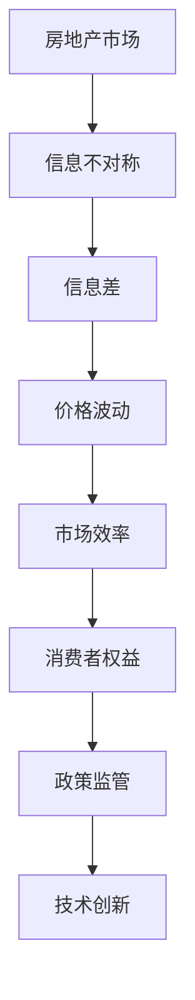

                 

### 第一部分：引言

在现代社会，房地产市场作为经济体系的重要组成部分，不仅影响着个人的生活质量，也关系到国家的经济发展和社会稳定。然而，房地产市场并不是一个简单的市场，其中存在大量的信息不对称现象，即市场参与各方掌握的信息不完全相同，这种信息不对称往往会导致市场效率的降低和价格的扭曲。本文将探讨信息差这一核心概念在房地产市场中的作用，旨在揭示信息不对称如何影响市场运行，并提出相应的应对策略。

#### 1.1 信息差的定义

信息差，即信息不对称，是指在市场中，一方（如买家或卖家）拥有而另一方未拥有的信息。这种信息不对称可能导致市场的非均衡状态，影响市场的效率。在房地产市场，信息差可以表现为以下几种形式：

- **价格信息差**：买方和卖方对房屋的真实价值缺乏统一认知，可能导致买方支付过高的价格或卖方接受过低的价格。
- **质量信息差**：买方可能对房屋的质量状况不了解，而卖方可能故意隐瞒房屋的瑕疵。
- **交易信息差**：买方可能对市场交易规则不熟悉，而卖方可能利用这一优势操纵市场。

#### 1.2 信息差在房地产市场中的作用

信息差在房地产市场中的作用是多方面的，主要体现在以下几个方面：

- **调控影响**：政府通过披露市场信息、制定政策法规来调节房地产市场，缓解信息不对称带来的负面影响。
- **效率影响**：信息不对称会导致市场效率低下，增加交易成本，降低市场的流动性。
- **价格影响**：信息不对称往往会导致房价偏离真实价值，造成市场的价格泡沫或价格低估。

#### 1.3 房地产市场的信息不对称现象分析

房地产市场的信息不对称现象主要表现在以下方面：

- **信息来源有限**：房地产市场信息主要来源于官方统计、中介机构等，普通消费者获取信息的途径有限。
- **信息处理困难**：房地产交易信息量大，普通消费者难以全面理解和处理。
- **信息真实性问题**：部分信息来源可能存在虚假信息，误导市场参与者。

#### 1.4 本文结构安排

本文结构安排如下：

- **第一部分：引言**：介绍信息差的定义、作用及房地产市场中的信息不对称现象。
- **第二部分：信息差的产生与传递**：探讨信息差的产生机制、传递机制及其种类与形式。
- **第三部分：信息差的利用与规避**：分析信息差的识别与利用策略以及规避方法。
- **第四部分：信息差的监管与治理**：讨论信息差监管的原则、目标、政策措施和治理策略。
- **第五部分：信息差的未来发展**：展望信息差技术的发展趋势及其对房地产市场的潜在影响。
- **第六章至第九章：应用案例分析**：通过具体案例分析信息差在房地产市场中的应用与挑战。

通过以上结构的安排，本文将系统地探讨信息差在房地产市场中的作用和影响，为读者提供全面的理论和实践指导。

### 第一部分：引言

房地产市场作为社会经济体系的重要组成部分，不仅关乎个体的居住需求，更直接影响着金融市场的稳定性和国家的宏观经济走势。然而，在信息高度发达的今天，房地产市场依然存在显著的信息不对称现象，这一现象对市场效率、价格稳定性和交易公平性产生了深远的影响。本文旨在深入探讨信息差这一关键概念，分析其在房地产市场中的具体作用，并提出有效的监管和治理策略。

#### 1.1 信息差的定义

信息差，即信息不对称，是指市场中不同主体对相同信息拥有不同的认知程度或获取渠道，导致信息内容的不对等。在房地产市场中，信息差主要体现在以下几个方面：

- **价格信息差**：买方和卖方对房屋的价格认知存在差异，可能导致买方过度支付或卖方未能获得合理的售价。
- **质量信息差**：买方可能无法全面了解房屋的实际质量，而卖方可能故意隐瞒房屋的缺陷。
- **交易信息差**：买方可能对市场交易流程和政策法规不熟悉，而卖方则可能利用这一信息优势进行不公平交易。

#### 1.2 信息差在房地产市场中的作用

信息差在房地产市场中的作用复杂多样，主要体现在以下几个方面：

- **价格调控**：信息不对称会影响房屋价格的合理性和稳定性。政府通过公开市场信息和制定相关政策，试图减少信息不对称，从而实现价格的合理调控。
- **市场效率**：信息不对称降低了市场的透明度，增加了交易成本，导致市场效率下降。例如，买方在获取全面信息之前可能会多次议价，增加了交易的时间和经济成本。
- **价格形成**：信息不对称会导致房价偏离实际价值，形成价格泡沫或价格低估。这种情况下，市场可能出现过度繁荣或低迷，影响经济的健康发展。

#### 1.3 房地产市场的信息不对称现象分析

房地产市场的信息不对称现象具有以下特点：

- **信息来源有限**：房地产市场信息主要来源于政府统计、中介机构、开发商等，普通消费者获取信息的途径有限，导致信息不充分。
- **信息处理困难**：房地产交易涉及大量的数据和信息，普通消费者难以全面、准确地处理和分析这些信息，从而影响决策。
- **信息真实性问题**：部分信息来源可能存在虚假信息，如虚假广告、隐瞒房屋缺陷等，误导市场参与者。

#### 1.4 本文结构安排

本文将按照以下结构展开：

- **第一部分：引言**：介绍信息差的定义、作用及房地产市场中的信息不对称现象。
- **第二部分：信息差的产生与传递**：探讨信息差的产生机制、传递机制及其种类与形式。
- **第三部分：信息差的利用与规避**：分析信息差的识别与利用策略以及规避方法。
- **第四部分：信息差的监管与治理**：讨论信息差监管的原则、目标、政策措施和治理策略。
- **第五部分：信息差的未来发展**：展望信息差技术的发展趋势及其对房地产市场的潜在影响。
- **第六章至第九章：应用案例分析**：通过具体案例分析信息差在房地产市场中的应用与挑战。

通过以上结构的安排，本文旨在深入探讨信息差在房地产市场中的作用和影响，为读者提供全面的理论和实践指导。

### 第二部分：信息差的产生与传递

信息差在房地产市场中的产生与传递是一个复杂的过程，涉及到市场信息的获取、处理和传播等多个环节。理解这一过程对于揭示信息不对称现象的本质具有重要意义。以下是关于信息差的产生与传递机制的详细探讨。

#### 2.1 房地产市场信息的获取与处理

房地产市场信息的获取与处理是信息差产生的基础。市场信息的来源主要包括以下几个方面：

1. **政府统计信息**：政府部门定期发布房地产市场统计数据，包括房屋交易量、价格指数、库存情况等。这些信息通常具有较高的权威性和可靠性，但更新速度较慢，无法及时反映市场动态。
   
2. **中介机构信息**：房地产中介机构通过实地考察和客户调查等方式获取房屋信息，并将其发布在房地产网站或门店。这些信息较为详细，但可能存在一定程度的主观性和偏差。

3. **开发商信息**：房地产开发企业通过宣传材料和销售渠道发布其项目的信息，包括地理位置、建筑特点、价格等。这些信息往往具有明显的利益导向。

市场信息的处理是信息差产生的关键环节。买方和卖方在获取信息后，需要对其真实性、准确性和完整性进行判断。这一过程通常涉及到以下步骤：

1. **信息筛选**：市场参与者根据自身需求和偏好，对获取的信息进行筛选，以确定哪些信息是重要的、可靠的。

2. **信息验证**：买方和卖方需要对筛选后的信息进行验证，以确保其真实性。例如，通过实地考察房屋质量、查阅产权证明等。

3. **信息整合**：市场参与者需要将不同来源的信息进行整合，形成对市场的全面了解。这一过程可能涉及数据分析和建模等复杂操作。

#### 2.2 信息差的产生机制

信息差的产生主要源于以下几个方面：

1. **信息不对称**：市场参与者在信息获取和处理能力上的差异，导致信息不平等。例如，买方可能无法获取到卖方掌握的详细房屋信息，从而在谈判中处于劣势。

2. **信息传递障碍**：房地产市场信息往往分散在不同的来源和渠道，市场参与者难以全面、及时地获取信息。这可能导致市场信息的传递出现障碍，加剧信息不对称。

3. **信息成本**：获取和处理房地产市场信息需要投入一定的成本，如时间、人力和资金。这些成本限制了部分市场参与者的信息获取能力，进一步加剧了信息不对称。

4. **信息垄断**：部分市场参与者（如房地产中介、开发商）可能利用其掌握的信息优势，操纵市场信息，以获取更多利益。

#### 2.3 信息差的传递机制

信息差的传递是一个动态的过程，涉及到市场信息的传播、反馈和调整。以下是信息差传递的几个关键环节：

1. **信息传播**：市场参与者通过多种渠道（如社交媒体、房地产市场网站、中介机构等）传播信息。这一过程可能导致信息的失真和扭曲。

2. **信息反馈**：市场参与者对传播的信息进行反馈，以验证其真实性和准确性。例如，买方可能通过实地考察、查阅产权证明等方式，对中介机构提供的信息进行核实。

3. **信息调整**：根据反馈结果，市场参与者对获取的信息进行调整和更新。这一过程有助于减少信息不对称，提高市场透明度。

4. **信息循环**：信息差在房地产市场中的传递是一个循环过程，不断更新和调整。这一过程可能导致市场信息的不断变化，从而影响市场动态。

#### 2.4 信息差的种类与形式

根据信息差产生的来源和表现形式，可以将信息差分为以下几种类型：

1. **价格信息差**：买方和卖方对房屋价格的认知存在差异，导致买方支付过高或卖方接受过低的价格。

2. **质量信息差**：买方无法全面了解房屋的实际质量，而卖方可能隐瞒房屋的缺陷，导致交易过程中信息不对称。

3. **交易信息差**：买方和卖方在交易流程、政策法规等方面存在差异，可能导致交易不公平。

4. **市场信息差**：市场参与者对市场趋势和政策的认知存在差异，影响其交易决策。

#### 2.5 信息差的案例分析

为了更好地理解信息差的产生与传递机制，以下是几个具体的案例分析：

1. **案例一：房地产中介隐瞒房屋缺陷**

某房地产中介在销售一套二手房时，隐瞒了房屋的漏水问题。买方在购房后才发现这一问题，导致购房合同无法履行。这个案例反映了房地产中介利用信息不对称，操纵市场信息的负面影响。

2. **案例二：开发商虚假宣传**

某开发商在销售某房地产项目时，通过虚假宣传夸大了项目的地理位置和配套设施，吸引了大量购房者。然而，实际情况与宣传不符，导致购房者投诉和维权。这个案例揭示了开发商利用信息不对称进行市场操纵的行为。

3. **案例三：政府信息披露不充分**

某城市政府在发布房地产市场统计数据时，未充分披露市场信息，导致市场参与者无法准确判断市场走势，影响了其投资决策。这个案例反映了政府信息披露不充分对市场运行的影响。

通过以上案例，我们可以看到信息差在房地产市场中的具体表现和影响。理解信息差的产生与传递机制，对于市场参与者制定合理的交易策略和政府制定有效的监管政策具有重要意义。

### 第三部分：信息差的利用与规避

在房地产市场中，信息差的利用和规避策略对于市场参与者来说至关重要。一方面，掌握信息差可以为市场参与者带来利益；另一方面，合理规避信息差可以降低交易风险，确保市场公平。以下是关于信息差利用与规避策略的详细探讨。

#### 3.1 信息差的识别与利用策略

识别和利用信息差是市场参与者提升竞争力的重要手段。以下是一些常见的策略：

1. **市场调研**：通过深入的市场调研，获取竞争对手和市场的关键信息。例如，了解竞争对手的销售策略、库存情况、客户需求等。

2. **信息收集**：积极收集和整合各种渠道的信息，包括政府发布的统计数据、中介机构的房源信息、客户反馈等。通过多渠道的信息收集，提高对市场状况的全面了解。

3. **信息分析**：对收集到的信息进行深入分析，识别市场机会和潜在风险。例如，通过数据分析，找出市场需求旺盛的区域和稀缺的房源类型。

4. **信息利用**：根据分析结果，制定具体的交易策略。例如，针对市场需求旺盛的区域，加大购房力度；针对稀缺房源类型，提前锁定目标房源。

5. **信息共享**：在合法合规的前提下，与合作伙伴共享信息，共同提升市场竞争力。例如，房地产开发商可以与房地产中介机构共享房源信息，实现资源优化配置。

#### 3.2 信息差的规避策略

合理规避信息差可以降低交易风险，提高市场参与者的安全性。以下是一些常见的规避策略：

1. **加强信息透明度**：通过政府主导的信息披露机制，提高房地产市场信息的透明度。例如，定期发布房地产市场报告，公开房屋交易数据等。

2. **建立信息共享平台**：搭建一个高效、可靠的信息共享平台，方便市场参与者获取和分享信息。例如，建立房地产信息共享平台，提供房源、交易流程、政策法规等信息。

3. **提高信息处理能力**：提升市场参与者的信息处理能力，使其能够准确、及时地获取和处理市场信息。例如，通过培训提高房地产中介的专业素养，提升其信息收集和分析能力。

4. **法律法规监管**：加强对房地产市场信息不对称的法律法规监管，规范市场行为。例如，明确房地产中介的披露义务，防止其隐瞒房屋缺陷或虚假宣传。

5. **消费者权益保护**：建立健全的消费者权益保护机制，保护市场参与者的合法权益。例如，设立消费者投诉渠道，对侵犯消费者权益的行为进行严厉处罚。

#### 3.3 信息差利用与规避案例分析

以下通过两个案例，分析信息差的利用与规避策略：

1. **案例一：成功的信息差利用**

某房地产开发商在开发一个新项目时，通过深入市场调研，发现该地区未来发展规划将大幅提升其价值。开发商提前锁定优质土地资源，并巧妙利用媒体宣传，引发市场关注。在项目开盘时，开发商利用信息优势，吸引了大量购房者，实现了项目的热销。这个案例展示了成功的信息差利用如何带来显著的市场效益。

2. **案例二：合理规避信息差**

某消费者在购房过程中，意识到房地产中介可能存在隐瞒房屋缺陷的行为。为了规避信息差，消费者决定自行调查房屋情况，包括查阅产权证明、实地考察等。最终，消费者在购房合同中成功避免了因房屋缺陷而导致的纠纷。这个案例说明了合理规避信息差对于保障消费者权益的重要性。

通过以上案例，我们可以看到信息差的利用与规避策略在实际中的应用效果。市场参与者应根据自身情况，灵活运用信息差，提高市场竞争力，同时合理规避信息差，保障自身利益。

### 第四部分：信息差的监管与治理

信息差在房地产市场中的存在，不仅影响市场效率，也可能导致不公平和市场失衡。为了维护市场秩序和消费者权益，政府和社会各界需要加强对信息差的监管与治理。以下将探讨信息差监管的原则、目标、政策措施以及治理策略。

#### 4.1 信息差监管的原则与目标

1. **公正公平原则**：监管措施应确保所有市场参与者都能公平地获取和处理信息，避免信息不对称带来的不公平交易。

2. **透明性原则**：政府应建立健全的信息披露机制，提高房地产市场信息的透明度，使市场参与者能够及时、全面地了解市场动态。

3. **预防性原则**：监管措施应具有前瞻性，通过预防性措施防止信息不对称现象的发生，减少市场风险。

4. **灵活性原则**：监管措施应根据市场变化进行调整，以适应不同市场环境和需求。

监管目标主要包括：

- **提高市场效率**：通过减少信息不对称，降低交易成本，提高市场的流动性和效率。
- **维护市场稳定**：防止市场过度波动，保持房价的稳定增长。
- **保障消费者权益**：确保消费者能够获取充分、真实的信息，避免因信息不对称而受到不公平对待。

#### 4.2 信息差监管的政策措施

1. **法律法规**：制定和完善相关法律法规，明确市场参与者的信息披露义务，规范市场行为。例如，出台房地产信息披露法，规定房地产中介、开发商等信息披露主体的责任。

2. **政府监管机构**：设立专门的房地产市场监管机构，负责监督房地产市场信息的披露和交易行为的合法性。例如，设立房地产市场监管局，加强市场监测和执法力度。

3. **信息披露制度**：建立信息披露制度，要求市场参与者（如房地产中介、开发商）定期披露房源信息、交易数据等，提高市场透明度。

4. **信用体系**：建立房地产市场信用体系，对市场参与者的信用信息进行记录和评估，对违规行为进行处罚，增强市场参与者的诚信意识。

5. **教育培训**：加强对市场参与者的教育培训，提高其信息处理能力和法律意识，降低信息不对称现象。

#### 4.3 信息差的治理策略

1. **企业自律**：市场参与者应自觉遵守法律法规，加强自律，提高信息披露的透明度和真实性。例如，房地产中介应建立内部监督机制，防止虚假宣传和隐瞒信息。

2. **市场竞争**：通过加强市场竞争，促进市场参与者的公平竞争，减少信息不对称。例如，鼓励房地产中介之间的竞争，提高服务质量。

3. **社会监管**：充分发挥社会监督作用，鼓励消费者、媒体等社会各界参与市场监督，提高市场透明度。例如，设立消费者投诉渠道，接受公众监督。

4. **技术创新**：利用大数据、人工智能等新技术，提高房地产市场信息的收集、处理和分析能力，减少信息不对称。例如，开发房地产信息大数据平台，提供全面、实时的市场信息。

5. **国际合作**：借鉴国际先进经验，加强国际合作，共同应对信息不对称带来的挑战。例如，参与国际房地产数据交流与合作，提升市场信息透明度。

通过以上监管与治理措施，可以有效减少房地产市场中的信息不对称现象，提高市场效率，维护市场秩序和消费者权益。

### 第五部分：信息差的未来发展

随着科技的不断进步，信息差的未来发展趋势充满了无限可能。大数据、人工智能和区块链等新兴技术的应用，将深刻改变房地产市场，提高信息透明度和市场效率，同时也带来一系列挑战和治理需求。

#### 5.1 信息差技术的创新与应用

1. **大数据分析**：大数据技术的应用将为房地产市场提供更为精确和实时的数据支持。通过分析海量数据，市场参与者可以更准确地预测市场趋势、评估房屋价值，减少信息不对称。例如，利用大数据分析房屋交易历史、市场供需情况、地理位置等信息，为购房者提供更有价值的参考。

2. **人工智能**：人工智能技术在房地产市场中的应用，将大幅提升信息处理和分析能力。智能推荐系统可以根据购房者的需求和偏好，提供个性化的房源推荐；智能合约可以实现自动化交易，减少人为干预和错误。此外，人工智能还可以用于风险管理和违约预测，提高市场稳定性。

3. **区块链技术**：区块链技术的应用将为房地产市场带来更高的透明度和安全性。通过区块链，房屋交易记录、产权证明等信息可以实现去中心化存储，防止篡改和伪造。同时，区块链可以提供可靠的智能合约执行平台，简化交易流程，减少中介环节，降低交易成本。

#### 5.2 信息差对社会的影响

1. **经济影响**：信息差的减少将有助于提高市场效率，降低交易成本，促进房地产市场的健康发展。然而，信息差的消除也可能导致房价波动加剧，影响市场的稳定性。此外，新兴技术的应用可能改变就业结构，对房地产中介、评估师等职业产生影响。

2. **生活影响**：信息差的减少将提高消费者的购房决策效率，使购房过程更加透明和便捷。同时，新兴技术的应用也将提升居住环境的质量和舒适度。然而，信息差的消除也可能带来新的挑战，如隐私保护和数据安全等问题。

3. **政府管理**：信息差的减少将提高政府监管的效率和效果，有助于更好地进行房地产市场调控。同时，新兴技术的应用也为政府提供了更多的数据支持，使其能够更精准地进行政策制定和实施。然而，这也对政府的监管能力和技术水平提出了更高的要求。

#### 5.3 信息差的未来展望

1. **挑战与应对策略**：随着信息差的减少，房地产市场将面临新的挑战，如数据隐私保护、市场失衡等。为此，需要采取以下应对策略：

   - **数据隐私保护**：建立完善的数据隐私保护机制，确保市场参与者的个人信息安全。
   - **市场平衡**：加强市场监管，防止信息差消除后可能出现的市场失衡现象。
   - **技术创新**：继续推动大数据、人工智能和区块链等新技术的发展，提高市场信息透明度和效率。

2. **发展方向**：未来，房地产市场的发展将朝着智能化、数字化和可持续化的方向迈进。通过新兴技术的应用，房地产市场将实现更高效、更透明和更可持续的运行模式。同时，政府、企业和消费者也将共同参与到这一变革中，共同推动房地产市场的健康发展。

综上所述，信息差的未来发展将对房地产市场产生深远的影响。通过科技创新和合理治理，可以有效减少信息不对称，提高市场效率，为消费者提供更好的居住体验。同时，也需要警惕信息差减少可能带来的挑战，采取有效措施加以应对。

### 第五部分：信息差的未来发展

随着科技的不断进步，信息差在房地产市场中的应用前景愈发广阔。大数据、人工智能和区块链等技术的快速发展，为房地产市场提供了更加精确和高效的信息处理手段，推动了市场透明度和效率的提升。然而，这些技术的应用也带来了新的挑战，需要我们深入探讨。

#### 5.1 技术创新趋势

1. **大数据分析**：大数据技术通过对海量数据的采集、存储、处理和分析，为房地产市场提供了丰富的信息资源。通过分析历史交易数据、市场供需信息、人口流动趋势等，市场参与者可以更准确地预测市场走势，制定更加科学的投资策略。例如，大数据分析可以帮助房地产开发商了解目标客户的需求，优化产品设计和服务。

2. **人工智能**：人工智能技术在房地产市场的应用日益广泛，从房源推荐到智能合约，再到风险管理，人工智能都在为市场带来革命性的变化。智能推荐系统可以根据购房者的偏好和需求，提供个性化的房源推荐；智能合约可以实现自动化交易，减少人为干预和错误；人工智能还可以用于风险管理和违约预测，提高市场稳定性。

3. **区块链技术**：区块链技术以其去中心化、不可篡改和透明性等特点，为房地产市场提供了新的解决方案。通过区块链，房屋交易记录、产权证明等信息可以实现去中心化存储，防止篡改和伪造。此外，区块链可以提供可靠的智能合约执行平台，简化交易流程，减少中介环节，降低交易成本。区块链技术还可以提高房地产市场的透明度，减少信息不对称现象。

#### 5.2 信息差对社会的影响

1. **经济影响**：信息差的减少有助于提高市场效率，降低交易成本，促进房地产市场的健康发展。然而，信息差的消除也可能导致房价波动加剧，影响市场的稳定性。例如，大数据和人工智能技术的应用，使得市场参与者可以更快速地获取和处理信息，从而提高了市场反应速度。然而，这也可能导致市场过度反应，造成价格波动。

2. **生活影响**：信息差的减少将提高消费者的购房决策效率，使购房过程更加透明和便捷。同时，新兴技术的应用也将提升居住环境的质量和舒适度。例如，智能化的家居设备和物业管理系统，可以提供更加便捷和高效的居住体验。然而，信息差的消除也可能带来新的挑战，如数据隐私保护和数据安全等问题。

3. **政府管理**：信息差的减少将提高政府监管的效率和效果，有助于更好地进行房地产市场调控。例如，通过大数据和人工智能技术，政府可以更准确地监测市场动态，制定更加科学的政策。同时，区块链技术可以提高政府数据管理的透明度和可靠性，增强政府公信力。然而，这也对政府的监管能力和技术水平提出了更高的要求。

#### 5.3 信息差的未来展望

1. **挑战与应对策略**：随着信息差的减少，房地产市场将面临新的挑战，如数据隐私保护、市场失衡等。为此，需要采取以下应对策略：

   - **数据隐私保护**：建立完善的数据隐私保护机制，确保市场参与者的个人信息安全。例如，采用加密技术、匿名化处理等方式，保护个人隐私。
   - **市场平衡**：加强市场监管，防止信息差消除后可能出现的市场失衡现象。例如，通过制定公平合理的市场规则，确保市场参与者的公平竞争。
   - **技术创新**：继续推动大数据、人工智能和区块链等新技术的发展，提高市场信息透明度和效率。例如，开发更多智能应用，提高市场的自动化和智能化水平。

2. **发展方向**：未来，房地产市场的发展将朝着智能化、数字化和可持续化的方向迈进。通过新兴技术的应用，房地产市场将实现更高效、更透明和更可持续的运行模式。同时，政府、企业和消费者也将共同参与到这一变革中，共同推动房地产市场的健康发展。

综上所述，信息差的未来发展将对房地产市场产生深远的影响。通过科技创新和合理治理，可以有效减少信息不对称，提高市场效率，为消费者提供更好的居住体验。同时，也需要警惕信息差减少可能带来的挑战，采取有效措施加以应对。

### 第六部分：信息差在房地产市场的应用案例分析

#### 案例一：某城市房地产市场信息不对称问题分析

**6.1.1 案例背景**

某城市房地产市场近年来出现了显著的价格波动，市场参与者对房价的预期存在较大差异。为此，我们对该城市的房地产市场进行了一次深入的分析，旨在揭示其中的信息不对称问题。

**6.1.2 案例分析**

1. **数据来源与处理**：我们收集了该城市过去五年的房地产交易数据，包括房屋价格、面积、地理位置等信息。通过对这些数据进行分析，我们发现市场上存在以下信息不对称现象：

   - **价格信息不对称**：部分区域的房价与市场实际供需关系不符，存在明显的高估或低估现象。
   - **质量信息不对称**：部分房屋的实际质量未得到充分披露，导致买方在交易过程中受到损失。
   - **交易信息不对称**：部分市场参与者对交易流程和政策法规不熟悉，容易受到不公平对待。

2. **原因分析**：造成这些信息不对称现象的原因主要包括：

   - **信息获取渠道有限**：市场参与者获取信息的渠道有限，无法全面了解市场动态。
   - **信息处理能力不足**：市场参与者对获取的信息处理能力有限，无法准确判断信息的真实性。
   - **信息垄断**：部分房地产中介和开发商利用信息优势，操纵市场信息，以获取更多利益。

**6.1.3 案例启示**

1. **信息透明度提升**：政府应加强房地产市场信息透明度，定期发布市场统计数据和房源信息，减少市场参与者获取信息的障碍。

2. **信息披露义务**：房地产中介和开发商应明确信息披露义务，如实披露房源信息和交易流程，提高市场透明度。

3. **消费者教育**：加强对市场参与者的教育培训，提高其信息处理能力和法律意识，使其能够更好地应对信息不对称带来的风险。

#### 案例二：某房地产开发商的信息优势策略

**6.2.1 案例背景**

某房地产开发商在某城市开发了一处高端住宅项目，通过一系列策略，成功利用信息优势实现了项目的热销。

**6.2.2 案例分析**

1. **市场调研**：开发商在项目启动前，进行了深入的市场调研，掌握了目标客户的需求和偏好，以及市场竞争状况。

2. **信息垄断**：开发商通过垄断信息，创造市场稀缺感。例如，开发商不公开项目详细信息，只在特定渠道透露部分信息，制造市场预期。

3. **营销策略**：开发商通过精准营销，将项目定位为高端精品，吸引目标客户。例如，开发商利用社交媒体、高端杂志等渠道，宣传项目亮点和独特价值。

4. **交易流程**：开发商简化交易流程，提高交易效率，减少消费者疑虑。例如，提供一站式购房服务，从房源选择到合同签订，全程专人指导。

**6.2.3 案例启示**

1. **精准市场定位**：开发商应根据市场需求，精准定位项目，打造特色产品，提高市场竞争力。

2. **信息垄断与营销**：合理利用信息垄断，创造市场稀缺感，提高项目吸引力。同时，通过有效的营销策略，强化市场预期。

3. **服务优化**：简化交易流程，提供优质服务，提高消费者满意度，增强市场口碑。

#### 案例三：某房地产中介的信息差利用与规避

**6.3.1 案例背景**

某房地产中介在市场交易中，利用信息差获取了显著的优势，但也面临消费者投诉和监管风险。

**6.3.2 案例分析**

1. **信息垄断**：房地产中介通过垄断房源信息，提高交易成功率。例如，只向特定客户透露优质房源信息，形成市场垄断。

2. **价格操纵**：房地产中介通过操纵房价，获取更多佣金。例如，在交易过程中，故意抬高房价，导致消费者支付过高费用。

3. **规避监管**：房地产中介采取不正当手段规避监管，如隐瞒交易信息、违规操作等。

**6.3.3 案例启示**

1. **信息透明度**：房地产中介应提高信息披露透明度，如实披露房源信息和交易流程，减少信息不对称。

2. **诚信经营**：房地产中介应诚信经营，遵循市场规则，不得操纵价格和规避监管。

3. **消费者权益保护**：加强对房地产中介的监管，保障消费者合法权益，提高市场公信力。

通过以上案例，我们可以看到信息差在房地产市场中的具体应用及其带来的影响。了解这些案例，有助于市场参与者更好地应对信息不对称现象，提升市场效率，实现可持续发展。

### 第七部分：信息差在房地产市场的未来发展

随着技术的不断进步和市场环境的变迁，信息差在房地产市场中的应用前景愈发广阔。本部分将探讨信息差在房地产市场的未来发展，包括应用趋势、挑战与应对策略。

#### 7.1 信息差在房地产市场的未来应用趋势

1. **大数据与人工智能的应用**：大数据和人工智能技术的快速发展，将极大地提升房地产市场信息的收集、处理和分析能力。通过大数据分析，市场参与者可以更准确地预测市场走势、评估房屋价值，减少信息不对称。人工智能则可以通过智能推荐、智能合约等方式，提高市场效率，降低交易成本。

2. **区块链技术的应用**：区块链技术的应用将为房地产市场带来更高的透明度和安全性。通过区块链，房屋交易记录、产权证明等信息可以实现去中心化存储，防止篡改和伪造。区块链还可以提供可靠的智能合约执行平台，简化交易流程，减少中介环节，降低交易成本。

3. **物联网与智能家居**：物联网技术的应用将使得房地产市场的智能化水平得到提升。智能家居系统可以实时监控房屋设施状态，提供便捷的居住体验。物联网技术还可以实现房屋设施的远程控制，提高房屋使用效率。

4. **虚拟现实与增强现实**：虚拟现实（VR）和增强现实（AR）技术的应用，将使购房者能够更直观地了解房屋的内部结构和外部环境。通过VR/AR技术，购房者可以在线上浏览和体验房源，提高购房决策的准确性和效率。

#### 7.2 信息差在房地产市场中的未来挑战与应对策略

1. **信息安全的挑战**：随着大数据和区块链技术的应用，房地产市场面临信息安全的挑战。信息泄露、数据篡改等安全问题可能导致市场参与者遭受重大损失。应对策略：

   - **加强数据保护**：市场参与者应加强数据保护，采用加密技术和访问控制等措施，确保数据安全。
   - **建立安全监测机制**：政府和企业应建立安全监测机制，及时发现和处理安全威胁。

2. **市场失衡的挑战**：信息差的减少可能导致市场失衡，例如房价波动加剧、市场不稳定等。应对策略：

   - **加强市场监管**：政府应加强市场监管，制定公平合理的市场规则，防止市场失衡。
   - **优化调控政策**：政府应根据市场变化，适时调整调控政策，保持市场稳定。

3. **隐私保护的挑战**：随着信息技术的应用，房地产市场参与者面临隐私保护的问题。个人信息泄露可能对市场参与者造成严重后果。应对策略：

   - **完善隐私保护法律法规**：政府应完善隐私保护法律法规，加强对市场参与者的隐私保护。
   - **加强隐私保护意识**：市场参与者应提高隐私保护意识，采取安全措施保护个人信息。

4. **技术创新的挑战**：新兴技术的应用对房地产市场的技术创新提出了新的要求。市场参与者需要不断提升技术能力，以适应市场的变化。应对策略：

   - **加大研发投入**：企业应加大研发投入，提升技术创新能力。
   - **加强人才培养**：政府和企业应加强人才培养，提升市场参与者的技术水平和创新能力。

#### 7.3 信息差的未来展望

1. **信息透明度的提升**：随着新兴技术的应用，房地产市场的信息透明度将不断提高。市场参与者可以更全面、准确地获取和处理市场信息，降低信息不对称。

2. **市场效率的提升**：信息差的减少将提高市场效率，降低交易成本，促进房地产市场的健康发展。新兴技术将有助于优化市场资源配置，提高市场运作效率。

3. **消费者体验的改善**：随着新兴技术的应用，消费者的购房体验将得到显著改善。智能家居、虚拟现实等技术将提升消费者的居住体验，满足个性化需求。

4. **政府监管的加强**：新兴技术为政府监管提供了新的手段。政府可以通过大数据、区块链等技术，更有效地进行市场监测和调控，维护市场秩序。

总之，信息差在房地产市场中的应用前景广阔，但同时也面临一系列挑战。通过科技创新和合理治理，可以有效减少信息不对称，提高市场效率，为消费者提供更好的居住体验。

### 第8章：信息差的跨行业应用与比较

信息差不仅存在于房地产市场，在其他行业中同样普遍存在。本章节将探讨信息差在金融、证券和消费品市场等不同行业的应用与比较，分析各行业的信息差产生与传递机制、信息差的利用与规避策略，以及信息差的治理措施。

#### 8.1 信息差在其他行业的应用

1. **金融市场**：在金融市场中，信息差主要体现在金融机构与投资者之间。金融机构通常拥有更多的市场信息和资源，而普通投资者则处于信息劣势。金融机构利用这种信息差进行市场操作，获取额外收益。例如，通过内部交易、市场操纵等手段，实现利益最大化。

2. **证券市场**：证券市场中的信息差主要源于信息的不对称。机构投资者往往能够通过专业的研究团队、数据分析工具等获取更多、更准确的市场信息，而散户投资者则难以获取这些信息。这种信息差可能导致市场的不公平，影响市场的稳定性。

3. **消费品市场**：在消费品市场中，企业通常拥有更丰富的市场信息和资源，而消费者则处于信息劣势。企业通过营销策略、渠道控制等手段，利用信息差提高产品售价，获取更多利润。

#### 8.2 信息差在不同行业中的比较

1. **产生与传递机制**：

   - **金融市场**：信息差主要源于金融机构的内部信息优势和专业知识。信息差的传递主要通过内部交易、市场操纵等手段实现。
   - **证券市场**：信息差主要源于机构投资者与散户投资者之间的信息不对称。信息差的传递主要通过研究报告、市场传言等途径实现。
   - **消费品市场**：信息差主要源于企业对市场信息的垄断。信息差的传递主要通过广告宣传、渠道控制等手段实现。

2. **利用与规避策略**：

   - **金融市场**：市场参与者通过信息优势进行市场操作，获取额外收益。规避策略主要包括加强法律法规监管、提高透明度等。
   - **证券市场**：市场参与者通过专业研究和信息分析，降低信息不对称，提高投资决策的准确性。规避策略主要包括加强信息披露、提高市场透明度等。
   - **消费品市场**：消费者通过信息收集和比较，选择性价比更高的产品。规避策略主要包括提高消费者教育、加强市场监管等。

3. **治理措施**：

   - **金融市场**：政府通过法律法规和监管措施，限制金融机构的市场操作行为，提高市场透明度。
   - **证券市场**：政府通过加强信息披露、市场监管等措施，降低信息不对称，保障市场的公平性。
   - **消费品市场**：政府通过市场监管、消费者权益保护等措施，规范企业行为，提高市场透明度。

#### 8.3 信息差跨行业应用的发展趋势

1. **技术融合与信息共享**：随着大数据、人工智能等技术的发展，各行业之间的信息差将逐渐缩小。通过技术融合和信息共享，市场参与者可以更全面、准确地获取和处理市场信息。

2. **信息差的治理与监管**：随着信息差的减少，政府和社会各界需要加强信息差的治理与监管，保障市场的公平性和稳定性。跨行业的信息差治理将需要更全面、协调的监管体系。

3. **信息差的应用创新**：在新兴技术的推动下，信息差在跨行业中的应用将不断创新。例如，区块链技术在金融、证券和消费品市场的应用，将提高信息透明度和安全性，降低信息不对称。

总之，信息差在跨行业中的应用具有广泛的前景。通过技术融合、信息共享和有效治理，可以降低信息不对称，提高市场效率，促进各行业的健康发展。

### 第9章：信息差的未来发展与挑战

随着科技的不断进步和社会环境的变迁，信息差在未来房地产市场中的应用和发展将面临新的机遇和挑战。本文将探讨信息差未来发展的趋势，分析潜在的技术创新、市场变化以及治理策略。

#### 9.1 信息差技术的创新趋势

1. **大数据分析**：大数据技术的进一步发展将使市场参与者能够更高效地收集、处理和分析海量数据。通过大数据分析，市场参与者可以更准确地预测市场趋势、评估房屋价值，从而减少信息不对称。

2. **人工智能**：人工智能技术的进步将使房地产市场更加智能化。智能推荐系统可以根据购房者的需求和偏好，提供个性化的房源推荐；智能合约可以实现自动化交易，减少人为干预和错误。人工智能还可以用于风险管理和违约预测，提高市场稳定性。

3. **区块链技术**：区块链技术的应用将提高房地产市场的透明度和安全性。通过区块链，房屋交易记录、产权证明等信息可以实现去中心化存储，防止篡改和伪造。区块链还可以提供可靠的智能合约执行平台，简化交易流程，减少中介环节，降低交易成本。

4. **物联网与智能家居**：物联网技术的普及将使房地产市场更加智能化。智能家居系统可以实时监控房屋设施状态，提供便捷的居住体验。物联网技术还可以实现房屋设施的远程控制，提高房屋使用效率。

#### 9.2 信息差的未来应用场景

1. **智能房地产管理**：利用大数据、人工智能和物联网技术，房地产企业可以实现更智能化的房地产管理。通过实时数据分析，企业可以优化房源管理、提高销售效率，降低运营成本。

2. **智慧城市建设**：智慧城市建设将使房地产市场与城市治理更加融合。通过大数据和物联网技术，城市管理者可以实时监测房地产市场的运行状况，优化城市资源配置，提高居民生活质量。

3. **绿色发展**：随着绿色发展的需求日益增长，房地产市场的绿色建设将得到更多关注。通过区块链技术，可以实现房地产市场的绿色认证和溯源，促进绿色建筑和可持续发展。

#### 9.3 信息差的未来挑战与应对策略

1. **信息安全的挑战**：随着大数据和区块链技术的应用，房地产市场面临信息安全的挑战。信息泄露、数据篡改等安全问题可能导致市场参与者遭受重大损失。应对策略：

   - **加强数据保护**：市场参与者应加强数据保护，采用加密技术和访问控制等措施，确保数据安全。
   - **建立安全监测机制**：政府和企业应建立安全监测机制，及时发现和处理安全威胁。

2. **市场失衡的挑战**：信息差的减少可能导致市场失衡，例如房价波动加剧、市场不稳定等。应对策略：

   - **加强市场监管**：政府应加强市场监管，制定公平合理的市场规则，防止市场失衡。
   - **优化调控政策**：政府应根据市场变化，适时调整调控政策，保持市场稳定。

3. **隐私保护的挑战**：随着信息技术的应用，房地产市场参与者面临隐私保护的问题。个人信息泄露可能对市场参与者造成严重后果。应对策略：

   - **完善隐私保护法律法规**：政府应完善隐私保护法律法规，加强对市场参与者的隐私保护。
   - **加强隐私保护意识**：市场参与者应提高隐私保护意识，采取安全措施保护个人信息。

4. **技术创新的挑战**：新兴技术的应用对房地产市场的技术创新提出了新的要求。市场参与者需要不断提升技术能力，以适应市场的变化。应对策略：

   - **加大研发投入**：企业应加大研发投入，提升技术创新能力。
   - **加强人才培养**：政府和企业应加强人才培养，提升市场参与者的技术水平和创新能力。

#### 9.4 信息差的未来展望

1. **信息透明度的提升**：随着新兴技术的应用，房地产市场的信息透明度将不断提高。市场参与者可以更全面、准确地获取和处理市场信息，降低信息不对称。

2. **市场效率的提升**：信息差的减少将提高市场效率，降低交易成本，促进房地产市场的健康发展。新兴技术将有助于优化市场资源配置，提高市场运作效率。

3. **消费者体验的改善**：随着新兴技术的应用，消费者的购房体验将得到显著改善。智能家居、虚拟现实等技术将提升消费者的居住体验，满足个性化需求。

4. **政府监管的加强**：新兴技术为政府监管提供了新的手段。政府可以通过大数据、区块链等技术，更有效地进行市场监测和调控，维护市场秩序。

总之，信息差在房地产市场的未来发展中具有重要作用。通过技术创新和合理治理，可以降低信息不对称，提高市场效率，为消费者提供更好的居住体验。同时，也需要警惕信息差减少可能带来的挑战，采取有效措施加以应对。

### 第10章：政策建议与行业发展策略

为了有效应对信息差在房地产市场中的影响，确保市场的稳定和公平，政府、企业和消费者需要共同努力，制定合理的政策建议和行业发展策略。以下是具体的政策建议和行业发展策略：

#### 10.1 政策建议

1. **完善法律法规**：政府应进一步完善房地产市场的法律法规体系，加强对市场参与者的监管。例如，制定《房地产信息披露法》，明确房地产中介和开发商的信息披露义务，规范市场行为。

2. **加强市场监管**：政府应加强对房地产市场的监管力度，特别是对虚假广告、价格操纵等行为的查处。建立全国统一的房地产市场监管平台，实现市场信息的实时监测和预警。

3. **推进信息公开**：政府应推进房地产市场的信息公开，定期发布房地产市场报告，提高市场透明度。同时，鼓励房地产中介和开发商公开房源信息和交易数据，减少信息不对称。

4. **强化消费者权益保护**：政府应加强对消费者权益的保护，建立健全的消费者投诉和维权机制。通过法律手段，保护消费者的合法权益，防止因信息不对称而遭受损失。

#### 10.2 行业发展策略

1. **推动技术创新**：企业应积极拥抱新技术，提高市场信息处理能力。例如，利用大数据、人工智能和区块链等技术，优化市场信息获取和处理流程，降低信息不对称。

2. **提升服务质量**：房地产中介和企业应提升服务质量，增强市场竞争力。通过提供个性化服务、优化交易流程等手段，提高消费者的满意度和信任度。

3. **加强行业自律**：房地产中介和企业应加强行业自律，建立健全的内部监督机制。例如，制定行业规范，明确信息披露标准，防止虚假宣传和价格操纵。

4. **推进诚信建设**：政府和企业应共同推进房地产市场的诚信建设，营造良好的市场氛围。通过信用评级、黑名单制度等手段，鼓励诚信经营，惩戒失信行为。

5. **培养专业人才**：政府和企业应加大对房地产专业人才的培养力度，提高行业整体素质。通过教育培训、技能提升等方式，提高从业人员的专业能力和服务水平。

#### 10.3 政策与行业发展的协同作用

政策建议和行业发展策略之间应形成协同作用，共同推动房地产市场的健康发展。政府可以通过制定和完善政策法规，为企业提供合规经营的环境；企业则可以通过技术创新和服务提升，提高市场竞争力。同时，消费者也应增强法律意识和信息处理能力，积极参与市场监督，共同维护市场秩序。

总之，通过政策建议和行业发展策略的协同作用，可以有效应对信息差在房地产市场中的影响，提高市场透明度和效率，促进房地产市场的稳定和可持续发展。

### 附录

#### 附录A：信息差研究方法与工具

**A.1 信息差研究的常用方法**

信息差研究通常采用以下方法：

1. **文献综述法**：通过查阅和整理相关文献，总结和归纳信息差的研究现状和主要观点。
2. **案例分析法**：通过具体案例，分析信息差在实践中的应用和影响。
3. **问卷调查法**：通过问卷调查，收集市场参与者对信息差的认知和应对策略。
4. **统计分析法**：通过数据分析，验证信息差对房地产市场的影响程度。

**A.2 信息差研究的工具与应用**

在信息差研究中，以下工具经常被应用：

1. **Python编程语言**：用于数据处理、统计分析等。
2. **Pandas库**：用于数据处理和分析。
3. **NumPy库**：用于数值计算。
4. **Matplotlib库**：用于数据可视化。

**A.3 信息差研究的案例分析**

案例一：通过数据分析，研究某城市房地产市场的信息差现象，分析其原因和影响。

案例二：通过问卷调查，了解市场参与者对信息差的认知和应对策略，提出改进建议。

#### 附录B：相关法律法规与政策文件

**B.1 法律法规**

- 《中华人民共和国房地产管理法》
- 《城市房地产管理法》
- 《房地产中介服务管理条例》
- 《消费者权益保护法》

**B.2 政策文件**

- 《关于推进房地产平稳健康发展的意见》
- 《关于进一步规范房地产市场的通知》
- 《关于促进房地产市场稳定健康发展的若干措施》

#### 附录C：信息差案例分析资料

**C.1 案例一：某城市房地产市场信息不对称问题分析**

- 案例背景：某城市房地产市场存在显著的信息不对称现象。
- 案例分析：通过数据分析，揭示信息不对称的具体表现和原因。
- 案例启示：提出提高信息透明度和消费者权益保护的措施。

**C.2 案例二：某房地产开发商的信息优势策略**

- 案例背景：某房地产开发商通过信息优势，实现了项目的热销。
- 案例分析：分析开发商利用信息优势的具体策略和市场效果。
- 案例启示：探讨信息优势利用与市场公平性的关系。

**C.3 案例三：某房地产中介的信息差利用与规避**

- 案例背景：某房地产中介利用信息差，提高了业务量。
- 案例分析：探讨中介利用信息差的手段和消费者规避策略。
- 案例启示：提出加强信息披露和消费者教育的必要性。

#### 附录D：信息差相关书籍与论文推荐

**D.1 书籍推荐**

- 《信息经济学：理论与应用》
- 《房地产经济学》
- 《区块链技术：从数字货币到智能合约》

**D.2 论文推荐**

- “Information Asymmetry in the Real Estate Market: Causes, Consequences, and Solutions”
- “The Role of Information in Real Estate Transactions: An Empirical Analysis”
- “Blockchain Technology and Its Applications in Real Estate”

通过附录部分的内容，读者可以进一步深入了解信息差在房地产市场中的应用和影响，为实际研究和实践提供参考。

### 梅里尔模型（Mermaid 流程图）

此流程图展示了信息不对称如何影响房地产市场，并进一步导致价格波动、市场效率变化、消费者权益受损以及政策监管和技术创新的需求。通过这一流程，可以清晰地看到信息差在房地产市场中的传导机制及其对市场各方面的影响。

