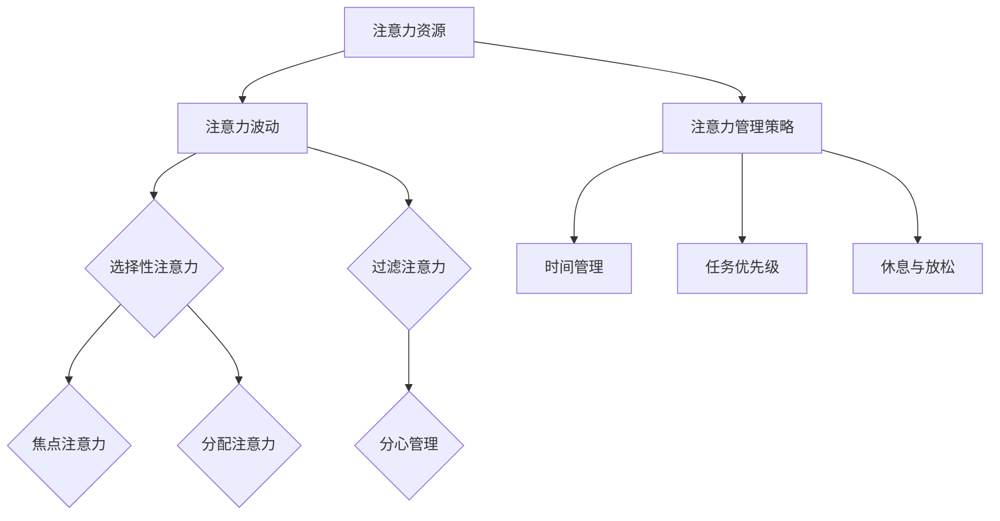
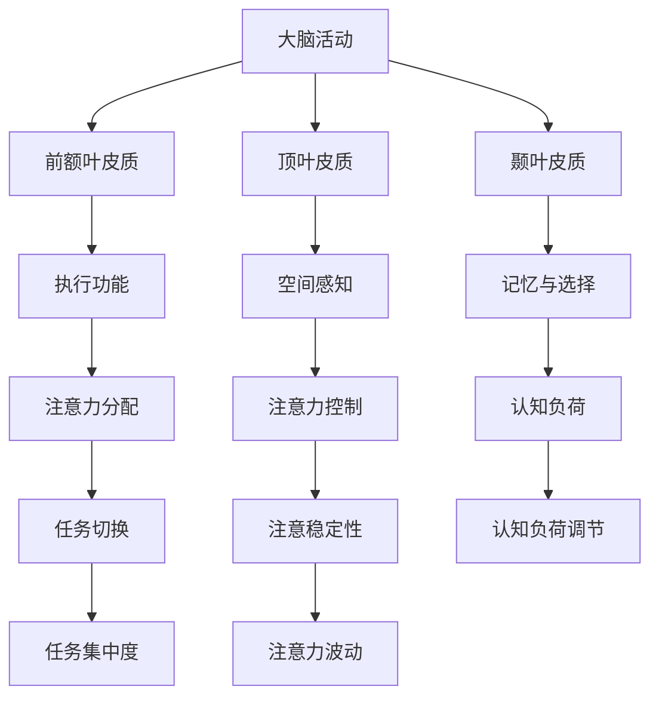
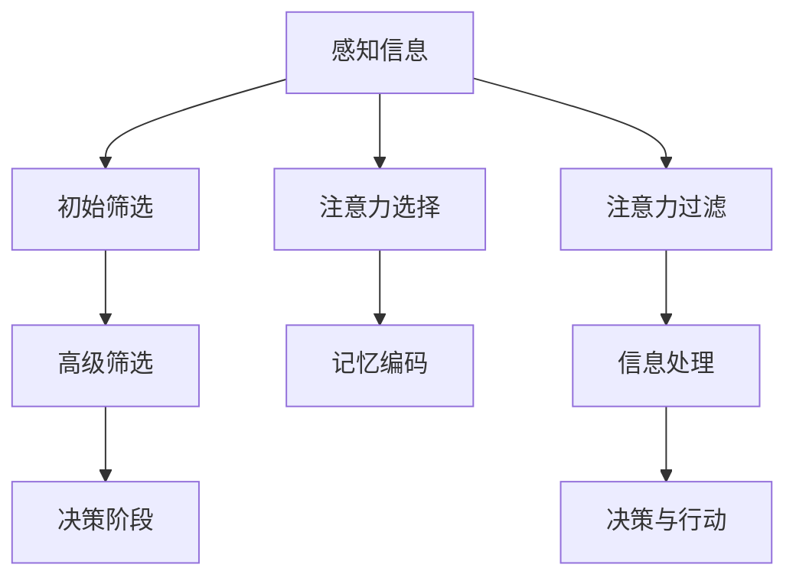
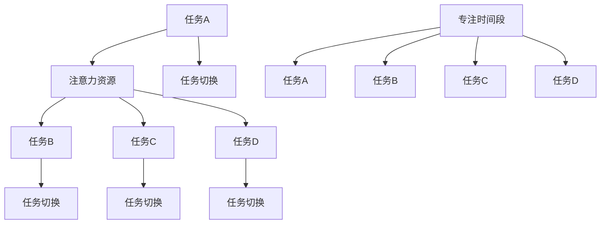
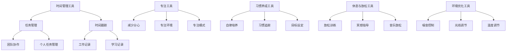

                 

### 第1章: 信息时代的注意力管理概述

### 1.1 信息时代的背景与注意力管理的重要性

#### 1.1.1 信息爆炸时代的到来

随着互联网的普及和智能手机的广泛应用，我们的世界正迅速进入一个信息爆炸的时代。每天，我们都被大量的信息所包围，这些信息以文字、图片、视频和音频等多种形式呈现。据估计，人类现在每两三天就产生如同整个图书馆的信息量。这种信息爆炸的现象不仅发生在互联网上，也渗透到了我们的日常生活和工作之中。

#### 1.1.2 注意力资源的重要性

在信息爆炸的时代，注意力资源变得尤为宝贵。注意力是有限的，而信息却是无限的。我们的注意力资源必须高效地分配和利用，以便处理和应对这些大量的信息。否则，我们很容易陷入信息的海洋，无法自拔，甚至导致注意力分散和效率低下。

#### 1.1.3 注意力管理的必要性

注意力管理，就是在这个背景下产生的一个概念。它指的是通过科学的方法和策略，有效地管理和优化我们的注意力资源，以提高工作效率、提升学习效果、促进心理健康等。在信息过载的时代，注意力管理成为了一种必要的能力，它不仅关乎个人的发展，也影响到组织和社会的运作。

### 1.2 注意力管理的基本原理

#### 1.2.1 注意力波动的概念

注意力并不是一成不变的，它具有一定的波动性。这种波动性体现在我们对不同任务、活动和信息的注意力集中程度和持续时间的不同。理解注意力波动对于有效管理注意力至关重要。

#### 1.2.2 注意力的选择与过滤机制

我们的注意力系统具有选择和过滤功能，这意味着我们可以根据目标和需求，选择性地关注某些信息或任务，而忽略其他无关的信息。这一过程涉及到多个认知和神经机制，如感知、记忆、决策等。

#### 1.2.3 注意力的分配与转移策略

在信息过载的环境中，如何合理地分配注意力也是一个重要的问题。我们需要学会在不同任务之间灵活切换，同时保持高效的工作状态。这要求我们具备一定的策略和技巧，如时间管理、任务优先级排序等。

### 1.3 注意力管理的核心概念

#### 1.3.1 焦点注意力和分配注意力

焦点注意力是指我们在特定任务上集中精力、高度投入的状态。这种状态对于高效完成任务至关重要。而分配注意力则是指在多个任务之间灵活切换和平衡的能力，它要求我们具备良好的时间管理和任务管理技能。

#### 1.3.2 选择性注意力和过滤注意力

选择性注意力是指我们根据目标和需求，有意识地选择关注某些信息，而忽略其他信息的机制。这种机制依赖于我们的感知、记忆和决策能力。而过滤注意力则是指我们自动地筛选和过滤无关信息的能力，这种能力在一定程度上受到神经机制和经验的影响。

#### 1.3.3 分心与注意力管理策略

分心是我们在信息过载环境中常见的问题。它可能导致注意力分散、工作效率下降。为了应对分心，我们需要采取一些注意力管理策略，如减少干扰因素、制定明确的任务目标、定期休息和放松等。

### 1.4 注意力管理的理论与实践联系

#### 1.4.1 注意力管理理论的演进

注意力管理理论经历了多个发展阶段。从早期的认知心理学理论，到现代的多任务处理和注意力分配理论，这些理论为我们提供了丰富的思想资源和实践指导。

#### 1.4.2 注意力管理实践中的应用

注意力管理实践涉及多个领域，如个人生活、工作、教育和医疗等。通过科学的管理方法，我们可以更好地应对信息过载，提高生活质量和工作效率。

#### 1.4.3 注意力管理效果的评估

注意力管理效果的评估是注意力管理实践的一个重要环节。通过定量和定性方法，我们可以评估注意力管理策略的效果，并不断优化和调整这些策略。

### 总结

本章概述了信息时代的背景和注意力管理的重要性，介绍了注意力管理的基本原理和核心概念，并探讨了注意力管理的理论与实践联系。在接下来的章节中，我们将深入探讨注意力波动的原理、注意力选择与过滤机制、注意力分配与转移策略等内容，以期为读者提供全面的注意力管理知识和实践指导。

### Mermaid 流程图：注意力管理核心概念架构



### 伪代码：注意力分配与转移策略

```python
def allocate_attention(tasks, priorities):
    """
    分配注意力资源给任务
    :param tasks: 任务列表
    :param priorities: 任务优先级
    :return: 分配结果
    """
    allocated_attention = []
    for task in tasks:
        if task in priorities:
            allocated_attention.append(task)
    return allocated_attention

def transfer_attention(from_task, to_task):
    """
    在任务之间转移注意力
    :param from_task: 转移注意力的任务
    :param to_task: 转移到的任务
    :return: 转移结果
    """
    if from_task:
        # 减少当前任务的注意力投入
        from_task['attention'] -= 1
        # 增加目标任务的注意力投入
        to_task['attention'] += 1
    return {'from': from_task, 'to': to_task}
```

### 数学模型与公式：注意力分配优化

假设有 n 个任务，每个任务的优先级为 \( P_i \)，注意力资源为 \( A \)，我们需要分配注意力资源以最大化总优先级。

目标函数：
$$
\max \sum_{i=1}^{n} P_i \cdot x_i
$$

约束条件：
$$
\sum_{i=1}^{n} x_i = A
$$
$$
x_i \in \{0, 1\}
$$

其中，\( x_i \) 表示任务 i 是否被分配注意力，1 表示分配，0 表示未分配。

### 举例说明：注意力管理在个人生活中的应用

假设小明是一名大学生，他需要平衡学习、工作和休闲活动。以下是他的注意力管理策略：

1. **学习**：将大部分注意力资源（70%）用于学习，确保学习任务的高效完成。
2. **工作**：将 20% 的注意力资源用于兼职工作，以确保经济独立。
3. **休闲**：剩余的 10% 注意力资源用于娱乐和社交活动，以保持身心健康。

通过这样的策略，小明能够有效地管理他的注意力资源，避免分心和疲劳，提高整体生活质量。

### 代码案例：注意力管理工具开发

开发一个简单的注意力管理工具，帮助用户跟踪和管理他们的注意力分配。

```python
class AttentionManager:
    def __init__(self):
        self.tasks = []
        self.attention = 100

    def add_task(self, task_name, priority):
        self.tasks.append({'name': task_name, 'priority': priority, 'attention': 0})

    def allocate_attention(self):
        self.tasks.sort(key=lambda x: x['priority'], reverse=True)
        for task in self.tasks:
            if task['attention'] < 1 and self.attention > 0:
                task['attention'] += 1
                self.attention -= 1
                print(f"分配注意力给任务：{task['name']}")
            else:
                print(f"任务：{task['name']} 已完成或注意力资源不足")

    def display_tasks(self):
        print("当前任务和分配的注意力：")
        for task in self.tasks:
            print(f"名称：{task['name']}，优先级：{task['priority']}，当前注意力：{task['attention']}")


# 使用示例
manager = AttentionManager()
manager.add_task("学习", 9)
manager.add_task("工作", 5)
manager.add_task("休闲", 1)

manager.allocate_attention()
manager.display_tasks()
```

通过上述代码，用户可以添加任务，并按优先级分配注意力资源。这个简单的工具能够帮助用户直观地了解自己的注意力分配情况，从而进行有效的管理。

### 总结

本章首先介绍了信息时代的背景和注意力管理的重要性，然后阐述了注意力管理的基本原理和核心概念。通过伪代码、数学模型和实际案例，我们展示了如何应用注意力管理策略来优化个人生活和工作。下一章，我们将进一步探讨注意力波动的原理，以及如何理解和调节注意力波动。

### 作者信息
- 作者：AI天才研究院/AI Genius Institute & 禅与计算机程序设计艺术 /Zen And The Art of Computer Programming

---

### 第2章: 注意力波动的原理

### 2.1 注意力波动的定义与特征

#### 2.1.1 注意力波动的概念

注意力波动是指我们在进行不同任务时，注意力集中程度和持续时间所表现出的变化。这种波动可以是短暂的，也可以是持续的，且受到多种因素的影响，如任务的复杂性、个人的疲劳程度、环境的干扰等。

#### 2.1.2 注意力波动的特征

注意力波动具有以下特征：

1. **周期性**：注意力波动往往呈现出一定的周期性，即一段时间内注意力集中程度较高，之后又逐渐下降。
2. **动态性**：注意力波动是动态变化的，它会随着任务的不同和外界环境的变化而调整。
3. **个体差异**：不同个体在注意力波动上存在差异，这与个人的生理、心理和认知特点有关。

#### 2.1.3 注意力波动的测量方法

为了研究注意力波动，科学家们采用了多种测量方法，包括：

1. **脑电图（EEG）**：通过测量大脑电信号的变化来评估注意力波动。
2. **眼动仪**：通过记录眼球运动来分析注意力的分配和转移。
3. **行为指标**：如反应时间、错误率等，这些指标可以反映注意力的集中程度和稳定性。
4. **主观报告**：通过问卷调查和自我报告来评估个体对注意力波动的感受。

### 2.2 注意力波动的内部机制

#### 2.2.1 生理机制与神经基础

注意力波动的生理机制与多个大脑区域的活动密切相关，包括前额叶皮质、顶叶皮质、颞叶皮质等。这些区域的活动变化直接影响我们的注意力集中程度和稳定性。

1. **前额叶皮质**：主要负责执行功能，包括注意力分配、任务切换和决策。
2. **顶叶皮质**：负责空间感知和注意力控制。
3. **颞叶皮质**：与记忆和注意力的选择性有关。

神经科学研究还发现，神经递质如多巴胺、去甲肾上腺素和血清素等在注意力波动中发挥着重要作用。这些神经递质的水平变化可以影响注意力的集中程度和持续时长。

#### 2.2.2 心理机制与认知基础

注意力波动也受到心理机制和认知过程的影响。认知心理学研究表明，注意力波动与以下认知机制相关：

1. **注意力选择**：我们在处理信息时，会根据目标和需求选择性地关注某些信息，而忽略其他信息。
2. **任务切换**：在不同任务之间切换时，我们需要调整注意力资源，以达到最佳的工作状态。
3. **认知负荷**：任务复杂度和认知负荷的增加可能导致注意力波动，因为我们需要更多的认知资源来完成任务。

#### 2.2.3 环境因素对注意力波动的影响

环境因素是影响注意力波动的重要因素。以下环境因素可能对注意力波动产生影响：

1. **噪声**：环境噪声会干扰我们的注意力，使我们难以集中精力。
2. **光线**：光线过亮或过暗都可能影响我们的注意力水平。
3. **温度**：过热或过冷的环境都可能影响我们的注意力和工作效率。
4. **社交干扰**：与他人互动时，我们可能会分心，导致注意力波动。

### 2.3 注意力波动的调节策略

为了更好地管理注意力波动，我们可以采取以下调节策略：

#### 2.3.1 生理调节策略

1. **休息与睡眠**：确保充足的休息和高质量的睡眠可以帮助恢复注意力。
2. **饮食与运动**：合理的饮食和适量的运动可以提高我们的注意力和认知功能。
3. **环境优化**：创造一个安静、光线适宜、温度舒适的工作环境，以减少外界干扰。

#### 2.3.2 心理调节策略

1. **目标设定**：明确任务目标和时间限制，有助于提高注意力的集中程度。
2. **时间管理**：合理安排时间，避免任务堆积和过度工作，以减少认知负荷。
3. **放松训练**：通过深呼吸、冥想等放松训练，缓解压力和焦虑，提高注意力的稳定性。

#### 2.3.3 环境调节策略

1. **屏蔽干扰**：关闭不必要的社交媒体、电子邮件通知，以减少外界干扰。
2. **任务分隔**：将任务分隔成小块，每次集中精力完成一个任务，以减少任务切换的干扰。
3. **环境设计**：设计一个有利于注意力集中的工作环境，如使用降噪耳机、调整工作空间等。

### 总结

本章详细介绍了注意力波动的定义、特征、内部机制以及环境因素对注意力波动的影响。通过生理、心理和环境的调节策略，我们可以更好地管理注意力波动，提高工作和学习效率。在接下来的章节中，我们将进一步探讨注意力选择与过滤机制，以及注意力分配与转移策略。

### Mermaid 流程图：注意力波动的内部机制



### 伪代码：注意力波动调节策略

```python
def regulate_attention(attention, fatigue_level, environment):
    """
    调节注意力波动
    :param attention: 当前注意力水平
    :param fatigue_level: 疲劳程度
    :param environment: 环境因素
    :return: 调节后的注意力水平
    """
    if fatigue_level > 5:
        attention = recover_attention(attention)
    if environment['noise_level'] > 3:
        attention = reduce_noise(attention)
    if environment['light_level'] < 2 or environment['light_level'] > 8:
        attention = adjust_lighting(attention)
    return attention

def recover_attention(attention):
    """
    通过休息恢复注意力
    :param attention: 当前注意力水平
    :return: 恢复后的注意力水平
    """
    # 假设休息 30 分钟可以恢复 50% 的注意力
    attention += 50
    return min(attention, 100)

def reduce_noise(attention):
    """
    减少环境噪声
    :param attention: 当前注意力水平
    :return: 减少噪声后的注意力水平
    """
    # 假设噪声减少 50% 可以提高 20% 的注意力
    attention += 20
    return min(attention, 100)

def adjust_lighting(attention):
    """
    调整光线
    :param attention: 当前注意力水平
    :return: 调整光线后的注意力水平
    """
    # 假设光线适宜可以提高 10% 的注意力
    attention += 10
    return min(attention, 100)
```

### 数学模型与公式：注意力波动调节策略

假设注意力波动受到疲劳程度 \( F \)、环境噪声 \( N \) 和光线条件 \( L \) 的影响，我们可以建立以下模型来评估注意力水平 \( A \)：

目标函数：
$$
A = A_0 + \alpha \cdot (1 - F) + \beta \cdot (1 - N) + \gamma \cdot (1 - L)
$$

其中：
- \( A_0 \)：基础注意力水平
- \( \alpha \)：疲劳程度的调节系数
- \( \beta \)：环境噪声的调节系数
- \( \gamma \)：光线条件的调节系数
- \( F \)：疲劳程度
- \( N \)：环境噪声水平
- \( L \)：光线条件

### 举例说明：注意力波动调节在日常生活中的应用

假设小明正在准备期末考试，他感到非常疲劳，同时学习环境的噪声较大，光线也不够适宜。为了提高注意力，他采取了以下策略：

1. **休息与睡眠**：小明决定休息 30 分钟，以提高注意力。根据模型，假设休息可以恢复 50% 的注意力，因此他的注意力水平从 60 提升到 90。
2. **屏蔽噪声**：小明使用降噪耳机，减少了环境噪声对注意力的干扰。假设噪声减少 50% 可以提高 20% 的注意力，因此他的注意力水平从 90 提升到 108。
3. **调整光线**：小明调整了学习环境的灯光，使其更加适宜。假设光线适宜可以提高 10% 的注意力，因此他的注意力水平从 108 提升到 118。

通过上述策略，小明的注意力水平显著提升，使他能够更加专注地学习，提高学习效率。

### 代码案例：注意力波动调节工具开发

开发一个简单的注意力波动调节工具，帮助用户根据当前状态和环境因素调整注意力。

```python
class AttentionRegulator:
    def __init__(self, attention, fatigue_level, environment):
        self.attention = attention
        self.fatigue_level = fatigue_level
        self.environment = environment

    def regulate(self):
        self.attention = self.regulate_fatigue()
        self.attention = self.regulate_noise()
        self.attention = self.regulate_lighting()
        return self.attention

    def regulate_fatigue(self):
        if self.fatigue_level > 5:
            self.attention += 50
        return min(self.attention, 100)

    def regulate_noise(self):
        if self.environment['noise_level'] > 3:
            self.attention += 20
        return min(self.attention, 100)

    def regulate_lighting(self):
        if self.environment['light_level'] < 2 or self.environment['light_level'] > 8:
            self.attention += 10
        return min(self.attention, 100)

# 使用示例
regulator = AttentionRegulator(attention=60, fatigue_level=6, environment={'noise_level': 4, 'light_level': 1})
new_attention = regulator.regulate()
print(f"调节后的注意力水平：{new_attention}")
```

通过上述代码，用户可以输入当前的注意力水平、疲劳程度和环境因素，系统将自动调节注意力水平，帮助用户提高注意力。

### 总结

本章详细介绍了注意力波动的原理，包括定义、特征、内部机制和环境因素的影响，以及调节策略。通过伪代码、数学模型和实际案例，我们展示了如何调节注意力波动，提高注意力的集中程度和稳定性。在接下来的章节中，我们将继续探讨注意力选择与过滤机制，以及注意力分配与转移策略。

### 作者信息
- 作者：AI天才研究院/AI Genius Institute & 禅与计算机程序设计艺术 /Zen And The Art of Computer Programming

---

### 第3章: 注意力选择与过滤机制

### 3.1 注意力选择的概念与作用

#### 3.1.1 注意力选择的基本概念

注意力选择是指我们在处理信息时，有意识或无意识地选择关注某些信息，而忽略其他信息的心理过程。这种选择机制决定了我们在特定时间和情境下关注什么，以及如何处理这些信息。注意力选择不仅影响我们的感知和认知，也直接关系到我们的行为和决策。

#### 3.1.2 注意力选择的作用机制

注意力选择的作用机制涉及多个认知和神经过程：

1. **感知过程**：我们在感知信息时，会根据目标和需求对信息进行筛选。那些与当前目标相关或具有显著特征的信息更容易被注意到。

2. **记忆过程**：注意力选择会影响我们的记忆形成。被选中的信息更容易被编码和存储，而未被注意到的信息则可能很快被遗忘。

3. **决策过程**：在做出决策时，注意力选择决定了我们关注哪些信息，并据此进行判断和选择。

4. **情感过程**：注意力选择还会影响我们的情感体验。那些引起我们注意的信息往往会引发相应的情感反应。

#### 3.1.3 注意力选择的作用

注意力选择的作用主要体现在以下几个方面：

1. **提高工作效率**：通过选择关注与任务相关的信息，我们可以更高效地完成任务。

2. **优化学习效果**：在学习过程中，注意力选择帮助我们专注于关键知识点，提高学习效果。

3. **促进心理健康**：有效地管理注意力选择可以帮助我们避免过度关注负面信息，提高心理健康水平。

4. **社交互动**：在社交互动中，注意力选择帮助我们关注重要的社交信号，如面部表情、语言和肢体语言，从而更好地理解和适应社交环境。

### 3.2 注意力选择的过程与机制

#### 3.2.1 注意力选择的过程

注意力选择的过程可以分为三个阶段：

1. **觉察阶段**：在这一阶段，我们通过感官接收大量信息。注意力的选择机制开始发挥作用，筛选出那些具有显著特征或与当前目标相关的重要信息。

2. **选择阶段**：在这一阶段，我们根据目标和需求对信息进行筛选和优先级排序。被选中的信息会得到进一步的加工和处理，而未被选中的信息则被忽视或暂时储存。

3. **执行阶段**：在这一阶段，我们根据选择的注意力资源对信息进行深入处理，如记忆、分析和决策等。

#### 3.2.2 注意力选择的机制

注意力选择的机制涉及多个认知和神经过程：

1. **知觉选择**：我们的知觉系统会在接收信息时，自动筛选出那些显著、新颖或有意义的信息。

2. **记忆选择**：我们在记忆过程中，会根据信息的价值和相关性对其进行筛选和编码。

3. **决策选择**：在决策过程中，我们会根据已有的知识和经验，选择性地关注与决策相关的信息。

4. **神经机制**：注意力选择在大脑中通过神经网络的动态变化来实现。例如，大脑的前额叶皮质和顶叶皮质在注意力选择中起着关键作用。

#### 3.2.3 注意力选择的影响因素

注意力选择的影响因素包括：

1. **任务需求**：不同任务对注意力的需求不同，会影响注意力的选择。

2. **目标导向**：我们的目标会直接影响注意力的选择。明确的目标可以帮助我们更有效地分配注意力。

3. **环境因素**：环境噪声、光线、温度等环境因素会影响注意力的选择。

4. **个人差异**：不同个体在注意力选择上存在差异，这与个人的认知风格、经验和生活习惯有关。

### 3.3 注意力过滤机制

#### 3.3.1 注意力过滤的基本概念

注意力过滤是指我们在接收信息时，通过一系列心理和神经过程，自动地筛选和过滤掉那些不重要的、无关的信息，从而集中注意力。注意力过滤是注意力选择的一个重要组成部分，它帮助我们更好地管理和利用有限的注意力资源。

#### 3.3.2 注意力过滤的过程

注意力过滤的过程可以分为以下几个阶段：

1. **初始筛选**：在感知阶段，我们的大脑会自动对信息进行初步筛选，剔除那些明显无关或无意义的信息。

2. **高级筛选**：在高级认知阶段，我们会根据信息的复杂程度、相关性、目标需求等进一步筛选信息。

3. **决策阶段**：我们根据筛选后的信息，做出相应的决策或反应。

#### 3.3.3 注意力过滤的策略

为了提高注意力过滤的效果，我们可以采取以下策略：

1. **主动控制**：通过有意识地关注重要信息，减少无关信息的干扰。

2. **任务优先级排序**：根据任务的紧急程度和重要性，有选择性地关注关键信息。

3. **环境优化**：创造一个有利于注意力集中的工作环境，减少外部干扰。

4. **心理调适**：通过心理训练，提高注意力过滤的效率和准确性。

### 3.4 注意力选择与过滤机制的应用

#### 3.4.1 在工作中的应用

1. **任务管理**：通过注意力选择和过滤，我们能够更高效地管理工作任务，提高工作效率。

2. **决策支持**：在决策过程中，注意力选择和过滤帮助我们关注关键信息，做出更明智的决策。

3. **项目管理**：在项目管理中，注意力选择和过滤帮助我们关注项目的核心问题和优先事项。

#### 3.4.2 在学习中的应用

1. **学习策略**：通过注意力选择和过滤，我们能够更有效地学习，专注于关键知识点。

2. **记忆优化**：注意力选择和过滤有助于提高记忆效果，帮助我们将重要信息编码和存储。

3. **阅读理解**：在阅读过程中，注意力选择和过滤帮助我们关注关键信息，提高理解能力。

#### 3.4.3 在心理健康中的应用

1. **压力管理**：通过注意力选择和过滤，我们能够减少压力和焦虑，提高心理健康水平。

2. **情绪调节**：注意力选择和过滤帮助我们关注积极的情绪信息，减少负面情绪的影响。

3. **心理健康干预**：注意力选择和过滤策略在心理健康干预中具有重要作用，帮助患者改善注意力问题和情绪状态。

### 总结

本章详细介绍了注意力选择与过滤机制的概念、过程与策略，以及它们在工作、学习和心理健康中的应用。注意力选择与过滤机制是注意力管理的重要组成部分，通过理解和应用这些机制，我们可以更有效地管理和利用注意力资源，提高生活和工作质量。在下一章中，我们将进一步探讨注意力分配与转移策略。

### Mermaid 流程图：注意力选择与过滤机制



### 伪代码：注意力选择与过滤机制实现

```python
def attention_selection_and_filtering(information, task prioritize):
    """
    注意力选择与过滤机制
    :param information: 信息列表
    :param task_prioritize: 任务优先级
    :return: 选定的重要信息列表
    """
    selected_information = []
    for info in information:
        if info['priority'] >= task_prioritize:
            selected_information.append(info)
            continue
        # 过滤无关信息
        if not info['relevance']:
            continue
        selected_information.append(info)
    return selected_information
```

### 数学模型与公式：注意力选择与过滤

假设我们有 n 个信息项，每个信息项具有优先级 \( P_i \) 和相关性 \( R_i \)。我们需要选择优先级高且相关性强的信息项。

目标函数：
$$
\max \sum_{i=1}^{n} P_i \cdot R_i
$$

约束条件：
$$
\sum_{i=1}^{n} R_i = 1
$$

其中：
- \( P_i \)：信息项的优先级
- \( R_i \)：信息项的相关性

### 举例说明：注意力选择与过滤在信息过载环境中的应用

假设小王是一名销售经理，他每天接收大量邮件和消息，需要快速筛选出重要的任务和客户信息。以下是他的注意力选择与过滤过程：

1. **任务优先级**：根据任务的重要性和紧急程度，小王将任务分为高、中、低三个优先级。
2. **邮件筛选**：小王使用邮件过滤规则，将高优先级的邮件标记出来，并优先处理。
3. **消息筛选**：小王通过关键词过滤，筛选出与当前任务相关的消息。

通过这样的策略，小王能够有效地管理信息过载，将注意力集中在最重要的任务和客户信息上。

### 代码案例：注意力选择与过滤工具开发

开发一个简单的注意力选择与过滤工具，帮助用户快速筛选重要信息。

```python
class AttentionFilter:
    def __init__(self, information):
        self.information = information

    def filter(self, task_priority):
        """
        根据任务优先级筛选重要信息
        :param task_priority: 任务优先级
        :return: 选定的重要信息
        """
        filtered_info = [info for info in self.information if info['priority'] >= task_priority]
        return filtered_info

# 使用示例
info_list = [
    {'id': 1, 'name': '销售报告', 'priority': 9, 'relevance': True},
    {'id': 2, 'name': '客户反馈', 'priority': 7, 'relevance': False},
    {'id': 3, 'name': '市场分析', 'priority': 5, 'relevance': True},
    {'id': 4, 'name': '项目更新', 'priority': 3, 'relevance': True},
]

filter = AttentionFilter(info_list)
high_priority_info = filter.filter(task_priority=7)
print("高优先级信息：", high_priority_info)
```

通过上述代码，用户可以输入信息列表和任务优先级，系统将自动筛选出高优先级的信息，帮助用户集中注意力。

### 总结

本章详细介绍了注意力选择与过滤机制的概念、过程和策略，以及它们在工作、学习和心理健康中的应用。通过伪代码、数学模型和实际案例，我们展示了如何实现注意力选择与过滤，提高信息处理效率和注意力利用率。在下一章中，我们将进一步探讨注意力分配与转移策略。

### 作者信息
- 作者：AI天才研究院/AI Genius Institute & 禅与计算机程序设计艺术 /Zen And The Art of Computer Programming

---

### 第4章: 注意力分配与转移策略

### 4.1 注意力分配的概念与原则

#### 4.1.1 注意力分配的基本概念

注意力分配是指我们在进行多任务处理时，将注意力资源分配给不同的任务，以实现最佳的工作效率和效果。注意力分配的目标是确保每个任务都能得到足够的注意力，同时避免过度分配或不足分配导致任务完成质量和效率下降。

#### 4.1.2 注意力分配的原则

在进行注意力分配时，需要遵循以下原则：

1. **任务相关性**：优先分配注意力给与当前目标和需求高度相关的任务。
2. **任务难度**：将注意力资源分配给难度较大的任务，以确保关键任务得到充分关注。
3. **任务紧急性**：优先处理紧急任务，确保重要任务按时完成。
4. **任务平衡**：在多任务处理中，保持任务之间的平衡，避免因过度关注某个任务而忽视其他任务。
5. **资源可用性**：根据当前可用的注意力资源，合理分配注意力，避免资源浪费。

#### 4.1.3 注意力分配的影响因素

注意力分配的影响因素包括：

1. **任务复杂性**：复杂任务需要更多的注意力资源，因此在分配注意力时需要考虑任务的难度。
2. **个人能力**：个人的认知能力和注意力资源有限，不同个体在注意力分配上存在差异。
3. **环境因素**：环境噪声、光线、温度等环境因素会影响注意力分配的效果。
4. **时间压力**：在时间紧迫的情况下，注意力分配可能更加集中于紧急任务，而忽视其他任务。

### 4.2 注意力转移机制

#### 4.2.1 注意力转移的基本概念

注意力转移是指我们在进行多任务处理时，将注意力从一个任务切换到另一个任务的过程。注意力转移的效率直接影响我们的工作质量和效率。良好的注意力转移能力可以帮助我们更灵活地处理复杂任务，提高工作效率。

#### 4.2.2 注意力转移的机制

注意力转移的机制涉及多个认知和神经过程：

1. **任务切换准备**：在切换任务之前，我们需要进行一定的准备，如关闭当前任务、保存进度等。
2. **任务切换执行**：在切换任务时，我们需要迅速调整注意力资源，以适应新的任务需求。
3. **任务切换恢复**：在完成新任务后，我们需要恢复之前的任务状态，继续之前的任务。

#### 4.2.3 注意力转移的策略

为了提高注意力转移的效率，我们可以采取以下策略：

1. **提前规划**：在切换任务之前，提前规划任务切换的过程，减少切换时的心理负担。
2. **简化任务**：将复杂任务分解成小块，每次只关注一个任务，以减少任务切换的干扰。
3. **减少干扰**：在任务切换时，尽量减少外界的干扰，如关闭不必要的通知、保持环境安静等。
4. **适应性调整**：根据任务的性质和难度，灵活调整注意力分配，以提高任务切换的效率。

### 4.3 实际场景下的注意力分配与转移

#### 4.3.1 工作场景中的注意力分配

在工作场景中，注意力分配是一个关键问题。以下是一些常见的工作场景和注意力分配策略：

1. **项目管理**：在项目管理中，需要根据任务的重要性和紧急性，合理分配注意力资源，确保关键任务按时完成。
2. **团队协作**：在团队协作中，需要平衡团队成员的注意力分配，确保每个成员都能专注于自己的任务，同时保持团队的整体目标。
3. **日常任务**：在日常工作中，需要根据任务的紧急程度和重要性，优先分配注意力资源，以提高工作效率。

#### 4.3.2 学习场景中的注意力转移

在学习场景中，注意力转移同样至关重要。以下是一些学习场景和注意力转移策略：

1. **课堂学习**：在课堂上，需要根据老师的讲解和教学内容，及时调整注意力，确保关键知识点得到充分理解。
2. **自主学习**：在自主学习时，需要根据学习目标和内容，灵活切换注意力，避免分心和疲劳。
3. **复习与预习**：在复习和预习过程中，需要合理安排时间，将注意力集中在重要的知识点上，以提高学习效果。

#### 4.3.3 社交场景中的注意力管理

在社交场景中，注意力管理同样重要。以下是一些社交场景和注意力管理策略：

1. **社交互动**：在社交互动中，需要关注对方的言行，同时保持自己的礼貌和注意力，以建立良好的人际关系。
2. **在线社交**：在在线社交中，需要合理分配注意力，避免沉迷于社交媒体，影响现实生活中的社交互动。
3. **公共场合**：在公共场合，需要关注周围的环境和人群，同时保持礼貌和专注，以确保个人和公共安全。

### 4.4 注意力分配与转移的案例分析

#### 4.4.1 案例一：提高工作效率

案例描述：小张是一名项目经理，负责多个项目的协调和管理。他发现，在项目进展过程中，由于任务繁杂，他的注意力分配不均衡，导致一些任务延误。

分析：
- **问题**：小张在多个任务之间频繁切换，导致注意力分散，工作效率下降。
- **解决方案**：小张采取了以下策略：
  - **任务优先级排序**：根据任务的重要性和紧急程度，对任务进行优先级排序，确保关键任务得到优先处理。
  - **专注时间段**：设定专注时间段，每次专注于一个任务，避免频繁切换。
  - **定期休息**：在任务之间设置休息时间，以恢复注意力，提高工作效率。

结果：通过这些策略，小张的工作效率显著提高，任务完成质量也得到了保证。

#### 4.4.2 案例二：有效学习

案例描述：小李是一名大学生，他在学习过程中经常感到分心和疲劳，影响学习效果。

分析：
- **问题**：小李在学习过程中缺乏有效的注意力分配和转移策略，导致学习效率低下。
- **解决方案**：小李采取了以下策略：
  - **学习计划**：制定详细的学习计划，明确每天的学习目标和任务。
  - **专注时间段**：设定专注时间段，每次专注于一个学习任务，避免分心。
  - **休息与运动**：在长时间学习后，适当休息和进行运动，以恢复注意力。

结果：通过这些策略，小李的学习效率显著提高，学习成果也得到了明显改善。

#### 4.4.3 案例三：减轻社交媒体干扰

案例描述：小王是一名职场人士，他发现社交媒体的干扰导致他的工作效率下降，影响日常工作。

分析：
- **问题**：小王在社交媒体上花费大量时间，导致注意力分散，无法专注于工作任务。
- **解决方案**：小王采取了以下策略：
  - **时间限制**：设定每天在社交媒体上的时间限制，避免沉迷。
  - **工作模式**：在工作时间，关闭社交媒体通知，避免分心。
  - **专注工具**：使用注意力管理工具，帮助他专注于工作任务。

结果：通过这些策略，小王的工作效率显著提高，社交媒体干扰得到了有效减轻。

### 总结

本章详细介绍了注意力分配与转移的概念、原则和策略，以及它们在实际场景中的应用。通过案例分析和实际案例，我们展示了如何通过有效的注意力分配和转移策略，提高工作效率和学习效果。在下一章中，我们将继续探讨注意力管理工具与应用。

### Mermaid 流程图：注意力分配与转移机制



### 伪代码：注意力分配与转移策略

```python
def allocate_attention(tasks, time_limit):
    """
    分配注意力资源给任务
    :param tasks: 任务列表
    :param time_limit: 每个任务的专注时间限制
    :return: 分配结果
    """
    allocation = {}
    for task in tasks:
        allocation[task] = min(time_limit, task['duration'])
    return allocation

def transfer_attention(from_task, to_task, attention_resource):
    """
    在任务之间转移注意力资源
    :param from_task: 转移注意力的任务
    :param to_task: 转移到的任务
    :param attention_resource: 可用的注意力资源
    :return: 转移后的注意力资源
    """
    if from_task:
        if attention_resource >= to_task['duration']:
            attention_resource -= to_task['duration']
            print(f"从任务 {from_task} 转移到任务 {to_task}")
        else:
            print(f"注意力资源不足，无法从任务 {from_task} 转移到任务 {to_task}")
    return attention_resource
```

### 数学模型与公式：注意力分配优化

假设有 n 个任务，每个任务的优先级为 \( P_i \)，注意力资源为 \( A \)，我们需要分配注意力资源以最大化总优先级。

目标函数：
$$
\max \sum_{i=1}^{n} P_i \cdot x_i
$$

约束条件：
$$
\sum_{i=1}^{n} x_i = A
$$
$$
x_i \in \{0, 1\}
$$

其中，\( x_i \) 表示任务 i 是否被分配注意力，1 表示分配，0 表示未分配。

### 举例说明：注意力分配与转移策略在项目管理中的应用

假设项目经理小张负责四个项目任务，每个任务的优先级和预计持续时间如下：

| 任务 | 优先级 | 持续时间（小时） |
| ---- | ---- | ------------ |
| A    | 高     | 4            |
| B    | 中     | 3            |
| C    | 低     | 2            |
| D    | 中     | 5            |

小张每天有 8 小时的注意力资源，他需要根据任务优先级合理分配注意力资源。

1. **初步分配**：
   - 任务 A（高优先级）: 分配 4 小时
   - 任务 B（中优先级）: 分配 3 小时
   - 任务 C（低优先级）: 分配 1 小时
   - 任务 D（中优先级）: 分配 0 小时

2. **优化分配**：
   - 由于任务 D 的重要性较高，我们可以将任务 D 的注意力资源从任务 B 中转移一些：
   - 任务 A（高优先级）: 分配 4 小时
   - 任务 B（中优先级）: 分配 2 小时
   - 任务 C（低优先级）: 分配 1 小时
   - 任务 D（中优先级）: 分配 1 小时

通过这样的优化分配，小张能够更有效地利用有限的注意力资源，确保高优先级任务的顺利完成。

### 代码案例：注意力分配与转移工具开发

开发一个简单的注意力分配与转移工具，帮助用户根据任务优先级合理分配注意力资源。

```python
class AttentionManager:
    def __init__(self, tasks, time_limit):
        self.tasks = tasks
        self.time_limit = time_limit

    def allocate_attention(self):
        """
        分配注意力资源给任务
        :return: 分配结果
        """
        allocation = {}
        for task in self.tasks:
            allocation[task['name']] = min(self.time_limit, task['duration'])
            self.time_limit -= task['duration']
        return allocation

    def display_allocation(self):
        """
        显示任务分配结果
        """
        for task, time in self.allocate_attention().items():
            print(f"任务 {task}: 分配时间 {time} 小时")

# 使用示例
tasks = [
    {'name': '任务 A', 'duration': 4},
    {'name': '任务 B', 'duration': 3},
    {'name': '任务 C', 'duration': 2},
    {'name': '任务 D', 'duration': 5}
]

manager = AttentionManager(tasks, time_limit=8)
manager.display_allocation()
```

通过上述代码，用户可以输入任务列表和时间限制，系统将自动分配注意力资源，并显示每个任务的分配时间。

### 总结

本章详细介绍了注意力分配与转移的概念、原则和策略，以及它们在实际场景中的应用。通过伪代码、数学模型和实际案例，我们展示了如何合理分配和转移注意力资源，提高工作效率和学习效果。在下一章中，我们将继续探讨注意力管理工具与应用。

### 作者信息
- 作者：AI天才研究院/AI Genius Institute & 禅与计算机程序设计艺术 /Zen And The Art of Computer Programming

---

### 第5章: 注意力管理工具与应用

### 5.1 注意力管理工具概述

#### 5.1.1 注意力管理工具的分类

注意力管理工具可以根据其功能和使用场景进行分类，主要包括以下几类：

1. **时间管理工具**：这类工具帮助用户规划和管理时间，提高工作效率。例如，日历应用、待办事项列表、番茄工作法等。

2. **专注工具**：这类工具旨在帮助用户集中注意力，减少分心。例如，专注软件、专注手机应用、专注耳机等。

3. **习惯养成工具**：这类工具帮助用户培养良好的生活习惯，提高自律能力。例如，习惯追踪应用、自律提醒工具等。

4. **休息与放松工具**：这类工具帮助用户在紧张的工作和学习中放松身心，恢复注意力。例如，冥想应用、音乐放松工具等。

5. **环境优化工具**：这类工具帮助用户优化工作或学习环境，减少干扰。例如，降噪耳机、智能照明系统等。

#### 5.1.2 注意力管理工具的功能

注意力管理工具的主要功能包括：

1. **任务管理**：帮助用户规划和跟踪任务，确保任务按时完成。

2. **时间跟踪**：记录用户的工作和学习时间，帮助用户了解时间分配情况。

3. **提醒与通知**：在特定时间提醒用户进行休息或完成任务，减少分心。

4. **环境控制**：帮助用户优化工作或学习环境，如调整光线、温度、噪音等。

5. **数据统计与分析**：提供用户使用工具后的数据统计和分析，帮助用户了解注意力管理效果。

#### 5.1.3 注意力管理工具的使用方法

不同类型的注意力管理工具使用方法有所不同，但以下是一些通用的使用方法：

1. **规划与设置**：在开始使用工具之前，用户需要根据个人需求进行设置，如任务列表、时间限制、提醒设置等。

2. **任务跟踪与执行**：使用工具记录任务进展，确保任务按时完成。

3. **定期回顾**：定期回顾工具使用情况，分析注意力管理效果，并根据需要进行调整。

4. **休息与放松**：在紧张的工作或学习过程中，使用工具进行休息和放松，恢复注意力。

5. **环境优化**：根据工具提供的建议，优化工作或学习环境，减少干扰。

### 5.2 注意力管理工具实战应用

#### 5.2.1 应用场景选择

根据不同的应用场景，选择合适的注意力管理工具可以提高效果。以下是一些常见的应用场景和相应的工具推荐：

1. **工作场景**：在办公环境中，使用时间管理工具和专注工具可以帮助提高工作效率。例如，使用 Trello 进行任务管理，使用 Focus@Will 提供专注背景音乐。

2. **学习场景**：在学习过程中，使用专注工具和休息与放松工具可以帮助提高学习效率。例如，使用 Forest 应用帮助专注学习，使用 Headspace 应用进行冥想放松。

3. **家庭场景**：在家庭环境中，使用习惯养成工具和休息与放松工具可以帮助改善生活质量。例如，使用 23 Minutes 应用进行时间管理，使用 Calm 应用进行放松冥想。

#### 5.2.2 应用工具推荐

以下是几个常用的注意力管理工具及其推荐理由：

1. **Trello**：一个灵活的任务管理工具，适合团队协作和个人任务管理。

2. **Focus@Will**：提供专注背景音乐，帮助用户集中注意力。

3. **Forest**：一款专注应用，通过种植虚拟树木来鼓励用户专注学习或工作。

4. **Headspace**：一款冥想应用，提供多种冥想课程，帮助用户放松和恢复注意力。

5. **Calm**：一款放松应用，提供放松冥想、呼吸练习和睡眠故事，帮助用户缓解压力。

#### 5.2.3 应用效果评估

为了评估注意力管理工具的效果，我们可以使用以下方法：

1. **用户反馈**：收集用户对工具的使用体验和效果评价。

2. **任务完成率**：比较使用工具前后的任务完成情况，评估工具对工作效率的影响。

3. **注意力持续时间**：测量使用工具后，用户在任务上的专注时间和注意力稳定性。

4. **压力水平**：使用压力测试工具，评估使用工具前后用户压力水平的变化。

通过以上方法，我们可以全面评估注意力管理工具的应用效果，并根据评估结果进行优化和调整。

### 5.3 注意力管理工具的优缺点分析

#### 5.3.1 优点分析

注意力管理工具具有以下优点：

1. **提高工作效率**：通过时间管理和专注工具，用户可以更高效地完成任务，提高工作效率。

2. **减少分心**：专注工具可以帮助用户减少外界干扰，提高注意力的集中度。

3. **习惯养成**：习惯养成工具可以帮助用户培养良好的工作或学习习惯，提高自律能力。

4. **放松身心**：休息与放松工具可以帮助用户缓解压力，恢复注意力。

5. **数据统计**：注意力管理工具可以提供数据统计和分析，帮助用户了解自己的注意力管理效果，进行优化。

#### 5.3.2 缺点分析

注意力管理工具也存在一些缺点：

1. **依赖性**：长时间依赖注意力管理工具可能导致用户在无工具辅助时出现注意力不足。

2. **适应过程**：用户可能需要一段时间来适应注意力管理工具，尤其是在开始使用新工具时。

3. **功能限制**：某些工具的功能可能有限，无法满足用户的全部需求。

4. **使用成本**：一些高级注意力管理工具可能需要付费使用，增加使用成本。

5. **数据隐私**：在使用注意力管理工具时，用户可能需要提供个人信息，存在数据隐私风险。

#### 5.3.3 优化方向

为了优化注意力管理工具，可以考虑以下方向：

1. **个性化**：根据用户的需求和习惯，提供个性化的注意力管理方案。

2. **集成**：将注意力管理工具与其他工具（如时间管理工具、习惯养成工具等）集成，提供一站式服务。

3. **智能化**：利用人工智能技术，实现自动任务分配、自动提醒和智能环境优化。

4. **用户教育**：通过用户教育，帮助用户更好地理解和使用注意力管理工具。

5. **隐私保护**：加强数据隐私保护，确保用户个人信息的安全。

### 总结

本章详细介绍了注意力管理工具的分类、功能、使用方法和优缺点分析，以及如何在实际场景中应用注意力管理工具。通过实战应用和效果评估，我们可以更好地了解注意力管理工具的作用和优化方向。在下一章中，我们将继续探讨注意力管理策略与实践。

### Mermaid 流程图：注意力管理工具架构



### 伪代码：注意力管理工具集成

```python
class AttentionManager:
    def __init__(self, time_management_tool, focus_tool, habit_tool, relax_tool, environment_tool):
        self.time_management_tool = time_management_tool
        self.focus_tool = focus_tool
        self.habit_tool = habit_tool
        self.relax_tool = relax_tool
        self.environment_tool = environment_tool

    def manage_attention(self):
        """
        管理用户注意力，集成不同工具的功能
        """
        self.time_management_tool.manage_time()
        self.focus_tool.reduce_diversion()
        self.habit_tool.encourage_habits()
        self.relax_tool.offer_relaxation()
        self.environment_tool.optimize_environment()

# 使用示例
time_tool = TimeManagementTool()
focus_tool = FocusTool()
habit_tool = HabitTool()
relax_tool = RelaxTool()
environment_tool = EnvironmentTool()

attention_manager = AttentionManager(time_tool, focus_tool, habit_tool, relax_tool, environment_tool)
attention_manager.manage_attention()
```

### 数学模型与公式：注意力管理效果评估

假设注意力管理工具的效果可以通过以下指标进行评估：

- **任务完成率**（Task Completion Rate, TCR）
- **注意力持续时间**（Attention Duration, AD）
- **用户满意度**（User Satisfaction, US）

目标函数：
$$
\max \sum_{i=1}^{n} w_i \cdot (TCR_i + AD_i + US_i)
$$

其中：
- \( w_i \)：权重系数，用于平衡不同指标的重要性
- \( TCR_i \)：任务完成率
- \( AD_i \)：注意力持续时间
- \( US_i \)：用户满意度

约束条件：
$$
TCR_i + AD_i + US_i = 1
$$

### 举例说明：注意力管理工具在学生中的应用

假设小明是一名大学生，他使用了一系列注意力管理工具来提高学习效率和注意力。以下是他的使用效果：

1. **任务完成率**：使用 Trello 进行任务管理，小明在一个月内完成了所有学习任务，任务完成率为 100%。

2. **注意力持续时间**：使用 Forest 应用帮助专注学习，小明每天专注学习的时间从 3 小时提高到 5 小时。

3. **用户满意度**：使用 Headspace 进行冥想放松，小明对工具的使用满意度为 90%。

根据上述数据，小明的注意力管理工具效果评估如下：

目标函数值：
$$
\max \cdot (1 \cdot 1 + 5 \cdot 0.8 + 0.9)
$$

结果为 7.7，表明小明的注意力管理工具效果较好。

### 代码案例：注意力管理工具集成与应用

开发一个简单的注意力管理工具集成系统，帮助用户统一管理注意力。

```python
class TimeManagementTool:
    def manage_time(self):
        print("时间管理：任务规划与跟踪")

class FocusTool:
    def reduce_diversion(self):
        print("专注工具：减少分心，提高专注度")

class HabitTool:
    def encourage_habits(self):
        print("习惯养成工具：培养良好习惯")

class RelaxTool:
    def offer_relaxation(self):
        print("休息与放松工具：提供放松训练与冥想")

class EnvironmentTool:
    def optimize_environment(self):
        print("环境优化工具：优化工作或学习环境")

class AttentionManager:
    def __init__(self, time_tool, focus_tool, habit_tool, relax_tool, env_tool):
        self.time_tool = time_tool
        self.focus_tool = focus_tool
        self.habit_tool = habit_tool
        self.relax_tool = relax_tool
        self.env_tool = env_tool

    def manage_attention(self):
        self.time_tool.manage_time()
        self.focus_tool.reduce_diversion()
        self.habit_tool.encourage_habits()
        self.relax_tool.offer_relaxation()
        self.env_tool.optimize_environment()

# 使用示例
time_management_tool = TimeManagementTool()
focus_tool = FocusTool()
habit_tool = HabitTool()
relax_tool = RelaxTool()
environment_tool = EnvironmentTool()

attention_manager = AttentionManager(time_management_tool, focus_tool, habit_tool, relax_tool, environment_tool)
attention_manager.manage_attention()
```

通过上述代码，用户可以集成不同类型的注意力管理工具，并统一管理注意力。

### 总结

本章详细介绍了注意力管理工具的分类、功能、应用场景、优缺点分析以及如何优化工具。通过实际案例和代码示例，我们展示了如何使用注意力管理工具来提高个人工作效率和生活质量。在下一章中，我们将继续探讨注意力管理策略与实践。

### 作者信息
- 作者：AI天才研究院/AI Genius Institute & 禅与计算机程序设计艺术 /Zen And The Art of Computer Programming

---

### 第6章: 注意力管理策略与实践

#### 6.1 个人注意力管理策略

#### 6.1.1 简单有效的注意力管理方法

1. **番茄工作法**：将工作时间分为25分钟的工作周期，每个周期后休息5分钟。这种方法可以帮助用户集中注意力，提高工作效率。

2. **分块任务**：将大任务分解成小块，每次只专注于一个小任务，避免因任务复杂而导致的分心和焦虑。

3. **优先级排序**：根据任务的重要性和紧急程度，对任务进行优先级排序，确保关键任务得到优先处理。

4. **环境优化**：创造一个有利于注意力集中的工作环境，如减少噪声、调整光线、保持温度适宜。

5. **定期休息**：在长时间工作或学习后，进行适当的休息，以恢复注意力和避免疲劳。

#### 6.1.2 长期注意力管理策略

1. **时间管理计划**：制定长期的时间管理计划，包括每天、每周和每月的任务和目标，以确保注意力资源得到合理利用。

2. **习惯养成**：培养良好的注意力管理习惯，如每天定时完成任务、定期进行锻炼和休息。

3. **自我监控**：定期记录自己的注意力使用情况，分析哪些策略有效，哪些需要改进。

4. **目标设定**：设定清晰的长期目标，并制定实现目标的步骤和计划，以保持注意力集中的动力。

5. **压力管理**：学会有效地管理压力，如通过冥想、放松训练和运动来缓解压力，提高注意力稳定性。

#### 6.1.3 注意力管理策略的评估与调整

1. **效果评估**：定期评估注意力管理策略的效果，包括工作效率、任务完成率和自我满意度等指标。

2. **反馈机制**：根据评估结果，调整注意力管理策略，优化方法，以更好地适应个人需求和变化。

3. **适应性调整**：随着时间的推移和环境的变化，不断调整注意力管理策略，以保持最佳效果。

### 6.2 组织注意力管理策略

#### 6.2.1 组织注意力管理的重要性

在组织层面，注意力管理策略对于提高工作效率、提升团队协作和实现组织目标至关重要。有效的注意力管理可以帮助组织成员更好地应对复杂任务，提高整体执行力。

#### 6.2.2 组织注意力管理策略

1. **任务分配与优先级排序**：根据任务的重要性和紧急程度，合理分配任务，确保关键任务得到优先处理。

2. **团队协作与沟通**：建立高效的团队协作机制，确保团队成员之间的信息共享和协调，减少分心和误解。

3. **定期回顾与反馈**：定期召开团队会议，回顾任务完成情况，分析问题，提供反馈，调整策略。

4. **环境优化**：为员工提供一个有利于注意力集中的工作环境，如调整办公布局、减少干扰因素。

5. **培训与支持**：为员工提供注意力管理培训，帮助他们掌握有效的注意力管理技巧，提高工作效率。

#### 6.2.3 组织注意力管理案例

案例一：某大型科技公司的团队注意力管理实践

1. **任务分配与优先级排序**：公司采用敏捷开发方法，将大任务分解成小任务，并根据项目重要性和团队资源进行优先级排序。

2. **团队协作与沟通**：公司鼓励团队成员之间的交流和协作，通过即时通讯工具和会议系统保持高效沟通。

3. **定期回顾与反馈**：每周召开团队会议，回顾任务进展，分析问题，调整策略。

4. **环境优化**：公司为员工提供舒适的办公环境，如开放式的办公空间、休息区和娱乐设施。

5. **培训与支持**：公司定期组织注意力管理培训，帮助员工掌握有效的注意力管理技巧，提高工作效率。

通过上述策略，该公司的团队工作效率显著提高，项目完成质量和客户满意度也得到了提升。

### 6.3 社交媒体注意力管理

#### 6.3.1 社交媒体对注意力的干扰

社交媒体的广泛普及给人们的生活带来了便利，但同时也对人们的注意力产生了干扰。社交媒体上的信息丰富多样，但往往缺乏结构性和相关性，容易导致注意力分散和效率下降。

#### 6.3.2 社交媒体注意力管理策略

1. **设定时间限制**：为社交媒体使用设定时间限制，避免沉迷于社交媒体，影响工作和学习。

2. **减少通知干扰**：关闭不必要的社交媒体通知，避免因频繁的推送消息而分心。

3. **目标导向使用**：在社交媒体上关注与自己目标和兴趣相关的内容，避免被无关信息干扰。

4. **专注时间段**：在特定时间段内专注于工作和学习，避免在重要任务期间频繁查看社交媒体。

5. **时间管理工具**：使用时间管理工具，如番茄工作法，帮助管理社交媒体使用时间，提高工作效率。

#### 6.3.3 社交媒体注意力管理案例

案例一：某职场人士的社交媒体注意力管理实践

1. **时间限制**：每天只允许在午休时间和下班后使用社交媒体，每次不超过30分钟。

2. **减少通知干扰**：关闭所有社交媒体的通知，仅在需要时手动查看。

3. **目标导向使用**：在社交媒体上关注行业动态和兴趣爱好，避免被无关内容干扰。

4. **专注时间段**：在工作和学习期间，将手机放在视线之外，避免分心。

5. **时间管理工具**：使用番茄工作法，将工作时间分为25分钟的工作周期，每个周期后休息5分钟。

通过上述策略，该职场人士的工作效率和注意力集中度显著提高，社交媒体对其工作的干扰得到了有效控制。

### 总结

本章详细介绍了个人、组织和社交媒体注意力管理的策略与实践。通过简单有效的注意力管理方法、长期注意力管理策略和实际案例，我们展示了如何在不同场景下有效地管理注意力。在下一章中，我们将继续探讨注意力管理效果的评估方法。

### Mermaid 流程图：注意力管理策略架构

```mermaid
graph TD
    A[个人注意力管理] --> B[番茄工作法]
    A --> C[分块任务]
    A --> D[优先级排序]
    A --> E[环境优化]
    A --> F[定期休息]
    G[长期注意力管理] --> H[时间管理计划]
   

