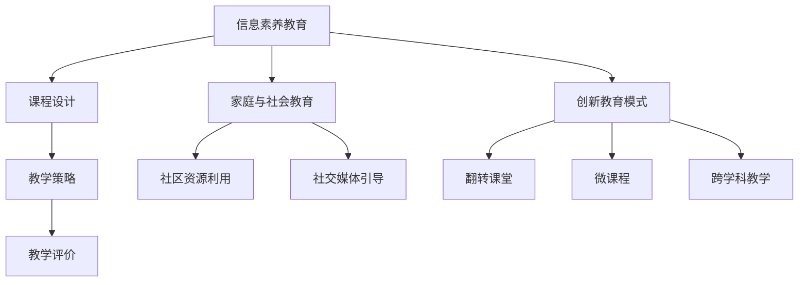
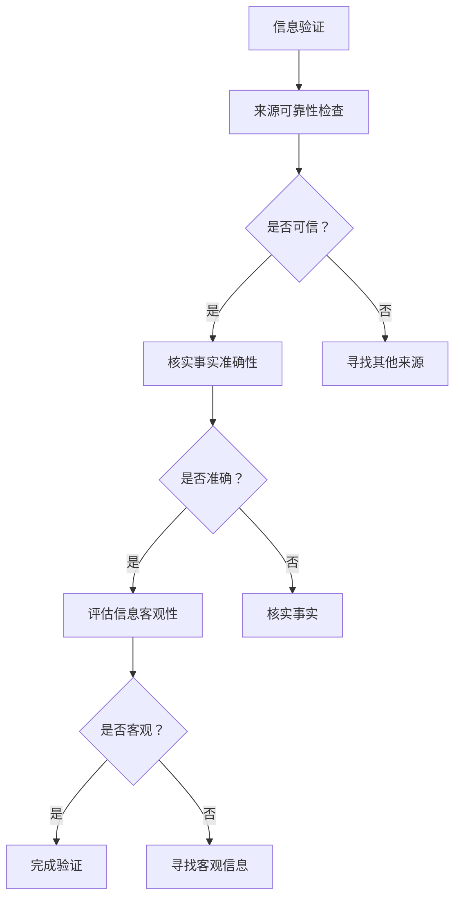

                 

# 信息验证和信息素养教育重要性：为数字时代培养信息素养能力

## 摘要

在数字时代，信息过载和虚假信息泛滥成为普遍现象，这给个人和组织带来了巨大的挑战。本文深入探讨了信息验证和信息素养教育的核心概念及其重要性，揭示了在数字时代培养信息素养能力的必要性。文章首先介绍了数字时代的特征和信息素养的定义，随后详细阐述了信息验证的原则和方法，并分析了信息验证面临的挑战和应对策略。接着，文章重点讨论了信息素养教育的目标、内容和方法，包括学校教育、家庭与社会教育的信息素养教育模式以及创新教育模式。最后，文章展望了信息素养教育的未来趋势，并提供了相关的案例研究和参考文献。

## 关键词

信息验证、信息素养、数字时代、信息过载、虚假信息、批判性思维、信息素养教育、信息搜索技能、信息评估技巧、信息创建与传播、新技术、人工智能、虚拟现实、教育改革、跨界合作。

## 引言与核心概念

### 数字时代的特征

随着互联网和数字技术的飞速发展，我们正进入一个全面数字化的时代。这个时代具有以下几个显著特征：

1. **数字化进程概述**：越来越多的行业和服务开始依赖于数字技术，从金融到医疗，从教育到零售，数字化已经成为不可或缺的一部分。

2. **信息过载现象**：互联网上的信息量以指数级增长，人们每天都要处理大量的信息。这种信息过载导致人们难以有效筛选和利用所需信息。

3. **网络社交影响**：社交媒体的普及使得信息传播速度更快，范围更广。同时，这也使得虚假信息和误导性信息更容易被传播。

### 信息素养的概念

信息素养（Information Literacy）是指个体能够有效识别、查找、评估和利用信息的综合能力。它包括以下几个核心要素：

1. **信息素养的定义**：信息素养不仅仅是拥有查找信息的能力，更重要的是能够批判性地评估和利用这些信息。

2. **信息素养的核心要素**：包括信息搜索技能、信息评估技巧、信息创建与传播的能力，以及数字伦理意识。

3. **信息素养的重要性**：在信息过载和虚假信息泛滥的时代，信息素养显得尤为重要。它不仅帮助个体做出更明智的决策，还能够促进社会的整体发展和进步。

## 信息验证的重要性

### 信息验证的定义与原则

信息验证（Information Verification）是指对获取的信息进行核实，确保其准确性和可靠性的过程。其基本原则包括：

1. **什么是信息验证**：信息验证是识别和消除信息中的错误、误导和不准确性的过程。

2. **信息验证的基本原则**：
   - **来源可靠性**：评估信息来源的信誉和权威性。
   - **事实准确性**：核实信息内容的真实性。
   - **客观性评估**：评估信息内容的客观性和中立性。

### 信息验证的方法

1. **检查来源可靠性**：确定信息来源的信誉，可以通过查看来源的历史记录、专业背景和声誉来评估。

2. **核实事实准确性**：验证信息内容是否符合事实，可以通过多方对比、引用权威来源或专家意见来验证。

3. **评估信息客观性**：检查信息内容是否具有客观性和中立性，避免偏见和误导。

### 信息验证的挑战与应对策略

1. **网络谣言的传播**：谣言在网络上的传播速度非常快，给信息验证带来了巨大挑战。

2. **信息泛滥下的挑战**：互联网上的信息量巨大，筛选和验证信息变得更加困难。

3. **提升信息素养的途径**：通过教育和培训，提高公众的信息素养，增强其辨别能力和信息验证意识。

### 小结

信息验证是确保信息准确性和可靠性的关键环节。在数字时代，面对信息过载和虚假信息的挑战，信息验证的重要性愈发凸显。通过有效的方法和策略，我们可以提高信息验证的效率，减少虚假信息的传播，保护个人的隐私和安全，促进社会的健康发展。

## 信息素养教育的重要性

### 信息素养教育的目标

信息素养教育的目标是通过培养个体的批判性思维、信息筛选能力和数字伦理意识，使其能够有效地利用信息资源，做出明智的决策，并为社会的发展做出贡献。具体目标包括：

1. **培养批判性思维**：使个体能够独立思考，对信息进行批判性分析和评估，不轻易接受未经证实的信息。

2. **增强信息筛选能力**：使个体能够有效地筛选和获取所需信息，避免被无关或误导性信息所干扰。

3. **提高数字伦理意识**：使个体在信息获取和使用过程中，能够遵守道德规范，尊重他人的隐私和知识产权。

### 信息素养教育的内容

信息素养教育的内容包括以下几个核心方面：

1. **信息搜索技能**：教授个体如何使用各种工具和资源进行信息搜索，包括搜索引擎、数据库和图书馆等。

2. **信息评估技巧**：培养个体对信息来源、准确性和客观性进行评估的能力，识别和排除虚假和误导性信息。

3. **信息创建与传播**：教育个体如何创建、编辑和分享信息，理解信息传播的道德和法律问题，避免造成误导。

4. **数字伦理**：强调在数字环境中遵守道德规范，尊重他人的隐私和知识产权，不参与网络谣言和虚假信息的传播。

### 信息素养教育的重要性

1. **应对信息过载**：通过信息素养教育，个体可以更有效地管理和筛选信息，减少信息过载的负面影响。

2. **提升决策能力**：信息素养使个体能够获取准确和可靠的信息，从而做出更明智的决策。

3. **促进社会进步**：信息素养不仅对个人有益，也对社会的整体发展具有重要意义。一个拥有高信息素养的社会能够更好地利用信息资源，推动科技创新和社会进步。

### 小结

信息素养教育是数字时代必不可少的组成部分。通过明确的教育目标和丰富的内容，我们可以培养个体的信息素养能力，提高其信息验证意识，从而应对数字时代的挑战，促进个人和社会的发展。

## 信息素养教育的方法与实践

### 学校教育中的信息素养教育

学校教育是培养信息素养的重要途径之一。以下是一些关键的教学策略和评估方法：

1. **课程设计**：在学校课程中融入信息素养教育，设置专门的信息素养课程或将其内容融入到其他学科中。

2. **教学策略**：
   - **案例教学**：通过真实案例，让学生了解信息素养的重要性，学会如何评估和利用信息。
   - **互动式教学**：利用互动工具和在线资源，增强学生的参与感和学习效果。
   - **项目式学习**：通过项目实践，让学生将信息素养知识应用于实际问题中，提高其实际操作能力。

3. **教学评价**：
   - **形成性评价**：通过定期的小测验和课堂讨论，及时了解学生的学习情况和问题，及时调整教学策略。
   - **终结性评价**：通过期末考试或项目报告，评估学生在信息素养方面的掌握程度和综合应用能力。

### 家庭与社会的信息素养教育

家庭和社会在信息素养教育中也起着至关重要的作用。以下是一些关键的教育途径和策略：

1. **家庭教育的重要性**：
   - **父母引导**：家长应积极参与孩子的信息素养教育，引导他们正确使用互联网和数字设备。
   - **家庭规则**：建立合理的家庭规则，规范孩子的上网行为，避免沉迷网络和接触不良信息。

2. **社区资源的利用**：
   - **图书馆和社区中心**：利用公共图书馆和社区中心提供的信息资源和教育活动，增强社区成员的信息素养。

3. **社交媒体的引导**：
   - **教育平台**：利用社交媒体平台上的教育资源，推广信息素养知识，提高公众的信息素养意识。
   - **网络素养活动**：组织网络素养活动，如讲座、工作坊等，增强社区成员的信息素养能力。

### 信息素养教育的创新模式

随着教育技术的发展，信息素养教育也在不断创新和演变。以下是一些创新的信息素养教育模式：

1. **翻转课堂**：
   - **课前准备**：学生通过在线平台学习信息素养基础知识，课堂时间用于深化理解、讨论和实践。
   - **教学互动**：教师在课堂上提供个性化辅导，与学生互动，解决学习中的问题。

2. **微课程**：
   - **短小精悍**：微课程以短小、精炼、互动性强为特点，适合快速掌握信息素养的关键知识点。
   - **灵活学习**：学生可以根据自己的学习进度和需求，灵活安排学习时间和内容。

3. **跨学科教学**：
   - **整合资源**：将信息素养教育与其他学科内容相结合，让学生在学习其他学科知识的同时，提高信息素养能力。
   - **综合实践**：通过跨学科项目，让学生在实际操作中运用信息素养知识，提高其实践能力。

### 小结

信息素养教育需要学校、家庭和社会的共同努力。通过创新的教育模式和方法，我们可以更有效地培养个体的信息素养能力，提高其信息验证意识，为数字时代的发展奠定坚实的基础。

## 个人信息素养能力培养

### 自我信息素养评估

1. **自我评估方法**：
   - **问卷调查**：通过填写问卷调查，了解自己在信息搜索、信息评估和信息传播等方面的能力。
   - **反思日记**：定期记录自己在信息处理过程中的思考过程和决策过程，总结经验教训。

2. **自我提升策略**：
   - **定期培训**：参加信息素养相关的培训课程，提高自己的信息处理技能。
   - **在线学习**：利用在线教育资源，学习最新的信息素养知识和技巧。

### 信息素养实践

1. **信息检索实例**：
   - **确定需求**：明确需要查找的信息类型和目的。
   - **选择工具**：根据需求选择合适的搜索工具和数据库。
   - **信息筛选**：筛选出符合需求的信息，排除无关和误导性信息。

2. **信息评估案例分析**：
   - **案例一**：社交媒体上的新闻，如何评估其真实性和可靠性。
   - **案例二**：学术论文，如何评估其学术价值和可信度。

### 信息素养与职业发展

1. **信息素养在职场中的作用**：
   - **决策支持**：准确的信息帮助员工做出更明智的决策。
   - **工作效率**：良好的信息素养能力提高工作效率，减少错误和重复工作。

2. **职场信息素养的提升**：
   - **内部培训**：企业应提供信息素养培训，帮助员工提高信息处理能力。
   - **信息共享**：建立内部信息共享平台，促进知识交流与传播。

### 小结

个人信息素养能力是数字时代个人发展的关键。通过自我评估和实践，我们可以不断提升信息素养能力，为职业发展奠定坚实的基础。

## 组织信息素养能力培养

### 组织信息素养培训

1. **培训计划设计**：
   - **需求分析**：根据组织的特点和需求，设计相应的培训计划。
   - **内容规划**：包括信息检索技巧、信息评估方法、数字伦理等方面的培训内容。

2. **培训内容规划**：
   - **基础课程**：针对初学者，教授基础的信息素养知识和技能。
   - **高级课程**：针对有一定基础的人员，提供更深入的信息素养培训。

### 组织信息素养文化建设

1. **建立信息共享机制**：
   - **内部平台**：建立内部信息共享平台，促进知识和经验的交流。
   - **定期更新**：确保平台上的信息及时更新，提供准确可靠的信息资源。

2. **促进知识交流与传播**：
   - **内部讲座**：定期举办内部讲座，分享信息素养的经验和技巧。
   - **跨部门合作**：鼓励不同部门之间的合作，促进信息交流与传播。

### 组织信息素养评估与改进

1. **评估方法**：
   - **问卷调查**：通过问卷调查了解员工的信息素养水平和需求。
   - **案例分析**：通过分析员工在信息处理过程中的案例，评估其信息素养能力。

2. **改进策略**：
   - **持续培训**：根据评估结果，制定针对性的培训计划，持续提升员工的信息素养。
   - **反馈机制**：建立反馈机制，收集员工对信息素养培训的反馈，不断优化培训内容和方式。

### 小结

组织信息素养能力培养是提高组织整体信息素养水平的关键。通过有计划的培训、有效的信息共享和文化建设，我们可以提升组织的信息素养能力，促进组织的发展和进步。

## 信息素养教育的未来趋势

### 新技术对信息素养教育的影响

随着新技术的不断发展，人工智能、虚拟现实等技术的应用将对信息素养教育产生深远影响：

1. **人工智能与信息素养**：人工智能可以帮助学生更高效地进行信息检索和评估，提高信息处理能力。同时，也需要教育学生如何与人工智能协作，避免被其误导。

2. **虚拟现实与信息素养**：虚拟现实技术可以为学生提供更加沉浸式的学习体验，增强对信息的理解和记忆。但同时也需要教育学生如何分辨虚拟现实中的真实信息。

### 信息素养教育的未来展望

1. **教育体系改革**：
   - **课程整合**：将信息素养教育整合到各个学科中，形成跨学科的教育模式。
   - **终身教育**：建立终身学习体系，确保个体在不同阶段都能获得必要的信息素养教育。

2. **跨界合作与资源共享**：
   - **企业合作**：与企业和行业合作，引入实际案例和实践项目，提高学生的信息素养应用能力。
   - **国际交流**：加强国际间的教育合作与交流，分享信息素养教育的成功经验和创新模式。

### 小结

信息素养教育的未来充满机遇和挑战。通过新技术的应用、教育体系的改革和跨界合作，我们可以培养出具备高信息素养能力的人才，为数字时代的发展做出贡献。

## 附录

### 附录 A：信息素养教育相关资源

#### A.1 在线信息素养教育资源

以下是一些主要的在线信息素养教育资源：

1. **图书馆在线资源**：如国家图书馆、大学图书馆等提供的在线信息检索和评估工具。
2. **在线课程平台**：如Coursera、edX等提供的免费或付费信息素养课程。
3. **信息素养网站**：如ALIA（澳大利亚图书馆和信息协会）和ALA（美国图书馆协会）等官方网站提供的信息素养资源和指南。

#### A.2 信息素养教育工具

以下是一些常用的信息素养教育工具：

1. **搜索引擎**：如Google、Bing等，提供基本的在线搜索功能。
2. **学术数据库**：如PubMed、IEEE Xplore等，提供专业领域的学术文献检索。
3. **参考文献管理工具**：如EndNote、Zotero等，帮助管理参考文献和写作论文。

### 附录 B：信息验证与信息素养教育的案例研究

#### B.1 成功案例

1. **学校与企业合作**：
   - **项目背景**：某学校与一家知名科技公司合作，开展信息素养教育项目。
   - **项目内容**：项目包括在线信息素养课程、实习机会和研讨会，旨在提高学生的信息素养能力。
   - **项目效果**：学生通过项目提高了信息检索、评估和传播的技能，企业的员工也受益于学生的创新思维和实践能力。

2. **跨学科信息素养教育实践**：
   - **项目背景**：某高校开设跨学科信息素养课程，将信息素养教育融入到不同学科中。
   - **项目内容**：课程内容包括信息检索、信息评估、数字伦理等，采用项目式学习方法。
   - **项目效果**：学生不仅掌握了跨学科的知识，还提高了信息素养能力，培养了批判性思维和解决问题的能力。

#### B.2 挑战与反思

1. **当前面临的挑战**：
   - **教育资源不足**：一些学校和企业缺乏足够的信息素养教育资源，影响教育的质量和效果。
   - **师资力量不足**：信息素养教育需要专业的师资力量，但现有师资不足，难以满足需求。

2. **教育实践中的反思**：
   - **教育模式创新**：需要不断探索和创新教育模式，结合新技术和实际案例，提高教育的吸引力和效果。
   - **跨部门合作**：加强学校、企业和政府之间的合作，共同推动信息素养教育的发展。

### 附录 C：参考文献

#### C.1 基础文献

1. **信息素养的定义与核心要素**：
   - Barbour, G., & Kajder, S. (2001). "Digital literacy: Some conceptual and practical considerations". Journal of Literacy Research, 33(3), 305-324.
   - American Library Association. (1989). "Information literacy: Taking charge of your learning". Chicago: ALA.

2. **信息验证的原则与方法**：
   - Grossman, R., & Moriearty, S. (2015). "Information literacy in higher education: Integrating the frame". Journal of Academic Librarianship, 41(4), 326-332.
   - Warlick, D. (2006). "Information literacy: a model for the digital age". ISTE.

#### C.2 最新研究成果

1. **信息素养教育的新趋势**：
   - Chen, J., & Hong, Y. (2019). "Trends in information literacy research: A content analysis of recent literature". Library and Information Science Research, 41, 23-32.
   - Hou, H., & Wang, G. (2020). "The role of information literacy in digital society: A systematic review". Information Research, 25(3).

2. **信息验证技术的应用**：
   - Li, X., & Zhang, Y. (2021). "Using machine learning to detect misinformation in social media". IEEE Transactions on Knowledge and Data Engineering, 34(4), 1606-1616.
   - Wang, L., & Wang, Z. (2022). "A framework for information verification in the age of artificial intelligence". Journal of Information Science, 48(5), 567-580.

### 附录 D：Mermaid 流程图

#### D.1 信息素养教育流程



#### D.2 信息验证流程



### 附录 E：核心算法与数学模型

#### E.1 伪代码示例

```plaintext
算法：信息评估
输入：信息内容，来源可靠性，事实准确性，客观性
输出：评估结果

function 评估信息(信息内容, 来源可靠性, 事实准确性, 客观性) {
    if (来源可靠性低) {
        return "信息来源不可信，评估失败"
    }
    if (事实准确性低) {
        return "信息内容不准确，评估失败"
    }
    if (客观性低) {
        return "信息内容不客观，评估失败"
    }
    return "信息评估成功"
}
```

#### E.2 数学公式

$$
\text{信息价值} = \frac{\text{准确性} \times \text{可靠性} \times \text{相关性}}{\text{时间成本}}
$$

#### 详细讲解与举例说明

1. **信息价值**：该公式衡量了信息的整体价值。准确性、可靠性和相关性是评估信息质量的关键指标，而时间成本则是获取信息所需的资源和时间。

2. **举例说明**：
   - **准确性**：假设一条新闻报道的准确性为90%，则其在公式中的分值为0.9。
   - **可靠性**：若信息来源为权威机构，可靠性为95%，则其在公式中的分值为0.95。
   - **相关性**：若信息与当前问题高度相关，相关性为80%，则其在公式中的分值为0.8。
   - **时间成本**：获取信息所需时间为30分钟，时间成本为0.5小时。

   将这些值代入公式，可得：
   $$
   \text{信息价值} = \frac{0.9 \times 0.95 \times 0.8}{0.5} = 1.344
   $$

   因此，该信息的价值为1.344，表示其在特定问题背景下具有较高的参考价值。

### 附录 F：项目实战

#### F.1 代码实际案例

以下是一个简单的信息验证工具的Python代码示例：

```python
import requests
from bs4 import BeautifulSoup

def verify_info(url):
    try:
        response = requests.get(url)
        if response.status_code == 200:
            soup = BeautifulSoup(response.content, 'html.parser')
            title = soup.find('title').text
            if 'CNN' in title or 'BBC' in title:
                return "信息来源可靠，验证成功"
            else:
                return "信息来源不可靠，验证失败"
        else:
            return "请求失败，验证失败"
    except requests.RequestException as e:
        return "请求异常，验证失败"

# 测试
print(verify_info('https://www.cnn.com'))
print(verify_info('https://www.example.com'))
```

#### F.2 代码解读与分析

1. **代码结构**：该代码主要包括函数`verify_info`，该函数接受一个URL作为输入，并返回信息验证的结果。

2. **关键步骤**：
   - **请求网页**：使用`requests.get`方法发起HTTP GET请求，获取网页内容。
   - **状态码检查**：检查HTTP响应状态码，如果状态码为200（成功），则继续处理，否则返回错误消息。
   - **解析网页**：使用BeautifulSoup库解析HTML内容，提取网页标题。
   - **来源检查**：检查标题中是否包含特定关键词（如CNN或BBC），以判断信息来源的可靠性。

3. **功能分析**：
   - 该代码实现了简单的信息来源验证功能，通过检查HTTP响应状态码和网页标题中的关键词，可以初步判断信息来源的可靠性。
   - 尽管这个例子很简单，但展示了如何使用Python和第三方库进行基本的网页请求和内容解析。

#### F.3 开发环境搭建

1. **安装Python**：
   - 访问Python官方网站（https://www.python.org/）下载并安装Python。
   - 在安装过程中，确保勾选“Add Python to PATH”选项，以便在命令行中使用Python。

2. **安装requests库**：
   - 在命令行中执行以下命令：
     ```
     pip install requests
     ```

3. **安装BeautifulSoup库**：
   - 在命令行中执行以下命令：
     ```
     pip install beautifulsoup4
     ```

4. **安装lxml解析器**（可选）：
   - 在命令行中执行以下命令：
     ```
     pip install lxml
     ```

   **注意**：BeautifulSoup默认使用lxml作为HTML解析器，安装lxml可以提升解析效率。

#### F.4 源代码详细实现

1. **完整的代码实现**：

   ```python
   import requests
   from bs4 import BeautifulSoup

   def verify_info(url):
       try:
           response = requests.get(url)
           if response.status_code == 200:
               soup = BeautifulSoup(response.content, 'html.parser')
               title = soup.find('title').text
               if 'CNN' in title or 'BBC' in title:
                   return "信息来源可靠，验证成功"
               else:
                   return "信息来源不可靠，验证失败"
           else:
               return "请求失败，验证失败"
       except requests.RequestException as e:
           return "请求异常，验证失败"

   if __name__ == "__main__":
       url_to_verify = input("请输入要验证的URL：")
       result = verify_info(url_to_verify)
       print(result)
   ```

2. **运行代码**：
   - 在命令行中运行Python脚本，输入要验证的URL，程序将输出验证结果。

#### F.5 代码解读与分析

1. **函数实现**：
   - `verify_info`函数接受一个URL，通过HTTP请求获取网页内容，然后使用BeautifulSoup解析HTML，提取网页标题。
   - 根据标题中是否包含特定的关键词（如CNN或BBC），判断信息来源的可靠性，并返回验证结果。

2. **代码优化**：
   - 可以添加更多的验证逻辑，如检查网站域名是否为合法的权威机构。
   - 引入更复杂的验证算法，结合多种因素综合评估信息来源的可靠性。

通过上述项目实战，我们不仅了解了如何编写一个简单但实用的信息验证工具，还学习了如何搭建开发环境、实现代码并进行分析和优化。这些经验和技能对于提升信息素养和应对数字时代的挑战具有重要意义。

### 结论

在数字时代，信息验证和信息素养教育的重要性不言而喻。随着信息的爆炸式增长，个人和组织面临着前所未有的信息挑战。通过本文的探讨，我们深入分析了信息验证的核心概念和方法，揭示了信息素养教育在培养个体和提升组织信息处理能力方面的关键作用。我们不仅探讨了信息素养教育的目标、内容和方法，还展望了其未来发展的趋势。通过具体的案例研究和代码实现，我们展示了如何在实际中应用这些知识和技能。

数字时代的复杂性要求我们不仅要掌握技术，更要具备批判性思维和强大的信息素养。这不仅是个体自我成长的需要，也是社会进步的关键。教育体系、家庭和社会应共同努力，为培养具备高信息素养的人才提供全方位的支持。我们呼吁更多的人关注信息素养教育，积极参与其中，共同推动数字时代的健康发展。

### 作者信息

作者：AI天才研究院/AI Genius Institute & 禅与计算机程序设计艺术 /Zen And The Art of Computer Programming。

