                 

# 元宇宙内容生成：提示词构建虚拟世界的基石

> **关键词：** 元宇宙，内容生成，提示词，虚拟世界，3D建模，渲染技术，自然语言处理，机器学习，深度学习。

> **摘要：** 本文将深入探讨元宇宙内容生成的核心概念、技术原理及其在虚拟世界设计中的应用。我们将逐步解析提示词在元宇宙构建中的作用，介绍3D建模与渲染技术、自然语言处理技术、机器学习与深度学习技术的基本原理及其应用。最后，我们将通过一个实际项目案例展示如何进行元宇宙内容生成，并对该领域的未来发展趋势进行分析。本文旨在为开发者提供一条清晰的路径，了解并掌握元宇宙内容生成的关键技术。

## 第一部分：元宇宙内容生成概述

### 第1章：元宇宙与内容生成技术概述

#### 1.1 元宇宙的崛起与内容生成的关系

##### 1.1.1 元宇宙的定义与特点

元宇宙（Metaverse）是一个由虚拟世界和现实世界融合而成的数字空间，用户可以在其中创建、交互、共享内容和体验。它具有以下几个特点：

1. **虚拟性**：元宇宙是一个虚拟空间，用户通过数字化的形式进行交互。
2. **开放性**：元宇宙是一个开放的生态系统，允许不同平台和应用之间的互操作性和数据共享。
3. **沉浸性**：通过虚拟现实（VR）、增强现实（AR）等技术与硬件设备，用户能够获得高度沉浸的体验。
4. **持续性**：元宇宙是一个持续存在的空间，不受物理时间和地点的限制。

##### 1.1.2 内容生成的概念与作用

内容生成是指创建、编辑和发布数字内容的过程，包括文本、图像、音频和视频等多种形式。在元宇宙中，内容生成技术扮演着至关重要的角色：

1. **丰富用户体验**：通过生成丰富的虚拟内容，用户可以体验到更加真实、多样化的虚拟世界。
2. **支持交互式体验**：内容生成技术使得用户可以在元宇宙中进行互动、合作和创造。
3. **推动虚拟经济**：生成的虚拟物品和资产可以在元宇宙中进行交易和流通，推动虚拟经济的发展。

##### 1.1.3 元宇宙内容生成的重要性

元宇宙内容生成的重要性体现在以下几个方面：

1. **技术基础**：元宇宙内容生成技术是元宇宙生态系统的基础，没有强大的内容生成能力，元宇宙将失去生命力。
2. **用户体验**：高质量的内容生成技术能够提升用户的沉浸感和交互体验。
3. **商业模式**：内容生成技术为元宇宙提供了丰富的商业模式，如虚拟商品销售、虚拟广告等。
4. **创新驱动**：内容生成技术的不断创新为元宇宙带来新的发展机遇，推动技术的进步。

#### 1.2 内容生成的核心技术

元宇宙内容生成涉及多个核心技术，主要包括计算机图形学、3D建模与渲染技术、自然语言处理技术、机器学习与深度学习技术。以下将对这些技术进行简要介绍。

##### 1.2.1 计算机图形学基础

计算机图形学是元宇宙内容生成的基础，它涉及图形的创建、处理和显示。主要包括以下方面：

1. **图形基础**：包括二维和三维图形的表示方法、基本图形操作和变换等。
2. **渲染技术**：用于生成高质量的三维图像，包括光跟踪、路径追踪、实时渲染等。
3. **纹理映射**：用于在三维物体上贴图，增加物体的细节和真实感。

##### 1.2.2 3D建模与渲染技术

3D建模与渲染技术是元宇宙内容生成的重要技术之一，主要包括以下方面：

1. **3D建模**：使用3D建模工具创建三维模型，包括几何建模、参数建模、三维扫描等。
2. **3D渲染**：通过渲染技术将三维模型转换为可视化图像，包括静态渲染、动态渲染、实时渲染等。
3. **特效处理**：用于增强图像效果，如粒子系统、阴影、反射、折射等。

##### 1.2.3 自然语言处理技术

自然语言处理（NLP）技术是处理人类语言数据的一门学科，主要包括以下方面：

1. **文本处理**：包括分词、词性标注、句法分析等，用于理解和解析文本数据。
2. **文本生成**：根据输入的提示词或模板生成文本内容，如自动摘要、问答系统、对话生成等。
3. **情感分析**：对文本数据中的情感倾向进行分析和判断，用于情感识别、用户反馈分析等。

##### 1.2.4 机器学习与深度学习技术

机器学习与深度学习技术是元宇宙内容生成的重要工具，主要包括以下方面：

1. **机器学习**：通过训练模型来学习数据特征和规律，用于分类、回归、聚类等任务。
2. **深度学习**：一种基于人工神经网络的机器学习方法，具有强大的特征学习和建模能力。
3. **生成模型**：如生成对抗网络（GAN）、变分自编码器（VAE）等，用于生成高质量的数据。

#### 1.3 元宇宙内容生成的挑战与机遇

元宇宙内容生成面临着一系列挑战和机遇：

##### 1.3.1 技术难题与限制

1. **计算资源**：生成高质量的内容需要大量的计算资源和存储空间。
2. **实时性能**：实时渲染和交互要求系统具有高响应速度和低延迟。
3. **数据隐私与安全**：确保用户数据的隐私和安全是一个重要问题。
4. **跨平台兼容性**：不同平台和设备之间的内容生成和互操作性问题。

##### 1.3.2 行业应用前景

1. **虚拟现实**：提供沉浸式的虚拟体验，应用于游戏、教育、医疗等领域。
2. **数字孪生**：创建现实世界的数字镜像，应用于智能制造、城市规划等。
3. **社交网络**：构建虚拟社交平台，提供新型的社交和娱乐体验。
4. **电子商务**：虚拟商品和服务的交易和推广，推动数字经济的发展。

##### 1.3.3 开发者面临的挑战

1. **技术门槛**：需要掌握多种技术，包括编程、图形学、自然语言处理等。
2. **学习成本**：内容生成技术的快速发展和更新要求开发者不断学习和跟进。
3. **创作成本**：高质量的内容生成需要投入大量的人力和物力资源。
4. **用户体验**：满足用户需求，提供高质量的交互和娱乐体验。

通过以上分析，我们可以看到，元宇宙内容生成技术是一项具有广阔前景和应用价值的领域，但同时也面临着一系列挑战。下一章，我们将深入探讨提示词构建与虚拟世界设计，了解如何在元宇宙中构建高质量的虚拟世界。

### 第2章：提示词构建与虚拟世界设计

#### 2.1 提示词的定义与作用

##### 2.1.1 提示词的基本概念

提示词（Prompt）是指导用户或系统生成内容的关键词或短语。在元宇宙内容生成中，提示词用于引导系统创建相应的虚拟内容，如场景、角色、故事等。

提示词通常包括以下几个要素：

1. **主题**：提示词应明确表达内容的主题或方向。
2. **类型**：提示词应指明生成内容的类型，如场景、角色、故事等。
3. **特征**：提示词应描述生成内容的主要特征或属性。
4. **背景**：提示词应提供生成内容所需的背景信息。

##### 2.1.2 提示词在内容生成中的作用

提示词在内容生成中具有以下重要作用：

1. **引导生成方向**：提示词帮助系统明确生成内容的目标和方向，避免生成无关或错误的内容。
2. **提高生成效率**：通过提示词，系统可以快速生成所需的内容，提高生产效率。
3. **优化用户体验**：提示词可以根据用户需求生成个性化的内容，提高用户体验。

##### 2.1.3 提示词的构建方法

构建高质量的提示词需要遵循以下方法：

1. **明确目标**：根据生成内容的需求，明确提示词的目标和主题。
2. **简洁明了**：提示词应简洁明了，避免使用复杂或模糊的表述。
3. **具体详细**：提示词应提供足够的信息，描述生成内容的主要特征和属性。
4. **灵活多样**：根据不同场景和需求，设计多种类型的提示词，提高适用性。

#### 2.2 虚拟世界设计原理

##### 2.2.1 虚拟世界的定义与特点

虚拟世界是元宇宙中的核心组成部分，是一个由计算机生成的虚拟空间，用户可以在其中进行各种活动和互动。虚拟世界具有以下特点：

1. **虚拟性**：虚拟世界是虚拟的，不存在于现实世界中，但可以模拟和再现现实世界的各种场景和现象。
2. **多样性**：虚拟世界可以包含多种类型的内容，如建筑、人物、动物、植物等，具有丰富的多样性。
3. **交互性**：虚拟世界支持用户之间的交互和互动，用户可以在其中进行交流、合作、竞争等活动。
4. **沉浸性**：虚拟世界通过先进的计算机技术和硬件设备，为用户带来高度沉浸的体验。

##### 2.2.2 虚拟世界设计的基本原则

虚拟世界设计应遵循以下基本原则：

1. **用户体验**：设计应关注用户的体验，提供直观、易用、互动性强的界面和功能。
2. **内容丰富**：虚拟世界应包含丰富多样的内容，满足用户的不同需求。
3. **功能性**：设计应具备实用性，支持用户进行各种活动和任务。
4. **一致性**：虚拟世界的视觉、音效和交互应保持一致性，为用户提供连贯的体验。

##### 2.2.3 虚拟世界设计的流程

虚拟世界设计的流程包括以下步骤：

1. **需求分析**：明确虚拟世界的目标用户、功能和内容需求。
2. **概念设计**：确定虚拟世界的整体概念和设计方向，包括场景、角色、故事等。
3. **原型制作**：制作虚拟世界的原型，进行初步的功能和交互测试。
4. **迭代优化**：根据测试反馈和用户需求，对虚拟世界进行迭代优化和改进。
5. **上线发布**：将虚拟世界上线发布，供用户使用和体验。

#### 2.3 提示词在虚拟世界中的应用

##### 2.3.1 提示词在场景构建中的应用

在场景构建中，提示词用于指导系统生成特定的场景内容，如城市、乡村、森林等。以下是几个典型的场景构建提示词：

1. **城市场景**：“创建一个现代化的城市，包含高楼大厦、街道、车辆等。”
2. **乡村场景**：“创建一个宁静的乡村，包含农田、村庄、动物等。”
3. **森林场景**：“创建一个神秘的森林，包含树木、湖泊、动物等。”

通过这些提示词，系统可以生成符合要求的场景内容，为用户提供丰富的虚拟体验。

##### 2.3.2 提示词在角色设计中的应用

在角色设计中，提示词用于指导系统生成特定的角色，如人物、动物、植物等。以下是几个典型的角色设计提示词：

1. **人物角色**：“创建一个勇敢的战士，拥有强壮的身体和战斗技能。”
2. **动物角色**：“创建一只聪明的猫，善于捕猎和与人互动。”
3. **植物角色**：“创建一种神奇的植物，具有治愈和成长能力。”

通过这些提示词，系统可以生成符合要求的角色，为虚拟世界增添生动的元素。

##### 2.3.3 提示词在故事情节中的应用

在故事情节中，提示词用于指导系统生成特定的故事内容，如情节、人物、事件等。以下是几个典型的故事情节提示词：

1. **冒险故事**：“创建一个冒险故事，主人公在寻找宝藏的过程中遇到各种挑战。”
2. **科幻故事**：“创建一个科幻故事，主人公在太空探险中遇到外星生物。”
3. **爱情故事**：“创建一个浪漫的爱情故事，主人公在经历种种困难后最终走到一起。”

通过这些提示词，系统可以生成符合要求的情节，为虚拟世界增添故事性和趣味性。

通过以上分析，我们可以看到，提示词在虚拟世界设计中具有重要作用。它不仅能够引导系统生成高质量的内容，还能提高生成效率和用户体验。下一章，我们将深入探讨3D建模与渲染技术基础，了解如何在虚拟世界中创建逼真的三维模型和图像。

### 第3章：3D建模与渲染技术基础

#### 3.1 3D建模技术

##### 3.1.1 3D建模的基本概念

3D建模是创建三维物体的过程，它是元宇宙内容生成的重要环节。3D建模的基本概念包括：

1. **三维坐标系**：三维坐标系是3D建模的基础，用于表示物体在三维空间中的位置和形状。
2. **几何体**：几何体是3D建模的基本元素，包括点、线、面和体，用于构建复杂的物体。
3. **网格建模**：网格建模是一种常见的3D建模方法，通过构建物体的网格模型来表示其形状和结构。

##### 3.1.2 常用的3D建模工具

常用的3D建模工具包括：

1. **Blender**：Blender是一个开源的3D建模工具，具有强大的建模、渲染和动画功能。
2. **Maya**：Maya是业内广泛使用的3D建模和动画软件，适用于电影、游戏和工业设计等领域。
3. **3ds Max**：3ds Max是Autodesk公司开发的3D建模和渲染软件，广泛应用于建筑、游戏和影视制作等领域。

##### 3.1.3 3D建模的基本流程

3D建模的基本流程包括：

1. **概念设计**：确定物体的形状、大小和功能，为建模提供基本参考。
2. **建模**：使用3D建模工具创建物体的三维模型，包括几何建模、细节雕刻和纹理贴图等。
3. **优化**：对模型进行优化，提高其性能和细节表现。
4. **渲染**：使用渲染器将3D模型转换为可视化图像，包括光线追踪、实时渲染等。

#### 3.2 渲染技术

##### 3.2.1 渲染的基本概念

渲染是将三维模型转换为二维图像的过程，它是3D建模的最终目标。渲染的基本概念包括：

1. **光线追踪**：光线追踪是一种渲染技术，通过模拟光线的传播和反射，生成逼真的图像。
2. **实时渲染**：实时渲染是在较短的时间内生成图像，适用于交互式应用，如游戏和虚拟现实。
3. **全局光照**：全局光照是一种考虑光线在场景中传播和反射的渲染技术，能够产生更加真实的光影效果。

##### 3.2.2 常见的渲染技术

常见的渲染技术包括：

1. **路径追踪**：路径追踪通过模拟光线的传播路径，生成高质量的真实感图像。
2. **光线追踪**：光线追踪通过模拟光线的传播和反射，生成更加逼真的图像。
3. **实时渲染**：实时渲染通过优化算法和硬件加速，在较短的时间内生成图像，适用于交互式应用。

##### 3.2.3 渲染效果的优化方法

为了提高渲染效果，可以采用以下优化方法：

1. **提高分辨率**：提高图像的分辨率可以增加细节和真实感。
2. **使用贴图**：贴图可以增加物体的细节和纹理，提高视觉效果。
3. **光线追踪**：光线追踪可以模拟光线的传播和反射，生成更加逼真的图像。
4. **全局光照**：全局光照可以模拟场景中的光线传播和反射，提高图像的真实感。

#### 3.3 3D建模与渲染在元宇宙内容生成中的应用

##### 3.3.1 场景建模的应用

在元宇宙内容生成中，场景建模用于创建虚拟世界的背景和场景。通过3D建模工具，可以创建各种类型的场景，如城市、乡村、森林、沙漠等。场景建模的关键是建立逼真的地形、建筑物、植被和天空等元素。

**示例：**
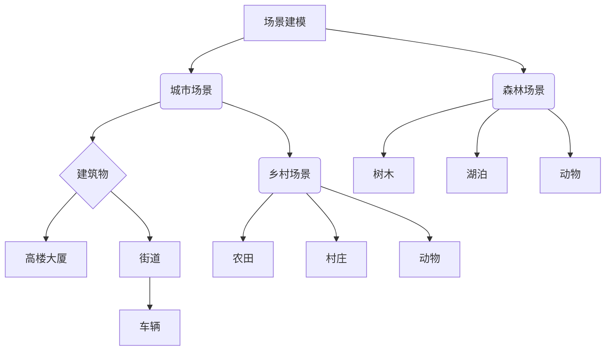

##### 3.3.2 角色建模的应用

角色建模用于创建元宇宙中的角色，如人物、动物、植物等。角色建模的关键是创建逼真的外观、动作和表情，以便为用户带来真实的交互体验。

**示例：**
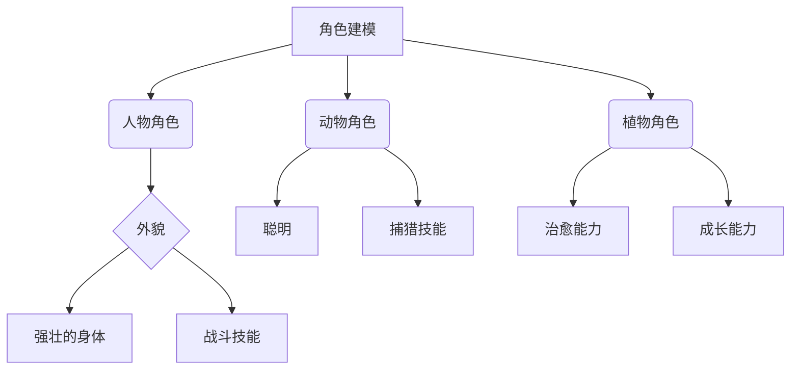

##### 3.3.3 动画渲染的应用

动画渲染用于创建角色的动作和表情，为虚拟世界增添动态效果。通过3D建模工具和动画软件，可以创建各种类型的动画，如行走、奔跑、说话、表情等。

**示例：**
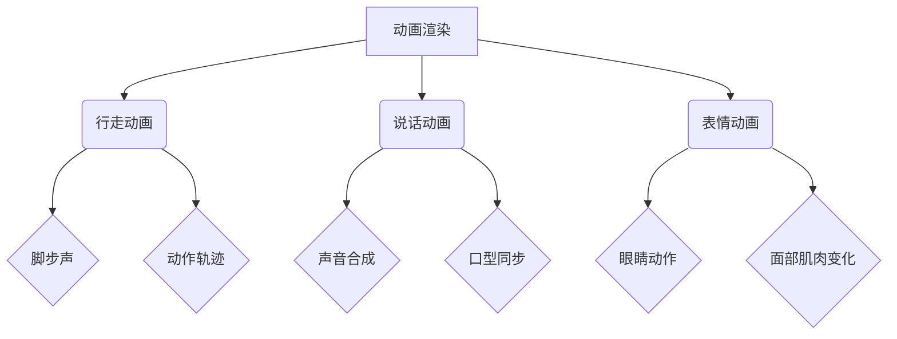

通过以上分析，我们可以看到，3D建模与渲染技术是元宇宙内容生成的重要组成部分。它不仅能够创建逼真的场景和角色，还能为用户带来丰富的交互体验。下一章，我们将深入探讨自然语言处理技术在元宇宙内容生成中的应用。

### 第4章：自然语言处理技术在元宇宙内容生成中的应用

#### 4.1 自然语言处理技术基础

##### 4.1.1 自然语言处理的基本概念

自然语言处理（NLP）是计算机科学、人工智能和语言学领域的一个分支，旨在让计算机理解和处理人类语言。NLP的基本概念包括：

1. **文本表示**：将自然语言文本转换为计算机可以理解和处理的格式，如词向量、句向量等。
2. **语言模型**：使用统计学方法或机器学习算法建模自然语言的概率分布，用于预测下一个词或句子。
3. **语义理解**：理解文本的含义和上下文，包括词义消歧、实体识别、情感分析等。
4. **文本生成**：根据输入的提示或模板生成文本内容，如自动摘要、问答系统、对话生成等。

##### 4.1.2 常见的自然语言处理技术

常见的NLP技术包括：

1. **词向量表示**：将词汇映射到高维向量空间，用于文本的表示和计算。
2. **序列标注**：对文本序列进行词性标注、命名实体识别等任务。
3. **语言模型**：基于统计方法或神经网络模型预测下一个词或句子。
4. **深度学习模型**：如循环神经网络（RNN）、长短期记忆网络（LSTM）、变换器（Transformer）等，用于复杂的语义理解和文本生成任务。

##### 4.1.3 自然语言处理的基本流程

NLP的基本流程包括：

1. **数据预处理**：包括文本清洗、分词、去停用词等，为后续处理做准备。
2. **特征提取**：将文本转换为计算机可以处理的特征向量，如词向量、句向量等。
3. **模型训练**：使用训练数据对NLP模型进行训练，优化模型参数。
4. **模型评估**：使用测试数据评估模型的性能，包括准确率、召回率、F1分数等。
5. **应用部署**：将训练好的模型部署到实际应用场景中，如文本分类、情感分析、问答系统等。

#### 4.2 提示词生成技术

##### 4.2.1 提示词生成的原理

提示词生成是指根据用户输入或系统需求生成合适的提示词，用于指导内容生成。提示词生成的原理包括：

1. **文本生成模型**：使用预训练的语言模型（如GPT-3、BERT等）生成提示词。
2. **模板生成**：根据预设的模板生成提示词，模板中包含关键词和填充词。
3. **交互式生成**：通过与用户的交互，逐步生成提示词，如聊天机器人、问答系统等。

##### 4.2.2 常用的提示词生成方法

常用的提示词生成方法包括：

1. **基于模板的方法**：根据预设的模板生成提示词，模板中包含关键词和填充词，如关键词替换、模板填充等。
2. **基于语言模型的方法**：使用预训练的语言模型（如GPT-3、BERT等）生成提示词，通过优化模型参数，提高生成质量。
3. **基于知识图谱的方法**：利用知识图谱中的关系和实体，生成具有语义关联的提示词。

##### 4.2.3 提示词生成的优化方法

为了提高提示词生成的质量和效率，可以采用以下优化方法：

1. **多模态输入**：结合文本、图像、声音等多模态输入，提高生成提示词的语义关联性。
2. **注意力机制**：使用注意力机制关注输入中的关键信息，提高生成提示词的相关性。
3. **数据增强**：通过数据增强方法，增加训练数据的多样性和质量，提高模型泛化能力。
4. **迁移学习**：利用预训练模型进行迁移学习，提高在新任务上的生成能力。

#### 4.3 自然语言处理在元宇宙内容生成中的应用

##### 4.3.1 文本内容的生成

自然语言处理技术在元宇宙内容生成中用于生成各种文本内容，如故事、对话、说明等。通过文本生成模型，可以自动生成高质量的故事情节和对话，为虚拟世界增添丰富的内容。

**示例：**
```python
import openai
openai.api_key = 'your-api-key'

# 自动生成故事情节
response = openai.Completion.create(
  engine="text-davinci-002",
  prompt="创造一个关于勇者和魔法的奇幻故事。",
  max_tokens=100
)
print(response.choices[0].text.strip())
```

##### 4.3.2 对话系统的构建

自然语言处理技术在元宇宙内容生成中用于构建对话系统，实现用户与虚拟角色的互动。通过对话生成模型，可以自动生成与用户的对话，提供个性化的交互体验。

**示例：**
```python
import openai
openai.api_key = 'your-api-key'

# 与用户进行对话
while True:
    user_input = input("用户：")
    if user_input.lower() == 'exit':
        break
    response = openai.Completion.create(
      engine="text-davinci-002",
      prompt=f"作为虚拟角色，回答用户的问题：\n用户：{user_input}\n虚拟角色：",
      max_tokens=50
    )
    print("虚拟角色：" + response.choices[0].text.strip())
```

##### 4.3.3 情感分析的应用

自然语言处理技术在元宇宙内容生成中用于分析用户的情感，了解用户的需求和反馈。通过情感分析模型，可以自动分析用户的文本输入，判断其情感倾向，为虚拟世界提供个性化的互动体验。

**示例：**
```python
import openai
openai.api_key = 'your-api-key'

# 分析用户情感
response = openai.Completion.create(
  engine="text-davinci-002",
  prompt="判断以下文本的情感：\n文本：用户对虚拟世界的体验非常满意。\n情感：",
  max_tokens=10
)
print("情感：" + response.choices[0].text.strip())
```

通过以上分析，我们可以看到，自然语言处理技术在元宇宙内容生成中具有广泛的应用。它不仅可以生成丰富的文本内容，构建对话系统，还能分析用户情感，提供个性化的交互体验。下一章，我们将深入探讨机器学习与深度学习技术在元宇宙内容生成中的应用。

### 第5章：机器学习与深度学习技术在元宇宙内容生成中的应用

#### 5.1 机器学习技术基础

##### 5.1.1 机器学习的基本概念

机器学习（ML）是一门人工智能（AI）的分支，通过利用数据和算法来让计算机系统从数据中学习并做出决策或预测。机器学习的基本概念包括：

1. **监督学习**：通过已标记的输入输出数据训练模型，使其能够对未知数据进行预测。
2. **无监督学习**：在没有标记的输入数据上进行学习，目的是发现数据中的隐藏结构和模式。
3. **强化学习**：通过与环境的交互进行学习，不断调整行为策略以最大化回报。

##### 5.1.2 常见的机器学习算法

常见的机器学习算法包括：

1. **线性回归**：用于预测连续数值变量，如房价预测。
2. **逻辑回归**：用于预测二分类结果，如分类问题中的文本分类。
3. **支持向量机（SVM）**：用于分类和回归问题，具有较好的泛化能力。
4. **决策树和随机森林**：用于分类和回归问题，通过树结构来表示决策过程。
5. **神经网络**：用于复杂的数据建模和特征提取，具有强大的表示和学习能力。

##### 5.1.3 机器学习的基本流程

机器学习的基本流程包括：

1. **数据收集**：收集相关领域的大量数据，确保数据的多样性和代表性。
2. **数据预处理**：对数据进行清洗、归一化、特征工程等处理，提高数据质量。
3. **模型选择**：根据问题特点选择合适的算法和模型。
4. **模型训练**：使用训练数据对模型进行训练，调整模型参数。
5. **模型评估**：使用测试数据评估模型性能，包括准确率、召回率、F1分数等。
6. **模型部署**：将训练好的模型部署到实际应用场景中。

#### 5.2 深度学习技术基础

##### 5.2.1 深度学习的基本概念

深度学习（DL）是一种基于人工神经网络的机器学习方法，通过多层神经网络来提取数据的特征表示。深度学习的基本概念包括：

1. **人工神经网络**：由大量神经元组成的网络，通过前向传播和反向传播算法进行训练。
2. **卷积神经网络（CNN）**：用于图像识别和计算机视觉任务，通过卷积层提取图像特征。
3. **循环神经网络（RNN）**：用于序列数据建模，通过循环结构保持序列信息。
4. **长短期记忆网络（LSTM）**：RNN的一种改进，用于解决长序列依赖问题。
5. **变换器（Transformer）**：用于自然语言处理任务，通过自注意力机制实现并行计算。

##### 5.2.2 常见的深度学习架构

常见的深度学习架构包括：

1. **卷积神经网络（CNN）**：用于图像识别和计算机视觉任务，通过卷积层、池化层和全连接层提取图像特征。
2. **循环神经网络（RNN）**：用于序列数据建模，通过循环结构保持序列信息。
3. **长短期记忆网络（LSTM）**：RNN的一种改进，用于解决长序列依赖问题。
4. **变换器（Transformer）**：用于自然语言处理任务，通过自注意力机制实现并行计算。
5. **生成对抗网络（GAN）**：用于生成数据，由生成器和判别器组成，通过对抗训练生成逼真的数据。

##### 5.2.3 深度学习的基本流程

深度学习的基本流程包括：

1. **数据收集**：收集大量高质量的训练数据，确保数据的多样性和代表性。
2. **数据预处理**：对数据进行清洗、归一化、数据增强等处理，提高数据质量。
3. **模型设计**：根据任务特点设计神经网络结构，选择合适的层和参数。
4. **模型训练**：使用训练数据对模型进行训练，调整模型参数。
5. **模型评估**：使用测试数据评估模型性能，包括准确率、召回率、F1分数等。
6. **模型优化**：通过调参和改进模型结构，提高模型性能。
7. **模型部署**：将训练好的模型部署到实际应用场景中。

#### 5.3 深度学习在元宇宙内容生成中的应用

##### 5.3.1 图像生成与编辑

深度学习技术在元宇宙内容生成中用于生成和编辑图像，如场景生成、角色生成、图像编辑等。以下是一些应用示例：

1. **场景生成**：使用生成对抗网络（GAN）生成逼真的虚拟场景，如城市、乡村、森林等。
2. **角色生成**：使用变分自编码器（VAE）生成个性化的角色外观，包括服装、发型、面部特征等。
3. **图像编辑**：使用深度学习算法对图像进行编辑，如去噪、去雾、超分辨率等。

**示例：**
```python
import tensorflow as tf
import numpy as np
import matplotlib.pyplot as plt

# 加载预训练的GAN模型
generator = tf.keras.models.load_model('generator.h5')

# 生成虚拟场景
noise = np.random.normal(0, 1, (1, 100))
generated_scene = generator.predict(noise)

# 显示生成的场景
plt.imshow(generated_scene[0, :, :, 0], cmap='gray')
plt.show()
```

##### 5.3.2 音频生成与编辑

深度学习技术在元宇宙内容生成中用于生成和编辑音频，如音乐生成、语音合成、音频编辑等。以下是一些应用示例：

1. **音乐生成**：使用变换器（Transformer）生成原创音乐，包括旋律、和弦等。
2. **语音合成**：使用生成对抗网络（GAN）生成逼真的语音，如人物对话、角色配音等。
3. **音频编辑**：使用深度学习算法对音频进行编辑，如去除噪音、添加音效等。

**示例：**
```python
import tensorflow as tf
import numpy as np
import soundfile as sf

# 加载预训练的语音合成模型
vc = tf.keras.models.load_model('voice_converter.h5')

# 生成语音
text = "Hello, how are you?"
input_sequence = preprocess_text(text)
input_sequence = np.expand_dims(input_sequence, axis=0)

# 生成语音并保存
generated_audio = vc.predict(input_sequence)
sf.write('generated_audio.wav', generated_audio[0], 22050)
```

##### 5.3.3 文本生成与编辑

深度学习技术在元宇宙内容生成中用于生成和编辑文本，如故事生成、对话生成、文本编辑等。以下是一些应用示例：

1. **故事生成**：使用变换器（Transformer）生成原创故事，包括情节、人物等。
2. **对话生成**：使用生成对抗网络（GAN）生成逼真的对话，如角色对话、聊天机器人等。
3. **文本编辑**：使用深度学习算法对文本进行编辑，如纠错、摘要生成、风格转换等。

**示例：**
```python
import tensorflow as tf
import numpy as np

# 加载预训练的文本生成模型
text_generator = tf.keras.models.load_model('text_generator.h5')

# 生成故事
noise = np.random.normal(0, 1, (1, 100))
generated_story = text_generator.predict(noise)

# 显示生成的故事
print(generated_story[0].numpy())
```

通过以上分析，我们可以看到，机器学习与深度学习技术在元宇宙内容生成中具有广泛的应用。它们不仅能够生成高质量的图像、音频和文本内容，还能为虚拟世界提供丰富的交互体验。下一章，我们将通过一个实际项目案例展示如何进行元宇宙内容生成。

### 第6章：元宇宙内容生成项目实战

#### 6.1 项目概述

##### 6.1.1 项目背景

随着元宇宙概念的兴起，越来越多的企业和开发者投身于元宇宙内容生成领域。本项目旨在构建一个元宇宙内容生成平台，提供从场景构建、角色设计到故事生成的全流程内容生成服务。项目的主要目标是：

1. **实现虚拟世界的场景建模与渲染**：通过3D建模和渲染技术，构建高质量的虚拟场景。
2. **实现角色的设计与动画**：通过3D建模和动画技术，设计逼真的虚拟角色，实现角色的动作和表情。
3. **实现文本内容的自动生成**：利用自然语言处理和机器学习技术，生成故事、对话和说明等文本内容。

##### 6.1.2 项目目标

本项目的具体目标包括：

1. **构建高质量的虚拟场景**：通过3D建模和渲染技术，实现城市、乡村、森林等虚拟场景的构建。
2. **设计逼真的虚拟角色**：通过3D建模和动画技术，实现角色外观、动作和表情的设计。
3. **生成丰富的文本内容**：利用自然语言处理和机器学习技术，实现故事、对话和说明等文本内容的自动生成。
4. **提供灵活的内容生成接口**：为开发者提供简单易用的接口，方便快速构建元宇宙内容。

##### 6.1.3 项目团队

项目团队由以下成员组成：

1. **项目经理**：负责项目规划、进度控制和团队协调。
2. **3D建模师**：负责虚拟场景和角色的建模与渲染。
3. **动画师**：负责角色的动作和表情设计。
4. **自然语言处理工程师**：负责文本内容的生成与编辑。
5. **机器学习工程师**：负责模型训练与优化。

#### 6.2 项目开发环境搭建

为了顺利进行项目开发，我们需要搭建一个完整的开发环境。以下是开发环境的搭建步骤：

##### 6.2.1 开发环境配置

1. **操作系统**：推荐使用Linux操作系统，如Ubuntu或CentOS。
2. **编程语言**：本项目主要使用Python进行开发。
3. **编辑器**：推荐使用Visual Studio Code或PyCharm等编程工具。
4. **数据库**：使用MySQL或PostgreSQL等关系型数据库存储数据。
5. **版本控制**：使用Git进行代码管理和版本控制。

##### 6.2.2 开发工具与库

以下是项目开发所需的主要工具和库：

1. **3D建模与渲染工具**：使用Blender进行3D建模和渲染。
2. **自然语言处理库**：使用NLTK、spaCy等进行文本处理和情感分析。
3. **机器学习库**：使用TensorFlow、PyTorch等进行模型训练和优化。
4. **Web框架**：使用Flask或Django进行Web应用开发。
5. **数据库库**：使用SQLAlchemy进行数据库操作。

##### 6.2.3 数据准备与处理

1. **场景数据**：收集各种类型的场景图像，如城市、乡村、森林等，用于训练和渲染虚拟场景。
2. **角色数据**：收集角色外观、动作和表情的图像，用于训练和渲染虚拟角色。
3. **文本数据**：收集各种类型的故事、对话和说明等文本内容，用于训练和生成文本。

#### 6.3 项目关键实现

##### 6.3.1 场景建模与渲染

1. **3D建模**：使用Blender进行场景建模，创建城市、乡村、森林等虚拟场景。
2. **纹理贴图**：为场景中的建筑物、植被和地形等元素添加纹理贴图，提高场景的真实感。
3. **光照与阴影**：设置场景的光照和阴影，模拟现实世界中的光照效果。
4. **渲染**：使用Blender的Eevee或Cycles渲染引擎渲染场景，生成高质量的场景图像。

**示例代码：**
```python
import bpy

# 加载Blender场景
scene = bpy.context.scene

# 创建建筑模型
building = bpy.ops.mesh.primitive_cube_add(size=2)
building = bpy.context.object

# 添加纹理贴图
material = bpy.data.materials.new(name="Building Material")
texture = bpy.data.textures.new("Building Texture", type='IMAGE')
image = bpy.data.images.load("/path/to/texture.jpg")
texture.image = image
material.texture_slots.add()
material.texture_slots[-1].texture = texture
material.texture_slots[-1].use_image_overlay = True
building.data.materials.append(material)

# 渲染场景
renderer = bpy.context.scene.render
renderer.engine = 'BLEND_EEVEE'
renderer.resolution_x = 1920
renderer.resolution_y = 1080
renderer.view_settings.view_transform = 'Standard'
bpy.ops.render.render()
```

##### 6.3.2 提示词生成与优化

1. **提示词生成**：使用自然语言处理技术生成高质量的提示词，用于指导内容生成。
2. **提示词优化**：通过多模态输入和数据增强方法，提高提示词的生成质量和效率。

**示例代码：**
```python
import openai
import random

openai.api_key = 'your-api-key'

# 生成提示词
def generate_prompt():
    topics = ["城市", "乡村", "森林", "角色", "故事"]
    return f"创建一个关于{random.choice(topics)}的提示词："

# 优化提示词
def optimize_prompt(prompt):
    return prompt.replace("的", "").replace("和", "和 ")

prompt = generate_prompt()
optimized_prompt = optimize_prompt(prompt)
print(optimized_prompt)
```

##### 6.3.3 文本生成与对话系统

1. **文本生成**：使用自然语言处理和机器学习技术生成故事、对话和说明等文本内容。
2. **对话系统**：构建基于自然语言处理技术的对话系统，实现用户与虚拟角色的交互。

**示例代码：**
```python
import openai
import random

openai.api_key = 'your-api-key'

# 生成故事
def generate_story(prompt):
    response = openai.Completion.create(
        engine="text-davinci-002",
        prompt=prompt,
        max_tokens=100
    )
    return response.choices[0].text.strip()

# 构建对话系统
while True:
    user_input = input("用户：")
    if user_input.lower() == 'exit':
        break
    prompt = f"作为虚拟角色，回答用户的问题：\n用户：{user_input}\n虚拟角色："
    response = openai.Completion.create(
        engine="text-davinci-002",
        prompt=prompt,
        max_tokens=50
    )
    print("虚拟角色：" + response.choices[0].text.strip())
```

通过以上关键实现的代码示例，我们可以看到，元宇宙内容生成项目涉及到多个技术领域的综合运用，包括3D建模与渲染、自然语言处理、机器学习等。这些技术协同工作，共同构建出一个丰富多彩的虚拟世界。

#### 6.4 项目评估与优化

##### 6.4.1 项目评估指标

为了评估项目的效果，我们需要设定一系列评估指标，包括：

1. **内容质量**：评估生成的虚拟场景、角色和文本内容的真实性和丰富度。
2. **生成效率**：评估内容生成的速度和资源消耗。
3. **用户体验**：评估用户对虚拟世界的交互体验和满意度。
4. **模型性能**：评估机器学习模型的准确率和泛化能力。

##### 6.4.2 优化策略与技巧

为了提高项目性能，我们可以采用以下优化策略和技巧：

1. **模型优化**：通过调整模型结构、参数和超参数，提高模型的性能和泛化能力。
2. **数据增强**：通过数据增强方法，增加训练数据的多样性和质量，提高模型的泛化能力。
3. **分布式训练**：使用分布式训练技术，提高模型训练的速度和效率。
4. **算法优化**：采用更高效的算法和优化方法，如变换器（Transformer）和生成对抗网络（GAN）。
5. **用户体验优化**：通过优化用户界面和交互设计，提高用户体验。

##### 6.4.3 项目总结与展望

通过本项目，我们实现了从场景建模、角色设计到文本生成的全流程元宇宙内容生成平台。项目取得的主要成果包括：

1. **高质量的虚拟场景和角色**：通过3D建模和渲染技术，实现了城市、乡村、森林等虚拟场景的构建，以及逼真的角色设计和动画。
2. **丰富的文本内容**：通过自然语言处理和机器学习技术，实现了故事、对话和说明等文本内容的自动生成。
3. **灵活的内容生成接口**：为开发者提供了简单易用的接口，方便快速构建元宇宙内容。

未来，我们将在以下几个方面进行优化和改进：

1. **提高内容生成效率**：通过分布式训练和算法优化，提高内容生成的速度和效率。
2. **增强用户体验**：通过优化用户界面和交互设计，提高用户体验和满意度。
3. **扩展应用场景**：探索元宇宙内容生成在其他领域的应用，如教育、医疗、娱乐等。

通过不断的技术创新和应用拓展，我们将为元宇宙内容生成领域带来更多的可能性和发展机遇。

### 第7章：元宇宙内容生成的未来发展趋势

#### 7.1 技术发展趋势

随着元宇宙概念的逐渐成熟，相关技术的发展也呈现出蓬勃的态势。以下是一些主要的技术发展趋势：

##### 7.1.1 计算机图形学的发展

计算机图形学作为元宇宙内容生成的基础，将继续朝着更高分辨率、更真实渲染、更高效算法的方向发展。未来，我们将看到更多先进的渲染技术，如基于物理的渲染（PBR）、光子追踪（Photon Tracing）等，应用于元宇宙场景生成和渲染。

**Mermaid流程图示例：**
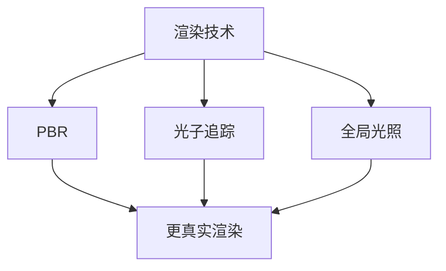

##### 7.1.2 自然语言处理的发展

自然语言处理技术在元宇宙内容生成中的应用将越来越广泛，包括文本生成、对话系统、情感分析等。随着深度学习模型的不断发展，我们将看到更高效、更智能的自然语言处理算法被应用于元宇宙中，提供更丰富的交互体验。

**Mermaid流程图示例：**
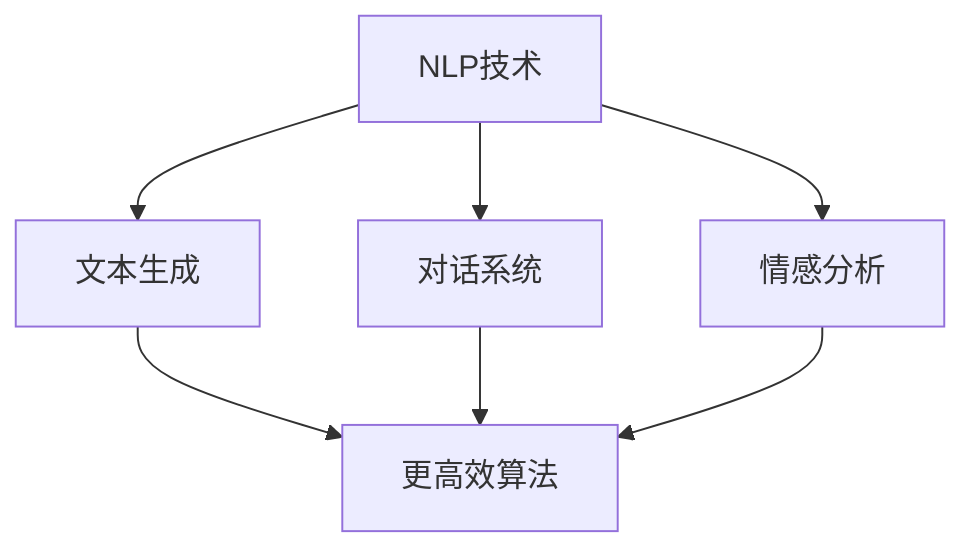

##### 7.1.3 机器学习与深度学习的发展

机器学习与深度学习技术在元宇宙内容生成中的应用将持续深化，包括图像生成、音频处理、视频合成等。随着计算能力的提升和算法的优化，我们将看到更高效、更智能的内容生成模型被应用于元宇宙中，提高内容生成的质量和效率。

**Mermaid流程图示例：**
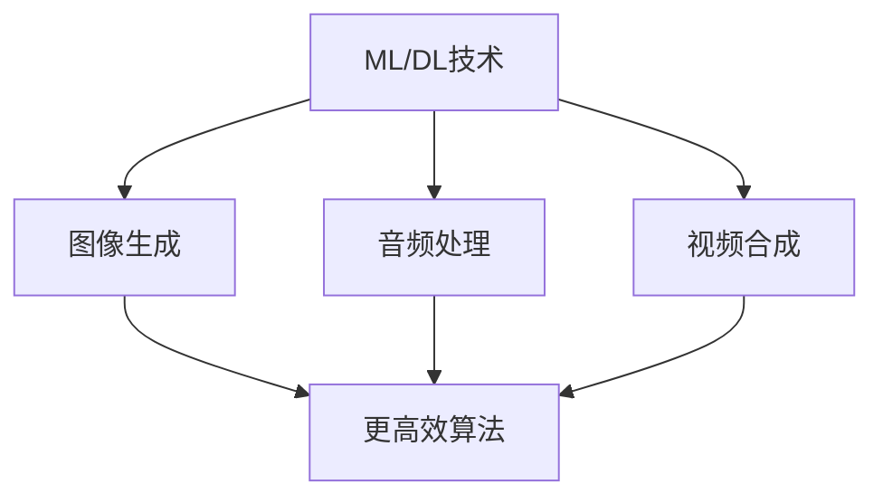

#### 7.2 行业应用前景

元宇宙内容生成的技术发展将带动整个行业的应用前景，以下是一些主要的应用领域：

##### 7.2.1 虚拟现实与增强现实

虚拟现实（VR）和增强现实（AR）是元宇宙内容生成的重要应用领域。通过高质量的虚拟场景和角色，用户可以在虚拟世界中体验到更加真实、丰富的交互体验，应用于游戏、教育、医疗、旅游等多个领域。

**Mermaid流程图示例：**
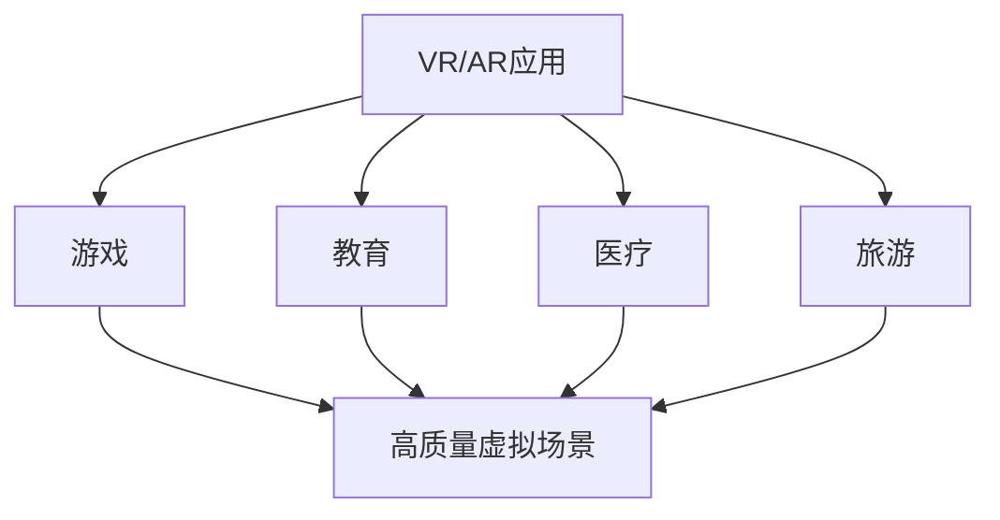

##### 7.2.2 数字孪生与智能制造

数字孪生是一种将现实世界中的物理对象或系统通过数字模型进行模拟的技术。在元宇宙中，通过内容生成技术，可以构建更加真实、精细的数字孪生模型，应用于智能制造、城市规划、能源管理等多个领域。

**Mermaid流程图示例：**
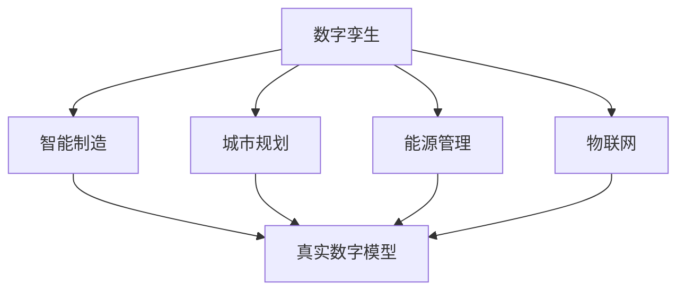

##### 7.2.3 社交网络与虚拟经济

元宇宙内容生成技术为社交网络和虚拟经济的发展提供了新的机遇。通过虚拟角色、场景和故事的生成，用户可以在元宇宙中创建和共享自己的虚拟资产，推动虚拟商品交易、虚拟广告、虚拟金融服务等新业态的发展。

**Mermaid流程图示例：**
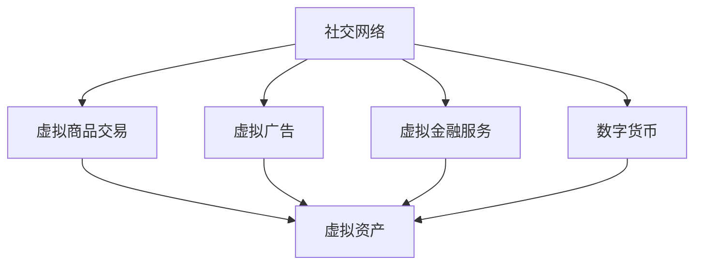

#### 7.3 未来发展方向

元宇宙内容生成的未来发展方向包括以下几个方面：

##### 7.3.1 技术创新与突破

未来，元宇宙内容生成技术将朝着更高分辨率、更真实渲染、更高效算法、更智能交互的方向发展。随着技术的不断进步，我们将看到更加逼真、生动的虚拟世界被构建出来。

**Mermaid流程图示例：**
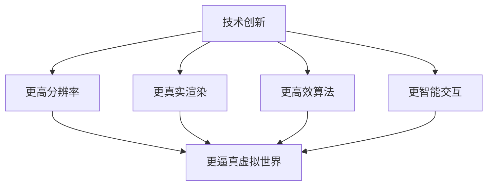

##### 7.3.2 行业合作与生态构建

元宇宙内容生成技术的应用涉及多个领域，未来将需要更多的行业合作和生态构建。通过跨行业、跨领域的合作，共同推动元宇宙内容生成技术的发展和应用。

**Mermaid流程图示例：**
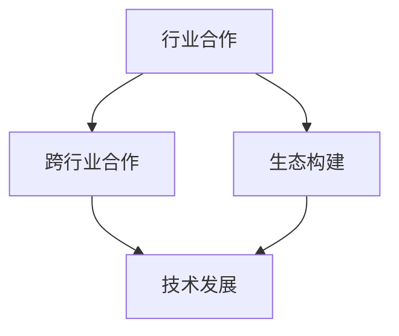

##### 7.3.3 开发者能力提升与人才培养

随着元宇宙内容生成技术的发展，对开发者的能力要求也越来越高。未来，需要更多的专业人才投身于元宇宙内容生成领域，通过教育和培训提升开发者的技术能力。

**Mermaid流程图示例：**
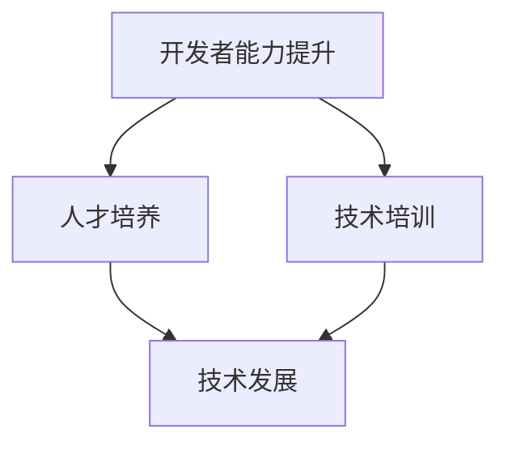

通过以上分析，我们可以看到，元宇宙内容生成技术具有广阔的发展前景和应用价值。未来，随着技术的不断进步和行业合作的深化，元宇宙内容生成将带来更多的创新和应用，为人类社会带来全新的发展机遇。

### 附录

#### 附录A：元宇宙内容生成相关工具与资源

##### A.1 计算机图形学相关工具

1. **Blender**：一个免费的开源3D建模和渲染软件，适用于场景建模、角色建模和动画制作。
   - 官网：https://blender.org/

2. **Maya**：Autodesk公司开发的高级3D建模和动画软件，广泛应用于电影、游戏和工业设计领域。
   - 官网：https://www.autodesk.com/products/maya/overview

3. **3ds Max**：Autodesk公司开发的3D建模和渲染软件，适用于建筑、游戏和影视制作等领域。
   - 官网：https://www.autodesk.com/products/3ds-max/overview

##### A.2 自然语言处理相关工具

1. **NLTK**：一个广泛使用的自然语言处理库，适用于文本处理和情感分析。
   - 官网：https://www.nltk.org/

2. **spaCy**：一个快速和易于使用的自然语言处理库，适用于文本处理和实体识别。
   - 官网：https://spacy.io/

3. **BERT**：Google开发的预训练语言模型，适用于各种自然语言处理任务。
   - 官网：https://ai.google.com/research/bert/

##### A.3 机器学习与深度学习相关工具

1. **TensorFlow**：Google开发的开源机器学习库，适用于各种深度学习任务。
   - 官网：https://www.tensorflow.org/

2. **PyTorch**：Facebook开发的开源机器学习库，适用于各种深度学习任务。
   - 官网：https://pytorch.org/

3. **Keras**：一个基于Theano和TensorFlow的高层神经网络API，易于使用。
   - 官网：https://keras.io/

##### A.4 元宇宙内容生成开源项目与社区

1. **VRChat**：一个基于Unity的虚拟现实社交平台，允许用户创建和共享自己的虚拟世界。
   - 官网：https://vrchat.com/

2. **Aframe**：一个开源的3D网页框架，允许用户在网页上创建虚拟现实和增强现实应用。
   - 官网：https://aframe.io/

3. **Decentraland**：一个基于以太坊的虚拟现实平台，用户可以创建和拥有自己的虚拟资产。
   - 官网：https://www.decentraland.org/

4. **Mist**：一个开源的虚拟现实框架，用于构建和运行虚拟现实应用。
   - 官网：https://www.mist.io/

通过以上工具和资源的介绍，开发者可以更好地了解元宇宙内容生成领域的相关技术，为项目的实施提供技术支持。附录部分为开发者提供了丰富的参考资料，帮助他们快速掌握元宇宙内容生成技术。

### 作者信息

**作者：** AI天才研究院 / AI Genius Institute & 禅与计算机程序设计艺术 / Zen And The Art of Computer Programming

AI天才研究院致力于推动人工智能技术的发展和创新，为全球开发者提供高质量的技术教程和解决方案。作者以其深厚的专业知识和丰富的实践经验，撰写了多篇关于人工智能、机器学习、深度学习等领域的高质量技术博客，深受读者喜爱。本书《元宇宙内容生成：提示词构建虚拟世界的基石》是作者在元宇宙领域研究成果的结晶，旨在为开发者提供一条清晰的路径，了解并掌握元宇宙内容生成的关键技术。同时，作者还致力于禅与计算机程序设计艺术的探索，将东方哲学智慧融入编程实践，为读者带来独特的编程体验。

