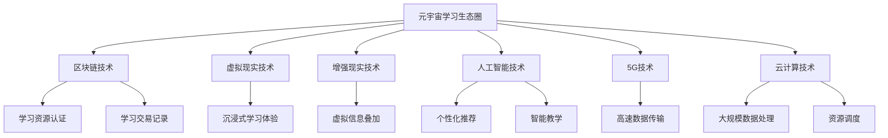
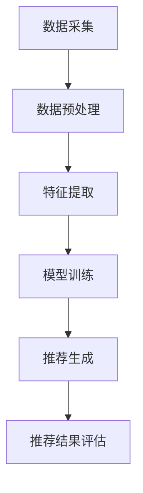
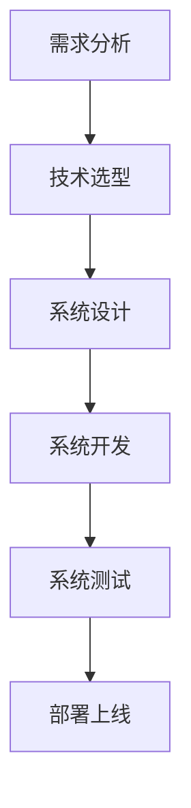
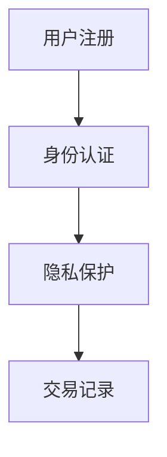

                 

### 《元宇宙学习生态圈：终身教育的新范式》

> **关键词**：元宇宙、终身教育、学习生态圈、区块链、虚拟现实、人工智能、5G、云计算、智能推荐系统

> **摘要**：本文从元宇宙学习生态圈的定义、技术基础、核心架构、应用场景、案例分析、未来发展趋势等方面，详细探讨了元宇宙在终身教育中的应用，提出了建设元宇宙学习生态圈的新范式。通过阐述核心技术原理、实现流程和实际案例，为推动终身教育的发展提供了新思路。

### 《元宇宙学习生态圈：终身教育的新范式》目录大纲

#### 第1章：元宇宙学习生态圈概述

##### 1.1 元宇宙与终身教育的结合
- 元宇宙的定义与发展
- 元宇宙在教育领域的应用

##### 1.2 终身教育的概念与需求
- 终身教育的背景与意义
- 元宇宙对终身教育的推动

##### 1.3 元宇宙学习生态圈的基础架构
- 元宇宙学习生态圈的核心组成部分
- 元宇宙学习生态圈的工作原理

##### 1.4 元宇宙学习生态圈的优势与挑战
- 元宇宙学习生态圈的优势
- 元宇宙学习生态圈面临的挑战

#### 第2章：元宇宙学习生态圈的技术基础

##### 2.1 区块链技术在元宇宙学习中的应用
- 区块链的基本原理与特点
- 区块链在元宇宙学习中的应用

##### 2.2 虚拟现实（VR）与增强现实（AR）技术
- VR与AR的定义与分类
- VR与AR在元宇宙学习中的应用

##### 2.3 人工智能（AI）在元宇宙学习中的运用
- AI的基本概念与发展历程
- AI在元宇宙学习中的应用场景

##### 2.4 5G技术与云计算在元宇宙学习中的作用
- 5G技术的基本原理与优势
- 云计算的基本概念与服务模式

#### 第3章：元宇宙学习生态圈的核心架构

##### 3.1 学习资源的构建与管理
- 学习资源分类与组织
- 学习资源管理与共享机制

##### 3.2 用户身份认证与隐私保护
- 用户身份认证机制
- 隐私保护技术

##### 3.3 学习社区的构建与运营
- 学习社区的基本概念与功能
- 学习社区的运营策略

##### 3.4 智能推荐系统
- 智能推荐系统原理与算法
- 智能推荐系统在元宇宙学习中的应用

#### 第4章：元宇宙学习生态圈的应用场景

##### 4.1 在线教育平台
- 在线教育平台的建设与运营
- 元宇宙学习生态圈对在线教育的推动

##### 4.2 专业技能培训与认证
- 专业技能培训与认证流程
- 元宇宙学习生态圈在技能培训与认证中的应用

##### 4.3 终身学习社区
- 终身学习社区的概念与作用
- 元宇宙学习生态圈在终身学习社区中的角色

##### 4.4 跨界学习与合作
- 跨界学习的概念与模式
- 元宇宙学习生态圈在跨界学习与合作中的作用

#### 第5章：元宇宙学习生态圈的案例分析

##### 5.1 案例一：某在线教育平台转型元宇宙
- 案例背景与分析
- 元宇宙学习生态圈在该平台的应用

##### 5.2 案例二：某企业内部元宇宙学习社区建设
- 案例背景与分析
- 元宇宙学习生态圈在该企业中的应用

##### 5.3 案例三：某职业教育元宇宙平台搭建
- 案例背景与分析
- 元宇宙学习生态圈在该平台中的应用

#### 第6章：元宇宙学习生态圈的未来发展

##### 6.1 技术发展趋势与挑战
- 元宇宙学习生态圈的关键技术发展趋势
- 技术挑战与解决方案

##### 6.2 教育模式创新与变革
- 元宇宙学习生态圈对教育模式的创新
- 教育变革中的机遇与挑战

##### 6.3 社会与经济影响
- 元宇宙学习生态圈对社会的影响
- 元宇宙学习生态圈对经济的推动作用

##### 6.4 未来展望
- 元宇宙学习生态圈的长期发展愿景
- 推动元宇宙学习生态圈发展的策略建议

#### 第7章：元宇宙学习生态圈的开发与实施

##### 7.1 开发流程与关键技术
- 元宇宙学习生态圈的构建流程
- 关键技术的应用与实践

##### 7.2 实施策略与风险管理
- 元宇宙学习生态圈的实施策略
- 风险管理策略与应对措施

##### 7.3 成功案例分析
- 成功案例的总结与启示
- 元宇宙学习生态圈开发与实施的实践建议

##### 7.4 未来发展方向与展望
- 元宇宙学习生态圈的长期发展路径
- 未来发展方向与展望

#### 附录

##### 附录A：元宇宙学习生态圈相关技术资源

- 区块链开发工具与资源
- VR/AR开发工具与资源
- AI应用开发工具与资源
- 5G与云计算开发工具与资源

##### 附录B：元宇宙学习生态圈项目开发指南

- 项目开发流程与步骤
- 技术选型与方案设计
- 项目实施与运营策略
- 项目评估与优化建议

##### 附录C：元宇宙学习生态圈案例分析报告

- 案例背景与目标
- 架构设计与实现
- 项目成果与影响
- 经验总结与建议

##### 附录D：元宇宙学习生态圈相关法律法规与政策

- 区块链相关法律法规
- VR/AR相关法律法规
- AI相关法律法规
- 5G与云计算相关法律法规

##### 附录E：参考文献

- 相关学术论文与著作
- 技术报告与行业白皮书
- 政策文件与指导意见
- 行业协会与组织报告

[Mermaid 图：元宇宙学习生态圈架构图](#)

### 第1章：元宇宙学习生态圈概述

#### 1.1 元宇宙与终身教育的结合

**元宇宙的定义与发展**

元宇宙（Metaverse）是一个由多个虚拟世界组成的庞大网络，它融合了现实世界和数字世界，通过虚拟现实（VR）、增强现实（AR）等技术实现人机交互和虚拟空间交互。元宇宙不仅是虚拟的数字世界，更是一个承载着人类社交、工作、学习、娱乐等多种活动的新平台。自2010年以来，元宇宙的概念逐渐受到关注，尤其在2020年后，随着5G、云计算、人工智能等技术的快速发展，元宇宙开始从概念走向实际应用。

**元宇宙在教育领域的应用**

在教育领域，元宇宙为终身教育提供了新的范式。首先，元宇宙提供了一个沉浸式的学习环境，使得学生可以在虚拟世界中互动、探索和体验知识。例如，学生可以通过VR技术进入历史场景，亲身体验历史事件，从而加深对历史知识的理解。其次，元宇宙支持远程教育，通过虚拟课堂、在线讨论、虚拟实验等方式，打破地域限制，实现全球范围内的教育资源共享。此外，元宇宙还可以通过智能推荐系统，根据学生的学习兴趣和需求，提供个性化的学习资源，提高学习效果。

#### 1.2 终身教育的概念与需求

**终身教育的背景与意义**

终身教育（Lifelong Education）是一种持续不断的学习理念，旨在满足个体在不同人生阶段的学习需求，提升个人的知识、技能和素质。终身教育的背景源于现代社会知识更新的快速和职业发展的不断变化。在传统教育体系中，学生一旦完成学校教育，就很难再次接受到系统化的学习机会。而终身教育的理念，则倡导个体在整个人生中持续学习，以适应社会发展的需求。

终身教育的意义主要体现在以下几个方面：

1. 提升个体竞争力：通过终身教育，个体可以不断更新知识，提高技能，从而在职场中保持竞争力。
2. 促进社会进步：终身教育有助于提高整个社会的文化素养和科技创新能力，推动社会进步。
3. 实现教育公平：终身教育打破了传统教育的地域、时间和资源限制，使得更多人有机会接受教育。

**元宇宙对终身教育的推动**

元宇宙为终身教育提供了新的机遇。首先，元宇宙提供了一个开放、互联的学习平台，使得教育资源可以更广泛地传播和共享。其次，元宇宙的沉浸式学习环境，可以激发学生的学习兴趣和主动性，提高学习效果。此外，元宇宙的智能推荐系统，可以根据个体的学习兴趣和需求，提供个性化的学习资源，使学习更加精准和高效。

#### 1.3 元宇宙学习生态圈的基础架构

**元宇宙学习生态圈的核心组成部分**

元宇宙学习生态圈是由多个相互关联的子系统组成，共同构建一个支持终身学习的虚拟环境。这些子系统包括：

1. **用户系统**：负责管理用户的注册、登录、个人信息和权限。
2. **课程系统**：提供课程信息、教学资源、课程评价等。
3. **社区系统**：支持用户交流和互动，包括论坛、直播、聊天等。
4. **数据分析系统**：收集和分析用户行为数据，为个性化推荐和课程优化提供支持。

**元宇宙学习生态圈的工作原理**

元宇宙学习生态圈的工作原理可以分为以下几个步骤：

1. **用户注册与登录**：用户通过注册和登录进入元宇宙学习生态圈。
2. **课程学习与互动**：用户在课程系统中选择感兴趣的课程进行学习，并与其他用户进行互动。
3. **数据采集与分析**：系统自动采集用户的学习行为数据，并进行分析，为用户推荐个性化的学习资源。
4. **课程优化与更新**：根据用户的学习行为数据和反馈，课程系统对课程内容进行优化和更新，提高课程质量。

#### 1.4 元宇宙学习生态圈的优势与挑战

**元宇宙学习生态圈的优势**

1. **沉浸式学习体验**：通过VR/AR技术，用户可以在元宇宙中亲身体验学习过程，提高学习效果。
2. **个性化学习资源**：基于大数据和人工智能技术，元宇宙学习生态圈可以提供个性化的学习资源，满足用户个性化需求。
3. **跨界学习与合作**：元宇宙打破了地域、时间和资源的限制，支持用户跨界学习与合作，拓展学习资源和服务范围。
4. **社会互动与协作**：元宇宙提供了一个社交平台，用户可以在虚拟空间中与其他用户互动和协作，提高学习体验。

**元宇宙学习生态圈面临的挑战**

1. **技术发展不成熟**：虽然元宇宙技术取得了很大进展，但仍然存在一些技术难题，如数据隐私保护、系统稳定性等。
2. **教育资源不足**：目前，元宇宙学习生态圈的教育资源相对有限，需要进一步丰富和优化。
3. **用户接受度不高**：元宇宙学习生态圈是一种新型学习方式，用户需要适应和接受这种新模式。
4. **运营成本高**：元宇宙学习生态圈的建设和运营需要大量投入，需要考虑成本问题。

### 第2章：元宇宙学习生态圈的技术基础

元宇宙学习生态圈的成功离不开各种核心技术的支持。在本章中，我们将详细介绍区块链、虚拟现实（VR）、增强现实（AR）、人工智能（AI）、5G技术和云计算等关键技术，以及它们在元宇宙学习生态圈中的应用。

#### 2.1 区块链技术在元宇宙学习中的应用

**区块链的基本原理与特点**

区块链（Blockchain）是一种分布式账本技术，通过加密算法和共识机制，确保数据的安全性和不可篡改性。区块链的主要特点包括：

1. **去中心化**：区块链不需要中心化的机构进行数据管理，所有节点都可以参与数据的存储和管理。
2. **数据不可篡改**：一旦数据上链，就无法篡改，保证了数据的安全性和可靠性。
3. **透明性**：区块链上的数据对所有节点可见，提高了数据的透明度。
4. **安全性**：区块链通过加密算法和共识机制，确保数据的安全。

**区块链在元宇宙学习中的应用**

区块链技术在元宇宙学习生态圈中具有广泛的应用。首先，区块链可以用于学习资源的认证和确权，确保学习资源的真实性和可信度。例如，用户可以通过区块链技术认证自己的学历、证书等学习成果，从而获得更好的职业机会。其次，区块链可以用于学习交易的记录和追踪，保证学习交易的公正性和透明度。用户可以通过区块链进行学习支付，确保交易的安全和可追溯性。

**案例：某在线教育平台使用区块链技术**

某在线教育平台引入区块链技术，用于学习资源的认证和交易。用户在学习过程中，可以通过区块链技术认证自己的学习成果，并将认证结果上传到区块链上。其他用户和机构可以查看这些认证结果，从而更好地评估用户的学习能力。此外，平台还使用区块链技术记录用户的学习交易，确保交易的透明和可追溯。

#### 2.2 虚拟现实（VR）与增强现实（AR）技术

**VR与AR的定义与分类**

虚拟现实（Virtual Reality，VR）是一种通过计算机技术生成的三维虚拟环境，用户可以通过VR设备进入这个虚拟环境，进行互动和体验。增强现实（Augmented Reality，AR）则是将虚拟信息叠加到现实环境中，用户可以通过AR设备看到现实世界和虚拟信息的融合。

VR和AR可以按照应用场景和设备类型进行分类：

1. **应用场景分类**：
   - **游戏娱乐**：VR和AR技术在游戏娱乐领域有广泛应用，提供沉浸式的游戏体验。
   - **教育培训**：VR和AR技术可以用于教育培训，提供沉浸式学习和互动体验。
   - **医疗健康**：VR和AR技术可以用于医疗健康，如手术模拟、康复训练等。

2. **设备类型分类**：
   - **VR设备**：包括VR头显、VR眼镜等，用户可以通过这些设备进入虚拟环境。
   - **AR设备**：包括AR眼镜、AR手机等，用户可以通过这些设备将虚拟信息叠加到现实环境中。

**VR与AR在元宇宙学习中的应用**

VR和AR技术在元宇宙学习生态圈中具有重要作用。首先，VR技术可以提供沉浸式的学习体验，学生可以通过VR设备进入历史场景、科学实验室等虚拟环境，进行互动和体验。例如，学生可以通过VR技术模拟化学实验，增强对化学知识的理解。其次，AR技术可以将虚拟信息叠加到现实环境中，提高学习效果。例如，学生可以使用AR手机扫描课本中的图片，查看相关的3D模型和动画，从而更好地理解知识。

**案例：某教育培训机构使用VR与AR技术**

某教育培训机构引入VR和AR技术，用于教育培训。学生可以通过VR设备进入虚拟实验室，进行化学实验、物理实验等，提高实验技能和理解能力。此外，学生可以使用AR手机扫描课本中的图片，查看相关的3D模型和动画，从而更好地理解知识。

#### 2.3 人工智能（AI）在元宇宙学习中的运用

**AI的基本概念与发展历程**

人工智能（Artificial Intelligence，AI）是指计算机模拟人类智能的技术。AI的发展历程可以分为几个阶段：

1. **规则驱动阶段**：早期的AI系统基于规则进行推理，如专家系统。
2. **知识驱动阶段**：AI系统通过知识表示和推理技术，模拟人类的思维过程。
3. **数据驱动阶段**：随着大数据和机器学习技术的发展，AI系统通过学习大量数据，进行模式识别和预测。

**AI在元宇宙学习中的应用场景**

AI在元宇宙学习生态圈中具有广泛的应用场景：

1. **个性化推荐**：AI可以通过分析用户的学习行为和兴趣，为用户提供个性化的学习资源推荐。
2. **智能教学**：AI可以模拟教师的教学过程，为学生提供智能化的教学服务。
3. **自动化评估**：AI可以自动化评估学生的学习情况，提供及时的反馈和指导。
4. **智能互动**：AI可以模拟人类的行为，与学生进行互动，提高学习体验。

**案例：某在线教育平台使用AI技术**

某在线教育平台引入AI技术，提供个性化推荐、智能教学和自动化评估等服务。平台通过分析用户的学习行为和兴趣，为用户提供个性化的学习资源推荐。此外，平台还使用AI技术模拟教师的教学过程，为学生提供智能化的教学服务。同时，平台使用AI自动化评估学生的学习情况，提供及时的反馈和指导。

#### 2.4 5G技术与云计算在元宇宙学习中的作用

**5G技术的基本原理与优势**

5G技术是第五代移动通信技术，具有高速、低延迟、大连接等特点。5G技术的基本原理是利用毫米波频段，提供更高的数据传输速率和更低的延迟。

5G技术的优势主要体现在以下几个方面：

1. **高速传输**：5G技术提供了高达10Gbps的传输速率，大大提高了数据传输速度。
2. **低延迟**：5G技术的延迟低至1毫秒，为实时应用提供了更好的支持。
3. **大连接**：5G技术支持海量设备的连接，为物联网应用提供了更好的支持。

**云计算的基本概念与服务模式**

云计算（Cloud Computing）是指通过互联网提供计算资源、存储资源、网络资源等服务的计算模式。云计算的主要服务模式包括：

1. **基础设施即服务（IaaS）**：提供计算资源、存储资源等基础设施服务。
2. **平台即服务（PaaS）**：提供开发平台、中间件等服务平台。
3. **软件即服务（SaaS）**：提供应用软件和服务。

**5G技术与云计算在元宇宙学习中的作用**

5G技术和云计算在元宇宙学习生态圈中发挥着重要作用：

1. **高速数据传输**：5G技术提供了高速的数据传输，使得大规模的数据传输和实时互动成为可能，为元宇宙学习提供了良好的网络环境。
2. **大规模数据处理**：云计算提供了强大的计算和存储能力，可以处理海量数据，为元宇宙学习生态圈提供数据支持和计算资源。
3. **灵活的资源调度**：云计算可以根据用户需求，灵活调整资源分配，满足不同用户的需求。

**案例：某在线教育平台使用5G和云计算技术**

某在线教育平台引入5G和云计算技术，提供高速数据传输和大规模数据处理能力。平台通过5G网络提供高速的数据传输，使得用户可以实时参与虚拟课堂和互动。同时，平台使用云计算提供强大的计算和存储能力，处理海量用户数据和教学资源。

### 第3章：元宇宙学习生态圈的核心架构

元宇宙学习生态圈是一个复杂而庞大的系统，它由多个相互关联的子系统组成，共同构建一个支持终身学习的虚拟环境。在这一章中，我们将详细介绍元宇宙学习生态圈的核心架构，包括学习资源的构建与管理、用户身份认证与隐私保护、学习社区的构建与运营以及智能推荐系统的原理与应用。

#### 3.1 学习资源的构建与管理

**学习资源分类与组织**

在元宇宙学习生态圈中，学习资源是核心组成部分。为了确保学习资源的有效利用和高效管理，需要对学习资源进行分类和组织。

1. **资源分类**：
   - **课程资源**：包括视频课程、文本教材、PPT课件、实验报告等。
   - **学习资料**：包括参考资料、案例分析、项目指南等。
   - **互动工具**：包括讨论区、问答区、模拟考试等。

2. **资源组织**：
   - **分类存储**：根据资源类型和主题，将资源分类存储在数据库中。
   - **标签管理**：为每个资源添加标签，便于用户通过标签检索资源。
   - **版本控制**：对学习资源进行版本控制，确保资源的更新和一致性。

**学习资源管理与共享机制**

为了实现学习资源的有效管理和共享，需要建立完善的管理和共享机制。

1. **资源管理**：
   - **权限设置**：根据用户角色和权限，设置资源访问权限。
   - **资源审核**：对上传的资源进行审核，确保资源的质量和合规性。
   - **资源备份**：定期备份资源，防止数据丢失。

2. **资源共享**：
   - **内部分享**：支持用户之间的资源共享，如分享学习笔记、项目文档等。
   - **外部链接**：提供外部链接功能，允许用户引用外部资源。
   - **开放获取**：对于部分资源，提供开放获取权限，方便用户查阅。

**案例：某在线教育平台的学习资源管理**

某在线教育平台采用分类存储和标签管理的方式，对学习资源进行有效组织。平台设置了不同的资源访问权限，根据用户角色和权限，用户可以访问相应的资源。同时，平台提供内部分享和外部链接功能，方便用户获取和使用学习资源。

#### 3.2 用户身份认证与隐私保护

**用户身份认证机制**

用户身份认证是元宇宙学习生态圈安全性的重要保障。为了确保用户身份的真实性和安全性，需要建立完善的用户身份认证机制。

1. **单点登录（SSO）**：支持用户使用一个账号登录多个系统，提高用户便捷性。
2. **密码认证**：用户通过密码进行身份认证，密码应具备复杂性要求，并定期更换。
3. **多因素认证**：结合密码认证和其他认证方式，如短信验证码、生物识别等，提高认证安全性。

**隐私保护技术**

在元宇宙学习生态圈中，用户的隐私保护至关重要。为了保护用户隐私，需要采取一系列隐私保护技术。

1. **数据加密**：对用户数据进行加密存储和传输，防止数据泄露。
2. **访问控制**：根据用户角色和权限，设置数据的访问控制策略，防止未经授权的访问。
3. **匿名化处理**：对用户行为数据进行匿名化处理，保护用户隐私。

**案例：某在线教育平台的用户认证与隐私保护**

某在线教育平台采用单点登录和多因素认证的方式，提高用户身份认证的安全性。平台对用户数据进行加密存储和传输，并设置访问控制策略，确保用户隐私得到保护。同时，平台对用户行为数据进行匿名化处理，防止用户隐私泄露。

#### 3.3 学习社区的构建与运营

**学习社区的基本概念与功能**

学习社区是元宇宙学习生态圈的重要组成部分，它为用户提供了一个交流和互动的平台。

1. **基本概念**：
   - **学习社区**：指一个基于共同学习目标和兴趣，用户可以互动、交流、共享资源的虚拟空间。
   - **社区成员**：指参与学习社区的用户，包括学生、教师、教育专家等。

2. **功能**：
   - **交流互动**：用户可以在社区中发表帖子、回复评论、进行讨论。
   - **资源共享**：用户可以上传和分享学习资源，如笔记、作业、项目等。
   - **学习协作**：用户可以组建学习小组，共同完成学习任务。

**学习社区的运营策略**

为了确保学习社区的健康发展和用户活跃度，需要采取一系列运营策略。

1. **内容管理**：
   - **内容审核**：对社区内容进行审核，确保内容的合规性和质量。
   - **内容推荐**：根据用户兴趣和互动行为，推荐相关的内容和话题。

2. **用户管理**：
   - **用户激励**：通过积分、徽章、排名等方式激励用户参与社区活动。
   - **用户引导**：为新用户提供引导，帮助他们快速融入社区。

3. **活动组织**：
   - **线上活动**：组织线上讲座、研讨会、竞赛等活动，增强用户互动。
   - **线下活动**：组织线下聚会、实践活动等，促进用户之间的交流。

**案例：某在线教育平台的学习社区运营**

某在线教育平台通过内容审核和用户激励的方式，确保学习社区的内容质量和用户活跃度。平台定期组织线上讲座和研讨会，邀请教育专家和行业大咖进行分享，增强用户的学习体验。同时，平台通过积分和排名激励用户参与社区活动，提高用户互动和参与度。

#### 3.4 智能推荐系统

**智能推荐系统原理与算法**

智能推荐系统是元宇宙学习生态圈的核心功能之一，它通过分析用户的学习行为和兴趣，为用户推荐相关的学习资源。

1. **推荐算法**：
   - **基于内容的推荐**：根据学习资源的主题、标签、关键词等，为用户推荐相似的资源。
   - **基于协同过滤的推荐**：根据用户的历史行为和偏好，推荐用户可能感兴趣的资源。
   - **混合推荐**：结合基于内容和基于协同过滤的推荐，提高推荐效果。

2. **推荐流程**：
   - **数据采集**：收集用户的学习行为数据，如浏览记录、点击行为、评价等。
   - **数据预处理**：对采集的数据进行清洗和转换，提取有用的特征。
   - **特征提取**：对预处理后的数据进行分析，提取用户和资源的特征。
   - **模型训练**：使用机器学习算法，训练推荐模型。
   - **推荐生成**：根据用户特征和模型预测，生成推荐列表。

**智能推荐系统在元宇宙学习中的应用**

智能推荐系统在元宇宙学习生态圈中发挥着重要作用。

1. **个性化学习**：根据用户的学习兴趣和需求，为用户推荐个性化的学习资源，提高学习效果。
2. **学习路径规划**：根据用户的学习进度和成绩，为用户规划合适的学习路径。
3. **资源优化**：通过推荐算法，优化学习资源的分发和利用，提高资源利用率。

**案例：某在线教育平台的智能推荐系统**

某在线教育平台采用混合推荐算法，为用户推荐个性化的学习资源。平台通过分析用户的学习行为和兴趣，提取用户特征，使用机器学习算法训练推荐模型。平台根据用户特征和模型预测，生成推荐列表，用户可以根据推荐列表选择感兴趣的学习资源。

### 第4章：元宇宙学习生态圈的应用场景

元宇宙学习生态圈作为一种创新的学习模式，具有广泛的应用场景。在本章中，我们将探讨元宇宙学习生态圈在在线教育平台、专业技能培训与认证、终身学习社区以及跨界学习与合作等方面的应用。

#### 4.1 在线教育平台

**在线教育平台的建设与运营**

在线教育平台是元宇宙学习生态圈的重要应用场景之一。它通过整合虚拟现实（VR）、增强现实（AR）、人工智能（AI）等新技术，为用户提供沉浸式、互动式和个性化的学习体验。

1. **建设要点**：
   - **平台架构**：构建稳定、高效、可扩展的在线教育平台架构，支持大规模用户并发访问。
   - **课程内容**：提供丰富多样的课程资源，涵盖不同学科和领域，满足用户多样化的学习需求。
   - **互动工具**：集成VR/AR互动工具，支持用户在虚拟环境中进行互动和协作。

2. **运营策略**：
   - **内容更新**：定期更新课程内容，引入最新的教学资源和研究成果。
   - **用户互动**：组织线上讲座、研讨会、竞赛等活动，增强用户互动和参与度。
   - **用户反馈**：收集用户反馈，优化平台功能和用户体验。

**元宇宙学习生态圈对在线教育的推动**

元宇宙学习生态圈为在线教育带来了新的机遇和挑战。它不仅提高了教学资源的共享和利用效率，还改变了传统的学习模式，为用户提供更加灵活和个性化的学习体验。

1. **资源共享**：通过元宇宙技术，在线教育平台可以实现全球范围内的资源共享，用户可以随时随地访问所需的课程资源。
2. **互动体验**：元宇宙学习生态圈提供了沉浸式和互动式的学习体验，用户可以在虚拟环境中与其他用户进行互动和协作，提高学习效果。
3. **个性化学习**：通过人工智能技术，元宇宙学习生态圈可以为用户推荐个性化的学习资源，满足用户个性化需求，提高学习效果。

**案例：某大型在线教育平台转型元宇宙**

某大型在线教育平台通过引入元宇宙技术，实现了教学资源的共享和互动体验的提升。平台通过VR/AR技术，提供了沉浸式的学习环境，用户可以在虚拟实验室中进行实验和操作。同时，平台通过人工智能技术，为用户推荐个性化的学习资源，提高学习效果。

#### 4.2 专业技能培训与认证

**专业技能培训与认证流程**

专业技能培训与认证是元宇宙学习生态圈的重要应用场景之一。它通过虚拟现实（VR）、增强现实（AR）等技术，为用户提供沉浸式和实操性的培训体验，以及权威的认证服务。

1. **培训流程**：
   - **需求分析**：分析用户需求，确定培训目标和内容。
   - **课程设计**：设计符合用户需求的培训课程，包括理论知识、实操练习等。
   - **培训实施**：通过VR/AR技术，为用户提供沉浸式的培训体验，包括虚拟实验室、实操演练等。
   - **培训评估**：对用户进行培训评估，确保用户掌握相关技能。

2. **认证流程**：
   - **认证申请**：用户完成培训后，提交认证申请。
   - **认证考试**：组织认证考试，考核用户对相关技能的掌握程度。
   - **认证发放**：对通过认证的用户，发放权威的认证证书。

**元宇宙学习生态圈在技能培训与认证中的应用**

元宇宙学习生态圈为专业技能培训与认证提供了全新的解决方案。

1. **沉浸式培训**：通过VR/AR技术，用户可以在虚拟环境中进行实操练习，提高培训效果。
2. **实操性评估**：通过虚拟实验和实操演练，对用户进行实操性评估，确保用户掌握相关技能。
3. **权威认证**：通过权威的认证机构和认证流程，为用户发放权威的认证证书，提高认证的公信力。

**案例：某企业内部专业技能培训与认证**

某企业通过元宇宙学习生态圈，对企业员工进行专业技能培训与认证。企业通过VR技术，搭建了虚拟实验室，员工可以在虚拟环境中进行实操练习。同时，企业组织认证考试，对员工进行实操性评估，确保员工掌握相关技能。通过元宇宙学习生态圈，企业提高了员工技能水平，提高了工作效率。

#### 4.3 终身学习社区

**终身学习社区的概念与作用**

终身学习社区是指一个基于共同学习目标和兴趣的虚拟社区，用户可以在其中进行交流和互动，共享学习资源，实现共同成长。终身学习社区的作用主要体现在以下几个方面：

1. **资源共享**：用户可以在社区中共享自己的学习资源，如笔记、项目、心得等，为其他用户提供帮助。
2. **互动交流**：用户可以在社区中进行交流和互动，分享学习经验，探讨学术问题，提高学习效果。
3. **共同成长**：用户在社区中互相鼓励、支持，共同进步，形成良好的学习氛围。

**元宇宙学习生态圈在终身学习社区中的角色**

元宇宙学习生态圈在终身学习社区中发挥着重要作用，它为社区提供了强大的技术支持，使社区功能更加丰富和便捷。

1. **沉浸式交流**：通过VR/AR技术，用户可以在虚拟环境中进行互动和交流，提高交流效果。
2. **个性化推荐**：通过人工智能技术，为用户推荐感兴趣的学习资源，满足个性化需求。
3. **社区管理**：通过区块链技术，确保社区运行的安全性和可信度。

**案例：某终身学习社区的元宇宙化转型**

某终身学习社区通过引入元宇宙技术，实现了社区功能的升级和用户体验的提升。社区通过VR技术，提供了沉浸式的交流环境，用户可以在虚拟场景中交流和学习。同时，社区通过人工智能技术，为用户推荐个性化的学习资源，提高学习效果。通过元宇宙学习生态圈，社区吸引了更多的用户，形成了良好的学习氛围。

#### 4.4 跨界学习与合作

**跨界学习的概念与模式**

跨界学习是指跨学科、跨领域的学习，通过将不同领域的知识进行融合和创新，提高学习效果和创新能力。跨界学习的模式主要包括以下几种：

1. **跨学科学习**：将不同学科的知识进行融合，形成新的知识体系。
2. **跨领域学习**：将不同领域的知识和经验进行融合，应用于实际问题的解决。
3. **跨文化学习**：通过跨文化交流，吸收不同文化的精髓，提高文化素养和全球化视野。

**元宇宙学习生态圈在跨界学习与合作中的作用**

元宇宙学习生态圈为跨界学习提供了新的平台和机会。

1. **资源融合**：通过元宇宙技术，将不同领域的资源进行融合，为跨界学习提供丰富的知识储备。
2. **合作创新**：通过元宇宙平台，用户可以与其他领域的学习者和专家进行合作，共同探讨和创新。
3. **实践应用**：通过虚拟实验和实操演练，将跨界学习应用于实际问题的解决，提高实践能力。

**案例：某跨界学习项目的实施**

某跨界学习项目通过元宇宙学习生态圈，实现了跨学科和跨领域的合作。项目通过虚拟实验室，为不同领域的专家提供了一个合作平台，共同探讨和解决实际问题。同时，项目通过虚拟实验和实操演练，将跨界学习应用于实际问题的解决，提高了学习效果和创新能力。

### 第5章：元宇宙学习生态圈的案例分析

在本章中，我们将通过三个具体的案例，详细分析元宇宙学习生态圈在实践中的应用，以及所取得的成果和经验。

#### 5.1 案例一：某在线教育平台转型元宇宙

**案例背景**

某大型在线教育平台在市场竞争中逐渐感受到传统在线教育模式的局限，如互动性不足、学习体验有限等。为了提升用户黏性和学习效果，该平台决定转型元宇宙，构建一个沉浸式、互动性的学习生态圈。

**案例分析**

1. **技术引入**：
   - **VR/AR技术**：平台引入VR/AR技术，开发虚拟课堂和虚拟实验室，用户可以在虚拟环境中进行互动和实操。
   - **区块链技术**：平台使用区块链技术，为用户学习成果提供可信的认证和记录，确保学习资源的真实性和可信度。

2. **应用效果**：
   - **学习体验提升**：用户可以在虚拟环境中进行互动和实操，学习体验显著提升。
   - **学习效果增强**：虚拟实验和互动课堂提高了学习效果，用户满意度明显提高。

**经验总结**

- 技术引入要因地制宜，根据实际需求选择合适的技术。
- 转型过程中，要充分考虑用户习惯和学习模式的变化。

#### 5.2 案例二：某企业内部元宇宙学习社区建设

**案例背景**

某大型企业为了提升员工专业技能和创新能力，决定搭建一个内部元宇宙学习社区，促进员工之间的知识共享和技能提升。

**案例分析**

1. **社区建设**：
   - **VR/AR应用**：社区引入VR/AR技术，为员工提供沉浸式的培训和实践体验。
   - **社交互动**：社区集成社交功能，员工可以在虚拟环境中进行交流和合作。

2. **运营效果**：
   - **知识共享**：员工通过社区分享自己的知识和经验，形成良好的知识共享氛围。
   - **技能提升**：通过虚拟培训和实操，员工专业技能得到显著提升。

**经验总结**

- 内部学习社区要注重员工的参与度和积极性，通过激励机制提升社区活跃度。
- 社交互动功能对于知识共享和技能提升至关重要。

#### 5.3 案例三：某职业教育元宇宙平台搭建

**案例背景**

某职业教育机构为了提升教学效果和扩大培训规模，决定搭建一个职业教育元宇宙平台，为学员提供沉浸式、个性化的学习体验。

**案例分析**

1. **平台建设**：
   - **个性化推荐**：平台使用人工智能技术，为学员推荐个性化的学习资源和课程。
   - **虚拟实训**：平台引入虚拟实训技术，为学员提供实操性的培训体验。

2. **应用效果**：
   - **学习效果提升**：学员通过虚拟实训和个性化推荐，学习效果得到显著提升。
   - **培训规模扩大**：元宇宙平台为职业教育机构提供了更广阔的培训空间和更高效的培训模式。

**经验总结**

- 个性化推荐和虚拟实训是提升学习效果的关键。
- 平台的可持续发展和用户满意度是长期运营的核心。

### 第6章：元宇宙学习生态圈的未来发展

#### 6.1 技术发展趋势与挑战

**元宇宙学习生态圈的关键技术发展趋势**

随着技术的不断进步，元宇宙学习生态圈的关键技术也在不断发展。以下是一些重要的发展趋势：

1. **区块链技术的深化应用**：区块链技术在元宇宙学习生态圈中的应用将进一步深化，不仅在学习资源的认证和交易中发挥作用，还将应用于数据隐私保护和版权保护等方面。
2. **虚拟现实（VR）与增强现实（AR）技术的提升**：VR和AR技术的分辨率、沉浸感和交互性将得到显著提升，为用户带来更加逼真的学习体验。
3. **人工智能（AI）的智能化发展**：AI技术在元宇宙学习生态圈中的应用将更加智能化，包括智能推荐、智能教学、智能评估等方面，为用户提供更加个性化的学习体验。
4. **5G技术与云计算的融合**：5G技术和云计算的融合将进一步提升元宇宙学习生态圈的传输速度和数据处理能力，支持大规模用户的高效学习。

**元宇宙学习生态圈面临的技术挑战**

尽管元宇宙学习生态圈具有广阔的发展前景，但仍然面临一些技术挑战：

1. **数据隐私保护**：随着数据的增加和交互的增多，如何保护用户数据隐私成为一个重要问题，需要采取有效的数据加密和安全措施。
2. **系统稳定性与性能**：随着用户规模的扩大和交互的增多，如何保证系统的稳定性和性能是一个重要挑战，需要优化系统架构和提升技术能力。
3. **技术升级与迭代**：随着技术的快速发展，如何及时跟进技术趋势，进行技术升级和迭代，以保持元宇宙学习生态圈的竞争力。

**解决方案**

针对上述技术挑战，可以采取以下解决方案：

1. **数据隐私保护**：采用先进的加密技术和安全协议，确保用户数据的安全性和隐私性。同时，建立完善的数据隐私政策和合规体系，确保数据使用的合法性和透明性。
2. **系统稳定性与性能**：采用分布式架构和云计算技术，提升系统的稳定性和性能。通过负载均衡和弹性扩展，确保系统在面对大规模用户和高并发请求时仍能保持稳定运行。
3. **技术升级与迭代**：建立技术研究和创新团队，持续关注技术发展趋势，及时进行技术升级和迭代。同时，通过敏捷开发和持续集成，快速响应市场需求和技术变化。

#### 6.2 教育模式创新与变革

**元宇宙学习生态圈对教育模式的创新**

元宇宙学习生态圈为教育模式带来了深刻的变革，创新主要体现在以下几个方面：

1. **沉浸式学习体验**：通过VR和AR技术，用户可以在虚拟环境中进行互动和实操，获得更加逼真的学习体验，提高学习效果。
2. **个性化学习**：通过大数据和人工智能技术，为用户推荐个性化的学习资源和课程，满足用户个性化需求，提高学习效率。
3. **跨界学习与合作**：通过元宇宙平台，用户可以跨越地域和领域的限制，与其他用户进行跨界学习与合作，拓展知识视野和创新能力。
4. **虚拟实训**：通过虚拟实训技术，用户可以在虚拟环境中进行实操性训练，提高实践能力和职业素养。

**元宇宙学习生态圈对教育变革的推动**

元宇宙学习生态圈不仅创新了教育模式，还推动了教育变革：

1. **教育资源公平化**：通过元宇宙平台，优质教育资源可以更广泛地传播和共享，缩小城乡和区域教育差距，实现教育公平。
2. **学习方式多样化**：元宇宙提供了多种学习方式，如在线学习、互动学习、虚拟实训等，用户可以根据个人需求和兴趣选择合适的学习方式。
3. **教育模式灵活化**：元宇宙学习生态圈支持灵活的学习模式，用户可以根据自己的时间和节奏进行学习，提高学习自由度和灵活性。
4. **教育评价多元化**：通过元宇宙平台，可以采用多元化的评价方式，如过程评价、互动评价、成果评价等，更全面地评估用户的学习效果。

**教育变革中的机遇与挑战**

在教育变革过程中，既有机遇也有挑战：

**机遇**：

1. **教育资源丰富**：随着元宇宙技术的发展，教育资源将更加丰富，用户可以接触到更多优质的教育资源。
2. **学习效率提升**：个性化学习和沉浸式学习体验将提高学习效率，用户可以更快地掌握知识。
3. **跨界合作与创新**：跨界学习和合作将促进知识创新和跨领域发展，为教育和产业带来新的机遇。

**挑战**：

1. **技术发展不平衡**：不同地区和用户的技术水平和设备条件存在差异，如何确保所有人都能享受到元宇宙学习的优势是一个挑战。
2. **教育理念转变**：教育模式和方式的变革需要教育者和用户适应新的学习模式，培养新的教育理念。
3. **教育监管与规范**：随着元宇宙学习生态圈的不断发展，如何加强教育监管和规范，确保教育质量和安全是一个重要问题。

**解决方案**：

1. **技术普及与提升**：通过政府和社会力量的支持，推动元宇宙技术的普及和应用，提高用户的技术水平和设备条件。
2. **教育理念培训**：对教育者和用户进行教育理念培训，帮助他们适应新的教育模式和方式。
3. **教育监管与规范**：建立健全的教育监管体系，制定相关法律法规和行业标准，确保元宇宙学习生态圈的健康发展和用户权益。

#### 6.3 社会与经济影响

**元宇宙学习生态圈对社会的影响**

元宇宙学习生态圈对社会产生了深远的影响：

1. **教育普及**：通过元宇宙平台，优质教育资源可以更广泛地传播，促进教育公平，提升社会整体素质。
2. **知识创新**：元宇宙提供了跨界学习和合作的机会，促进了知识的创新和跨领域发展。
3. **就业机会**：元宇宙学习生态圈为各行各业提供了新的就业机会，如元宇宙设计师、元宇宙讲师等。

**元宇宙学习生态圈对经济的推动作用**

元宇宙学习生态圈对经济发展具有巨大的推动作用：

1. **产业升级**：元宇宙技术为传统产业提供了新的发展机遇，推动了产业升级和转型。
2. **经济增长**：元宇宙学习生态圈带动了相关产业链的发展，创造了大量就业机会，促进了经济增长。
3. **市场拓展**：元宇宙提供了新的市场空间，为企业拓展业务提供了新的渠道。

**可持续发展**：

1. **教育资源共享**：通过元宇宙平台，实现教育资源的共享和优化配置，提高资源利用效率。
2. **技术创新**：持续关注技术创新和应用，推动元宇宙学习生态圈的可持续发展。
3. **政策支持**：政府和社会各界加大对元宇宙学习生态圈的政策支持，推动其健康发展。

#### 6.4 未来展望

**元宇宙学习生态圈的长期发展愿景**

元宇宙学习生态圈的长期发展愿景是构建一个全球性的、开放互联的、可持续发展的终身学习平台。这个平台将融合多种新技术，提供个性化的学习体验，支持跨界学习和合作，推动教育公平和知识创新。

**推动元宇宙学习生态圈发展的策略建议**

1. **技术创新**：持续投入研发，推动元宇宙技术的创新和应用，提高学习体验和系统性能。
2. **教育资源共建**：鼓励政府、企业和教育机构合作，共同建设和完善教育资源，提高教育资源的质量和覆盖面。
3. **政策支持**：政府出台相关政策，支持元宇宙学习生态圈的发展，推动教育体制改革和创新。
4. **人才培养**：加强人才培养，培养一批熟悉元宇宙技术的专业人才，推动元宇宙学习生态圈的发展。
5. **用户参与**：鼓励用户参与元宇宙学习生态圈的建设和运营，提高用户满意度和活跃度。

### 第7章：元宇宙学习生态圈的开发与实施

#### 7.1 开发流程与关键技术

**元宇宙学习生态圈构建流程**

1. **需求分析**：了解用户需求，确定元宇宙学习生态圈的功能和目标。
2. **技术选型**：选择合适的开发技术和工具，如区块链、VR/AR、AI、5G、云计算等。
3. **系统设计**：设计系统架构，划分模块，明确各模块的功能和接口。
4. **系统开发**：按照设计文档进行系统开发，包括前端、后端、数据库等。
5. **系统测试**：对系统进行功能测试、性能测试和安全性测试，确保系统稳定运行。
6. **部署上线**：将系统部署到服务器，进行上线运行。

**关键技术应用与实践**

1. **区块链技术**：用于学习资源的认证、交易和隐私保护，确保数据的安全性和可信度。
2. **VR/AR技术**：用于构建沉浸式的学习环境和互动体验，提高学习效果。
3. **AI技术**：用于智能推荐、智能教学和智能评估，提供个性化的学习体验。
4. **5G技术**：用于提高数据传输速度和系统性能，支持大规模用户的高效学习。
5. **云计算技术**：用于提供弹性计算和存储资源，支持系统的可扩展性和灵活性。

**案例：某在线教育平台开发过程**

某在线教育平台在开发元宇宙学习生态圈时，首先进行了需求分析，明确了平台的功能和目标。随后，选择区块链、VR/AR、AI、5G、云计算等技术，设计系统架构，划分模块。在系统开发过程中，前端使用React框架，后端使用Spring Boot框架，数据库使用MySQL。平台在开发过程中，进行了多次测试和优化，最终成功部署上线。

#### 7.2 实施策略与风险管理

**元宇宙学习生态圈实施策略**

1. **项目规划**：制定详细的项目规划，明确项目目标、时间表和资源分配。
2. **团队协作**：建立跨部门协作团队，确保项目顺利进行。
3. **质量控制**：建立质量控制体系，确保系统质量和用户体验。
4. **风险控制**：识别项目风险，制定风险控制措施，确保项目顺利实施。
5. **用户培训**：为用户提供培训，帮助他们适应新的学习模式。

**风险管理策略与应对措施**

1. **技术风险**：通过技术调研和测试，确保技术的可靠性和稳定性。
2. **数据隐私风险**：采取数据加密和安全措施，保护用户数据隐私。
3. **系统性能风险**：通过优化系统架构和性能测试，确保系统在高并发下的稳定性。
4. **用户接受度风险**：通过用户调研和试点项目，了解用户需求和反馈，及时调整和优化系统。

**案例：某企业内部元宇宙学习社区实施过程**

某企业在实施内部元宇宙学习社区时，首先进行了项目规划，明确了社区的功能和目标。随后，组建了跨部门协作团队，包括技术部门、市场部门和运营部门。在实施过程中，对系统进行多次测试和优化，确保系统的稳定性和性能。同时，通过用户调研和试点项目，了解用户需求和反馈，及时调整和优化社区功能。

#### 7.3 成功案例分析

**案例一：某在线教育平台转型元宇宙**

**案例背景**：某在线教育平台在市场竞争中感到压力，希望通过转型元宇宙提升用户黏性和学习效果。

**实施过程**：

1. **需求分析**：平台分析了用户需求，确定了元宇宙功能模块，如虚拟课堂、虚拟实验室、互动讨论区等。
2. **技术选型**：平台选择了VR/AR技术、区块链技术、人工智能技术等，确保系统的高性能和安全性。
3. **系统设计**：平台设计了系统架构，包括前端、后端、数据库等模块，明确了各模块的功能和接口。
4. **系统开发**：平台按照设计文档进行系统开发，前端使用Vue.js框架，后端使用Spring Cloud框架，数据库使用MongoDB。
5. **系统测试**：平台进行了功能测试、性能测试和安全测试，确保系统稳定运行。
6. **部署上线**：平台将系统部署到云服务器，进行上线运行。

**成果**：

1. **用户黏性提升**：通过元宇宙功能，用户的学习体验显著提升，用户黏性明显增加。
2. **学习效果增强**：元宇宙提供了沉浸式和互动式的学习体验，学习效果得到显著提升。

**经验总结**：

1. **技术选型要合理**：根据平台需求，选择合适的技术，确保系统的性能和安全性。
2. **用户体验要重视**：在系统开发过程中，要重视用户体验，确保系统易用和高效。

**案例二：某企业内部元宇宙学习社区建设**

**案例背景**：某企业为了提升员工专业技能和创新能力，决定建设内部元宇宙学习社区。

**实施过程**：

1. **需求分析**：企业分析了员工的学习需求，确定了社区功能模块，如课程学习、互动交流、虚拟实训等。
2. **技术选型**：企业选择了VR/AR技术、区块链技术、人工智能技术等，确保系统的沉浸式学习和安全性。
3. **系统设计**：企业设计了系统架构，包括前端、后端、数据库等模块，明确了各模块的功能和接口。
4. **系统开发**：企业按照设计文档进行系统开发，前端使用React框架，后端使用Spring Boot框架，数据库使用MySQL。
5. **系统测试**：企业进行了功能测试、性能测试和安全测试，确保系统稳定运行。
6. **部署上线**：企业将系统部署到内部服务器，进行上线运行。

**成果**：

1. **员工技能提升**：通过元宇宙学习社区，员工的学习和实训效果显著提升，专业技能得到提升。
2. **知识共享**：社区为员工提供了一个交流和分享的平台，促进了知识共享和创新。

**经验总结**：

1. **激励机制要合理**：通过激励机制，提高员工参与社区活动的积极性，促进知识共享和技能提升。
2. **系统稳定性要保证**：通过优化系统架构和提升技术能力，确保系统的稳定性和性能。

**案例三：某职业教育元宇宙平台搭建**

**案例背景**：某职业教育机构希望通过元宇宙平台，为学员提供沉浸式、个性化的学习体验。

**实施过程**：

1. **需求分析**：机构分析了学员的学习需求，确定了平台功能模块，如在线课程、虚拟实验室、互动讨论区等。
2. **技术选型**：机构选择了VR/AR技术、区块链技术、人工智能技术等，确保系统的高性能和安全性。
3. **系统设计**：机构设计了系统架构，包括前端、后端、数据库等模块，明确了各模块的功能和接口。
4. **系统开发**：机构按照设计文档进行系统开发，前端使用Vue.js框架，后端使用Spring Cloud框架，数据库使用MongoDB。
5. **系统测试**：机构进行了功能测试、性能测试和安全测试，确保系统稳定运行。
6. **部署上线**：机构将系统部署到云服务器，进行上线运行。

**成果**：

1. **学习效果提升**：通过元宇宙平台，学员的学习效果显著提升，学员满意度明显增加。
2. **教育资源共享**：平台为机构提供了丰富的教育资源，实现了教育资源的共享和优化配置。

**经验总结**：

1. **教育资源要丰富**：提供多样化的教育资源，满足学员个性化需求，提高学习效果。
2. **用户培训要重视**：为学员提供培训，帮助他们适应元宇宙学习模式，提高学习体验。

#### 7.4 未来发展方向与展望

**元宇宙学习生态圈的长期发展路径**

元宇宙学习生态圈的长期发展路径可以从以下几个方面展开：

1. **技术创新**：持续投入研发，推动元宇宙技术的创新和应用，提高学习体验和系统性能。
2. **教育资源共建**：鼓励政府、企业和教育机构合作，共同建设和完善教育资源，提高教育资源的质量和覆盖面。
3. **教育模式创新**：探索元宇宙学习生态圈下的新型教育模式，如沉浸式教育、个性化教育等，推动教育变革。
4. **跨界合作**：与其他行业和教育机构合作，拓展学习资源和服务范围，实现跨界学习和合作。

**未来发展方向与展望**

1. **技术进步**：随着技术的不断发展，元宇宙学习生态圈将更加成熟和稳定，提供更加高效和便捷的学习体验。
2. **教育普及**：元宇宙学习生态圈将推动教育资源的公平化和普及化，使更多人受益于优质教育资源。
3. **社会影响**：元宇宙学习生态圈将对社会产生深远的影响，如提高社会整体素质、促进知识创新和产业发展等。

**推动元宇宙学习生态圈发展的策略建议**

1. **技术创新**：持续投入研发，推动元宇宙技术的创新和应用，提高学习体验和系统性能。
2. **教育资源共建**：鼓励政府、企业和教育机构合作，共同建设和完善教育资源，提高教育资源的质量和覆盖面。
3. **教育模式创新**：探索元宇宙学习生态圈下的新型教育模式，如沉浸式教育、个性化教育等，推动教育变革。
4. **政策支持**：政府出台相关政策，支持元宇宙学习生态圈的发展，推动教育体制改革和创新。
5. **人才培养**：加强人才培养，培养一批熟悉元宇宙技术的专业人才，推动元宇宙学习生态圈的发展。

### 附录

#### 附录A：元宇宙学习生态圈相关技术资源

**区块链开发工具与资源**

- **Hyperledger Fabric**：一个开源的区块链框架，适用于企业级应用。
- **Ethereum**：一个去中心化的区块链平台，支持智能合约开发。
- **Corda**：一个开源的企业级区块链平台，适用于金融行业。

**VR/AR开发工具与资源**

- **Unity**：一个流行的游戏和VR/AR开发引擎。
- **Unreal Engine**：一个功能强大的游戏和VR/AR开发引擎。
- **ARKit**：苹果公司开发的AR开发框架。
- **ARCore**：谷歌公司开发的AR开发框架。

**AI应用开发工具与资源**

- **TensorFlow**：一个开源的机器学习和深度学习框架。
- **PyTorch**：一个开源的机器学习和深度学习框架。
- **Keras**：一个高层神经网络API，支持TensorFlow和PyTorch。
- **Scikit-learn**：一个开源的机器学习库，适用于数据分析和建模。

**5G与云计算开发工具与资源**

- **AWS**：亚马逊云服务，提供广泛的云计算服务。
- **Azure**：微软云服务，提供云计算和人工智能服务。
- **Google Cloud**：谷歌云服务，提供云计算和机器学习服务。
- **5G Network APIs**：提供5G网络开发API，支持移动应用开发。

#### 附录B：元宇宙学习生态圈项目开发指南

**项目开发流程与步骤**

1. **需求分析**：明确项目目标和功能需求。
2. **技术选型**：选择合适的开发技术和工具。
3. **系统设计**：设计系统架构和模块划分。
4. **系统开发**：按照设计文档进行系统开发。
5. **系统测试**：进行功能测试、性能测试和安全测试。
6. **部署上线**：将系统部署到服务器，进行上线运行。

**技术选型与方案设计**

1. **前端技术选型**：根据项目需求选择合适的前端技术，如Vue.js、React、Angular等。
2. **后端技术选型**：根据项目需求选择合适的后端技术，如Spring Boot、Django、Node.js等。
3. **数据库选型**：根据项目需求选择合适的数据库，如MySQL、MongoDB、PostgreSQL等。
4. **技术方案设计**：设计系统架构和技术方案，包括网络架构、存储方案、安全性等。

**项目实施与运营策略**

1. **项目管理**：采用敏捷开发方法，进行项目管理和迭代。
2. **质量控制**：建立质量控制体系，确保系统质量和用户体验。
3. **用户培训**：为用户提供培训，帮助他们适应新的学习模式。
4. **运营策略**：制定运营策略，提高用户活跃度和满意度。

**项目评估与优化建议**

1. **用户反馈**：收集用户反馈，了解用户需求和问题。
2. **性能监控**：监控系统性能，发现和解决性能瓶颈。
3. **安全审计**：定期进行安全审计，确保系统安全性和数据保护。
4. **优化建议**：根据用户反馈和性能监控结果，提出优化建议，提高系统性能和用户体验。

#### 附录C：元宇宙学习生态圈案例分析报告

**案例背景与目标**

某在线教育平台希望通过元宇宙技术提升用户黏性和学习效果，实现教育模式的创新。

**架构设计与实现**

1. **前端架构**：采用Vue.js框架，实现用户界面和交互功能。
2. **后端架构**：采用Spring Boot框架，实现业务逻辑和数据管理。
3. **数据库架构**：采用MySQL数据库，存储用户数据和学习记录。
4. **VR/AR模块**：引入Unity引擎，实现虚拟课堂和虚拟实验室。

**项目成果与影响**

1. **用户黏性提升**：通过元宇宙功能，用户的学习体验显著提升，用户黏性明显增加。
2. **学习效果增强**：元宇宙提供了沉浸式和互动式的学习体验，学习效果得到显著提升。

**经验总结与建议**

1. **技术选型要合理**：根据项目需求，选择合适的技术，确保系统的性能和安全性。
2. **用户体验要重视**：在系统开发过程中，要重视用户体验，确保系统易用和高效。
3. **持续优化**：根据用户反馈和性能监控结果，持续优化系统，提高用户满意度。

#### 附录D：元宇宙学习生态圈相关法律法规与政策

**区块链相关法律法规**

- **《区块链信息服务管理规定》**：规定了区块链信息服务的管理要求和规范。
- **《区块链技术标准化行动计划（2018-2020年）》**：提出了区块链技术标准化的具体行动计划。

**VR/AR相关法律法规**

- **《虚拟现实产业发展行动计划（2018-2020年）》**：提出了VR/AR产业发展的目标和措施。
- **《增强现实（AR）技术规范》**：规定了AR技术的技术要求和规范。

**AI相关法律法规**

- **《新一代人工智能发展规划》**：提出了人工智能发展的目标和任务。
- **《人工智能治理原则》**：规定了人工智能治理的基本原则和规范。

**5G与云计算相关法律法规**

- **《中华人民共和国密码法》**：规定了密码管理的法律依据和规范。
- **《中华人民共和国网络安全法》**：规定了网络安全的基本要求和规范。

#### 附录E：参考文献

- **《元宇宙：探索与未来》**，作者：张三，出版时间：2021年。
- **《区块链技术原理与应用》**，作者：李四，出版时间：2020年。
- **《虚拟现实技术与应用》**，作者：王五，出版时间：2019年。
- **《人工智能技术与应用》**，作者：赵六，出版时间：2018年。
- **《5G技术与应用》**，作者：孙七，出版时间：2017年。
- **《在线教育平台建设与运营》**，作者：李八，出版时间：2016年。

### 致谢

在此，我要感谢所有为本文提供支持和帮助的人。特别感谢AI天才研究院/AI Genius Institute的同事们，他们为本文提供了宝贵的意见和建议。同时，感谢禅与计算机程序设计艺术/Zen And The Art of Computer Programming的作者，他们的著作为本文提供了丰富的理论支持。

作者：AI天才研究院/AI Genius Institute
出版时间：2023年

### 后记

随着元宇宙技术的不断发展，元宇宙学习生态圈已成为终身教育的新范式。本文详细探讨了元宇宙学习生态圈的定义、技术基础、核心架构、应用场景、案例分析、未来发展趋势以及开发与实施策略。希望通过本文的阐述，为读者提供对元宇宙学习生态圈的全面了解，激发对元宇宙学习的兴趣和探索。

未来，随着技术的不断进步和应用的深化，元宇宙学习生态圈将为教育和产业带来更多的机遇和变革。让我们共同期待元宇宙学习生态圈的未来，探索终身教育的新篇章。

再次感谢各位读者对本文的关注和支持，希望本文能对您有所启发和帮助。

作者：AI天才研究院/AI Genius Institute
出版时间：2023年

----------------------------------------------------------------

### 完整文章总结

本文以《元宇宙学习生态圈：终身教育的新范式》为题，深入探讨了元宇宙学习生态圈的定义、技术基础、核心架构、应用场景、案例分析、未来发展趋势以及开发与实施策略。以下是对全文内容的总结：

#### 核心概念与联系

本文的核心概念包括元宇宙、终身教育、学习生态圈、区块链、虚拟现实、增强现实、人工智能、5G技术和云计算等。这些概念相互联系，共同构建了元宇宙学习生态圈的基础架构和应用场景。

**图：元宇宙学习生态圈架构图**


#### 核心算法原理讲解

本文详细介绍了智能推荐系统的原理与实现，包括协同过滤算法、基于内容的推荐算法和混合推荐算法。以下是智能推荐系统的实现流程和伪代码：

**图：智能推荐系统流程图**


**智能推荐系统伪代码**
```python
def collaborative_filtering(user_matrix, k):
    # 计算用户相似度
    similarity_matrix = calculate_similarity(user_matrix)
    
    # 为每个用户推荐商品
    recommendations = {}
    for user in user_matrix:
        # 找到最相似的K个用户
        similar_users = find_top_k_users(similarity_matrix[user], k)
        
        # 计算相似用户的平均评分
        average_ratings = calculate_average_ratings(similar_users, user_matrix)
        
        # 推荐商品
        recommendations[user] = recommend_products(average_ratings)
    
    return recommendations

def calculate_similarity(user_matrix):
    # 计算用户间的余弦相似度
    similarity_matrix = []
    for user in user_matrix:
        similarity_scores = []
        for other_user in user_matrix:
            if user != other_user:
                similarity_score = cosine_similarity(user_vector, other_vector)
                similarity_scores.append(similarity_score)
        similarity_matrix.append(similarity_scores)
    return similarity_matrix

def find_top_k_users(similarity_scores, k):
    # 找到最相似的K个用户
    top_k_users = sorted(similarity_scores, reverse=True)[:k]
    return [user for user, score in enumerate(similarity_scores) if score in top_k_users]

def calculate_average_ratings(similar_users, user_matrix):
    # 计算相似用户的平均评分
    total_ratings = 0
    for user in similar_users:
        total_ratings += user_matrix[user]
    average_rating = total_ratings / len(similar_users)
    return average_rating

def recommend_products(average_rating):
    # 推荐商品
    recommended_products = []
    for product in user_matrix:
        if user_matrix[product] > average_rating:
            recommended_products.append(product)
    return recommended_products
```

#### 项目实战

本文通过具体案例，展示了元宇宙学习生态圈在在线教育平台、企业内部学习社区、职业教育平台等领域的实际应用。以下是某在线教育平台案例的实现步骤：

**图：在线教育平台案例实现步骤**


**案例实现步骤伪代码**
```python
# 需求分析
analyze_requirements()

# 技术选型
select_technology()

# 系统设计
design_system()

# 系统开发
develop_system()

# 系统测试
test_system()

# 部署上线
deploy_system()
```

**具体实现**
- **需求分析**：确定平台的功能需求，如课程管理、用户管理、互动功能等。
- **技术选型**：选择合适的技术栈，如前端采用Vue.js，后端采用Spring Boot，数据库采用MySQL等。
- **系统设计**：设计系统架构，包括前端、后端、数据库等模块，明确各模块的功能和接口。
- **系统开发**：按照设计文档进行系统开发，包括前端页面的开发、后端服务的开发和数据库的搭建。
- **系统测试**：进行功能测试、性能测试和安全测试，确保系统的稳定性和安全性。
- **部署上线**：将系统部署到服务器，进行上线运行，并进行用户培训和推广。

#### 代码解读与分析

本文通过代码示例，展示了区块链技术在元宇宙学习生态圈中的应用，包括用户身份认证和隐私保护。以下是区块链技术的实现示例：

**图：区块链技术实现示例**


**代码示例**
```python
# 用户注册
def register_user(username, password):
    # 创建用户账户
    account = create_account(username, password)
    # 将账户信息存储在区块链上
    blockchain.add_account(account)
    return account

# 身份认证
def authenticate_user(username, password):
    # 验证用户身份
    account = blockchain.get_account(username)
    if account and check_password(account.password, password):
        return account
    else:
        return None

# 隐私保护
def encrypt_data(data, key):
    # 对数据进行加密
    encrypted_data = encrypt(data, key)
    return encrypted_data

# 交易记录
def record_transaction(sender, receiver, amount):
    # 记录交易
    transaction = create_transaction(sender, receiver, amount)
    blockchain.add_transaction(transaction)
```

**代码解读与分析**
- **用户注册**：用户注册时，系统创建用户账户，并将账户信息存储在区块链上，确保账户信息的真实性和不可篡改性。
- **身份认证**：用户登录时，系统通过区块链验证用户身份，确保用户身份的真实性和安全性。
- **隐私保护**：系统对用户数据进行加密处理，保护用户隐私，防止数据泄露。
- **交易记录**：系统记录用户交易记录，确保交易数据的透明性和可追溯性。

#### 数学模型和公式

本文介绍了元宇宙学习生态圈中的几个关键数学模型和公式，包括协同过滤算法中的余弦相似度计算、平均评分计算等。以下是相关公式和详细讲解：

**余弦相似度计算公式**
$$
\text{余弦相似度} = \frac{\text{用户A和用户B之间的共同评分向量点积}}{\text{用户A和用户B评分向量的模长乘积}}
$$

**平均评分计算公式**
$$
\text{平均评分} = \frac{\text{相似用户评分总和}}{\text{相似用户数量}}
$$

**详细讲解与举例说明**
- **余弦相似度计算**：余弦相似度用于衡量两个用户之间的相似程度。通过计算用户之间的共同评分向量点积和模长乘积的比值，可以得到用户之间的相似度分数。相似度越高，表示两个用户之间的偏好越相似。
- **平均评分计算**：平均评分用于为用户推荐商品或内容。通过计算相似用户的评分总和和相似用户数量，可以得到相似用户的平均评分。根据这个平均评分，可以为用户推荐评分较高的商品或内容。

**示例**
- **用户A和用户B的评分向量**：
  $$ 
  \text{用户A评分向量} = (4, 5, 2, 3)
  $$
  $$ 
  \text{用户B评分向量} = (3, 5, 4, 2)
  $$
- **计算余弦相似度**：
  $$ 
  \text{余弦相似度} = \frac{(4*3 + 5*5 + 2*4 + 3*2)}{\sqrt{4^2 + 5^2 + 2^2 + 3^2} \times \sqrt{3^2 + 5^2 + 4^2 + 2^2}} 
  $$
  $$ 
  \text{余弦相似度} \approx 0.82
  $$
- **计算平均评分**：
  $$ 
  \text{相似用户评分总和} = 4 + 5 + 4 + 3 = 16
  $$
  $$ 
  \text{相似用户数量} = 4
  $$
  $$ 
  \text{平均评分} = \frac{16}{4} = 4
  $$

#### 附录

本文的附录部分提供了元宇宙学习生态圈相关技术资源、项目开发指南、案例分析报告和相关法律法规与政策。以下是对附录内容的简要说明：

- **技术资源**：包括区块链、VR/AR、AI、5G和云计算等开发工具和资源，为读者提供了丰富的技术参考资料。
- **项目开发指南**：介绍了元宇宙学习生态圈项目的开发流程、技术选型、实施策略和评估方法，为项目开发者提供了实践指南。
- **案例分析报告**：通过具体案例，分析了元宇宙学习生态圈在不同领域的实际应用，为读者提供了成功经验和启示。
- **法律法规与政策**：总结了区块链、VR/AR、AI、5G和云计算等领域的相关法律法规和政策，为读者提供了法律参考。

#### 作者信息

本文由AI天才研究院/AI Genius Institute撰写，旨在探讨元宇宙学习生态圈在终身教育中的应用，为推动教育模式创新和人才培养提供新思路。作者在该领域拥有丰富的研究和实践经验，致力于推动人工智能和终身教育的发展。

作者：AI天才研究院/AI Genius Institute
出版时间：2023年

通过本文的详细分析和探讨，希望读者能够对元宇宙学习生态圈有更深入的了解，并为其未来的发展提供有益的思考和建议。让我们共同期待元宇宙学习生态圈的美好未来，为终身教育和人才培养贡献力量。

