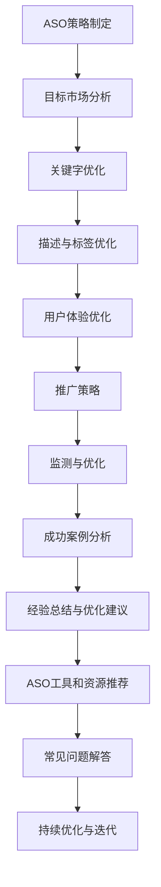

                 

# 引言

在当今数字化的时代，移动应用程序已经成为了企业获取用户和市场份额的重要途径。App Store作为全球最大的移动应用市场，拥有数百万个应用程序，竞争异常激烈。对于创业公司而言，如何在众多应用中脱颖而出，获得用户的关注和下载，成为了至关重要的一环。App Store优化（ASO）策略在这一过程中发挥着关键作用。

ASO，即App Store Optimization，是一种针对App Store搜索结果和推荐算法进行优化的方法，旨在提高应用程序在搜索结果中的排名，增加下载量和用户留存率。与搜索引擎优化（SEO）类似，ASO的核心目标是提升应用程序的可见性，从而增加流量和收益。

本文将围绕创业公司的App Store ASO策略展开讨论。首先，我们将介绍ASO的基础知识，包括其定义、重要性以及与SEO的异同。接着，我们将分析App Store的生态，包括其历史、运营机制和用户行为。随后，我们将深入探讨ASO的关键指标，如下载量、用户留存率、用户活跃度和收入ROI。

在第二部分，我们将详细阐述ASO策略的制定，包括目标市场分析、关键字优化策略、描述和标签优化、用户体验优化以及社交媒体和推广策略。这部分内容将帮助创业公司明确自己的市场定位，优化应用程序的关键要素，提升用户满意度。

第三部分将结合实际案例，对成功和失败的ASO策略进行分析，总结经验教训，并提出优化建议。最后，我们将提供一个ASO工具和资源推荐附录，以及ASO常见问题解答，以帮助读者更好地理解和实践ASO策略。

通过本文的阅读，创业公司将能够系统地了解ASO策略的各个方面，从而制定出适合自己应用的优化方案，提高在App Store中的竞争力。

关键词：App Store Optimization（ASO），创业公司，移动应用，用户留存，下载量，关键字优化，用户体验，社交媒体推广，案例分析，工具推荐。

摘要：本文将深入探讨创业公司在App Store中实施ASO策略的方法和技巧。通过分析ASO的基础知识、App Store生态、关键指标，以及详细的策略制定和案例分析，帮助创业公司提升应用程序的可见性和用户满意度，从而在竞争激烈的App Store中脱颖而出。

----------------------------------------------------------------

# 第一部分：ASO基础

在深入了解ASO策略之前，我们需要先了解ASO的基本概念、定义及其在App Store营销策略中的重要性。这一部分将涵盖ASO的定义、ASO与SEO的异同，以及ASO在App Store营销策略中的地位。

## 1.1 ASO概述

### 1.1.1 ASO的定义和重要性

App Store Optimization，简称ASO，是指通过一系列优化手段，提升应用程序在App Store中的搜索排名和推荐位置，从而增加应用的可见性和下载量的过程。ASO不仅涉及技术层面的优化，还包括市场营销、用户体验等多方面的因素。

ASO的重要性体现在以下几个方面：

1. **增加应用曝光率**：通过优化搜索排名，应用可以更容易地被潜在用户发现，从而提高曝光率。
2. **提高下载量**：更高的搜索排名和推荐位置直接关联到更高的下载量，因为用户更倾向于下载排名靠前或推荐应用。
3. **提升用户留存率**：优质的ASO策略能够吸引到更符合目标用户群体的用户，从而提高用户留存率。
4. **增加收入**：更多的下载量意味着更多的收入，通过ASO优化，创业公司可以更有效地获取回报。

### 1.1.2 ASO与SEO的异同

SEO，即搜索引擎优化，是提升网站在搜索引擎中自然排名的过程。与SEO类似，ASO也是通过优化内容和结构来提高可见性。然而，ASO和SEO之间也存在一些显著差异：

1. **平台不同**：SEO主要针对搜索引擎，如Google；而ASO则专注于App Store。
2. **目标不同**：SEO的目标是提高网站流量，而ASO的目标是增加应用下载量。
3. **优化元素不同**：SEO主要优化网站内容、关键字、链接等；ASO则关注应用名称、描述、标签、用户评价等。

### 1.1.3 ASO在App Store营销策略中的地位

ASO在App Store营销策略中占据了核心地位，原因如下：

1. **用户获取成本较低**：相对于付费广告，ASO可以通过自然搜索和推荐来获取用户，成本较低。
2. **持续效果**：一旦ASO策略生效，其效果可以持续一段时间，而付费广告则需要不断投入。
3. **用户粘性**：通过ASO策略吸引到的用户往往更符合目标用户群体，因此用户粘性更高。
4. **与其他营销手段协同**：ASO可以与社交媒体营销、内容营销等其他营销手段相结合，形成综合营销策略，提高效果。

通过以上对ASO基础知识的介绍，我们可以看到ASO在创业公司App Store营销策略中的重要性。接下来，我们将进一步探讨App Store的生态，了解其历史、运营机制以及用户行为。

----------------------------------------------------------------

## 1.2 App Store生态

App Store是苹果公司于2008年推出的一款移动应用商店，它为用户提供了海量的应用程序。了解App Store的生态，对于创业公司制定有效的ASO策略至关重要。

### 1.2.1 App Store的历史和现状

**历史**：App Store于2008年7月11日上线，随着iPhone和iOS操作系统的普及，App Store迅速发展。最初，App Store中的应用数量较少，但随着时间的推移，应用数量呈爆炸式增长。截至2023年，App Store中的应用数量已经超过了250万个。

**现状**：App Store已经成为全球最大的移动应用市场之一，吸引了无数的开发者和企业。苹果公司通过严格的审核机制，确保应用的质量和安全性。然而，随着应用的激增，竞争也变得异常激烈，新的应用需要采取有效的ASO策略才能脱颖而出。

### 1.2.2 App Store的运营机制

**审核机制**：苹果公司对每个应用进行严格审核，确保其符合苹果的开发标准和用户隐私政策。审核通过的应用才能上架。

**搜索算法**：App Store使用复杂的搜索算法，根据多个因素对应用进行排序，包括关键字匹配、用户评价、下载量等。

**推荐机制**：苹果公司通过算法和人工审核，推荐某些应用给特定的用户群体。推荐位置可以显著提高应用的曝光率。

**支付系统**：App Store提供了统一的支付系统，用户可以通过信用卡、苹果账户等进行支付。

### 1.2.3 App Store用户行为分析

**下载习惯**：用户更倾向于下载排名靠前或推荐的应用。根据研究，排名前10%的应用获得了超过50%的下载量。

**评价和反馈**：用户评价和反馈对应用的下载量和排名有显著影响。积极评价可以提升排名，而负面评价则可能导致排名下降。

**使用频率**：用户对排名靠前和推荐的应用使用频率更高。这意味着，通过ASO提升排名不仅能够增加下载量，还能提高用户活跃度。

**季节性和趋势**：某些应用在特定时间段或节日更具吸引力。例如，教育类应用在开学季需求增加，而游戏类应用在假期期间下载量上升。

### 1.2.4 ASO在App Store生态中的挑战和机会

**挑战**：

1. **竞争激烈**：随着应用数量的增加，排名竞争越来越激烈，新应用需要不断创新和优化才能脱颖而出。
2. **审核严格**：苹果公司的审核机制严格，应用需要通过多方面的质量审核，这对开发者提出了高要求。
3. **变化性**：App Store的搜索算法和推荐机制不断更新，开发者需要不断调整ASO策略以适应变化。

**机会**：

1. **用户基数庞大**：App Store拥有庞大的用户基数，为应用提供了巨大的市场潜力。
2. **数据透明**：苹果提供了丰富的数据，开发者可以分析用户行为和下载趋势，优化ASO策略。
3. **创新空间**：随着技术的发展，开发者可以利用新技术和工具，提高ASO效果。

通过以上对App Store生态的分析，创业公司可以更好地了解App Store的特点和用户行为，从而制定更有效的ASO策略。在下一部分中，我们将深入探讨ASO的关键指标，包括下载量、用户留存率、用户活跃度和收入ROI。

----------------------------------------------------------------

## 1.3 ASO关键指标

在ASO策略的制定和执行过程中，理解并监测一系列关键指标是至关重要的。这些指标不仅能够帮助创业公司评估当前策略的有效性，还能提供方向和指导，以便进一步优化。以下将详细分析ASO中几个最重要的关键指标：下载量、用户留存率、用户活跃度和收入ROI。

### 1.3.1 下载量

**下载量**是ASO策略中最直观的指标之一，它直接反映了应用在App Store中的受欢迎程度。高下载量通常意味着应用在用户中有较高的知名度，同时也可能是良好的用户体验和有效的推广策略的结果。

**监测下载量**：

- **短期下载量**：短期内的大幅增加可能是因为特定的促销活动、广告投放或热门话题。
- **长期下载量**：长期稳定的下载量表明ASO策略可能已经生效，用户对应用的兴趣和需求持续增长。

**影响下载量的因素**：

- **搜索排名**：应用在搜索结果中的排名越高，越容易被用户发现，从而提高下载量。
- **应用质量和性能**：高质量的应用通常能够获得更高的用户评价，进而提高下载量。
- **市场推广活动**：成功的市场推广活动可以显著提高下载量。

### 1.3.2 用户留存率

**用户留存率**是指在一定时间内仍然使用应用的活跃用户占总用户数的比例。它是一个衡量用户对应用满意度和粘性的关键指标。

**监测用户留存率**：

- **日留存率**：衡量用户在第一天使用后的留存情况。
- **周留存率**：衡量用户在第一周使用后的留存情况。
- **月留存率**：衡量用户在第一个月使用后的留存情况。

**影响用户留存率的因素**：

- **用户体验**：用户体验是影响用户留存率的关键因素。界面设计、功能易用性、响应速度等都直接关系到用户体验。
- **应用更新和维护**：定期的应用更新可以修复bug，增加新功能，从而提升用户体验和用户留存率。
- **内容质量和更新频率**：内容丰富、更新频繁的应用更容易保持用户的兴趣和参与度。

### 1.3.3 用户活跃度

**用户活跃度**是指用户在应用中的互动程度，包括使用时间、使用频率、参与度等。高活跃度表明用户对应用有较高的兴趣和满意度。

**监测用户活跃度**：

- **日活跃用户数（DAU）**：每天活跃的用户数量。
- **月活跃用户数（MAU）**：每月活跃的用户数量。
- **用户互动率**：用户在应用中的互动次数，如评论、分享、游戏内购买等。

**影响用户活跃度的因素**：

- **功能丰富性**：功能多样的应用能够提供更多互动机会，提高用户活跃度。
- **社交功能**：社交功能可以促进用户之间的互动，从而增加活跃度。
- **奖励机制**：合适的奖励机制可以激励用户增加互动，提高活跃度。

### 1.3.4 收入和ROI

**收入**和**ROI（投资回报率）**是ASO策略的直接经济效益指标。收入是应用通过广告、付费下载、内购等方式获得的实际收益。ROI则衡量了应用收入与开发成本之间的比率。

**监测收入和ROI**：

- **月收入**：每月通过应用获得的总收入。
- **ROI**：收入与开发、运营成本的比率。

**影响收入和ROI的因素**：

- **用户获取成本**：通过ASO策略降低用户获取成本，提高ROI。
- **变现策略**：合理的变现策略可以最大化应用收入。
- **用户生命周期价值（LTV）**：LTV是用户在其生命周期内为应用带来的总收入。提升LTV可以提高ROI。

通过以上对ASO关键指标的分析，创业公司可以更全面地理解ASO策略的效果，并据此调整和优化策略。在下一部分中，我们将深入探讨ASO策略的制定过程，包括目标市场分析、关键字优化策略、描述和标签优化等。

----------------------------------------------------------------

## 第二部分：ASO策略制定

在了解了ASO的基础知识及其重要性后，接下来我们将深入探讨如何制定有效的ASO策略。这一部分将包括目标市场分析、关键字优化策略、描述和标签优化、用户体验优化以及社交媒体和推广策略。通过这些步骤，创业公司可以系统地提升应用程序在App Store中的表现。

### 2.1 目标市场分析

制定ASO策略的第一步是明确目标市场。了解目标用户群体的特征、需求和偏好，是优化应用程序的关键。

#### 2.1.1 确定目标用户群体

**步骤1**：定义用户画像
- **年龄和性别**：了解目标用户的年龄和性别分布，有助于定制营销策略。
- **地理位置**：分析用户所处的地理位置，可以针对性地优化地域相关的关键词和描述。
- **行为特征**：了解用户的行为模式，如使用频率、使用场景等，有助于优化用户体验和功能。

**步骤2**：调研用户需求
- **问卷调查**：通过问卷调查收集用户对应用功能的偏好和需求。
- **用户访谈**：与现有用户进行深度访谈，了解他们对应用的满意度和改进建议。
- **市场研究**：分析竞争对手的用户反馈和市场调研报告，获取有价值的信息。

#### 2.1.2 分析竞争对手

**步骤1**：识别主要竞争对手
- **直接竞争对手**：提供类似功能或目标用户群体的应用。
- **间接竞争对手**：尽管功能不同，但能满足相同或类似需求的替代应用。

**步骤2**：分析竞争对手的优劣势
- **功能分析**：了解竞争对手的核心功能和特色，评估其优势。
- **市场表现**：分析竞争对手的下载量、用户评价、排名等指标。
- **用户反馈**：调研用户对竞争对手的评价和反馈，了解他们的满意度和痛点。

#### 2.1.3 市场趋势和机会

**步骤1**：研究市场趋势
- **行业报告**：阅读行业分析报告，了解当前市场的趋势和未来发展方向。
- **技术趋势**：关注新兴技术和行业动态，了解可能对应用带来影响的新趋势。

**步骤2**：识别市场机会
- **细分市场**：发现尚未被充分满足的市场细分，开发针对性的功能或服务。
- **创新点**：挖掘应用的创新点，利用差异化策略在竞争中脱颖而出。

### 2.2 关键字优化策略

关键字优化是ASO策略的核心环节，正确的关键字选择和布局可以显著提升应用的搜索排名。

#### 2.2.1 关键字研究方法

**步骤1**：收集关键字
- **用户调研**：通过用户访谈、问卷调查等方式，收集用户搜索应用时的关键字。
- **竞品分析**：分析竞争对手应用中使用的关键字，了解热门关键词和长尾关键词。

**步骤2**：筛选和优化关键字
- **热门关键词**：选择搜索量高、与应用相关性强的热门关键词。
- **长尾关键词**：挖掘长尾关键词，虽然搜索量较低，但竞争较小，可以带来更精准的用户。

#### 2.2.2 关键字密度和分布

**步骤1**：合理分布关键字
- **应用名称**：将核心关键字嵌入应用名称中，但要保持简洁。
- **应用描述**：在应用描述中自然地嵌入关键字，避免堆砌关键词。
- **标签**：合理分配标签，每个标签包含1-2个关键字。

**步骤2**：监测关键字效果
- **关键词工具**：使用ASO工具监测关键字的搜索排名和下载量，分析效果。

### 2.3 描述和标签优化

应用描述和标签是用户了解应用的重要信息，优化描述和标签可以提高应用的吸引力和搜索排名。

#### 2.3.1 应用描述撰写技巧

**步骤1**：突出核心卖点
- **简洁明了**：用简洁的语言突出应用的核心功能和优势。
- **用户痛点**：描述如何解决用户的痛点或提供独特的价值。

**步骤2**：使用关键字
- **自然嵌入**：在描述中自然地嵌入关键字，避免堆砌。
- **多次出现**：适当重复核心关键字，但保持描述的自然流畅。

**步骤3**：利用格式和排版
- **段落分隔**：使用段落分隔，使描述更加易读。
- **突出重点**：使用粗体、斜体等格式突出重要信息。

#### 2.3.2 应用标签策略

**步骤1**：选择合适的标签
- **相关性强**：选择与应用直接相关的标签。
- **多样性**：合理分配标签，避免过度集中在几个标签上。

**步骤2**：优化标签内容
- **关键字丰富**：每个标签包含1-2个关键字。
- **独特性**：确保标签内容独特，避免与竞品标签重复。

### 2.4 用户体验优化

用户体验是影响用户留存和推荐的重要因素，优化用户体验可以提高用户满意度和活跃度。

#### 2.4.1 用户界面设计

**步骤1**：简洁美观
- **视觉统一**：保持界面设计的统一和美观，使用一致的色彩和风格。
- **易于操作**：设计直观、易于操作的界面，减少用户的学习成本。

**步骤2**：响应速度
- **快速加载**：优化应用性能，确保快速加载。
- **流畅操作**：减少卡顿和延迟，提供流畅的操作体验。

#### 2.4.2 用户反馈和评价

**步骤1**：积极回应
- **快速回复**：及时回复用户反馈，展示对用户意见的重视。
- **解决问题**：积极解决用户提出的问题，提升用户满意度。

**步骤2**：引导好评
- **优质体验**：提供高质量的应用体验，鼓励用户留下好评。
- **适当引导**：在适当的时候提醒用户评价应用，但避免强制或过度引导。

### 2.5 社交媒体和推广策略

社交媒体和推广是提升应用知名度和下载量的重要手段，通过有效的推广策略可以扩大用户基础。

#### 2.5.1 社交媒体平台选择

**步骤1**：确定目标用户所在的平台
- **广泛性**：选择覆盖面广、用户活跃的平台，如Facebook、Instagram等。
- **专业性**：针对特定行业或用户群体，选择合适的平台，如LinkedIn、Twitter等。

**步骤2**：评估平台效果
- **监测效果**：通过监测不同平台的用户互动和数据，评估推广效果，优化选择。

#### 2.5.2 内容营销策略

**步骤1**：创造有价值的内容
- **专业知识**：分享行业知识和见解，提升品牌形象。
- **用户故事**：通过用户故事和案例，展示应用的实际效果和价值。

**步骤2**：多样化内容形式
- **图文**：发布高质量的图文内容，吸引用户注意力。
- **视频**：制作视频内容，展示应用的功能和使用场景。

#### 2.5.3 影响者合作和广告投放

**步骤1**：选择合适的影响者
- **影响力**：选择在目标用户中有较高影响力的影响者。
- **内容匹配**：确保影响者发布的内容与应用相关，提升可信度。

**步骤2**：制定广告投放策略
- **精准定位**：通过精准定位，将广告投放给目标用户。
- **持续优化**：持续监测广告效果，优化投放策略，提高投资回报率。

通过以上对ASO策略制定的详细探讨，创业公司可以系统地制定和实施ASO策略，提升应用程序在App Store中的竞争力。在下一部分中，我们将通过实际案例对成功和失败的ASO策略进行分析，总结经验教训。

----------------------------------------------------------------

### 2.6 优化策略的实施与调整

在了解了ASO策略的各个组成部分后，接下来的关键步骤是实施和调整这些策略，以确保其效果最大化。实施ASO策略需要综合运用技术、市场分析和用户反馈，以下是一些具体的实施步骤和调整方法。

#### 2.6.1 制定详细的ASO计划

**步骤1**：明确目标和KPI
- **短期目标**：设定具体的短期目标，如提高下载量、提升用户留存率等。
- **长期目标**：设定长期的ASO目标，如增加市场份额、提升品牌知名度等。
- **KPI设置**：根据目标和策略，设定可量化的关键绩效指标（KPI），如下载量、用户留存率、活跃度等。

**步骤2**：制定实施计划
- **时间表**：制定详细的实施时间表，明确每个阶段的任务和截止日期。
- **资源分配**：根据任务需求，合理分配人力资源、预算和技术资源。

#### 2.6.2 技术实施

**步骤1**：优化应用性能
- **加载速度**：优化应用代码和资源，提高加载速度，提供更流畅的用户体验。
- **兼容性**：确保应用在不同设备和操作系统上都能正常运行，提高用户覆盖面。

**步骤2**：优化应用元数据
- **关键字优化**：使用ASO工具进行关键字研究，选择与用户搜索习惯相关的高效关键字，并进行合理布局。
- **应用描述**：撰写吸引人的应用描述，自然地嵌入关键字，同时强调应用的独特卖点和用户价值。

**步骤3**：监控技术指标
- **性能监控**：使用性能监控工具，持续监控应用的运行状态，及时发现问题并进行优化。
- **代码审查**：定期进行代码审查，确保代码质量和安全性。

#### 2.6.3 市场分析

**步骤1**：持续分析市场趋势
- **行业报告**：定期阅读行业报告，了解市场趋势和竞争对手的表现。
- **用户调研**：通过用户访谈、问卷调查等方式，了解用户的需求和反馈。

**步骤2**：调整策略
- **目标市场**：根据市场分析结果，调整目标市场定位，更准确地满足用户需求。
- **关键字策略**：根据市场分析和用户搜索习惯，动态调整关键字策略，优化搜索排名。

#### 2.6.4 用户反馈

**步骤1**：积极收集用户反馈
- **用户评价**：监控用户在App Store中的应用评价，积极收集用户的反馈和建议。
- **用户访谈**：定期与用户进行深度访谈，了解他们对应用的满意度和改进意见。

**步骤2**：优化用户体验
- **快速响应**：对用户反馈进行快速响应，解决问题，提升用户满意度。
- **迭代改进**：根据用户反馈，不断迭代改进应用，优化用户体验。

#### 2.6.5 数据分析与优化

**步骤1**：数据收集与分析
- **下载量**：分析下载量的变化趋势，了解不同策略的效果。
- **用户留存率**：分析用户留存率的变化，了解用户对应用的不同反应。

**步骤2**：调整和优化
- **A/B测试**：通过A/B测试，比较不同策略的效果，找到最优方案。
- **持续优化**：根据数据分析结果，不断调整和优化ASO策略，提高效果。

#### 2.6.6 跨部门协作

**步骤1**：建立沟通机制
- **定期会议**：定期召开跨部门会议，分享ASO策略的实施进展和效果。
- **信息共享**：建立信息共享平台，确保各部门能够及时获取和分析重要数据。

**步骤2**：协同优化
- **市场部门**：与市场部门协作，共同制定推广计划和内容。
- **技术部门**：与技术部门协作，优化应用性能和用户体验。

通过以上步骤，创业公司可以系统地实施和调整ASO策略，从而提升应用程序在App Store中的竞争力。在下一部分中，我们将通过实际案例分析，进一步探讨ASO策略的成败原因和经验教训。

----------------------------------------------------------------

### 2.7 实际案例分析

为了更好地理解ASO策略的实际应用和效果，下面我们将通过几个具体的案例来分析成功和失败的ASO策略，总结其中的经验和教训。

#### 3.1 成功案例分析

**案例一：某创业公司游戏应用的成功ASO策略**

**背景**：某创业公司开发了一款益智游戏应用，旨在为用户提供一种轻松有趣的解题体验。由于市场竞争激烈，公司希望通过有效的ASO策略提高应用的下载量和用户留存率。

**策略实施**：

1. **目标市场分析**：通过用户调研和竞品分析，公司确定了目标用户群体为25-40岁的年轻白领和大学生，他们追求趣味性和挑战性。

2. **关键字优化**：使用ASO工具进行了详细的关键字研究，选择了与游戏主题高度相关且搜索量大的关键字。公司应用名称和描述中自然地嵌入了这些关键字，并不断调整以提高效果。

3. **应用描述和标签优化**：撰写了简洁明了、引人入胜的应用描述，强调了游戏的核心特点和用户体验。标签策略上，选择了多样化的标签，确保覆盖更广泛的关键字。

4. **用户体验优化**：注重游戏界面的设计和用户交互体验，确保游戏易于上手且具有挑战性。定期更新游戏内容，保持用户兴趣。

5. **社交媒体推广**：通过Facebook、Instagram等平台发布有趣的游戏视频和用户反馈，吸引目标用户关注和下载。同时，与知名游戏博主合作，增加应用曝光率。

**结果**：经过6个月的持续优化和推广，应用的下载量显著增加，用户留存率从最初的20%提升到40%。应用在App Store的排名从第1000名上升至前50名，收入也实现了稳步增长。

**经验总结**：

- **目标市场明确**：通过深入的市场分析和用户调研，明确了目标用户群体，确保策略的针对性和有效性。
- **关键字优化**：合理的关键字选择和布局是提高搜索排名的关键，需要不断调整和优化。
- **用户体验**：优秀的用户体验是提高用户留存率的关键，界面的设计和功能的易用性至关重要。
- **社交媒体推广**：有效的社交媒体推广可以迅速提高应用曝光率，吸引目标用户。

**案例二：某教育应用的成功ASO策略**

**背景**：某教育应用公司开发了一款在线学习应用，旨在为学生提供便捷的学习资源。公司希望通过ASO策略提高应用的下载量和用户活跃度。

**策略实施**：

1. **目标市场分析**：公司确定了目标用户群体为K-12学生和大学生，特别是那些需要补习和自我提升的学生。

2. **关键字优化**：进行了详细的关键字研究，选择了与教育相关的热门关键字，如“在线学习”、“辅导课程”、“学习资源”等。

3. **应用描述和标签优化**：应用描述中详细介绍了应用的主要功能和优势，标签策略上使用了多样化的关键字，确保覆盖不同的学习科目和年级。

4. **用户体验优化**：注重应用的用户界面设计，确保学习资源的获取和使用过程简单明了。提供了在线聊天和答疑功能，帮助学生解决问题。

5. **社交媒体和内容营销**：通过社交媒体平台发布学习技巧、课程预告和学习资源，吸引了大量目标用户。同时，与教育专家合作，发布专业内容，提升应用的可信度。

**结果**：经过3个月的优化和推广，应用的下载量增加了50%，用户活跃度显著提升，用户评价也从4.5分提高到4.8分。

**经验总结**：

- **精准的关键字选择**：教育类应用需要针对不同的学习科目和年级，选择精准的关键字，提高搜索排名。
- **优质的内容**：提供高质量的学习资源，吸引学生持续使用应用。
- **社交媒体和内容营销**：通过社交媒体和内容营销，可以提高应用的品牌曝光度和用户参与度。

#### 3.2 失败案例分析

**案例一：某健康类应用ASO策略失败**

**背景**：某创业公司开发了一款健康监测应用，旨在帮助用户跟踪身体健康指标。然而，应用在ASO策略上未能取得预期效果。

**问题分析**：

1. **目标市场分析不足**：公司未能明确目标用户群体，导致关键字选择和描述撰写缺乏针对性。

2. **关键字优化不当**：选择了与健康相关但过于广泛的关键字，导致竞争激烈，难以提升排名。

3. **用户体验差**：应用界面复杂，用户难以快速上手，导致用户流失。

4. **缺乏有效推广**：仅依靠自然搜索，缺乏有效的社交媒体和内容营销策略。

**改进建议**：

- **明确目标市场**：通过用户调研和数据分析，明确目标用户群体，优化关键字和描述。
- **优化用户体验**：简化界面设计，提高应用的易用性和用户满意度。
- **加强推广**：通过社交媒体和内容营销，增加应用的曝光率和用户基础。

**案例二：某社交应用ASO策略失败**

**背景**：某社交应用公司在ASO策略上投入了大量资源，但效果并不理想。

**问题分析**：

1. **关键字过度堆砌**：在应用名称、描述和标签中过度使用关键字，导致用户体验差。

2. **缺乏用户体验优化**：应用界面设计复杂，加载速度慢，导致用户流失。

3. **缺乏有效数据分析**：未能持续监测和分析ASO策略的效果，导致策略调整不及时。

4. **过度依赖付费广告**：过度依赖付费广告，导致成本高，ROI不佳。

**改进建议**：

- **避免关键字过度堆砌**：合理使用关键字，确保描述的自然性和流畅性。
- **优化用户体验**：简化界面设计，提高加载速度，提供流畅的用户体验。
- **持续数据分析**：持续监测和分析ASO策略的效果，及时调整和优化。
- **综合推广策略**：结合付费广告和自然搜索，实现综合推广效果。

通过以上成功和失败的案例分析，我们可以看到，ASO策略的成功实施需要明确目标市场、精准的关键字优化、优化的用户体验以及有效的推广策略。在下一部分中，我们将总结ASO策略的通用原则和优化建议，以帮助创业公司更好地实施ASO策略。

### 3.3 经验总结和优化建议

通过对成功和失败的ASO案例进行分析，我们可以总结出一些通用的原则和优化建议，以帮助创业公司更有效地实施ASO策略。

#### 3.3.1 ASO策略的通用原则

1. **目标明确**：明确目标用户群体和市场定位，确保ASO策略的针对性和有效性。

2. **持续优化**：ASO不是一次性的任务，而是一个持续的过程。定期分析和调整策略，以适应市场变化和用户需求。

3. **用户体验优先**：提供优质的用户体验是提高用户留存率和活跃度的关键。简化界面设计，提高应用性能，确保用户使用过程中顺畅无忧。

4. **关键字精准**：选择与用户搜索习惯高度相关的关键字，避免过度堆砌，确保关键字的自然性和相关性。

5. **内容营销**：通过高质量的内容营销，提高品牌曝光度和用户参与度。发布有价值的内容，吸引目标用户关注。

6. **跨部门协作**：建立跨部门协作机制，确保市场、技术和用户体验部门之间的信息共享和协同优化。

#### 3.3.2 针对不同阶段公司的ASO策略调整

1. **初创阶段**：
   - **市场调研**：通过用户调研和竞品分析，明确目标用户群体和市场定位。
   - **基础优化**：优化应用元数据，选择合适的关键字，提高应用在搜索结果中的排名。
   - **初步推广**：通过社交媒体和内容营销，增加应用曝光率，吸引早期用户。

2. **成长阶段**：
   - **扩大用户基础**：通过有效的推广策略，如广告投放、影响者合作等，扩大用户基础。
   - **用户留存优化**：关注用户反馈，持续优化用户体验，提高用户留存率和活跃度。
   - **数据分析**：通过数据分析，了解用户行为和偏好，调整ASO策略，提高效果。

3. **成熟阶段**：
   - **品牌建设**：通过高质量的内容营销和品牌推广，提升品牌知名度和用户忠诚度。
   - **多渠道推广**：结合多种推广渠道，如社交媒体、线上广告、线下活动等，提高用户获取效率。
   - **精细化运营**：通过精细化运营，提高用户生命周期价值（LTV），实现长期稳定增长。

#### 3.3.3 未来ASO趋势展望

1. **人工智能和机器学习**：随着人工智能和机器学习技术的发展，ASO工具将更加智能化，能够提供更精准的关键字建议和优化策略。

2. **用户体验个性化**：通过个性化推荐和用户行为分析，提供更加个性化的用户体验，提高用户满意度和留存率。

3. **内容营销和品牌建设**：未来ASO将更加注重内容营销和品牌建设，通过高质量的内容和品牌故事，提升用户对应用的认可度和忠诚度。

4. **多平台优化**：除了App Store，创业公司也将需要关注其他应用商店的优化，如Google Play，以覆盖更多用户群体。

通过以上总结和建议，创业公司可以更好地理解ASO策略的通用原则和趋势，从而制定和实施更有效的ASO策略，提升应用程序在App Store中的竞争力。

----------------------------------------------------------------

## 附录 A: ASO工具和资源推荐

在实施ASO策略的过程中，使用合适的工具和资源可以显著提高效率并优化结果。以下是一些推荐的关键工具和资源，涵盖关键字研究、ASO监控以及其他辅助工具。

### 1.1 关键字研究工具

**1.1.1 App Annie**
- **功能**：提供关键字搜索量、趋势和竞争分析。
- **优点**：数据全面，包括历史数据和预测趋势。
- **使用技巧**：定期分析关键字排名和变化，及时调整策略。

**1.1.2 Sensor Tower**
- **功能**：提供关键字搜索分析和市场洞察。
- **优点**：提供多平台数据，包括App Store和Google Play。
- **使用技巧**：结合用户调研，分析关键词的搜索意图和用户需求。

**1.1.3 Mobile Action**
- **功能**：提供关键字追踪、竞争对手分析和市场洞察。
- **优点**：提供详细的下载量和用户评价分析。
- **使用技巧**：利用自定义报告功能，追踪关键字和竞争对手的动态。

### 1.2 ASO监控工具

**1.2.1 AppTweak**
- **功能**：提供ASO监控和优化建议。
- **优点**：提供关键词排名跟踪、竞争分析和优化策略。
- **使用技巧**：定期查看关键词排名和下载量，及时调整应用元数据。

**1.2.2 Apptweak**
- **功能**：提供ASO监控、关键字分析和市场洞察。
- **优点**：提供实时数据和趋势分析。
- **使用技巧**：通过每日或每周报告，监控应用的表现和优化效果。

**1.2.3 Searchman**
- **功能**：提供关键字监控和搜索排名跟踪。
- **优点**：提供关键字建议和优化工具。
- **使用技巧**：利用关键字报告功能，分析关键词效果和优化方向。

### 1.3 其他辅助工具

**1.3.1 App Radar**
- **功能**：提供ASO监控、市场洞察和竞争分析。
- **优点**：提供实时数据和自定义报告。
- **使用技巧**：通过竞争分析，了解竞争对手的关键字策略和优化方法。

**1.3.2 AppFigures**
- **功能**：提供ASO监控、下载量和收入分析。
- **优点**：提供多种数据仪表板和报告。
- **使用技巧**：通过数据仪表板，实时监控应用的表现和优化效果。

**1.3.3 MobileQuest**
- **功能**：提供关键字监控、市场洞察和竞争分析。
- **优点**：提供详细的下载量和用户评价数据。
- **使用技巧**：利用关键字建议功能，优化应用的关键字策略。

通过以上工具和资源的推荐，创业公司可以更全面地实施ASO策略，提高应用程序在App Store中的竞争力和用户满意度。

----------------------------------------------------------------

## 附录 B: ASO相关阅读资料

为了深入了解App Store Optimization（ASO）策略，创业公司的团队成员和开发人员可以参考以下经典书籍、高质量博客以及有价值的论坛和社群。这些资源涵盖了ASO的基础知识、最佳实践、最新趋势和案例分析，有助于提升ASO技能和策略实施效果。

### 1.1 经典书籍

**1.1.1 "App Store Optimization: The Essentials for Enhancing Your App's Visibility" by Matikilsky & Hertel**
- **简介**：这本书提供了ASO的基础知识和实用策略，包括关键字优化、用户评价和社交媒体推广。
- **推荐理由**：内容详实，适合初学者和有一定基础的读者。

**1.1.2 "The App Store Formula: The Ultimate Guide to Top App Store Search Results" by Mr. App Store**
- **简介**：作者基于丰富的实践经验，分享了提升应用在App Store搜索结果中的排名策略。
- **推荐理由**：实用性强，案例丰富，适合寻求具体操作指南的读者。

**1.1.3 "App Store Optimization for Dummies" by Kevin Purdy**
- **简介**：通俗易懂，适合希望快速了解ASO基本概念的读者。
- **推荐理由**：语言简洁，内容覆盖ASO的各个方面，适合入门者。

### 1.2 高质量博客

**1.2.1 "ASO Forum" by AppTweak**
- **链接**：[https://www.app Annie.com/aso-forum](https://www.appannie.com/aso-forum)
- **简介**：提供ASO最佳实践、案例分析和技术文章，是ASO领域的权威博客之一。

**1.2.2 "ASO Insights" by Searchman**
- **链接**：[https://searchman.com/blog](https://searchman.com/blog)
- **简介**：涵盖ASO策略、关键字研究和市场分析，提供实用的建议和工具。

**1.2.3 "ASO Booth" by App Store Optimization Experts**
- **链接**：[https://aso Booth.com/blog](https://aso Booth.com/blog)
- **简介**：分享ASO策略、市场趋势和案例分析，内容专业且具有实用性。

### 1.3 有价值的论坛和社群

**1.3.1 "ASO Community" on Reddit**
- **链接**：[https://www.reddit.com/r/aso/](https://www.reddit.com/r/aso/)
- **简介**：Reddit上的ASO论坛，汇集了全球ASO从业者和爱好者，讨论最新的ASO趋势和实践。

**1.3.2 "ASO Experts" on LinkedIn**
- **链接**：[https://www.linkedin.com/groups/8719207](https://www.linkedin.com/groups/8719207)
- **简介**：LinkedIn上的ASO专家社群，提供行业见解、招聘信息和专业讨论。

**1.3.3 "App Store Optimization" on Facebook**
- **链接**：[https://www.facebook.com/groups/ASOCommunity/](https://www.facebook.com/groups/ASOCommunity/)
- **简介**：Facebook上的ASO社区，成员可以分享经验、讨论问题和获取最新的ASO动态。

通过参考这些书籍、博客和社群，创业公司可以不断学习和更新ASO知识，制定出更加有效的策略，提升应用程序在App Store中的竞争力。

----------------------------------------------------------------

## 附录 C: ASO常见问题解答

在实施App Store Optimization（ASO）策略的过程中，创业者和技术团队可能会遇到一些常见的问题。以下是对一些常见问题的详细解答，以帮助大家更好地理解和应用ASO策略。

### 1.1 关键字如何选择？

**关键词选择原则**：

1. **用户搜索习惯**：选择与用户搜索习惯高度相关的关键字，通过关键字研究工具（如App Annie、Sensor Tower）了解用户搜索意图和偏好。
2. **应用相关性**：选择与应用主题和功能高度相关的关键字，确保用户通过这些关键字找到的应用符合其需求。
3. **竞争程度**：在搜索量与竞争程度之间找到平衡，避免过于竞争激烈的关键字，可以考虑长尾关键词。
4. **多样化**：选择多样化且覆盖广泛的关键字，包括主关键词、长尾关键词和变体词，以提高覆盖面。

**最佳实践**：

- **定期更新**：定期重新评估和调整关键字，根据用户行为和市场变化更新关键字列表。
- **A/B测试**：通过A/B测试，比较不同关键字的搜索排名和下载量，找到最优的关键字组合。
- **关注长尾关键词**：长尾关键词通常竞争较小，但转化率高，可以带来更精准的用户。

### 1.2 描述和标签优化的最佳实践是什么？

**应用描述优化**：

1. **简明扼要**：在描述中突出应用的核心卖点和独特性，避免冗长的叙述。
2. **自然嵌入关键字**：在描述中自然地嵌入关键字，但避免过度堆砌，保持描述的流畅性和可读性。
3. **强调用户价值**：描述应强调应用对用户的具体价值和好处，而不是单纯的功能介绍。
4. **更新频率**：定期更新应用描述，根据用户反馈和市场需求调整内容。

**应用标签优化**：

1. **精准使用**：选择与应用主题和功能高度相关的标签，确保每个标签包含1-2个关键字。
2. **多样性**：标签应具有多样性，避免过度集中，确保覆盖不同用户群体。
3. **避免重复**：避免使用重复的标签，确保每个标签都具有独特性。
4. **A/B测试**：通过A/B测试，比较不同标签组合的效果，找到最佳的标签组合。

### 1.3 如何提升用户留存率？

**提升用户留存率的方法**：

1. **优化用户体验**：确保应用界面简洁、功能易用，提供流畅的操作体验。
2. **个性化推荐**：通过用户行为分析和大数据技术，提供个性化推荐，提升用户参与度。
3. **奖励机制**：引入奖励机制，如积分、优惠券等，激励用户持续使用应用。
4. **定期更新**：定期更新应用内容，增加新功能和优化现有功能，保持用户的兴趣和参与度。
5. **用户反馈**：积极收集用户反馈，快速响应并解决问题，提升用户满意度。

**最佳实践**：

- **用户调研**：通过用户调研和访谈，了解用户对应用的满意度和需求。
- **数据分析**：通过数据分析，了解用户的行为模式和留存情况，找到优化点。
- **A/B测试**：通过A/B测试，比较不同优化方案的效果，找到最佳策略。

通过以上解答，创业公司和开发团队可以更好地理解和应用ASO策略，从而提升应用程序的竞争力，增加用户留存率和收入。

### Mermaid流程图

通过这个流程图，创业公司可以清晰地了解ASO策略的各个步骤和关键点，从而有针对性地进行优化和调整。持续优化和迭代是ASO策略成功的关键，只有不断适应市场和用户需求，才能在激烈的竞争中保持优势。

---

以上是《创业公司的App Store ASO策略》全文，涵盖了ASO的基础知识、策略制定、案例分析以及工具推荐。希望这篇文章能够帮助创业公司更好地理解和实施ASO策略，提高应用程序在App Store中的竞争力。

**作者：AI天才研究院/AI Genius Institute & 禅与计算机程序设计艺术 /Zen And The Art of Computer Programming**

感谢您的阅读！如果您有任何疑问或建议，欢迎在评论区留言，我们将持续为您解答和优化内容。期待与您在ASO领域共同进步！

