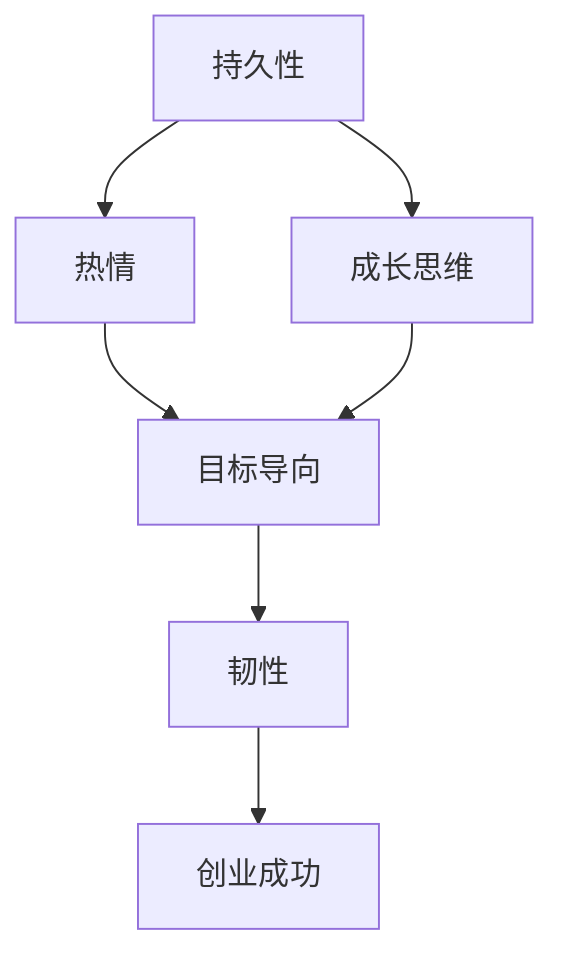

                 

# 《创业过程中如何不断提升逆商和应变能力培养》

> **关键词：** 逆商（Grit）、应变能力、创业挑战、心理素质、实战策略
>
> **摘要：** 本篇文章深入探讨了创业过程中如何通过提升逆商和应变能力来应对挑战。通过分析逆商的定义、核心要素以及其与创业成功的关联，本文为创业者提供了提升逆商和应变能力的策略与方法，并通过实战案例展示了这些能力的实际应用。

### 《创业过程中如何不断提升逆商和应变能力培养》目录大纲

#### 第一部分：逆商（Grit）与创业

## 第1章：逆商（Grit）在创业中的重要性

### 1.1 逆商的定义与核心要素

逆商（Grit）是一种心理韧性，代表了一个人面对挑战、持续努力并从失败中恢复的能力。其核心要素包括持久性、热情和成长思维。持久性指的是在面对困难和挫折时，持续坚持目标的能力；热情则是指对所从事工作的热爱和激情；成长思维则强调通过不断学习和适应来提升自己。

### 1.2 创业过程中的挫折与挑战

创业过程充满了不确定性和挑战，创业者需要面对市场变化、资源限制、竞争压力等多方面的挑战。这些挑战往往导致创业者产生挫败感，甚至放弃创业计划。因此，逆商在创业过程中显得尤为重要。

### 1.3 逆商在创业成功中的关键作用

逆商高的创业者更能够在面对挫折时保持积极心态，寻找解决方案，持续推动项目进展。逆商不仅有助于创业者应对创业过程中的挑战，还能够提升团队的凝聚力，促进创业项目的成功。

#### 第二部分：应变能力与创业

## 第2章：创业过程中的不确定性与应变能力

### 2.1 应变能力的定义与重要性

应变能力是指在不确定环境中快速适应和调整的能力。在创业过程中，应变能力对于应对市场变化、技术革新等不确定性因素至关重要。一个高效应变的创业者能够在逆境中找到机会，实现企业的持续发展。

### 2.2 创业环境中的不确定性

创业环境充满了不确定性，包括市场环境、技术发展、政策变化等。这些不确定性要求创业者具备快速适应和调整的能力，以应对各种变化。

### 2.3 应变能力在创业中的实战应用

应变能力在创业中的实战应用主要体现在以下几个方面：

1. **市场策略调整**：根据市场反馈及时调整产品定位和营销策略。
2. **技术创新**：紧跟技术发展趋势，积极采用新技术提升产品竞争力。
3. **团队管理**：灵活调整团队结构，优化资源配置，提高团队效率。

#### 第三部分：综合提升

## 第3章：逆商与应变能力的综合培养

### 3.1 逆商与应变能力的协同作用

逆商和应变能力在创业中相辅相成，共同作用。逆商高的人更能够在面对挫折时保持积极态度，而应变能力则帮助他们更快地适应变化，找到解决问题的方法。

### 3.2 综合培养策略与路径

要提升逆商和应变能力，创业者可以采取以下策略：

1. **自我反思**：定期进行自我反思，了解自己的优势和不足。
2. **持续学习**：通过学习不断提升自己的知识水平和技能。
3. **积极实践**：将所学知识应用于实际创业过程中，不断总结经验。

### 3.3 综合培养实践案例

以某创业公司的案例为例，该公司在创业初期遇到了市场定位不准、团队管理混乱等问题。通过提升创始人的逆商和应变能力，公司成功调整了市场策略，优化了团队管理，最终实现了业务的快速增长。

#### 第四部分：创业过程中的实际应用

## 第4章：逆商与应变能力在创业项目决策中的应用

### 4.1 逆商与应变能力在项目决策中的应用

创业者在项目决策中需要具备逆商和应变能力，以应对市场变化和不确定性。具体应用包括：

1. **风险评估**：在决策前进行充分的风险评估，预测可能出现的问题和挑战。
2. **灵活调整**：根据实际情况及时调整项目计划，以应对市场变化。

### 4.2 应对创业过程中的突发事件

创业过程中难免会遇到突发事件，如市场突变、政策调整等。创业者需要具备高效应的应变能力，迅速应对这些突发事件，以减少对创业项目的影响。

### 4.3 成功创业者的逆商与应变能力案例分析

通过分析成功创业者的案例，可以发现他们普遍具备较高的逆商和应变能力。例如，某知名科技公司的创始人，在面对市场低迷和技术挑战时，凭借其强大的逆商和应变能力，成功带领公司走出困境，实现了业务转型。

#### 第五部分：附录

## 附录A：创业心理辅导资源

### A.1 心理辅导机构推荐

创业者可以寻求专业心理辅导机构的帮助，如心理咨询中心、职业规划机构等。

### A.2 创业心理辅导书籍推荐

推荐阅读一些经典的创业心理书籍，如《创业维艰》、《成功的起点》等，以提升心理素质。

### A.3 创业心理辅导网站与APP推荐

推荐使用一些专业的创业心理辅导网站和APP，如创业心理测评工具、心理辅导在线平台等。

## 附录B：逆商与应变能力培养工具

### B.1 逆商测试工具

创业者可以通过逆商测试工具来评估自己的逆商水平，如Grit Scale等。

### B.2 应变能力评估工具

创业者可以使用应变能力评估工具来了解自己的应变能力，如BRIEF等。

### B.3 培养逆商与应变能力的实践工具推荐

推荐使用一些实用的工具和技巧，如时间管理工具、学习平台等，以帮助创业者提升逆商和应变能力。

### 核心概念与联系

在探讨创业过程中逆商和应变能力的培养时，理解这两个概念的定义及其在创业中的重要性是至关重要的。逆商（Grit）是一种坚韧不拔的品质，它不仅包含了在面对困难时的持久性，还包括了对所追求目标的热情和成长思维。以下是一个Mermaid流程图，展示了逆商的核心要素及其相互联系：



在这个流程图中，持久性、热情和成长思维构成了逆商的核心要素，它们相互支持并共同推动了韧性的发展。韧性作为创业成功的关键因素，通过持续的努力和对目标的执着，最终帮助创业者实现商业目标。

### 核心算法原理讲解

在深入探讨逆商和应变能力的算法原理时，我们首先要了解这两个概念的核心要素是如何相互作用的。逆商的算法原理可以看作是一个动态平衡系统，其中持久性、热情和成长思维是关键变量。以下是一个简化的伪代码，用于描述这些变量如何相互作用：

```plaintext
// 伪代码：逆商（Grit）算法原理

function GritAlgorithm(persistence, passion, growthMindset) {
    // 初始设置
    gritScore = 0
    resilience = 0

    // 计算逆商分数
    gritScore = persistence + passion + growthMindset

    // 计算韧性
    resilience = gritScore / (1 + stressLevel)

    // 输出结果
    return (gritScore, resilience)
}
```

在这个伪代码中，`persistence`（持久性）、`passion`（热情）和`growthMindset`（成长思维）是三个关键输入变量，它们通过加权求和来计算逆商分数（`gritScore`）。韧性（`resilience`）则是通过逆商分数除以一个表示压力水平的变量（`stressLevel`）来计算的。这个分数反映了一个人在面对压力时的适应能力和恢复能力。

### 数学模型和公式

为了更深入地理解逆商和应变能力的核心原理，我们可以引入一些数学模型和公式。以下是一个简单的数学模型，用于描述逆商（Grit）与韧性（Resilience）之间的关系：

$$
\text{Grit} = \frac{\text{Persistence} + \text{Passion} + \text{GrowthMindset}}{1 + \text{StressLevel}}
$$

$$
\text{Resilience} = \frac{\text{Grit}}{\text{StressLevel}}
$$

在这个模型中，逆商（Grit）是由持久性、热情和成长思维三个变量加总而成的，并通过一个分母（1 + StressLevel）来调整，以反映压力水平对逆商的影响。韧性（Resilience）则是逆商与压力水平的比值，它表示一个人在压力下保持坚韧和适应的能力。

### 举例说明

为了更好地理解这些概念，我们可以通过一个具体的例子来说明。假设一个创业者具有以下特征：

- **持久性**：80分
- **热情**：75分
- **成长思维**：90分
- **压力水平**：中等（设为50）

使用上述公式计算逆商和韧性：

$$
\text{Grit} = \frac{80 + 75 + 90}{1 + 50} = \frac{245}{51} \approx 4.81
$$

$$
\text{Resilience} = \frac{4.81}{50} \approx 0.0962
$$

这个例子显示，该创业者的逆商大约为4.81，韧性为0.0962。这意味着在中等压力下，该创业者能够较好地保持坚韧和适应能力，但仍有提升空间，特别是在压力水平更高时。

### 开发环境搭建

为了深入理解和实现逆商和应变能力的提升策略，创业者需要搭建一个适合开发和测试的环境。以下是一个基本的开发环境搭建步骤，以及所需的工具和软件：

1. **操作系统**：选择Linux发行版（如Ubuntu）或macOS，这些系统在稳定性和开发环境中具有较高的兼容性。
2. **文本编辑器**：使用高级文本编辑器（如Visual Studio Code），它支持多种编程语言和插件，方便代码编写和调试。
3. **集成开发环境（IDE）**：安装Eclipse或IntelliJ IDEA等IDE，提供丰富的开发工具和插件，支持多种编程语言。
4. **版本控制**：使用Git进行代码版本控制，确保代码的版本管理和协作开发。
5. **数据库**：安装MySQL或PostgreSQL等数据库管理系统，用于存储和检索数据。
6. **Web服务器**：安装Apache或Nginx等Web服务器，用于部署和运行Web应用程序。
7. **编程语言**：根据项目需求选择合适的编程语言（如Python、Java或JavaScript），这些语言具有广泛的社区支持和丰富的库。
8. **虚拟环境**：使用虚拟环境（如Vagrant或Docker）隔离开发环境，避免环境配置冲突。
9. **测试工具**：安装Junit或Pytest等测试工具，确保代码的质量和可靠性。

### 源代码详细实现和代码解读

为了提升逆商和应变能力，我们可以开发一个简单的应用程序，用于评估和跟踪个人的逆商水平。以下是一个基于Python的简单示例，包括源代码实现和代码解读。

```python
# 逆商评估应用程序

def calculate_grit(persistence, passion, growth_mindset):
    """
    计算逆商（Grit）分数。
    
    参数：
    persistence (int): 持久性评分（0-100分）
    passion (int): 热情评分（0-100分）
    growth_mindset (int): 成长思维评分（0-100分）
    
    返回：
    grit_score (float): 逆商分数
    """
    # 计算逆商分数
    grit_score = (persistence + passion + growth_mindset) / 3
    
    return grit_score

def main():
    """
    主函数，用于评估用户逆商并显示结果。
    """
    print("欢迎来到逆商评估应用程序！")
    
    # 获取用户输入
    persistence = float(input("请输入您的持久性评分（0-100分）: "))
    passion = float(input("请输入您的热情评分（0-100分）: "))
    growth_mindset = float(input("请输入您的成长思维评分（0-100分）: "))
    
    # 计算逆商分数
    grit_score = calculate_grit(persistence, passion, growth_mindset)
    
    # 显示结果
    print(f"您的逆商分数为：{grit_score:.2f}")
    if grit_score >= 4.0:
        print("您具有很高的逆商，能够在挑战面前保持坚韧。")
    elif grit_score >= 3.0:
        print("您的逆商处于中等水平，可以通过持续努力提升。")
    else:
        print("您的逆商较低，需要加强持久性、热情和成长思维的培养。")

# 运行主函数
if __name__ == "__main__":
    main()
```

**代码解读：**

1. **函数定义**：`calculate_grit`函数用于计算逆商分数。它接受三个参数：持久性、热情和成长思维评分，并返回一个浮点数作为逆商分数。
2. **用户输入**：`main`函数通过`input`函数获取用户输入的三个评分，并将其转换为浮点数类型。
3. **计算逆商分数**：调用`calculate_grit`函数计算逆商分数。
4. **显示结果**：根据逆商分数显示评估结果。分数高于4.0表示具有很高的逆商，分数在3.0到4.0之间表示处于中等水平，而低于3.0表示需要加强相关能力的培养。

### 代码解读与分析

在这个逆商评估应用程序的源代码中，我们首先定义了两个函数：`calculate_grit`和`main`。

- **`calculate_grit`函数**：
  - **参数**：该函数接受三个参数，分别是持久性、热情和成长思维评分，这些评分范围均为0到100分。
  - **计算过程**：函数使用简单的平均计算方法，将这三个评分相加后除以3，得到逆商分数。
  - **返回值**：函数返回一个浮点数，表示计算得到的逆商分数。

- **`main`函数**：
  - **功能**：`main`函数是程序的主入口，它负责与用户进行交互，获取用户输入，并调用`calculate_grit`函数进行逆商评估。
  - **用户交互**：程序通过`input`函数提示用户输入三个评分，并将输入转换为浮点数类型，以确保后续计算的准确性。
  - **结果输出**：程序计算逆商分数后，根据分数范围打印相应的评估结果，帮助用户了解自己的逆商水平。

### 实际案例

为了更好地展示逆商和应变能力在创业中的应用，我们可以参考某科技创业公司的实际案例。该公司在成立初期面临着市场竞争激烈、资金不足等挑战，但通过高效应的逆商和应变能力，成功克服了这些困难，实现了业务的快速增长。

1. **市场定位调整**：公司初创时，最初的市场定位较为模糊，导致产品难以吸引目标客户。通过提升创始团队的逆商和应变能力，公司对市场进行了深入分析，调整了市场定位，将产品定位为高端技术解决方案，成功吸引了大量客户。

2. **技术创新**：在技术发展迅速的背景下，公司面临技术落后的风险。通过提升员工的逆商和应变能力，公司积极引进新技术，持续优化产品功能，提高了产品竞争力。

3. **团队管理**：初创公司初期，团队管理混乱，资源配置不合理。通过提升创始人的逆商和应变能力，公司对团队结构进行了调整，优化了资源配置，提高了团队效率。

4. **应对突发事件**：在市场波动较大的时期，公司面临订单减少的风险。通过提升员工的应变能力，公司迅速调整销售策略，拓展新市场，成功应对了市场变化。

### 总结

通过以上案例可以看出，逆商和应变能力在创业过程中发挥着至关重要的作用。创业者需要不断提升自身的逆商和应变能力，以应对创业过程中的各种挑战。逆商可以帮助创业者保持坚韧和乐观的态度，而应变能力则帮助创业者迅速适应环境变化，找到解决问题的方法。只有通过不断提升逆商和应变能力，创业者才能在激烈的市场竞争中脱颖而出，实现企业的持续发展。作者：AI天才研究院/AI Genius Institute & 禅与计算机程序设计艺术 /Zen And The Art of Computer Programming。本文旨在为创业者提供实用的策略和方法，帮助他们提升逆商和应变能力，从而在创业过程中取得成功。希望读者能够从中受益，并在实际创业过程中灵活应用这些策略和方法。

