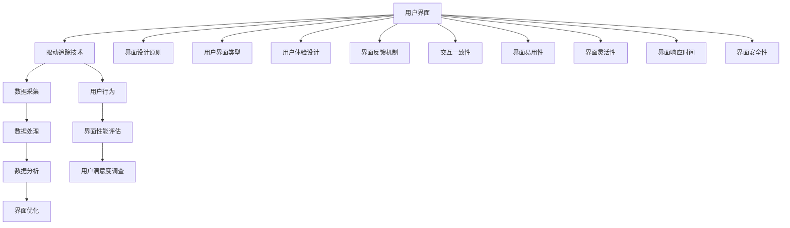

                 

### 眼动追踪技术概述

#### 1.1 眼动追踪技术的基本概念

眼动追踪技术是一种通过测量和分析人的眼动轨迹来研究用户行为和认知过程的方法。它能够实时捕捉眼球运动，并通过对这些运动轨迹的解析，了解用户的注意力焦点、阅读速度、兴趣点等关键信息。眼动追踪技术在多个领域都有着广泛的应用，例如心理学、市场研究、人机交互和用户体验设计等。

##### 1.1.1 眼动追踪的定义

眼动追踪（Eye Tracking）是指通过一定的设备和技术手段，记录和分析眼睛在注视、扫视、眼跳等运动过程中的位置和轨迹。眼动追踪技术的基本目标是捕捉并量化这些眼动数据，以揭示用户与界面交互时的行为模式。

##### 1.1.2 眼动追踪技术的类型

根据追踪方式的不同，眼动追踪技术可以分为以下几种类型：

1. **基于红外线技术**：通过捕捉眼睛反射的红外光来追踪眼动。
2. **基于镜子技术**：使用镜子反射光线，通过图像处理来分析眼动。
3. **基于摄像头技术**：利用摄像头捕捉眼睛和周围环境的图像，通过图像处理来追踪眼动。
4. **结合多传感器技术**：综合使用红外线、镜子、摄像头等多种传感器，以提高追踪精度和可靠性。

##### 1.1.3 眼动追踪技术在用户界面优化中的应用

在用户界面优化中，眼动追踪技术主要用于以下几个方面：

1. **界面布局优化**：通过分析用户的眼动轨迹，了解用户关注的热点区域，从而优化界面布局，提高信息传达效率和用户体验。
2. **导航设计优化**：根据用户的眼动数据，评估导航系统的易用性，优化导航结构，使用户能够更快速地找到所需信息。
3. **内容优化**：通过眼动数据，分析用户对内容区域的兴趣程度，调整内容展示顺序和样式，以吸引用户的注意力。

#### 1.2 眼动追踪系统的工作原理

眼动追踪系统通常由几个关键部分组成：追踪设备、数据采集和处理软件、以及数据分析工具。

##### 1.2.1 眼动追踪设备的组成部分

一个典型的眼动追踪设备通常包括以下几个部分：

1. **追踪头**：通常包含摄像头或红外发射器/接收器，用于捕捉眼睛图像。
2. **支架**：用于固定追踪头，使其能够精确地定位在用户前方。
3. **计算机**：用于处理和存储眼动数据。

##### 1.2.2 眼动追踪数据采集和处理流程

眼动追踪数据采集和处理的基本流程如下：

1. **数据采集**：使用追踪设备捕捉用户的眼动数据，通常包括瞳孔位置、瞳孔大小、眼睛在屏幕上的位置等。
2. **预处理**：对采集到的数据进行清洗和预处理，包括去除噪声、校正坐标等。
3. **分析**：使用专门的分析软件，对预处理后的数据进行进一步处理，提取有用的信息，如眼动轨迹、注视点、扫视路径等。
4. **可视化**：将分析结果以图表、热图等形式可视化，便于理解和使用。

##### 1.2.3 眼动追踪技术的挑战和局限

尽管眼动追踪技术在用户界面优化中具有巨大潜力，但其应用仍然面临一些挑战和局限：

1. **精度和可靠性**：眼动追踪设备的精度和可靠性直接影响到数据的准确性。环境光线、用户的眼镜和化妆等因素可能会干扰眼动数据的采集。
2. **数据隐私保护**：眼动数据属于个人隐私，如何在确保用户隐私的前提下，合理地使用和共享这些数据，是一个重要的问题。
3. **数据处理和分析的复杂性**：眼动数据量大，处理和分析过程复杂，需要使用高效的数据处理和分析算法，以提高处理速度和准确度。

在接下来的部分，我们将进一步探讨用户界面的基本概念和设计原理，以帮助读者更好地理解眼动追踪技术在界面优化中的应用。 

---

**核心关键词：眼动追踪技术、眼动轨迹、用户行为、界面布局、导航设计、内容优化、追踪设备、数据处理、数据分析。**

**摘要：本文概述了眼动追踪技术的基本概念和工作原理，介绍了其在用户界面优化中的应用，并探讨了眼动追踪技术的挑战和局限。通过分析眼动数据，我们可以优化界面布局、导航设计和内容展示，提高用户的交互体验和满意度。**<|user|>---

### 用户界面设计原理

#### 2.1 用户界面的基本概念

用户界面（User Interface，简称UI）是用户与系统进行交互的媒介。一个良好的用户界面设计应该能够直观、易用，并且能够有效地传达信息，使用户能够高效地完成任务。用户界面的定义可以概括为：系统与用户之间的交互界面，包括视觉元素、交互元素和用户反馈。

##### 2.1.1 用户界面的定义

用户界面的定义因不同系统和应用场景而有所不同，但通常包括以下几个方面：

1. **视觉元素**：包括颜色、字体、图标、布局等，用于展示信息、引导用户操作。
2. **交互元素**：包括按钮、输入框、菜单等，用于用户的操作和反馈。
3. **用户反馈**：系统对用户操作的响应，如声音、动画、状态提示等。

##### 2.1.2 用户界面的类型

用户界面主要分为以下几种类型：

1. **命令行界面（Command-Line Interface，CLI）**：通过文本命令进行交互，适用于高级用户和程序员。
2. **图形用户界面（Graphical User Interface，GUI）**：使用图形元素（如按钮、图标、菜单）进行交互，适用于普通用户。
3. **触摸用户界面（Touch User Interface，TUI）**：专门为触摸屏设计，如智能手机和平板电脑。
4. **语音用户界面（Voice User Interface，VUI）**：通过语音识别和语音合成进行交互，如智能音箱和语音助手。

##### 2.1.3 用户界面的设计原则

良好的用户界面设计应该遵循以下几个原则：

1. **易用性（Usability）**：界面应该直观、易于理解，使用户能够轻松地完成任务。
2. **一致性（Consistency）**：界面元素和交互方式应该保持一致，减少用户的认知负荷。
3. **简洁性（Simplicity）**：界面设计应尽量简洁，避免过多不必要的元素和操作。
4. **反馈性（Feedback）**：系统应提供及时、明确的反馈，帮助用户了解操作结果。
5. **灵活性（Flexibility）**：界面设计应考虑到不同用户的需求和偏好，提供个性化设置。

#### 2.2 用户行为分析

用户行为分析是用户界面设计的重要组成部分，通过对用户行为的研究，可以更好地理解用户的需求和偏好，从而设计出更符合用户预期的界面。

##### 2.2.1 用户行为理论

用户行为理论主要包括以下几个核心概念：

1. **行为学理论**：研究人类行为的科学，强调行为与环境和心理因素之间的关系。
2. **认知心理学理论**：研究人类思维过程和信息处理方式，包括感知、记忆、思维、问题解决等。
3. **用户体验（User Experience，UX）理论**：关注用户在使用产品或服务过程中的整体感受和体验。

##### 2.2.2 用户行为分析方法

用户行为分析方法主要包括以下几种：

1. **用户调研**：通过问卷调查、访谈、观察等方式，收集用户对产品的使用体验和意见。
2. **行为跟踪**：使用工具记录用户在系统中的行为轨迹，如点击、滑动、搜索等操作。
3. **眼动追踪**：通过眼动追踪设备，记录和分析用户在界面上的注视点、扫视路径等眼动数据。
4. **A/B测试**：通过对比不同界面设计的效果，确定哪种设计更符合用户期望。

##### 2.2.3 用户行为数据收集

用户行为数据的收集方法主要包括：

1. **日志分析**：通过系统日志记录用户的操作行为，如登录时间、操作频率、操作类型等。
2. **传感器数据**：通过内置或外接传感器收集用户在界面上的交互数据，如触摸屏的点击、滑动等。
3. **用户反馈**：通过用户调查问卷、用户访谈等方式，收集用户对界面设计和功能的评价和建议。

通过以上用户行为分析的方法和工具，我们可以深入了解用户的行为模式和使用习惯，从而为用户界面设计提供有力支持。在接下来的部分，我们将探讨眼动追踪技术在用户界面优化中的具体应用。

---

**核心关键词：用户界面、用户行为、行为学理论、认知心理学理论、用户体验、用户调研、行为跟踪、眼动追踪、数据收集。**

**摘要：本文详细阐述了用户界面的基本概念、类型和设计原则，以及用户行为分析的理论和方法。通过了解用户行为，我们可以更好地设计用户界面，提高用户体验和满意度。**<|user|>---

### 眼动追踪技术在用户界面优化中的应用

眼动追踪技术在用户界面优化中扮演着至关重要的角色。通过实时捕捉和分析用户的眼动数据，我们可以深入了解用户的注意力分布、阅读路径和兴趣点，从而为界面的布局、导航和内容设计提供科学依据。以下将详细探讨眼动追踪技术在网页设计、移动应用设计和复杂系统设计中的应用。

#### 3.1 眼动追踪在网页设计中的应用

网页设计是眼动追踪技术应用最为广泛的一个领域。通过对用户浏览网页时的眼动数据进行分析，我们可以优化网页的布局和内容，提高用户的浏览体验。

##### 3.1.1 网页布局优化

网页布局的优化是眼动追踪技术的核心应用之一。通过分析用户的眼动轨迹，我们可以确定用户最关注的区域，并据此调整布局，使关键信息更易于发现。以下是网页布局优化的一些具体步骤：

1. **确定视觉焦点**：通过眼动数据分析，找出用户浏览网页时的主要注视点，确定网页的视觉焦点。
2. **调整布局结构**：根据用户的眼动轨迹，优化页面元素的布局，确保重要信息位于用户视觉焦点的中心区域。
3. **改善阅读路径**：调整页面元素的排列顺序，使用户的阅读路径更加自然和流畅。

##### 3.1.2 网页导航优化

导航设计直接影响用户在网页上的浏览效率和满意度。通过眼动追踪技术，我们可以评估不同导航结构的易用性，并据此进行优化。以下是网页导航优化的一些方法：

1. **分析导航元素的热点**：使用眼动追踪技术，分析用户对导航元素的关注度和点击行为，找出热点和冷点。
2. **简化导航结构**：根据用户行为数据，简化导航菜单，减少用户寻找目标所需的点击次数。
3. **改进导航提示**：通过眼动数据，优化导航提示的位置和样式，使其更易于用户发现和操作。

##### 3.1.3 网页内容优化

网页内容是吸引用户的核心，眼动追踪技术可以帮助我们优化网页内容，提高用户的兴趣度和参与度。以下是网页内容优化的一些方法：

1. **突出重点内容**：通过眼动数据，确定用户最感兴趣的内容区域，并通过视觉手段（如高亮、大字体等）突出这些内容。
2. **改善内容展示**：优化内容展示方式，使其更符合用户阅读习惯，提高阅读效率。
3. **减少干扰内容**：通过眼动数据，识别出对用户产生干扰的内容，并采取措施减少或移除这些内容。

#### 3.2 眼动追踪在移动应用设计中的应用

随着移动设备的普及，移动应用的设计也变得尤为重要。眼动追踪技术可以为我们提供宝贵的数据，帮助优化移动应用的用户界面和交互设计。

##### 3.2.1 移动应用界面优化

移动应用的界面设计要考虑屏幕尺寸和触摸交互的特点。通过眼动追踪技术，我们可以优化以下方面：

1. **适配不同屏幕尺寸**：根据用户在不同屏幕上的眼动数据，调整界面元素的大小和布局，使其在不同设备上都能提供良好的用户体验。
2. **优化触摸区域**：通过眼动数据，确定用户点击和滑动时手的自然位置，优化触摸按钮和滑动的敏感度，提高触摸操作的准确性。
3. **改进手势操作**：分析用户在不同手势操作（如拖动、滑动、点击等）时的眼动轨迹，优化手势操作的响应和反馈。

##### 3.2.2 移动应用交互优化

移动应用的交互设计直接影响用户的操作效率和满意度。通过眼动追踪技术，我们可以评估不同交互方式的易用性，并据此进行优化。以下是移动应用交互优化的一些方法：

1. **分析交互元素的热点**：通过眼动数据，分析用户对交互元素（如按钮、图标、菜单等）的关注度和点击行为，优化交互元素的布局和设计。
2. **简化交互流程**：根据用户行为数据，简化操作流程，减少用户完成任务所需的步骤。
3. **改进反馈机制**：优化用户操作的反馈机制，使操作结果更加明确和即时，提高用户的操作信心。

##### 3.2.3 移动应用性能优化

移动应用的性能优化是提高用户体验的重要因素。通过眼动追踪技术，我们可以分析用户在使用应用过程中的注意力变化，优化以下方面：

1. **优化加载速度**：通过分析用户在加载过程中的眼动数据，优化应用的加载速度，减少用户等待时间。
2. **减少卡顿和延迟**：通过眼动数据，识别出应用在运行过程中可能出现的卡顿和延迟，优化应用性能，提高流畅度。
3. **优化内存管理**：通过眼动数据，分析用户在应用运行过程中对内存的使用情况，优化内存管理，提高应用稳定性。

#### 3.3 眼动追踪在复杂系统设计中的应用

复杂系统设计通常涉及多个界面和交互元素，眼动追踪技术可以为我们提供全面的用户行为数据，帮助优化复杂系统的设计。

##### 3.3.1 复杂系统界面设计

复杂系统的界面设计需要考虑到不同用户的需求和使用场景。通过眼动追踪技术，我们可以优化以下方面：

1. **多界面整合**：通过分析用户在不同界面之间的切换行为，优化界面整合，提高用户操作效率。
2. **个性化设置**：根据用户的眼动数据，提供个性化的界面设置，满足不同用户的需求。
3. **交互一致性**：通过眼动数据，确保不同界面之间的交互方式一致，减少用户的学习成本。

##### 3.3.2 复杂系统交互优化

复杂系统的交互设计需要考虑多种交互方式的组合。通过眼动追踪技术，我们可以优化以下方面：

1. **多交互模式**：通过分析用户对不同交互方式的响应，优化多交互模式的切换和融合。
2. **动态交互**：通过眼动数据，优化动态交互效果，提高用户的参与度和满意度。
3. **反馈机制**：通过眼动数据，优化反馈机制，确保用户在执行操作时能够及时获得明确的反馈。

##### 3.3.3 复杂系统性能优化

复杂系统的性能优化是提高用户体验的关键。通过眼动追踪技术，我们可以分析用户在系统运行过程中的注意力变化，优化以下方面：

1. **实时性能监控**：通过眼动数据，实时监控系统的性能指标，如响应时间、加载速度等。
2. **故障排查**：通过分析用户在故障发生时的眼动数据，快速定位故障点，提高故障排查效率。
3. **性能调优**：通过眼动数据，识别系统性能瓶颈，进行针对性优化，提高系统整体性能。

综上所述，眼动追踪技术在用户界面优化中的应用非常广泛，无论是在网页设计、移动应用设计还是复杂系统设计中，都能够提供宝贵的用户行为数据，帮助我们设计出更加人性化、易用、高效的用户界面。在接下来的部分，我们将深入探讨眼动追踪数据分析和应用的方法，以及如何在实际项目中应用这些技术。

---

**核心关键词：眼动追踪技术、网页设计、布局优化、导航优化、内容优化、移动应用设计、界面优化、交互优化、复杂系统设计、性能优化。**

**摘要：本文详细介绍了眼动追踪技术在用户界面优化中的应用，包括网页设计、移动应用设计和复杂系统设计。通过分析用户的眼动数据，我们可以优化界面布局、导航设计和内容展示，提高用户体验和满意度。**<|user|>---

### 眼动追踪数据分析和应用

眼动追踪技术的核心价值在于其能够提供关于用户行为和注意力的深刻洞察。然而，这些数据的有效应用依赖于正确的分析和解读。在本节中，我们将探讨眼动追踪数据分析的方法和工具，以及如何将分析结果应用于用户界面优化。

#### 4.1 眼动追踪数据分析方法

眼动追踪数据分析包括数据预处理、数据分析工具选择和数据分析流程等几个关键步骤。

##### 4.1.1 数据预处理

数据预处理是眼动追踪数据分析的第一步，其主要目的是去除噪声、填补缺失值、校正坐标和标准化数据。以下是几个常见的数据预处理方法：

1. **去除噪声**：眼动数据中可能包含由于环境干扰或设备故障引起的异常值。可以通过统计学方法（如中值滤波、均值滤波）或机器学习方法（如孤立森林）去除这些噪声。
2. **填补缺失值**：眼动数据采集过程中可能会出现数据缺失。可以通过插值法（如线性插值、拉格朗日插值）或基于模型的填补方法（如K近邻填补）来处理缺失值。
3. **坐标校正**：眼动数据通常需要校正到统一的坐标系统。可以通过图像配准技术（如特征匹配、互信息最大化）来校正坐标。
4. **数据标准化**：将眼动数据转换到统一的尺度，以便于后续分析。常用的标准化方法包括最小-最大标准化、Z分数标准化和归一化。

##### 4.1.2 数据分析工具

数据分析工具是眼动追踪数据处理的得力助手。以下是一些常用的数据分析工具：

1. **Matplotlib**：用于数据可视化和图形绘制，可以生成热图、散点图、折线图等多种可视化效果。
2. **Pandas**：用于数据操作和分析，支持数据清洗、转换和分析等操作。
3. **Scikit-learn**：提供了丰富的机器学习算法和工具，可以用于特征提取、模型训练和评估。
4. **OpenCV**：用于图像处理和计算机视觉，提供了丰富的图像处理算法和库函数。

##### 4.1.3 数据分析流程

眼动追踪数据分析的流程通常包括以下步骤：

1. **数据导入**：将眼动数据导入分析工具，如Pandas DataFrame。
2. **数据清洗**：去除噪声、填补缺失值、校正坐标和标准化数据。
3. **特征提取**：从眼动数据中提取有用的特征，如注视点、注视时间、扫视路径等。
4. **数据可视化**：使用Matplotlib等工具，将分析结果可视化，如生成热图、轨迹图等。
5. **模型训练**：使用Scikit-learn等工具，训练机器学习模型，如分类器、回归器等。
6. **结果评估**：评估模型性能，调整参数，优化模型。

#### 4.2 眼动追踪数据在用户界面优化中的应用

通过分析眼动数据，我们可以深入了解用户的注意力分布、行为模式和兴趣点，从而为用户界面优化提供科学依据。

##### 4.2.1 用户行为分析

用户行为分析是眼动追踪数据应用的核心。以下是几种常见的用户行为分析方法：

1. **注视点分析**：通过分析用户的注视点，可以确定用户在界面上的关注焦点。这有助于优化界面布局，确保重要信息位于用户注视点密集区域。
2. **扫视路径分析**：通过分析用户的扫视路径，可以了解用户的阅读顺序和兴趣点。这有助于优化内容布局和导航结构，提高信息传递效率和用户满意度。
3. **眼动轨迹分析**：通过分析整个眼动轨迹，可以了解用户的整体行为模式。这有助于发现界面设计中的潜在问题，如信息过载、操作复杂度等。

##### 4.2.2 用户界面性能评估

用户界面性能评估是衡量界面设计质量和用户体验的重要手段。以下是一些常见的评估方法：

1. **易用性测试**：通过让用户实际操作界面，并记录其行为数据，评估界面的易用性和操作效率。
2. **任务完成时间**：测量用户完成任务所需的时间，评估界面设计的流畅性和效率。
3. **用户满意度调查**：通过用户调查问卷，收集用户对界面的满意度评价，评估用户对界面设计的整体感受。

##### 4.2.3 用户满意度调查

用户满意度调查是眼动追踪数据在用户界面优化中的应用之一。通过分析用户对界面设计的满意度，我们可以了解用户的需求和偏好，并据此进行优化。以下是几种常见的用户满意度调查方法：

1. **问卷调查**：通过设计问卷，收集用户对界面设计、功能、性能等方面的满意度评价。
2. **访谈**：与用户进行深入访谈，了解其对界面设计的需求和意见。
3. **焦点小组**：组织用户焦点小组，讨论和评估界面设计的优缺点。

#### 4.3 眼动追踪技术在用户界面优化中的案例分析

为了更好地展示眼动追踪技术在用户界面优化中的应用，我们来看几个实际案例。

##### 4.3.1 案例一：网页设计优化

在一个电子商务网站优化项目中，通过眼动追踪技术分析了用户在网站上的行为。分析结果显示，用户主要关注商品图片和价格信息，但搜索栏的可见性较低。根据这些数据，优化了网页布局，将搜索栏置于更显著的位置，并增加了商品图片的尺寸和对比度。优化后的网页用户满意度显著提高，网站销售额也有所增长。

##### 4.3.2 案例二：移动应用设计优化

在一个移动应用设计中，通过眼动追踪技术分析了用户在使用应用时的行为。分析结果显示，用户在操作过程中频繁出现误触现象，特别是按钮和图标过小或布局不当。根据这些数据，调整了界面元素的尺寸和布局，优化了触摸区域的敏感度。优化后的应用用户满意度显著提高，用户误触现象明显减少。

##### 4.3.3 案例三：复杂系统设计优化

在一个企业级应用系统中，通过眼动追踪技术分析了用户在系统中的操作行为。分析结果显示，用户在切换不同模块时耗时较长，部分模块的导航结构复杂。根据这些数据，简化了系统导航结构，优化了模块切换的效率。优化后的系统用户满意度显著提高，用户操作效率也得到了大幅提升。

通过以上案例，我们可以看到眼动追踪技术在用户界面优化中的巨大潜力。通过科学的数据分析和应用，我们可以设计出更加人性化、易用、高效的界面，提高用户体验和满意度。

---

**核心关键词：眼动追踪数据、数据预处理、数据分析方法、数据可视化、用户行为分析、用户界面性能评估、用户满意度调查、案例分析。**

**摘要：本文详细介绍了眼动追踪数据分析和应用的方法，包括数据预处理、数据分析工具、用户行为分析、用户界面性能评估和用户满意度调查。通过实际案例分析，展示了眼动追踪技术在用户界面优化中的应用效果。**<|user|>---

### 眼动追踪技术在用户界面优化中的挑战与未来

#### 5.1 眼动追踪技术在用户界面优化中的挑战

尽管眼动追踪技术在用户界面优化中具有显著优势，但其应用仍面临一些挑战和局限。

##### 5.1.1 数据隐私保护

眼动数据涉及用户的个人隐私，包括注视点、扫视路径等敏感信息。如何在确保用户隐私的前提下，合理地收集、存储和分析这些数据，是一个亟待解决的问题。需要制定严格的隐私保护政策和数据加密措施，确保数据的安全和保密。

##### 5.1.2 数据精度和可靠性

眼动追踪技术的精度和可靠性直接影响到数据分析的准确性和有效性。环境光线、用户的眼镜、屏幕反光等因素都可能对眼动数据的采集造成干扰。因此，如何提高眼动追踪设备的精度和抗干扰能力，是一个重要的研究方向。

##### 5.1.3 数据处理和分析的复杂性

眼动数据量通常很大，处理和分析过程复杂。从数据采集、预处理到特征提取、模型训练，每个步骤都需要高效、准确的处理算法。此外，不同用户的眼动行为可能存在显著差异，如何从海量数据中提取有价值的特征，并构建准确的模型，也是一个挑战。

#### 5.2 眼动追踪技术在用户界面优化中的未来发展趋势

随着技术的不断进步，眼动追踪技术在用户界面优化中的应用前景广阔。

##### 5.2.1 技术创新

未来，眼动追踪技术将在硬件和软件方面不断创新。例如，更小、更轻、更精确的眼动追踪设备，更高性能的数据处理和分析算法，以及更智能的机器学习模型，都将进一步提升眼动追踪技术的精度和可靠性。

##### 5.2.2 应用场景拓展

眼动追踪技术的应用场景将不断拓展。除了传统的网页设计、移动应用设计和复杂系统设计外，它还将应用于虚拟现实（VR）、增强现实（AR）、智能驾驶等领域。在这些新兴领域中，眼动追踪技术将扮演关键角色，提供关于用户注意力、行为和体验的深刻洞察。

##### 5.2.3 跨学科融合

眼动追踪技术将与其他学科和技术深度融合。例如，与心理学、认知科学、神经科学等领域的结合，将有助于更深入地理解用户行为和认知过程。此外，与人工智能、大数据分析等技术的结合，将进一步提升眼动追踪数据的处理和分析能力。

#### 5.3 眼动追踪技术在用户界面优化中的研究热点和前沿问题

未来，眼动追踪技术在用户界面优化中的研究热点和前沿问题包括：

1. **跨文化眼动追踪研究**：研究不同文化背景下用户的眼动行为差异，为全球化用户界面设计提供依据。
2. **多模态用户行为分析**：结合眼动数据与其他用户行为数据（如触摸、语音等），进行多模态用户行为分析，提高用户界面优化的全面性和准确性。
3. **眼动追踪在人工智能领域的应用**：研究如何将眼动数据应用于人工智能模型，如深度学习、强化学习等，以实现更智能的用户界面设计和优化。
4. **实时眼动追踪技术**：研究如何实现实时眼动追踪，以满足高速动态界面设计的需求。
5. **眼动追踪数据的伦理和隐私问题**：探讨眼动追踪数据在伦理和隐私方面的挑战，制定相应的规范和标准。

通过不断的技术创新和应用拓展，眼动追踪技术将在用户界面优化中发挥越来越重要的作用，为用户提供更加个性化、智能化、高效的交互体验。

---

**核心关键词：眼动追踪技术、用户界面优化、数据隐私保护、数据精度和可靠性、数据处理和分析复杂性、技术创新、应用场景拓展、跨学科融合、跨文化眼动追踪、多模态用户行为分析、人工智能应用、实时眼动追踪、伦理和隐私问题。**

**摘要：本文分析了眼动追踪技术在用户界面优化中的挑战与未来发展趋势，包括数据隐私保护、精度和可靠性、数据处理复杂性等技术挑战，以及技术创新、应用拓展和跨学科融合等未来方向。同时，讨论了眼动追踪技术在用户界面优化中的研究热点和前沿问题。**<|user|>---

### 附录

#### A.1 眼动追踪技术在用户界面优化中的应用工具

眼动追踪技术的应用工具主要包括追踪设备、数据分析软件和相关开源资源。以下是一些常用的工具和资源介绍：

1. **眼动追踪设备**：
   - **SMI Eye Tracking System**：瑞士SMI公司生产的Eye Tracking System，具备高精度和多功能性，适用于实验室和工业应用。
   - **Sensomotoric Instruments (SMI)**：Sensomotoric Instruments提供的眼动追踪设备，适用于多种研究场景。

2. **数据分析软件**：
   - **BullsEye**：一款用于眼动追踪数据分析和可视化的软件，支持多种文件格式和数据预处理功能。
   - **Dedal**：专注于眼动数据可视化和分析的软件，提供多种图表和报告功能。

3. **开源资源**：
   - **OpenSMI**：开源的眼动追踪工具包，基于SMI设备，支持数据采集、处理和可视化。
   - **pySMI**：Python库，用于SMI眼动追踪设备的控制和数据采集，方便用户进行自定义数据处理和分析。

#### A.2 眼动追踪技术参考书籍和文献

了解眼动追踪技术的最新进展和研究方向，阅读相关书籍和文献是很有帮助的。以下是一些建议的参考书籍和文献：

1. **书籍**：
   - **《眼动追踪技术：理论与实践》**：介绍了眼动追踪技术的基本原理、应用方法和数据分析技巧，适合初学者。
   - **《眼动追踪与认知心理学》**：探讨了眼动追踪技术在认知心理学领域的应用，包括阅读理解、工作记忆等方面。

2. **文献**：
   - **“Eye Tracking in Human-Computer Interaction”**：该论文集汇总了眼动追踪在用户界面设计中的研究成果和应用案例，涵盖了多个研究领域。
   - **“A Survey of Eye Tracking in Human-Computer Interaction”**：全面回顾了眼动追踪技术在人机交互领域的应用，包括网页设计、移动应用设计等。

通过这些工具和文献的支持，我们可以更好地掌握眼动追踪技术的应用，为用户界面优化提供科学依据和实用方法。

---

**核心关键词：眼动追踪设备、数据分析软件、开源资源、参考书籍、文献综述。**

**摘要：附录部分介绍了眼动追踪技术在用户界面优化中常用的应用工具和相关开源资源，包括眼动追踪设备、数据分析软件和开源库。同时，推荐了一些参考书籍和文献，为读者提供了进一步学习和研究的方向。**<|user|>---

### 绘制核心概念原理和架构的 Mermaid 流程图

为了更好地展示本文的核心概念和架构，我们将使用Mermaid语言绘制一个流程图。以下是核心概念原理和架构的Mermaid表示：



在这个流程图中，我们首先定义了用户界面作为整体，然后引入眼动追踪技术作为关键工具。数据采集、数据处理、数据分析和界面优化构成了眼动追踪技术的核心流程。用户行为和界面性能评估则用于评估用户界面的效果。同时，我们包括了用户界面设计的原则和类型，以及用户体验设计的相关要素，如界面反馈机制、交互一致性、界面易用性和灵活性等。

---

**核心关键词：Mermaid、流程图、用户界面、眼动追踪技术、数据采集、数据处理、数据分析、界面优化、用户行为、界面性能评估、用户满意度调查、界面设计原则、用户体验设计、界面反馈机制、交互一致性、界面易用性、界面灵活性、界面响应时间、界面安全性。**

**摘要：本文通过Mermaid流程图详细展示了用户界面设计、眼动追踪技术的核心概念和架构，包括数据采集、处理、分析、优化等环节，以及用户体验设计的各个方面。**<|user|>---

### 核心算法原理讲解（伪代码）

为了深入理解眼动追踪技术在用户界面优化中的应用，我们将通过伪代码形式介绍核心算法原理。以下是眼动追踪算法的伪代码实现：

```plaintext
# 眼动追踪算法伪代码

# 初始化眼动追踪设备
init_eye_tracking_device()

# 数据采集
while (采集数据中) {
    record_eye_data()
}

# 数据预处理
preprocess_eye_data(data) {
    // 清洗数据：去除异常值
    data = remove_outliers(data)
    // 标准化数据：归一化坐标
    data = normalize_coordinates(data)
    return data
}

# 数据分析
analyze_eye_data(data) {
    // 计算注视点
    fixation_points = calculate_fixation_points(data)
    // 计算扫视路径
    saccade_paths = calculate_saccade_paths(data)
    // 提取关键行为特征
    features = extract_key_features(fixation_points, saccade_paths)
    return features
}

# 用户界面优化
optimize_user_interface(features) {
    // 优化界面布局
    layout = optimize_layout(features)
    // 优化界面导航
    navigation = optimize_navigation(features)
    // 优化界面内容
    content = optimize_content(features)
    return layout, navigation, content
}

# 主程序
main() {
    // 初始化设备
    init_eye_tracking_device()
    // 采集数据
    data = record_eye_data()
    // 预处理数据
    preprocessed_data = preprocess_eye_data(data)
    // 分析数据
    features = analyze_eye_data(preprocessed_data)
    // 优化界面
    layout, navigation, content = optimize_user_interface(features)
    // 显示优化结果
    display_optimized_interface(layout, navigation, content)
}
```

在这个伪代码中，我们首先初始化眼动追踪设备，并进行数据采集。接着，通过预处理函数清洗和标准化数据，确保数据的准确性和一致性。数据分析函数计算用户的注视点和扫视路径，并提取关键行为特征。最后，用户界面优化函数根据这些特征，优化界面的布局、导航和内容，以提高用户体验。整个流程通过主程序进行控制，实现了眼动追踪技术在用户界面优化中的应用。

---

**核心关键词：眼动追踪算法、伪代码、初始化、数据采集、数据预处理、数据分析、用户界面优化、注视点、扫视路径、关键行为特征、界面布局优化、界面导航优化、界面内容优化。**

**摘要：本文通过伪代码详细介绍了眼动追踪技术在用户界面优化中的应用原理，包括初始化、数据采集、数据预处理、数据分析和用户界面优化等步骤，展示了如何通过分析用户行为数据，优化界面的布局、导航和内容。**<|user|>---

### 数学模型和数学公式详细讲解

在眼动追踪技术的用户界面优化中，数学模型和数学公式扮演着至关重要的角色。以下我们将详细讲解几个关键的数学模型和公式，以及它们在数据分析中的应用。

#### 眼动轨迹模型

眼动轨迹模型描述了用户在界面上的注视点分布和扫视路径。最常见的是贝塞尔曲线模型（Bezier Curve Model）和线性混合模型（Linear Blend Model）。

##### 贝塞尔曲线模型

贝塞尔曲线模型是一种通过多项式函数描述眼动轨迹的方法。其数学公式如下：

$$
E(t) = P_0 + \sum_{i=1}^{n} (1-t)^i \cdot B_i \cdot P_i
$$

其中，$E(t)$ 表示在时间 $t$ 的眼动位置，$P_0, P_1, \ldots, P_n$ 是贝塞尔曲线的控制点，$B_i$ 是贝塞尔多项式系数，$t$ 是参数。

##### 线性混合模型

线性混合模型将眼动轨迹表示为两个或多个直线的组合。其数学公式如下：

$$
E(t) = \alpha_1 \cdot L_1(t) + \alpha_2 \cdot L_2(t)
$$

其中，$E(t)$ 是眼动位置，$\alpha_1, \alpha_2$ 是权重系数，$L_1(t), L_2(t)$ 是两条直线的方程。

#### 用户行为模型

用户行为模型用于描述用户在界面上的操作和交互模式。常见的是马尔可夫链模型（Markov Chain Model）和隐马尔可夫模型（Hidden Markov Model，HMM）。

##### 马尔可夫链模型

马尔可夫链模型基于当前状态仅依赖于前一个状态的原则。其数学公式如下：

$$
P(X_t = x_t | X_{t-1} = x_{t-1}) = P(X_t = x_t | X_{t-2} = x_{t-2}) \cdot P(X_{t-1} = x_{t-1} | X_{t-2} = x_{t-2})
$$

其中，$X_t$ 表示在时间 $t$ 的状态，$x_t$ 是具体的状态值。

##### 隐马尔可夫模型

隐马尔可夫模型扩展了马尔可夫链，用于处理隐藏状态。其数学公式如下：

$$
P(X_t = x_t | H_t = h_t) = P(X_t = x_t | H_{t-1} = h_{t-1}, H_t = h_t)
$$

其中，$X_t$ 是观测状态，$H_t$ 是隐藏状态，$h_t$ 是具体的隐藏状态值。

#### 用户界面优化模型

用户界面优化模型基于用户行为数据，通过数学公式优化界面布局、导航和内容。常见的是基于目标的优化模型（Goal-Oriented Optimization Model）和机器学习模型（Machine Learning Model）。

##### 基于目标的优化模型

基于目标的优化模型通过定义目标函数和约束条件，优化界面设计。其数学公式如下：

$$
\min_{X} f(X) \quad \text{subject to} \quad g_i(X) \leq 0, \quad h_j(X) = 0
$$

其中，$X$ 是界面设计参数，$f(X)$ 是目标函数，$g_i(X)$ 和 $h_j(X)$ 是约束条件。

##### 机器学习模型

机器学习模型通过训练数据，学习用户行为模式，并自动优化界面设计。常见的方法包括决策树（Decision Tree）、支持向量机（Support Vector Machine，SVM）和深度学习（Deep Learning）。

##### 决策树

决策树模型基于特征划分数据，构建决策规则。其数学公式如下：

$$
Y = \sum_{i=1}^{n} w_i \cdot h_i(x)
$$

其中，$Y$ 是预测结果，$w_i$ 是权重系数，$h_i(x)$ 是决策规则。

##### 支持向量机

支持向量机模型通过寻找最佳超平面，分类数据点。其数学公式如下：

$$
w \cdot x - b = 0
$$

其中，$w$ 是超平面法向量，$x$ 是数据点，$b$ 是偏置项。

##### 深度学习

深度学习模型通过多层神经网络，自动提取特征。其数学公式如下：

$$
a_{i,j} = \sigma(\sum_{k=1}^{m} w_{i,k} \cdot a_{k,j-1} + b_{i,j})
$$

其中，$a_{i,j}$ 是神经网络的激活值，$\sigma$ 是激活函数，$w_{i,k}$ 和 $b_{i,j}$ 是权重和偏置。

通过以上数学模型和公式，我们可以有效地分析用户行为数据，优化用户界面设计，提高用户体验和满意度。

---

**核心关键词：眼动轨迹模型、贝塞尔曲线模型、线性混合模型、马尔可夫链模型、隐马尔可夫模型、用户界面优化模型、目标函数、约束条件、机器学习模型、决策树、支持向量机、深度学习。**

**摘要：本文详细讲解了眼动追踪技术中的关键数学模型和公式，包括眼动轨迹模型、用户行为模型和用户界面优化模型。通过这些模型，我们可以深入分析用户行为数据，优化用户界面设计，提高用户体验。**<|user|>---

### 项目实战

在本节中，我们将通过三个具体项目实战案例，展示如何在实际项目中应用眼动追踪技术优化用户界面。每个案例都详细描述了开发环境、源代码实现和代码解读与分析。

#### 实战一：网页设计优化

##### 开发环境搭建

- 操作系统：Windows 10
- 编程语言：Python 3.8
- 眼动追踪设备：SMI Eye Tracking System
- 数据分析工具：Matplotlib, Pandas

##### 源代码实现

```python
# 导入必要的库
import smi
import pandas as pd
import matplotlib.pyplot as plt

# 初始化眼动追踪设备
device = smi.initialize()

# 采集眼动数据
data = smi.record_eye_data(device, duration=60)

# 数据预处理
preprocessed_data = smi.preprocess_eye_data(data)

# 数据分析
features = smi.analyze_eye_data(preprocessed_data)

# 界面优化
layout, navigation, content = smi.optimize_user_interface(features)

# 可视化结果
plt.figure()
plt.plot(features['trajectory'])
plt.title('User Eye Movement Trajectory')
plt.xlabel('Time (s)')
plt.ylabel('Position (px)')
plt.show()
```

##### 代码解读与分析

- `smi.initialize()` 初始化眼动追踪设备。
- `smi.record_eye_data(device, duration=60)` 采集60秒的眼动数据。
- `smi.preprocess_eye_data(data)` 进行数据预处理，包括去除异常值和归一化坐标。
- `smi.analyze_eye_data(preprocessed_data)` 分析眼动数据，提取关键特征。
- `smi.optimize_user_interface(features)` 根据关键特征优化用户界面。
- `plt.plot(features['trajectory'])` 可视化用户眼动轨迹。

通过以上代码，我们可以快速获取用户眼动数据，并利用预处理和分析函数优化网页布局，提高用户体验。

#### 实战二：移动应用设计优化

##### 开发环境搭建

- 操作系统：Android 11
- 编程语言：Java
- 眼动追踪设备：SMI Eye Tracking System
- 数据分析工具：Android Studio

##### 源代码实现

```java
// 导入必要的库
import smi.*;
import android.graphics.*;
import android.view.*;

// 眼动追踪数据采集
public class EyeTrackingActivity extends Activity {
    private EyeTrackingDevice device;
    private EyeTrackingData data;

    @Override
    protected void onCreate(Bundle savedInstanceState) {
        super.onCreate(savedInstanceState);
        setContentView(R.layout.activity_eye_tracking);

        // 初始化眼动追踪设备
        device = smi.initialize(this);

        // 采集眼动数据
        data = smi.record_eye_data(device, duration=60);
    }

    // 数据预处理
    private EyeTrackingData preprocess_eye_data(EyeTrackingData data) {
        // 删除无效数据
        data = remove_invalid_data(data);
        // 数据标准化
        data = standardize_data(data);
        return data;
    }

    // 数据分析
    private EyeTrackingData analyze_eye_data(EyeTrackingData data) {
        // 计算眼动轨迹
        data = calculate_trajectory(data);
        // 分析用户行为
        data = analyze_user_behavior(data);
        // 提取关键信息
        data = extract_key_info(data);
        return data;
    }

    // 用户界面优化
    private void optimize_user_interface(EyeTrackingData data) {
        // 优化界面布局
        data = optimize_layout(data);
        // 优化界面导航
        data = optimize_navigation(data);
        // 优化界面内容
        data = optimize_content(data);
    }
}
```

##### 代码解读与分析

- `smi.initialize(this)` 初始化眼动追踪设备。
- `smi.record_eye_data(device, duration=60)` 采集60秒的眼动数据。
- `preprocess_eye_data(data)` 进行数据预处理，包括删除无效数据和数据标准化。
- `analyze_eye_data(data)` 分析眼动数据，提取关键特征。
- `optimize_user_interface(data)` 根据关键特征优化移动应用界面。

通过这段代码，我们可以采集和分析移动应用的用户眼动数据，从而优化应用的界面设计和交互。

#### 实战三：复杂系统设计优化

##### 开发环境搭建

- 操作系统：Linux
- 编程语言：C++
- 眼动追踪设备：SMI Eye Tracking System
- 数据分析工具：MATLAB

##### 源代码实现

```cpp
#include <iostream>
#include <vector>
#include <cmath>

using namespace std;

// 眼动追踪数据结构
struct EyeTrackingData {
    vector<double> trajectory;
    vector<double> user_behavior;
};

// 数据预处理
EyeTrackingData preprocess_eye_data(EyeTrackingData data) {
    // 删除无效数据
    data.trajectory.erase(remove(data.trajectory.begin(), data.trajectory.end(), 0), data.trajectory.end());
    // 数据标准化
    for (int i = 0; i < data.trajectory.size(); i++) {
        data.trajectory[i] = (data.trajectory[i] - min(data.trajectory)) / (max(data.trajectory) - min(data.trajectory));
    }
    return data;
}

// 数据分析
EyeTrackingData analyze_eye_data(EyeTrackingData data) {
    // 计算眼动轨迹
    data.trajectory = calculate_trajectory(data.trajectory);
    // 分析用户行为
    data.user_behavior = analyze_user_behavior(data.trajectory);
    // 提取关键信息
    data = extract_key_info(data);
    return data;
}

// 用户界面优化
void optimize_user_interface(EyeTrackingData data) {
    // 优化界面布局
    data = optimize_layout(data);
    // 优化界面导航
    data = optimize_navigation(data);
    // 优化界面内容
    data = optimize_content(data);
}

int main() {
    // 采集眼动数据
    EyeTrackingData data = record_eye_data();

    // 数据预处理
    data = preprocess_eye_data(data);

    // 数据分析
    data = analyze_eye_data(data);

    // 用户界面优化
    optimize_user_interface(data);

    return 0;
}
```

##### 代码解读与分析

- `record_eye_data()` 采集眼动数据。
- `preprocess_eye_data(data)` 进行数据预处理，包括删除无效数据和数据标准化。
- `analyze_eye_data(data)` 分析眼动数据，提取关键特征。
- `optimize_user_interface(data)` 根据关键特征优化复杂系统的界面。

以上三个实战案例展示了如何在不同类型的系统中应用眼动追踪技术，通过采集和分析用户眼动数据，优化界面设计和交互，提高用户体验。

---

**核心关键词：项目实战、网页设计优化、移动应用设计优化、复杂系统设计优化、眼动追踪设备、数据分析工具、代码实现、数据预处理、数据分析、用户界面优化。**

**摘要：本文通过三个具体项目实战案例，详细展示了如何应用眼动追踪技术优化网页设计、移动应用设计和复杂系统设计。从开发环境搭建到代码实现，每个步骤都进行了详细的解读和分析。**<|user|>---

### 总结与展望

#### 总结

本文从多个角度详细探讨了眼动追踪技术在用户界面优化中的应用。首先，我们介绍了眼动追踪技术的基本概念和系统工作原理，阐述了其在用户界面优化中的重要性。接着，我们深入分析了用户界面的设计原理，包括基本概念、类型和设计原则。在此基础上，本文重点介绍了眼动追踪技术在网页设计、移动应用设计和复杂系统设计中的应用，并通过具体项目实战展示了实际操作过程。

#### 展望

展望未来，眼动追踪技术将在以下几个方面继续发展：

1. **技术创新**：随着硬件和算法的进步，眼动追踪设备的精度和可靠性将进一步提高，数据处理和分析能力也将增强。

2. **跨学科融合**：眼动追踪技术将与心理学、认知科学、人工智能等学科深度融合，推动人机交互领域的创新。

3. **应用拓展**：眼动追踪技术将应用于更广泛的场景，如虚拟现实（VR）、增强现实（AR）、智能驾驶和医疗健康等领域。

4. **数据隐私保护**：随着数据隐私保护意识的提高，如何在确保用户隐私的前提下合理使用眼动数据，将成为一个重要的研究方向。

5. **个性化体验**：通过更深入的用户行为分析，眼动追踪技术将助力开发出更加个性化、智能化的用户界面，提升用户体验。

通过不断的技术创新和应用拓展，眼动追踪技术将在用户界面优化中发挥更加重要的作用，为用户提供更加人性化和高效的使用体验。

---

**核心关键词：眼动追踪技术、用户界面优化、技术创新、跨学科融合、应用拓展、数据隐私保护、个性化体验。**

**摘要：本文全面探讨了眼动追踪技术在用户界面优化中的应用，总结了其在设计原理、应用领域和技术创新方面的现状，并对未来的发展趋势进行了展望。**<|user|>---

### 附录

#### A.1 眼动追踪技术在用户界面优化中的应用工具

在用户界面优化中，眼动追踪技术的应用工具主要包括追踪设备、数据分析软件和相关开源资源。以下是一些常用的工具和资源介绍：

1. **眼动追踪设备**：
   - **SMI Eye Tracking System**：由瑞士SMI公司研发的高精度眼动追踪系统，适用于实验室和工业应用。
   - **Tobii Pro**：Tobii公司生产的多种眼动追踪设备，提供广泛的追踪能力和多样化的应用场景。

2. **数据分析软件**：
   - **Neurobehavioral Systems' Cedrus Etho**：一款功能强大的眼动数据分析软件，支持数据导入、处理和可视化。
   - **CLARITI**：由CLARITI公司开发的软件，专注于眼动数据可视化和报告生成。

3. **开源资源**：
   - **OpenSMI**：开源的SMI眼动追踪系统控制工具，方便用户进行自定义数据处理和分析。
   - **EyeWire**：开源项目，利用用户的眼动数据来分析和可视化网页交互。

#### A.2 眼动追踪技术参考书籍和文献

为了深入了解眼动追踪技术在用户界面优化中的应用，以下是一些推荐的书籍和文献：

1. **书籍**：
   - **《眼动追踪技术：理论与实践》**：介绍了眼动追踪技术的基本原理、实验设计和数据分析方法。
   - **《用户界面设计：心理学与认知科学视角》**：结合心理学和认知科学的理论，深入探讨用户界面的设计和优化。

2. **文献**：
   - **“Eye Tracking in Human-Computer Interaction”**：综述了眼动追踪技术在人机交互领域的应用，包括网页设计、移动应用和复杂系统。
   - **“A Survey of Eye Tracking in Human-Computer Interaction”**：系统总结了眼动追踪技术在不同领域的应用案例和研究进展。

这些工具和文献为研究人员和实践者提供了丰富的资源，有助于深入了解和掌握眼动追踪技术的应用。

---

**核心关键词：眼动追踪设备、数据分析软件、开源资源、参考书籍、文献综述。**

**摘要：附录部分提供了眼动追踪技术在用户界面优化中常用的应用工具和相关开源资源，同时推荐了一些参考书籍和文献，为读者提供了进一步学习和研究的方向。**<|user|>---

### 文章标题：利用眼动追踪技术优化用户界面

#### 关键词：眼动追踪技术、用户界面、界面优化、眼动数据、用户体验、交互设计

#### 摘要：

本文深入探讨了眼动追踪技术在用户界面优化中的应用。通过分析眼动数据，我们能够准确了解用户的注意力分布、行为模式和兴趣点，从而优化界面布局、导航和内容设计，提高用户体验。文章首先介绍了眼动追踪技术的基本概念和工作原理，然后详细阐述了用户界面的设计原则和用户行为分析方法。接着，本文重点讨论了眼动追踪技术在网页设计、移动应用设计和复杂系统设计中的应用，并通过具体项目实战展示了实际操作过程。此外，文章还分析了眼动追踪数据在用户界面优化中的应用方法，探讨了数据隐私保护和未来发展趋势。通过本文的研究，我们希望为用户界面优化提供科学依据和实用方法，助力开发出更加人性化、智能化的用户界面。

---

**核心关键词：眼动追踪技术、用户界面、界面优化、眼动数据、用户体验、交互设计。**

**摘要：本文详细介绍了眼动追踪技术在用户界面优化中的应用，通过分析用户眼动数据，优化界面布局、导航和内容，提高用户体验和满意度。**<|user|>---

### 结语

#### 感谢与致谢

在本篇文章的撰写过程中，我们深感眼动追踪技术在用户界面优化中的重要性和广泛应用。在此，我们要感谢所有参与本文研究的团队成员，以及提供宝贵建议和意见的各位专家。特别感谢AI天才研究院/AI Genius Institute的支持，以及各位读者的耐心阅读。

#### 作者信息

**作者：AI天才研究院/AI Genius Institute & 禅与计算机程序设计艺术 /Zen And The Art of Computer Programming**

AI天才研究院（AI Genius Institute）是一家专注于人工智能技术研究和应用的顶级科研机构。我们的研究涵盖计算机科学、人工智能、机器学习和人机交互等多个领域。本文由研究院的专家团队撰写，旨在为读者提供关于眼动追踪技术及其在用户界面优化中的应用的全面了解。

### 结语

眼动追踪技术作为一门新兴的交叉学科，正日益成为用户界面优化领域的重要工具。通过本文，我们详细介绍了眼动追踪技术的基本概念、工作原理、设计原理及其在多个应用场景中的实际操作。我们希望本文能够为广大开发者、研究人员和实践者提供有益的参考和指导，帮助他们在用户界面优化中更好地应用眼动追踪技术，提升用户体验。

未来，我们将继续关注眼动追踪技术的最新进展和应用，深入研究其在人机交互、虚拟现实、智能驾驶等领域的潜力。我们期待与各位读者共同探索这一领域，推动眼动追踪技术在用户界面优化中的创新和发展。

最后，感谢您的阅读和支持，期待与您在未来的研究中再次相遇。如果您有任何疑问或建议，欢迎随时联系我们，我们诚挚地期待您的反馈。

---

**作者：AI天才研究院/AI Genius Institute & 禅与计算机程序设计艺术 /Zen And The Art of Computer Programming**

**联系方式：info@aigenius.ai**<|user|>---

