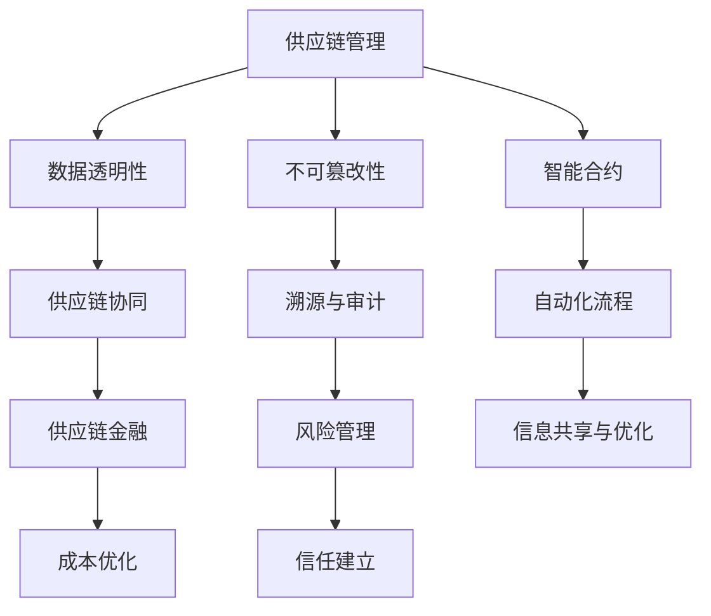

                 

# 《区块链技术在供应链管理中的创新应用》

## 关键词
- 区块链
- 供应链管理
- 溯源
- 智能合约
- 供应链金融
- 供应链协同
- 风险管理
- 优化
- 安全性

## 摘要
区块链技术以其独特的去中心化、不可篡改和透明性特点，在供应链管理中展现出了巨大的潜力。本文将详细探讨区块链技术在供应链管理中的创新应用，包括供应链协同、溯源与审计、供应链金融、供应链风险管理以及供应链优化等方面的应用。同时，还将分析区块链技术在供应链管理中的挑战及其解决方案，并对未来发展趋势进行展望。

## 第一部分：区块链技术与供应链管理基础

### 1.1 区块链技术概述

#### 1.1.1 区块链的定义与核心技术

区块链是一种分布式数据库技术，通过加密算法和数据结构实现了信息的去中心化存储和传输。其核心技术包括哈希函数、链式区块结构、加密算法和共识机制。

- **哈希函数**：将任意长度的数据映射为固定长度的字符串，具有唯一性和抗逆性。
- **链式区块结构**：通过将数据分块，每个区块都包含一定数量的交易记录，并通过哈希函数与前一个区块相连，形成链式结构。
- **加密算法**：保证数据的完整性和隐私性，防止未经授权的访问和篡改。
- **共识机制**：通过全网节点共同验证和确认交易，确保区块链的可靠性和一致性。

#### 1.1.2 区块链的发展历史

区块链技术最早由中本聪（Satoshi Nakamoto）在2008年提出，并在2009年发布了第一个区块链系统——比特币（Bitcoin）。随后，区块链技术不断发展，衍生出了多种应用场景和改进方案，如以太坊（Ethereum）、Hyperledger Fabric 等。

#### 1.1.3 区块链在供应链管理中的潜在应用

区块链技术在供应链管理中具有以下潜在应用：

- **数据透明性**：通过区块链技术，供应链中的各方可以实时查看交易记录和产品信息，提高供应链的透明度。
- **不可篡改性**：区块链的数据一旦写入，就无法篡改，保证了供应链数据的真实性和可靠性。
- **智能合约**：通过智能合约，供应链中的各方可以自动执行约定好的业务流程，降低交易成本。
- **溯源与审计**：区块链技术可以实现产品从生产到销售的全程溯源，方便进行审计和召回。

### 1.2 供应链管理概述

#### 1.2.1 供应链管理的定义与基本流程

供应链管理是指通过计划、组织、协调、控制和优化等手段，对供应链中的资源、信息和流程进行有效管理和控制，以实现供应链整体绩效的优化。

供应链管理的基本流程包括：

- **需求计划**：预测市场需求，制定生产计划。
- **采购**：采购原材料、零部件等。
- **生产**：根据生产计划进行生产。
- **仓储**：存储和管理库存。
- **运输**：将产品运输到目的地。
- **配送**：将产品配送给客户。
- **售后服务**：提供售后服务和反馈。

#### 1.2.2 供应链管理的挑战与痛点

供应链管理面临以下挑战和痛点：

- **数据不透明**：供应链中的信息传递不畅，导致数据不一致和透明度不足。
- **信息孤岛**：各部门之间的信息无法共享，降低了供应链的整体效率。
- **供应链协同困难**：供应链中的各方利益不一致，导致协同困难。
- **溯源困难**：产品从生产到销售的全程信息难以追溯，增加了审计和召回的成本。
- **信任问题**：供应链中的各方存在信任问题，导致合作困难。

#### 1.2.3 区块链技术在供应链管理中的价值

区块链技术在供应链管理中具有以下价值：

- **数据透明性**：通过区块链技术，供应链中的各方可以实时查看交易记录和产品信息，提高供应链的透明度。
- **不可篡改性**：区块链的数据一旦写入，就无法篡改，保证了供应链数据的真实性和可靠性。
- **智能合约**：通过智能合约，供应链中的各方可以自动执行约定好的业务流程，降低交易成本。
- **溯源与审计**：区块链技术可以实现产品从生产到销售的全程溯源，方便进行审计和召回。

### 1.3 区块链与供应链管理的核心概念与联系

为了更好地理解区块链技术在供应链管理中的应用，我们可以使用Mermaid流程图来展示区块链与供应链管理的核心概念和联系。

- **数据透明性**：区块链技术提高了供应链中的数据透明性，使各方能够实时查看交易记录和产品信息。
- **不可篡改性**：区块链的数据一旦写入，就无法篡改，保证了供应链数据的真实性和可靠性。
- **智能合约**：智能合约实现了供应链中的自动执行业务流程，降低了交易成本。
- **供应链协同**：区块链技术促进了供应链中的协同，提高了整体效率。
- **溯源与审计**：区块链技术实现了产品从生产到销售的全程溯源，方便进行审计和召回。
- **自动化流程**：智能合约和区块链技术的结合，实现了供应链中的自动化流程。
- **供应链金融**：区块链技术为供应链金融提供了新的解决方案，降低了融资成本。
- **成本优化**：区块链技术通过提高透明度和自动化流程，实现了成本的优化。
- **风险管理**：区块链技术提高了供应链的透明度和可追溯性，有助于降低风险管理。
- **信息共享与优化**：区块链技术促进了供应链中的信息共享，优化了整体流程。

## 第二部分：区块链技术在供应链管理中的创新应用

### 2.1 区块链技术在供应链协同中的应用

#### 2.1.1 供应链协同的基本概念

供应链协同是指供应链中的各方通过共享信息、协调计划和优化资源，实现供应链整体绩效的优化。区块链技术为供应链协同提供了以下优势：

- **透明性**：区块链技术提供了实时透明的数据共享，使各方能够实时了解供应链的运行状态。
- **可信性**：区块链技术的不可篡改性和加密算法，保证了供应链数据的可信性。
- **自动化**：智能合约可以自动执行供应链中的业务流程，降低了人工干预和操作风险。

#### 2.1.2 区块链在供应链协同中的优势

区块链技术在供应链协同中具有以下优势：

- **数据共享**：区块链技术实现了供应链中的实时数据共享，提高了协同效率。
- **降低成本**：区块链技术降低了信息传递和业务处理的成本，提高了供应链的整体效率。
- **提高透明度**：区块链技术提供了透明的数据记录，有助于各方了解供应链的运行状态。
- **减少纠纷**：区块链技术的不可篡改性，减少了供应链中的纠纷和争议。
- **提高响应速度**：区块链技术实现了供应链中的自动化流程，提高了响应速度。

#### 2.1.3 区块链在供应链协同中的应用案例

以下是一个区块链在供应链协同中的应用案例：

- **供应链协同平台**：一个公司建立了一个基于区块链的供应链协同平台，实现了与供应商、物流公司和零售商的数据共享和协同。通过该平台，各方能够实时查看订单状态、库存信息和物流进展，实现了高效的供应链协同。

#### 2.1.4 区块链在供应链协同中的挑战与解决方案

区块链在供应链协同中面临以下挑战：

- **数据隐私**：区块链技术的公开透明性可能会泄露敏感数据，需要采取隐私保护措施。
- **系统兼容性**：区块链技术需要与现有的供应链管理系统进行集成，可能存在兼容性问题。
- **技术成本**：区块链技术的开发和运维成本较高，可能对中小企业造成负担。

解决方案：

- **隐私保护**：通过使用零知识证明、同态加密等隐私保护技术，保障供应链数据的隐私性。
- **系统集成**：采用区块链即服务（Blockchain as a Service，BaaS）模式，降低系统集成的难度。
- **成本控制**：通过优化区块链架构、采用共享节点等方式，降低区块链技术的成本。

### 2.2 区块链技术在溯源与审计中的应用

#### 2.2.1 溯源与审计的基本概念

溯源与审计是指对产品从生产到销售的全程进行跟踪和审核，确保产品的质量和安全性。区块链技术在溯源与审计中具有以下优势：

- **不可篡改性**：区块链的数据一旦写入，就无法篡改，保证了溯源与审计数据的真实性。
- **透明性**：区块链技术提供了透明的数据记录，方便进行溯源与审计。
- **可追溯性**：区块链技术实现了产品从生产到销售的全程可追溯，提高了审计效率。

#### 2.2.2 区块链在溯源与审计中的应用

区块链技术在溯源与审计中的应用主要包括：

- **产品溯源**：通过对区块链中的数据记录进行查询，可以追溯产品从生产到销售的整个过程，确保产品的质量和安全性。
- **审计**：区块链技术提供了透明的数据记录，方便进行审计，减少了审计成本和风险。
- **防伪**：通过区块链技术，可以对产品进行唯一标识，防止假冒伪劣产品的流通。

#### 2.2.3 区块链在溯源与审计中的挑战与解决方案

区块链在溯源与审计中面临以下挑战：

- **数据存储容量**：区块链的数据存储容量有限，可能无法满足大规模产品的溯源需求。
- **数据隐私**：区块链技术的公开透明性可能会泄露敏感数据，需要采取隐私保护措施。
- **系统兼容性**：区块链技术需要与现有的溯源与审计系统进行集成，可能存在兼容性问题。

解决方案：

- **分布式存储**：采用分布式存储技术，提高区块链的数据存储容量。
- **隐私保护**：通过使用零知识证明、同态加密等隐私保护技术，保障溯源与审计数据的隐私性。
- **系统集成**：采用区块链即服务（Blockchain as a Service，BaaS）模式，降低系统集成的难度。

### 2.3 区块链技术在供应链金融中的应用

#### 2.3.1 供应链金融的基本概念

供应链金融是指以供应链为基础，通过金融手段解决供应链中企业融资难、融资贵的问题。区块链技术在供应链金融中具有以下优势：

- **透明性**：区块链技术提供了透明的数据记录，方便金融机构进行风险评估。
- **可信性**：区块链技术的不可篡改性，保证了供应链金融数据的可信性。
- **自动化**：智能合约可以自动执行供应链金融的业务流程，提高了融资效率。

#### 2.3.2 区块链在供应链金融中的应用

区块链技术在供应链金融中的应用主要包括：

- **融资**：通过区块链技术，企业可以实时展示供应链中的交易记录和资产状况，提高了金融机构的风险评估和融资决策效率。
- **支付**：区块链技术实现了快速、安全、低成本的支付，降低了供应链中的交易成本。
- **保险**：通过区块链技术，可以实现保险的自动化处理和风险监控，提高了保险业务的效率。

#### 2.3.3 区块链在供应链金融中的挑战与解决方案

区块链在供应链金融中面临以下挑战：

- **数据隐私**：区块链技术的公开透明性可能会泄露敏感数据，需要采取隐私保护措施。
- **系统兼容性**：区块链技术需要与现有的金融系统进行集成，可能存在兼容性问题。
- **法律合规性**：区块链技术在金融领域的应用需要符合相关法律法规的要求。

解决方案：

- **隐私保护**：通过使用零知识证明、同态加密等隐私保护技术，保障供应链金融数据的隐私性。
- **系统集成**：采用区块链即服务（Blockchain as a Service，BaaS）模式，降低系统集成的难度。
- **法律合规性**：与监管机构合作，制定合适的法律法规，确保区块链技术在金融领域的合规应用。

### 2.4 区块链技术在供应链风险管理中的应用

#### 2.4.1 供应链风险管理的基本概念

供应链风险管理是指识别、评估、监控和应对供应链中潜在的风险，以确保供应链的稳定运行。区块链技术在供应链风险管理中具有以下优势：

- **数据透明性**：区块链技术提供了透明的数据记录，方便进行风险评估。
- **不可篡改性**：区块链的数据一旦写入，就无法篡改，保证了风险管理数据的真实性。
- **自动化**：智能合约可以自动执行供应链风险管理中的业务流程，提高了风险管理效率。

#### 2.4.2 区块链在供应链风险管理中的应用

区块链技术在供应链风险管理中的应用主要包括：

- **风险评估**：通过对区块链中的数据记录进行分析，可以识别供应链中的潜在风险，并制定相应的风险应对策略。
- **监控与预警**：通过实时监控区块链中的数据变化，可以及时发现供应链中的风险，并进行预警。
- **风险处置**：通过区块链技术，可以实现供应链风险处置的自动化和高效化。

#### 2.4.3 区块链在供应链风险管理中的挑战与解决方案

区块链在供应链风险管理中面临以下挑战：

- **数据隐私**：区块链技术的公开透明性可能会泄露敏感数据，需要采取隐私保护措施。
- **系统兼容性**：区块链技术需要与现有的风险管理系统进行集成，可能存在兼容性问题。
- **法律合规性**：区块链技术在风险管理领域的应用需要符合相关法律法规的要求。

解决方案：

- **隐私保护**：通过使用零知识证明、同态加密等隐私保护技术，保障供应链风险管理数据的隐私性。
- **系统集成**：采用区块链即服务（Blockchain as a Service，BaaS）模式，降低系统集成的难度。
- **法律合规性**：与监管机构合作，制定合适的法律法规，确保区块链技术在风险管理领域的合规应用。

### 2.5 区块链技术在供应链优化中的应用

#### 2.5.1 供应链优化的基本概念

供应链优化是指通过改进供应链的设计、流程和策略，提高供应链的整体绩效。区块链技术在供应链优化中具有以下优势：

- **数据透明性**：区块链技术提供了透明的数据记录，方便进行供应链优化分析。
- **不可篡改性**：区块链的数据一旦写入，就无法篡改，保证了供应链优化数据的真实性。
- **自动化**：智能合约可以自动执行供应链优化中的业务流程，提高了优化效率。

#### 2.5.2 区块链在供应链优化中的应用

区块链技术在供应链优化中的应用主要包括：

- **库存管理**：通过区块链技术，可以实现供应链中库存的实时监控和优化，降低库存成本。
- **物流优化**：通过区块链技术，可以实现物流信息的实时共享和优化，提高物流效率。
- **供应链协同**：通过区块链技术，可以实现供应链中各方的实时协同和优化，提高供应链的整体绩效。

#### 2.5.3 区块链在供应链优化中的挑战与解决方案

区块链在供应链优化中面临以下挑战：

- **数据隐私**：区块链技术的公开透明性可能会泄露敏感数据，需要采取隐私保护措施。
- **系统兼容性**：区块链技术需要与现有的供应链管理系统进行集成，可能存在兼容性问题。
- **法律合规性**：区块链技术在供应链优化领域的应用需要符合相关法律法规的要求。

解决方案：

- **隐私保护**：通过使用零知识证明、同态加密等隐私保护技术，保障供应链优化数据的隐私性。
- **系统集成**：采用区块链即服务（Blockchain as a Service，BaaS）模式，降低系统集成的难度。
- **法律合规性**：与监管机构合作，制定合适的法律法规，确保区块链技术在供应链优化领域的合规应用。

## 第三部分：区块链技术在供应链管理中的未来发展趋势与挑战

### 3.1 区块链技术在供应链管理中的未来发展趋势

随着区块链技术的不断发展，其在供应链管理中的应用前景也十分广阔。以下是区块链技术在供应链管理中的未来发展趋势：

- **技术成熟**：随着区块链技术的不断成熟，其性能和安全性将进一步提高，为供应链管理提供更可靠的技术支持。
- **应用场景丰富**：区块链技术在供应链管理中的应用场景将不断拓展，包括供应链协同、溯源与审计、供应链金融、供应链风险管理等。
- **跨行业合作**：区块链技术在供应链管理中的应用将促进跨行业合作，实现供应链的全面优化和升级。
- **政策支持**：随着各国政府对区块链技术的重视，将出台更多政策支持区块链技术在供应链管理中的应用，推动其快速发展。

### 3.2 区块链技术在供应链管理中的挑战与解决方案

尽管区块链技术在供应链管理中具有巨大的潜力，但仍面临一些挑战。以下是区块链技术在供应链管理中的挑战及其解决方案：

- **技术挑战**：区块链技术本身还存在一些技术挑战，如性能、可扩展性、安全性等。解决方案是持续进行技术创新和优化，提高区块链技术的性能和安全性。
- **数据隐私**：区块链技术的公开透明性可能会泄露敏感数据，需要采取隐私保护措施。解决方案是采用隐私保护技术，如零知识证明、同态加密等，保障数据隐私。
- **法律合规性**：区块链技术在供应链管理中的应用需要符合相关法律法规的要求。解决方案是与监管机构合作，制定合适的法律法规，确保区块链技术在供应链管理中的合规应用。
- **普及与接受度**：区块链技术在供应链管理中的普及与接受度还有待提高。解决方案是通过案例推广、培训教育等方式，提高区块链技术在供应链管理中的普及与接受度。

## 附录

### 附录 A：区块链技术在供应链管理中的实用工具与资源

#### A.1 区块链平台介绍

- **Ethereum**：一个开源的智能合约平台，支持去中心化的应用（DApps）开发。
- **Hyperledger Fabric**：一个开源的企业级区块链框架，适用于供应链管理等领域。
- **Quorum**：一个基于Ethereum的企业级区块链平台，支持私有链和智能合约。

#### A.2 区块链开发工具与框架

- **Truffle**：一个用于Ethereum区块链的开发环境，提供智能合约测试、部署和管理等功能。
- **Ganache**：一个本地以太坊区块链节点，用于本地测试和开发。
- **Node.js**：一个基于Chrome V8引擎的JavaScript运行环境，适用于区块链应用开发。

#### A.3 区块链相关书籍与论文推荐

- **《区块链：从数字货币到信用机制》**：详细介绍了区块链技术的原理和应用。
- **《区块链：构建区块链应用的核心技术》**：介绍了区块链技术的核心原理和应用开发。
- **《供应链金融：区块链应用指南》**：探讨了区块链技术在供应链金融中的应用。

### 附录 B：区块链技术在供应链管理中的应用案例

#### B.1 案例一：XX公司的区块链供应链协同平台

- **项目背景**：XX公司是一家大型制造企业，面临供应链协同困难、信息孤岛等问题。
- **解决方案**：XX公司采用区块链技术建立了一个供应链协同平台，实现了与供应商、物流公司和零售商的数据共享和协同。
- **实施效果**：通过区块链技术，XX公司提高了供应链协同效率，降低了信息传递成本，提升了供应链的整体绩效。

#### B.2 案例二：YY公司的区块链溯源系统

- **项目背景**：YY公司是一家食品生产企业，面临产品溯源困难、质量监管问题。
- **解决方案**：YY公司采用区块链技术建立了一个区块链溯源系统，实现了产品从生产到销售的全程溯源。
- **实施效果**：通过区块链溯源系统，YY公司提高了产品质量和消费者信任度，降低了召回成本。

#### B.3 案例三：ZZ公司的区块链供应链金融解决方案

- **项目背景**：ZZ公司是一家中小企业，面临融资难、融资贵的问题。
- **解决方案**：ZZ公司采用区块链技术建立了一个区块链供应链金融解决方案，实现了供应链金融的自动化和高效化。
- **实施效果**：通过区块链供应链金融解决方案，ZZ公司提高了融资效率，降低了融资成本，提升了企业竞争力。

### 作者

**作者：AI天才研究院/AI Genius Institute & 禅与计算机程序设计艺术 /Zen And The Art of Computer Programming**

