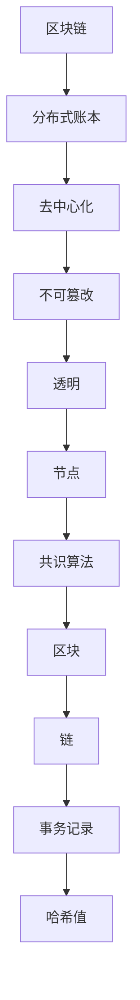
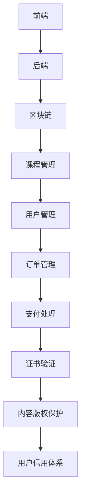

                 

### 文章标题

#### 《区块链技术在知识付费中的应用》

关键词：区块链、知识付费、去中心化、智能合约、数字版权、信用体系

摘要：本文将从区块链技术的基础知识出发，详细探讨区块链在知识付费领域的应用，包括证书验证、内容版权保护、用户信用体系等方面。通过案例分析与实践，揭示区块链技术在知识付费中的潜力与挑战，为未来该领域的发展提供参考。

---

### 《区块链技术在知识付费中的应用》目录大纲

#### 第一部分：区块链技术基础

##### 第1章：区块链概述

###### 1.1 区块链的定义与特点

区块链是一种分布式数据库技术，具有去中心化、不可篡改、透明等核心特性。

- 区块链的基本原理
- 区块链的核心特性：去中心化、不可篡改、透明等

##### 第2章：加密技术基础

###### 2.1 公钥加密与私钥加密

- 公钥加密算法
- 私钥加密算法

###### 2.2 数字签名与身份验证

- 数字签名的工作原理
- 身份验证的实现方式

##### 第3章：智能合约与去中心化应用

###### 3.1 智能合约基础

智能合约是一种自动化执行合同条款的计算机协议。

- 智能合约的定义与特点
- 智能合约的实现

###### 3.2 去中心化应用（DApp）开发

DApp是一种在区块链上运行的分布式应用。

- DApp的基本架构
- DApp的开发流程

#### 第二部分：区块链在知识付费中的应用

##### 第4章：知识付费市场分析

###### 4.1 知识付费的发展历程

- 知识付费的市场背景
- 知识付费的现状与趋势

###### 4.2 知识付费的痛点分析

- 知识付费市场存在的问题
- 区块链技术在解决痛点方面的优势

##### 第5章：区块链技术在知识付费中的应用

###### 5.1 证书验证与学位认证

- 证书验证的区块链解决方案
- 学位认证的区块链解决方案

###### 5.2 内容版权保护

- 数字版权保护的区块链解决方案
- 知识付费平台的内容版权保护实践

###### 5.3 用户信用体系

- 基于区块链的用户信用评价体系
- 用户信用体系在知识付费中的应用

##### 第6章：区块链知识付费平台设计与实现

###### 6.1 平台架构设计

- 平台的技术选型
- 平台的功能模块划分

###### 6.2 平台开发与部署

- 开发环境搭建
- 平台的核心模块实现

##### 第7章：区块链知识付费平台运营与推广

###### 7.1 运营策略

- 用户运营
- 内容运营

###### 7.2 平台推广

- 线上推广
- 线下推广

#### 第三部分：案例分析与实践

##### 第8章：国内外区块链知识付费平台案例分析

###### 8.1 国内知名区块链知识付费平台

- 平台介绍
- 运营模式
- 成功经验与挑战

###### 8.2 国外典型区块链知识付费平台

- 平台介绍
- 商业模式
- 国际化发展

##### 第9章：区块链知识付费项目实战

###### 9.1 项目背景

- 项目简介
- 项目目标

###### 9.2 项目实施

- 技术方案设计
- 项目实施过程

###### 9.3 项目效果评估

- 项目成果
- 用户反馈

##### 第10章：未来展望与趋势

###### 10.1 区块链技术在知识付费领域的未来发展趋势

- 技术创新
- 应用拓展

###### 10.2 知识付费市场面临的挑战与机遇

- 技术挑战
- 市场机遇

### 附录

#### 附录 A：区块链开发工具与资源

##### A.1 主流区块链平台

- Ethereum
- Hyperledger Fabric
- EOS

##### A.2 区块链开发工具

- Truffle
- Ganache
- Chainlink

##### A.3 区块链学习资源

- 区块链开发教程
- 区块链白皮书
- 相关书籍推荐

---

### 正文开始

#### 第一部分：区块链技术基础

##### 第1章：区块链概述

区块链技术是一种分布式账本技术，通过在多个节点之间共享和同步数据，实现了去中心化、不可篡改和透明等特性。区块链技术的核心概念包括区块、链、节点和共识算法。

- **区块**：区块是区块链的基本组成单元，包含一定数量的事务记录。每个区块都有一个唯一的标识，即哈希值。
- **链**：区块链是一个由区块按时间顺序连接而成的链式结构。新的区块通过哈希函数与上一个区块连接，形成一条链。
- **节点**：节点是区块链网络中的参与者，负责维护和更新区块链数据。每个节点都保存了一份完整的区块链副本。
- **共识算法**：共识算法是区块链网络中节点之间达成一致的方法。常见的共识算法包括工作量证明（Proof of Work, PoW）和权益证明（Proof of Stake, PoS）。

区块链的基本原理可以通过以下图示来理解：



##### 第2章：加密技术基础

加密技术是区块链技术的重要组成部分，用于保障数据的安全性和隐私性。加密技术主要包括公钥加密与私钥加密、数字签名与身份验证。

###### 2.1 公钥加密与私钥加密

- **公钥加密**：公钥加密使用一对密钥（公钥和私钥）进行加密和解密。公钥用于加密，私钥用于解密。常见的公钥加密算法包括RSA算法和ECC算法。
- **私钥加密**：私钥加密使用私钥进行加密，任何人都可以使用公钥解密。私钥加密主要用于数字签名和身份验证。

以下是一个RSA加密算法的简单实现：

```python
from Crypto.PublicKey import RSA
from Crypto.Cipher import PKCS1_OAEP

# 生成RSA密钥对
key = RSA.generate(2048)
private_key = key.export_key()
public_key = key.publickey().export_key()

# 加密数据
cipher = PKCS1_OAEP.new(RSA.import_key(public_key))
encrypted_data = cipher.encrypt(b'Hello, World!')

# 解密数据
decryptor = PKCS1_OAEP.new(RSA.import_key(private_key))
decrypted_data = decryptor.decrypt(encrypted_data)
print(decrypted_data)
```

###### 2.2 数字签名与身份验证

- **数字签名**：数字签名是一种验证数据完整性和身份的方法。发送方使用私钥对数据进行签名，接收方使用公钥验证签名。
- **身份验证**：身份验证是确保用户身份的真实性。常见的身份验证方式包括密码验证、双因素验证和生物识别等。

以下是一个基于RSA算法的数字签名示例：

```python
from Crypto.Signature import pkcs1_15
from Crypto.Hash import SHA256

# 生成RSA密钥对
key = RSA.generate(2048)
private_key = key.export_key()
public_key = key.publickey().export_key()

# 生成哈希值
hash_value = SHA256.new(b'Hello, World!')

# 签名
signer = pkcs1_15.new(RSA.import_key(private_key))
signature = signer.sign(hash_value)

# 验证签名
verifier = pkcs1_15.new(RSA.import_key(public_key))
is_valid = verifier.verify(hash_value, signature)
print(is_valid)
```

##### 第3章：智能合约与去中心化应用

智能合约是一种自动化执行合同条款的计算机协议。智能合约在区块链上运行，具有不可篡改和透明等特性。

###### 3.1 智能合约基础

- **智能合约的定义**：智能合约是一种在区块链上执行的计算机程序，它自动执行合同条款，无需依赖第三方。
- **智能合约的特点**：智能合约具有不可篡改、透明和去中心化等特性。

以下是一个简单的智能合约示例，用于实现一个简单的转账功能：

```solidity
pragma solidity ^0.8.0;

contract Transfer {
    address public owner;
    mapping(address => uint256) public balances;

    constructor() {
        owner = msg.sender;
        balances[owner] = 1000;
    }

    function deposit() public payable {
        balances[msg.sender] += msg.value;
    }

    function transfer(address to, uint256 amount) public {
        require(balances[msg.sender] >= amount, "Insufficient balance");
        balances[msg.sender] -= amount;
        balances[to] += amount;
    }
}
```

###### 3.2 去中心化应用（DApp）开发

去中心化应用（DApp）是一种在区块链上运行的应用程序。DApp通常由前端、后端和智能合约三部分组成。

- **DApp的基本架构**：DApp的前端使用Web技术（如HTML、CSS和JavaScript）实现用户界面，后端使用区块链技术实现数据存储和交易处理，智能合约负责执行业务逻辑。
- **DApp的开发流程**：DApp的开发流程包括需求分析、系统设计、智能合约编写、前端开发、后端开发、测试和部署等阶段。

以下是一个使用Web3.js库与以太坊区块链交互的简单示例：

```javascript
const web3 = new Web3("https://mainnet.infura.io/v3/your_project_id");

const contractAddress = "0xAddress_of_the_contract";
const contractABI = [{"inputs": [{"internalType": "address", "name": "recipient", "type": "address"}], "stateMutability": "payable", "type": "function", "name": "deposit", "outputs": []}, {"inputs": [{"internalType": "address", "name": "recipient", "type": "address"}, {"internalType": "uint256", "name": "amount", "type": "uint256"}], "stateMutability": "nonpayable", "type": "function", "name": "transfer", "outputs": []}, {"stateMutability": "view", "type": "function", "name": "balanceOf", "inputs": [{"internalType": "address", "name": "_owner", "type": "address"}]}, {"stateMutability": "view", "type": "function", "name": "owner", "inputs": []}];

const contract = new web3.eth.Contract(contractABI, contractAddress);

// 调用智能合约的deposit函数
contract.methods.deposit({value: web3.utils.toWei("1", "ether")}).send({from: "your_address", gas: 2000000}, function(error, transactionHash) {
    if (error) {
        console.log(error);
    } else {
        console.log("Transaction hash:", transactionHash);
    }
});

// 调用智能合约的balanceOf函数
contract.methods.balanceOf("your_address").call({from: "your_address"}, function(error, balance) {
    if (error) {
        console.log(error);
    } else {
        console.log("Balance:", web3.utils.fromWei(balance, "ether"));
    }
});
```

#### 第二部分：区块链在知识付费中的应用

##### 第4章：知识付费市场分析

知识付费是指用户为获取知识或服务而付费的一种商业模式。近年来，随着互联网技术的发展和用户需求的变化，知识付费市场呈现出快速增长的趋势。

###### 4.1 知识付费的发展历程

- **早期阶段**：知识付费的起源可以追溯到20世纪90年代，当时的主要形式是线下培训和图书销售。
- **发展阶段**：随着互联网的普及，知识付费逐渐从线下转移到线上，各类知识付费平台如雨后春笋般涌现。
- **成熟阶段**：当前，知识付费市场已经相对成熟，用户规模不断扩大，市场规模持续增长。

###### 4.2 知识付费的痛点分析

- **版权保护问题**：知识付费内容容易受到侵权和盗版，版权保护成为一个重要痛点。
- **信用体系不完善**：知识付费平台用户信用体系不完善，导致用户行为难以约束，服务质量难以保证。
- **支付问题**：知识付费平台需要提供便捷、安全的支付方式，但目前支付渠道较为单一，用户体验有待提升。
- **内容质量无法保证**：知识付费平台内容质量参差不齐，用户难以辨别真伪，导致用户体验不佳。

区块链技术在解决上述痛点方面具有显著优势。

##### 第5章：区块链技术在知识付费中的应用

区块链技术可以为知识付费提供去中心化、不可篡改和透明等特性，从而解决版权保护、信用体系、支付问题等内容。

###### 5.1 证书验证与学位认证

- **证书验证**：区块链技术可以用于验证证书的真实性。证书发行方将证书信息上链，用户可以通过区块链浏览器查询证书信息，确保证书的真实性。
- **学位认证**：区块链技术可以用于学位认证，学历证明等文档信息上链，从而实现去中心化的学位认证。

以下是一个简单的证书验证流程：

1. 证书发行方将证书信息上链，包括证书编号、证书内容、颁发时间等。
2. 用户查询区块链浏览器，输入证书编号，获取证书信息。
3. 用户验证证书信息与区块链上存储的信息一致性。

###### 5.2 内容版权保护

- **数字版权保护**：区块链技术可以用于保护数字版权，版权所有者将版权信息上链，实现版权的可信认证和追踪。
- **知识付费平台的内容版权保护**：知识付费平台可以通过区块链技术确保内容的版权归属，防止内容盗版和侵权。

以下是一个简单的数字版权保护流程：

1. 版权所有者将版权信息（如作品名称、作者信息、版权声明等）上链。
2. 用户获取版权信息，确认版权归属。
3. 用户使用版权信息进行作品创作和发布，确保版权归属清晰。

###### 5.3 用户信用体系

- **用户信用评价**：区块链技术可以用于构建去中心化的用户信用评价体系，通过对用户行为进行评分，实现用户行为的可信追踪和约束。
- **知识付费平台用户信用体系**：知识付费平台可以通过区块链技术构建用户信用体系，提高用户服务质量，优化用户体验。

以下是一个简单的用户信用评价流程：

1. 知识付费平台定义用户信用评价标准，包括行为评分、内容质量评分等。
2. 用户在知识付费平台进行活动，如购买课程、发布内容等，平台根据评价标准计算用户信用评分。
3. 用户信用评分上链，其他用户和平台可以通过区块链查询用户信用评分。

##### 第6章：区块链知识付费平台设计与实现

区块链知识付费平台的设计与实现需要考虑平台架构、功能模块划分、开发环境搭建、核心模块实现等方面。

###### 6.1 平台架构设计

区块链知识付费平台架构主要包括前端、后端和区块链三部分。

- **前端**：前端负责用户交互，包括课程列表、课程详情、用户注册、登录、购买等功能。
- **后端**：后端负责业务逻辑处理，包括课程管理、用户管理、订单管理、支付处理等功能。
- **区块链**：区块链负责数据存储和交易处理，包括证书验证、内容版权保护、用户信用体系等功能。

以下是一个简单的平台架构图：



###### 6.2 平台开发与部署

区块链知识付费平台的开发与部署包括以下步骤：

1. **需求分析**：明确平台功能需求，如课程管理、用户管理、订单管理、支付处理等。
2. **系统设计**：设计平台架构，包括前端、后端和区块链部分。
3. **开发环境搭建**：搭建开发环境，包括前端开发工具、后端开发框架、区块链节点等。
4. **核心模块实现**：实现平台核心功能模块，如课程管理、用户管理、订单管理、支付处理等。
5. **测试与部署**：对平台进行功能测试和性能测试，确保平台稳定运行，然后进行部署。

以下是一个简单的开发与部署流程：

1. **需求分析**：明确平台功能需求。
2. **系统设计**：设计平台架构。
3. **开发环境搭建**：搭建开发环境。
4. **前端开发**：使用HTML、CSS和JavaScript开发前端界面。
5. **后端开发**：使用Spring Boot等框架开发后端业务逻辑。
6. **区块链开发**：使用Solidity等语言编写智能合约。
7. **测试与部署**：对平台进行测试和部署。

##### 第7章：区块链知识付费平台运营与推广

区块链知识付费平台的运营与推广包括运营策略、用户运营、内容运营、平台推广等方面。

###### 7.1 运营策略

- **用户运营**：通过用户调研、活动策划、用户反馈等方式了解用户需求，优化平台服务。
- **内容运营**：通过内容策划、内容推广、内容审核等方式确保平台内容质量，提高用户满意度。
- **平台推广**：通过线上推广、线下推广、合作伙伴等方式扩大平台影响力。

以下是一个简单的运营策略：

1. **用户运营**：定期开展用户调研，了解用户需求和反馈，优化平台功能和服务。
2. **内容运营**：策划高质量的内容，推广优质课程，确保内容质量。
3. **平台推广**：开展线上营销活动，合作推广，扩大平台影响力。

###### 7.2 平台推广

平台推广包括线上推广和线下推广两种方式。

- **线上推广**：通过社交媒体、搜索引擎优化、内容营销等方式提高平台知名度。
- **线下推广**：通过展会、讲座、合作活动等方式扩大平台影响力。

以下是一个简单的平台推广策略：

1. **线上推广**：利用微信、微博、抖音等社交媒体平台，发布有趣、有价值的内容，吸引潜在用户。
2. **线下推广**：参加行业展会、举办讲座和活动，与合作伙伴合作，提高平台知名度。

#### 第三部分：案例分析与实践

##### 第8章：国内外区块链知识付费平台案例分析

国内外已有多家区块链知识付费平台，本文将介绍其中两个具有代表性的平台。

###### 8.1 国内知名区块链知识付费平台

- **平台介绍**：国内知名区块链知识付费平台，以区块链技术为核心，提供区块链课程、认证、社区等服务。
- **运营模式**：通过区块链技术实现课程认证、用户信用评价等功能，提供去中心化的知识付费服务。
- **成功经验与挑战**：成功经验包括技术优势、用户体验和社区建设。挑战包括技术迭代、政策法规和市场推广等方面。

###### 8.2 国外典型区块链知识付费平台

- **平台介绍**：国外典型区块链知识付费平台，提供在线课程、认证、区块链技术社区等服务。
- **商业模式**：通过区块链技术实现课程版权保护、用户信用评价等功能，提供去中心化的知识付费服务。
- **国际化发展**：通过全球化布局、多元文化社区建设等策略，实现国际化发展。

##### 第9章：区块链知识付费项目实战

本文将介绍一个实际的区块链知识付费项目，包括项目背景、目标、技术方案设计、项目实施过程和效果评估等方面。

###### 9.1 项目背景

- **项目简介**：本项目旨在构建一个去中心化的知识付费平台，提供区块链课程、认证、社区等服务。
- **项目目标**：实现课程版权保护、用户信用评价、去中心化支付等功能，提高用户体验和平台效率。

###### 9.2 项目实施

- **技术方案设计**：采用以太坊区块链技术，实现课程版权保护、用户信用评价、去中心化支付等功能。
- **项目实施过程**：包括前端开发、后端开发、区块链开发、测试与部署等阶段。
- **效果评估**：通过用户反馈、平台数据等指标进行效果评估，包括用户满意度、课程质量、交易效率等方面。

##### 第10章：未来展望与趋势

区块链技术在知识付费领域的应用前景广阔，未来发展趋势包括以下几个方面。

###### 10.1 区块链技术在知识付费领域的未来发展趋势

- **技术创新**：随着区块链技术的发展，将出现更多高效、安全的区块链应用。
- **应用拓展**：区块链技术在知识付费领域将实现更广泛的应用，如知识版权保护、智能教育、在线认证等。

###### 10.2 知识付费市场面临的挑战与机遇

- **技术挑战**：区块链技术仍存在性能、安全性等方面的问题，需要不断优化和升级。
- **市场机遇**：随着知识付费市场的快速增长，区块链技术将为知识付费提供更多创新解决方案，创造巨大的市场机遇。

### 附录

#### 附录 A：区块链开发工具与资源

##### A.1 主流区块链平台

- **Ethereum**：以太坊是最流行的智能合约平台，提供去中心化应用（DApp）开发环境。
- **Hyperledger Fabric**：Hyperledger Fabric是IBM主导的区块链框架，适用于企业级应用。
- **EOS**：EOS是一个高性能、易扩展的区块链平台，适用于去中心化应用。

##### A.2 区块链开发工具

- **Truffle**：Truffle是一个以太坊开发框架，提供智能合约部署、测试和调试等功能。
- **Ganache**：Ganache是一个本地以太坊节点，用于测试智能合约。
- **Chainlink**：Chainlink是一个去中心化外部数据集成平台，用于智能合约的数据获取。

##### A.3 区块链学习资源

- **区块链开发教程**：包括入门教程、中级教程和高级教程，适合不同层次的学习者。
- **区块链白皮书**：区块链技术的官方文档，详细介绍了区块链的工作原理和应用场景。
- **相关书籍推荐**：包括《区块链革命》、《精通比特币》、《区块链：从数字货币到信用社会》等经典著作，为区块链学习提供了丰富的理论支持。

