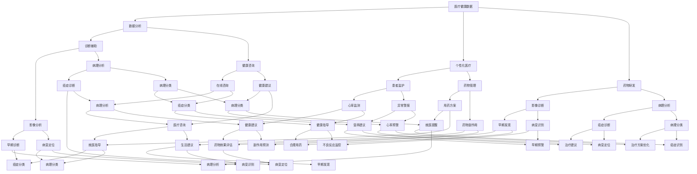

                 

### 2.1 AI与医疗健康的结合点

AI在医疗健康领域的应用，不仅仅是为了提升效率，更重要的是为了改善患者的生活质量和医疗服务的质量。以下是AI与医疗健康结合的几个关键点：

#### 2.1.1 医疗健康数据的价值

医疗健康数据是医疗行业的重要组成部分，包括电子健康记录（EHR）、医学影像、基因组数据、患者行为数据等。这些数据蕴含着宝贵的医疗信息，能够用于：

- **数据分析：** 医疗健康数据的分析能够揭示疾病的分布、趋势和影响因素，为疾病预防、诊断和治疗提供重要依据。例如，通过分析大规模的医疗数据，可以发现特定地区某种疾病的流行趋势，从而及时采取预防措施。

- **个性化医疗：** 基于患者的基因、生活方式等数据，AI可以提供个性化的治疗方案，提高医疗效果。例如，通过分析患者的基因组数据，医生可以为患者量身定制个性化抗癌药物，从而提高治疗效果。

- **药物研发：** AI可以加速药物研发过程，通过分析大量生物信息数据，预测药物的作用机制和副作用。这不仅可以缩短药物研发周期，还可以降低研发成本。

#### 2.1.2 AI在医疗健康领域的应用场景

AI在医疗健康领域的应用场景非常广泛，主要包括以下几个方面：

- **诊断辅助：** AI可以帮助医生进行影像诊断、病理分析等，提高诊断准确率。例如，通过深度学习算法分析医学影像，AI可以在早期阶段发现病变，提高癌症等重大疾病的早期诊断率。

- **患者监护：** 通过可穿戴设备，AI可以实时监测患者的健康数据，提供预警和个性化建议。例如，对于心脏病患者，AI可以监测其心率变化，当出现异常情况时及时发出警报，提醒患者就医。

- **药物管理：** AI可以辅助医生制定合理的用药方案，减少药物副作用。例如，通过分析患者的药物过敏史、基因信息等，AI可以为患者推荐最佳用药方案。

- **健康咨询：** AI可以提供在线健康咨询，帮助用户进行健康管理。例如，用户可以通过AI平台进行在线问诊，获取专业的医疗建议。

#### 2.1.3 AI在医疗健康领域的挑战

尽管AI在医疗健康领域具有巨大的潜力，但在实际应用中仍面临以下挑战：

- **数据隐私：** 医疗健康数据敏感性高，如何保护患者隐私成为一大挑战。特别是在数据共享和跨机构合作时，如何确保患者数据的安全和隐私，是一个需要解决的问题。

- **算法透明性：** AI算法的决策过程往往不透明，如何提高算法的透明性是一个重要问题。特别是在医疗决策中，算法的不透明性可能导致医生和患者的担忧。

- **医疗法规遵守：** AI在医疗健康领域的应用需要遵守相关法律法规，如《数据安全法》、《个人信息保护法》等。如何确保AI系统的合规性，是另一个重要问题。

### 核心概念与联系

为了更好地理解AI在医疗健康领域的应用，我们可以用Mermaid流程图来展示这些核心概念之间的联系：

通过这个流程图，我们可以清晰地看到AI在医疗健康领域如何结合各种数据和应用场景，实现诊断、治疗和健康管理的全面提升。接下来，我们将进一步探讨AI搜索技术在医疗健康领域的应用。

