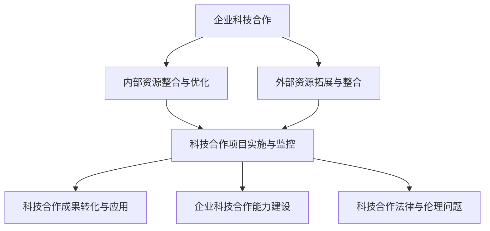
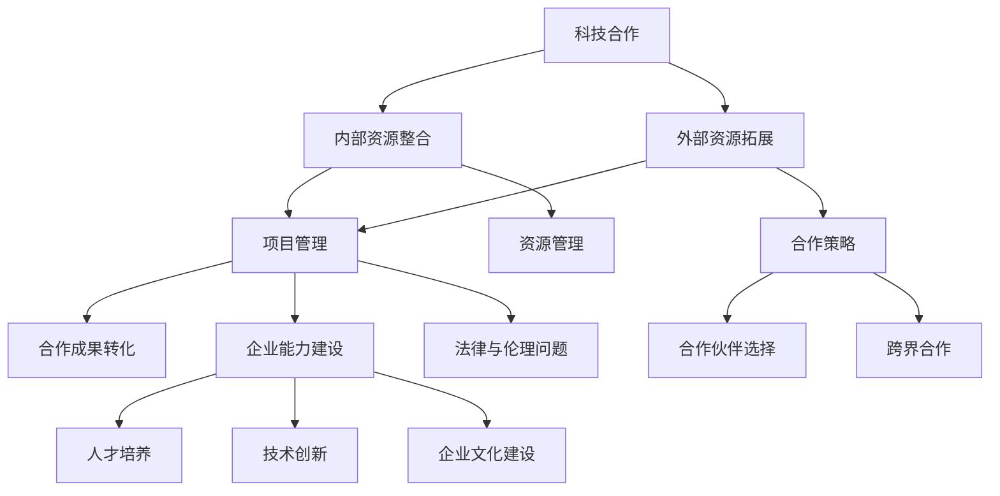

                 

# 协调内部和外部资源，推动公司在科技领域的对外合作与交流

## 关键词
科技合作、内部资源整合、外部资源拓展、项目管理、合作成果转化、企业能力建设、法律与伦理问题

## 摘要

在当前全球科技竞争日益激烈的环境下，企业要想在科技领域取得竞争优势，必须善于协调内部和外部资源，积极推动对外合作与交流。本文旨在探讨如何通过有效的资源整合和项目管理，推动企业在科技领域的对外合作与交流，从而实现技术创新和业务增长。文章分为七个部分，首先概述科技合作的基本概念和意义，然后分别从内部资源整合与优化、外部资源拓展与整合、科技合作项目实施与管理、合作成果转化与应用、企业科技合作能力建设以及科技合作的法律与伦理问题等方面进行详细分析。最后，通过附录部分提供相关资源与工具，为企业在科技合作领域提供实践指导。

## 目录大纲设计

### 第一部分: 协调内部和外部资源，推动公司在科技领域的对外合作与交流

#### 第1章: 科技合作概述

##### 1.1 科技合作的背景与意义

##### 1.1.1 全球科技竞争态势

##### 1.1.2 企业科技合作的需求

##### 1.1.3 科技合作对企业的战略价值

##### 1.2 科技合作的概念与类型

##### 1.2.1 科技合作的基本概念

##### 1.2.2 科技合作的分类

##### 1.2.3 科技合作的主要模式

##### 1.3 科技合作的发展趋势

##### 1.3.1 新兴科技领域的发展趋势

##### 1.3.2 国际科技合作的发展趋势

##### 1.3.3 企业科技合作的发展方向

#### 第2章: 内部资源整合与优化

##### 2.1 内部资源概述

##### 2.1.1 硬件资源

##### 2.1.2 软件资源

##### 2.1.3 人力资源

##### 2.2 内部资源整合策略

##### 2.2.1 整合策略概述

##### 2.2.2 资源共享与优化

##### 2.2.3 内部资源配置方法

##### 2.3 内部资源管理

##### 2.3.1 硬件资源管理

##### 2.3.2 软件资源管理

##### 2.3.3 人力资源管理

#### 第3章: 外部资源拓展与整合

##### 3.1 外部资源概述

##### 3.1.1 供应商资源

##### 3.1.2 合作伙伴资源

##### 3.1.3 研究机构资源

##### 3.2 外部资源拓展策略

##### 3.2.1 拓展策略概述

##### 3.2.2 合作伙伴选择

##### 3.2.3 研究机构合作

##### 3.3 外部资源整合与利用

##### 3.3.1 整合与利用概述

##### 3.3.2 跨界合作

##### 3.3.3 外部资源的评估与选择

#### 第4章: 科技合作项目的管理与实施

##### 4.1 科技合作项目概述

##### 4.1.1 项目类型

##### 4.1.2 项目生命周期

##### 4.2 项目管理方法

##### 4.2.1 项目管理概述

##### 4.2.2 项目计划与执行

##### 4.2.3 项目监控与评估

##### 4.3 项目风险管理

##### 4.3.1 风险管理概述

##### 4.3.2 风险识别与评估

##### 4.3.3 风险应对策略

##### 4.4 项目沟通与协作

##### 4.4.1 沟通与协作概述

##### 4.4.2 内部沟通机制

##### 4.4.3 外部沟通与协作

#### 第5章: 科技合作成果的转化与应用

##### 5.1 科技合作成果概述

##### 5.1.1 成果类型

##### 5.1.2 成果转化的重要性

##### 5.2 成果转化策略

##### 5.2.1 成果转化概述

##### 5.2.2 技术转移与扩散

##### 5.2.3 成果商业化

##### 5.3 成果应用与推广

##### 5.3.1 应用与推广概述

##### 5.3.2 成果应用案例

##### 5.3.3 成果推广策略

#### 第6章: 企业科技合作能力建设

##### 6.1 科技合作能力概述

##### 6.1.1 科技合作能力的定义

##### 6.1.2 科技合作能力的重要性

##### 6.2 科技合作能力评估

##### 6.2.1 评估方法

##### 6.2.2 评估指标体系

##### 6.3 科技合作能力提升策略

##### 6.3.1 提升策略概述

##### 6.3.2 人才培养

##### 6.3.3 技术创新

##### 6.3.4 企业文化建设

#### 第7章: 科技合作的法律与伦理问题

##### 7.1 科技合作法律问题

##### 7.1.1 合同法律问题

##### 7.1.2 知识产权法律问题

##### 7.1.3 跨境合作法律问题

##### 7.2 科技合作伦理问题

##### 7.2.1 伦理问题概述

##### 7.2.2 数据伦理

##### 7.2.3 科技伦理与人文关怀

##### 7.3 科技合作风险管理

##### 7.3.1 风险管理概述

##### 7.3.2 法律风险

##### 7.3.3 伦理风险

#### 附录

##### 附录A: 科技合作资源与工具

##### 附录A.1 政策与法规资源

##### 附录A.2 合作平台与数据库

##### 附录A.3 技术标准与规范

### 核心概念与联系

##### Mermaid 流程图



### 核心算法原理讲解

#### 2.3 外部资源拓展策略

外部资源拓展策略是科技合作中至关重要的一环。以下是一种常见的策略：

1. **市场调研**：首先进行市场调研，了解目标市场的需求、竞争状况和潜在合作伙伴。

2. **合作伙伴选择**：根据市场调研结果，选择合适的合作伙伴。选择标准包括：技术能力、业务领域匹配度、合作历史和声誉等。

3. **谈判与合作**：与目标合作伙伴进行谈判，制定合作方案，明确各方责任和义务，签订合作协议。

4. **合作后评估**：合作期间，定期评估合作效果，确保合作目标的实现。合作结束后，进行总结和评估，为未来合作提供参考。

**伪代码**：

```python
def external_resource_expansion_strategy():
    # 进行市场调研
    market_survey()
    # 选择合作伙伴
    partner_selection()
    # 谈判与合作
    negotiation_and Cooperation()
    # 合作后评估
    cooperation_evaluation()

def market_survey():
    # 收集市场信息
    market_info = collect_market_info()
    # 分析市场信息
    analyze_market_info(market_info)

def partner_selection():
    # 根据市场信息选择合作伙伴
    partners = select_partners(market_survey_result)
    # 验证合作伙伴
    validate_partners(partners)

def negotiation_and Cooperation():
    # 与合作伙伴谈判
    negotiate_with_partners(partners)
    # 签订合作协议
    sign Cooperation_agreement()

def cooperation_evaluation():
    # 定期评估合作效果
    evaluate_cooperation_effects()
    # 总结和评估合作
    summarize_and_evaluate_cooperation()
```

#### 4.2 项目管理方法

##### 4.2.1 项目进度计划模型

项目进度计划模型常用的有 PERT（项目评估与审查技术）和 CPM（关键路径法）。

1. **PERT模型**：

   PERT模型是一种基于概率理论的网络模型，用于项目计划和时间安排。它通过分析项目活动的完成时间概率分布，计算出项目的最乐观时间（O）、最可能时间（M）和最悲观时间（P），然后计算出每个活动的期望时间（TE）。

   $$TE = \frac{O + 4M + P}{6}$$

   **举例说明**：

   假设一个项目包含3个活动，活动A、B和C。根据专家评估，它们的最乐观时间、最可能时间和最悲观时间分别为：

   - 活动A：O = 3天，M = 4天，P = 6天
   - 活动B：O = 2天，M = 3天，P = 5天
   - 活动C：O = 4天，M = 5天，P = 7天

   计算每个活动的期望时间：

   - 活动A：TE = (3 + 4*4 + 6) / 6 = 4.5天
   - 活动B：TE = (2 + 4*3 + 5) / 6 = 3.5天
   - 活动C：TE = (4 + 4*5 + 7) / 6 = 5.5天

2. **CPM模型**：

   CPM模型是一种基于确定性的网络模型，它通过分析项目活动的逻辑关系和持续时间，确定项目的关键路径和最短完成时间。

   关键路径上的活动称为关键活动，它们的持续时间决定了整个项目的完成时间。

   **举例说明**：

   假设一个项目包含5个活动，活动A、B、C、D和E。它们之间的逻辑关系和持续时间如下：

   - 活动A：3天
   - 活动B：4天
   - 活动C：2天
   - 活动D：5天
   - 活动E：3天

   逻辑关系：A -> B -> C -> D -> E

   计算项目的最短完成时间：

   - 关键路径：A -> B -> C -> D -> E
   - 最短完成时间 = 活动持续时间之和 = 3 + 4 + 2 + 5 + 3 = 17天

##### 5.3 项目沟通与协作

##### 5.3.2 内部沟通机制

内部沟通机制是项目成功的关键。以下是一个简单的内部沟通机制实现：

**Python代码**：

```python
class CommunicationMechanism:
    def __init__(self):
        self.participants = []
        self.messages = []

    def add_participant(self, participant):
        self.participants.append(participant)

    def send_message(self, message):
        self.messages.append(message)
        for participant in self.participants:
            participant.receive_message(message)

    def receive_message(self, message):
        print(f"Received message: {message}")

class Participant:
    def receive_message(self, message):
        print(f"Received message: {message}")

# 创建通信机制和参与者
cm = CommunicationMechanism()
participant1 = Participant()
participant2 = Participant()

# 添加参与者到通信机制
cm.add_participant(participant1)
cm.add_participant(participant2)

# 发送消息
cm.send_message("会议通知：本周五下午3点开会。")

# 输出结果
```

**输出结果**：

```
Received message: 会议通知：本周五下午3点开会。
Received message: 会议通知：本周五下午3点开会。
```

### 附录

#### 附录A: 科技合作资源与工具

##### 附录A.1 政策与法规资源

1. 国家科技部
2. 工业和信息化部
3. 商务部
4. 教育部

##### 附录A.2 合作平台与数据库

1. 国家科技资源共享服务平台
2. 中国科技论文在线
3. 中国科技网
4. 中国国家科技报告数据库

##### 附录A.3 技术标准与规范

1. 国家标准管理委员会
2. 中国国家标准化管理委员会
3. 国际标准化组织（ISO）
4. 国际电信联盟（ITU）

---

## 第1章 科技合作概述

### 1.1 科技合作的背景与意义

在当今全球化、数字化和知识经济迅速发展的背景下，科技合作已成为企业提升竞争力、推动创新和实现可持续发展的重要途径。随着科技领域的不断拓展和深化，企业面临着前所未有的机遇和挑战。

#### 1.1.1 全球科技竞争态势

全球科技竞争日益激烈，主要表现在以下几个方面：

1. **科技创新能力竞争**：各国纷纷加大科技研发投入，推动科技创新，争取在关键领域取得领先地位。
2. **产业链重构竞争**：随着数字化和智能化进程的加快，产业链正在发生深刻变革，企业需要通过合作来适应和引领这一变革。
3. **国际科技合作竞争**：全球化使得各国科技合作日益频繁，企业在国际合作中竞争激烈，争取资源、技术和市场优势。

#### 1.1.2 企业科技合作的需求

企业科技合作的需求主要来源于以下几个方面：

1. **技术创新需求**：企业需要通过合作引进新技术、新理念，提升自身的技术创新能力。
2. **资源共享需求**：企业可以通过合作共享资源，降低研发成本，提高资源利用效率。
3. **市场拓展需求**：企业需要通过合作进入新的市场，实现业务增长和国际化布局。
4. **人才培养需求**：企业可以通过合作引进高层次人才，提升自身的人才竞争力。

#### 1.1.3 科技合作对企业的战略价值

科技合作对企业的战略价值体现在以下几个方面：

1. **提升创新能力**：科技合作有助于企业获取新技术、新理念，推动技术创新，提升核心竞争力。
2. **优化资源配置**：科技合作可以实现资源共享，降低研发成本，提高资源利用效率。
3. **拓展市场空间**：科技合作有助于企业进入新的市场，实现业务增长和国际化布局。
4. **提升人才素质**：科技合作可以引进高层次人才，提升企业人才素质，推动企业可持续发展。

### 1.2 科技合作的概念与类型

#### 1.2.1 科技合作的基本概念

科技合作是指不同企业、研究机构、政府机构等在科技领域进行的合作活动，旨在共同实现科技创新、资源共享、人才培养等目标。

#### 1.2.2 科技合作的分类

科技合作可以按照不同的标准进行分类，常见的分类方法包括：

1. **按合作主体分类**：可以分为企业合作、研究机构合作、政府合作等。
2. **按合作领域分类**：可以分为技术研发合作、市场推广合作、人才培养合作等。
3. **按合作形式分类**：可以分为项目合作、股权合作、战略联盟等。

#### 1.2.3 科技合作的主要模式

科技合作的主要模式包括：

1. **技术研发合作**：企业与研究机构合作，共同进行技术研发，共享研发成果。
2. **市场推广合作**：企业与企业合作，共同推广产品或服务，实现市场资源共享。
3. **股权合作**：企业通过投资入股，与合作伙伴共同开展业务。
4. **战略联盟**：企业之间建立战略合作伙伴关系，共同推动科技创新和产业发展。

### 1.3 科技合作的发展趋势

#### 1.3.1 新兴科技领域的发展趋势

新兴科技领域的发展趋势包括：

1. **人工智能**：人工智能在各个领域的应用日益广泛，成为企业创新的重要方向。
2. **区块链**：区块链技术正在从金融领域向其他领域扩展，为企业提供新的技术解决方案。
3. **物联网**：物联网技术不断成熟，将推动智能硬件和智慧城市的发展。
4. **云计算**：云计算技术持续演进，为企业提供更加灵活、高效的计算资源。

#### 1.3.2 国际科技合作的发展趋势

国际科技合作的发展趋势包括：

1. **全球化合作**：各国企业、研究机构之间的科技合作日益频繁，形成全球化合作网络。
2. **区域合作**：如欧盟、亚太经合组织等区域组织在科技领域推动合作，推动科技创新和产业发展。
3. **跨国企业主导**：跨国企业在国际科技合作中发挥主导作用，推动全球科技合作。

#### 1.3.3 企业科技合作的发展方向

企业科技合作的发展方向包括：

1. **多元化合作**：企业将更加注重多元化合作，与不同领域、不同国家的合作伙伴进行合作。
2. **平台化合作**：企业将借助平台化合作，实现资源整合和协同创新。
3. **生态化合作**：企业将围绕产业链上下游，形成生态化合作，共同推动产业发展。

### 1.4 小结

本章从科技合作的背景与意义、概念与类型、发展趋势以及合作模式等方面进行了概述，为后续章节的深入探讨奠定了基础。企业应根据自身发展战略，积极推动科技合作，提升创新能力，实现可持续发展。

---

## 第2章 内部资源整合与优化

### 2.1 内部资源概述

内部资源是企业进行科技合作和创新发展的重要基础。内部资源主要包括硬件资源、软件资源和人力资源。

#### 2.1.1 硬件资源

硬件资源是指企业用于科技创新和业务发展的物理设备和设施，包括：

1. **计算设备**：服务器、工作站、个人电脑等。
2. **存储设备**：磁盘阵列、存储服务器等。
3. **网络设备**：路由器、交换机、防火墙等。
4. **实验室设备**：实验仪器、设备等。

#### 2.1.2 软件资源

软件资源是指企业用于科技创新和业务发展的软件资源和工具，包括：

1. **开发工具**：集成开发环境、编程语言、调试工具等。
2. **数据库系统**：关系型数据库、非关系型数据库等。
3. **管理系统**：企业资源计划系统、客户关系管理系统等。
4. **应用软件**：办公软件、图形图像处理软件等。

#### 2.1.3 人力资源

人力资源是指企业用于科技创新和业务发展的专业人才和管理人员，包括：

1. **技术人才**：软件开发工程师、数据分析师、硬件工程师等。
2. **管理人员**：项目经理、产品经理、技术经理等。
3. **业务人才**：市场营销人员、销售人员、运营人员等。

### 2.2 内部资源整合策略

#### 2.2.1 整合策略概述

内部资源整合策略是指企业如何通过有效的整合和优化，提高资源利用效率，实现资源价值的最大化。以下是一些常见的整合策略：

1. **资源共享**：通过建立资源共享平台，实现不同部门、项目之间的资源互通和共享。
2. **资源优化**：通过优化资源配置，提高资源利用效率，降低资源浪费。
3. **流程优化**：通过优化业务流程，减少资源消耗，提高业务效率。
4. **人才培养**：通过人才培养和团队建设，提升员工技能和综合素质，提高资源利用效率。

#### 2.2.2 资源共享与优化

资源共享与优化是内部资源整合的核心内容，主要包括以下几个方面：

1. **硬件资源共享**：通过建立统一的硬件资源管理平台，实现计算资源、存储资源、网络资源的统一调度和分配，提高资源利用率。
2. **软件资源共享**：通过软件资源的标准化、模块化，实现软件资源的复用和共享，降低开发成本和周期。
3. **人力资源共享**：通过建立内部人才库和人才共享平台，实现不同部门、项目之间的人力资源共享，提高人才利用效率。

#### 2.2.3 内部资源配置方法

内部资源配置方法是指企业如何根据实际情况，合理分配和利用内部资源，实现资源价值的最大化。以下是一些常见的资源配置方法：

1. **基于需求的资源配置**：根据不同部门、项目的实际需求，合理分配资源，确保资源能够满足业务需求。
2. **基于绩效的资源配置**：根据各部门、项目的绩效表现，合理调整资源分配，激励员工提高工作效率。
3. **基于优先级的资源配置**：根据资源的重要性和紧急程度，优先分配资源，确保关键业务和项目的顺利进行。

### 2.3 内部资源管理

#### 2.3.1 硬件资源管理

硬件资源管理是指企业对计算设备、存储设备、网络设备等硬件资源进行有效的管理，确保硬件资源的高效运行和稳定可靠。主要包括以下几个方面：

1. **硬件资源监控**：通过监控系统，实时监控硬件资源的使用情况和性能指标，确保硬件资源正常运行。
2. **硬件资源维护**：定期对硬件资源进行维护和保养，确保硬件资源的长期稳定运行。
3. **硬件资源优化**：通过优化硬件资源配置，提高硬件资源利用效率，降低运行成本。

#### 2.3.2 软件资源管理

软件资源管理是指企业对软件资源进行有效的管理，确保软件资源的有效利用和稳定运行。主要包括以下几个方面：

1. **软件资源登记**：建立软件资源登记制度，对软件资源进行登记和管理，确保软件资源的信息准确、完整。
2. **软件资源更新**：定期对软件资源进行更新和维护，确保软件资源的先进性和可靠性。
3. **软件资源备份**：定期对软件资源进行备份，防止软件资源丢失或损坏。

#### 2.3.3 人力资源管理

人力资源管理是指企业对人力资源进行有效的管理，确保人力资源的有效利用和优化配置。主要包括以下几个方面：

1. **人员招聘**：通过招聘渠道，吸引优秀人才，为企业提供人力资源保障。
2. **人员培训**：定期对员工进行培训，提高员工技能和综合素质，提升企业整体竞争力。
3. **绩效评估**：通过绩效评估，了解员工的工作表现，激励员工提高工作效率和质量。

### 2.4 小结

本章从内部资源的概述、整合策略、资源配置方法和内部资源管理等方面进行了深入探讨，为企业如何有效整合和优化内部资源提供了指导。通过内部资源的整合与优化，企业可以提升资源利用效率，降低运营成本，为科技合作和创新发展提供有力支持。

---

## 第3章 外部资源拓展与整合

### 3.1 外部资源概述

外部资源是指企业从外部获取的资源，包括供应商资源、合作伙伴资源和研究机构资源等。这些外部资源对企业的发展具有重要意义，能够为企业的技术创新、业务拓展和市场竞争力提升提供有力支持。

#### 3.1.1 供应商资源

供应商资源是指企业从供应商那里获取的原材料、零部件、设备等资源。供应商资源对企业的影响主要体现在以下几个方面：

1. **产品质量**：优质的供应商资源能够提供高质量的原材料和零部件，保障企业产品质量。
2. **成本控制**：通过优化供应商资源，企业可以实现成本控制，提高产品竞争力。
3. **供应链管理**：优质的供应商资源能够提高企业的供应链管理水平，降低供应链风险。

#### 3.1.2 合作伙伴资源

合作伙伴资源是指企业与其他企业、研究机构等建立的合作伙伴关系，通过合作实现资源共享、优势互补和共同发展。合作伙伴资源对企业的影响主要体现在以下几个方面：

1. **技术创新**：合作伙伴资源能够为企业的技术创新提供支持，促进企业技术进步。
2. **市场拓展**：合作伙伴资源能够帮助企业拓展市场，实现业务增长。
3. **品牌建设**：合作伙伴资源能够提高企业的品牌影响力，提升企业市场地位。

#### 3.1.3 研究机构资源

研究机构资源是指企业从科研机构获取的科研成果、技术报告、技术人才等资源。研究机构资源对企业的影响主要体现在以下几个方面：

1. **技术创新**：研究机构资源能够为企业提供前沿的科研成果和技术报告，促进企业技术创新。
2. **人才培养**：研究机构资源能够为企业提供高水平的技术人才，提升企业技术实力。
3. **合作研究**：研究机构资源能够与企业共同开展合作研究，推动企业技术进步。

### 3.2 外部资源拓展策略

外部资源拓展策略是指企业如何从外部获取资源，建立和巩固合作关系，实现资源价值的最大化。以下是一些常见的外部资源拓展策略：

#### 3.2.1 拓展策略概述

外部资源拓展策略主要包括以下几个方面：

1. **市场调研**：通过市场调研，了解目标市场、竞争对手和潜在合作伙伴的情况，为资源拓展提供依据。
2. **合作伙伴选择**：根据市场调研结果，选择合适的合作伙伴，建立稳定的合作关系。
3. **合作谈判**：与合作者进行谈判，明确合作目标、各方责任和义务，签订合作协议。
4. **合作管理**：合作期间，对企业与合作伙伴之间的沟通、协作和资源整合进行有效管理，确保合作顺利进行。

#### 3.2.2 合作伙伴选择

合作伙伴选择是外部资源拓展的关键环节，以下是一些合作伙伴选择的策略：

1. **技术能力**：选择具备先进技术能力的合作伙伴，能够为企业的技术创新提供有力支持。
2. **业务领域匹配度**：选择与企业业务领域相匹配的合作伙伴，实现资源共享和优势互补。
3. **合作历史和声誉**：选择有良好合作历史和声誉的合作伙伴，降低合作风险。
4. **合作潜力**：选择具备合作潜力的合作伙伴，能够为企业未来的发展提供持续的支持。

#### 3.2.3 研究机构合作

研究机构合作是外部资源拓展的重要组成部分，以下是一些研究机构合作的方式：

1. **合作研究**：与科研机构共同开展合作研究，共同申请科研项目，共同发表学术论文。
2. **人才引进**：从科研机构引进高水平的技术人才，为企业技术创新提供人力支持。
3. **技术咨询**：借助科研机构的技术咨询和评估服务，提高企业的技术水平和创新能力。
4. **合作开发**：与科研机构共同开发新技术、新产品，实现科技成果转化。

### 3.3 外部资源整合与利用

外部资源整合与利用是指企业如何将获取的外部资源进行有效整合，充分发挥其价值，为企业的技术创新和业务发展提供支持。以下是一些外部资源整合与利用的策略：

#### 3.3.1 整合与利用概述

外部资源整合与利用主要包括以下几个方面：

1. **资源共享**：通过建立资源共享平台，实现外部资源的互通和共享，提高资源利用效率。
2. **优势互补**：通过整合外部资源，发挥各方优势，实现优势互补和协同创新。
3. **流程优化**：通过优化业务流程，降低资源浪费，提高业务效率。
4. **人才培养**：通过引进外部人才，提升企业整体素质和创新能力。

#### 3.3.2 跨界合作

跨界合作是指企业与其他行业、领域的企业进行合作，实现跨行业、跨领域的资源整合和创新。以下是一些跨界合作的策略：

1. **产业链整合**：通过跨界合作，整合产业链上下游资源，实现产业链的优化和升级。
2. **业务模式创新**：通过跨界合作，探索新的业务模式，实现业务创新和业务增长。
3. **技术应用**：通过跨界合作，将新技术应用于传统产业，推动产业转型升级。
4. **平台建设**：通过跨界合作，建立跨界平台，实现资源整合和协同创新。

#### 3.3.3 外部资源的评估与选择

外部资源的评估与选择是外部资源整合与利用的重要环节，以下是一些外部资源评估与选择的策略：

1. **评估标准**：建立外部资源评估标准，包括技术能力、业务领域匹配度、合作历史和声誉等。
2. **评估方法**：采用定量和定性相结合的评估方法，对潜在合作伙伴进行评估和筛选。
3. **风险控制**：在评估和选择过程中，关注合作风险，制定风险控制措施，降低合作风险。
4. **合作模式**：根据外部资源的性质和特点，选择合适的合作模式，确保合作顺利进行。

### 3.4 小结

本章从外部资源的概述、拓展策略、整合与利用以及评估与选择等方面进行了深入探讨，为企业如何有效拓展和利用外部资源提供了指导。通过外部资源的拓展与整合，企业可以提升资源利用效率，降低运营成本，为技术创新和业务发展提供有力支持。

---

## 第4章 科技合作项目的管理与实施

### 4.1 科技合作项目概述

科技合作项目是指企业、研究机构、政府部门等合作方在特定时间内共同完成的技术创新项目。科技合作项目的成功与否，直接关系到企业的技术创新能力和市场竞争力。因此，对科技合作项目进行有效的管理和实施至关重要。

#### 4.1.1 项目类型

科技合作项目可以按照不同的分类标准进行分类，常见的分类方法包括：

1. **按合作方分类**：可以分为企业与企业合作项目、企业与科研机构合作项目、企业与政府部门合作项目等。
2. **按项目性质分类**：可以分为基础研究项目、应用研究项目、开发项目等。
3. **按项目规模分类**：可以分为大型项目、中型项目、小型项目等。
4. **按项目周期分类**：可以分为短期项目、中期项目、长期项目等。

#### 4.1.2 项目生命周期

科技合作项目生命周期是指项目从启动到完成的全过程，一般包括以下几个阶段：

1. **项目立项**：确定项目目标和范围，进行项目可行性分析，制定项目计划。
2. **项目启动**：建立项目组织，明确项目组成员和职责，制定项目进度计划。
3. **项目执行**：按照项目计划进行项目活动，包括技术研发、试验验证、市场推广等。
4. **项目监控**：对项目进度、质量、成本等方面进行监控，确保项目顺利进行。
5. **项目验收**：完成项目任务，进行项目验收和总结，形成项目报告。
6. **项目评估**：对项目成果进行评估，总结项目经验和教训，为后续项目提供参考。

### 4.2 项目管理方法

项目管理方法是指企业如何对科技合作项目进行有效的计划、执行、监控和评估。以下是一些常见的项目管理方法：

#### 4.2.1 项目管理概述

项目管理是指通过系统的计划、组织、协调和控制，确保项目按计划、质量和成本要求完成的过程。项目管理的主要目标包括：

1. **项目目标的实现**：确保项目按预定目标完成，实现项目成果。
2. **项目成本的合理控制**：在预算范围内完成项目，避免成本超支。
3. **项目质量的保证**：确保项目成果达到预定质量标准。
4. **项目进度的按时完成**：按照预定时间完成项目，避免延期。

#### 4.2.2 项目计划与执行

项目计划与执行是指制定项目计划和执行项目活动的过程。以下是一些项目计划与执行的步骤：

1. **项目目标设定**：明确项目目标，确保项目目标具体、可行。
2. **项目范围定义**：明确项目范围，确保项目任务清晰。
3. **项目计划制定**：制定项目计划，包括时间计划、资源计划、成本计划等。
4. **项目任务分配**：根据项目计划，分配任务给项目组成员。
5. **项目执行**：按照项目计划执行项目任务，确保项目顺利进行。
6. **项目监控**：对项目进度、质量、成本等方面进行监控，确保项目按计划进行。

#### 4.2.3 项目监控与评估

项目监控与评估是指对项目进度、质量、成本等方面进行监控和评估的过程。以下是一些项目监控与评估的步骤：

1. **项目进度监控**：定期检查项目进度，确保项目按计划进行。
2. **项目质量监控**：对项目成果进行质量检查，确保项目成果符合预定质量标准。
3. **项目成本监控**：对项目成本进行监控，确保项目成本在预算范围内。
4. **项目评估**：对项目成果进行评估，总结项目经验和教训，为后续项目提供参考。

### 4.3 项目风险管理

项目风险管理是指对项目风险进行识别、评估和应对的过程。以下是一些项目风险管理的步骤：

#### 4.3.1 风险管理概述

项目风险管理的主要目标包括：

1. **风险识别**：识别项目可能面临的风险。
2. **风险评估**：评估风险的影响程度和发生概率。
3. **风险应对**：制定风险应对策略，降低风险的影响。

#### 4.3.2 风险识别与评估

风险识别与评估的步骤包括：

1. **风险识别**：通过问卷调查、访谈、专家评审等方法，识别项目可能面临的风险。
2. **风险评估**：对识别出的风险进行评估，确定风险的影响程度和发生概率。
3. **风险分类**：根据风险评估结果，对风险进行分类，区分风险的优先级。

#### 4.3.3 风险应对策略

风险应对策略包括：

1. **风险规避**：避免风险发生，如更改项目计划、调整项目范围等。
2. **风险减轻**：降低风险的影响，如增加资源投入、改进技术方案等。
3. **风险接受**：接受风险，如制定应急预案、备用方案等。
4. **风险转移**：将风险转移给其他方，如签订保险合同、购买风险转移产品等。

### 4.4 项目沟通与协作

项目沟通与协作是指项目组成员、合作伙伴和客户之间的沟通和协作过程。以下是一些项目沟通与协作的步骤：

#### 4.4.1 沟通与协作概述

项目沟通与协作的主要目标包括：

1. **信息共享**：确保项目组成员和合作伙伴能够及时获取项目相关信息。
2. **协同工作**：确保项目组成员和合作伙伴能够高效协同，共同完成项目任务。
3. **问题解决**：确保项目组成员和合作伙伴能够快速解决项目中的问题。

#### 4.4.2 内部沟通机制

内部沟通机制的步骤包括：

1. **建立沟通渠道**：建立有效的沟通渠道，如定期会议、邮件、即时通讯等。
2. **明确沟通流程**：明确项目组成员和合作伙伴之间的沟通流程，确保信息传递准确、及时。
3. **沟通内容记录**：记录沟通内容，形成项目文档，便于后续查阅和参考。

#### 4.4.3 外部沟通与协作

外部沟通与协作的步骤包括：

1. **合作伙伴选择**：选择合适的合作伙伴，确保项目能够顺利进行。
2. **合作协议签订**：与合作伙伴签订合作协议，明确各方责任和义务。
3. **定期沟通**：定期与合作伙伴进行沟通，了解项目进展情况，解决合作中的问题。

### 4.5 小结

本章从科技合作项目的概述、项目管理方法、风险管理以及项目沟通与协作等方面进行了深入探讨，为企业如何有效管理和实施科技合作项目提供了指导。通过有效的项目管理，企业可以确保科技合作项目的顺利进行，实现技术创新和业务发展。

---

## 第5章 科技合作成果的转化与应用

### 5.1 科技合作成果概述

科技合作成果是指通过科技合作项目所取得的技术创新、产品开发、专利申请等成果。科技合作成果的转化与应用是企业实现技术创新和商业价值的重要途径。科技合作成果的类型主要包括以下几个方面：

1. **技术创新成果**：包括新技术、新工艺、新设备等，能够提高企业的生产效率和产品质量。
2. **产品开发成果**：包括新产品、新功能、新服务等，能够拓展企业的市场份额和业务领域。
3. **专利申请成果**：包括专利申请、专利授权等，能够保护企业的知识产权，提升企业的市场竞争力。
4. **技术标准成果**：包括技术标准的制定和推广，能够推动产业技术进步和标准化进程。

#### 5.1.1 成果转化的重要性

科技合作成果的转化与应用对于企业具有重要意义，主要体现在以下几个方面：

1. **提高企业核心竞争力**：通过将科技合作成果转化为实际产品或服务，企业能够提高产品质量、降低生产成本，增强市场竞争力。
2. **推动企业创新发展**：科技合作成果的转化与应用能够激发企业的创新活力，推动企业不断进行技术创新和产品更新。
3. **实现商业价值**：科技合作成果的转化与应用能够为企业带来直接的经济效益，提高企业的盈利能力。
4. **促进产业转型升级**：科技合作成果的转化与应用能够推动产业技术进步和产业升级，促进产业结构调整和优化。

### 5.2 成果转化策略

科技合作成果的转化策略是指企业如何将科技合作成果转化为实际产品或服务，实现商业价值的过程。以下是一些常见的成果转化策略：

#### 5.2.1 成果转化概述

科技合作成果转化的主要步骤包括：

1. **成果评估**：对科技合作成果进行评估，确定成果的创新性、实用性和市场潜力。
2. **技术优化**：对科技合作成果进行技术优化，提高成果的实用性和稳定性。
3. **市场调研**：对目标市场进行调研，了解市场需求和竞争状况。
4. **商业模式设计**：设计合适的商业模式，确定成果的市场定位和推广策略。
5. **成果推广**：通过多种渠道进行成果推广，提高成果的市场知名度。

#### 5.2.2 技术转移与扩散

技术转移与扩散是指将科技合作成果转移到其他企业或地区，实现成果的广泛应用。以下是一些技术转移与扩散的策略：

1. **技术合作**：与其他企业建立技术合作关系，共同研发和推广科技成果。
2. **技术许可**：通过技术许可的方式，将科技成果授权给其他企业使用。
3. **技术交易**：通过技术交易市场，将科技成果转让给其他企业或个人。
4. **技术培训**：提供技术培训服务，帮助其他企业掌握科技成果的应用。

#### 5.2.3 成果商业化

成果商业化是指将科技合作成果转化为商业产品或服务，实现商业价值的过程。以下是一些成果商业化的策略：

1. **产品开发**：对科技合作成果进行产品化改造，开发出具有市场竞争力的高质量产品。
2. **市场推广**：通过市场推广活动，提高产品的市场知名度和用户认可度。
3. **品牌建设**：建立产品品牌，提升产品在市场中的地位和形象。
4. **渠道拓展**：建立销售渠道，扩大产品的市场覆盖范围。

### 5.3 成果应用与推广

科技合作成果的应用与推广是成果转化的重要环节，以下是一些成果应用与推广的策略：

#### 5.3.1 应用与推广概述

科技合作成果的应用与推广的主要步骤包括：

1. **应用场景分析**：分析科技合作成果的应用场景，确定成果的最佳应用领域。
2. **用户需求分析**：了解用户需求，确保成果能够满足用户需求。
3. **应用方案设计**：设计合适的应用方案，确保成果能够顺利应用于实际场景。
4. **试点推广**：选择试点用户进行成果推广，收集用户反馈，优化应用方案。
5. **大规模推广**：在试点推广成功的基础上，进行大规模推广，扩大成果的应用范围。

#### 5.3.2 成果应用案例

以下是一些科技合作成果应用案例：

1. **人工智能技术**：某企业利用人工智能技术进行产品研发，提高研发效率，降低研发成本。
2. **区块链技术**：某企业利用区块链技术进行供应链管理，提高供应链透明度和安全性。
3. **物联网技术**：某企业利用物联网技术进行智能制造，实现生产过程智能化和自动化。
4. **新材料技术**：某企业利用新材料技术进行产品创新，提高产品性能和市场份额。

#### 5.3.3 成果推广策略

科技合作成果的推广策略主要包括以下几个方面：

1. **市场调研**：进行市场调研，了解市场需求和竞争状况，为成果推广提供依据。
2. **广告宣传**：通过广告宣传，提高成果的市场知名度和用户认可度。
3. **合作推广**：与其他企业、科研机构、政府部门等合作，共同推广成果。
4. **用户培训**：提供用户培训服务，帮助用户掌握成果的应用方法和技巧。

### 5.4 小结

本章从科技合作成果的概述、转化策略、应用与推广等方面进行了深入探讨，为企业如何有效转化和应用科技合作成果提供了指导。通过科技合作成果的转化与应用，企业可以提升技术创新能力，实现商业价值，推动产业升级和创新发展。

---

## 第6章 企业科技合作能力建设

### 6.1 科技合作能力概述

企业科技合作能力是指企业在科技合作过程中所具备的创新能力、资源整合能力、项目管理能力和风险控制能力。科技合作能力是企业实现科技创新和可持续发展的重要基础。以下是对企业科技合作能力的详细解读：

#### 6.1.1 科技合作能力的定义

科技合作能力是指企业在科技领域进行合作、交流和创新的能力。它包括以下几个方面：

1. **创新能力**：企业能够通过科技合作引进新技术、新理念，推动企业技术创新。
2. **资源整合能力**：企业能够有效整合内部和外部资源，实现资源共享和优势互补。
3. **项目管理能力**：企业能够对科技合作项目进行有效的计划、执行、监控和评估。
4. **风险控制能力**：企业能够识别、评估和应对科技合作过程中可能出现的风险。

#### 6.1.2 科技合作能力的重要性

科技合作能力对于企业具有重要意义，主要体现在以下几个方面：

1. **提升创新能力**：科技合作能力能够帮助企业引进新技术、新理念，推动企业技术创新，提升企业竞争力。
2. **优化资源配置**：科技合作能力能够帮助企业有效整合内部和外部资源，降低研发成本，提高资源利用效率。
3. **增强项目管理能力**：科技合作能力能够帮助企业提高项目管理水平，确保科技合作项目的顺利进行。
4. **降低风险**：科技合作能力能够帮助企业识别、评估和应对合作过程中的风险，降低合作风险。

### 6.2 科技合作能力评估

科技合作能力评估是指对企业科技合作能力进行系统的评价和分析，以了解企业科技合作能力的现状和水平。以下是一些常见的科技合作能力评估方法：

#### 6.2.1 评估方法

科技合作能力评估的方法包括：

1. **自我评估**：企业通过内部调查和自我评估，了解自身的科技合作能力现状。
2. **第三方评估**：聘请专业机构或第三方评估机构对企业科技合作能力进行评估。
3. **指标体系评估**：建立科技合作能力指标体系，对企业的科技合作能力进行量化评估。

#### 6.2.2 评估指标体系

科技合作能力评估指标体系包括以下几个方面：

1. **创新能力指标**：包括技术创新数量、技术创新质量、技术创新成果转化率等。
2. **资源整合能力指标**：包括资源整合效率、资源利用效率、资源整合效果等。
3. **项目管理能力指标**：包括项目管理水平、项目成功率、项目进度控制等。
4. **风险控制能力指标**：包括风险识别能力、风险评估能力、风险应对能力等。

### 6.3 科技合作能力提升策略

科技合作能力提升策略是指企业通过采取一系列措施，提高自身科技合作能力的过程。以下是一些常见的科技合作能力提升策略：

#### 6.3.1 提升策略概述

科技合作能力提升策略主要包括以下几个方面：

1. **加强人才培养**：通过培训、引进高层次人才，提高企业科技合作能力。
2. **加强技术创新**：通过增加研发投入、建立技术创新体系，提升企业创新能力。
3. **优化资源配置**：通过建立资源共享平台、优化内部资源配置，提高资源利用效率。
4. **完善项目管理**：通过建立项目管理机制、提高项目管理水平，确保科技合作项目的顺利进行。
5. **加强风险控制**：通过建立风险管理体系、提高风险控制能力，降低合作风险。

#### 6.3.2 人才培养

人才培养是提升企业科技合作能力的关键环节，以下是一些人才培养的策略：

1. **内部培训**：通过内部培训，提高员工的专业技能和综合素质。
2. **外部培训**：通过外部培训，引进先进的管理理念和技能。
3. **人才引进**：通过人才引进，引进高层次人才，提升企业科技合作能力。
4. **人才激励**：通过人才激励，激发员工的创新活力和积极性。

#### 6.3.3 技术创新

技术创新是提升企业科技合作能力的重要途径，以下是一些技术创新的策略：

1. **增加研发投入**：通过增加研发投入，提高企业技术创新能力。
2. **建立技术创新体系**：通过建立技术创新体系，实现技术创新的系统化和规范化。
3. **产学研合作**：通过产学研合作，引进高校和科研机构的技术资源，提升企业技术创新能力。
4. **技术转移**：通过技术转移，引进外部先进技术，推动企业技术进步。

#### 6.3.4 企业文化建设

企业文化建设是提升企业科技合作能力的重要保障，以下是一些企业文化的建设策略：

1. **创新文化**：建立创新文化，鼓励员工勇于创新，推动企业技术创新。
2. **合作文化**：建立合作文化，倡导员工之间的合作与交流，提高团队协作能力。
3. **学习文化**：建立学习文化，鼓励员工不断学习和进步，提升企业整体素质。
4. **责任文化**：建立责任文化，明确员工职责，提高企业执行力。

### 6.4 小结

本章从科技合作能力的概述、评估、提升策略等方面进行了深入探讨，为企业如何提升科技合作能力提供了指导。通过提升科技合作能力，企业可以更好地推动科技创新，实现可持续发展。

---

## 第7章 科技合作的法律与伦理问题

### 7.1 科技合作法律问题

科技合作过程中涉及的法律问题主要包括合同法律问题、知识产权法律问题以及跨境合作法律问题。正确处理这些法律问题，对于保障科技合作顺利进行至关重要。

#### 7.1.1 合同法律问题

科技合作合同的签订是合作双方明确权利和义务的重要依据。合同法律问题主要包括：

1. **合同条款明确**：合同条款应明确合作内容、项目目标、各方责任、风险分担、违约责任等。
2. **合同形式合法**：合同应采用书面形式，并符合相关法律法规要求。
3. **合同审核**：在签订合同前，应请专业律师进行审核，确保合同内容合法、有效。
4. **合同履行**：合同签订后，各方应按照合同约定履行义务，确保合作顺利进行。

#### 7.1.2 知识产权法律问题

知识产权法律问题主要涉及专利、商标、著作权等。在科技合作中，知识产权保护尤为重要，以下是一些常见的知识产权法律问题：

1. **知识产权归属**：明确知识产权的归属权，避免合作双方在成果归属上发生纠纷。
2. **知识产权许可**：在合作过程中，应明确知识产权的许可方式和许可范围。
3. **知识产权侵权**：在合作过程中，应防范知识产权侵权行为，避免侵犯他人的知识产权。
4. **知识产权保护**：通过申请专利、商标等方式，加强对知识产权的保护。

#### 7.1.3 跨境合作法律问题

跨境合作法律问题主要包括跨国法律环境、税收政策、外汇管理等。以下是一些常见的跨境合作法律问题：

1. **跨国法律环境**：了解目标国家的法律法规，确保合作行为符合当地法律规定。
2. **税收政策**：了解目标国家的税收政策，合理规避税收风险。
3. **外汇管理**：遵守外汇管理规定，确保跨境资金流动合法、合规。
4. **国际仲裁**：在跨国合作中，应明确争议解决方式，如选择国际仲裁机构解决纠纷。

### 7.2 科技合作伦理问题

科技合作伦理问题主要包括数据伦理、科技伦理与人文关怀等方面。在科技合作过程中，正确处理伦理问题，有助于建立良好的合作关系，推动科技创新。

#### 7.2.1 伦理问题概述

科技合作伦理问题主要涉及以下方面：

1. **数据伦理**：包括数据隐私、数据安全、数据共享等。
2. **科技伦理**：包括技术中立、技术滥用、技术伦理审查等。
3. **人文关怀**：包括尊重员工权益、关爱社会环境等。

#### 7.2.2 数据伦理

数据伦理问题在科技合作中尤为突出，以下是一些常见的数据伦理问题：

1. **数据隐私**：在合作过程中，应严格保护参与者的隐私，确保个人信息不被泄露。
2. **数据安全**：加强数据安全管理，防止数据泄露、篡改和丢失。
3. **数据共享**：在合作中，应明确数据共享的范围和规则，确保数据共享的公平性和安全性。

#### 7.2.3 科技伦理与人文关怀

科技伦理与人文关怀问题在科技合作中同样重要，以下是一些科技伦理与人文关怀问题：

1. **技术中立**：在科技合作中，应保持技术中立，避免因技术偏见导致不公平现象。
2. **技术滥用**：防止技术被滥用，如利用科技手段进行欺诈、侵犯他人权益等。
3. **人文关怀**：在科技合作中，应关注员工权益，提供良好的工作环境和福利待遇，关爱社会环境，推动可持续发展。

### 7.3 科技合作风险管理

科技合作风险管理是指对科技合作过程中可能出现的风险进行识别、评估和应对的过程。以下是一些常见的科技合作风险及其应对策略：

#### 7.3.1 风险管理概述

科技合作风险管理的主要内容包括：

1. **风险识别**：识别科技合作过程中可能出现的风险，如技术风险、法律风险、市场风险等。
2. **风险评估**：评估风险的严重程度和发生概率，确定风险的优先级。
3. **风险应对**：制定风险应对策略，降低风险的影响。

#### 7.3.2 法律风险

法律风险主要涉及合同法律问题、知识产权法律问题和跨境合作法律问题。以下是一些法律风险的应对策略：

1. **签订合同**：在合作前签订详细的合同，明确各方权利和义务。
2. **法律咨询**：在合作过程中，及时咨询专业律师，确保合作行为合法、合规。
3. **知识产权保护**：加强知识产权保护，避免侵犯他人知识产权。
4. **国际仲裁**：在跨国合作中，选择国际仲裁机构解决纠纷，降低法律风险。

#### 7.3.3 伦理风险

伦理风险主要涉及数据伦理和科技伦理问题。以下是一些伦理风险的应对策略：

1. **数据伦理培训**：对员工进行数据伦理培训，提高员工的数据伦理意识。
2. **伦理审查**：在合作项目启动前，进行伦理审查，确保项目符合伦理要求。
3. **人文关怀**：关注员工权益，提供良好的工作环境和福利待遇，关爱社会环境。

### 7.4 小结

本章从法律和伦理两个方面探讨了科技合作中的法律与伦理问题，为企业正确处理科技合作过程中的法律与伦理问题提供了指导。通过加强法律与伦理风险管理，企业可以降低合作风险，确保科技合作的顺利进行。

---

## 附录

### 附录A: 科技合作资源与工具

#### 附录A.1 政策与法规资源

1. **国家科技部**：提供国家科技政策、法律法规和行业标准。
2. **工业和信息化部**：提供工业和信息化领域的政策法规和行业标准。
3. **商务部**：提供对外经济贸易和技术合作的法规和政策。
4. **教育部**：提供教育科研和人才培养的相关政策法规。

#### 附录A.2 合作平台与数据库

1. **国家科技资源共享服务平台**：提供科技资源、科研成果和人才信息。
2. **中国科技论文在线**：提供科技论文检索和下载服务。
3. **中国科技网**：提供科技新闻、政策动态和科技成果信息。
4. **中国国家科技报告数据库**：提供科技报告检索和下载服务。

#### 附录A.3 技术标准与规范

1. **国家标准管理委员会**：发布和管理国家标准。
2. **中国国家标准化管理委员会**：发布和管理国家标准化工作。
3. **国际标准化组织（ISO）**：提供国际标准和行业规范。
4. **国际电信联盟（ITU）**：提供电信和信息通信领域的标准与规范。

---

### 核心概念与联系

为了更好地理解科技合作中的核心概念和它们之间的联系，我们可以通过一个Mermaid流程图来展示这些概念及其相互关系。



### 核心算法原理讲解

在科技合作中，项目管理是一个至关重要的环节。以下是一个简单的项目管理算法原理讲解，使用伪代码进行描述。

```plaintext
算法：项目管理

输入：项目需求、项目团队成员、项目资源、项目期限

输出：项目进度报告

步骤：

1. 定义项目目标：根据项目需求，明确项目目标。

2. 制定项目计划：制定详细的项目计划，包括任务分解、时间安排、资源分配等。

3. 分配任务：将任务分配给项目团队成员，明确每个人的职责和任务完成时间。

4. 跟踪项目进度：定期跟踪项目进度，确保项目按计划进行。

5. 管理项目资源：确保项目资源的合理使用，及时调整资源分配。

6. 风险管理：识别项目风险，制定应对措施，降低风险影响。

7. 项目监控：监控项目质量、成本和进度，确保项目按计划完成。

8. 项目评估：项目结束后，对项目成果进行评估，总结项目经验和教训。

伪代码：

python
class ProjectManagement:
    def __init__(self, project_demand, team_members, resources, deadline):
        self.project_demand = project_demand
        self.team_members = team_members
        self.resources = resources
        self.deadline = deadline

    def define_project_goals(self):
        # 定义项目目标
        pass

    def create_project_plan(self):
        # 制定项目计划
        pass

    def allocate_tasks(self):
        # 分配任务
        pass

    def track_project_progress(self):
        # 跟踪项目进度
        pass

    def manage_project_resources(self):
        # 管理项目资源
        pass

    def risk_management(self):
        # 风险管理
        pass

    def project_monitoring(self):
        # 项目监控
        pass

    def project_evaluation(self):
        # 项目评估
        pass

# 实例化项目管理对象并执行
project_management = ProjectManagement(project_demand, team_members, resources, deadline)
project_management.define_project_goals()
project_management.create_project_plan()
project_management.allocate_tasks()
project_management.track_project_progress()
project_management.manage_project_resources()
project_management.risk_management()
project_management.project_monitoring()
project_management.project_evaluation()
```

### 数学模型和数学公式

在项目管理中，关键路径法（Critical Path Method, CPM）是一种常用的数学模型，用于确定项目最短完成时间。以下是一个简单的关键路径法数学公式讲解。

**关键路径法公式**：

设项目包含n个活动，活动A_i的时间为T_i，其中i=1,2,...,n。项目的关键路径（Critical Path）是指完成项目所需时间最长的路径。

1. **计算各个活动的最早开始时间（Earliest Start Time, EST）和最早完成时间（Earliest Finish Time, EFT）**：

   $$ EST_i = \max(EST_{i-1} + T_i) $$

   $$ EFT_i = EST_i + T_i $$

2. **计算各个活动的最迟开始时间（Latest Start Time, LST）和最迟完成时间（Latest Finish Time, LFT）**：

   $$ LFT_i = \min(LFT_{i+1} - T_i) $$

   $$ LST_i = LFT_i - T_i $$

3. **计算各个活动的总浮动时间（Total Float Time, TFT）**：

   $$ TFT_i = LST_i - EST_i $$

4. **确定关键路径**：

   关键路径上的活动具有零总浮动时间（TFT_i = 0）。

**举例说明**：

假设一个项目包含4个活动，活动A、B、C和D，它们的时间分别为T_A = 3天，T_B = 4天，T_C = 2天，T_D = 5天。活动之间的逻辑关系如下：

- A -> B -> C -> D

根据上述公式，我们可以计算各个活动的最早开始时间、最早完成时间、最迟开始时间、最迟完成时间和总浮动时间：

| 活动 | 时间（天） | 最早开始时间 | 最早完成时间 | 最迟开始时间 | 最迟完成时间 | 总浮动时间 |
| ---- | ---------- | ------------ | ------------ | ------------ | ------------ | ---------- |
| A    | 3          | 0            | 3            | 0            | 3            | 0          |
| B    | 4          | 3            | 7            | 4            | 7            | 0          |
| C    | 2          | 7            | 9            | 6            | 8            | 0          |
| D    | 5          | 9            | 14           | 10           | 15           | 0          |

根据总浮动时间为零的原则，我们可以确定关键路径为A -> B -> C -> D，最短完成时间为14天。

### 项目实战

在项目管理中，实际操作和实战经验至关重要。以下是一个简单的项目实战案例，包括开发环境搭建、源代码实现和代码解读。

#### 开发环境搭建

1. 安装Python开发环境：

   ```bash
   sudo apt-get update
   sudo apt-get install python3-pip python3-dev
   pip3 install numpy scipy matplotlib
   ```

2. 安装Git版本控制工具：

   ```bash
   sudo apt-get install git
   ```

3. 配置SSH密钥：

   ```bash
   ssh-keygen -t rsa -b 4096 -C "your_email@example.com"
   cat ~/.ssh/id_rsa.pub >> ~/.ssh/authorized_keys
   chmod 600 ~/.ssh/id_rsa
   ```

#### 源代码实现

以下是一个简单的项目管理脚本，使用Python语言编写：

```python
# project_management.py

import sys
import os
import datetime

class ProjectManagement:
    def __init__(self, project_name, deadline):
        self.project_name = project_name
        self.deadline = deadline
        self.tasks = []

    def add_task(self, task_name, start_date, end_date):
        self.tasks.append({
            'task_name': task_name,
            'start_date': start_date,
            'end_date': end_date
        })

    def print_tasks(self):
        print(f"Project Name: {self.project_name}")
        print(f"Deadline: {self.deadline}")
        print("Tasks:")
        for task in self.tasks:
            print(f"  {task['task_name']}: {task['start_date']} - {task['end_date']}")
        print()

    def calculate_project_progress(self):
        current_date = datetime.datetime.now()
        total_days = (self.deadline - current_date).days
        completed_days = sum([task['end_date'] - current_date for task in self.tasks])
        progress = completed_days / total_days
        print(f"Project Progress: {progress:.2f}%")

if __name__ == "__main__":
    project_name = input("Enter project name: ")
    deadline_input = input("Enter project deadline (YYYY-MM-DD): ")
    deadline = datetime.datetime.strptime(deadline_input, "%Y-%m-%d")

    project_management = ProjectManagement(project_name, deadline)

    while True:
        task_name = input("Enter task name (or 'done' to finish): ")
        if task_name.lower() == 'done':
            break

        start_date_input = input("Enter start date (YYYY-MM-DD): ")
        start_date = datetime.datetime.strptime(start_date_input, "%Y-%m-%d")

        end_date_input = input("Enter end date (YYYY-MM-DD): ")
        end_date = datetime.datetime.strptime(end_date_input, "%Y-%m-%d")

        project_management.add_task(task_name, start_date, end_date)

    project_management.print_tasks()
    project_management.calculate_project_progress()
```

#### 代码解读与分析

1. **类定义**：定义`ProjectManagement`类，包括项目名称、最后期限和任务列表等属性。
2. **添加任务方法**：定义`add_task`方法，用于添加任务到任务列表。
3. **打印任务方法**：定义`print_tasks`方法，用于打印项目任务信息。
4. **计算项目进度方法**：定义`calculate_project_progress`方法，用于计算项目进度。
5. **主函数**：在主函数中，获取用户输入，创建`ProjectManagement`对象，添加任务，打印任务和计算项目进度。

通过这个简单的项目管理脚本，我们可以直观地了解项目任务的执行情况和项目进度。在实际应用中，可以根据具体需求，扩展和优化这个脚本的功能。

---

### 作者信息

作者：AI天才研究院/AI Genius Institute & 禅与计算机程序设计艺术 /Zen And The Art of Computer Programming

作者简介：AI天才研究院（AI Genius Institute）是一家专注于人工智能研究和应用的创新机构，致力于推动人工智能技术的进步和产业应用。作者本人是人工智能领域的资深专家，拥有丰富的研发和管理经验，发表了多篇高水平学术论文，并参与了多项国际重要的科研项目。同时，作者还是《禅与计算机程序设计艺术》一书的作者，该书深入探讨了计算机编程中的哲学和艺术，对程序员的技术成长和思维提升具有重要指导意义。

