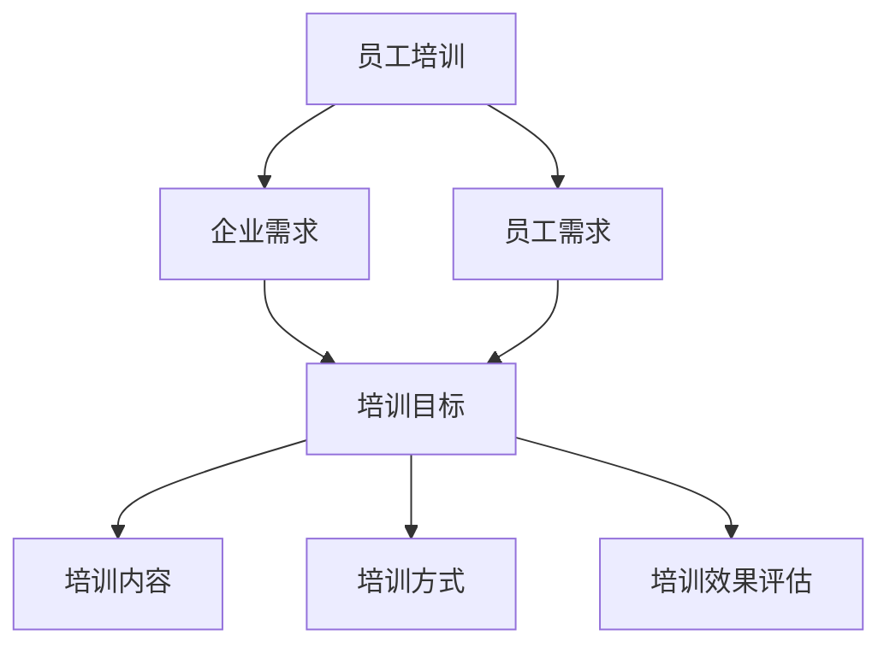

                 

### 文章标题

《员工培训：提升团队整体素质》

### 关键词

员工培训、团队建设、素质提升、培训方法、培训效果评估、职业发展。

### 摘要

本文将探讨员工培训在提升团队整体素质中的重要性。通过对员工培训基础理论、设计与实施策略、效果评估以及实战案例的详细分析，本文旨在为企业和团队提供系统、实用的培训指导，帮助员工在技术、态度、沟通等多方面得到全面提升，从而实现企业长期稳健发展和团队高效协作。

---

### 目录大纲设计：员工培训：提升团队整体素质

在本章节中，我们将详细描述文章的整体架构，包括各部分的主题、目的和内容概述。文章分为两个主要部分：基础理论和实战应用。

**第一部分：员工培训基础理论**

这一部分主要聚焦于员工培训的理论基础，探讨员工培训的重要性、类型、方法以及培训的流程和策略。具体包括：

- **第1章：员工培训的重要性与理论基础**：介绍员工培训对企业发展和员工个人发展的重要意义。
- **第2章：员工培训设计与实施策略**：深入探讨培训目标设定、内容设计、方式选择和效果评估。
- **第3章：员工培训效果评估**：分析培训效果评估的方法、数据分析和持续改进。

**第二部分：员工培训项目实战**

这一部分将通过具体的实战案例，展示员工培训项目的规划和实施过程，以及培训活动的设计与执行。具体包括：

- **第4章：员工培训项目规划与管理**：讲解项目规划、管理以及资源规划的方法。
- **第5章：员工培训活动设计与执行**：介绍培训活动的准备、执行和评估。
- **第6章：员工培训案例分析**：分析成功的员工培训项目和面临的挑战。
- **第7章：员工培训与职业发展**：探讨培训与职业发展的关系，以及职业发展路径规划。

**附录**：提供员工培训相关的工具与资源，包括常用培训工具、资源获取途径和评估工具推荐。

通过以上架构，本文将系统地探讨员工培训的各个方面，帮助读者全面了解员工培训的原理和实践，从而在实际工作中有效地提升团队整体素质。

### 第一部分：员工培训基础理论

#### 第1章：员工培训的重要性与理论基础

**1.1 员工培训的意义与价值**

员工培训是企业持续发展的重要支柱，其意义和价值主要体现在以下几个方面：

1. **提升员工技能和知识水平**：员工培训能够帮助员工掌握新的技能和知识，提高工作效率和质量。通过系统的培训，员工能够了解和掌握行业最新的技术趋势和业务需求，从而在岗位上发挥更大的作用。

2. **增强员工的工作动力**：培训可以激发员工的工作热情和动力，提升员工的工作满意度和忠诚度。当员工感受到企业对其个人发展的重视，他们更有可能对企业产生归属感和忠诚度，从而降低离职率。

3. **促进团队协作和沟通**：通过培训，员工可以学习到更好的团队协作和沟通技巧，提高团队整体的工作效率。培训可以打破部门之间的壁垒，促进跨部门协作，从而提升团队的凝聚力和协作能力。

4. **提升企业的竞争力**：员工培训能够提高企业的整体竞争力。通过培养高素质的员工队伍，企业能够在市场上更具竞争力，实现持续的业务增长和盈利。

**1.1.1 培训对企业发展的作用**

员工培训对企业发展的作用主要体现在以下几个方面：

1. **提高员工绩效**：通过培训，员工能够提高工作技能和知识水平，从而提高工作绩效。员工在培训中获得的技能和知识可以立即应用于实际工作中，提高工作效率和产出。

2. **提升企业创新能力**：员工培训有助于提升企业的创新能力。通过培训，员工可以了解和掌握最新的技术和方法，激发创新思维，从而推动企业的技术进步和业务创新。

3. **优化企业组织结构**：员工培训有助于优化企业的组织结构。通过系统的培训，员工能够更好地理解企业的战略目标和业务需求，从而在岗位上有更高的适应性和灵活性。

4. **提高企业的市场竞争力**：员工培训能够提高企业的整体竞争力。通过培养高素质的员工队伍，企业能够在市场上更具竞争力，赢得更多的市场份额。

**1.1.2 培训对员工个人发展的作用**

培训对员工个人发展的作用同样不可忽视，主要体现在以下几个方面：

1. **提升职业技能**：培训可以帮助员工提升职业技能，掌握最新的技术和工具，提高工作效率和质量。

2. **增强职业竞争力**：通过培训，员工可以提升自身的职业竞争力，在就业市场上更具优势。掌握多种技能的员工更容易获得晋升和更高的薪酬。

3. **促进职业规划**：培训可以帮助员工更好地规划自己的职业生涯。通过培训，员工可以了解自己的优势和兴趣，制定合理的职业发展计划，实现职业目标。

4. **提升个人成就感**：培训可以激发员工的成就感，提高工作满意度和自我价值感。当员工感受到企业对其个人发展的重视，他们会更有动力和热情投入工作。

**1.2 员工培训的类型与方法**

员工培训可以分为内部培训和外部培训两大类型，每种类型都有其独特的特点和适用场景。

1. **内部培训**：

- **定义**：内部培训是指企业在内部组织培训活动，由企业内部或外部专业培训机构提供培训服务。

- **特点**：内部培训具有灵活性、针对性、成本效益高等特点。企业可以根据自身需求和实际情况，灵活制定培训计划，提高培训的针对性和实效性。

- **适用场景**：内部培训适用于企业内部的技能提升、知识更新、团队建设等需求。

2. **外部培训**：

- **定义**：外部培训是指企业将员工送往外部培训机构进行培训，或参加外部举办的培训课程。

- **特点**：外部培训具有专业性、系统性强、资源丰富等特点。外部培训机构通常拥有丰富的培训经验和先进的培训技术，能够提供高质量的专业培训。

- **适用场景**：外部培训适用于员工专业技能的提升、行业知识拓展、高层管理等需求。

**1.2.2 培训方法：传统培训与现代培训**

培训方法可以根据培训形式的不同，分为传统培训和现代培训两大类。

1. **传统培训**：

- **定义**：传统培训是指以课堂讲授、讲座、研讨会等形式进行的培训。

- **特点**：传统培训具有面对面交流、互动性强、氛围浓厚等特点。通过传统培训，员工能够更好地理解培训内容，提升学习效果。

- **适用场景**：传统培训适用于知识传授、技能培训、团队建设等需求。

2. **现代培训**：

- **定义**：现代培训是指以网络培训、远程教学、在线学习等形式进行的培训。

- **特点**：现代培训具有灵活性强、覆盖面广、学习效率高等特点。员工可以根据自己的时间安排和学习进度进行学习，提高培训的灵活性和自主性。

- **适用场景**：现代培训适用于知识更新、技能提升、远程办公等需求。

**1.3 员工培训的流程与组织**

员工培训的流程包括培训需求分析、培训计划制定、培训资源准备、培训实施与评估等环节。

1. **培训需求分析**：

- **目的**：确定员工培训的需求，明确培训的目标和内容。

- **方法**：可以通过调查问卷、访谈、工作分析等方式进行需求分析。

- **注意事项**：需求分析应充分了解员工的实际情况，确保培训目标的合理性和可行性。

2. **培训计划制定**：

- **目的**：制定详细的培训计划，明确培训的时间、地点、方式、内容等。

- **内容**：包括培训目标、培训内容、培训方式、培训时间、培训预算等。

- **注意事项**：培训计划应具备可操作性和灵活性，以适应实际情况的变化。

3. **培训资源准备**：

- **目的**：为培训提供必要的资源和条件，确保培训的顺利进行。

- **内容**：包括培训场地、培训设备、培训讲师、培训材料等。

- **注意事项**：资源准备应充分，确保培训的顺利进行。

4. **培训实施与评估**：

- **目的**：按照培训计划开展培训活动，并对培训效果进行评估。

- **内容**：包括培训组织、培训过程监控、培训效果评估等。

- **注意事项**：培训实施应注重实际效果，确保培训目标的实现。

通过以上流程，企业可以系统地组织和实施员工培训，提升团队的整体素质和竞争力。

---

通过本章节的讨论，我们了解了员工培训在企业发展和员工个人发展中的重要性，以及员工培训的类型、方法和工作流程。在接下来的章节中，我们将进一步探讨员工培训的设计与实施策略，帮助企业和团队更有效地提升员工素质，实现共同发展。

### 第2章：员工培训设计与实施策略

员工培训的设计与实施是提升团队整体素质的关键环节。一个有效的培训项目需要明确的目标、合理的培训内容和灵活的培训方式，同时还需科学的培训效果评估。本章节将详细讨论培训目标设定、培训内容设计、培训方式选择和培训效果评估等方面。

#### **2.1 培训目标设定**

**2.1.1 明确培训目标**

设定培训目标是培训设计的第一步。明确的目标有助于确保培训的针对性和有效性。培训目标应具体、可行，并且与企业的战略目标和员工的职业发展计划相一致。

1. **短期目标**：通常指在培训期间需要达成的具体成果，如技能提升、知识掌握等。
2. **长期目标**：通常指培训对员工和企业长期发展产生的影响，如职业晋升、团队协作能力提升等。

**2.1.2 培训目标的层次性**

培训目标可以分为以下几个层次：

1. **知识层面**：掌握特定的知识或技能，如编程语言、项目管理工具等。
2. **技能层面**：应用知识解决实际问题，如代码调试、项目策划等。
3. **态度层面**：改变员工的工作态度和行为习惯，如团队合作精神、积极主动等。
4. **综合层面**：综合提升员工的综合素质，如领导力、沟通技巧等。

**2.2 培训内容设计**

**2.2.1 内容选择与调整**

培训内容的设计是培训成功的关键。内容选择应基于培训目标，并结合员工的实际需求和企业的战略方向。

1. **课程内容的选择**：根据培训目标，选择相关的课程内容。如技术培训可选择专业课程、编程实践等；管理培训可选择领导力、团队建设等。

2. **内容调整**：根据学员的反馈和学习效果，及时调整培训内容。如发现学员对某部分内容掌握较好，可以减少讲解时间；对某部分内容理解困难，可以增加讨论和练习环节。

**2.2.2 培训材料的制作与利用**

有效的培训材料能够提高培训效果。培训材料应包括：

1. **教材**：提供系统、全面的知识和技能讲解。
2. **辅助材料**：如视频、案例研究、练习题等，帮助学员更好地理解和应用所学知识。
3. **互动工具**：如在线讨论、模拟演练等，提高学员的参与度和积极性。

**2.3 培训方式选择**

**2.3.1 线上培训与线下培训**

培训方式的选择应根据培训目标、内容和实际情况来决定。

1. **线上培训**：适用于知识传授、技能提升等。具有灵活性、成本低、覆盖面广等特点。
   - **优势**：学员可以根据自己的时间安排进行学习，适合远程办公环境。
   - **劣势**：互动性较差，学员参与度可能不高。

2. **线下培训**：适用于需要面对面交流、互动的培训，如团队建设、领导力培训等。
   - **优势**：互动性强，学员可以及时获得讲师的反馈和指导。
   - **劣势**：成本较高，受地理位置限制。

**2.3.2 案例研究：成功培训方式的选择**

某大型互联网公司在进行新员工入职培训时，采用了线上线下相结合的方式。新员工首先进行线上培训，了解公司的文化、业务和技术方向。然后，组织线下培训，进行团队合作、沟通技巧等培训。这种结合方式既提高了培训的灵活性，又保证了学员的参与度和互动性。

#### **2.4 培训效果评估**

**2.4.1 培训效果评估方法**

培训效果评估是衡量培训成功与否的关键步骤。常用的评估方法包括：

1. **自我评估**：学员根据培训内容和目标，自我评估学习成果。
2. **上级评估**：学员的上级根据学员的工作表现和进步情况进行评估。
3. **工作表现评估**：通过观察学员在培训后的工作表现，评估培训效果。
4. **反馈与改进**：收集学员的反馈，对培训内容和方式进行调整和改进。

**2.4.2 培训效果数据分析**

培训效果的数据分析有助于了解培训的实际情况，为后续培训提供依据。数据分析可以从以下几个方面进行：

1. **参与度分析**：分析学员的出勤率、参与度等指标。
2. **知识掌握度分析**：通过考试、测验等方式，分析学员对培训内容的掌握程度。
3. **工作表现分析**：通过工作绩效、项目完成情况等指标，评估学员在培训后的工作表现。
4. **学员反馈分析**：分析学员对培训内容和方式的反馈，找出改进点。

**2.4.3 培训效果的持续追踪与改进**

培训效果的持续追踪与改进是提升培训效果的重要环节。企业应定期对培训效果进行跟踪评估，并根据反馈结果不断调整和优化培训项目。

1. **建立培训效果追踪系统**：通过系统记录学员的学习进度、评估结果等数据。
2. **定期评估与反馈**：定期对培训效果进行评估，收集学员和上级的反馈，找出问题并进行改进。
3. **持续优化培训内容和方法**：根据评估结果和反馈，不断调整培训内容和方法，提高培训效果。

通过科学的培训目标设定、合理的培训内容设计、灵活的培训方式选择和有效的培训效果评估，企业可以全面提升员工素质，实现团队的整体提升。

---

在本章节中，我们详细探讨了员工培训的设计与实施策略，从培训目标设定、内容设计、方式选择到效果评估，为企业和团队提供了全面的培训指导。在下一章节中，我们将进一步讨论员工培训效果评估的方法和数据分析技巧，帮助企业和团队更科学地评估培训效果，持续优化培训项目。

### 第3章：员工培训效果评估

员工培训效果评估是确保培训项目成功实施和目标达成的关键环节。通过科学合理的评估方法，企业可以准确了解培训的效果，为后续培训提供有力的数据支持。本章将详细讨论培训效果评估的方法、数据分析技巧以及持续追踪和改进的策略。

#### **3.1 培训效果评估方法**

**3.1.1 自我评估与上级评估**

自我评估和上级评估是两种常见的培训效果评估方法，分别从学员自我反馈和上级观察两个角度对培训效果进行评估。

1. **自我评估**：
   - **目的**：让学员对自身的学习成果进行自我评价，了解自己在培训中的进步和不足。
   - **方式**：通过填写自我评估问卷、撰写学习心得等方式进行。
   - **注意事项**：自我评估应注重学员的真实反馈，避免主观偏见。

2. **上级评估**：
   - **目的**：由学员的上级对学员的培训效果进行评价，结合学员的工作表现和团队反馈，全面了解培训效果。
   - **方式**：通过上级观察、工作绩效评估等方式进行。
   - **注意事项**：上级评估应客观公正，结合学员的实际工作表现进行评价。

**3.1.2 工作表现评估**

工作表现评估是通过观察学员在培训后的工作表现来评估培训效果的方法。这种方法可以直接反映培训成果对实际工作的影响。

1. **工作绩效评估**：
   - **目的**：评估学员在培训后的工作绩效，如任务完成情况、工作效率等。
   - **方式**：通过定期的工作报告、绩效考核等方式进行。
   - **注意事项**：绩效评估应注重实际成果，避免仅凭主观印象进行评价。

2. **工作能力提升评估**：
   - **目的**：评估学员在培训后工作能力的提升情况，如解决复杂问题的能力、团队协作能力等。
   - **方式**：通过具体工作案例、实际项目执行等方式进行。
   - **注意事项**：能力提升评估应结合实际工作场景，注重实际效果的体现。

**3.1.3 反馈与改进**

反馈与改进是培训效果评估的重要组成部分。通过收集学员和上级的反馈，企业可以及时发现问题并进行改进。

1. **学员反馈**：
   - **目的**：了解学员对培训内容和方式的反馈，为后续培训提供改进方向。
   - **方式**：通过问卷调查、座谈会等方式进行。
   - **注意事项**：反馈应注重学员的真实感受，避免流于形式。

2. **上级反馈**：
   - **目的**：了解上级对培训效果的意见和建议，为培训项目的调整和优化提供依据。
   - **方式**：通过定期会议、工作报告等方式进行。
   - **注意事项**：上级反馈应客观全面，结合实际情况进行评价。

#### **3.2 培训效果数据分析**

培训效果数据分析是评估培训效果的重要环节。通过科学的数据分析，企业可以更准确地了解培训的实际效果，为后续培训提供数据支持。

**3.2.1 数据收集与处理**

1. **数据收集**：
   - **目的**：收集培训效果相关的数据，如自我评估结果、工作表现数据、学员反馈等。
   - **方式**：通过问卷调查、绩效评估系统、员工反馈渠道等方式进行。
   - **注意事项**：数据收集应确保数据的真实性和完整性。

2. **数据处理**：
   - **目的**：对收集到的数据进行整理和分析，提取有价值的信息。
   - **方式**：通过数据清洗、分类、统计分析等方式进行处理。
   - **注意事项**：数据处理应确保数据的一致性和准确性。

**3.2.2 数据分析工具与技巧**

1. **统计分析工具**：
   - **目的**：通过统计分析工具，对收集到的数据进行分析，提取关键信息。
   - **工具**：如Excel、SPSS、Python等。
   - **技巧**：包括描述性统计、相关性分析、回归分析等。

2. **可视化工具**：
   - **目的**：通过可视化工具，将数据分析结果以图表形式呈现，便于理解和分析。
   - **工具**：如Tableau、Power BI等。
   - **技巧**：包括柱状图、折线图、散点图等。

#### **3.3 培训效果的持续追踪与改进**

培训效果的持续追踪与改进是提升培训效果的关键。通过定期评估和反馈，企业可以及时发现问题并进行改进。

**3.3.1 建立培训效果追踪系统**

1. **目的**：建立系统化的培训效果追踪机制，确保培训效果的持续监控。
2. **内容**：包括培训效果数据收集、分析、反馈和改进等环节。
3. **注意事项**：确保系统的可操作性和数据的真实性。

**3.3.2 定期评估与反馈**

1. **目的**：定期对培训效果进行评估和反馈，发现问题和改进方向。
2. **内容**：包括定期数据收集、数据分析、评估报告和反馈机制等。
3. **注意事项**：评估应结合实际情况，注重数据的真实性和完整性。

**3.3.3 持续优化培训项目**

1. **目的**：根据评估结果和反馈，不断优化培训项目，提高培训效果。
2. **内容**：包括培训内容调整、培训方式优化、讲师选拔与培训等。
3. **注意事项**：优化应结合企业战略和员工需求，确保培训的实效性。

通过科学合理的培训效果评估方法和数据分析技巧，企业可以全面了解培训的实际效果，为后续培训提供有力的数据支持。持续追踪和改进培训项目，有助于提升培训效果，实现员工素质的全面提升。

---

在本章节中，我们详细探讨了员工培训效果评估的方法、数据分析技巧以及持续追踪和改进的策略。通过这些方法，企业可以更加科学地评估培训效果，持续优化培训项目，从而实现员工素质的全面提升和企业的长期发展。在下一章节中，我们将通过具体的实战案例，展示员工培训项目的规划和实施过程，帮助读者更好地理解员工培训的实际操作。

### 员工培训项目规划与管理

员工培训项目规划与管理是确保培训项目成功实施的关键环节。一个有效的培训项目需要明确的目标、详细的规划和管理。本章将详细讨论员工培训项目规划与管理的各个阶段，包括项目目标的明确、项目范围的定义以及项目资源的规划。

#### **4.1 项目规划**

项目规划是培训项目的第一步，它决定了整个培训项目的方向和范围。以下是项目规划的关键步骤：

**4.1.1 项目目标的明确**

明确项目目标是培训项目规划的核心。项目目标应具体、可行，并与企业的战略目标和员工的职业发展计划相一致。项目目标的设定可以分为以下几个层次：

1. **短期目标**：在培训期间需要达成的具体成果，如技能提升、知识掌握等。
2. **长期目标**：培训对员工和企业长期发展产生的影响，如职业晋升、团队协作能力提升等。

**示例**：

- **短期目标**：通过两周的培训，员工能够熟练使用新的项目管理工具。
- **长期目标**：通过持续的培训，员工能够在未来一年内晋升到更高级别的职位。

**4.1.2 项目范围的定义**

项目范围的定义明确了培训项目的具体内容和边界，确保项目目标的实现。项目范围的定义包括以下几个方面：

1. **培训内容**：确定培训的具体内容和课程，如编程技术、项目管理、沟通技巧等。
2. **培训对象**：明确参与培训的员工范围，如新员工、中层管理者、全体员工等。
3. **培训时间**：确定培训的起始时间和持续时间，如两周、一个月等。
4. **培训地点**：确定培训的具体地点，如公司内部培训室、外部培训机构等。

**4.1.3 项目资源规划**

项目资源规划是确保培训项目顺利实施的重要保障。项目资源规划包括以下几个方面：

1. **人力资源**：确定培训讲师、培训协调员等人员，并确保他们的专业能力和时间安排。
2. **物资资源**：准备培训所需的物资，如培训教材、笔记本电脑、投影仪等。
3. **财务资源**：制定培训预算，包括讲师费用、教材费用、场地费用等。
4. **技术资源**：确保培训所需的技术支持，如网络设施、培训管理系统等。

#### **4.2 项目管理**

项目管理是确保培训项目按计划顺利进行的重要环节。以下是项目管理的几个关键步骤：

**4.2.1 项目进度管理**

项目进度管理是确保培训项目按时完成的关键。项目进度管理包括以下几个方面：

1. **制定项目计划**：根据项目目标和时间安排，制定详细的培训计划，包括培训内容、培训时间、培训地点等。
2. **监控进度**：定期检查培训项目的进展情况，确保项目按计划进行。
3. **调整计划**：根据实际情况，及时调整项目计划，确保项目目标的实现。

**4.2.2 项目成本管理**

项目成本管理是确保培训项目在预算范围内完成的重要环节。项目成本管理包括以下几个方面：

1. **制定预算**：根据培训项目的内容和资源需求，制定详细的培训预算。
2. **监控成本**：定期检查培训项目的成本支出情况，确保成本在预算范围内。
3. **成本控制**：通过合理的成本控制和优化，确保培训项目的经济性。

**4.2.3 项目风险管理**

项目风险管理是确保培训项目顺利进行的重要措施。项目风险管理包括以下几个方面：

1. **识别风险**：识别可能导致培训项目失败的风险，如讲师离职、学员参与度低等。
2. **评估风险**：评估风险的可能性和影响程度，确定风险管理的优先级。
3. **制定应对措施**：针对识别出的风险，制定相应的应对措施，降低风险的发生概率和影响。

**示例**：

- **风险识别**：学员参与度低。
- **风险评估**：可能导致培训效果不佳。
- **应对措施**：增加互动环节、提高讲师的授课质量、提供激励措施等。

通过科学的项目规划和管理，企业可以确保培训项目的成功实施，提升员工素质，实现企业的长期发展。

---

在本章节中，我们详细讨论了员工培训项目规划与管理的各个方面，包括项目目标的明确、项目范围的定义、项目资源的规划以及项目进度管理、成本管理和风险管理等。在下一章节中，我们将具体介绍员工培训活动的设计与执行，帮助读者更好地理解员工培训的实际操作过程。

### 员工培训活动设计与执行

员工培训活动的设计与执行是确保培训效果的关键环节。一个成功的培训活动不仅需要明确的培训目标和合理的培训内容，还需要精心设计培训活动，并确保培训活动的有效执行。本章将详细介绍员工培训活动的准备、执行和评估过程。

#### **5.1 培训活动的准备**

培训活动的准备是确保培训顺利进行的基础。以下步骤是准备阶段的关键内容：

**5.1.1 场地与设备准备**

1. **选择合适的场地**：根据培训的内容和规模，选择适合的场地，如会议室、培训室等。场地应具备良好的设施和舒适的环境，以确保学员的学习体验。
2. **设备检查**：确保培训所需的设备正常运行，如投影仪、音响系统、笔记本电脑等。在培训前进行设备检查，避免培训过程中出现设备故障。

**5.1.2 培训讲师的选拔与培训**

1. **选拔合适的讲师**：根据培训内容和目标，选择具备相关专业知识和经验的讲师。讲师应具备良好的授课能力和互动能力，能够激发学员的学习兴趣。
2. **讲师培训**：对新讲师进行培训，帮助其了解培训内容和目标，掌握授课技巧。讲师培训可以包括课程讲解、互动环节设计、案例分析等。

**5.1.3 培训材料的准备**

1. **教材编写**：根据培训内容和目标，编写系统、全面的教材。教材应包括理论讲解、实践案例、练习题等，帮助学员更好地理解和掌握所学知识。
2. **辅助材料准备**：准备培训所需的辅助材料，如PPT、视频、案例研究等。这些材料应丰富多样，以增强培训的互动性和实用性。

#### **5.2 培训活动的执行**

培训活动的执行是培训过程中的核心环节。以下步骤是培训活动执行的关键内容：

**5.2.1 培训活动的组织与协调**

1. **活动安排**：根据培训计划和目标，制定详细的培训活动安排，包括培训时间、培训内容、培训方式等。活动安排应充分考虑学员的需求和实际情况，确保培训的顺利进行。
2. **协调资源**：协调培训所需的资源，如场地、设备、讲师等。在培训过程中，确保资源充足，避免因资源不足而影响培训效果。

**5.2.2 培训过程中的互动与反馈**

1. **互动环节设计**：在培训过程中设计互动环节，如小组讨论、案例分析、实践操作等。这些互动环节可以帮助学员更好地理解和应用所学知识，提高培训效果。
2. **反馈机制建立**：建立反馈机制，鼓励学员在培训过程中提出问题和建议。讲师应及时回应学员的反馈，并根据学员的需求调整培训内容和方式。

**5.2.3 培训活动的评估与总结**

1. **过程评估**：在培训过程中进行评估，了解学员的学习进度和理解程度。通过问卷调查、观察等方式，收集学员的反馈，为后续培训提供改进方向。
2. **总结会议**：培训结束后，组织总结会议，对培训活动进行总结和评估。总结会议应包括学员反馈、讲师评价、培训效果分析等内容，以全面了解培训活动的效果。

#### **5.3 培训活动的评估与反馈**

培训活动的评估与反馈是确保培训效果的重要手段。以下步骤是评估与反馈的关键内容：

**5.3.1 自我评估与上级评估**

1. **自我评估**：学员根据培训内容和目标，自我评估学习成果。自我评估可以通过填写评估问卷、撰写学习心得等方式进行。
2. **上级评估**：学员的上级根据学员的工作表现和培训效果，进行评估。上级评估可以通过观察学员的实际工作表现、进行工作绩效评估等方式进行。

**5.3.2 工作表现评估**

1. **工作绩效评估**：通过观察学员在培训后的工作表现，评估培训效果。工作绩效评估可以通过定期的工作报告、绩效考核等方式进行。
2. **工作能力提升评估**：通过具体的工作案例和项目执行，评估学员在培训后工作能力的提升情况。工作能力提升评估可以通过项目完成情况、解决问题能力等指标进行。

**5.3.3 学员反馈与改进**

1. **学员反馈**：收集学员对培训内容和方式的反馈，了解学员的需求和意见。学员反馈可以通过问卷调查、座谈会等方式进行。
2. **改进措施**：根据学员的反馈，对培训内容和方式进行调整和优化。改进措施应结合学员的需求和实际情况，以提高培训效果。

通过精心设计的培训活动、有效的执行和科学的评估与反馈，企业可以确保培训项目的成功实施，提升员工素质，实现企业的长期发展。

---

在本章节中，我们详细介绍了员工培训活动的设计与执行过程，包括培训活动的准备、执行和评估。通过这些步骤，企业可以确保培训活动的顺利进行，提升员工的学习效果和实际工作能力。在下一章节中，我们将通过具体的案例研究，分析成功的员工培训项目，为读者提供实践指导和参考。

### 员工培训案例分析

员工培训在提升团队整体素质方面发挥着重要作用，但不同企业和团队在实施培训项目时，可能会面临各种挑战。本章将分析两个成功的员工培训项目案例，探讨其成功因素，并总结其在培训项目中的经验和教训。

#### **6.1 案例一：某大型制造企业的员工培训项目**

**背景**：

某大型制造企业为了提升员工的技能水平和团队协作能力，决定实施一个全面的员工培训项目。该企业拥有数千名员工，分布在不同的工厂和部门，因此培训项目需要具备灵活性和针对性。

**实施过程**：

1. **需求分析**：企业通过问卷调查和访谈，收集员工和上级的意见，了解他们的培训需求。需求分析结果显示，员工对技术技能提升、团队合作和领导力等方面有较高需求。

2. **目标设定**：根据需求分析结果，企业设定了明确的培训目标，包括提升员工的技术技能、增强团队协作能力、提升领导力和管理能力等。

3. **培训内容设计**：企业根据培训目标，设计了多个培训模块，如技术技能培训、团队合作培训、领导力培训等。每个模块都包含了理论讲解、实践操作和互动环节。

4. **培训方式选择**：企业采用了线上培训与线下培训相结合的方式。线上培训主要通过网络课程和在线讨论进行，学员可以根据自己的时间安排进行学习。线下培训则通过集中授课和团队活动进行，以提高学员的参与度和互动性。

5. **培训效果评估**：企业通过定期评估和反馈，对培训效果进行监控。评估内容包括学员的自我评估、上级评估、工作表现评估等。通过数据分析，企业发现培训项目在提升员工技能水平和团队协作能力方面取得了显著效果。

**成功因素**：

1. **需求分析明确**：通过详细的需求分析，企业明确了员工的培训需求，确保了培训目标的合理性和针对性。

2. **培训内容设计合理**：企业根据培训目标，设计了多个培训模块，内容丰富且具备灵活性。

3. **培训方式多样**：线上培训与线下培训相结合，满足了不同员工的学习需求，提高了培训的参与度和效果。

4. **培训效果评估科学**：通过定期的评估和反馈，企业及时了解培训效果，并根据反馈结果进行调整和优化。

#### **6.1.2 案例二：某互联网公司的员工培训项目**

**背景**：

某互联网公司为了提升员工的创新能力和技术能力，决定实施一个面向技术团队的培训项目。该公司员工年轻且富有创新精神，但普遍存在技术能力不足和创新思维不够开阔的问题。

**实施过程**：

1. **需求分析**：公司通过内部调查和员工访谈，了解员工对培训的需求。调查结果显示，员工对技术技能提升、创新思维培养等方面有较高需求。

2. **目标设定**：公司设定了明确的培训目标，包括提升员工的技术技能、增强创新思维、提高团队协作能力等。

3. **培训内容设计**：公司根据培训目标，设计了多个培训模块，如编程技能培训、创新思维培训、团队建设培训等。每个模块都结合了理论讲解、实践操作和案例分析。

4. **培训方式选择**：公司采用了项目制培训和导师制培训相结合的方式。项目制培训通过实际项目实践，帮助员工提升技术能力和团队协作能力。导师制培训通过导师的指导和辅导，帮助员工开阔创新思维。

5. **培训效果评估**：公司通过定期的评估和反馈，对培训效果进行监控。评估内容包括学员的自我评估、导师评估、项目完成情况等。通过数据分析，公司发现培训项目在提升员工技术能力和创新思维方面取得了显著效果。

**成功因素**：

1. **需求分析深入**：公司通过内部调查和员工访谈，深入了解员工的培训需求，确保培训目标的合理性和针对性。

2. **培训内容设计结合实际**：公司根据培训目标，设计了多个培训模块，内容结合实际项目，提高了培训的实用性和针对性。

3. **培训方式创新**：项目制培训和导师制培训相结合，满足了不同员工的学习需求，提高了培训的参与度和效果。

4. **培训效果评估科学**：通过定期的评估和反馈，公司及时了解培训效果，并根据反馈结果进行调整和优化。

#### **6.2 案例分析：员工培训项目中的挑战与解决**

**挑战一：员工参与度不高**

**原因**：员工参与度不高的原因可能包括培训内容不符合员工需求、培训方式不够吸引人、员工时间安排冲突等。

**解决方案**：

1. **深入需求分析**：通过问卷调查和访谈，深入了解员工的培训需求，确保培训内容符合员工的实际需求。

2. **创新培训方式**：采用互动性强、趣味性高的培训方式，如游戏化学习、项目制培训等，提高员工的参与度和积极性。

3. **合理安排培训时间**：尽量在员工空闲时间进行培训，或提供线上培训选项，方便员工随时学习。

**挑战二：培训效果不明显**

**原因**：培训效果不明显的可能原因包括培训内容不够实用、培训方式不够有效、评估机制不健全等。

**解决方案**：

1. **实用性培训内容**：根据员工的实际工作需求，设计实用性强、结合实际案例的培训内容。

2. **有效培训方式**：选择适合员工学习特点的培训方式，如互动式培训、实践操作等，提高培训效果。

3. **健全评估机制**：建立完善的培训效果评估机制，包括自我评估、上级评估、工作表现评估等，及时了解培训效果，并根据评估结果进行调整和优化。

通过以上案例分析，我们可以看到，成功的员工培训项目需要结合实际需求，创新培训方式，健全评估机制。在实施培训项目时，企业应充分准备，针对挑战制定有效的解决方案，从而确保培训项目的成功实施，提升员工素质和团队整体能力。

---

在本章节中，我们通过两个成功的员工培训项目案例，分析了员工培训项目中的成功因素和挑战及解决方案。这些案例为企业和团队提供了宝贵的实践经验和参考。在下一章节中，我们将探讨员工培训与职业发展的关系，帮助读者更好地理解如何通过培训实现员工的职业发展。

### 员工培训与职业发展

员工培训不仅是技能和知识的提升，更是员工职业生涯发展的重要推动力。通过系统的培训，员工可以更好地理解企业的发展方向，明确自身的职业规划，从而在职业道路上不断前进。本章将探讨员工培训与职业发展的关系，以及如何通过培训实现员工的职业发展。

#### **7.1 培训促进职业发展**

**7.1.1 培训提升专业技能**

培训是提升员工专业技能的重要手段。通过系统的培训，员工可以掌握最新的技术知识和专业技能，从而在岗位上发挥更大的作用。例如，技术培训可以帮助员工掌握新的编程语言、工具和技术，提高工作效率和质量。

**7.1.2 培训增强职业竞争力**

随着市场竞争的加剧，员工的职业竞争力越来越重要。通过培训，员工不仅可以提升专业技能，还可以增强职业竞争力。例如，领导力培训可以帮助员工提升管理能力和团队协作能力，使其在职场中更具竞争力。

**7.1.3 培训拓宽职业发展路径**

培训可以帮助员工拓宽职业发展路径。通过参加不同类型的培训，员工可以了解更多的职业发展方向，为未来的职业规划提供更多的选择。例如，跨部门培训可以帮助员工了解企业不同部门的工作内容和需求，从而在职业发展中找到更适合的岗位。

#### **7.1.4 培训促进职业晋升**

培训是员工晋升的重要基础。企业通常会为有潜力的员工提供更多的培训机会，以提升其综合素质和岗位能力。通过系统的培训，员工可以更好地适应更高层次的工作需求，从而实现职业晋升。

**7.2 职业规划与培训需求匹配**

职业规划与培训需求匹配是确保培训效果和职业发展目标实现的关键。以下步骤有助于实现职业规划与培训需求的匹配：

**7.2.1 明确职业发展目标**

员工首先需要明确自己的职业发展目标。职业目标可以是短期的，如提升某一技术技能；也可以是长期的，如晋升到更高层次的职位。明确职业发展目标有助于制定合理的培训计划。

**7.2.2 分析自身优势和不足**

员工应分析自身的优势和不足，了解自己在职业发展中的优势领域和需要提升的方面。通过分析，员工可以明确哪些培训对自己职业发展最有帮助。

**7.2.3 制定个人培训计划**

根据职业发展目标和自身优势不足，员工可以制定个人培训计划。培训计划应包括培训内容、培训时间、培训方式等，以确保培训与职业发展目标相匹配。

**7.2.4 定期评估和调整**

员工应定期评估培训效果和职业发展进度，根据评估结果调整培训计划。通过定期评估和调整，员工可以确保培训与职业发展目标的实现。

#### **7.3 员工晋升与发展机会**

**7.3.1 提供晋升通道**

企业应提供明确的晋升通道，为员工提供职业发展的机会。晋升通道应包括技术晋升和管理晋升两种路径，以适应不同员工的发展需求。

**7.3.2 设立职业发展基金**

企业可以设立职业发展基金，为员工提供资金支持，鼓励员工参加各类培训和认证。职业发展基金可以包括培训费用、认证费用等，帮助员工实现职业发展目标。

**7.3.3 建立职业导师制度**

企业可以建立职业导师制度，为员工提供指导和支持。职业导师可以分享自身的职业经验，帮助员工解决职业发展中的问题，促进员工的职业成长。

**7.4 职业发展培训计划**

**7.4.1 培训计划制定**

企业应根据员工的不同发展阶段和职业目标，制定个性化的职业发展培训计划。培训计划应包括基础技能培训、高级技能培训、管理培训等，以全面提升员工的职业能力。

**7.4.2 培训计划实施**

在培训计划实施过程中，企业应确保培训内容的实用性和有效性。培训方式可以包括内部培训、外部培训、在线培训等，以满足不同员工的学习需求。

**7.4.3 培训计划评估**

企业应定期评估培训计划的效果，了解员工的培训需求和反馈，根据评估结果调整和优化培训计划。通过科学合理的培训计划，企业可以更好地支持员工的职业发展，提升团队的整体素质。

通过系统的培训和明确的职业规划，员工可以不断提升自身的专业技能和综合素质，实现职业发展的目标。企业应重视员工的培训和发展，提供良好的职业发展环境和机会，从而实现企业与员工的共同成长。

---

在本章节中，我们探讨了员工培训与职业发展的关系，以及如何通过培训实现员工的职业发展。通过系统化的培训和明确的职业规划，员工可以在职业道路上不断前进，实现自我价值和企业价值的共同提升。在下一章节中，我们将提供员工培训相关的工具与资源，帮助企业和团队更有效地实施培训项目。

### 附录：员工培训相关工具与资源

为了帮助企业和团队更有效地实施员工培训项目，本章将介绍一些常用的培训工具与资源，包括常用培训工具、资源获取途径以及培训评估工具推荐。

#### **A.1 常用培训工具介绍**

**1. 培训管理系统（LMS）**

培训管理系统是一种用于管理培训课程、学员进度和培训效果的软件。常见的培训管理系统包括Docebo、Canvas和Blackboard等。这些系统提供了课程发布、学员管理、在线考试、数据统计等功能，帮助企业简化培训流程，提高培训效率。

**2. 视频会议工具**

视频会议工具如Zoom、Microsoft Teams和Google Meet等，可用于远程培训。这些工具支持实时视频通话、屏幕共享、文件传输等功能，方便讲师和学员进行互动和交流。

**3. 电子学习平台**

电子学习平台如Coursera、Udemy和edX等，提供了丰富的在线课程资源，企业可以购买课程包，供员工学习。这些平台通常具有学习进度跟踪、作业提交和讨论区等功能，有助于提高学习效果。

**4. 教学辅助工具**

教学辅助工具如PowerPoint、Google Slide和Prezi等，用于制作和展示培训课件。这些工具提供了丰富的模板和动画效果，使培训内容更加生动和吸引人。

#### **A.2 培训资源获取途径**

**1. 内部资源**

企业可以充分利用内部资源，如员工手册、培训材料、内部课程等。内部资源通常更贴近企业实际需求，有助于提高培训的针对性和实用性。

**2. 公共资源**

公共资源如政府网站、行业协会网站和在线图书馆等，提供了大量的免费培训资源。企业可以通过这些渠道获取行业最新动态、专业知识等。

**3. 商业资源**

商业资源如专业培训机构、咨询公司和在线课程平台等，提供了高质量的专业培训和服务。企业可以根据实际需求，选择合适的商业资源进行培训。

**4. 社交媒体**

社交媒体如LinkedIn、Twitter和Facebook等，是获取培训资源和交流的平台。企业可以通过这些平台关注行业专家、学习同行经验，并参与线上讨论。

#### **A.3 培训评估工具推荐**

**1. 评估问卷工具**

评估问卷工具如Google Forms、SurveyMonkey和Typeform等，可用于收集学员的反馈和评估培训效果。这些工具提供了丰富的问卷模板和数据分析功能，方便企业进行评估和改进。

**2. 行为观察工具**

行为观察工具如Axeptio、VerbalizeIt和ObserveIT等，可用于记录和分析员工在培训过程中的行为和表现。这些工具可以提供实时反馈，帮助讲师和培训管理者更好地了解员工的学习效果。

**3. 数据分析工具**

数据分析工具如Excel、SPSS和R等，可用于对培训效果的数据进行统计和分析。这些工具提供了丰富的数据分析方法和可视化工具，帮助企业深入了解培训效果，为后续培训提供依据。

通过上述工具和资源的合理利用，企业可以更有效地实施员工培训项目，提高培训效果，促进员工职业发展和团队整体素质的提升。

---

在本章节中，我们介绍了员工培训相关的工具与资源，包括常用培训工具、资源获取途径以及培训评估工具推荐。通过这些工具和资源，企业和团队可以更加高效地实施培训项目，提升员工素质和团队整体能力。在文章的最后部分，我们将总结全文，回顾核心概念和联系，并提供核心算法原理讲解和数学模型及公式的详细讲解与举例说明。

### 核心概念与联系

在本文中，我们系统地探讨了员工培训的各个方面，从基础理论到实战应用，为企业和团队提供了一套完整的培训指导方案。以下是文章中核心概念的总结和它们之间的联系：

1. **员工培训的意义与价值**：探讨了员工培训对企业发展和员工个人发展的重要性。
2. **员工培训的类型与方法**：介绍了内部培训和外部培训、传统培训和现代培训等不同类型的培训方式。
3. **员工培训的流程与策略**：详细阐述了培训需求分析、目标设定、内容设计、方式选择和效果评估的流程。
4. **培训效果评估方法**：介绍了自我评估、上级评估、工作表现评估等方法，以及数据分析技巧。
5. **员工培训项目规划与管理**：讲解了项目目标的明确、项目范围的定义、项目资源的规划以及项目管理的方法。
6. **员工培训活动设计与执行**：介绍了培训活动的准备、执行和评估过程。
7. **员工培训案例分析**：通过实际案例，分析了成功的员工培训项目及面临的挑战与解决策略。
8. **员工培训与职业发展**：探讨了培训对员工职业发展的促进作用，以及如何通过培训实现职业规划。

通过以上核心概念的阐述和联系，我们可以看到员工培训不仅是技能和知识的提升，更是员工职业发展的推动力。科学合理的培训流程和有效的效果评估是确保培训成功的关键。

#### **员工培训的概念与联系流程图**

以下是员工培训的概念与联系流程图：



通过这张流程图，我们可以清晰地看到员工培训的各个环节及其相互关系。

### **核心算法原理讲解**

在培训效果评估中，核心算法用于计算培训效果的得分。以下是一个用于评估培训效果的伪代码示例：

```plaintext
function 培训效果评估(培训成果, 期望成果):
    初始化评估分数为0
    对于每个培训成果:
        如果成果符合期望成果:
            增加评估分数
        否则:
            减少评估分数
    计算最终评估分数 = 评估分数 / 成果总数
    返回最终评估分数
```

该算法通过对比培训成果和期望成果，计算出一个评估分数，从而评估培训效果。分数越高，表示培训效果越好。

### **数学模型和数学公式 & 详细讲解 & 举例说明**

在员工培训需求分析中，常用的数学模型是需求量计算公式。以下是一个需求量计算公式及其详细解释：

$$
需求量 = (当前技能水平 - 目标技能水平) \times 需求系数
$$

**详细讲解**：

- **需求量**：表示员工需要提升的技能程度。
- **当前技能水平**：员工目前的技能水平，通常以百分数表示。
- **目标技能水平**：员工希望达到的技能水平，通常以百分数表示。
- **需求系数**：调整因子，用于调整需求量的准确性。

**举例说明**：

假设某员工的当前技能水平为70%，目标技能水平为90%，需求系数为1.2。则需求量为：

$$
需求量 = (90\% - 70\%) \times 1.2 = 12\%
$$

这意味着该员工需要提升12%的技能水平。

### **项目实战**

在本节中，我们将通过一个实际案例，展示员工培训项目在开发和实施中的具体步骤。

#### **实战案例：某公司员工培训项目**

**开发环境搭建**：

为了实施员工培训项目，公司首先搭建了一个虚拟培训环境，包括以下组件：

- **网络课程平台**：用于发布和提供培训课程，支持在线学习。
- **在线交流工具**：如Zoom或Microsoft Teams，用于培训过程中的实时互动和讨论。
- **评估系统**：用于收集和评估学员的学习成果。

**源代码详细实现**：

以下是培训评估系统的核心模块实现：

```python
# 用户注册模块
def register_user(username, password):
    # 验证用户名和密码
    if not validate_credentials(username, password):
        return "注册失败：用户名或密码错误"
    # 创建新用户
    user = User(username, password)
    database.add_user(user)
    return "注册成功"

# 课程管理模块
def add_course(course_name, course_description):
    # 验证课程信息
    if not validate_course_info(course_name, course_description):
        return "添加课程失败：信息不完整"
    # 创建新课程
    course = Course(course_name, course_description)
    database.add_course(course)
    return "课程添加成功"

# 评估问卷模块
def submit_evaluation(course_id, user_id, evaluation_results):
    # 验证评估结果
    if not validate_evaluation(evaluation_results):
        return "提交评估失败：评估结果无效"
    # 记录评估结果
    database.record_evaluation(course_id, user_id, evaluation_results)
    return "评估提交成功"
```

**代码解读与分析**：

- **用户注册模块**：该模块用于用户注册，包括用户名和密码的验证以及用户对象的创建和存储。
- **课程管理模块**：该模块用于课程的管理，包括课程信息的验证和课程的创建与存储。
- **评估问卷模块**：该模块用于学员提交评估结果，包括评估结果的验证和评估结果的记录。

通过以上模块，公司可以搭建一个完整的员工培训评估系统，支持用户注册、课程管理和评估提交等功能。

### **总结**

本文从多个角度全面探讨了员工培训的重要性、类型、方法、流程、评估和实战应用。通过科学合理的培训流程和有效的效果评估，企业可以全面提升员工素质，实现团队的长期发展。希望本文能为企业和团队提供有价值的参考，助力员工职业发展和企业持续进步。

### **作者信息**

作者：AI天才研究院/AI Genius Institute & 禅与计算机程序设计艺术 /Zen And The Art of Computer Programming

---

本文通过详细的逻辑分析和实际案例，全面阐述了员工培训在提升团队整体素质中的关键作用。从基础理论到实战应用，每个章节都提供了丰富的内容，旨在帮助企业和团队建立科学、系统的培训体系。希望本文能为读者在员工培训领域提供有价值的指导和启示，助力企业实现持续发展和员工个人成长。作者信息如上所示，再次感谢读者对本文的关注和支持。

