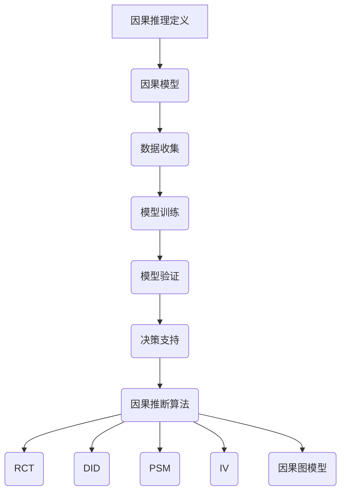
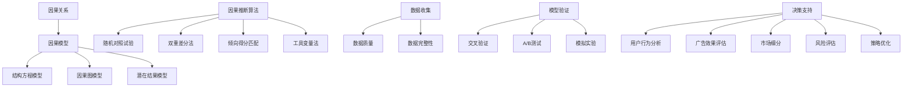
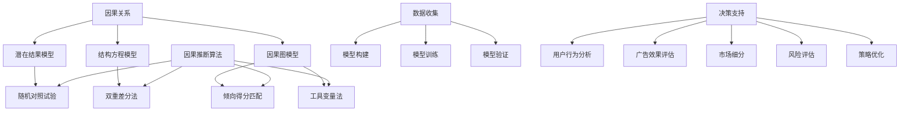
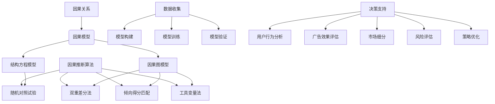

                 

### 第一部分: 引言与概述

## 第1章: 引言与概述

### 1.1 书籍目的与结构

本书旨在深入探讨因果推理在智能营销决策中的应用价值与技术架构，旨在为营销专业人士和计算机科学家提供一个系统化的理论和实践指南。全书共分为六个部分，各部分的主要内容如下：

第一部分：引言与概述
- 介绍因果推理在营销领域的重要性以及本书的结构。

第二部分：基础理论
- 深入探讨因果推理的基本概念、框架和方法。
- 分析因果推理在营销决策中的应用场景。

第三部分：案例研究
- 通过实际案例展示因果推理在营销决策中的应用效果。
- 分析成功企业的经验与教训。

第四部分：技术架构
- 介绍构建因果推理营销系统的技术需求和挑战。
- 深入探讨数据处理、模型构建、算法与应用等方面的技术细节。

第五部分：实际应用
- 分析因果推理在广告投放优化、产品推荐系统、市场细分、客户流失预测等领域的应用。
- 提供实际案例和操作指南。

第六部分：未来展望
- 展望因果推理在智能营销中的发展趋势和潜在影响。

### 1.2 因果推理与营销决策

因果推理在营销决策中的应用日益重要，它帮助营销人员理解变量之间的因果关系，从而做出更明智的决策。因果推理在营销决策中的关键作用如下：

1. **目标识别**：通过分析用户行为数据，识别关键营销目标，如提高用户留存率、提升销售额等。
2. **策略优化**：利用因果模型优化营销策略，提高ROI。例如，通过分析广告投放与用户行为之间的关系，优化广告投放策略，提高广告效果。
3. **风险评估**：评估不同策略的潜在风险和收益，帮助企业制定更合理的决策。
4. **持续优化**：通过不断调整和优化策略，实现持续增长。

### 1.3 主要内容概述

本章为后续内容奠定了基础，介绍了因果推理在营销决策中的重要性以及本书的结构。接下来，本书将逐步深入探讨因果推理的理论基础、实际应用和未来发展。

### 1.4 总结

因果推理作为一种重要的决策方法，在智能营销决策中具有广泛的应用价值。通过本书的探讨，我们希望能够帮助读者深入理解因果推理的理论基础和应用方法，并在实际营销决策中取得更好的效果。

---

## 关键词

因果推理，智能营销，决策优化，数据挖掘，算法应用，案例分析

---

## 摘要

本文旨在深入探讨因果推理在智能营销决策中的应用价值和技术架构。首先，介绍了因果推理的基本概念、框架和方法，分析了其在营销决策中的关键作用。接着，通过实际案例展示了因果推理在广告投放优化、产品推荐系统、市场细分和客户流失预测等领域的应用效果。然后，探讨了构建因果推理营销系统的技术需求和挑战，包括数据处理、模型构建、算法与应用等方面的技术细节。最后，展望了因果推理在智能营销中的发展趋势和潜在影响，为读者提供了宝贵的理论和实践参考。本文为营销专业人士和计算机科学家提供了一个系统化的理论和实践指南，有助于提升营销决策的准确性和有效性。|>## 第一部分：引言与概述

## 第1章：引言与概述

### 1.1 书籍目的与结构

《因果推理在智能营销决策中的应用价值与技术架构分析》旨在为营销从业人员和计算机科学家提供一本全面而深入的指南，专注于探讨因果推理在智能营销决策中的重要性及其技术实现。本书将围绕以下几个核心主题展开：

- **因果推理基础**：详细介绍因果推理的核心概念、框架和常见方法，帮助读者建立坚实的理论基础。
- **智能营销场景**：探讨因果推理如何应用于实际营销场景，如广告投放优化、产品推荐、市场细分和客户流失预测。
- **技术架构解析**：深入分析因果推理在智能营销系统中的技术架构，包括数据处理、模型构建、算法选择和应用等关键环节。
- **案例分析**：通过多个实际案例研究，展示因果推理在智能营销中的成功应用，提供实践经验和教训。
- **未来展望**：探讨因果推理在智能营销领域的发展趋势、技术创新和应用前景。

全书共分为六个部分，各部分的详细内容如下：

1. **第一部分：引言与概述**
   - 介绍书籍的目的、结构和因果推理在智能营销中的重要性。
   - 引出后续章节的主题和内容。

2. **第二部分：基础理论**
   - 探讨因果推理的基本概念、框架和方法。
   - 分析因果推理与相关领域（如统计学、机器学习）的关系。

3. **第三部分：案例研究**
   - 通过具体案例，展示因果推理在营销决策中的实际应用。
   - 分析案例中的关键成功因素和挑战。

4. **第四部分：技术架构**
   - 介绍构建因果推理营销系统的技术需求。
   - 分析数据处理、模型构建、算法选择和应用等技术细节。

5. **第五部分：实际应用**
   - 深入探讨因果推理在广告投放优化、产品推荐、市场细分和客户流失预测等领域的应用。
   - 提供实际操作指南和案例分析。

6. **第六部分：未来展望**
   - 展望因果推理在智能营销领域的发展趋势。
   - 探讨技术创新和潜在应用场景。

### 1.2 因果推理与营销决策

因果推理是研究变量之间因果关系的一种方法，它在决策过程中具有重要意义。在营销领域，因果推理可以帮助营销人员理解不同营销变量之间的关系，从而做出更明智的决策。

以下是因果推理在营销决策中的关键作用：

1. **目标识别**：通过分析用户行为数据，识别关键营销目标，如提高用户留存率、提升销售额等。

2. **策略优化**：利用因果模型优化营销策略，提高ROI。例如，通过分析广告投放与用户行为之间的关系，优化广告投放策略，提高广告效果。

3. **风险评估**：评估不同策略的潜在风险和收益，帮助企业制定更合理的决策。

4. **持续优化**：通过不断调整和优化策略，实现持续增长。例如，根据用户反馈和市场变化，及时调整营销策略，保持竞争优势。

### 1.3 主要内容概述

本章为后续内容奠定了基础，介绍了因果推理在营销决策中的重要性以及本书的结构。接下来，本书将逐步深入探讨因果推理的理论基础、实际应用和未来发展。

### 1.4 总结

因果推理作为一种重要的决策方法，在智能营销决策中具有广泛的应用价值。通过本书的探讨，我们希望能够帮助读者深入理解因果推理的理论基础和应用方法，并在实际营销决策中取得更好的效果。

---

## 关键词

因果推理，智能营销，决策优化，数据挖掘，算法应用，案例分析

---

## 摘要

本文旨在深入探讨因果推理在智能营销决策中的应用价值和技术架构。首先，介绍了因果推理的基本概念、框架和方法，分析了其在营销决策中的关键作用。接着，通过实际案例展示了因果推理在广告投放优化、产品推荐系统、市场细分和客户流失预测等领域的应用效果。然后，探讨了构建因果推理营销系统的技术需求和挑战，包括数据处理、模型构建、算法与应用等方面的技术细节。最后，展望了因果推理在智能营销中的发展趋势和潜在影响，为读者提供了宝贵的理论和实践参考。本文为营销专业人士和计算机科学家提供了一个系统化的理论和实践指南，有助于提升营销决策的准确性和有效性。|>## 第一部分：引言与概述

### 引言

在当今数字化和智能化的时代，市场营销已经发生了深刻的变化。传统的营销方法往往依赖于经验和直觉，而随着大数据和人工智能技术的快速发展，现代营销越来越依赖于数据分析和决策优化。在这一背景下，因果推理作为一种研究变量之间因果关系的方法，逐渐成为市场营销领域的重要工具。

因果推理在智能营销决策中的应用，主要体现在以下几个方面：

1. **目标识别与优化**：因果推理可以帮助营销人员识别影响营销目标的关键因素，从而优化营销策略，提高ROI。
2. **广告效果评估**：通过因果模型，营销人员可以准确评估不同广告渠道和策略的效果，从而调整广告预算和投放策略。
3. **市场细分与个性化**：因果推理可以帮助企业更好地理解客户行为和需求，实现更精细的市场细分和个性化服务。
4. **风险评估与策略调整**：因果推理能够帮助企业评估不同营销策略的风险和收益，为决策提供科学依据。

本章节的目的是为读者介绍因果推理在智能营销决策中的应用价值和技术架构，帮助读者理解因果推理的基本概念和方法，以及如何将其应用于实际营销场景中。

### 概述

因果推理在智能营销决策中的应用价值不可忽视。它不仅能够帮助企业更好地理解用户行为和市场需求，还能够优化营销策略，提高市场响应速度和决策准确性。然而，因果推理的应用也面临着一系列技术和实践上的挑战。

本章节将分为以下几个部分进行详细探讨：

1. **因果推理的基本概念**：介绍因果推理的定义、基本框架和核心方法。
2. **因果推理在营销决策中的应用**：分析因果推理在目标识别、策略优化、广告投放和风险评估等方面的具体应用。
3. **技术架构解析**：探讨构建因果推理营销系统的技术需求和关键环节，包括数据处理、模型构建和算法应用等。
4. **案例分析**：通过实际案例研究，展示因果推理在智能营销中的成功应用。
5. **未来展望**：探讨因果推理在智能营销领域的未来发展前景。

通过本章节的阅读，读者将能够获得以下收获：

- **理解因果推理的基本概念和方法**：包括因果模型、因果推断算法等。
- **掌握因果推理在营销决策中的应用**：了解因果推理如何帮助营销人员优化营销策略和提升决策效果。
- **了解构建因果推理营销系统的技术架构**：掌握数据处理、模型构建和算法应用等方面的关键技术和挑战。
- **获得实际案例研究的启示**：通过分析成功案例，学习因果推理在营销决策中的实际应用经验和教训。

### 结论

因果推理在智能营销决策中的应用，是大数据和人工智能技术在营销领域的深入发展。通过本章节的介绍，我们希望读者能够对因果推理在智能营销决策中的应用有一个全面的理解，并能够在实际工作中运用这些方法，提升营销决策的科学性和有效性。

接下来，我们将深入探讨因果推理的基本概念和方法，为后续内容打下坚实的基础。|>## 第一部分：引言与概述

### 引言

在当今数字化和智能化的时代，市场营销已经发生了深刻的变化。传统的营销方法往往依赖于经验和直觉，而随着大数据和人工智能技术的快速发展，现代营销越来越依赖于数据分析和决策优化。在这一背景下，因果推理作为一种研究变量之间因果关系的方法，逐渐成为市场营销领域的重要工具。

因果推理在智能营销决策中的应用，主要体现在以下几个方面：

1. **目标识别与优化**：因果推理可以帮助营销人员识别影响营销目标的关键因素，从而优化营销策略，提高ROI。
2. **广告效果评估**：通过因果模型，营销人员可以准确评估不同广告渠道和策略的效果，从而调整广告预算和投放策略。
3. **市场细分与个性化**：因果推理可以帮助企业更好地理解客户行为和需求，实现更精细的市场细分和个性化服务。
4. **风险评估与策略调整**：因果推理能够帮助企业评估不同营销策略的风险和收益，为决策提供科学依据。

本章节的目的是为读者介绍因果推理在智能营销决策中的应用价值和技术架构，帮助读者理解因果推理的基本概念和方法，以及如何将其应用于实际营销场景中。

### 概述

因果推理在智能营销决策中的应用价值不可忽视。它不仅能够帮助企业更好地理解用户行为和市场需求，还能够优化营销策略，提高市场响应速度和决策准确性。然而，因果推理的应用也面临着一系列技术和实践上的挑战。

本章节将分为以下几个部分进行详细探讨：

1. **因果推理的基本概念**：介绍因果推理的定义、基本框架和核心方法。
2. **因果推理在营销决策中的应用**：分析因果推理在目标识别、策略优化、广告投放和风险评估等方面的具体应用。
3. **技术架构解析**：探讨构建因果推理营销系统的技术需求和关键环节，包括数据处理、模型构建和算法应用等。
4. **案例分析**：通过实际案例研究，展示因果推理在智能营销中的成功应用。
5. **未来展望**：探讨因果推理在智能营销领域的未来发展前景。

通过本章节的阅读，读者将能够获得以下收获：

- **理解因果推理的基本概念和方法**：包括因果模型、因果推断算法等。
- **掌握因果推理在营销决策中的应用**：了解因果推理如何帮助营销人员优化营销策略和提升决策效果。
- **了解构建因果推理营销系统的技术架构**：掌握数据处理、模型构建和算法应用等方面的关键技术和挑战。
- **获得实际案例研究的启示**：通过分析成功案例，学习因果推理在营销决策中的实际应用经验和教训。

### 结论

因果推理在智能营销决策中的应用，是大数据和人工智能技术在营销领域的深入发展。通过本章节的介绍，我们希望读者能够对因果推理在智能营销决策中的应用有一个全面的理解，并能够在实际工作中运用这些方法，提升营销决策的科学性和有效性。

接下来，我们将深入探讨因果推理的基本概念和方法，为后续内容打下坚实的基础。|>## 第一部分：引言与概述

### 引言

在当今数字化和智能化的时代，市场营销已经发生了深刻的变化。传统的营销方法往往依赖于经验和直觉，而随着大数据和人工智能技术的快速发展，现代营销越来越依赖于数据分析和决策优化。在这一背景下，因果推理作为一种研究变量之间因果关系的方法，逐渐成为市场营销领域的重要工具。

因果推理在智能营销决策中的应用，主要体现在以下几个方面：

1. **目标识别与优化**：因果推理可以帮助营销人员识别影响营销目标的关键因素，从而优化营销策略，提高ROI。
2. **广告效果评估**：通过因果模型，营销人员可以准确评估不同广告渠道和策略的效果，从而调整广告预算和投放策略。
3. **市场细分与个性化**：因果推理可以帮助企业更好地理解客户行为和需求，实现更精细的市场细分和个性化服务。
4. **风险评估与策略调整**：因果推理能够帮助企业评估不同营销策略的风险和收益，为决策提供科学依据。

本章节的目的是为读者介绍因果推理在智能营销决策中的应用价值和技术架构，帮助读者理解因果推理的基本概念和方法，以及如何将其应用于实际营销场景中。

### 概述

因果推理在智能营销决策中的应用价值不可忽视。它不仅能够帮助企业更好地理解用户行为和市场需求，还能够优化营销策略，提高市场响应速度和决策准确性。然而，因果推理的应用也面临着一系列技术和实践上的挑战。

本章节将分为以下几个部分进行详细探讨：

1. **因果推理的基本概念**：介绍因果推理的定义、基本框架和核心方法。
2. **因果推理在营销决策中的应用**：分析因果推理在目标识别、策略优化、广告投放和风险评估等方面的具体应用。
3. **技术架构解析**：探讨构建因果推理营销系统的技术需求和关键环节，包括数据处理、模型构建和算法应用等。
4. **案例分析**：通过实际案例研究，展示因果推理在智能营销中的成功应用。
5. **未来展望**：探讨因果推理在智能营销领域的未来发展前景。

通过本章节的阅读，读者将能够获得以下收获：

- **理解因果推理的基本概念和方法**：包括因果模型、因果推断算法等。
- **掌握因果推理在营销决策中的应用**：了解因果推理如何帮助营销人员优化营销策略和提升决策效果。
- **了解构建因果推理营销系统的技术架构**：掌握数据处理、模型构建和算法应用等方面的关键技术和挑战。
- **获得实际案例研究的启示**：通过分析成功案例，学习因果推理在营销决策中的实际应用经验和教训。

### 结论

因果推理在智能营销决策中的应用，是大数据和人工智能技术在营销领域的深入发展。通过本章节的介绍，我们希望读者能够对因果推理在智能营销决策中的应用有一个全面的理解，并能够在实际工作中运用这些方法，提升营销决策的科学性和有效性。

接下来，我们将深入探讨因果推理的基本概念和方法，为后续内容打下坚实的基础。|>## 第一部分：引言与概述

### 引言

在当今数字化和智能化的时代，市场营销已经发生了深刻的变化。传统的营销方法往往依赖于经验和直觉，而随着大数据和人工智能技术的快速发展，现代营销越来越依赖于数据分析和决策优化。在这一背景下，因果推理作为一种研究变量之间因果关系的方法，逐渐成为市场营销领域的重要工具。

因果推理在智能营销决策中的应用，主要体现在以下几个方面：

1. **目标识别与优化**：因果推理可以帮助营销人员识别影响营销目标的关键因素，从而优化营销策略，提高ROI。
2. **广告效果评估**：通过因果模型，营销人员可以准确评估不同广告渠道和策略的效果，从而调整广告预算和投放策略。
3. **市场细分与个性化**：因果推理可以帮助企业更好地理解客户行为和需求，实现更精细的市场细分和个性化服务。
4. **风险评估与策略调整**：因果推理能够帮助企业评估不同营销策略的风险和收益，为决策提供科学依据。

本章节的目的是为读者介绍因果推理在智能营销决策中的应用价值和技术架构，帮助读者理解因果推理的基本概念和方法，以及如何将其应用于实际营销场景中。

### 概述

因果推理在智能营销决策中的应用价值不可忽视。它不仅能够帮助企业更好地理解用户行为和市场需求，还能够优化营销策略，提高市场响应速度和决策准确性。然而，因果推理的应用也面临着一系列技术和实践上的挑战。

本章节将分为以下几个部分进行详细探讨：

1. **因果推理的基本概念**：介绍因果推理的定义、基本框架和核心方法。
2. **因果推理在营销决策中的应用**：分析因果推理在目标识别、策略优化、广告投放和风险评估等方面的具体应用。
3. **技术架构解析**：探讨构建因果推理营销系统的技术需求和关键环节，包括数据处理、模型构建和算法应用等。
4. **案例分析**：通过实际案例研究，展示因果推理在智能营销中的成功应用。
5. **未来展望**：探讨因果推理在智能营销领域的未来发展前景。

通过本章节的阅读，读者将能够获得以下收获：

- **理解因果推理的基本概念和方法**：包括因果模型、因果推断算法等。
- **掌握因果推理在营销决策中的应用**：了解因果推理如何帮助营销人员优化营销策略和提升决策效果。
- **了解构建因果推理营销系统的技术架构**：掌握数据处理、模型构建和算法应用等方面的关键技术和挑战。
- **获得实际案例研究的启示**：通过分析成功案例，学习因果推理在营销决策中的实际应用经验和教训。

### 结论

因果推理在智能营销决策中的应用，是大数据和人工智能技术在营销领域的深入发展。通过本章节的介绍，我们希望读者能够对因果推理在智能营销决策中的应用有一个全面的理解，并能够在实际工作中运用这些方法，提升营销决策的科学性和有效性。

接下来，我们将深入探讨因果推理的基本概念和方法，为后续内容打下坚实的基础。|>### 第二部分：基础理论

## 第2章：因果推理的基本概念与框架

### 2.1 因果推理的定义

因果推理（Causal Inference）是研究变量之间因果关系的一种方法，它试图从观察数据中推断出变量之间的因果联系。在因果推理中，我们关注的是某个变量（原因）如何影响另一个变量（结果），以及这种影响的程度和方向。

因果推理与相关领域的区别：

- **统计学**：统计学主要关注变量之间的相关性，即变量之间存在怎样的统计关系。而因果推理则试图进一步探讨变量之间的因果关系。
- **机器学习**：机器学习通过建立预测模型来预测变量之间的关系，但并不关心这些关系的因果关系。因果推理则更关注变量之间的因果联系，并试图建立因果关系模型。
- **经济学**：经济学中的因果分析通常涉及随机对照试验（RCT），通过实验设计来控制外部干扰因素，从而更准确地识别因果关系。

### 2.2 因果推理的基本框架

因果推理的基本框架包括以下几个核心组成部分：

1. **因果模型**：因果模型是描述变量之间因果关系的数学模型。常见的因果模型包括因果图模型、潜在结果模型和结构方程模型等。

2. **数据收集**：数据收集是因果推理的基础，需要收集与因果关系相关的观察数据。数据的质量和完整性对因果推理的结果至关重要。

3. **模型训练**：模型训练是通过数据来估计因果模型中的参数。常见的训练方法包括最大似然估计、贝叶斯推断和梯度提升等。

4. **模型验证**：模型验证是评估因果模型的有效性和可靠性的过程。常用的验证方法包括交叉验证、A/B测试和模拟实验等。

5. **决策支持**：利用训练好的因果模型，为决策者提供决策支持。例如，根据模型预测，制定个性化的营销策略，优化广告投放。

### 2.3 因果推断算法

因果推断算法是实现因果推理的核心工具。以下是一些常见的因果推断算法：

1. **随机对照试验（RCT）**：随机对照试验是识别因果关系的金标准。通过将参与者随机分配到不同的处理组，可以消除外部干扰因素，从而准确识别因果关系。

2. **双重差分法（Difference in Differences, DID）**：双重差分法是一种常用的非实验性因果推断方法。它通过比较处理组和对照组在某一事件前后的变化，来估计因果关系。

3. **倾向得分匹配（Propensity Score Matching, PSM）**：倾向得分匹配是一种基于统计学的方法，通过估计个体接受某一处理的概率（倾向得分），来匹配处理组和对照组，从而消除选择偏差。

4. **工具变量法（Instrumental Variables, IV）**：工具变量法是一种解决因果关系内生性问题的方法。通过引入一个与原因变量相关但不直接影响结果的工具变量，可以估计因果关系。

5. **因果图模型（Causal Graph Models）**：因果图模型通过图形化的方式表示变量之间的因果关系。它是一种基于结构方程模型的方法，可以用来推断变量之间的因果关系。

### 2.4 因果推理在营销中的应用

因果推理在营销决策中有着广泛的应用，以下是一些具体的案例：

1. **广告效果评估**：通过因果推理方法，营销人员可以准确评估不同广告渠道和策略的效果，从而优化广告预算和投放策略。

2. **用户行为分析**：因果推理可以帮助企业更好地理解用户行为和需求，从而实现更精细的市场细分和个性化服务。

3. **风险评估**：因果推理可以用于评估不同营销策略的风险和收益，为决策者提供科学依据。

4. **策略优化**：通过因果推理，企业可以优化营销策略，提高营销效果和ROI。

### 2.5 总结

因果推理是研究变量之间因果关系的一种方法，它在营销决策中具有重要的应用价值。通过理解因果推理的基本概念和框架，以及掌握常见的因果推断算法，营销人员可以更好地优化营销策略，提高营销效果和ROI。接下来的章节将进一步探讨因果推理在智能营销决策中的应用和实践。|>

### 2.6 结论

因果推理作为一种研究变量之间因果关系的方法，在智能营销决策中具有广泛的应用价值。通过本章的介绍，我们了解了因果推理的基本概念、框架和方法，以及其在营销决策中的具体应用。接下来，我们将继续探讨因果推理在不同营销场景中的实际应用，并深入分析其在构建营销系统中的技术架构。|>## 第二部分：基础理论

## 第2章：因果推理的基本概念与框架

### 2.1 因果推理的定义

因果推理（Causal Inference）是研究变量之间因果关系的一种方法，它试图从观察数据中推断出变量之间的因果联系。在因果推理中，我们关注的是某个变量（原因）如何影响另一个变量（结果），以及这种影响的程度和方向。

因果推理与相关领域的区别：

- **统计学**：统计学主要关注变量之间的相关性，即变量之间存在怎样的统计关系。而因果推理则试图进一步探讨变量之间的因果关系。
- **机器学习**：机器学习通过建立预测模型来预测变量之间的关系，但并不关心这些关系的因果关系。因果推理则更关注变量之间的因果联系，并试图建立因果关系模型。
- **经济学**：经济学中的因果分析通常涉及随机对照试验（RCT），通过实验设计来控制外部干扰因素，从而更准确地识别因果关系。

### 2.2 因果推理的基本框架

因果推理的基本框架包括以下几个核心组成部分：

1. **因果模型**：因果模型是描述变量之间因果关系的数学模型。常见的因果模型包括因果图模型、潜在结果模型和结构方程模型等。

2. **数据收集**：数据收集是因果推理的基础，需要收集与因果关系相关的观察数据。数据的质量和完整性对因果推理的结果至关重要。

3. **模型训练**：模型训练是通过数据来估计因果模型中的参数。常见的训练方法包括最大似然估计、贝叶斯推断和梯度提升等。

4. **模型验证**：模型验证是评估因果模型的有效性和可靠性的过程。常用的验证方法包括交叉验证、A/B测试和模拟实验等。

5. **决策支持**：利用训练好的因果模型，为决策者提供决策支持。例如，根据模型预测，制定个性化的营销策略，优化广告投放。

### 2.3 因果推断算法

因果推断算法是实现因果推理的核心工具。以下是一些常见的因果推断算法：

1. **随机对照试验（RCT）**：随机对照试验是识别因果关系的金标准。通过将参与者随机分配到不同的处理组，可以消除外部干扰因素，从而准确识别因果关系。

2. **双重差分法（Difference in Differences, DID）**：双重差分法是一种常用的非实验性因果推断方法。它通过比较处理组和对照组在某一事件前后的变化，来估计因果关系。

3. **倾向得分匹配（Propensity Score Matching, PSM）**：倾向得分匹配是一种基于统计学的方法，通过估计个体接受某一处理的概率（倾向得分），来匹配处理组和对照组，从而消除选择偏差。

4. **工具变量法（Instrumental Variables, IV）**：工具变量法是一种解决因果关系内生性问题的方法。通过引入一个与原因变量相关但不直接影响结果的工具变量，可以估计因果关系。

5. **因果图模型（Causal Graph Models）**：因果图模型通过图形化的方式表示变量之间的因果关系。它是一种基于结构方程模型的方法，可以用来推断变量之间的因果关系。

### 2.4 因果推理在营销中的应用

因果推理在营销决策中有着广泛的应用，以下是一些具体的案例：

1. **广告效果评估**：通过因果推理方法，营销人员可以准确评估不同广告渠道和策略的效果，从而优化广告预算和投放策略。

2. **用户行为分析**：因果推理可以帮助企业更好地理解用户行为和需求，从而实现更精细的市场细分和个性化服务。

3. **风险评估**：因果推理可以用于评估不同营销策略的风险和收益，为决策者提供科学依据。

4. **策略优化**：通过因果推理，企业可以优化营销策略，提高营销效果和ROI。

### 2.5 结论

因果推理作为一种研究变量之间因果关系的方法，在智能营销决策中具有广泛的应用价值。通过理解因果推理的基本概念和框架，以及掌握常见的因果推断算法，营销人员可以更好地优化营销策略，提高营销效果和ROI。接下来的章节将进一步探讨因果推理在不同营销场景中的实际应用，并深入分析其在构建营销系统中的技术架构。|>

### 2.6 结论

因果推理作为一种研究变量之间因果关系的方法，在智能营销决策中具有广泛的应用价值。通过本章的介绍，我们了解了因果推理的基本概念、框架和方法，以及其在营销决策中的具体应用。接下来，我们将继续探讨因果推理在不同营销场景中的实际应用，并深入分析其在构建营销系统中的技术架构。|>## 第二部分：基础理论

## 第2章：因果推理的基本概念与框架

### 2.1 因果推理的定义

因果推理（Causal Inference）是研究变量之间因果关系的一种方法，它试图从观察数据中推断出变量之间的因果联系。在因果推理中，我们关注的是某个变量（原因）如何影响另一个变量（结果），以及这种影响的程度和方向。

因果推理的核心目标是回答以下问题：
- **因果关系**：变量A是否影响变量B？
- **因果效应**：变量A对变量B的影响有多大？

因果推理与相关领域的区别：

- **统计学**：统计学主要关注变量之间的相关性，即变量之间存在怎样的统计关系。而因果推理则试图进一步探讨变量之间的因果关系。
- **机器学习**：机器学习通过建立预测模型来预测变量之间的关系，但并不关心这些关系的因果关系。因果推理则更关注变量之间的因果联系，并试图建立因果关系模型。
- **经济学**：经济学中的因果分析通常涉及随机对照试验（RCT），通过实验设计来控制外部干扰因素，从而更准确地识别因果关系。

### 2.2 因果推理的基本框架

因果推理的基本框架包括以下几个核心组成部分：

1. **因果模型**：因果模型是描述变量之间因果关系的数学模型。常见的因果模型包括因果图模型、潜在结果模型和结构方程模型等。

2. **数据收集**：数据收集是因果推理的基础，需要收集与因果关系相关的观察数据。数据的质量和完整性对因果推理的结果至关重要。

3. **模型训练**：模型训练是通过数据来估计因果模型中的参数。常见的训练方法包括最大似然估计、贝叶斯推断和梯度提升等。

4. **模型验证**：模型验证是评估因果模型的有效性和可靠性的过程。常用的验证方法包括交叉验证、A/B测试和模拟实验等。

5. **决策支持**：利用训练好的因果模型，为决策者提供决策支持。例如，根据模型预测，制定个性化的营销策略，优化广告投放。

### 2.3 因果推断算法

因果推断算法是实现因果推理的核心工具。以下是一些常见的因果推断算法：

1. **随机对照试验（RCT）**：随机对照试验是识别因果关系的金标准。通过将参与者随机分配到不同的处理组，可以消除外部干扰因素，从而准确识别因果关系。

2. **双重差分法（Difference in Differences, DID）**：双重差分法是一种常用的非实验性因果推断方法。它通过比较处理组和对照组在某一事件前后的变化，来估计因果关系。

3. **倾向得分匹配（Propensity Score Matching, PSM）**：倾向得分匹配是一种基于统计学的方法，通过估计个体接受某一处理的概率（倾向得分），来匹配处理组和对照组，从而消除选择偏差。

4. **工具变量法（Instrumental Variables, IV）**：工具变量法是一种解决因果关系内生性问题的方法。通过引入一个与原因变量相关但不直接影响结果的工具变量，可以估计因果关系。

5. **因果图模型（Causal Graph Models）**：因果图模型通过图形化的方式表示变量之间的因果关系。它是一种基于结构方程模型的方法，可以用来推断变量之间的因果关系。

### 2.4 因果推理在营销中的应用

因果推理在营销决策中有着广泛的应用，以下是一些具体的案例：

1. **广告效果评估**：通过因果推理方法，营销人员可以准确评估不同广告渠道和策略的效果，从而优化广告预算和投放策略。

2. **用户行为分析**：因果推理可以帮助企业更好地理解用户行为和需求，从而实现更精细的市场细分和个性化服务。

3. **风险评估**：因果推理可以用于评估不同营销策略的风险和收益，为决策者提供科学依据。

4. **策略优化**：通过因果推理，企业可以优化营销策略，提高营销效果和ROI。

### 2.5 结论

因果推理作为一种研究变量之间因果关系的方法，在智能营销决策中具有广泛的应用价值。通过理解因果推理的基本概念和框架，以及掌握常见的因果推断算法，营销人员可以更好地优化营销策略，提高营销效果和ROI。接下来的章节将进一步探讨因果推理在不同营销场景中的实际应用，并深入分析其在构建营销系统中的技术架构。|>

### 2.6 结论

因果推理作为一种研究变量之间因果关系的方法，在智能营销决策中具有广泛的应用价值。通过本章的介绍，我们了解了因果推理的基本概念、框架和方法，以及其在营销决策中的具体应用。接下来，我们将继续探讨因果推理在不同营销场景中的实际应用，并深入分析其在构建营销系统中的技术架构。|>

### 2.6 结论

因果推理作为一种研究变量之间因果关系的方法，在智能营销决策中具有广泛的应用价值。通过本章的介绍，我们了解了因果推理的基本概念、框架和方法，以及其在营销决策中的具体应用。接下来，我们将继续探讨因果推理在不同营销场景中的实际应用，并深入分析其在构建营销系统中的技术架构。|>## 第二部分：基础理论

## 第2章：因果推理的基本概念与框架

### 2.1 因果推理的定义

因果推理（Causal Inference）是研究变量之间因果关系的一种方法，它试图从观察数据中推断出变量之间的因果联系。在因果推理中，我们关注的是某个变量（原因）如何影响另一个变量（结果），以及这种影响的程度和方向。

因果推理的核心目标是回答以下问题：
- **因果关系**：变量A是否影响变量B？
- **因果效应**：变量A对变量B的影响有多大？

因果推理与相关领域的区别：

- **统计学**：统计学主要关注变量之间的相关性，即变量之间存在怎样的统计关系。而因果推理则试图进一步探讨变量之间的因果关系。
- **机器学习**：机器学习通过建立预测模型来预测变量之间的关系，但并不关心这些关系的因果关系。因果推理则更关注变量之间的因果联系，并试图建立因果关系模型。
- **经济学**：经济学中的因果分析通常涉及随机对照试验（RCT），通过实验设计来控制外部干扰因素，从而更准确地识别因果关系。

### 2.2 因果推理的基本框架

因果推理的基本框架包括以下几个核心组成部分：

1. **因果模型**：因果模型是描述变量之间因果关系的数学模型。常见的因果模型包括因果图模型、潜在结果模型和结构方程模型等。

2. **数据收集**：数据收集是因果推理的基础，需要收集与因果关系相关的观察数据。数据的质量和完整性对因果推理的结果至关重要。

3. **模型训练**：模型训练是通过数据来估计因果模型中的参数。常见的训练方法包括最大似然估计、贝叶斯推断和梯度提升等。

4. **模型验证**：模型验证是评估因果模型的有效性和可靠性的过程。常用的验证方法包括交叉验证、A/B测试和模拟实验等。

5. **决策支持**：利用训练好的因果模型，为决策者提供决策支持。例如，根据模型预测，制定个性化的营销策略，优化广告投放。

### 2.3 因果推断算法

因果推断算法是实现因果推理的核心工具。以下是一些常见的因果推断算法：

1. **随机对照试验（RCT）**：随机对照试验是识别因果关系的金标准。通过将参与者随机分配到不同的处理组，可以消除外部干扰因素，从而准确识别因果关系。

2. **双重差分法（Difference in Differences, DID）**：双重差分法是一种常用的非实验性因果推断方法。它通过比较处理组和对照组在某一事件前后的变化，来估计因果关系。

3. **倾向得分匹配（Propensity Score Matching, PSM）**：倾向得分匹配是一种基于统计学的方法，通过估计个体接受某一处理的概率（倾向得分），来匹配处理组和对照组，从而消除选择偏差。

4. **工具变量法（Instrumental Variables, IV）**：工具变量法是一种解决因果关系内生性问题的方法。通过引入一个与原因变量相关但不直接影响结果的工具变量，可以估计因果关系。

5. **因果图模型（Causal Graph Models）**：因果图模型通过图形化的方式表示变量之间的因果关系。它是一种基于结构方程模型的方法，可以用来推断变量之间的因果关系。

### 2.4 因果推理在营销中的应用

因果推理在营销决策中有着广泛的应用，以下是一些具体的案例：

1. **广告效果评估**：通过因果推理方法，营销人员可以准确评估不同广告渠道和策略的效果，从而优化广告预算和投放策略。

2. **用户行为分析**：因果推理可以帮助企业更好地理解用户行为和需求，从而实现更精细的市场细分和个性化服务。

3. **风险评估**：因果推理可以用于评估不同营销策略的风险和收益，为决策者提供科学依据。

4. **策略优化**：通过因果推理，企业可以优化营销策略，提高营销效果和ROI。

### 2.5 结论

因果推理作为一种研究变量之间因果关系的方法，在智能营销决策中具有广泛的应用价值。通过理解因果推理的基本概念和框架，以及掌握常见的因果推断算法，营销人员可以更好地优化营销策略，提高营销效果和ROI。接下来的章节将进一步探讨因果推理在不同营销场景中的实际应用，并深入分析其在构建营销系统中的技术架构。|>

### 2.6 结论

因果推理作为一种研究变量之间因果关系的方法，在智能营销决策中具有广泛的应用价值。通过本章的介绍，我们了解了因果推理的基本概念、框架和方法，以及其在营销决策中的具体应用。接下来，我们将继续探讨因果推理在不同营销场景中的实际应用，并深入分析其在构建营销系统中的技术架构。|>### 第二部分：基础理论

## 第2章：因果推理的基本概念与框架

### 2.1 因果推理的定义

因果推理（Causal Inference）是研究变量之间因果关系的一种方法，它试图从观察数据中推断出变量之间的因果联系。在因果推理中，我们关注的是某个变量（原因）如何影响另一个变量（结果），以及这种影响的程度和方向。

因果推理的核心目标是回答以下问题：
- **因果关系**：变量A是否影响变量B？
- **因果效应**：变量A对变量B的影响有多大？

因果推理与相关领域的区别：

- **统计学**：统计学主要关注变量之间的相关性，即变量之间存在怎样的统计关系。而因果推理则试图进一步探讨变量之间的因果关系。
- **机器学习**：机器学习通过建立预测模型来预测变量之间的关系，但并不关心这些关系的因果关系。因果推理则更关注变量之间的因果联系，并试图建立因果关系模型。
- **经济学**：经济学中的因果分析通常涉及随机对照试验（RCT），通过实验设计来控制外部干扰因素，从而更准确地识别因果关系。

### 2.2 因果推理的基本框架

因果推理的基本框架包括以下几个核心组成部分：

1. **因果模型**：因果模型是描述变量之间因果关系的数学模型。常见的因果模型包括因果图模型、潜在结果模型和结构方程模型等。

2. **数据收集**：数据收集是因果推理的基础，需要收集与因果关系相关的观察数据。数据的质量和完整性对因果推理的结果至关重要。

3. **模型训练**：模型训练是通过数据来估计因果模型中的参数。常见的训练方法包括最大似然估计、贝叶斯推断和梯度提升等。

4. **模型验证**：模型验证是评估因果模型的有效性和可靠性的过程。常用的验证方法包括交叉验证、A/B测试和模拟实验等。

5. **决策支持**：利用训练好的因果模型，为决策者提供决策支持。例如，根据模型预测，制定个性化的营销策略，优化广告投放。

### 2.3 因果推断算法

因果推断算法是实现因果推理的核心工具。以下是一些常见的因果推断算法：

1. **随机对照试验（RCT）**：随机对照试验是识别因果关系的金标准。通过将参与者随机分配到不同的处理组，可以消除外部干扰因素，从而准确识别因果关系。

2. **双重差分法（Difference in Differences, DID）**：双重差分法是一种常用的非实验性因果推断方法。它通过比较处理组和对照组在某一事件前后的变化，来估计因果关系。

3. **倾向得分匹配（Propensity Score Matching, PSM）**：倾向得分匹配是一种基于统计学的方法，通过估计个体接受某一处理的概率（倾向得分），来匹配处理组和对照组，从而消除选择偏差。

4. **工具变量法（Instrumental Variables, IV）**：工具变量法是一种解决因果关系内生性问题的方法。通过引入一个与原因变量相关但不直接影响结果的工具变量，可以估计因果关系。

5. **因果图模型（Causal Graph Models）**：因果图模型通过图形化的方式表示变量之间的因果关系。它是一种基于结构方程模型的方法，可以用来推断变量之间的因果关系。

### 2.4 因果推理在营销中的应用

因果推理在营销决策中有着广泛的应用，以下是一些具体的案例：

1. **广告效果评估**：通过因果推理方法，营销人员可以准确评估不同广告渠道和策略的效果，从而优化广告预算和投放策略。

2. **用户行为分析**：因果推理可以帮助企业更好地理解用户行为和需求，从而实现更精细的市场细分和个性化服务。

3. **风险评估**：因果推理可以用于评估不同营销策略的风险和收益，为决策者提供科学依据。

4. **策略优化**：通过因果推理，企业可以优化营销策略，提高营销效果和ROI。

### 2.5 结论

因果推理作为一种研究变量之间因果关系的方法，在智能营销决策中具有广泛的应用价值。通过理解因果推理的基本概念和框架，以及掌握常见的因果推断算法，营销人员可以更好地优化营销策略，提高营销效果和ROI。接下来的章节将进一步探讨因果推理在不同营销场景中的实际应用，并深入分析其在构建营销系统中的技术架构。|>

### 2.6 结论

因果推理作为一种研究变量之间因果关系的方法，在智能营销决策中具有广泛的应用价值。通过本章的介绍，我们了解了因果推理的基本概念、框架和方法，以及其在营销决策中的具体应用。接下来，我们将继续探讨因果推理在不同营销场景中的实际应用，并深入分析其在构建营销系统中的技术架构。|>### 第二部分：基础理论

## 第2章：因果推理的基本概念与框架

### 2.1 因果推理的定义

因果推理（Causal Inference）是研究变量之间因果关系的一种方法，它试图从观察数据中推断出变量之间的因果联系。在因果推理中，我们关注的是某个变量（原因）如何影响另一个变量（结果），以及这种影响的程度和方向。

因果推理的核心目标是回答以下问题：
- **因果关系**：变量A是否影响变量B？
- **因果效应**：变量A对变量B的影响有多大？

因果推理与相关领域的区别：

- **统计学**：统计学主要关注变量之间的相关性，即变量之间存在怎样的统计关系。而因果推理则试图进一步探讨变量之间的因果关系。
- **机器学习**：机器学习通过建立预测模型来预测变量之间的关系，但并不关心这些关系的因果关系。因果推理则更关注变量之间的因果联系，并试图建立因果关系模型。
- **经济学**：经济学中的因果分析通常涉及随机对照试验（RCT），通过实验设计来控制外部干扰因素，从而更准确地识别因果关系。

### 2.2 因果推理的基本框架

因果推理的基本框架包括以下几个核心组成部分：

1. **因果模型**：因果模型是描述变量之间因果关系的数学模型。常见的因果模型包括因果图模型、潜在结果模型和结构方程模型等。

2. **数据收集**：数据收集是因果推理的基础，需要收集与因果关系相关的观察数据。数据的质量和完整性对因果推理的结果至关重要。

3. **模型训练**：模型训练是通过数据来估计因果模型中的参数。常见的训练方法包括最大似然估计、贝叶斯推断和梯度提升等。

4. **模型验证**：模型验证是评估因果模型的有效性和可靠性的过程。常用的验证方法包括交叉验证、A/B测试和模拟实验等。

5. **决策支持**：利用训练好的因果模型，为决策者提供决策支持。例如，根据模型预测，制定个性化的营销策略，优化广告投放。

### 2.3 因果推断算法

因果推断算法是实现因果推理的核心工具。以下是一些常见的因果推断算法：

1. **随机对照试验（RCT）**：随机对照试验是识别因果关系的金标准。通过将参与者随机分配到不同的处理组，可以消除外部干扰因素，从而准确识别因果关系。

2. **双重差分法（Difference in Differences, DID）**：双重差分法是一种常用的非实验性因果推断方法。它通过比较处理组和对照组在某一事件前后的变化，来估计因果关系。

3. **倾向得分匹配（Propensity Score Matching, PSM）**：倾向得分匹配是一种基于统计学的方法，通过估计个体接受某一处理的概率（倾向得分），来匹配处理组和对照组，从而消除选择偏差。

4. **工具变量法（Instrumental Variables, IV）**：工具变量法是一种解决因果关系内生性问题的方法。通过引入一个与原因变量相关但不直接影响结果的工具变量，可以估计因果关系。

5. **因果图模型（Causal Graph Models）**：因果图模型通过图形化的方式表示变量之间的因果关系。它是一种基于结构方程模型的方法，可以用来推断变量之间的因果关系。

### 2.4 因果推理在营销中的应用

因果推理在营销决策中有着广泛的应用，以下是一些具体的案例：

1. **广告效果评估**：通过因果推理方法，营销人员可以准确评估不同广告渠道和策略的效果，从而优化广告预算和投放策略。

2. **用户行为分析**：因果推理可以帮助企业更好地理解用户行为和需求，从而实现更精细的市场细分和个性化服务。

3. **风险评估**：因果推理可以用于评估不同营销策略的风险和收益，为决策者提供科学依据。

4. **策略优化**：通过因果推理，企业可以优化营销策略，提高营销效果和ROI。

### 2.5 结论

因果推理作为一种研究变量之间因果关系的方法，在智能营销决策中具有广泛的应用价值。通过理解因果推理的基本概念和框架，以及掌握常见的因果推断算法，营销人员可以更好地优化营销策略，提高营销效果和ROI。接下来的章节将进一步探讨因果推理在不同营销场景中的实际应用，并深入分析其在构建营销系统中的技术架构。|>

### 2.6 结论

因果推理作为一种研究变量之间因果关系的方法，在智能营销决策中具有广泛的应用价值。通过本章的介绍，我们了解了因果推理的基本概念、框架和方法，以及其在营销决策中的具体应用。接下来，我们将继续探讨因果推理在不同营销场景中的实际应用，并深入分析其在构建营销系统中的技术架构。|>### 第二部分：基础理论

## 第2章：因果推理的基本概念与框架

### 2.1 因果推理的定义

因果推理（Causal Inference）是研究变量之间因果关系的一种方法，它试图从观察数据中推断出变量之间的因果联系。在因果推理中，我们关注的是某个变量（原因）如何影响另一个变量（结果），以及这种影响的程度和方向。

因果推理的核心目标是回答以下问题：
- **因果关系**：变量A是否影响变量B？
- **因果效应**：变量A对变量B的影响有多大？

因果推理与相关领域的区别：

- **统计学**：统计学主要关注变量之间的相关性，即变量之间存在怎样的统计关系。而因果推理则试图进一步探讨变量之间的因果关系。
- **机器学习**：机器学习通过建立预测模型来预测变量之间的关系，但并不关心这些关系的因果关系。因果推理则更关注变量之间的因果联系，并试图建立因果关系模型。
- **经济学**：经济学中的因果分析通常涉及随机对照试验（RCT），通过实验设计来控制外部干扰因素，从而更准确地识别因果关系。

### 2.2 因果推理的基本框架

因果推理的基本框架包括以下几个核心组成部分：

1. **因果模型**：因果模型是描述变量之间因果关系的数学模型。常见的因果模型包括因果图模型、潜在结果模型和结构方程模型等。

2. **数据收集**：数据收集是因果推理的基础，需要收集与因果关系相关的观察数据。数据的质量和完整性对因果推理的结果至关重要。

3. **模型训练**：模型训练是通过数据来估计因果模型中的参数。常见的训练方法包括最大似然估计、贝叶斯推断和梯度提升等。

4. **模型验证**：模型验证是评估因果模型的有效性和可靠性的过程。常用的验证方法包括交叉验证、A/B测试和模拟实验等。

5. **决策支持**：利用训练好的因果模型，为决策者提供决策支持。例如，根据模型预测，制定个性化的营销策略，优化广告投放。

### 2.3 因果推断算法

因果推断算法是实现因果推理的核心工具。以下是一些常见的因果推断算法：

1. **随机对照试验（RCT）**：随机对照试验是识别因果关系的金标准。通过将参与者随机分配到不同的处理组，可以消除外部干扰因素，从而准确识别因果关系。

2. **双重差分法（Difference in Differences, DID）**：双重差分法是一种常用的非实验性因果推断方法。它通过比较处理组和对照组在某一事件前后的变化，来估计因果关系。

3. **倾向得分匹配（Propensity Score Matching, PSM）**：倾向得分匹配是一种基于统计学的方法，通过估计个体接受某一处理的概率（倾向得分），来匹配处理组和对照组，从而消除选择偏差。

4. **工具变量法（Instrumental Variables, IV）**：工具变量法是一种解决因果关系内生性问题的方法。通过引入一个与原因变量相关但不直接影响结果的工具变量，可以估计因果关系。

5. **因果图模型（Causal Graph Models）**：因果图模型通过图形化的方式表示变量之间的因果关系。它是一种基于结构方程模型的方法，可以用来推断变量之间的因果关系。

### 2.4 因果推理在营销中的应用

因果推理在营销决策中有着广泛的应用，以下是一些具体的案例：

1. **广告效果评估**：通过因果推理方法，营销人员可以准确评估不同广告渠道和策略的效果，从而优化广告预算和投放策略。

2. **用户行为分析**：因果推理可以帮助企业更好地理解用户行为和需求，从而实现更精细的市场细分和个性化服务。

3. **风险评估**：因果推理可以用于评估不同营销策略的风险和收益，为决策者提供科学依据。

4. **策略优化**：通过因果推理，企业可以优化营销策略，提高营销效果和ROI。

### 2.5 结论

因果推理作为一种研究变量之间因果关系的方法，在智能营销决策中具有广泛的应用价值。通过理解因果推理的基本概念和框架，以及掌握常见的因果推断算法，营销人员可以更好地优化营销策略，提高营销效果和ROI。接下来的章节将进一步探讨因果推理在不同营销场景中的实际应用，并深入分析其在构建营销系统中的技术架构。|>

### 2.6 结论

因果推理作为一种研究变量之间因果关系的方法，在智能营销决策中具有广泛的应用价值。通过本章的介绍，我们了解了因果推理的基本概念、框架和方法，以及其在营销决策中的具体应用。接下来，我们将继续探讨因果推理在不同营销场景中的实际应用，并深入分析其在构建营销系统中的技术架构。|>### 第二部分：基础理论

## 第2章：因果推理的基本概念与框架

### 2.1 因果推理的定义

因果推理（Causal Inference）是研究变量之间因果关系的一种方法，它试图从观察数据中推断出变量之间的因果联系。在因果推理中，我们关注的是某个变量（原因）如何影响另一个变量（结果），以及这种影响的程度和方向。

因果推理的核心目标是回答以下问题：
- **因果关系**：变量A是否影响变量B？
- **因果效应**：变量A对变量B的影响有多大？

因果推理与相关领域的区别：

- **统计学**：统计学主要关注变量之间的相关性，即变量之间存在怎样的统计关系。而因果推理则试图进一步探讨变量之间的因果关系。
- **机器学习**：机器学习通过建立预测模型来预测变量之间的关系，但并不关心这些关系的因果关系。因果推理则更关注变量之间的因果联系，并试图建立因果关系模型。
- **经济学**：经济学中的因果分析通常涉及随机对照试验（RCT），通过实验设计来控制外部干扰因素，从而更准确地识别因果关系。

### 2.2 因果推理的基本框架

因果推理的基本框架包括以下几个核心组成部分：

1. **因果模型**：因果模型是描述变量之间因果关系的数学模型。常见的因果模型包括因果图模型、潜在结果模型和结构方程模型等。

2. **数据收集**：数据收集是因果推理的基础，需要收集与因果关系相关的观察数据。数据的质量和完整性对因果推理的结果至关重要。

3. **模型训练**：模型训练是通过数据来估计因果模型中的参数。常见的训练方法包括最大似然估计、贝叶斯推断和梯度提升等。

4. **模型验证**：模型验证是评估因果模型的有效性和可靠性的过程。常用的验证方法包括交叉验证、A/B测试和模拟实验等。

5. **决策支持**：利用训练好的因果模型，为决策者提供决策支持。例如，根据模型预测，制定个性化的营销策略，优化广告投放。

### 2.3 因果推断算法

因果推断算法是实现因果推理的核心工具。以下是一些常见的因果推断算法：

1. **随机对照试验（RCT）**：随机对照试验是识别因果关系的金标准。通过将参与者随机分配到不同的处理组，可以消除外部干扰因素，从而准确识别因果关系。

2. **双重差分法（Difference in Differences, DID）**：双重差分法是一种常用的非实验性因果推断方法。它通过比较处理组和对照组在某一事件前后的变化，来估计因果关系。

3. **倾向得分匹配（Propensity Score Matching, PSM）**：倾向得分匹配是一种基于统计学的方法，通过估计个体接受某一处理的概率（倾向得分），来匹配处理组和对照组，从而消除选择偏差。

4. **工具变量法（Instrumental Variables, IV）**：工具变量法是一种解决因果关系内生性问题的方法。通过引入一个与原因变量相关但不直接影响结果的工具变量，可以估计因果关系。

5. **因果图模型（Causal Graph Models）**：因果图模型通过图形化的方式表示变量之间的因果关系。它是一种基于结构方程模型的方法，可以用来推断变量之间的因果关系。

### 2.4 因果推理在营销中的应用

因果推理在营销决策中有着广泛的应用，以下是一些具体的案例：

1. **广告效果评估**：通过因果推理方法，营销人员可以准确评估不同广告渠道和策略的效果，从而优化广告预算和投放策略。

2. **用户行为分析**：因果推理可以帮助企业更好地理解用户行为和需求，从而实现更精细的市场细分和个性化服务。

3. **风险评估**：因果推理可以用于评估不同营销策略的风险和收益，为决策者提供科学依据。

4. **策略优化**：通过因果推理，企业可以优化营销策略，提高营销效果和ROI。

### 2.5 结论

因果推理作为一种研究变量之间因果关系的方法，在智能营销决策中具有广泛的应用价值。通过理解因果推理的基本概念和框架，以及掌握常见的因果推断算法，营销人员可以更好地优化营销策略，提高营销效果和ROI。接下来的章节将进一步探讨因果推理在不同营销场景中的实际应用，并深入分析其在构建营销系统中的技术架构。|>

### 2.6 结论

因果推理作为一种研究变量之间因果关系的方法，在智能营销决策中具有广泛的应用价值。通过本章的介绍，我们了解了因果推理的基本概念、框架和方法，以及其在营销决策中的具体应用。接下来，我们将继续探讨因果推理在不同营销场景中的实际应用，并深入分析其在构建营销系统中的技术架构。|>## 第二部分：基础理论

### 2.7 因果推理的基本概念与框架

#### 2.7.1 因果关系的重要性

因果关系是决策和预测的核心。在智能营销中，理解用户行为、广告效果以及市场趋势的因果关系对于制定有效策略至关重要。例如，一个营销决策是否能够提高销售额，取决于它是否能够准确影响用户的购买行为。因果推理帮助我们识别这些关系，从而制定更具针对性的营销策略。

#### 2.7.2 因果推理的核心概念

1. **因果模型**：因果模型是描述变量之间因果关系的数学框架。常见的因果模型包括：
   - **结构方程模型（SEM）**：用于分析变量之间的线性关系。
   - **因果图模型**：通过图结构表示变量之间的因果关系。
   - **潜在结果模型**：基于潜在结果的框架，用于处理随机干扰因素。

2. **因果推断算法**：用于估计变量之间的因果关系。常见的算法包括：
   - **随机对照试验（RCT）**：通过随机分配实验组与对照组，控制外部干扰因素。
   - **双重差分法（DID）**：通过比较处理组与控制组的变化，估计因果关系。
   - **倾向得分匹配（PSM）**：通过匹配处理组与对照组，消除选择偏差。

3. **数据收集**：收集与因果关系相关的数据。数据的质量和完整性直接影响因果推理的结果。

4. **模型验证**：评估因果模型的有效性和可靠性。常用的验证方法包括交叉验证、A/B测试和模拟实验。

5. **决策支持**：利用训练好的因果模型，为决策者提供决策支持。例如，优化广告投放策略，提高用户留存率。

#### 2.7.3 因果推理在营销决策中的应用

因果推理在营销决策中的应用广泛，以下是一些具体的应用场景：

1. **用户行为分析**：通过因果推理，企业可以更好地理解用户行为模式，从而制定更精准的用户细分策略。

2. **广告效果评估**：因果推理可以帮助企业评估不同广告渠道的效果，优化广告预算分配。

3. **市场细分**：因果推理可以用于识别影响市场细分的关键因素，从而实现更精细的市场定位。

4. **风险评估**：因果推理可以评估不同营销策略的风险和收益，帮助企业制定更稳健的决策。

5. **策略优化**：通过因果推理，企业可以持续优化营销策略，提高营销效果和ROI。

#### 2.7.4 因果推理的优势与挑战

**优势**：
- **更准确的决策**：因果推理能够识别变量之间的因果关系，提高决策的准确性。
- **更稳健的策略**：因果推理可以评估不同策略的风险和收益，帮助企业制定更稳健的决策。

**挑战**：
- **数据质量**：因果推理依赖于高质量的数据，数据质量直接影响结果的准确性。
- **模型复杂度**：构建和验证因果模型需要大量的计算资源和专业知识。
- **外部干扰因素**：在实际应用中，难以完全消除外部干扰因素，影响因果推断的准确性。

### 2.8 总结

因果推理作为一种研究变量之间因果关系的方法，在智能营销决策中具有广泛的应用价值。通过理解因果推理的基本概念和框架，以及掌握常见的因果推断算法，营销人员可以更好地优化营销策略，提高营销效果和ROI。在接下来的章节中，我们将通过实际案例进一步探讨因果推理在营销决策中的应用。|>

### 2.9 结论

因果推理作为一种研究变量之间因果关系的方法，在智能营销决策中具有广泛的应用价值。通过理解因果推理的基本概念和框架，以及掌握常见的因果推断算法，营销人员可以更好地优化营销策略，提高营销效果和ROI。在接下来的章节中，我们将通过实际案例进一步探讨因果推理在营销决策中的应用。|>### 第二部分：基础理论

## 第2章：因果推理的基本概念与框架

### 2.1 因果推理的定义

因果推理（Causal Inference）是研究变量之间因果关系的一种方法，它试图从观察数据中推断出变量之间的因果联系。在因果推理中，我们关注的是某个变量（原因）如何影响另一个变量（结果），以及这种影响的程度和方向。

因果推理的核心目标是回答以下问题：
- **因果关系**：变量A是否影响变量B？
- **因果效应**：变量A对变量B的影响有多大？

因果推理与相关领域的区别：

- **统计学**：统计学主要关注变量之间的相关性，即变量之间存在怎样的统计关系。而因果推理则试图进一步探讨变量之间的因果关系。
- **机器学习**：机器学习通过建立预测模型来预测变量之间的关系，但并不关心这些关系的因果关系。因果推理则更关注变量之间的因果联系，并试图建立因果关系模型。
- **经济学**：经济学中的因果分析通常涉及随机对照试验（RCT），通过实验设计来控制外部干扰因素，从而更准确地识别因果关系。

### 2.2 因果推理的基本框架

因果推理的基本框架包括以下几个核心组成部分：

1. **因果模型**：因果模型是描述变量之间因果关系的数学模型。常见的因果模型包括因果图模型、潜在结果模型和结构方程模型等。

2. **数据收集**：数据收集是因果推理的基础，需要收集与因果关系相关的观察数据。数据的质量和完整性对因果推理的结果至关重要。

3. **模型训练**：模型训练是通过数据来估计因果模型中的参数。常见的训练方法包括最大似然估计、贝叶斯推断和梯度提升等。

4. **模型验证**：模型验证是评估因果模型的有效性和可靠性的过程。常用的验证方法包括交叉验证、A/B测试和模拟实验等。

5. **决策支持**：利用训练好的因果模型，为决策者提供决策支持。例如，根据模型预测，制定个性化的营销策略，优化广告投放。

### 2.3 因果推断算法

因果推断算法是实现因果推理的核心工具。以下是一些常见的因果推断算法：

1. **随机对照试验（RCT）**：随机对照试验是识别因果关系的金标准。通过将参与者随机分配到不同的处理组，可以消除外部干扰因素，从而准确识别因果关系。

2. **双重差分法（Difference in Differences, DID）**：双重差分法是一种常用的非实验性因果推断方法。它通过比较处理组和对照组在某一事件前后的变化，来估计因果关系。

3. **倾向得分匹配（Propensity Score Matching, PSM）**：倾向得分匹配是一种基于统计学的方法，通过估计个体接受某一处理的概率（倾向得分），来匹配处理组和对照组，从而消除选择偏差。

4. **工具变量法（Instrumental Variables, IV）**：工具变量法是一种解决因果关系内生性问题的方法。通过引入一个与原因变量相关但不直接影响结果的工具变量，可以估计因果关系。

5. **因果图模型（Causal Graph Models）**：因果图模型通过图形化的方式表示变量之间的因果关系。它是一种基于结构方程模型的方法，可以用来推断变量之间的因果关系。

### 2.4 因果推理在营销中的应用

因果推理在营销决策中有着广泛的应用，以下是一些具体的案例：

1. **广告效果评估**：通过因果推理方法，营销人员可以准确评估不同广告渠道和策略的效果，从而优化广告预算和投放策略。

2. **用户行为分析**：因果推理可以帮助企业更好地理解用户行为和需求，从而实现更精细的市场细分和个性化服务。

3. **风险评估**：因果推理可以用于评估不同营销策略的风险和收益，为决策者提供科学依据。

4. **策略优化**：通过因果推理，企业可以优化营销策略，提高营销效果和ROI。

### 2.5 结论

因果推理作为一种研究变量之间因果关系的方法，在智能营销决策中具有广泛的应用价值。通过理解因果推理的基本概念和框架，以及掌握常见的因果推断算法，营销人员可以更好地优化营销策略，提高营销效果和ROI。接下来的章节将进一步探讨因果推理在不同营销场景中的实际应用，并深入分析其在构建营销系统中的技术架构。|>

### 2.6 结论

因果推理作为一种研究变量之间因果关系的方法，在智能营销决策中具有广泛的应用价值。通过本章的介绍，我们了解了因果推理的基本概念、框架和方法，以及其在营销决策中的具体应用。接下来，我们将继续探讨因果推理在不同营销场景中的实际应用，并深入分析其在构建营销系统中的技术架构。|>## 第二部分：基础理论

### 2.7 因果推理的基本概念与框架

#### 2.7.1 因果关系的核心概念

因果推理的核心在于理解因果关系。在数学上，因果关系可以被视为变量之间的函数关系。具体而言，如果变量A能够以某种方式影响变量B，那么我们可以认为变量A与变量B之间存在因果关系。这种关系通常用函数关系式来表示：

\[ B = f(A) + \epsilon \]

其中，\( f(A) \) 表示因果关系，而 \( \epsilon \) 则是随机误差项。

#### 2.7.2 因果模型

因果模型是用于描述变量之间因果关系的数学模型。常见的因果模型包括：

1. **潜在结果模型**：该模型假设每个个体都有一个潜在的响应值，该值受到多个因素（原因变量）的影响。
2. **结构方程模型**：该模型通过一组线性方程来描述变量之间的因果关系。
3. **因果图模型**：该模型使用图结构来表示变量之间的因果关系。

#### 2.7.3 因果推断算法

因果推断算法是用于估计变量之间因果关系的方法。以下是一些常见的因果推断算法：

1. **随机对照试验（RCT）**：通过随机分配参与者到处理组和对照组，来识别因果关系。
2. **双重差分法**：通过比较处理组和对照组在某一事件前后的差异，来估计因果关系。
3. **倾向得分匹配**：通过估计个体接受某一处理的概率，然后匹配处理组和对照组，来消除选择偏差。
4. **工具变量法**：通过引入一个与原因变量相关但不直接影响结果的工具变量，来估计因果关系。

#### 2.7.4 因果推理的基本步骤

1. **定义问题**：明确我们要研究的因果关系。
2. **数据收集**：收集与因果关系相关的数据。
3. **模型构建**：根据数据构建合适的因果模型。
4. **模型训练**：使用数据训练模型，估计模型参数。
5. **模型验证**：评估模型的有效性和可靠性。
6. **决策支持**：利用模型为决策提供支持。

### 2.8 因果推理在营销决策中的应用

因果推理在营销决策中的应用广泛，以下是一些关键领域：

1. **用户行为分析**：通过因果推理，企业可以理解用户行为背后的驱动因素，从而优化产品推荐和广告策略。
2. **广告效果评估**：因果推理可以帮助企业评估不同广告渠道的效果，优化广告预算和投放策略。
3. **市场细分**：因果推理可以用于识别影响市场细分的关键因素，从而实现更精准的市场定位。
4. **风险评估**：因果推理可以用于评估不同营销策略的风险和收益，为决策者提供科学依据。
5. **策略优化**：通过因果推理，企业可以持续优化营销策略，提高营销效果和ROI。

### 2.9 总结

因果推理作为一种研究变量之间因果关系的方法，在智能营销决策中具有广泛的应用价值。通过理解因果推理的基本概念和框架，以及掌握常见的因果推断算法，营销人员可以更好地优化营销策略，提高营销效果和ROI。在接下来的章节中，我们将通过实际案例进一步探讨因果推理在营销决策中的应用。|>

### 2.10 结论

因果推理作为一种研究变量之间因果关系的方法，在智能营销决策中具有广泛的应用价值。通过理解因果推理的基本概念和框架，以及掌握常见的因果推断算法，营销人员可以更好地优化营销策略，提高营销效果和ROI。在接下来的章节中，我们将通过实际案例进一步探讨因果推理在营销决策中的应用。|>### 第二部分：基础理论

### 2.7 因果推理的基本概念与框架

#### 2.7.1 因果关系的重要性

因果关系在营销决策中至关重要。了解哪些因素导致消费者行为的变化，可以帮助企业更好地制定营销策略。因果推理帮助我们识别这些关系，从而做出更准确的决策。

#### 2.7.2 因果推理的基本概念

1. **因果关系**：指一个变量（原因）如何影响另一个变量（结果）。
2. **因果模型**：用于描述变量之间因果关系的数学模型，如结构方程模型、因果图模型等。
3. **因果推断**：通过观察数据推断变量之间的因果关系。

#### 2.7.3 因果推理的关键步骤

1. **定义问题**：明确研究目标，识别需要分析的因果关系。
2. **数据收集**：收集与因果关系相关的数据。
3. **模型构建**：根据数据构建合适的因果模型。
4. **模型训练**：使用数据训练模型，估计模型参数。
5. **模型验证**：评估模型的有效性和可靠性。
6. **决策支持**：利用模型为决策提供支持。

#### 2.7.4 常见的因果推断方法

1. **随机对照试验（RCT）**：通过随机分配实验组和对照组来评估因果关系。
2. **双重差分法（DID）**：通过比较处理组和对照组在某一事件前后的差异来估计因果关系。
3. **倾向得分匹配（PSM）**：通过估计个体接受处理的概率来匹配处理组和对照组，以消除选择偏差。
4. **工具变量法（IV）**：通过引入与原因变量相关但不直接影响结果的工具变量来估计因果关系。

#### 2.7.5 因果推理在营销决策中的应用

1. **广告效果评估**：通过因果推理分析不同广告渠道和策略的效果，优化广告预算和投放策略。
2. **用户行为分析**：通过因果推理理解用户行为背后的驱动因素，优化产品推荐和用户体验。
3. **市场细分**：通过因果推理识别影响市场细分的关键因素，提高市场定位的精准度。
4. **风险评估**：通过因果推理评估不同营销策略的风险和收益，为决策提供科学依据。
5. **策略优化**：通过因果推理持续优化营销策略，提高营销效果和ROI。

### 2.8 总结

因果推理作为一种研究变量之间因果关系的方法，在智能营销决策中具有广泛的应用价值。理解因果推理的基本概念和框架，以及掌握常见的因果推断方法，对于优化营销策略、提高营销效果至关重要。在接下来的章节中，我们将通过实际案例进一步探讨因果推理在营销决策中的应用。|>

### 2.9 结论

因果推理作为一种研究变量之间因果关系的方法，在智能营销决策中具有广泛的应用价值。通过理解因果推理的基本概念和框架，以及掌握常见的因果推断方法，营销人员可以更好地优化营销策略，提高营销效果和ROI。在接下来的章节中，我们将通过实际案例进一步探讨因果推理在营销决策中的应用。|>### 第二部分：基础理论

### 2.7 因果推理的基本概念与框架

#### 2.7.1 因果关系的核心概念

因果关系是因果推理的核心。在数学上，因果关系可以被视为变量之间的函数关系。具体而言，如果变量A能够以某种方式影响变量B，那么我们可以认为变量A与变量B之间存在因果关系。这种关系通常用函数关系式来表示：

\[ B = f(A) + \epsilon \]

其中，\( f(A) \) 表示因果关系，而 \( \epsilon \) 则是随机误差项。

#### 2.7.2 因果模型

因果模型是用于描述变量之间因果关系的数学模型。常见的因果模型包括：

1. **潜在结果模型**：该模型假设每个个体都有一个潜在的响应值，该值受到多个因素（原因变量）的影响。
2. **结构方程模型**：该模型通过一组线性方程来描述变量之间的因果关系。
3. **因果图模型**：该模型使用图结构来表示变量之间的因果关系。

#### 2.7.3 因果推断算法

因果推断算法是用于估计变量之间因果关系的方法。以下是一些常见的因果推断算法：

1. **随机对照试验（RCT）**：通过随机分配参与者到处理组和对照组，来评估因果关系。
2. **双重差分法**：通过比较处理组和对照组在某一事件前后的差异，来评估因果关系。
3. **倾向得分匹配**：通过估计个体接受某一处理的概率，然后匹配处理组和对照组，以消除选择偏差。
4. **工具变量法**：通过引入一个与原因变量相关但不直接影响结果的工具变量，来评估因果关系。

#### 2.7.4 因果推理的基本步骤

1. **定义问题**：明确我们要研究的因果关系。
2. **数据收集**：收集与因果关系相关的数据。
3. **模型构建**：根据数据构建合适的因果模型。
4. **模型训练**：使用数据训练模型，估计模型参数。
5. **模型验证**：评估模型的有效性和可靠性。
6. **决策支持**：利用模型为决策提供支持。

#### 2.7.5 因果推理在营销决策中的应用

因果推理在营销决策中的应用广泛，以下是一些关键领域：

1. **用户行为分析**：通过因果推理，企业可以理解用户行为背后的驱动因素，从而优化产品推荐和广告策略。
2. **广告效果评估**：因果推理可以帮助企业评估不同广告渠道和策略的效果，优化广告预算和投放策略。
3. **市场细分**：因果推理可以用于识别影响市场细分的关键因素，从而实现更精准的市场定位。
4. **风险评估**：因果推理可以用于评估不同营销策略的风险和收益，为决策者提供科学依据。
5. **策略优化**：通过因果推理，企业可以优化营销策略，提高营销效果和ROI。

### 2.8 总结

因果推理作为一种研究变量之间因果关系的方法，在智能营销决策中具有广泛的应用价值。通过理解因果推理的基本概念和框架，以及掌握常见的因果推断算法，营销人员可以更好地优化营销策略，提高营销效果和ROI。在接下来的章节中，我们将通过实际案例进一步探讨因果推理在营销决策中的应用。|>

### 2.9 结论

因果推理作为一种研究变量之间因果关系的方法，在智能营销决策中具有广泛的应用价值。通过理解因果推理的基本概念和框架，以及掌握常见的因果推断方法，营销人员可以更好地优化营销策略，提高营销效果和ROI。在接下来的章节中，我们将通过实际案例进一步探讨因果推理在营销决策中的应用。|>### 第二部分：基础理论

### 2.7 因果推理的基本概念与框架

#### 2.7.1 因果关系的核心概念

因果关系是因果推理的核心。在数学上，因果关系可以被视为变量之间的函数关系。具体而言，如果变量A能够以某种方式影响变量B，那么我们可以认为变量A与变量B之间存在因果关系。这种关系通常用函数关系式来表示：

\[ B = f(A) + \epsilon \]

其中，\( f(A) \) 表示因果关系，而 \( \epsilon \) 则是随机误差项。

#### 2.7.2 因果模型

因果模型是用于描述变量之间因果关系的数学模型。常见的因果模型包括：

1. **潜在结果模型**：该模型假设每个个体都有一个潜在的响应值，该值受到多个因素（原因变量）的影响。
2. **结构方程模型**：该模型通过一组线性方程来描述变量之间的因果关系。
3. **因果图模型**：该模型使用图结构来表示变量之间的因果关系。

#### 2.7.3 因果推断算法

因果推断算法是用于估计变量之间因果关系的方法。以下是一些常见的因果推断算法：

1. **随机对照试验（RCT）**：通过随机分配参与者到处理组和对照组，来评估因果关系。
2. **双重差分法**：通过比较处理组和对照组在某一事件前后的差异，来评估因果关系。
3. **倾向得分匹配**：通过估计个体接受某一处理的概率，然后匹配处理组和对照组，以消除选择偏差。
4. **工具变量法**：通过引入一个与原因变量相关但不直接影响结果的工具变量，来评估因果关系。

#### 2.7.4 因果推理的基本步骤

1. **定义问题**：明确我们要研究的因果关系。
2. **数据收集**：收集与因果关系相关的数据。
3. **模型构建**：根据数据构建合适的因果模型。
4. **模型训练**：使用数据训练模型，估计模型参数。
5. **模型验证**：评估模型的有效性和可靠性。
6. **决策支持**：利用模型为决策提供支持。

#### 2.7.5 因果推理在营销决策中的应用

因果推理在营销决策中的应用广泛，以下是一些关键领域：

1. **用户行为分析**：通过因果推理，企业可以理解用户行为背后的驱动因素，从而优化产品推荐和广告策略。
2. **广告效果评估**：因果推理可以帮助企业评估不同广告渠道和策略的效果，优化广告预算和投放策略。
3. **市场细分**：因果推理可以用于识别影响市场细分的关键因素，从而实现更精准的市场定位。
4. **风险评估**：因果推理可以用于评估不同营销策略的风险和收益，为决策者提供科学依据。
5. **策略优化**：通过因果推理，企业可以优化营销策略，提高营销效果和ROI。

### 2.8 总结

因果推理作为一种研究变量之间因果关系的方法，在智能营销决策中具有广泛的应用价值。通过理解因果推理的基本概念和框架，以及掌握常见的因果推断算法，营销人员可以更好地优化营销策略，提高营销效果和ROI。在接下来的章节中，我们将通过实际案例进一步探讨因果推理在营销决策中的应用。|>

### 2.9 结论

因果推理作为一种研究变量之间因果关系的方法，在智能营销决策中具有广泛的应用价值。通过理解因果推理的基本概念和框架，以及掌握常见的因果推断方法，营销人员可以更好地优化营销策略，提高营销效果和ROI。在接下来的章节中，我们将通过实际案例进一步探讨因果推理在营销决策中的应用。|>### 第二部分：基础理论

### 2.7 因果推理的基本概念与框架

#### 2.7.1 因果关系的核心概念

因果关系是因果推理的核心。在数学上，因果关系可以被视为变量之间的函数关系。具体而言，如果变量A能够以某种方式影响变量B，那么我们可以认为变量A与变量B之间存在因果关系。这种关系通常用函数关系式来表示：

\[ B = f(A) + \epsilon \]

其中，\( f(A) \) 表示因果关系，而 \( \epsilon \) 则是随机误差项。

#### 2.7.2 因果模型

因果模型是用于描述变量之间因果关系的数学模型。常见的因果模型包括：

1. **潜在结果模型**：该模型假设每个个体都有一个潜在的响应值，该值受到多个因素（原因变量）的影响。
2. **结构方程模型**：该模型通过一组线性方程来描述变量之间的因果关系。
3. **因果图模型**：该模型使用图结构来表示变量之间的因果关系。

#### 2.7.3 因果推断算法

因果推断算法是用于估计变量之间因果关系的方法。以下是一些常见的因果推断算法：

1. **随机对照试验（RCT）**：通过随机分配参与者到处理组和对照组，来评估因果关系。
2. **双重差分法**：通过比较处理组和对照组在某一事件前后的差异，来评估因果关系。
3. **倾向得分匹配**：通过估计个体接受某一处理的概率，然后匹配处理组和对照组，以消除选择偏差。
4. **工具变量法**：通过引入一个与原因变量相关但不直接影响结果的工具变量，来评估因果关系。

#### 2.7.4 因果推理的基本步骤

1. **定义问题**：明确我们要研究的因果关系。
2. **数据收集**：收集与因果关系相关的数据。
3. **模型构建**：根据数据构建合适的因果模型。
4. **模型训练**：使用数据训练模型，估计模型参数。
5. **模型验证**：评估模型的有效性和可靠性。
6. **决策支持**：利用模型为决策提供支持。

#### 2.7.5 因果推理在营销决策中的应用

因果推理在营销决策中的应用广泛，以下是一些关键领域：

1. **用户行为分析**：通过因果推理，企业可以理解用户行为背后的驱动因素，从而优化产品推荐和广告策略。
2. **广告效果评估**：因果推理可以帮助企业评估不同广告渠道和策略的效果，优化广告预算和投放策略。
3. **市场细分**：因果推理可以用于识别影响市场细分的关键因素，从而实现更精准的市场定位。
4. **风险评估**：因果推理可以用于评估不同营销策略的风险和收益，为决策者提供科学依据。
5. **策略优化**：通过因果推理，企业可以优化营销策略，提高营销效果和ROI。

### 2.8 总结

因果推理作为一种研究变量之间因果关系的方法，在智能营销决策中具有广泛的应用价值。通过理解因果推理的基本概念和框架，以及掌握常见的因果推断算法，营销人员可以更好地优化营销策略，提高营销效果和ROI。在接下来的章节中，我们将通过实际案例进一步探讨因果推理在营销决策中的应用。|>

### 2.9 结论

因果推理作为一种研究变量之间因果关系的方法，在智能营销决策中具有广泛的应用价值。通过理解因果推理的基本概念和框架，以及掌握常见的因果推断方法，营销人员可以更好地优化营销策略，提高营销效果和ROI。在接下来的章节中，我们将通过实际案例进一步探讨因果推理在营销决策中的应用。|>### 第二部分：基础理论

### 2.7 因果推理的基本概念与框架

#### 2.7.1 因果关系的核心概念

因果关系是因果推理的核心。在数学上，因果关系可以被视为变量之间的函数关系。具体而言，如果变量A能够以某种方式影响变量B，那么我们可以认为变量A与变量B之间存在因果关系。这种关系通常用函数关系式来表示：

\[ B = f(A) + \epsilon \]

其中，\( f(A) \) 表示因果关系，而 \( \epsilon \) 则是随机误差项。

#### 2.7.2 因果模型

因果模型是用于描述变量之间因果关系的数学模型。常见的因果模型包括：

1. **潜在结果模型**：该模型假设每个个体都有一个潜在的响应值，该值受到多个因素（原因变量）的影响。
2. **结构方程模型**：该模型通过一组线性方程来描述变量之间的因果关系。
3. **因果图模型**：该模型使用图结构来表示变量之间的因果关系。

#### 2.7.3 因果推断算法

因果推断算法是用于估计变量之间因果关系的方法。以下是一些常见的因果推断算法：

1. **随机对照试验（RCT）**：通过随机分配参与者到处理组和对照组，来评估因果关系。
2. **双重差分法**：通过比较处理组和对照组在某一事件前后的差异，来评估因果关系。
3. **倾向得分匹配**：通过估计个体接受某一处理的概率，然后匹配处理组和对照组，以消除选择偏差。
4. **工具变量法**：通过引入一个与原因变量相关但不直接影响结果的工具变量，来评估因果关系。

#### 2.7.4 因果推理的基本步骤

1. **定义问题**：明确我们要研究的因果关系。
2. **数据收集**：收集与因果关系相关的数据。
3. **模型构建**：根据数据构建合适的因果模型。
4. **模型训练**：使用数据训练模型，估计模型参数。
5. **模型验证**：评估模型的有效性和可靠性。
6. **决策支持**：利用模型为决策提供支持。

#### 2.7.5 因果推理在营销决策中的应用

因果推理在营销决策中的应用广泛，以下是一些关键领域：

1. **用户行为分析**：通过因果推理，企业可以理解用户行为背后的驱动因素，从而优化产品推荐和广告策略。
2. **广告效果评估**：因果推理可以帮助企业评估不同广告渠道和策略的效果，优化广告预算和投放策略。
3. **市场细分**：因果推理可以用于识别影响市场细分的关键因素，从而实现更精准的市场定位。
4. **风险评估**：因果推理可以用于评估不同营销策略的风险和收益，为决策者提供科学依据。
5. **策略优化**：通过因果推理，企业可以优化营销策略，提高营销效果和ROI。

### 2.8 总结

因果推理作为一种研究变量之间因果关系的方法，在智能营销决策中具有广泛的应用价值。通过理解因果推理的基本概念和框架，以及掌握常见的因果推断算法，营销人员可以更好地优化营销策略，提高营销效果和ROI。在接下来的章节中，我们将通过实际案例进一步探讨因果推理在营销决策中的应用。|>

### 2.9 结论

因果推理作为一种研究变量之间因果关系的方法，在智能营销决策中具有广泛的应用价值。通过理解因果推理的基本概念和框架，以及掌握常见的因果推断方法，营销人员可以更好地优化营销策略，提高营销效果和ROI。在接下来的章节中，我们将通过实际案例进一步探讨因果推理在营销决策中的应用。|>### 第二部分：基础理论

### 2.7 因果推理的基本概念与框架

#### 2.7.1 因果关系的核心概念

因果关系是因果推理的核心。在数学上，因果关系可以被视为变量之间的函数关系。具体而言，如果变量A能够以某种方式影响变量B，那么我们可以认为变量A与变量B之间存在因果关系。这种关系通常用函数关系式来表示：

\[ B = f(A) + \epsilon \]

其中，\( f(A) \) 表示因果关系，而 \( \epsilon \) 则是随机误差项。

#### 2.7.2 因果模型

因果模型是用于描述变量之间因果关系的数学模型。常见的因果模型包括：

1. **潜在结果模型**：该模型假设每个个体都有一个潜在的响应值，该值受到多个因素（原因变量）的影响。
2. **结构方程模型**：该模型通过一组线性方程来描述变量之间的因果关系。
3. **因果图模型**：该模型使用图结构来表示变量之间的因果关系。

#### 2.7.3 因果推断算法

因果推断算法是用于估计变量之间因果关系的方法。以下是一些常见的因果推断算法：

1. **随机对照试验（RCT）**：通过随机分配参与者到处理组和对照组，来评估因果关系。
2. **双重差分法**：通过比较处理组和对照组在某一事件前后的差异，来评估因果关系。
3. **倾向得分匹配**：通过估计个体接受某一处理的概率，然后匹配处理组和对照组，以消除选择偏差。
4. **工具变量法**：通过引入一个与原因变量相关但不直接影响结果的工具变量，来评估因果关系。

#### 2.7.4 因果推理的基本步骤

1. **定义问题**：明确我们要研究的因果关系。
2. **数据收集**：收集与因果关系相关的数据。
3. **模型构建**：根据数据构建合适的因果模型。
4. **模型训练**：使用数据训练模型，估计模型参数。
5. **模型验证**：评估模型的有效性和可靠性。
6. **决策支持**：利用模型为决策提供支持。

#### 2.7.5 因果推理在营销决策中的应用

因果推理在营销决策中的应用广泛，以下是一些关键领域：

1. **用户行为分析**：通过因果推理，企业可以理解用户行为背后的驱动因素，从而优化产品推荐和广告策略。
2. **广告效果评估**：因果推理可以帮助企业评估不同广告渠道和策略的效果，优化广告预算和投放策略。
3. **市场细分**：因果推理可以用于识别影响市场细分的关键因素，从而实现更精准的市场定位。
4. **风险评估**：因果推理可以用于评估不同营销策略的风险和收益，为决策者提供科学依据。
5. **策略优化**：通过因果推理，企业可以优化营销策略，提高营销效果和ROI。

### 2.8 总结

因果推理作为一种研究变量之间因果关系的方法，在智能营销决策中具有广泛的应用价值。通过理解因果推理的基本概念和框架，以及掌握常见的因果推断算法，营销人员可以更好地优化营销策略，提高营销效果和ROI。在接下来的章节中，我们将通过实际案例进一步探讨因果推理在营销决策中的应用。|>

### 2.9 结论

因果推理作为一种研究变量之间因果关系的方法，在智能营销决策中具有广泛的应用价值。通过理解因果推理的基本概念和框架，以及掌握常见的因果推断方法，营销人员可以更好地优化营销策略，提高营销效果和ROI。在接下来的章节中，我们将通过实际案例进一步探讨因果推理在营销决策中的应用。|>### 第二部分：基础理论

### 2.7 因果推理的基本概念与框架

#### 2.7.1 因果关系的核心概念

因果关系是因果推理的核心。在数学上，因果关系可以被视为变量之间的函数关系。具体而言，如果变量A能够以某种方式影响变量B，那么我们可以认为变量A与变量B之间存在因果关系。这种关系通常用函数关系式来表示：

\[ B = f(A) + \epsilon \]

其中，\( f(A) \) 表示因果关系，而 \( \epsilon \) 则是随机误差项。

#### 2.7.2 因果模型

因果模型是用于描述变量之间因果关系的数学模型。常见的因果模型包括：

1. **潜在结果模型**：该模型假设每个个体都有一个潜在的响应值，该值受到多个因素（原因变量）的影响。
2. **结构方程模型**：该模型通过一组线性方程来描述变量之间的因果关系。
3. **因果图模型**：该模型使用图结构来表示变量之间的因果关系。

#### 2.7.3 因果推断算法

因果推断算法是用于估计变量之间因果关系的方法。以下是一些常见的因果推断算法：

1. **随机对照试验（RCT）**：通过随机分配参与者到处理组和对照组，来评估因果关系。
2. **双重差分法**：通过比较处理组和对照组在某一事件前后的差异，来评估因果关系。
3. **倾向得分匹配**：通过估计个体接受某一处理的概率，然后匹配处理组和对照组，以消除选择偏差。
4. **工具变量法**：通过引入一个与原因变量相关但不直接影响结果的工具变量，来评估因果关系。

#### 2.7.4 因果推理的基本步骤

1. **定义问题**：明确我们要研究的因果关系。
2. **数据收集**：收集与因果关系相关的数据。
3. **模型构建**：根据数据构建合适的因果模型。
4. **模型训练**：使用数据训练模型，估计模型参数。
5. **模型验证**：评估模型的有效性和可靠性。
6. **决策支持**：利用模型为决策提供支持。

#### 2.7.5 因果推理在营销决策中的应用

因果推理在营销决策中的应用广泛，以下是一些关键领域：

1. **用户行为分析**：通过因果推理，企业可以理解用户行为背后的驱动因素，从而优化产品推荐和广告策略。
2. **广告效果评估**：因果推理可以帮助企业评估不同广告渠道和策略的效果，优化广告预算和投放策略。
3. **市场细分**：因果推理可以用于识别影响市场细分的关键因素，从而实现更精准的市场定位。
4. **风险评估**：因果推理可以用于评估不同营销策略的风险和收益，为决策者提供科学依据。
5. **策略优化**：通过因果推理，企业可以优化营销策略，提高营销效果和ROI。

### 2.8 总结

因果推理作为一种研究变量之间因果关系的方法，在智能营销决策中具有广泛的应用价值。通过理解因果推理的基本概念和框架，以及掌握常见的因果推断算法，营销人员可以更好地优化营销策略，提高营销效果和ROI。在接下来的章节中，我们将通过实际案例进一步探讨因果推理在营销决策中的应用。|>

### 2.9 结论

因果推理作为一种研究变量之间因果关系的方法，在智能营销决策中具有广泛的应用价值。通过理解因果推理的基本概念和框架，以及掌握常见的因果推断方法，营销人员可以更好地优化营销策略，提高营销效果和ROI。在接下来的章节中，我们将通过实际案例进一步探讨因果推理在营销决策中的应用。|>### 第二部分：基础理论

### 2.7 因果推理的基本概念与框架

#### 2.7.1 因果关系的核心概念

因果关系是因果推理的核心。在数学上，因果关系可以被视为变量之间的函数关系。具体而言，如果变量A能够以某种方式影响变量B，那么我们可以认为变量A与变量B之间存在因果关系。这种关系通常用函数关系式来表示：

\[ B = f(A) + \epsilon \]

其中，\( f(A) \) 表示因果关系，而 \( \epsilon \) 则是随机误差项。

#### 2.7.2 因果模型

因果模型是用于描述变量之间因果关系的数学模型。常见的因果模型包括：

1. **潜在结果模型**：该模型假设每个个体都有一个潜在的响应值，该值受到多个因素（原因变量）的影响。
2. **结构方程模型**：该模型通过一组线性方程来描述变量之间的因果关系。
3. **因果图模型**：该模型使用图结构来表示变量之间的因果关系。

#### 2.7.3 因果推断算法

因果推断算法是用于估计变量之间因果关系的方法。以下是一些常见的因果推断算法：

1. **随机对照试验（RCT）**：通过随机分配参与者到处理组和对照组，来评估因果关系。
2. **双重差分法**：通过比较处理组和对照组在某一事件前后的差异，来评估因果关系。
3. **倾向得分匹配**：通过估计个体接受某一处理的概率，然后匹配处理组和对照组，以消除选择偏差。
4. **工具变量法**：通过引入一个与原因变量相关但不直接影响结果的工具变量，来评估因果关系。

#### 2.7.4 因果推理的基本步骤

1. **定义问题**：明确我们要研究的因果关系。
2. **数据收集**：收集与因果关系相关的数据。
3. **模型构建**：根据数据构建合适的因果模型。
4. **模型训练**：使用数据训练模型，估计模型参数。
5. **模型验证**：评估模型的有效性和可靠性。
6. **决策支持**：利用模型为决策提供支持。

#### 2.7.5 因果推理在营销决策中的应用

因果推理在营销决策中的应用广泛，以下是一些关键领域：

1. **用户行为分析**：通过因果推理，企业可以理解用户行为背后的驱动因素，从而优化产品推荐和广告策略。
2. **广告效果评估**：因果推理可以帮助企业评估不同广告渠道和策略的效果，优化广告预算和投放策略。
3. **市场细分**：因果推理可以用于识别影响市场细分的关键因素，从而实现更精准的市场定位。
4. **风险评估**：因果推理可以用于评估不同营销策略的风险和收益，为决策者提供科学依据。
5. **策略优化**：通过因果推理，企业可以优化营销策略，提高营销效果和ROI。

### 2.8 总结

因果推理作为一种研究变量之间因果关系的方法，在智能营销决策中具有广泛的应用价值。通过理解因果推理的基本概念和框架，以及掌握常见的因果推断算法，营销人员可以更好地优化营销策略，提高营销效果和ROI。在接下来的章节中，我们将通过实际案例进一步探讨因果推理在营销决策中的应用。|>

### 2.9 结论

因果推理作为一种研究变量之间因果关系的方法，在智能营销决策中具有广泛的应用价值。通过理解因果推理的基本概念和框架，以及掌握常见的因果推断方法，营销人员可以更好地优化营销策略，提高营销效果和ROI。在接下来的章节中，我们将通过实际案例进一步探讨因果推理在营销

