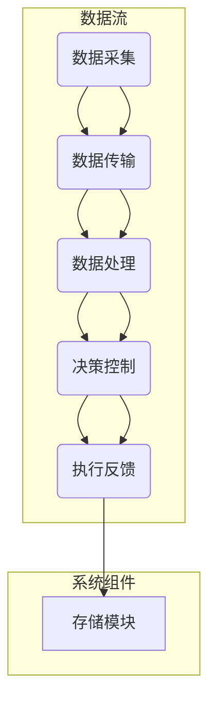
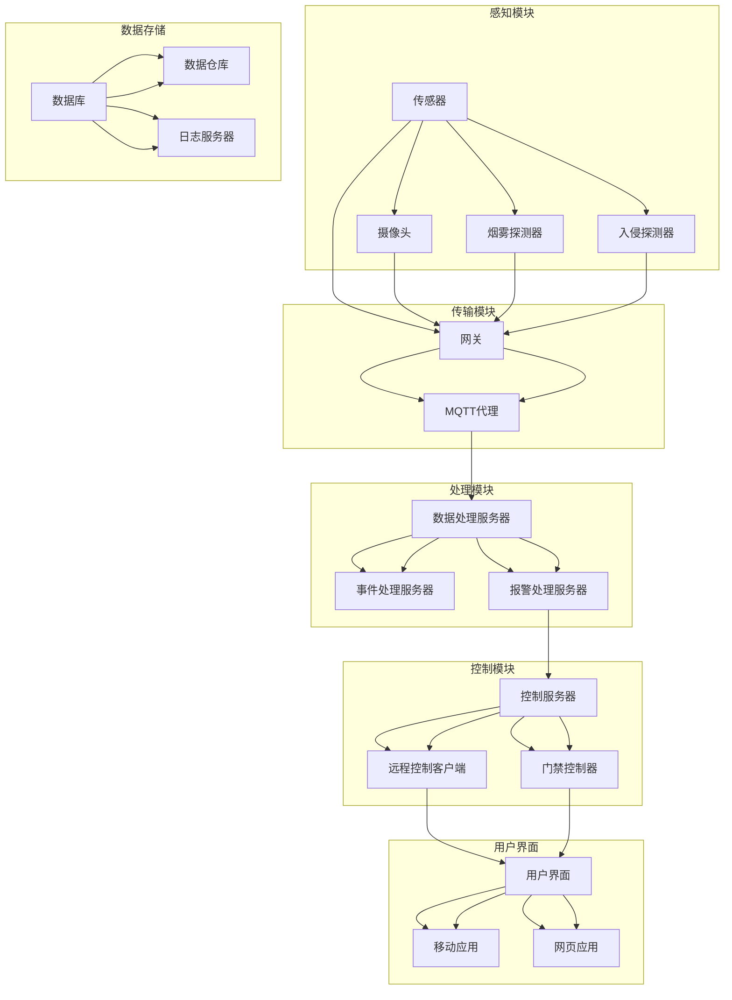

                 

# 基于MQTT协议和RESTful API的智能家居安防系统集成设计

> **关键词：** MQTT协议，RESTful API，智能家居，安防系统，集成设计

> **摘要：** 本文深入探讨了基于MQTT协议和RESTful API的智能家居安防系统集成设计。首先，介绍了MQTT协议和RESTful API的基本概念、原理及其在智能家居安防系统中的应用。随后，详细分析了智能家居安防系统的整体架构，探讨了如何利用MQTT协议和RESTful API实现智能家居安防系统的集成与优化。最后，展望了智能家居安防系统的未来发展趋势，为读者提供了实用的技术资源。

### 第一部分：智能家居安防系统基础

#### 第1章：MQTT协议与RESTful API基础

##### 1.1 MQTT协议概述

MQTT（Message Queuing Telemetry Transport）是一种轻量级的消息传输协议，最初由IBM开发，用于在远程传感器和控制设备之间传输数据。MQTT协议的设计目标是低带宽、不可靠网络环境下的高效通信。

**历史背景：** 
MQTT协议起源于1999年，随着物联网（IoT）技术的发展，MQTT逐渐成为物联网通信领域的重要协议之一。

**核心特点：** 
- **轻量级：** MQTT协议数据格式简单，数据包小，适用于资源受限的设备。
- **发布/订阅模式：** MQTT协议采用发布/订阅模式，设备可以订阅特定的主题，当有新消息发布到该主题时，订阅者会收到通知。
- **质量等级：** MQTT支持三种质量等级（0、1、2），分别对应于发送一次、至少发送一次、只发送一次的消息确认。

**架构和通信流程：**
- **架构：** MQTT协议由客户端（Client）、代理（Broker）和服务器（Server）组成。客户端发送消息到代理，代理再将消息转发给订阅者。
- **通信流程：** 客户端通过连接代理进行通信。客户端可以发布消息到特定主题，也可以订阅主题来接收消息。

##### 1.2 MQTT协议的核心概念

**MQTT消息格式：**
MQTT消息主要由固定头部和可变头部组成。固定头部包括消息类型、消息质量等级、保留消息标志、消息队列等。可变头部包括主题名称、消息ID、消息保留时间等。

**主题订阅与发布：**
MQTT协议通过主题（Topic）进行消息的发布和订阅。主题是一种层次化的命名方式，用于标识消息的类型。客户端可以通过订阅主题来接收消息。

**质量等级：**
MQTT协议支持三种质量等级：
- **质量等级0（至多一次）：** 消息发送至服务器，服务器将消息发送给订阅者，但不保证消息一定被订阅者接收到。
- **质量等级1（至少一次）：** 消息发送至服务器，服务器确保消息至少发送给订阅者一次，但可能多次发送。
- **质量等级2（仅一次）：** 消息发送至服务器，服务器确保消息仅发送给订阅者一次。

##### 1.3 MQTT协议的优势与应用场景

**优势：**
- **低功耗：** MQTT协议的数据包小，适用于资源受限的设备。
- **高可扩展性：** MQTT协议采用发布/订阅模式，可以轻松扩展至大量设备。
- **高效的数据传输：** MQTT协议支持消息确认，确保数据传输的可靠性。

**应用场景：**
- **智能家居：** MQTT协议适用于家庭安防、智能家电等场景，可以实现设备间的数据通信和控制。
- **工业互联网：** MQTT协议适用于工业设备监控、自动化控制等场景。
- **智能交通：** MQTT协议适用于交通流量监控、智能信号灯控制等场景。

**与其他物联网通信协议的比较：**
- **HTTP协议：** MQTT协议相比HTTP协议，在数据传输效率和设备数量上有明显优势，但HTTP协议在可靠性方面更优秀。
- **CoAP协议：** MQTT协议和CoAP协议均适用于物联网通信，但MQTT协议在可扩展性和消息确认方面具有优势。

##### 1.4 MQTT协议的常见问题与解决方案

**数据安全性：**
- **加密传输：** 使用TLS/SSL加密传输，确保数据传输过程中的安全性。
- **认证机制：** 实施客户端认证，确保只有授权设备可以连接到MQTT代理。

**性能优化：**
- **负载均衡：** 通过增加代理服务器，实现负载均衡，提高系统性能。
- **缓存机制：** 引入缓存机制，减少重复数据的传输。

**在低功耗设备中的应用：**
- **优化数据包大小：** 减少数据包大小，降低功耗。
- **睡眠模式：** 设备在空闲时进入睡眠模式，减少能耗。

#### 第2章：RESTful API设计与实现

##### 2.1 RESTful API基本概念

**REST架构风格：**
REST（Representational State Transfer）是一种设计网络应用架构的风格，强调通过统一接口来简化网络复杂度。

**RESTful API的设计原则：**
- **统一接口：** 所有API使用统一的接口，如URL、HTTP方法等。
- **无状态：** API不存储会话信息，每次请求都是独立的。
- **资源导向：** 所有操作都是对资源的操作，如创建、读取、更新和删除。
- **状态码：** API使用HTTP状态码来表示操作结果。

**RESTful API的核心组件：**
- **URL：** 用于标识资源的地址。
- **HTTP方法：** 用于描述对资源的操作，如GET、POST、PUT、DELETE等。
- **请求与响应：** API的请求和响应遵循HTTP协议的消息格式。

##### 2.2 HTTP协议基础

**HTTP请求方法：**
- **GET：** 获取资源。
- **POST：** 提交数据。
- **PUT：** 更新资源。
- **DELETE：** 删除资源。

**HTTP状态码：**
- **200 OK：** 操作成功。
- **201 Created：** 资源已创建。
- **400 Bad Request：** 请求无效。
- **401 Unauthorized：** 未授权。
- **403 Forbidden：** 禁止访问。
- **404 Not Found：** 资源未找到。
- **500 Internal Server Error：** 服务器内部错误。

**HTTP消息格式：**
HTTP消息主要由请求行、请求头、请求体、响应行、响应头和响应体组成。

##### 2.3 RESTful API设计方法

**资源表示与操作：**
RESTful API通过URL来表示资源，使用HTTP方法来描述对资源的操作。

**URL设计原则：**
- **简洁性：** URL应简洁明了，易于理解。
- **层次性：** URL应具有层次结构，便于扩展。
- **可预测性：** URL应具有可预测性，便于生成。

**HTTP请求与响应设计：**
RESTful API的HTTP请求和响应应遵循HTTP协议的消息格式，包括请求行、请求头、请求体、响应行、响应头和响应体。

##### 2.4 RESTful API实现案例

**用户注册与登录API：**
- **注册：** URL为`/api/users/register`，请求方法为POST，请求体包含用户名、密码等字段，响应体包含注册结果和token。
- **登录：** URL为`/api/users/login`，请求方法为POST，请求体包含用户名、密码等字段，响应体包含登录结果和token。

**数据查询与更新API：**
- **查询：** URL为`/api/items/{id}`，请求方法为GET，响应体包含查询结果。
- **更新：** URL为`/api/items/{id}`，请求方法为PUT，请求体包含更新字段，响应体包含更新结果。

**文件上传与下载API：**
- **上传：** URL为`/api/files/upload`，请求方法为POST，请求体包含文件内容，响应体包含上传结果。
- **下载：** URL为`/api/files/download/{id}`，请求方法为GET，响应体包含文件内容。

#### 第3章：智能家居安防系统架构

##### 3.1 智能家居安防系统概述

**定义：** 智能家居安防系统是一种利用物联网技术实现家庭安全防范的系统，包括感知模块、传输模块、处理模块和控制模块。

**目标：** 
- 提高家庭安全。
- 实现远程监控和控制。
- 降低人工成本。

**架构：** 
智能家居安防系统由感知模块、传输模块、处理模块和控制模块组成，各模块之间通过MQTT协议和RESTful API进行通信。

##### 3.2 智能家居安防系统的核心模块

**感知模块：** 
感知模块负责收集环境数据，如温度、湿度、烟雾、入侵等。感知模块通常由传感器和摄像头等硬件设备组成。

**传输模块：** 
传输模块负责将感知模块收集到的数据传输到处理模块。传输模块可以使用MQTT协议进行数据传输。

**处理模块：** 
处理模块负责对传输模块传输来的数据进行处理，如数据清洗、去重、分析等。处理模块通常由服务器和数据库组成。

**控制模块：** 
控制模块负责根据处理模块的结果进行控制操作，如报警、自动灭火、远程监控等。控制模块可以使用RESTful API进行控制。

**用户界面：** 
用户界面负责将处理模块和控制模块的结果展示给用户，用户可以通过用户界面进行操作。

**存储模块：** 
存储模块负责存储感知模块、处理模块和控制模块的数据，如用户数据、设备数据、事件数据等。存储模块通常由数据库和文件系统组成。

##### 3.3 智能家居安防系统的关键技术

**数据采集与处理技术：**
- 数据采集技术：传感器技术、摄像头技术等。
- 数据处理技术：数据清洗、去重、分析等。

**网络通信技术：**
- MQTT协议：用于数据传输。
- RESTful API：用于控制操作。

**安全防护技术：**
- 数据加密：使用SSL/TLS加密数据传输。
- 认证机制：使用用户认证、设备认证等机制。
- 安全审计：记录系统操作，实现安全监控。

##### 3.4 智能家居安防系统的应用场景

**家庭安防：**
- 入侵报警：感知模块检测到入侵事件后，通过传输模块将事件通知给用户。
- 火灾报警：感知模块检测到火灾信号后，通过传输模块将事件通知给用户。

**商业安防：**
- 店面安防：感知模块检测到异常情况后，通过传输模块将事件通知给保安人员。
- 货物监控：感知模块检测到货物异常后，通过传输模块将事件通知给物流公司。

**工业安防：**
- 设备监控：感知模块检测到设备异常后，通过传输模块将事件通知给操作人员。
- 工厂安防：感知模块检测到工厂异常后，通过传输模块将事件通知给管理人员。

#### 第4章：MQTT协议在智能家居安防系统中的应用

##### 4.1 MQTT协议在智能家居安防系统中的应用场景

**家庭安防报警系统：**
- **入侵报警：** 感知模块（如摄像头、入侵探测器）检测到入侵事件后，通过MQTT协议将事件发送到服务器，服务器将事件通知给用户。
- **火灾报警：** 感知模块（如烟雾传感器、温度传感器）检测到火灾信号后，通过MQTT协议将事件发送到服务器，服务器将事件通知给用户。

**楼宇对讲系统：**
- **呼叫与通话：** 用户通过智能设备（如手机、智能音箱）呼叫楼宇对讲系统，通过MQTT协议将呼叫请求发送到服务器，服务器将呼叫请求转发给相应住户，住户通过智能设备进行通话。
- **远程开门：** 用户通过智能设备（如手机、智能音箱）发送开门请求，通过MQTT协议将请求发送到服务器，服务器将请求转发给门禁系统，实现远程开门。

**智能门锁系统：**
- **门锁状态监控：** 门锁通过MQTT协议将状态信息发送到服务器，用户可以通过智能设备查看门锁状态。
- **远程控制：** 用户通过智能设备（如手机、智能音箱）发送开锁请求，通过MQTT协议将请求发送到服务器，服务器将请求转发给门锁，实现远程控制。

##### 4.2 MQTT协议在智能家居安防系统中的实现方法

**设备与服务器之间的连接：**
- 设备通过Wi-Fi、蓝牙等无线通信技术连接到互联网。
- 设备通过MQTT协议连接到服务器，服务器作为MQTT代理。

**设备之间的数据通信：**
- 设备之间通过MQTT协议进行数据通信，实现设备间的联动和协同工作。

**设备的状态监控与报警：**
- 设备将感知到的数据通过MQTT协议发送到服务器。
- 服务器对数据进行分析和处理，当检测到异常情况时，通过MQTT协议将报警信息发送给用户。

##### 4.3 MQTT协议在智能家居安防系统中的优势

**低功耗：**
- MQTT协议数据包小，传输效率高，适用于低功耗设备。

**良好的扩展性：**
- MQTT协议支持发布/订阅模式，可以轻松扩展至大量设备。

**高效的数据传输：**
- MQTT协议支持消息确认，确保数据传输的可靠性。

#### 第5章：RESTful API在智能家居安防系统中的应用

##### 5.1 RESTful API在智能家居安防系统中的应用场景

**用户管理：**
- **注册与登录：** 用户通过RESTful API进行注册和登录，服务器返回用户信息。
- **权限管理：** 用户通过RESTful API获取权限信息，实现不同角色的权限控制。

**设备管理：**
- **设备添加与删除：** 用户通过RESTful API添加或删除设备，服务器更新设备信息。
- **设备配置：** 用户通过RESTful API配置设备参数，如阈值、报警方式等。

**数据查询与统计：**
- **历史数据查询：** 用户通过RESTful API查询历史数据，如入侵事件、火灾事件等。
- **实时数据统计：** 用户通过RESTful API获取实时数据统计，如入侵次数、火灾次数等。

##### 5.2 RESTful API在智能家居安防系统中的实现方法

**API接口设计：**
- **URL设计：** 使用简洁明了的URL，如`/api/users/register`、`/api/items/{id}`等。
- **HTTP方法：** 使用合适的HTTP方法，如GET、POST、PUT、DELETE等。

**API接口的实现与测试：**
- **实现：** 使用编程语言（如Python、Java等）实现API接口，处理HTTP请求和响应。
- **测试：** 使用工具（如Postman、JMeter等）对API接口进行测试，确保接口的正确性和性能。

**API接口的安全防护：**
- **认证与授权：** 使用OAuth2.0等认证机制，确保接口的安全性。
- **数据加密：** 使用HTTPS等加密传输，确保数据传输的安全性。

##### 5.3 RESTful API在智能家居安防系统中的优势

**易于集成：**
- RESTful API遵循统一接口设计原则，可以方便地与其他系统进行集成。

**高效的数据交互：**
- RESTful API支持HTTP请求和响应，可以高效地进行数据传输和交互。

**灵活的扩展性：**
- RESTful API可以通过添加新的URL和HTTP方法，实现系统的灵活扩展。

### 第二部分：智能家居安防系统集成与优化

#### 第6章：智能家居安防系统的集成与测试

##### 6.1 智能家居安防系统的集成方法

**设备与平台的集成：**
- 设备通过MQTT协议连接到平台，平台作为MQTT代理，设备通过平台进行数据传输和交互。
- 设备通过RESTful API与平台进行交互，实现设备管理、数据查询等功能。

**系统与外部服务的集成：**
- 系统通过MQTT协议与外部服务（如天气服务、地图服务等）进行集成，实现数据的实时更新和联动。
- 系统通过RESTful API与外部服务进行集成，实现数据的同步和交互。

**系统的模块化集成：**
- 系统将感知模块、传输模块、处理模块和控制模块等进行模块化设计，方便系统的集成和维护。

##### 6.2 智能家居安防系统的测试方法

**单元测试：**
- 对每个模块进行单元测试，确保模块的正确性和性能。
- 使用测试工具（如JUnit、PyTest等）编写测试用例，对模块进行测试。

**集成测试：**
- 对系统的整体功能进行集成测试，确保系统各模块之间的协作和性能。
- 使用测试工具（如Selenium、Postman等）模拟用户操作，对系统进行测试。

**性能测试：**
- 对系统的性能进行测试，评估系统的响应时间和吞吐量。
- 使用测试工具（如JMeter、LoadRunner等）对系统进行性能测试。

##### 6.3 智能家居安防系统的调试与优化

**系统故障排查：**
- 通过日志分析、网络抓包等技术，定位系统故障的原因。
- 使用调试工具（如Wireshark、GDB等）对系统进行故障排查。

**系统性能优化：**
- 对系统的性能瓶颈进行优化，如网络通信、数据库查询等。
- 使用性能优化工具（如profiling工具、数据库优化工具等）对系统进行性能优化。

**系统安全优化：**
- 对系统的安全性进行优化，如增加安全审计、数据加密等。
- 使用安全优化工具（如安全扫描工具、安全审计工具等）对系统进行安全优化。

#### 第7章：智能家居安防系统的优化策略

##### 7.1 智能家居安防系统的优化目标

**系统稳定性：**
- 提高系统的稳定性，减少故障发生，确保系统的正常运行。

**系统安全性：**
- 提高系统的安全性，防止数据泄露、设备被攻击等安全问题。

**系统性能：**
- 提高系统的性能，如响应时间、吞吐量等，满足用户需求。

##### 7.2 智能家居安防系统的优化方法

**系统架构优化：**
- 对系统架构进行优化，如增加缓存层、优化数据库查询等，提高系统的性能。

**数据处理优化：**
- 对数据处理进行优化，如使用数据压缩、去重等技术，提高数据处理效率。

**网络通信优化：**
- 对网络通信进行优化，如增加网络带宽、优化传输协议等，提高数据传输效率。

##### 7.3 智能家居安防系统的优化实践

**实际案例分析：**
- 分析实际案例，总结优化经验和教训，为系统优化提供参考。

**优化策略实施：**
- 根据分析结果，制定优化策略，实施优化措施，提高系统的性能、稳定性和安全性。

**优化效果评估：**
- 对优化效果进行评估，如评估系统的性能指标、安全性指标等，确保优化策略的有效性。

#### 第8章：智能家居安防系统的未来发展趋势

##### 8.1 智能家居安防系统的发展现状

**技术创新：**
- 智能家居安防系统采用了多种新技术，如物联网、人工智能、大数据等，提高了系统的性能和智能化程度。

**市场规模：**
- 智能家居安防系统市场规模逐年增长，预计未来将继续保持高速增长。

**应用领域：**
- 智能家居安防系统广泛应用于家庭、商业和工业领域，满足了不同场景的安全需求。

##### 8.2 智能家居安防系统的未来发展趋势

**技术创新：**
- 未来智能家居安防系统将采用更多新技术，如5G、边缘计算、区块链等，提高系统的性能和安全性。

**应用拓展：**
- 智能家居安防系统将拓展至更多应用领域，如智慧城市、智能交通等。

**系统集成与优化：**
- 智能家居安防系统将实现更高程度的集成和优化，提高系统的稳定性和安全性。

##### 8.3 智能家居安防系统的挑战与机遇

**技术挑战：**
- 智能家居安防系统面临数据隐私、设备安全等挑战，需要持续创新和改进。

**市场机遇：**
- 随着智能家居市场的快速发展，智能家居安防系统具有巨大的市场机遇。

**社会责任：**
- 智能家居安防系统需要承担社会责任，确保用户隐私和数据安全。

### 附录

#### 附录A：MQTT协议与RESTful API技术资源

**MQTT协议相关资源：**
- MQTT官方文档：[MQTT.org](https://mqtt.org/)
- MQTT开源项目：[Eclipse MQTT](https://www.eclipse.org/paho/)
- MQTT技术论坛：[MQTT Forum](https://mqtt.org/forum/)

**RESTful API相关资源：**
- RESTful API设计指南：[RESTful API Design](https://restfulapi.net/)
- RESTful API开源框架：[Spring Boot](https://spring.io/projects/spring-boot/)
- RESTful API技术社区：[RESTful API Learning Framework](https://restfulapi.github.io/)

**智能家居安防系统相关资源：**
- 智能家居安防系统标准：[IEEE P2301](https://ieeexplore.ieee.org/document/8073952)
- 智能家居安防系统案例：[智能家居安防系统案例集](https://www.hackster.io/collections/home-security-systems)
- 智能家居安防系统技术论坛：[物联网技术社区](https://www.iot-forum.org/)

附录：智能家居安防系统架构的Mermaid流程图

### 结束语

本文从MQTT协议和RESTful API的角度，深入探讨了智能家居安防系统的集成设计。通过详细分析智能家居安防系统的架构和关键技术，本文展示了如何利用MQTT协议和RESTful API实现智能家居安防系统的集成与优化。展望未来，智能家居安防系统将不断创新和拓展，为人们的生活带来更多便利和安全保障。希望本文能为读者提供有价值的参考和启示。

### 作者

**作者：AI天才研究院/AI Genius Institute & 禅与计算机程序设计艺术 /Zen And The Art of Computer Programming** 

### 总结与展望

本文首先介绍了MQTT协议和RESTful API的基础知识，包括它们的核心概念、原理和应用场景。随后，详细分析了智能家居安防系统的整体架构，探讨了如何利用MQTT协议和RESTful API实现智能家居安防系统的集成与优化。在文章的最后，我们对智能家居安防系统的未来发展趋势进行了展望，并提供了相关技术资源。

通过对MQTT协议和RESTful API的深入探讨，我们可以看到它们在智能家居安防系统中的应用价值。MQTT协议以其低功耗、高可扩展性和高效数据传输的特点，成为智能家居安防系统通信的首选协议。而RESTful API则以其统一接口、无状态和资源导向的特点，为智能家居安防系统的设计和实现提供了便利。

随着物联网技术的不断发展和智能家居市场的日益扩大，智能家居安防系统的集成设计和优化策略显得尤为重要。本文通过对智能家居安防系统的分析，为读者提供了实用的技术思路和优化方法。

展望未来，智能家居安防系统将面临更多技术创新和应用拓展。例如，5G和边缘计算技术的应用将进一步提高系统的性能和响应速度；人工智能和大数据技术的融合将使系统更加智能化和个性化。同时，随着市场对智能家居安防系统的需求不断增加，系统稳定性和安全性的要求也将越来越高。

面对这些挑战和机遇，智能家居安防系统的研发者和实施者需要不断学习和探索，为用户提供更安全、便捷、智能的家居生活体验。希望本文能为读者提供一定的参考和启示，共同推动智能家居安防系统的发展。

### 附录

**附录A：MQTT协议与RESTful API技术资源**

#### MQTT协议相关资源

1. **MQTT官方文档**
   - [MQTT.org](https://mqtt.org/)
   - MQTT官方文档提供了MQTT协议的详细规范和指南，是学习和了解MQTT协议的最佳资源。

2. **MQTT开源项目**
   - [Eclipse MQTT](https://www.eclipse.org/paho/)
   - Eclipse MQTT是一个开源项目，提供了MQTT客户端库、服务器和代理等工具，方便开发者进行MQTT协议的开发和测试。

3. **MQTT技术论坛**
   - [MQTT Forum](https://mqtt.org/forum/)
   - MQTT技术论坛是一个社区论坛，提供了MQTT协议相关的讨论和问题解答，开发者可以在论坛上分享经验和寻求帮助。

#### RESTful API相关资源

1. **RESTful API设计指南**
   - [RESTful API Design](https://restfulapi.net/)
   - RESTful API设计指南提供了一个全面且详细的RESTful API设计指南，涵盖了RESTful API的设计原则、URL设计、HTTP方法等。

2. **RESTful API开源框架**
   - [Spring Boot](https://spring.io/projects/spring-boot/)
   - Spring Boot是一个开源框架，提供了强大的RESTful API开发功能，简化了RESTful API的开发过程。

3. **RESTful API技术社区**
   - [RESTful API Learning Framework](https://restfulapi.github.io/)
   - RESTful API Learning Framework是一个开源项目，提供了RESTful API的学习资源和教程，适合初学者和开发者学习和掌握RESTful API设计。

#### 智能家居安防系统相关资源

1. **智能家居安防系统标准**
   - [IEEE P2301](https://ieeexplore.ieee.org/document/8073952)
   - IEEE P2301是一个智能家居安防系统的标准，规定了智能家居安防系统的设计、实现和测试规范。

2. **智能家居安防系统案例**
   - [智能家居安防系统案例集](https://www.hackster.io/collections/home-security-systems)
   - Hackster.io提供了多个智能家居安防系统的案例，展示了不同类型的智能家居安防系统的实现方法和应用场景。

3. **智能家居安防系统技术论坛**
   - [物联网技术社区](https://www.iot-forum.org/)
   - 物联网技术社区是一个专业的物联网技术论坛，提供了智能家居安防系统相关的技术讨论和资源分享，是智能家居安防系统开发者和技术爱好者交流学习的平台。

### 附录B：智能家居安防系统架构的Mermaid流程图

以下是智能家居安防系统架构的Mermaid流程图，该图展示了系统的各个组件及其之间的交互关系。

这个流程图包括了感知模块（传感器、摄像头、烟雾探测器、入侵探测器）、传输模块（网关、MQTT代理）、处理模块（数据处理服务器、事件处理服务器、报警处理服务器）、控制模块（控制服务器、远程控制客户端、门禁控制器）、用户界面（用户界面、移动应用、网页应用）以及数据存储（数据库、数据仓库、日志服务器）等关键组件。通过这些组件的协作，实现了智能家居安防系统的数据采集、传输、处理、控制和存储的全流程。

