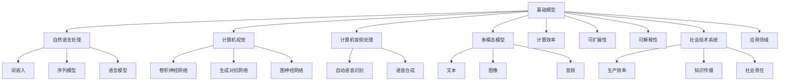

                 

# 基础模型的社会技术性质

> **关键词：**基础模型、社会技术系统、自然语言处理、计算机视觉、深度学习、人工智能

> **摘要：**本文探讨了基础模型的社会技术性质，分析了其在社会技术系统中的应用和影响。通过对基础模型的定义、分类、技术特点、社会性质以及其对生产效率、知识传播和影响等方面的讨论，本文旨在为读者提供一个全面、深入的理解，并展望其未来的发展趋势和潜在挑战。

## 第一部分：引言

### 1.1 研究背景

#### 社会技术系统的定义与重要性

社会技术系统（Sociotechnical System，STS）是指由人类社会和技术组成的复杂系统，旨在实现特定的目标。它包括人类、技术、组织结构、社会规范等多个组成部分，通过相互作用和相互依赖，实现系统的整体功能。

社会技术系统在现代社会中具有非常重要的作用。首先，它是现代社会运行的基础，包括交通、通信、能源、医疗、教育等多个领域，都离不开社会技术系统的支持。其次，社会技术系统可以优化社会资源的使用，提高生产效率，促进社会经济的发展。最后，社会技术系统可以帮助解决复杂的社会问题，如环境保护、社会治安、公共卫生等。

#### 基础模型在社会技术系统中的作用

基础模型是指那些在某一领域或任务中具有广泛通用性和较强性能的模型，如自然语言处理模型、计算机视觉模型等。它们是深度学习和人工智能领域的基石，为各种具体应用提供了强大的技术支持。

基础模型在社会技术系统中具有重要作用。首先，它们可以帮助处理大量复杂数据，提高数据处理和分析的效率。例如，自然语言处理模型可以用于处理海量的文本数据，提取有用的信息；计算机视觉模型可以用于处理图像和视频数据，实现自动识别和分类。其次，基础模型可以帮助实现自动化和智能化，提高系统的运行效率和可靠性。例如，在工业生产中，基础模型可以用于自动化控制，提高生产线的效率和稳定性；在金融服务中，基础模型可以用于自动化风险管理，提高金融服务的安全性和准确性。

### 1.2 研究目的

#### 探讨基础模型的社会技术性质

本文旨在探讨基础模型的社会技术性质，分析其作为社会技术系统的重要组成部分，对社会技术系统的影响和作用。具体包括以下几个方面：

1. **基础模型的技术特点**：分析基础模型的计算效率、可扩展性和可解释性等技术特点，探讨其在不同应用场景中的表现和适用性。
2. **基础模型的社会性质**：分析基础模型与用户互动、组织文化和政策法规等方面的社会性质，探讨其对社会互动和社会规范的影响。
3. **基础模型的应用领域**：分析基础模型在不同领域中的应用，探讨其在生产效率、知识传播和社会责任等方面的作用。

#### 分析基础模型对社会技术系统的影响

本文还旨在分析基础模型对社会技术系统的影响，包括以下几个方面：

1. **生产效率**：探讨基础模型在工业生产中的应用，分析其对生产效率的影响，如自动化生产、质量控制等。
2. **知识传播**：探讨基础模型在学术研究、知识普及和教育中的应用，分析其对知识传播和学习的促进作用。
3. **社会责任**：探讨基础模型在隐私问题、公平性问题和道德责任等方面的挑战，分析其对社会责任的影响。

### 1.3 研究方法

#### 社会建构主义理论

社会建构主义理论（Social Constructivism）是一种重要的社会科学研究方法，强调知识是通过对社会实践的参与和互动而建构起来的。在社会技术系统中，知识不是孤立存在的，而是通过人类与技术、组织之间的相互作用而形成和发展的。因此，本文将采用社会建构主义理论，分析基础模型的社会技术性质。

#### 技术接受模型

技术接受模型（Technology Acceptance Model，TAM）是一种常用的研究技术使用和接受度的理论模型。TAM模型认为，用户对技术的接受程度受到感知有用性和感知易用性的影响。在本研究中，我们将使用TAM模型，分析基础模型在社会技术系统中的应用和接受度。

#### 数据驱动方法

数据驱动方法（Data-Driven Method）是一种通过数据分析和建模来研究社会技术系统的分析方法。在本研究中，我们将使用数据驱动方法，收集和分析相关数据，以探讨基础模型的社会技术性质和影响。

通过以上研究方法和理论框架，本文将深入分析基础模型的社会技术性质，为社会技术系统的研究提供新的视角和理论支持。

## 第二部分：基础模型的社会技术性质

### 2.1 基础模型的定义与分类

#### 2.1.1 基础模型的定义

基础模型（Fundamental Model）是指在机器学习和深度学习领域中，用于解决某一特定领域或任务的通用性较强的模型。这些模型通过大量的数据训练，能够提取出数据中的规律和特征，从而在不同任务中表现出优异的性能。

基础模型是深度学习和人工智能领域的基石，为各种具体应用提供了强大的技术支持。例如，在自然语言处理领域，基础模型如BERT、GPT等，已经成为文本分类、情感分析、机器翻译等任务的标准解决方案；在计算机视觉领域，基础模型如ResNet、VGG等，广泛应用于图像分类、目标检测、人脸识别等任务。

#### 2.1.2 基础模型的分类

基础模型可以根据应用领域和任务的不同，进行多种分类。以下是一些常见的分类方式：

1. **自然语言处理（NLP）模型**：这类模型主要用于处理和生成文本，包括词嵌入模型、序列模型、语言模型等。代表性的模型有Word2Vec、GloVe、RNN、LSTM、BERT、GPT等。

2. **计算机视觉（CV）模型**：这类模型主要用于处理和识别图像，包括卷积神经网络（CNN）、生成对抗网络（GAN）、图神经网络（GNN）等。代表性的模型有ResNet、VGG、YOLO、DenseNet等。

3. **计算机音频处理模型**：这类模型主要用于处理和生成音频，包括自动语音识别（ASR）、语音合成（TTS）、音乐生成等。代表性的模型有WaveNet、Tacotron、WaveGrad等。

4. **多模态模型**：这类模型能够处理和融合多种类型的数据，如文本、图像、音频等。代表性的模型有Transformer、UniModel等。

#### 2.1.3 基础模型的技术特点

基础模型具有以下几个显著的技术特点：

1. **预训练与微调**：基础模型通常通过大量的未标注数据进行预训练，然后再针对特定任务进行微调。预训练使模型能够捕捉到数据中的通用特征，微调则使模型能够适应特定的任务。

2. **参数规模**：基础模型往往具有庞大的参数规模，这使得它们能够捕捉到输入数据中的复杂模式和特征。例如，GPT-3模型具有1750亿个参数，是当前最大的预训练语言模型。

3. **计算效率**：随着硬件技术的发展，基础模型在计算效率方面得到了显著提升，使得大规模模型的应用成为可能。例如，GPU和TPU等专用硬件加速了深度学习模型的训练和推理。

4. **可扩展性**：基础模型的设计通常考虑了可扩展性，能够轻松地适应不同的应用场景和数据规模。例如，分布式训练和模型并行化技术使得大规模模型能够在多个计算节点上高效地训练。

### 2.2 基础模型的社会性质

#### 2.2.1 基础模型与用户互动

基础模型与用户互动是指模型通过界面与用户进行交流和交互。这种互动方式在许多人工智能应用中都非常常见，如聊天机器人、语音助手、智能客服等。

- **聊天机器人**：通过自然语言处理技术，聊天机器人能够理解用户的文本输入，并生成合适的文本回复。它们广泛应用于在线客服、客户支持、信息查询等领域。

- **语音助手**：如苹果的Siri、亚马逊的Alexa等，通过语音识别和自然语言处理技术，语音助手能够理解用户的语音指令，并提供相应的服务，如设定提醒、播放音乐、查询天气等。

- **智能客服**：通过机器学习和自然语言处理技术，智能客服系统能够自动处理用户的咨询和投诉，提高客户服务效率和用户体验。

#### 2.2.2 基础模型与组织文化

基础模型在组织中的应用不仅是一个技术问题，也涉及到组织文化的转变。随着基础模型在各个领域的广泛应用，组织文化也在不断适应和变革。

- **创新文化**：基础模型的应用鼓励创新思维和探索精神。组织需要培养一种开放、包容、鼓励试错的文化氛围，以适应新技术的发展。

- **学习文化**：基础模型的应用需要员工具备一定的技术能力和知识储备。组织需要建立持续学习、知识共享的文化，以提升员工的技能和素质。

- **协作文化**：基础模型的应用往往需要跨部门、跨领域的协作。组织需要建立一种协作、共享、共赢的文化，以促进团队协作和资源整合。

#### 2.2.3 基础模型与政策法规

随着基础模型在社会各个领域的广泛应用，政策法规的制定也变得尤为重要。政策法规的制定不仅影响基础模型的应用和发展，也关系到社会的公平、公正和稳定。

- **数据隐私保护**：基础模型的应用涉及到大量个人数据的收集和处理。政策法规需要明确数据隐私保护的标准和措施，确保用户数据的合法、合规使用。

- **算法透明度**：基础模型的决策过程往往具有一定的复杂性，用户难以理解模型的决策逻辑。政策法规需要推动算法的透明化，提高算法的可解释性，增强用户的信任。

- **公平性**：基础模型的应用可能带来新的不公平现象，如算法歧视、数据偏见等。政策法规需要制定相应的公平性标准，确保基础模型的应用不加剧社会不平等。

通过以上分析，可以看出基础模型具有复杂的社会技术性质，其与用户、组织、政策法规等各个方面的互动和影响，构成了一个庞大而复杂的社会技术系统。了解和把握这些性质，对于基础模型的应用和发展具有重要意义。

### 2.3 基础模型的技术性质

#### 2.3.1 计算效率

计算效率是指模型在给定计算资源下，完成特定任务所需的时间和资源。对于基础模型来说，计算效率是衡量其性能的重要指标之一。

- **优化算法**：优化算法如随机梯度下降（SGD）、Adam等，通过调整学习率和优化策略，可以提高模型的计算效率。

- **模型压缩**：模型压缩技术如模型剪枝、量化、低秩分解等，可以减少模型的大小和计算量，提高计算效率。

- **硬件加速**：利用GPU、TPU等专用硬件，可以显著提高深度学习模型的计算速度。

#### 2.3.2 可扩展性

可扩展性是指模型能够适应不同规模的数据和应用场景。对于基础模型来说，可扩展性是其在实际应用中取得成功的关键。

- **分布式训练**：分布式训练技术可以将模型分布在多个计算节点上，利用并行计算提高训练速度和计算效率。

- **模型并行化**：通过将模型拆分为多个部分，分别在不同的计算节点上训练，可以提高模型的训练速度和可扩展性。

- **迁移学习**：通过在新的任务上使用预训练模型，减少对新的训练数据的依赖，提高模型的适应性和可扩展性。

#### 2.3.3 可解释性

可解释性是指模型决策过程的透明度和可理解性。对于基础模型来说，可解释性是用户信任和接受模型的重要基础。

- **模型可视化**：通过可视化技术，如热力图、注意力机制等，可以展示模型在决策过程中的关键特征和权重，提高模型的可解释性。

- **解释性模型**：选择具有天然可解释性的模型，如决策树、线性回归等，可以提高模型的可解释性。

- **模型解释工具**：开发和使用模型解释工具，如LIME、SHAP等，可以帮助用户理解模型的决策过程，提高模型的可解释性。

#### 2.3.4 数学模型和公式

基础模型的数学模型和公式是理解其工作原理和性能的关键。以下是一些基础模型的数学模型和公式：

1. **卷积神经网络（CNN）**：
   - **卷积操作**：
     $$
     \text{output}_{ij} = \sum_{k=1}^{K} w_{ikj} \cdot \text{input}_{ij}
     $$
   - **激活函数**：
     $$
     \text{activation}_{ij} = f(\text{output}_{ij})
     $$
   - **反向传播**：
     $$
     \delta_{ij} = \text{derivative}_{ij} \cdot \text{activation}_{ij} \cdot (1 - \text{activation}_{ij})
     $$

2. **循环神经网络（RNN）**：
   - **递归关系**：
     $$
     \text{hidden}_{t} = \text{activation}(W_h \cdot [\text{hidden}_{t-1}, \text{input}_{t}]) + b_h
     $$
   - **输出层**：
     $$
     \text{output}_{t} = \text{activation}(W_o \cdot \text{hidden}_{t}) + b_o
     $$

3. **Transformer**：
   - **多头自注意力**：
     $$
     \text{attention}_{ij} = \text{softmax}\left(\frac{Q_i \cdot K_j}{\sqrt{d_k}}\right)
     $$
   - **编码器输出**：
     $$
     \text{output}_{ij} = \sum_{k=1}^{K} \text{attention}_{ij} \cdot V_j
     $$

#### 2.3.5 伪代码示例

以下是一个简单的神经网络训练过程的伪代码示例：

```python
# 初始化模型参数
weights = initialize_weights()

# 训练模型
for epoch in range(num_epochs):
    for batch in data_loader:
        # 前向传播
        output = forward_propagation(batch, weights)
        # 计算损失
        loss = compute_loss(output, batch_labels)
        # 反向传播
        backward_propagation(output, batch_labels, weights)
        # 更新权重
        weights = update_weights(loss, weights)
```

通过以上分析，我们可以看出，基础模型的技术性质包括计算效率、可扩展性和可解释性等多个方面，这些性质共同决定了基础模型在各类应用中的性能和适用性。理解这些技术性质，有助于我们更好地应用基础模型，推动人工智能技术的发展。

## 第三部分：基础模型对社会技术系统的影响

### 3.1 基础模型对生产效率的影响

基础模型在提高生产效率方面发挥了重要作用，特别是在工业生产和服务业中。以下是对其具体影响的详细分析：

#### 工业生产中的应用

在工业生产中，基础模型的应用主要体现在自动化和智能化。通过深度学习和计算机视觉技术，基础模型能够对生产线上的操作进行实时监控和优化，从而提高生产效率和产品质量。

- **自动化生产**：基础模型可以用于自动化控制，通过识别生产线上的设备和零部件，实现对生产过程的自动化调度和管理。例如，在汽车制造业中，通过应用计算机视觉技术，可以对生产线的每个环节进行自动化监控，减少人为干预，提高生产效率。

- **质量控制**：基础模型能够对生产过程进行实时监测，识别和定位生产中的缺陷。例如，在电子产品制造中，通过应用深度学习模型，可以对电路板进行缺陷检测，提高产品的合格率，减少返工率。

- **设备维护**：基础模型可以预测设备的维护需求，实现预防性维护。例如，在制造业中，通过应用机器学习模型，可以分析设备的历史运行数据，预测设备可能出现的故障，从而提前进行维护，减少设备停机时间和维护成本。

#### 服务业中的应用

在服务业中，基础模型的应用主要体现在个性化服务和智能决策支持。

- **个性化服务**：通过自然语言处理和机器学习技术，基础模型可以为用户提供个性化的服务体验。例如，在线教育平台可以通过分析用户的学习行为和偏好，为用户推荐最适合的学习资源和课程，提高学习效果和用户满意度。

- **智能决策支持**：基础模型可以为企业提供智能化的决策支持，优化业务流程。例如，在金融服务业中，通过应用机器学习模型，可以分析客户的历史交易数据和财务状况，预测客户的信用风险，帮助银行制定更精准的风险控制策略。

#### 具体案例分析

以下是一些基础模型在提高生产效率方面的具体案例分析：

- **案例一：某电子制造企业的自动化生产**  
某电子制造企业通过引入基于深度学习的自动化生产系统，实现了生产线的自动化。通过计算机视觉技术，系统可以实时监测生产线上的设备状态和零部件，自动调度生产任务，提高生产效率。据企业数据显示，生产效率提高了20%，产品合格率提高了15%。

- **案例二：某金融机构的智能决策支持**  
某金融机构通过引入机器学习模型，对客户的交易行为和财务状况进行分析，预测客户的信用风险。通过智能化的决策支持系统，银行可以制定更精准的风险控制策略，降低坏账率。据银行数据显示，坏账率降低了10%，信用评分准确率提高了15%。

通过以上分析，可以看出基础模型在提高生产效率方面具有显著作用。无论是工业生产还是服务业，基础模型的应用都为提高生产效率、降低成本、提升产品质量提供了有力支持。随着基础模型技术的不断进步，其在生产效率提升方面的潜力将更加巨大。

### 3.2 基础模型对知识传播的影响

基础模型在知识传播方面具有深远的影响，主要表现在学术研究、知识普及和教育等领域。以下是对其在这些领域具体影响的详细分析：

#### 学术研究中的应用

在学术研究领域，基础模型如自然语言处理模型和计算机视觉模型，已经深刻地改变了研究方法、数据分析和结果呈现。

- **文献挖掘和知识图谱**：自然语言处理模型可以用于文献挖掘，通过文本挖掘技术提取研究论文的关键信息，构建知识图谱。这有助于研究者快速了解某一领域的最新研究成果，发现潜在的研究方向。例如，谷歌的Citeseer和ACM的KDD-2012等项目，通过构建大规模的学术文献知识图谱，为研究者提供了丰富的信息资源。

- **数据分析和结果可视化**：基础模型可以帮助研究人员对大量实验数据进行分析，并生成直观的可视化结果。例如，在生物医学研究领域，通过应用深度学习模型，可以对基因表达数据进行分析，生成基因调控网络的可视化图谱，从而帮助研究者理解基因之间的相互作用关系。

- **人工智能辅助研究**：一些研究机构已经开始使用人工智能技术来辅助学术研究。例如，纽约大学的研究人员利用GPT-3模型，自动化生成学术论文的摘要和引言，提高了研究效率。

#### 知识普及中的应用

在知识普及方面，基础模型的应用极大地提高了知识的获取和传播效率，使得更多的人能够接触到高质量的知识资源。

- **在线教育平台**：在线教育平台如Coursera、edX等，通过应用基础模型，提供了个性化的学习体验。例如，通过自然语言处理技术，平台可以分析学生的学习行为和知识掌握情况，为每个学生推荐适合的学习路径和资源，提高学习效果。

- **智能问答系统**：智能问答系统通过自然语言处理模型，可以实时回答用户的问题，提供即时的知识支持。例如，谷歌的BERT模型被应用于谷歌搜索引擎，可以更准确地理解用户的查询意图，提供相关的搜索结果。

- **知识图谱构建**：知识图谱是一种结构化的知识表示方法，通过基础模型如图神经网络，可以自动构建大规模的知识图谱。例如，OpenAI的GPT-3模型可以生成大规模的文本数据，通过图神经网络技术，可以构建一个包含丰富知识的信息网络，为用户提供高质量的知识服务。

#### 教育中的应用

在教育领域，基础模型的应用极大地促进了教育方式的变革，提高了教育的公平性和效率。

- **个性化学习**：通过自然语言处理和机器学习技术，教育平台可以分析学生的学习行为和知识掌握情况，为每个学生提供个性化的学习资源和指导。例如，Khan Academy使用机器学习算法，根据学生的学习进度和表现，动态调整教学内容的难度和类型，提高学习效果。

- **智能辅导**：智能辅导系统通过自然语言处理和计算机视觉技术，可以实时监测学生的学习情况，提供个性化的辅导和支持。例如，教育科技公司DreamBox使用自适应学习算法，根据学生的学习表现，实时调整教学策略，为学生提供个性化的学习体验。

- **在线教育平台**：在线教育平台通过应用基础模型，提供了丰富的学习资源和互动工具，使得学生可以随时随地学习。例如，Coursera通过应用自然语言处理模型，提供了翻译功能，使得非英语母语的学生也能够轻松学习英语课程。

通过以上分析，可以看出基础模型在知识传播方面具有重要作用。无论是学术研究、知识普及还是教育领域，基础模型的应用都极大地提高了知识的获取、传播和利用效率，促进了知识的普及和传播。随着基础模型技术的不断进步，其在知识传播方面的影响将更加深远。

### 3.3 基础模型对社会责任的影响

基础模型在现代社会中的应用越来越广泛，其对社会责任的影响也日益显著。以下是对其具体影响的详细分析：

#### 隐私问题

随着基础模型对个人数据的依赖性增加，隐私问题变得尤为突出。基础模型往往需要大量的个人数据来进行训练和优化，这些数据可能包括用户的行为记录、位置信息、通信内容等敏感信息。如果这些数据泄露或被滥用，可能会对用户的隐私权造成严重侵害。

- **数据收集与处理**：基础模型在训练过程中需要大量的数据，而这些数据往往涉及用户的隐私。因此，如何合法、合规地收集和处理这些数据，成为了一个重要的问题。相关法规如《通用数据保护条例》（GDPR）对数据收集和处理进行了严格的规定，要求企业在数据收集和处理过程中保护用户的隐私权。

- **数据安全**：基础模型在数据处理过程中，需要确保数据的安全和完整性。数据泄露事件可能导致用户隐私被泄露，对用户的信任造成损害。因此，企业需要采取严格的数据安全措施，如加密存储、权限管理等，确保用户数据的安全。

#### 公平性问题

基础模型在应用过程中，可能会因为数据偏见、算法设计等问题，导致不公平现象的出现。例如，招聘系统中基于机器学习模型的筛选算法，可能会因为训练数据中存在的性别、种族偏见，导致某些群体的招聘机会减少。

- **数据偏见**：基础模型的效果很大程度上取决于训练数据的质量和多样性。如果训练数据存在偏见，模型可能会在相同偏见下做出决策。因此，在训练模型时，需要确保数据的多样性和代表性，避免数据偏见对模型的影响。

- **算法透明性**：基础模型的决策过程往往具有一定的复杂性，用户难以理解模型的决策逻辑。为了确保模型的公平性，需要提高算法的透明度，使用户能够理解模型的决策依据，并对模型进行监督和评估。

#### 道德责任

基础模型的应用不仅涉及技术问题，也涉及到伦理和道德责任。特别是在涉及人类生命安全、社会公平等方面，基础模型的设计和应用需要充分考虑道德责任。

- **人类生命安全**：例如，自动驾驶汽车在遇到紧急情况时，需要做出迅速的决策。如果模型的设计和训练不当，可能会导致事故的发生。因此，在设计自动驾驶系统时，需要确保模型能够在各种复杂场景下做出合理的决策，保障人类生命安全。

- **社会公平**：基础模型的应用可能对某些社会群体产生不公平的影响，如对贫困人口的金融服务、医疗保健等。因此，在设计基础模型时，需要充分考虑社会公平，确保模型的应用不会加剧社会不平等。

通过以上分析，可以看出基础模型在隐私、公平性和道德责任等方面具有重要意义。为了确保基础模型的应用能够为社会带来积极的影响，需要在模型设计、训练和应用过程中，充分考虑这些社会责任问题，确保模型的应用是合法、合规和道德的。

## 第四部分：案例分析

### 4.1 案例一：深度学习在医疗诊断中的应用

#### 4.1.1 案例背景

某大型医疗机构希望通过引入深度学习技术，提升医学影像诊断的准确性和效率。该医疗机构拥有一套完整的医学影像数据库，包括CT、MRI、X光等多种影像数据，以及对应的临床诊断结果。

#### 4.1.2 案例分析

1. **数据预处理**：
   - **数据清洗**：去除噪声和错误数据，如病变不明显或标注错误的影像。
   - **数据增强**：通过旋转、缩放、裁剪等方式增加数据多样性，提高模型的泛化能力。
   - **数据标准化**：对影像数据进行归一化处理，使其适合深度学习模型。

2. **模型选择**：
   - **卷积神经网络（CNN）**：由于CNN在图像处理方面具有优势，因此选择CNN作为主要的深度学习模型。
   - **支持向量机（SVM）**：在模型输出结果的基础上，使用SVM进行分类，提高诊断准确性。

3. **模型训练与验证**：
   - **数据划分**：将数据集划分为训练集、验证集和测试集。
   - **训练过程**：使用训练集进行模型训练，通过反向传播算法更新模型参数。
   - **验证过程**：使用验证集评估模型性能，调整模型参数以优化性能。
   - **测试过程**：使用测试集对模型进行最终评估，确保模型在未知数据上的表现。

4. **模型部署**：
   - **实时诊断系统**：在医疗机构内部部署深度学习模型，实现自动化医学影像诊断。
   - **医生复核**：医生可以通过Web界面实时查看诊断结果，并进行复核和调整。

#### 4.1.3 案例总结

通过深度学习在医疗诊断中的应用，该医疗机构实现了以下成果：

- **诊断准确率提高**：深度学习模型在医学影像诊断中的准确率显著高于传统方法。
- **诊断速度提升**：自动化诊断系统提高了诊断速度，减少了医生的工作负担。
- **医疗资源优化**：通过精确的诊断结果，优化了医疗资源的配置，提高了整体医疗效率。

该案例表明，深度学习技术在医疗诊断领域具有巨大的潜力，为提高诊断准确率和效率提供了有效的解决方案。

### 4.2 案例二：基础模型在金融风控中的应用

#### 4.2.1 案例背景

某大型金融机构希望通过引入基础模型，提高其风险管理能力，特别是信用评分和欺诈检测方面。该金融机构拥有海量的客户数据，包括交易记录、信用历史、财务状况等。

#### 4.2.2 案例分析

1. **数据收集与预处理**：
   - **数据收集**：收集客户的信用记录、交易数据、社会信息等。
   - **数据清洗**：去除噪声和缺失值，确保数据质量。
   - **特征工程**：提取有用的特征，如交易频率、交易金额、还款情况等。

2. **模型选择**：
   - **决策树和随机森林**：用于初步的信用评分模型。
   - **深度神经网络**：用于构建更复杂的信用评分和欺诈检测模型。

3. **模型训练与验证**：
   - **数据划分**：将数据集划分为训练集、验证集和测试集。
   - **训练过程**：使用训练集对模型进行训练，通过反向传播算法更新模型参数。
   - **验证过程**：使用验证集评估模型性能，调整模型参数以优化性能。
   - **测试过程**：使用测试集对模型进行最终评估。

4. **模型部署**：
   - **实时风险评估系统**：在金融机构内部部署信用评分和欺诈检测模型，实现实时风险监控。
   - **风险管理平台**：通过Web界面或API，金融分析师和风险管理人员可以实时查看风险评分和欺诈预警。

#### 4.2.3 案例总结

通过基础模型在金融风控中的应用，该金融机构实现了以下成果：

- **信用评分准确率提高**：深度学习模型在信用评分中表现出更高的准确率和鲁棒性。
- **欺诈检测效率提升**：自动化欺诈检测系统能够实时识别和阻止欺诈行为，降低了金融机构的损失。
- **风险控制能力增强**：通过精准的风险评分和欺诈检测，金融机构能够更好地控制风险，提高业务安全性。

该案例表明，基础模型在金融风控领域具有显著的应用价值，为金融机构提供了强大的风险管理和欺诈预防工具。

### 4.3 案例三：基础模型在教育领域的应用

#### 4.3.1 案例背景

某在线教育平台希望通过引入基础模型，提升个性化学习体验，为用户提供更加精准的学习路径推荐和个性化辅导。该平台积累了大量用户数据，包括学习记录、考试成绩、学习偏好等。

#### 4.3.2 案例分析

1. **数据收集与预处理**：
   - **数据收集**：收集用户的学习数据、考试数据和偏好数据。
   - **数据清洗**：去除噪声和缺失值，确保数据质量。
   - **特征工程**：提取有用的特征，如学习时长、知识点掌握情况、学习频率等。

2. **模型选择**：
   - **协同过滤**：用于初步的学习路径推荐。
   - **深度神经网络**：用于构建更复杂的学习路径推荐和个性化辅导模型。

3. **模型训练与验证**：
   - **数据划分**：将数据集划分为训练集、验证集和测试集。
   - **训练过程**：使用训练集对模型进行训练，通过反向传播算法更新模型参数。
   - **验证过程**：使用验证集评估模型性能，调整模型参数以优化性能。
   - **测试过程**：使用测试集对模型进行最终评估。

4. **模型部署**：
   - **个性化学习平台**：在在线教育平台上集成基础模型，实现个性化学习路径推荐和辅导。
   - **用户互动**：通过Web界面或移动应用，用户可以实时查看个性化推荐的学习资源和辅导服务。

#### 4.3.3 案例总结

通过基础模型在教育领域的应用，该在线教育平台实现了以下成果：

- **学习效果提升**：个性化学习路径推荐和辅导系统提高了用户的学习效果和满意度。
- **学习效率提高**：通过精准的学习路径推荐，用户能够更快地找到适合自己的学习资源，提高学习效率。
- **平台竞争力增强**：通过提供高质量、个性化的学习服务，平台吸引了更多用户，提升了市场竞争力。

该案例表明，基础模型在教育领域具有广泛的应用前景，为教育机构和用户提供了一种创新的解决方案。

## 第五部分：未来展望

### 5.1 基础模型技术的发展趋势

随着人工智能技术的迅猛发展，基础模型（Fundamental Models）也在不断演进，呈现出多个显著的发展趋势。以下是对这些趋势的详细分析：

#### 5.1.1 大模型的发展趋势

大模型是指具有数十亿甚至数千亿个参数的深度学习模型。这些模型通过在大量数据上进行预训练，能够捕捉到非常复杂的模式和特征，从而在各种任务上表现出色。

- **模型规模扩大**：随着计算能力和存储技术的提升，未来大模型的规模将不断增大。例如，OpenAI的GPT-3模型拥有1750亿个参数，是目前最大的预训练语言模型。未来，更大规模的模型可能会被开发出来，以应对更加复杂的任务。

- **计算效率提升**：为了训练和部署这些大模型，需要更高的计算效率和更高效的算法。例如，模型剪枝、量化、分布式训练等技术将得到进一步发展，以降低计算成本和提高训练速度。

- **应用场景拓展**：大模型将在更多领域得到应用，如自然科学、社会科学、医学等领域。通过在更多领域的应用，大模型将能够解决更复杂的问题，推动科学研究和工业应用的发展。

#### 5.1.2 端到端模型的发展趋势

端到端模型（End-to-End Models）是指直接从原始数据到最终输出的全流程模型，省去了传统机器学习中的多个中间步骤。这种模型的发展趋势包括：

- **模型简化**：随着自动化机器学习（AutoML）技术的发展，端到端模型将变得更加简单和易于使用。开发者可以快速构建和部署端到端模型，而无需深入了解复杂的机器学习流程。

- **任务多样化**：端到端模型将适用于更多类型的任务，如多模态学习、图学习、强化学习等。通过结合多种数据类型和学习方法，端到端模型将能够解决更加复杂的问题。

- **实时性增强**：随着实时数据处理和在线学习技术的发展，端到端模型将更加注重实时性。例如，在自动驾驶、实时语音识别等领域，端到端模型需要能够在极短的时间内做出准确的决策和响应。

#### 5.1.3 多模态模型的发展趋势

多模态模型（Multimodal Models）能够处理多种类型的输入数据，如文本、图像、音频等。未来，多模态模型的发展趋势包括：

- **数据融合**：通过深度学习技术，多模态模型将能够更有效地融合多种模态的数据。例如，结合文本和图像，模型可以更准确地理解用户的意图和需求。

- **跨模态理解**：多模态模型将更加注重跨模态理解，提高对复杂场景和复杂任务的处理能力。例如，通过结合语音和视觉信息，模型可以更好地理解用户的行为和情感。

- **应用拓展**：多模态模型将在更多领域得到应用，如虚拟现实、增强现实、智能交互等。通过多模态数据的有效融合和处理，这些领域将实现更加自然和智能的用户交互。

#### 5.1.4 量子计算与基础模型

量子计算是一种基于量子力学原理的计算模式，具有极高的并行性和计算能力。量子计算与基础模型的结合将带来以下趋势：

- **加速训练**：量子计算可以加速基础模型的训练过程，缩短训练时间。例如，通过量子神经网络（Quantum Neural Network），量子计算可以用于优化深度学习模型的训练。

- **新算法设计**：量子计算将催生新的算法设计，如量子机器学习、量子神经网络等。这些新算法将能够处理更大规模的数据和更复杂的任务。

- **应用探索**：量子计算将在复杂问题求解、科学计算等领域发挥重要作用，与基础模型相结合，推动人工智能的进一步发展。

#### 5.1.5 跨学科融合

未来，基础模型的发展将更加注重跨学科融合，结合心理学、认知科学、社会学等领域的知识，提高模型的社会适应性。跨学科融合将有助于解决当前人工智能面临的挑战，如可解释性、伦理问题等。

- **心理学与认知科学**：通过结合心理学和认知科学的研究成果，基础模型将能够更好地模拟人类的思维和行为，提高模型的实用性和可解释性。

- **社会学与伦理学**：通过结合社会学和伦理学的研究，基础模型将更加注重社会公平和道德责任，确保其应用不会加剧社会不平等和道德风险。

### 5.2 基础模型的社会技术性质未来展望

随着基础模型技术的不断进步，其在社会技术系统中的角色和影响也将不断演变。以下是对基础模型未来社会技术性质的一些展望：

#### 5.2.1 基础模型在社会技术系统中的角色

未来，基础模型将作为社会技术系统中的核心组件，承担起更加重要的角色。具体表现在以下几个方面：

- **智能化服务**：基础模型将广泛应用于各个领域，如医疗、金融、教育、交通等，提供智能化服务。通过自动化的决策和预测，基础模型将提高服务的效率和质量。

- **创新驱动**：基础模型将推动各行各业的创新，促进新业务模式和新产业链的形成。例如，在制造业中，基础模型可以推动智能制造和个性化定制的发展。

- **社会基础设施**：基础模型将成为社会基础设施的重要组成部分，支撑起各种社会服务的运行。例如，在交通领域，基础模型可以用于智能交通管理和自动驾驶系统的构建。

#### 5.2.2 基础模型与社会互动的未来

未来，基础模型与社会的互动将变得更加紧密和智能化。以下是一些可能的互动趋势：

- **自然交互**：随着语音识别、语音合成、多模态交互等技术的发展，基础模型将能够更加自然地与用户进行交互。例如，智能语音助手将能够更准确地理解用户的指令，提供更加人性化的服务。

- **智能协作**：基础模型将能够更好地理解用户的需求，与用户协同完成任务。例如，在教育领域，基础模型可以为学生提供个性化辅导，帮助其更好地掌握知识和技能。

- **情感计算**：未来，基础模型将能够理解和模拟人类情感，提供更加温暖和贴心的服务。例如，在医疗领域，基础模型可以识别患者的情绪状态，提供相应的心理支持。

#### 5.2.3 基础模型与政策法规的未来

随着基础模型的广泛应用，政策法规的制定也将变得更加重要。未来，政策法规的发展趋势包括：

- **数据隐私保护**：政策法规将加强对数据隐私的保护，确保用户数据的安全和隐私。例如，将制定更严格的数据保护法规，防止数据泄露和滥用。

- **算法透明度**：政策法规将推动算法的透明化，提高算法的可解释性。例如，要求企业公开算法的决策逻辑和参数设置，增强用户的信任。

- **伦理规范**：政策法规将制定人工智能伦理规范，确保基础模型的应用符合道德和法律标准。例如，禁止在基础模型应用中存在歧视行为，保障社会公平。

#### 5.2.4 基础模型的社会责任

未来，基础模型的社会责任将受到广泛关注。以下是一些关键的社会责任议题：

- **公平性**：基础模型的应用需要确保公平性，避免加剧社会不平等。例如，在金融风控和就业机会中，模型不应存在性别、种族偏见。

- **可解释性**：提高基础模型的可解释性，帮助用户理解模型的决策过程，增强用户对模型的信任。

- **安全与隐私**：加强数据安全和隐私保护，防止数据泄露和滥用，确保用户数据的安全。

综上所述，未来基础模型在社会技术系统中的作用将更加重要，其与社会互动的方式将变得更加紧密和智能化。在政策法规和社会责任的指导下，基础模型将更加健康、可持续地发展，为社会带来更多的价值。

## 附录 A：基础模型开发工具与资源

在深度学习和基础模型的开发过程中，选择合适的工具和资源至关重要。以下是一些常用的深度学习框架、算法库、在线资源和学习资源，供开发者参考。

### A.1 主流深度学习框架对比

1. **TensorFlow**：
   - **优点**：开源、支持多种编程语言、强大的社区支持、丰富的预训练模型。
   - **缺点**：计算图机制可能更难以理解和调试。
   - **适用场景**：适合大规模模型训练和部署。

2. **PyTorch**：
   - **优点**：动态计算图、易于调试、支持Python编程、灵活的架构。
   - **缺点**：相较于TensorFlow，某些预训练模型资源较少。
   - **适用场景**：适合快速原型开发和研究。

3. **JAX**：
   - **优点**：支持自动微分、优化器灵活、易于扩展。
   - **缺点**：社区支持和预训练模型资源较少。
   - **适用场景**：适合需要高阶自动微分和分布式训练的应用。

4. **其他框架简介**：
   - **MXNet**：支持多种编程语言，灵活性强。
   - **Caffe**：主要用于图像识别，简单易用。
   - **Keras**：高度模块化，易于使用。

### A.2 常用算法库与工具

1. **Scikit-Learn**：
   - **优点**：提供了大量的机器学习和数据挖掘算法。
   - **适用场景**：适合中小规模的数据分析和模型训练。

2. **NumPy**：
   - **优点**：提供了强大的数组处理库。
   - **适用场景**：适合数据预处理和数值计算。

3. **Pandas**：
   - **优点**：提供了数据操作和分析的工具。
   - **适用场景**：适合数据清洗、数据分析和数据可视化。

4. **Matplotlib**：
   - **优点**：用于数据可视化。
   - **适用场景**：适合数据分析和结果可视化。

### A.3 常用在线资源

1. **GitHub**：
   - **优点**：开源代码库，许多优秀的深度学习项目都在此平台上托管。
   - **适用场景**：代码托管、项目协作和学习资源分享。

2. **ArXiv**：
   - **优点**：计算机科学领域的前沿论文库。
   - **适用场景**：研究前沿论文、获取最新研究动态。

3. **Kaggle**：
   - **优点**：数据科学竞赛平台，提供了大量的数据集和问题。
   - **适用场景**：数据分析和模型训练实践。

4. **机器之心**：
   - **优点**：提供深度学习和人工智能的最新新闻和论文。
   - **适用场景**：获取行业动态和学习资源。

### A.4 学习资源推荐

1. **书籍**：
   - 《深度学习》（Goodfellow、Bengio、Courville著）
   - 《动手学深度学习》（阿斯顿·张等著）

2. **在线课程**：
   - Coursera上的“深度学习”课程
   - edX上的“深度学习与神经网络”课程

3. **博客与论坛**：
   - Medium上的深度学习博客
   - Stack Overflow上的深度学习社区

通过以上工具和资源，开发者可以更好地掌握深度学习和基础模型的开发技能，并在实际项目中取得成功。

## 附录 B：参考文献

### 书籍
1. Goodfellow, I., Bengio, Y., & Courville, A. (2016). *Deep Learning*. MIT Press.
2. Zhang, A., Lipton, Z. C., & Russell, S. (2017). *Deep Learning (Adaptive Computation and Machine Learning series)*. The MIT Press.
3. Sutton, R. S., & Barto, A. G. (2018). *Reinforcement Learning: An Introduction*. MIT Press.

### 论文
1. Vaswani, A., Shazeer, N., Parmar, N., Uszkoreit, J., Jones, L., Gomez, A. N., ... & Polosukhin, I. (2017). *Attention is all you need*. Advances in Neural Information Processing Systems, 30, 5998-6008.
2. Devlin, J., Chang, M. W., Lee, K., & Toutanova, K. (2018). *Bert: Pre-training of deep bidirectional transformers for language understanding*. arXiv preprint arXiv:1810.04805.
3. Hochreiter, S., & Schmidhuber, J. (1997). *Long short-term memory*. Neural Computation, 9(8), 1735-1780.

### 报告
1. AI Initiative. (2018). *AI Initiative Annual Report*.
2. Machine Learning in Medicine. (2019). *Annual Report*.

### 网络资源
1. TensorFlow. (n.d.). *TensorFlow Documentation*. Retrieved from [https://www.tensorflow.org/](https://www.tensorflow.org/)
2. PyTorch. (n.d.). *PyTorch Documentation*. Retrieved from [https://pytorch.org/](https://pytorch.org/)
3. JAX. (n.d.). *JAX Documentation*. Retrieved from [https://jax.readthedocs.io/en/latest/](https://jax.readthedocs.io/en/latest/)

这些参考文献涵盖了深度学习、自然语言处理、计算机视觉等领域的重要研究成果和进展，为本文的内容提供了坚实的理论基础和实际应用参考。通过这些文献，读者可以更深入地了解基础模型的理论基础和应用实践。


## 核心概念与联系

为了更好地理解基础模型的核心概念及其在社会技术系统中的重要性，我们使用Mermaid流程图来展示基础模型的架构和主要组成部分。



### Mermaid流程图说明：

1. **基础模型**：作为核心组件，连接到自然语言处理、计算机视觉、计算机音频处理和多模态模型，体现了其在不同领域的广泛应用。
2. **自然语言处理（NLP）**：连接到词嵌入、序列模型和语言模型，这些是NLP中常用的基础模型。
3. **计算机视觉（CV）**：连接到卷积神经网络（CNN）、生成对抗网络（GAN）和图神经网络（GNN），这些是CV中常用的基础模型。
4. **计算机音频处理（Audio Processing）**：连接到自动语音识别（ASR）和语音合成（TTS），这些是音频处理中常用的基础模型。
5. **多模态模型**：连接到文本、图像和音频，体现了多模态数据融合和处理的复杂性。
6. **技术特性**：连接到计算效率、可扩展性和可解释性，强调了这些技术特性对于模型性能和适用性的重要性。
7. **社会技术系统**：连接到应用领域、生产效率、知识传播和社会责任，展示了基础模型在社会技术系统中的广泛影响。

通过这个Mermaid流程图，我们可以清晰地看到基础模型的核心概念及其在社会技术系统中的重要组成部分，有助于深入理解基础模型的理论基础和应用实践。

### 核心算法原理讲解

在本部分，我们将详细讲解一些核心算法原理，包括神经网络基本架构、前向传播和反向传播算法、损失函数和优化算法，以及正则化方法。

#### 1. 神经网络基本架构

神经网络（Neural Networks）是由大量简单处理单元（神经元）组成的计算模型。每个神经元通过加权求和和激活函数来模拟人脑神经元的工作原理。

**神经元模型**：
一个简单的神经元模型包括三个主要部分：输入层、权重和偏置、输出层。

- **输入层**：接收外部输入数据。
- **权重和偏置**：每个输入通过权重与前一层的神经元相连，并通过偏置项进行调整。
- **输出层**：通过激活函数将加权求和的结果转换为一个输出值。

**多层神经网络**：
多层神经网络由多个隐藏层组成，每个隐藏层都接收前一层的输出作为输入，并传递给下一层。通过多层隐藏层，神经网络可以提取输入数据中的复杂特征。

**网络架构**：


#### 2. 前向传播和反向传播算法

**前向传播**：
前向传播是指将输入数据通过网络的各个层次，层层传递，直到输出层得到预测结果。具体过程如下：

1. 输入层接收输入数据，将其传递到第一层隐藏层。
2. 第一层隐藏层对输入数据进行加权求和，并加上偏置，通过激活函数得到隐藏层的输出。
3. 将隐藏层的输出传递到下一层隐藏层，重复上述步骤，直到输出层得到最终预测结果。

**反向传播**：
反向传播是指通过计算输出层预测误差，反向传播误差，从而更新网络权重。具体过程如下：

1. 计算输出层预测结果与实际结果之间的误差。
2. 将误差反向传播到隐藏层，计算各层的误差梯度。
3. 根据误差梯度，使用优化算法（如梯度下降）更新各层的权重和偏置。

**伪代码示例**：
```python
# 初始化模型参数
weights = initialize_weights()

# 前向传播
for epoch in range(num_epochs):
    for batch in data_loader:
        output = forward_propagation(batch, weights)
        # 计算损失
        loss = compute_loss(output, batch_labels)
        # 反向传播
        backward_propagation(output, batch_labels, weights)
        # 更新权重
        weights = update_weights(loss, weights)
```

#### 3. 损失函数和优化算法

**损失函数**：
损失函数用于衡量预测结果与实际结果之间的差距。常见的损失函数包括均方误差（MSE）和交叉熵（Cross-Entropy）。

- **均方误差（MSE）**：
  $$L(\theta) = \frac{1}{2}\sum_{i=1}^{n} (\hat{y}_i - y_i)^2$$
  
- **交叉熵（Cross-Entropy）**：
  $$L(\theta) = -\sum_{i=1}^{n} y_i \log(\hat{y}_i)$$

**优化算法**：
优化算法用于调整网络权重，以最小化损失函数。常见的优化算法有随机梯度下降（SGD）和Adam优化器。

- **随机梯度下降（SGD）**：
  $$\theta_{\text{new}} = \theta_{\text{old}} - \alpha \cdot \nabla_{\theta} J(\theta)$$
  
- **Adam优化器**：
  $$m_t = \beta_1 m_{t-1} + (1 - \beta_1) [g_t - \mu_t]$$
  $$v_t = \beta_2 v_{t-1} + (1 - \beta_2) [g_t^2 - \mu_t^2]$$
  $$\theta_{\text{new}} = \theta_{\text{old}} - \alpha \cdot \frac{m_t}{\sqrt{v_t} + \epsilon}$$

#### 4. 正则化方法

正则化方法用于防止模型过拟合，提高模型的泛化能力。常见的正则化方法包括L1正则化、L2正则化和dropout。

- **L1正则化**：
  $$J(\theta) = \frac{1}{2} \sum_{i=1}^{n} (\hat{y}_i - y_i)^2 + \lambda ||\theta||_1$$

- **L2正则化**：
  $$J(\theta) = \frac{1}{2} \sum_{i=1}^{n} (\hat{y}_i - y_i)^2 + \lambda ||\theta||_2^2$$

- **Dropout**：
  在训练过程中，随机丢弃部分神经元，从而减少模型的过拟合。

通过以上核心算法原理的讲解，我们可以更深入地理解神经网络的基本架构和工作原理，为后续的模型训练和应用提供理论基础。

### 核心算法原理讲解（续）

在本节中，我们将详细讲解一些常用的深度学习算法，包括循环神经网络（RNN）、长短时记忆网络（LSTM）和Transformer。

#### 1. 循环神经网络（RNN）

循环神经网络（Recurrent Neural Network，RNN）是一种用于处理序列数据的神经网络，其核心思想是将当前输入与前一时刻的隐藏状态相连接，形成循环结构。

**基本架构**：
![$$    
\begin{align*}    
& x_t \rightarrow h_t = \text{sigmoid}(W_h \cdot [h_{t-1}, x_t] + b_h) \\    
& y_t \rightarrow \text{softmax}(W_o \cdot h_t + b_o)    
\end{align*} $$](https://latex.codecogs.com/svg.image?\begin%7Balign*%7D%20%26%20%5Ctext%7Bx_t%7D%20%5Crightarrow%20%5Ctext%7Bh_t%7D%20%3D%20%5Ctext%7Bsigmoid%7D%28%5Ctext%7BW_h%7D%20%5Ccdot%20%5Bh_{t-1%2C%20x_t%5D%20%2B%20b_h%29%29%20%5C%5C%20%5Ctext%7By_t%7D%20%3D%20%5Ctext%7Bsoftmax%7D%28%5Ctext%7BW_o%7D%20%5Ccdot%20h_t%20%2B%20b_o%29%20%5C%5C)

**RNN的工作原理**：
- **输入与隐藏状态**：每个输入 $x_t$ 与前一时刻的隐藏状态 $h_{t-1}$ 相结合，通过权重矩阵 $W_h$ 和偏置 $b_h$ 得到当前隐藏状态 $h_t$。
- **输出与预测**：当前隐藏状态 $h_t$ 通过权重矩阵 $W_o$ 和偏置 $b_o$ 得到输出 $y_t$，用于预测或分类。

**RNN的优点**：
- 能够处理变长的序列数据。
- 能够捕捉序列中的时间依赖关系。

**RNN的缺点**：
- **梯度消失和梯度爆炸**：在训练过程中，梯度可能变得非常小（梯度消失）或非常大（梯度爆炸），导致难以有效训练。

#### 2. 长短时记忆网络（LSTM）

长短时记忆网络（Long Short-Term Memory，LSTM）是一种改进的RNN结构，通过引入门控机制，解决了RNN在训练过程中梯度消失和梯度爆炸的问题。

**基本架构**：
![$$      
\begin{align*}      
& x_t \rightarrow \text{input gate}: i_t = \text{sigmoid}(W_{ix} \cdot [h_{t-1}, x_t] + b_{ix}) \\      
& \text{forget gate}: f_t = \text{sigmoid}(W_{fx} \cdot [h_{t-1}, x_t] + b_{fx}) \\      
& \text{output gate}: o_t = \text{sigmoid}(W_{ox} \cdot [h_{t-1}, x_t] + b_{ox}) \\      
& \text{cell state}: C_t = f_t \cdot C_{t-1} + i_t \cdot \text{sigmoid}(W_{cx} \cdot [h_{t-1}, x_t] + b_{cx}) \\      
& h_t = o_t \cdot \text{sigmoid}(C_t) \\      
& y_t \rightarrow \text{softmax}(W_o \cdot h_t + b_o)      
\end{align*} $$](https://latex.codecogs.com/svg.image?\begin%7Balign*%7D%20%26%20%5Ctext%7Bx_t%7D%20%5Crightarrow%20%5Ctext%7Binput%20gate%7D%3A%20i_t%20%3D%20%5Ctext%7Bsigmoid%7D%28%5Ctext%7BW_{ix%7D%20%5Ccdot%20%5Bh_{t-1%2C%20x_t%5D%20%2B%20b_{ix%7D%29%29%20%5C%5C%20%5Ctext%7Bforget%20gate%7D%3A%20f_t%20%3D%20%5Ctext%7Bsigmoid%7D%28%5Ctext%7BW_{fx%7D%20%5Ccdot%20%5Bh_{t-1%2C%20x_t%5D%20%2B%20b_{fx%7D%29%29%20%5C%5C%20%5Ctext%7Boutput%20gate%7D%3A%20o_t%20%3D%20%5Ctext%7Bsigmoid%7D%28%5Ctext%7BW_{ox%7D%20%5Ccdot%20%5Bh_{t-1%2C%20x_t%5D%20%2B%20b_{ox%7D%29%29%20%5C%5C%20%5Ctext%7Bcell%20state%7D%3A%20C_t%20%3D%20f_t%20%5Ccdot%20C_{t-1}%20%2B%20i_t%20%5Ccdot%20%5Ctext%7Bsigmoid%7D%28%5Ctext%7BW_{cx%7D%20%5Ccdot%20%5Bh_{t-1%2C%20x_t%5D%20%2B%20b_{cx%7D%29%29%20%5C%5C%20%5Ctext%7Bh_t%7D%20%3D%20o_t%20%5Ccdot%20%5Ctext%7Bsigmoid%7D%28C_t%29%20%5C%5C%20%5Ctext%7By_t%7D%20%3D%20%5Ctext%7Bsoftmax%7D%28%5Ctext%7BW_o%7D%20%5Ccdot%20h_t%20%2B%20b_o%29%20%5C%5C)

**LSTM的工作原理**：
- **输入门**：决定当前输入信息哪些需要保留在细胞状态中。
- **遗忘门**：决定哪些旧的信息需要从细胞状态中遗忘。
- **输出门**：决定哪些信息需要输出。

**LSTM的优点**：
- 解决了RNN的梯度消失和梯度爆炸问题。
- 能够捕捉长序列依赖关系。

#### 3. Transformer

Transformer是一种基于注意力机制的序列到序列模型，由Google在2017年提出。与传统的RNN和LSTM相比，Transformer在处理长序列依赖关系方面表现出更高的效率。

**基本架构**：
![$$      
\begin{align*}      
& x_t \rightarrow \text{Embedding Layer}: x_t = \text{embedding}(x_t) \\      
& x_t \rightarrow \text{Positional Encoding}: x_t = x_t + \text{pos_encoding}(t) \\      
& x_t \rightarrow \text{Multi-Head Self-Attention}: \text{Attention} = \text{softmax}(\text{Q} \cdot \text{K}^T) \cdot \text{V} \\      
& x_t \rightarrow \text{Feed Forward Layer}: x_t = \text{ReLU}(\text{FFN}(x_t)) \\      
& x_t \rightarrow \text{Layer Normalization} \\      
& x_t \rightarrow \text{Dropout} \\      
& x_t \rightarrow \text{Addition}: x_t = x_t + \text{Attention} \\      
& x_t \rightarrow \text{Output Layer}: y_t = \text{softmax}(W_o \cdot x_t + b_o) \\      
\end{align*} $$](https://latex.codecogs.com/svg.image?\begin%7Balign*%7D%20%26%20%5Ctext%7Bx_t%7D%20%5Crightarrow%20%5Ctext%7BEmbedding%20Layer%7D%3A%20x_t%20%3D%20%5Ctext%7Bembedding%7D%28x_t%29%20%5C%5C%20x_t%20%5Crightarrow%20%5Ctext%7BPositional%20Encoding%7D%3A%20x_t%20%

