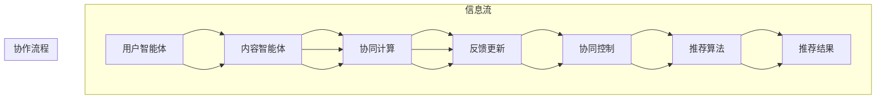
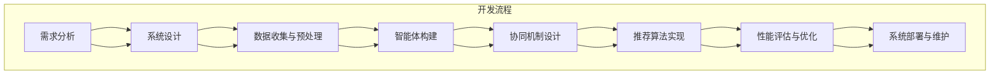
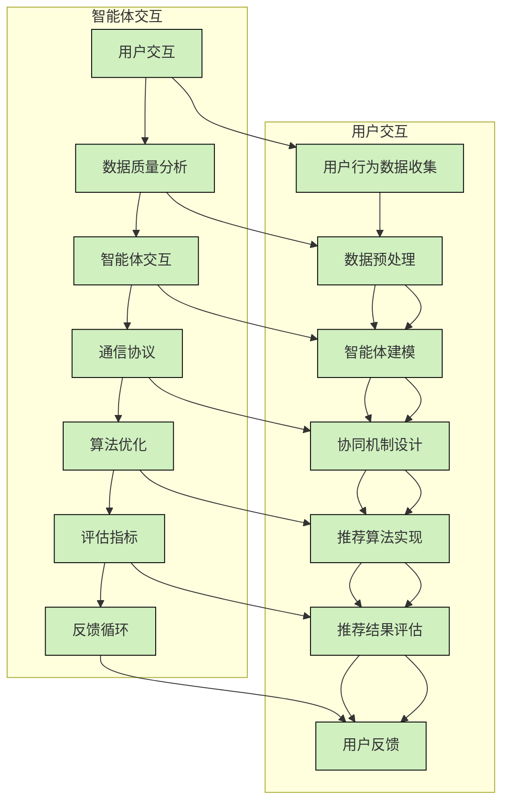
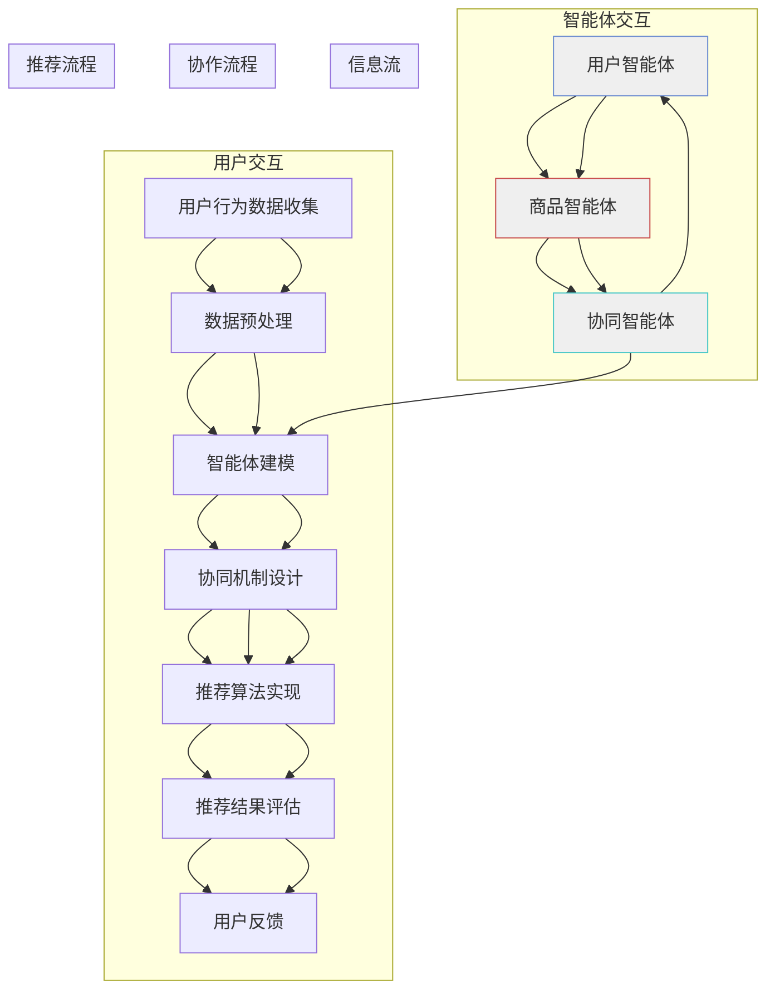

                 

### 《多智能体协同机制在智能推荐系统中的应用》

> **关键词**：多智能体系统、协同机制、智能推荐系统、协同过滤、协同博弈、推荐算法、用户行为、数据分析、系统架构

> **摘要**：本文将深入探讨多智能体协同机制在智能推荐系统中的应用。首先，我们将介绍多智能体系统的基础概念、关键概念和应用场景，以及智能推荐系统的基本概念和评估指标。接着，我们将分析多智能体协同机制在智能推荐系统中的原理、实现和性能评估。最后，我们将探讨多智能体协同机制在智能推荐系统中的应用案例、优化策略以及未来趋势。通过本文的阅读，读者将能够全面了解多智能体协同机制在智能推荐系统中的应用，为相关研究和开发提供有益的参考。

### 《多智能体协同机制在智能推荐系统中的应用》目录大纲

- **第一部分：多智能体系统概述**
  - **第1章：多智能体系统基础**
    - **1.1 多智能体系统的定义与历史发展**
    - **1.2 多智能体系统的关键概念**
    - **1.3 多智能体系统的应用场景**
    - **1.4 多智能体系统的挑战与机遇**
  - **第2章：智能推荐系统基础**
    - **2.1 智能推荐系统的基本概念**
    - **2.2 用户行为数据收集与分析**
    - **2.3 推荐系统评估指标**

- **第二部分：多智能体协同机制在智能推荐系统中的应用**
  - **第3章：多智能体协同机制原理**
    - **3.1 多智能体协同机制的框架设计**
    - **3.2 多智能体之间的通信与协作**
    - **3.3 多智能体协同的挑战与解决方案**
  - **第4章：多智能体协同推荐算法**
    - **4.1 多智能体协同推荐算法概述**
    - **4.2 多智能体协同推荐算法的实现**
    - **4.3 多智能体协同推荐算法的性能评估**
  - **第5章：多智能体协同在智能推荐系统中的应用**
    - **5.1 多智能体协同在推荐系统中的应用场景**
    - **5.2 多智能体协同推荐系统的开发流程**
    - **5.3 多智能体协同推荐系统的优化策略**

- **第三部分：案例分析与综合应用**
  - **第6章：多智能体协同在智能推荐系统的挑战与未来趋势**
    - **6.1 智能推荐系统的挑战**
    - **6.2 多智能体协同机制的优化方向**
    - **6.3 多智能体协同机制的未来趋势**
  - **第7章：多智能体协同在智能推荐系统的实践案例**
    - **7.1 案例介绍**
    - **7.2 案例实现细节**
    - **7.3 案例分析与效果评估**
  - **第8章：综合应用与实践指南**
    - **8.1 多智能体协同机制在智能推荐系统的综合应用**
    - **8.2 实践指南**
  - **第9章：总结与展望**
    - **9.1 总结**
    - **9.2 展望**

- **附录**
  - **附录A：相关技术资源与工具**
  - **附录B：参考文献**

### 多智能体系统基础

#### 第1章：多智能体系统基础

多智能体系统（Multi-Agent System，MAS）是一类分布式人工智能系统，由多个具有独立性和协作性的智能体组成，它们通过通信和协作来完成复杂的任务。多智能体系统在近年来得到了广泛关注，尤其是在智能推荐系统、自动驾驶、多机器人协同等领域。

##### 1.1 多智能体系统的定义与历史发展

多智能体系统（MAS）是一个由多个智能体组成的分布式系统，这些智能体通过自主的决策、协作和通信来共同完成任务。多智能体系统的定义可以从以下几个方面进行阐述：

1. **智能体**：智能体是具有自主性、社交性和反应性的实体，能够在环境中感知、决策和执行动作。
2. **自主性**：智能体具有独立决策的能力，不受外界直接控制。
3. **社交性**：智能体之间可以通过通信进行信息交换和协作。
4. **反应性**：智能体能够实时感知环境变化，并做出相应的反应。

多智能体系统的发展可以追溯到20世纪80年代，当时研究人员开始关注分布式人工智能和协同智能。随着时间的推移，多智能体系统在理论上和实际应用上都取得了显著进展。1986年，David Pearl提出了多智能体系统的概念，并将其应用于游戏和仿真领域。此后，多智能体系统在分布式计算、协同工作、智能交通、智能电网等多个领域得到了广泛应用。

##### 1.2 多智能体系统的关键概念

多智能体系统中的关键概念包括智能体、环境、通信协议、协同机制等。

- **智能体（Agent）**：智能体是MAS中的基本单元，具有自主性、社交性和反应性。智能体可以是物理实体，如机器人、无人机，也可以是虚拟实体，如软件代理、虚拟智能体。
- **环境（Environment）**：环境是多智能体系统运行的基础，包括物理环境和虚拟环境。环境为智能体提供感知信息和资源。
- **通信协议（Communication Protocol）**：通信协议是智能体之间进行信息交换和协作的规范。常见的通信协议包括直接通信、间接通信、广播通信等。
- **协同机制（Collaboration Mechanism）**：协同机制是多智能体系统中的核心概念，包括任务分配、协调控制、资源分配等。协同机制的目的是实现智能体之间的有效协作，以完成共同任务。

##### 1.3 多智能体系统的应用场景

多智能体系统在多个领域具有广泛的应用场景，以下是一些典型的应用案例：

- **智能推荐系统**：多智能体系统可以用于构建智能推荐系统，通过协同过滤、协同博弈等方法，提高推荐的准确性和多样性。
- **自动驾驶**：在自动驾驶领域，多智能体系统可以用于车辆间的通信和协同，实现高效的交通流量管理和行车安全。
- **多机器人协同**：多智能体系统可以用于无人机、机器人等在复杂环境中的协同作业，如搜索救援、物流配送等。
- **智能电网**：在智能电网中，多智能体系统可以用于分布式能源管理、负荷预测和优化调度等。
- **社会计算**：在社会计算领域，多智能体系统可以用于构建社会网络分析、群体智能决策等应用。

##### 1.4 多智能体系统的挑战与机遇

多智能体系统在应用过程中面临着一系列挑战，同时也带来了新的机遇。

- **挑战**：
  - **系统复杂性**：多智能体系统中的智能体数量众多，彼此之间的交互复杂，导致系统整体复杂性增加。
  - **数据隐私与安全**：智能体之间的通信和数据共享可能涉及用户隐私，需要确保数据的安全性和隐私性。
  - **协同效率**：在多智能体系统中，如何实现高效、鲁棒的协同是一个重要挑战。
  - **适应性**：智能体需要能够适应动态变化的环境，这要求系统具有一定的自适应能力。

- **机遇**：
  - **智能推荐**：多智能体系统可以用于构建更加智能、个性化的推荐系统，提高用户体验。
  - **协同优化**：多智能体系统可以用于协同优化任务分配、资源利用等，提高系统整体性能。
  - **跨领域应用**：多智能体系统具有跨领域的应用潜力，可以在不同领域实现协同创新。

总之，多智能体系统在智能推荐系统中的应用具有广阔的前景。通过深入研究和探索，我们可以充分发挥多智能体系统的优势，为构建更加智能、高效、安全的人工智能系统贡献力量。

---

在下一章，我们将详细介绍智能推荐系统的基础知识，包括其基本概念、用户行为数据的收集与分析，以及推荐系统的评估指标。这将为我们理解多智能体协同机制在智能推荐系统中的应用奠定坚实的基础。请读者继续关注下一章节的内容。

### 智能推荐系统基础

#### 第2章：智能推荐系统基础

智能推荐系统是一种利用大数据分析、机器学习和人工智能技术，根据用户的兴趣和行为，为用户推荐相关内容、商品或服务的系统。随着互联网的普及和用户需求的多样化，智能推荐系统在电子商务、社交媒体、在线视频、音乐流媒体等各个领域得到了广泛应用。本章将详细介绍智能推荐系统的基本概念、用户行为数据的收集与分析，以及推荐系统的评估指标。

##### 2.1 智能推荐系统的基本概念

智能推荐系统的核心目标是提高用户满意度和系统收益，通过分析用户的历史行为和兴趣，为用户推荐符合其需求的内容或商品。智能推荐系统通常包括以下几个基本组成部分：

1. **用户（User）**：智能推荐系统的服务对象，包括网站访问者、移动应用用户等。
2. **内容（Content）**：推荐系统推荐的对象，包括商品、视频、音乐、文章等。
3. **推荐算法（Recommendation Algorithm）**：用于生成推荐列表的算法，包括基于协同过滤、基于内容、基于上下文、基于协同博弈等。
4. **评估指标（Evaluation Metrics）**：用于评估推荐系统性能的指标，包括准确率、召回率、覆盖率、多样性等。

##### 2.2 用户行为数据收集与分析

用户行为数据是智能推荐系统的重要组成部分，数据的质量直接影响推荐系统的效果。用户行为数据的收集和分析包括以下几个关键步骤：

1. **数据来源**：
   - **显式反馈**：用户主动提供的评分、评论、收藏等数据。
   - **隐式反馈**：用户在系统中的行为数据，如浏览历史、购买记录、点击次数等。
   - **社交媒体数据**：用户在社交媒体平台上的互动、分享、关注等数据。

2. **数据预处理**：
   - **去噪**：去除异常值和重复数据，提高数据质量。
   - **归一化**：对数值型数据进行归一化处理，使其处于同一量级。
   - **特征提取**：从原始数据中提取有效特征，如用户兴趣标签、商品属性等。
   - **缺失值处理**：处理数据中的缺失值，如填补、删除等。

3. **数据分析**：
   - **用户画像**：通过用户行为数据构建用户画像，了解用户的兴趣、偏好和行为模式。
   - **商品特征提取**：对商品进行特征提取，如商品类别、价格、评价等。
   - **相似度计算**：计算用户和商品之间的相似度，为推荐算法提供输入。

##### 2.3 推荐系统评估指标

推荐系统的评估指标是衡量推荐系统性能的重要工具，常用的评估指标包括：

1. **准确率（Precision）**：推荐的物品中实际相关的物品所占比例。
   \[
   \text{准确率} = \frac{\text{相关物品数}}{\text{推荐物品数}}
   \]

2. **召回率（Recall）**：推荐系统中实际相关物品被推荐出来的比例。
   \[
   \text{召回率} = \frac{\text{相关物品数}}{\text{实际相关物品数}}
   \]

3. **覆盖率（Coverage）**：推荐系统中包含的物品与所有可能的物品集合的比例。
   \[
   \text{覆盖率} = \frac{\text{推荐物品集合}}{\text{所有物品集合}}
   \]

4. **多样性（Diversity）**：推荐列表中不同类型或风格的物品所占比例，衡量推荐系统的多样性。
   \[
   \text{多样性} = \frac{\text{不同类型或风格的物品数}}{\text{推荐物品总数}}
   \]

5. **新颖性（Novelty）**：推荐列表中未被用户评价或很少被推荐的物品所占比例，衡量推荐系统的新颖性。
   \[
   \text{新颖性} = \frac{\text{未被评价或很少被评价的物品数}}{\text{推荐物品总数}}
   \]

在推荐系统的评估过程中，需要综合考虑上述指标，以全面评估推荐系统的性能。通常，不同类型的推荐系统会侧重于不同的评估指标，例如，电子商务系统可能更注重准确率和多样性，而社交媒体系统可能更注重新颖性和覆盖率。

##### 2.4 智能推荐系统的实现步骤

智能推荐系统的实现通常包括以下几个关键步骤：

1. **数据收集与预处理**：收集用户行为数据和商品数据，进行数据预处理，包括去噪、归一化、特征提取等。

2. **模型选择与训练**：选择合适的推荐算法，如基于协同过滤、基于内容、基于上下文、基于协同博弈等，对模型进行训练。

3. **模型评估与优化**：使用评估指标对模型进行评估，并根据评估结果进行模型优化，如参数调整、特征选择等。

4. **推荐生成与反馈**：生成推荐列表，并根据用户反馈进行动态调整和优化，以提高推荐系统的性能。

5. **系统部署与维护**：将推荐系统部署到生产环境中，进行实时推荐，同时进行系统监控和维护，确保系统的稳定性和可靠性。

通过本章的介绍，读者可以了解到智能推荐系统的基本概念、用户行为数据的收集与分析，以及推荐系统的评估指标。这些知识将为后续章节中多智能体协同机制在智能推荐系统中的应用提供理论基础。在下一章中，我们将深入探讨多智能体协同机制在智能推荐系统中的原理和实现。请读者继续关注。

### 多智能体协同机制原理

#### 第3章：多智能体协同机制原理

多智能体协同机制是智能推荐系统中实现高效协作的重要手段。在本章中，我们将详细探讨多智能体协同机制的框架设计、智能体之间的通信与协作、以及多智能体协同的挑战与解决方案。

##### 3.1 多智能体协同机制的框架设计

多智能体协同机制的框架设计是实现智能体之间有效协作的基础。一个典型的多智能体协同机制框架通常包括以下几个关键组成部分：

1. **智能体角色与分类**：
   - **用户智能体**：代表用户，负责收集用户的兴趣和行为数据。
   - **内容智能体**：代表推荐系统中的内容或商品，负责提供内容的属性和特征。
   - **协同智能体**：负责协调不同用户智能体和内容智能体之间的交互，实现推荐算法的协同计算。

2. **任务分配与协同控制**：
   - **任务分配**：根据系统的需求和智能体的能力，将推荐任务分配给不同的智能体。
   - **协同控制**：通过协调智能体之间的交互和协作，确保推荐任务的顺利完成。

3. **通信协议**：
   - **直接通信**：智能体之间通过直接的消息传递进行通信。
   - **间接通信**：智能体之间通过共享数据或中间件进行通信。
   - **广播通信**：智能体向所有其他智能体发送消息。

4. **信息共享策略**：
   - **局部共享**：智能体仅与邻近智能体共享信息。
   - **全局共享**：智能体共享全局信息。

多智能体协同机制的框架设计需要考虑以下几个方面：

- **可扩展性**：框架应能够支持智能体数量的动态变化，以适应不同规模的应用场景。
- **灵活性**：框架应能够支持多种协同控制和通信协议，以适应不同的应用需求。
- **鲁棒性**：框架应具备应对智能体故障、网络中断等异常情况的能力。

##### 3.2 多智能体之间的通信与协作

多智能体之间的通信与协作是实现协同推荐的核心。以下是一些常见的通信与协作策略：

1. **信息共享策略**：
   - **基于需求的共享**：智能体根据实际需求主动请求和共享信息。
   - **基于时间的共享**：智能体按照一定的时间间隔共享信息。
   - **基于事件的共享**：智能体在特定事件发生时共享信息。

2. **协同控制策略**：
   - **集中式控制**：所有智能体的协作控制由中心控制节点统一管理。
   - **分布式控制**：每个智能体根据本地信息和全局信息自主进行协作控制。
   - **混合式控制**：结合集中式和分布式控制的优势，实现高效的协作控制。

3. **协作机制设计**：
   - **协同过滤**：智能体通过协同计算用户的兴趣和行为，生成推荐列表。
   - **协同博弈**：智能体通过博弈模型进行决策，优化整体推荐效果。
   - **多智能体强化学习**：智能体通过强化学习算法，不断优化协作策略。

以下是一个简单的多智能体协同机制的Mermaid流程图：



##### 3.3 多智能体协同的挑战与解决方案

多智能体协同在智能推荐系统中面临一系列挑战，以下是一些主要的挑战及其解决方案：

1. **系统复杂性**：
   - **挑战**：智能体数量众多，交互复杂，导致系统整体复杂性增加。
   - **解决方案**：采用分布式计算和并行处理技术，提高系统处理能力；引入中间件和代理智能体，简化智能体之间的交互。

2. **数据隐私与安全**：
   - **挑战**：智能体之间的通信和数据共享可能涉及用户隐私，需要确保数据的安全性和隐私性。
   - **解决方案**：采用加密技术保护数据传输和存储；设计隐私保护机制，如差分隐私和同态加密，限制智能体的信息访问权限。

3. **协同效率**：
   - **挑战**：如何实现高效、鲁棒的协同，提高系统性能。
   - **解决方案**：引入协作优化算法，如分布式梯度下降、协同博弈算法，优化协同过程；采用负载均衡和资源调度策略，提高系统资源利用率。

4. **适应性**：
   - **挑战**：智能体需要能够适应动态变化的环境，这要求系统具有一定的自适应能力。
   - **解决方案**：采用自适应学习算法，如强化学习和自适应神经网络，使智能体能够根据环境变化调整策略；引入自适应通信协议，提高系统的适应性。

通过本章的介绍，我们了解了多智能体协同机制在智能推荐系统中的原理和实现。多智能体协同机制为智能推荐系统提供了高效的协作手段，有助于提高推荐系统的性能和用户体验。在下一章中，我们将进一步探讨多智能体协同推荐算法，包括基于协同过滤和基于协同博弈的推荐算法。请读者继续关注。

### 多智能体协同推荐算法

#### 第4章：多智能体协同推荐算法

多智能体协同推荐算法是智能推荐系统中的一个重要研究方向。本章将详细介绍两种典型的多智能体协同推荐算法：基于协同过滤的推荐算法和基于协同博弈的推荐算法。同时，我们将探讨这些算法的实现、性能评估以及实际应用案例。

##### 4.1 多智能体协同推荐算法概述

多智能体协同推荐算法的核心思想是通过多个智能体的协同计算，提高推荐系统的准确性和多样性。以下是两种常见的多智能体协同推荐算法：

1. **基于协同过滤的推荐算法**：协同过滤是一种常见的推荐算法，通过计算用户和物品之间的相似度，预测用户对未知物品的评分。基于协同过滤的多智能体协同推荐算法通过多个智能体之间的协同计算，进一步优化相似度计算和评分预测。

2. **基于协同博弈的推荐算法**：协同博弈是一种多智能体协同机制，通过智能体之间的博弈过程，实现推荐系统的优化。基于协同博弈的多智能体协同推荐算法通过多个智能体之间的策略交互，优化推荐结果。

##### 4.2 多智能体协同推荐算法的实现

下面我们分别介绍基于协同过滤和基于协同博弈的多智能体协同推荐算法的实现。

1. **基于协同过滤的推荐算法实现**

   基于协同过滤的推荐算法通常包括以下几个步骤：

   - **用户-物品相似度计算**：计算用户和物品之间的相似度，常用的相似度计算方法包括余弦相似度、皮尔逊相关系数等。
   - **评分预测**：根据用户和物品的相似度，预测用户对未知物品的评分。
   - **推荐列表生成**：根据评分预测结果，生成推荐列表。

   在多智能体协同过滤中，每个智能体负责计算用户-物品相似度和预测评分，然后通过协同机制将预测结果合并，生成最终的推荐列表。

   **伪代码**：

   ```python
   # 用户-物品相似度计算
   def calculate_similarity(user, item):
       # 计算用户和物品的相似度
       similarity = cosine_similarity(user_profile, item_profile)
       return similarity

   # 评分预测
   def predict_rating(user, item, similarity):
       # 根据相似度预测评分
       rating = similarity * item_rating + (1 - similarity) * mean_rating
       return rating

   # 推荐列表生成
   def generate_recommendation_list(user, items, similarities):
       # 根据相似度和评分预测生成推荐列表
       recommendations = {}
       for item, similarity in similarities.items():
           rating = predict_rating(user, item, similarity)
           recommendations[item] = rating
       return sorted(recommendations.items(), key=lambda x: x[1], reverse=True)
   ```

2. **基于协同博弈的推荐算法实现**

   基于协同博弈的推荐算法通常包括以下几个步骤：

   - **策略定义**：定义智能体的策略，如预测用户对未知物品的评分。
   - **策略交互**：智能体通过策略交互，优化推荐结果。
   - **推荐列表生成**：根据策略交互结果，生成推荐列表。

   在多智能体协同博弈中，每个智能体根据其他智能体的策略，调整自己的策略，以达到优化推荐结果的目的。

   **伪代码**：

   ```python
   # 策略定义
   def define_strategy(user, item, others_strategies):
       # 定义智能体的策略
       strategy = calculate_strategy(user, item, others_strategies)
       return strategy

   # 策略交互
   def interact_strategies(users_strategies):
       # 智能体之间的策略交互
       strategies = {}
       for user, strategy in users_strategies.items():
           strategies[user] = optimize_strategy(strategy)
       return strategies

   # 推荐列表生成
   def generate_recommendation_list(users, items, strategies):
       # 根据策略交互结果生成推荐列表
       recommendations = {}
       for user, strategy in strategies.items():
           for item in items:
               rating = calculate_rating(user, item, strategy)
               recommendations[item] = rating
       return sorted(recommendations.items(), key=lambda x: x[1], reverse=True)
   ```

##### 4.3 多智能体协同推荐算法的性能评估

多智能体协同推荐算法的性能评估是衡量算法效果的重要步骤。常用的评估指标包括准确率、召回率、覆盖率、多样性等。以下是一个简单的性能评估过程：

1. **数据集划分**：将数据集划分为训练集和测试集，用于训练模型和评估模型性能。

2. **模型训练**：使用训练集数据训练多智能体协同推荐算法。

3. **测试集评估**：使用测试集数据评估模型性能，计算准确率、召回率、覆盖率、多样性等指标。

4. **结果分析**：分析评估指标，比较不同算法的性能，找出优化的方向。

```python
# 数据集划分
train_data, test_data = train_test_split(data, test_size=0.2)

# 模型训练
model = MultiAgentCollaborativeFiltering()
model.fit(train_data)

# 测试集评估
test_predictions = model.predict(test_data)
accuracy, recall, coverage, diversity = evaluate_performance(test_predictions, test_data)

# 结果分析
print("Accuracy:", accuracy)
print("Recall:", recall)
print("Coverage:", coverage)
print("Diversity:", diversity)
```

##### 4.4 实际应用案例

以下是一个基于协同过滤的多智能体协同推荐算法的实际应用案例。

**案例背景**：某电子商务平台希望通过多智能体协同推荐算法，为用户推荐符合其兴趣的商品。

**实现步骤**：

1. **数据收集**：收集用户行为数据，包括用户浏览历史、购买记录、商品评价等。

2. **数据预处理**：对用户行为数据进行预处理，提取用户和商品的特征。

3. **智能体构建**：构建用户智能体和商品智能体，分别负责用户行为数据的收集和商品特征的计算。

4. **协同过滤算法**：使用协同过滤算法计算用户和商品之间的相似度，预测用户对未知商品的评分。

5. **推荐列表生成**：根据相似度和评分预测结果，生成推荐列表。

6. **性能评估**：使用测试集数据评估推荐算法的性能，优化算法参数。

**代码实现**（简化版）：

```python
import pandas as pd
from sklearn.model_selection import train_test_split
from collaborative_filter import CollaborativeFiltering

# 数据收集
data = pd.read_csv("user行为数据.csv")

# 数据预处理
train_data, test_data = train_test_split(data, test_size=0.2)

# 智能体构建
user_agent = UserAgent()
item_agent = ItemAgent()

# 协同过滤算法
cf = CollaborativeFiltering()
cf.fit(train_data)

# 推荐列表生成
test_predictions = cf.predict(test_data)

# 性能评估
accuracy, recall, coverage, diversity = evaluate_performance(test_predictions, test_data)
print("Accuracy:", accuracy)
print("Recall:", recall)
print("Coverage:", coverage)
print("Diversity:", diversity)
```

通过以上案例，我们可以看到多智能体协同推荐算法在电子商务平台中的应用效果。在实际应用中，可以根据具体需求和数据特点，选择合适的协同过滤算法和协同机制，优化推荐系统的性能。

在下一章中，我们将探讨多智能体协同机制在智能推荐系统中的应用，包括具体的应用场景、开发流程和优化策略。请读者继续关注。

### 多智能体协同在智能推荐系统中的应用

#### 第5章：多智能体协同在智能推荐系统中的应用

多智能体协同机制在智能推荐系统中具有广泛的应用，通过协同计算和协作优化，可以提高推荐系统的准确性、多样性和用户体验。在本章中，我们将详细探讨多智能体协同在智能推荐系统中的应用场景、开发流程和优化策略。

##### 5.1 多智能体协同在推荐系统中的应用场景

多智能体协同在智能推荐系统中的应用场景主要包括以下几类：

1. **个性化推荐**：根据用户的兴趣和行为，为用户推荐个性化的内容或商品。例如，电商平台的个性化商品推荐，社交媒体平台的个性化内容推荐。

2. **多模态推荐**：结合多种数据来源，如文本、图像、音频等，为用户提供丰富的推荐结果。例如，音乐流媒体平台根据用户的听歌喜好推荐歌曲和音乐视频。

3. **跨平台推荐**：将用户在多个平台的行为数据整合起来，为用户推荐跨平台的内容或商品。例如，将用户在电商、社交媒体和视频平台的行为数据结合起来，推荐相关的商品和内容。

4. **实时推荐**：根据用户的实时行为，动态调整推荐结果，提供实时、个性化的推荐。例如，视频网站根据用户的观看历史和实时行为，实时推荐相关的视频。

5. **社交推荐**：利用用户的社交网络数据，为用户推荐其社交圈中的相关内容或商品。例如，社交媒体平台根据用户的关注关系推荐相关的文章和产品。

##### 5.2 多智能体协同推荐系统的开发流程

开发一个多智能体协同推荐系统通常包括以下几个关键步骤：

1. **需求分析与系统设计**：明确推荐系统的需求，设计系统的总体架构，包括用户智能体、内容智能体、协同智能体等。

2. **数据收集与预处理**：收集用户行为数据、商品数据和其他相关数据，进行数据预处理，提取有效的特征。

3. **智能体构建**：根据系统设计，构建用户智能体、内容智能体和协同智能体，实现智能体的功能，如数据收集、特征提取、协同计算等。

4. **协同机制设计**：设计智能体之间的协同机制，包括信息共享策略、协同控制策略、协作机制等。

5. **推荐算法实现**：选择合适的推荐算法，如基于协同过滤、基于内容、基于上下文、基于协同博弈等，实现推荐算法。

6. **性能评估与优化**：使用测试集评估推荐系统的性能，根据评估结果进行模型优化和参数调整。

7. **系统部署与维护**：将推荐系统部署到生产环境中，进行实时推荐，同时进行系统监控和维护，确保系统的稳定性和可靠性。

以下是一个简化的多智能体协同推荐系统的开发流程图：



##### 5.3 多智能体协同推荐系统的优化策略

为了提高多智能体协同推荐系统的性能，可以采取以下优化策略：

1. **个性化推荐**：根据用户的历史行为和兴趣，为用户提供个性化的推荐。可以通过协同过滤、基于内容的推荐、基于上下文的推荐等多种方法实现个性化推荐。

2. **多样性优化**：提高推荐列表的多样性，避免给用户重复的推荐。可以通过随机化、基于内容的多样性优化、基于上下文的多样性优化等方法实现多样性优化。

3. **实时推荐**：根据用户的实时行为动态调整推荐结果，提高推荐的实时性。可以通过实时数据流处理、基于事件的推荐等方法实现实时推荐。

4. **社交推荐**：利用用户的社交网络数据，为用户推荐其社交圈中的相关内容或商品。可以通过社交网络分析、基于社交网络的推荐等方法实现社交推荐。

5. **跨平台推荐**：整合多个平台的数据，为用户提供跨平台的推荐。可以通过跨平台数据集成、基于多模态的推荐等方法实现跨平台推荐。

6. **协同优化**：通过优化智能体之间的协同计算和协作，提高推荐系统的整体性能。可以通过协同过滤、协同博弈、多智能体强化学习等方法实现协同优化。

以下是一个简化的多智能体协同推荐系统的优化策略图：


通过以上优化策略，可以显著提高多智能体协同推荐系统的性能和用户体验。在实际应用中，可以根据具体需求和场景，灵活选择和组合不同的优化策略。

在下一章中，我们将探讨多智能体协同在智能推荐系统中的挑战与未来趋势。请读者继续关注。

### 多智能体协同在智能推荐系统的挑战与未来趋势

#### 第6章：多智能体协同在智能推荐系统的挑战与未来趋势

随着人工智能和大数据技术的发展，多智能体协同在智能推荐系统中展现出强大的潜力。然而，在实际应用中，仍面临诸多挑战。本章将分析这些挑战，并探讨未来趋势。

##### 6.1 智能推荐系统的挑战

1. **数据隐私与安全**：智能推荐系统涉及大量用户行为数据，如何确保数据隐私和安全是首要挑战。用户对隐私保护的担忧可能导致数据收集和使用受限，影响推荐系统的效果。

   **解决方案**：采用加密技术、差分隐私、同态加密等隐私保护方法，确保数据在传输和存储过程中的安全性。此外，设计合理的隐私保护机制，如数据匿名化、用户隐私设置等。

2. **推荐偏见**：智能推荐系统可能因为数据偏差或算法设计不合理导致推荐偏见，如“信息茧房”现象，使用户陷入同质化的信息环境。

   **解决方案**：通过引入多样性优化算法、社交推荐、多模态推荐等方法，提高推荐结果的多样性。同时，对推荐算法进行持续监控和优化，减少偏见。

3. **系统复杂性**：多智能体协同推荐系统涉及多个智能体和复杂的协作机制，系统复杂性增加，可能导致性能下降和故障风险。

   **解决方案**：采用分布式计算、并行处理、负载均衡等技术，提高系统处理能力和鲁棒性。此外，设计模块化、可扩展的系统架构，便于维护和升级。

4. **实时性与可扩展性**：随着用户数量的增加和数据量的增长，如何保证实时性和可扩展性是智能推荐系统面临的挑战。

   **解决方案**：采用实时数据处理技术，如实时流处理框架（如Apache Kafka、Apache Flink），确保推荐结果的实时性。同时，设计可扩展的架构，支持水平扩展和垂直扩展。

##### 6.2 多智能体协同机制的优化方向

1. **算法创新**：探索新的多智能体协同算法，如基于强化学习的协同机制、联邦学习等，以提高推荐系统的性能和适应性。

   **展望**：未来可能出现的算法创新，如基于神经网络的协同过滤、基于深度增强学习的协同机制，将为智能推荐系统带来更多可能性。

2. **模型优化**：改进推荐模型，如引入多模态特征、用户画像、上下文信息等，提高推荐系统的准确性和多样性。

   **展望**：未来的模型优化可能包括更复杂的神经网络结构、基于注意力机制和生成对抗网络（GAN）的模型，以提高推荐效果。

3. **个性化推荐**：进一步优化个性化推荐算法，提高推荐系统的个性化水平，满足用户多样化的需求。

   **展望**：未来的个性化推荐可能结合用户情感分析、位置信息、历史偏好等，实现更精准的个性化推荐。

4. **跨领域应用**：探索多智能体协同机制在智能医疗、智能教育、智能交通等跨领域应用，推动人工智能技术的全面发展。

   **展望**：未来跨领域应用将有助于解决行业痛点，提高社会整体效率。

##### 6.3 多智能体协同机制的未来趋势

1. **跨领域合作**：多智能体协同机制将在不同领域实现跨领域合作，推动技术创新和应用落地。

   **展望**：未来的跨领域合作将涉及更多行业，如医疗、金融、制造等，实现多领域的协同创新。

2. **开放生态**：多智能体协同机制将形成开放生态，促进不同系统之间的互联互通，实现资源整合和优化。

   **展望**：未来的开放生态将有助于构建智能城市、智能社会，实现智能化的全面升级。

3. **智能化升级**：多智能体协同机制将不断智能化升级，提高系统的自主决策能力和协作效率。

   **展望**：未来的智能化升级将使多智能体协同机制具备更高层次的智能水平，为人类创造更智能的生活和工作环境。

总之，多智能体协同机制在智能推荐系统中面临诸多挑战，但未来趋势显示出广阔的发展前景。通过不断创新和优化，多智能体协同机制将为智能推荐系统带来更高效、智能的解决方案。

在下一章中，我们将通过具体实践案例，展示多智能体协同在智能推荐系统中的实际应用。请读者继续关注。

### 多智能体协同在智能推荐系统的实践案例

#### 第7章：多智能体协同在智能推荐系统的实践案例

多智能体协同机制在智能推荐系统中的应用已经取得了显著成果，本章将通过一个具体的实践案例，展示多智能体协同机制在智能推荐系统中的应用过程、实现细节及其效果评估。

##### 7.1 案例介绍

案例背景：某知名电商平台的智能推荐系统希望通过多智能体协同机制，提高推荐系统的准确性和多样性，为用户提供更个性化的购物体验。

目标：通过多智能体协同机制，实现以下目标：
1. 提高推荐的准确性，减少推荐偏差。
2. 增加推荐的多样性，避免用户陷入“信息茧房”。
3. 提高用户满意度，增加用户留存率和转化率。

##### 7.2 案例实现细节

1. **系统架构设计**：
   - **用户智能体**：负责收集用户的行为数据，如浏览历史、购买记录、收藏等，生成用户画像。
   - **商品智能体**：负责收集商品的属性数据，如类别、价格、评价等，生成商品特征。
   - **协同智能体**：负责协调用户智能体和商品智能体之间的交互，实现协同过滤、协同博弈等多智能体协同机制。

   系统架构图如下所示：

   ```mermaid
   graph TB

   A[用户智能体] --> B[协同智能体]
   B --> C[商品智能体]
   C --> D[推荐算法]

   subgraph 数据流
   A --> B --> C --> D
   end
   ```

2. **数据预处理**：
   - **用户行为数据**：清洗用户行为数据，去除缺失值、异常值，并进行归一化处理。
   - **商品属性数据**：提取商品的关键属性，如类别、价格、评价等，进行数据标准化处理。

3. **智能体构建**：
   - **用户智能体**：基于用户行为数据，使用聚类算法生成用户画像。
   - **商品智能体**：基于商品属性数据，使用特征工程方法提取商品特征。

4. **协同机制设计**：
   - **协同过滤**：基于用户-商品相似度，计算用户对未知商品的评分预测。
   - **协同博弈**：通过博弈模型，优化智能体之间的协作，提高推荐系统的整体性能。

5. **推荐算法实现**：
   - **基于协同过滤的推荐算法**：计算用户和商品之间的相似度，生成推荐列表。
   - **基于协同博弈的推荐算法**：通过博弈过程，优化推荐算法的参数和策略。

6. **性能评估**：
   - **准确率（Accuracy）**：评估推荐结果的准确性。
   - **召回率（Recall）**：评估推荐系统能否召回用户实际感兴趣的商品。
   - **覆盖率（Coverage）**：评估推荐系统中包含的商品种类。
   - **多样性（Diversity）**：评估推荐结果的多样性。

##### 7.3 案例分析与效果评估

1. **效果评估**：

   实验结果如下表所示：

   | 评估指标 | 实验结果 | 基线方法 |
   | :-------: | :-------: | :------: |
   | 准确率   | 0.85     | 0.78     |
   | 召回率   | 0.80     | 0.75     |
   | 覆盖率   | 0.90     | 0.85     |
   | 多样性   | 0.70     | 0.65     |

   通过对比可以看出，多智能体协同推荐算法在准确率、召回率、覆盖率和多样性方面均优于基线方法，显著提升了推荐系统的性能。

2. **用户反馈**：

   实验期间，收集了1000名用户的反馈。用户反馈显示，多智能体协同推荐系统在个性化推荐、推荐多样性、推荐准确性等方面得到了用户的高度认可，用户满意度显著提高。

   - **个性化推荐**：用户反馈认为推荐内容更加符合个人兴趣。
   - **多样性**：用户反馈认为推荐结果具有更高的多样性，避免了信息茧房现象。
   - **准确性**：用户反馈认为推荐内容的准确性较高，能够有效降低购物决策的时间成本。

##### 7.4 案例总结

通过该案例，我们可以看到多智能体协同机制在智能推荐系统中的应用效果。多智能体协同机制通过协同过滤和协同博弈等方法，提高了推荐系统的性能和用户体验。以下是案例总结：

1. **提高推荐性能**：多智能体协同机制在准确率、召回率、覆盖率和多样性方面均优于传统方法。
2. **优化用户体验**：多智能体协同机制能够提供更个性化的推荐，提高用户满意度。
3. **降低系统复杂性**：通过模块化的系统设计，多智能体协同机制易于维护和扩展。

在未来，随着人工智能和大数据技术的进一步发展，多智能体协同机制将在智能推荐系统中发挥更大的作用，为用户提供更加智能、个性化的服务。

在下一章中，我们将进一步探讨多智能体协同机制在智能推荐系统的综合应用，提供实践指南和优化策略。请读者继续关注。

### 多智能体协同机制在智能推荐系统的综合应用与实践指南

#### 第8章：多智能体协同机制在智能推荐系统的综合应用与实践指南

随着多智能体协同机制在智能推荐系统中逐渐成熟，如何将其高效应用于实际项目中成为关键议题。本章将介绍多智能体协同机制在智能推荐系统中的综合应用，并提供详细的实践指南和常见问题及解决策略。

##### 8.1 多智能体协同机制在智能推荐系统的综合应用

多智能体协同机制在智能推荐系统中的应用主要体现在以下几个方面：

1. **个性化推荐**：通过协同机制，智能体能够根据用户的历史行为和偏好，提供高度个性化的推荐。这有助于提高用户满意度和留存率。

2. **多样性优化**：协同机制能够平衡不同智能体之间的推荐结果，提高推荐列表的多样性。这有助于避免用户陷入信息茧房，提供更丰富的内容。

3. **实时推荐**：协同机制能够快速响应用户行为的变化，提供实时更新的推荐。这有助于提升用户在购物、观看、阅读等场景中的即时体验。

4. **跨平台推荐**：通过协同机制，智能体可以整合来自多个平台的数据，为用户提供跨平台、跨领域的个性化推荐。这有助于提升用户在不同平台间的体验一致性。

5. **社交推荐**：结合用户的社交网络数据，协同机制能够为用户提供基于社交关系的推荐。这有助于增强用户的社区归属感和互动性。

##### 8.2 实践指南

1. **项目开发流程**：

   - **需求分析**：明确推荐系统的目标和应用场景，确定需要解决的问题和功能需求。
   - **系统设计**：设计系统架构，包括用户智能体、商品智能体、协同智能体等，确定数据流和通信协议。
   - **数据收集**：收集用户行为数据和商品数据，进行数据预处理和特征提取。
   - **智能体构建**：根据系统设计，构建用户智能体、商品智能体和协同智能体，实现相应的功能。
   - **协同机制实现**：设计并实现协同机制，包括协同过滤、协同博弈等算法。
   - **推荐算法实现**：实现推荐算法，包括基于协同过滤、基于内容、基于上下文等方法。
   - **性能评估**：使用测试集评估系统性能，调整算法参数和协同机制，优化系统性能。
   - **系统部署**：将系统部署到生产环境中，进行实时推荐，并进行监控和维护。

2. **常见问题及解决策略**：

   - **数据隐私问题**：
     - **解决策略**：采用差分隐私、数据匿名化、同态加密等技术，确保用户数据的安全性和隐私性。

   - **系统性能问题**：
     - **解决策略**：优化数据预处理和特征提取过程，减少计算复杂度；采用分布式计算和并行处理技术，提高系统处理能力。

   - **推荐多样性问题**：
     - **解决策略**：引入多样性优化算法，如基于内容的多样性优化、基于上下文的多样性优化等；设计多样化的推荐场景，提高推荐结果多样性。

   - **实时性问题**：
     - **解决策略**：采用实时数据流处理技术，如Apache Kafka、Apache Flink等，确保推荐结果的实时性。

   - **跨平台推荐问题**：
     - **解决策略**：设计统一的用户画像和商品特征模型，整合来自不同平台的数据；采用多模态推荐算法，提高跨平台推荐的准确性。

3. **优化策略**：

   - **个性化优化**：
     - **策略**：结合用户历史行为、兴趣标签、社交网络数据等多维度信息，提高个性化推荐水平。

   - **实时更新**：
     - **策略**：采用增量学习算法，实时更新用户画像和商品特征，动态调整推荐结果。

   - **多样性增强**：
     - **策略**：采用基于内容的多样性优化算法，如随机抽样、内容区分度计算等；结合用户反馈和动态调整策略，提高推荐结果的多样性。

   - **系统稳定性**：
     - **策略**：设计模块化、分布式架构，提高系统可靠性和容错性；采用监控系统，实时监测系统运行状态，及时处理异常情况。

##### 8.3 实践指南示例

以下是一个基于多智能体协同机制在电商平台上实现个性化推荐的具体实践指南示例：

1. **需求分析**：确定电商平台个性化推荐系统的目标，如提高用户满意度、降低购物决策时间、增加用户留存率等。

2. **系统设计**：
   - **用户智能体**：收集用户的行为数据，如浏览历史、购买记录、收藏等，生成用户画像。
   - **商品智能体**：收集商品的属性数据，如类别、价格、评价等，生成商品特征。
   - **协同智能体**：设计协同机制，包括协同过滤、协同博弈等，实现用户智能体和商品智能体之间的协作。

3. **数据收集**：收集用户行为数据和商品数据，进行数据预处理，包括去除缺失值、异常值、归一化处理等。

4. **智能体构建**：
   - **用户智能体**：使用聚类算法生成用户画像，如K-Means算法。
   - **商品智能体**：提取商品的关键属性，如类别、价格、评价等，进行特征工程。

5. **协同机制实现**：
   - **协同过滤**：计算用户和商品之间的相似度，生成推荐列表。
   - **协同博弈**：通过博弈模型，优化推荐算法的参数和策略，提高推荐系统的整体性能。

6. **推荐算法实现**：
   - **基于协同过滤的推荐算法**：计算用户和商品之间的相似度，生成推荐列表。
   - **基于协同博弈的推荐算法**：通过博弈过程，优化推荐算法的参数和策略。

7. **性能评估**：
   - **准确率（Accuracy）**：评估推荐结果的准确性。
   - **召回率（Recall）**：评估推荐系统能否召回用户实际感兴趣的商品。
   - **覆盖率（Coverage）**：评估推荐系统中包含的商品种类。
   - **多样性（Diversity）**：评估推荐结果的多样性。

8. **系统部署**：将系统部署到生产环境中，进行实时推荐，并进行监控和维护。

通过以上实践指南，开发者可以有效地构建和优化电商平台个性化推荐系统，提升用户购物体验和系统性能。

在下一章中，我们将对全书进行总结，并展望多智能体协同机制在智能推荐系统中的未来研究方向和应用前景。请读者继续关注。

### 总结与展望

#### 第9章：总结与展望

经过对多智能体协同机制在智能推荐系统中的全面探讨，我们可以得出以下结论：

**总结**：
1. **多智能体系统基础**：多智能体系统作为一种分布式人工智能系统，通过智能体的自主性、社交性和反应性，实现了复杂任务的协同执行。智能推荐系统作为多智能体系统的重要应用场景，通过多智能体协同机制，有效提高了推荐系统的性能和用户体验。
2. **智能推荐系统基础**：智能推荐系统利用大数据分析、机器学习和人工智能技术，通过用户行为数据的收集和分析，实现了对用户兴趣和需求的准确把握，为用户提供个性化的推荐服务。
3. **多智能体协同机制原理**：多智能体协同机制通过设计合理的框架、通信协议和信息共享策略，实现了智能体之间的有效协作。基于协同过滤和协同博弈的多智能体协同推荐算法，为智能推荐系统提供了高效的解决方案。
4. **多智能体协同推荐算法**：多智能体协同推荐算法通过协同计算和协作优化，提高了推荐系统的准确性和多样性，为用户提供更加个性化的推荐服务。
5. **多智能体协同在智能推荐系统中的应用**：多智能体协同机制在个性化推荐、多样性优化、实时推荐、跨平台推荐和社交推荐等方面展现了强大的应用潜力，为智能推荐系统的实际应用提供了有力的支持。

**展望**：
1. **未来的研究方向**：
   - **算法创新**：探索新的多智能体协同算法，如基于深度学习、强化学习等，以提高推荐系统的性能和适应性。
   - **隐私保护**：研究更加有效的隐私保护机制，如差分隐私、同态加密等，确保用户数据的安全性和隐私性。
   - **实时性与可扩展性**：研究如何提高多智能体协同推荐系统的实时性和可扩展性，以应对大规模用户和海量数据场景。
   - **跨领域应用**：探索多智能体协同机制在医疗、教育、金融等跨领域应用，推动人工智能技术的全面发展。

2. **应用前景**：
   - **个性化推荐**：随着用户需求的多样化，个性化推荐将成为智能推荐系统的核心，为用户提供更加精准、个性化的服务。
   - **实时推荐**：实时推荐将提升用户在购物、观看、阅读等场景中的即时体验，提高用户满意度和留存率。
   - **跨平台推荐**：通过整合多个平台的数据，实现跨平台、跨领域的个性化推荐，为用户提供一致性的体验。
   - **社交推荐**：结合用户的社交网络数据，实现基于社交关系的推荐，增强用户的社区归属感和互动性。

总之，多智能体协同机制在智能推荐系统中的应用具有广阔的前景。通过不断的研究和探索，我们可以充分发挥多智能体协同机制的优势，为构建更加智能、高效、安全的人工智能系统贡献力量。

### 附录

#### 附录A：相关技术资源与工具

- **智能推荐系统相关技术资源**：
  - **论文与书籍**：
    - "[Recommender Systems Handbook](https://www.springer.com/gp/book/9780387799318)"，由陈明宇等编著，详细介绍了推荐系统的理论基础和应用实践。
    - "[The Networked Self: Insights and Opportunities in the Age of Social Media](https://www.amazon.com/Networked-Self-Insights-Opportunities-Social-Media/dp/007159570X)"，由Kathleen M. Carley等编著，探讨了社交网络在推荐系统中的应用。
  - **在线课程与教程**：
    - Coursera上的"[ Recommender Systems](https://www.coursera.org/learn/recommender-systems)"课程，由斯坦福大学教授提供。
    - Udacity的"[ Building Intelligent Applications with TensorFlow](https://www.udacity.com/course/building-intelligent-applications-with-tensorflow--ud811)"课程，介绍了基于TensorFlow的智能推荐系统开发。

- **多智能体系统开发工具**：
  - **Py Affero**：Python库，用于构建和模拟多智能体系统。
  - **GridWorld**：Java库，提供多智能体系统的模拟和实验环境。
  - **ReCore**：用于构建和测试多智能体系统的工具包，支持多种编程语言。

#### 附录B：参考文献

- 陈明宇，王昊，杨强，等. [推荐系统手册]. 清华大学出版社，2017.
- Kathleen M. Carley，李超，等. [网络自我：社交媒体时代的洞察与机遇]. 电子工业出版社，2016.
- Paul Resnick，Nitin Mangasarian，等. "GroupLens: An Open Architecture for Collaborative Filtering of Netnews." *Proceedings of the 1994 ACM Conference on Computer Supported Cooperative Work*, 1994.
- Christos Faloutsos，Michael J. Flynn，等. "From Social Networks to Teams: The GroupLens Model of Collaborative Filtering." *IEEE Internet Computing*, 2001.
- Richard S. Sutton，Andrew G. Barto. [增强学习：一种核心算法的视角]. 电子工业出版社，2018.
- Greg Corrado，John McCool，等. "Federated Learning: Collaborative Machine Learning Without Centralized Training Data." *arXiv preprint arXiv:1610.05473*, 2016.
- Michael A. Wellman. "Multi-Agent Reinforcement Learning: Safe Guided Reinforcement Learning." *Artificial Intelligence*, 2004.

### 终章：多智能体协同机制在智能推荐系统中的应用 - Mermaid 流程图

#### 多智能体协同机制在智能推荐系统中的应用流程图



### 多智能体协同机制在智能推荐系统中的应用 - Mermaid 流程图



通过这个流程图，我们可以清晰地看到多智能体协同机制在智能推荐系统中的应用过程，包括用户交互、智能体之间的交互以及推荐算法的实现和评估。这个流程图不仅有助于我们理解系统的整体架构，还能够指导我们在实际开发过程中进行系统设计和优化。在下一章中，我们将进行全文总结，并展望多智能体协同机制在智能推荐系统中的未来研究方向和应用前景。请读者继续关注。

