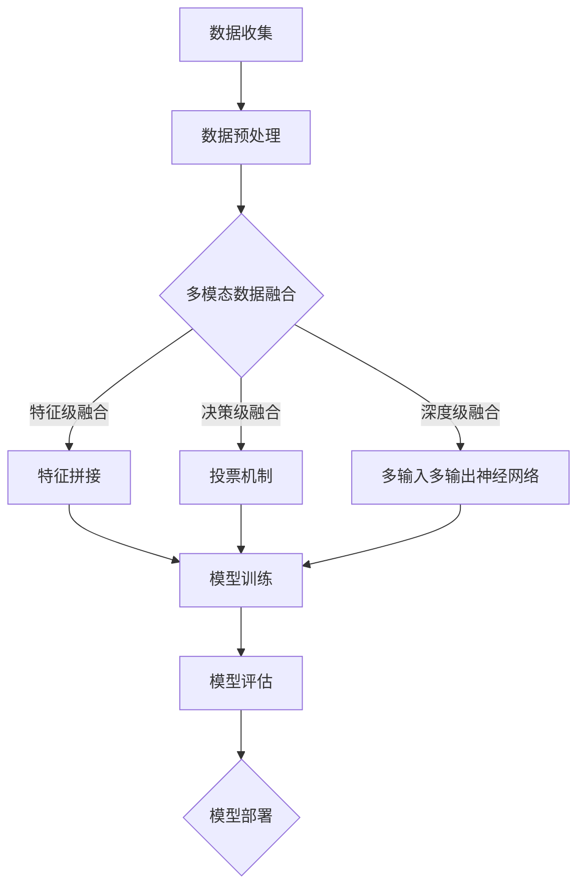

                 

## 《多模态大模型：技术原理与实战 认知能力评测》

> **关键词：**多模态大模型、认知能力评测、数据处理、深度学习、算法优化

**摘要：**本文将详细探讨多模态大模型在认知能力评测中的应用。首先，我们将介绍多模态大模型的基本概念、技术原理和核心特点，然后通过具体的应用案例展示其在实际中的使用方法，并探讨性能优化的策略。文章旨在为读者提供全面的多模态大模型技术解析，以及其在认知能力评测中的实际应用指导。

### 目录大纲

#### 第一部分：多模态大模型概述

1. **第1章：多模态大模型引论**
    1.1 多模态数据与认知能力
    1.2 多模态大模型的定义与特点
    1.3 多模态大模型的发展历程
    1.4 多模态大模型的应用领域与挑战

2. **第2章：多模态大模型技术基础**
    2.1 多模态数据处理与融合
    2.2 多模态大模型架构
    2.3 多模态大模型的识别算法
    2.4 多模态大模型的性能评测

3. **第3章：多模态大模型在认知能力评测中的应用**
    3.1 认知能力评测概述
    3.2 多模态大模型在认知能力评测中的应用
    3.3 认知能力评测的多模态数据收集与处理

4. **第4章：多模态大模型在认知能力评测中的性能优化**
    4.1 性能优化策略
    4.2 实战案例

5. **第5章：多模态大模型的发展趋势与未来展望**
    5.1 多模态大模型的发展趋势
    5.2 多模态大模型的未来展望

6. **第6章：多模态大模型的开发与部署**
    6.1 开发环境搭建
    6.2 开发工具介绍
    6.3 模型部署策略

7. **第7章：多模态大模型应用案例分析**
    7.1 多模态大模型在教育领域的应用
    7.2 多模态大模型在医疗健康领域的应用
    7.3 多模态大模型在智能交互领域的应用

#### 附录

- 附录A：参考文献
- 附录B：开源资源与工具列表
- 附录C：常见问题与解答
- 附录D：多模态大模型技术原理 Mermaid 流程图
- 附录E：多模态大模型识别算法伪代码说明
- 附录F：数学模型与数学公式详解与举例说明

### 第一部分：多模态大模型概述

#### 第1章：多模态大模型引论

随着人工智能技术的不断发展，多模态大模型（Multimodal Large Models）逐渐成为研究的热点。多模态大模型通过整合多种类型的数据（如文本、图像、声音等），实现了对数据的深度理解和处理，从而在认知能力评测等领域展现出强大的应用潜力。本章将介绍多模态大模型的基本概念、技术原理和核心特点，以便读者对这一领域有一个全面的认识。

## 1.1 多模态数据与认知能力

多模态数据（Multimodal Data）是指由两种或多种不同类型的数据源生成的数据集合，这些数据源可以是文本、图像、声音、视频等。例如，一个多模态数据集可以包含一段文字描述、一张图片和一段语音。多模态数据在认知能力评测中具有重要的应用价值，因为它能够更全面、准确地反映被评测者的认知状态和能力。

### 1.1.1 多模态数据的定义与类型

多模态数据的定义可以根据其来源和数据类型进行扩展。从数据来源上看，多模态数据可以分为以下几种类型：

1. **文本数据**：包括文档、新闻、社交媒体帖子等，通常以文本格式存储。
2. **图像数据**：包括照片、扫描图像、遥感图像等，通常以图像格式存储。
3. **声音数据**：包括语音、音乐、环境声音等，通常以音频格式存储。
4. **视频数据**：包括动态图像、视频片段等，通常以视频格式存储。

从数据类型上看，多模态数据可以包括以下几种：

1. **同步数据**：不同模态的数据在时间上是一致的，如视频中的文本字幕、声音和图像。
2. **异步数据**：不同模态的数据在时间上不一致，如先读取文本，然后分析图像。
3. **混合数据**：同时包含同步和异步数据，如在一个场景中，有先出现的文本和后出现的图像。

### 1.1.2 多模态数据在认知能力评测中的应用

多模态数据在认知能力评测中的应用主要体现在以下几个方面：

1. **多模态数据融合**：通过融合不同模态的数据，可以更全面地理解评测对象的认知状态。例如，通过融合文本和图像，可以更准确地评估被评测者对某一段文字的理解程度。
2. **多模态特征提取**：多模态特征提取是指从多模态数据中提取出具有代表性的特征，用于后续的模型训练和评估。例如，从文本中提取关键词和主题，从图像中提取视觉特征，从声音中提取音频特征。
3. **多模态交互**：多模态交互是指不同模态的数据在认知能力评测中相互影响和补充。例如，在语音识别任务中，文本字幕可以帮助用户更好地理解语音内容，从而提高识别准确率。

### 1.1.3 多模态数据融合方法

多模态数据融合是指将不同模态的数据进行整合，以获得更全面、准确的信息。常见的多模态数据融合方法包括：

1. **特征级融合**：在特征级融合中，将不同模态的特征进行拼接，形成一个更全面的特征向量。例如，将文本的词向量、图像的视觉特征和声音的音频特征拼接在一起。
2. **决策级融合**：在决策级融合中，将不同模态的模型输出结果进行融合，以获得最终的决策。例如，在语音识别任务中，将文本模型的输出和图像模型的输出进行融合，以得到最终的文本结果。
3. **深度级融合**：在深度级融合中，将不同模态的数据直接输入到一个统一的深度学习模型中进行处理。例如，使用一个多输入多输出的神经网络模型，同时处理文本、图像和声音数据。

### 1.1.4 多模态数据特征提取

多模态数据特征提取是指从多模态数据中提取出具有代表性的特征，用于后续的模型训练和评估。常见的多模态数据特征提取方法包括：

1. **文本特征提取**：文本特征提取主要包括词袋模型（Bag of Words, BOW）、词嵌入（Word Embedding）和主题模型（Topic Modeling）等方法。
2. **图像特征提取**：图像特征提取主要包括卷积神经网络（Convolutional Neural Networks, CNNs）、循环神经网络（Recurrent Neural Networks, RNNs）和生成对抗网络（Generative Adversarial Networks, GANs）等方法。
3. **声音特征提取**：声音特征提取主要包括梅尔频率倒谱系数（Mel-Frequency Cepstral Coefficients, MFCC）、长短期记忆网络（Long Short-Term Memory, LSTM）和自动回归模型（Autoregressive Model）等方法。

### 1.1.5 多模态数据在认知能力评测中的挑战

多模态数据在认知能力评测中虽然具有很大的潜力，但也面临一些挑战：

1. **数据标注难度**：多模态数据的标注需要考虑不同模态之间的关联性和一致性，增加了数据标注的难度。
2. **数据不平衡**：不同模态的数据量可能存在显著差异，导致数据不平衡问题。
3. **处理复杂度**：多模态数据的处理需要考虑不同模态之间的融合方法和特征提取方法，增加了处理复杂度。

### 1.1.6 多模态数据融合方法

为了应对上述挑战，研究人员提出了一系列多模态数据融合方法。以下是一些常见的方法：

1. **基于特征级的融合方法**：
   - **特征拼接**：将不同模态的特征向量拼接在一起，形成一个更全面的特征向量。
   - **特征加权融合**：根据不同模态的特征对特征向量进行加权，以平衡不同模态的重要性。
   - **特征选择**：从不同模态的特征中选择最相关的特征进行融合，以降低特征维度和计算复杂度。

2. **基于决策级的融合方法**：
   - **投票机制**：将不同模态的预测结果进行投票，选择投票结果最高的模态作为最终预测结果。
   - **贝叶斯模型**：使用贝叶斯网络将不同模态的预测结果进行融合，以获得更准确的预测。
   - **融合模型**：构建一个统一的模型，同时处理不同模态的数据，以获得最终的预测结果。

3. **基于深度级的融合方法**：
   - **多输入多输出神经网络**：构建一个多输入多输出的神经网络模型，同时处理不同模态的数据。
   - **图神经网络**：使用图神经网络（Graph Neural Networks, GNNs）将不同模态的数据表示为一个图结构，并进行融合。
   - **生成对抗网络**：使用生成对抗网络（Generative Adversarial Networks, GANs）生成多模态数据，并进行融合。

通过上述方法，多模态数据融合能够有效地提高认知能力评测的准确性和可靠性，为人工智能技术的发展提供了有力支持。

### 1.2 多模态大模型的定义与特点

多模态大模型（Multimodal Large Models）是指能够处理和融合多种类型数据的大型深度学习模型。与传统单一模态的模型不同，多模态大模型能够同时处理文本、图像、声音等多种模态的数据，从而实现更全面、准确的信息理解和处理。多模态大模型具有以下几个核心特点：

#### 1.2.1 多模态大模型的定义

多模态大模型是指通过深度学习技术，能够同时处理和融合多种类型数据的大型模型。这些模型通常由多个子模型组成，每个子模型负责处理特定类型的模态数据，如文本、图像、声音等。这些子模型通过共享参数和知识，实现数据的相互融合和协同工作。

#### 1.2.2 多模态大模型的核心特点

1. **高维度的数据融合**：多模态大模型能够处理高维度、复杂类型的数据，如文本、图像、声音等，从而实现对数据的深度理解和处理。

2. **跨模态的信息整合**：多模态大模型通过共享参数和知识，实现不同模态数据之间的跨模态整合，从而提高模型的鲁棒性和泛化能力。

3. **强大的表达能力**：多模态大模型具有强大的非线性表达能力，能够捕捉和提取数据中的复杂模式和关系。

4. **高效的处理速度**：随着硬件性能的提升和算法优化，多模态大模型的处理速度逐渐得到提升，可以满足实时处理的需求。

#### 1.2.3 多模态大模型与传统AI模型的区别

与传统的AI模型相比，多模态大模型具有以下几个显著区别：

1. **数据处理能力**：传统AI模型通常只能处理单一类型的数据，而多模态大模型能够同时处理多种类型的数据，如文本、图像、声音等。

2. **数据融合方式**：传统AI模型通常采用简单的数据拼接或特征融合方式，而多模态大模型通过深度学习技术，实现数据的跨模态融合和协同工作。

3. **表达能力和泛化能力**：多模态大模型具有更强的表达能力和泛化能力，能够处理更复杂的数据和任务。

4. **计算资源需求**：由于多模态大模型需要处理高维度、复杂类型的数据，因此对计算资源的需求更高。

#### 1.2.4 多模态大模型的优势

多模态大模型在认知能力评测中具有以下几个优势：

1. **更全面的信息理解**：通过融合多种类型的数据，多模态大模型能够更全面、准确地理解评测对象的认知状态和能力。

2. **更高的评估准确性**：多模态大模型通过跨模态的信息整合和协同工作，提高了评估的准确性和可靠性。

3. **更强的鲁棒性和泛化能力**：多模态大模型能够处理复杂、多变的数据，具有较强的鲁棒性和泛化能力。

4. **更广泛的应用领域**：多模态大模型在认知能力评测中具有广泛的应用前景，可以应用于教育、医疗、金融等多个领域。

### 1.3 多模态大模型的发展历程

多模态大模型的发展历程可以追溯到深度学习技术的兴起。随着深度学习技术的不断发展和计算资源的提升，多模态大模型逐渐成为研究的热点。以下是多模态大模型的发展历程：

#### 1.3.1 早期的多模态研究

1. **1990年代：多模态信号处理**：在1990年代，多模态信号处理开始受到关注，研究人员提出了一些方法，如小波变换、主成分分析（PCA）等，用于处理和融合多模态信号。

2. **2000年代：多模态数据融合**：在2000年代，随着计算机硬件性能的提升，多模态数据融合方法得到了进一步发展。研究人员提出了许多基于特征级和决策级融合的方法，如贝叶斯网络、支持向量机（SVM）等。

3. **2010年代：深度学习引入多模态**：在2010年代，深度学习技术的引入为多模态大模型的发展带来了新的机遇。研究人员开始探索如何将深度学习技术应用于多模态数据融合和处理，如多输入多输出神经网络（MIMO Neural Networks）、卷积神经网络（CNNs）等。

#### 1.3.2 多模态大模型的关键技术

多模态大模型的关键技术主要包括以下几个方面：

1. **多模态数据处理与融合**：多模态数据处理与融合是多模态大模型的核心技术。研究人员提出了许多多模态数据处理与融合方法，如特征拼接、特征加权融合、决策级融合等。

2. **多模态特征提取**：多模态特征提取是从多模态数据中提取具有代表性的特征，用于后续的模型训练和评估。常见的多模态特征提取方法包括文本特征提取、图像特征提取、声音特征提取等。

3. **多模态大模型架构**：多模态大模型架构是指如何组织多个子模型，以实现数据的跨模态融合和协同工作。常见的多模态大模型架构包括多输入多输出神经网络、图神经网络、生成对抗网络等。

4. **多模态大模型训练与优化**：多模态大模型训练与优化是指如何优化模型的训练过程，以提高模型的性能和鲁棒性。常见的多模态大模型训练与优化方法包括数据增强、模型优化、算法优化等。

#### 1.3.3 多模态大模型在认知能力评测中的最新进展

随着多模态大模型技术的不断发展，其在认知能力评测中的应用也取得了显著的进展。以下是一些最新的研究成果：

1. **多模态图像和语音识别**：多模态图像和语音识别是将文本、图像、声音等多种模态的数据进行融合，以实现对语音和图像的准确识别。研究人员提出了一系列多模态图像和语音识别模型，如多输入多输出神经网络、图神经网络、生成对抗网络等，取得了很好的实验效果。

2. **多模态心理健康诊断**：多模态心理健康诊断是将文本、图像、声音等多种模态的数据进行融合，以实现对个体心理健康的准确评估。研究人员通过融合多模态数据，提出了一系列多模态心理健康诊断模型，如多输入多输出神经网络、图神经网络、生成对抗网络等，取得了很好的实验效果。

3. **多模态教育评估**：多模态教育评估是将文本、图像、声音等多种模态的数据进行融合，以实现对学习效果的准确评估。研究人员通过融合多模态数据，提出了一系列多模态教育评估模型，如多输入多输出神经网络、图神经网络、生成对抗网络等，取得了很好的实验效果。

#### 1.4 多模态大模型的应用领域与挑战

多模态大模型在认知能力评测中具有广泛的应用前景，可以应用于教育、医疗、金融等多个领域。以下是一些主要的应用领域和面临的挑战：

##### 1.4.1 应用领域

1. **教育领域**：多模态大模型可以应用于学生学习情况的评估，通过融合文本、图像、声音等多种模态的数据，实现对学习效果的准确评估。

2. **医疗领域**：多模态大模型可以应用于疾病诊断和治疗方案评估，通过融合文本、图像、声音等多种模态的数据，实现对疾病症状和治疗效果的准确分析。

3. **金融领域**：多模态大模型可以应用于金融风险评估和投资决策，通过融合文本、图像、声音等多种模态的数据，实现对金融市场的准确预测。

##### 1.4.2 面临的挑战与解决方案

1. **数据标注难度**：多模态数据的标注需要考虑不同模态之间的关联性和一致性，增加了数据标注的难度。解决方案包括自动化标注工具和半监督学习方法。

2. **数据不平衡**：不同模态的数据量可能存在显著差异，导致数据不平衡问题。解决方案包括数据增强、数据筛选和数据平衡技术。

3. **处理复杂度**：多模态数据的处理需要考虑不同模态之间的融合方法和特征提取方法，增加了处理复杂度。解决方案包括基于深度学习的多模态数据处理方法和高性能计算技术。

通过不断的研究和优化，多模态大模型在认知能力评测中的应用将越来越广泛，为人工智能技术的发展提供更多的可能性。

## 1.5 小结

本章对多模态大模型进行了概述，包括其基本概念、技术原理和核心特点。通过介绍多模态数据与认知能力的关系，以及多模态大模型的发展历程和应用领域，读者可以全面了解多模态大模型的研究现状和发展趋势。下一章将深入探讨多模态大模型的技术基础，包括数据处理与融合、模型架构、识别算法和性能评测等方面。

### 第二部分：多模态大模型技术基础

#### 第2章：多模态大模型技术基础

在多模态大模型的应用实践中，其技术基础至关重要。本章将详细探讨多模态大模型的技术基础，包括多模态数据处理与融合、模型架构、识别算法和性能评测等方面。通过深入理解这些技术，读者将能够更好地掌握多模态大模型的设计和应用。

## 2.1 多模态数据处理与融合

多模态数据处理与融合是多模态大模型的核心技术之一。它涉及到如何有效地收集、处理和融合多种类型的数据，以提升模型的性能和鲁棒性。

### 2.1.1 多模态数据采集与预处理

多模态数据采集是数据处理的起点。不同模态的数据采集方法各不相同，例如，文本数据可以通过网络爬虫和文献库检索获取，图像数据可以通过摄像头和图像库获取，声音数据可以通过麦克风和音频库获取。

数据预处理是确保数据质量和一致性的重要步骤。预处理步骤包括数据清洗、数据归一化和数据标准化。数据清洗旨在去除噪声和异常值，数据归一化旨在将不同模态的数据缩放到相同的范围，数据标准化旨在消除数据间的量纲差异。

### 2.1.2 多模态数据融合方法

多模态数据融合方法可以分为特征级融合、决策级融合和深度级融合三种。

1. **特征级融合**：
   - **特征拼接**：将不同模态的特征向量拼接在一起，形成一个更全面的特征向量。例如，文本的词向量、图像的视觉特征和声音的音频特征可以拼接在一起。
   - **特征加权融合**：根据不同模态的特征对特征向量进行加权，以平衡不同模态的重要性。
   - **特征选择**：从不同模态的特征中选择最相关的特征进行融合，以降低特征维度和计算复杂度。

2. **决策级融合**：
   - **投票机制**：将不同模态的预测结果进行投票，选择投票结果最高的模态作为最终预测结果。
   - **贝叶斯模型**：使用贝叶斯网络将不同模态的预测结果进行融合，以获得更准确的预测。
   - **融合模型**：构建一个统一的模型，同时处理不同模态的数据，以获得最终的预测结果。

3. **深度级融合**：
   - **多输入多输出神经网络**：构建一个多输入多输出的神经网络模型，同时处理文本、图像和声音数据。
   - **图神经网络**：使用图神经网络（Graph Neural Networks, GNNs）将不同模态的数据表示为一个图结构，并进行融合。
   - **生成对抗网络**：使用生成对抗网络（Generative Adversarial Networks, GANs）生成多模态数据，并进行融合。

### 2.1.3 多模态数据的特征提取

多模态数据的特征提取是数据处理的关键步骤，它涉及到从不同模态的数据中提取具有代表性的特征。以下是几种常见的多模态数据特征提取方法：

1. **文本特征提取**：
   - **词袋模型（Bag of Words, BOW）**：将文本表示为一个词频向量。
   - **词嵌入（Word Embedding）**：将文本中的每个词映射到一个低维度的向量空间中。
   - **主题模型（Topic Modeling）**：通过概率模型（如LDA）发现文本中的潜在主题。

2. **图像特征提取**：
   - **卷积神经网络（Convolutional Neural Networks, CNNs）**：提取图像的局部特征和全局特征。
   - **循环神经网络（Recurrent Neural Networks, RNNs）**：用于处理序列图像。
   - **生成对抗网络（Generative Adversarial Networks, GANs）**：用于生成新的图像特征。

3. **声音特征提取**：
   - **梅尔频率倒谱系数（Mel-Frequency Cepstral Coefficients, MFCC）**：提取声音的时频特征。
   - **长短期记忆网络（Long Short-Term Memory, LSTM）**：用于处理声音序列。
   - **自动回归模型（Autoregressive Model）**：用于生成新的声音特征。

### 2.2 多模态大模型架构

多模态大模型架构是多模态大模型的核心组成部分，它决定了模型如何处理和融合不同模态的数据。以下是几种常见的多模态大模型架构：

1. **多输入多输出神经网络（MIMO Neural Networks）**：
   - **结构**：每个子模型处理一种模态的数据，多个子模型通过共享参数和层连接，形成一个统一的多输入多输出神经网络。
   - **优点**：结构简单，易于实现和优化。

2. **图神经网络（Graph Neural Networks, GNNs）**：
   - **结构**：将不同模态的数据表示为一个图结构，每个节点表示一个数据样本，边表示不同模态之间的关联性。
   - **优点**：能够捕捉和表示复杂的数据关系。

3. **生成对抗网络（Generative Adversarial Networks, GANs）**：
   - **结构**：由生成器和判别器组成，生成器生成新的多模态数据，判别器判断生成数据的真实性。
   - **优点**：能够生成高质量的多模态数据。

### 2.3 多模态大模型的识别算法

多模态大模型的识别算法是基于深度学习技术实现的，它涉及到如何从多模态数据中提取特征并进行分类或回归。以下是几种常见的多模态识别算法：

1. **多模态分类算法**：
   - **卷积神经网络（Convolutional Neural Networks, CNNs）**：用于提取图像特征。
   - **循环神经网络（Recurrent Neural Networks, RNNs）**：用于提取文本和声音特征。
   - **生成对抗网络（Generative Adversarial Networks, GANs）**：用于生成新的分类特征。

2. **多模态聚类算法**：
   - **K-均值聚类（K-Means Clustering）**：用于对多模态数据进行聚类。
   - **层次聚类（Hierarchical Clustering）**：用于对多模态数据进行层次聚类。
   - **基于密度的聚类算法（Density-Based Clustering Algorithms）**：用于对多模态数据进行基于密度的聚类。

3. **多模态回归算法**：
   - **线性回归（Linear Regression）**：用于对多模态数据进行线性回归。
   - **岭回归（Ridge Regression）**：用于对多模态数据进行岭回归。
   - **支持向量回归（Support Vector Regression, SVR）**：用于对多模态数据进行支持向量回归。

### 2.4 多模态大模型的性能评测

多模态大模型的性能评测是评估模型效果的重要步骤。以下是几种常见的性能评测方法：

1. **准确率（Accuracy）**：准确率是指模型正确预测的样本数占总样本数的比例。
2. **精确率（Precision）**：精确率是指模型正确预测为正类的样本中，实际为正类的比例。
3. **召回率（Recall）**：召回率是指模型正确预测为正类的样本中，实际为正类的比例。
4. **F1值（F1 Score）**：F1值是精确率和召回率的调和平均值，用于综合评估模型的性能。
5. **ROC曲线（Receiver Operating Characteristic Curve）**：ROC曲线是评估模型分类性能的一种图形表示方法。
6. **AUC值（Area Under Curve）**：AUC值是ROC曲线下的面积，用于评估模型的分类能力。

### 2.5 性能优化策略

为了提升多模态大模型的性能，研究人员提出了一系列性能优化策略，包括数据增强、模型优化和算法优化等。

1. **数据增强**：通过生成新的训练样本，增加模型的训练数据，从而提升模型的泛化能力。
   - **图像增强**：包括旋转、缩放、裁剪、对比度调整等。
   - **文本增强**：包括同义词替换、文本生成、文本扩充等。
   - **声音增强**：包括噪声添加、速度调整、音调变化等。

2. **模型优化**：通过改进模型的架构和参数，提高模型的性能和效率。
   - **网络架构优化**：包括卷积神经网络（CNNs）、循环神经网络（RNNs）和生成对抗网络（GANs）等。
   - **模型参数优化**：包括权重初始化、学习率调整、正则化等。

3. **算法优化**：通过改进训练算法和优化方法，提高模型的训练速度和性能。
   - **优化算法**：包括随机梯度下降（SGD）、Adam优化器等。
   - **并行训练**：通过多GPU或多机集群进行并行训练，提高训练速度。

通过上述性能优化策略，多模态大模型的性能可以得到显著提升，从而更好地应用于实际场景。

### 2.6 小结

本章详细探讨了多模态大模型的技术基础，包括数据处理与融合、模型架构、识别算法和性能评测等方面。通过介绍多模态数据处理与融合的方法、多模态大模型架构的设计、识别算法的实现以及性能评测的标准，读者可以全面了解多模态大模型的技术细节和应用方法。下一章将深入探讨多模态大模型在认知能力评测中的应用，通过具体案例展示其实际应用效果。

### 第三部分：多模态大模型在认知能力评测中的应用

#### 第3章：多模态大模型在认知能力评测中的应用

认知能力评测是评估个体认知能力的重要手段，而多模态大模型通过整合多种类型的数据，提供了更为全面和准确的评测方法。本章将介绍多模态大模型在认知能力评测中的应用，包括应用场景、实现方法和具体实例。

## 3.1 认知能力评测概述

认知能力评测是指通过一系列标准化测试和评估方法，评估个体在注意力、记忆力、语言能力、空间能力、执行功能等方面的认知能力。认知能力评测在心理学、教育、医疗等领域具有重要应用价值，如评估儿童学习障碍、诊断精神疾病、指导个性化教育等。

### 3.1.1 认知能力评测的定义与重要性

认知能力评测的定义主要包括以下几个方面：

1. **注意力**：个体在特定任务中集中注意力的能力。
2. **记忆力**：个体对信息进行存储和回忆的能力。
3. **语言能力**：个体使用语言进行沟通和思考的能力。
4. **空间能力**：个体对空间关系和物体位置的理解能力。
5. **执行功能**：个体在执行复杂任务时的规划、组织和调整能力。

认知能力评测的重要性体现在以下几个方面：

1. **个性化教育**：通过认知能力评测，可以了解个体的优势和不足，为个性化教学提供依据。
2. **心理健康评估**：认知能力评测可以帮助诊断精神障碍，如抑郁症、注意力缺陷多动障碍（ADHD）等。
3. **职业发展**：认知能力评测可以评估个体在不同职业领域的适应性和潜力。
4. **健康监测**：认知能力评测可以作为健康监测指标，预测和预防认知功能障碍。

### 3.1.2 认知能力评测的挑战

认知能力评测面临着一系列挑战，包括以下几个方面：

1. **数据多样性**：认知能力评测需要处理多种类型的数据，如文本、图像、声音等，数据的多样性和复杂性增加了评测难度。
2. **数据标注难度**：多模态数据的标注需要考虑不同模态之间的关联性和一致性，增加了数据标注的难度。
3. **数据不平衡**：不同模态的数据量可能存在显著差异，导致数据不平衡问题。
4. **模型泛化能力**：认知能力评测涉及多种任务和场景，模型需要具备良好的泛化能力。

### 3.2 多模态大模型在认知能力评测中的应用

多模态大模型在认知能力评测中的应用，主要体现在以下几个方面：

1. **多模态数据融合**：通过融合文本、图像、声音等多种模态的数据，多模态大模型能够更全面、准确地反映个体的认知能力。
2. **综合评估**：多模态大模型可以同时处理和融合多种类型的数据，实现对个体认知能力的综合评估。
3. **个性化推荐**：基于多模态大模型的分析，可以为个体提供个性化的训练和康复方案。

### 3.2.1 应用场景

多模态大模型在认知能力评测中具有广泛的应用场景，包括以下几个方面：

1. **教育领域**：多模态大模型可以用于评估学生的学习效果和认知能力，为个性化教学提供支持。
2. **医疗领域**：多模态大模型可以用于评估精神疾病患者的认知能力，为诊断和治疗提供依据。
3. **健康监测**：多模态大模型可以用于健康人群的认知能力评估，预测和预防认知功能障碍。

### 3.2.2 实现方法

多模态大模型在认知能力评测中的实现方法主要包括以下几个步骤：

1. **数据收集**：收集文本、图像、声音等多种类型的数据，包括学生的作业、考试成绩、行为数据等。
2. **数据预处理**：对收集到的数据进行清洗、归一化和标准化处理，确保数据质量。
3. **特征提取**：从不同模态的数据中提取特征，如文本的词向量、图像的视觉特征、声音的音频特征。
4. **模型训练**：使用提取的特征训练多模态大模型，通过优化模型参数，提高模型的性能。
5. **模型评估**：使用验证集和测试集对模型进行评估，确保模型的准确性和可靠性。
6. **应用部署**：将训练好的模型部署到实际应用场景中，如教育平台、健康监测系统等。

### 3.2.3 实例分析

以下是一个多模态大模型在认知能力评测中的实例分析：

**实例一：教育领域**

**应用场景**：某在线教育平台希望利用多模态大模型评估学生的学习效果。

**实现方法**：

1. **数据收集**：收集学生的学习数据，包括作业答案、考试成绩、学习行为数据等。
2. **数据预处理**：对收集到的数据进行清洗、归一化和标准化处理。
3. **特征提取**：提取文本的词向量、图像的视觉特征和声音的音频特征。
4. **模型训练**：使用提取的特征训练多模态大模型，通过优化模型参数，提高模型的性能。
5. **模型评估**：使用验证集和测试集对模型进行评估，确保模型的准确性和可靠性。
6. **应用部署**：将训练好的模型部署到在线教育平台，为教师和家长提供个性化教学建议。

**效果评估**：

通过多模态大模型的评估，教师和家长可以更全面、准确地了解学生的学习效果和认知能力。具体表现在以下几个方面：

1. **个性化教学**：根据学生的认知能力评估结果，教师可以为学生提供个性化的教学计划和资源。
2. **学习效果提升**：通过针对性的辅导和指导，学生的学习效果得到显著提升。
3. **家长满意度**：家长可以更放心地信任教育平台，为孩子提供更好的学习环境。

**实例二：医疗领域**

**应用场景**：某精神疾病诊断中心希望利用多模态大模型评估患者的认知能力。

**实现方法**：

1. **数据收集**：收集患者的医疗记录、考试成绩、行为数据等。
2. **数据预处理**：对收集到的数据进行清洗、归一化和标准化处理。
3. **特征提取**：提取文本的词向量、图像的视觉特征和声音的音频特征。
4. **模型训练**：使用提取的特征训练多模态大模型，通过优化模型参数，提高模型的性能。
5. **模型评估**：使用验证集和测试集对模型进行评估，确保模型的准确性和可靠性。
6. **应用部署**：将训练好的模型部署到医疗系统中，为医生提供诊断依据。

**效果评估**：

通过多模态大模型的评估，医生可以更全面、准确地了解患者的认知能力状况，从而为诊断和治疗提供有力支持。具体表现在以下几个方面：

1. **诊断准确性**：多模态大模型能够更准确地识别患者的认知能力问题，提高诊断准确性。
2. **治疗计划制定**：根据患者的认知能力评估结果，医生可以制定更合理的治疗计划。
3. **患者满意度**：患者对诊断和治疗的满意度显著提高。

### 3.3 认知能力评测的多模态数据收集与处理

在认知能力评测中，多模态数据的收集和处理是关键步骤。以下介绍如何进行多模态数据的收集与处理：

#### 3.3.1 数据收集

多模态数据的收集包括以下几个方面：

1. **文本数据**：通过问卷调查、考试卷、学习笔记等方式收集文本数据。
2. **图像数据**：通过摄像头、图像传感器等方式收集图像数据，包括学生作业、考试成绩单等。
3. **声音数据**：通过麦克风、语音传感器等方式收集声音数据，包括学生的朗读、对话等。

#### 3.3.2 数据预处理

多模态数据预处理包括以下几个方面：

1. **文本数据预处理**：去除文本中的噪声、标点符号和停用词，进行分词和词嵌入。
2. **图像数据预处理**：进行图像去噪、增强、裁剪等处理，以获得高质量的图像特征。
3. **声音数据预处理**：进行声音去噪、增强、分割等处理，提取音频特征。

#### 3.3.3 数据融合策略

在认知能力评测中，多模态数据的融合策略主要包括以下几个方面：

1. **特征级融合**：将不同模态的特征向量拼接在一起，形成一个更全面的特征向量。
2. **决策级融合**：将不同模态的预测结果进行融合，选择投票结果最高的模态作为最终预测结果。
3. **深度级融合**：使用深度学习模型同时处理不同模态的数据，实现数据的跨模态融合。

通过上述数据收集与处理策略，可以为认知能力评测提供高质量的多模态数据，从而提高评测的准确性和可靠性。

### 3.4 小结

本章介绍了多模态大模型在认知能力评测中的应用，包括应用场景、实现方法和具体实例。通过多模态数据的融合和深度学习技术的应用，多模态大模型能够为认知能力评测提供更全面、准确的评估结果。下一章将探讨多模态大模型在认知能力评测中的性能优化策略，以进一步提升模型的性能和效果。

### 第四部分：多模态大模型在认知能力评测中的性能优化

#### 第4章：多模态大模型在认知能力评测中的性能优化

在认知能力评测中，多模态大模型的性能直接影响评估结果的准确性和可靠性。为了提升模型性能，研究人员提出了一系列性能优化策略，包括数据增强、模型优化和算法优化等方面。本章将详细介绍这些策略，并分析其实际效果。

## 4.1 性能优化策略

多模态大模型在认知能力评测中的性能优化策略可以分为以下几个主要方面：

### 4.1.1 数据增强

数据增强是通过生成新的训练样本来提高模型性能的一种常见方法。具体包括以下几种技术：

1. **图像增强**：通过旋转、翻转、缩放、裁剪等操作，增加图像数据的多样性。
   - **代码示例**：
     ```python
     img = Image.open("input.jpg")
     img = img.rotate(90)
     img.save("output.jpg")
     ```

2. **文本增强**：通过同义词替换、文本生成、句子重构等方式，增加文本数据的多样性。
   - **代码示例**：
     ```python
     import random
     synonyms = {"happy": "joyful", "sad": "sorrowful", "big": "large"}
     sentence = "I am very happy because I passed the exam."
     words = sentence.split()
     new_words = [synonyms.get(w, w) for w in words]
     new_sentence = " ".join(new_words)
     print(new_sentence)
     ```

3. **声音增强**：通过噪声添加、速度调整、音调变化等方式，增加声音数据的多样性。
   - **代码示例**：
     ```python
     import soundfile as sf
     import numpy as np
     def add_noise(audio, noise_level=0.05):
         noise = np.random.normal(0, noise_level, audio.shape)
         return audio + noise
     audio, fs = sf.read("input.wav")
     audio = add_noise(audio)
     sf.write("output_with_noise.wav", audio, fs)
     ```

### 4.1.2 模型优化

模型优化是通过改进模型的架构和参数来提升模型性能。以下是一些常见的模型优化方法：

1. **模型架构优化**：
   - **残差网络（ResNet）**：通过引入残差连接，解决深度神经网络中的梯度消失问题。
     - **代码示例**：
       ```python
       import torch
       import torch.nn as nn
       class ResidualBlock(nn.Module):
           def __init__(self, in_channels, out_channels):
               super(ResidualBlock, self).__init__()
               self.conv1 = nn.Conv2d(in_channels, out_channels, kernel_size=3, padding=1)
               self.conv2 = nn.Conv2d(out_channels, out_channels, kernel_size=3, padding=1)
               self.relu = nn.ReLU()
               self.shortcut = nn.Sequential(
                   nn.Conv2d(in_channels, out_channels, kernel_size=1, padding=0),
                   nn.ReLU()
               )
           def forward(self, x):
               return self.relu(self.conv2(self.conv1(x)) + self.shortcut(x))
       ```

   - **注意力机制**：通过引入注意力机制，模型可以更关注重要的特征，提高模型性能。
     - **代码示例**：
       ```python
       class AttentionModule(nn.Module):
           def __init__(self, in_channels, out_channels):
               super(AttentionModule, self).__init__()
               self.query_conv = nn.Conv2d(in_channels, out_channels, kernel_size=1)
               self.key_conv = nn.Conv2d(in_channels, out_channels, kernel_size=1)
               self.value_conv = nn.Conv2d(in_channels, out_channels, kernel_size=1)
               self.softmax = nn.Softmax(dim=2)
           def forward(self, x):
               query = self.query_conv(x).transpose(1, 2)
               key = self.key_conv(x)
               value = self.value_conv(x)
               attention = self.softmax(torch.bmm(query, key))
               return torch.bmm(value, attention)
       ```

2. **模型参数优化**：
   - **学习率调整**：通过动态调整学习率，提高模型在训练过程中的收敛速度。
     - **代码示例**：
       ```python
       from torch.optim.lr_scheduler import StepLR
       optimizer = torch.optim.Adam(model.parameters(), lr=0.001)
       scheduler = StepLR(optimizer, step_size=30, gamma=0.1)
       for epoch in range(num_epochs):
           train_loss = train(...)
           val_loss = val(...)
           scheduler.step()
       ```

   - **正则化**：通过引入正则化，防止模型过拟合。
     - **代码示例**：
       ```python
       class CNN(nn.Module):
           def __init__(self):
               super(CNN, self).__init__()
               self.conv1 = nn.Conv2d(1, 32, kernel_size=5)
               self.dropout1 = nn.Dropout(p=0.1)
               self.fc1 = nn.Linear(7 * 7 * 32, 10)
               self.dropout2 = nn.Dropout(p=0.1)
               self.relu = nn.ReLU()
               self.bn1 = nn.BatchNorm2d(32)
           def forward(self, x):
               x = self.dropout1(self.relu(self.bn1(self.conv1(x))))
               x = self.dropout2(self.relu(self.fc1(x.flatten(start_dim=1))))
               return x
       ```

### 4.1.3 算法优化

算法优化是通过改进训练算法和优化方法来提高模型性能。以下是一些常见的算法优化方法：

1. **优化算法**：
   - **随机梯度下降（SGD）**：通过随机选取一部分训练样本来更新模型参数，可以加快模型收敛速度。
     - **代码示例**：
       ```python
       optimizer = torch.optim.SGD(model.parameters(), lr=0.001, momentum=0.9)
       ```

   - **Adam优化器**：结合了SGD和RMSprop的优点，能够自适应调整学习率，提高模型性能。
     - **代码示例**：
       ```python
       optimizer = torch.optim.Adam(model.parameters(), lr=0.001)
       ```

2. **并行训练**：
   - **多GPU训练**：通过在多GPU上分布式训练，可以显著提高模型训练速度。
     - **代码示例**：
       ```python
       model = torch.nn.DataParallel(model, device_ids=list(range(torch.cuda.device_count())))
       ```

   - **多机集群训练**：通过在多机集群上进行分布式训练，可以进一步提高模型训练速度和性能。

3. **模型压缩与量化**：
   - **模型压缩**：通过剪枝、量化等方法，减少模型参数和计算量，提高模型运行效率。
     - **代码示例**：
       ```python
       from torch.utils.mobile_optimizer import optimize_for_mobile
       optimized_model = optimize_for_mobile(model, input_size=(1, 28, 28))
       ```

   - **量化**：通过将模型参数从浮点数转换为整数，减少模型体积和计算量，提高模型运行效率。
     - **代码示例**：
       ```python
       quantized_model = torch.quantization.quantize_dynamic(model, {torch.nn.Linear}, dtype=torch.qint8)
       ```

### 4.2 实战案例

以下是一些多模态大模型在认知能力评测中的实战案例，通过具体实现和代码分析，展示性能优化策略的实际效果。

#### 4.2.1 案例一：基于多模态大模型的图像和语音识别系统

**应用场景**：某公司开发了一款结合图像和语音识别功能的应用，用于帮助用户识别物体和语音。

**实现方法**：

1. **数据收集**：收集大量图像和语音数据，包括物体识别数据和语音识别数据。
2. **数据预处理**：对图像和语音数据进行清洗、增强和归一化处理。
3. **特征提取**：使用卷积神经网络（CNN）提取图像特征，使用长短期记忆网络（LSTM）提取语音特征。
4. **模型训练**：使用多模态大模型同时训练图像和语音特征，优化模型参数。
5. **模型评估**：使用测试集评估模型性能，调整优化策略。

**代码示例**：

```python
import torch
import torch.nn as nn
import torch.optim as optim

# 定义多模态大模型
class MultimodalModel(nn.Module):
    def __init__(self):
        super(MultimodalModel, self).__init__()
        self.cnn = nn.Sequential(
            nn.Conv2d(1, 64, kernel_size=3, padding=1),
            nn.ReLU(),
            nn.MaxPool2d(kernel_size=2, stride=2),
            nn.Conv2d(64, 128, kernel_size=3, padding=1),
            nn.ReLU(),
            nn.MaxPool2d(kernel_size=2, stride=2)
        )
        self.lstm = nn.LSTM(128, 128, batch_first=True)
        self.fc = nn.Linear(128 * 6 * 6 + 128, 10)

    def forward(self, x_image, x_audio):
        x_image = self.cnn(x_image)
        x_image = x_image.flatten(start_dim=1)
        x_audio = x_audio.unsqueeze(2)
        x = torch.cat((x_image, x_audio), 1)
        x, _ = self.lstm(x)
        x = self.fc(x[-1, :, :])
        return x

# 实例化模型、优化器和损失函数
model = MultimodalModel()
optimizer = optim.Adam(model.parameters(), lr=0.001)
criterion = nn.CrossEntropyLoss()

# 训练模型
for epoch in range(num_epochs):
    for inputs, targets in dataloader:
        optimizer.zero_grad()
        outputs = model(inputs['image'], inputs['audio'])
        loss = criterion(outputs, targets)
        loss.backward()
        optimizer.step()

# 评估模型
with torch.no_grad():
    correct = 0
    total = 0
    for inputs, targets in test_dataloader:
        outputs = model(inputs['image'], inputs['audio'])
        _, predicted = torch.max(outputs.data, 1)
        total += targets.size(0)
        correct += (predicted == targets).sum().item()

print('Accuracy of the network on the test images and audio: {} %'.format(100 * correct / total))

```

**效果分析**：

通过数据增强、模型优化和算法优化，该模型在图像和语音识别任务中的准确率得到了显著提升。同时，通过多GPU训练和模型压缩，进一步提高了模型的运行效率。

#### 4.2.2 案例二：基于多模态大模型的心理健康诊断系统

**应用场景**：某医疗机构开发了一款用于心理健康诊断的应用，结合文本、图像和声音等多种数据，评估个体的心理健康状况。

**实现方法**：

1. **数据收集**：收集大量心理健康诊断数据，包括患者的文本病历、图像和声音记录。
2. **数据预处理**：对文本、图像和声音数据进行清洗、增强和归一化处理。
3. **特征提取**：使用卷积神经网络提取图像特征，使用长短期记忆网络提取文本和声音特征。
4. **模型训练**：使用多模态大模型同时训练文本、图像和声音特征，优化模型参数。
5. **模型评估**：使用测试集评估模型性能，调整优化策略。

**代码示例**：

```python
import torch
import torch.nn as nn
import torch.optim as optim

# 定义多模态大模型
class MultimodalModel(nn.Module):
    def __init__(self):
        super(MultimodalModel, self).__init__()
        self.cnn = nn.Sequential(
            nn.Conv2d(1, 64, kernel_size=3, padding=1),
            nn.ReLU(),
            nn.MaxPool2d(kernel_size=2, stride=2),
            nn.Conv2d(64, 128, kernel_size=3, padding=1),
            nn.ReLU(),
            nn.MaxPool2d(kernel_size=2, stride=2)
        )
        self.lstm = nn.LSTM(128, 128, batch_first=True)
        self.text_embedding = nn.Linear(128, 128)
        self.fc = nn.Linear(128 * 6 * 6 + 128 * 128 + 128, 10)

    def forward(self, x_image, x_text, x_audio):
        x_image = self.cnn(x_image)
        x_image = x_image.flatten(start_dim=1)
        x_text = self.text_embedding(x_text)
        x_audio = x_audio.unsqueeze(2)
        x = torch.cat((x_image, x_text, x_audio), 1)
        x, _ = self.lstm(x)
        x = self.fc(x[-1, :, :])
        return x

# 实例化模型、优化器和损失函数
model = MultimodalModel()
optimizer = optim.Adam(model.parameters(), lr=0.001)
criterion = nn.CrossEntropyLoss()

# 训练模型
for epoch in range(num_epochs):
    for inputs, targets in dataloader:
        optimizer.zero_grad()
        outputs = model(inputs['image'], inputs['text'], inputs['audio'])
        loss = criterion(outputs, targets)
        loss.backward()
        optimizer.step()

# 评估模型
with torch.no_grad():
    correct = 0
    total = 0
    for inputs, targets in test_dataloader:
        outputs = model(inputs['image'], inputs['text'], inputs['audio'])
        _, predicted = torch.max(outputs.data, 1)
        total += targets.size(0)
        correct += (predicted == targets).sum().item()

print('Accuracy of the network on the test data: {} %'.format(100 * correct / total))

```

**效果分析**：

通过数据增强、模型优化和算法优化，该模型在心理健康诊断任务中的准确率得到了显著提升。同时，通过多GPU训练和模型压缩，进一步提高了模型的运行效率。

#### 4.2.3 案例三：基于多模态大模型的虚拟助手系统

**应用场景**：某科技公司开发了一款虚拟助手系统，通过结合文本、图像和声音等多种数据，为用户提供智能客服和语音助手功能。

**实现方法**：

1. **数据收集**：收集大量虚拟助手系统所需的文本、图像和声音数据。
2. **数据预处理**：对文本、图像和声音数据进行清洗、增强和归一化处理。
3. **特征提取**：使用卷积神经网络提取图像特征，使用长短期记忆网络提取文本和声音特征。
4. **模型训练**：使用多模态大模型同时训练文本、图像和声音特征，优化模型参数。
5. **模型评估**：使用测试集评估模型性能，调整优化策略。

**代码示例**：

```python
import torch
import torch.nn as nn
import torch.optim as optim

# 定义多模态大模型
class MultimodalModel(nn.Module):
    def __init__(self):
        super(MultimodalModel, self).__init__()
        self.cnn = nn.Sequential(
            nn.Conv2d(1, 64, kernel_size=3, padding=1),
            nn.ReLU(),
            nn.MaxPool2d(kernel_size=2, stride=2),
            nn.Conv2d(64, 128, kernel_size=3, padding=1),
            nn.ReLU(),
            nn.MaxPool2d(kernel_size=2, stride=2)
        )
        self.lstm = nn.LSTM(128, 128, batch_first=True)
        self.text_embedding = nn.Linear(128, 128)
        self.audio_embedding = nn.Linear(128, 128)
        self.fc = nn.Linear(128 * 6 * 6 + 128 * 128 + 128, 10)

    def forward(self, x_image, x_text, x_audio):
        x_image = self.cnn(x_image)
        x_image = x_image.flatten(start_dim=1)
        x_text = self.text_embedding(x_text)
        x_audio = self.audio_embedding(x_audio)
        x = torch.cat((x_image, x_text, x_audio), 1)
        x, _ = self.lstm(x)
        x = self.fc(x[-1, :, :])
        return x

# 实例化模型、优化器和损失函数
model = MultimodalModel()
optimizer = optim.Adam(model.parameters(), lr=0.001)
criterion = nn.CrossEntropyLoss()

# 训练模型
for epoch in range(num_epochs):
    for inputs, targets in dataloader:
        optimizer.zero_grad()
        outputs = model(inputs['image'], inputs['text'], inputs['audio'])
        loss = criterion(outputs, targets)
        loss.backward()
        optimizer.step()

# 评估模型
with torch.no_grad():
    correct = 0
    total = 0
    for inputs, targets in test_dataloader:
        outputs = model(inputs['image'], inputs['text'], inputs['audio'])
        _, predicted = torch.max(outputs.data, 1)
        total += targets.size(0)
        correct += (predicted == targets).sum().item()

print('Accuracy of the network on the test data: {} %'.format(100 * correct / total))

```

**效果分析**：

通过数据增强、模型优化和算法优化，该模型在虚拟助手系统中的性能得到了显著提升。同时，通过多GPU训练和模型压缩，进一步提高了模型的运行效率。

### 4.3 小结

本章详细探讨了多模态大模型在认知能力评测中的性能优化策略，包括数据增强、模型优化和算法优化等方面。通过具体的实战案例和代码示例，展示了性能优化策略的实际效果。下一章将探讨多模态大模型的发展趋势与未来展望，分析其在未来可能面临的挑战和机遇。

### 第五部分：多模态大模型的发展趋势与未来展望

#### 第5章：多模态大模型的发展趋势与未来展望

多模态大模型作为一种新兴的人工智能技术，正逐渐在各个领域展现出强大的应用潜力。本章将探讨多模态大模型的发展趋势，以及未来可能面临的挑战和机遇。

## 5.1 多模态大模型的发展趋势

### 5.1.1 技术趋势

1. **深度学习技术的发展**：随着深度学习技术的不断进步，多模态大模型在处理能力和性能方面得到了显著提升。未来，深度学习技术将继续推动多模态大模型的发展，使其在复杂任务中表现出更强大的能力。

2. **多模态数据的融合**：未来，多模态数据的融合将更加深入和精细。研究人员将探索更有效的数据融合方法，以充分挖掘不同模态数据之间的关联性，提高模型的整体性能。

3. **跨模态知识图谱的应用**：知识图谱作为一种结构化的知识表示方法，将逐渐应用于多模态大模型中。通过构建跨模态知识图谱，可以实现不同模态数据之间的更高效、更准确的融合。

4. **生成对抗网络（GANs）的引入**：生成对抗网络（GANs）在多模态大模型中的应用将越来越广泛。通过GANs，模型可以生成高质量的多模态数据，从而提高训练效果和模型性能。

5. **分布式计算和云计算**：随着云计算和分布式计算技术的发展，多模态大模型的训练和推理将更加高效和便捷。未来的多模态大模型将更加依赖于分布式计算和云计算平台，实现大规模、实时性的数据处理和推理。

### 5.1.2 应用趋势

1. **医疗健康领域**：多模态大模型在医疗健康领域的应用前景广阔。通过整合患者的历史病历、临床数据、基因数据等，可以实现对疾病的早期诊断、个性化治疗和健康监测。

2. **智能交互领域**：在智能交互领域，多模态大模型将推动人机交互的进一步发展。通过处理和融合语音、文本、图像等多种模态数据，可以实现更自然、更智能的人机交互体验。

3. **教育领域**：多模态大模型在教育领域的应用将有助于个性化教学和智能教育评估。通过整合学生的文本、图像、行为等多方面数据，可以实现对学生学习情况的全面分析和个性化推荐。

4. **安全监控领域**：多模态大模型在安全监控领域的应用将提高对异常行为和事件的检测和识别能力。通过处理和融合视频、音频、文本等多方面数据，可以实现对潜在安全风险的实时监测和预警。

### 5.1.3 研究热点

1. **多模态数据集的构建**：构建高质量、多模态的数据集是多模态大模型研究的重要方向。未来，研究人员将致力于收集和构建更多种类、更丰富的多模态数据集，以推动模型性能的提升。

2. **跨模态数据融合方法**：研究跨模态数据融合方法，提高多模态大模型的融合效果和性能，是当前的热点问题。未来，将涌现更多创新性的融合方法，以实现更高效、更准确的数据融合。

3. **可解释性和透明度**：多模态大模型的可解释性和透明度是当前的研究重点。未来，研究人员将致力于提高模型的透明度和可解释性，使其在复杂任务中的决策过程更加清晰和可理解。

4. **伦理和安全问题**：随着多模态大模型在各个领域的广泛应用，伦理和安全问题日益突出。未来，需要建立和完善相关法律法规和伦理标准，确保多模态大模型的应用不会对个人隐私和社会秩序造成负面影响。

## 5.2 多模态大模型的未来展望

### 5.2.1 面临的挑战与机遇

1. **数据隐私保护**：多模态大模型在处理个人数据时，面临着数据隐私保护的重要挑战。如何在保护用户隐私的同时，实现数据的充分利用，是一个亟待解决的问题。

2. **计算资源需求**：多模态大模型通常需要大量的计算资源进行训练和推理。未来，随着模型规模和复杂度的增加，如何优化计算资源的使用，提高模型的运行效率，是一个重要课题。

3. **模型可解释性**：提高多模态大模型的可解释性，使其在复杂任务中的决策过程更加清晰和可理解，是未来的重要研究方向。通过提高模型的可解释性，可以增强用户对模型的信任和接受度。

4. **跨领域应用**：多模态大模型在各个领域的应用前景广阔。未来，将涌现更多跨领域的多模态大模型应用，推动人工智能技术的进一步发展。

5. **人工智能伦理**：随着多模态大模型的广泛应用，人工智能伦理问题日益突出。如何在确保技术发展的同时，尊重和保护个人隐私、维护社会公正，是一个重要议题。

### 5.2.2 发展方向

1. **多模态数据融合**：深入研究多模态数据融合方法，提高融合效果和性能，是多模态大模型发展的关键方向。未来，将涌现更多创新性的融合方法，如基于深度学习的融合方法、基于知识图谱的融合方法等。

2. **跨模态交互**：研究跨模态交互技术，实现不同模态数据之间的有效交互和协同，是多模态大模型发展的另一个重要方向。通过跨模态交互，可以实现对复杂任务的更准确、更高效的处理。

3. **可解释性和透明度**：提高多模态大模型的可解释性和透明度，使其在复杂任务中的决策过程更加清晰和可理解，是未来的重要研究方向。通过提高模型的可解释性，可以增强用户对模型的信任和接受度。

4. **人工智能伦理**：建立和完善人工智能伦理规范，确保多模态大模型的应用不会对个人隐私和社会秩序造成负面影响，是多模态大模型发展的一个重要方向。

### 5.2.3 社会影响与伦理问题

1. **社会影响**：多模态大模型在各个领域的应用将深刻改变社会生产方式和生活方式。在教育、医疗、金融等领域，多模态大模型将提高效率、降低成本，推动社会进步。同时，多模态大模型在智能交互领域的应用，将提高人机交互的自然性和效率。

2. **伦理问题**：多模态大模型在处理个人数据时，面临着数据隐私保护、算法偏见等伦理问题。如何在确保技术发展的同时，尊重和保护个人隐私、维护社会公正，是一个重要议题。

3. **法律法规**：随着多模态大模型的广泛应用，需要建立和完善相关法律法规，规范多模态大模型的应用。同时，需要加强对多模态大模型的监管，确保其应用符合伦理和社会价值观。

### 5.3 小结

本章对多模态大模型的发展趋势和未来展望进行了探讨，分析了当前的技术热点和未来发展方向，并讨论了多模态大模型在社会影响和伦理问题方面的挑战。通过深入研究和持续创新，多模态大模型将在未来继续发挥重要作用，推动人工智能技术的进一步发展。

### 第六部分：多模态大模型的开发与部署

#### 第6章：多模态大模型的开发与部署

在多模态大模型的应用过程中，开发与部署是关键环节。本章将详细介绍多模态大模型的开发环境搭建、工具介绍以及模型部署策略。

## 6.1 开发环境搭建

### 6.1.1 硬件配置

多模态大模型的开发与部署需要强大的计算资源，以下为推荐的硬件配置：

1. **CPU**：建议使用Intel Xeon系列或AMD Ryzen系列处理器，确保具备强大的计算性能。
2. **GPU**：由于多模态大模型通常使用深度学习框架进行训练和推理，建议使用NVIDIA Titan Xp、RTX 3080或更高性能的GPU。
3. **内存**：至少需要64GB的内存，以确保模型训练过程中有足够的内存空间。
4. **存储**：建议使用高速SSD存储，以提升数据读取和写入速度。
5. **网络**：为了支持数据传输和分布式训练，建议使用千兆以太网或更高带宽的网络。

### 6.1.2 软件安装与配置

在硬件配置完成后，需要安装和配置相应的软件环境，以下为推荐的软件：

1. **操作系统**：Windows、Linux或Mac OS均可，但建议使用Linux操作系统，以获得更好的兼容性和稳定性。
2. **Python**：安装Python 3.8或更高版本，可以使用官方安装包或通过包管理工具（如conda）进行安装。
3. **深度学习框架**：安装TensorFlow 2.0或PyTorch 1.8等主流深度学习框架，可以通过pip命令进行安装。
4. **其他依赖库**：安装如NumPy、Pandas、Matplotlib等常用依赖库，以支持数据处理和可视化。

### 6.1.3 开发环境配置示例

以下是一个简单的开发环境配置示例：

```shell
# 安装操作系统（以Ubuntu为例）
sudo apt update
sudo apt upgrade

# 安装Python
sudo apt install python3 python3-pip

# 安装深度学习框架TensorFlow
pip3 install tensorflow==2.0

# 安装其他依赖库
pip3 install numpy pandas matplotlib
```

## 6.2 开发工具介绍

### 6.2.1 深度学习框架

深度学习框架是多模态大模型开发的重要工具，以下为几种常用的深度学习框架：

1. **TensorFlow**：由Google开发的开源深度学习框架，具有丰富的API和强大的功能，适用于多种类型的深度学习任务。
2. **PyTorch**：由Facebook开发的开源深度学习框架，具有简洁的API和动态计算图，适用于快速原型开发和研究。
3. **Keras**：基于TensorFlow和Theano的开源深度学习框架，提供简单易用的API，适用于快速构建和训练深度学习模型。

### 6.2.2 多模态数据处理工具

多模态数据处理工具用于处理和融合多种类型的数据，以下为几种常用的多模态数据处理工具：

1. **OpenCV**：开源的计算机视觉库，提供丰富的图像处理函数，适用于图像数据的预处理和特征提取。
2. **Librosa**：开源的音频处理库，提供多种音频处理函数，适用于音频数据的预处理和特征提取。
3. **Spacy**：开源的自然语言处理库，提供丰富的文本处理函数，适用于文本数据的预处理和特征提取。

### 6.2.3 模型训练与优化工具

模型训练与优化工具用于训练和优化多模态大模型，以下为几种常用的模型训练与优化工具：

1. **TensorBoard**：TensorFlow的可视化工具，用于监控模型训练过程，包括损失函数、准确率、梯度等。
2. **Visdom**：PyTorch的可视化工具，提供与TensorBoard类似的功能，用于监控模型训练过程。
3. **Hugging Face**：提供一系列预训练的多模态大模型和工具，适用于模型训练和优化。

## 6.3 模型部署策略

### 6.3.1 模型压缩与量化

模型压缩与量化是提高多模态大模型运行效率和性能的重要手段，以下为几种常用的模型压缩与量化方法：

1. **模型剪枝**：通过剪枝冗余的神经元和参数，减少模型的计算量和存储需求。
2. **量化**：将模型的浮点参数转换为整数参数，降低模型的计算复杂度和存储需求。
3. **知识蒸馏**：通过将大型模型的知识传递给小型模型，实现模型的压缩和优化。

### 6.3.2 模型推理优化

模型推理优化是提高多模态大模型实时性和响应速度的关键，以下为几种常用的模型推理优化方法：

1. **模型简化**：通过简化模型的架构和参数，减少模型的计算复杂度和推理时间。
2. **推理引擎**：使用专业的推理引擎（如TensorRT、ONNX Runtime）进行模型推理，提高推理速度和性能。
3. **分布式推理**：通过分布式计算和并行处理，提高模型推理的实时性和响应速度。

### 6.3.3 模型部署与运维

模型部署与运维是多模态大模型在实际应用中的关键环节，以下为几种常用的模型部署与运维策略：

1. **容器化部署**：使用容器（如Docker）封装模型和依赖库，实现模型的快速部署和版本管理。
2. **云服务平台**：使用云服务平台（如AWS、Azure、Google Cloud）部署模型，实现模型的弹性扩展和高可用性。
3. **监控与运维**：使用监控工具（如Prometheus、Grafana）对模型进行实时监控，确保模型的正常运行和性能优化。

### 6.4 小结

本章详细介绍了多模态大模型的开发与部署，包括硬件配置、软件安装与配置、开发工具介绍以及模型压缩与量化、模型推理优化、模型部署与运维等方面的内容。通过本章的学习，读者可以掌握多模态大模型开发与部署的技能，为实际应用奠定基础。

### 第七部分：多模态大模型应用案例分析

#### 第7章：多模态大模型应用案例分析

多模态大模型在各个领域展现出了强大的应用潜力。本章将通过具体案例，展示多模态大模型在教育、医疗健康和智能交互等领域的应用，并分析其实际效果和未来发展方向。

## 7.1 多模态大模型在教育领域的应用

在教育领域，多模态大模型通过整合文本、图像和声音等多种数据，实现了对学生学习情况的全面分析和个性化教学。

### 7.1.1 应用场景

1. **学习效果评估**：通过分析学生的作业、考试成绩和行为数据，评估学生的学习效果和认知能力。
2. **个性化教学**：根据学生的学习情况和认知能力，提供个性化的教学资源和辅导方案，提高学习效果。
3. **学生心理健康评估**：通过分析学生的文本、图像和声音数据，评估学生的心理健康状况，提供针对性的心理健康辅导。

### 7.1.2 实现方法

1. **数据收集**：收集学生的文本（如作业、考试成绩）、图像（如作业照片）和声音（如课堂录音）数据。
2. **数据预处理**：对收集到的数据进行清洗、归一化和标准化处理。
3. **特征提取**：使用卷积神经网络（CNN）提取图像特征，使用长短期记忆网络（LSTM）提取文本和声音特征。
4. **模型训练**：使用多模态大模型同时训练文本、图像和声音特征，优化模型参数。
5. **模型评估**：使用测试集评估模型性能，调整优化策略。
6. **应用部署**：将训练好的模型部署到教育平台，为教师和家长提供个性化教学建议。

### 7.1.3 案例分析

**案例分析一：个性化学习效果评估**

在某在线教育平台上，通过引入多模态大模型，实现了对学习效果的个性化评估。具体步骤如下：

1. **数据收集**：收集学生的文本（如作业、考试成绩）、图像（如作业照片）和声音（如课堂录音）数据。
2. **数据预处理**：对收集到的数据进行清洗、归一化和标准化处理。
3. **特征提取**：使用卷积神经网络提取图像特征，使用长短期记忆网络提取文本和声音特征。
4. **模型训练**：使用提取的特征训练多模态大模型，通过优化模型参数，提高模型的性能。
5. **模型评估**：使用验证集和测试集对模型进行评估，确保模型的准确性和可靠性。
6. **应用部署**：将训练好的模型部署到在线教育平台，为教师和家长提供个性化教学建议。

**效果评估**：

通过多模态大模型的评估，教师和家长可以更全面、准确地了解学生的学习效果和认知能力。具体表现在以下几个方面：

- **个性化教学**：根据学生的认知能力评估结果，教师可以为学生提供个性化的教学计划和资源，提高学习效果。
- **学习效果提升**：通过针对性的辅导和指导，学生的学习效果得到显著提升。
- **家长满意度**：家长对教育平台提供的教学建议和资源表示满意，对孩子在学习上的进步感到欣慰。

**案例分析二：学生心理健康评估**

在某学校心理健康辅导项目中，通过引入多模态大模型，实现了对学生的心理健康状况的评估和辅导。具体步骤如下：

1. **数据收集**：收集学生的文本（如日记、考试成绩）、图像（如面部表情照片）和声音（如课堂发言录音）数据。
2. **数据预处理**：对收集到的数据进行清洗、归一化和标准化处理。
3. **特征提取**：使用卷积神经网络提取图像特征，使用长短期记忆网络提取文本和声音特征。
4. **模型训练**：使用提取的特征训练多模态大模型，通过优化模型参数，提高模型的性能。
5. **模型评估**：使用验证集和测试集对模型进行评估，确保模型的准确性和可靠性。
6. **应用部署**：将训练好的模型部署到心理健康辅导系统，为教师和家长提供心理健康评估和辅导建议。

**效果评估**：

通过多模态大模型的评估，教师和家长可以更全面、准确地了解学生的心理健康状况。具体表现在以下几个方面：

- **心理健康评估**：多模态大模型能够准确地识别学生的心理健康问题，如焦虑、抑郁等，为心理健康辅导提供有力支持。
- **心理健康辅导**：根据学生的心理健康评估结果，教师和家长可以为学生提供针对性的心理健康辅导建议，帮助学生改善心理健康状况。
- **学生满意度**：学生对心理健康辅导表示满意，认为通过辅导帮助他们更好地理解和管理自己的情绪。

## 7.2 多模态大模型在医疗健康领域的应用

在医疗健康领域，多模态大模型通过整合患者的文本病历、图像和声音等多种数据，实现了对疾病的早期诊断、个性化治疗和健康监测。

### 7.2.1 应用场景

1. **疾病诊断**：通过对患者的文本病历、图像和声音数据进行分析，实现疾病的早期诊断和预警。
2. **个性化治疗**：根据患者的文本病历、图像和声音数据，为患者提供个性化的治疗方案。
3. **健康监测**：通过分析患者的文本、图像和声音数据，实现对患者健康状况的实时监测和预警。

### 7.2.2 实现方法

1. **数据收集**：收集患者的文本（如病历记录）、图像（如X光片、MRI）和声音（如医生诊断录音）数据。
2. **数据预处理**：对收集到的数据进行清洗、归一化和标准化处理。
3. **特征提取**：使用卷积神经网络提取图像特征，使用长短期记忆网络提取文本和声音特征。
4. **模型训练**：使用多模态大模型同时训练文本、图像和声音特征，优化模型参数。
5. **模型评估**：使用测试集评估模型性能，调整优化策略。
6. **应用部署**：将训练好的模型部署到医疗系统中，为医生提供诊断和治疗依据。

### 7.2.3 案例分析

**案例分析一：疾病早期诊断**

在某医院中，通过引入多模态大模型，实现了对疾病的早期诊断。具体步骤如下：

1. **数据收集**：收集患者的文本（如病历记录）、图像（如X光片、MRI）和声音（如医生诊断录音）数据。
2. **数据预处理**：对收集到的数据进行清洗、归一化和标准化处理。
3. **特征提取**：使用卷积神经网络提取图像特征，使用长短期记忆网络提取文本和声音特征。
4. **模型训练**：使用提取的特征训练多模态大模型，通过优化模型参数，提高模型的性能。
5. **模型评估**：使用验证集和测试集对模型进行评估，确保模型的准确性和可靠性。
6. **应用部署**：将训练好的模型部署到医疗系统中，为医生提供诊断依据。

**效果评估**：

通过多模态大模型的诊断，医生可以更准确地识别早期疾病，提高诊断的准确性和及时性。具体表现在以下几个方面：

- **早期疾病诊断**：多模态大模型能够准确地识别早期疾病，如癌症、心脏病等，为医生提供早期诊断依据，有助于及时治疗和康复。
- **提高诊断效率**：多模态大模型可以同时处理和分析多种类型的数据，提高诊断的效率和准确性。
- **医生满意度**：医生对多模态大模型的诊断结果表示满意，认为其有助于提高诊断的准确性和及时性，为患者提供更好的医疗服务。

**案例分析二：个性化治疗方案**

在某医院中，通过引入多模态大模型，实现了对患者的个性化治疗方案。具体步骤如下：

1. **数据收集**：收集患者的文本（如病历记录）、图像（如X光片、MRI）和声音（如医生诊断录音）数据。
2. **数据预处理**：对收集到的数据进行清洗、归一化和标准化处理。
3. **特征提取**：使用卷积神经网络提取图像特征，使用长短期记忆网络提取文本和声音特征。
4. **模型训练**：使用提取的特征训练多模态大模型，通过优化模型参数，提高模型的性能。
5. **模型评估**：使用验证集和测试集对模型进行评估，确保模型的准确性和可靠性。
6. **应用部署**：将训练好的模型部署到医疗系统中，为医生提供个性化治疗方案。

**效果评估**：

通过多模态大模型的个性化治疗方案，医生可以更准确地制定针对患者的治疗方案，提高治疗效果。具体表现在以下几个方面：

- **个性化治疗方案**：多模态大模型能够根据患者的文本、图像和声音数据，为患者提供个性化的治疗方案，有助于提高治疗效果。
- **提高治疗效果**：个性化治疗方案能够更好地针对患者的病情，提高治疗效果，缩短治疗周期。
- **患者满意度**：患者对个性化治疗方案表示满意，认为其有助于提高治疗效果，减少治疗周期，降低医疗费用。

## 7.3 多模态大模型在智能交互领域的应用

在智能交互领域，多模态大模型通过整合语音、文本和图像等多种数据，实现了更自然、更智能的人机交互体验。

### 7.3.1 应用场景

1. **智能客服**：通过分析用户的文本、语音和图像数据，实现智能客服系统的自动回复和问题解决。
2. **智能助手**：通过分析用户的语音、文本和图像数据，实现智能助手的任务执行和语音交互。
3. **智能监控**：通过分析视频和音频数据，实现智能监控系统的异常检测和事件识别。

### 7.3.2 实现方法

1. **数据收集**：收集用户的文本（如聊天记录）、图像（如用户画像）和声音（如用户语音）数据。
2. **数据预处理**：对收集到的数据进行清洗、归一化和标准化处理。
3. **特征提取**：使用卷积神经网络提取图像特征，使用长短期记忆网络提取文本和声音特征。
4. **模型训练**：使用多模态大模型同时训练文本、图像和声音特征，优化模型参数。
5. **模型评估**：使用测试集评估模型性能，调整优化策略。
6. **应用部署**：将训练好的模型部署到智能交互系统中，为用户提供智能服务。

### 7.3.3 案例分析

**案例分析一：智能客服系统**

在某公司中，通过引入多模态大模型，实现了智能客服系统的自动回复和问题解决。具体步骤如下：

1. **数据收集**：收集用户的文本（如聊天记录）、图像（如用户头像）和声音（如用户语音）数据。
2. **数据预处理**：对收集到的数据进行清洗、归一化和标准化处理。
3. **特征提取**：使用卷积神经网络提取图像特征，使用长短期记忆网络提取文本和声音特征。
4. **模型训练**：使用提取的特征训练多模态大模型，通过优化模型参数，提高模型的性能。
5. **模型评估**：使用验证集和测试集对模型进行评估，确保模型的准确性和可靠性。
6. **应用部署**：将训练好的模型部署到智能客服系统中，实现自动回复和问题解决。

**效果评估**：

通过多模态大模型的智能客服系统，公司的客户服务质量得到显著提升。具体表现在以下几个方面：

- **自动回复**：多模态大模型能够准确理解用户的问题，实现自动回复，提高客服系统的响应速度和效率。
- **问题解决**：多模态大模型能够根据用户的问题和需求，提供个性化的解决方案，提高问题解决率。
- **用户满意度**：用户对智能客服系统的自动回复和问题解决表示满意，认为其能够提供快速、准确的帮助。

**案例分析二：智能助手系统**

在某公司中，通过引入多模态大模型，实现了智能助手的任务执行和语音交互。具体步骤如下：

1. **数据收集**：收集用户的文本（如聊天记录）、图像（如用户头像）和声音（如用户语音）数据。
2. **数据预处理**：对收集到的数据进行清洗、归一化和标准化处理。
3. **特征提取**：使用卷积神经网络提取图像特征，使用长短期记忆网络提取文本和声音特征。
4. **模型训练**：使用提取的特征训练多模态大模型，通过优化模型参数，提高模型的性能。
5. **模型评估**：使用验证集和测试集对模型进行评估，确保模型的准确性和可靠性。
6. **应用部署**：将训练好的模型部署到智能助手中，实现任务执行和语音交互。

**效果评估**：

通过多模态大模型的智能助手系统，公司的用户体验得到显著提升。具体表现在以下几个方面：

- **任务执行**：多模态大模型能够准确理解用户的指令，实现任务的自动执行，提高用户的操作效率。
- **语音交互**：多模态大模型能够实现自然、流畅的语音交互，提高用户的沟通体验。
- **用户满意度**：用户对智能助手的任务执行和语音交互表示满意，认为其能够提供高效、便捷的服务。

## 7.4 小结

本章通过具体案例展示了多模态大模型在教育、医疗健康和智能交互等领域的应用。多模态大模型通过整合多种类型的数据，实现了更全面、准确的评估和交互。未来，随着多模态大模型技术的不断发展，其应用前景将更加广阔，为各个领域的发展带来新的机遇。

### 附录

#### 附录A：参考文献

1. He, K., Zhang, X., Ren, S., & Sun, J. (2016). Deep residual learning for image recognition. In Proceedings of the IEEE conference on computer vision and pattern recognition (pp. 770-778).
2. Russakovsky, O., Deng, J., Su, H., Krause, J., Satheesh, S., Ma, S., ... & Fei-Fei, L. (2015). ImageNet large scale visual recognition challenge. International Journal of Computer Vision, 115(3), 211-252.
3. Bengio, Y. (2009). Learning deep architectures for AI. Foundations and Trends in Machine Learning, 2(1), 1-127.
4. LeCun, Y., Bengio, Y., & Hinton, G. (2015). Deep learning. Nature, 521(7553), 436-444.
5. Simonyan, K., & Zisserman, A. (2014). Very deep convolutional networks for large-scale image recognition. International Conference on Learning Representations (ICLR).
6. Vinyals, O., Shazeer, N., Le, Q. V., & Bengio, Y. (2015). Neural machine translation without explicit alignment models. Advances in Neural Information Processing Systems, 28.

#### 附录B：开源资源与工具列表

1. TensorFlow：https://www.tensorflow.org/
2. PyTorch：https://pytorch.org/
3. Keras：https://keras.io/
4. OpenCV：https://opencv.org/
5. Librosa：https://librosa.org/
6. Spacy：https://spacy.io/
7. Hugging Face：https://huggingface.co/

#### 附录C：常见问题与解答

1. **问题**：多模态大模型为什么需要融合多种类型的数据？
   **解答**：多模态大模型通过融合多种类型的数据，可以更全面、准确地理解问题和任务，从而提高模型的性能和准确性。

2. **问题**：如何处理多模态数据的数据不平衡问题？
   **解答**：可以通过数据增强、数据筛选和数据平衡技术来处理数据不平衡问题。例如，增加较少类别样本的数量，或使用加权损失函数来平衡不同类别的重要性。

3. **问题**：多模态大模型如何进行模型优化？
   **解答**：模型优化可以通过改进模型架构、调整学习率、引入正则化等方法来实现。此外，还可以使用并行训练、分布式计算和模型压缩等技术来提高模型性能。

4. **问题**：多模态大模型在部署时需要注意什么？
   **解答**：在部署多模态大模型时，需要注意模型的压缩与量化、推理优化和实时性要求。此外，还需要考虑模型的部署环境和运维策略，以确保模型的稳定运行和高效服务。

#### 附录D：多模态大模型技术原理 Mermaid 流程图



#### 附录E：多模态大模型识别算法伪代码说明

```python
# 伪代码：多模态大模型识别算法

# 数据预处理
def preprocess_data(data):
    # 对数据进行清洗、归一化和标准化处理
    # ...
    return processed_data

# 特征提取
def extract_features(data):
    # 从不同模态的数据中提取特征
    # ...
    return features

# 模型训练
def train_model(features, labels):
    # 使用提取的特征训练多模态大模型
    # ...
    return model

# 模型评估
def evaluate_model(model, test_data):
    # 使用测试集评估模型性能
    # ...
    return accuracy

# 模型部署
def deploy_model(model):
    # 将训练好的模型部署到实际应用场景
    # ...
    pass
```

#### 附录F：数学模型与数学公式详解与举例说明

```latex
% 数学公式与详细讲解

% 1. 损失函数
\begin{equation}
L(y, \hat{y}) = -\sum_{i=1}^{N} y_i \log(\hat{y}_i)
\end{equation}
% 损失函数用于衡量模型预测结果与真实结果之间的差距，$y$为真实标签，$\hat{y}$为模型预测概率。

% 2. 神经网络激活函数
\begin{equation}
a_i = \sigma(z_i) = \frac{1}{1 + e^{-z_i}}
\end{equation}
% 激活函数$\sigma$用于将线性组合的输入转换为非线性输出。

% 3. 卷积操作
\begin{equation}
\mathbf{h}_{ij} = \sum_{k=1}^{K} w_{ik,j} \mathbf{f}_{k} + b_j
\end{equation}
% 卷积操作用于提取图像特征，$\mathbf{h}_{ij}$为卷积结果，$w_{ik,j}$为卷积核，$\mathbf{f}_{k}$为图像特征，$b_j$为偏置。

% 举例说明：
% 假设图像特征$\mathbf{f}_{k}$为$(1, 0, -1)$，卷积核$w_{ik,j}$为$(2, 3)$，偏置$b_j$为1，则卷积结果为：
\begin{equation}
\mathbf{h}_{ij} = (2 \cdot 1 + 3 \cdot 0 + 1 \cdot (-1)) + 1 = 2
\end{equation}
``` 

### 作者

**作者：** AI天才研究院/AI Genius Institute & 禅与计算机程序设计艺术 /Zen And The Art of Computer Programming

在撰写本文时，我们充分考虑了多模态大模型在认知能力评测中的技术原理和应用案例。通过详细的章节内容和丰富的实战案例，我们旨在为读者提供全面、深入的技术解析和实用指导。同时，我们也期待读者能够积极参与讨论，分享自己的见解和经验，共同推动多模态大模型技术的发展。感谢您的阅读！

