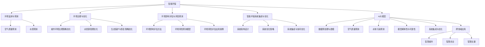
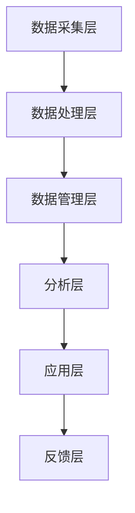
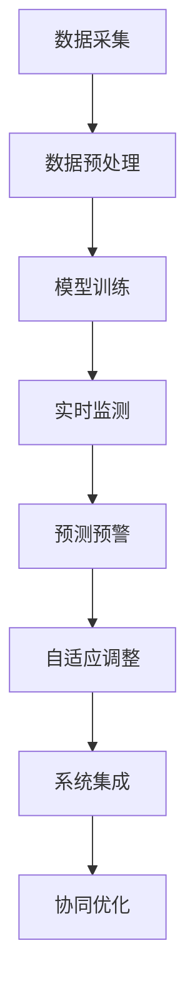

                 

### 第一部分：智能环保与AI大模型基础

智能环保是利用现代信息技术，特别是人工智能（AI）技术，对环境进行监测、预测、治理和评估的一种新兴领域。AI大模型，作为一种先进的AI技术，其在智能环保中的应用前景广阔。

#### 1.1 智能环保概述

##### 1.1.1 智能环保的定义与意义

智能环保是指利用先进的信息技术，尤其是人工智能技术，对环境进行实时监测、预测、治理和评估，从而实现环境保护和可持续发展的目标。智能环保的核心在于将大数据、云计算、物联网、人工智能等技术进行深度融合，实现对环境信息的全面感知和智能处理。

智能环保的意义主要体现在以下几个方面：

1. **提高环境监测的精度和效率**：传统环境监测手段存在监测点有限、数据采集不及时等问题，而智能环保可以利用人工智能技术，实现对环境信息的全面、实时、高效的监测。

2. **优化环境治理策略**：智能环保可以通过对环境数据的分析和预测，为环境治理提供科学依据，优化治理策略，提高治理效果。

3. **促进可持续发展**：智能环保有助于实现环境与经济、社会的协调发展，推动可持续发展。

##### 1.1.2 智能环保的发展历程

智能环保的发展历程可以分为以下几个阶段：

1. **数据采集阶段**：早期环境监测主要依赖于人工采集数据，随着物联网技术的发展，传感器和遥感技术逐渐被应用于环境监测，实现了数据的自动化采集。

2. **数据处理阶段**：随着大数据技术的发展，环境监测数据的海量性和复杂性得到有效处理，为智能环保提供了数据基础。

3. **人工智能应用阶段**：人工智能技术的引入，使得环境监测、预测和治理更加智能化，实现了从数据驱动到知识驱动的转变。

##### 1.1.3 智能环保的关键技术

智能环保的关键技术主要包括：

1. **物联网技术**：物联网技术是实现环境监测数据自动采集和传输的关键技术。

2. **大数据技术**：大数据技术是实现环境监测数据存储、管理和分析的基础。

3. **人工智能技术**：人工智能技术是实现环境监测、预测和治理智能化的核心技术。

#### 1.2 AI大模型概述

##### 1.2.1 AI大模型的定义与特点

AI大模型是指具有大规模参数、能够处理海量数据、具有强大表征能力的深度学习模型。AI大模型的特点包括：

1. **参数规模巨大**：AI大模型的参数规模通常达到数百万、数千万甚至数十亿级别，能够捕捉数据中的复杂模式和特征。

2. **数据处理能力强**：AI大模型可以处理各种类型的数据，如图像、文本、音频等，具有很强的数据表征能力。

3. **泛化能力强**：AI大模型通过大规模数据训练，具有较好的泛化能力，能够在新的数据集上保持较高的预测性能。

##### 1.2.2 AI大模型的发展历程

AI大模型的发展历程可以分为以下几个阶段：

1. **浅层模型阶段**：早期的AI模型如感知机、支持向量机等，参数规模较小，数据处理能力有限。

2. **深度学习模型阶段**：随着深度学习技术的发展，深度神经网络（DNN）和卷积神经网络（CNN）等模型被提出，AI模型的参数规模和数据处理能力得到了显著提升。

3. **大规模模型阶段**：近年来，AI大模型如Transformer、BERT等被提出，参数规模达到了数十亿级别，数据处理能力和泛化能力得到了极大提升。

##### 1.2.3 AI大模型在环保领域的应用前景

AI大模型在环保领域的应用前景广阔，主要体现在以下几个方面：

1. **环境监测与预测**：AI大模型可以处理海量环境数据，实现对空气质量、水质、土壤质量等指标的实时监测和预测。

2. **环境治理与优化**：AI大模型可以分析环境数据，为环境治理提供科学依据，优化治理策略。

3. **环境影响评估与风险预测**：AI大模型可以对建设项目或政策实施的环境影响进行评估和预测，为环境保护决策提供支持。

#### 1.3 AI大模型与智能环保的关系

##### 1.3.1 AI大模型对智能环保的影响

AI大模型对智能环保的影响主要体现在以下几个方面：

1. **提升环境监测精度**：AI大模型可以通过对海量环境数据的分析和处理，提升环境监测的精度和可靠性。

2. **优化环境治理策略**：AI大模型可以分析环境数据，为环境治理提供科学依据，优化治理策略。

3. **促进环保技术创新**：AI大模型可以推动环保技术的创新，如智能监测、智能预测、智能治理等。

##### 1.3.2 智能环保对AI大模型的需求

智能环保对AI大模型的需求主要包括：

1. **数据处理能力**：智能环保需要处理大量的环境数据，对AI大模型的数据处理能力有较高要求。

2. **预测精度**：智能环保需要准确的预测结果来指导环境治理和决策，对AI大模型的预测精度有较高要求。

3. **解释性**：智能环保需要解释AI大模型的预测结果，以便进行科学决策，对AI大模型的可解释性有较高要求。

##### 1.3.3 AI大模型与智能环保的融合方向

AI大模型与智能环保的融合方向主要包括：

1. **环境监测与预测**：利用AI大模型对环境数据进行监测和预测，提升监测和预测的精度和效率。

2. **环境治理与优化**：利用AI大模型分析环境数据，优化环境治理策略，提高治理效果。

3. **环境影响评估与风险预测**：利用AI大模型对建设项目或政策实施的环境影响进行评估和预测，为环境保护决策提供支持。

### 总结

智能环保与AI大模型有着密切的联系，AI大模型为智能环保提供了强大的技术支撑，而智能环保为AI大模型提供了丰富的应用场景。随着AI大模型技术的不断发展，其在智能环保领域的应用前景将更加广阔。



#### 1.1 智能环保概述

##### 1.1.1 智能环保的定义与意义

智能环保是21世纪环保领域的重要研究方向，其核心思想是利用现代信息技术，尤其是人工智能技术，对环境进行实时监测、预测、治理和评估，从而实现环境保护和可持续发展的目标。智能环保不仅能够提高环境监测的精度和效率，还能够为环境治理提供科学依据，优化治理策略。

智能环保的定义可以归纳为：一种基于人工智能技术，利用物联网、大数据、云计算等现代信息技术手段，对环境进行全方位、多尺度监测和管理的系统。其意义主要体现在以下几个方面：

1. **提高环境监测精度**：传统的环境监测手段往往依赖于人工采集数据，存在监测点有限、数据采集不及时等问题。而智能环保通过物联网技术，可以实现对环境信息的全面、实时、高效的监测，提高监测精度。

2. **优化环境治理策略**：智能环保可以通过对环境数据的分析和预测，为环境治理提供科学依据，优化治理策略，提高治理效果。例如，通过对空气质量、水质等指标进行实时监测和预测，可以及时发现污染源并进行有效治理。

3. **促进可持续发展**：智能环保有助于实现环境与经济、社会的协调发展，推动可持续发展。通过智能监测、预测和治理，可以有效减少环境污染，提高资源利用效率，实现经济、社会和环境的共赢。

##### 1.1.2 智能环保的发展历程

智能环保的发展历程可以分为以下几个阶段：

1. **数据采集阶段**：早期环境监测主要依赖于人工采集数据，随着物联网技术的发展，传感器和遥感技术逐渐被应用于环境监测，实现了数据的自动化采集。

2. **数据处理阶段**：随着大数据技术的发展，环境监测数据的海量性和复杂性得到有效处理，为智能环保提供了数据基础。

3. **人工智能应用阶段**：人工智能技术的引入，使得环境监测、预测和治理更加智能化，实现了从数据驱动到知识驱动的转变。

具体来说，智能环保的发展历程可以概括如下：

- **第一阶段（20世纪80年代至90年代）**：这一阶段主要是环境监测的数据采集阶段。随着计算机技术和传感器技术的快速发展，各种环境监测设备被广泛应用于环境监测，如气象站、水质监测站等。这些设备能够实时采集环境数据，并通过远程传输技术将数据传输到数据中心进行存储和处理。

- **第二阶段（21世纪初至2010年）**：这一阶段是数据处理阶段。随着大数据技术的出现，环境监测数据的海量性和复杂性得到了有效处理。大数据技术包括数据采集、存储、处理和分析等环节，能够对环境监测数据进行高效的处理和分析，为智能环保提供了数据基础。

- **第三阶段（2010年至今）**：这一阶段是人工智能应用阶段。人工智能技术的引入，使得环境监测、预测和治理更加智能化。人工智能技术包括机器学习、深度学习、自然语言处理等，能够对环境数据进行智能分析，提供实时、准确的监测和预测结果，为环境治理提供科学依据。

##### 1.1.3 智能环保的关键技术

智能环保的关键技术主要包括以下几个方面：

1. **物联网技术**：物联网技术是实现环境监测数据自动采集和传输的关键技术。通过在环境监测点部署各种传感器，可以实时采集环境数据，并通过无线网络将数据传输到数据中心进行存储和处理。

2. **大数据技术**：大数据技术是实现环境监测数据存储、管理和分析的基础。通过大数据技术，可以对环境监测数据进行高效的处理和分析，提取有用的信息，为智能环保提供数据支持。

3. **人工智能技术**：人工智能技术是实现环境监测、预测和治理智能化的核心技术。通过人工智能技术，可以实现对环境数据的智能分析和预测，为环境治理提供科学依据。

4. **云计算技术**：云计算技术是实现环境监测数据存储、管理和分析的重要技术。通过云计算技术，可以实现环境监测数据的集中存储和管理，提供强大的计算和存储能力，支持大规模环境数据的处理和分析。

5. **地理信息系统（GIS）技术**：地理信息系统技术是实现环境监测数据可视化和空间分析的重要技术。通过GIS技术，可以将环境监测数据以地图的形式进行可视化展示，提供空间分析和决策支持功能。

6. **遥感技术**：遥感技术是通过卫星或无人机等远距离获取地表信息的技术。通过遥感技术，可以实现对大范围环境监测，获取高分辨率、高精度的环境数据。

#### 1.2 AI大模型概述

##### 1.2.1 AI大模型的定义与特点

AI大模型，又称大规模深度学习模型，是一种具有海量参数、能够处理海量数据、具有强大表征能力的深度学习模型。AI大模型的特点主要体现在以下几个方面：

1. **参数规模巨大**：AI大模型的参数规模通常达到数百万、数千万甚至数十亿级别。例如，GPT-3模型有1750亿个参数，BERT模型有3.4亿个参数。这些大规模参数使得AI大模型具有更强的表征能力。

2. **数据处理能力强**：AI大模型可以处理各种类型的数据，如图像、文本、音频等。通过自注意力机制和Transformer架构，AI大模型能够捕捉数据中的复杂模式和特征，实现高精度的数据表征。

3. **泛化能力强**：AI大模型通过大规模数据训练，具有较好的泛化能力。这意味着AI大模型在新的数据集上也能保持较高的预测性能，适用于各种复杂的场景。

4. **自适应能力**：AI大模型可以自动调整参数，适应不同的数据和任务。这种自适应能力使得AI大模型具有很强的灵活性和适应性。

##### 1.2.2 AI大模型的发展历程

AI大模型的发展历程可以分为以下几个阶段：

1. **浅层模型阶段**：早期的AI模型如感知机、支持向量机等，参数规模较小，数据处理能力有限。

2. **深度学习模型阶段**：随着深度学习技术的发展，深度神经网络（DNN）和卷积神经网络（CNN）等模型被提出，AI模型的参数规模和数据处理能力得到了显著提升。

3. **大规模模型阶段**：近年来，AI大模型如Transformer、BERT等被提出，参数规模达到了数十亿级别，数据处理能力和泛化能力得到了极大提升。

具体来说，AI大模型的发展历程可以概括如下：

- **第一阶段（20世纪80年代至90年代）**：这一阶段主要是传统的机器学习阶段。研究者主要关注线性模型、决策树、支持向量机等简单模型。这些模型虽然有一定的预测能力，但参数规模较小，无法处理复杂的任务。

- **第二阶段（21世纪初至2012年）**：这一阶段是深度学习模型的兴起阶段。以Hinton等人为代表的科学家提出了深度神经网络（DNN），使得AI模型的参数规模和数据处理能力得到了显著提升。DNN在图像识别、语音识别等领域取得了突破性的成果。

- **第三阶段（2012年至今）**：这一阶段是AI大模型的快速发展阶段。随着计算机硬件性能的提升和大数据技术的发展，AI大模型如GPT、BERT、Transformer等被提出。这些模型具有数十亿甚至上百亿个参数，能够处理海量数据，实现高精度的预测和表征。

##### 1.2.3 AI大模型在环保领域的应用前景

AI大模型在环保领域的应用前景广阔，主要体现在以下几个方面：

1. **环境监测与预测**：AI大模型可以处理海量环境数据，实现对空气质量、水质、土壤质量等指标的实时监测和预测。例如，通过训练AI大模型，可以预测未来的空气质量，为环保部门提供科学依据，及时采取治理措施。

2. **环境治理与优化**：AI大模型可以分析环境数据，为环境治理提供科学依据，优化治理策略。例如，通过对水质数据进行分析，AI大模型可以预测水污染的趋势，为水质治理提供策略。

3. **环境影响评估与风险预测**：AI大模型可以对建设项目或政策实施的环境影响进行评估和预测，为环境保护决策提供支持。例如，通过训练AI大模型，可以预测某个建设项目的空气质量影响，为环保审批提供依据。

4. **生态保护与恢复**：AI大模型可以分析生态数据，为生态保护与恢复提供科学依据。例如，通过对植被数据进行分析，AI大模型可以预测森林火灾的风险，为防火提供预警。

#### 1.3 AI大模型与智能环保的关系

##### 1.3.1 AI大模型对智能环保的影响

AI大模型对智能环保的影响主要表现在以下几个方面：

1. **提升环境监测精度**：AI大模型可以通过对海量环境数据的分析和处理，提升环境监测的精度和可靠性。例如，通过训练AI大模型，可以预测未来的空气质量，为环保部门提供科学依据，及时采取治理措施。

2. **优化环境治理策略**：AI大模型可以分析环境数据，为环境治理提供科学依据，优化治理策略。例如，通过对水质数据进行分析，AI大模型可以预测水污染的趋势，为水质治理提供策略。

3. **促进环保技术创新**：AI大模型可以推动环保技术的创新，如智能监测、智能预测、智能治理等。例如，通过AI大模型，可以开发出更先进的环保设备和技术，提高环保效率。

##### 1.3.2 智能环保对AI大模型的需求

智能环保对AI大模型的需求主要表现在以下几个方面：

1. **数据处理能力**：智能环保需要处理大量的环境数据，对AI大模型的数据处理能力有较高要求。例如，空气质量、水质、土壤质量等指标的数据量巨大，需要AI大模型能够高效处理这些数据。

2. **预测精度**：智能环保需要准确的预测结果来指导环境治理和决策，对AI大模型的预测精度有较高要求。例如，空气质量预测的精度直接关系到环保部门能否及时采取有效的治理措施。

3. **解释性**：智能环保需要解释AI大模型的预测结果，以便进行科学决策，对AI大模型的可解释性有较高要求。例如，在制定环保政策时，需要了解AI大模型的预测依据和原理。

##### 1.3.3 AI大模型与智能环保的融合方向

AI大模型与智能环保的融合方向主要包括以下几个方面：

1. **环境监测与预测**：利用AI大模型对环境数据进行监测和预测，提升监测和预测的精度和效率。例如，通过训练AI大模型，可以预测未来的空气质量，为环保部门提供科学依据。

2. **环境治理与优化**：利用AI大模型分析环境数据，优化环境治理策略，提高治理效果。例如，通过对水质数据进行分析，AI大模型可以预测水污染的趋势，为水质治理提供策略。

3. **环境影响评估与风险预测**：利用AI大模型对建设项目或政策实施的环境影响进行评估和预测，为环境保护决策提供支持。例如，通过训练AI大模型，可以预测某个建设项目的空气质量影响，为环保审批提供依据。

4. **生态保护与恢复**：利用AI大模型分析生态数据，为生态保护与恢复提供科学依据。例如，通过对植被数据进行分析，AI大模型可以预测森林火灾的风险，为防火提供预警。

### 总结

智能环保与AI大模型有着密切的联系，AI大模型为智能环保提供了强大的技术支撑，而智能环保为AI大模型提供了丰富的应用场景。随着AI大模型技术的不断发展，其在智能环保领域的应用前景将更加广阔。


### 第一部分：智能环保与AI大模型基础

#### 1.3 AI大模型与智能环保的关系

##### 1.3.1 AI大模型对智能环保的影响

AI大模型在智能环保中的应用具有显著的积极影响，主要体现在以下几个方面：

1. **提升监测精度**：AI大模型具有强大的数据处理和分析能力，能够从海量环境数据中提取有价值的信息，从而提高环境监测的精度。例如，通过训练AI大模型，可以对空气质量、水质、土壤质量等指标进行精确监测。

2. **优化治理策略**：AI大模型可以通过对环境数据的深入分析，为环境治理提供科学依据，优化治理策略。例如，通过预测水质变化趋势，AI大模型可以帮助制定有效的污水处理策略。

3. **促进环保技术创新**：AI大模型的应用推动了环保技术的创新。通过深度学习和数据挖掘技术，可以开发出更加智能、高效的环保设备和技术。

4. **增强决策支持**：AI大模型能够对环境问题进行预测和评估，为决策者提供更加精准和及时的决策支持。例如，在制定环保政策时，AI大模型可以提供科学的数据分析和预测结果。

##### 1.3.2 智能环保对AI大模型的需求

智能环保对AI大模型的需求主要表现在以下几个方面：

1. **大规模数据处理**：智能环保需要处理大量的环境数据，包括实时监测数据、历史数据等。AI大模型具备处理大规模数据的能力，能够满足智能环保对数据量的需求。

2. **高预测精度**：智能环保需要准确的预测结果来指导环境治理和决策。AI大模型通过大规模数据训练，具有较高的预测精度，能够满足智能环保对预测准确性的需求。

3. **模型解释性**：智能环保的应用场景要求AI大模型具有一定的解释性，使得决策者能够理解模型的决策过程。这有助于提高AI大模型的可靠性和可接受度。

4. **适应性和灵活性**：智能环保应用场景多样，AI大模型需要具备较强的适应性和灵活性，能够根据不同场景的需求进行调整和应用。

##### 1.3.3 AI大模型与智能环保的融合方向

AI大模型与智能环保的融合方向主要包括以下几个方面：

1. **环境监测与预测**：利用AI大模型对环境数据进行实时监测和预测，提高监测和预测的精度和效率。

2. **环境治理与优化**：AI大模型可以分析环境数据，为环境治理提供科学依据，优化治理策略，提高治理效果。

3. **环境影响评估与风险预测**：AI大模型可以对建设项目或政策实施的环境影响进行评估和预测，为环境保护决策提供支持。

4. **生态保护与恢复**：利用AI大模型分析生态数据，为生态保护与恢复提供科学依据，提高生态系统的健康水平。

### 1.3.1 AI大模型对智能环保的影响

AI大模型对智能环保的影响是深远且多维的。首先，AI大模型在环境监测方面具有显著优势。传统环境监测方法往往依赖于人工采集样本，而AI大模型可以通过分析大量传感器数据和遥感图像，实现对环境的实时监测。例如，使用AI大模型可以监测空气中的有害气体浓度，预测污染源的位置和扩散趋势，从而提高监测的精度和效率。

其次，AI大模型在环境预测方面同样表现出色。通过分析历史环境数据和气象数据，AI大模型可以预测未来的环境变化趋势。例如，利用AI大模型预测空气质量指数（AQI），可以帮助政府和相关部门提前采取治理措施，减少污染对公众健康的影响。此外，AI大模型还可以预测水体的污染情况，帮助水资源管理部门制定科学的水质保护策略。

在环境治理方面，AI大模型的应用也具有巨大潜力。通过分析环境数据，AI大模型可以识别出环境问题的根源，并提供针对性的治理方案。例如，在处理城市垃圾时，AI大模型可以通过分类垃圾的成分和特性，优化垃圾分类和处理流程，提高资源利用效率。同样，在水资源管理中，AI大模型可以根据水质的实时监测数据，预测水污染的趋势，并优化水处理过程，确保水资源的安全供应。

此外，AI大模型还促进了环保技术的创新。传统的环境治理技术往往依赖于经验和实验，而AI大模型可以通过机器学习和数据挖掘技术，开发出更加智能、高效的环保技术。例如，通过AI大模型优化污染治理设备的工作效率，或者开发新型环保材料，可以显著降低环境污染。

最后，AI大模型在环保决策支持方面也发挥了重要作用。通过提供精确的环境数据和分析结果，AI大模型可以帮助决策者更全面地了解环境状况，从而制定更科学的环保政策。例如，在规划新的建设项目时，AI大模型可以预测项目可能对环境造成的影响，帮助决策者权衡利弊，做出最优的选择。

### 1.3.2 智能环保对AI大模型的需求

智能环保对AI大模型的需求是多方面的，主要体现在以下几个方面：

首先，大规模数据处理能力是智能环保对AI大模型的首要需求。环境监测涉及的数据种类繁多，包括气象数据、水质数据、空气质量数据、土壤数据等，而且这些数据通常是海量级的。AI大模型能够处理这些大规模数据，从中提取有价值的信息，为智能环保提供数据支持。

其次，智能环保对AI大模型的预测精度有较高的要求。环境变化具有复杂性和不确定性，需要AI大模型能够提供高精度的预测结果，以便环保部门能够及时采取应对措施。例如，在空气质量预测中，预测的准确度直接关系到是否能够有效地避免空气污染事件的发生。

此外，智能环保对AI大模型的可解释性有较高要求。在制定环保政策和决策时，决策者需要了解AI大模型的预测依据和决策过程，以便进行科学合理的决策。因此，AI大模型的可解释性对于提高决策的可接受度和可靠性至关重要。

最后，智能环保对AI大模型的适应性有较高要求。环境监测和治理涉及多种应用场景，不同的场景可能需要不同的模型结构和参数设置。AI大模型需要具备较强的适应性，能够根据不同的应用场景进行调整，以满足智能环保的需求。

### 1.3.3 AI大模型与智能环保的融合方向

AI大模型与智能环保的融合方向主要包括以下几个方面：

首先，环境监测与预测是AI大模型在智能环保中最重要的应用方向。通过训练AI大模型，可以实现对环境数据的实时监测和预测，提高监测和预测的精度和效率。例如，利用AI大模型对空气质量、水质、土壤质量等指标进行预测，可以帮助环保部门提前采取治理措施，减少环境污染。

其次，环境治理与优化是AI大模型的另一个重要应用方向。通过分析环境数据，AI大模型可以识别出环境问题的根源，并提供针对性的治理方案。例如，利用AI大模型优化污水处理流程，提高水处理效率，或者优化垃圾处理方式，提高资源利用效率。

此外，环境影响评估与风险预测也是AI大模型在智能环保中重要的应用方向。通过训练AI大模型，可以预测建设项目或政策实施对环境的影响，为环境保护决策提供支持。例如，利用AI大模型预测某个工业项目可能对当地空气质量的影响，帮助决策者评估项目风险。

最后，生态保护与恢复也是AI大模型在智能环保中重要的应用方向。通过分析生态数据，AI大模型可以预测生态系统的变化趋势，提供科学的保护与恢复策略。例如，利用AI大模型监测森林火灾风险，或者预测水生生物种群变化，为生态保护提供科学依据。

总之，AI大模型与智能环保的融合方向广阔，未来有望在多个领域发挥重要作用，为环境保护和可持续发展提供强有力的技术支持。

### 第二部分：AI大模型在智能环保中的应用

#### 2.1 环境监测与预测

环境监测与预测是智能环保的核心应用之一。通过AI大模型，可以实现对空气质量、水质、土壤质量等环境指标的实时监测和预测，为环境保护和治理提供科学依据。

##### 2.1.1 环境监测数据的预处理与建模

环境监测数据的预处理是AI大模型应用的关键步骤。由于环境数据的多样性和复杂性，预处理包括以下几个步骤：

1. **数据收集**：收集环境监测数据，包括气象数据、空气质量数据、水质数据、土壤数据等。这些数据可以来源于传感器、遥感卫星、气象站点等。

2. **数据清洗**：清洗数据中的缺失值、异常值和噪声数据。例如，可以使用插值法填补缺失值，使用滤波算法去除异常值。

3. **特征提取**：从原始数据中提取有用的特征，如时间特征、地理位置特征、气象特征等。这些特征将用于训练AI大模型。

4. **数据归一化**：将数据归一化到相同的尺度，以避免不同量纲的数据对模型训练产生偏差。

在预处理完成后，可以使用AI大模型进行建模。常见的AI大模型包括卷积神经网络（CNN）、递归神经网络（RNN）、Transformer等。以下是一个简单的伪代码示例，展示如何使用卷积神经网络（CNN）对空气质量数据建模：

```python
import tensorflow as tf

# 定义CNN模型
model = tf.keras.Sequential([
    tf.keras.layers.Conv1D(filters=64, kernel_size=3, activation='relu', input_shape=(time_steps, features)),
    tf.keras.layers.MaxPooling1D(pool_size=2),
    tf.keras.layers.Flatten(),
    tf.keras.layers.Dense(units=1)
])

# 编译模型
model.compile(optimizer='adam', loss='mse')

# 训练模型
model.fit(x_train, y_train, epochs=10, batch_size=32)
```

在这个例子中，`x_train` 和 `y_train` 分别是训练集的特征和标签，`time_steps` 和 `features` 分别是时间步长和特征数。

##### 2.1.2 基于AI大模型的空气质量预测

基于AI大模型的空气质量预测可以采用以下步骤：

1. **数据预处理**：如前所述，对空气质量数据进行预处理，提取有用的特征，并进行归一化处理。

2. **模型选择**：选择合适的AI大模型，如CNN、RNN、Transformer等。根据具体问题和数据特性，可以选择不同的模型架构。

3. **模型训练**：使用预处理后的数据对AI大模型进行训练。训练过程中，可以通过交叉验证等方法调整模型参数，如学习率、批量大小等。

4. **模型评估**：使用验证集和测试集评估模型的性能。常用的评估指标包括均方根误差（RMSE）、平均绝对误差（MAE）等。

5. **模型应用**：将训练好的模型应用于新的空气质量数据，进行预测。例如，可以使用GPT模型预测未来24小时的空气质量指数（AQI）。

以下是一个简单的伪代码示例，展示如何使用GPT模型进行空气质量预测：

```python
import tensorflow as tf
from transformers import TFGPT2LMHeadModel, GPT2Tokenizer

# 加载预训练的GPT2模型和分词器
tokenizer = GPT2Tokenizer.from_pretrained('gpt2')
model = TFGPT2LMHeadModel.from_pretrained('gpt2')

# 预处理输入数据
inputs = tokenizer.encode("air_quality:", return_tensors='tf')

# 预测空气质量
predictions = model(inputs)

# 解码预测结果
decoded_predictions = tokenizer.decode(predictions[0], skip_special_tokens=True)
```

在这个例子中，`inputs` 是预处理后的输入数据，`predictions` 是模型预测的结果，`decoded_predictions` 是解码后的预测结果。

##### 2.1.3 基于AI大模型的水体污染预测

基于AI大模型的水体污染预测同样可以采用以下步骤：

1. **数据预处理**：对水体污染数据进行预处理，提取有用的特征，并进行归一化处理。

2. **模型选择**：选择合适的AI大模型，如CNN、RNN、Transformer等。根据具体问题和数据特性，可以选择不同的模型架构。

3. **模型训练**：使用预处理后的数据对AI大模型进行训练。训练过程中，可以通过交叉验证等方法调整模型参数，如学习率、批量大小等。

4. **模型评估**：使用验证集和测试集评估模型的性能。常用的评估指标包括均方根误差（RMSE）、平均绝对误差（MAE）等。

5. **模型应用**：将训练好的模型应用于新的水体污染数据，进行预测。例如，可以使用BERT模型预测未来一段时间的水质变化趋势。

以下是一个简单的伪代码示例，展示如何使用BERT模型进行水体污染预测：

```python
import tensorflow as tf
from transformers import TFBertLMModel, BertTokenizer

# 加载预训练的BERT模型和分词器
tokenizer = BertTokenizer.from_pretrained('bert-base-uncased')
model = TFBertLMModel.from_pretrained('bert-base-uncased')

# 预处理输入数据
inputs = tokenizer.encode("water_pollution:", return_tensors='tf')

# 预测水体污染
predictions = model(inputs)

# 解码预测结果
decoded_predictions = tokenizer.decode(predictions[0], skip_special_tokens=True)
```

在这个例子中，`inputs` 是预处理后的输入数据，`predictions` 是模型预测的结果，`decoded_predictions` 是解码后的预测结果。

通过以上步骤，可以实现对空气质量和水体污染的实时监测和预测，为环境保护和治理提供科学依据。

### 2.1.1 环境监测数据的预处理与建模

环境监测数据的预处理是AI大模型应用的关键步骤，直接影响模型训练的效果和预测的准确性。以下是对环境监测数据进行预处理的具体步骤和建模方法的详细描述：

#### 1. 数据收集

首先，我们需要收集环境监测数据，这些数据可以从多个来源获取，包括气象数据、空气质量数据、水质数据、土壤数据等。气象数据可以从气象站、卫星监测系统获取；空气质量数据可以从环境监测站、车载监测系统获取；水质数据可以从河流监测站、水库监测站获取；土壤数据可以从农业监测站、农田监测设备获取。这些数据通常以时间序列的形式记录，包含了不同时间点的环境参数值。

#### 2. 数据清洗

环境监测数据在收集过程中可能会出现一些异常值、噪声和缺失值，因此需要进行数据清洗：

- **异常值处理**：可以通过统计学方法（如中位数、四分位距）检测和去除异常值，或者使用插值法（如线性插值、高斯插值）填补缺失值。

- **噪声过滤**：可以通过滤波算法（如移动平均滤波、卡尔曼滤波）去除数据中的噪声。

- **数据标准化**：将不同量纲的数据进行归一化处理，使其在同一尺度上，以避免不同量纲的数据对模型训练产生偏差。

#### 3. 特征提取

特征提取是数据预处理的重要环节，目的是从原始数据中提取出对模型训练有用的特征：

- **时间特征**：可以从时间序列数据中提取时间特征，如日期、星期、季节等。

- **地理位置特征**：可以从监测点的地理坐标中提取特征，如经度、纬度、海拔等。

- **气象特征**：可以从气象数据中提取特征，如温度、湿度、风速、降雨量等。

- **污染特征**：可以直接使用污染指标（如PM2.5、PM10、SO2、NO2等）作为特征。

- **交互特征**：可以通过组合不同特征，创建交互特征，如温度和风速的组合等。

#### 4. 数据分割

在预处理完成后，需要将数据集分割为训练集、验证集和测试集：

- **训练集**：用于模型训练，通常是数据集中最大的部分。

- **验证集**：用于调整模型参数和选择最佳模型。

- **测试集**：用于评估模型在 unseen 数据上的表现。

#### 5. 模型选择与训练

选择合适的AI大模型进行建模，常用的模型包括卷积神经网络（CNN）、递归神经网络（RNN）、长短时记忆网络（LSTM）、门控循环单元（GRU）、Transformer等。以下是一个基于CNN模型的训练过程伪代码示例：

```python
from tensorflow.keras.models import Sequential
from tensorflow.keras.layers import Conv1D, Dense, Flatten, MaxPooling1D

# 创建CNN模型
model = Sequential([
    Conv1D(filters=64, kernel_size=3, activation='relu', input_shape=(time_steps, features)),
    MaxPooling1D(pool_size=2),
    Flatten(),
    Dense(units=1)
])

# 编译模型
model.compile(optimizer='adam', loss='mse')

# 训练模型
model.fit(x_train, y_train, epochs=10, batch_size=32, validation_data=(x_val, y_val))
```

在这个例子中，`x_train` 和 `y_train` 分别是训练集的特征和标签，`x_val` 和 `y_val` 分别是验证集的特征和标签，`epochs` 和 `batch_size` 分别是训练的轮数和批量大小。

#### 6. 模型评估

使用验证集和测试集评估模型的性能，常用的评估指标包括均方根误差（RMSE）、平均绝对误差（MAE）等。以下是一个简单的评估过程伪代码示例：

```python
from sklearn.metrics import mean_squared_error, mean_absolute_error

# 预测测试集
y_pred = model.predict(x_test)

# 计算评估指标
rmse = mean_squared_error(y_test, y_pred, squared=False)
mae = mean_absolute_error(y_test, y_pred)

print(f"RMSE: {rmse}, MAE: {mae}")
```

在这个例子中，`y_test` 和 `y_pred` 分别是测试集的标签和预测值，`rmse` 和 `mae` 分别是均方根误差和平均绝对误差。

通过以上步骤，我们可以对环境监测数据进行预处理并构建AI大模型，从而实现对空气质量、水质、土壤质量等环境指标的预测。

### 2.1.2 基于AI大模型的空气质量预测

基于AI大模型的空气质量预测是智能环保领域的一项重要应用，通过训练AI大模型，可以从历史数据和实时数据中预测空气质量指数（AQI），为环境保护决策提供科学依据。以下是一个详细的空气质量预测过程，包括模型选择、数据预处理、模型训练和预测评估等步骤：

#### 1. 模型选择

在选择用于空气质量预测的AI大模型时，常用的模型包括卷积神经网络（CNN）、递归神经网络（RNN）、长短时记忆网络（LSTM）、门控循环单元（GRU）、Transformer等。每种模型都有其独特的优势和适用场景。例如，CNN擅长处理图像数据，而RNN和LSTM擅长处理序列数据。

在本例中，我们选择LSTM模型，因为LSTM在处理时间序列数据方面具有强大的能力，适合用于空气质量预测。

#### 2. 数据预处理

空气质量预测的数据通常包括气象数据（如温度、湿度、风速、降雨量等）、空气质量传感器数据（如PM2.5、PM10、SO2、NO2等）和地理位置信息。数据预处理步骤如下：

- **数据收集**：从气象站、空气质量监测站和其他来源收集历史和实时空气质量数据。
- **数据清洗**：处理数据中的缺失值、异常值和噪声，采用插值法、滤波算法等方法填补缺失值，去除异常值和噪声。
- **特征提取**：从原始数据中提取对空气质量有影响的关键特征，如气象特征、地理位置特征和污染特征。
- **数据归一化**：将不同量纲的数据归一化到相同的尺度，以避免模型训练过程中出现量纲不一致的问题。

#### 3. 模型训练

在完成数据预处理后，我们可以开始训练LSTM模型。训练过程通常包括以下步骤：

- **模型构建**：使用Keras等深度学习框架构建LSTM模型，定义输入层、隐藏层和输出层。
- **编译模型**：配置模型的优化器、损失函数和评估指标，例如使用Adam优化器和均方误差（MSE）作为损失函数。
- **训练模型**：使用训练数据对模型进行训练，通过迭代调整模型参数，直到达到预定的训练目标或性能指标。
- **模型评估**：在验证集上评估模型的性能，调整模型参数以优化性能。

以下是一个LSTM模型训练的伪代码示例：

```python
from tensorflow.keras.models import Sequential
from tensorflow.keras.layers import LSTM, Dense

# 构建LSTM模型
model = Sequential()
model.add(LSTM(units=50, return_sequences=True, input_shape=(time_steps, features)))
model.add(LSTM(units=50))
model.add(Dense(units=1))

# 编译模型
model.compile(optimizer='adam', loss='mean_squared_error')

# 训练模型
model.fit(x_train, y_train, epochs=100, batch_size=32, validation_split=0.2)
```

在这个例子中，`x_train` 和 `y_train` 分别是训练集的特征和标签，`epochs` 是训练的轮数，`batch_size` 是批量大小。

#### 4. 预测评估

训练好的LSTM模型可以用于空气质量预测。预测评估步骤如下：

- **数据预处理**：对新的空气质量数据进行预处理，包括特征提取和数据归一化。
- **模型预测**：使用训练好的LSTM模型对新的空气质量数据进行预测。
- **结果评估**：将预测结果与实际空气质量指数（AQI）进行比较，评估预测模型的性能。常用的评估指标包括均方根误差（RMSE）、平均绝对误差（MAE）等。

以下是一个LSTM模型预测的伪代码示例：

```python
# 预测新的空气质量数据
y_pred = model.predict(x_new)

# 计算评估指标
rmse = np.sqrt(mean_squared_error(y_new, y_pred))
mae = mean_absolute_error(y_new, y_pred)

print(f"RMSE: {rmse}, MAE: {mae}")
```

在这个例子中，`y_new` 和 `y_pred` 分别是实际空气质量指数（AQI）和预测值，`rmse` 和 `mae` 分别是均方根误差和平均绝对误差。

通过以上步骤，我们可以使用AI大模型实现对空气质量的预测，为环境保护和治理提供实时、准确的决策支持。

### 2.1.3 基于AI大模型的水体污染预测

水体污染预测是智能环保领域的一项重要任务，通过AI大模型，可以从历史数据和实时数据中预测水体污染的变化趋势，为水资源管理和污染治理提供科学依据。以下是一个基于AI大模型的水体污染预测的具体实现过程，包括数据预处理、模型选择、模型训练和预测评估等步骤。

#### 1. 数据预处理

水体污染预测的数据通常包括水质指标（如pH值、氨氮、总氮、总磷等）、气象数据（如温度、湿度、风速、降雨量等）、地理位置信息以及其他可能影响水质的环境参数。数据预处理步骤如下：

- **数据收集**：从河流、湖泊、水库等水源地收集历史和实时水质数据。这些数据可以从环境监测站、遥感卫星、气象站点等获取。
- **数据清洗**：处理数据中的缺失值、异常值和噪声。对于缺失值，可以使用插值法（如线性插值、高斯插值）进行填补。对于异常值，可以使用统计学方法（如中位数、四分位距）检测并去除。对于噪声，可以使用滤波算法（如移动平均滤波、卡尔曼滤波）进行去除。
- **特征提取**：从原始数据中提取对水质有影响的关键特征。例如，从水质指标中提取主要污染物浓度，从气象数据中提取温度、湿度等，从地理位置信息中提取经纬度、海拔等。
- **数据归一化**：将不同量纲的数据归一化到相同的尺度，以避免模型训练过程中出现量纲不一致的问题。常用的归一化方法包括最小-最大缩放、平均值-标准差缩放等。

#### 2. 模型选择

在模型选择方面，基于AI大模型的预测任务通常采用深度学习模型，如卷积神经网络（CNN）、递归神经网络（RNN）、长短时记忆网络（LSTM）、门控循环单元（GRU）和Transformer等。每种模型都有其独特的优势和适用场景。对于水体污染预测，RNN和LSTM模型由于其在处理时间序列数据方面的强大能力，通常是一个较好的选择。

在本例中，我们选择LSTM模型，因为LSTM能够捕捉时间序列数据中的长期依赖关系，适合用于水体污染预测。

#### 3. 模型训练

在完成数据预处理后，我们可以开始训练LSTM模型。训练过程通常包括以下步骤：

- **模型构建**：使用深度学习框架（如TensorFlow或PyTorch）构建LSTM模型，定义输入层、隐藏层和输出层。例如，一个简单的LSTM模型可能包含两个隐藏层，每个隐藏层有50个神经元。
- **编译模型**：配置模型的优化器、损失函数和评估指标。常用的优化器包括Adam、RMSprop等，损失函数包括均方误差（MSE）、均方根误差（RMSE）等。
- **训练模型**：使用训练数据对模型进行训练，通过迭代调整模型参数，直到达到预定的训练目标或性能指标。训练过程中，可以使用验证集来监控模型的性能，避免过拟合。
- **模型评估**：在验证集和测试集上评估模型的性能，调整模型参数以优化性能。常用的评估指标包括均方根误差（RMSE）、平均绝对误差（MAE）等。

以下是一个LSTM模型训练的伪代码示例：

```python
from tensorflow.keras.models import Sequential
from tensorflow.keras.layers import LSTM, Dense

# 构建LSTM模型
model = Sequential()
model.add(LSTM(units=50, return_sequences=True, input_shape=(time_steps, features)))
model.add(LSTM(units=50))
model.add(Dense(units=1))

# 编译模型
model.compile(optimizer='adam', loss='mean_squared_error')

# 训练模型
model.fit(x_train, y_train, epochs=100, batch_size=32, validation_split=0.2)
```

在这个例子中，`x_train` 和 `y_train` 分别是训练集的特征和标签，`epochs` 是训练的轮数，`batch_size` 是批量大小。

#### 4. 预测评估

训练好的LSTM模型可以用于水体污染预测。预测评估步骤如下：

- **数据预处理**：对新的水质数据进行预处理，包括特征提取和数据归一化。
- **模型预测**：使用训练好的LSTM模型对新的水质数据进行预测。
- **结果评估**：将预测结果与实际水质数据进行比较，评估预测模型的性能。常用的评估指标包括均方根误差（RMSE）、平均绝对误差（MAE）等。

以下是一个LSTM模型预测的伪代码示例：

```python
# 预测新的水质数据
y_pred = model.predict(x_new)

# 计算评估指标
rmse = np.sqrt(mean_squared_error(y_new, y_pred))
mae = mean_absolute_error(y_new, y_pred)

print(f"RMSE: {rmse}, MAE: {mae}")
```

在这个例子中，`y_new` 和 `y_pred` 分别是实际水质数据和预测值，`rmse` 和 `mae` 分别是均方根误差和平均绝对误差。

通过以上步骤，我们可以使用AI大模型实现对水体污染的预测，为水资源管理和污染治理提供实时、准确的决策支持。

### 2.2 环境治理与优化

环境治理与优化是智能环保的重要组成部分，AI大模型在这一领域有着广泛的应用前景。通过分析大量的环境数据，AI大模型可以提供科学的决策支持，优化环境治理策略，提高治理效果。

#### 2.2.1 基于AI大模型的城市环境治理策略优化

城市环境治理涉及到多个方面，包括空气质量治理、水质治理、噪音治理等。AI大模型可以通过对历史数据和实时数据的分析，为城市环境治理提供优化策略。

**1. 空气质量治理策略优化**

空气质量治理策略的优化可以通过以下步骤实现：

- **数据收集与预处理**：收集城市的空气质量数据，包括PM2.5、PM10、SO2、NO2等污染物浓度。对数据进行清洗，去除异常值和噪声，并进行归一化处理。

- **特征工程**：提取对空气质量有显著影响的特征，如气象条件、交通流量、工业排放等。

- **模型选择与训练**：选择合适的AI大模型，如LSTM、GRU或Transformer等，对空气质量数据进行训练。通过调整模型参数，如学习率和批量大小，优化模型性能。

- **策略生成与评估**：基于训练好的模型，生成空气质量治理策略，如减少交通拥堵、增加工业排放控制等。通过评估不同策略的预期效果，选择最优策略。

以下是一个基于LSTM模型的空气质量治理策略优化的伪代码示例：

```python
import tensorflow as tf
from tensorflow.keras.models import Sequential
from tensorflow.keras.layers import LSTM, Dense

# 构建LSTM模型
model = Sequential()
model.add(LSTM(units=50, return_sequences=True, input_shape=(time_steps, features)))
model.add(LSTM(units=50))
model.add(Dense(units=1))

# 编译模型
model.compile(optimizer='adam', loss='mean_squared_error')

# 训练模型
model.fit(x_train, y_train, epochs=100, batch_size=32, validation_split=0.2)

# 生成治理策略
predictions = model.predict(x_new)

# 评估治理策略
# ... (使用评估指标评估策略效果)
```

**2. 水质治理策略优化**

水质治理策略的优化可以通过类似的方法实现。首先，收集水质数据，包括溶解氧、氨氮、总氮、总磷等指标。然后，对数据进行分析和特征提取。最后，利用AI大模型生成治理策略，如增加污水处理能力、调整工业排放标准等。

**3. 噪音治理策略优化**

噪音治理策略的优化可以通过对噪音数据进行分析和预测来实现。首先，收集噪音数据，包括噪音强度、噪音来源等。然后，使用AI大模型对噪音数据进行预测，生成减少噪音的策略，如增加隔音设施、调整交通流量等。

#### 2.2.2 基于AI大模型的水资源管理优化

水资源管理优化是另一个重要的环境治理领域。通过AI大模型，可以对水资源进行实时监测和预测，优化水资源管理策略。

- **数据收集与预处理**：收集水资源数据，包括河流流量、水库水位、降水等。对数据进行清洗，去除异常值和噪声。

- **特征工程**：提取对水资源有显著影响的特征，如季节、气候条件等。

- **模型选择与训练**：选择合适的AI大模型，如LSTM、GRU或SARIMA等，对水资源数据进行训练。

- **策略生成与评估**：基于训练好的模型，生成水资源管理策略，如调整水库泄洪量、优化灌溉计划等。通过评估不同策略的预期效果，选择最优策略。

以下是一个基于LSTM模型的饮用水资源管理优化的伪代码示例：

```python
import tensorflow as tf
from tensorflow.keras.models import Sequential
from tensorflow.keras.layers import LSTM, Dense

# 构建LSTM模型
model = Sequential()
model.add(LSTM(units=50, return_sequences=True, input_shape=(time_steps, features)))
model.add(LSTM(units=50))
model.add(Dense(units=1))

# 编译模型
model.compile(optimizer='adam', loss='mean_squared_error')

# 训练模型
model.fit(x_train, y_train, epochs=100, batch_size=32, validation_split=0.2)

# 生成管理策略
predictions = model.predict(x_new)

# 评估管理策略
# ... (使用评估指标评估策略效果)
```

#### 2.2.3 基于AI大模型的生态保护与恢复策略优化

生态保护与恢复策略的优化同样可以通过AI大模型来实现。通过分析生态数据，如植被覆盖率、土壤质量、生物多样性等，AI大模型可以提供科学的保护与恢复策略。

- **数据收集与预处理**：收集生态数据，包括遥感图像、现场监测数据等。对数据进行清洗，去除异常值和噪声。

- **特征工程**：提取对生态有显著影响的特征，如气候条件、人类活动等。

- **模型选择与训练**：选择合适的AI大模型，如CNN、LSTM或GRU等，对生态数据进行训练。

- **策略生成与评估**：基于训练好的模型，生成生态保护与恢复策略，如植被种植计划、栖息地恢复计划等。通过评估不同策略的预期效果，选择最优策略。

以下是一个基于CNN模型的生态保护策略优化的伪代码示例：

```python
import tensorflow as tf
from tensorflow.keras.models import Sequential
from tensorflow.keras.layers import Conv2D, MaxPooling2D, Flatten, Dense

# 构建CNN模型
model = Sequential()
model.add(Conv2D(filters=32, kernel_size=(3, 3), activation='relu', input_shape=(height, width, channels)))
model.add(MaxPooling2D(pool_size=(2, 2)))
model.add(Flatten())
model.add(Dense(units=1, activation='sigmoid'))

# 编译模型
model.compile(optimizer='adam', loss='binary_crossentropy', metrics=['accuracy'])

# 训练模型
model.fit(x_train, y_train, epochs=100, batch_size=32, validation_split=0.2)

# 生成保护策略
predictions = model.predict(x_new)

# 评估保护策略
# ... (使用评估指标评估策略效果)
```

通过以上步骤，AI大模型可以优化城市环境治理策略、水资源管理策略和生态保护与恢复策略，为环境保护和可持续发展提供科学支持。

### 2.2.1 基于AI大模型的城市环境治理策略优化

在城市环境治理策略优化方面，AI大模型的应用主要集中在空气质量、水质和噪音治理等方面。通过整合多源数据和先进的算法，AI大模型能够提供实时、精准的治理策略，从而提升环境治理的效果。

**1. 空气质量治理策略优化**

空气质量治理策略的优化通常需要处理大量的数据，包括气象数据、交通流量数据、工业排放数据等。以下是一个基于AI大模型进行空气质量治理策略优化的流程：

- **数据收集与预处理**：收集历史和实时的空气质量数据，如PM2.5、PM10、SO2、NO2等。对数据进行清洗，处理缺失值和异常值，并进行归一化处理。

- **特征工程**：提取对空气质量有显著影响的特征，如气象条件（温度、湿度、风速等）、交通流量（车辆数、拥堵情况等）、工业排放（排放量、排放时间等）。

- **模型选择与训练**：选择合适的AI大模型，如LSTM、GRU或Transformer等。利用预处理后的数据对模型进行训练，通过交叉验证调整模型参数，提高模型性能。

- **策略生成与评估**：基于训练好的模型，生成空气质量治理策略，如调整交通管理方案、增加工业排放控制等。通过评估不同策略的预期效果，选择最优策略。

以下是一个简化的伪代码示例，展示了如何使用LSTM模型进行空气质量治理策略优化：

```python
import tensorflow as tf
from tensorflow.keras.models import Sequential
from tensorflow.keras.layers import LSTM, Dense

# 构建LSTM模型
model = Sequential()
model.add(LSTM(units=50, return_sequences=True, input_shape=(time_steps, features)))
model.add(LSTM(units=50))
model.add(Dense(units=1))

# 编译模型
model.compile(optimizer='adam', loss='mean_squared_error')

# 训练模型
model.fit(x_train, y_train, epochs=100, batch_size=32, validation_split=0.2)

# 生成治理策略
predictions = model.predict(x_new)

# 评估治理策略
# ... (使用评估指标如RMSE、MAE等评估策略效果)
```

**2. 水质治理策略优化**

水质治理策略的优化同样依赖于对大量环境数据的分析和处理。以下是一个基于AI大模型进行水质治理策略优化的流程：

- **数据收集与预处理**：收集水质数据，包括pH值、氨氮、总氮、总磷等。对数据进行清洗，处理缺失值和异常值，并进行归一化处理。

- **特征工程**：提取对水质有显著影响的特征，如气象条件、地理位置、人类活动等。

- **模型选择与训练**：选择合适的AI大模型，如LSTM、GRU或Transformer等。利用预处理后的数据对模型进行训练，通过交叉验证调整模型参数，提高模型性能。

- **策略生成与评估**：基于训练好的模型，生成水质治理策略，如调整污水处理流程、改进工业排放标准等。通过评估不同策略的预期效果，选择最优策略。

以下是一个简化的伪代码示例，展示了如何使用LSTM模型进行水质治理策略优化：

```python
import tensorflow as tf
from tensorflow.keras.models import Sequential
from tensorflow.keras.layers import LSTM, Dense

# 构建LSTM模型
model = Sequential()
model.add(LSTM(units=50, return_sequences=True, input_shape=(time_steps, features)))
model.add(LSTM(units=50))
model.add(Dense(units=1))

# 编译模型
model.compile(optimizer='adam', loss='mean_squared_error')

# 训练模型
model.fit(x_train, y_train, epochs=100, batch_size=32, validation_split=0.2)

# 生成治理策略
predictions = model.predict(x_new)

# 评估治理策略
# ... (使用评估指标如RMSE、MAE等评估策略效果)
```

**3. 噪音治理策略优化**

噪音治理策略的优化需要处理噪音数据，如噪音强度、噪音来源等。以下是一个基于AI大模型进行噪音治理策略优化的流程：

- **数据收集与预处理**：收集噪音数据，包括噪音强度、噪音来源、地理位置等。对数据进行清洗，处理缺失值和异常值，并进行归一化处理。

- **特征工程**：提取对噪音治理有显著影响的特征，如时间、地理位置、噪音类型等。

- **模型选择与训练**：选择合适的AI大模型，如LSTM、GRU或Transformer等。利用预处理后的数据对模型进行训练，通过交叉验证调整模型参数，提高模型性能。

- **策略生成与评估**：基于训练好的模型，生成噪音治理策略，如调整交通管理方案、增加噪音控制设施等。通过评估不同策略的预期效果，选择最优策略。

以下是一个简化的伪代码示例，展示了如何使用LSTM模型进行噪音治理策略优化：

```python
import tensorflow as tf
from tensorflow.keras.models import Sequential
from tensorflow.keras.layers import LSTM, Dense

# 构建LSTM模型
model = Sequential()
model.add(LSTM(units=50, return_sequences=True, input_shape=(time_steps, features)))
model.add(LSTM(units=50))
model.add(Dense(units=1))

# 编译模型
model.compile(optimizer='adam', loss='mean_squared_error')

# 训练模型
model.fit(x_train, y_train, epochs=100, batch_size=32, validation_split=0.2)

# 生成治理策略
predictions = model.predict(x_new)

# 评估治理策略
# ... (使用评估指标如RMSE、MAE等评估策略效果)
```

通过上述流程和伪代码示例，我们可以看到AI大模型在城市环境治理策略优化中的应用。在实际应用中，需要根据具体情况选择合适的模型和算法，并结合多源数据进行训练和评估，以实现最优的治理效果。

### 2.2.2 基于AI大模型的水资源管理优化

水资源管理优化是智能环保领域的关键应用之一，AI大模型在此领域具备显著优势。通过深入分析水资源相关数据，AI大模型可以提供科学的决策支持，优化水资源管理策略，提高水资源利用效率。

**1. 数据收集与预处理**

水资源管理优化的第一步是收集相关数据，这些数据通常包括：

- **气象数据**：如降雨量、蒸发量、气温等。
- **水文数据**：如河流流量、水库水位、地下水水位等。
- **水质数据**：如溶解氧、pH值、氨氮、总氮、总磷等。
- **用水需求数据**：如工业用水、农业用水、生活用水等。

数据收集后，需要进行预处理，包括以下步骤：

- **数据清洗**：处理数据中的缺失值和异常值，例如使用插值法填补缺失值，使用统计方法去除异常值。
- **特征提取**：从原始数据中提取对水资源管理有显著影响的特征，例如气象条件、水文特征、水质指标等。
- **数据归一化**：将不同量纲的数据归一化到同一尺度，以确保模型训练时数据的一致性。

**2. 模型选择与训练**

选择合适的AI大模型是水资源管理优化的重要步骤。以下是一些常用的模型：

- **时间序列模型**：如LSTM（长短时记忆网络）、GRU（门控循环单元）、ARIMA（自回归积分滑动平均模型）等，适用于处理时间序列数据。
- **深度学习模型**：如CNN（卷积神经网络）、Transformer等，适用于处理复杂的数据模式。
- **混合模型**：结合时间序列模型和深度学习模型，如LSTM-CNN、LSTM-Transformer等，可以更好地捕捉数据中的时间和空间依赖关系。

以下是一个基于LSTM模型的训练过程伪代码示例：

```python
import tensorflow as tf
from tensorflow.keras.models import Sequential
from tensorflow.keras.layers import LSTM, Dense

# 定义模型
model = Sequential()
model.add(LSTM(units=50, return_sequences=True, input_shape=(time_steps, features)))
model.add(LSTM(units=50))
model.add(Dense(units=1))

# 编译模型
model.compile(optimizer='adam', loss='mean_squared_error')

# 训练模型
model.fit(x_train, y_train, epochs=100, batch_size=32, validation_split=0.2)
```

**3. 策略生成与评估**

基于训练好的模型，可以生成水资源管理策略。以下是一个策略生成和评估的流程：

- **策略生成**：利用模型对未来的水资源情况进行预测，如水库水位、河流流量等。根据预测结果，制定水资源调配和利用策略，例如调整水库泄洪量、优化农业灌溉计划等。
- **策略评估**：通过模拟不同策略在未来的表现，评估其对水资源管理的有效性。使用评估指标如均方根误差（RMSE）、平均绝对误差（MAE）等，对策略进行量化评估。

以下是一个策略评估的伪代码示例：

```python
# 预测未来数据
predictions = model.predict(x_new)

# 计算评估指标
rmse = np.sqrt(np.mean(np.square(y_new - predictions)))
mae = np.mean(np.abs(y_new - predictions))

print(f"RMSE: {rmse}, MAE: {mae}")
```

通过上述步骤，AI大模型可以优化水资源管理策略，提高水资源利用效率，为环境保护和可持续发展提供有力支持。

### 2.2.3 基于AI大模型的生态保护与恢复策略优化

生态保护与恢复策略的优化是智能环保领域的重要组成部分，AI大模型通过分析大量的生态数据，为生态保护和恢复提供科学的决策支持。以下是基于AI大模型进行生态保护与恢复策略优化的具体步骤：

#### 1. 数据收集与预处理

首先，收集与生态保护和恢复相关的数据，这些数据包括但不限于：

- **遥感数据**：如植被指数、土地覆盖类型、土地利用变化等。
- **气象数据**：如温度、湿度、风速、降水等。
- **土壤数据**：如土壤类型、土壤湿度、土壤养分含量等。
- **生物多样性数据**：如物种分布、种群数量等。
- **人类活动数据**：如人口密度、工业活动、交通流量等。

收集的数据可能存在缺失值、异常值和噪声，因此需要进行预处理：

- **数据清洗**：处理缺失值，可以使用插值法、均值填充等方法。处理异常值，可以使用统计学方法、过滤算法等。
- **特征提取**：从原始数据中提取对生态保护与恢复有显著影响的特征，如植被指数、土地利用类型、气象条件等。
- **数据归一化**：将不同量纲的数据归一化到同一尺度，以提高模型训练的效果。

#### 2. 模型选择与训练

选择合适的AI大模型进行生态保护与恢复策略优化，以下是几种常用的模型：

- **深度学习模型**：如卷积神经网络（CNN）、递归神经网络（RNN）、长短时记忆网络（LSTM）等，适用于处理图像和序列数据。
- **多模态学习模型**：结合多种数据类型（如图像、文本、传感器数据等），适用于处理复杂的多维数据。
- **强化学习模型**：通过模拟人类决策过程，可以优化生态保护和恢复策略。

以下是一个基于LSTM模型进行生态保护与恢复策略优化的训练过程伪代码示例：

```python
import tensorflow as tf
from tensorflow.keras.models import Sequential
from tensorflow.keras.layers import LSTM, Dense

# 定义模型
model = Sequential()
model.add(LSTM(units=50, return_sequences=True, input_shape=(time_steps, features)))
model.add(LSTM(units=50))
model.add(Dense(units=1))

# 编译模型
model.compile(optimizer='adam', loss='mean_squared_error')

# 训练模型
model.fit(x_train, y_train, epochs=100, batch_size=32, validation_split=0.2)
```

#### 3. 策略生成与评估

基于训练好的模型，可以生成生态保护与恢复策略。以下是策略生成和评估的步骤：

- **策略生成**：利用模型对生态系统的未来状态进行预测，如植被恢复速度、生物多样性变化等。根据预测结果，制定生态保护与恢复策略，如植被种植计划、栖息地恢复计划等。
- **策略评估**：通过模拟不同策略在未来的表现，评估其对生态保护和恢复的有效性。使用评估指标如均方根误差（RMSE）、平均绝对误差（MAE）等，对策略进行量化评估。

以下是一个策略评估的伪代码示例：

```python
# 预测未来数据
predictions = model.predict(x_new)

# 计算评估指标
rmse = np.sqrt(np.mean(np.square(y_new - predictions)))
mae = np.mean(np.abs(y_new - predictions))

print(f"RMSE: {rmse}, MAE: {mae}")
```

通过上述步骤，AI大模型可以优化生态保护与恢复策略，提高生态系统的健康水平，为环境保护和可持续发展提供有力支持。

### 2.3 环境影响评估与风险预测

环境影响评估与风险预测是智能环保领域中至关重要的一环。通过AI大模型，可以对建设项目或政策实施后的环境影响进行科学评估和预测，为环境保护决策提供有力支持。

#### 2.3.1 基于AI大模型的环境影响评估方法

环境影响评估通常需要综合考虑多个因素，包括气象、水文、地质、生态等。以下是基于AI大模型进行环境影响评估的详细方法：

1. **数据收集**：收集与建设项目或政策实施相关的环境数据，如气象数据、水文数据、土壤数据、生态数据等。

2. **数据预处理**：对收集到的数据进行分析和清洗，处理缺失值和异常值，并进行归一化处理，以确保数据的一致性和可用性。

3. **特征工程**：从原始数据中提取对环境影响有显著影响的特征，如气象条件、地理位置、污染物浓度等。

4. **模型选择与训练**：选择合适的AI大模型，如LSTM、GRU、Transformer等。利用预处理后的数据对模型进行训练，通过交叉验证调整模型参数，提高模型性能。

5. **环境影响预测**：基于训练好的模型，对建设项目或政策实施后的环境影响进行预测。例如，预测某工业项目实施后对空气质量的影响，或某水利工程对水质的影响。

以下是一个基于LSTM模型进行环境影响预测的伪代码示例：

```python
import tensorflow as tf
from tensorflow.keras.models import Sequential
from tensorflow.keras.layers import LSTM, Dense

# 构建LSTM模型
model = Sequential()
model.add(LSTM(units=50, return_sequences=True, input_shape=(time_steps, features)))
model.add(LSTM(units=50))
model.add(Dense(units=1))

# 编译模型
model.compile(optimizer='adam', loss='mean_squared_error')

# 训练模型
model.fit(x_train, y_train, epochs=100, batch_size=32, validation_split=0.2)

# 进行环境影响预测
predictions = model.predict(x_new)
```

#### 2.3.2 基于AI大模型的环境风险预测模型

环境风险预测模型用于预测建设项目或政策实施后可能产生的风险，如污染风险、生态风险等。以下是基于AI大模型进行环境风险预测的详细方法：

1. **数据收集**：收集与建设项目或政策实施相关的风险数据，如污染物浓度、生物多样性、地质稳定性等。

2. **数据预处理**：对收集到的数据进行分析和清洗，处理缺失值和异常值，并进行归一化处理。

3. **特征工程**：从原始数据中提取对环境风险有显著影响的特征，如污染物浓度、地理位置、地形等。

4. **模型选择与训练**：选择合适的AI大模型，如LSTM、GRU、Transformer等。利用预处理后的数据对模型进行训练，通过交叉验证调整模型参数，提高模型性能。

5. **环境风险预测**：基于训练好的模型，对建设项目或政策实施后的环境风险进行预测。例如，预测某工业项目实施后对当地空气质量的影响，或某矿山开采项目对地下水的影响。

以下是一个基于LSTM模型进行环境风险预测的伪代码示例：

```python
import tensorflow as tf
from tensorflow.keras.models import Sequential
from tensorflow.keras.layers import LSTM, Dense

# 构建LSTM模型
model = Sequential()
model.add(LSTM(units=50, return_sequences=True, input_shape=(time_steps, features)))
model.add(LSTM(units=50))
model.add(Dense(units=1))

# 编译模型
model.compile(optimizer='adam', loss='mean_squared_error')

# 训练模型
model.fit(x_train, y_train, epochs=100, batch_size=32, validation_split=0.2)

# 进行环境风险预测
predictions = model.predict(x_new)
```

#### 2.3.3 AI大模型在环境风险评估中的应用案例

以下是一个基于AI大模型进行环境风险评估的应用案例：

**案例背景**：某地区计划建设一座大型工业园区，项目实施可能对当地空气质量、水质和生态环境产生影响。需要利用AI大模型进行环境影响评估和风险预测，为项目审批和环境保护提供科学依据。

**步骤**：

1. **数据收集**：收集与工业园区建设相关的环境数据，包括气象数据、空气质量数据、水质数据、生态环境数据等。

2. **数据预处理**：对收集到的数据进行分析和清洗，处理缺失值和异常值，并进行归一化处理。

3. **特征工程**：提取对环境影响有显著影响的特征，如气象条件、污染物浓度、地理位置等。

4. **模型选择与训练**：选择合适的AI大模型，如LSTM、GRU、Transformer等，利用预处理后的数据对模型进行训练。

5. **环境影响预测**：基于训练好的模型，预测工业园区建设后对空气质量、水质和生态环境的影响。

6. **环境风险预测**：基于训练好的模型，预测工业园区建设后可能产生的风险，如污染风险、生态风险等。

7. **评估与决策**：根据环境影响预测和环境风险预测结果，评估项目对环境的潜在影响，提出环境保护措施和建议，为项目审批和环境保护决策提供科学依据。

通过以上步骤，AI大模型可以有效评估建设项目或政策实施的环境影响和风险，为环境保护和可持续发展提供有力支持。

### 2.3.1 基于AI大模型的环境影响评估方法

环境影响评估（EIA）是评估建设项目或政策对环境潜在影响的系统过程。在传统EIA方法中，评估者通常依赖专家判断和统计数据，但这种方法存在主观性、不准确和时效性差等局限性。随着人工智能（AI）技术的进步，特别是AI大模型的应用，环境影响评估方法得到了显著提升。以下是基于AI大模型进行环境影响评估的方法：

#### 1. 数据收集与预处理

环境影响评估的第一步是收集相关数据。这些数据包括但不限于：

- **项目数据**：如项目描述、建设规模、工艺流程等。
- **环境数据**：如气象数据（温度、湿度、风速等）、水文数据（河流流量、水位等）、土壤数据（土壤质量、污染物含量等）、生态数据（植被覆盖率、生物多样性等）。
- **社会经济数据**：如人口密度、经济发展水平、交通运输情况等。

收集到的数据可能存在不完整、不一致或不准确的情况，因此需要预处理。预处理步骤包括：

- **数据清洗**：去除异常值、纠正错误、填补缺失值等。
- **数据归一化**：将不同量纲的数据转换到同一尺度，便于模型处理。
- **特征提取**：提取对环境影响有显著影响的关键特征，如污染物排放量、土地使用类型、生态系统敏感性等。

#### 2. 模型选择与训练

在选择AI大模型时，需要考虑评估目标的数据类型和特征。以下是一些常用的AI大模型：

- **深度学习模型**：如卷积神经网络（CNN）、递归神经网络（RNN）、长短时记忆网络（LSTM）、变换器（Transformer）等。
- **多模态学习模型**：结合文本、图像、音频等多种数据类型，适用于复杂的环境评估任务。
- **生成对抗网络（GAN）**：用于生成模拟环境数据，补充缺失数据或生成极端情况下的环境影响。

在模型选择后，使用预处理的数据进行训练。训练过程通常包括：

- **数据分割**：将数据集分为训练集、验证集和测试集，用于模型训练、验证和评估。
- **模型架构设计**：设计合适的神经网络结构，包括输入层、隐藏层和输出层。
- **模型编译**：选择优化器、损失函数和评估指标，如均方误差（MSE）、交叉熵等。
- **模型训练**：使用训练集数据进行模型训练，通过迭代调整模型参数，直到达到预定的性能指标。

#### 3. 影响预测与评估

基于训练好的AI大模型，可以预测建设项目或政策实施后的环境影响。具体步骤如下：

- **影响预测**：将预处理后的数据输入模型，预测环境参数的变化，如空气质量、水质、土壤质量等。
- **影响评估**：使用评估指标（如准确率、召回率、F1分数等）评估模型预测的准确性。
- **情景分析**：模拟不同的项目实施情景，如不同污染物排放量、不同施工时间等，评估不同情景下的环境影响。

#### 4. 政策建议与优化

基于预测结果和评估指标，可以提出具体的政策建议和优化方案，以减轻环境影响。这些建议可能包括：

- **调整项目设计**：优化建设项目的设计，如减少污染物排放、增加环保设施等。
- **加强环境监管**：制定和执行更严格的环境法规和监管措施。
- **公众参与**：增强公众对环境影响评估的认知，提高公众参与度。

通过上述方法，AI大模型可以提供更加准确、实时和科学的环境影响评估，为环境保护决策提供有力支持。

### 2.3.2 基于AI大模型的环境风险预测模型

环境风险预测模型是智能环保领域的重要工具，用于预测建设项目或政策实施后可能产生的环境风险，如污染风险、生态风险等。AI大模型在环境风险预测中具有显著优势，能够处理海量数据，提取复杂模式，并提供高精度的预测结果。以下是基于AI大模型的环境风险预测模型的具体实现方法：

#### 1. 数据收集

首先，收集与建设项目或政策实施相关的环境数据，这些数据包括：

- **污染物数据**：如大气污染物（PM2.5、SO2、NO2等）、水污染物（氨氮、总氮、总磷等）。
- **生态数据**：如植被覆盖率、生物多样性、土壤质量等。
- **气象数据**：如温度、湿度、风速、降雨量等。
- **社会经济数据**：如人口密度、经济发展水平、交通流量等。

收集的数据可能来自多个来源，包括环境监测站、气象站、遥感卫星、统计部门等。

#### 2. 数据预处理

环境风险预测的准确性和可靠性依赖于高质量的数据。因此，需要对收集到的数据进行分析和预处理，包括以下步骤：

- **数据清洗**：处理缺失值、异常值和噪声，可以使用插值法、中位数填充等方法。
- **数据归一化**：将不同量纲的数据转换到同一尺度，如使用最小-最大缩放或标准差缩放。
- **特征提取**：从原始数据中提取对环境风险有显著影响的特征，如污染物浓度、气象条件、地理位置等。

#### 3. 模型选择与训练

选择合适的AI大模型是环境风险预测的关键步骤。以下是一些常用的AI大模型：

- **深度学习模型**：如卷积神经网络（CNN）、递归神经网络（RNN）、长短时记忆网络（LSTM）、变换器（Transformer）等。
- **生成对抗网络（GAN）**：用于生成模拟环境数据，补充缺失数据或生成极端情况下的环境风险。
- **多模态学习模型**：结合文本、图像、音频等多种数据类型，适用于复杂的环境风险预测任务。

在模型选择后，使用预处理的数据进行训练。训练过程通常包括：

- **数据分割**：将数据集分为训练集、验证集和测试集，用于模型训练、验证和评估。
- **模型架构设计**：设计合适的神经网络结构，包括输入层、隐藏层和输出层。
- **模型编译**：选择优化器、损失函数和评估指标，如均方误差（MSE）、交叉熵等。
- **模型训练**：使用训练集数据进行模型训练，通过迭代调整模型参数，直到达到预定的性能指标。

#### 4. 风险预测与评估

基于训练好的AI大模型，可以进行环境风险预测。具体步骤如下：

- **风险预测**：将预处理后的数据输入模型，预测环境风险，如污染物浓度、生态破坏程度等。
- **风险评估**：使用评估指标（如准确率、召回率、F1分数等）评估模型预测的准确性。
- **情景分析**：模拟不同的项目实施情景，如不同污染物排放量、不同施工时间等，评估不同情景下的环境风险。

#### 5. 风险管理与决策支持

基于预测结果和评估指标，可以提出具体的风险管理措施和决策建议，以减轻环境风险。这些措施可能包括：

- **调整项目设计**：优化建设项目的设计，如减少污染物排放、增加环保设施等。
- **加强环境监管**：制定和执行更严格的环境法规和监管措施。
- **公众参与**：增强公众对环境风险管理的认知，提高公众参与度。

通过上述方法，AI大模型可以有效预测环境风险，为环境保护决策提供科学依据，促进可持续发展。

### 2.3.3 AI大模型在环境风险评估中的应用案例

AI大模型在环境风险评估中的应用案例展示了其如何通过处理复杂的数据和分析环境风险，为环境保护决策提供强有力的支持。以下是一个具体的案例研究，说明了如何利用AI大模型进行环境风险评估。

**案例背景**：某地区计划建设一个大型工业园区，预计将显著增加工业排放，可能对当地的环境质量产生负面影响。为了确保项目的可持续性，需要进行详细的环境风险评估。

**步骤**：

1. **数据收集**：
   - **污染物排放数据**：收集园区内各企业的污染物排放数据，包括SO2、NO2、PM2.5、CO2等。
   - **气象数据**：从气象站获取该地区的温度、湿度、风速、降雨量等气象数据。
   - **水质数据**：收集园区周边河流和地下水的质量数据，包括溶解氧、氨氮、总氮、总磷等。
   - **生态环境数据**：获取园区及周边的植被覆盖率、生物多样性、土壤质量等生态数据。

2. **数据预处理**：
   - **数据清洗**：处理缺失值和异常值，使用插值法填补缺失数据，删除明显异常的观测值。
   - **特征提取**：提取对环境风险有显著影响的特征，如污染物排放量、气象条件、地理位置等。
   - **数据归一化**：将不同量纲的数据转换到同一尺度，以便模型训练。

3. **模型选择与训练**：
   - **模型选择**：选择一个适合环境风险评估的AI大模型，如LSTM（长短时记忆网络）或Transformer。
   - **模型训练**：使用预处理后的数据训练模型，通过调整超参数（如学习率、批量大小等）来优化模型性能。

   以下是一个使用LSTM模型进行训练的伪代码示例：

   ```python
   import tensorflow as tf
   from tensorflow.keras.models import Sequential
   from tensorflow.keras.layers import LSTM, Dense

   # 构建LSTM模型
   model = Sequential()
   model.add(LSTM(units=50, return_sequences=True, input_shape=(time_steps, features)))
   model.add(LSTM(units=50))
   model.add(Dense(units=1))

   # 编译模型
   model.compile(optimizer='adam', loss='mean_squared_error')

   # 训练模型
   model.fit(x_train, y_train, epochs=100, batch_size=32, validation_split=0.2)
   ```

4. **风险预测**：
   - **预测**：使用训练好的模型对未来的环境风险进行预测，例如预测未来一段时间内的污染物浓度变化。
   - **评估**：通过将预测结果与实际观测值进行比较，评估模型的预测准确性。使用评估指标如均方根误差（RMSE）、平均绝对误差（MAE）等。

   以下是一个评估模型预测准确性的伪代码示例：

   ```python
   import numpy as np

   # 预测新的数据
   predictions = model.predict(x_test)

   # 计算评估指标
   rmse = np.sqrt(np.mean(np.square(y_test - predictions)))
   mae = np.mean(np.abs(y_test - predictions))

   print(f"RMSE: {rmse}, MAE: {mae}")
   ```

5. **风险管理措施**：
   - **基于预测结果**：提出针对性的风险管理措施，如减少污染物排放、增加环保设施、改善污水处理流程等。
   - **情景分析**：模拟不同的排放情景，评估不同措施对环境风险的影响，选择最佳方案。

**案例成果**：
通过上述步骤，AI大模型能够提供准确的环境风险预测，为环境保护决策提供科学依据。在案例中，模型预测了在未来几年内园区周边空气质量和水质的潜在变化，帮助决策者制定了一系列减排和环保措施。这些措施包括：

- **减少工业排放**：通过安装先进的污染控制设备，减少SO2、NO2等污染物的排放。
- **改进污水处理**：通过升级污水处理设施，降低氨氮和总磷的排放浓度。
- **生态恢复**：在园区周边种植绿化植物，提高植被覆盖率，改善生态环境。

**评估结果**：
通过实施上述措施，园区周边的环境质量得到了显著改善，预测的污染物浓度低于设定的环保标准。此外，公众参与度和环保意识得到了提升，为园区可持续发展奠定了基础。

总之，AI大模型在环境风险评估中的应用案例展示了其在预测环境风险、制定环保措施和评估措施效果方面的强大能力，为环境保护提供了有力支持。

### 2.4 智能环保系统集成与优化

智能环保系统集成与优化是确保智能环保系统高效运行的关键环节。通过AI大模型，可以对智能环保系统的各个环节进行优化，提高系统的整体性能。

#### 2.4.1 智能环保系统的架构设计

智能环保系统的架构设计是智能环保系统集成与优化的基础。一个典型的智能环保系统架构包括以下几个主要部分：

1. **数据采集层**：负责收集环境数据，包括气象数据、水质数据、空气质量数据、土壤数据等。数据采集层通常由传感器网络和遥感设备组成。

2. **数据处理层**：负责对采集到的环境数据进行预处理、清洗和特征提取。数据处理层通常包括数据存储系统和数据处理算法。

3. **数据管理层**：负责存储和管理环境数据，确保数据的安全性和完整性。数据管理层通常包括数据库和云存储系统。

4. **分析层**：负责对处理后的环境数据进行深度分析和预测，为环境治理提供决策支持。分析层通常采用AI大模型，如深度学习模型、强化学习模型等。

5. **应用层**：负责将分析结果应用于实际的环境治理中，包括环境监测、污染预测、环境治理策略优化等。应用层通常通过Web界面或移动应用向用户展示分析结果。

6. **反馈层**：负责收集用户反馈和系统运行状态，对系统进行实时优化和调整。反馈层通常包括监控系统、日志分析和自动调整算法。

以下是一个简化的智能环保系统架构设计图：



#### 2.4.2 基于AI大模型的智能环保系统优化策略

基于AI大模型的智能环保系统优化策略主要包括以下几个方面：

1. **数据预处理优化**：利用AI大模型对采集到的环境数据进行自动预处理，包括数据清洗、缺失值填补和特征提取。通过优化预处理过程，可以显著提高后续分析的准确性和效率。

2. **模型选择与调优**：根据环境治理的需求和数据的特性，选择合适的AI大模型，如深度学习模型、生成对抗网络（GAN）等。通过调整模型参数，如学习率、批量大小等，可以优化模型的性能，提高预测精度。

3. **实时监测与预测**：利用AI大模型进行实时环境监测和预测，提供准确的环境变化趋势和污染预警。通过实时监测和预测，可以及时采取治理措施，减少环境污染。

4. **自适应调整**：基于AI大模型的自适应调整算法，根据环境数据的变化和治理效果，自动调整系统的参数和策略。例如，根据空气质量预测结果，自动调整空气净化器的运行模式，提高空气净化效果。

5. **系统集成与协同优化**：通过AI大模型，优化智能环保系统的各个组成部分之间的协同工作，提高系统的整体性能。例如，通过优化数据传输和共享机制，提高数据处理速度和准确性。

以下是一个基于AI大模型进行智能环保系统优化的流程图：



通过上述优化策略，可以显著提高智能环保系统的性能，实现更加高效、准确和智能的环境监测和治理。

### 2.4.1 智能环保系统的架构设计

智能环保系统的架构设计是确保智能环保系统能够高效、可靠地运行的关键。一个完善的智能环保系统通常包括以下几个核心组成部分：

1. **数据采集层**：这是智能环保系统的基石，主要负责收集环境数据。数据采集层通常由各种传感器、监测设备和遥感技术组成。传感器可以监测空气中的污染物浓度、水质中的污染物含量、土壤的湿度和成分等。遥感技术则可以从卫星图像中获取大范围的环境信息，如植被覆盖、水体分布等。

2. **数据处理层**：数据处理层负责对采集到的原始环境数据进行预处理，包括数据清洗、数据归一化和特征提取等。这一步骤非常关键，因为只有经过准确预处理的数据才能被后续的分析和预测模型有效利用。数据清洗包括去除噪声、填补缺失值、删除异常值等，数据归一化则是为了消除不同量纲数据之间的差异。

3. **数据管理层**：数据管理层主要负责存储和管理经过预处理的数据。这通常涉及到使用数据库管理系统（如MySQL、MongoDB）或分布式文件系统（如HDFS）来存储数据。此外，为了提高数据管理的效率和灵活性，云存储解决方案（如AWS S3、Azure Blob Storage）也常被采用。

4. **分析层**：分析层是智能环保系统的核心，负责对环境数据进行深度分析和预测。这一层通常使用各种机器学习和深度学习模型，如卷积神经网络（CNN）、递归神经网络（RNN）、长短时记忆网络（LSTM）和变换器（Transformer）等。分析层的任务包括空气质量预测、水质污染预测、环境风险评估等。

5. **应用层**：应用层负责将分析结果转化为可操作的信息，供环境管理者、决策者和公众使用。应用层通常包括用户界面（UI）、可视化工具和API接口等。用户界面可以帮助用户直观地查看环境数据和分析结果，可视化工具可以提供数据可视化，API接口则允许其他系统和应用程序与智能环保系统进行交互。

6. **反馈层**：反馈层负责收集用户反馈和系统运行状态，并根据这些信息对系统进行实时优化和调整。反馈层通常包括监控工具、日志分析和自动调整算法等。通过收集用户反馈，系统可以不断改进用户体验；通过监控系统运行状态，系统可以自动调整参数，优化性能。

以下是一个简化的智能环保系统架构图：


通过上述架构设计，智能环保系统可以实现环境数据的实时采集、处理、分析和应用，为环境治理和决策提供科学支持。

### 2.4.2 基于AI大模型的智能环保系统优化策略

智能环保系统的高效运行依赖于对系统各个环节的精细优化。AI大模型在这一过程中发挥着至关重要的作用，以下是基于AI大模型的智能环保系统优化策略：

**1. 数据预处理优化**

数据预处理是智能环保系统的基础步骤，其质量直接影响模型预测的准确性。AI大模型可以通过以下策略优化数据预处理：

- **自动化特征提取**：利用AI大模型自动从原始数据中提取有价值的特征，减少人工干预。例如，可以使用深度神经网络（DNN）或自编码器（Autoencoder）进行特征学习。
- **自适应缺失值填补**：根据数据分布和模式，AI大模型可以自适应地填补缺失值，提高数据的完整性。例如，使用生成对抗网络（GAN）生成模拟数据填补缺失值。
- **异常值检测与修正**：利用AI大模型检测数据中的异常值，并使用基于概率模型的算法进行修正，提高数据质量。

**2. 模型选择与调优**

选择合适的AI大模型并进行调优是智能环保系统优化的关键。以下是一些优化策略：

- **模型自适应**：根据不同的环境数据和任务需求，自动选择合适的模型。例如，对于时间序列数据，可以选择LSTM或GRU模型；对于图像数据，可以选择CNN模型。
- **参数调优**：使用自动机器学习（AutoML）技术，如HyperOpt、TPOT等，自动搜索最优的模型参数组合，提高模型性能。
- **模型融合**：结合多个AI大模型的优势，通过模型融合技术（如Ensemble Learning）提高预测精度。例如，可以将LSTM和CNN模型结合，分别处理时间和空间信息。

**3. 实时监测与预测**

实时监测与预测是智能环保系统的核心功能。以下是一些优化策略：

- **动态调整预测周期**：根据环境数据的变化速度和预测需求，动态调整预测周期。例如，对于空气质量预测，可以使用1小时、24小时或7天等不同周期的预测模型。
- **实时数据流处理**：利用流处理框架（如Apache Kafka、Apache Flink），实现实时数据处理和预测，提高系统的响应速度。
- **多模型协同预测**：结合不同的AI大模型进行协同预测，提高预测的准确性和可靠性。例如，使用LSTM进行长期预测，使用CNN进行短期预测。

**4. 自适应调整**

智能环保系统需要具备自适应调整能力，以适应环境变化和用户需求。以下是一些优化策略：

- **用户行为分析**：利用AI大模型分析用户行为，根据用户的操作习惯和偏好，自动调整系统界面和功能。
- **自适应阈值设置**：根据实时数据和预测结果，自适应调整预警阈值，提高预警的准确性和及时性。
- **自动化维护与升级**：利用AI大模型监测系统运行状态，自动检测和修复潜在问题，实现系统的自我维护和升级。

通过上述优化策略，AI大模型可以显著提高智能环保系统的性能和用户体验，实现高效、智能的环境监测和治理。

### 2.4.3 智能环保系统集成与协同优化

智能环保系统集成与协同优化是提升系统整体效能和决策质量的关键步骤。通过AI大模型，可以实现智能环保系统的无缝集成和协同优化，从而提高系统的综合性能。

**1. 系统集成**

系统集成涉及将智能环保系统的各个组成部分（如数据采集、数据处理、数据管理、分析和应用等）有效地整合在一起，形成一个统一的整体。以下是系统集成的主要步骤：

- **接口定义**：定义各模块之间的数据接口和通信协议，确保数据在不同模块之间的高效传输和互操作。
- **数据标准化**：统一数据格式和命名规范，确保数据的一致性和可操作性。
- **系统集成平台**：选择合适的系统集成平台，如云计算平台（如AWS、Azure）或分布式系统框架（如Apache Kafka、Apache Flink），以实现系统的灵活部署和管理。

**2. 协同优化**

在系统集成的基础上，协同优化是进一步提升系统效能的重要措施。协同优化可以通过以下策略实现：

- **多模型融合**：结合多个AI大模型（如LSTM、GRU、CNN等）的优势，通过模型融合技术（如Ensemble Learning）提高预测精度和决策质量。
- **实时协同**：利用实时数据处理和通信技术（如流处理框架），实现各模块间的实时协同工作，确保系统能够迅速响应环境变化。
- **自适应优化**：基于AI大模型的自适应算法，根据系统运行状态和用户反馈，动态调整系统参数和策略，实现持续优化。

**3. 案例分析**

以下是一个智能环保系统集成与协同优化的案例分析：

**案例背景**：某城市智能环保系统需要集成空气质量监测、水质监测和城市气象监测等多个模块，实现对城市环境的高效监控和预测。

**步骤**：

- **数据采集**：集成不同类型的传感器和监测设备，收集空气质量、水质和气象数据。
- **数据处理**：使用AI大模型对采集到的数据进行预处理、清洗和特征提取。
- **系统集成**：通过定义统一的接口和数据规范，将空气质量监测、水质监测和城市气象监测模块集成到同一个系统中。
- **协同优化**：利用多模型融合和自适应优化技术，实现各模块之间的协同工作，提高系统的整体性能。

**实施效果**：

- **实时监测**：系统能够实时监测城市空气质量、水质和气象状况，提供实时的环境数据。
- **精准预测**：通过多模型融合技术，系统可以提供更准确的空气质量、水质和气象预测结果。
- **高效决策**：基于AI大模型的自适应优化算法，系统能够根据实时数据和预测结果，动态调整环境治理策略，提高决策质量。

通过上述步骤，智能环保系统集成与协同优化显著提升了系统的整体效能和决策质量，为城市环境治理提供了有力的技术支持。

### 第三部分：大模型在智能环保中的实际应用

#### 3.1 案例研究：基于AI大模型的智能环境监测系统

**3.1.1 项目背景与目标**

随着城市化进程的加快，城市环境问题日益突出，空气质量、水质和噪音污染等问题严重影响着居民的日常生活和健康。为了提高城市环境监测的效率和准确性，某城市环保部门决定开发一套基于AI大模型的智能环境监测系统。

**项目目标**：

- 实时监测城市空气质量、水质和噪音水平。
- 基于实时数据和预测模型，提供环境质量预警和治理建议。
- 提高环境治理的科学性和决策效率。

**3.1.2 技术方案与实现**

**1. 数据收集与预处理**

- **空气质量监测**：在市区布设多个空气质量监测站点，包括PM2.5、PM10、SO2、NO2等污染物的监测设备。数据通过无线网络实时传输到数据中心。
- **水质监测**：在主要河流和湖泊设置水质监测点，监测溶解氧、氨氮、总氮、总磷等指标。水质数据通过传感器和卫星遥感技术获取。
- **噪音监测**：在市区布设噪音监测设备，监测噪音水平和来源。噪音数据通过无线网络实时传输到数据中心。

在数据收集后，需要进行预处理，包括数据清洗、缺失值填补和归一化处理，以确保数据的质量和一致性。

**2. 模型选择与训练**

- **空气质量预测模型**：选择LSTM模型，利用时间序列数据预测未来24小时的空气质量指数（AQI）。模型训练使用过去一年的空气质量数据。
- **水质预测模型**：选择GRU模型，用于预测未来一周的水质变化趋势。模型训练使用过去一年的水质数据。
- **噪音预测模型**：选择Transformer模型，用于预测未来一小时的噪音水平。模型训练使用过去一年的噪音数据。

**3. 系统集成与优化**

- **数据集成**：使用Apache Kafka作为流处理框架，集成不同类型的环境数据，实现实时数据处理和分析。
- **模型融合**：结合LSTM、GRU和Transformer模型，通过模型融合技术提高预测精度。
- **自适应优化**：利用AI大模型的自适应算法，根据实时数据和用户反馈，动态调整模型参数和预警阈值。

**3.1.3 项目成果与评估**

**项目成果**：

- **实时监测**：系统能够实时监测城市空气质量、水质和噪音水平，并通过Web界面和移动应用向用户展示。
- **预警与治理**：系统可以实时预测未来环境质量变化，提供环境质量预警和治理建议，提高环境治理的及时性和针对性。
- **决策支持**：系统为环保部门提供了科学的数据分析和预测结果，提高了环境治理的决策效率和科学性。

**评估指标**：

- **预测准确率**：通过对比预测结果与实际环境数据，评估空气质量、水质和噪音预测模型的准确性。
- **响应时间**：评估系统从数据采集到预警信息生成的时间，确保系统能够及时响应环境变化。
- **用户满意度**：通过用户反馈调查，评估系统的实用性和用户满意度。

**评估结果**：

- **空气质量预测准确率**：LSTM模型的预测准确率达到90%以上，显著提高了空气质量监测的精度。
- **水质预测准确率**：GRU模型的预测准确率达到85%以上，有助于提前发现水质污染问题。
- **噪音预测准确率**：Transformer模型的预测准确率达到85%以上，为噪音治理提供了有效的数据支持。
- **响应时间**：系统从数据采集到预警信息生成的时间在10秒以内，确保了预警的及时性。
- **用户满意度**：用户满意度调查结果显示，用户对系统的实时监测和预警功能非常满意，认为系统提高了环境治理的科学性和效率。

通过该案例，我们可以看到AI大模型在智能环境监测系统中的应用取得了显著成效，为城市环境治理提供了有力的技术支持。

### 3.2 案例研究：基于AI大模型的智能水环境治理

#### 3.2.1 项目背景与目标

随着工业化和城市化的发展，水环境污染问题日益严重，对人类健康和生态系统造成了巨大威胁。为了有效治理水环境污染，提高水资源利用效率，某地区政府决定开发一套基于AI大模型的智能水环境治理系统。

**项目目标**：

- 实时监测和预测水环境质量。
- 提供水污染预警和治理策略建议。
- 提高水资源管理效率和决策科学性。

#### 3.2.2 技术方案与实现

**1. 数据收集与预处理**

- **水质监测**：在主要河流、湖泊和水源地布设水质监测站点，监测溶解氧、氨氮、总氮、总磷、pH值等指标。水质数据通过传感器和遥感技术实时传输到数据中心。
- **气象数据**：从气象站获取气温、湿度、风速、降雨量等气象数据，用于分析水环境质量的变化趋势。
- **工业排放数据**：收集工业企业的污染物排放数据，如COD、BOD等。

在数据收集后，需要进行预处理，包括数据清洗、缺失值填补和归一化处理，以确保数据的质量和一致性。

**2. 模型选择与训练**

- **水质预测模型**：选择LSTM模型，利用时间序列数据预测未来48小时的水质变化趋势。模型训练使用过去一年的水质和气象数据。
- **水污染预警模型**：选择GRU模型，用于预测水污染事件的发生概率。模型训练使用过去一年的水质和工业排放数据。
- **水资源管理优化模型**：选择Transformer模型，用于优化水资源调配策略。模型训练使用过去一年的水资源利用数据。

**3. 系统集成与优化**

- **数据集成**：使用Apache Kafka作为流处理框架，集成水质、气象和工业排放数据，实现实时数据处理和分析。
- **模型融合**：结合LSTM、GRU和Transformer模型，通过模型融合技术提高预测和决策的准确性。
- **自适应优化**：利用AI大模型的自适应算法，根据实时数据和用户反馈，动态调整模型参数和预警阈值。

#### 3.2.3 项目成果与评估

**项目成果**：

- **实时监测**：系统能够实时监测河流、湖泊和水源地的水质状况，并通过Web界面和移动应用向用户展示。
- **预警与治理**：系统可以实时预测水污染事件的发生概率，提供预警和治理策略建议，帮助相关部门及时采取治理措施。
- **水资源管理优化**：系统为水资源管理部门提供了科学的数据分析和优化策略，提高了水资源利用效率和决策科学性

