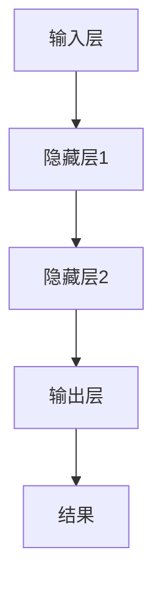
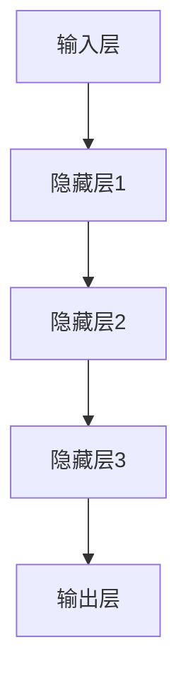
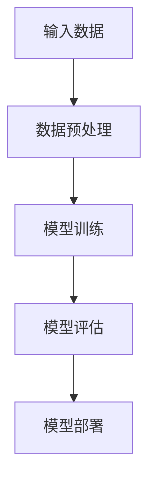
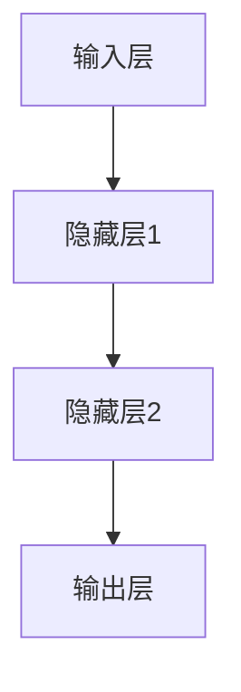
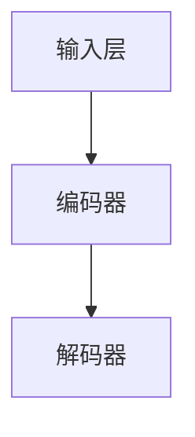

                 

### 《大模型时代的创业产品设计挑战：AI 赋能》

#### 概述与背景

**1.1 大模型时代的创业机会与挑战**

随着深度学习、神经网络、自然语言处理等技术的迅猛发展，大模型（Large Models）逐渐成为人工智能领域的研究热点。大模型是指具有数十亿至数千亿参数规模的人工神经网络模型，如GPT、BERT等。这些模型在图像识别、自然语言处理、语音识别等多个领域取得了显著成果，展现了巨大的潜力。

大模型时代的创业机会在于：首先，大模型能够实现更精准、更高效的数据分析，帮助创业者更好地挖掘用户需求，提供更加个性化的服务。其次，大模型的应用能够大幅提升产品的智能化水平，增强竞争力。例如，智能客服、智能推荐、智能诊断等应用场景中，大模型的应用已经取得了显著的成效。

然而，大模型时代也带来了新的挑战。首先，技术门槛较高。创业团队需要具备深厚的计算机科学、数学、统计学等背景知识，才能有效利用大模型。其次，市场风险增加。由于大模型的应用效果高度依赖于数据质量和算法优化，创业者需要承担数据获取、数据清洗、模型调优等过程中的不确定性。

**1.2 创业产品设计的核心要素**

创业产品设计的核心要素包括需求分析、技术选型和产品规划。

- **需求分析**：创业者需要深入挖掘用户需求，了解目标用户的特点和痛点，为产品设计提供依据。需求分析的方法包括用户调研、数据分析、竞品分析等。

- **技术选型**：在需求分析的基础上，创业者需要选择合适的大模型和技术工具。技术选型需要考虑模型的性能、可扩展性、开发成本等因素。例如，针对自然语言处理任务，可以选择GPT、BERT等大模型；针对图像识别任务，可以选择ResNet、VGG等模型。

- **产品规划**：创业者需要制定长期发展计划与策略，包括产品的功能规划、版本迭代、市场推广等。产品规划需要结合市场需求和技术发展趋势，确保产品具有持续的创新性和竞争力。

#### 核心概念与联系

**1.3 大模型原理与架构**

大模型的工作原理基于深度学习（Deep Learning），其核心思想是通过多层神经网络对数据进行建模和预测。以下是常见的大模型架构及其关键技术的简介：

- **深度学习（Deep Learning）**：深度学习是一种机器学习方法，通过多层神经网络对数据进行特征提取和分类。常见的深度学习模型包括卷积神经网络（CNN）、循环神经网络（RNN）等。

- **神经网络（Neural Networks）**：神经网络是模仿生物神经元工作方式的计算模型，由输入层、隐藏层和输出层组成。神经网络通过学习输入和输出数据之间的关系，实现数据的分类、回归等任务。

- **深度学习框架（Deep Learning Framework）**：深度学习框架提供了一套完整的工具和库，帮助开发者构建、训练和部署深度学习模型。常见的深度学习框架包括TensorFlow、PyTorch、Keras等。

**1.4 大模型的关键技术**

- **神经网络（Neural Networks）**：神经网络是深度学习的基础，通过多层神经元实现数据的特征提取和分类。以下是一个简化的神经网络架构图：



- **深度学习（Deep Learning）**：深度学习通过多层神经网络对数据进行建模和预测。以下是一个简化的深度学习模型：



- **自监督学习（Self-supervised Learning）**：自监督学习是一种无需人工标注数据的学习方法，通过利用数据的内在结构，实现数据的自动标注和特征提取。常见的大模型自监督学习方法包括生成对抗网络（GAN）、自编码器（Autoencoder）等。

**1.5 大模型的应用场景**

大模型在创业产品中的应用场景非常广泛，包括但不限于：

- **自然语言处理（Natural Language Processing）**：大模型在自然语言处理领域取得了显著成果，如机器翻译、文本分类、情感分析等。常见的大模型如GPT、BERT等。

- **图像识别（Image Recognition）**：大模型在图像识别领域具有强大的能力，如人脸识别、物体检测、图像分类等。常见的大模型如ResNet、VGG等。

- **语音识别（Voice Recognition）**：大模型在语音识别领域表现突出，如语音识别、语音合成等。常见的大模型如WaveNet、Transformer等。

**1.6 大模型的挑战与未来发展方向**

虽然大模型在各个领域取得了显著成果，但同时也面临着一些挑战：

- **计算资源消耗**：大模型的训练和推理需要大量的计算资源，对硬件设备提出了较高的要求。

- **数据依赖性**：大模型的效果高度依赖于数据质量，数据不足或数据质量差可能导致模型效果不佳。

- **算法复杂性**：大模型的算法复杂度较高，对开发者的技术要求较高。

未来，大模型的发展方向包括：

- **模型压缩与优化**：通过模型压缩、优化等技术，降低大模型的计算资源消耗，提高模型的可扩展性。

- **多模态学习**：结合多种数据类型（如文本、图像、语音等），实现更高效的特征提取和预测。

- **算法创新**：探索新的深度学习算法和模型架构，提高大模型的效果和可解释性。

#### 总结

大模型时代的到来为创业产品提供了前所未有的机遇和挑战。创业者需要深入了解大模型的原理和架构，掌握需求分析、技术选型和产品规划的核心要素，才能在激烈的市场竞争中脱颖而出。同时，创业者还需要紧跟大模型技术的发展趋势，不断创新和优化，以实现创业产品的长期发展。

<|imagine|>以下是本文的关键词：

- 大模型
- 创业产品设计
- AI赋能
- 需求分析
- 技术选型
- 产品规划
- 深度学习
- 自然语言处理
- 图像识别
- 语音识别

本文将围绕这些关键词展开讨论，分析大模型时代创业产品设计的挑战和机遇，分享实践经验，探讨未来发展趋势。希望通过本文，能够为读者提供有价值的参考和启示。接下来，我们将进一步探讨大模型时代的创业机会与挑战，以及创业产品设计的核心要素。 <|imagine|>

#### 概述与背景

**1.1 大模型时代的创业机会与挑战**

在人工智能技术飞速发展的背景下，大模型（Large Models）的崛起成为创业领域的一大亮点。大模型，尤其是基于深度学习（Deep Learning）的模型，如GPT（Generative Pre-trained Transformer）、BERT（Bidirectional Encoder Representations from Transformers）等，已经展示了其在各个行业中的巨大潜力。对于创业公司来说，大模型不仅提供了创新的解决方案，还带来了前所未有的机遇与挑战。

**大模型时代的创业机会：AI赋能与产业升级**

首先，大模型能够赋能各个行业，推动产业升级。例如，在金融领域，AI模型可以用于信用评分、风险管理等方面，提高金融机构的运营效率和准确性。在医疗领域，AI辅助诊断系统可以帮助医生快速、准确地诊断疾病，提高医疗服务质量。在零售领域，个性化推荐系统可以基于用户的购物行为和偏好，提供更精准的推荐，从而提升用户满意度和忠诚度。

此外，大模型在自然语言处理（Natural Language Processing, NLP）、图像识别（Image Recognition）、语音识别（Speech Recognition）等领域的应用也越来越广泛。这些应用不仅提高了企业的运营效率，还为客户提供了更加个性化和智能化的服务体验，从而提升了企业的竞争力。

**大模型时代的创业挑战：技术门槛与市场风险**

然而，大模型时代的创业也面临着一系列挑战。首先，技术门槛较高。大模型的研究和开发需要深厚的计算机科学、数学和统计学背景，同时对硬件设施的要求也很高，这无疑增加了创业的难度。创业者需要投入大量资源来培养技术团队，购买高性能计算设备，以及不断跟进最新的技术动态。

其次，市场风险也是一大挑战。大模型的应用效果高度依赖于数据质量和算法优化，而数据质量和算法优化往往需要长时间的试验和调整。如果创业公司在数据采集、模型训练和优化方面出现问题，可能会导致产品效果不佳，影响市场推广和用户口碑。

**1.2 创业产品设计的核心要素**

为了在激烈的市场竞争中脱颖而出，创业产品设计需要考虑以下几个核心要素：

**需求分析**：创业公司必须深入挖掘用户需求，了解目标用户的特点和痛点。通过用户调研、数据分析等方法，创业公司可以收集到关于用户行为、偏好和需求的第一手资料，为产品设计提供有力的支持。

**技术选型**：在需求分析的基础上，创业公司需要选择合适的大模型和技术工具。技术选型需要考虑模型的性能、可扩展性、开发成本等因素。例如，针对自然语言处理任务，可以选择GPT、BERT等大模型；针对图像识别任务，可以选择ResNet、VGG等模型。

**产品规划**：创业公司需要制定长期发展计划与策略，包括产品的功能规划、版本迭代、市场推广等。产品规划需要结合市场需求和技术发展趋势，确保产品具有持续的创新性和竞争力。

**1.3 大模型原理与架构**

要充分发挥大模型的优势，创业者需要了解大模型的原理与架构。大模型通常基于深度学习（Deep Learning）技术，其核心思想是通过多层神经网络（Neural Networks）对数据进行特征提取和建模。

以下是一个简化的大模型工作流程：



- **数据预处理（Data Preprocessing）**：在模型训练之前，需要将原始数据清洗、格式化，以便于模型处理。数据预处理包括数据清洗、数据归一化、数据增强等步骤。

- **模型训练（Model Training）**：使用大量标记数据对模型进行训练，模型通过不断调整内部参数，使得模型预测结果越来越接近真实值。常见的训练方法包括前向传播（Forward Propagation）、反向传播（Back Propagation）等。

- **模型评估（Model Evaluation）**：在模型训练完成后，需要对模型进行评估，以确定模型的性能。常用的评估指标包括准确率（Accuracy）、召回率（Recall）、F1 分数（F1 Score）等。

- **模型部署（Model Deployment）**：将训练好的模型部署到生产环境中，供用户使用。部署过程中需要考虑模型的性能、可靠性、安全性等因素。

**1.4 大模型的关键技术**

大模型的成功离不开一系列关键技术的支持。以下是一些常见的大模型关键技术：

- **神经网络（Neural Networks）**：神经网络是深度学习的基础，由多个神经元组成，通过学习输入和输出数据之间的关系，实现对数据的建模和预测。

- **深度学习框架（Deep Learning Frameworks）**：深度学习框架提供了一套完整的工具和库，帮助开发者构建、训练和部署深度学习模型。常见的深度学习框架包括TensorFlow、PyTorch、Keras等。

- **自监督学习（Self-supervised Learning）**：自监督学习是一种无需人工标注数据的学习方法，通过利用数据的内在结构，实现数据的自动标注和特征提取。

- **生成对抗网络（Generative Adversarial Networks, GAN）**：生成对抗网络由生成器和判别器两个神经网络组成，通过博弈过程，生成器不断优化，最终生成逼真的数据。

- **自编码器（Autoencoders）**：自编码器是一种无监督学习模型，通过学习输入数据的低维表示，实现数据的降维和特征提取。

**1.5 大模型的应用场景**

大模型在各个领域都有广泛的应用，以下是一些常见应用场景：

- **自然语言处理（NLP）**：大模型在NLP领域表现尤为出色，可以应用于机器翻译、文本分类、情感分析、对话系统等任务。

- **图像识别（Image Recognition）**：大模型在图像识别领域具有强大的能力，可以用于人脸识别、物体检测、图像分类等任务。

- **语音识别（Speech Recognition）**：大模型在语音识别领域取得了显著成果，可以用于语音识别、语音合成、语音增强等任务。

- **推荐系统（Recommendation Systems）**：大模型可以用于构建个性化推荐系统，根据用户的历史行为和偏好，为用户提供个性化的商品、内容推荐。

- **医疗诊断（Medical Diagnosis）**：大模型在医疗诊断领域具有巨大的潜力，可以用于疾病预测、诊断辅助、药物研发等任务。

**1.6 大模型的挑战与未来发展方向**

虽然大模型在各个领域展示了巨大的潜力，但同时也面临着一系列挑战。以下是一些常见挑战：

- **计算资源消耗**：大模型的训练和推理需要大量的计算资源，对硬件设备提出了较高的要求。创业公司需要投入大量资源来购买高性能计算设备。

- **数据依赖性**：大模型的效果高度依赖于数据质量，数据不足或数据质量差可能导致模型效果不佳。创业公司需要投入大量资源来收集和清洗数据。

- **算法复杂性**：大模型的算法复杂度较高，对开发者的技术要求较高。创业公司需要培养技术团队，掌握深度学习等相关技术。

未来，大模型的发展方向包括：

- **模型压缩与优化**：通过模型压缩、优化等技术，降低大模型的计算资源消耗，提高模型的可扩展性。

- **多模态学习**：结合多种数据类型（如文本、图像、语音等），实现更高效的特征提取和预测。

- **算法创新**：探索新的深度学习算法和模型架构，提高大模型的效果和可解释性。

#### 总结

大模型时代的创业机会与挑战并存。创业者需要深入了解大模型的原理和架构，掌握需求分析、技术选型和产品规划的核心要素，才能在激烈的市场竞争中脱颖而出。同时，创业者还需要面对计算资源消耗、数据依赖性、算法复杂性等挑战，并积极探索大模型的发展方向，以实现创业产品的长期发展。

### 《大模型时代的创业产品设计挑战：AI 赋能》

> **关键词**：大模型、创业产品设计、AI赋能、需求分析、技术选型、产品规划、深度学习、神经网络、自监督学习

> **摘要**：本文探讨了在人工智能技术飞速发展的背景下，大模型为创业产品带来的机遇与挑战。通过对大模型原理、架构及关键技术的深入分析，本文提出了创业产品设计的核心要素，并分享了实战案例与开发经验，为创业者提供了有价值的参考与启示。

---

#### 第二部分：创业产品设计方法

创业产品设计方法是一个系统的过程，包括需求分析、用户研究、产品设计流程、核心算法原理讲解以及数学模型与公式讲解。以下将逐一探讨这些核心环节。

#### 3.1 需求分析与用户研究

**用户画像与需求挖掘**

用户画像是对目标用户的特征进行详细描述，包括用户的年龄、性别、职业、兴趣、行为习惯等。通过构建用户画像，创业团队可以更好地了解用户需求，从而进行有针对性的产品设计。

用户画像的构建过程通常包括以下几个步骤：

1. **数据收集**：通过问卷调查、用户访谈、社交媒体数据分析等方式收集用户信息。
2. **数据清洗**：对收集到的数据进行清洗和整理，去除无效和重复数据。
3. **特征提取**：从清洗后的数据中提取关键特征，如年龄、性别、职业等。
4. **模型训练**：使用机器学习算法（如聚类、分类等）对用户特征进行分析，构建用户画像模型。

**需求挖掘**

在用户画像的基础上，创业团队可以通过以下方法挖掘用户需求：

1. **用户调研**：通过线上问卷、用户访谈等方式，直接了解用户的意见和建议。
2. **数据分析**：分析用户的行为数据，如点击率、转化率、留存率等，发现用户的使用习惯和偏好。
3. **竞品分析**：研究竞争对手的产品特点、用户评价等，借鉴成功经验，避免重复错误。

**用户研究方法**

用户研究是创业产品设计的重要环节，以下是一些常见的用户研究方法：

1. **用户访谈**：与目标用户进行面对面的交流，了解用户的需求、痛点、使用习惯等。用户访谈需要准备详细的访谈提纲，并确保提问技巧和环境的适宜性。
2. **用户观察**：通过观察用户在使用产品过程中的行为和反应，发现潜在问题，为产品设计提供改进方向。
3. **用户反馈**：收集用户的直接反馈，如产品评价、建议、投诉等。用户反馈可以帮助团队了解产品的实际效果，发现问题并改进。

#### 3.2 产品设计流程

产品设计流程是一个从需求分析到产品发布的过程，通常包括以下几个阶段：

1. **需求分析**：通过用户调研、数据分析等方法，了解用户需求，明确产品的功能定位和目标用户。
2. **原型设计**：基于需求分析，构建产品的原型，包括线框图、用户流程图、交互设计等。原型设计可以帮助团队快速验证产品概念，并收集用户的反馈。
3. **迭代优化**：根据用户反馈和数据分析，对产品原型进行迭代和优化，逐步完善产品功能。
4. **测试与发布**：进行功能测试、性能测试、用户体验测试等，确保产品稳定可靠。在测试通过后，发布产品并上线。

**MVP 设计**

MVP（Minimum Viable Product，最小可行性产品）是一种产品设计方法，旨在构建一个具有核心功能的产品原型，以便快速验证市场价值和用户需求。

**MVP 设计的核心原则**：

- **聚焦核心功能**：在资源有限的情况下，优先实现产品最核心的功能，避免过度功能化。
- **快速迭代**：通过不断迭代和优化，逐步完善产品功能，提高用户体验。
- **用户反馈**：积极收集用户反馈，了解用户需求和使用习惯，为产品迭代提供依据。

**MVP 设计的步骤**：

1. **确定核心功能**：根据用户需求和产品定位，确定产品的核心功能。
2. **构建原型**：基于核心功能，构建产品的原型，包括界面设计、交互逻辑等。
3. **用户测试**：将产品原型交付给目标用户进行测试，收集用户反馈。
4. **迭代优化**：根据用户反馈，对产品原型进行优化，并重复测试和迭代过程。

**产品迭代**

产品迭代是创业产品设计中不可或缺的环节，通过不断优化和改进，提高产品的竞争力。产品迭代通常包括以下几个步骤：

1. **需求分析**：通过市场调研、用户反馈等途径，收集新的需求信息。
2. **规划迭代**：根据需求分析结果，制定迭代计划，包括新增功能、优化现有功能等。
3. **设计开发**：根据迭代计划，进行产品设计、开发和测试。
4. **上线发布**：在迭代完成后，将产品更新发布，并收集用户反馈。

#### 3.3 核心算法原理讲解

**深度学习与神经网络**

深度学习是人工智能的一个重要分支，其核心思想是通过多层神经网络对数据进行特征提取和建模。以下是一个简化的神经网络模型：



在神经网络中，每个神经元（节点）都会接收输入信号，并通过权重进行加权求和，最后经过激活函数得到输出信号。神经网络通过反向传播算法不断调整权重，使得输出信号逐渐逼近目标值。

**常见深度学习模型**

1. **卷积神经网络（Convolutional Neural Networks, CNN）**：CNN 是一种专门用于图像识别和处理的神经网络模型，通过卷积层提取图像特征。

2. **循环神经网络（Recurrent Neural Networks, RNN）**：RNN 是一种适用于序列数据（如文本、时间序列等）的神经网络模型，通过循环结构保持状态信息。

3. **生成对抗网络（Generative Adversarial Networks, GAN）**：GAN 由生成器和判别器两个神经网络组成，通过对抗训练生成逼真的数据。

**自监督学习**

自监督学习是一种无需人工标注数据的学习方法，通过利用数据的内在结构，实现数据的自动标注和特征提取。以下是一个简单的自监督学习模型——自编码器（Autoencoder）：



自编码器通过学习输入数据的低维表示，实现数据的降维和特征提取。

**伪代码示例**

以下是一个简单的深度学习模型的伪代码示例：

```python
# 初始化模型参数
W = 初始化权重矩阵()
b = 初始化偏置向量()

# 前向传播
def forward_propagation(x):
    z = x * W + b
    a = 激活函数(z)

# 反向传播
def backward_propagation(a, y):
    delta = 损失函数(a, y)
    dW = delta * x
    db = delta

# 梯度下降
def gradient_descent(dW, db):
    W = W - 学习率 * dW
    b = b - 学习率 * db
```

#### 3.4 数学模型与公式讲解

**损失函数**

损失函数是深度学习模型中的一个关键组成部分，用于衡量模型输出与真实值之间的差异。以下是一些常见的损失函数：

1. **均方误差（Mean Squared Error, MSE）**：

$$
MSE = \frac{1}{n} \sum_{i=1}^{n} (y_i - \hat{y}_i)^2
$$

其中，$y_i$为真实值，$\hat{y}_i$为模型预测值，$n$为样本数量。

2. **交叉熵（Cross-Entropy）**：

$$
CE = -\frac{1}{n} \sum_{i=1}^{n} y_i \log(\hat{y}_i)
$$

其中，$y_i$为真实值（通常为0或1），$\hat{y}_i$为模型预测值。

**激活函数**

激活函数是深度学习模型中的一个关键组成部分，用于引入非线性因素。以下是一些常见的激活函数：

1. **sigmoid 函数**：

$$
sigmoid(x) = \frac{1}{1 + e^{-x}}
$$

2. **ReLU 函数**：

$$
ReLU(x) = \max(0, x)
$$

3. **Tanh 函数**：

$$
tanh(x) = \frac{e^x - e^{-x}}{e^x + e^{-x}}
$$

#### 3.5 项目实战与开发经验

**创业产品实战案例**

以下是一个创业产品的实战案例，通过实现一个简单的图像识别系统，展示创业产品开发的全过程。

**1. 开发环境搭建**

- **硬件环境**：配置高性能计算设备，如GPU加速器。
- **软件环境**：安装深度学习框架（如TensorFlow、PyTorch）和相关依赖库。

**2. 代码实现**

以下是一个简单的图像识别系统的伪代码实现：

```python
# 导入必要的库
import tensorflow as tf
import tensorflow.keras as keras

# 加载训练数据
train_data = keras.preprocessing.image.load_data('train_data')

# 数据预处理
train_data = preprocess_data(train_data)

# 构建模型
model = keras.Sequential([
    keras.layers.Conv2D(32, (3, 3), activation='relu', input_shape=(28, 28, 1)),
    keras.layers.MaxPooling2D((2, 2)),
    keras.layers.Conv2D(64, (3, 3), activation='relu'),
    keras.layers.MaxPooling2D((2, 2)),
    keras.layers.Flatten(),
    keras.layers.Dense(128, activation='relu'),
    keras.layers.Dense(10, activation='softmax')
])

# 编译模型
model.compile(optimizer='adam', loss='categorical_crossentropy', metrics=['accuracy'])

# 训练模型
model.fit(train_data, epochs=10)

# 评估模型
test_data = keras.preprocessing.image.load_data('test_data')
test_data = preprocess_data(test_data)
model.evaluate(test_data)
```

**3. 代码解读与分析**

以上代码实现了一个简单的卷积神经网络（CNN）模型，用于对手写数字进行识别。代码主要分为以下几个部分：

- **导入库**：导入必要的深度学习库，如TensorFlow和Keras。
- **加载训练数据**：使用Keras的load_data方法加载训练数据，通常为图像数据集。
- **数据预处理**：对训练数据进行预处理，如归一化、缩放等，以便模型更好地学习。
- **构建模型**：使用Keras的Sequential模型构建CNN模型，包括卷积层、池化层、全连接层等。
- **编译模型**：设置模型编译选项，如优化器、损失函数和评估指标。
- **训练模型**：使用fit方法训练模型，设置训练轮数和批次大小等参数。
- **评估模型**：使用evaluate方法评估模型在测试数据上的性能。

通过以上实战案例，读者可以了解到创业产品开发的基本流程和关键步骤，为实际创业项目提供参考。

#### 3.6 开发经验与技巧

**1. 开发环境搭建**

搭建高效的开发环境对于创业项目的成功至关重要。以下是一些搭建开发环境的关键步骤：

- **硬件环境**：选择适合的硬件设备，如高性能GPU加速器，以提高模型的训练和推理速度。
- **软件环境**：安装深度学习框架（如TensorFlow、PyTorch）和相关依赖库，确保环境稳定。
- **版本控制**：使用版本控制工具（如Git）管理代码和依赖库，以便于协同工作和代码回溯。

**2. 代码实现与解读**

在创业产品开发过程中，编写高质量的代码是关键。以下是一些代码实现和解读的技巧：

- **模块化**：将代码划分为多个模块，便于维护和扩展。
- **注释与文档**：为代码添加详细的注释和文档，提高代码的可读性和可维护性。
- **代码规范**：遵循统一的代码规范，如PEP8（Python编码规范），提高代码质量。
- **单元测试**：编写单元测试，确保代码的功能正确性和性能。

**3. 代码解读与分析**

以下是对一个创业产品代码的实际案例进行解读和分析：

```python
# 导入必要的库
import tensorflow as tf
import tensorflow.keras as keras

# 加载训练数据
train_data = keras.preprocessing.image.load_data('train_data')

# 数据预处理
train_data = preprocess_data(train_data)

# 构建模型
model = keras.Sequential([
    keras.layers.Conv2D(32, (3, 3), activation='relu', input_shape=(28, 28, 1)),
    keras.layers.MaxPooling2D((2, 2)),
    keras.layers.Conv2D(64, (3, 3), activation='relu'),
    keras.layers.MaxPooling2D((2, 2)),
    keras.layers.Flatten(),
    keras.layers.Dense(128, activation='relu'),
    keras.layers.Dense(10, activation='softmax')
])

# 编译模型
model.compile(optimizer='adam', loss='categorical_crossentropy', metrics=['accuracy'])

# 训练模型
model.fit(train_data, epochs=10)

# 评估模型
test_data = keras.preprocessing.image.load_data('test_data')
test_data = preprocess_data(test_data)
model.evaluate(test_data)
```

- **导入库**：代码首先导入TensorFlow和Keras库，这是深度学习开发的基础。
- **加载训练数据**：使用Keras的load_data方法加载训练数据，这是模型训练的数据来源。
- **数据预处理**：预处理数据，包括归一化和缩放，以提高模型训练效果。
- **构建模型**：构建一个简单的CNN模型，包括卷积层、池化层和全连接层，以实现图像识别。
- **编译模型**：设置模型的优化器、损失函数和评估指标，以准备模型训练。
- **训练模型**：使用fit方法训练模型，设置训练轮数和批次大小等参数。
- **评估模型**：加载测试数据，对模型进行评估，以验证模型性能。

通过以上解读和分析，读者可以更好地理解创业产品代码的实现过程和关键步骤，为实际开发提供指导。

#### 总结

创业产品设计方法是一个系统的过程，包括需求分析、用户研究、产品设计流程、核心算法原理讲解以及数学模型与公式讲解。通过本文的详细讨论，读者可以了解到创业产品设计的核心要素和关键步骤，为实际创业项目提供参考。在接下来的部分，我们将继续探讨创业产品推广与运营的策略，以及大模型与创业产品的发展趋势。这些内容将帮助读者更好地应对创业过程中的各种挑战，实现创业产品的长期成功。

### 创业产品推广与运营

#### 9.1 创业产品推广策略

创业产品的成功不仅依赖于优秀的产品设计和技术实现，还需要有效的推广策略来吸引目标用户，提升品牌知名度。以下是一些常见的创业产品推广策略：

**市场营销策略**

市场营销策略的核心是了解目标用户，并通过多种渠道传播产品信息，吸引潜在用户。以下是几种有效的市场营销策略：

1. **内容营销**：通过创作高质量的内容，如博客文章、视频、教程等，向目标用户传递产品的价值，建立品牌权威性。内容营销的核心在于提供有价值的信息，帮助用户解决问题，从而增加用户粘性。

2. **社交媒体推广**：利用社交媒体平台（如微博、微信、抖音、Facebook、Twitter等）进行产品推广，通过发布有趣、有吸引力的内容，吸引用户关注和参与。社交媒体推广的关键在于与用户互动，建立良好的品牌形象。

3. **广告投放**：通过搜索引擎广告（如Google AdWords）、社交媒体广告（如Facebook Ads、微博广告）等，将产品信息推送给潜在用户。广告投放需要精准定位目标用户，同时注意成本控制，确保广告效果最大化。

4. **合作营销**：与相关行业的合作伙伴（如内容创作者、行业专家、同行等）进行合作，通过合作活动、联合推广等方式，共同推广产品。合作营销可以扩大产品的影响力，提高品牌知名度。

**社交媒体推广**

社交媒体推广是创业产品推广的重要手段，以下是一些具体的策略：

1. **社交媒体选择**：根据目标用户的特点和习惯，选择合适的社交媒体平台。例如，针对年轻用户，可以选择微博、抖音、快手等平台；针对专业人士，可以选择LinkedIn、知乎等平台。

2. **内容创作**：创作有趣、有价值的内容，吸引用户关注。内容形式可以多样，包括图文、视频、直播等。内容创作需要紧密结合产品特点，突出产品优势，同时注重用户体验。

3. **互动与反馈**：与用户进行互动，回答用户的问题，收集用户反馈，不断优化产品。互动与反馈可以帮助团队了解用户需求，提高用户满意度，增加用户忠诚度。

4. **社交媒体广告**：在社交媒体平台上投放广告，增加产品的曝光率。广告投放需要精准定位，通过数据分析优化广告效果，提高投资回报率。

**用户增长与留存**

用户增长与留存是创业产品运营的重要目标，以下是一些有效的策略：

1. **用户引导**：在产品上线初期，通过引导用户注册、使用产品，快速积累用户基础。用户引导可以通过优惠活动、免费试用等方式实现。

2. **用户体验优化**：不断提升用户体验，提高用户满意度。用户体验优化包括界面设计、功能优化、性能优化等方面。

3. **用户激励**：通过用户激励策略，增加用户活跃度和忠诚度。用户激励可以包括积分奖励、等级制度、分享奖励等。

4. **用户社区建设**：建立用户社区，促进用户之间的交流和互动，增加用户粘性。用户社区可以包括论坛、微信群、QQ群等。

#### 9.2 创业产品运营经验

**成功案例：某创业产品的成功运营**

某创业公司开发了一款智能医疗诊断系统，通过深度学习模型实现疾病的自动诊断。以下是该产品的成功运营经验：

1. **需求分析与市场定位**：公司通过对市场需求和用户需求的深入分析，确定了产品的目标用户群体和功能定位。产品定位于医院和诊所，提供快速、准确的疾病诊断服务。

2. **技术创新**：公司投入大量资源进行技术研发，开发了高性能的深度学习模型，实现了疾病的自动诊断。技术创新是产品成功的关键，公司通过不断优化算法，提高诊断准确率。

3. **产品推广**：公司采取了多种推广策略，包括内容营销、社交媒体推广、广告投放等。通过在社交媒体上发布高质量的内容，吸引了大量潜在用户。同时，通过广告投放，扩大了产品的知名度。

4. **用户激励**：公司通过积分奖励、等级制度等用户激励策略，提高了用户的活跃度和忠诚度。用户激励不仅增加了用户的粘性，还促进了产品的口碑传播。

**失败案例：某创业产品的失败原因分析**

某创业公司开发了一款智能语音助手，但最终未能成功。以下是该产品的失败原因分析：

1. **需求分析不足**：公司在需求分析阶段未能充分了解用户需求，导致产品功能定位不明确。产品缺乏用户的核心需求，难以吸引和留住用户。

2. **技术实现问题**：公司在技术实现方面存在问题，如语音识别准确率低、响应速度慢等。技术问题影响了用户体验，导致用户流失。

3. **推广策略不当**：公司在推广策略上存在明显失误，如广告投放效果不佳、社交媒体内容创作缺乏吸引力等。推广策略不当导致产品知名度低，用户获取困难。

4. **用户激励不足**：公司未能通过有效的用户激励策略增加用户活跃度和忠诚度。用户激励不足导致用户粘性低，用户流失严重。

#### 总结

创业产品推广与运营是创业成功的关键环节。通过有效的市场营销策略、社交媒体推广、用户增长与留存策略，创业公司可以吸引目标用户，提升品牌知名度。成功运营经验可以帮助公司发现并利用市场机会，而失败案例则提供了宝贵的教训，有助于公司避免类似错误。在接下来的部分，我们将探讨大模型与创业产品的发展趋势，为读者提供未来创业的指导。

### 大模型与创业产品的发展趋势

#### 11.1 大模型在创业产品中的应用前景

大模型在创业产品中的应用前景广阔，随着人工智能技术的不断进步，大模型的应用场景将更加多样化和深入。以下是几个可能的大模型应用前景：

1. **个性化推荐系统**：大模型能够处理大量的用户数据，通过深度学习算法对用户行为和偏好进行学习，提供个性化的推荐服务。例如，电商平台可以利用大模型为用户提供个性化的商品推荐，提高用户体验和销售额。

2. **智能客服系统**：大模型在自然语言处理（NLP）方面具有显著优势，能够实现智能对话、情感识别等功能。创业公司可以利用大模型构建智能客服系统，提高客服效率，降低人力成本。

3. **自动化交易系统**：大模型在金融领域的应用潜力巨大，可以用于构建自动化交易系统，通过深度学习算法分析市场数据，实现高效的投资决策。

4. **智能医疗诊断系统**：大模型在医疗领域的应用前景广阔，可以通过对大量医学数据的分析，辅助医生进行疾病诊断和治疗方案推荐，提高医疗质量和效率。

5. **自动驾驶系统**：大模型在自动驾驶领域的应用具有重要意义，可以通过对海量图像和传感器数据的处理，实现自动驾驶车辆的感知、规划和控制。

#### 11.2 未来趋势：AI技术与创业产品的深度融合

未来，人工智能技术与创业产品的深度融合将成为发展趋势，主要体现在以下几个方面：

1. **多模态数据处理**：大模型能够处理多种类型的数据，如文本、图像、语音等。未来，创业产品将更加注重多模态数据的融合，实现更高效的特征提取和预测。

2. **边缘计算与云计算的结合**：大模型的训练和推理需要大量的计算资源，未来将出现更多的边缘计算设备，结合云计算资源，实现高效的大模型计算和部署。

3. **可解释性AI**：随着大模型在各个领域的应用，用户对模型的透明度和可解释性需求越来越高。未来，将出现更多可解释性AI技术，帮助用户理解和信任模型。

4. **AI伦理与隐私保护**：随着AI技术的广泛应用，AI伦理和隐私保护问题越来越受到关注。未来，创业产品将更加注重伦理和隐私保护，确保AI技术的健康发展。

#### 11.3 创业产品的创新方向

基于大模型技术，创业产品可以从以下方向进行创新：

1. **智能化服务**：通过大模型实现智能化的服务，如智能客服、智能诊断、智能推荐等，提高用户体验和满意度。

2. **自动化流程**：利用大模型实现自动化流程，如自动化交易、自动化营销等，降低人力成本，提高运营效率。

3. **个性化定制**：通过大模型分析用户数据，提供个性化的定制服务，如个性化推荐、个性化诊断等，满足用户多样化需求。

4. **新应用场景开发**：探索大模型在新领域的应用，如智能医疗、智能交通、智能农业等，开拓新的市场空间。

#### 总结

大模型与创业产品的融合将为创业领域带来前所未有的机遇。创业者需要紧跟技术发展趋势，积极创新，利用大模型技术提升产品的智能化水平，实现创业产品的长期发展。在接下来的部分，我们将对全文进行总结，并分享对未来创业产品设计的启示与思考。

### 总结与展望

#### 5.2 创业产品设计的启示与思考

大模型时代的创业产品设计，不仅需要深入理解技术原理，还要紧跟市场需求，灵活应对市场变化。通过对本文的详细探讨，我们可以得出以下启示与思考：

**需求分析的重要性**

创业产品的成功取决于是否真正解决了用户的需求。因此，需求分析是产品设计的核心环节。创业者需要通过多种方法，如用户调研、数据分析等，深入了解用户的需求和痛点，确保产品设计具有实际应用价值。

**技术选型的战略意义**

在技术选型方面，创业者需要具备前瞻性，选择符合市场发展趋势的技术。大模型作为当前人工智能领域的热点，为创业产品提供了强大的赋能能力。创业者应关注深度学习、神经网络、自监督学习等核心技术，并根据自己的产品定位和需求，选择合适的技术方案。

**产品规划的长期视角**

产品规划不仅仅是短期目标的设定，更是一个长期的战略过程。创业者需要具备远见，制定明确的发展路线图，包括产品功能规划、版本迭代、市场推广等。通过不断迭代和优化，确保产品能够适应市场变化，持续满足用户需求。

**实战经验的价值**

实战经验是创业产品成功的宝贵财富。通过案例分析和实际操作，创业者可以更深入地了解产品开发过程中的难点和关键点，从而提高开发效率，减少风险。本文中的实战案例，为创业者提供了有益的参考和启示。

**团队建设的关键性**

创业产品设计的成功离不开优秀的团队。创业者需要招募具备专业技能的人才，组建高效的技术团队，共同攻克技术难题，实现产品创新。同时，团队协作和沟通也是成功的关键，通过有效的团队合作，可以确保项目顺利进行。

**未来展望**

随着人工智能技术的不断发展，大模型在创业产品中的应用将更加广泛和深入。创业者应关注以下几个方面的趋势：

1. **多模态数据处理**：未来，创业产品将更加注重多模态数据的融合，通过大模型实现更高效的特征提取和预测，提升用户体验。

2. **边缘计算与云计算的结合**：随着边缘计算技术的发展，创业者可以利用云计算资源，结合边缘计算设备，实现高效的大模型计算和部署。

3. **可解释性AI**：随着AI技术的普及，用户对AI模型的透明度和可解释性需求将越来越高。创业者应关注可解释性AI的研究和应用，提高用户对AI模型的信任度。

4. **AI伦理与隐私保护**：AI伦理和隐私保护问题将日益重要。创业者应严格遵守相关法律法规，确保AI技术的健康发展，同时提高用户隐私保护意识。

**结语**

大模型时代的创业产品设计，既充满挑战，又充满机遇。创业者需要具备敏锐的市场洞察力、扎实的专业技能和卓越的团队协作能力，才能在激烈的市场竞争中脱颖而出。通过本文的探讨，希望为读者提供有价值的参考和启示，助力创业产品的成功。在未来的创业道路上，让我们共同探索、不断创新，共同迎接人工智能时代的挑战与机遇。

### 附录：AI 大模型开发工具与资源

在创业产品设计中，选择合适的AI大模型开发工具和资源至关重要。以下将介绍一些主流的深度学习框架、开发工具和教程，以帮助读者更好地掌握AI大模型开发。

#### 13.1 主流深度学习框架对比

1. **TensorFlow**：
   - **优点**：拥有广泛的社区支持，丰富的API和工具，适用于各种规模的深度学习项目。
   - **缺点**：相比于PyTorch，TensorFlow的学习曲线较陡峭，部署过程中较为复杂。
   - **使用场景**：适合大型项目和企业级应用。

2. **PyTorch**：
   - **优点**：学习曲线较为平缓，动态计算图使其在研究和开发阶段更具灵活性。
   - **缺点**：部署相对复杂，性能可能不如TensorFlow。
   - **使用场景**：适合研究和快速原型开发。

3. **Keras**：
   - **优点**：基于Theano和TensorFlow构建的高层神经网络API，易于使用，适合快速搭建模型。
   - **缺点**：依赖于底层的TensorFlow或Theano框架，性能可能受到限制。
   - **使用场景**：适合快速实验和小型项目。

4. **JAX**：
   - **优点**：基于Apache MXNet，支持自动微分和高效的数值计算，适用于复杂的机器学习任务。
   - **缺点**：社区支持相对较少，生态不如TensorFlow和PyTorch成熟。
   - **使用场景**：适合研究高效数值计算和自动微分的应用。

**选择建议**：
- **小型项目或研究**：选择PyTorch或Keras，易于快速开发和实验。
- **企业级应用**：选择TensorFlow或JAX，提供更完善的工具和社区支持。

#### 13.2 开发资源与教程

1. **官方网站和文档**：
   - TensorFlow：[https://www.tensorflow.org/](https://www.tensorflow.org/)
   - PyTorch：[https://pytorch.org/](https://pytorch.org/)
   - Keras：[https://keras.io/](https://keras.io/)
   - JAX：[https://jax.readthedocs.io/](https://jax.readthedocs.io/)

2. **在线教程和课程**：
   - Coursera：[https://www.coursera.org/courses?query=deep+learning](https://www.coursera.org/courses?query=deep+learning)
   - edX：[https://www.edx.org/course/deep-learning-0](https://www.edx.org/course/deep-learning-0)
   - Fast.ai：[https://course.fast.ai/](https://course.fast.ai/)

3. **开源项目和代码示例**：
   - GitHub：[https://github.com/tensorflow/tensorflow](https://github.com/tensorflow/tensorflow)
   - GitHub：[https://github.com/pytorch/pytorch](https://github.com/pytorch/pytorch)
   - GitHub：[https://github.com/keras-team/keras](https://github.com/keras-team/keras)

4. **论坛和社区**：
   - TensorFlow论坛：[https://forums.tensorflow.org/](https://forums.tensorflow.org/)
   - PyTorch论坛：[https://discuss.pytorch.org/](https://discuss.pytorch.org/)
   - Stack Overflow：[https://stackoverflow.com/questions/tagged/deep-learning](https://stackoverflow.com/questions/tagged/deep-learning)

通过以上资源和教程，读者可以系统地学习AI大模型开发的基础知识，并逐步提高实际开发能力。在选择开发工具时，应根据项目的需求、团队的技术背景和资源情况做出合理的选择。希望这些资源和教程能够为读者在创业产品开发过程中提供有力支持。

### 附录：AI 大模型开发工具与资源

在创业产品的设计中，选择合适的AI大模型开发工具和资源至关重要。以下将介绍一些主流的深度学习框架、开发环境搭建工具、代码实现示例以及推荐的学习资源。

#### 13.1 主流深度学习框架对比

**TensorFlow**

- **优点**：拥有广泛的社区支持，丰富的API和工具，适用于各种规模的深度学习项目。
- **缺点**：相对于PyTorch，TensorFlow的学习曲线较陡峭，部署过程中较为复杂。
- **使用场景**：适合大型项目和企业级应用。

**PyTorch**

- **优点**：学习曲线较为平缓，动态计算图使其在研究和开发阶段更具灵活性。
- **缺点**：部署相对复杂，性能可能不如TensorFlow。
- **使用场景**：适合研究和快速原型开发。

**Keras**

- **优点**：基于Theano和TensorFlow构建的高层神经网络API，易于使用，适合快速搭建模型。
- **缺点**：依赖于底层的TensorFlow或Theano框架，性能可能受到限制。
- **使用场景**：适合快速实验和小型项目。

**JAX**

- **优点**：基于Apache MXNet，支持自动微分和高效的数值计算，适用于复杂的机器学习任务。
- **缺点**：社区支持相对较少，生态不如TensorFlow和PyTorch成熟。
- **使用场景**：适合研究高效数值计算和自动微分的应用。

**选择建议**：对于小型项目或研究，建议选择PyTorch或Keras，易于快速开发和实验。对于企业级应用，选择TensorFlow或JAX，它们提供了更完善的工具和社区支持。

#### 13.2 开发环境搭建

**硬件环境**

- **GPU加速器**：为了有效训练大模型，建议使用NVIDIA GPU加速器，如RTX 30系列或更高性能的GPU。
- **CPU**：高性能CPU，如Intel Xeon系列或AMD Ryzen系列，可以提高模型训练的效率。

**软件环境**

- **操作系统**：Linux系统，如Ubuntu 18.04或更高版本，是深度学习开发的常见选择。
- **深度学习框架**：根据项目需求，安装相应的深度学习框架，如TensorFlow、PyTorch、Keras等。
- **Python**：建议使用Python 3.8或更高版本，以兼容最新的深度学习库。

**安装步骤**

1. **安装操作系统**：在物理服务器或虚拟机上安装Linux系统。
2. **安装GPU驱动**：根据GPU型号，安装相应的NVIDIA驱动。
3. **安装Python和深度学习框架**：使用pip或conda安装Python和相关深度学习库。

#### 13.3 代码实现与解读

**示例：使用PyTorch实现一个简单的神经网络**

```python
import torch
import torch.nn as nn
import torch.optim as optim

# 定义神经网络结构
class SimpleNet(nn.Module):
    def __init__(self):
        super(SimpleNet, self).__init__()
        self.fc1 = nn.Linear(784, 128)
        self.fc2 = nn.Linear(128, 64)
        self.fc3 = nn.Linear(64, 10)

    def forward(self, x):
        x = torch.relu(self.fc1(x))
        x = torch.relu(self.fc2(x))
        x = self.fc3(x)
        return x

# 初始化模型、优化器和损失函数
model = SimpleNet()
optimizer = optim.Adam(model.parameters(), lr=0.001)
criterion = nn.CrossEntropyLoss()

# 数据加载（示例使用MNIST数据集）
train_loader = torch.utils.data.DataLoader(torch.utils.data.TensorDataset(train_data, train_labels), batch_size=64, shuffle=True)

# 模型训练
for epoch in range(10):
    for inputs, labels in train_loader:
        optimizer.zero_grad()
        outputs = model(inputs)
        loss = criterion(outputs, labels)
        loss.backward()
        optimizer.step()

    print(f'Epoch [{epoch+1}/10], Loss: {loss.item()}')

# 模型评估
with torch.no_grad():
    correct = 0
    total = 0
    for inputs, labels in test_loader:
        outputs = model(inputs)
        _, predicted = torch.max(outputs.data, 1)
        total += labels.size(0)
        correct += (predicted == labels).sum().item()

print(f'Accuracy: {100 * correct / total}%')
```

**代码解读**：

1. **模型定义**：使用PyTorch的`nn.Module`类定义神经网络结构，包括输入层、隐藏层和输出层。
2. **前向传播**：通过`forward`方法实现前向传播过程，使用ReLU激活函数增加模型的非线性。
3. **优化器和损失函数**：选择Adam优化器和交叉熵损失函数，用于模型训练。
4. **数据加载**：使用`DataLoader`加载训练数据，并设置批次大小和打乱顺序。
5. **模型训练**：通过迭代数据，更新模型参数，计算损失并反向传播。
6. **模型评估**：在测试集上评估模型性能，计算准确率。

#### 13.4 推荐学习资源

**书籍**

1. 《深度学习》（Goodfellow, I., Bengio, Y., Courville, A.）
2. 《动手学深度学习》（A动手学深度学习团队）
3. 《深度学习与计算机视觉》（Xie, S., Liu, Z., et al.）

**在线课程**

1. [深度学习课程 - Coursera](https://www.coursera.org/learn/deep-learning)
2. [PyTorch官方教程 - PyTorch](https://pytorch.org/tutorials/)
3. [Keras官方教程 - Keras](https://keras.io/getting-started/)

**博客和文章**

1. [TensorFlow官方博客](https://www.tensorflow.org/blog/)
2. [PyTorch官方博客](https://pytorch.org/blog/)
3. [Medium上的深度学习文章](https://medium.com/topics/deep-learning)

通过以上工具和资源，读者可以系统地学习AI大模型开发的相关知识，提高实际开发能力。希望这些资源和教程能够为读者在创业产品开发过程中提供有力支持。在接下来的部分，我们将对全文进行总结，并分享对未来创业产品设计的启示与思考。

