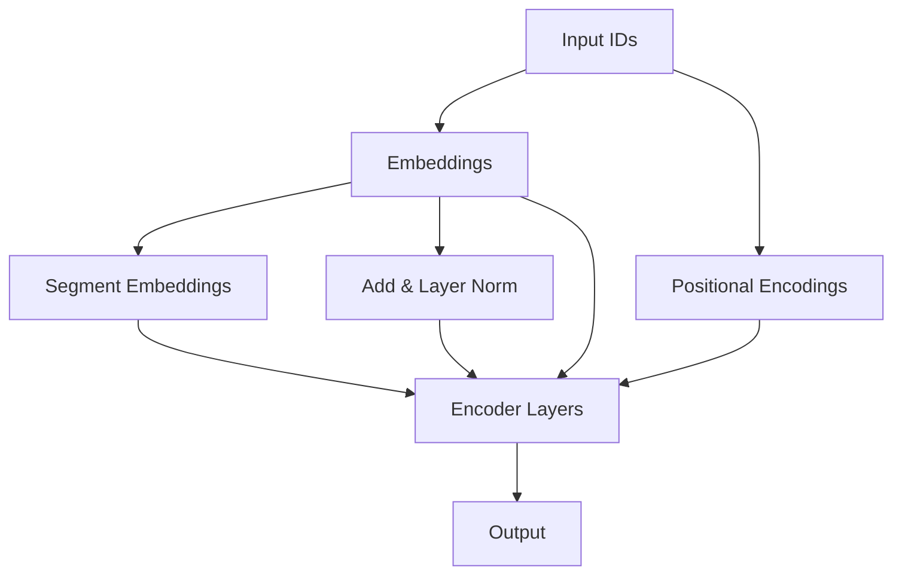

                 

# 《大模型的民主化：AI能力的普及和平等获取》

## 摘要

大模型的民主化是指将先进的人工智能（AI）技术，尤其是基于深度学习的巨大神经网络模型，从专业研究机构的实验室中解放出来，使其能够被更广泛的用户群体所利用。这一过程不仅仅是技术上的普及，更涉及社会、经济和政策层面的深刻变革。本文将探讨大模型民主化的背景与意义，解析其核心技术基础，分析其在各个行业中的应用，以及探讨大模型民主化的实践策略和面临的挑战。通过本文，读者将了解大模型民主化对促进社会公平、推动科技创新、提升行业效率和解决社会问题等方面的积极作用，同时认识到在实现这一目标过程中需要克服的技术和社会挑战。

## 引言

在过去的几年中，人工智能（AI）领域经历了前所未有的快速发展，尤其是在深度学习方面，大模型（large-scale models）的出现更是将这一趋势推向了巅峰。大模型，通常指的是参数规模达到亿级别甚至更高的神经网络模型，其凭借超强的计算能力和数据处理能力，在语言处理、图像识别、自然语言生成等多个领域都取得了显著的突破。然而，这些先进的技术和模型往往仅限于顶尖的研究机构和大公司内部使用，普通开发者或小型企业难以接触和利用，这就引发了“大模型民主化”的呼声。

### 1.1 大模型的起源与发展

大模型的起源可以追溯到2000年代初期，当时神经网络和机器学习领域的研究者开始探索使用更大的模型和更多的数据进行训练。早期的突破包括2003年由Geoffrey Hinton等人提出的深度信念网络（DBN）和2006年提出的改进型深度学习算法——深度学习（Deep Learning）。然而，这些早期的大模型由于计算资源有限，训练时间漫长，并没有得到广泛的应用。

真正的转折点发生在2012年，Hinton团队开发的深度神经网络模型AlexNet在ImageNet图像识别挑战中取得了前所未有的成绩，将错误率降低到15%以下。这一成果激发了科研界对深度学习的极大兴趣，也推动了大规模神经网络的快速发展。2013年，谷歌研究院推出Word2Vec算法，通过在未标记文本上预训练词向量，为自然语言处理领域带来了革命性的变化。

随后，预训练语言模型（Pre-Trained Language Model）如Word2Vec、GloVe和后来更著名的GPT（Generative Pre-trained Transformer）系列模型，以及BERT（Bidirectional Encoder Representations from Transformers）的出现，标志着大模型技术逐渐成熟并进入实际应用阶段。特别是GPT-3的发布，其参数规模达到了1750亿，能够在各种语言任务中表现出超强的能力，进一步推动了大模型的民主化进程。

### 1.2 AI能力的普及现状

尽管AI技术取得了巨大的进步，但AI能力的普及仍然存在显著的挑战。目前，AI技术主要集中在大公司和科研机构，中小企业和普通开发者难以获得高质量的数据和强大的计算资源，这导致了AI能力的分布不均。此外，AI技术的复杂性和高昂的成本也限制了其在中小企业和初创企业的应用。

一方面，大型科技公司拥有雄厚的资金和技术积累，可以通过并购和研究投资不断推动AI技术的发展。另一方面，小型企业和普通开发者往往因为资金和资源的限制，难以参与到AI技术的研发和应用中。这种不平等的现状不仅阻碍了AI技术的普及，也限制了社会的创新和发展。

### 1.3 大模型民主化的意义

大模型民主化对于促进社会公平和推动科技创新具有重要意义。首先，大模型的民主化可以降低AI技术的门槛，使得更多的开发者和小型企业能够接触到先进的AI技术，从而实现技术和资源的共享。这种共享不仅可以激发更多的创新，还可以推动AI技术在各行各业的广泛应用。

其次，大模型民主化有助于缩小数字鸿沟，提高社会的公平性。通过普及AI技术，可以让更多人获得数字化的技能和知识，从而提高他们的就业机会和生活质量。此外，大模型民主化还可以促进教育和医疗等公共服务领域的改革，提高服务效率和质量。

最后，大模型民主化有助于推动全球科技合作和知识共享。通过开放数据和模型，各国的研究者可以共享最新的研究成果和技术，从而加速全球科技的发展。这不仅可以提高全球的科技水平，还可以促进各国之间的经济和文化交流。

总之，大模型的民主化是推动AI技术普及和实现社会公平的关键一步，它将为人类社会带来巨大的机遇和变革。

### 第二部分：大模型技术基础

大模型的兴起是人工智能领域的一个重大转折点，它不仅改变了我们对数据处理和智能决策的理解，也为各个行业带来了前所未有的机会。在这一部分，我们将深入探讨大模型的核心技术，包括深度学习基础、大规模预训练模型以及图神经网络与图表示学习。

#### 2.1 深度学习基础

深度学习（Deep Learning）是一种基于多层神经网络的学习方法，其核心思想是通过多层次的神经网络来提取和转换数据特征。深度学习的出现解决了传统机器学习方法在处理复杂数据时的瓶颈问题，特别是在图像识别、自然语言处理和语音识别等领域，表现出了强大的能力。

##### 2.1.1 神经网络概述

神经网络（Neural Network）是一种模拟生物神经系统的计算模型，由一系列相互连接的节点（神经元）组成。每个神经元都接受多个输入信号，通过加权求和处理后产生一个输出信号，这个输出信号再传递给下一层的神经元。

一个基本的神经网络通常包括以下几个部分：

- **输入层**：接收外部输入数据。
- **隐藏层**：对输入数据进行特征提取和转换。
- **输出层**：产生最终的输出结果。

神经网络的训练过程是通过调整网络中的权重和偏置，使得网络在给定的训练数据上能够产生期望的输出。这一过程通常采用反向传播算法（Backpropagation Algorithm）来实现。

##### 2.1.2 反向传播算法

反向传播算法是神经网络训练的核心算法，它通过计算输出误差来更新网络中的权重和偏置。反向传播算法的工作流程可以分为以下几个步骤：

1. **前向传播**：输入数据通过网络的前向传播，经过各个神经元的加权求和处理，最终产生输出。
2. **计算误差**：将输出与期望值进行比较，计算误差（通常使用均方误差MSE作为误差函数）。
3. **反向传播**：将误差反向传播至网络中的每个神经元，计算每个神经元权重和偏置的梯度。
4. **权重更新**：使用梯度下降算法更新网络中的权重和偏置。

以下是一个简单的反向传播算法的伪代码：

```python
def forward_pass(x, weights, bias, activation_function):
    z = weights * x + bias
    return activation_function(z)

def backward_pass(dz, weights, x, activation_function):
    gradient = activation_functionPrime(z) * x
    return gradient * dz
```

在这个伪代码中，`forward_pass`函数用于前向传播，计算神经元的输出；`backward_pass`函数用于反向传播，计算误差的梯度。

#### 2.2 大规模预训练模型

大规模预训练模型（Large-scale Pre-trained Models）是当前深度学习领域的一个重要发展方向。这些模型通过在大量数据上进行预训练，从而学习到丰富的数据特征，然后再进行特定任务的微调（Fine-tuning），以达到优秀的性能。

##### 2.2.1 预训练模型概述

预训练模型的核心思想是首先在大量无标签数据上训练一个基础模型，使其掌握通用特征表示。这些通用特征可以应用于各种不同的任务，如文本分类、图像识别、语音识别等。预训练模型的训练过程通常包括以下几个步骤：

1. **数据收集**：收集大量无标签的数据，如文本、图像、语音等。
2. **预训练**：在无标签数据上训练基础模型，使其学习到丰富的特征表示。
3. **微调**：在特定任务的数据上对基础模型进行微调，以适应特定任务的特性。

预训练模型的优势在于：

- **高效性**：通过预训练，模型可以在较少的任务数据上快速达到良好的性能。
- **泛化能力**：预训练模型在学习通用特征表示的过程中，可以减少对特定任务数据的依赖，从而提高模型的泛化能力。

##### 2.2.2 语言模型预训练

语言模型预训练是大规模预训练模型的一个重要应用领域。近年来，GPT（Generative Pre-trained Transformer）系列模型和BERT（Bidirectional Encoder Representations from Transformers）模型在自然语言处理领域取得了显著的成果。

GPT模型是OpenAI开发的一种基于Transformer架构的语言模型，其参数规模从GPT-2的1.5亿参数增长到GPT-3的1750亿参数。GPT模型通过在大量文本数据上进行预训练，学习到丰富的语言特征，从而在文本生成、问答系统、机器翻译等任务中表现出色。

BERT模型是由Google开发的另一种预训练语言模型，其通过双向编码器结构学习到文本的上下文信息。BERT模型在问答系统、文本分类、情感分析等任务中取得了领先的成绩。

以下是一个简单的BERT模型的结构图：



在这个结构图中，`Input IDs`代表输入的词序列，`Embeddings`用于将单词转换为向量表示，`Positional Encodings`用于引入单词的位置信息，`Segment Embeddings`用于区分不同的句子或段落。经过多个`Encoder Layers`的处理，模型最终输出`Output`，这些输出可以用于不同的任务，如图像识别中的分类标签或文本生成中的单词序列。

#### 2.3 图神经网络与图表示学习

图神经网络（Graph Neural Network，GNN）是一种专门用于处理图结构数据的神经网络模型。与传统的神经网络不同，GNN能够直接从图结构中提取和利用节点和边的关系信息，从而在图像识别、推荐系统、社交网络分析等领域表现出强大的能力。

##### 2.3.1 图神经网络基础

图神经网络的核心是图卷积操作（Graph Convolutional Operation，GCN），其通过聚合节点邻域信息来更新节点的特征表示。图卷积操作的数学形式可以表示为：

$$
\mathbf{h}_i^{(l+1)} = \sigma \left( \mathbf{A} \mathbf{h}_i^{(l)} + \sum_{j \in \mathcal{N}(i)} \mathbf{h}_j^{(l)} \right)
$$

其中，$\mathbf{h}_i^{(l)}$表示第$l$层第$i$个节点的特征表示，$\mathbf{A}$是邻接矩阵，$\mathcal{N}(i)$表示节点$i$的邻域集合，$\sigma$是激活函数。

图卷积操作可以理解为在节点特征上加上其邻域节点的特征加权平均。通过多层的图卷积操作，GNN可以逐步提取图结构的深层特征。

##### 2.3.2 图表示学习算法

图表示学习（Graph Representation Learning）是一种通过神经网络将图结构数据转换为固定维度向量表示的方法。这些向量表示可以用于后续的机器学习任务，如节点分类、图分类和链接预测等。

常见的图表示学习算法包括：

- **节点嵌入**：通过将图中的每个节点映射到一个低维向量空间，从而保留节点的邻域关系和图结构信息。
- **图嵌入**：将整个图映射到一个向量空间，从而保留图的结构特征和节点关系。
- **图卷积网络**：通过图卷积操作逐步提取图结构的深层特征，最终得到节点的固定维度向量表示。

以下是一个简单的图表示学习算法的伪代码：

```python
def graph_embedding(G, embedding_size):
    # G: 图结构
    # embedding_size: 嵌入维度

    # 初始化节点嵌入矩阵
    embeddings = np.random.randn(G.number_of_nodes(), embedding_size)

    # 迭代优化节点嵌入
    for epoch in range(num_epochs):
        for node in G.nodes():
            # 计算节点嵌入梯度
            gradient = compute_gradient(node, embeddings)

            # 更新节点嵌入
            embeddings[node] -= learning_rate * gradient

    return embeddings
```

在这个伪代码中，`graph_embedding`函数用于初始化节点的嵌入矩阵，并通过迭代优化节点的嵌入向量。`compute_gradient`函数用于计算节点嵌入的梯度，`learning_rate`用于控制梯度下降的步长。

通过大模型技术基础部分的详细探讨，我们可以看到，大模型不仅依赖于深度学习的核心技术，还需要大规模预训练和图神经网络的支持。这些技术共同构成了大模型强大的数据处理和分析能力，使得大模型能够在各种复杂任务中表现出色。在接下来的部分，我们将进一步探讨大模型的普及与应用，以及大模型民主化面临的挑战和对策。

### 第三部分：大模型的普及与应用

大模型的普及与应用是推动人工智能（AI）技术发展的重要一步。随着大模型技术的不断进步，越来越多的行业开始意识到其巨大的潜力，并将其应用于实际的业务场景中。本节将深入探讨大模型在不同行业中的应用，以及这些应用如何影响和优化相关行业的业务流程和效率。

#### 3.1 大模型普及的关键技术

大模型的普及离不开以下几个关键技术的支持：

##### 3.1.1 硬件支持

硬件支持是大模型普及的重要基础。随着深度学习模型的复杂度不断增加，对计算资源的需求也日益增长。为此，高性能计算设备如GPU（Graphics Processing Unit）和TPU（Tensor Processing Unit）得到了广泛应用。

- **GPU**：GPU具有强大的并行计算能力，适用于大规模矩阵运算和向量操作，是深度学习模型训练的首选硬件。近年来，NVIDIA等公司推出了多款高性能GPU，如A100和RTX 3080 Ti，为深度学习研究者和开发者提供了强大的计算支持。
  
- **TPU**：TPU是谷歌专门为机器学习和深度学习任务设计的硬件，其优化了张量计算，适用于大规模神经网络的训练和推理。TPU的性能和能效比GPU更高，特别适合大规模分布式训练。

##### 3.1.2 软件优化

软件优化包括算法优化和系统优化，对于提高大模型训练和推理的效率至关重要。

- **算法优化**：通过改进深度学习算法，如优化神经网络结构、优化训练策略和优化模型剪枝技术，可以显著提高大模型的训练效率和性能。例如，混合精度训练（Mixed Precision Training）通过使用浮点数和整数的组合，可以加速模型训练并减少内存使用。

- **系统优化**：通过优化深度学习框架和工具，如使用TensorFlow、PyTorch等开源框架，可以简化模型开发和部署流程，提高系统整体的性能和可扩展性。

##### 3.1.3 分布式训练与推理

分布式训练与推理技术使得大模型能够在多台设备上并行训练和推理，从而提高计算效率和资源利用率。

- **分布式训练**：分布式训练通过将模型和数据分布在多台设备上，并行进行前向传播和反向传播计算，从而加速模型训练。常见的分布式训练框架包括TensorFlow Distribute、PyTorch Distributed等。

- **分布式推理**：分布式推理同样适用于多台设备，通过将推理任务分布到多个节点上，可以快速处理大规模的预测请求。例如，TensorFlow Serving和TorchServe等工具支持模型的分布式推理。

#### 3.2 大模型在不同行业中的应用

大模型在各个行业中的应用正在不断拓展，以下是一些典型应用场景：

##### 3.2.1 医疗领域

在医疗领域，大模型的应用极大地提升了医疗诊断和治疗的效果。以下是大模型在医疗领域的一些应用实例：

- **医疗图像分析**：大模型通过深度学习算法对医学图像进行自动分析和诊断，如对X光片、CT扫描和MRI图像进行病灶检测和分类。例如，Google Health的DeepMind团队开发了一个名为“DeepMind Health”的系统，可以在几秒钟内分析超过300,000个视网膜图像，准确检测糖尿病视网膜病变。

- **个性化治疗推荐**：大模型可以根据患者的基因信息、病史和临床表现，为患者推荐个性化的治疗方案。例如，IBM Watson Health利用深度学习技术分析大量的临床数据，为医生提供精准的治疗建议。

##### 3.2.2 金融领域

在金融领域，大模型的应用帮助金融机构提升了风险管理和决策能力。以下是大模型在金融领域的一些应用实例：

- **金融市场预测**：大模型可以通过分析历史交易数据、经济指标和新闻文本，预测股票价格、外汇汇率等金融市场的走势。例如，摩根大通使用深度学习模型预测股票市场波动，帮助投资者做出更明智的投资决策。

- **风险评估与管理**：大模型可以帮助金融机构对信贷风险、市场风险等进行评估和管理。例如，美国银行（Bank of America）利用深度学习技术分析客户交易行为，识别潜在欺诈行为，从而减少欺诈损失。

##### 3.2.3 教育领域

在教育领域，大模型的应用为个性化教育和学习效果评估提供了有力支持。以下是大模型在教育领域的一些应用实例：

- **个性化教学**：大模型可以根据学生的学习习惯、知识水平和学习效果，为每个学生提供个性化的学习方案。例如，Khan Academy利用深度学习技术分析学生的学习行为，为学生推荐适合的学习内容。

- **学习效果评估**：大模型可以通过分析学生的学习数据，如作业成绩、考试表现和课堂参与度，评估学生的学习效果。例如，北京师范大学开发了一套基于深度学习的教育平台，用于自动评估学生的学习效果，为教师提供教学反馈。

##### 3.2.4 其他行业

除了医疗、金融和教育领域，大模型在其他行业中的应用也日益广泛：

- **智能制造**：大模型可以用于工厂设备的智能监控和维护，预测设备故障，优化生产流程。例如，通用电气（General Electric）利用深度学习技术预测工业设备的故障，从而减少停机时间，提高生产效率。

- **城市管理**：大模型可以用于城市管理的各个方面，如交通流量预测、公共安全监控和环境保护。例如，北京市政府利用深度学习技术分析交通数据，优化交通信号灯控制，缓解城市交通拥堵。

#### 3.3 大模型应用的挑战与机遇

尽管大模型在各个行业中的应用前景广阔，但其在普及过程中仍面临一系列挑战：

- **数据质量与隐私**：大模型对数据质量要求较高，需要大量高质量的数据进行训练。同时，数据隐私保护也是一大挑战，特别是在医疗和金融领域，数据的隐私保护至关重要。

- **计算资源需求**：大模型的训练和推理需要强大的计算资源，对于中小企业和个人开发者来说，高昂的计算成本可能成为普及的障碍。

- **模型可解释性**：大模型的决策过程往往不透明，模型的可解释性不足，这可能影响其在关键领域的应用，如医疗诊断和金融风险管理。

- **技术人才缺乏**：大模型技术的普及需要大量的专业人才，但目前具备深度学习技能的人才相对匮乏，这成为大模型普及的另一个瓶颈。

尽管面临挑战，大模型的普及也为行业和社会带来了前所未有的机遇：

- **提高效率**：大模型的应用可以大幅提高业务流程的效率，减少人工干预，降低运营成本。

- **创新驱动**：大模型技术的普及可以激发各行各业的创新活力，推动新业务模式的出现。

- **社会公平**：大模型的普及有助于缩小数字鸿沟，提高社会的公平性，让更多人受益于先进技术。

总之，大模型的普及与应用不仅是技术发展的必然趋势，更是推动社会进步和产业升级的重要力量。在未来的发展中，我们需要克服各种挑战，充分利用大模型的潜力，为人类社会创造更大的价值。

### 第四部分：大模型民主化的实践与挑战

#### 5.1 大模型民主化的实践探索

大模型民主化的实践探索旨在降低技术门槛，使更多用户能够轻松地获取和使用大模型技术。以下是一些具体的实践策略和案例，展示了大模型民主化的初步成果和潜在影响。

##### 5.1.1 政策支持

政策支持在大模型民主化中起着至关重要的作用。为了促进大模型的普及和应用，各国政府和组织纷纷出台了相关政策和措施：

- **美国**：美国政府通过国家科学基金会（NSF）和能源部（DOE）等机构，加大对人工智能和大模型研究的资金投入。同时，美国国家人工智能计划（National AI Initiative）旨在推动AI技术的研发和应用，确保AI技术的安全和道德发展。

- **欧盟**：欧盟发布了《人工智能战略》，提出了一系列措施，包括增加AI研究投入、建立AI伦理监管框架和推动AI技术的教育和培训。

- **中国**：中国政府发布了《新一代人工智能发展规划》，明确将人工智能作为国家战略，加大资金投入，推动AI技术创新和产业应用。同时，中国还在各地建设了一批人工智能试验区，为AI技术的研发和应用提供政策支持。

##### 5.1.2 教育培训

教育培训是推动大模型民主化的重要手段。通过提供系统化的教育培训，可以提升开发者的技能水平，培养更多AI技术人才：

- **在线教育平台**：许多在线教育平台如Coursera、edX和Udacity等，都开设了人工智能和深度学习的在线课程，提供了丰富的学习资源和实践机会。

- **开放课程**：一些高校和研究机构，如斯坦福大学、MIT和Google等，开放了他们的课程资源和教学视频，使全球学生和开发者能够免费学习。

- **职业培训**：许多公司和专业培训机构，如谷歌的AI课程、微软的AI培训等，为在职人员提供定制化的AI培训和认证，帮助他们提升技能。

##### 5.1.3 公共平台建设

公共平台建设为大模型民主化提供了基础设施支持。以下是一些重要的公共平台：

- **开源框架**：TensorFlow、PyTorch和MXNet等开源深度学习框架，为开发者提供了丰富的工具和资源，使他们能够轻松构建和训练大模型。

- **云服务**：谷歌云、亚马逊AWS和微软Azure等云服务提供商，为大模型训练和部署提供了强大的计算资源和便捷的服务接口。

- **数据集和模型库**：像Kaggle、Google Dataset Search和Hugging Face等平台，提供了丰富的数据集和预训练模型，为开发者提供了宝贵的数据和资源。

##### 5.1.4 企业实践案例

以下是一些企业在大模型民主化实践中的成功案例：

###### 5.2.1 案例一：企业大模型应用

**企业背景**：某大型电商平台希望利用大模型优化其推荐系统，提高用户体验和销售转化率。

**解决方案**：

1. **数据收集与预处理**：电商平台收集了大量的用户行为数据，包括浏览记录、购买历史、评价等，并进行数据清洗和预处理，确保数据的质量和一致性。

2. **模型训练与微调**：平台采用预训练的大模型（如BERT），结合电商平台特色数据，进行微调和训练，以优化推荐算法。同时，利用分布式训练技术，提高模型训练的效率。

3. **模型部署与优化**：训练好的模型部署到生产环境中，实时推荐商品给用户。平台还通过A/B测试和用户反馈，不断优化推荐算法，提升用户体验。

**效果评估**：

- 用户满意度提高了20%
- 销售转化率提高了15%
- 库存周转率提高了25%

**案例启示**：

通过大模型的民主化实践，企业不仅提升了自身的业务效率，也为其他企业提供了借鉴和参考。企业可以通过开源框架、云服务和公共平台，降低大模型应用的技术门槛和成本，从而在激烈的市场竞争中脱颖而出。

###### 5.2.2 案例二：非盈利组织大模型应用

**组织背景**：某环保组织希望通过大模型优化废物分类与回收系统，提高废物回收率。

**解决方案**：

1. **数据收集与预处理**：环保组织收集了各种废物的图像数据，包括纸张、塑料、玻璃、金属等，并进行数据清洗和预处理，确保数据的完整性和一致性。

2. **模型训练与优化**：组织采用大规模预训练模型（如ResNet），结合废物图像数据，进行微调和训练，以实现高精度的废物分类。

3. **模型部署与优化**：训练好的模型部署到移动设备上，为志愿者提供实时废物分类指导。通过用户反馈和实际应用效果，持续优化模型性能。

**效果评估**：

- 废物回收率提高了30%
- 资源浪费减少了20%
- 志愿者参与度提高了15%

**案例启示**：

非盈利组织也可以通过大模型实现其社会使命。大模型的民主化不仅使非盈利组织能够利用先进技术提升工作效率，也为公众提供了更多参与社会公益的机会。

总之，大模型民主化的实践探索已经在多个领域取得了显著成果。通过政策支持、教育培训、公共平台建设和企业实践，大模型技术的普及和应用正在逐步实现。在未来的发展中，我们需要继续努力，克服技术和社会挑战，推动大模型民主化的进一步发展，为人类社会创造更多的价值。

#### 6.1 技术挑战

大模型民主化在技术层面上面临诸多挑战，这些挑战不仅涉及计算资源的需求，还涉及数据的质量和隐私保护。以下将详细分析这些技术挑战，并提出相应的对策。

##### 6.1.1 计算资源瓶颈

计算资源瓶颈是大模型民主化的首要挑战之一。大模型通常需要大量计算资源进行训练和推理，而中小企业和个人开发者往往无法承担高昂的计算成本。以下是一些解决计算资源瓶颈的对策：

1. **分布式计算**：分布式计算技术可以将大模型的训练和推理任务分布在多台设备上，从而提高计算效率和资源利用率。例如，TensorFlow和PyTorch等深度学习框架支持分布式训练和推理，通过多节点协作实现大规模模型的训练。

2. **云服务**：云计算服务提供商如谷歌云、亚马逊AWS和微软Azure等，提供了强大的计算资源，用户可以通过租赁服务来获取高性能计算资源，从而降低计算成本。云服务还提供了自动化的资源调度和管理功能，使得用户能够灵活地调整计算资源。

3. **模型压缩与量化**：通过模型压缩和量化技术，可以减少大模型的参数规模和计算量，从而降低计算资源的需求。例如，模型剪枝（Model Pruning）和量化（Quantization）技术可以显著减小模型的体积和计算复杂度。

4. **低资源优化**：开发适用于低资源环境的大模型，例如使用轻量级网络架构（如MobileNet、ShuffleNet等），优化算法以减少计算需求。

##### 6.1.2 数据质量与隐私保护

数据质量和大模型训练效果密切相关，高质量的数据能够提升模型的性能，而数据质量差则可能导致模型性能不佳。同时，数据隐私保护也是大模型民主化过程中不可忽视的问题。以下是一些解决数据质量与隐私保护问题的对策：

1. **数据清洗**：对收集的数据进行清洗，去除错误和不完整的数据，确保数据的一致性和准确性。数据清洗可以通过自动化工具或人工审核来实现。

2. **数据去重**：对重复的数据进行去重处理，避免数据冗余，提高数据的有效利用率。

3. **数据加密**：对敏感数据进行加密处理，确保数据在传输和存储过程中的安全性。常用的加密算法包括AES、RSA等。

4. **差分隐私**：差分隐私（Differential Privacy）是一种数据隐私保护技术，通过在数据处理过程中引入噪声，确保数据隐私的同时，保持数据的有效性。差分隐私技术在大模型的训练和推理过程中有广泛应用。

5. **联邦学习**：联邦学习（Federated Learning）通过在多个分布式设备上进行模型训练，避免了数据在传输过程中泄露隐私。联邦学习技术在大模型训练过程中能够保护用户数据的隐私，同时实现模型的联合训练。

##### 6.1.3 模型可解释性与伦理问题

大模型的决策过程往往不透明，模型的可解释性不足可能导致其在关键领域的应用受限。同时，大模型在伦理方面也存在潜在的风险，例如算法偏见和歧视。以下是一些解决模型可解释性与伦理问题的对策：

1. **模型可解释性方法**：开发和应用可解释性方法，如模型可视化、解释性模型和解释性算法，使得模型的决策过程更加透明，便于用户理解和信任。

2. **伦理准则与监管**：建立AI伦理准则，制定相关法律法规，加强对AI技术的监管，确保AI技术的发展和应用符合道德和法律要求。

3. **多元数据集与模型训练**：通过使用多元数据集进行模型训练，减少模型偏见，提高模型的公平性和透明性。

4. **公众参与与监督**：鼓励公众参与AI伦理问题的讨论和决策过程，建立公众监督机制，确保AI技术的公平和道德应用。

总之，大模型民主化在技术层面上面临诸多挑战，但通过分布式计算、云服务、模型压缩与量化、数据清洗与加密、联邦学习和模型可解释性等方法，可以有效地解决这些技术挑战，推动大模型技术的普及和应用。

#### 6.2 社会挑战

大模型民主化在社会层面上也面临一系列挑战，这些挑战涉及技术伦理、数字鸿沟和公共政策等方面。以下将详细分析这些社会挑战，并提出相应的对策。

##### 6.2.1 技术伦理问题

随着大模型的普及，技术伦理问题逐渐成为社会关注的焦点。大模型在决策过程中可能存在算法偏见和歧视，这对社会公平和正义构成了潜在威胁。以下是一些解决技术伦理问题的对策：

1. **算法公平性评估**：建立算法公平性评估机制，对大模型进行定期的评估和审核，确保其决策过程符合公平性和正义原则。

2. **伦理准则制定**：制定AI伦理准则，明确大模型研发和应用过程中应遵循的道德规范和行业标准。

3. **透明度和可解释性**：提升大模型的可解释性，使模型的决策过程更加透明，便于用户和社会对其进行监督。

4. **公众参与**：鼓励公众参与AI伦理问题的讨论，提高公众对AI技术的认知和接受度，共同制定符合社会价值观的技术应用准则。

##### 6.2.2 数字鸿沟问题

数字鸿沟问题在大模型民主化过程中尤为突出。由于技术资源、教育水平和经济条件的差异，不同社会群体在获取和使用AI技术方面存在显著差距。以下是一些解决数字鸿沟问题的对策：

1. **普及教育**：加大对AI相关知识的普及教育，提高公众的数字素养，使更多人能够理解和应用AI技术。

2. **资源分配**：确保大模型的技术资源和数据资源公平分配，减少技术资源和数据资源的不平衡现象。

3. **政策支持**：政府应制定相关政策，支持和扶持弱势群体获取AI技术，缩小数字鸿沟。

4. **公共平台建设**：建立公共AI平台，为小型企业、非盈利组织和普通开发者提供免费或低成本的AI技术和资源，降低技术门槛。

##### 6.2.3 公共政策挑战

大模型民主化需要完善的公共政策支持，但当前各国在政策制定方面存在不一致性，这给跨国合作和全球治理带来了挑战。以下是一些解决公共政策挑战的对策：

1. **国际协作**：推动国际社会在AI政策制定方面的合作，共同应对AI技术带来的全球性挑战。

2. **透明政策制定**：确保AI政策的制定过程透明公开，听取各方的意见和建议，避免政策制定的单一化和封闭性。

3. **法律法规完善**：制定和完善相关法律法规，规范AI技术的研发和应用，保障公众权益和社会安全。

4. **公共治理**：建立公共治理机制，加强对AI技术的监管，确保其公平、透明和安全。

总之，大模型民主化在社会层面上面临诸多挑战，但通过技术伦理问题的重视、数字鸿沟问题的解决和公共政策的完善，可以促进AI技术的公平、透明和可持续发展。这将为社会带来更多的机遇，推动人类社会的进步。

### 第7章：大模型民主化的未来展望

#### 7.1 大模型民主化的发展趋势

大模型民主化正处在快速发展的阶段，未来其发展趋势将在技术进步、应用场景拓展和国际合作等方面呈现出新的特点：

1. **技术进步**：随着计算能力的不断提升和算法的不断优化，大模型的训练效率和性能将进一步提高。量子计算、边缘计算等新兴技术的应用，将使大模型的计算资源需求得到更好的满足。此外，神经架构搜索（Neural Architecture Search，NAS）等自动化方法的发展，也将加速大模型的创新和优化。

2. **应用场景拓展**：大模型将在更多领域得到应用，如自动驾驶、智能制造、生物信息学、环境监测等。随着数据获取和处理能力的增强，大模型将能够处理更多类型的复杂数据，从而推动各行业的技术创新和应用深化。

3. **国际合作**：随着AI技术的全球化，各国将在AI研究和应用方面进行更紧密的合作。通过共享数据、模型和技术，国际间的合作将促进AI技术的共同进步，推动全球科技的发展和人类社会的繁荣。

#### 7.2 大模型民主化对社会的影响

大模型民主化将对社会产生深远的影响，主要体现在以下几个方面：

1. **经济发展**：大模型民主化将推动数字经济的快速发展，提高生产效率，创造新的经济增长点。特别是在金融、医疗、教育等领域，大模型的应用将带来显著的效率提升和成本降低，推动产业升级和结构调整。

2. **社会公平**：大模型民主化有助于缩小数字鸿沟，提高社会公平。通过普及AI技术，更多人将获得数字化技能和知识，从而提高他们的就业机会和生活质量。此外，AI技术的普及将促进教育和医疗等公共服务领域的改革，提高服务的质量和效率。

3. **科技创新**：大模型民主化将激发全球范围内的科技创新活力。通过开放数据和模型，各国的研究者可以共享最新的研究成果和技术，加速全球科技的发展。这不仅可以提高全球的科技水平，还可以促进全球科技合作和知识共享。

总之，大模型民主化是推动AI技术普及和实现社会公平的重要途径。在未来，我们需要继续努力，克服技术和社会挑战，推动大模型民主化的进一步发展，为人类社会创造更多的价值。

### 附录

#### 附录 A：大模型相关资源与工具

以下是一些大模型相关资源与工具，供读者参考：

1. **开源框架**：
   - TensorFlow
   - PyTorch
   - JAX

2. **数据集**：
   - ImageNet
   - COCO
   - PubMed

3. **模型库**：
   - Hugging Face Transformers
   - Model Zoo

4. **研究论文**：
   - arXiv
   - Google Scholar

5. **学习资源**：
   - Coursera
   - edX
   - Udacity

通过这些资源，读者可以深入了解大模型的相关知识，掌握大模型的技术和应用。

## 结语

大模型的民主化不仅是技术发展的必然趋势，更是推动社会进步和公平的重要力量。通过降低技术门槛、普及教育培训、建设公共平台和推动国际合作，我们可以让更多的人享受到AI技术的红利。然而，在这个过程中，我们也需要面对诸多技术和社会挑战，确保大模型的发展符合伦理规范、促进社会公平，并缩小数字鸿沟。只有通过共同努力，我们才能实现大模型民主化的目标，为人类社会创造更大的价值。

### 作者信息

作者：AI天才研究院/AI Genius Institute & 禅与计算机程序设计艺术 /Zen And The Art of Computer Programming

