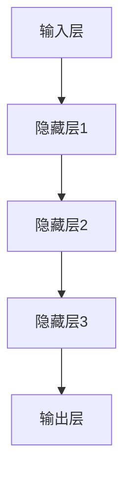

                 

### 第一部分：大模型与智慧金融概述

#### 1.1 大模型与智慧金融的概念与联系

在当今快速发展的信息技术时代，大模型（Large Models）与智慧金融（Smart Finance）正逐步成为金融领域中的重要驱动力。那么，什么是大模型？什么是智慧金融？它们又是如何相互联系的？

**1.1.1 大模型的定义与特点**

大模型，顾名思义，是指具有巨大参数规模和计算能力的机器学习模型。这些模型通常基于深度学习技术，如神经网络，具有极强的数据处理和模式识别能力。大模型的特点主要体现在以下几个方面：

- **参数规模巨大**：大模型的参数数量往往达到数十亿甚至数百万亿，这使它们能够捕捉到复杂的数据模式。
- **强大的计算能力**：大模型需要强大的计算资源进行训练和推理，通常依赖于高性能计算集群或GPU。
- **高度非线性**：大模型的结构通常具有高度非线性特性，能够处理复杂数据和任务。

**1.1.2 智慧金融的定义与发展**

智慧金融，是指利用先进的信息技术，如人工智能、大数据、云计算等，对传统金融服务进行创新和优化的一种金融服务模式。智慧金融的发展可以从以下几个方面进行概述：

- **技术创新**：智慧金融借助人工智能技术，实现了个性化推荐、风险控制、智能投顾等创新服务。
- **数据分析**：通过大数据技术，智慧金融能够收集、处理和分析海量数据，为金融服务提供数据支持。
- **用户体验**：智慧金融通过优化用户体验，如智能客服、移动支付等，提升了金融服务的便捷性和满意度。

**1.1.3 大模型在智慧金融中的应用**

大模型在智慧金融中的应用范围广泛，主要包括以下几个方面：

- **风险管理与欺诈检测**：大模型能够通过分析历史数据和实时数据，预测潜在风险并检测欺诈行为。
- **个性化金融服务**：大模型可以根据用户行为数据，为用户提供个性化的金融产品和服务。
- **智能投顾**：大模型通过分析用户财务状况和投资偏好，提供智能化的投资建议。
- **智能客服**：大模型可以模拟人类客服，为用户提供实时、高效的服务。

**1.1.4 大模型赋能智慧金融的潜在影响**

大模型的广泛应用，将极大地提升智慧金融的服务质量和效率，其潜在影响包括：

- **提升决策能力**：大模型能够处理和分析复杂的数据，为金融机构提供更准确、更及时的决策支持。
- **降低成本**：大模型可以自动化许多金融任务，如数据处理、风险评估等，从而降低运营成本。
- **提升用户体验**：通过个性化服务和智能推荐，大模型能够提升用户的金融服务体验。
- **创新金融服务模式**：大模型将推动金融行业的创新，如智能投顾、区块链金融等新模式的产生。

综上所述，大模型与智慧金融的紧密联系，不仅推动了金融服务的智能化发展，也为创业者提供了丰富的创新空间。在接下来的章节中，我们将进一步探讨大模型的架构与算法原理，以及创业者如何在智慧金融领域实现创新。

### 1.2 大模型架构与算法原理

大模型的发展离不开其背后的复杂架构和算法原理。本节将详细介绍大模型的基本架构、常用算法以及训练与优化技术，帮助读者深入理解大模型的核心机制。

#### 1.2.1 大模型的基本架构

大模型通常由以下几个关键部分组成：

- **输入层（Input Layer）**：接收外部输入数据，如文本、图像、音频等。
- **隐藏层（Hidden Layers）**：一层或多层，用于处理和转换输入数据，通过激活函数（Activation Functions）引入非线性特性。
- **输出层（Output Layer）**：生成预测结果或分类标签，如股票价格预测、客户流失预测等。

**Mermaid流程图：**



#### 1.2.2 常见的大模型算法

大模型主要基于深度学习技术，其中一些常用的算法包括：

- **深度神经网络（Deep Neural Networks, DNN）**：DNN是最基础的深度学习模型，通过多层神经元的非线性组合，对输入数据进行处理。
- **卷积神经网络（Convolutional Neural Networks, CNN）**：CNN主要应用于图像处理领域，通过卷积操作捕捉图像中的局部特征。
- **递归神经网络（Recurrent Neural Networks, RNN）**：RNN适用于序列数据，如自然语言处理和时间序列预测。
- **长短时记忆网络（Long Short-Term Memory, LSTM）**：LSTM是RNN的一种变体，能够有效处理长序列依赖问题。
- **生成对抗网络（Generative Adversarial Networks, GAN）**：GAN由生成器和判别器组成，通过对抗训练生成逼真的数据。

**伪代码：**

```python
# DNN算法伪代码
def dnn(input_data, weights, biases):
    layer_outputs = []
    for layer in layers:
        z = np.dot(input_data, weights) + biases
        layer_outputs.append(activation_function(z))
    return layer_outputs[-1]

# CNN算法伪代码
def cnn(image_data, filters, biases):
    feature_maps = []
    for filter in filters:
        z = conv2d(image_data, filter) + biases
        feature_maps.append(activation_function(z))
    return feature_maps
```

#### 1.2.3 大模型训练与优化技术

大模型的训练过程通常涉及以下几个关键步骤：

- **数据预处理**：对输入数据进行清洗、归一化等预处理，以便模型能够更好地学习。
- **损失函数（Loss Function）**：通过计算模型输出和实际标签之间的差距，评估模型性能。
- **反向传播（Backpropagation）**：利用梯度下降算法，通过反向传播更新模型参数。
- **优化器（Optimizer）**：如随机梯度下降（SGD）、Adam优化器等，用于加速收敛和改善模型性能。

**数学模型与公式：**

$$
\begin{aligned}
\text{损失函数} &: L(\theta) = -\frac{1}{m}\sum_{i=1}^{m} y^{(i)} \log(z^{(i)}) \\
\text{梯度下降} &: \theta_{\text{new}} = \theta_{\text{old}} - \alpha \nabla_{\theta} L(\theta)
\end{aligned}
$$

**举例说明：**

假设我们使用DNN模型进行股票价格预测，模型输出和实际价格之间的差距是模型损失。通过反向传播和梯度下降，我们可以逐步调整模型参数，使损失函数达到最小。

综上所述，大模型的基本架构和算法原理为其在智慧金融中的应用奠定了基础。在下一节中，我们将进一步探讨智慧金融所面临的挑战与机遇，以及创业者如何抓住这些机遇。

### 1.3 智慧金融的挑战与机遇

智慧金融作为金融科技的重要分支，正不断改变着传统金融服务的格局。然而，随着大模型等先进技术的广泛应用，智慧金融也面临着一系列挑战和机遇。本节将详细分析这些挑战与机遇，帮助创业者更好地理解和把握智慧金融的发展趋势。

#### 1.3.1 智慧金融面临的挑战

尽管智慧金融带来了许多创新和便利，但也面临着以下几个挑战：

- **数据隐私与安全问题**：智慧金融依赖于大量用户数据，这些数据的安全性直接关系到用户的隐私和金融安全。如何保护数据不被滥用或泄露，是智慧金融发展的重要问题。
- **算法透明性与可解释性**：大模型通常被视为“黑盒”模型，其决策过程难以解释。这给金融监管和用户信任带来了挑战，如何提高算法的透明性和可解释性，是智慧金融需要解决的问题。
- **法律法规与合规性**：随着智慧金融的发展，相关法律法规也在不断更新。如何确保智慧金融产品和服务符合法律法规要求，是创业者需要关注的重要问题。
- **技术成熟度与落地应用**：虽然大模型等技术在理论上具有巨大潜力，但在实际应用中，仍存在技术成熟度、性能和成本等方面的挑战。

**举例说明：**

假设一家创业公司开发了基于大模型的智能投顾系统，该系统能够根据用户数据提供个性化的投资建议。然而，由于数据隐私和安全问题，用户对系统的信任度较低，导致系统无法大规模推广。此外，系统的算法透明性和可解释性不足，使得监管机构对其合规性产生疑虑。

#### 1.3.2 大模型在智慧金融中的机遇

尽管智慧金融面临着诸多挑战，但大模型的应用也为创业者带来了前所未有的机遇：

- **提升决策能力**：大模型能够处理和分析海量数据，为金融机构提供更准确、更及时的决策支持。例如，通过分析用户行为数据，金融机构可以更精准地进行风险评估和投资决策。
- **降低运营成本**：大模型可以自动化许多金融任务，如数据处理、风险评估等，从而降低金融机构的运营成本。例如，利用大模型进行欺诈检测，可以显著降低金融欺诈事件的发生率。
- **优化用户体验**：大模型能够根据用户数据提供个性化的金融产品和服务，提升用户体验。例如，智能投顾系统可以根据用户的风险偏好和财务状况，提供定制化的投资建议。
- **创新金融服务模式**：大模型的应用将推动金融服务的创新，如区块链金融、智能投顾等。创业者可以结合大模型技术，开发出全新的金融服务模式，满足用户多样化的需求。

**举例说明：**

假设一家创业公司利用大模型技术，开发了一款基于区块链的智能投顾系统。该系统能够通过分析用户数据，提供个性化的投资建议，并在区块链上记录和验证投资决策。这种创新模式不仅提升了用户体验，还增强了数据的安全性和透明性。

#### 1.3.3 创业者如何抓住机遇

为了抓住智慧金融中的机遇，创业者可以从以下几个方面入手：

- **深入了解市场需求**：了解用户需求和市场趋势，确定具有潜力的创新方向。例如，通过市场调研，发现用户对智能投顾的需求日益增长，创业者可以开发相关产品。
- **强化技术研发**：加强在大模型、区块链、大数据等核心技术领域的研究，提升产品技术含量和竞争力。例如，创业者可以与高校和研究机构合作，共同攻克技术难题。
- **注重数据安全与合规**：在产品设计和运营过程中，注重数据安全和合规性，确保产品符合法律法规要求。例如，创业者可以采用加密技术保护用户数据，并遵循相关数据保护法规。
- **构建合作伙伴关系**：与金融机构、技术供应商等建立紧密的合作伙伴关系，共同推进智慧金融的发展。例如，创业者可以与银行合作，共同开发智能投顾产品。

**结论：**

智慧金融的发展带来了前所未有的机遇和挑战。创业者需要深入了解市场需求、强化技术研发、注重数据安全与合规、构建合作伙伴关系，才能在智慧金融领域中取得成功。在下一节中，我们将进一步探讨创业者如何在智慧金融领域实现创新。

### 第二部分：创业者重塑金融服务体验的实践

#### 2.1 创业者视角下的金融服务

在智慧金融的时代，创业者需要具备全新的视角和思维方式来重塑金融服务体验。从创业者的角度来看，金融服务不仅仅是传统的银行交易和投资服务，更是一种基于技术驱动的、高度个性化的综合服务。以下是从几个关键方面分析创业者面临的机遇与挑战。

**2.1.1 金融服务创新的驱动力**

金融服务创新的驱动力主要来自于以下几个方面：

- **技术进步**：大数据、人工智能、区块链等先进技术的快速发展，为金融服务创新提供了强大的技术支撑。创业者可以通过技术创新，开发出更加智能、便捷的金融服务产品。
- **用户需求**：随着用户对金融服务的需求日益多样化和个性化，创业者需要不断满足用户的新需求，提供更加灵活、个性化的服务。
- **市场竞争**：激烈的金融市场竞争迫使创业者不断创新，以提升自身竞争力，赢得市场份额。
- **监管政策**：随着金融监管政策的不断调整和更新，创业者需要密切关注政策动向，确保产品和服务符合法律法规要求。

**2.1.2 创业者面临的机遇**

在智慧金融的背景下，创业者面临着以下机遇：

- **数据驱动的决策**：通过大数据分析，创业者可以深入了解用户需求和行为模式，实现更加精准的营销和服务。
- **个性化金融服务**：利用人工智能技术，创业者可以为用户提供高度个性化的金融产品和服务，提升用户体验。
- **跨界合作**：与不同行业的企业合作，创业者可以打造全新的金融服务模式，如区块链金融、智能投顾等。
- **市场拓展**：随着全球化进程的加速，创业者可以开拓海外市场，拓展业务范围。

**2.1.3 创业者面临的挑战**

然而，智慧金融的发展也带来了诸多挑战，创业者需要谨慎应对：

- **技术门槛**：智慧金融需要较高的技术门槛，创业者需要具备相关技术能力或与专业团队合作。
- **数据安全与隐私**：用户数据的安全性和隐私保护是创业者的关键问题，需要采取有效的技术和管理措施。
- **合规性问题**：智慧金融产品和服务需要符合相关法律法规要求，创业者需要密切关注监管政策。
- **市场竞争压力**：智慧金融市场竞争激烈，创业者需要不断创新，提升产品和服务质量。

**2.1.4 创业者如何识别和利用机遇**

为了抓住智慧金融的机遇，创业者可以采取以下策略：

- **市场调研**：深入了解用户需求和市场趋势，识别潜在的商业机会。
- **技术研发**：持续投入技术研发，提升产品技术含量和竞争力。
- **合规经营**：严格遵守法律法规，确保产品和服务合规。
- **跨界合作**：与不同行业的企业建立合作关系，共同推动智慧金融的发展。

**结论：**

在智慧金融的时代，创业者需要具备全新的视角和思维方式，抓住技术进步、用户需求、市场竞争和监管政策带来的机遇。同时，创业者需要谨慎应对技术门槛、数据安全与隐私、合规性问题和市场竞争压力等挑战。通过深入调研、技术研发、合规经营和跨界合作，创业者可以在智慧金融领域取得成功，重塑金融服务体验。

### 2.2 大模型在金融服务中的应用案例

随着大模型技术的发展，其在金融服务中的应用也日益广泛。以下将从风险管理与欺诈检测、个性化金融服务、人工智能客服与智能投顾、智慧供应链金融等四个方面，介绍大模型在金融服务中的具体应用案例。

#### 2.2.1 风险管理与欺诈检测

风险管理与欺诈检测是大模型在金融服务中的典型应用之一。通过分析海量数据，大模型可以识别潜在的风险和欺诈行为，从而提高金融机构的安全性和风险管理能力。

**案例一：银行的风险管理**

某大型银行利用大模型技术，开发了智能风险管理系统。该系统通过分析用户交易数据、历史行为数据等，实时监测用户行为，识别异常交易和潜在风险。通过精确的风险预测，银行可以及时采取风险控制措施，降低损失。

**伪代码：**

```python
# 风险检测模型伪代码
def risk_detection(transaction_data, model):
    predictions = model.predict(transaction_data)
    if predictions > threshold:
        raise_alert("Potential Risk Detected")
    else:
        continue_transaction()
```

**案例二：支付平台的欺诈检测**

某支付平台利用大模型技术，对用户支付行为进行实时监控，识别欺诈交易。通过对海量支付数据进行分析，大模型可以识别出欺诈模式，提高欺诈检测的准确率。

**伪代码：**

```python
# 欺诈检测模型伪代码
def fraud_detection(payment_data, model):
    predictions = model.predict(payment_data)
    if predictions > fraud_threshold:
        block_transaction("Fraud Detected")
    else:
        allow_transaction()
```

#### 2.2.2 个性化金融服务

个性化金融服务是大模型在金融领域的另一重要应用。通过分析用户数据，大模型可以了解用户需求和行为习惯，为用户提供个性化的金融产品和服务。

**案例一：智能投顾**

某智能投顾平台利用大模型技术，为用户量身定制投资组合。通过分析用户的财务状况、风险偏好等数据，平台可以推荐符合用户需求的理财产品，提高投资回报率。

**伪代码：**

```python
# 智能投顾模型伪代码
def personalized_investment(user_data, model):
    investment Recommendations = model.predict(user_data)
    return generate_portfolio(investment_Recommendations)
```

**案例二：个性化贷款产品**

某银行利用大模型技术，为用户提供个性化贷款产品。通过对用户信用记录、收入水平等数据进行分析，银行可以制定个性化的贷款方案，提高用户的贷款满意度。

**伪代码：**

```python
# 个性化贷款模型伪代码
def personalized_loan(user_data, model):
    loan Scalars = model.predict(user_data)
    return generate_loan_offer(loan Scalars)
```

#### 2.2.3 人工智能客服与智能投顾

人工智能客服和智能投顾是大模型在金融领域的重要应用方向。通过自然语言处理和对话系统技术，大模型可以模拟人类客服，为用户提供实时、高效的服务。

**案例一：智能客服**

某银行推出了智能客服系统，通过大模型技术，系统能够理解用户的问题并给出准确的回答。用户可以通过电话、短信、在线聊天等多种方式与智能客服互动，提高了客户服务的效率。

**伪代码：**

```python
# 智能客服模型伪代码
def customer_service(question, model):
    answer = model.predict(question)
    return generate_response(answer)
```

**案例二：智能投顾**

某智能投顾平台利用大模型技术，为用户提供在线投顾服务。通过自然语言处理技术，平台可以理解用户的投资需求，并提供个性化的投资建议。

**伪代码：**

```python
# 智能投顾模型伪代码
def intelligent_advisory(investment_question, model):
    advisory = model.predict(investment_question)
    return generate_advisory(advisory)
```

#### 2.2.4 智慧供应链金融

智慧供应链金融利用大模型技术，为供应链上的企业提供金融支持。通过分析供应链数据，大模型可以评估企业的信用状况，提供灵活的融资解决方案。

**案例一：供应链融资**

某供应链金融服务公司利用大模型技术，对供应链上的企业进行信用评估。通过对企业的财务数据、交易记录等进行分析，大模型可以为企业提供快速、高效的融资服务。

**伪代码：**

```python
# 供应链融资模型伪代码
def supply_chain_financing(credit_data, model):
    credit_score = model.predict(credit_data)
    if credit_score > threshold:
        approve_loan(credit_score)
    else:
        decline_loan()
```

**案例二：动态信用评估**

某供应链金融服务公司利用大模型技术，对企业的信用状况进行动态评估。通过实时监控企业的交易数据和财务状况，大模型可以及时调整信用评分，提供灵活的融资方案。

**伪代码：**

```python
# 动态信用评估模型伪代码
def dynamic_credit_evaluation(credit_data, model):
    current_score = model.predict(credit_data)
    if current_score > previous_score:
        increase_credit_limit()
    else:
        decrease_credit_limit()
```

**结论：**

大模型在金融服务中的应用，不仅提高了金融机构的风险管理能力，还提升了用户体验和运营效率。通过具体案例的介绍，我们可以看到大模型技术在不同金融领域的实际应用，为创业者提供了丰富的创新空间。在下一节中，我们将进一步探讨创业者在大模型应用过程中可能遇到的问题和解决策略。

### 2.3 创业者实践中的问题与解决策略

在将大模型技术应用于金融服务的创业过程中，创业者常常会遇到一系列问题，这些问题的解决直接影响着项目的成功与否。以下将详细分析创业者在应用大模型过程中可能遇到的主要问题，并探讨相应的解决策略。

#### 2.3.1 数据获取与隐私保护

**问题分析：**

数据获取是构建大模型的基础，然而，数据来源的多样性和数据的敏感性使得数据获取成为一个复杂且具有挑战性的问题。同时，用户对隐私保护的担忧也日益增加，如何在获取数据的同时保护用户隐私成为创业者必须面对的难题。

**解决策略：**

- **数据匿名化与去标识化**：在数据收集和处理过程中，采用数据匿名化和去标识化技术，减少用户隐私泄露的风险。
- **合规性审查**：确保数据来源和数据处理过程符合相关法律法规要求，如《通用数据保护条例》（GDPR）等。
- **用户知情同意**：在收集用户数据前，明确告知用户数据用途和隐私保护措施，获得用户知情同意。
- **数据加密与安全存储**：对敏感数据进行加密，并采用安全存储技术，防止数据泄露和未授权访问。

**举例说明：**

假设一家创业公司计划开发一款智能投顾产品，需要收集用户的财务数据和投资偏好。公司可以采取以下措施：
- 对收集的数据进行匿名化和去标识化处理，确保用户隐私不被泄露。
- 对数据处理过程进行严格合规性审查，确保符合相关法律法规。
- 明确告知用户数据收集的目的和隐私保护措施，获得用户知情同意。
- 对敏感数据进行加密存储，并在数据存储过程中采用多层次的安全防护措施。

#### 2.3.2 技术与业务融合

**问题分析：**

大模型技术具有较高的复杂性和专业性，而金融服务业务具有其独特的复杂性和规范性。如何将先进技术有效地融入到业务流程中，使技术真正为业务赋能，是创业者面临的挑战。

**解决策略：**

- **跨部门协作**：促进技术团队与业务团队之间的沟通与合作，确保技术解决方案符合业务需求。
- **需求分析与规划**：在项目启动前，进行详细的需求分析和规划，明确技术解决方案的目标和实现路径。
- **技术中台建设**：构建技术中台，提供通用技术支持，降低技术实现的复杂性，提升业务响应速度。
- **持续迭代与优化**：通过持续迭代和优化，确保技术解决方案能够不断适应业务变化和需求。

**举例说明：**

假设一家创业公司计划利用大模型技术优化其风控系统，可以采取以下措施：
- 建立跨部门协作机制，确保技术团队与风控团队紧密合作，共同推进项目。
- 在项目启动前，进行详细的需求分析和规划，明确技术解决方案的目标和实现路径。
- 构建技术中台，提供数据预处理、模型训练和部署等通用技术支持，降低技术实现的复杂性。
- 通过持续迭代和优化，根据业务反馈不断调整和改进风控模型，提高风控效果。

#### 2.3.3 技术与业务融合

**问题分析：**

大模型技术具有较高的复杂性和专业性，而金融服务业务具有其独特的复杂性和规范性。如何将先进技术有效地融入到业务流程中，使技术真正为业务赋能，是创业者面临的挑战。

**解决策略：**

- **跨部门协作**：促进技术团队与业务团队之间的沟通与合作，确保技术解决方案符合业务需求。
- **需求分析与规划**：在项目启动前，进行详细的需求分析和规划，明确技术解决方案的目标和实现路径。
- **技术中台建设**：构建技术中台，提供通用技术支持，降低技术实现的复杂性，提升业务响应速度。
- **持续迭代与优化**：通过持续迭代和优化，确保技术解决方案能够不断适应业务变化和需求。

**举例说明：**

假设一家创业公司计划利用大模型技术优化其风控系统，可以采取以下措施：
- 建立跨部门协作机制，确保技术团队与风控团队紧密合作，共同推进项目。
- 在项目启动前，进行详细的需求分析和规划，明确技术解决方案的目标和实现路径。
- 构建技术中台，提供数据预处理、模型训练和部署等通用技术支持，降低技术实现的复杂性。
- 通过持续迭代和优化，根据业务反馈不断调整和改进风控模型，提高风控效果。

#### 2.3.4 技术人才短缺与培养

**问题分析：**

大模型技术需要高水平的技术人才进行研发和应用，而当前市场上具备相关技能的人才相对稀缺。对于创业者来说，如何吸引和培养技术人才成为一大挑战。

**解决策略：**

- **人才引进**：通过提供具有竞争力的薪酬和福利待遇，吸引优秀的技术人才加入团队。
- **人才培养**：建立内部培训机制，通过内部培训和外部合作，提升现有团队成员的技术能力。
- **校企合作**：与高校和科研机构合作，共同培养和选拔优秀技术人才。
- **人才激励机制**：建立合理的激励机制，激发团队成员的创新和积极性。

**举例说明：**

假设一家创业公司计划扩大其技术团队，可以采取以下措施：
- 提供具有竞争力的薪酬和福利待遇，吸引优秀的技术人才。
- 建立内部培训机制，定期组织技术分享和培训，提升团队成员的技术能力。
- 与高校合作，共同开展科研项目，选拔和培养优秀的技术人才。
- 建立合理的激励机制，如股权激励和绩效奖金，激发团队成员的创新和积极性。

**结论：**

在创业过程中，创业者需要面对数据获取与隐私保护、技术与业务融合、技术人才短缺与培养等一系列问题。通过采取有效的解决策略，如数据匿名化与去标识化、合规性审查、跨部门协作、技术中台建设、持续迭代与优化、人才引进与培养等，创业者可以克服这些挑战，实现大模型技术在金融服务中的成功应用。

### 2.4 成功创业案例分析

在本节中，我们将通过三个成功的创业案例分析，探讨大模型技术在金融服务中的实际应用和成效。这些案例展示了大模型在风险控制、个性化服务和智能投顾等领域的创新应用，为其他创业者提供了有益的启示和借鉴。

#### 2.4.1 案例一：公司A的智慧金融创新

**公司背景：**

公司A是一家专注于智慧金融解决方案的创业公司，通过大数据和人工智能技术，提供个性化的金融产品和服务。公司A的愿景是打造一个智能、高效、安全的金融生态系统，提升用户的金融服务体验。

**创新点：**

- **智能风控系统**：公司A开发了一款基于大模型的智能风控系统，能够实时分析用户行为和交易数据，识别潜在的风险和欺诈行为。通过高精度的风险预测，公司A帮助金融机构降低了坏账率，提升了风险控制能力。

**技术实现：**

- **大模型架构**：公司A采用了深度神经网络（DNN）和卷积神经网络（CNN）的组合模型，对用户交易数据、历史行为数据等进行处理和分析。通过多层神经网络的结构，模型能够捕捉到复杂的用户行为模式。

**伪代码：**

```python
# 智能风控系统模型伪代码
def risk_control(transaction_data, model):
    risk_score = model.predict(transaction_data)
    if risk_score > threshold:
        raise_alert("Potential Risk Detected")
    else:
        approve_transaction()
```

**成效评估：**

- **风险控制能力提升**：通过智能风控系统，公司A的合作伙伴金融机构显著降低了风险损失，提升了风险控制能力。
- **用户满意度提高**：智能风控系统在保障用户数据安全的同时，提高了交易效率和用户体验。

**结论：**

公司A通过引入大模型技术，成功打造了智能风控系统，为金融机构提供了高效、精准的风险管理解决方案。这一创新应用不仅提升了公司的市场份额，也为行业带来了新的技术标准。

#### 2.4.2 案例二：公司B的个性化金融服务

**公司背景：**

公司B是一家致力于为用户提供个性化金融服务的创业公司。公司B利用大数据和人工智能技术，分析用户行为和财务数据，提供定制化的金融产品和服务，帮助用户实现理财目标。

**创新点：**

- **智能投顾平台**：公司B开发了一款智能投顾平台，通过大模型技术为用户提供个性化的投资建议。平台根据用户的财务状况、风险偏好和投资目标，生成定制化的投资组合。

**技术实现：**

- **多模型融合**：公司B采用了多种大模型技术，包括深度神经网络（DNN）、递归神经网络（RNN）和长短时记忆网络（LSTM），对用户数据进行多维度分析。通过多模型融合，平台能够提供更加精准的投资建议。

**伪代码：**

```python
# 智能投顾平台模型伪代码
def personalized_investment(user_data, model):
    investment_recs = model.predict(user_data)
    return generate_portfolio(investment_recs)
```

**成效评估：**

- **投资回报率提升**：通过智能投顾平台，公司B的用户实现了投资回报率的显著提升，用户满意度和忠诚度大幅提高。
- **个性化服务满意度**：智能投顾平台为用户提供定制化的投资建议，提升了用户的金融服务体验。

**结论：**

公司B通过多模型融合技术，成功打造了智能投顾平台，为用户提供了个性化的金融服务。这一创新应用不仅提升了公司的品牌价值，也为用户创造了实实在在的财务收益。

#### 2.4.3 案例三：公司C的智能投顾应用

**公司背景：**

公司C是一家专注于智能投顾领域的创业公司，致力于通过人工智能技术，为用户提供智能化的投资决策支持。公司C的愿景是让每个人都能够轻松实现理财目标。

**创新点：**

- **智能投顾应用**：公司C开发了一款智能投顾应用，通过大模型技术，为用户实时生成投资建议。应用不仅考虑了用户的财务状况和风险偏好，还结合了市场动态和宏观经济数据。

**技术实现：**

- **实时数据处理**：公司C采用了实时数据处理技术，通过大模型对用户交易数据、市场数据等进行实时分析和预测。模型能够快速适应市场变化，为用户提供及时的投资建议。

**伪代码：**

```python
# 智能投顾应用模型伪代码
def real_time_investment_advisory(current_data, model):
    investment_advice = model.predict(current_data)
    return generate_advice(investment_advice)
```

**成效评估：**

- **投资决策效率提升**：智能投顾应用为用户提供了快速、精准的投资建议，提升了用户的投资决策效率。
- **用户体验优化**：通过智能投顾应用，用户能够更好地理解市场动态和投资策略，提升了用户体验。

**结论：**

公司C通过实时数据处理和智能投顾应用，成功地为用户提供了智能化的投资决策支持。这一创新应用不仅提升了用户的金融服务体验，也为公司创造了良好的市场口碑。

**总结：**

通过以上三个成功创业案例分析，我们可以看到，大模型技术在金融服务中的创新应用带来了显著的成效。从智能风控到个性化服务和智能投顾，大模型技术正在深刻改变金融服务的格局。创业者可以通过借鉴这些成功经验，结合自身优势，探索大模型技术在金融服务中的更多可能性。

### 第三部分：创业者重塑金融服务体验的策略与未来展望

#### 3.1 创业策略

为了在智慧金融领域取得成功，创业者需要制定一套全面且切实可行的创业策略。以下是一些关键策略，可以帮助创业者抓住市场机遇，实现创新和突破。

**3.1.1 市场定位与商业模式**

- **明确市场定位**：在进入智慧金融领域时，创业者需要明确自身的市场定位，确定目标用户群体和细分市场。例如，可以专注于中小企业贷款、个人理财、智能投顾等细分领域。
- **创新商业模式**：创业者应探索创新的商业模式，如订阅制、会员制、平台化等，以满足不同用户群体的需求。同时，要确保商业模式具有可持续性和盈利能力。

**3.1.2 资源整合与合作模式**

- **整合多方资源**：智慧金融项目通常需要大量的技术、资金、人才等资源。创业者应积极整合各方资源，如与金融机构、技术供应商、高校和研究机构等建立合作关系，共同推进项目发展。
- **建立合作生态**：构建合作生态，通过资源共享、协同创新，实现优势互补。例如，与金融机构合作，提供定制化的金融服务；与技术供应商合作，引进先进的技术解决方案。

**3.1.3 创业者应具备的技能与素质**

- **技术能力**：创业者需要具备一定的技术背景，了解大数据、人工智能、区块链等核心技术，能够快速掌握新技术和应用。
- **业务理解**：创业者应深入了解金融业务，了解金融市场的运作机制、法律法规和风险管理，以便更好地进行业务创新和运营管理。
- **领导力与团队协作**：创业者需要具备良好的领导力和团队协作能力，能够带领团队克服困难，实现目标。

**3.1.4 持续创新与快速迭代**

- **持续创新**：在智慧金融领域，技术创新是推动发展的重要驱动力。创业者应保持持续创新的精神，不断探索新的技术方向和应用场景。
- **快速迭代**：通过快速迭代和试错，创业者可以迅速验证市场反应和用户需求，优化产品和服务，提高市场竞争力。

**结论：**

创业者要成功重塑金融服务体验，需要明确市场定位，创新商业模式，整合多方资源，建立合作生态，同时提升自身的技术能力、业务理解和领导力。通过持续创新和快速迭代，创业者可以在智慧金融领域取得突破，实现长期发展。

#### 3.2 未来展望

随着大模型技术的发展和金融科技的不断进步，智慧金融领域将迎来更多新的机遇和挑战。以下对未来发展趋势进行展望，并探讨大模型在金融服务中的潜在应用。

**3.2.1 智慧金融的发展趋势**

- **智能化程度提升**：随着人工智能技术的不断发展，智慧金融的智能化程度将进一步提升。未来，智能投顾、智能客服、智能风控等应用将更加普及，为用户带来更加智能、便捷的金融服务体验。
- **区块链技术的融合**：区块链技术具有去中心化、不可篡改等特点，未来将在智慧金融中得到更广泛的应用。例如，区块链可以用于实现跨境支付、供应链金融等，提高金融交易的效率和安全。
- **监管科技的应用**：随着金融监管政策的不断完善，监管科技（RegTech）将在智慧金融领域发挥重要作用。通过运用大数据、人工智能等技术，监管机构可以更加高效地监测和管理金融市场，防范金融风险。

**3.2.2 大模型在金融服务中的未来应用**

- **个性化金融服务**：大模型能够处理和分析海量用户数据，为用户提供高度个性化的金融服务。未来，大模型可以应用于个性化理财规划、智能投资组合推荐等，满足用户多样化的需求。
- **智能风控系统**：大模型在风险管理和欺诈检测方面的应用将更加深入。未来，大模型可以结合实时数据分析和预测，实现更加精准的风险评估和欺诈检测，提高金融系统的安全性和可靠性。
- **智能投顾与财富管理**：大模型技术将推动智能投顾和财富管理的发展。未来，智能投顾平台可以通过大模型分析用户财务状况、投资偏好和市场动态，提供更加精准的投资建议，帮助用户实现财务目标。
- **供应链金融与产业链协同**：大模型在供应链金融中的应用将更加广泛。未来，通过大模型技术，供应链上的企业可以更加便捷地获得融资支持，实现产业链的协同发展。

**3.2.3 创业者面临的新机遇与挑战**

- **新机遇**：
  - **技术创新**：随着新技术的发展，创业者可以探索更多创新应用，提升金融服务体验。
  - **市场扩张**：智慧金融市场的快速增长为创业者提供了广阔的市场空间。
  - **跨界合作**：与其他行业的企业合作，创业者可以打造全新的金融服务模式，满足用户多样化需求。

- **新挑战**：
  - **技术风险**：随着技术的快速发展，创业者需要不断学习和适应新技术，以保持竞争力。
  - **数据安全与隐私**：如何保障用户数据安全和隐私是创业者必须面对的重要问题。
  - **合规性与监管**：随着监管政策的不断完善，创业者需要确保产品和服务符合法律法规要求。

**结论：**

未来，智慧金融领域将迎来更多新的机遇和挑战。创业者需要紧跟技术发展趋势，抓住市场机遇，同时应对技术风险、数据安全和合规性等挑战。通过不断创新和优化，创业者可以在智慧金融领域取得成功，重塑金融服务体验。

### 附录A：常用大模型与工具介绍

#### A.1 大模型技术概述

大模型技术是深度学习领域的重要研究方向，其核心思想是通过大规模的数据和计算资源训练复杂的神经网络模型，以实现高效的数据处理和模式识别。以下是几种常用的大模型技术及其特点：

- **深度神经网络（DNN）**：DNN是深度学习的基础，通过多层神经元的非线性组合，对输入数据进行处理。DNN具有强大的表示能力和非线性建模能力，适用于各种复杂的任务，如图像识别、语音识别和自然语言处理等。

- **卷积神经网络（CNN）**：CNN是专门用于处理图像数据的深度学习模型。通过卷积操作和池化操作，CNN可以自动提取图像中的局部特征，实现高效的图像分类和识别。

- **递归神经网络（RNN）**：RNN适用于处理序列数据，如时间序列数据、文本数据等。RNN通过循环结构，能够捕捉序列中的长期依赖关系，广泛应用于自然语言处理、机器翻译和语音识别等领域。

- **长短时记忆网络（LSTM）**：LSTM是RNN的一种变体，通过引入门控机制，有效解决了RNN的梯度消失和梯度爆炸问题。LSTM在处理长序列依赖和复杂任务方面具有优势，广泛应用于语音识别、机器翻译和时间序列预测等。

- **生成对抗网络（GAN）**：GAN由生成器和判别器组成，通过对抗训练生成逼真的数据。GAN在图像生成、图像编辑和图像修复等领域取得了显著成果，也被应用于生成金融数据、模拟金融市场等。

#### A.2 常用深度学习框架

深度学习框架是构建和训练深度学习模型的工具，提供了丰富的API和资源。以下是一些常用的深度学习框架：

- **TensorFlow**：由谷歌开发的开源深度学习框架，具有丰富的API和强大的生态系统。TensorFlow支持多种深度学习模型，适用于科研和工业应用。

- **PyTorch**：由Facebook开发的深度学习框架，具有动态计算图和灵活的编程接口。PyTorch在科研和工业界得到了广泛应用，尤其在计算机视觉和自然语言处理领域。

- **Keras**：基于TensorFlow和Theano的开源深度学习框架，提供了简单直观的API，适用于快速原型开发和实验。

- **MXNet**：由Apache Software Foundation开发的开源深度学习框架，支持多种编程语言和平台，具有高效的计算性能。

#### A.3 金融科技开源工具

金融科技领域有许多开源工具和框架，为创业者提供了丰富的技术支持。以下是一些常用的金融科技开源工具：

- **TensorFlow Finance**：基于TensorFlow的金融科技开源项目，提供了用于金融时间序列分析的深度学习模型和工具。

- **PyTorch-Finance**：基于PyTorch的金融科技开源项目，包含了用于金融数据预处理、时间序列建模和预测的库和工具。

- **TSFusion**：一个基于TensorFlow的金融数据分析平台，提供了金融数据预处理、特征工程和深度学习模型训练的功能。

- **H2O.ai**：一个开源的机器学习和人工智能平台，支持R、Python和Flow接口，适用于金融风险建模、信用评分和客户细分等应用。

通过以上常用大模型技术、深度学习框架和金融科技开源工具的介绍，创业者可以更好地了解和掌握大模型技术在金融服务中的应用，为智慧金融的创新提供坚实的技术支持。

### 附录B：创业者资源指南

#### B.1 相关政策与法规

在创业过程中，创业者需要密切关注国家和地区的相关政策与法规，以确保其业务运营合规，避免法律风险。以下是一些重要的政策与法规：

- **《中华人民共和国网络安全法》**：规定网络运营者的数据收集、存储、处理、传输、交换和发布等行为应符合法律法规要求，保障个人信息安全。
- **《通用数据保护条例》（GDPR）**：欧盟制定的关于数据保护的法规，对个人数据的收集、处理、存储和转移提出了严格的要求，适用于所有处理欧盟居民个人数据的组织。
- **《金融科技（FinTech）发展规划（2019-2021年）》**：中国政府发布的规划，明确了金融科技的发展目标和重点领域，为创业者提供了政策导向和指导。
- **《商业银行法》**：规定商业银行的设立、运营、管理等方面的法律法规，创业者需确保其金融产品和服务符合商业银行法的要求。

#### B.2 创业者社区与交流平台

创业者社区与交流平台是创业者获取信息、交流经验和寻找合作伙伴的重要途径。以下是一些知名的创业者社区与交流平台：

- **创业邦**：中国领先的创业媒体平台，提供创业资讯、行业报告、创业课程等，助力创业者成长。
- **创业家**：专注于创业者的社区，提供创业案例、创业故事、创业教程等，帮助创业者学习和交流。
- **36氪**：提供创业资讯、投资分析、项目投融资等服务的平台，创业者可以在这里发布项目、寻找投资机会。
- **知乎**：拥有大量创业领域专家和从业者的知识分享和讨论，创业者可以通过知乎获取行业洞察和实战经验。

#### B.3 创业者金融支持资源

创业者在创业过程中需要各种金融支持资源，以下是一些可以为创业者提供金融支持的机构：

- **创业投资基金**：专注于投资早期和成长期企业的基金，如红杉资本、真格基金、经纬中国等，创业者可以通过这些基金获得资金支持。
- **创业贷款**：银行和其他金融机构提供的专门针对创业者的贷款产品，如中小企业贷款、创业担保贷款等。
- **创业补贴和奖励政策**：政府为鼓励创业提供的各种补贴和奖励政策，如高新技术企业补贴、科技创新奖励等。
- **创业孵化器和加速器**：为创业者提供办公空间、资金支持、导师指导、市场对接等全方位服务的机构，如联想之星、创新工场、孵化器等。

通过以上政策与法规、创业者社区与交流平台以及金融支持资源的介绍，创业者可以更好地了解和利用相关资源，为创业之路提供有力支持。

### 作者信息

**作者：AI天才研究院/AI Genius Institute & 禅与计算机程序设计艺术 /Zen And The Art of Computer Programming**

