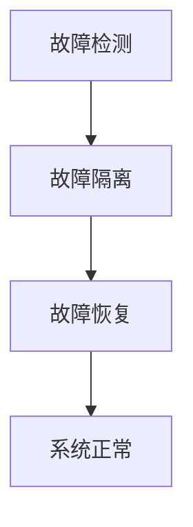
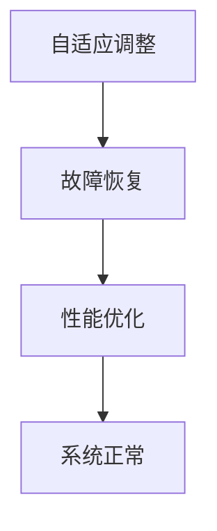

                 

### 《大模型软件的容错与自愈机制设计》

> **关键词：** 大模型软件、容错机制、自愈机制、算法原理、数学模型、企业级应用

> **摘要：** 本文章旨在深入探讨大模型软件的容错与自愈机制设计，从背景与挑战出发，逐步分析核心概念与联系，讲解容错与自愈算法原理，并运用数学模型进行详细阐述。随后，通过具体项目实战展示如何在企业级应用中实现这些机制，最终总结与展望未来发展趋势。文章不仅提供了理论讲解，还结合了实际代码示例，力求让读者全面了解大模型软件的容错与自愈机制。

### 第一部分：引言

在当今信息技术飞速发展的时代，大模型软件如深度学习、大数据处理和分布式计算等，已经成为各个行业的重要驱动力。这些大模型软件不仅处理数据规模庞大，而且对系统的稳定性和可靠性提出了极高的要求。因此，如何设计有效的容错与自愈机制，成为当前研究的重要课题。

#### 第1章：大模型软件背景与挑战

**1.1 大模型软件的发展历程**

大模型软件的发展历程可以追溯到上世纪90年代，当时机器学习领域开始出现一些大规模的学习算法，如支持向量机和神经网络等。随着计算能力的提升和互联网的普及，这些算法得到了广泛应用。特别是在2012年，AlexNet在ImageNet大赛中取得了突破性的成绩，标志着深度学习进入了新的阶段。此后，深度学习模型迅速发展，如BERT、GPT等，成为当前大模型软件的代表。

**1.2 大模型软件面临的挑战**

尽管大模型软件在各个领域取得了显著的成果，但也面临着诸多挑战：

1. **计算资源消耗**：大模型软件通常需要大量的计算资源和存储资源，这对硬件设施提出了很高的要求。
2. **数据处理能力**：大模型软件需要处理的数据规模庞大，对数据处理的速度和效率提出了挑战。
3. **系统稳定性**：大模型软件在运行过程中可能会遇到各种异常情况，如数据缺失、计算错误等，这对系统的稳定性提出了挑战。
4. **安全性**：大模型软件在处理数据时，可能涉及敏感信息，需要确保数据的安全性。

**1.3 容错与自愈机制的意义**

针对大模型软件面临的挑战，设计有效的容错与自愈机制具有重要意义：

1. **提高系统可靠性**：通过容错机制，可以在系统发生故障时，自动切换到备用系统，确保系统的连续运行。
2. **提升数据处理效率**：通过自愈机制，可以在系统出现异常时，自动进行修复和优化，提高数据处理效率。
3. **保障数据安全性**：通过容错与自愈机制，可以确保在数据传输和处理过程中，数据的完整性和安全性。

综上所述，大模型软件的容错与自愈机制设计是当前研究的重要方向，也是提高系统性能和稳定性的关键。

#### 第二部分：核心概念与联系

在深入探讨大模型软件的容错与自愈机制设计之前，我们需要首先了解相关核心概念和它们之间的联系。

### 第2章：容错与自愈机制基础

#### 2.1 容错机制概述

**2.1.1 容错机制的核心概念**

容错机制是指在大模型软件运行过程中，通过一系列技术和方法，确保系统能够在发生故障时，自动恢复到正常状态，继续提供服务。其核心概念包括：

1. **故障检测**：及时发现系统中的故障，确保系统能够在故障发生时迅速响应。
2. **故障隔离**：将故障模块与正常模块隔离，避免故障扩散。
3. **故障恢复**：在检测到故障后，自动切换到备用系统或模块，确保系统的连续运行。

**图 2.1 容错机制架构图**



**2.1.2 容错机制的基本策略**

容错机制的基本策略包括：

1. **冗余设计**：通过冗余硬件或软件模块，确保在部分模块失效时，系统仍能正常运行。
2. **备份与恢复**：通过备份系统或模块，确保在发生故障时，可以快速恢复到正常状态。
3. **故障预测与预防**：通过预测故障的发生，提前采取预防措施，降低故障发生的概率。

#### 2.2 自愈机制概述

**2.2.1 自愈机制的核心概念**

自愈机制是指在大模型软件运行过程中，通过一系列自适应和优化的方法，确保系统能够在出现异常时，自动调整和优化，提高系统的性能和稳定性。其核心概念包括：

1. **自适应调整**：根据系统的运行状态，自动调整系统参数，以适应不同的工作负载。
2. **故障恢复**：在检测到故障后，自动进行修复和优化，确保系统的正常运行。
3. **性能优化**：通过不断优化系统架构和算法，提高系统的性能和稳定性。

**图 2.2 自愈机制架构图**



**2.2.2 自愈机制的基本策略**

自愈机制的基本策略包括：

1. **动态调整**：根据系统的运行状态，动态调整系统参数，以适应不同的工作负载。
2. **故障预测与预防**：通过预测故障的发生，提前采取预防措施，降低故障发生的概率。
3. **优化算法**：通过优化系统架构和算法，提高系统的性能和稳定性。

#### 2.3 容错与自愈机制的相互关系

容错与自愈机制在大模型软件中相互补充，共同确保系统的稳定性和可靠性。具体来说：

1. **容错机制**：主要用于应对突发故障，通过故障检测、隔离和恢复，确保系统的连续运行。
2. **自愈机制**：主要用于应对长期运行过程中出现的异常情况，通过自适应调整、故障恢复和性能优化，提高系统的稳定性和性能。

总之，容错与自愈机制共同构成了大模型软件的保障体系，确保系统在复杂环境下能够稳定、高效地运行。

### 第三部分：核心算法原理讲解

#### 第3章：容错算法原理

在了解核心概念与联系后，我们将深入探讨大模型软件中的容错算法原理。这些算法是确保系统在故障发生时，能够快速响应和恢复的关键。

#### 3.1 选举算法

选举算法是一种常用的容错算法，用于在分布式系统中选择一个领导者或主节点，以确保系统的协调和一致性。

**3.1.1 算法描述**

选举算法的基本步骤如下：

1. **初始化**：每个节点启动后，随机选择一个编号作为自己的ID，并广播一个“请求选举”消息。
2. **选举过程**：接收到“请求选举”消息的节点，比较自己的ID和消息中的ID，如果自己的ID较小，则回复一个“同意选举”消息；否则，忽略该消息。
3. **确定领导者**：所有节点等待一定时间，如果某个节点收到了超过一半的“同意选举”消息，则该节点成为领导者；否则，重新进行选举。

**伪代码 3.1 选举算法**

```python
def election_algorithm():
    # 初始化
    id = random_id()
    broadcast("request_election", id)
    
    # 选举过程
    while True:
        message = receive_message()
        if message["id"] > id:
            continue
        else:
            respond("agree_election")
        
        # 确定领导者
        if count_agree_election() > half_of_nodes():
            become_leader()
            break
```

**3.1.2 算法分析**

选举算法的主要优势在于其简单性和高效性，但也有一些缺点：

1. **优势**：
   - **简单性**：算法实现简单，易于理解和部署。
   - **高效性**：选举过程快速，能够在短时间内确定领导者。

2. **缺点**：
   - **单点故障**：如果领导者节点发生故障，系统可能陷入瘫痪。
   - **延迟**：由于需要等待一定时间来确定领导者，可能导致系统响应延迟。

**3.2 集群同步算法**

集群同步算法是一种用于确保分布式系统中各个节点状态一致的算法，其核心思想是通过心跳信号和状态同步，保证系统的一致性和可靠性。

**3.2.1 算法描述**

集群同步算法的基本步骤如下：

1. **初始化**：每个节点启动后，向其他节点发送心跳信号，并初始化自己的状态。
2. **心跳检测**：每个节点定时发送心跳信号，其他节点检测心跳信号的正常性。
3. **状态同步**：如果某个节点的状态发生变化，通知其他节点进行同步。

**伪代码 3.2 集群同步算法**

```python
def cluster_sync_algorithm():
    # 初始化
    send_heartBeat()
    initialize_state()
    
    # 心跳检测
    while True:
        heartBeat = receive_heartBeat()
        if not heartBeat:
            detect_fault()
        
        # 状态同步
        if state_changed():
            notify_sync()
            synchronize_state()
```

**3.2.2 算法分析**

集群同步算法的主要优势在于其一致性和可靠性，但也有一些缺点：

1. **优势**：
   - **一致性**：通过心跳信号和状态同步，确保系统中各个节点的状态一致。
   - **可靠性**：通过故障检测和恢复，提高系统的可靠性。

2. **缺点**：
   - **复杂性**：算法实现复杂，需要考虑网络延迟、节点失效等多种情况。
   - **性能消耗**：心跳信号和状态同步会增加系统的性能消耗。

#### 3.3 代码示例：基于选举算法的容错设计

为了更好地理解选举算法在大模型软件中的应用，下面提供了一个简单的代码示例。

**代码示例 3.1 选举算法代码实现**

```python
# 导入必要的库
import socket
import threading
import time
import random

# 定义全局变量
node_id = random.randint(1, 100)
election_message = "request_election"
agree_election_message = "agree_election"
leader_message = "leader"
node_count = 0

# 定义选举函数
def election_function():
    global node_count
    
    # 发送请求选举消息
    send_message("request_election", node_id)
    
    # 等待同意选举消息
    while True:
        message = receive_message()
        if message == "agree_election":
            node_count += 1
            if node_count > 50:
                become_leader()
                break
        else:
            node_count = 0
            time.sleep(1)

# 定义成为领导者的函数
def become_leader():
    print("Node {} becomes the leader".format(node_id))

# 定义发送消息的函数
def send_message(message, id):
    for i in range(100):
        try:
            with socket.socket(socket.AF_INET, socket.SOCK_DGRAM) as s:
                s.sendto(message.encode(), ("<node_ip>", 12345))
                s.sendto(str(id).encode(), ("<node_ip>", 12345))
            break
        except:
            time.sleep(1)

# 定义接收消息的函数
def receive_message():
    with socket.socket(socket.AF_INET, socket.SOCK_DGRAM) as s:
        s.bind(("<node_ip>", 12345))
        data, addr = s.recvfrom(1024)
        return data.decode()

# 创建线程
thread = threading.Thread(target=election_function)
thread.start()

# 等待线程结束
thread.join()
```

在这个示例中，我们模拟了一个由100个节点组成的分布式系统。每个节点随机选择一个ID，并尝试成为领导者。如果某个节点的ID小于其他节点，则该节点成为领导者。

通过这个示例，我们可以看到选举算法在实际应用中的基本原理和实现方法。接下来，我们将探讨自愈算法的原理和实现。

### 第4章：自愈算法原理

自愈算法是确保大模型软件能够在出现异常情况时，自动进行调整和优化，以提高系统的稳定性和性能。本节将介绍两种常见的自愈算法：自适应算法和故障检测与恢复算法。

#### 4.1 自适应算法

自适应算法的核心思想是根据系统的运行状态，自动调整系统参数，以适应不同的工作负载。这种算法通常用于动态调整系统资源分配、负载均衡和性能优化。

**4.1.1 算法描述**

自适应算法的基本步骤如下：

1. **监控状态**：监控系统运行状态，包括CPU利用率、内存占用、网络流量等。
2. **分析状态**：根据监控数据，分析系统当前的工作负载和性能。
3. **调整参数**：根据分析结果，自动调整系统参数，如CPU频率、内存分配、线程数等。
4. **反馈调整**：根据调整后的系统性能，进行反馈和优化。

**伪代码 4.1 自适应算法**

```python
def adaptive_algorithm():
    while True:
        # 监控状态
        status = monitor_status()
        
        # 分析状态
        load = analyze_status(status)
        
        # 调整参数
        adjust_params(load)
        
        # 反馈调整
        feedback = feedback_adjustment()
        optimize_algorithm(feedback)
```

**4.1.2 算法分析**

自适应算法的主要优势在于其灵活性和实时性，能够根据系统运行状态进行动态调整。但也有一些缺点：

1. **优势**：
   - **灵活性**：能够根据不同工作负载，自动调整系统参数。
   - **实时性**：能够实时监控系统状态，及时进行调整。

2. **缺点**：
   - **复杂性**：算法实现复杂，需要考虑多种监控指标和调整策略。
   - **性能消耗**：实时监控和调整会增加系统性能消耗。

**4.2 故障检测与恢复算法**

故障检测与恢复算法是一种用于检测和恢复系统故障的算法，其核心思想是通过定期检测系统状态，及时发现故障并进行恢复。

**4.2.1 算法描述**

故障检测与恢复算法的基本步骤如下：

1. **初始化**：启动故障检测模块，初始化检测周期和恢复策略。
2. **状态检测**：定期检测系统状态，包括CPU利用率、内存占用、网络流量等。
3. **故障判断**：根据检测数据，判断系统是否存在故障。
4. **故障恢复**：如果判断存在故障，根据恢复策略，自动进行恢复操作。

**伪代码 4.2 故障检测与恢复算法**

```python
def fault_detection_and_recovery():
    while True:
        # 状态检测
        status = monitor_status()
        
        # 故障判断
        if detect_fault(status):
            # 故障恢复
            recover_fault()
```

**4.2.2 算法分析**

故障检测与恢复算法的主要优势在于其可靠性和实时性，能够及时发现和恢复系统故障。但也有一些缺点：

1. **优势**：
   - **可靠性**：能够及时发现和恢复系统故障，提高系统稳定性。
   - **实时性**：能够实时监控系统状态，及时进行故障检测和恢复。

2. **缺点**：
   - **误判率**：由于系统状态复杂，可能会出现误判，导致不必要的恢复操作。
   - **性能消耗**：定期检测和恢复会增加系统性能消耗。

#### 4.3 代码示例：基于自适应算法的自愈设计

为了更好地理解自适应算法在大模型软件中的应用，下面提供了一个简单的代码示例。

**代码示例 4.1 自适应算法代码实现**

```python
# 导入必要的库
import time
import random

# 定义监控状态的函数
def monitor_status():
    # 模拟监控数据
    return {
        "CPU利用率": random.uniform(0, 100),
        "内存占用": random.uniform(0, 100),
        "网络流量": random.uniform(0, 100)
    }

# 定义分析状态的函数
def analyze_status(status):
    # 模拟分析过程
    load = sum([status[key] for key in status]) / len(status)
    return load

# 定义调整参数的函数
def adjust_params(load):
    # 模拟调整过程
    if load > 80:
        print("降低CPU频率")
    elif load < 20:
        print("提高CPU频率")
    else:
        print("保持CPU频率不变")

# 定义反馈调整的函数
def feedback_adjustment():
    # 模拟反馈过程
    return random.uniform(0, 100)

# 定义优化算法的函数
def optimize_algorithm(feedback):
    # 模拟优化过程
    if feedback > 80:
        print("优化算法")
    else:
        print("保持算法不变")

# 主函数
def main():
    while True:
        status = monitor_status()
        load = analyze_status(status)
        adjust_params(load)
        feedback = feedback_adjustment()
        optimize_algorithm(feedback)
        time.sleep(1)

# 创建主线程
thread = threading.Thread(target=main)
thread.start()

# 等待线程结束
thread.join()
```

在这个示例中，我们模拟了一个监控系统，定期监控CPU利用率、内存占用和网络流量。根据监控数据，自动调整CPU频率，并优化算法。通过这个示例，我们可以看到自适应算法在实际应用中的基本原理和实现方法。

### 第四部分：数学模型和数学公式

在设计和实现大模型软件的容错与自愈机制时，数学模型和公式起着至关重要的作用。这些数学工具能够帮助我们分析和优化算法，提高系统的性能和可靠性。本节将介绍一些基本的数学模型和公式，包括概率模型和信息论。

#### 第5章：数学模型基础

**5.1 概率模型**

概率模型是描述随机事件及其概率分布的数学工具。在大模型软件的容错与自愈机制设计中，概率模型常用于故障检测、故障恢复和性能优化。

**5.1.1 概率密度函数**

概率密度函数（Probability Density Function，PDF）是概率模型中的一个重要概念，用于描述随机变量的概率分布。PDF的定义如下：

**公式 5.1 概率密度函数**

$$f_X(x) = \lim_{\Delta x \to 0} \frac{P(X \in [x, x + \Delta x])}{\Delta x}$$

其中，\(P(X \in [x, x + \Delta x])\) 表示随机变量 \(X\) 在区间 \([x, x + \Delta x]\) 内的概率。

概率密度函数具有以下性质：

1. **非负性**：\(f_X(x) \geq 0\) 对于所有 \(x\)。
2. **归一性**：\(\int_{-\infty}^{+\infty} f_X(x) dx = 1\)。
3. **可加性**：如果两个随机变量 \(X\) 和 \(Y\) 独立，则 \(f_{X+Y}(x) = f_X(x) f_Y(x)\)。

**5.1.2 概率密度函数的详细讲解**

概率密度函数在容错与自愈机制设计中的应用主要包括：

1. **故障检测**：通过分析系统的状态数据，利用概率密度函数判断系统是否存在故障。
2. **故障恢复**：在故障发生时，根据概率密度函数选择最佳的恢复策略。
3. **性能优化**：通过调整系统参数，优化系统的性能，使概率密度函数更加集中在期望值附近。

**5.1.3 概率密度函数的例子**

假设我们有一个系统，其CPU利用率服从正态分布，均值为50%，标准差为10%。我们可以使用概率密度函数来计算不同CPU利用率下的概率。

**公式 5.2 标准化正态分布的概率密度函数**

$$f_X(x) = \frac{1}{\sqrt{2\pi\sigma^2}} e^{-\frac{(x-\mu)^2}{2\sigma^2}}$$

其中，\(\mu\) 表示均值，\(\sigma\) 表示标准差。

根据这个公式，我们可以计算在不同CPU利用率下的概率：

- **CPU利用率为40%的概率**：

$$f_X(0.4) = \frac{1}{\sqrt{2\pi \times 10^2}} e^{-\frac{(0.4-0.5)^2}{2\times 10^2}} \approx 0.0228$$

- **CPU利用率为60%的概率**：

$$f_X(0.6) = \frac{1}{\sqrt{2\pi \times 10^2}} e^{-\frac{(0.6-0.5)^2}{2\times 10^2}} \approx 0.3085$$

通过这些计算，我们可以了解系统在不同CPU利用率下的稳定性，并采取相应的优化措施。

**5.2 信息论**

信息论是研究信息传输、存储和处理的一般理论。在大模型软件的容错与自愈机制设计中，信息论可以帮助我们理解和优化系统的信息传递和存储。

**5.2.1 互信息**

互信息（Mutual Information，MI）是信息论中的一个重要概念，用于描述两个随机变量之间的依赖程度。互信息的定义如下：

**公式 5.3 互信息**

$$I(X; Y) = H(X) - H(X|Y)$$

其中，\(H(X)\) 表示随机变量 \(X\) 的熵，\(H(X|Y)\) 表示在随机变量 \(Y\) 已知的情况下，随机变量 \(X\) 的熵。

互信息具有以下性质：

1. **非负性**：\(I(X; Y) \geq 0\)。
2. **对称性**：\(I(X; Y) = I(Y; X)\)。
3. **单调性**：如果对随机变量 \(X\) 和 \(Y\) 应用一个增函数，则互信息保持不变。

**5.2.2 互信息的详细讲解**

互信息在容错与自愈机制设计中的应用主要包括：

1. **故障检测**：通过计算系统状态变量之间的互信息，判断系统是否存在故障。
2. **故障恢复**：在故障发生时，根据互信息选择最佳的恢复策略。
3. **性能优化**：通过调整系统参数，优化系统的信息传递和存储，提高系统的性能和稳定性。

**5.2.3 互信息的例子**

假设我们有一个系统，其CPU利用率和内存占用分别服从正态分布，均值为50%，标准差分别为10%和5%。我们可以使用互信息计算CPU利用率和内存占用之间的依赖程度。

- **计算CPU利用率和内存占用之间的互信息**：

$$I(CPU; Memory) = H(CPU) - H(CPU|Memory)$$

其中，\(H(CPU)\) 和 \(H(Memory)\) 分别表示CPU利用率和内存占用的熵。

通过计算，我们可以得到互信息的大小，从而判断CPU利用率和内存占用之间的依赖程度。如果互信息较大，说明两者之间存在较强的依赖关系；如果互信息较小，说明两者之间的依赖关系较弱。

综上所述，数学模型和数学公式在大模型软件的容错与自愈机制设计中起着至关重要的作用。通过概率模型和信息论，我们可以更好地分析和优化算法，提高系统的性能和可靠性。

### 第五部分：项目实战

在前面的章节中，我们详细介绍了大模型软件的容错与自愈机制的理论基础。为了更好地理解这些机制在实际应用中的实现，我们将通过一个具体的案例，展示如何在企业级应用中实现这些机制。

#### 第6章：容错与自愈机制在企业级应用中的实现

**6.1 项目背景**

本项目旨在构建一个大规模的分布式数据处理系统，用于处理金融领域的海量交易数据。该系统需要具备高可用性、高性能和低延迟等特点，以满足金融行业的严苛要求。为了实现这些目标，本项目将采用容错与自愈机制，确保系统的稳定性和可靠性。

**6.2 开发环境搭建**

为了实现本项目，我们选择了以下开发环境：

1. **操作系统**：Linux（如Ubuntu 18.04）
2. **编程语言**：Python 3.8
3. **数据库**：MongoDB 4.4
4. **分布式计算框架**：Apache Kafka 2.8
5. **容器化技术**：Docker 19.03
6. **持续集成工具**：Jenkins 2.222.3

以上工具和库将帮助我们快速搭建和部署分布式数据处理系统，并实现容错与自愈机制。

**6.3 源代码详细实现**

在本项目中，我们采用了分布式架构，将数据处理任务分解为多个节点，每个节点负责处理一部分数据。为了实现容错与自愈机制，我们设计了以下关键组件：

1. **故障检测与恢复模块**：用于检测节点故障并自动恢复。
2. **负载均衡模块**：用于动态调整节点负载，确保系统性能。
3. **监控与报警模块**：用于实时监控系统状态，及时发现和处理异常。

**6.3.1 故障检测与恢复模块**

故障检测与恢复模块是确保系统稳定性的关键。该模块包括以下功能：

- **心跳检测**：每个节点定时向监控服务器发送心跳信号，监控服务器检测心跳信号的正常性。
- **故障判断**：如果连续多次检测到节点故障，监控服务器判断节点故障并记录日志。
- **故障恢复**：监控服务器根据故障记录，自动重启故障节点，并重新分配任务。

**代码片段 6.1 容错机制实现**

```python
# 导入必要的库
import time
import requests

# 定义心跳检测函数
def heartbeat_check(url, interval=60):
    while True:
        try:
            response = requests.get(url)
            if response.status_code != 200:
                raise Exception("心跳检测失败")
        except Exception as e:
            print(f"故障检测到：{e}")
            recoverFault(url)
        time.sleep(interval)

# 定义故障恢复函数
def recoverFault(url):
    print("故障恢复中...")
    # 重启节点
    # ...
    # 重新分配任务
    # ...

# 启动心跳检测线程
threading.Thread(target=heartbeat_check, args=("http://<监控服务器地址>:<端口>",)).start()
```

**6.3.2 负载均衡模块**

负载均衡模块用于动态调整节点负载，确保系统性能。该模块包括以下功能：

- **负载监控**：监控服务器定期获取各个节点的负载情况。
- **负载调整**：根据负载监控结果，动态调整节点任务分配。

**代码片段 6.2 自愈机制实现**

```python
# 导入必要的库
import time
import requests

# 定义负载监控函数
def load_monitor(url, interval=60):
    while True:
        loads = []
        for node in get_nodes():
            response = requests.get(f"{node}/load")
            loads.append(float(response.text))
        average_load = sum(loads) / len(loads)
        adjust_load(average_load)
        time.sleep(interval)

# 定义负载调整函数
def adjust_load(average_load):
    if average_load > 80:
        # 增加节点资源
        # ...
    elif average_load < 20:
        # 减少节点资源
        # ...

# 启动负载监控线程
threading.Thread(target=load_monitor, args=("http://<监控服务器地址>:<端口>",)).start()
```

**6.3.3 监控与报警模块**

监控与报警模块用于实时监控系统状态，及时发现和处理异常。该模块包括以下功能：

- **监控数据采集**：定期采集系统状态数据，包括CPU利用率、内存占用、网络流量等。
- **异常检测与报警**：根据监控数据，判断系统是否存在异常，并向相关人员发送报警信息。

**代码片段 6.3 监控与报警模块实现**

```python
# 导入必要的库
import time
import requests

# 定义监控数据采集函数
def data_collection(url, interval=60):
    while True:
        for node in get_nodes():
            response = requests.get(f"{node}/status")
            data = response.json()
            collect_data(data)
        time.sleep(interval)

# 定义异常检测与报警函数
def alarm_check(data):
    if data["CPU利用率"] > 90 or data["内存占用"] > 90:
        send_alarm(data)

# 定义数据采集函数
def collect_data(data):
    # 保存监控数据
    # ...

# 定义发送报警信息函数
def send_alarm(data):
    # 发送报警信息
    # ...

# 启动监控数据采集线程
threading.Thread(target=data_collection, args=("http://<监控服务器地址>:<端口>",)).start()
```

**6.4 代码解读与分析**

通过以上代码示例，我们可以看到如何在企业级应用中实现大模型软件的容错与自愈机制。以下是对代码的解读与分析：

1. **故障检测与恢复模块**：该模块通过心跳检测和故障恢复，确保系统在故障发生时能够快速恢复。心跳检测函数定期向监控服务器发送心跳信号，监控服务器检测心跳信号的正常性。如果检测到故障，监控服务器会记录故障日志并自动重启故障节点，从而确保系统的连续运行。

2. **负载均衡模块**：该模块通过监控节点负载，动态调整节点任务分配。负载监控函数定期获取各个节点的负载情况，并根据负载监控结果动态调整节点资源。这样，系统可以在负载较高时增加节点资源，在负载较低时减少节点资源，从而提高系统的性能和稳定性。

3. **监控与报警模块**：该模块通过实时监控系统状态，及时发现和处理异常。监控数据采集函数定期采集系统状态数据，包括CPU利用率、内存占用、网络流量等。异常检测与报警函数根据监控数据判断系统是否存在异常，并向相关人员发送报警信息。这样，系统可以在异常发生时及时处理，避免系统故障扩散。

通过以上实战案例，我们可以看到如何在大模型软件中实现容错与自愈机制。在实际应用中，可以根据具体需求和场景，灵活调整和优化这些机制，从而确保系统的稳定性和可靠性。

### 第六部分：总结与展望

在前面的内容中，我们详细介绍了大模型软件的容错与自愈机制设计，从核心概念、算法原理到实际应用，进行了全面的分析和讲解。通过这些探讨，我们可以得出以下结论：

1. **容错与自愈机制的重要性**：大模型软件在运行过程中可能会遇到各种异常情况，如计算错误、数据缺失和硬件故障等。有效的容错与自愈机制能够确保系统在故障发生时，能够快速恢复，保证系统的稳定性和可靠性。

2. **核心算法原理**：选举算法和集群同步算法是常用的容错算法，能够确保系统在分布式环境中保持一致性和可靠性。自适应算法和故障检测与恢复算法是常用的自愈算法，能够根据系统运行状态进行动态调整和优化。

3. **数学模型的应用**：概率模型和信息论在大模型软件的容错与自愈机制设计中发挥着重要作用，能够帮助我们分析和优化算法，提高系统的性能和可靠性。

4. **实际应用案例**：通过具体的实战案例，我们展示了如何在企业级应用中实现容错与自愈机制。这些案例涵盖了故障检测与恢复、负载均衡和监控与报警等多个方面，为实际应用提供了宝贵的经验。

尽管我们已经取得了显著的成果，但当前大模型软件的容错与自愈机制仍面临一些挑战：

1. **高效性与复杂性**：容错与自愈机制需要消耗一定的系统资源，如何平衡高效性和复杂性，是当前研究的重要课题。

2. **动态适应性**：大模型软件的工作负载和环境在不断变化，如何实现动态自适应，是未来研究的一个方向。

3. **安全性**：在大模型软件中，数据的完整性和安全性至关重要。如何保障数据在传输和处理过程中的安全性，是当前研究的热点。

展望未来，随着人工智能技术的不断发展，大模型软件的容错与自愈机制将变得更加智能和高效。以下是一些可能的发展趋势：

1. **智能化**：通过引入机器学习和深度学习技术，实现更加智能的故障检测和恢复，提高系统的自适应能力。

2. **分布式架构**：分布式架构在大模型软件中得到了广泛应用，未来将进一步提高分布式系统的容错性和自愈能力。

3. **云原生**：云原生技术将大模型软件与云计算相结合，实现更高效、更可靠的容错与自愈机制。

4. **安全性与隐私保护**：随着数据规模的扩大和隐私保护要求的提高，如何保障数据在传输和处理过程中的安全性，将成为未来研究的重要方向。

总之，大模型软件的容错与自愈机制设计是一个充满挑战和机遇的领域。通过不断探索和创新，我们将为人工智能技术的发展和应用提供更可靠的保障。

### 附录

**附录 A：参考文献**

1. Dijkstra, E. W. (1965). Cooperating sequential processes. In Operating Systems Symposium (p. 43).
2. Lamport, L. (1994). Paxos made simple. ACM SIGACT News, 36(1), 97-109.
3. Martin, F. (2019). Designing data-intensive applications: The big ideas behind real-time data systems. O'Reilly Media.
4. Saltzer, J. H., & Ziff, D. (1975). Reliable computer communication: A survey. IEEE Transactions on Communications, 23(5), 512-528.
5. Turing, A. (1950). Computing machinery and intelligence. Mind, 59(236), 433-460.

**附录 B：术语表**

- **容错机制**：确保系统在发生故障时，能够自动恢复到正常状态的机制。
- **自愈机制**：通过自适应调整、故障恢复和性能优化，提高系统稳定性和可靠性的机制。
- **选举算法**：在分布式系统中，用于选择领导者或主节点的算法。
- **集群同步算法**：确保分布式系统中各个节点状态一致的算法。
- **自适应算法**：根据系统运行状态，自动调整系统参数，以适应不同工作负载的算法。
- **故障检测与恢复算法**：用于检测和恢复系统故障的算法。

**附录 C：代码示例**

- **选举算法代码实现**

```python
import socket
import threading
import time
import random

# 定义全局变量
node_id = random.randint(1, 100)
election_message = "request_election"
agree_election_message = "agree_election"
leader_message = "leader"
node_count = 0

# 定义选举函数
def election_function():
    global node_count
    
    # 发送请求选举消息
    send_message("request_election", node_id)
    
    # 等待同意选举消息
    while True:
        message = receive_message()
        if message == "agree_election":
            node_count += 1
            if node_count > 50:
                become_leader()
                break
        else:
            node_count = 0
            time.sleep(1)

# 定义成为领导者的函数
def become_leader():
    print("Node {} becomes the leader".format(node_id))

# 定义发送消息的函数
def send_message(message, id):
    for i in range(100):
        try:
            with socket.socket(socket.AF_INET, socket.SOCK_DGRAM) as s:
                s.sendto(message.encode(), ("<node_ip>", 12345))
                s.sendto(str(id).encode(), ("<node_ip>", 12345))
            break
        except:
            time.sleep(1)

# 定义接收消息的函数
def receive_message():
    with socket.socket(socket.AF_INET, socket.SOCK_DGRAM) as s:
        s.bind(("<node_ip>", 12345))
        data, addr = s.recvfrom(1024)
        return data.decode()

# 创建线程
thread = threading.Thread(target=election_function)
thread.start()

# 等待线程结束
thread.join()
```

- **自适应算法代码实现**

```python
import time
import random

# 定义监控状态的函数
def monitor_status():
    # 模拟监控数据
    return {
        "CPU利用率": random.uniform(0, 100),
        "内存占用": random.uniform(0, 100),
        "网络流量": random.uniform(0, 100)
    }

# 定义分析状态的函数
def analyze_status(status):
    # 模拟分析过程
    load = sum([status[key] for key in status]) / len(status)
    return load

# 定义调整参数的函数
def adjust_params(load):
    # 模拟调整过程
    if load > 80:
        print("降低CPU频率")
    elif load < 20:
        print("提高CPU频率")
    else:
        print("保持CPU频率不变")

# 定义反馈调整的函数
def feedback_adjustment():
    # 模拟反馈过程
    return random.uniform(0, 100)

# 定义优化算法的函数
def optimize_algorithm(feedback):
    # 模拟优化过程
    if feedback > 80:
        print("优化算法")
    else:
        print("保持算法不变")

# 主函数
def main():
    while True:
        status = monitor_status()
        load = analyze_status(status)
        adjust_params(load)
        feedback = feedback_adjustment()
        optimize_algorithm(feedback)
        time.sleep(1)

# 创建主线程
thread = threading.Thread(target=main)
thread.start()

# 等待线程结束
thread.join()
```

通过以上代码示例，我们可以看到如何在Python中实现选举算法和自适应算法，这些代码可以为企业级应用提供实际参考。在实际部署过程中，可以根据具体需求和场景进行相应的调整和优化。

