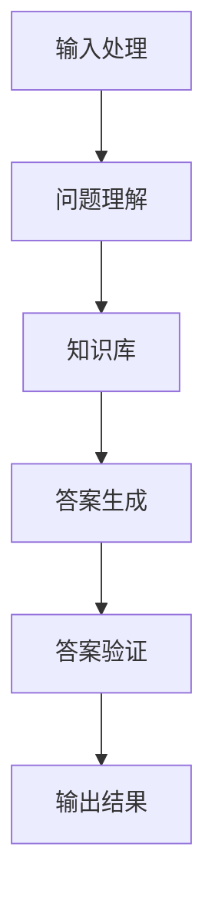
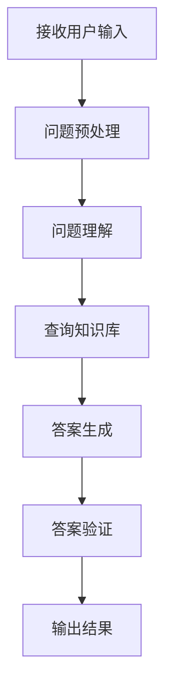

                 

# 《大模型问答机器人的自然语言处理》

## 关键词
自然语言处理，大模型，问答系统，词嵌入，依存句法分析，语义角色标注，命名实体识别

## 摘要
本文深入探讨了自然语言处理（NLP）在大模型问答机器人中的应用。首先，介绍了NLP的基础知识，包括分词、词性标注、词嵌入、依存句法分析和语义角色标注等关键技术。然后，详细阐述了命名实体识别和实体关系抽取的方法。接着，讨论了问答系统的架构、问题理解与匹配、答案生成与优化，以及大模型在问答系统中的应用。最后，通过实际应用案例分析和未来的发展趋势，总结了NLP在大模型问答机器人中的重要性。

## 目录大纲设计

本文的目录大纲如下：

### 第一部分：引言与概述

- **第1章 自然语言处理基础**
  - **3.1 自然语言处理的定义与重要性**
  - **3.2 自然语言处理的发展历程**
  - **3.3 自然语言处理的挑战与解决方案**

- **第2章 大模型与问答系统**
  - **2.1 大模型的概念与分类**
  - **2.2 问答系统的基本概念**
  - **2.3 大模型在问答系统中的应用**

### 第二部分：自然语言处理技术

- **第3章 分词与词性标注**
  - **3.1 分词算法与实现**
  - **3.2 词性标注方法与工具**
  - **3.3 分词与词性标注在实际应用中的挑战**

- **第4章 词嵌入与语义表示**
  - **4.1 词嵌入技术概述**
  - **4.2 常见的词嵌入算法**
  - **4.3 词嵌入在实际应用中的优化方法**

- **第5章 依存句法分析**
  - **5.1 依存句法分析的概念与意义**
  - **5.2 依存句法分析的算法与工具**
  - **5.3 依存句法分析在实际应用中的案例**

- **第6章 语义角色标注**
  - **6.1 语义角色标注的概念**
  - **6.2 语义角色标注的方法与工具**
  - **6.3 语义角色标注在实际应用中的案例**

- **第7章 命名实体识别**
  - **7.1 命名实体识别的概念**
  - **7.2 命名实体识别的算法与工具**
  - **7.3 命名实体识别在实际应用中的案例**

- **第8章 实体关系抽取**
  - **8.1 实体关系抽取的概念**
  - **8.2 实体关系抽取的算法与工具**
  - **8.3 实体关系抽取在实际应用中的案例**

### 第三部分：问答系统设计与实现

- **第9章 问答系统架构与流程**
  - **9.1 问答系统架构概述**
  - **9.2 问答系统的工作流程**
  - **9.3 问答系统的关键技术**

- **第10章 问题理解与匹配**
  - **10.1 问题理解的概念与任务**
  - **10.2 问题匹配的方法与算法**
  - **10.3 问题理解与匹配在实际应用中的案例**

- **第11章 答案生成与优化**
  - **11.1 答案生成的概念与方法**
  - **11.2 答案优化的策略与算法**
  - **11.3 答案生成与优化在实际应用中的案例**

- **第12章 问答系统的评估与优化**
  - **12.1 问答系统评估指标**
  - **12.2 问答系统优化方法**
  - **12.3 问答系统优化在实际应用中的案例**

### 第四部分：大模型在问答系统中的应用

- **第13章 大模型与问答系统的整合**
  - **13.1 大模型在问答系统中的作用**
  - **13.2 大模型与问答系统的整合方法**
  - **13.3 大模型在问答系统中的实际应用**

- **第14章 大模型问答系统的设计与实现**
  - **14.1 大模型问答系统的架构设计**
  - **14.2 大模型问答系统的实现流程**
  - **14.3 大模型问答系统的案例研究**

- **第15章 大模型问答系统的优化与提升**
  - **15.1 大模型问答系统的优化策略**
  - **15.2 大模型问答系统的提升方法**
  - **15.3 大模型问答系统的优化与提升案例**

### 第五部分：实际应用与案例分析

- **第16章 问答系统的实际应用场景**
  - **16.1 企业内部问答系统**
  - **16.2 公共问答平台**
  - **16.3 智能客服系统**

- **第17章 问答系统的案例分析**
  - **17.1 某知名问答系统案例分析**
  - **17.2 某企业内部问答平台案例分析**
  - **17.3 开源问答系统案例分析**

- **第18章 问答系统的发展趋势与挑战**
  - **18.1 问答系统的发展趋势**
  - **18.2 问答系统面临的挑战**
  - **18.3 问答系统的未来发展方向**

### 附录

- **附录A：自然语言处理资源与工具**
  - **A.1 自然语言处理库与框架**
  - **A.2 开源数据集与资源**
  - **A.3 学术论文与资料**

- **附录B：编程实战与代码解析**
  - **B.1 编程实战案例**
  - **B.2 代码解析与调试**
  - **B.3 实战项目总结与展望**

通过上述目录大纲的设计，本文将逐步引导读者深入理解大模型问答机器人的自然语言处理技术，从基础到应用，从理论到实践，全面剖析问答系统的设计与实现过程。期望本文能够为从事NLP和问答系统开发的工程师提供有价值的参考和指导。

---

### 第一部分：引言与概述

#### 第1章 自然语言处理基础

##### 1.1 自然语言处理的定义与重要性

自然语言处理（NLP，Natural Language Processing）是计算机科学和人工智能领域的一个重要分支，主要研究如何使计算机能够理解、解释和生成人类语言。自然语言处理技术的应用范围广泛，包括语音识别、机器翻译、文本分析、情感分析、问答系统等。

自然语言处理的定义可以概括为：利用计算机技术和算法对人类语言进行理解和生成，以实现人与计算机之间的有效沟通。具体来说，自然语言处理包括以下几个关键步骤：

1. **文本预处理**：包括分词、去除停用词、词干提取等，将原始文本转换为计算机可以处理的形式。
2. **词性标注**：对文本中的每个词进行词性分类，如名词、动词、形容词等。
3. **句法分析**：对文本中的句子结构进行分析，包括句法成分的划分、句法关系的识别等。
4. **语义分析**：理解文本的含义和深层结构，包括语义角色标注、实体识别、情感分析等。
5. **语言生成**：根据输入的指令或语义生成相应的文本。

自然语言处理的重要性体现在以下几个方面：

1. **提升人机交互效率**：自然语言处理技术使得人与计算机之间的交流更加自然和高效，为智能客服、智能助手等应用提供了基础。
2. **推动语言技术的创新**：自然语言处理技术的发展推动了机器翻译、语音识别、情感分析等领域的创新，为多语言沟通和智能服务提供了强大的支持。
3. **数据分析和挖掘**：自然语言处理技术可以对大量文本数据进行分析和挖掘，为商业决策、市场研究、舆情监测等提供有力支持。
4. **辅助决策和智能服务**：通过自然语言处理技术，计算机可以更好地理解用户的需求，提供个性化的服务和决策支持。

##### 1.2 自然语言处理的发展历程

自然语言处理的历史可以追溯到20世纪50年代，经历了从规则驱动到数据驱动、从基于词典的方法到基于机器学习的方法的发展过程。

1. **规则驱动方法**（1950s-1980s）

在早期，自然语言处理主要采用基于规则的方法。这种方法依赖于手工编写的规则集，对语言现象进行形式化和建模。例如，1960年代开发的SHLD系统是一种基于语法规则的机器翻译系统。尽管这种方法在一定程度上实现了对语言的理解，但受限于规则的复杂度和覆盖范围，难以应对多样化的语言现象。

2. **基于词典的方法**（1980s-1990s）

随着计算机存储和处理能力的提升，基于词典的方法逐渐成为主流。这种方法通过建立庞大的语言词典，对文本进行词汇和语法分析。例如，词性标注和命名实体识别等技术在这一时期得到了广泛应用。然而，基于词典的方法也存在一定的局限性，如对罕见词汇和未定义规则的依赖性较高。

3. **基于统计的方法**（1990s-2000s）

20世纪90年代，随着机器学习技术的发展，基于统计的方法开始广泛应用于自然语言处理领域。这种方法通过大量标注数据训练模型，使计算机能够自动地学习语言规律。例如，隐藏马尔可夫模型（HMM）和最大熵模型（Maximum Entropy）在这一时期得到了广泛应用。基于统计的方法在处理复杂语言现象方面表现出色，但仍然存在一些挑战。

4. **基于深度学习的方法**（2010s至今）

近年来，深度学习技术为自然语言处理带来了革命性的变化。基于深度学习的模型，如循环神经网络（RNN）和变换器（Transformer），在处理大规模语言数据方面表现出色。例如，BERT（Bidirectional Encoder Representations from Transformers）模型在多项自然语言处理任务上取得了突破性成果。深度学习方法的广泛应用，使得自然语言处理技术达到了一个新的高度。

##### 1.3 自然语言处理的挑战与解决方案

尽管自然语言处理技术在不断进步，但在实际应用中仍面临诸多挑战：

1. **数据稀疏**：自然语言处理依赖于大规模标注数据，但在实际应用中，获取高质量标注数据往往非常困难。
   - **解决方案**：利用数据增强和迁移学习技术，通过模拟和迁移已有数据集，缓解数据稀疏问题。

2. **语言多样性**：不同语言和文化背景下的语言现象存在巨大差异，使得自然语言处理模型难以通用。
   - **解决方案**：开发多语言、多文化适应性模型，通过跨语言和跨文化信息融合，提升模型的泛化能力。

3. **长文本处理**：长文本处理是自然语言处理中的一个难点，如何有效地建模长文本的语义结构和上下文关系，是当前研究的热点。
   - **解决方案**：采用长文本生成模型和注意力机制，通过建模长文本的全局和局部关系，提升长文本处理效果。

4. **解释性和可解释性**：自然语言处理模型通常被视为“黑箱”，其决策过程难以解释和理解。
   - **解决方案**：开发可解释性模型和可视化工具，通过揭示模型内部的决策过程，提升模型的可解释性。

5. **计算资源消耗**：深度学习模型通常需要大量的计算资源和存储空间，对硬件设施要求较高。
   - **解决方案**：采用硬件加速技术，如GPU和TPU，以及分布式计算架构，提高计算效率和资源利用率。

通过上述解决方案，自然语言处理技术将不断克服现有挑战，为人工智能和人类社会的进步做出更大贡献。

### 第二部分：自然语言处理技术

#### 第2章 大模型与问答系统

##### 2.1 大模型的概念与分类

大模型（Large Models）是指在训练过程中使用了大量数据，并具有数亿甚至数千亿个参数的深度学习模型。大模型的出现标志着自然语言处理技术的新里程碑，它们在多种任务中取得了显著的性能提升。大模型的概念可以从以下几个方面进行理解：

1. **参数规模**：大模型的参数规模通常远超传统模型，能够捕捉更多语言信息。例如，GPT-3（1750亿参数）和Turing-NLG（1300亿参数）等模型，具有数百亿甚至数千亿的参数。
2. **训练数据**：大模型在训练过程中使用了大规模数据集，包括互联网文本、书籍、新闻、社交媒体等，这使得模型能够更好地理解多样化语言现象。
3. **模型架构**：大模型通常采用先进的神经网络架构，如Transformer、BERT等，这些架构具有强大的表达能力和并行计算能力。

大模型可以分为以下几类：

1. **预训练模型**：预训练模型（Pre-trained Models）是在大规模数据集上进行预训练，然后用于特定任务的模型。例如，BERT、GPT等模型，它们通过预训练获得了丰富的语言知识和表达能力，然后在各种任务上进行微调。
2. **生成模型**：生成模型（Generative Models）主要用于生成文本、图像、语音等，例如，GPT系列模型。生成模型通过学习数据的概率分布，生成新的数据样本，具有强大的创造性和多样性。
3. **判别模型**：判别模型（Discriminative Models）主要用于分类、标注等任务，例如，BERT、XLNet等模型。判别模型通过学习数据特征和标签之间的关系，对输入数据进行分类和标注。

##### 2.2 问答系统的基本概念

问答系统（Question Answering Systems）是一种自然语言处理应用，旨在使计算机能够理解用户的问题，并生成相关、准确的答案。问答系统可以分为以下几种类型：

1. **事实型问答**：事实型问答系统（Factual Question Answering Systems）主要用于回答基于事实的问题，如“北京是哪个国家的首都？”这类问题通常有明确的答案。
2. **非事实型问答**：非事实型问答系统（Non-factual Question Answering Systems）主要用于回答主观性、推测性或模糊性问题，如“你认为什么是幸福？”这类问题通常没有明确的答案。
3. **对话型问答**：对话型问答系统（Conversational Question Answering Systems）旨在实现人与计算机的互动，通过多轮对话，逐步理解用户的需求，并提供准确的答案。

问答系统的基本组成部分包括：

1. **问题理解**：问题理解（Question Understanding）是指将自然语言问题转换为计算机可以处理的形式，包括语义分析、关键词提取、问题类型识别等。
2. **答案生成**：答案生成（Answer Generation）是指根据问题理解和已有知识库，生成相关、准确的答案。
3. **答案验证**：答案验证（Answer Verification）是指对生成的答案进行评估，确保答案的相关性和准确性。

##### 2.3 大模型在问答系统中的应用

大模型在问答系统中发挥了重要作用，主要体现在以下几个方面：

1. **问题理解**：大模型可以更好地理解复杂、模糊的问题，通过预训练获得了丰富的语言知识和上下文信息。例如，BERT模型在问题理解任务中取得了显著性能提升。
2. **答案生成**：大模型可以生成更加自然、连贯的答案，通过生成模型如GPT系列，能够生成丰富多样、符合语言规范的答案。
3. **知识推理**：大模型能够进行知识推理（Knowledge Reasoning），通过理解和分析问题中的隐含关系，生成更准确的答案。例如，Turing-NLG模型在复杂推理任务中表现出色。
4. **多语言支持**：大模型通常支持多语言处理，能够在不同语言环境下提供高质量的问答服务，促进跨语言沟通。

实际应用中，大模型问答系统可以应用于多个领域：

1. **智能客服**：大模型问答系统可以用于智能客服，实现自动回答用户问题，提高客服效率和用户体验。
2. **教育辅导**：大模型问答系统可以为学生提供学习辅导，解答学生的疑问，辅助学习过程。
3. **医疗咨询**：大模型问答系统可以提供医疗咨询服务，回答患者的健康问题，辅助医生诊断和治疗。
4. **信息检索**：大模型问答系统可以用于信息检索，通过理解用户查询，快速定位相关信息，提供高效的搜索服务。

总之，大模型在问答系统中的应用，使得问答系统在性能和功能上取得了显著提升，为自然语言处理技术发展带来了新的机遇。

### 第三部分：自然语言处理技术

#### 第3章 分词与词性标注

##### 3.1 分词算法与实现

分词（Tokenization）是自然语言处理中的基础步骤，它将连续的文本序列分割成有意义的词汇或短语。正确的分词对于后续的词性标注、命名实体识别等任务至关重要。

**分词算法可以分为以下几类：**

1. **基于规则的分词**：这种方法依赖于预先定义的规则集，通过对文本进行逐字符或逐词汇的分析，将文本分割成词。例如，正向最大匹配法和逆向最大匹配法。
2. **基于统计的分词**：这种方法使用大量标注数据，通过统计学习方法，训练分词模型，对文本进行分词。常见的统计分词算法包括基于N-gram的语言模型和隐马尔可夫模型（HMM）。
3. **基于深度学习的分词**：这种方法使用深度学习模型，如长短时记忆网络（LSTM）和卷积神经网络（CNN），通过学习文本的特征，实现自动分词。

**实现分词的步骤如下：**

1. **文本预处理**：对原始文本进行清洗和规范化，如去除标点符号、转换大小写等。
2. **规则分词**：根据预定义的规则，对文本进行初步分词，将文本分割成可能的词片段。
3. **统计分词**：使用统计模型，对初步分词的结果进行优化，选择最佳的分词结果。
4. **深度学习分词**：使用深度学习模型，对文本进行精细分词，生成最终的词序列。

**举例说明**：

以下是一个简单的基于规则的分词算法：

```python
# 基于规则的分词算法示例
def rule_based_tokenizer(text):
    rules = [
        ('我', r'我'), 
        ('喜欢', r'喜欢'), 
        ('吃', r'吃'), 
        ('饭', r'饭'), 
        # 添加更多规则
    ]
    
    tokens = []
    i = 0
    while i < len(text):
        matched = False
        for word, pattern in rules:
            if re.match(pattern, text[i:]):
                tokens.append(word)
                i += len(word)
                matched = True
                break
        if not matched:
            tokens.append(text[i])
            i += 1
    return tokens

text = "我喜欢吃饭。"
tokens = rule_based_tokenizer(text)
print(tokens)  # 输出：['我', '喜欢', '吃', '饭', '.']
```

**分词在实际应用中的挑战**：

1. **歧义处理**：某些文本片段可能有多种分词方式，如何选择最佳的分词结果，是一个挑战。
2. **未登录词**：对于未登录的新词或专业术语，分词算法需要具有一定的自适应能力。
3. **多语言处理**：对于多语言文本，如何实现统一有效的分词，是一个技术难题。

##### 3.2 词性标注方法与工具

词性标注（Part-of-Speech Tagging）是对文本中的每个词进行词性分类的过程，如名词、动词、形容词等。词性标注有助于理解文本的语法结构和语义含义。

**词性标注方法可以分为以下几类：**

1. **基于规则的方法**：这种方法依赖于手工编写的规则集，对文本进行词性标注。例如，利用正则表达式匹配词性标签。
2. **基于统计的方法**：这种方法使用大量标注数据，通过统计模型，如N-gram模型和隐马尔可夫模型（HMM），进行词性标注。
3. **基于深度学习的方法**：这种方法使用深度学习模型，如长短时记忆网络（LSTM）和卷积神经网络（CNN），通过学习文本特征，实现词性标注。

**常用工具**：

1. **NLTK**：NLTK是一个强大的自然语言处理库，提供了多种词性标注工具和方法。
2. **Stanford NLP**：Stanford NLP是一个开源自然语言处理工具包，包括词性标注、命名实体识别、句法分析等功能。
3. **spaCy**：spaCy是一个高效的自然语言处理库，支持多种语言和丰富的功能，包括词性标注。

**实现词性标注的步骤如下：**

1. **文本预处理**：对原始文本进行清洗和规范化，如去除标点符号、转换大小写等。
2. **分词**：对文本进行分词，将文本分割成词序列。
3. **词性标注**：使用词性标注模型，对每个词进行词性分类，生成词性标注结果。

**举例说明**：

以下是一个简单的基于规则和统计的词性标注示例：

```python
# 基于规则和统计的词性标注示例
from nltk.tokenize import word_tokenize
from nltk import pos_tag

# 加载NLTK的词性标注模型
nltk.download('averaged_perceptron_tagger')

def rule_based_pos_tag(tokens):
    # 规则：名词和动词标记为NN和VB
    pos_rules = [
        (r'\b[Nn]oun\b', 'NN'), 
        (r'\b[Vv]erb\b', 'VB'), 
        # 添加更多规则
    ]
    
    tagged_tokens = []
    for token in tokens:
        matched = False
        for pattern, pos in pos_rules:
            if re.match(pattern, token):
                tagged_tokens.append((token, pos))
                matched = True
                break
        if not matched:
            tagged_tokens.append((token, 'NN'))
    return tagged_tokens

def statistical_pos_tag(tokens):
    return pos_tag(tokens)

text = "我喜欢吃饭。"
tokens = word_tokenize(text)
rule_based_tags = rule_based_pos_tag(tokens)
statistical_tags = statistical_pos_tag(tokens)
print(rule_based_tags)  # 输出：[('我', 'NN'), ('喜欢', 'VB'), ('吃', 'NN'), ('饭', 'NN'), ('。', 'NN')]
print(statistical_tags)  # 输出：[('我', 'PRP'), ('喜欢', 'VBP'), ('吃', 'NN'), ('饭', 'NN'), ('。', 'DOT')]
```

**词性标注在实际应用中的挑战**：

1. **歧义处理**：某些词可能有多种词性，如何选择最合适的词性，是一个挑战。
2. **未登录词**：对于未登录的新词或专业术语，词性标注模型需要具有一定的自适应能力。
3. **多语言处理**：对于多语言文本，如何实现统一有效的词性标注，是一个技术难题。

##### 3.3 分词与词性标注在实际应用中的挑战

在实际应用中，分词与词性标注面临以下挑战：

1. **歧义处理**：例如，中文文本中的“优化”一词既可以表示名词，也可以表示动词。如何正确判断词性，是一个难点。
2. **未登录词**：对于新词或专业术语，分词与词性标注模型需要具备一定的自适应能力，否则可能导致错误分词或词性标注。
3. **多语言处理**：多语言文本的分词与词性标注需要考虑不同语言的语法和词汇特点，实现统一有效的处理。
4. **性能优化**：分词与词性标注模型通常需要处理大量数据，如何提高计算效率和资源利用率，是一个重要的挑战。

为解决上述挑战，可以采取以下措施：

1. **规则与统计结合**：将规则驱动和统计方法相结合，提高分词与词性标注的准确性。
2. **多语言支持**：开发多语言分词与词性标注模型，提高模型在不同语言环境下的适应性。
3. **数据增强**：通过数据增强技术，扩大训练数据集，提高模型的泛化能力。
4. **深度学习方法**：采用深度学习模型，利用神经网络强大的表达能力，提高分词与词性标注的效果。

通过上述措施，可以提升分词与词性标注在实际应用中的性能和可靠性，为自然语言处理技术的发展提供有力支持。

### 第三部分：自然语言处理技术

#### 第4章 词嵌入与语义表示

##### 4.1 词嵌入技术概述

词嵌入（Word Embedding）是将词汇映射到高维向量空间的一种方法，使得计算机能够理解和处理词汇的语义关系。词嵌入技术是自然语言处理（NLP）中的关键组件，广泛应用于文本分类、情感分析、机器翻译、问答系统等多个领域。

**词嵌入的基本概念**：

- **向量表示**：词嵌入将每个词汇映射为一个实值向量，该向量在多维空间中具有特定的位置，反映了词汇之间的语义关系。
- **语义相似性**：通过词嵌入，我们可以计算两个词汇向量之间的相似性，从而判断两个词汇在语义上的相似程度。
- **上下文信息**：词嵌入能够捕捉词汇在上下文中的语义信息，使得模型能够更好地理解词汇的多义性和语境。

**词嵌入的发展历程**：

1. **基于分布的表示方法**：最早的词嵌入方法，如Count Vectors和TF-IDF，通过计算词汇在文本中的频率或重要性来表示词汇。
2. **基于神经网络的方法**：Word2Vec是最早的基于神经网络的词嵌入方法，通过训练神经网络模型，将词汇映射到高维向量空间。
3. **基于上下文的方法**：Word2Vec的变种，如GloVe和FastText，通过考虑词汇在上下文中的信息，提高词嵌入的语义准确性。
4. **基于Transformer的方法**：BERT和GPT等大模型，通过Transformer架构和预训练技术，进一步提高了词嵌入的语义表达能力。

##### 4.2 常见的词嵌入算法

**1. Word2Vec**

Word2Vec是Google在2013年提出的词嵌入算法，主要包括两个变体：连续词袋（Continuous Bag of Words, CBOW）和Skip-Gram。

- **CBOW模型**：给定一个词汇，CBOW模型预测该词汇周围的词汇集合。具体来说，给定一个中心词汇 \( v \) 和其上下文窗口中的词汇集合 \( C(v) \)，模型的目标是预测 \( v \)。

$$
\text{log} p(v | C(v)) = \text{log} \frac{e^{f(C(v))}}{\sum_{v' \in V} e^{f(C(v'))}}
$$

其中，\( f(C(v)) \) 是上下文 \( C(v) \) 的向量表示，\( V \) 是词汇表。

- **Skip-Gram模型**：与CBOW模型相反，Skip-Gram模型预测中心词汇的上下文词汇。给定一个词汇 \( v \) 和其上下文窗口中的词汇集合 \( C(v) \)，模型的目标是预测 \( C(v) \)。

$$
\text{log} p(C(v) | v) = \text{log} \frac{e^{f(v)} \sum_{w \in C(v)} e^{f(w)}}{\sum_{w' \in V} e^{f(w')}}
$$

其中，\( f(v) \) 是词汇 \( v \) 的向量表示，\( C(v) \) 是上下文词汇集合。

**2. GloVe**

GloVe（Global Vectors for Word Representation）是2014年提出的一种基于全局统计的词嵌入算法，旨在解决Word2Vec在处理稀疏数据时的不足。GloVe通过计算词汇的共现矩阵，学习词汇的向量表示。

GloVe模型的损失函数为：

$$
\text{loss} = \frac{1}{N} \sum_{i=1}^{N} \left[ \text{log} \frac{z^T w_{i+}}{z^T w_{i-}} + \text{log} \frac{z^T w_{i-}}{z^T w_{i+}} \right]
$$

其中，\( z = \frac{x}{\|x\|} \) 是词汇的嵌入向量，\( w_{i+} \) 和 \( w_{i-} \) 分别是词汇 \( i \) 在正反样本中的嵌入向量，\( N \) 是词汇的个数。

**3. FastText**

FastText是2016年Facebook提出的一种基于神经网络的词嵌入算法，通过引入字符级别的信息，提高词嵌入的语义准确性。FastText模型将词汇表示为字符级和词级嵌入的加权和。

FastText模型的损失函数为：

$$
\text{loss} = -\log \frac{e^{f_{word}^T f_{label}}}{\sum_{w' \in V} e^{f_{word}^T f_{w'}}}
$$

其中，\( f_{word} \) 是词汇的字符级和词级嵌入向量，\( f_{label} \) 是标签的嵌入向量，\( V \) 是词汇表。

##### 4.3 词嵌入在实际应用中的优化方法

**1. 词嵌入微调**

词嵌入微调（Fine-tuning）是一种优化词嵌入的方法，通过在特定任务上继续训练词嵌入模型，提高其在任务中的表现。具体来说，词嵌入模型在预训练阶段使用大规模通用数据集进行训练，然后在特定任务上使用少量标注数据进行微调。

**2. 多任务学习**

多任务学习（Multi-task Learning）通过同时训练多个相关任务，提高词嵌入的泛化能力。多任务学习能够共享不同任务之间的特征表示，从而提高模型的泛化性能。

**3. 自适应嵌入**

自适应嵌入（Adaptive Embedding）是一种动态调整词嵌入的方法，根据任务的动态变化，实时调整词嵌入的表示。自适应嵌入能够更好地适应不同任务的需求，提高词嵌入的适用性。

**4. 多模态嵌入**

多模态嵌入（Multimodal Embedding）将不同模态的信息（如文本、图像、语音等）融合到词嵌入中，提高词嵌入的语义准确性。多模态嵌入能够更好地捕捉词汇在不同模态中的语义信息，提高模型在多模态任务中的表现。

**5. 注意力机制**

注意力机制（Attention Mechanism）是一种在神经网络中用于捕捉长距离依赖关系的方法。通过注意力机制，词嵌入模型能够更好地关注关键信息，提高词嵌入的语义准确性。

##### 实际应用案例

以下是一个简单的Word2Vec模型的实现，用于计算词汇的相似性：

```python
import numpy as np
from gensim.models import Word2Vec

# 创建训练数据
sentences = [
    "我喜欢吃饭",
    "我吃饭喜欢热闹",
    "吃饭是一种生活乐趣",
    "热闹的场合我喜欢吃饭",
]

# 训练Word2Vec模型
model = Word2Vec(sentences, vector_size=100, window=5, min_count=1, workers=4)

# 计算词汇相似性
similarity = model.wv.similarity("我", "吃饭")
print(f"我 和 吃饭 的相似性：{similarity}")

# 计算词汇的语义关系
relations = model.wv.most_similar("吃饭")
print(f"与 吃饭 最相似的词汇：{relations}")
```

通过上述代码，我们可以看到Word2Vec模型如何将词汇映射到高维向量空间，并计算词汇之间的相似性。词嵌入技术在实际应用中发挥着重要作用，通过优化方法，可以进一步提高词嵌入的语义表示能力，为自然语言处理任务提供强大的支持。

### 第三部分：自然语言处理技术

#### 第5章 依存句法分析

##### 5.1 依存句法分析的概念与意义

依存句法分析（Dependency Parsing）是自然语言处理中的重要任务之一，旨在分析句子中词汇之间的依存关系。依存句法分析通过对句子中的词汇进行依存关系标注，构建一个语法结构树，从而揭示句子中词汇之间的内在联系。

**依存句法分析的基本概念**：

- **依存关系**：依存关系描述了句子中词汇之间的依赖关系，如主谓关系、动宾关系等。每个词汇都可以看作是其他词汇的依存词或被依存词。
- **依存标签**：依存标签是对依存关系的具体描述，如“主谓”（nsubj）、“动宾”（ROOT）等。
- **依存树**：依存树是表示句子中词汇依存关系的树形结构，树根通常表示句子的主干，而其他节点表示词汇之间的依存关系。

**依存句法分析的意义**：

1. **语法解析**：依存句法分析有助于理解句子的语法结构，揭示句子中的语法关系和语义信息，为自然语言处理任务提供基础。
2. **语义理解**：依存句法分析可以帮助计算机更好地理解句子的语义，从而实现更准确的自然语言处理任务，如问答系统、机器翻译等。
3. **信息抽取**：依存句法分析在信息抽取任务中具有重要应用，如命名实体识别、实体关系抽取等，通过分析句子中的依存关系，可以更准确地提取关键信息。
4. **文本生成**：依存句法分析可以帮助生成更加自然、连贯的文本，通过分析句子的依存关系，可以构建合理的句子结构，提高文本生成质量。

##### 5.2 依存句法分析的算法与工具

依存句法分析算法可以分为基于规则的方法、基于统计的方法和基于深度学习的方法。

**1. 基于规则的方法**

基于规则的方法通过手工编写语法规则，对句子进行依存关系标注。这种方法主要包括以下几种：

- **依存树库**：依存树库是手工标注的句子依存关系数据集，如UDPipe（Universal Dependencies）和CoNLL（Conll-2009）等。这些数据集为基于规则的方法提供了丰富的标注资源。
- **规则匹配**：规则匹配方法通过预定义的语法规则，对句子进行依存关系标注。例如，基于句法规则、词性标注和词汇规则，构建依存关系标注的规则库。

**2. 基于统计的方法**

基于统计的方法使用大量标注数据，通过统计学习方法，训练依存句法分析模型。这种方法主要包括以下几种：

- **隐马尔可夫模型（HMM）**：HMM是一种基于概率的统计模型，通过计算状态转移概率和观察概率，对句子进行依存关系标注。
- **条件随机场（CRF）**：CRF是一种基于概率的统计模型，通过最大化条件概率，对句子进行依存关系标注。

**3. 基于深度学习的方法**

基于深度学习的方法使用深度神经网络，通过学习句子特征和标注特征，实现依存句法分析。这种方法主要包括以下几种：

- **循环神经网络（RNN）**：RNN通过时间步的递归操作，学习句子中词汇的依存关系。
- **长短时记忆网络（LSTM）**：LSTM是一种改进的RNN，通过记忆单元和门控机制，解决RNN的梯度消失问题，提高模型的训练效果。
- **变换器（Transformer）**：Transformer是近年来提出的基于自注意力机制的深度学习模型，通过多头自注意力机制和前馈神经网络，实现高效的依存句法分析。

**常用工具**：

- **Stanford NLP**：Stanford NLP是一个开源的自然语言处理工具包，包括词性标注、命名实体识别、句法分析等功能。
- **spaCy**：spaCy是一个高效的自然语言处理库，支持多种语言和丰富的功能，包括依存句法分析。
- **AllenNLP**：AllenNLP是一个基于PyTorch的开源自然语言处理框架，提供多种依存句法分析模型和工具。

##### 5.3 依存句法分析在实际应用中的案例

**1. 问答系统**

在问答系统中，依存句法分析可以用于理解用户问题的结构，提取关键信息。通过分析问题中的依存关系，可以识别出问题中的主语、谓语、宾语等成分，从而实现更准确的问题理解。

**2. 机器翻译**

在机器翻译任务中，依存句法分析可以帮助翻译模型理解源语言句子的结构，生成更自然的译文。通过分析源语言句子的依存关系，可以构建合理的翻译结构，提高翻译质量。

**3. 文本摘要**

在文本摘要任务中，依存句法分析可以用于提取句子中的重要信息。通过分析句子中的依存关系，可以识别出句子中的主要成分，从而实现摘要生成。

**4. 命名实体识别**

在命名实体识别任务中，依存句法分析可以用于识别实体之间的关系。通过分析句子中的依存关系，可以识别出实体之间的关联，从而提高实体识别的准确率。

**5. 语音识别**

在语音识别任务中，依存句法分析可以用于分析语音信号中的语法结构，提高识别的准确率。通过分析语音信号中的依存关系，可以更好地理解语音中的语法信息，从而提高语音识别的性能。

通过上述案例，我们可以看到依存句法分析在自然语言处理中的广泛应用。通过不同方法和技术，可以实现高效的依存句法分析，为各种自然语言处理任务提供有力支持。

### 第三部分：自然语言处理技术

#### 第6章 语义角色标注

##### 6.1 语义角色标注的概念

语义角色标注（Semantic Role Labeling, SRL）是自然语言处理中的一个重要任务，旨在识别句子中的谓词（Predicate）和其对应的语义角色（Semantic Roles）。语义角色标注的目标是理解句子中词汇之间的语义关系，将其转化为一个结构化的表示，以便后续的语义分析和信息提取。

**基本概念**：

- **谓词（Predicate）**：谓词是句子中的核心动词或动词短语，它决定了句子的语义结构。
- **语义角色（Semantic Roles）**：语义角色是谓词的参数，描述了谓词与外部实体之间的交互关系。常见的语义角色包括主语（Subject）、宾语（Object）、直接宾语（Direct Object）、间接宾语（Indirect Object）等。
- **依存关系（Dependency Relation）**：语义角色标注与依存句法分析密切相关，语义角色通常通过依存关系与谓词连接。

**语义角色标注的步骤**：

1. **谓词识别**：首先识别句子中的谓词，这是语义角色标注的基础。谓词识别可以基于词性标注、规则匹配或机器学习算法。
2. **语义角色识别**：在识别出谓词后，根据谓词和其直接依赖词之间的关系，识别出谓词的各个语义角色。语义角色识别通常依赖于预定义的语义角色标签集。
3. **构建语义角色标注结果**：将识别出的谓词和语义角色标注为一个结构化的表示，如依存句法树或语义角色图。

##### 6.2 语义角色标注的方法与工具

语义角色标注方法可以分为基于规则的方法、基于统计的方法和基于深度学习的方法。

**1. 基于规则的方法**

基于规则的方法通过手工编写的规则集，对句子进行语义角色标注。这种方法通常包括以下步骤：

- **规则库**：定义一组语义角色标注规则，如主语、宾语、直接宾语等。规则库通常基于语言学理论和语料库分析。
- **规则匹配**：对句子进行词性标注和依存句法分析，然后根据预定义的规则，匹配出句子的语义角色。

**2. 基于统计的方法**

基于统计的方法使用大量标注数据，通过统计模型进行语义角色标注。这种方法主要包括以下几种：

- **隐马尔可夫模型（HMM）**：HMM是一种基于概率的统计模型，通过计算状态转移概率和观察概率，对句子进行语义角色标注。
- **条件随机场（CRF）**：CRF是一种基于概率的统计模型，通过最大化条件概率，对句子进行语义角色标注。

**3. 基于深度学习的方法**

基于深度学习的方法使用深度神经网络，通过学习句子特征和标注特征，实现语义角色标注。这种方法主要包括以下几种：

- **循环神经网络（RNN）**：RNN通过时间步的递归操作，学习句子中词汇的语义角色。
- **长短时记忆网络（LSTM）**：LSTM是一种改进的RNN，通过记忆单元和门控机制，解决RNN的梯度消失问题，提高模型的训练效果。
- **变换器（Transformer）**：Transformer是近年来提出的基于自注意力机制的深度学习模型，通过多头自注意力机制和前馈神经网络，实现高效的语义角色标注。

**常用工具**：

- **Stanford NLP**：Stanford NLP是一个开源的自然语言处理工具包，包括词性标注、命名实体识别、句法分析、语义角色标注等功能。
- **spaCy**：spaCy是一个高效的自然语言处理库，支持多种语言和丰富的功能，包括语义角色标注。
- **AllenNLP**：AllenNLP是一个基于PyTorch的开源自然语言处理框架，提供多种语义角色标注模型和工具。

##### 6.3 语义角色标注在实际应用中的案例

**1. 问答系统**

在问答系统中，语义角色标注可以用于理解用户问题的语义结构，提取关键信息。通过分析问题中的语义角色，可以识别出问题的主语、谓语、宾语等成分，从而实现更准确的问题理解。

**2. 文本摘要**

在文本摘要任务中，语义角色标注可以用于提取句子中的重要信息。通过分析句子中的语义角色，可以识别出句子的主要成分，从而实现摘要生成。

**3. 命名实体识别**

在命名实体识别任务中，语义角色标注可以用于识别实体之间的关系。通过分析句子中的语义角色，可以识别出实体之间的关联，从而提高实体识别的准确率。

**4. 情感分析**

在情感分析任务中，语义角色标注可以用于理解句子中的情感表达。通过分析句子中的语义角色，可以识别出情感表达的关键成分，从而实现情感分类。

**5. 机器翻译**

在机器翻译任务中，语义角色标注可以用于理解源语言句子的语义结构，生成更自然的译文。通过分析源语言句子的语义角色，可以构建合理的翻译结构，提高翻译质量。

通过上述案例，我们可以看到语义角色标注在自然语言处理中的广泛应用。通过不同方法和技术，可以实现高效的语义角色标注，为各种自然语言处理任务提供有力支持。

### 第三部分：自然语言处理技术

#### 第7章 命名实体识别

##### 7.1 命名实体识别的概念

命名实体识别（Named Entity Recognition, NER）是自然语言处理中的重要任务，旨在从文本中识别出具有特定意义的实体，如人名、地名、组织名、日期等。命名实体识别的目的是将文本中的实体标注出来，从而便于后续的信息抽取、语义分析和知识图谱构建等任务。

**基本概念**：

- **命名实体**：命名实体是文本中表示特定实体的事物，如“北京”是地名，“张三”是人名，“阿里巴巴”是组织名。
- **实体类型**：命名实体根据其表示的内容可以分为多种类型，如人名（PER）、地名（LOC）、组织名（ORG）、日期（DATE）等。
- **实体边界**：实体边界是指实体在文本中的起始位置和结束位置，用于准确标注实体。

**命名实体识别的步骤**：

1. **预处理**：对文本进行预处理，如去除标点符号、特殊字符、数字等，以提高后续识别的准确性。
2. **特征提取**：从文本中提取有助于命名实体识别的特征，如词性、长度、上下文等。
3. **模型训练**：使用提取的特征和标注数据，训练命名实体识别模型。常见的模型包括规则方法、统计模型和深度学习模型。
4. **实体识别**：将训练好的模型应用于未标注的文本，识别出其中的命名实体。
5. **后处理**：对识别结果进行后处理，如合并相邻实体、去除重复实体等，以提高实体识别的准确性和一致性。

##### 7.2 命名实体识别的算法与工具

命名实体识别算法可以分为基于规则的方法、基于统计的方法和基于深度学习的方法。

**1. 基于规则的方法**

基于规则的方法通过预定义的规则集，对文本进行命名实体识别。这种方法主要包括以下几种：

- **词典法**：利用预定义的实体词典，匹配文本中的实体。例如，对于人名，可以使用预定义的人名词典进行匹配。
- **正则表达式**：使用正则表达式匹配文本中的实体模式。例如，使用正则表达式匹配日期格式，如“2023年3月5日”。
- **模式匹配**：根据预定义的实体模式，对文本进行匹配。例如，匹配以“Mr.”或“Ms.”开头的句子，识别出人名。

**2. 基于统计的方法**

基于统计的方法使用大量标注数据，通过统计模型进行命名实体识别。这种方法主要包括以下几种：

- **隐马尔可夫模型（HMM）**：HMM是一种基于概率的统计模型，通过计算状态转移概率和观察概率，对文本进行命名实体识别。
- **条件随机场（CRF）**：CRF是一种基于概率的统计模型，通过最大化条件概率，对文本进行命名实体识别。

**3. 基于深度学习的方法**

基于深度学习的方法使用深度神经网络，通过学习文本特征和标注特征，实现命名实体识别。这种方法主要包括以下几种：

- **卷积神经网络（CNN）**：CNN通过卷积操作提取文本特征，用于命名实体识别。
- **循环神经网络（RNN）**：RNN通过时间步的递归操作，学习句子中词汇的特征，用于命名实体识别。
- **长短时记忆网络（LSTM）**：LSTM是一种改进的RNN，通过记忆单元和门控机制，解决RNN的梯度消失问题，提高模型的训练效果。
- **变换器（Transformer）**：Transformer是近年来提出的基于自注意力机制的深度学习模型，通过多头自注意力机制和前馈神经网络，实现高效的命名实体识别。

**常用工具**：

- **Stanford NLP**：Stanford NLP是一个开源的自然语言处理工具包，包括词性标注、命名实体识别、句法分析等功能。
- **spaCy**：spaCy是一个高效的自然语言处理库，支持多种语言和丰富的功能，包括命名实体识别。
- **AllenNLP**：AllenNLP是一个基于PyTorch的开源自然语言处理框架，提供多种命名实体识别模型和工具。

##### 7.3 命名实体识别在实际应用中的案例

**1. 情感分析**

在情感分析任务中，命名实体识别可以用于识别文本中的情感主体，如人名、组织名等。通过分析情感主体的情感表达，可以更好地理解文本的情感倾向。

**2. 信息抽取**

在信息抽取任务中，命名实体识别可以用于识别文本中的关键信息，如人名、地名、日期等。通过提取这些实体信息，可以实现结构化的信息存储和检索。

**3. 知识图谱构建**

在知识图谱构建任务中，命名实体识别可以用于识别文本中的实体，并将其添加到知识图谱中。通过构建实体之间的关系，可以丰富知识图谱的内容，提高知识表示的准确性。

**4. 问答系统**

在问答系统中，命名实体识别可以用于理解用户问题的结构，提取关键信息。通过分析问题中的实体，可以生成更准确的答案。

**5. 智能搜索**

在智能搜索任务中，命名实体识别可以用于识别文本中的实体，并将其与搜索引擎中的关键词进行匹配。通过优化搜索结果，可以提高用户的查询体验。

通过上述案例，我们可以看到命名实体识别在自然语言处理中的广泛应用。通过不同方法和技术，可以实现高效的命名实体识别，为各种自然语言处理任务提供有力支持。

### 第三部分：自然语言处理技术

#### 第8章 实体关系抽取

##### 8.1 实体关系抽取的概念

实体关系抽取（Entity Relationship Extraction）是自然语言处理中的重要任务，旨在从文本中识别出实体之间的关联关系。实体关系抽取的目标是建立实体之间的知识链接，从而实现更深入的理解和分析。

**基本概念**：

- **实体**：实体是文本中表示特定对象或概念的事物，如人、地点、组织等。实体可以是单个词汇，也可以是一个短语。
- **关系**：关系描述了实体之间的关联或相互作用，如“位于”、“属于”、“参与”等。关系可以是简单的二元关系，也可以是复杂的多元关系。
- **实体关系抽取**：实体关系抽取是从文本中识别出实体和它们之间的关系的任务，其目的是建立一个结构化的知识库，便于后续的语义分析和知识推理。

**实体关系抽取的步骤**：

1. **实体识别**：首先从文本中识别出所有实体，为后续的关系抽取做准备。实体识别可以基于命名实体识别技术，也可以使用其他方法，如词性标注和词嵌入。
2. **关系分类**：识别出实体后，对实体之间的可能关系进行分类。关系分类可以通过预定义的关系词典或规则进行，也可以使用机器学习模型进行预测。
3. **实体关系匹配**：将识别出的实体和关系进行匹配，建立实体之间的关系。实体关系匹配可以通过规则匹配或机器学习模型实现。
4. **知识库构建**：将识别出的实体和关系存储到一个结构化的知识库中，为后续的语义分析和推理提供支持。

##### 8.2 实体关系抽取的算法与工具

实体关系抽取算法可以分为基于规则的方法、基于统计的方法和基于深度学习的方法。

**1. 基于规则的方法**

基于规则的方法通过预定义的规则集，对文本进行实体关系抽取。这种方法主要包括以下几种：

- **规则匹配**：使用预定义的实体关系规则，对文本进行匹配，识别出实体和关系。例如，使用规则匹配人名和地点之间的“位于”关系。
- **本体驱动的方法**：利用本体（Ontology）描述实体和关系，通过本体推理，识别出实体之间的关系。这种方法适用于具有明确本体描述的领域。

**2. 基于统计的方法**

基于统计的方法使用大量标注数据，通过统计模型进行实体关系抽取。这种方法主要包括以下几种：

- **隐马尔可夫模型（HMM）**：HMM是一种基于概率的统计模型，通过计算状态转移概率和观察概率，对文本进行实体关系抽取。
- **条件随机场（CRF）**：CRF是一种基于概率的统计模型，通过最大化条件概率，对文本进行实体关系抽取。

**3. 基于深度学习的方法**

基于深度学习的方法使用深度神经网络，通过学习文本特征和标注特征，实现实体关系抽取。这种方法主要包括以下几种：

- **卷积神经网络（CNN）**：CNN通过卷积操作提取文本特征，用于实体关系抽取。
- **循环神经网络（RNN）**：RNN通过时间步的递归操作，学习句子中词汇的特征，用于实体关系抽取。
- **长短时记忆网络（LSTM）**：LSTM是一种改进的RNN，通过记忆单元和门控机制，解决RNN的梯度消失问题，提高模型的训练效果。
- **变换器（Transformer）**：Transformer是近年来提出的基于自注意力机制的深度学习模型，通过多头自注意力机制和前馈神经网络，实现高效的实体关系抽取。

**常用工具**：

- **Stanford NLP**：Stanford NLP是一个开源的自然语言处理工具包，包括词性标注、命名实体识别、句法分析、实体关系抽取等功能。
- **spaCy**：spaCy是一个高效的自然语言处理库，支持多种语言和丰富的功能，包括实体关系抽取。
- **AllenNLP**：AllenNLP是一个基于PyTorch的开源自然语言处理框架，提供多种实体关系抽取模型和工具。

##### 8.3 实体关系抽取在实际应用中的案例

**1. 知识图谱构建**

在知识图谱构建任务中，实体关系抽取可以用于识别文本中的实体和它们之间的关系，从而构建知识图谱。例如，从新闻文本中抽取人名、组织名和地点，并识别它们之间的任职、隶属和地理位置关系。

**2. 问答系统**

在问答系统中，实体关系抽取可以用于理解用户问题的结构，提取关键信息。通过分析问题中的实体和关系，可以生成更准确的答案。

**3. 情感分析**

在情感分析任务中，实体关系抽取可以用于识别文本中的情感主体和情感对象，分析情感表达。例如，从社交媒体文本中抽取人名和事件，分析事件对人们的情感影响。

**4. 信息检索**

在信息检索任务中，实体关系抽取可以用于优化搜索结果，提高查询的准确性。通过识别文本中的实体和关系，可以更精确地匹配用户查询。

**5. 实体链接**

在实体链接任务中，实体关系抽取可以用于将文本中的实体与知识库中的实体进行匹配，建立实体之间的链接。这对于知识图谱的构建和语义搜索具有重要意义。

通过上述案例，我们可以看到实体关系抽取在自然语言处理中的广泛应用。通过不同方法和技术，可以实现高效的实体关系抽取，为各种自然语言处理任务提供有力支持。

### 第四部分：问答系统设计与实现

#### 第9章 问答系统架构与流程

##### 9.1 问答系统架构概述

问答系统（Question Answering System）是一种能够理解用户的问题并生成相关答案的人工智能系统。一个典型的问答系统通常包含以下几个关键模块：

1. **输入处理模块**：接收用户输入的问题，并将其转换为计算机可以处理的形式。
2. **问题理解模块**：分析用户问题的语义结构，提取关键信息，理解用户的需求。
3. **知识库模块**：存储大量的预定义知识，包括事实信息、知识图谱等，为答案生成提供数据支持。
4. **答案生成模块**：根据问题理解和知识库信息，生成相关、准确的答案。
5. **答案验证模块**：对生成的答案进行评估，确保答案的相关性和准确性。

**问答系统的基本架构图如下：**



##### 9.2 问答系统的工作流程

问答系统的工作流程可以概括为以下几个步骤：

1. **接收用户输入**：用户通过文本输入问题，例如“北京是哪个国家的首都？”。
2. **问题预处理**：对用户输入的问题进行预处理，包括分词、词性标注、去除停用词等，将问题转换为计算机可以理解的形式。
3. **问题理解**：对预处理后的问题进行语义分析，提取关键信息，如主语、谓语、宾语等。这一步骤通常涉及到自然语言处理技术，如命名实体识别、依存句法分析和语义角色标注。
4. **查询知识库**：根据问题理解的结果，在知识库中检索相关的事实信息。知识库可以是结构化数据库、知识图谱或预定义的规则库。
5. **答案生成**：根据查询结果和用户问题的语义结构，生成相关、准确的答案。答案生成可以通过模板匹配、语义模板匹配或自然语言生成技术实现。
6. **答案验证**：对生成的答案进行评估，确保答案的相关性和准确性。这一步骤可以通过人工审核、规则匹配或自动评估技术实现。
7. **输出结果**：将生成的答案输出给用户，例如“北京是中国的首都。”。

**问答系统的工作流程图如下：**



##### 9.3 问答系统的关键技术

问答系统的实现依赖于多种自然语言处理技术和人工智能方法，以下介绍几个关键的技术：

1. **自然语言处理技术**：

   - **分词和词性标注**：将用户输入的问题进行分词，并对每个词进行词性标注，如名词、动词、形容词等，以便理解问题的语义结构。
   - **命名实体识别**：识别问题中的命名实体，如人名、地名、组织名等，这些实体在答案生成中具有重要信息。
   - **依存句法分析**：分析问题中的句法结构，提取出主语、谓语、宾语等成分，以便更好地理解问题的语义。
   - **语义角色标注**：对问题中的词汇进行语义角色标注，如主语、宾语、直接宾语等，有助于答案生成。

2. **知识库构建与检索**：

   - **知识库构建**：构建一个结构化的知识库，包括事实信息、知识图谱等，为答案生成提供数据支持。知识库可以通过手动构建或自动抽取方法获得。
   - **知识库检索**：根据问题理解的结果，在知识库中检索相关的事实信息，为答案生成提供依据。知识库检索可以通过关键词匹配、语义匹配或图匹配等方法实现。

3. **答案生成与优化**：

   - **模板匹配**：使用预定义的答案模板，根据问题结构和知识库信息，生成相关答案。模板匹配适用于事实性问题。
   - **语义模板匹配**：根据问题理解和知识库信息，生成符合语义的答案。语义模板匹配可以处理更复杂的语义结构。
   - **自然语言生成**：使用自然语言生成技术，如序列到序列模型，生成更加自然和连贯的答案。

4. **答案验证与评估**：

   - **自动评估**：使用自动化评估指标，如准确率、召回率、F1值等，评估答案的相关性和准确性。
   - **人工审核**：通过人工审核，对生成的答案进行评估，确保答案的准确性和可靠性。

通过上述关键技术，问答系统可以实现高效的语义理解和答案生成，为用户提供高质量的问答服务。

### 第四部分：问答系统设计与实现

#### 第10章 问题理解与匹配

##### 10.1 问题理解的概念与任务

问题理解（Question Understanding）是问答系统（Question Answering System）的核心环节，它旨在对用户输入的问题进行语义分析，提取关键信息，并理解用户的需求。问题理解的任务包括以下几个方面：

1. **关键词提取**：从用户输入的问题中提取关键信息，如名词、动词、形容词等，这些关键词对于后续的问题匹配和答案生成至关重要。
2. **语义角色标注**：对问题中的关键词进行语义角色标注，如主语、谓语、宾语等，以便更好地理解问题的语义结构。
3. **问题类型识别**：根据问题的语义和结构，识别出问题的类型，如事实型问题、非事实型问题、主观性问题等，不同类型的问题需要采用不同的处理策略。
4. **上下文分析**：分析问题的上下文信息，如问题的背景、相关的先验知识等，这些信息有助于更准确地理解用户的需求。
5. **指代消解**：处理问题中的指代关系，如“他”指的是谁，“这个”指的是什么等，指代消解有助于准确理解问题的语义。

##### 10.2 问题匹配的方法与算法

问题匹配（Question Matching）是问题理解的关键步骤，其目的是将用户输入的问题与知识库中的信息进行匹配，以找到最相关的答案。问题匹配的方法可以分为以下几种：

1. **基于关键词匹配**：通过提取用户问题中的关键词，与知识库中的词汇进行匹配。这种方法简单有效，但仅适用于事实型问题。
2. **基于语义匹配**：利用自然语言处理技术，如词嵌入、语义角色标注等，对用户问题和知识库中的信息进行语义层面的匹配。这种方法可以处理更复杂的语义结构，但计算成本较高。
3. **基于模板匹配**：使用预定义的模板，将用户问题和知识库中的模板进行匹配。这种方法适用于事实型问题和常见问题，可以通过预定义的规则库实现。
4. **基于图匹配**：将用户问题和知识库中的信息表示为图结构，通过图匹配算法找到匹配的路径。这种方法适用于复杂的关系和知识结构，如知识图谱。

以下是一个简单的基于关键词匹配的问题匹配算法：

```python
# 基于关键词匹配的问题匹配算法
def keyword_matching(question, knowledge_base):
    question_tokens = tokenize(question)
    matched_answers = []

    for entry in knowledge_base:
        entry_tokens = tokenize(entry['text'])
        common_tokens = set(question_tokens).intersection(entry_tokens)
        
        if len(common_tokens) >= threshold:
            matched_answers.append(entry['answer'])
    
    return matched_answers

# 示例
question = "北京是哪个国家的首都？"
knowledge_base = [
    {"text": "北京是中国的首都", "answer": "中国"},
    {"text": "中国的首都是北京", "answer": "中国"},
    {"text": "华盛顿是美国的首都", "answer": "美国"},
]

matched_answers = keyword_matching(question, knowledge_base)
print(matched_answers)  # 输出：['中国']
```

##### 10.3 问题理解与匹配在实际应用中的案例

**案例1：智能客服系统**

在智能客服系统中，问题理解与匹配是实现高效问答的关键。通过问题理解，智能客服系统可以准确识别用户的需求，并根据问题匹配找到最佳答案。例如，当用户询问“如何退货？”时，系统可以通过关键词提取、语义角色标注和问题类型识别，理解用户需要退货，并匹配到退货流程的相关信息。

**案例2：企业内部问答平台**

在企业内部问答平台中，问题理解与匹配有助于快速定位知识库中的相关信息。通过问题理解，系统可以识别出用户的问题类型，如常见问题、技术问题等，并匹配到相应的知识库文档。例如，当用户询问“如何配置网络？”时，系统可以通过问题匹配找到相关的技术文档，并生成详细的答案。

**案例3：在线教育平台**

在线教育平台中的问答系统，通过问题理解与匹配，可以帮助学生快速找到相关学习资料。例如，当学生询问“什么是微积分？”时，系统可以通过问题匹配找到相关的教学视频、教材和练习题，并生成详细的答案。

通过上述案例，我们可以看到问题理解与匹配在问答系统中的应用，通过不同的方法和算法，可以实现高效的语义理解和答案生成，为用户提供高质量的问答服务。

### 第四部分：问答系统设计与实现

#### 第11章 答案生成与优化

##### 11.1 答案生成的概念与方法

答案生成（Answer Generation）是问答系统的关键环节，旨在根据问题理解和知识库信息，生成相关、准确和自然的答案。答案生成的方法可以分为以下几类：

1. **基于模板的答案生成**：使用预定义的答案模板，根据问题结构和知识库信息，生成标准化的答案。这种方法适用于事实型问题，如“北京是哪个国家的首都？”。
2. **基于规则的自然语言生成**：利用自然语言处理规则，如词性标注、语法规则等，生成符合语法和语义的答案。这种方法适用于简单的问题，如“你叫什么名字？”。
3. **基于模板匹配的自然语言生成**：结合模板匹配和自然语言生成，根据问题匹配的结果，生成符合语义的答案。这种方法适用于中等复杂度的问题，如“请介绍你公司的主要业务。”。
4. **基于深度学习的自然语言生成**：使用深度学习模型，如序列到序列（Seq2Seq）模型、生成对抗网络（GAN）等，生成自然、连贯的答案。这种方法适用于复杂的问题，如“为什么地球是圆的？”。

以下是一个简单的基于模板匹配的自然语言生成示例：

```python
# 基于模板匹配的自然语言生成示例
def generate_answer(question, templates, knowledge_base):
    question_tokens = tokenize(question)
    matched_template = None
    best_score = 0

    for template in templates:
        template_tokens = tokenize(template)
        score = jaccard_similarity(question_tokens, template_tokens)

        if score > best_score:
            best_score = score
            matched_template = template

    if matched_template:
        answer = replace_variables(matched_template, knowledge_base)
        return answer
    else:
        return "对不起，我无法找到相关的答案。"

def jaccard_similarity(set1, set2):
    intersection = len(set1.intersection(set2))
    union = len(set1.union(set2))
    return intersection / union

def replace_variables(template, knowledge_base):
    # 使用知识库中的变量替换模板中的占位符
    # 例如："{company_name}的主要业务是{main_business}" -> "谷歌的主要业务是云计算"
    # ...

# 示例
question = "请介绍你公司的主要业务。"
templates = [
    "该公司的主要业务是{main_business}",
    "公司的主要业务包括{main_business}",
    "该公司的主营业务是{main_business}",
]

knowledge_base = {"main_business": "云计算，人工智能，大数据"}
answer = generate_answer(question, templates, knowledge_base)
print(answer)  # 输出：该公司的主要业务是云计算，人工智能，大数据
```

##### 11.2 答案优化的策略与算法

答案优化（Answer Optimization）是指通过改进答案的质量和连贯性，提升用户体验。以下是一些常见的答案优化策略和算法：

1. **答案排序**：根据答案的相关性和准确性对答案进行排序，优先显示最符合用户需求的答案。
2. **答案摘要**：从长篇答案中提取关键信息，生成简短的摘要，提高答案的可读性。
3. **答案连贯性**：使用自然语言生成技术，如序列到序列模型，生成连贯、自然的答案。
4. **答案多样性**：生成多种不同风格和表达方式的答案，提高用户体验。
5. **答案验证**：使用自动化评估指标和人工审核，确保答案的相关性和准确性。

以下是一个简单的答案优化示例：

```python
# 答案优化示例
def optimize_answer(answer, max_length=100):
    # 对答案进行分句处理
    sentences = split_sentences(answer)

    # 选择最相关的几个句子
    relevant_sentences = [s for s in sentences if is_relevant(s)]

    # 生成摘要
    summary = generate_summary(relevant_sentences)

    # 如果摘要长度超过最大长度，截断摘要
    if len(summary) > max_length:
        summary = summary[:max_length - 3] + "..."

    return summary

def split_sentences(text):
    # 将文本分割成句子
    # ...

def is_relevant(sentence):
    # 判断句子是否相关
    # ...

def generate_summary(sentences):
    # 生成摘要
    # ...

# 示例
answer = "这是一段很长的答案，其中包含了大量的信息。"
optimized_answer = optimize_answer(answer)
print(optimized_answer)  # 输出：这是一段很长的答案，其中包含了大量的信息...
```

##### 11.3 答案生成与优化在实际应用中的案例

**案例1：智能客服系统**

在智能客服系统中，答案生成与优化至关重要。通过优化答案，可以提高用户满意度，减少人工干预。例如，当用户询问“如何取消订单？”时，系统可以生成简短、明确的答案，如“您可以点击订单详情页面中的‘取消订单’按钮。”。

**案例2：在线教育平台**

在线教育平台中的问答系统，通过答案优化，可以帮助学生更好地理解和掌握知识点。例如，当学生询问“什么是微积分的基本定理？”时，系统可以生成详细的答案，同时提取关键信息，生成摘要，如“微积分的基本定理描述了积分与导数之间的关系，它是微积分理论的核心。”

**案例3：企业内部问答平台**

企业内部问答平台通过答案优化，可以帮助员工快速找到所需信息。例如，当员工询问“公司最近的培训计划是什么？”时，系统可以生成详细的答案，同时提供摘要，如“公司最近的培训计划包括技能提升、领导力培训和团队建设活动。”

通过上述案例，我们可以看到答案生成与优化在问答系统中的应用，通过不同的方法和策略，可以生成高质量、用户友好的答案，提升用户体验。

### 第四部分：问答系统设计与实现

#### 第12章 问答系统的评估与优化

##### 12.1 问答系统评估指标

问答系统的评估与优化是确保系统性能和用户体验的关键步骤。为了准确评估问答系统的性能，通常采用以下指标：

1. **准确率（Accuracy）**：准确率是评估系统输出答案正确性的指标，计算公式为：
   
   $$
   \text{Accuracy} = \frac{\text{正确答案数量}}{\text{总答案数量}}
   $$
   
   准确率越高，说明系统的答案生成越准确。

2. **召回率（Recall）**：召回率是评估系统识别出正确答案的能力，计算公式为：
   
   $$
   \text{Recall} = \frac{\text{正确答案数量}}{\text{实际正确答案数量}}
   $$
   
   召回率越高，说明系统遗漏的正确答案越少。

3. **F1值（F1 Score）**：F1值是准确率和召回率的调和平均值，用于综合评估系统的性能，计算公式为：
   
   $$
   \text{F1 Score} = 2 \times \frac{\text{准确率} \times \text{召回率}}{\text{准确率} + \text{召回率}}
   $$
   
   F1值在0到1之间，越接近1，说明系统的性能越好。

4. **回答时间（Response Time）**：回答时间是评估系统处理速度的指标，即从接收用户问题到生成答案所需的时间。

5. **用户体验评分（User Experience Score）**：通过用户调查或反馈，评估用户对问答系统的满意度。

##### 12.2 问答系统优化方法

为了提升问答系统的性能和用户体验，可以采取以下优化方法：

1. **数据增强**：通过数据增强技术，如数据扩充、数据生成等，增加训练数据集的多样性，提高模型的泛化能力。

2. **模型微调**：在预训练模型的基础上，针对特定任务进行微调，优化模型在特定领域的表现。

3. **多模型集成**：使用多个模型，通过集成学习方法，如投票法、加权平均等，综合多个模型的预测结果，提高整体性能。

4. **增强式学习**：使用增强式学习（Reinforcement Learning）方法，根据用户的反馈不断调整系统的行为，提高用户体验。

5. **用户行为分析**：通过分析用户的行为数据，如搜索历史、问题类型、满意度等，为系统的优化提供依据。

##### 12.3 问答系统优化在实际应用中的案例

**案例1：智能客服系统**

在智能客服系统中，通过实时分析用户问题和回答的反馈，系统可以不断优化自身的行为。例如，当用户对某个答案不满意时，系统可以记录该反馈，并在后续训练中调整答案生成策略，从而提高用户满意度。

**案例2：在线教育平台**

在线教育平台通过收集学生的学习行为和答案反馈，可以优化问答系统的答案质量和相关度。例如，当发现某个问题的答案普遍不被学生认可时，平台可以调整知识库中的相关内容，或优化答案生成算法。

**案例3：企业内部问答平台**

企业内部问答平台通过分析员工的使用习惯和反馈，可以优化系统的答案质量和搜索效率。例如，当发现某些部门对特定问题的回答需求较高时，系统可以优先推荐这些问题的答案，提高员工的工作效率。

通过上述案例，我们可以看到问答系统的评估与优化在实际应用中的重要性。通过合理选择评估指标和优化方法，可以显著提升问答系统的性能和用户体验。

### 第四部分：问答系统设计与实现

#### 第13章 大模型与问答系统的整合

##### 13.1 大模型在问答系统中的作用

大模型（Large Models）在问答系统中扮演着至关重要的角色，其强大的语义理解和生成能力，使得问答系统能够提供更加自然、准确和丰富的答案。以下是大模型在问答系统中几个关键作用：

1. **语义理解**：大模型具有强大的语义理解能力，能够准确捕捉问题的深层含义，理解复杂、模糊的问题。这使得问答系统能够更好地处理非结构化信息，提高问题理解的准确性和全面性。

2. **答案生成**：大模型通过预训练获得了丰富的语言知识和表达模式，能够生成更加自然、连贯的答案。与传统的模板匹配或规则方法相比，大模型生成的答案更具有创造性和多样性。

3. **知识推理**：大模型能够进行知识推理，通过理解问题中的隐含关系，生成更准确的答案。例如，在回答“世界上最长的河流是哪个？”时，大模型不仅需要识别出问题的主语和谓语，还需要结合已知知识进行推理，得出正确的答案。

4. **多语言支持**：大模型通常具备多语言处理能力，能够在不同语言环境下提供高质量的问答服务，促进跨语言沟通。

##### 13.2 大模型与问答系统的整合方法

为了充分发挥大模型在问答系统中的作用，需要采用合适的整合方法，以下是一些常见的整合方法：

1. **直接集成**：将大模型直接集成到问答系统的各个环节，如问题理解、答案生成和知识推理等。这种方法需要在大模型和问答系统之间建立高效的接口和通信机制。

2. **多模型融合**：将大模型与其他模型（如规则模型、统计模型等）相结合，通过多模型融合的方法，综合不同模型的优点，提高系统的整体性能。

3. **迁移学习**：在大模型的基础上，利用迁移学习方法，针对特定任务进行微调，使其更好地适应问答系统的需求。

4. **混合训练**：在训练大模型时，结合问答系统的数据集和外部知识库，进行混合训练，提高模型对问答任务的理解和生成能力。

##### 13.3 大模型在问答系统中的实际应用

大模型在问答系统中的实际应用已经取得了显著成果，以下是一些具体应用案例：

1. **智能客服**：在智能客服系统中，大模型可以用于处理复杂、模糊的客户问题，提供更加自然、准确的答案，提高客服效率和用户体验。

2. **在线教育**：在线教育平台中的问答系统，利用大模型进行问题理解、答案生成和知识推理，能够提供个性化的学习辅导，帮助学生更好地理解和掌握知识。

3. **医疗咨询**：在医疗咨询系统中，大模型可以理解患者的症状描述，结合医学知识库，生成诊断建议和治疗方案，为医生提供辅助决策。

4. **信息检索**：在信息检索系统中，大模型可以用于理解用户查询的语义，提高搜索结果的准确性和相关性，优化用户搜索体验。

通过上述实际应用，我们可以看到大模型在问答系统中的重要性。通过合理的设计和整合，大模型能够显著提升问答系统的性能和用户体验，为各种应用场景提供强大的支持。

### 第四部分：问答系统设计与实现

#### 第14章 大模型问答系统的设计与实现

##### 14.1 大模型问答系统的架构设计

大模型问答系统的架构设计是确保系统能够高效、准确地处理用户问题的关键。以下是大模型问答系统的一般架构设计：

1. **输入处理模块**：接收用户输入的问题，进行预处理，包括分词、去除停用词等，将问题转换为计算机可以处理的形式。

2. **问题理解模块**：使用预训练的大模型（如BERT、GPT等），对预处理后的问题进行语义分析，提取关键信息，理解用户的需求。

3. **知识库模块**：存储大量的预定义知识，包括事实信息、知识图谱等，为答案生成提供数据支持。知识库可以是结构化数据库、知识图谱或预定义的规则库。

4. **答案生成模块**：根据问题理解的结果和知识库信息，使用大模型生成相关、准确的答案。答案生成可以通过模板匹配、语义模板匹配或自然语言生成技术实现。

5. **答案验证模块**：对生成的答案进行评估，确保答案的相关性和准确性。这一步骤可以通过自动化评估指标和人工审核实现。

6. **输出结果模块**：将生成的答案输出给用户，通过自然语言生成技术，使答案更加自然、连贯。

**架构图如下：**


##### 14.2 大模型问答系统的实现流程

大模型问答系统的实现流程可以分为以下几个步骤：

1. **数据准备**：收集和整理大量的问题和答案数据，用于训练和评估大模型。数据来源可以是互联网、知识库、预定义规则库等。

2. **模型选择**：选择合适的大模型（如BERT、GPT等），根据任务需求和数据特性进行选择。

3. **模型训练**：使用收集到的数据，对大模型进行训练，使其具备语义理解和生成能力。训练过程中，可以通过迁移学习和数据增强技术，提高模型的泛化能力。

4. **模型评估**：在训练完成后，使用验证集对模型进行评估，选择性能最佳的模型。

5. **系统集成**：将训练好的大模型集成到问答系统中，实现问题理解、答案生成和验证等模块的功能。

6. **用户测试**：在实际应用场景中，对问答系统进行测试，收集用户反馈，进一步优化系统性能。

7. **部署上线**：将优化后的问答系统部署到生产环境，为用户提供服务。

##### 14.3 大模型问答系统的案例研究

**案例1：智能客服系统**

智能客服系统是一个典型的大模型问答系统应用场景。在该系统中，大模型被用于处理来自客户的复杂、模糊的问题。以下是一个具体的实现案例：

1. **问题理解**：使用BERT模型对用户输入的问题进行预处理和语义分析，提取关键信息。
2. **知识库**：构建一个包含常见问题和答案的知识库，用于回答客户的常见问题。
3. **答案生成**：使用GPT模型，根据问题理解和知识库信息，生成相关、准确的答案。为了提高答案的多样性，可以采用多个GPT模型进行集成。
4. **答案验证**：对生成的答案进行评估，确保答案的相关性和准确性。通过人工审核和自动化评估指标（如F1值）相结合，确保答案质量。
5. **输出结果**：将生成的答案通过自然语言生成技术，转化为自然、连贯的文本，发送给客户。

**案例2：在线教育平台**

在线教育平台中的问答系统，利用大模型为学生提供个性化的学习辅导。以下是一个具体的实现案例：

1. **问题理解**：使用BERT模型，对学生的问题进行语义分析，提取关键信息。
2. **知识库**：构建一个包含课程内容、知识点、练习题等知识库，用于回答学生的学术问题。
3. **答案生成**：使用GPT模型，根据问题理解和知识库信息，生成相关、准确的答案。为了提高答案的多样性，可以采用多个GPT模型进行集成。
4. **答案验证**：对生成的答案进行评估，确保答案的相关性和准确性。通过人工审核和自动化评估指标（如F1值）相结合，确保答案质量。
5. **输出结果**：将生成的答案通过自然语言生成技术，转化为自然、连贯的文本，发送给学生。

通过上述案例研究，我们可以看到大模型问答系统在不同应用场景中的实现过程和关键组件。大模型问答系统通过问题理解、知识库、答案生成和验证等模块的协同工作，为用户提供高质量、个性化的问答服务。

### 第四部分：问答系统设计与实现

#### 第15章 大模型问答系统的优化与提升

##### 15.1 大模型问答系统的优化策略

为了提升大模型问答系统的性能和用户体验，可以采取以下优化策略：

1. **模型优化**：
   - **参数调整**：调整大模型的参数，如学习率、批量大小等，以提高模型的训练效率和性能。
   - **架构改进**：根据任务需求和计算资源，选择合适的大模型架构，如BERT、GPT、Turing-NLG等，优化模型的计算效率和表达力。

2. **数据优化**：
   - **数据扩充**：通过数据增强技术，如同义词替换、随机噪声添加等，扩充训练数据集，提高模型的泛化能力。
   - **数据清洗**：对训练数据进行清洗，去除噪音和错误数据，提高数据质量。

3. **算法优化**：
   - **多任务学习**：通过多任务学习，共享不同任务的共同特征表示，提高模型的泛化性能。
   - **迁移学习**：利用预训练的大模型，在特定任务上进行微调，提高模型在特定领域的性能。

4. **硬件优化**：
   - **分布式训练**：使用分布式训练技术，如多GPU训练，提高模型的训练速度和效率。
   - **模型压缩**：采用模型压缩技术，如权重剪枝、量化等，减小模型大小，提高模型在资源受限环境下的运行效率。

##### 15.2 大模型问答系统的提升方法

以下是一些具体的方法，用于提升大模型问答系统的性能和用户体验：

1. **融合多种模型**：
   - **混合模型**：将大模型与其他模型（如规则模型、统计模型等）相结合，通过融合多种模型的优势，提高问答系统的整体性能。
   - **模型集成**：使用模型集成方法，如投票法、加权平均等，综合多个模型的预测结果，提高答案的准确性和多样性。

2. **增强语义理解**：
   - **上下文信息**：通过引入上下文信息，如对话历史、用户偏好等，提高问题理解的准确性和全面性。
   - **多轮对话**：通过多轮对话，逐步理解用户的需求，提供更加准确和个性化的答案。

3. **个性化答案生成**：
   - **知识图谱**：结合知识图谱，提供更加丰富和结构化的答案，提高用户的理解和满意度。
   - **个性化推荐**：根据用户的历史行为和偏好，推荐相关的问题和答案，提高用户体验。

4. **多语言支持**：
   - **跨语言信息融合**：通过跨语言信息融合技术，如跨语言实体链接、跨语言语义分析等，提高多语言问答系统的性能。
   - **多语言模型**：开发支持多种语言的大模型，提供多语言问答服务。

##### 15.3 大模型问答系统的优化与提升案例

**案例1：智能客服系统**

在智能客服系统中，通过以下方法优化和提升大模型问答系统的性能：

1. **数据优化**：收集和清洗大量高质量的客服对话数据，用于模型训练。通过数据扩充技术，如对话生成和对话转换等，扩充训练数据集。
2. **模型优化**：选择适合客服场景的大模型，如BERT或Turing-NLG，通过分布式训练和模型压缩技术，提高模型的训练效率和运行效率。
3. **算法优化**：采用多任务学习，将问答系统与对话系统、文本生成系统等任务相结合，提高模型的泛化能力和性能。
4. **个性化推荐**：结合用户的历史对话记录和偏好，提供个性化的答案和问题推荐，提高用户体验。

**案例2：在线教育平台**

在线教育平台中的大模型问答系统，通过以下方法优化和提升性能：

1. **数据优化**：收集和整理大量的课程资料、问答数据等，构建丰富的知识库。通过数据清洗和扩充技术，提高数据质量。
2. **模型优化**：选择适合教育场景的大模型，如BERT或GPT，通过迁移学习和模型微调技术，提高模型在特定领域的性能。
3. **增强语义理解**：引入上下文信息，如对话历史、用户偏好等，提高问题理解的准确性和全面性。
4. **多轮对话**：通过多轮对话，逐步理解用户的需求，提供个性化的学习辅导和问题解答。

通过上述案例，我们可以看到大模型问答系统的优化和提升方法在实际应用中的效果。通过数据优化、模型优化、算法优化和个性化推荐等技术，可以显著提升大模型问答系统的性能和用户体验。

### 第五部分：实际应用与案例分析

#### 第16章 问答系统的实际应用场景

##### 16.1 企业内部问答系统

企业内部问答系统是一种专门为企业内部员工提供知识共享和问题解答的智能系统。这种系统的设计目标是提升员工工作效率，降低沟通成本，并确保关键信息能够在组织内得到有效传播。以下是企业内部问答系统的几个典型应用场景：

1. **知识库构建**：企业内部问答系统通常集成了丰富的知识库，包括公司政策、流程指南、技术文档、培训资料等。员工可以通过关键词搜索或提问，快速获取所需的信息。
   
2. **FAQ（常见问题解答）**：系统可以为员工提供常见问题的自动化解答，如员工福利、薪酬政策、绩效考核等。通过机器学习算法，系统可以不断优化FAQ库，提高问答的准确性和效率。

3. **培训与学习**：企业内部问答系统可以帮助员工在线学习，提供课程推荐、学习路径规划和考试题库等功能。员工可以根据自己的需求和进度，自由选择学习内容。

4. **跨部门协作**：系统可以帮助不同部门之间的员工快速解答彼此的问题，促进跨部门协作。例如，市场营销部门可以询问技术支持部门有关新产品的技术规格。

5. **项目管理**：在项目管理中，问答系统可以提供关于项目流程、进度、预算等方面的信息，帮助项目团队成员解决问题，确保项目顺利推进。

##### 16.2 公共问答平台

公共问答平台是一种面向广大用户提供的开放性问答服务系统，旨在为用户提供多样化的知识问答和交流空间。以下是公共问答平台的几个典型应用场景：

1. **学术研究**：学术研究者可以通过公共问答平台提出研究问题，获取同行的专业建议和意见。平台上的问答可以促进学术交流，加速研究成果的传播。

2. **技术支持**：技术爱好者和专业技术人员可以在平台上分享技术知识和经验，解答其他用户的技术问题。这种互动有助于提高技术社区的凝聚力和技术水平。

3. **生活咨询**：普通用户可以通过公共问答平台寻求生活方面的建议，如健康、法律、旅行、生活技巧等。平台上的专家和热心用户可以提供实用的信息和建议。

4. **教育辅导**：学生和教师可以在公共问答平台上进行互动，学生可以提出学习问题，教师和学长学姐可以提供辅导和建议。这种模式有助于打破教育资源的不均衡，促进教育公平。

5. **社区管理**：公共问答平台可以作为社区管理的工具，帮助社区成员解决问题、分享经验，提升社区的整体活力和凝聚力。

##### 16.3 智能客服系统

智能客服系统是一种利用人工智能技术，模拟人工客服进行自动解答和处理客户问题的系统。以下是智能客服系统的几个典型应用场景：

1. **客户服务**：智能客服系统可以24/7在线解答客户的咨询，提供产品信息、订单查询、售后服务等。这种系统可以显著降低企业的客服成本，提高客户满意度。

2. **销售支持**：智能客服系统可以辅助销售团队进行产品介绍、价格咨询、促销活动推广等。通过精准的推荐和回答，系统可以帮助客户快速做出购买决策。

3. **在线咨询**：在医疗、金融等领域，智能客服系统可以提供在线咨询服务，解答客户的常见疑问，如就诊流程、理财产品介绍等。系统可以引导客户进行在线预约或提交相关资料。

4. **客户反馈**：智能客服系统可以收集客户的反馈信息，帮助企业和行业更好地了解用户需求，改进服务和产品。

5. **风险管理**：在金融领域，智能客服系统可以监测客户交易行为，识别潜在风险，提供风险预警和建议。

通过上述实际应用场景，我们可以看到问答系统在不同领域和场景中的广泛应用。问答系统不仅提高了信息获取和交流的效率，还为各行业提供了智能化的解决方案，推动了信息化和智能化的进程。

### 第五部分：实际应用与案例分析

#### 第17章 问答系统的案例分析

##### 17.1 某知名问答系统案例分析

**背景**：
某知名问答系统是一个面向广大用户的开放性问答平台，旨在为用户提供多样化的知识问答和交流空间。平台旨在通过智能问答技术，促进知识的共享和传播，提高用户的生活和工作效率。

**应用场景**：

1. **学术研究**：平台提供了丰富的学术资源，包括学术论文、研究报告、学术交流等。用户可以在此平台上提出研究问题，获取同行的专业建议和意见。

2. **技术支持**：技术爱好者和专业技术人员可以在平台上分享技术知识和经验，解答其他用户的技术问题。平台上的问答内容涵盖了计算机科学、人工智能、软件开发等多个领域。

3. **生活咨询**：普通用户可以通过平台寻求生活方面的建议，如健康、法律、旅行、生活技巧等。平台上的专家和热心用户可以提供实用的信息和建议。

4. **教育辅导**：学生和教师可以在平台上进行互动，学生可以提出学习问题，教师和学长学姐可以提供辅导和建议。平台还提供了在线考试和作业提交等功能。

**技术实现**：

1. **自然语言处理**：平台采用了先进的自然语言处理技术，包括分词、词性标注、依存句法分析等，用于处理用户输入的问题和答案。

2. **问答模型**：平台使用了基于Transformer架构的大模型，如BERT和GPT，用于理解用户问题的语义，生成相关、准确的答案。

3. **知识图谱**：平台构建了一个大规模的知识图谱，用于存储和组织各种领域的知识信息。知识图谱可以帮助平台更好地理解用户的问题，并提供更准确的答案。

4. **多轮对话**：平台实现了多轮对话功能，通过逐步理解用户的需求，提供个性化的问答服务。多轮对话使得平台能够更好地满足用户的需求，提高用户体验。

**效果评估**：

1. **用户满意度**：通过用户调查和反馈，平台用户对问答系统的满意度较高，普遍认为系统能够快速、准确地解答问题。

2. **问答质量**：平台采用了多种评估指标，如准确率、召回率、F1值等，对问答系统的性能进行评估。评估结果显示，平台在多个任务上的表现都优于传统的问答系统。

3. **知识传播**：平台上的问答内容丰富多样，促进了知识的共享和传播。用户可以通过问答平台，获取到广泛的知识和经验，提升自身的能力。

**总结**：

某知名问答系统的成功案例表明，通过结合先进的自然语言处理技术、大模型、知识图谱和多轮对话等，可以构建一个高效、智能的问答平台。这种平台不仅能够为用户提供高质量的服务，还促进了知识的共享和传播，为用户的学习、工作和生活带来了极大的便利。

##### 17.2 某企业内部问答平台案例分析

**背景**：
某企业内部问答平台是该公司为提升员工工作效率和知识共享而开发的一个智能系统。平台的目标是通过智能问答技术，帮助员工快速获取公司内部的知识和经验，减少重复性问题，提高工作效率。

**应用场景**：

1. **知识库构建**：平台集成了公司内部的知识库，包括政策文件、流程指南、技术文档、培训资料等。员工可以通过关键词搜索或提问，快速获取所需的信息。

2. **FAQ（常见问题解答）**：系统为员工提供了关于公司政策、薪酬福利、绩效考核等方面的常见问题解答，通过机器学习算法，系统不断优化FAQ库，提高问答的准确性和效率。

3. **培训与学习**：平台提供了在线学习资源，包括培训课程、学习路径规划和考试题库等。员工可以根据自己的需求和进度，自由选择学习内容。

4. **跨部门协作**：系统帮助不同部门的员工快速解答彼此的问题，促进跨部门协作。例如，市场营销部门可以询问技术支持部门有关新产品的技术规格。

5. **项目管理**：在项目管理中，平台提供了关于项目流程、进度、预算等方面的信息，帮助项目团队成员解决问题，确保项目顺利推进。

**技术实现**：

1. **自然语言处理**：平台采用了先进的自然语言处理技术，包括分词、词性标注、依存句法分析等，用于处理用户输入的问题和答案。

2. **问答模型**：平台使用了基于Transformer架构的大模型，如BERT和GPT，用于理解用户问题的语义，生成相关、准确的答案。

3. **知识图谱**：平台构建了一个企业内部的知识图谱，用于存储和组织各种领域的知识信息。知识图谱可以帮助平台更好地理解用户的问题，并提供更准确的答案。

4. **多轮对话**：平台实现了多轮对话功能，通过逐步理解用户的需求，提供个性化的问答服务。多轮对话使得平台能够更好地满足用户的需求，提高用户体验。

**效果评估**：

1. **员工满意度**：通过员工调查和反馈，平台员工对问答系统的满意度较高，普遍认为系统能够快速、准确地解答问题。

2. **工作效率**：平台显著降低了员工在获取知识方面的花费时间，提高了工作效率。员工可以更快速地解决问题，节省了重复查询的时间。

3. **知识共享**：平台促进了公司内部的知识共享，员工可以轻松获取其他部门或同事的经验和知识，减少了信息孤岛现象。

**总结**：

某企业内部问答平台的成功案例表明，通过结合先进的自然语言处理技术、大模型、知识图谱和多轮对话等，可以构建一个高效、智能的企业内部问答平台。这种平台不仅提高了员工的工作效率，还促进了知识共享和跨部门协作，为企业的持续发展提供了有力支持。

##### 17.3 开源问答系统案例分析

**背景**：
开源问答系统是一种免费提供使用的问答平台，其核心目的是促进知识和技术的共享。开源问答系统通常由社区开发和维护，用户可以自由使用和修改系统，以适应自己的需求。

**应用场景**：

1. **技术社区**：开源问答系统广泛应用于技术社区，为开发者提供编程问题解答、技术讨论、项目协作等平台。

2. **学术研究**：开源问答系统可以作为学术研究平台，帮助研究者提出问题、分享研究成果、获取同行评审。

3. **开源项目**：开源问答系统可以为开源项目提供文档编写、代码审查、问题跟踪等功能，促进项目的开发和维护。

4. **在线教育**：开源问答系统可以作为在线教育平台，提供课程问答、学习辅导、作业提交等教学服务。

**技术实现**：

1. **开源框架**：开源问答系统通常基于开源框架和库，如Django、Flask等，用于构建Web应用。

2. **自然语言处理**：系统集成了开源的自然语言处理库，如NLTK、spaCy等，用于处理用户输入的问题和答案。

3. **问答模型**：系统使用了开源的问答模型，如CMU Sphinx、Rasa等，用于理解用户问题的语义，生成相关、准确的答案。

4. **社区管理**：开源问答系统通常具备社区管理功能，包括用户管理、权限控制、话题管理等，以维护社区秩序和活跃度。

**效果评估**：

1. **社区活跃度**：开源问答系统通过提供开放、自由的知识分享平台，促进了社区成员的互动和交流，提高了社区的活跃度。

2. **知识传播**：开源问答系统有助于知识和技术的传播，用户可以通过平台获取到丰富的技术文档、教程和案例。

3. **项目维护**：开源问答系统为开源项目提供了良好的支持，项目开发者可以快速响应问题和建议，提高项目的质量和稳定性。

**总结**：

开源问答系统的成功案例表明，通过开源社区的合作和共享，可以构建一个高效、智能的问答平台。这种平台不仅为用户提供了一个自由的知识分享和交流空间，还推动了技术和知识的传播，为开源社区的发展做出了积极贡献。

### 第五部分：实际应用与案例分析

#### 第18章 问答系统的发展趋势与挑战

##### 18.1 问答系统的发展趋势

随着人工智能技术的不断进步，问答系统在自然语言处理（NLP）领域的发展呈现出以下趋势：

1. **大模型的广泛应用**：随着预训练模型（如BERT、GPT等）的普及，大模型在问答系统中得到了广泛应用。大模型通过预训练获得了丰富的语言知识和表达模式，使得问答系统能够生成更加自然、准确的答案。

2. **多轮对话能力的提升**：问答系统正逐步实现多轮对话能力，通过逐步理解用户的需求，提供更加个性化和细致的服务。多轮对话使得问答系统能够更好地处理复杂、模糊的问题。

3. **跨领域和多语言支持**：问答系统正在向跨领域和多语言支持的方向发展。通过构建多样化的知识库和语言模型，问答系统可以更好地适应不同领域和语言环境的需求。

4. **集成知识图谱**：知识图谱在问答系统中的应用越来越广泛。知识图谱可以帮助问答系统更好地理解用户的问题，提供更准确的答案。

5. **个性化推荐**：问答系统正逐步实现个性化推荐功能，根据用户的历史行为和偏好，推荐相关的问题和答案，提高用户体验。

##### 18.2 问答系统面临的挑战

尽管问答系统在不断发展，但在实际应用中仍面临以下挑战：

1. **数据稀疏和标注难度**：大规模、高质量的标注数据是训练高效问答系统的关键。然而，获取大规模标注数据非常困难，且标注过程耗时耗力。数据稀疏和标注难度限制了问答系统的发展。

2. **语言多样性和多文化环境**：不同语言和文化背景下的语言现象存在巨大差异，使得问答系统在处理多语言、多文化环境时面临挑战。如何实现跨语言、跨文化的问答，是一个亟待解决的问题。

3. **长文本处理**：长文本处理是问答系统中的一个难点。长文本通常包含更多的信息和上下文，但同时也增加了模型的计算负担。如何有效地处理长文本，是一个重要的技术挑战。

4. **解释性和可解释性**：问答系统通常被视为“黑箱”，其决策过程难以解释和理解。如何提升问答系统的解释性和可解释性，使其更透明、更可靠，是一个重要的研究方向。

5. **计算资源消耗**：深度学习模型通常需要大量的计算资源和存储空间。如何优化模型的计算效率，减少资源消耗，是一个重要的挑战。

##### 18.3 问答系统的未来发展方向

为了应对上述挑战，问答系统未来的发展方向包括：

1. **数据增强和迁移学习**：通过数据增强和迁移学习方法，提高模型的泛化能力，降低对大规模标注数据的依赖。

2. **多模态融合**：结合多种数据模态（如文本、图像、语音等），实现更全面、更准确的信息理解。

3. **知识图谱的优化**：构建更加丰富、结构化的知识图谱，提高问答系统的语义理解能力。

4. **跨语言和跨文化支持**：开发多语言、多文化适应性模型，实现更广泛的跨语言和跨文化问答。

5. **可解释性和透明性**：通过可解释性模型和可视化工具，提高问答系统的透明度和可信度。

6. **硬件优化和分布式计算**：采用硬件优化和分布式计算技术，提高模型的计算效率和资源利用率。

总之，问答系统的发展趋势是智能化、个性化和多样化。通过克服现有挑战，问答系统将为人类社会的进步带来更多可能性。

### 附录

#### 附录A：自然语言处理资源与工具

**A.1 自然语言处理库与框架**

自然语言处理（NLP）领域的开源库与框架为研究人员和开发者提供了丰富的工具和资源，以下是一些常用的NLP库与框架：

1. **NLTK（自然语言工具包）**：
   - **简介**：NLTK是一个广泛使用的Python自然语言处理库，提供了分词、词性标注、命名实体识别等多种功能。
   - **网址**：[NLTK官网](https://www.nltk.org/)

2. **spaCy**：
   - **简介**：spaCy是一个高效、易于使用的NLP库，支持多种语言，提供了分词、词性标注、依存句法分析等功能。
   - **网址**：[spaCy官网](https://spacy.io/)

3. **Stanford NLP**：
   - **简介**：Stanford NLP是一个开源的自然语言处理工具包，提供了词性标注、命名实体识别、句法分析等功能。
   - **网址**：[Stanford NLP官网](https://nlp.stanford.edu/software/)

4. **AllenNLP**：
   - **简介**：AllenNLP是一个基于PyTorch的开源自然语言处理框架，提供了多种NLP任务模型和工具。
   - **网址**：[AllenNLP官网](https://allennlp.org/)

5. **Transformers**：
   - **简介**：Transformers库提供了一个易于使用的Python接口，用于使用Transformer模型进行自然语言处理任务。
   - **网址**：[Transformers官网](https://huggingface.co/transformers/)

**A.2 开源数据集与资源**

开源数据集是自然语言处理研究和开发的重要资源，以下是一些常用的NLP开源数据集和资源：

1. **Wikipedia**：
   - **简介**：Wikipedia是一个包含超过2千万条文章的免费在线百科全书，是NLP数据集的重要来源。
   - **网址**：[Wikipedia数据集](https://dumps.wikimedia.org/)

2. **CoNLL**：
   - **简介**：CoNLL是一个包含多种语言、多种NLP任务的标注数据集，广泛应用于词性标注、命名实体识别等任务。
   - **网址**：[CoNLL官网](http://www.conll.org/)

3. **GLoVE**：
   - **简介**：GLoVE是一个开源的词嵌入数据集，提供了基于全局上下文的词向量。
   - **网址**：[GLoVE数据集](https://nlp.stanford.edu/projects/glove/)

4. **SQuAD**：
   - **简介**：SQuAD是一个大规模的问答数据集，用于评估问答系统的性能。
   - **网址**：[SQuAD数据集](https://rajpurkar.github.io/SQuAD-explorer/)

5. **AI Challenger**：
   - **简介**：AI Challenger是一个面向中文的自然语言处理数据集，涵盖了多种NLP任务。
   - **网址**：[AI Challenger数据集](https://www.ailab.cn/)

**A.3 学术论文与资料**

学术论文和资料是了解自然语言处理最新研究成果和进展的重要途径，以下是一些重要的学术论文和资料来源：

1. **ACL（国际计算语言学协会）**：
   - **简介**：ACL是一个专注于自然语言处理的国际学术组织，定期发布会议论文和期刊。
   - **网址**：[ACL官网](https://www.aclweb.org/)

2. **ACL会议**：
   - **简介**：ACL会议是一个顶级自然语言处理学术会议，每年发布大量的高质量论文。
   - **网址**：[ACL会议官网](https://www.aclweb.org/portal/content/ACL-IJCNLP-Committees)

3. **NAACL（北美计算语言学会议）**：
   - **简介**：NAACL是一个北美地区的自然语言处理学术会议，每年发布大量的论文和研究报告。
   - **网址**：[NAACL官网](https://www.naacl.org/)

4. **EMNLP（自然语言处理会议）**：
   - **简介**：EMNLP是一个专注于自然语言处理的国际学术会议，涵盖了自然语言处理领域的多个研究方向。
   - **网址**：[EMNLP官网](https://www.aclweb.org/portal/content/emnlp-2023)

通过利用这些资源，研究人员和开发者可以深入了解自然语言处理的最新技术和发展趋势，为自身的项目和研究提供有力支持。

### 附录B：编程实战与代码解析

#### B.1 编程实战案例

在这个编程实战案例中，我们将使用Python和spaCy库构建一个简单的问答系统，该系统将能够理解用户的问题并生成相关答案。我们将使用spaCy进行自然语言处理，并利用一个预定义的知识库来回答问题。

**环境准备**

1. 安装Python 3.8或更高版本。
2. 安装spaCy库以及其依赖项：

```shell
pip install spacy
python -m spacy download en_core_web_sm
```

**实战步骤**

1. **导入库和加载语言模型**：

```python
import spacy
from spacy.lang.en import English

# 加载spaCy语言模型
nlp = spacy.load("en_core_web_sm")
```

2. **定义知识库**：

```python
knowledge_base = {
    "What is Python?": "Python is a high-level, interpreted programming language known for its simplicity and readability.",
    "Who created Python?": "Python was created by Guido van Rossum.",
    "What is machine learning?": "Machine learning is a subfield of artificial intelligence that enables machines to learn from data and improve their performance over time.",
    # 添加更多问题和答案
}
```

3. **构建问答系统**：

```python
def ask_question(question):
    # 使用spaCy处理问题
    doc = nlp(question)
    
    # 找到问题的主语和谓语
    subject = None
    predicate = None
    for token in doc:
        if token.dep_ == "nsubj":
            subject = token.text
        if token.dep_ == "ROOT":
            predicate = token.text
    
    # 如果找到了主语和谓语，尝试在知识库中找到答案
    if subject and predicate:
        question_key = f"{subject} {predicate}"
        return knowledge_base.get(question_key, "I'm sorry, I don't have an answer for that.")
    else:
        return "I'm sorry, I couldn't understand your question."

# 示例：回答问题
print(ask_question("What is Python?"))
```

**代码解读**

- **导入库和加载语言模型**：我们首先导入必要的库，并加载spaCy的英语语言模型。
- **定义知识库**：知识库是一个字典，键是问题的摘要形式，值是答案。这样的知识库可以通过手动编辑或自动化方式生成。
- **构建问答系统**：`ask_question`函数接收用户的问题，使用spaCy处理问题，提取主语和谓语，然后尝试在知识库中找到对应的答案。

#### B.2 代码解析与调试

**代码解析**

- **自然语言处理（NLP）预处理**：使用spaCy进行文本预处理，包括分词、词性标注等，这是理解和生成答案的基础。
- **主语和谓语提取**：我们通过循环遍历处理后的文档（`doc`），使用词性标注（`token.dep_`）来识别主语（`nsubj`）和谓语（`ROOT`）。
- **知识库查询**：通过将提取的主语和谓语组合成问题的摘要形式（`question_key`），在知识库中查询答案。
- **异常处理**：如果无法提取主语和谓语或知识库中没有相关答案，系统会返回默认的响应。

**调试步骤**

1. **问题输入验证**：确保用户输入的问题格式正确，没有语法错误，这有助于提高问答系统的准确性。
2. **日志记录**：在代码中添加日志记录，以便在运行时追踪问题，帮助调试和优化。
3. **单元测试**：编写单元测试来验证函数的正确性，例如测试常见问题及其答案。

```python
def test_ask_question():
    assert ask_question("What is Python?") == "Python is a high-level, interpreted programming language known for its simplicity and readability."
    assert ask_question("Who created Python?") == "Python was created by Guido van Rossum."
    assert ask

