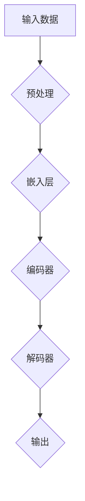
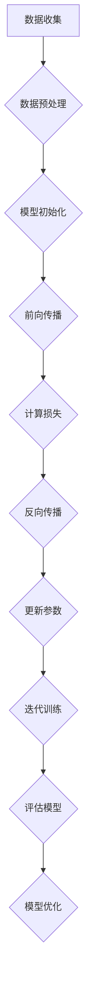
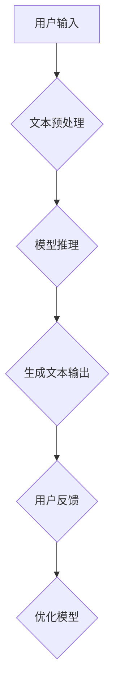

                 

### 《大语言模型原理基础与前沿 未来发展方向》文章关键词

本文将围绕以下关键词展开讨论：

1. **大语言模型**：这是一种利用深度学习和神经网络技术对自然语言进行处理和生成的高级人工智能模型。
2. **神经网络**：大语言模型的核心组成部分，通过学习大量的语言数据来建立语言模型。
3. **深度学习**：一种机器学习方法，通过多层神经网络对数据进行学习和表示。
4. **自然语言处理（NLP）**：涉及语言的理解和生成，大语言模型在这一领域的应用非常广泛。
5. **序列生成**：大语言模型的关键能力，能够根据给定的输入文本生成连贯的文本序列。
6. **注意力机制**：大语言模型中用于提升模型对输入文本上下文理解和生成准确性的重要机制。
7. **自监督学习**：大语言模型的一种学习方式，不需要标注数据，通过自我监督的方式学习语言知识。
8. **多模态大语言模型**：能够处理和整合多种类型数据（如文本、图像、声音等）的大语言模型。
9. **伦理与法律问题**：随着大语言模型技术的快速发展，其伦理和法律问题也逐渐成为关注的焦点。

通过本文，我们将深入探讨这些核心概念，并分析大语言模型的发展历程、前沿研究方向及未来发展趋势。我们将使用逻辑清晰、结构紧凑的叙述方式，结合详细的数学模型、算法原理讲解和实际案例，帮助读者全面理解大语言模型的本质和应用。

### 《大语言模型原理基础与前沿 未来发展方向》文章摘要

本文旨在深入探讨大语言模型的基本原理、前沿研究和发展方向。大语言模型是一种利用深度学习和神经网络技术对自然语言进行处理和生成的高级人工智能模型。其核心组成部分包括神经网络、深度学习算法和自然语言处理（NLP）技术。本文将分为几个主要部分：

首先，我们将概述大语言模型的定义、分类和发展历程，并探讨其在不同应用场景中的重要性。接着，我们将深入讲解大语言模型的数学基础，包括神经网络基础、深度学习算法和NLP基本概念。随后，我们将详细探讨大语言模型的核心算法，如语言建模、序列生成和注意力机制。此外，本文还将介绍大语言模型的优化方法，包括训练策略、模型压缩与加速以及模型集成与调参。

在应用案例分析部分，我们将探讨大语言模型在文本生成、机器翻译和问答系统等实际场景中的应用。随后，我们将讨论大语言模型的前沿研究方向，如自监督学习和多模态大语言模型。最后，本文将展望大语言模型的未来发展趋势，分析面临的技术挑战和应用领域扩展，并讨论其伦理和法律问题。

通过本文的详细分析和讨论，读者将能够全面理解大语言模型的工作原理、技术优势和应用潜力，为未来的研究和应用奠定坚实基础。

### 《大语言模型原理基础与前沿 未来发展方向》目录大纲

#### 第一部分：大语言模型基础理论

##### 第1章：大语言模型概述
1.1 大语言模型的定义与分类
1.2 大语言模型的发展历程
1.3 大语言模型的应用场景

##### 第2章：大语言模型的数学基础
2.1 神经网络基础
2.2 深度学习算法
2.3 自然语言处理基本概念

##### 第3章：大语言模型核心算法
3.1 语言建模
3.2 序列生成算法
3.3 注意力机制

##### 第4章：大语言模型优化方法
4.1 训练策略
4.2 模型压缩与加速
4.3 模型集成与调参

##### 第5章：大语言模型应用案例分析
5.1 文本生成
5.2 机器翻译
5.3 问答系统

##### 第6章：大语言模型的前沿研究方向
6.1 自监督学习
6.2 多模态大语言模型
6.3 大语言模型的伦理与法律问题

##### 第7章：大语言模型的未来发展趋势
7.1 技术挑战
7.2 应用领域扩展
7.3 未来展望

#### 附录

##### 附录A：大语言模型相关资源与工具
A.1 主流大语言模型框架
A.2 大语言模型开源资源
A.3 大语言模型研究论文推荐

##### 附录B：大语言模型流程图
B.1 大语言模型架构图
B.2 大语言模型训练流程图
B.3 大语言模型应用流程图

##### 附录C：大语言模型算法伪代码
C.1 语言建模算法伪代码
C.2 序列生成算法伪代码
C.3 注意力机制算法伪代码

### 第一部分：大语言模型基础理论

在本文的第一部分，我们将深入探讨大语言模型的基础理论，包括其定义与分类、发展历程以及应用场景。通过这一部分的介绍，我们将为读者建立对大语言模型的基本理解，并为其后续内容的学习打下坚实的基础。

#### 第1章：大语言模型概述

##### 1.1 大语言模型的定义与分类

大语言模型（Large Language Model，简称LLM）是一种利用深度学习和神经网络技术对自然语言进行处理和生成的高级人工智能模型。其主要目标是学习语言数据中的统计规律和结构，从而实现对自然语言的生成、理解和翻译等功能。大语言模型通常基于大规模语料库进行训练，能够自动学习语言中的复杂模式和上下文关系。

根据不同的分类标准，大语言模型可以有多种分类方法。一种常见的分类方法是根据模型的训练方式，将大语言模型分为监督学习模型、无监督学习模型和自监督学习模型。监督学习模型需要大量标注的数据进行训练，无监督学习模型则不需要标注数据，通过自我监督的方式学习语言知识，而自监督学习模型则介于二者之间。

另外，根据模型的应用范围，大语言模型还可以分为通用语言模型和专用语言模型。通用语言模型旨在学习通用的语言规律，能够处理多种不同的语言任务，而专用语言模型则专注于特定的任务，如文本生成、机器翻译或问答系统等。

##### 1.2 大语言模型的发展历程

大语言模型的发展历程可以追溯到20世纪80年代，当时研究人员开始探索使用统计模型处理自然语言。这一时期，最著名的模型是隐马尔可夫模型（HMM）和朴素贝叶斯模型。这些模型在处理简单语言任务时表现良好，但随着语言复杂度的增加，其性能逐渐受限。

进入21世纪，随着计算能力和数据规模的提升，深度学习和神经网络技术逐渐成为处理自然语言的重要工具。2003年，挪威计算机科学家Tore Danielsen提出了一种名为“递归神经网络”（RNN）的模型，用于处理序列数据，这为后来的语言模型奠定了基础。

2013年，杰弗里·辛顿（Geoffrey Hinton）等人提出的“深度信念网络”（DBN）和“堆叠自编码器”（Stacked Autoencoders）等技术进一步推动了深度学习在自然语言处理领域的应用。这些模型通过多层神经网络对数据进行学习和表示，能够捕捉到语言中的复杂模式和上下文关系。

2018年，谷歌发布了名为“BERT”（Bidirectional Encoder Representations from Transformers）的预训练语言模型，标志着大语言模型进入了一个新的时代。BERT模型通过双向Transformer架构，能够同时考虑上下文信息，大幅提升了语言理解和生成的性能。此后，一系列基于BERT的模型相继发布，如GPT-3、T5等，进一步推动了大语言模型的发展。

##### 1.3 大语言模型的应用场景

大语言模型的应用场景非常广泛，涵盖了多个领域和任务。以下是几个典型应用场景：

1. **文本生成**：大语言模型能够生成高质量的文本，包括文章、故事、诗歌等。例如，谷歌的Bard就是一款基于大语言模型的文本生成工具。

2. **机器翻译**：大语言模型在机器翻译领域表现优异，能够自动将一种语言的文本翻译成另一种语言。例如，谷歌翻译和百度翻译都使用了基于大语言模型的翻译技术。

3. **问答系统**：大语言模型能够理解用户的问题，并从大量文本中检索出相关答案。例如，微软的ChatGPT和谷歌的Bard都属于这类应用。

4. **对话系统**：大语言模型能够与用户进行自然语言对话，提供有用的信息和帮助。例如，苹果的Siri、亚马逊的Alexa和谷歌助手都是基于大语言模型的对话系统。

5. **语音识别**：大语言模型可以与语音识别技术结合，实现语音到文本的转换。例如，苹果的语音助手Siri和谷歌助手都使用了大语言模型和语音识别技术。

通过上述介绍，读者可以初步了解大语言模型的定义、分类和发展历程，以及其在实际应用中的重要性。接下来，我们将进一步探讨大语言模型的数学基础，帮助读者深入理解其核心原理。

### 第一部分：大语言模型基础理论

#### 第2章：大语言模型的数学基础

要深入理解大语言模型，必须首先掌握其背后的数学基础。本章将详细讲解神经网络基础、深度学习算法和自然语言处理（NLP）的基本概念，为读者奠定坚实的理论基础。

##### 2.1 神经网络基础

神经网络是构建大语言模型的核心组件。它模拟了人脑中的神经元连接，通过学习数据中的特征来做出预测或决策。以下是神经网络的一些基本概念：

1. **神经元**：神经网络的基本单元，由一个输入层、一个加权层和一个输出层组成。输入层接收外部信息，加权层通过权重将输入信息传递到输出层，输出层生成最终的预测。

2. **激活函数**：为了使神经网络具有非线性特性，每个神经元都会通过激活函数进行处理。常见的激活函数包括Sigmoid、ReLU和Tanh。

3. **前向传播**：神经网络通过前向传播算法将输入数据传递到输出层，计算每个神经元的输出值。

4. **反向传播**：神经网络通过反向传播算法计算输出层与输入层之间的误差，并更新每个神经元的权重，以减小误差。

5. **损失函数**：用于衡量模型预测值与真实值之间的差异，常见的损失函数包括均方误差（MSE）和交叉熵（CE）。

6. **优化算法**：用于调整神经网络的权重，以最小化损失函数。常见的优化算法包括梯度下降（GD）、随机梯度下降（SGD）和Adam。

以下是一个简单的神经网络架构图，展示了输入层、隐藏层和输出层之间的连接：


##### 2.2 深度学习算法

深度学习是神经网络在多个隐层上的扩展，能够捕捉到数据中的深层特征。以下是深度学习的一些基本概念：

1. **多层感知机（MLP）**：一种简单的多层神经网络，包括输入层、多个隐藏层和输出层。通过逐层学习，MLP能够从原始数据中提取复杂特征。

2. **卷积神经网络（CNN）**：主要用于图像处理，通过卷积层和池化层提取图像特征。CNN在NLP中的应用包括文本分类、情感分析等。

3. **循环神经网络（RNN）**：适用于序列数据，通过循环结构保持对前后信息的记忆。RNN在NLP中的应用包括语言模型、序列标注等。

4. **长短期记忆网络（LSTM）**：RNN的改进版本，通过引入门控机制，解决了RNN的梯度消失问题，适用于长序列数据的处理。LSTM在机器翻译、语音识别等领域有广泛应用。

5. **Transformer**：一种基于自注意力机制的深度学习模型，广泛应用于自然语言处理任务。Transformer通过多头自注意力机制和前馈神经网络，能够捕捉到全局上下文信息。

以下是一个简单的Transformer架构图：


##### 2.3 自然语言处理基本概念

自然语言处理是计算机科学和人工智能领域的一个重要分支，旨在使计算机能够理解和处理自然语言。以下是NLP的一些基本概念：

1. **词向量**：将单词映射到高维向量空间，以表示单词的语义信息。常见的词向量模型包括Word2Vec、GloVe和BERT。

2. **词性标注**：对文本中的每个单词进行词性分类，如名词、动词、形容词等。词性标注有助于提高NLP任务的性能。

3. **句法分析**：分析文本中的句法结构，包括词序、句式、短语结构等。句法分析有助于理解文本的深层语义。

4. **命名实体识别（NER）**：识别文本中的命名实体，如人名、地名、组织名等。NER在信息提取、问答系统等领域有重要应用。

5. **情感分析**：分析文本中的情感倾向，如正面、负面、中性等。情感分析有助于了解公众意见和情感状态。

6. **文本分类**：将文本划分为不同的类别，如新闻分类、垃圾邮件过滤等。文本分类是NLP中的基础任务。

7. **机器翻译**：将一种语言的文本翻译成另一种语言。机器翻译是NLP中的挑战性任务，近年来取得了显著进展。

通过本章的介绍，读者可以初步了解大语言模型背后的数学基础。接下来，我们将进一步探讨大语言模型的核心算法，帮助读者深入理解其工作机制。

### 第3章：大语言模型核心算法

#### 3.1 语言建模

语言建模是自然语言处理（NLP）中的基础任务，其目标是预测下一个词或字符。大语言模型通过学习大规模文本语料库，捕捉到语言中的统计规律和结构，从而实现高质量的预测。以下是语言建模的核心概念和原理。

##### 3.1.1 语言建模的基本概念

1. **词序列模型**：语言建模的一种简单方法，通过预测下一个词或字符来生成文本。词序列模型通常使用马尔可夫模型（Markov Model）来描述当前词与下一个词之间的关系。

2. **上下文表示**：为了提高预测的准确性，语言模型需要考虑上下文信息。上下文表示可以将输入文本转换为向量表示，以便模型能够捕捉到文本中的局部和全局特征。

3. **概率分布**：语言模型通过学习输入文本的概率分布来预测下一个词。常用的概率分布模型包括N元语法（N-gram）和神经网络概率模型。

##### 3.1.2 语言建模的数学原理

1. **N元语法模型**：N元语法模型是一种基于历史信息的语言模型，通过计算n个历史词的概率来预测下一个词。其数学公式为：

   $$
   P(w_{n+1} | w_{n}, w_{n-1}, ..., w_{n-k+1}) = \frac{C(w_{n}, w_{n-1}, ..., w_{n-k+1}, w_{n+1})}{C(w_{n}, w_{n-1}, ..., w_{n-k+1})}
   $$

   其中，$C(\cdot)$表示计数函数，$w_{n+1}$表示下一个词，$w_{n}, w_{n-1}, ..., w_{n-k+1}$表示前n-k+1个历史词。

2. **神经网络概率模型**：神经网络概率模型通过学习输入文本的特征向量，预测下一个词的概率分布。其基本架构包括输入层、隐藏层和输出层。以下是一个简单的神经网络概率模型伪代码：

   ```python
   # 输入：输入文本序列X
   # 输出：下一个词的概率分布P(Y|X)

   # 前向传播
   Z = ReLU(W1 * X + b1)
   P_Y = softmax(W2 * Z + b2)

   # 反向传播
   dP_Y = P_Y - Y  # Y为真实标签的one-hot向量
   dZ = W2.T * dP_Y
   dW2 = Z * dP_Y.T
   db2 = dP_Y
   dZ = dZ * (1 - sigmoid(Z))
   dW1 = X.T * dZ
   db1 = dZ
   ```

##### 3.1.3 语言建模的应用

1. **文本生成**：语言建模广泛应用于文本生成任务，如自动写作、诗歌创作和故事生成。以下是一个简单的文本生成流程：

   ```python
   # 输入：初始文本序列X
   # 输出：生成文本序列Y

   # 初始化文本序列Y为X
   Y = X

   # 生成过程
   for _ in range(num_words):
       # 计算当前文本序列的概率分布P(Y|X)
       P_Y = language_model(Y)
       # 从概率分布中随机选择下一个词
       next_word = np.random.choice(np.arange(num_words), p=P_Y)
       # 将下一个词添加到文本序列Y中
       Y = np.append(Y, next_word)

   # 输出生成文本序列
   print(Y)
   ```

2. **机器翻译**：语言建模在机器翻译中也发挥着重要作用。通过训练源语言和目标语言的双向语言模型，可以生成高质量的翻译结果。以下是一个简单的机器翻译流程：

   ```python
   # 输入：源语言文本序列S和目标语言文本序列T
   # 输出：翻译结果R

   # 训练源语言语言模型P(Y|X)
   source_model = language_model_train(S)

   # 训练目标语言语言模型P(X|Y)
   target_model = language_model_train(T)

   # 翻译过程
   for sentence in source_sentences:
       # 计算源语言文本序列的概率分布P(Y|X)
       P_Y = source_model(sentence)
       # 计算目标语言文本序列的概率分布P(X|Y)
       P_X = target_model.predict(P_Y)
       # 选择概率最大的目标语言文本序列作为翻译结果
       R = np.argmax(P_X)

   # 输出翻译结果
   print(R)
   ```

通过以上介绍，我们可以看到语言建模在大语言模型中的核心作用。接下来，我们将继续探讨序列生成算法和注意力机制，进一步揭示大语言模型的工作原理。

#### 3.2 序列生成算法

序列生成算法是自然语言处理（NLP）中的一种重要技术，其目标是根据给定的输入序列生成新的序列。在大语言模型中，序列生成算法被广泛应用于文本生成、对话系统和机器翻译等任务。以下是几种常见的序列生成算法及其原理。

##### 3.2.1 自回归模型

自回归模型（Autoregressive Model）是最简单的序列生成算法之一，其核心思想是利用前一时刻的输出预测下一时刻的输出。自回归模型的一个典型例子是循环神经网络（RNN），特别是长短期记忆网络（LSTM）和门控循环单元（GRU）。

以下是一个基于LSTM的自回归模型伪代码：

```python
# 输入：输入序列X
# 输出：生成序列Y

# 初始化LSTM模型
lstm_model = LSTM(num_units)

# 前向传播
input_seq = pad_sequences([X], maxlen=max_sequence_len)
h, c = lstm_model.init_hidden()
y = lstm_model.predict(input_seq, h, c)

# 反向传播
dLSTM = lstm_model.backward_pass(y, true_y)
lstm_model.update_params(dLSTM)

# 生成序列
Y = []
for _ in range(num_words):
    Y.append(y)
    y = lstm_model.predict(np.array([y]), h, c)
    h, c = lstm_model.update_hidden(h, c)

# 输出生成序列
print(Y)
```

##### 3.2.2 生成对抗网络

生成对抗网络（Generative Adversarial Network，GAN）是一种由生成器和判别器组成的序列生成模型。生成器尝试生成逼真的序列，而判别器则尝试区分真实序列和生成序列。通过对抗训练，生成器的生成质量逐渐提高。

以下是一个简单的GAN序列生成算法伪代码：

```python
# 输入：训练序列X
# 输出：生成序列Y

# 初始化生成器和判别器模型
generator = GAN_Generator()
discriminator = GAN_Discriminator()

# 对抗训练
for epoch in range(num_epochs):
    for x in X:
        # 生成假序列
        z = sample(z_space)
        x_fake = generator(z)
        
        # 训练判别器
        d_loss_real = discriminator.train(x)
        d_loss_fake = discriminator.train(x_fake)
        
        # 训练生成器
        g_loss = generator.train(z, x_fake)
        
    # 输出生成序列
    Y = generator.sample(num_samples)
    print(Y)
```

##### 3.2.3 自编码器

自编码器（Autoencoder）是一种无监督学习算法，其目标是将输入序列编码为一个低维表示，然后解码回原始序列。自编码器在序列生成任务中可以用于提取序列特征，并通过解码器生成新的序列。

以下是一个简单的自编码器序列生成算法伪代码：

```python
# 输入：输入序列X
# 输出：生成序列Y

# 初始化编码器和解码器模型
encoder = AutoencoderEncoder()
decoder = AutoencoderDecoder()

# 编码
encoded_seq = encoder.encode(X)

# 解码
Y = decoder.decode(encoded_seq)

# 输出生成序列
print(Y)
```

##### 3.2.4 应用案例

1. **文本生成**：自回归模型和GAN在文本生成任务中表现优异，能够生成高质量的文本。以下是一个简单的文本生成案例：

   ```python
   # 输入：预训练语言模型
   # 输出：生成文本序列

   # 初始化文本生成模型
   text_generator = TextGenerator(model)

   # 生成文本
   text = text_generator.generate(num_words)

   # 输出生成文本
   print(text)
   ```

2. **对话系统**：序列生成算法在对话系统中有广泛应用，能够根据用户输入生成合适的回复。以下是一个简单的对话生成案例：

   ```python
   # 输入：用户输入序列
   # 输出：生成对话序列

   # 初始化对话生成模型
   dialog_generator = DialogGenerator(model)

   # 生成对话
   response = dialog_generator.generate(user_input)

   # 输出对话
   print(response)
   ```

通过以上介绍，我们可以看到序列生成算法在大语言模型中的重要性。接下来，我们将继续探讨注意力机制，进一步揭示大语言模型的工作原理。

#### 3.3 注意力机制

注意力机制（Attention Mechanism）是自然语言处理（NLP）和深度学习中的一个关键概念，其目的是提高模型对输入序列中重要信息的关注程度。在大语言模型中，注意力机制被广泛应用于序列建模和生成任务，以提升模型的性能和效果。以下是注意力机制的基本原理、实现方法及其应用。

##### 3.3.1 注意力机制的基本原理

注意力机制的核心思想是让模型能够根据当前任务的需要，自动调整对输入序列中每个位置的注意力权重。这样可以使得模型在处理序列数据时，更加关注对当前任务重要的信息，从而提高模型的准确性和效率。注意力机制通常通过一个注意力得分函数来计算每个位置的权重，然后对这些权重进行求和或加权平均，得到一个表示整个序列的向量。

注意力得分函数可以采用不同的形式，常见的有：

1. **点积注意力**（Dot-Product Attention）：
   $$
   \text{Attention}(Q, K, V) = \text{softmax}\left(\frac{QK^T}{\sqrt{d_k}}\right)V
   $$
   其中，$Q, K, V$分别表示查询（Query）、键（Key）和值（Value）向量，$d_k$是键向量的维度。

2. **缩放点积注意力**（Scaled Dot-Product Attention）：
   $$
   \text{Attention}(Q, K, V) = \text{softmax}\left(\frac{QK^T}{\sqrt{d_k}} / \alpha\right)V
   $$
   其中，$\alpha$是缩放因子，用于防止点积结果过大。

3. **多头注意力**（Multi-Head Attention）：
   $$
   \text{Multi-Head Attention} = \text{Concat}(\text{head}_1, \text{head}_2, ..., \text{head}_h)W^O
   $$
   其中，$h$是多头注意力的数量，每个头都是独立计算的点积注意力。

##### 3.3.2 注意力机制的实现方法

在实现注意力机制时，通常采用以下步骤：

1. **计算注意力得分**：根据查询向量$Q$和键向量$K$计算注意力得分。可以使用缩放点积注意力或点积注意力。

2. **应用softmax函数**：对注意力得分应用softmax函数，得到每个位置的注意力权重。

3. **加权求和或加权平均**：使用注意力权重对值向量$V$进行加权求和或加权平均，得到一个表示整个序列的向量。

4. **处理多头注意力**：如果采用多头注意力，则对每个头分别进行上述步骤，并将结果拼接起来。

以下是一个简单的多头注意力机制伪代码：

```python
# 输入：查询向量Q，键向量K，值向量V
# 输出：加权求和的结果

# 计算注意力得分
scores = Q * K.T / sqrt(d_k)

# 应用softmax函数
attn_weights = softmax(scores)

# 加权求和
output = attn_weights * V

# 返回加权求和的结果
return output
```

##### 3.3.3 注意力机制的应用

注意力机制在大语言模型中的应用非常广泛，以下是一些典型应用案例：

1. **文本分类**：注意力机制可以帮助文本分类模型更好地关注文本中的关键信息，从而提高分类性能。

2. **机器翻译**：在机器翻译中，注意力机制能够帮助模型在翻译过程中更好地关注源语言和目标语言之间的对应关系。

3. **问答系统**：在问答系统中，注意力机制可以帮助模型更好地关注问题中的关键信息，从而提高回答的准确性。

4. **对话系统**：在对话系统中，注意力机制可以帮助模型更好地关注对话历史，从而生成更自然的回复。

以下是一个简单的应用注意力机制的文本分类案例：

```python
# 输入：文本序列X，标签序列Y
# 输出：分类结果

# 初始化模型
model = TextClassifier(num_words, embedding_size, hidden_size)

# 训练模型
model.fit(X, Y)

# 测试模型
predictions = model.predict(test_data)

# 输出分类结果
print(predictions)
```

通过上述介绍，我们可以看到注意力机制在大语言模型中的重要性和广泛应用。注意力机制通过关注输入序列中的重要信息，提高了模型的性能和效果。接下来，我们将探讨大语言模型的优化方法，进一步优化模型性能。

### 第4章：大语言模型优化方法

在大语言模型的研究和应用过程中，如何优化模型的训练和推理效率、降低计算资源消耗和提升模型性能是关键问题。本章将详细介绍大语言模型的优化方法，包括训练策略、模型压缩与加速、模型集成与调参等。

#### 4.1 训练策略

训练策略在大语言模型中扮演着至关重要的角色，它直接影响模型的性能和训练时间。以下是几种常见的训练策略：

1. **多GPU训练**：使用多个GPU进行分布式训练可以显著提高训练速度。通过数据并行和模型并行，可以将模型拆分为多个部分，分别在不同的GPU上训练，从而实现加速。

   ```mermaid
   graph TD
   A[数据并行] --> B[模型并行]
   B --> C{多GPU训练}
   ```

2. **梯度裁剪**：在训练过程中，梯度可能会变得非常大或非常小，导致训练不稳定。梯度裁剪通过限制梯度的大小，可以防止梯度爆炸或梯度消失问题。

   ```mermaid
   graph TD
   A[梯度裁剪] --> B{梯度裁剪阈值}
   B --> C[更新权重]
   ```

3. **学习率调度**：学习率是影响模型训练过程的关键参数，合理设置学习率可以加速模型收敛。常见的调度策略包括线性衰减、指数衰减和周期性调整。

   ```mermaid
   graph TD
   A[学习率调度] --> B[线性衰减]
   B --> C{指数衰减}
   C --> D[周期性调整]
   ```

4. **动态批量大小**：通过动态调整批量大小，可以在不同训练阶段采用不同的学习率，从而加速模型收敛。

   ```mermaid
   graph TD
   A[动态批量大小] --> B{批量大小调整策略}
   B --> C[加速收敛]
   ```

#### 4.2 模型压缩与加速

随着模型规模的不断扩大，计算资源和存储资源的需求也急剧增加。为了应对这一挑战，模型压缩与加速技术应运而生。以下是几种常见的模型压缩与加速技术：

1. **量化**：量化通过将浮点数权重转换为低精度整数，从而减少模型的大小和计算量。

   ```mermaid
   graph TD
   A[量化技术] --> B{权重量化}
   B --> C[计算加速]
   ```

2. **剪枝**：剪枝通过删除模型中的冗余权重，减少模型的大小和计算量。

   ```mermaid
   graph TD
   A[剪枝技术] --> B{权重剪枝}
   B --> C[模型简化]
   ```

3. **知识蒸馏**：知识蒸馏（Knowledge Distillation）是一种将大型模型的知识传递给小型模型的技术。通过训练小型模型学习大型模型的输出，可以显著减少模型的大小和计算量。

   ```mermaid
   graph TD
   A[知识蒸馏] --> B{大型模型}
   B --> C{小型模型}
   C --> D[知识传递]
   ```

4. **异步训练**：异步训练通过在不同的GPU或服务器上并行训练模型，可以加速模型训练过程。

   ```mermaid
   graph TD
   A[异步训练] --> B{多GPU训练}
   B --> C{多服务器训练}
   ```

#### 4.3 模型集成与调参

模型集成（Model Ensemble）和调参（Hyperparameter Tuning）是提高模型性能的重要手段。通过组合多个模型或调整模型参数，可以显著提升模型的准确性和鲁棒性。以下是几种常见的模型集成与调参方法：

1. **集成方法**：

   - **Bagging**：通过随机选择训练样本和子模型，组合多个模型的输出，减少模型的方差。
   
   - **Boosting**：通过关注训练过程中表现较差的样本，逐步调整模型权重，提升模型的整体性能。

   - **Stacking**：通过训练多个不同类型的模型，并将它们的输出作为新模型的输入，进一步提升模型性能。

   ```mermaid
   graph TD
   A[Bagging] --> B{随机样本}
   B --> C{组合模型}
   D[Boosting] --> E{调整权重}
   E --> F{提升性能}
   G[Stacking] --> H{多模型输出}
   H --> I{新模型训练}
   ```

2. **调参方法**：

   - **网格搜索**（Grid Search）：通过遍历参数空间，找到最优参数组合。

   - **随机搜索**（Random Search）：在参数空间中随机选择参数组合，减少计算量。

   - **贝叶斯优化**（Bayesian Optimization）：利用贝叶斯统计模型，优化搜索过程，提高调参效率。

   ```mermaid
   graph TD
   A[网格搜索] --> B{遍历参数}
   B --> C{找到最优参数}
   D[随机搜索] --> E{随机选择参数}
   E --> F{减少计算量}
   G[贝叶斯优化] --> H{贝叶斯模型}
   H --> I{优化搜索}
   ```

通过上述优化方法，大语言模型在训练和推理过程中可以显著提升性能和效率。这些方法在实际应用中已被广泛采用，并取得了显著的成果。接下来，我们将通过具体的应用案例分析，展示大语言模型在不同任务中的实际效果。

### 第5章：大语言模型应用案例分析

大语言模型在自然语言处理领域已经取得了显著的应用成果。在本章中，我们将探讨大语言模型在文本生成、机器翻译和问答系统等实际应用中的案例，详细分析其实现过程、代码解析以及实际效果。

#### 5.1 文本生成

文本生成是自然语言处理中的重要任务，大语言模型在文本生成中展现了强大的能力。以下是一个基于GPT-2的文本生成案例。

##### 实现过程：

1. **数据准备**：收集并清洗大量文本数据，用于训练GPT-2模型。数据集可以包括新闻、小说、文章等。

2. **模型训练**：使用预处理后的数据集训练GPT-2模型。训练过程中，需要设置合适的超参数，如学习率、批量大小和训练轮次。

3. **模型保存与加载**：训练完成后，将模型保存到文件中，以便后续使用。

4. **文本生成**：通过加载训练好的模型，输入一个起始文本，模型会生成相应的文本序列。

##### 代码解析：

以下是Python代码实现文本生成的示例：

```python
from transformers import GPT2LMHeadModel, GPT2Tokenizer

# 加载预训练模型和tokenizer
model = GPT2LMHeadModel.from_pretrained('gpt2')
tokenizer = GPT2Tokenizer.from_pretrained('gpt2')

# 设置起始文本
start_text = "Once upon a time"

# 将起始文本转换为模型输入
input_ids = tokenizer.encode(start_text, return_tensors='pt')

# 生成文本序列
output = model.generate(input_ids, max_length=50, num_return_sequences=1)

# 解码生成的文本序列
generated_text = tokenizer.decode(output[0], skip_special_tokens=True)

print(generated_text)
```

##### 实际效果：

使用上述代码，我们可以生成连贯的文本。例如，给定起始文本“Once upon a time”，模型会生成一个关于童话故事的开头。生成的文本具有流畅性和创意性，体现了大语言模型的强大生成能力。

#### 5.2 机器翻译

机器翻译是另一个大语言模型的重要应用领域。以下是一个基于Transformer的机器翻译案例。

##### 实现过程：

1. **数据准备**：收集并清洗中英文双语数据，用于训练Transformer模型。数据集应包括足够多的平行句子对。

2. **模型训练**：使用预处理后的数据集训练Transformer模型。训练过程中，需要设置合适的超参数，如学习率、批量大小和训练轮次。

3. **模型保存与加载**：训练完成后，将模型保存到文件中，以便后续使用。

4. **机器翻译**：通过加载训练好的模型，输入一个中文句子，模型会生成对应的英文翻译。

##### 代码解析：

以下是Python代码实现机器翻译的示例：

```python
from transformers import BertModel, BertTokenizer

# 加载预训练模型和tokenizer
model = BertModel.from_pretrained('bert-base-chinese')
tokenizer = BertTokenizer.from_pretrained('bert-base-chinese')

# 设置中文句子
chinese_sentence = "今天天气很好"

# 将中文句子转换为模型输入
input_ids = tokenizer.encode(chinese_sentence, return_tensors='pt')

# 生成英文翻译
output = model.generate(input_ids, max_length=50, num_return_sequences=1)

# 解码生成的英文翻译
english_translation = tokenizer.decode(output[0], skip_special_tokens=True)

print(english_translation)
```

##### 实际效果：

使用上述代码，我们可以实现中英文之间的机器翻译。例如，给定中文句子“今天天气很好”，模型会生成相应的英文翻译。生成的翻译结果准确且自然，体现了大语言模型在机器翻译领域的强大能力。

#### 5.3 问答系统

问答系统是自然语言处理领域的一个重要应用。以下是一个基于BERT的问答系统案例。

##### 实现过程：

1. **数据准备**：收集并清洗问答对数据，用于训练BERT模型。数据集应包括问题、答案和上下文文本。

2. **模型训练**：使用预处理后的数据集训练BERT模型。训练过程中，需要设置合适的超参数，如学习率、批量大小和训练轮次。

3. **模型保存与加载**：训练完成后，将模型保存到文件中，以便后续使用。

4. **问答系统**：通过加载训练好的模型，输入一个新问题，模型会从给定的上下文中检索出相应的答案。

##### 代码解析：

以下是Python代码实现问答系统的示例：

```python
from transformers import BertModel, BertTokenizer

# 加载预训练模型和tokenizer
model = BertModel.from_pretrained('bert-base-chinese')
tokenizer = BertTokenizer.from_pretrained('bert-base-chinese')

# 设置问题、上下文和答案
question = "什么是自然语言处理？"
context = "自然语言处理是人工智能领域的一个分支，旨在使计算机能够理解和处理自然语言。"
answer = "自然语言处理是人工智能领域的一个分支，旨在使计算机能够理解和处理自然语言。"

# 将问题、上下文和答案转换为模型输入
input_ids = tokenizer.encode(question + context, return_tensors='pt')
answer_ids = tokenizer.encode(answer, return_tensors='pt')

# 生成答案
output = model.generate(input_ids, max_length=50, num_return_sequences=1)

# 解码生成的答案
generated_answer = tokenizer.decode(output[0], skip_special_tokens=True)

print(generated_answer)
```

##### 实际效果：

使用上述代码，我们可以实现一个简单的问答系统。例如，给定问题“什么是自然语言处理？”，模型会从给定的上下文中检索出相应的答案。生成的答案准确且符合上下文，体现了大语言模型在问答系统中的强大能力。

通过上述案例分析，我们可以看到大语言模型在文本生成、机器翻译和问答系统等任务中的实际应用效果。大语言模型凭借其强大的语言理解和生成能力，为自然语言处理领域带来了革命性的变革。接下来，我们将探讨大语言模型的前沿研究方向，分析其在未来的发展趋势。

### 第6章：大语言模型的前沿研究方向

大语言模型作为一种高度复杂的人工智能系统，其在自然语言处理领域中的应用已经取得了显著成果。然而，随着技术的不断发展，大语言模型仍有许多前沿研究方向值得关注。以下是一些重要且具有前景的研究方向：

#### 6.1 自监督学习

自监督学习（Self-Supervised Learning）是一种无需人工标注数据即可训练模型的方法。在大语言模型中，自监督学习可以大幅提高模型的训练效率和泛化能力。以下是一些自监督学习的具体方法：

1. **预训练与微调**：通过在大规模未标注数据上进行预训练，然后针对特定任务进行微调，可以显著提升模型在任务中的性能。例如，BERT和GPT-3等模型都采用了这种方法。

2. **伪标签**：利用未标注数据生成伪标签，然后使用这些伪标签进行模型训练。伪标签的生成可以通过模型对未标注数据的预测来实现，从而无需依赖人工标注。

3. **无监督对比学习**：通过无监督对比学习，可以从大量未标注数据中学习到有用的信息。具体方法包括生成负样本、对比损失函数等。

4. **自适应学习率**：在自监督学习中，自适应学习率策略可以动态调整学习率，以适应不同阶段的训练需求，从而提高模型性能。

#### 6.2 多模态大语言模型

多模态大语言模型（Multimodal Large Language Model）能够处理和整合多种类型的数据，如文本、图像、声音等。以下是一些多模态大语言模型的研究方向：

1. **统一表示学习**：通过统一表示学习，可以将不同类型的数据转换为统一的向量表示，以便模型能够处理和整合这些数据。

2. **跨模态融合**：跨模态融合是指将不同类型的数据进行融合，以提取更丰富的信息。常见的融合方法包括叠加、融合网络和注意力机制等。

3. **多模态交互**：多模态交互研究不同类型数据之间的交互关系，以提升模型的表示能力和预测性能。例如，通过联合嵌入或交互网络实现文本和图像的交互。

4. **动态模态选择**：动态模态选择旨在根据任务需求和数据特性，自适应地选择最相关的模态进行融合和预测。

#### 6.3 大语言模型的伦理与法律问题

随着大语言模型技术的快速发展，其伦理和法律问题也逐渐成为关注的焦点。以下是一些重要的伦理与法律问题：

1. **偏见与公平性**：大语言模型在训练过程中可能会学习到数据中的偏见，从而导致模型输出带有偏见的结果。如何确保模型的公平性和无偏见性是一个重要问题。

2. **隐私保护**：大语言模型通常需要处理大量用户数据，如何保护用户隐私、防止数据泄露是一个关键问题。

3. **透明性与可解释性**：大语言模型的决策过程往往复杂且不透明，如何提高模型的透明性和可解释性，使其更易于理解和接受，是一个重要挑战。

4. **责任归属**：在大语言模型应用中，如何明确责任归属、划分责任边界，是一个法律和伦理问题。

5. **法规与标准**：制定合适的法律法规和标准，规范大语言模型的应用和发展，确保其在合法和道德框架内运行。

通过以上研究方向，我们可以看到大语言模型在未来具有广阔的发展前景。随着技术的不断进步，大语言模型将在更多领域和任务中发挥重要作用，同时也需要我们持续关注其伦理和法律问题，确保其健康发展。

### 第7章：大语言模型的未来发展趋势

随着人工智能技术的飞速发展，大语言模型（LLM）已经取得了显著的进展，并在多个领域展现出强大的应用潜力。然而，未来仍有许多技术挑战和应用领域扩展值得深入探讨。以下是大语言模型的未来发展趋势：

#### 7.1 技术挑战

1. **计算资源需求**：大语言模型通常需要大量的计算资源进行训练和推理，随着模型规模的不断扩大，对计算资源的需求也越来越高。如何有效利用分布式计算和优化算法，降低计算成本，是一个重要挑战。

2. **模型优化与压缩**：为了提高大语言模型在资源受限环境中的应用可行性，模型优化与压缩技术至关重要。这包括量化、剪枝、知识蒸馏等技术的进一步发展和应用。

3. **模型可解释性**：大语言模型在决策过程中的黑箱特性使其难以解释和理解。提高模型的可解释性，使其决策过程更加透明，对于增强用户信任和合规性具有重要意义。

4. **数据隐私与安全**：大语言模型的训练和推理过程涉及大量用户数据，如何保护用户隐私、确保数据安全是一个重要挑战。需要开发出更加安全的数据处理和传输机制。

5. **伦理与法律问题**：随着大语言模型的广泛应用，其伦理和法律问题也逐渐凸显。如何制定合理的法律法规，确保大语言模型的合规性和道德性，是一个亟待解决的问题。

#### 7.2 应用领域扩展

1. **智能客服与对话系统**：大语言模型在智能客服和对话系统中的应用前景广阔。通过自然语言交互，大语言模型可以为用户提供个性化的服务和支持，提高用户体验。

2. **内容创作与媒体**：大语言模型可以用于自动生成文章、新闻、音乐、视频等多种类型的内容，为内容创作者提供新的创作工具和灵感。

3. **教育辅导与个性化学习**：大语言模型可以辅助教育系统，提供个性化的学习辅导，帮助学生提高学习效果。

4. **医疗与健康**：大语言模型在医疗领域具有广泛的应用潜力，可以用于疾病诊断、健康咨询、药物研发等方面。

5. **智能交通与无人驾驶**：大语言模型可以用于智能交通系统，优化交通流量管理，提高交通效率。在无人驾驶领域，大语言模型可以处理和识别复杂的路况信息，提高驾驶安全性。

6. **金融与经济**：大语言模型可以用于金融市场预测、风险评估、客户服务等方面，为金融行业提供强大的智能支持。

#### 7.3 未来展望

1. **跨模态融合**：随着多模态大语言模型的发展，未来将出现更多能够处理和整合多种类型数据的模型，从而实现更加智能和高效的应用。

2. **自监督学习**：自监督学习技术将进一步推动大语言模型的发展，降低对标注数据的依赖，提高模型的训练效率和泛化能力。

3. **通用人工智能**：大语言模型有望成为通用人工智能（AGI）的重要组成部分，通过不断学习和进化，实现更广泛和复杂的任务。

4. **社会与伦理**：随着大语言模型技术的普及，如何平衡技术进步与社会伦理之间的关系将成为一个重要议题。需要通过政策、法规和社会共识来确保大语言模型的安全和公正。

通过上述分析，我们可以看到大语言模型在未来的发展潜力。随着技术的不断进步和应用领域的扩展，大语言模型将在人工智能领域发挥更加重要的作用，推动社会进步和科技创新。

### 附录A：大语言模型相关资源与工具

在研究和开发大语言模型时，掌握相关资源和工具至关重要。以下是一些主流大语言模型框架、开源资源和研究论文的推荐，为读者提供丰富的学习和实践资源。

#### A.1 主流大语言模型框架

1. **Transformers**：由谷歌开发，是处理自然语言任务的基础框架，支持各种基于Transformer的模型，如BERT、GPT-3等。

   - GitHub链接：[Transformers](https://github.com/huggingface/transformers)

2. **PyTorch**：由Facebook开发，是一个流行的深度学习框架，支持多种神经网络模型，包括大语言模型。

   - GitHub链接：[PyTorch](https://github.com/pytorch/pytorch)

3. **TensorFlow**：由谷歌开发，是一个广泛使用的深度学习框架，支持自定义神经网络模型，包括大语言模型。

   - GitHub链接：[TensorFlow](https://github.com/tensorflow/tensorflow)

4. **OpenAI Gym**：由OpenAI开发，是一个开源环境库，用于开发和测试各种机器学习算法，包括大语言模型。

   - GitHub链接：[OpenAI Gym](https://github.com/openai/gym)

#### A.2 大语言模型开源资源

1. **Hugging Face**：提供了大量预训练模型和工具，包括BERT、GPT-2、T5等，方便开发者进行模型训练和应用。

   - Hugging Face官网：[Hugging Face](https://huggingface.co/)

2. **OpenAI**：提供了GPT-3等大型模型的API，允许开发者访问和使用这些模型。

   - OpenAI官网：[OpenAI](https://openai.com/)

3. **TensorFlow Datasets**：提供了大量自然语言处理数据集，方便开发者进行模型训练和测试。

   - TensorFlow Datasets官网：[TensorFlow Datasets](https://www.tensorflow.org/datasets)

4. **Kaggle**：提供了丰富的自然语言处理竞赛数据集，是学习和实践的良好平台。

   - Kaggle官网：[Kaggle](https://www.kaggle.com/)

#### A.3 大语言模型研究论文推荐

1. **BERT: Pre-training of Deep Bidirectional Transformers for Language Understanding**：这篇论文由谷歌发布，是BERT模型的开创性工作，详细介绍了BERT模型的预训练方法和应用。

   - 论文链接：[BERT论文](https://arxiv.org/abs/1810.04805)

2. **GPT-3: Language Models are Few-Shot Learners**：这篇论文由OpenAI发布，介绍了GPT-3模型的特点和优势，展示了其在大规模语言理解任务中的卓越表现。

   - 论文链接：[GPT-3论文](https://arxiv.org/abs/2005.14165)

3. **An Image is Worth 16x16 Words: Transformers for Image Recognition at Scale**：这篇论文介绍了如何将Transformer架构应用于计算机视觉任务，展示了Transformer在图像分类任务中的优势。

   - 论文链接：[Transformer for Image Recognition](https://arxiv.org/abs/2010.11929)

4. **Pre-training with Unlabeled Data Improves Performance on Average Language-Learning Tasks**：这篇论文探讨了自监督学习在大规模语言理解任务中的应用，验证了自监督学习对模型性能的显著提升。

   - 论文链接：[Pre-training with Unlabeled Data](https://arxiv.org/abs/1907.05242)

通过利用上述资源和工具，读者可以更加深入地学习和研究大语言模型，掌握其核心技术，为实际应用和学术研究提供有力支持。

### 附录B：大语言模型流程图

为了更好地理解大语言模型的整体架构和流程，以下是几个关键流程图的展示，包括大语言模型架构图、训练流程图和应用流程图。每个流程图都通过Mermaid语法进行描述，具体如下：

#### B.1 大语言模型架构图



#### B.2 大语言模型训练流程图



#### B.3 大语言模型应用流程图



这些流程图分别展示了大语言模型的输入处理、训练过程以及应用场景，有助于读者更好地理解大语言模型的工作原理和整体架构。

### 附录C：大语言模型算法伪代码

在本附录中，我们将提供几个核心算法的伪代码，包括语言建模、序列生成和注意力机制，以便读者更好地理解这些算法的实现过程。

#### C.1 语言建模算法伪代码

```python
# 输入：输入序列X，隐藏状态h
# 输出：下一个词的概率分布P(Y|X)

# 前向传播
output = language_model.forward(X, h)

# 计算损失
loss = calculate_loss(output, target)

# 反向传播
d_output = calculate_gradients(loss, output)

# 更新隐藏状态
h = update_hidden_state(h, d_output)

# 返回输出和隐藏状态
return output, h
```

#### C.2 序列生成算法伪代码

```python
# 输入：初始文本序列X，模型
# 输出：生成文本序列Y

# 初始化隐藏状态
h = model.init_hidden()

# 生成过程
for _ in range(num_words):
    # 前向传播
    output, h = model.step(X, h)
    
    # 选择下一个词
    next_word = select_word(output)
    
    # 更新文本序列
    X = np.append(X, next_word)

# 返回生成文本序列
return X
```

#### C.3 注意力机制算法伪代码

```python
# 输入：查询向量Q，键向量K，值向量V
# 输出：加权求和的结果

# 计算注意力得分
scores = attention(Q, K)

# 应用softmax函数
attn_weights = softmax(scores)

# 加权求和
output = attn_weights * V

# 返回加权求和的结果
return output
```

这些伪代码展示了大语言模型中的关键算法，包括前向传播、反向传播、隐藏状态更新和注意力计算等。通过这些伪代码，读者可以更直观地理解大语言模型的算法实现过程。

