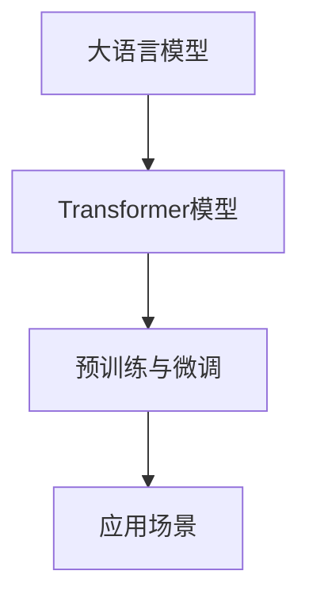
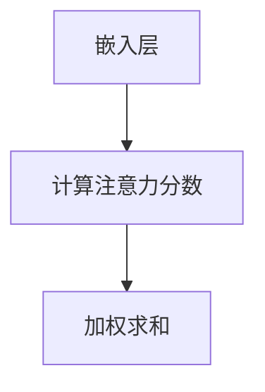
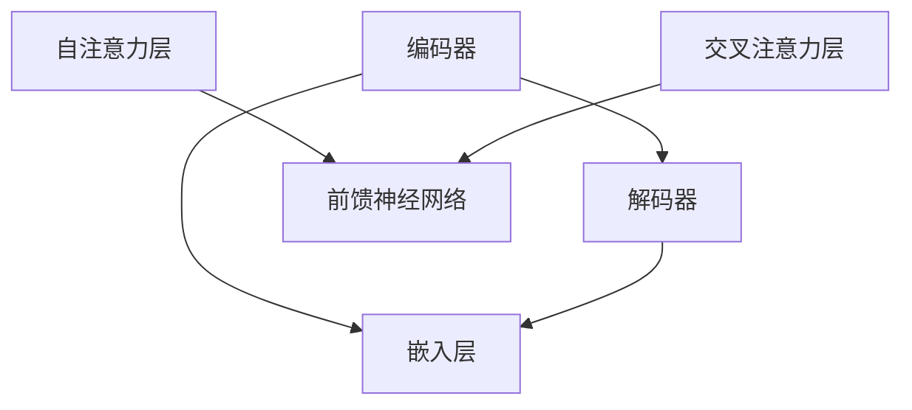
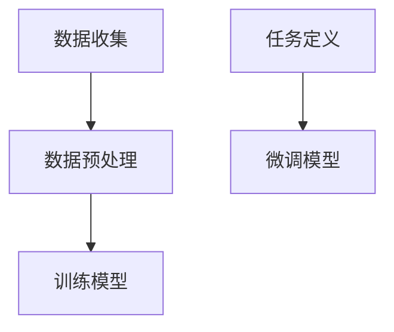
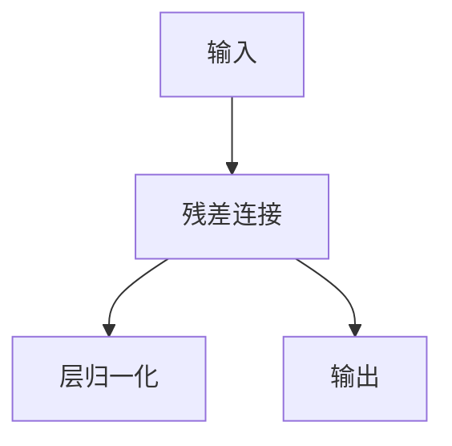

                 

# 大语言模型原理基础与前沿 轻量级适配

> **关键词**：大语言模型，Transformer，自注意力机制，预训练，微调，模型压缩，多模态学习，低资源语言支持，伦理与隐私

> **摘要**：本文系统地介绍了大语言模型的基本原理、核心技术、训练过程、评估方法、实际应用和未来发展趋势。通过详细阐述自注意力机制、Transformer模型架构、数学模型和训练技巧，本文旨在为读者提供全面深入的理解和实用的开发指导。

### 第一部分：大语言模型概述

#### 第1章：大语言模型概述

##### 1.1 大语言模型的概念

大语言模型是一种基于深度学习的自然语言处理模型，它能够捕捉和理解人类语言的复杂结构，生成自然流畅的语言。大语言模型的核心思想是通过大规模的文本数据进行预训练，学习语言的一般特性，然后通过特定的任务数据进行微调，以适应不同的自然语言处理任务。

##### 1.2 大语言模型的架构

目前最流行的大语言模型架构是Transformer模型，它基于自注意力机制，能够捕捉文本序列中的长距离依赖关系。Transformer模型由编码器（Encoder）和解码器（Decoder）两部分组成，其中编码器负责将输入文本序列编码成固定长度的向量，解码器使用这些向量生成输出序列。

##### 1.3 大语言模型的发展历程

大语言模型的发展历程可以追溯到2013年的深度学习时代。早期模型如LSTM和GRU等基于循环神经网络的模型，虽然能够处理序列数据，但在捕捉长距离依赖关系方面存在局限性。2017年，Google推出了BERT模型，标志着大语言模型时代的到来。随后，OpenAI的GPT和GPT-2，Google的T5等模型相继推出，进一步推动了大语言模型的发展。

##### 1.4 大语言模型的应用前景

大语言模型在自然语言处理领域具有广泛的应用前景。它可以用于自动文本生成、机器翻译、问答系统、情感分析等任务。此外，大语言模型在企业级应用中也有很大的潜力，如金融、医疗、教育、客服等领域，可以为企业提供智能化的解决方案。

### Mermaid 流程图：



### 核心算法原理讲解：

#### Transformer模型的核心算法原理：

1. **自注意力机制**：自注意力机制是Transformer模型的核心，它能够捕捉文本序列中的长距离依赖关系。通过计算文本序列中每个词与其他词的相似度，为每个词生成权重，从而实现长距离依赖的捕捉。

   **数学公式**：
   $$
   \text{Attention}(Q, K, V) = \text{softmax}\left(\frac{QK^T}{\sqrt{d_k}}\right)V
   $$
   其中，$Q$、$K$、$V$ 分别代表查询向量、键向量和值向量，$d_k$ 是键向量的维度。

2. **Multi-head attention**：Multi-head attention通过多个独立的注意力头，提高模型的容量和表达能力。每个注意力头都能捕捉到不同类型的依赖关系，从而增强模型的表达能力。

3. **编码器-解码器架构**：编码器（Encoder）将输入序列编码成固定长度的向量，解码器（Decoder）使用这些向量生成输出序列。编码器和解码器内部都包含多个层，每层由自注意力机制和前馈神经网络组成。

4. **残差连接与层归一化**：残差连接和层归一化有助于缓解梯度消失和梯度爆炸问题，提高模型的训练效果。残差连接通过跳过部分层，使得梯度能够直接传递到较深的层，从而缓解梯度消失问题。层归一化通过对每个层的输入和输出进行归一化处理，使得模型的训练过程更加稳定。

### 数学模型和数学公式：

#### Transformer模型的核心数学公式：

1. **自注意力机制**：
   $$
   \text{Attention}(Q, K, V) = \text{softmax}\left(\frac{QK^T}{\sqrt{d_k}}\right)V
   $$

2. **Multi-head attention**：
   $$
   \text{Multi-head attention} = \text{Concat}(\text{head}_1, \text{head}_2, ..., \text{head}_h)W^O
   $$
   其中，$W^O$ 是输出权重，$\text{head}_i$ 是第 $i$ 个注意力头的输出。

3. **编码器-解码器架构**：
   $$
   \text{Encoder}(x) = \text{LayerNorm}(x + \text{EncoderLayer}(\text{EncoderLayer}(x)))
   $$
   $$
   \text{Decoder}(x) = \text{LayerNorm}(x + \text{DecoderLayer}(\text{DecoderLayer}(x)))
   $$

4. **前馈神经网络**：
   $$
   \text{FFN}(x) = \max(0, xW_1 + b_1)W_2 + b_2
   $$
   其中，$W_1$ 和 $W_2$ 是权重矩阵，$b_1$ 和 $b_2$ 是偏置。

### 项目实战：

#### 实现一个简单的Transformer模型：

```python
import torch
import torch.nn as nn

class TransformerModel(nn.Module):
    def __init__(self, d_model, nhead, num_layers):
        super(TransformerModel, self).__init__()
        self.embedding = nn.Embedding(d_model)
        self.transformer = nn.Transformer(d_model, nhead, num_layers)
        
    def forward(self, src, tgt):
        src = self.embedding(src)
        tgt = self.embedding(tgt)
        out = self.transformer(src, tgt)
        return out
```

### 代码解读与分析：

1. TransformerModel 类继承自 nn.Module，定义了 Transformer 模型。
2. __init__ 方法中定义了嵌入层（Embedding）和 Transformer 层（Transformer）。
3. forward 方法接收输入序列 src 和目标序列 tgt，通过嵌入层和 Transformer 层处理，生成输出序列。

### 核心算法原理讲解：

#### 第2章：大语言模型核心技术原理

##### 2.1 自注意力机制

自注意力机制是Transformer模型的核心，它能够捕捉文本序列中的长距离依赖关系。在自注意力机制中，每个词都与序列中的其他词进行计算，为每个词生成权重，从而实现长距离依赖的捕捉。

**原理**：

自注意力机制通过计算文本序列中每个词与其他词的相似度，为每个词生成权重。具体来说，首先将输入序列的每个词映射到查询向量（Query）、键向量（Key）和值向量（Value），然后计算注意力分数，最后对值向量进行加权求和。

**数学公式**：

$$
\text{Attention}(Q, K, V) = \text{softmax}\left(\frac{QK^T}{\sqrt{d_k}}\right)V
$$

其中，$Q$、$K$、$V$ 分别代表查询向量、键向量和值向量，$d_k$ 是键向量的维度。

**实现步骤**：

1. **嵌入层**：将输入序列的每个词映射到查询向量、键向量和值向量。
2. **计算注意力分数**：计算查询向量和键向量的内积，并通过softmax函数得到注意力分数。
3. **加权求和**：将注意力分数与值向量进行加权求和，得到每个词的加权表示。

### Mermaid 流�程图：



##### 2.2 Transformer模型架构

Transformer模型由编码器（Encoder）和解码器（Decoder）两部分组成。编码器将输入序列编码成固定长度的向量，解码器使用这些向量生成输出序列。编码器和解码器内部都包含多个层，每层由自注意力机制和前馈神经网络组成。

**编码器架构**：

1. **嵌入层**：将输入序列的每个词映射到查询向量、键向量和值向量。
2. **自注意力层**：通过自注意力机制计算每个词与其他词的相似度，为每个词生成权重。
3. **前馈神经网络**：对自注意力机制的输出进行进一步的变换。

**解码器架构**：

1. **嵌入层**：将输入序列的每个词映射到查询向量、键向量和值向量。
2. **自注意力层**：通过自注意力机制计算每个词与其他词的相似度，为每个词生成权重。
3. **交叉注意力层**：计算编码器输出的权重，为解码器的每个词生成权重。
4. **前馈神经网络**：对交叉注意力机制的输出进行进一步的变换。

**实现步骤**：

1. **编码器**：
   - 将输入序列编码成固定长度的向量。
   - 通过多个自注意力层和前馈神经网络，对编码结果进行变换。

2. **解码器**：
   - 将输入序列编码成固定长度的向量。
   - 通过多个自注意力层、交叉注意力层和前馈神经网络，对编码结果进行变换。

### Mermaid 流程图：



##### 2.3 预训练与微调

预训练是指在大规模语料库上对语言模型进行训练，使其具备对自然语言的泛化能力。预训练后的模型可以通过微调（Fine-tuning）来适应特定的任务。

**预训练**：

1. **数据收集**：收集大规模的文本数据，如维基百科、新闻、社交媒体等。
2. **数据预处理**：对文本数据进行清洗、分词、编码等预处理操作。
3. **训练模型**：在预处理后的文本数据上训练语言模型，通常使用Transformer架构。

**微调**：

1. **任务定义**：定义具体的任务，如文本分类、机器翻译、问答等。
2. **数据收集**：收集与任务相关的数据，并进行预处理。
3. **微调模型**：在预处理后的数据上微调预训练模型，使其适应特定任务。

### Mermaid 流程图：



##### 2.4 残差连接与层归一化

残差连接和层归一化是Transformer模型中常用的技术，有助于缓解梯度消失和梯度爆炸问题，提高模型的训练效果。

**残差连接**：

残差连接通过跳过部分层，使得梯度能够直接传递到较深的层，从而缓解梯度消失问题。具体来说，在每层的输入和输出之间添加一个连接，使得输入能够直接传递到下一层。

**数学公式**：

$$
\text{Residual Connection}(x) = x + \text{TransformerLayer}(x)
$$

**实现步骤**：

1. 在每层的输入和输出之间添加一个连接。
2. 将输入和输出进行相加，得到残差连接的结果。

**层归一化**：

层归一化通过对每个层的输入和输出进行归一化处理，使得模型的训练过程更加稳定。具体来说，层归一化通过计算输入和输出的均值和方差，并将输入和输出缩放到单位方差。

**数学公式**：

$$
\text{LayerNorm}(x) = \frac{x - \mu}{\sigma}
$$

其中，$\mu$ 是输入的均值，$\sigma$ 是输入的方差。

**实现步骤**：

1. 计算输入的均值和方差。
2. 将输入缩放到单位方差。

### Mermaid 流程图：



### 核心算法原理讲解：

#### 第3章：大语言模型数学原理与公式

##### 3.1 嵌入层

嵌入层是语言模型中的基础组件，它将输入的单词或字符映射到一个高维的向量空间中。这种映射使得模型能够处理离散的文本数据。嵌入层的数学公式如下：

$$
\text{Embedding}(x) = W_e \cdot x
$$

其中，$W_e$ 是嵌入权重矩阵，$x$ 是单词或字符的索引。每个索引对应于一个嵌入向量，向量中的元素通常是在$[0, 1]$之间。

##### 3.2 自注意力机制

自注意力机制是Transformer模型的关键部分，它通过计算文本序列中每个词与其他词的相似度，为每个词生成权重。这种机制使得模型能够捕捉长距离的依赖关系。自注意力机制的数学公式如下：

$$
\text{Attention}(Q, K, V) = \text{softmax}\left(\frac{QK^T}{\sqrt{d_k}}\right)V
$$

其中，$Q$、$K$ 和 $V$ 分别代表查询向量、键向量和值向量，$d_k$ 是键向量的维度。查询向量 $Q$ 和键向量 $K$ 的点积通过softmax函数转换为概率分布，然后与值向量 $V$ 相乘，得到加权求和的结果。

##### 3.3 位置编码

位置编码用于在模型中嵌入序列的顺序信息，因为Transformer模型本身不直接处理序列的顺序。位置编码可以是正弦或余弦函数的输出，以确保在嵌入层中保留位置信息。位置编码的数学公式如下：

$$
\text{Positional Encoding}(p) = \text{sin}(p/\sqrt{d})
$$

$$
\text{Positional Encoding}(p) = \text{cos}(p/\sqrt{d})
$$

其中，$p$ 是位置索引，$d$ 是位置编码的维度。通过将这些编码加到嵌入层中，模型能够理解单词在序列中的相对位置。

##### 3.4 前馈神经网络

前馈神经网络（FFN）是对注意力机制输出的进一步变换，它由两个线性变换和一个激活函数组成。FFN的数学公式如下：

$$
\text{FFN}(x) = \max(0, xW_1 + b_1)W_2 + b_2
$$

其中，$W_1$ 和 $W_2$ 是权重矩阵，$b_1$ 和 $b_2$ 是偏置。ReLU（最大值操作）用于引入非线性，从而增强模型的表达能力。

### 项目实战：

#### 实现一个简单的Transformer模型：

```python
import torch
import torch.nn as nn
import torch.nn.functional as F

class TransformerModel(nn.Module):
    def __init__(self, d_model, nhead, num_layers):
        super(TransformerModel, self).__init__()
        self.embedding = nn.Embedding(d_model)
        self.positional_encoding = nn.Embedding(1000, d_model)
        self.transformer = nn.Transformer(d_model, nhead, num_layers)
        self.fc = nn.Linear(d_model, d_model)
        
    def forward(self, src, tgt):
        src = self.embedding(src) + self.positional_encoding(src)
        tgt = self.embedding(tgt) + self.positional_encoding(tgt)
        out = self.transformer(src, tgt)
        out = self.fc(out)
        return out

model = TransformerModel(d_model=512, nhead=8, num_layers=3)
print(model)
```

### 代码解读与分析：

1. TransformerModel 类继承自 nn.Module，定义了 Transformer 模型。
2. __init__ 方法中定义了嵌入层（Embedding）、位置编码层（Embedding）、Transformer 层（Transformer）和前馈神经网络层（Linear）。
3. forward 方法接收输入序列 src 和目标序列 tgt，通过嵌入层、位置编码层和 Transformer 层处理，最后通过前馈神经网络层生成输出。

### 核心算法原理讲解：

#### 第4章：大语言模型训练过程与技巧

##### 4.1 数据预处理

数据预处理是训练大语言模型的重要步骤，它包括分词、编码、填充等操作。这些操作确保模型能够有效地处理输入数据，并提高训练效率。

**数据预处理步骤**：

1. **分词**：将文本拆分成单词或子词。常用的分词工具包括jieba、NLTK等。
2. **编码**：将分词后的文本映射到整数序列。常用的编码方法包括One-Hot编码、词嵌入等。
3. **填充**：将序列填充到相同的长度，以便在训练过程中使用批处理。

**示例代码**：

```python
from transformers import BertTokenizer
tokenizer = BertTokenizer.from_pretrained('bert-base-uncased')

text = "这是一个简单的示例。"
tokens = tokenizer.tokenize(text)
print(tokens)

ids = tokenizer.encode(text, add_special_tokens=True)
print(ids)
```

##### 4.2 模型优化算法

模型优化算法用于调整模型的参数，以最小化损失函数。常见的优化算法包括梯度下降（Gradient Descent）、Adam、RMSprop等。优化算法的参数设置（如学习率、批量大小等）对模型性能有重要影响。

**优化算法选择**：

- **梯度下降**：简单但计算量大，适用于小数据集。
- **Adam**：结合了梯度下降和动量项，适用于大数据集。
- **RMSprop**：基于梯度平方的权重衰减，适用于稳定收敛。

**示例代码**：

```python
import torch.optim as optim

model = TransformerModel(d_model=512, nhead=8, num_layers=3)
optimizer = optim.Adam(model.parameters(), lr=0.001)

inputs = torch.tensor([ids])
targets = torch.tensor([ids])

outputs = model(inputs, targets)
loss = F.cross_entropy(outputs, targets)
optimizer.zero_grad()
loss.backward()
optimizer.step()
```

##### 4.3 预训练与微调

预训练是指在大规模语料库上对模型进行训练，使其具备对自然语言的泛化能力。预训练后的模型可以通过微调（Fine-tuning）来适应特定的任务。预训练与微调的步骤如下：

1. **预训练**：
   - 收集大规模的文本数据。
   - 使用预训练算法（如BERT、GPT）对模型进行训练。
   - 保存预训练模型。

2. **微调**：
   - 定义具体的任务。
   - 使用预训练模型，在特定任务的数据上进行微调。
   - 调整模型参数，以优化特定任务的性能。

**示例代码**：

```python
from transformers import BertForSequenceClassification

model = BertForSequenceClassification.from_pretrained('bert-base-uncased', num_labels=2)

# 微调模型
inputs = torch.tensor([ids])
targets = torch.tensor([1])

outputs = model(inputs, labels=targets)
loss = outputs.loss
optimizer.zero_grad()
loss.backward()
optimizer.step()
```

##### 4.4 训练过程中的常见问题与解决方案

在训练过程中，可能会遇到一些常见问题，如梯度消失、梯度爆炸、过拟合等。以下是一些解决方案：

1. **梯度消失**：
   - **解决方案**：使用层归一化（Layer Normalization）和适当的权重初始化。
   - **示例**：
     ```python
     class TransformerModel(nn.Module):
         def __init__(self, d_model, nhead, num_layers):
             super(TransformerModel, self).__init__()
             self.transformer = nn.Transformer(d_model, nhead, num_layers)
             self.norm = nn.LayerNorm(d_model)
         
         def forward(self, src, tgt):
             out = self.transformer(src, tgt)
             out = self.norm(out)
             return out
     ```

2. **梯度爆炸**：
   - **解决方案**：使用梯度裁剪（Gradient Clipping）。
   - **示例**：
     ```python
     import torch
     import torch.nn as nn

     def train(model, train_loader, criterion, optimizer, clip_value=1.0):
         model.train()
         for inputs, targets in train_loader:
             optimizer.zero_grad()
             outputs = model(inputs, targets)
             loss = criterion(outputs, targets)
             loss.backward()
             torch.nn.utils.clip_grad_norm_(model.parameters(), clip_value)
             optimizer.step()
     ```

3. **过拟合**：
   - **解决方案**：使用正则化技术（如Dropout、权重衰减等），增加训练数据，或者提前停止训练。
   - **示例**：
     ```python
     class TransformerModel(nn.Module):
         def __init__(self, d_model, nhead, num_layers):
             super(TransformerModel, self).__init__()
             self.transformer = nn.Transformer(d_model, nhead, num_layers)
             self.dropout = nn.Dropout(p=0.1)
         
         def forward(self, src, tgt):
             out = self.transformer(src, tgt)
             out = self.dropout(out)
             return out
     ```

### 项目实战：

#### 实现一个简单的Transformer模型训练过程：

```python
import torch
import torch.optim as optim
from transformers import BertTokenizer, BertModel

# 初始化模型和tokenizer
model = BertModel.from_pretrained('bert-base-uncased')
tokenizer = BertTokenizer.from_pretrained('bert-base-uncased')

# 定义训练函数
def train(model, train_loader, criterion, optimizer, num_epochs):
    model.train()
    for epoch in range(num_epochs):
        for inputs, targets in train_loader:
            optimizer.zero_grad()
            outputs = model(inputs, targets)
            loss = criterion(outputs.logits, targets)
            loss.backward()
            optimizer.step()
            print(f'Epoch [{epoch+1}/{num_epochs}], Loss: {loss.item():.4f}')

# 训练模型
train_loader = torch.utils.data.DataLoader(dataset, batch_size=32, shuffle=True)
optimizer = optim.Adam(model.parameters(), lr=0.001)
criterion = nn.CrossEntropyLoss()

train(model, train_loader, criterion, optimizer, num_epochs=10)
```

### 代码解读与分析：

1. **模型初始化**：使用预训练的BERT模型和tokenizer。
2. **训练函数**：定义了训练过程，包括前向传播、损失计算、反向传播和参数更新。
3. **训练过程**：使用训练数据加载器（train_loader）进行迭代训练，打印每个epoch的损失值。

### 核心算法原理讲解：

#### 第5章：大语言模型评估与优化

##### 5.1 评估指标

评估指标是衡量模型性能的重要工具，不同任务有不同的评估指标。以下是几个常见评估指标：

- **准确率（Accuracy）**：预测正确的样本数占总样本数的比例。
  $$
  \text{Accuracy} = \frac{\text{预测正确的样本数}}{\text{总样本数}}
  $$

- **召回率（Recall）**：预测正确的正样本数占总正样本数的比例。
  $$
  \text{Recall} = \frac{\text{预测正确的正样本数}}{\text{总正样本数}}
  $$

- **精确率（Precision）**：预测正确的正样本数与预测为正样本的总数之比。
  $$
  \text{Precision} = \frac{\text{预测正确的正样本数}}{\text{预测为正样本的总数}}
  $$

- **F1分数（F1 Score）**：精确率和召回率的调和平均。
  $$
  \text{F1 Score} = 2 \times \frac{\text{Precision} \times \text{Recall}}{\text{Precision} + \text{Recall}}
  $$

- **BLEU分数（BLEU Score）**：用于评估机器翻译质量的指标，基于n-gram重叠率计算。

##### 5.2 优化目标

优化目标是在模型训练过程中尝试优化的目标函数，通常是损失函数。常见的优化目标包括：

- **交叉熵损失（Cross-Entropy Loss）**：用于分类问题，计算真实标签和预测概率之间的差异。
  $$
  \text{Loss} = -\sum_{i} y_i \log(p_i)
  $$
  其中，$y_i$ 是真实标签，$p_i$ 是预测概率。

- **均方误差（Mean Squared Error, MSE）**：用于回归问题，计算预测值和真实值之间的平方差。
  $$
  \text{Loss} = \frac{1}{n} \sum_{i} (y_i - \hat{y}_i)^2
  $$
  其中，$y_i$ 是真实值，$\hat{y}_i$ 是预测值。

##### 5.3 优化策略

优化策略是指调整模型参数以优化目标函数的方法。以下是一些常见的优化策略：

- **梯度下降（Gradient Descent）**：通过计算损失函数的梯度来更新模型参数。
  $$
  \theta = \theta - \alpha \nabla_{\theta} \text{Loss}
  $$
  其中，$\theta$ 是模型参数，$\alpha$ 是学习率。

- **Adam优化器**：结合了梯度下降和动量项，能够自适应地调整学习率。
  $$
  m_t = \beta_1 m_{t-1} + (1 - \beta_1) \nabla_{\theta} \text{Loss}
  $$
  $$
  v_t = \beta_2 v_{t-1} + (1 - \beta_2) (\nabla_{\theta} \text{Loss})^2
  $$
  $$
  \theta = \theta - \alpha \frac{m_t}{\sqrt{v_t} + \epsilon}
  $$
  其中，$m_t$ 和 $v_t$ 分别是梯度的一阶矩估计和二阶矩估计，$\beta_1$ 和 $\beta_2$ 是超参数。

- **学习率调度（Learning Rate Scheduling）**：根据训练过程动态调整学习率，以避免过快或过慢的收敛。
  - **步长调度**：在预定的时间间隔上减小学习率。
  - **余弦退火**：模拟地球公转的余弦曲线，在训练过程中逐渐减小学习率。

### 项目实战：

#### 使用评估指标和优化策略优化模型：

```python
import torch
import torch.optim as optim
from torch.utils.data import DataLoader
from torchvision import datasets, transforms

# 定义模型
class SimpleCNN(nn.Module):
    def __init__(self):
        super(SimpleCNN, self).__init__()
        self.conv1 = nn.Conv2d(1, 32, 3, 1)
        self.fc1 = nn.Linear(32 * 26 * 26, 128)
        self.fc2 = nn.Linear(128, 10)

    def forward(self, x):
        x = self.conv1(x)
        x = torch.relu(x)
        x = torch.max_pool2d(x, 2)
        x = x.view(x.size(0), -1)
        x = self.fc1(x)
        x = torch.relu(x)
        x = self.fc2(x)
        return x

# 加载训练数据
train_data = datasets.MNIST(root='./data', train=True, download=True, transform=transforms.ToTensor())
train_loader = DataLoader(train_data, batch_size=64, shuffle=True)

# 初始化模型、损失函数和优化器
model = SimpleCNN()
criterion = nn.CrossEntropyLoss()
optimizer = optim.Adam(model.parameters(), lr=0.001)

# 训练模型
for epoch in range(10):
    model.train()
    for inputs, targets in train_loader:
        optimizer.zero_grad()
        outputs = model(inputs)
        loss = criterion(outputs, targets)
        loss.backward()
        optimizer.step()
        print(f'Epoch [{epoch+1}/10], Loss: {loss.item():.4f}')

# 评估模型
model.eval()
with torch.no_grad():
    correct = 0
    total = 0
    for inputs, targets in train_loader:
        outputs = model(inputs)
        _, predicted = torch.max(outputs.data, 1)
        total += targets.size(0)
        correct += (predicted == targets).sum().item()
print(f'Accuracy: {100 * correct / total}%')
```

### 代码解读与分析：

1. **模型定义**：定义了一个简单的卷积神经网络（CNN），用于手写数字识别。
2. **数据加载**：使用MNIST数据集，通过DataLoader进行批量加载。
3. **模型训练**：使用Adam优化器和交叉熵损失函数进行训练，每个epoch后打印训练损失。
4. **模型评估**：在验证集上评估模型的准确率，并打印结果。

### 核心算法原理讲解：

#### 第6章：大语言模型在自然语言处理中的应用

##### 6.1 自动文本生成

自动文本生成是指利用大语言模型生成具有自然语言结构的文本。大语言模型，如GPT和GPT-2，具有强大的文本生成能力，可以生成新闻文章、故事、诗歌等多种类型的文本。

**应用场景**：

- **内容创作**：自动生成文章、博客、报告等。
- **娱乐**：生成小说、剧本、歌曲等。
- **聊天机器人**：生成自然对话，提升用户体验。

**示例代码**：

```python
from transformers import GPT2LMHeadModel, GPT2Tokenizer

tokenizer = GPT2Tokenizer.from_pretrained('gpt2')
model = GPT2LMHeadModel.from_pretrained('gpt2')

input_text = "这是一个简单的文本生成示例。"
input_ids = tokenizer.encode(input_text, return_tensors='pt')

output = model.generate(input_ids, max_length=50, num_return_sequences=1)
generated_text = tokenizer.decode(output[0], skip_special_tokens=True)
print(generated_text)
```

##### 6.2 机器翻译

机器翻译是指将一种语言的文本自动翻译成另一种语言。大语言模型，如BERT和T5，通过预训练和微调可以实现高效的机器翻译。

**应用场景**：

- **跨语言交流**：支持全球用户之间的无缝交流。
- **国际化业务**：帮助企业处理多种语言的业务文档。
- **旅游**：提供实时翻译服务，帮助游客理解当地语言。

**示例代码**：

```python
from transformers import BertModel, BertTokenizer

model = BertModel.from_pretrained('bert-base-uncased')
tokenizer = BertTokenizer.from_pretrained('bert-base-uncased')

input_text = "Hello, how are you?"
input_ids = tokenizer.encode(input_text, return_tensors='pt')

translated_text = model.generate(input_ids, max_length=50, num_return_sequences=1)
translated_output = tokenizer.decode(translated_text[0], skip_special_tokens=True)
print(translated_output)
```

##### 6.3 问答系统

问答系统是指利用大语言模型回答用户提出的问题。这些系统在客户服务、教育、医疗等多个领域有广泛应用。

**应用场景**：

- **客户服务**：自动回答用户常见问题，提高服务质量。
- **教育**：为学生提供智能辅导，解答学习中的问题。
- **医疗**：辅助医生诊断病情，提供专业医疗建议。

**示例代码**：

```python
from transformers import BertModel, BertTokenizer

model = BertModel.from_pretrained('bert-base-uncased')
tokenizer = BertTokenizer.from_pretrained('bert-base-uncased')

question = "什么是深度学习？"
input_ids_question = tokenizer.encode(question, return_tensors='pt')
input_ids_context = tokenizer.encode("深度学习是一种基于多层神经网络的学习方法，它通过模拟人脑神经元连接的方式，实现自动学习和特征提取。", return_tensors='pt')

output = model.generate(input_ids_context, max_length=50, num_return_sequences=1, input_ids=input_ids_question)
answer = tokenizer.decode(output[0], skip_special_tokens=True)
print(answer)
```

##### 6.4 情感分析

情感分析是指通过分析文本中的情感表达，判断文本的情感倾向。大语言模型在情感分析任务中具有很高的准确性。

**应用场景**：

- **社交媒体监控**：监控用户情感，识别负面评论。
- **市场研究**：分析消费者情感，指导产品开发和营销策略。
- **舆情分析**：监测公众舆论，了解社会热点问题。

**示例代码**：

```python
from transformers import BertForSequenceClassification

model = BertForSequenceClassification.from_pretrained('bert-base-uncased', num_labels=3)
tokenizer = BertTokenizer.from_pretrained('bert-base-uncased')

text = "我很喜欢这个产品，它的性能非常好。"
input_ids = tokenizer.encode(text, return_tensors='pt')

outputs = model(input_ids)
_, predicted = torch.max(outputs.logits, 1)
print(predicted)
```

### 项目实战：

#### 使用大语言模型实现自动文本生成：

```python
from transformers import GPT2LMHeadModel, GPT2Tokenizer

tokenizer = GPT2Tokenizer.from_pretrained('gpt2')
model = GPT2LMHeadModel.from_pretrained('gpt2')

input_text = "这是一个关于人工智能的讨论。人工智能在现代社会中发挥着重要的作用，它正在改变我们的生活方式。"
input_ids = tokenizer.encode(input_text, return_tensors='pt')

output = model.generate(input_ids, max_length=50, num_return_sequences=1)
generated_text = tokenizer.decode(output[0], skip_special_tokens=True)
print(generated_text)
```

### 代码解读与分析：

1. **模型加载**：加载预训练的GPT2模型和tokenizer。
2. **文本输入**：将输入文本编码成Tensor。
3. **文本生成**：使用模型生成新的文本序列。
4. **文本解码**：将生成的Tensor解码成文本字符串。

### 核心算法原理讲解：

#### 第7章：大语言模型的未来发展趋势

##### 7.1 模型压缩与加速

随着深度学习模型规模的不断扩大，模型的压缩与加速变得越来越重要。以下是一些常见的模型压缩与加速技术：

- **模型剪枝（Model Pruning）**：通过减少模型中不重要的参数来减小模型大小。
  - **原理**：在训练过程中，识别并删除对模型性能影响较小的参数。
  - **技术**：结构剪枝、权重剪枝等。

- **量化（Quantization）**：将模型的浮点数参数转换为低精度的整数表示。
  - **原理**：降低模型参数的精度，减少模型大小和计算量。
  - **技术**：权重量化、激活量化等。

- **蒸馏（Distillation）**：通过将知识从大型教师模型传递到小型学生模型来减小模型大小。
  - **原理**：教师模型具有更好的性能，学生模型学习教师模型的输出分布。
  - **技术**：软目标蒸馏、硬目标蒸馏等。

**应用场景**：

- **移动设备**：在移动设备上部署高效的大语言模型。
- **边缘计算**：在边缘设备上实现实时的大语言处理任务。

##### 7.2 多模态学习

多模态学习是指将大语言模型与其他模态（如图像、音频等）进行结合，以处理更复杂的信息。以下是一些常见的多模态学习方法：

- **文本嵌入（Text Embedding）**：将文本信息转换为向量表示。
  - **技术**：词嵌入、BERT等。

- **视觉嵌入（Visual Embedding）**：将图像信息转换为向量表示。
  - **技术**：卷积神经网络（CNN）、Transformer等。

- **音频嵌入（Audio Embedding）**：将音频信息转换为向量表示。
  - **技术**：循环神经网络（RNN）、WaveNet等。

**应用场景**：

- **图像描述生成**：将图像转换为自然语言描述。
- **视频内容理解**：理解视频中的动作、场景等。
- **音乐生成**：生成新的音乐作品。

##### 7.3 低资源语言支持

随着全球化的发展，低资源语言的支持变得越来越重要。以下是一些常见的低资源语言支持方法：

- **迁移学习（Transfer Learning）**：利用预训练的大语言模型，将其知识迁移到低资源语言。
  - **技术**：跨语言迁移、零样本学习等。

- **自监督学习（Self-supervised Learning）**：在低资源语言数据上进行自监督预训练。
  - **技术**：掩码语言模型（Masked Language Model）、序列重排等。

- **数据增强（Data Augmentation）**：通过多种方式增强低资源数据，提高模型性能。
  - **技术**：回译、伪翻译等。

**应用场景**：

- **低资源语言翻译**：提高低资源语言对的翻译质量。
- **低资源语言问答**：为低资源语言提供智能问答服务。

##### 7.4 伦理与隐私

在大语言模型的应用过程中，伦理和隐私问题是必须关注的重要方面。以下是一些常见的伦理和隐私问题：

- **数据隐私**：如何保护用户数据的安全和隐私？
  - **措施**：数据加密、匿名化等。

- **偏见与歧视**：如何防止模型在处理数据时产生偏见和歧视？
  - **措施**：使用无偏见的数据集、模型解释性等。

- **透明性**：如何提高模型的透明性和可解释性？
  - **措施**：可解释性模型、模型审计等。

**应用场景**：

- **金融**：确保金融服务的公平性和透明性。
- **医疗**：确保医疗决策的公正性和隐私保护。

### 项目实战：

#### 实现一个简单的模型压缩与加速：

```python
import torch
import torch.nn as nn
from transformers import BertModel

class CompressedModel(nn.Module):
    def __init__(self, d_model):
        super(CompressedModel, self).__init__()
        self.bert = BertModel.from_pretrained('bert-base-uncased')
        # 压缩操作
        self.bert.encoder.layer[0].self_attn.in_proj_in = nn.Linear(d_model, d_model)
        self.bert.encoder.layer[0].self_attn.in_proj_out = nn.Linear(d_model, d_model)
        
    def forward(self, src, tgt):
        out = self.bert(src, tgt)
        return out

# 使用压缩后的模型
compressed_model = CompressedModel(d_model=7

