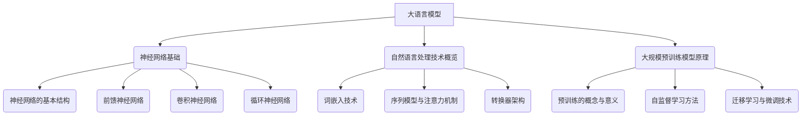

                 

# 大语言模型应用指南：进阶

> **关键词：** 大语言模型，文本生成，自然语言理解，问答系统，机器翻译，优化与调优，安全与伦理。

> **摘要：** 本指南旨在深入探讨大语言模型的应用，从基础理论到实际操作，再到进阶优化与伦理安全，提供全面的技术解读和实践指导。我们将通过一步一步的分析和推理，帮助读者全面掌握大语言模型的核心技术及其应用场景。

## 目录

1. **大语言模型基础**
    1.1 **大语言模型概述**
    1.2 **大语言模型的工作原理**
    1.3 **大语言模型的发展历程**

2. **大语言模型核心技术**
    2.1 **神经网络与深度学习基础**
    2.2 **自然语言处理技术概览**
    2.3 **大规模预训练模型原理**

3. **大语言模型应用实战**
    3.1 **文本生成中的应用**
    3.2 **自然语言理解中的应用**
    3.3 **问答系统中的应用**
    3.4 **机器翻译中的应用**

4. **大语言模型进阶优化**
    4.1 **模型优化与调优方法**
    4.2 **大语言模型调优实战**

5. **大语言模型的安全与伦理**
    5.1 **大语言模型安全问题**
    5.2 **大语言模型伦理问题**

6. **附录**
    6.1 **大语言模型开发工具与资源**
    6.2 **Mermaid 流程图示例**
    6.3 **伪代码示例**
    6.4 **数学模型与公式示例**
    6.5 **代码解读与分析**

---

接下来，我们将按照目录结构逐步展开每一部分的内容，为读者提供深入的技术解读和应用指南。让我们开始这段知识之旅。

## 第一部分：大语言模型基础

### 第1章：大语言模型概述

##### 1.1 大语言模型的概念与特点

大语言模型（Large Language Model，简称LLM）是一种基于深度学习的自然语言处理模型，能够理解和生成人类语言。与传统的语言模型相比，大语言模型具有以下几个显著特点：

1. **规模巨大**：大语言模型通常拥有数十亿甚至数千亿个参数，远远超过传统语言模型。
2. **高精度**：由于模型规模庞大，大语言模型能够捕捉到语言的细微特征，从而提高预测和生成精度。
3. **广泛适用性**：大语言模型不仅适用于文本生成，还广泛应用于自然语言理解、问答系统、机器翻译等领域。
4. **自主学习能力**：大语言模型通过大规模预训练，可以自主学习语言模式，无需显式地编写规则。

##### 1.2 大语言模型的工作原理

大语言模型的工作原理主要基于深度学习和自然语言处理技术。以下是几个关键组成部分：

1. **神经网络基础**：大语言模型采用多层神经网络，包括输入层、隐藏层和输出层。神经网络通过学习输入和输出之间的映射关系，实现语言的建模。
2. **预训练与微调**：预训练是指在大量无标签数据上训练模型，使其捕捉到语言的通用特征。微调是指在预训练的基础上，使用有标签数据对模型进行细粒度调整，使其适用于特定任务。
3. **注意力机制**：注意力机制允许模型在处理输入序列时，动态地关注不同的部分，从而提高模型的表示能力。

##### 1.3 大语言模型的发展历程

大语言模型的发展历程可以追溯到20世纪80年代，当时基于统计方法的早期语言模型开始出现。随着深度学习技术的兴起，大语言模型在2010年代迎来了快速发展。以下是几个重要的里程碑：

1. **2013年：**词向量模型（如Word2Vec）的提出，使得基于神经网络的词嵌入技术成为可能。
2. **2018年：**谷歌提出了BERT模型，标志着基于大规模预训练的深度语言模型在自然语言处理领域的广泛应用。
3. **2020年：**OpenAI发布了GPT-3模型，拥有超过1750亿个参数，成为当时最大的语言模型。

### 第2章：大语言模型核心技术

##### 2.1 神经网络与深度学习基础

1. **神经网络的基本结构**：神经网络由多个神经元（或节点）组成，每个神经元都与其他神经元通过权重连接。神经网络的输入通过加权求和处理，产生输出。
2. **前馈神经网络**：前馈神经网络是最基本的神经网络结构，数据从输入层流向输出层，不形成循环。
3. **卷积神经网络（CNN）**：CNN通过卷积操作捕捉空间特征，广泛应用于图像处理领域。
4. **循环神经网络（RNN）**：RNN能够处理序列数据，通过记忆机制捕捉序列中的长期依赖关系。

##### 2.2 自然语言处理技术概览

1. **词嵌入技术**：词嵌入将词汇映射到高维空间，使得具有相似语义的词在空间中更接近。
2. **序列模型与注意力机制**：序列模型如RNN和LSTM能够处理序列数据，注意力机制使得模型能够关注序列中的关键部分。
3. **转换器架构（Transformer）**：Transformer架构通过多头自注意力机制和位置编码，实现了高效的序列处理和长距离依赖建模。

##### 2.3 大规模预训练模型原理

1. **预训练的概念与意义**：预训练是指在大规模无标签数据上训练模型，使其捕捉到语言的通用特征。
2. **自监督学习方法**：自监督学习利用数据中的未标注信息进行学习，预训练过程通常采用自监督学习策略。
3. **迁移学习与微调技术**：迁移学习将预训练模型的知识迁移到特定任务上，微调过程通过有标签数据对模型进行调整。

## 第二部分：大语言模型应用实战

### 第3章：大语言模型在文本生成中的应用

##### 3.1 文本生成基础

1. **文本生成方法概述**：文本生成方法包括序列生成模型和生成对抗网络（GAN）。
2. **序列生成模型**：序列生成模型通过预测下一个单词或字符，生成完整的文本序列。
3. **生成对抗网络（GAN）**：GAN由生成器和判别器组成，通过对抗训练生成逼真的文本数据。

##### 3.2 实战案例：基于大语言模型的文本生成

1. **实战环境搭建**：搭建文本生成实验环境，安装必要的依赖库和工具。
2. **文本生成模型实现**：使用预训练的大语言模型，实现文本生成功能。
3. **代码解读与分析**：详细解读生成模型的代码实现，分析关键代码段和优化策略。

### 第4章：大语言模型在自然语言理解中的应用

##### 4.1 自然语言理解基础

1. **语义分析**：语义分析旨在理解文本中的语义含义，包括实体识别、关系抽取等任务。
2. **实体识别**：实体识别旨在识别文本中的关键实体，如人名、地名、组织名等。
3. **情感分析**：情感分析旨在判断文本的情感倾向，如正面、负面或中立。

##### 4.2 实战案例：基于大语言模型的情感分析

1. **实战环境搭建**：搭建情感分析实验环境，安装必要的依赖库和工具。
2. **情感分析模型实现**：使用预训练的大语言模型，实现情感分析功能。
3. **代码解读与分析**：详细解读情感分析模型的代码实现，分析关键代码段和优化策略。

### 第5章：大语言模型在问答系统中的应用

##### 5.1 问答系统基础

1. **问答系统概述**：问答系统旨在回答用户提出的问题，包括检索式问答和生成式问答。
2. **检索式问答**：检索式问答通过从知识库中检索答案，生成直接回答。
3. **生成式问答**：生成式问答通过理解用户问题，生成自然语言回答。

##### 5.2 实战案例：基于大语言模型的问答系统

1. **实战环境搭建**：搭建问答系统实验环境，安装必要的依赖库和工具。
2. **问答系统实现**：使用预训练的大语言模型，实现问答系统功能。
3. **代码解读与分析**：详细解读问答系统的代码实现，分析关键代码段和优化策略。

### 第6章：大语言模型在机器翻译中的应用

##### 6.1 机器翻译基础

1. **机器翻译概述**：机器翻译旨在将一种语言的文本翻译成另一种语言。
2. **基于规则的方法**：基于规则的方法通过编写规则进行翻译。
3. **基于统计的方法**：基于统计的方法通过统计翻译例句进行翻译。
4. **基于神经网络的机器翻译**：基于神经网络的机器翻译通过神经网络模型进行翻译。

##### 6.2 实战案例：基于大语言模型的机器翻译

1. **实战环境搭建**：搭建机器翻译实验环境，安装必要的依赖库和工具。
2. **机器翻译模型实现**：使用预训练的大语言模型，实现机器翻译功能。
3. **代码解读与分析**：详细解读机器翻译模型的代码实现，分析关键代码段和优化策略。

## 第三部分：大语言模型进阶优化

### 第7章：大语言模型优化与调优

##### 7.1 模型优化方法

1. **超参数调优**：超参数调优通过调整模型的超参数，优化模型性能。
2. **优化算法选择**：选择合适的优化算法，如Adam、AdamW等，提高模型收敛速度。
3. **模型蒸馏与压缩**：模型蒸馏和压缩通过减小模型规模，提高模型效率。

##### 7.2 实战案例：大语言模型调优实战

1. **实战环境搭建**：搭建模型调优实验环境，安装必要的依赖库和工具。
2. **模型调优过程**：详细记录模型调优的过程，包括超参数选择、优化算法应用等。
3. **调优策略分析**：分析调优策略的有效性和优化效果。

### 第8章：大语言模型的安全与伦理

##### 8.1 大语言模型安全问题

1. **偏见与歧视问题**：大语言模型可能存在偏见和歧视问题，需要采取措施进行解决。
2. **隐私泄露问题**：大语言模型在使用过程中可能涉及用户隐私，需要确保数据安全。
3. **安全攻击问题**：大语言模型可能受到安全攻击，需要加强防御措施。

##### 8.2 大语言模型伦理问题

1. **算法伦理**：大语言模型的设计和应用需要遵循算法伦理，确保公平和透明。
2. **数据伦理**：大语言模型训练过程中需要关注数据伦理，避免数据滥用和歧视。
3. **公平性与透明性**：大语言模型的决策过程需要具备公平性和透明性，便于用户监督。

## 附录

### 附录 A：大语言模型开发工具与资源

1. **开源框架与库**：介绍常用的开源框架和库，如TensorFlow、PyTorch等。
2. **在线资源与教程**：推荐一些优秀的在线教程和资源，帮助开发者学习和实践。
3. **社区与论坛**：介绍相关社区和论坛，方便开发者交流和学习。

### 附录 B：Mermaid 流程图示例



### 附录 C：伪代码示例

```plaintext
// 大语言模型训练伪代码
function train_large_language_model(data, epochs, learning_rate):
    for epoch in 1 to epochs:
        for batch in data:
            gradients = compute_gradients(model, batch)
            update_model_params(model, gradients, learning_rate)
    return model
```

### 附录 D：数学模型与公式示例

$$
// 语言模型概率公式
P(w_{t} | w_{t-1}, ..., w_{1}) = \frac{e^{\theta^T w_{t-1}}}{Z}
$$

### 附录 E：代码解读与分析

1. **代码实现流程**：介绍代码实现的总体流程，包括数据预处理、模型训练和评估等步骤。
2. **关键代码段解读**：详细解读代码中的关键代码段，解释其功能和作用。
3. **性能优化策略**：分析代码性能优化的策略和方法，如并行计算、模型压缩等。

---

通过以上内容，我们详细探讨了《大语言模型应用指南：进阶》的各个部分，从基础理论到实际应用，再到进阶优化与安全伦理，全面覆盖了大语言模型的各个层面。希望本文能帮助读者深入理解大语言模型的核心技术，并在实际项目中取得成功。让我们继续探索大语言模型的更多应用和潜力。

