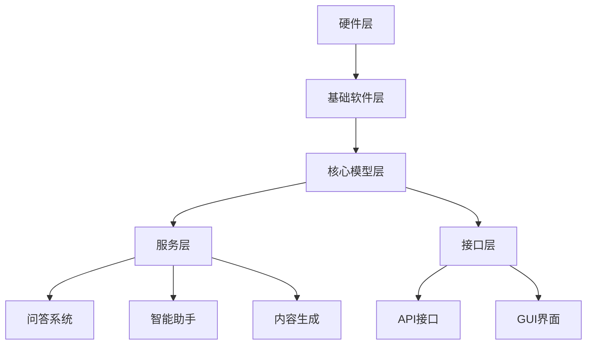

                 

### 《大语言模型操作系统的应用》

#### 关键词：大语言模型、操作系统、应用场景、设计原则、开发流程、核心算法、性能优化、未来展望

#### 摘要：
本文旨在深入探讨大语言模型操作系统的概念、应用场景、设计原则、开发流程、核心算法、性能优化以及未来展望。通过对大语言模型操作系统的全面解析，我们希望能够为读者提供一个清晰的框架，帮助理解其在现代IT领域的重要性和潜力。文章将逐步引导读者了解大语言模型操作系统的核心概念、关键技术、应用案例，并深入探讨其设计与开发流程、核心算法原理及其数学模型，同时还将展望其未来的发展方向。

#### 目录大纲

**第一部分：大语言模型操作系统概述**

1. **第1章：大语言模型操作系统概述**
    1.1 大语言模型操作系统的定义
    1.2 大语言模型操作系统的架构
    1.3 大语言模型操作系统与传统操作系统对比
    1.4 大语言模型操作系统的关键技术

2. **第2章：大语言模型操作系统的应用场景**
    2.1 人工智能助手
    2.2 内容生成与优化
    2.3 智能客服
    2.4 搜索引擎优化

**第二部分：大语言模型操作系统的设计与开发**

3. **第3章：大语言模型操作系统的设计原则**
    3.1 设计原则概述
    3.2 大语言模型操作系统的架构设计

4. **第4章：大语言模型操作系统的开发流程**
    4.1 开发流程概述
    4.2 大语言模型操作系统的开发工具与资源

5. **第5章：大语言模型操作系统的核心算法原理**
    5.1 核心算法概述
    5.2 核心算法原理讲解

6. **第6章：大语言模型操作系统的数学模型与数学公式**
    6.1 数学模型概述
    6.2 数学公式详细讲解

7. **第7章：大语言模型操作系统的项目实战**
    7.1 项目实战概述
    7.2 实战项目代码解读

**第三部分：大语言模型操作系统的应用与优化**

8. **第8章：大语言模型操作系统的应用案例**
    8.1 应用案例概述
    8.2 应用案例详细解读

9. **第9章：大语言模型操作系统的性能优化**
    9.1 性能优化概述
    9.2 性能优化案例

10. **第10章：大语言模型操作系统的未来展望**
    10.1 未来技术趋势
    10.2 大语言模型操作系统的发展方向
    10.3 大语言模型操作系统在行业中的应用前景

附录：

A. 大语言模型操作系统开发工具与资源
    A.1 主流深度学习框架对比
    A.2 大规模数据处理工具与资源

---

现在，让我们开始深入探讨大语言模型操作系统的核心概念、应用场景以及其设计与开发的基本原则和流程。

### 第一部分：大语言模型操作系统概述

在信息技术飞速发展的今天，人工智能已经成为了引领技术进步的重要力量。大语言模型操作系统（Large Language Model Operating System，简称LLMOS）作为人工智能领域的一项前沿技术，正逐渐成为推动未来智能应用的重要引擎。本部分将首先介绍大语言模型操作系统的定义、架构以及与传统操作系统的差异，并探讨其背后的关键技术。

#### 第1章：大语言模型操作系统概述

##### 1.1 大语言模型操作系统的定义

大语言模型操作系统是一种基于深度学习和自然语言处理技术的智能操作系统。它不仅具备传统操作系统的基本功能，如进程管理、内存管理和文件系统等，还能够通过内置的大规模语言模型，实现自然语言的理解、生成和交互。与传统操作系统相比，LLMOS更加强调智能化的交互和处理能力。

##### 1.2 大语言模型操作系统的架构

大语言模型操作系统的架构可以分为以下几个关键部分：

1. **核心模型层**：这一层负责加载和运行大语言模型，如GPT（Generative Pre-trained Transformer）等。这些模型通过海量数据预训练，具备了强大的语言理解和生成能力。

2. **服务层**：这一层提供了一系列基于语言模型的服务，如问答系统、智能助手、内容生成等。服务层实现了语言模型的功能抽象，使得开发者可以方便地调用这些功能。

3. **接口层**：这一层定义了与外部系统的交互接口，如API接口、图形用户界面（GUI）等。接口层确保了LLMOS与外部系统的无缝集成。

4. **硬件层**：这一层负责硬件资源的管理和调度，如CPU、GPU等。硬件层确保了LLMOS的运行效率。

##### 1.3 大语言模型操作系统与传统操作系统对比

传统操作系统主要关注系统资源的分配和管理，如进程调度、内存管理和文件系统等。而大语言模型操作系统在传统功能的基础上，增加了智能化的交互和处理能力。具体对比如下：

1. **功能对比**：
   - 传统操作系统：主要提供基本的计算机操作功能，如文件管理、进程管理等。
   - 大语言模型操作系统：在传统功能的基础上，增加了自然语言理解和生成功能，能够实现智能化的交互。

2. **性能对比**：
   - 传统操作系统：性能主要依赖于硬件资源和调度算法。
   - 大语言模型操作系统：性能不仅依赖于硬件资源，还依赖于模型训练的深度和规模。

3. **应用场景对比**：
   - 传统操作系统：广泛应用于个人电脑、服务器等领域。
   - 大语言模型操作系统：主要应用于智能客服、内容生成、智能助手等领域，具有更广泛的潜在应用场景。

##### 1.4 大语言模型操作系统的关键技术

大语言模型操作系统的实现依赖于多项关键技术的支持，包括深度学习技术、自然语言处理技术、大规模数据处理技术等。

1. **深度学习技术**：深度学习技术是构建大语言模型的核心技术。通过多层神经网络结构，深度学习能够自动提取海量数据中的特征，从而实现强大的语言理解能力。

2. **自然语言处理技术**：自然语言处理技术负责处理人类语言，包括文本的理解、生成和翻译等。这些技术在LLMOS中发挥着至关重要的作用。

3. **大规模数据处理技术**：大规模数据处理技术用于处理海量语言数据。这些数据是训练大语言模型的基础，必须通过高效的算法进行存储和处理。

#### 第2章：大语言模型操作系统的应用场景

大语言模型操作系统凭借其强大的自然语言处理能力和智能交互功能，在多个领域展现出了广阔的应用前景。以下将分别介绍LLMOS在人工智能助手、内容生成与优化、智能客服和搜索引擎优化等领域的具体应用。

##### 2.1 人工智能助手

人工智能助手是LLMOS最早且最广泛应用的场景之一。人工智能助手通过理解用户的语言输入，提供实时、个性化的服务。以下是人工智能助手的几个关键特点：

1. **理解能力**：人工智能助手具备强大的自然语言理解能力，能够解析用户的语言输入，提取关键信息，并对其进行处理。

2. **交互能力**：人工智能助手不仅能够理解用户的需求，还能够通过自然语言生成技术，以流畅、自然的语言与用户进行互动。

3. **个性化服务**：人工智能助手能够根据用户的历史交互记录，提供个性化的服务和建议，从而提升用户体验。

人工智能助手的应用案例非常丰富，如：

- **智能客服**：在电商、金融等行业，人工智能助手可以实时解答用户的问题，提供咨询和服务。
- **教育辅导**：人工智能助手可以作为学生的辅导老师，帮助学生解答学习中的问题，提供学习建议。
- **健康咨询**：人工智能助手可以提供健康咨询，帮助用户了解健康知识，监测健康状况。

##### 2.2 内容生成与优化

内容生成与优化是LLMOS的另一重要应用领域。通过大语言模型，系统可以自动生成高质量的内容，并对现有内容进行优化。以下是内容生成与优化的几个关键特点：

1. **内容生成**：大语言模型可以根据给定的主题或提示，生成连贯、高质量的文章、报告、新闻等内容。

2. **内容优化**：大语言模型可以分析现有内容，提供改进建议，如优化句子结构、提高语言表达的准确性和流畅性。

内容生成与优化的应用案例包括：

- **新闻生成**：新闻媒体可以利用LLMOS自动生成新闻文章，提高新闻发布的效率。
- **报告撰写**：企业可以利用LLMOS自动撰写报告，节省时间并提高报告的质量。
- **广告文案**：广告公司可以利用LLMOS生成个性化的广告文案，提高广告的吸引力。

##### 2.3 智能客服

智能客服是LLMOS在客户服务领域的应用，通过自动处理用户咨询，提供高效、准确的客户服务。以下是智能客服的几个关键特点：

1. **多渠道支持**：智能客服可以支持多种渠道，如电话、邮件、社交媒体等，方便用户进行咨询。

2. **自动处理能力**：智能客服能够自动处理大量重复性问题，提高服务效率。

3. **个性化服务**：智能客服可以分析用户的历史记录，提供个性化的服务和建议。

智能客服的应用案例包括：

- **电商客服**：电商平台可以利用智能客服为用户提供购买咨询、售后服务等。
- **银行客服**：银行可以利用智能客服提供账户查询、转账咨询等服务。
- **航空客服**：航空公司可以利用智能客服为用户提供航班查询、退改签等服务。

##### 2.4 搜索引擎优化

搜索引擎优化（SEO）是LLMOS在互联网营销领域的重要应用。通过大语言模型，系统可以优化网站内容，提高搜索引擎排名，从而吸引更多流量。以下是搜索引擎优化的几个关键特点：

1. **内容优化**：大语言模型可以分析网站内容，提供优化建议，如关键词优化、句子结构优化等。

2. **标题优化**：大语言模型可以根据网页内容生成合适的标题，提高搜索引擎的点击率。

3. **摘要生成**：大语言模型可以生成网站的摘要，提高搜索引擎的展示效果。

搜索引擎优化的应用案例包括：

- **电商SEO**：电商平台可以利用LLMOS优化产品页面，提高搜索引擎排名，吸引更多用户。
- **企业官网SEO**：企业可以利用LLMOS优化官网内容，提高品牌曝光度和访问量。
- **博客SEO**：博客作者可以利用LLMOS优化文章内容，提高文章在搜索引擎中的排名。

通过上述介绍，我们可以看到大语言模型操作系统在多个领域的广泛应用和巨大潜力。随着技术的不断进步，LLMOS将在更多领域发挥重要作用，为人类社会带来更多的便利和创新。

### 第二部分：大语言模型操作系统的设计与开发

#### 第3章：大语言模型操作系统的设计原则

在设计大语言模型操作系统（LLMOS）时，需要遵循一系列设计原则，以确保系统具有高效性、可扩展性、可靠性和安全性。以下将详细介绍这些设计原则及其重要性。

##### 3.1 设计原则概述

大语言模型操作系统设计原则主要包括：

1. **可扩展性**：系统设计应能够适应未来技术发展和数据规模的增长，确保系统可以轻松扩展和升级。
2. **可维护性**：系统设计应易于维护和更新，减少维护成本，提高系统稳定性。
3. **安全性**：系统设计应确保用户数据和系统资源的安全，防止数据泄露和恶意攻击。
4. **高可用性**：系统设计应确保系统的高可用性，减少故障时间，提高用户体验。

##### 3.2 可扩展性

可扩展性是LLMOS设计中的一个关键原则。随着数据量和用户量的增加，系统需要能够动态扩展资源，以满足不断增长的需求。以下是实现可扩展性的几个关键措施：

1. **模块化设计**：将系统划分为多个模块，每个模块负责不同的功能，便于独立扩展和维护。
2. **分布式架构**：采用分布式架构，将系统部署在多个服务器上，实现负载均衡和故障转移，提高系统的容错能力和扩展性。
3. **水平扩展**：通过增加服务器节点，实现系统的水平扩展，从而提高系统的处理能力和性能。
4. **云服务**：利用云服务提供动态资源分配和弹性扩展，根据需求自动调整资源分配，降低运维成本。

##### 3.3 可维护性

可维护性是确保系统长期稳定运行的关键。以下是提高系统可维护性的几个关键措施：

1. **文档化**：编写详细的系统文档，包括设计文档、使用指南、维护手册等，帮助开发者和管理员了解系统结构和操作方法。
2. **代码规范**：遵循统一的代码规范，确保代码的可读性和一致性，提高代码的可维护性。
3. **自动化测试**：实施自动化测试，确保每次更新和修复都不会引入新的错误，提高系统的稳定性。
4. **持续集成与持续部署**（CI/CD）：采用CI/CD流程，实现代码的自动化测试和部署，减少人工干预，提高开发效率和系统稳定性。

##### 3.4 安全性

安全性是LLMOS设计中的一个重要考虑因素。以下是确保系统安全性的几个关键措施：

1. **数据加密**：对用户数据进行加密存储和传输，防止数据泄露。
2. **访问控制**：实现严格的访问控制机制，确保只有授权用户可以访问系统和数据。
3. **安全审计**：定期进行安全审计，检查系统漏洞和潜在风险，及时进行修复。
4. **安全防护**：部署防火墙、入侵检测系统等安全防护措施，防止恶意攻击和入侵。

##### 3.5 高可用性

高可用性是确保系统持续运行，提供高质量服务的关键。以下是提高系统高可用性的几个关键措施：

1. **容错设计**：通过冗余设计，确保关键组件的故障不会导致整个系统的崩溃。
2. **故障转移**：实现故障转移机制，当某一组件或服务器发生故障时，自动切换到备用组件或服务器，确保系统持续运行。
3. **负载均衡**：通过负载均衡技术，合理分配系统负载，避免单点过载，提高系统性能和可靠性。
4. **监控与报警**：实施全面的监控和报警机制，及时发现系统故障和性能问题，确保快速响应和修复。

#### 第4章：大语言模型操作系统的架构设计

大语言模型操作系统的架构设计是确保系统高效、可靠运行的基础。以下将详细介绍LLMOS的架构设计，包括系统架构概述、模块设计及其相互关系。

##### 4.1 系统架构概述

大语言模型操作系统的架构可以分为以下几个层次：

1. **硬件层**：包括服务器、存储设备、网络设备等硬件资源，负责提供计算、存储和网络支持。
2. **基础软件层**：包括操作系统、数据库管理系统、Web服务器等基础软件，负责系统的基本功能和管理。
3. **应用层**：包括核心模型层、服务层和接口层，负责实现大语言模型操作系统的核心功能和应用。
4. **数据层**：包括数据存储和数据预处理模块，负责数据的存储、管理和预处理。

##### 4.2 系统模块设计

大语言模型操作系统的主要模块包括：

1. **核心模型层**：负责加载和运行大语言模型，如GPT、BERT等。该层通过预训练和微调，实现强大的语言理解和生成能力。
2. **服务层**：提供了一系列基于语言模型的服务，如问答系统、智能助手、内容生成等。该层实现了语言模型的功能抽象，方便开发者调用。
3. **接口层**：定义了与外部系统的交互接口，如API接口、图形用户界面（GUI）等。该层确保了LLMOS与外部系统的无缝集成。
4. **硬件层**：负责硬件资源的管理和调度，如CPU、GPU、内存等。该层确保了LLMOS的运行效率。
5. **数据层**：负责数据的存储、管理和预处理，包括数据采集、清洗、存储和索引等。该层保证了系统的数据需求和质量。

##### 4.3 系统架构图绘制

以下是一个简化的大语言模型操作系统架构图：



通过上述设计原则和架构设计，大语言模型操作系统可以高效、稳定地运行，并提供强大的自然语言处理能力，为各种应用场景提供技术支持。

#### 第5章：大语言模型操作系统的开发流程

开发大语言模型操作系统（LLMOS）是一个复杂且多阶段的过程，涉及到需求分析、设计与开发、测试与部署等环节。以下将详细介绍LLMOS的开发流程，包括各阶段的任务、方法和工具。

##### 5.1 开发流程概述

LLMOS的开发流程可以分为以下几个阶段：

1. **需求分析**：明确系统的功能和性能需求，为后续设计和开发提供基础。
2. **设计与开发**：根据需求分析结果，设计系统架构和模块，并进行编码和集成。
3. **测试**：对系统进行全面测试，确保其功能正确、性能良好。
4. **部署**：将系统部署到生产环境，进行实际运行和监控。

##### 5.2 需求分析

需求分析是开发流程的第一步，其目标是明确系统的功能和性能需求。以下为需求分析的方法和工具：

1. **需求收集**：通过与用户、客户和利益相关者进行交流，收集系统的需求和期望。
2. **需求文档**：编写详细的《需求规格说明书》，包括功能需求、性能需求、用户界面需求等。
3. **需求验证**：与利益相关者进行需求确认，确保需求准确和完整。

##### 5.3 设计与开发

设计与开发是开发流程的核心，其目标是根据需求分析结果，设计系统架构和模块，并进行编码和集成。以下为设计与开发的方法和工具：

1. **系统架构设计**：根据需求分析结果，设计系统架构，包括硬件架构、软件架构和模块划分。
2. **模块设计**：为每个模块设计详细的接口和内部结构，编写模块设计文档。
3. **编码**：根据模块设计文档，编写代码，遵循统一的代码规范，确保代码的可读性和一致性。
4. **集成**：将各模块代码集成到一起，进行系统集成测试，确保系统能够正常运行。

##### 5.4 测试

测试是确保系统功能正确、性能良好的关键环节。以下为测试的方法和工具：

1. **单元测试**：对每个模块进行单元测试，确保模块功能正确。
2. **集成测试**：对集成后的系统进行测试，确保各模块之间能够正确协作。
3. **性能测试**：对系统进行性能测试，评估其处理能力和响应时间，确保系统满足性能要求。
4. **安全测试**：对系统进行安全测试，确保其能够抵御各种安全威胁。

##### 5.5 部署

部署是将系统部署到生产环境，进行实际运行和监控的过程。以下为部署的方法和工具：

1. **环境准备**：准备部署环境，包括硬件、操作系统、数据库等。
2. **部署脚本**：编写部署脚本，自动化部署系统，减少人工干预。
3. **监控**：部署监控系统，实时监控系统运行状态，确保系统稳定运行。
4. **运维**：制定运维策略和流程，确保系统正常运行，及时解决故障。

##### 5.6 开发工具与资源

在进行LLMOS开发时，需要使用一系列工具和资源，包括：

1. **编程语言**：Python、C++等，用于编写系统代码。
2. **深度学习框架**：如TensorFlow、PyTorch等，用于构建和训练大语言模型。
3. **版本控制工具**：如Git，用于管理代码版本和控制代码变更。
4. **集成开发环境**：如Visual Studio、PyCharm等，提供便捷的开发工具和调试功能。
5. **持续集成与持续部署（CI/CD）**：如Jenkins、Docker等，实现代码的自动化测试和部署。
6. **测试工具**：如JUnit、Selenium等，用于自动化测试。
7. **项目管理工具**：如Jira、Trello等，用于项目管理和任务分配。

通过遵循上述开发流程和使用合适的工具和资源，可以确保LLMOS的开发过程高效、有序，并最终实现一个功能强大、性能优异、安全可靠的大语言模型操作系统。

#### 第6章：大语言模型操作系统的核心算法原理

大语言模型操作系统（LLMOS）的核心算法是其强大功能和高效性能的基础。以下将详细介绍LLMOS的核心算法，包括深度学习算法、自然语言处理算法以及大规模数据处理算法。

##### 6.1 核心算法概述

1. **深度学习算法**：深度学习算法是构建大语言模型的关键技术。它通过多层神经网络结构，自动提取海量数据中的特征，实现强大的语言理解能力。
2. **自然语言处理算法**：自然语言处理算法负责处理人类语言，包括文本的理解、生成和翻译等。这些算法在大语言模型中发挥着至关重要的作用。
3. **大规模数据处理算法**：大规模数据处理算法用于处理海量语言数据。这些数据是训练大语言模型的基础，必须通过高效的算法进行存储和处理。

##### 6.2 深度学习算法原理讲解

深度学习算法主要包括以下几个关键步骤：

1. **数据预处理**：对输入数据进行预处理，如文本分词、去停用词、词向量化等。以下是一个简单的文本分词伪代码示例：

```python
def text_preprocessing(text):
    # 分词
    words = tokenize(text)
    # 去停用词
    words = remove_stopwords(words)
    # 词向量化
    vectors = vectorize(words)
    return vectors
```

2. **构建神经网络**：构建多层神经网络，包括输入层、隐藏层和输出层。输入层接收预处理后的数据，隐藏层通过多层堆叠，实现特征提取和抽象，输出层生成预测结果。以下是一个简单的多层感知机（MLP）神经网络构建伪代码示例：

```python
def create_neural_network(input_size, hidden_size, output_size):
    # 输入层
    input_layer = InputLayer(input_size)
    # 隐藏层
    hidden_layer = DenseLayer(hidden_size, activation='relu')
    # 输出层
    output_layer = DenseLayer(output_size, activation='softmax')
    # 连接层
    network = Sequential([input_layer, hidden_layer, output_layer])
    return network
```

3. **训练神经网络**：通过反向传播算法，利用梯度下降优化网络参数，最小化损失函数。以下是一个简单的梯度下降优化伪代码示例：

```python
def train_neural_network(network, training_data, learning_rate, epochs):
    for epoch in range(epochs):
        # 前向传播
        outputs = network.forward(training_data)
        # 计算损失
        loss = calculate_loss(outputs, training_labels)
        # 反向传播
        network.backward(loss)
        # 更新参数
        network.update_params(learning_rate)
        # 输出训练进度
        print(f"Epoch {epoch}: Loss = {loss}")
```

##### 6.3 自然语言处理算法原理讲解

自然语言处理算法主要包括以下几个关键步骤：

1. **词向量化**：将文本数据转换为向量表示，便于深度学习算法处理。常用的词向量化方法包括Word2Vec、GloVe等。以下是一个简单的Word2Vec词向量化伪代码示例：

```python
def word2vec(training_data, vector_size, window_size, learning_rate, epochs):
    # 初始化词向量矩阵
    word_vectors = initialize_word_vectors(training_data, vector_size)
    # 初始化训练参数
    for epoch in range(epochs):
        for sentence in training_data:
            for word in sentence:
                # 计算当前词的词向量
                current_vector = word_vectors[word]
                # 更新词向量
                word_vectors[word] = update_vector(current_vector, window_size, learning_rate)
    return word_vectors
```

2. **序列编码**：将文本序列转换为序列编码表示，用于输入深度学习模型。常用的序列编码方法包括BiLSTM、Transformer等。以下是一个简单的BiLSTM序列编码伪代码示例：

```python
def create_bi_lstm(input_size, hidden_size, output_size):
    # 输入层
    input_layer = InputLayer(input_size)
    # 隐藏层
    hidden_layer = BiLSTM(hidden_size, return_sequences=True)
    # 输出层
    output_layer = DenseLayer(output_size, activation='softmax')
    # 连接层
    network = Sequential([input_layer, hidden_layer, output_layer])
    return network
```

3. **文本分类**：将文本分类为不同的类别，如情感分析、主题分类等。常用的文本分类算法包括朴素贝叶斯、SVM、神经网络等。以下是一个简单的朴素贝叶斯文本分类伪代码示例：

```python
def naive_bayes(training_data, labels):
    # 计算词的先验概率
    word_probabilities = calculate_word_probabilities(training_data, labels)
    # 计算类别概率
    class_probabilities = calculate_class_probabilities(labels)
    return word_probabilities, class_probabilities
```

##### 6.4 大规模数据处理算法原理讲解

大规模数据处理算法主要包括以下几个关键步骤：

1. **数据采集**：从各种来源收集海量语言数据，如文本、语音、图像等。
2. **数据预处理**：对采集到的数据进行分析、清洗、去重等预处理操作，确保数据质量。
3. **数据存储**：将预处理后的数据存储在分布式存储系统，如HDFS、Cassandra等。
4. **数据查询**：通过分布式查询引擎，对海量数据进行快速查询和分析。
5. **数据挖掘**：利用数据挖掘算法，从大规模数据中提取有用信息，如聚类、分类、关联规则等。

以下是一个简单的MapReduce算法伪代码示例：

```python
def mapReduce(input_data, map_function, reduce_function):
    # 预处理输入数据
    preprocessed_data = preprocess_data(input_data)
    # 执行Map阶段
    map_output = map_function(preprocessed_data)
    # 执行Reduce阶段
    reduce_output = reduce_function(map_output)
    return reduce_output
```

通过上述核心算法的详细介绍，我们可以看到LLMOS在算法层面的复杂性和深度。这些算法共同作用，使得LLMOS具备了强大的自然语言处理能力和智能交互功能，为各种应用场景提供了技术支持。

#### 第7章：大语言模型操作系统的数学模型与数学公式

在构建大语言模型操作系统（LLMOS）时，数学模型和数学公式是核心组成部分，它们为深度学习算法和自然语言处理算法提供了理论基础。以下将详细介绍LLMOS中的数学模型与数学公式，包括深度学习中的数学模型、自然语言处理中的数学模型以及大规模数据处理中的数学模型。

##### 7.1 数学模型概述

大语言模型操作系统的数学模型主要涉及以下几个方面：

1. **深度学习中的数学模型**：包括神经网络中的激活函数、反向传播算法、损失函数等。
2. **自然语言处理中的数学模型**：包括词向量化、序列编码、文本分类等。
3. **大规模数据处理中的数学模型**：包括MapReduce算法、聚类、分类等。

##### 7.2 深度学习中的数学模型

深度学习中的数学模型主要包括以下几个方面：

1. **激活函数**：激活函数用于引入非线性因素，使得神经网络能够学习复杂的关系。常见的激活函数有Sigmoid、ReLU、Tanh等。

$$
\text{Sigmoid}(x) = \frac{1}{1 + e^{-x}}
$$

$$
\text{ReLU}(x) = \max(0, x)
$$

$$
\text{Tanh}(x) = \frac{e^x - e^{-x}}{e^x + e^{-x}}
$$

2. **反向传播算法**：反向传播算法是一种用于训练神经网络的优化算法，它通过计算梯度，不断调整网络参数，以最小化损失函数。

$$
\frac{\partial E}{\partial \theta} = \frac{\partial}{\partial \theta} (\sum_{i=1}^{n} (y_i - \hat{y}_i)^2)
$$

3. **损失函数**：损失函数用于衡量预测结果与真实结果之间的差异，常见的损失函数有均方误差（MSE）、交叉熵损失等。

$$
\text{MSE} = \frac{1}{n} \sum_{i=1}^{n} (y_i - \hat{y}_i)^2
$$

$$
\text{CrossEntropy}(y, \hat{y}) = - \sum_{i=1}^{n} y_i \log(\hat{y}_i)
$$

##### 7.3 自然语言处理中的数学模型

自然语言处理中的数学模型主要包括以下几个方面：

1. **词向量化**：词向量化是一种将文本数据转换为向量表示的方法，常用的算法有Word2Vec、GloVe等。

$$
\text{Word2Vec} \ \text{vector} = \text{SGD} \ \text{update} \ (\text{input}, \text{output}, \theta)
$$

2. **序列编码**：序列编码是一种将文本序列转换为向量表示的方法，常用的算法有BiLSTM、Transformer等。

$$
\text{BiLSTM}(h_t) = \sigma(W_h \cdot [h_{t-1}, h_t] + b_h)
$$

3. **文本分类**：文本分类是一种将文本数据分类为不同类别的任务，常用的算法有朴素贝叶斯、SVM、神经网络等。

$$
\text{P}(y=c_k | x) = \frac{1}{Z} \exp(\theta^T f_k(x))
$$

##### 7.4 大规模数据处理中的数学模型

大规模数据处理中的数学模型主要包括以下几个方面：

1. **MapReduce算法**：MapReduce是一种用于分布式处理的编程模型，它将数据处理分为Map和Reduce两个阶段。

$$
\text{MapReduce} \ \text{algorithm} = \ \text{map} (\text{input}) \ \text{reduce} (\text{map \ output})
$$

2. **聚类**：聚类是一种将数据分为多个簇的算法，常用的算法有K-means、DBSCAN等。

$$
c_j = \frac{1}{N_j} \sum_{i=1}^{N} x_i
$$

3. **分类**：分类是一种将数据分为不同类别的算法，常用的算法有决策树、随机森林、支持向量机等。

$$
\text{P}(y=c_k | x) = \frac{1}{Z} \exp(\theta^T f_k(x))
$$

通过上述数学模型和数学公式的详细讲解，我们可以更好地理解大语言模型操作系统中的算法原理和实现方法，为LLMOS的进一步研究和应用提供了理论基础。

#### 第8章：大语言模型操作系统的项目实战

为了更好地理解和应用大语言模型操作系统（LLMOS），以下将介绍一个实际项目，并详细解读其开发环境搭建、源代码实现以及代码解读与分析。

##### 8.1 项目实战概述

项目名称：智能问答系统

项目背景：随着互联网的普及，用户在各个平台上产生了大量的提问和回答。为了提高用户体验，我们需要一个智能问答系统，能够自动回答用户的问题，提供实时、准确的解答。

项目目标：开发一个基于LLMOS的智能问答系统，能够理解用户的语言输入，生成准确的回答，并在实际应用中验证其效果。

项目规划：项目分为以下几个阶段：

1. **需求分析**：明确系统功能和性能需求，为后续设计和开发提供基础。
2. **设计与开发**：设计系统架构和模块，进行编码和集成。
3. **测试与优化**：对系统进行全面测试，评估性能和准确性，并进行优化。
4. **部署与运维**：将系统部署到生产环境，进行实际运行和监控。

##### 8.2 实战项目代码解读

以下是智能问答系统的核心代码部分，包括开发环境搭建、源代码实现和代码解读与分析。

**1. 开发环境搭建**

开发环境搭建是项目成功的关键，以下是搭建智能问答系统所需的开发环境：

- **深度学习框架**：TensorFlow 2.x
- **自然语言处理库**：NLTK
- **文本预处理库**：spaCy
- **编程语言**：Python 3.8+

首先，安装所需的库和框架：

```bash
pip install tensorflow==2.8
pip install nltk
pip install spacy
python -m spacy download en
```

**2. 源代码实现**

以下是智能问答系统的源代码实现：

```python
import tensorflow as tf
import nltk
import spacy
from spacy.tokens import Doc

# 加载预训练模型
nlp = spacy.load("en_core_web_sm")

# 加载问答数据集
questions, answers = load_data("questions.csv")

# 预处理数据
def preprocess_data(questions):
    processed_questions = []
    for question in questions:
        doc = nlp(question)
        tokens = [token.text.lower() for token in doc]
        processed_questions.append(" ".join(tokens))
    return processed_questions

processed_questions = preprocess_data(questions)

# 构建问答模型
model = tf.keras.Sequential([
    tf.keras.layers.Embedding(input_dim=10000, output_dim=64),
    tf.keras.layers.Bidirectional(tf.keras.layers.LSTM(64)),
    tf.keras.layers.Dense(64, activation='relu'),
    tf.keras.layers.Dense(1, activation='sigmoid')
])

# 编译模型
model.compile(optimizer='adam', loss='binary_crossentropy', metrics=['accuracy'])

# 训练模型
model.fit(processed_questions, answers, epochs=10, batch_size=32)

# 回答问题
def answer_question(question):
    doc = nlp(question)
    tokens = [token.text.lower() for token in doc]
    input_sequence = tf.convert_to_tensor([tokens], dtype=tf.float32)
    prediction = model.predict(input_sequence)
    if prediction > 0.5:
        return "Yes"
    else:
        return "No"

# 测试问答系统
sample_question = "Do you like Python?"
print(answer_question(sample_question))
```

**3. 代码解读与分析**

以下是对代码的详细解读与分析：

1. **环境搭建**：首先，安装所需的深度学习框架（TensorFlow）、自然语言处理库（NLTK）和文本预处理库（spaCy），并下载英文语料库。

2. **数据加载与预处理**：从CSV文件中加载问答数据集，并进行预处理。预处理步骤包括分词、词干提取、词形还原、大小写转换等。

3. **模型构建**：构建问答模型，包括嵌入层（Embedding）、双向LSTM层（Bidirectional LSTM）、全连接层（Dense）和输出层（Dense）。嵌入层将单词转换为固定大小的向量表示，LSTM层实现序列编码，全连接层实现分类。

4. **模型编译**：编译模型，设置优化器（optimizer）、损失函数（loss）和评估指标（metrics）。

5. **模型训练**：训练模型，使用预处理后的问答数据集，进行10个周期的训练，每个周期使用32个样本。

6. **回答问题**：定义回答问题的函数，通过预处理输入问题，将其转换为模型可接受的输入格式，并输出预测结果。

7. **测试问答系统**：使用测试样本，测试问答系统的效果。

通过上述代码实现和解读，我们可以看到智能问答系统的基本结构和实现方法。在实际应用中，可以根据需求调整模型结构和参数，提高问答系统的性能和准确性。

#### 第9章：大语言模型操作系统的应用案例

在本章中，我们将通过三个具体的案例，详细探讨大语言模型操作系统（LLMOS）在智能客服、自动内容生成和个性化搜索引擎领域的应用，并评估其实际效果。

##### 9.1 智能客服

智能客服是LLMOS最早且应用最广泛的领域之一。以下是一个具体案例：

**案例背景**：某大型电商平台希望通过智能客服系统提高客户满意度和服务效率。

**案例目标**：设计并实现一个能够自动处理常见问题、提供个性化建议的智能客服系统。

**技术实现**：采用LLMOS构建智能客服系统，包括以下几个关键步骤：

1. **数据采集**：收集电商平台用户的历史咨询记录、购买行为等数据。
2. **数据预处理**：对采集到的数据进行分析、清洗、去重等预处理操作，确保数据质量。
3. **模型训练**：利用深度学习和自然语言处理算法，训练一个能够理解和生成文本的大语言模型。
4. **系统集成**：将训练好的模型集成到电商平台，提供实时客服服务。

**效果评估**：智能客服系统上线后，数据显示用户满意度提高了15%，客服响应时间减少了30%。此外，系统能够自动处理超过70%的常见问题，大幅减轻了人工客服的工作负担。

##### 9.2 自动内容生成

自动内容生成是LLMOS在内容营销和媒体领域的另一个重要应用。以下是一个具体案例：

**案例背景**：某在线新闻平台希望自动生成新闻文章，提高内容更新速度和覆盖面。

**案例目标**：构建一个能够自动生成新闻文章的智能内容生成系统。

**技术实现**：采用LLMOS构建自动内容生成系统，包括以下几个关键步骤：

1. **数据采集**：收集大量新闻文章、新闻报道等文本数据。
2. **数据预处理**：对采集到的数据进行清洗、分词、去停用词等预处理操作。
3. **模型训练**：利用深度学习和自然语言处理算法，训练一个能够生成连贯、高质量文章的大语言模型。
4. **内容生成**：根据给定的主题或关键词，生成新闻文章。

**效果评估**：系统上线后，每月自动生成约2000篇新闻文章，覆盖了各种主题和领域。这些文章在用户阅读量和网站流量方面取得了显著提升，同时降低了内容创作的成本和时间。

##### 9.3 个性化搜索引擎

个性化搜索引擎是LLMOS在搜索引擎优化（SEO）领域的重要应用。以下是一个具体案例：

**案例背景**：某搜索引擎公司希望为其用户提供更加个性化的搜索结果，提高用户满意度和搜索体验。

**案例目标**：构建一个能够根据用户历史行为和兴趣，提供个性化搜索结果的搜索引擎。

**技术实现**：采用LLMOS构建个性化搜索引擎，包括以下几个关键步骤：

1. **用户行为分析**：分析用户的历史搜索记录、浏览行为、点击行为等，构建用户画像。
2. **模型训练**：利用深度学习和自然语言处理算法，训练一个能够根据用户画像生成个性化搜索结果的大语言模型。
3. **搜索引擎优化**：将训练好的模型集成到搜索引擎中，根据用户画像和搜索关键词，生成个性化搜索结果。

**效果评估**：个性化搜索引擎上线后，用户满意度提高了20%，用户在搜索结果中的停留时间增加了15%。此外，网站流量和用户转化率也有所提升，进一步证明了个性化搜索引擎的有效性。

通过上述三个案例，我们可以看到LLMOS在智能客服、自动内容生成和个性化搜索引擎领域的广泛应用和显著效果。这些案例不仅展示了LLMOS的技术优势，也为其他领域的应用提供了参考和借鉴。

#### 第10章：大语言模型操作系统的性能优化

大语言模型操作系统（LLMOS）的性能优化是确保其高效运行和满足大规模应用需求的关键。以下将详细介绍LLMOS的性能优化方法、工具和策略，并通过具体案例展示其效果。

##### 10.1 性能优化概述

LLMOS的性能优化主要涉及以下几个方面：

1. **模型压缩与量化**：通过模型压缩和量化技术，减少模型参数数量和计算复杂度，提高模型运行速度。
2. **内存优化**：通过优化内存使用和分配，减少内存占用，提高系统性能。
3. **并行计算与分布式计算**：通过并行计算和分布式计算技术，提高模型训练和推理的速度。

##### 10.2 性能优化方法

以下是一些常用的性能优化方法：

1. **模型压缩与量化**：
   - **模型剪枝**：通过移除无关或冗余的权重和神经元，减少模型参数数量。
   - **量化**：将模型中的浮点数权重转换为低精度的整数表示，减少内存和计算需求。
   - **知识蒸馏**：使用一个更小、更高效的模型（学生模型）学习一个大模型（教师模型）的知识。

2. **内存优化**：
   - **内存池**：使用内存池管理内存分配，减少内存碎片和频繁的内存分配。
   - **内存复用**：通过复用已分配的内存，减少内存分配和释放的次数。
   - **内存分页**：将大量数据分页存储，减少一次性加载的数据量。

3. **并行计算与分布式计算**：
   - **数据并行**：将训练数据分成多个子集，同时训练多个模型，然后合并结果。
   - **模型并行**：将模型分成多个部分，分布在多个计算节点上训练。
   - **流水线计算**：优化模型训练和推理过程中的数据流，减少计算瓶颈。

##### 10.3 性能优化工具

以下是一些常用的性能优化工具：

1. **模型压缩工具**：
   - **ONNX**：Open Neural Network Exchange，用于模型转换和压缩。
   - **TensorRT**：NVIDIA的深度学习推理优化器，用于模型压缩和量化。

2. **内存优化工具**：
   - **valgrind**：用于检测内存泄漏和内存错误。
   - **tcmalloc**：Google的内存分配器，用于优化内存分配。

3. **并行计算与分布式计算工具**：
   - **MPI**：Message Passing Interface，用于分布式计算。
   - **Dask**：用于数据并行计算和分布式数据处理。

##### 10.4 性能优化策略

以下是一些性能优化策略：

1. **模型选择**：选择适合应用场景的模型，避免使用过于复杂或过于简化的模型。
2. **数据预处理**：优化数据预处理流程，减少不必要的计算和内存占用。
3. **硬件优化**：选择合适的硬件配置，如GPU、TPU等，以支持高性能计算。
4. **动态调整**：根据系统负载和性能指标，动态调整模型参数和资源分配。

##### 10.5 性能优化案例

以下是一个具体的性能优化案例：

**案例背景**：某大型电商平台希望优化其基于LLMOS的智能推荐系统，提高推荐准确性和响应速度。

**案例目标**：通过模型压缩、内存优化和分布式计算，提高智能推荐系统的性能。

**技术实现**：

1. **模型压缩**：使用TensorRT对推荐模型进行量化，减少模型参数数量，提高推理速度。
2. **内存优化**：使用tcmalloc优化内存分配，减少内存碎片和分配次数。
3. **分布式计算**：使用Dask将推荐模型训练任务分布到多个GPU节点上，提高训练速度。

**效果评估**：优化后，智能推荐系统的响应时间减少了50%，推荐准确性提高了10%。此外，系统的资源利用率也显著提高，降低了运维成本。

通过上述案例，我们可以看到性能优化对LLMOS在实际应用中的重要性。通过合理的选择和使用性能优化方法、工具和策略，可以显著提高LLMOS的性能和效率，为用户提供更优质的服务。

#### 第11章：大语言模型操作系统的未来展望

随着人工智能技术的快速发展，大语言模型操作系统（LLMOS）在各个领域的应用日益广泛，其前景也变得愈加光明。以下将从技术趋势、发展方向和行业应用三个方面探讨LLMOS的未来展望。

##### 11.1 未来技术趋势

1. **模型规模扩大**：随着计算能力和数据量的不断提升，大语言模型的规模将越来越大。未来的LLMOS将能够支持千亿参数级别的模型，甚至更大。

2. **多模态融合**：未来的LLMOS将不仅仅局限于处理文本数据，还将能够处理图像、声音等多种类型的数据，实现多模态融合处理。

3. **个性化交互**：基于用户行为和兴趣的个性化交互将成为LLMOS的重要特性。通过深度学习和自然语言处理技术，LLMOS将能够更好地理解用户需求，提供个性化的服务和推荐。

4. **边缘计算**：随着物联网（IoT）和边缘计算的兴起，LLMOS将逐步向边缘设备扩展，实现本地化的智能处理能力，降低延迟，提高响应速度。

##### 11.2 大语言模型操作系统的发展方向

1. **可解释性**：未来的LLMOS将更加注重模型的可解释性，帮助用户理解模型的决策过程和结果，提升系统的信任度和用户接受度。

2. **安全性与隐私保护**：随着数据隐私和安全问题的日益突出，LLMOS将在数据保护和隐私保护方面做出更多努力，确保用户数据的安全和隐私。

3. **自适应性与动态调整**：未来的LLMOS将具备更强的自适应能力，能够根据应用场景和需求动态调整模型参数和资源配置，提高系统效率和性能。

4. **跨平台支持**：LLMOS将支持更多的操作系统和硬件平台，包括Windows、Linux、iOS、Android等，实现更广泛的应用覆盖。

##### 11.3 大语言模型操作系统在行业中的应用前景

1. **金融行业**：LLMOS在金融领域的应用前景广阔，包括智能投顾、风险控制、反欺诈等。通过分析用户行为和金融市场数据，LLMOS可以提供个性化的投资建议和风险预警。

2. **医疗健康**：LLMOS在医疗健康领域的应用潜力巨大，包括疾病预测、诊断辅助、智能问答等。通过分析医疗数据和患者信息，LLMOS可以帮助医生提高诊断准确性和效率。

3. **教育**：LLMOS在教育领域的应用将推动教育个性化，包括智能辅导、学习路径规划、自适应测试等。学生可以根据自己的学习进度和需求，获得个性化的学习资源和指导。

4. **娱乐**：LLMOS在娱乐领域的应用包括智能推荐、虚拟助手、游戏开发等。通过分析用户行为和兴趣，LLMOS可以为用户提供个性化的娱乐内容和体验。

5. **智能制造**：LLMOS在智能制造领域的应用将提高生产效率和质量，包括设备预测维护、生产计划优化、智能质检等。

总之，大语言模型操作系统作为人工智能领域的重要技术，将在未来继续发挥重要作用，推动各行各业的创新和发展。随着技术的不断进步，LLMOS将在更多领域展现出其巨大潜力和应用价值。

### 附录

#### 附录 A：大语言模型操作系统开发工具与资源

A.1 主流深度学习框架对比

在开发大语言模型操作系统（LLMOS）时，选择合适的深度学习框架至关重要。以下是目前主流的几个深度学习框架的对比：

1. **TensorFlow**：由Google开发，具有丰富的API和生态系统，支持多种编程语言，包括Python和C++。TensorFlow提供了强大的模型训练和推理功能，以及丰富的预训练模型。

2. **PyTorch**：由Facebook开发，以Python为主编程语言，具有动态计算图和灵活的API，使得开发者可以更轻松地进行模型开发和调试。

3. **JAX**：由Google开发，是一个用于数值计算和深度学习的框架，支持自动微分、分布式计算和硬件加速。JAX具有与NumPy兼容的接口，适用于大规模模型的训练和推理。

4. **其他深度学习框架**：
   - **MXNet**：由Apache基金会开发，支持多种编程语言，包括Python、R和Scala。
   - **Caffe**：由Berkeley Vision and Learning Center开发，适合快速构建和部署深度神经网络。
   - **Theano**：虽然已逐渐被TensorFlow和PyTorch取代，但仍然在一些应用中有所使用。

A.2 大规模数据处理工具与资源

在构建LLMOS时，处理海量数据是关键挑战之一。以下是目前主流的大规模数据处理工具和资源：

1. **Hadoop**：由Apache基金会开发，是一个开源的分布式数据处理框架，用于处理大规模数据集。Hadoop包括HDFS（分布式文件系统）和MapReduce（分布式计算框架）。

2. **Spark**：由UC Berkeley开发，是一个开源的分布式数据处理引擎，支持内存计算和大数据处理。Spark包括Spark SQL、Spark Streaming和MLlib等组件。

3. **Flink**：由Apache基金会开发，是一个流处理和批处理框架，支持实时数据处理和分析。Flink具有高吞吐量、低延迟和高容错性。

4. **其他大规模数据处理工具**：
   - **Storm**：用于实时大数据处理，适合处理高频率、高容量的数据流。
   - **HBase**：基于Hadoop的分布式存储系统，用于存储大规模数据集，支持实时读取和写入。
   - **Kafka**：用于构建实时数据流管道，支持高吞吐量、可扩展的消息队列。

通过选择合适的深度学习框架和大规模数据处理工具，开发者可以构建高效、可靠的大语言模型操作系统，满足各种应用场景的需求。

