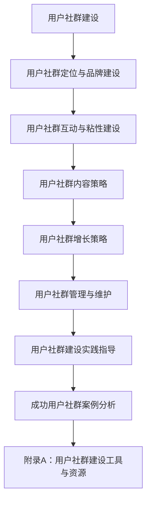

                 

# 《如何建立长期稳定的用户社群》

## 关键词
用户社群，社群建设，用户粘性，内容策略，品牌传播，增长策略，风险管理，案例分析

## 摘要
本文旨在探讨如何建立长期稳定的用户社群。通过详细分析用户社群的定义、重要性、目标设定、品牌建设、互动策略、内容策略、增长策略、风险管理以及案例分析，本文提供了系统化的建设指导，旨在帮助企业有效地吸引、维护和增长用户社群，实现品牌价值的提升和用户满意度的增加。

---

## 《如何建立长期稳定的用户社群》目录大纲

### 第一部分：用户社群概述

#### 第1章：用户社群的重要性

##### 1.1 用户社群的定义与分类

##### 1.2 用户社群对企业的价值

##### 1.3 用户社群的发展趋势

#### 第2章：建立用户社群的目标与规划

##### 2.1 用户社群的目标设定

##### 2.2 用户社群的规划与策略

##### 2.3 用户社群的规划实施

### 第二部分：用户社群建设策略

#### 第3章：用户社群定位与品牌建设

##### 3.1 用户社群的定位

##### 3.2 品牌建设与用户社群的关联

##### 3.3 用户社群的品牌传播

#### 第4章：用户社群互动与粘性建设

##### 4.1 互动策略与活动策划

##### 4.2 提升用户粘性的方法

##### 4.3 用户社群活跃度的监测与提升

#### 第5章：用户社群内容策略

##### 5.1 内容类型与创作方法

##### 5.2 内容发布与推广

##### 5.3 用户参与与内容共创

#### 第6章：用户社群增长策略

##### 6.1 用户增长渠道分析

##### 6.2 引导用户转化的策略

##### 6.3 用户社群的快速增长与维护

#### 第7章：用户社群管理与维护

##### 7.1 用户社群的日常管理

##### 7.2 用户社群风险管理与应对

##### 7.3 用户社群的长期发展规划

### 第三部分：案例分析与实践指导

#### 第8章：成功用户社群案例分析

##### 8.1 案例一：小红书用户社群建设

##### 8.2 案例二：微信社群运营策略

##### 8.3 案例三：知乎用户社群成长之路

#### 第9章：用户社群建设实践指导

##### 9.1 用户社群建设步骤详解

##### 9.2 常见问题与解决方案

##### 9.3 用户社群建设工具推荐

### 第四部分：附录

#### 附录A：用户社群建设工具与资源

##### A.1 主流用户社群管理工具介绍

##### A.2 用户社群分析工具应用

##### A.3 相关书籍与课程推荐

#### 附录B：用户社群建设流程图

---

### 第一部分：用户社群概述

#### 第1章：用户社群的重要性

##### 1.1 用户社群的定义与分类

用户社群是指一群具有共同兴趣、需求或目标的用户组成的在线社区。根据不同的分类标准，用户社群可以有不同的类型。

- **基于兴趣**：如技术论坛、摄影社群、读书俱乐部等。
- **基于需求**：如购物优惠群、求职社群、学习小组等。
- **基于目标**：如健身打卡群、公益活动群、创业团队等。

##### 1.2 用户社群对企业的价值

用户社群对企业的价值体现在以下几个方面：

- **提升品牌知名度**：通过用户社群的传播，企业的品牌形象和知名度得到提升。
- **增强用户粘性**：社群内的互动和交流让用户更愿意与企业保持长期联系。
- **获取用户反馈**：社群内的用户可以实时反馈产品或服务的优缺点，帮助企业改进。
- **用户增长与转化**：通过社群运营，可以吸引更多潜在用户，并促使他们转化为实际客户。

##### 1.3 用户社群的发展趋势

用户社群的发展趋势主要表现在以下几个方面：

- **多元化**：用户社群不再局限于单一平台，而是跨平台、跨领域的多元化发展。
- **智能化**：随着人工智能技术的发展，用户社群的运营将更加智能化，提高运营效率。
- **精细化**：社群运营将更加注重个性化服务和精准营销，提升用户满意度。
- **内容为王**：优质的内容将成为用户社群的核心竞争力，企业需要不断提升内容创作能力。

---

### 第二部分：用户社群建设策略

#### 第3章：用户社群定位与品牌建设

##### 3.1 用户社群的定位

用户社群的定位是社群建设的关键一步。定位的准确性直接影响到社群的吸引力和用户粘性。

- **确定目标用户**：明确社群的主要目标用户群体，如年龄、性别、职业、兴趣爱好等。
- **分析用户需求**：了解目标用户的需求和痛点，确定社群的核心价值。
- **确定社群特色**：根据用户需求和品牌定位，确定社群的特色和主题。

##### 3.2 品牌建设与用户社群的关联

品牌建设与用户社群的关联体现在以下几个方面：

- **品牌一致性**：确保社群的内容、活动、形象等与品牌形象保持一致。
- **品牌故事传播**：通过社群传播品牌故事，提升品牌形象和认知度。
- **品牌价值传递**：在社群中传递品牌价值，让用户对品牌产生认同感。

##### 3.3 用户社群的品牌传播

用户社群的品牌传播策略包括以下几个方面：

- **内容营销**：通过高质量的内容，吸引潜在用户加入社群，并传播品牌信息。
- **活动推广**：通过举办有吸引力的活动，提升社群的知名度和影响力。
- **合作营销**：与其他品牌或KOL合作，扩大品牌传播范围。

---

### 第4章：用户社群互动与粘性建设

##### 4.1 互动策略与活动策划

用户社群的互动策略和活动策划是提升用户粘性的关键。互动策略包括：

- **内容互动**：发布互动性强、有趣的内容，如问答、投票、调查问卷等。
- **用户互动**：鼓励用户之间进行交流互动，如评论、点赞、分享等。
- **品牌互动**：与用户进行直接的互动，如回答用户问题、参与用户活动等。

活动策划包括：

- **主题活动**：围绕节日、热点事件或品牌活动策划主题性活动。
- **游戏互动**：设计有趣的游戏，如抽奖、答题、拼图等。
- **线下活动**：举办线下活动，如聚会、讲座、工作坊等。

##### 4.2 提升用户粘性的方法

提升用户粘性的方法包括：

- **内容创新**：不断提供新颖、有价值的内容，吸引用户持续关注。
- **用户激励**：通过积分、优惠券、特权等激励措施，提高用户忠诚度。
- **社交互动**：鼓励用户之间的互动，建立用户之间的联系和依赖。

##### 4.3 用户社群活跃度的监测与提升

用户社群活跃度的监测与提升包括：

- **活跃度监测**：通过数据指标（如发帖数、回帖数、用户参与度等）监测社群活跃度。
- **提升策略**：根据活跃度监测结果，制定相应的提升策略，如优化内容、增加活动、激励用户等。

---

### 第5章：用户社群内容策略

##### 5.1 内容类型与创作方法

用户社群的内容类型包括：

- **教育性内容**：提供专业知识、教程、案例分析等。
- **娱乐性内容**：发布幽默、搞笑、轻松的内容。
- **实用性内容**：分享生活小窍门、消费指南、优惠信息等。
- **情感性内容**：传递正能量、感动人心的故事。

创作方法包括：

- **主题化创作**：围绕社群主题创作内容。
- **用户共创**：鼓励用户参与内容创作。
- **多媒体创作**：结合文字、图片、视频、音频等多种形式。

##### 5.2 内容发布与推广

内容发布与推广包括：

- **发布频率**：根据社群活跃度和用户需求，制定合适的发布频率。
- **发布时间**：选择用户活跃度较高的时间段发布内容。
- **推广渠道**：通过社群内部和外部渠道推广内容。

##### 5.3 用户参与与内容共创

用户参与与内容共创包括：

- **互动性内容**：设计互动性强的内容，如问答、投票、互动游戏等。
- **用户反馈**：鼓励用户对内容进行评论、点赞、分享等。
- **用户投票**：在内容创作和活动策划中，引入用户投票机制。

---

### 第6章：用户社群增长策略

##### 6.1 用户增长渠道分析

用户增长渠道分析包括：

- **线上渠道**：如社交媒体、内容平台、广告投放等。
- **线下渠道**：如线下活动、合作伙伴等。

##### 6.2 引导用户转化的策略

引导用户转化的策略包括：

- **内容引导**：发布有价值的内容，引导用户了解产品或服务。
- **互动引导**：设计有趣的互动活动，引导用户参与。
- **推广引导**：通过线上和线下推广，引导用户加入社群。

##### 6.3 用户社群的快速增长与维护

用户社群的快速增长与维护包括：

- **快速增长**：通过多渠道推广和活动营销，实现用户快速增长。
- **维护策略**：通过内容更新、用户互动、用户激励等，保持社群的活跃度和用户满意度。

---

### 第7章：用户社群管理与维护

##### 7.1 用户社群的日常管理

用户社群的日常管理包括：

- **内容发布**：定期发布有价值的内容，保持社群的活跃度。
- **用户互动**：鼓励用户在社群中互动，建立用户之间的联系。
- **活动策划**：定期举办活动，提高用户参与度。

##### 7.2 用户社群风险管理与应对

用户社群风险管理与应对包括：

- **风险识别**：识别可能存在的风险，如内容违规、用户投诉等。
- **应对策略**：制定应对策略，如内容审核、用户管理、应急处理等。

##### 7.3 用户社群的长期发展规划

用户社群的长期发展规划包括：

- **战略规划**：根据企业战略和用户需求，制定长期发展规划。
- **目标设定**：设定长期发展目标，如用户规模、活跃度、品牌影响力等。
- **实施与评估**：实施长期发展计划，定期评估效果，调整策略。

---

### 第三部分：案例分析与实践指导

#### 第8章：成功用户社群案例分析

##### 8.1 案例一：小红书用户社群建设

**案例分析**

小红书是一个以生活方式分享为核心的平台，其用户社群以年轻女性为主，涵盖了美妆、时尚、旅行、美食等多个领域。小红书通过UGC（用户生成内容）和编辑团队的专业内容，建立了强大的社区氛围。

**社群定位**

- **目标用户**：年轻女性，年龄主要集中在18-35岁。
- **主题内容**：美妆、时尚、旅行、美食、生活方式等。
- **社群特色**：分享真实的使用体验和生活方式，鼓励用户分享自己的见解和经验。

**品牌建设**

小红书通过高质量的内容和真实的用户故事，建立了强烈的品牌认同感。品牌形象以年轻、时尚、真实为核心。

**用户互动**

小红书鼓励用户在社群中进行互动，如评论、点赞、分享等。通过积分、榜单等机制，激励用户持续贡献内容，提升社群活跃度。

**经验总结**

- **内容为王**：小红书注重内容质量，通过专业编辑团队和用户UGC相结合，提供了丰富多样、有价值的内容。
- **用户参与**：小红书鼓励用户参与内容创作和互动，通过积分、排名等机制，激励用户持续贡献内容，提升社群活跃度。
- **品牌传播**：小红书通过内容营销和KOL合作，成功将品牌形象传播给更多目标用户，提升了品牌知名度。

##### 8.2 案例二：微信社群运营策略

**案例分析**

微信社群运营涵盖了多个领域，如企业品牌社群、兴趣社群、行业社群等，满足不同用户群体的需求。微信社群通过微信群、公众号、小程序等工具，实现了用户之间的互动和品牌的传播。

**社群定位**

- **目标用户**：多样化的用户群体，包括企业员工、行业专业人士、兴趣爱好者等。
- **主题内容**：企业品牌动态、行业资讯、兴趣爱好、专业知识等。
- **社群特色**：提供实时互动、即时沟通的平台，增强用户之间的联系。

**品牌建设**

微信社群通过定期发布品牌动态、活动通知等，与用户保持紧密联系，增强了品牌在用户心中的形象。品牌形象以专业、可靠、贴近用户为核心。

**用户互动**

微信社群利用微信群、公众号、小程序等多种工具，实现用户之间的互动。通过设置互动话题、举办线上活动等，提升了用户的参与度和活跃度。

**经验总结**

- **多平台协同**：微信社群通过多平台协同运营，实现了内容发布、用户互动、用户服务的一体化，提高了社群的运营效率。
- **用户参与**：微信社群鼓励用户参与社群活动，如在线问答、互动游戏等，增加了用户的参与感和归属感。
- **品牌传播**：微信社群通过线上和线下活动，结合KOL合作，扩大了品牌的影响力，吸引了更多潜在用户。

##### 8.3 案例三：知乎用户社群成长之路

**案例分析**

知乎作为一个知识分享平台，其用户社群主要以专业用户和知识爱好者为主，围绕专业知识、行业动态、兴趣爱好等进行交流和分享。知乎通过深度互动和高质量内容，建立了强大的社区氛围。

**社群定位**

- **目标用户**：专业用户、知识爱好者、行业专业人士等。
- **主题内容**：专业知识、行业动态、兴趣爱好等。
- **社群特色**：提供高质量的内容，鼓励用户进行深度交流和分享。

**品牌建设**

知乎通过高质量的内容和专业氛围，建立了强大的品牌影响力，吸引了大量专业用户。品牌形象以专业、权威、真实为核心。

**用户互动**

知乎鼓励用户进行深度互动，如回答问题、评论、点赞等。通过设置热门话题、举办线上活动等，提升了用户的参与度和活跃度。

**经验总结**

- **知识共享**：知乎注重知识共享，通过高质量的内容和专业的回答，为用户提供有价值的信息，提升了用户满意度。
- **用户参与**：知乎鼓励用户积极参与内容创作和互动，通过积分、排名等机制，激励用户持续贡献内容，提升了社群活跃度。
- **品牌传播**：知乎通过内容营销和KOL合作，成功将品牌形象传播给更多目标用户，提升了品牌知名度。

---

### 第9章：用户社群建设实践指导

##### 9.1 用户社群建设步骤详解

**步骤一**：确定用户社群的目标和定位

- **明确目标**：根据企业战略和用户需求，明确社群的建设目标，如品牌推广、用户教育、用户反馈收集等。
- **定位目标用户**：根据品牌定位和用户需求，确定社群的目标用户群体，如年龄、性别、职业、兴趣爱好等。
- **确定主题和特色**：根据目标用户和品牌定位，确定社群的主题和特色，如专业交流、兴趣爱好、活动交流等。

**步骤二**：制定社群运营策略和内容规划

- **运营策略**：根据社群目标和定位，制定具体的运营策略，包括内容策略、活动策略、推广策略等。
  - **内容策略**：确定内容类型、发布频率和质量，确保内容与目标一致，吸引用户关注。
  - **活动策略**：设计有趣、有价值的社群活动，提高用户参与度和活跃度。
  - **推广策略**：通过多种渠道推广社群，吸引更多潜在用户加入。
- **内容规划**：制定内容发布计划，确定内容类型、发布频率和质量，确保内容能够吸引用户关注。
  - **内容类型**：根据目标用户和社群主题，确定主要的内容类型，如专业知识、生活技巧、行业资讯、用户故事等。
  - **发布频率**：根据社群的活跃度和用户需求，制定合适的发布频率，保持内容的持续更新。
  - **内容质量**：确保内容的原创性、有价值性和吸引力，提升用户的阅读和参与意愿。

**步骤三**：搭建社群平台和工具

- **选择平台**：根据社群目标和定位，选择合适的社群平台，如微信社群、QQ社群、知乎专栏等。
  - **微信社群**：适用于需要实时互动和消息传递的用户社群。
  - **QQ社群**：适用于需要文件共享和交流的用户社群。
  - **知乎专栏**：适用于需要深度交流和知识分享的用户社群。
- **配置工具**：配置必要的社群工具，如内容发布工具、用户管理工具、互动工具等，确保社群运营的顺利进行。
  - **内容发布工具**：用于发布社群内容，如微信公众号、知乎专栏等。
  - **用户管理工具**：用于管理社群成员，如微信群管理工具、QQ社群管理工具等。
  - **互动工具**：用于促进用户互动，如微信群互动工具、知乎问答等。

**步骤四**：招募和管理社群成员

- **用户招募**：通过多种渠道（如线上推广、线下活动、合作伙伴等）招募目标用户，确保社群成员的多样性和活跃度。
  - **线上推广**：利用社交媒体、内容平台、广告投放等渠道进行社群推广。
  - **线下活动**：举办线下活动，如讲座、聚会、展览等，吸引潜在用户加入。
  - **合作伙伴**：与相关企业或机构合作，借助合作伙伴的资源，扩大社群的影响力。
- **用户管理**：建立用户管理体系，对用户进行分类、标签管理，提供个性化的服务和内容。
  - **用户分类**：根据用户的行为和兴趣，对用户进行分类，如活跃用户、潜在用户、新用户等。
  - **用户标签**：为用户添加标签，方便管理和分析用户，制定有针对性的运营策略。
  - **用户服务**：提供用户咨询、反馈渠道，及时解决用户问题，提升用户满意度。

**步骤五**：持续优化和提升社群价值

- **数据监测**：定期监测社群的运营数据，如用户增长、活跃度、用户参与度等，了解社群运营效果。
  - **用户增长**：监测社群成员数量的变化，了解社群的吸粉能力。
  - **活跃度**：监测社群的互动情况，了解用户的参与情况。
  - **参与度**：监测用户的互动行为，了解用户的参与度和满意度。
- **策略调整**：根据数据监测结果，调整社群运营策略，优化内容发布、活动策划等，提升社群的价值。
  - **内容优化**：根据用户反馈和数据分析，不断优化内容，提高内容的吸引力。
  - **活动优化**：根据用户反馈和参与情况，不断优化活动策划，提高活动的效果。
  - **服务优化**：根据用户需求和服务反馈，不断提升用户服务水平，提升用户满意度。

---

### 附录A：用户社群建设工具与资源

#### A.1 主流用户社群管理工具介绍

- **微信社群管理工具**：适用于微信社群的管理，包括微信群管理工具和微信公众号管理工具。这些工具提供了内容发布、用户管理、数据分析等功能，帮助企业更高效地运营微信社群。
- **QQ社群管理工具**：适用于QQ社群的管理，提供了用户管理、内容发布、数据分析等功能，帮助企业更好地管理QQ社群。
- **知乎社群管理工具**：适用于知乎社群的管理，提供了内容发布、用户管理、数据分析等功能，帮助企业更有效地运营知乎社群。

#### A.2 用户社群分析工具应用

- **用户数据分析工具**：这类工具可以帮助企业分析用户的行为、偏好、参与度等，从而优化社群运营策略。常见的工具包括Google Analytics、Hotjar等。
- **社群活跃度分析工具**：这类工具可以实时监测社群的活跃度，帮助企业了解社群的运营效果。常见的工具包括社群活跃度监测平台、微信群活跃度分析工具等。

#### A.3 相关书籍与课程推荐

- **《社群营销实战手册》**：介绍了社群营销的理论和实践方法，适合初学者和专业人士阅读。
- **《微信营销实战：从入门到精通》**：详细讲解了微信营销的技巧和策略，适合想要深入掌握微信营销的人士。
- **社群营销实战课程**：提供了一系列的社群营销课程，包括社群定位、内容策略、用户管理等，适合想要系统学习社群营销的人士。

---

### 附录B：用户社群建设流程图

---

### 结束语

本文详细探讨了如何建立长期稳定的用户社群，从用户社群的定义、重要性、目标设定、品牌建设、互动策略、内容策略、增长策略、风险管理到案例分析，提供了全面的指导和建议。通过本文，企业可以更好地理解用户社群的价值，制定有效的社群建设策略，实现品牌的提升和用户满意度的增加。

**作者：AI天才研究院/AI Genius Institute & 禅与计算机程序设计艺术 /Zen And The Art of Computer Programming** 

在未来的日子里，让我们继续探索更多关于用户社群建设的最佳实践和案例，为企业的发展提供更多的灵感和动力。

