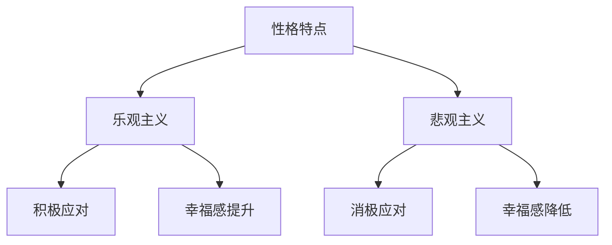
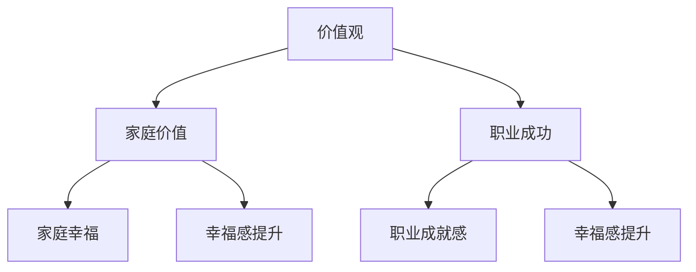
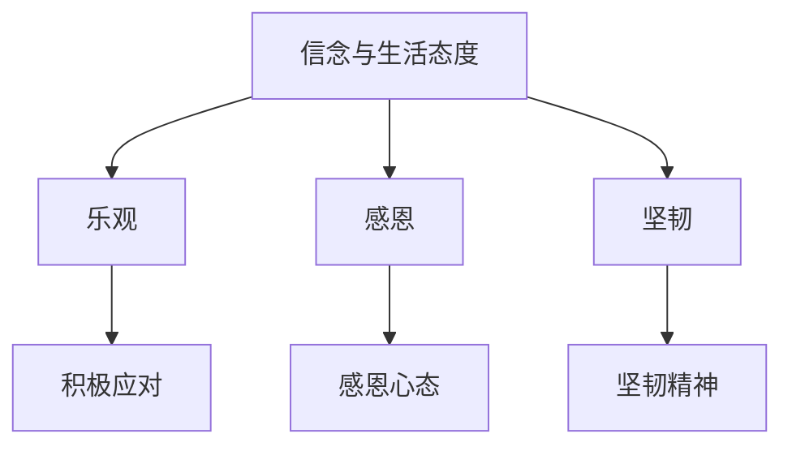
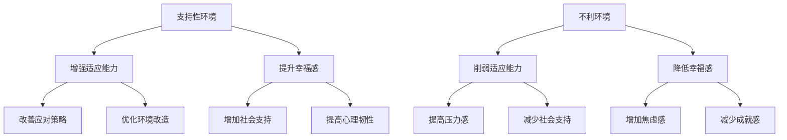
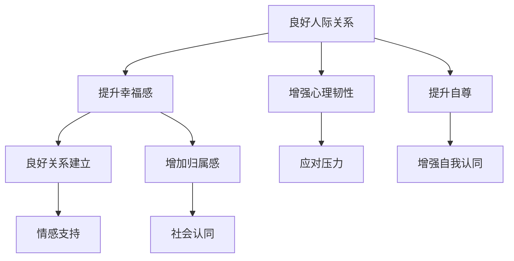

                 

# 如何提升幸福感：如何获得内心的平静和喜悦？

## 关键词
- 幸福感
- 内心平静
- 喜悦
- 心理技巧
- 行为习惯
- 心理疗法
- 职场幸福感
- 家庭幸福感
- 人际关系

## 摘要
本篇文章旨在探讨如何提升幸福感，通过心理技巧、行为习惯、心理疗法等多种方法，帮助读者实现内心的平静和喜悦。文章从定义幸福感开始，分析了内外因素对幸福感的影响，然后详细介绍了各种提升幸福感的实践方法，包括职场幸福感、家庭幸福感和人际关系等方面的具体策略。最后，通过实例分享和反思，为读者提供了持续提升幸福感的建议。

## 第一部分：认识幸福感

### 第1章：幸福感的定义与意义

幸福感是一个主观的感受，它涉及到生活的各个方面，包括情感体验、生活满意度、心理和社会因素。幸福感不仅仅是对当前状态的满足感，还包括对未来生活的期待和希望。那么，什么是幸福感？

#### 1.1 什么是幸福感？

幸福感通常被描述为一种持久的、积极的情感状态，它涉及到以下几个方面：

1. **情感体验**：包括愉悦、满足、放松等积极的情感体验。
2. **生活满意度**：对个人生活各个方面的总体评价，如职业、家庭、社交等。
3. **心理因素**：包括自我认同、自我成长、自尊、自信等。
4. **社会因素**：包括人际关系、社会支持、社会参与等。

#### 1.2 幸福感的重要性

幸福感对个体的身心健康和生活质量有着重要的影响。幸福感高的人通常更健康、更有活力，且具有更强的抗压力和适应能力。幸福感也与生活质量密切相关，包括心理健康、社会关系、职业成就等。

#### 1.3 幸福感的核心要素

幸福感的核心要素可以从以下几个方面来理解：

1. **内在动机**：追求自我实现、个人兴趣和成长。
2. **情绪体验**：积极情感的体验，如快乐、满足、平静等。
3. **心理满足**：对个人价值观和生活目标的认同。
4. **社会支持**：来自家庭、朋友和社会的积极关系。

### 第2章：影响幸福感的内外因素

幸福感受到内外多种因素的影响，了解这些因素有助于我们更好地提升幸福感。

#### 2.1 内在因素

内在因素包括个人的性格、价值观、信念和生活态度等。例如：

1. **性格特点**：乐观、开朗的人往往幸福感更高。
2. **价值观**：对人生意义的理解会影响幸福感。
3. **生活态度**：积极的生活态度有助于提升幸福感。

#### 2.2 外在因素

外在因素包括社会环境、工作、家庭、经济状况等。例如：

1. **社会环境**：社会支持、文化氛围等。
2. **工作**：职业满意度、工作压力等。
3. **家庭**：家庭关系、家庭支持等。
4. **经济状况**：经济安全感、物质条件等。

#### 2.3 环境与个体幸福感的关系

环境与个体幸福感之间存在着复杂的关系。一方面，环境因素可以影响个体的幸福感；另一方面，个体对环境的认知和适应能力也会影响幸福感。因此，提升幸福感不仅需要改善外在环境，还需要提升个体自身的适应能力和心理素质。

## 第二部分：提升幸福感的实践方法

### 第3章：心理技巧

心理技巧是通过心理学的理论和实践方法来提升幸福感。以下是一些常见的心理技巧：

#### 3.1 压力管理

压力是影响幸福感的重要因素之一。以下是一些压力管理的技巧：

1. **放松技巧**：如深呼吸、渐进性肌肉松弛等。
2. **认知重构**：改变负面思维模式，如正面思维、认知行为疗法等。

#### 3.2 情绪调节

情绪调节是通过调整情绪和行为来提升幸福感。以下是一些情绪调节的技巧：

1. **情绪识别**：了解自己的情绪状态，并找到合适的方式表达和处理。
2. **情绪释放**：通过运动、写日记、倾诉等方式释放情绪。
3. **情绪管理**：学会控制情绪，避免情绪失控。

#### 3.3 自我认知的提升

自我认知的提升是通过深入了解自己，提升自我认同感和个人成长。以下是一些自我认知的提升技巧：

1. **自我反思**：定期进行自我反思，了解自己的优点和不足。
2. **自我接纳**：接受自己的不完美，提升自我认同。
3. **自我成长**：设定目标，努力实现个人成长。

### 第4章：行为习惯

行为习惯是通过日常生活中的行为和习惯来提升幸福感。以下是一些有助于提升幸福感的习惯：

#### 4.1 生活方式的改善

改善生活方式有助于提升身体健康和生活质量。以下是一些生活方式的改善建议：

1. **健康饮食**：均衡饮食，增加蔬菜、水果和全谷类的摄入。
2. **规律作息**：保持规律的睡眠时间和作息习惯。
3. **适量运动**：每周进行适量的有氧运动，如快走、跑步、游泳等。

#### 4.2 养成健康的生活习惯

养成健康的生活习惯有助于提升幸福感。以下是一些健康的生活习惯：

1. **定时休息**：工作一段时间后，适当休息，避免过度疲劳。
2. **定期放松**：定期安排放松时间，如听音乐、阅读、冥想等。
3. **社交互动**：与他人进行积极的社交互动，提升社交幸福感。

#### 4.3 增进人际关系的技巧

人际关系对幸福感有着重要的影响。以下是一些增进人际关系的技巧：

1. **倾听**：倾听他人，了解他人的需求和感受。
2. **沟通**：学会有效沟通，表达自己的需求和想法。
3. **帮助**：乐于帮助他人，提升人际关系的质量。

### 第5章：心理疗法

心理疗法是通过专业的心理治疗方法来提升幸福感。以下是一些常见的心理疗法：

#### 5.1 认知行为疗法

认知行为疗法是一种通过改变思维和行为来改善情绪和心理问题的方法。以下是一些认知行为疗法的核心原理：

1. **认知重构**：改变负面思维模式，如认知重建技术、正念等。
2. **行为激活**：通过行为改变来改善情绪，如行为实验、任务安排等。

#### 5.2 情绪焦点疗法

情绪焦点疗法是一种以情绪为中心的心理治疗方法，旨在帮助个体理解和管理情绪。以下是一些情绪焦点疗法的关键点：

1. **情绪识别**：识别和理解自己的情绪。
2. **情绪表达**：学会表达和管理情绪。
3. **情绪释放**：通过情绪释放技巧，如表达性艺术、放松技巧等来释放情绪。

#### 5.3 其他心理治疗方法

除了认知行为疗法和情绪焦点疗法，还有许多其他心理治疗方法，如精神分析疗法、人本主义疗法等。不同的心理治疗方法适用于不同的个体和情境，需要根据具体情况选择。

## 第三部分：具体情境下的幸福感提升

### 第6章：职场幸福感

职场幸福感是幸福感的重要组成部分。以下是一些提升职场幸福感的策略：

#### 6.1 职场压力与幸福感的关系

职场压力是影响职场幸福感的重要因素。以下是一些关于职场压力与幸福感的关系的研究：

1. **高压力工作**：可能导致情绪低落、焦虑和压力过大。
2. **低压力工作**：可能使个体感到无聊、缺乏成就感和动力。

#### 6.2 提升职场幸福感的策略

以下是一些提升职场幸福感的策略：

1. **明确目标**：设定清晰的职业目标，增强职业满足感。
2. **积极沟通**：与同事和上级保持良好的沟通，减少误解和冲突。
3. **平衡工作与生活**：合理安排工作时间，确保工作和生活的平衡。

#### 6.3 职场幸福感案例分析

以下是一个职场幸福感案例：

- **案例背景**：一位职场人士在工作多年后感到疲惫和缺乏动力，对工作失去了兴趣。
- **解决方案**：通过心理咨询，明确了职业目标，重新找到了工作的意义和动力。
- **结果**：这位职场人士在重新找到工作意义后，幸福感显著提升，工作效率和生活质量都有了很大改善。

### 第7章：家庭幸福感

家庭幸福感是幸福感的重要组成部分。以下是一些提升家庭幸福感的技巧：

#### 7.1 家庭关系对幸福感的影响

家庭关系对个体的幸福感有着重要的影响。以下是一些关于家庭关系与幸福感关系的研究：

1. **亲密关系**：与伴侣和家庭成员建立亲密关系，有助于提升幸福感。
2. **家庭支持**：家庭支持有助于个体应对压力和挑战。

#### 7.2 增进家庭幸福的技巧

以下是一些增进家庭幸福的技巧：

1. **有效沟通**：与家庭成员保持良好的沟通，减少误解和冲突。
2. **共同活动**：与家人一起参与共同活动，增进亲密关系。
3. **表达感激**：对家人表达感激之情，增强家庭凝聚力。

#### 7.3 家庭幸福感案例分析

以下是一个家庭幸福感案例：

- **案例背景**：一个家庭因为成员之间的沟通不畅和冲突，幸福感较低。
- **解决方案**：通过家庭咨询，学习了有效沟通技巧和增进亲密关系的方法。
- **结果**：家庭关系得到改善，幸福感显著提升。

### 第8章：人际关系与幸福感

人际关系对幸福感有着重要的影响。以下是一些提升人际关系和幸福感的方法：

#### 8.1 人际关系的重要性

人际关系对幸福感有着重要的影响。以下是一些关于人际关系与幸福感关系的研究：

1. **社交支持**：社交支持有助于应对压力和困难。
2. **社交互动**：积极的社交互动有助于提升幸福感。

#### 8.2 人际交往技巧

以下是一些人际交往技巧：

1. **倾听**：倾听他人的需求和感受，建立良好的沟通基础。
2. **尊重**：尊重他人的观点和感受，增进人际关系。
3. **帮助**：乐于帮助他人，建立互助关系。

#### 8.3 人际关系与幸福感的关系

人际关系与幸福感之间存在着密切的关系。以下是一些关于人际关系与幸福感关系的研究：

1. **积极的人际关系**：有助于提升幸福感。
2. **消极的人际关系**：可能导致情绪低落和压力增大。

## 第四部分：幸福感提升的实例与反思

### 第9章：幸福感的实践与反思

幸福感提升是一个持续的过程，需要实践和反思。以下是一些幸福感提升的实例和反思：

#### 9.1 幸福感提升的实例分享

以下是一些幸福感提升的实例：

- **实例1**：一位职场人士通过调整工作方式和生活方式，提升了职场幸福感和生活质量。
- **实例2**：一个家庭通过学习有效沟通技巧和增进亲密关系的方法，提升了家庭幸福感。
- **实例3**：一位年轻人通过培养健康的生活习惯和积极的人际关系，提升了整体幸福感。

#### 9.2 幸福感提升过程中的反思

在提升幸福感的过程中，反思是至关重要的一步。以下是一些反思的建议：

1. **自我反思**：定期进行自我反思，了解自己的成长和进步。
2. **经验分享**：与他人分享自己的经验和心得，获得反馈和建议。
3. **持续学习**：不断学习新的知识和技巧，提升自己的幸福感。

#### 9.3 幸福感提升的持续之路

幸福感提升是一个持续的过程，需要不断努力和实践。以下是一些持续提升幸福感的建议：

1. **设定目标**：设定清晰的幸福感提升目标，并为之努力。
2. **持续实践**：将幸福感提升的方法和实践应用到日常生活中。
3. **保持积极**：保持积极的心态，面对挑战和困难。

## 附录

### 附录A：幸福感提升资源与工具

以下是一些幸福感提升的资源和工具：

1. **心理学资源**：如《幸福心理学》、《积极心理学》等。
2. **健康生活工具**：如健身追踪器、健康饮食应用等。
3. **人际关系提升资源**：如沟通技巧培训、人际关系咨询等。

### 附录B：幸福感提升建议

以下是一些建议，帮助您持续提升幸福感：

1. **定期锻炼**：每周进行适量的运动，如快走、跑步、游泳等。
2. **保持良好的作息习惯**：保持规律的睡眠时间和作息习惯。
3. **培养兴趣爱好**：培养兴趣爱好，丰富生活内容。
4. **积极与人交往**：与他人建立良好的社交关系，获得社交支持。
5. **持续学习**：不断学习新的知识和技能，提升自己。

## 结语

提升幸福感是一项长期而艰巨的任务，需要我们从多个方面进行努力。通过心理技巧、行为习惯、心理疗法等多种方法，我们可以实现内心的平静和喜悦。同时，具体情境下的幸福感提升策略，如职场幸福感、家庭幸福感和人际关系等，也为我们在不同的生活场景中提供了实用的建议。让我们从现在开始，持续努力，提升自己的幸福感。

## 作者信息

作者：AI天才研究院/AI Genius Institute & 禅与计算机程序设计艺术 /Zen And The Art of Computer Programming

---

文章标题：《如何提升幸福感：如何获得内心的平静和喜悦？》

文章关键词：幸福感、内心平静、喜悦、心理技巧、行为习惯、心理疗法、职场幸福感、家庭幸福感、人际关系

文章摘要：本文旨在探讨如何提升幸福感，通过心理技巧、行为习惯、心理疗法等多种方法，帮助读者实现内心的平静和喜悦。文章从定义幸福感开始，分析了内外因素对幸福感的影响，然后详细介绍了各种提升幸福感的实践方法，包括职场幸福感、家庭幸福感和人际关系等方面的具体策略。最后，通过实例分享和反思，为读者提供了持续提升幸福感的建议。<|endoftext|>### 第一部分：认识幸福感

幸福感，作为个体心理体验的一部分，是衡量生活质量的重要指标。它不仅仅是对物质财富的满足，更是对精神层面的追求和享受。本章节将深入探讨幸福感的定义、重要性以及其核心要素，为后续的实践方法提供理论基础。

#### 1.1 什么是幸福感？

幸福感是一种主观体验，通常描述为一种持久的、积极的情感状态。这种状态包含了多种维度，如快乐、满足、平静等。根据不同的心理学理论，幸福感可以从以下几个角度进行理解：

- **情感体验**：幸福感的核心在于个体的情感体验。积极情感的持续体验，如快乐、满足、爱和喜悦，被认为是幸福感的核心。
- **生活满意度**：生活满意度是对个人生活各个方面的总体评价，包括家庭、工作、健康、财务状况等。高生活满意度通常与幸福感正相关。
- **心理因素**：心理幸福感涉及到个人的内在心理状态，如自我认同、自我效能感、自我价值感等。这些心理因素对于维持长期幸福感至关重要。
- **社会因素**：社会幸福感则与社会支持、人际关系、社会参与等因素相关。拥有良好的人际关系和社会网络，通常有助于提升个体的幸福感。

#### 1.2 幸福感的重要性

幸福感对于个体的身心健康和生活质量有着深远的影响。以下是一些关键点：

- **身心健康**：幸福感高的人往往拥有更好的身体健康，较低的患病风险，更强的免疫系统。
- **生活质量**：幸福感有助于提高生活质量，使个体能够更好地享受生活，提高生活满意度。
- **抗压力**：幸福感高的人通常具有更强的心理韧性，能够更好地应对压力和挑战。
- **社会功能**：幸福感对个体的社会功能也有积极影响，如工作表现、社会参与度、人际关系等。

#### 1.3 幸福感的核心要素

幸福感的核心要素可以从以下几个角度来理解：

- **内在动机**：内在动机是指个体追求个人兴趣、成长和自我实现的动力。内在动机强的人通常更能体验到幸福感。
- **情绪体验**：积极的情绪体验，如快乐、满足等，是幸福感的重要组成部分。
- **心理满足**：心理满足是指个体对个人价值观和生活目标的认同感。这种认同感有助于提升幸福感。
- **社会支持**：社会支持，包括家庭、朋友和社会网络，对幸福感有显著的正面影响。社会支持可以提供情感支持、资源支持和安全感。

#### 1.4 幸福感的评估方法

幸福感的评估方法多种多样，常见的有自我报告、行为观察、生理指标等：

- **自我报告**：个体通过问卷、访谈等方式自我评估幸福感。
- **行为观察**：通过观察个体的行为和反应来评估其幸福感。
- **生理指标**：如心率变异性、皮质醇水平等生理指标也可以作为幸福感评估的辅助手段。

通过以上对幸福感的定义、重要性以及核心要素的探讨，我们为后续章节提供了理论基础。接下来，我们将分析影响幸福感的内外因素，帮助我们更好地理解幸福感的多维性。

#### 1.5 幸福感的多维性

幸福感是一个多维的概念，不同的人可能会有不同的幸福感体验。以下是一些影响幸福感多维性的因素：

- **个体差异**：每个人的性格、经历、价值观都不同，这会导致他们对幸福感的理解和追求有所不同。例如，有些人可能更重视工作成就，而另一些人可能更注重家庭和人际关系。
- **文化背景**：不同的文化背景会影响人们对幸福感的看法和追求。一些文化可能更重视物质财富和社会地位，而其他文化可能更强调精神满足和人际关系。
- **生活阶段**：人生的不同阶段对幸福感的影响也不同。例如，年轻人可能更注重职业发展和社交活动，而年长者可能更重视家庭和身体健康。
- **心理状态**：个体的心理状态，如焦虑、抑郁等，也会影响幸福感的体验。心理健康的个体通常更能体验到幸福感。

通过理解幸福感的多维性，我们可以更好地认识到幸福感的多样性和个性化。这为我们在后续章节中提出个性化的幸福感提升策略提供了重要依据。

### 2.1 内在因素

幸福感的一个重要方面在于个体的内在因素，这些因素影响着个体对生活的感受和体验。以下是一些主要的内在因素：

#### 2.1.1 性格特点

性格特点对幸福感有着深远的影响。研究表明，乐观、开朗的性格特点有助于提升幸福感，而悲观、消极的性格特点则可能导致较低的幸福感。乐观主义者往往能够更好地应对生活中的挑战，更容易找到积极的解决方案，从而增强他们的幸福感。

**性格与幸福感的Mermaid流程图：**


#### 2.1.2 价值观

个体的价值观对幸福感有着重要的影响。价值观指的是个体对于什么是好的、什么是重要的、什么是值得追求的信念和判断。那些与自己价值观相符合的生活事件和经历，通常能够带来更高的幸福感。例如，一个重视家庭价值的人，在家庭中获得满足和温暖时，幸福感会显著提升。

**价值观与幸福感的Mermaid流程图：**


#### 2.1.3 信念和生活态度

信念和生活态度也是影响幸福感的重要内在因素。个体对生活的信念和生活态度，决定了他们在面对困难和挑战时的反应和心态。积极的生活态度，如感恩、乐观、坚韧等，能够帮助个体更好地应对生活中的挑战，从而提升幸福感。

**信念与生活态度对幸福感的Mermaid流程图：**


通过以上分析，我们可以看到内在因素在幸福感中的重要性。这些内在因素不仅影响着个体对生活的感受和体验，还为个体提供了应对挑战和提升幸福感的内在资源。接下来，我们将探讨外在因素对幸福感的影响。

### 2.2 外在因素

幸福感不仅受到内在因素的影响，还受到众多外在因素的影响。这些外在因素包括社会环境、工作、家庭和经济状况等，它们通过不同的途径和机制对幸福感产生作用。

#### 2.2.1 社会环境

社会环境是影响幸福感的重要因素之一。社会支持、文化氛围、政治稳定等社会环境因素都会对个体的幸福感产生深远的影响。

- **社会支持**：社会支持包括家庭、朋友和社区的支持。研究表明，拥有良好的社会支持网络可以显著提升个体的幸福感。社会支持不仅能够在情感上提供安慰，还能够提供实际的帮助和资源，从而帮助个体应对生活中的挑战。

- **文化氛围**：文化氛围是指社会普遍接受的价值观念和生活方式。不同的文化氛围可能会对个体的幸福感产生不同的影响。例如，在一些强调个人成就和竞争的文化中，个体可能会因为追求成功而感到压力和焦虑，而在一些强调和谐与共享的文化中，个体可能会感受到更多的满足和幸福。

- **政治稳定**：政治稳定对幸福感也有着重要的影响。政治不稳定可能导致社会动荡、经济不稳定，从而对个体的幸福感产生负面影响。相反，政治稳定可以提供安全感和预期，有助于提升幸福感。

#### 2.2.2 工作

工作对幸福感有着直接和间接的影响。工作不仅提供了经济来源，还对个体的自尊、成就感和社会地位产生作用。

- **职业满意度**：职业满意度是指个体对自己工作的满意程度。研究表明，高职业满意度与高幸福感正相关。当个体对自己的工作感到满意时，他们更有可能体验到工作带来的成就感，从而提升整体幸福感。

- **工作压力**：工作压力是影响幸福感的另一重要因素。高工作压力可能导致个体感到疲惫、焦虑和压力过大，从而降低幸福感。反之，低工作压力或合理的工作压力管理可以帮助个体更好地保持工作与生活的平衡，提升幸福感。

- **职业发展**：职业发展机会和成长空间也对幸福感有积极影响。当个体看到自己的职业前景光明，有机会实现个人目标和职业成长时，他们更有可能体验到积极情感和幸福感。

#### 2.2.3 家庭

家庭是影响幸福感的重要因素之一。家庭关系、家庭支持和家庭氛围都会对个体的幸福感产生深远的影响。

- **家庭关系**：家庭关系，特别是亲密关系，对幸福感有着直接的影响。和谐的家庭关系可以带来情感支持、安全感和幸福感，而紧张的家庭关系则可能导致情绪低落和压力增大。

- **家庭支持**：家庭支持，包括情感支持、物质支持和教育支持，对幸福感有积极影响。当个体在家庭中感受到支持时，他们更有可能感受到幸福和满足。

- **家庭氛围**：家庭氛围，即家庭成员之间的互动方式和家庭环境，也会影响幸福感。一个温馨、和谐的家庭氛围有助于提升个体的幸福感，而一个紧张、冲突的家庭氛围则可能对幸福感产生负面影响。

#### 2.2.4 经济状况

经济状况是影响幸福感的一个重要外在因素。经济状况不仅决定了个体能够享受到的物质生活水平，还与个体的社会地位和自尊感有关。

- **经济安全感**：经济安全感是指个体对经济状况的稳定和安全的感受。有经济安全感的人通常能够更好地应对生活中的挑战，从而提升幸福感。

- **物质条件**：物质条件，如住房、食物、医疗等，是幸福感的重要组成部分。良好的物质条件可以为个体提供基本的生活保障，从而减少生活压力，提升幸福感。

- **社会比较**：社会比较是指个体将自身与他人进行比较，从而评估自己的幸福感。尽管物质条件是影响幸福感的一个因素，但社会比较也会对幸福感产生显著的影响。当个体发现自己的物质条件优于他人时，他们可能会感受到更高的幸福感，反之则可能感到不满。

通过以上分析，我们可以看到外在因素对幸福感的重要影响。这些外在因素通过多种途径和机制对个体的情感状态和生活满意度产生作用。了解这些外在因素，有助于我们更好地理解幸福感的复杂性和多样性，也为我们在提升幸福感时提供了更多的视角和策略。

### 2.3 环境与个体幸福感的关系

环境与个体幸福感之间的关系是复杂而多维的。环境不仅包括物质环境，如住房、工作场所、社区设施等，还包括社会环境，如家庭、朋友、社会支持系统等。以下我们将探讨环境如何影响个体幸福感，并分析个体如何适应和改变环境以提升幸福感。

#### 2.3.1 环境对个体幸福感的影响

环境因素通过多种途径影响个体的幸福感。以下是一些主要的影响机制：

- **物理环境**：物理环境，如住房条件、工作场所的环境等，直接影响个体的身心健康。一个舒适、安全的物理环境可以提升个体的幸福感。例如，良好的通风、足够的采光、安静的居住环境等都有助于提高生活质量。

- **社会环境**：社会环境，如家庭、朋友、社区等，提供了重要的社会支持和互动机会。积极的社会环境可以增强个体的归属感和社会认同感，从而提升幸福感。相反，缺乏社会支持或社会环境恶劣（如社区犯罪率高、人际关系紧张等）可能会降低个体的幸福感。

- **文化环境**：文化环境，包括文化价值观、社会规范等，对个体的行为和情感有着深远的影响。不同的文化环境可能对幸福感的理解和追求有不同的期望和标准。例如，在一些强调集体主义和和谐的文化中，个体可能更注重家庭和社会关系，而在一些强调个人主义和竞争的文化中，个体可能更注重个人成就和自我实现。

#### 2.3.2 个体如何适应和改变环境

个体在面对不利的环境时，可以通过以下几种方式来适应和改变环境，从而提升幸福感：

- **积极应对**：个体可以通过积极的应对策略来改善环境。例如，如果居住环境不理想，可以通过改善家居布置、增加绿植等方式来提升居住舒适度。在工作场所，个体可以通过提高工作效率、寻求团队支持等方式来改善工作环境。

- **环境改造**：个体可以通过改造环境来适应自己的需求和偏好。例如，通过装修房屋来创造一个更加舒适的生活空间，或者通过改进工作场所的布局来提升工作效率。

- **社会参与**：个体可以通过积极参与社会活动，建立和维护良好的社会关系，从而获得更多的社会支持和认同感。例如，加入社区志愿者活动、参与兴趣小组等，都是提升社会环境和幸福感的有效途径。

- **心理调适**：个体可以通过心理调适策略来提升自己的心理韧性，更好地应对环境压力。例如，通过冥想、正念练习等方式来减轻压力，通过积极的自我对话来增强自信心和幸福感。

#### 2.3.3 环境与个体适应能力的互动

环境与个体适应能力之间存在互动关系。一个支持性的环境可以增强个体的适应能力，而一个不利的环境可能会削弱个体的适应能力。以下是一个简化的Mermaid流程图，展示了环境与个体适应能力的互动关系：



通过以上分析，我们可以看到环境与个体幸福感之间的关系是复杂而互动的。个体不仅受到环境的影响，同时也可以通过自身的适应和改变来影响环境，从而提升幸福感。理解这一关系有助于我们在提升幸福感时，采取更加综合和个性化的策略。

### 3.1 压力管理

压力管理是提升幸福感的重要环节，因为压力不仅会影响个体的心理健康，还可能对生理健康产生负面影响。有效的压力管理策略可以帮助个体更好地应对生活中的挑战，从而提升幸福感。以下是一些常见的压力管理技巧：

#### 3.1.1 放松技巧

放松技巧是通过物理和心灵的放松来减轻压力和焦虑。以下是一些常见的放松技巧：

- **深呼吸**：深呼吸是一种简单而有效的放松技巧。通过缓慢、深长的呼吸，个体可以放松身体和心灵，减少焦虑和紧张感。
  ```mermaid
  graph TD
      A[深呼吸技巧] --> B[缓慢呼吸]
      A --> C[深吸气]
      A --> D[深呼气]
      B --> E[放松身体]
      B --> F[减轻焦虑]
  ```

- **渐进性肌肉松弛**：渐进性肌肉松弛是一种通过逐步放松身体各个部位的肌肉来减轻紧张和压力的技巧。个体可以通过紧绷和放松肌肉来放松身体，从而减轻压力。
  ```mermaid
  graph TD
      A[渐进性肌肉松弛] --> B[紧绷肌肉]
      A --> C[放松肌肉]
      B --> D[从头到脚]
      B --> E[逐步放松]
  ```

#### 3.1.2 认知重构

认知重构是通过改变消极的思维模式来减轻压力和焦虑。以下是一些常见的认知重构技巧：

- **正面思维**：正面思维是一种通过专注于积极的事物和经验来替代消极思维模式的技巧。通过积极思考，个体可以更好地应对生活中的挑战，从而减轻压力。
  ```mermaid
  graph TD
      A[正面思维] --> B[关注积极面]
      A --> C[避免消极思维]
      B --> D[增强心理韧性]
      B --> E[提升幸福感]
  ```

- **认知行为疗法**：认知行为疗法是一种通过识别和改变消极思维和行为模式来减轻压力和焦虑的心理治疗方法。通过认知行为疗法，个体可以学会更加理性地看待问题，从而减少压力。
  ```mermaid
  graph TD
      A[认知行为疗法] --> B[识别消极思维]
      A --> C[改变行为模式]
      B --> D[降低焦虑感]
      B --> E[提高应对能力]
  ```

#### 3.1.3 情绪调节

情绪调节是通过调整情绪和行为来减轻压力和焦虑。以下是一些常见的情绪调节技巧：

- **情绪识别**：情绪识别是一种通过了解自己的情绪状态来更好地管理情绪的技巧。通过情绪识别，个体可以更好地理解自己的情绪，从而找到更有效的应对策略。
  ```mermaid
  graph TD
      A[情绪识别] --> B[了解情绪状态]
      A --> C[识别情绪触发点]
      B --> D[合理应对情绪]
      B --> E[减少情绪困扰]
  ```

- **情绪释放**：情绪释放是一种通过运动、写日记、倾诉等方式来释放情绪的技巧。通过情绪释放，个体可以减轻内心的压力，从而提升幸福感。
  ```mermaid
  graph TD
      A[情绪释放] --> B[运动释放]
      A --> C[写日记释放]
      A --> D[倾诉释放]
      B --> E[减轻压力]
      B --> F[提升情绪管理能力]
  ```

通过以上压力管理技巧，个体可以更好地应对生活中的压力，从而提升幸福感。在接下来的章节中，我们将探讨提升幸福感的行为习惯和具体实践方法。

### 3.2 情绪调节

情绪调节是通过调整个体对情绪的反应和行为来提升幸福感的有效方法。情绪调节不仅能够帮助个体更好地处理负面情绪，还能够增强心理韧性，提升整体幸福感。以下是一些常见的情绪调节技巧：

#### 3.2.1 情绪识别

情绪识别是情绪调节的第一步，它涉及到了解和识别自己当前的情绪状态。以下是一些情绪识别的技巧：

- **自我反思**：通过定期自我反思，个体可以更好地了解自己的情绪变化和触发点。这种自我反思可以是写日记、冥想或与朋友交流。
  ```mermaid
  graph TD
      A[自我反思] --> B[写日记]
      A --> C[冥想]
      A --> D[与朋友交流]
      B --> E[情绪记录]
      B --> F[了解情绪触发点]
  ```

- **情绪标签**：给情绪贴上标签，可以帮助个体更清晰地识别和理解自己的情绪。例如，当感到焦虑时，可以将其标签为“焦虑”或“紧张”。
  ```mermaid
  graph TD
      A[情绪标签] --> B[焦虑]
      A --> C[紧张]
      A --> D[愤怒]
      B --> E[明确情绪状态]
      B --> F[情绪管理]
  ```

#### 3.2.2 情绪释放

情绪释放是减轻情绪压力的重要步骤。以下是一些情绪释放的技巧：

- **运动释放**：通过运动，如跑步、游泳或瑜伽，个体可以释放紧张情绪，提升情绪状态。运动不仅有助于身体健康，还能增强心理韧性。
  ```mermaid
  graph TD
      A[运动释放] --> B[跑步]
      A --> C[游泳]
      A --> D[瑜伽]
      B --> E[释放紧张]
      B --> F[提升情绪]
  ```

- **写日记**：写日记是一种有效的情绪释放方式。通过写日记，个体可以将内心情绪表达出来，从而减轻心理负担。
  ```mermaid
  graph TD
      A[写日记] --> B[表达情绪]
      A --> C[心理释放]
      A --> D[记录经历]
      B --> E[减轻压力]
      B --> F[情绪管理]
  ```

- **倾诉**：与朋友或家人倾诉自己的情绪，可以帮助个体获得情感支持和理解，从而减轻情绪压力。
  ```mermaid
  graph TD
      A[倾诉] --> B[朋友]
      A --> C[家人]
      A --> D[心理咨询师]
      B --> E[情感支持]
      B --> F[减少压力]
  ```

#### 3.2.3 情绪管理

情绪管理是长期维持情绪健康和幸福感的关键。以下是一些情绪管理的技巧：

- **情绪接受**：学会接受情绪的起伏，而不是抗拒或逃避。接受情绪可以帮助个体更好地理解自己的需求，从而采取更有效的应对策略。
  ```mermaid
  graph TD
      A[情绪接受] --> B[接受情绪起伏]
      A --> C[理解需求]
      A --> D[减少逃避]
      B --> E[情绪稳定]
      B --> F[心理平衡]
  ```

- **情绪转换**：通过情绪转换，个体可以将负面情绪转化为积极的情绪或行动。例如，当感到沮丧时，可以通过参与志愿活动来提升情绪。
  ```mermaid
  graph TD
      A[情绪转换] --> B[负面情绪]
      A --> C[积极行动]
      A --> D[志愿活动]
      B --> E[情绪提升]
      B --> F[心理满足]
  ```

- **情绪平衡**：通过情绪平衡，个体可以在情绪高涨和低落之间找到平衡点。这种平衡可以通过自我调节和情绪识别来实现。
  ```mermaid
  graph TD
      A[情绪平衡] --> B[情绪稳定]
      A --> C[自我调节]
      A --> D[情绪识别]
      B --> E[心理健康]
      B --> F[幸福感提升]
  ```

通过情绪调节技巧，个体可以更好地管理自己的情绪，减少负面情绪的影响，从而提升整体幸福感。在接下来的章节中，我们将探讨提升幸福感的其他行为习惯和实践方法。

### 3.3 自我认知的提升

自我认知的提升是提升幸福感的重要途径之一。通过深入了解自己的内心世界，个体可以更好地理解自己的需求、情感和行为，从而实现个人成长和幸福感提升。以下是一些自我认知的提升技巧：

#### 3.3.1 自我反思

自我反思是一种通过深入思考自己的行为、情感和思维过程来提升自我认知的技巧。以下是一些自我反思的方法：

- **日记记录**：通过写日记，个体可以记录自己的所思所感，反思自己的行为和决策。这种方法有助于个体发现自己的模式和习惯，从而进行有针对性的改变。
  ```mermaid
  graph TD
      A[日记记录] --> B[记录所思所感]
      A --> C[反思行为决策]
      A --> D[发现模式习惯]
      B --> E[自我认知提升]
      B --> F[个人成长]
  ```

- **定期回顾**：定期回顾自己的生活和目标，可以帮助个体评估自己的成长和进步，发现需要改进的地方。这种方法有助于个体保持对自我认知的提升持续关注。
  ```mermaid
  graph TD
      A[定期回顾] --> B[评估成长进步]
      A --> C[发现改进空间]
      A --> D[持续关注提升]
      B --> E[自我认知深化]
      B --> F[目标导向]
  ```

#### 3.3.2 自我接纳

自我接纳是一种通过接受自己的优点和不足，从而提升自我认知和幸福感的技巧。以下是一些自我接纳的方法：

- **正面肯定**：通过正面肯定自己的优点和成就，个体可以提升自信心和自尊感。这种方法有助于个体更加接纳自己，从而减少自我批评和负面情绪。
  ```mermaid
  graph TD
      A[正面肯定] --> B[优点肯定]
      A --> C[成就肯定]
      A --> D[自信心提升]
      B --> E[自我接纳]
      B --> F[幸福感提升]
  ```

- **自我宽恕**：通过自我宽恕，个体可以释放内心的负面情绪和自我批评，从而减少内心的压力。这种方法有助于个体建立更加健康和积极的自我认知。
  ```mermaid
  graph TD
      A[自我宽恕] --> B[负面情绪释放]
      A --> C[自我批评减少]
      A --> D[内心压力减轻]
      B --> E[自我接纳]
      B --> F[心理平衡]
  ```

#### 3.3.3 自我成长

自我成长是一种通过不断学习和提升自己，从而实现个人目标和幸福感提升的技巧。以下是一些自我成长的方法：

- **终身学习**：通过终身学习，个体可以不断获取新知识和技能，提升自己的能力。这种方法有助于个体保持对生活的热情和动力。
  ```mermaid
  graph TD
      A[终身学习] --> B[获取新知识]
      A --> C[提升技能]
      A --> D[保持热情]
      B --> E[个人成长]
      B --> F[幸福感提升]
  ```

- **目标设定**：通过设定清晰的目标，个体可以明确自己的方向和动力，从而实现自我成长和提升。这种方法有助于个体保持专注和持续进步。
  ```mermaid
  graph TD
      A[目标设定] --> B[明确方向]
      A --> C[明确动力]
      A --> D[实现目标]
      B --> E[自我成长]
      B --> F[幸福感提升]
  ```

通过自我反思、自我接纳和自我成长等技巧，个体可以不断提升自我认知，实现个人目标和幸福感提升。在接下来的章节中，我们将探讨提升幸福感的生活方式改善和行为习惯。

### 3.4 生活方式的改善

生活方式的改善是提升幸福感的重要方面之一。通过改变生活习惯，个体可以在生理和心理层面都获得积极的影响，从而提升整体幸福感。以下是一些有助于改善生活方式的具体建议：

#### 3.4.1 健康饮食

健康饮食是提升幸福感的基础。以下是一些健康饮食的建议：

- **均衡饮食**：确保饮食中包含足够的蛋白质、复合碳水化合物、健康脂肪、维生素和矿物质。例如，多吃蔬菜、水果、全谷物、豆类和坚果。
  ```mermaid
  graph TD
      A[均衡饮食] --> B[蔬菜]
      A --> C[水果]
      A --> D[全谷物]
      A --> E[豆类]
      B --> F[营养均衡]
      B --> G[健康提升]
  ```

- **减少加工食品**：避免食用高糖、高盐和高脂肪的加工食品。这些食品可能对健康和幸福感产生负面影响。
  ```mermaid
  graph TD
      A[减少加工食品] --> B[高糖食品]
      A --> C[高盐食品]
      A --> D[高脂肪食品]
      B --> E[健康风险]
      B --> F[幸福感降低]
  ```

- **定期进餐**：保持规律的饮食习惯，避免过度饥饿或暴饮暴食。规律的进餐有助于维持血糖水平的稳定，提高能量和幸福感。
  ```mermaid
  graph TD
      A[定期进餐] --> B[规律进餐]
      A --> C[血糖稳定]
      A --> D[能量提升]
      B --> E[健康提升]
      B --> F[幸福感提升]
  ```

#### 3.4.2 规律运动

规律运动是提升身心健康和幸福感的重要手段。以下是一些规律运动的建议：

- **选择适合自己的运动**：根据个人的兴趣和身体状况，选择适合自己的运动方式，如快走、跑步、游泳、瑜伽等。
  ```mermaid
  graph TD
      A[选择运动] --> B[快走]
      A --> C[跑步]
      A --> D[游泳]
      A --> E[瑜伽]
      B --> F[兴趣与身体]
      B --> G[运动习惯]
  ```

- **每周至少150分钟的中等强度运动**：根据世界卫生组织的建议，每周应进行至少150分钟的中等强度运动，如快走或慢跑。这有助于提高心肺功能和整体健康水平。
  ```mermaid
  graph TD
      A[每周运动] --> B[150分钟]
      A --> C[中等强度]
      A --> D[心肺功能]
      B --> E[健康提升]
      B --> F[幸福感提升]
  ```

- **定期锻炼**：保持定期锻炼的习惯，避免断断续续。定期锻炼有助于建立肌肉和骨骼，提高新陈代谢，减少压力和焦虑。
  ```mermaid
  graph TD
      A[定期锻炼] --> B[习惯性锻炼]
      A --> C[肌肉骨骼]
      A --> D[新陈代谢]
      B --> E[健康提升]
      B --> F[幸福感提升]
  ```

#### 3.4.3 保持充足的睡眠

充足的睡眠对于身心健康和幸福感至关重要。以下是一些保持充足睡眠的建议：

- **建立规律的睡眠时间表**：每天尽量在相同的时间上床睡觉和起床，以帮助调节身体的生物钟，改善睡眠质量。
  ```mermaid
  graph TD
      A[规律睡眠时间表] --> B[固定上床时间]
      A --> C[固定起床时间]
      A --> D[生物钟调节]
      B --> E[睡眠质量提升]
      B --> F[身体恢复]
  ```

- **优化睡眠环境**：确保睡眠环境舒适、安静、黑暗。避免在床上工作或使用电子设备，以减少干扰和刺激。
  ```mermaid
  graph TD
      A[优化睡眠环境] --> B[舒适睡眠]
      A --> C[安静环境]
      A --> D[黑暗环境]
      A --> E[避免电子设备]
      B --> F[睡眠质量提升]
      B --> G[干扰减少]
  ```

- **避免过度午睡**：虽然适当的午睡可以提神醒脑，但过度午睡可能会影响夜间睡眠。建议午睡时间控制在20-30分钟内，避免长时间午睡。
  ```mermaid
  graph TD
      A[避免过度午睡] --> B[午睡时间控制]
      A --> C[20-30分钟]
      A --> D[影响夜间睡眠]
      B --> E[睡眠质量提升]
      B --> F[精神状态提升]
  ```

通过改善生活方式，个体可以在饮食、运动和睡眠等方面获得全面的提升，从而增强身心健康和幸福感。在接下来的章节中，我们将探讨如何通过日常行为习惯来提升幸福感。

### 3.5 行为习惯的养成

良好的行为习惯对于提升幸福感至关重要。通过养成健康的生活习惯，个体可以在日常生活中获得持续的心理和生理益处，从而增强幸福感。以下是一些有助于提升幸福感的健康生活习惯：

#### 3.5.1 定时作息

定时作息是保持身心健康的基础。以下是一些定时作息的建议：

- **建立规律的作息时间**：尽量每天在相同的时间上床睡觉和起床，以帮助调节身体的生物钟，改善睡眠质量。
  ```mermaid
  graph TD
      A[建立规律作息] --> B[固定上床时间]
      A --> C[固定起床时间]
      A --> D[生物钟调节]
      B --> E[睡眠质量提升]
      B --> F[身体恢复]
  ```

- **避免熬夜**：尽量避免在晚上过度使用电子设备，尤其是在临睡前。蓝光会影响褪黑激素的分泌，从而影响睡眠质量。
  ```mermaid
  graph TD
      A[避免熬夜] --> B[电子设备使用]
      A --> C[蓝光影响]
      A --> D[褪黑激素分泌]
      B --> E[睡眠质量降低]
      B --> F[身体疲劳]
  ```

#### 3.5.2 适量运动

适量运动是保持身体健康和提升幸福感的重要手段。以下是一些适量运动的建议：

- **选择适合自己的运动方式**：根据自己的兴趣和身体状况，选择适合自己的运动方式，如快走、跑步、游泳、瑜伽等。
  ```mermaid
  graph TD
      A[选择运动] --> B[快走]
      A --> C[跑步]
      A --> D[游泳]
      A --> E[瑜伽]
      B --> F[兴趣与身体]
      B --> G[运动习惯]
  ```

- **每周至少150分钟的中等强度运动**：根据世界卫生组织的建议，每周应进行至少150分钟的中等强度运动，如快走或慢跑。这有助于提高心肺功能和整体健康水平。
  ```mermaid
  graph TD
      A[每周运动] --> B[150分钟]
      A --> C[中等强度]
      A --> D[心肺功能]
      B --> E[健康提升]
      B --> F[幸福感提升]
  ```

- **定期锻炼**：保持定期锻炼的习惯，避免断断续续。定期锻炼有助于建立肌肉和骨骼，提高新陈代谢，减少压力和焦虑。
  ```mermaid
  graph TD
      A[定期锻炼] --> B[习惯性锻炼]
      A --> C[肌肉骨骼]
      A --> D[新陈代谢]
      B --> E[健康提升]
      B --> F[幸福感提升]
  ```

#### 3.5.3 健康饮食

健康饮食是提升幸福感和身体健康的基石。以下是一些健康饮食的建议：

- **均衡饮食**：确保饮食中包含足够的蛋白质、复合碳水化合物、健康脂肪、维生素和矿物质。例如，多吃蔬菜、水果、全谷物、豆类和坚果。
  ```mermaid
  graph TD
      A[均衡饮食] --> B[蔬菜]
      A --> C[水果]
      A --> D[全谷物]
      A --> E[豆类]
      B --> F[营养均衡]
      B --> G[健康提升]
  ```

- **减少加工食品**：避免食用高糖、高盐和高脂肪的加工食品。这些食品可能对健康和幸福感产生负面影响。
  ```mermaid
  graph TD
      A[减少加工食品] --> B[高糖食品]
      A --> C[高盐食品]
      A --> D[高脂肪食品]
      B --> E[健康风险]
      B --> F[幸福感降低]
  ```

- **定期进餐**：保持规律的饮食习惯，避免过度饥饿或暴饮暴食。规律的进餐有助于维持血糖水平的稳定，提高能量和幸福感。
  ```mermaid
  graph TD
      A[定期进餐] --> B[规律进餐]
      A --> C[血糖稳定]
      A --> D[能量提升]
      B --> E[健康提升]
      B --> F[幸福感提升]
  ```

#### 3.5.4 定期放松

定期放松是减轻压力和提升幸福感的重要策略。以下是一些定期放松的建议：

- **安排放松时间**：在日常生活中安排固定的放松时间，如冥想、阅读、听音乐或进行其他放松活动。
  ```mermaid
  graph TD
      A[安排放松时间] --> B[冥想]
      A --> C[阅读]
      A --> D[听音乐]
      B --> E[心理放松]
      B --> F[情绪稳定]
  ```

- **避免过度工作**：合理安排工作和休息时间，避免长时间工作或过度劳累。过度工作可能导致压力增加，从而降低幸福感。
  ```mermaid
  graph TD
      A[避免过度工作] --> B[合理安排]
      A --> C[工作与休息]
      A --> D[压力减轻]
      B --> E[幸福感提升]
      B --> F[身心健康]
  ```

通过养成定时作息、适量运动、健康饮食和定期放松等良好的生活习惯，个体可以在日常生活中获得持续的心理和生理益处，从而提升幸福感。在接下来的章节中，我们将探讨如何通过人际关系技巧来提升幸福感。

### 3.6 增进人际关系的技巧

人际关系对于幸福感有着重要的影响。良好的人际关系能够提供情感支持、提升自我价值感，并带来更多的积极体验。以下是一些增进人际关系的技巧：

#### 3.6.1 倾听

倾听是建立和维护人际关系的关键技巧。通过倾听，个体可以更好地理解他人的需求和感受，从而增进彼此的了解和信任。

- **主动倾听**：在交流过程中，给予对方充分的注意，避免分心。可以通过点头、微笑、眼神交流等方式表达关注。
  ```mermaid
  graph TD
      A[主动倾听] --> B[注意力集中]
      A --> C[表达关注]
      A --> D[减少干扰]
      B --> E[理解需求]
      B --> F[增进信任]
  ```

- **积极回应**：在对方表达时，给予积极的回应，如重复对方的话、提出问题或给予肯定。这表明你在认真倾听，并尊重对方的意见。
  ```mermaid
  graph TD
      A[积极回应] --> B[重复话语]
      A --> C[提问了解]
      A --> D[给予肯定]
      B --> E[增强理解]
      B --> F[提升信任]
  ```

#### 3.6.2 沟通技巧

有效的沟通是建立良好人际关系的基础。以下是一些沟通技巧：

- **清晰表达**：在交流时，尽量用简单明了的语言表达自己的想法和感受，避免使用复杂的术语或模糊的表述。
  ```mermaid
  graph TD
      A[清晰表达] --> B[简单明了]
      A --> C[避免术语]
      A --> D[清晰表述]
      B --> E[理解提升]
      B --> F[沟通顺畅]
  ```

- **倾听对方**：在交流过程中，不仅要表达自己的观点，还要认真倾听对方的意见。这有助于建立双向沟通，增进理解。
  ```mermaid
  graph TD
      A[倾听对方] --> B[认真倾听]
      A --> C[双向沟通]
      A --> D[理解对方]
      B --> E[沟通顺畅]
      B --> F[增进理解]
  ```

#### 3.6.3 表达感激

表达感激是一种简单而有效的增进人际关系的方式。通过表达对他人帮助和关爱的感激，个体可以增强彼此的情感联系。

- **具体表达**：在表达感激时，尽量具体描述对方的帮助或关爱，让对方感受到自己的真诚。
  ```mermaid
  graph TD
      A[具体表达] --> B[具体描述]
      A --> C[真诚表达]
      A --> D[增强情感]
      B --> E[感激提升]
      B --> F[情感联系]
  ```

- **经常表达**：不仅在与他人有正面互动时表达感激，在日常交往中也应经常表达对对方的欣赏和感激。
  ```mermaid
  graph TD
      A[经常表达] --> B[日常交往]
      A --> C[正面互动]
      A --> D[情感联系]
      B --> E[感激提升]
      B --> F[关系稳定]
  ```

#### 3.6.4 建立信任

信任是良好人际关系的重要基础。以下是一些建立信任的技巧：

- **一致性**：在言行一致，遵守承诺，能够增强他人对你的信任感。
  ```mermaid
  graph TD
      A[一致性] --> B[言行一致]
      A --> C[遵守承诺]
      A --> D[增强信任]
      B --> E[信任建立]
      B --> F[关系稳定]
  ```

- **诚实沟通**：在交流中保持诚实，不仅能够建立信任，还能够增进彼此的理解。
  ```mermaid
  graph TD
      A[诚实沟通] --> B[诚实表达]
      A --> C[增进理解]
      A --> D[信任建立]
      B --> E[关系稳定]
      B --> F[幸福感提升]
  ```

通过倾听、沟通技巧、表达感激和建立信任等增进人际关系的技巧，个体可以建立和维护良好的人际关系，从而提升幸福感。在接下来的章节中，我们将探讨职场幸福感的相关策略。

### 3.7 职场幸福感的提升

职场幸福感是幸福感的重要组成部分，它不仅影响到个体的工作表现，还对其整体生活质量和心理健康产生深远的影响。以下是一些提升职场幸福感的策略：

#### 3.7.1 明确职业目标

明确职业目标有助于个体在职场中找到方向和动力，从而提升职场幸福感。以下是一些明确职业目标的方法：

- **设定具体目标**：将职业目标具体化，例如，设定一年内晋升、掌握新技能或实现特定的业绩目标。
  ```mermaid
  graph TD
      A[设定具体目标] --> B[明确业绩目标]
      A --> C[设定晋升目标]
      A --> D[设定学习目标]
      B --> E[目标具体化]
      B --> F[动力提升]
  ```

- **制定行动计划**：为了实现职业目标，制定详细的行动计划，包括具体的时间表和步骤。
  ```mermaid
  graph TD
      A[制定行动计划] --> B[具体时间表]
      A --> C[步骤细化]
      A --> D[任务分解]
      B --> E[行动计划明确]
      B --> F[实现目标]
  ```

#### 3.7.2 改善工作环境

改善工作环境有助于提升职场幸福感。以下是一些改善工作环境的建议：

- **优化物理环境**：确保工作场所的通风、光线和噪音水平适宜，以提高工作效率和舒适度。
  ```mermaid
  graph TD
      A[优化物理环境] --> B[通风良好]
      A --> C[光线适宜]
      A --> D[噪音控制]
      B --> E[工作效率提升]
      B --> F[舒适度提升]
  ```

- **提供支持和资源**：确保员工有足够的资源和支持来完成任务，如培训、工具和设备等。
  ```mermaid
  graph TD
      A[提供支持资源] --> B[培训机会]
      A --> C[工具设备]
      A --> D[技术支持]
      B --> E[工作效率提升]
      B --> F[幸福感提升]
  ```

#### 3.7.3 建立良好的人际关系

建立良好的人际关系对于提升职场幸福感至关重要。以下是一些建立良好人际关系的方法：

- **积极沟通**：与同事和上级保持积极沟通，理解彼此的需求和期望，建立信任和合作关系。
  ```mermaid
  graph TD
      A[积极沟通] --> B[理解需求]
      A --> C[建立信任]
      A --> D[合作共赢]
      B --> E[关系稳定]
      B --> F[幸福感提升]
  ```

- **参与团队合作**：积极参与团队合作项目，通过协作和合作提升工作效率和团队凝聚力。
  ```mermaid
  graph TD
      A[参与团队合作] --> B[协作提升]
      A --> C[凝聚力增强]
      A --> D[工作协同]
      B --> E[工作效率提升]
      B --> F[幸福感提升]
  ```

#### 3.7.4 平衡工作与生活

平衡工作与生活是提升职场幸福感的关键。以下是一些平衡工作与生活的建议：

- **设定工作边界**：明确工作时间和休息时间，避免工作侵占个人时间。
  ```mermaid
  graph TD
      A[设定工作边界] --> B[工作时间明确]
      A --> C[休息时间保障]
      A --> D[个人时间维护]
      B --> E[工作与生活分离]
      B --> F[幸福感提升]
  ```

- **学会放松**：在工作和生活之间学会放松，如进行适当的运动、阅读、冥想等活动，以缓解工作压力。
  ```mermaid
  graph TD
      A[学会放松] --> B[运动缓解]
      A --> C[阅读放松]
      A --> D[冥想放松]
      B --> E[压力缓解]
      B --> F[幸福感提升]
  ```

通过明确职业目标、改善工作环境、建立良好的人际关系和平衡工作与生活，个体可以显著提升职场幸福感，从而增强整体幸福感。在接下来的章节中，我们将探讨家庭幸福感的相关策略。

### 3.8 家庭幸福感的提升

家庭幸福感是幸福感的重要组成部分，良好的家庭关系和氛围对个体的身心健康和生活质量有着深远的影响。以下是一些提升家庭幸福感的策略：

#### 3.8.1 建立良好的沟通

良好的沟通是家庭幸福的基础。以下是一些建立良好沟通的方法：

- **倾听**：在家庭交流中，倾听对方的观点和感受，避免打断或中断对方的表达。
  ```mermaid
  graph TD
      A[倾听] --> B[耐心聆听]
      A --> C[避免打断]
      A --> D[理解需求]
      B --> E[有效沟通]
      B --> F[家庭和谐]
  ```

- **表达**：学会表达自己的想法和感受，清晰、具体地传达信息，减少误解。
  ```mermaid
  graph TD
      A[表达] --> B[清晰传达]
      A --> C[具体描述]
      A --> D[减少误解]
      B --> E[有效沟通]
      B --> F[家庭理解]
  ```

#### 3.8.2 共同活动

共同活动可以增进家庭成员之间的感情，提升家庭幸福感。以下是一些共同活动的建议：

- **家庭游戏**：通过一起玩游戏，如棋类、桌面游戏或户外活动，家庭成员可以增进互动和乐趣。
  ```mermaid
  graph TD
      A[家庭游戏] --> B[互动增强]
      A --> C[乐趣提升]
      A --> D[关系融洽]
      B --> E[家庭幸福]
      B --> F[情感联系]
  ```

- **共同兴趣**：鼓励家庭成员发展共同的兴趣或爱好，如园艺、绘画、音乐等，可以增强家庭成员之间的共同话题和活动。
  ```mermaid
  graph TD
      A[共同兴趣] --> B[共同话题]
      A --> C[活动共享]
      A --> D[兴趣培养]
      B --> E[家庭互动]
      B --> F[幸福感提升]
  ```

#### 3.8.3 表达感激

表达感激是增进家庭和谐和幸福感的重要方法。以下是一些表达感激的方法：

- **具体表达**：在日常生活中，通过具体的行动或语言表达对家庭成员的感激，如感谢对方帮忙、赞赏对方的努力等。
  ```mermaid
  graph TD
      A[具体表达] --> B[具体行动]
      A --> C[赞赏表达]
      A --> D[情感联系]
      B --> E[感激提升]
      B --> F[家庭和谐]
  ```

- **经常表达**：不仅在大事上表达感激，在日常小事中也应经常表达对家庭成员的感激，如感谢家人的陪伴、支持等。
  ```mermaid
  graph TD
      A[经常表达] --> B[日常小事]
      A --> C[经常赞赏]
      A --> D[情感连接]
      B --> E[感激稳定]
      B --> F[幸福感提升]
  ```

#### 3.8.4 分担家务

分担家务是提升家庭幸福感的重要手段。以下是一些分担家务的建议：

- **分工合作**：根据家庭成员的能力和兴趣，合理分工，共同承担家务。
  ```mermaid
  graph TD
      A[分工合作] --> B[能力匹配]
      A --> C[兴趣匹配]
      A --> D[家务分担]
      B --> E[家庭和谐]
      B --> F[幸福感提升]
  ```

- **互相支持**：在分担家务的过程中，互相支持和鼓励，避免因为分工不均而产生矛盾。
  ```mermaid
  graph TD
      A[互相支持] --> B[相互鼓励]
      A --> C[支持家务]
      A --> D[减少矛盾]
      B --> E[家庭和谐]
      B --> F[幸福感提升]
  ```

通过建立良好的沟通、共同活动、表达感激和分担家务等措施，家庭可以提升幸福感，创造一个温馨和谐的生活环境。在接下来的章节中，我们将探讨人际关系与幸福感的关系。

### 3.9 人际关系与幸福感的关系

人际关系对幸福感有着深远的影响。良好的人际关系不仅能提供情感支持和安全感，还能提升个体的自尊和自我价值感，从而增强整体的幸福感。以下是一些关于人际关系与幸福感关系的研究和理论，以及提升人际关系的具体方法。

#### 3.9.1 人际关系的重要性

人际关系的重要性可以从以下几个方面进行理解：

- **情感支持**：良好的人际关系可以提供情感支持，帮助个体在面临压力和挑战时感到被理解和关心。这种情感支持能够显著提升个体的心理韧性，降低抑郁和焦虑的风险。
  ```mermaid
  graph TD
      A[情感支持] --> B[心理韧性提升]
      A --> C[降低抑郁风险]
      A --> D[减少焦虑感]
      B --> E[情感支持作用]
      B --> F[幸福感增强]
  ```

- **自尊和自我价值感**：人际关系对个体的自尊和自我价值感有着重要影响。积极的社交互动和正面的社交评价能够增强个体的自尊，从而提升幸福感。
  ```mermaid
  graph TD
      A[自尊和自我价值感] --> B[积极评价]
      A --> C[正面反馈]
      A --> D[自尊提升]
      B --> E[自我价值感增强]
      B --> F[幸福感提升]
  ```

- **社会认同**：良好的人际关系有助于个体获得社会认同，这种感觉能够提升个体的幸福感。社会认同使个体感到自己是社会的一部分，从而增强归属感和自我认同。
  ```mermaid
  graph TD
      A[社会认同] --> B[归属感增强]
      A --> C[自我认同提升]
      A --> D[社会归属]
      B --> E[社会认同感提升]
      B --> F[幸福感增强]
  ```

#### 3.9.2 提升人际关系的具体方法

以下是一些提升人际关系的具体方法：

- **积极倾听**：积极倾听是一种有效的提升人际关系的技巧。通过倾听，个体可以更好地理解他人的需求和感受，从而增进彼此的信任和沟通效果。
  ```mermaid
  graph TD
      A[积极倾听] --> B[理解需求]
      A --> C[增进信任]
      A --> D[提升沟通]
      B --> E[人际关系改善]
      B --> F[幸福感提升]
  ```

- **沟通技巧**：良好的沟通技巧是建立和维护良好人际关系的关键。这包括清晰表达、避免误解、积极回应和有效的反馈。
  ```mermaid
  graph TD
      A[沟通技巧] --> B[清晰表达]
      A --> C[避免误解]
      A --> D[积极回应]
      A --> E[有效反馈]
      B --> F[沟通顺畅]
      B --> G[关系稳定]
  ```

- **建立共同兴趣**：通过共同兴趣，个体可以找到更多的话题和活动，从而增强彼此的联系。这可以是共同的爱好、兴趣小组或社交活动。
  ```mermaid
  graph TD
      A[共同兴趣] --> B[更多话题]
      A --> C[共同活动]
      A --> D[增强联系]
      B --> E[关系紧密]
      B --> F[幸福感提升]
  ```

- **表达感激**：通过表达对他人帮助和关爱的感激，个体可以增强彼此的情感联系。这种表达可以是具体的行动、言语或写下来的感谢信。
  ```mermaid
  graph TD
      A[表达感激] --> B[具体行动]
      A --> C[言语表达]
      A --> D[写感谢信]
      B --> E[情感联系增强]
      B --> F[人际关系稳定]
  ```

- **定期互动**：通过定期的社交互动，个体可以保持与亲朋好友的联系，从而增强关系。这可以是面对面的交流、电话联系或社交媒体互动。
  ```mermaid
  graph TD
      A[定期互动] --> B[面对面交流]
      A --> C[电话联系]
      A --> D[社交媒体互动]
      B --> E[联系保持]
      B --> F[关系稳定]
  ```

#### 3.9.3 人际关系与幸福感的互动关系

人际关系与幸福感之间存在一种互动关系。良好的关系可以提升幸福感，而高幸福感也能促进良好关系的建立。以下是一个简化的Mermaid流程图，展示了人际关系与幸福感的互动关系：



通过理解人际关系与幸福感的关系，并采取具体的方法提升人际关系，个体可以在日常生活中获得更多的情感支持和社会认同，从而提升整体的幸福感。

### 3.10 社交技巧的提升

提升社交技巧是增进人际关系和提升幸福感的重要途径。以下是一些有效的社交技巧，帮助个体在社交场合中更加自如和自信。

#### 3.10.1 自我介绍

自我介绍是社交互动的起点，以下是一些有效的自我介绍技巧：

- **简洁明了**：在介绍自己时，尽量保持简洁明了，避免冗长复杂的叙述。例如：“大家好，我是张三，来自北京，从事软件开发工作。”
  ```mermaid
  graph TD
      A[自我介绍] --> B[简洁明了]
      A --> C[避免冗长]
      A --> D[清晰表达]
      B --> E[有效沟通]
      B --> F[留下印象]
  ```

- **突出亮点**：在自我介绍中，可以突出自己的特长、成就或兴趣爱好，以吸引对方的注意。例如：“大家好，我是李四，我喜欢旅行和摄影，最近刚刚从西藏旅行回来。”
  ```mermaid
  graph TD
      A[突出亮点] --> B[特长介绍]
      A --> C[成就介绍]
      A --> D[兴趣爱好]
      B --> E[吸引注意]
      B --> F[增进互动]
  ```

#### 3.10.2 聆听技巧

聆听技巧是建立良好人际关系的关键。以下是一些有效的聆听技巧：

- **积极倾听**：在对方讲话时，保持专注和耐心，避免打断对方。可以通过点头、微笑和眼神交流等方式表达自己的关注。
  ```mermaid
  graph TD
      A[积极倾听] --> B[专注聆听]
      A --> C[避免打断]
      A --> D[表达关注]
      B --> E[有效沟通]
      B --> F[增进信任]
  ```

- **提问和反馈**：在对方讲话结束后，可以通过提问和反馈来表示自己对其观点的理解和兴趣。例如：“你提到的旅行经历真的很吸引人，你最喜欢的地方是哪里？”
  ```mermaid
  graph TD
      A[提问和反馈] --> B[表示理解]
      A --> C[表达兴趣]
      A --> D[提出问题]
      B --> E[增进互动]
      B --> F[增强关系]
  ```

#### 3.10.3 拓展话题

在社交互动中，拓展话题是维持对话的重要技巧。以下是一些拓展话题的方法：

- **共同兴趣**：通过谈论双方的共同兴趣，如工作、爱好、旅游等，可以迅速拉近彼此的距离。例如：“你提到你喜欢旅行，我也很喜欢，你去过哪些地方？”
  ```mermaid
  graph TD
      A[共同兴趣] --> B[工作讨论]
      A --> C[爱好交流]
      A --> D[旅游分享]
      B --> E[拉近距离]
      B --> F[增进互动]
  ```

- **开放性问题**：提出开放性问题，可以引导对方分享更多信息，从而拓展话题。例如：“你对未来有什么计划和期望？”
  ```mermaid
  graph TD
      A[开放性问题] --> B[未来计划]
      A --> C[期望讨论]
      A --> D[信息分享]
      B --> E[话题拓展]
      B --> F[增强兴趣]
  ```

通过掌握自我介绍、聆听技巧和拓展话题等社交技巧，个体可以更自信、更有效地进行社交互动，从而提升人际关系和幸福感。

### 第4章：心理疗法

心理疗法是通过专业的心理治疗方法和技巧来帮助个体改善心理状态和提升幸福感。以下将介绍几种常见的心理疗法，包括认知行为疗法、情绪焦点疗法以及其他心理治疗方法，详细阐述其核心原理、实施步骤以及实际案例。

#### 4.1 认知行为疗法

认知行为疗法（Cognitive Behavioral Therapy, CBT）是一种以改变思维和行为模式来应对负面情绪和心理问题的心理治疗方法。其核心原理是认为个体的情绪和行为是由其认知（思维）模式所决定的。

**核心原理：**
1. **认知重构**：通过识别和改变消极思维模式，如“全或无”思维、灾难化思维等，帮助个体建立更加理性、平衡的认知。
2. **行为激活**：通过具体的行为任务，如日记记录、任务列表等，激活个体的积极行为，从而改善情绪状态。

**实施步骤：**
1. **评估**：通过与患者的初次访谈，了解其心理问题、认知模式和问题行为。
2. **认知识别**：帮助患者识别和记录其消极思维模式。
3. **认知重构**：与患者一起讨论和重构消极思维，形成更加理性的认知。
4. **行为激活**：设计具体的行为任务，鼓励患者实施，以增强其积极行为。
5. **反馈与调整**：在治疗过程中，持续评估治疗效果，根据患者的反馈进行适当调整。

**实际案例：**
**案例背景**：一位职场人士因为长期的工作压力感到焦虑和抑郁。
**解决方案**：通过CBT，心理咨询师帮助该人士识别和重构其消极思维，如“我必须完美无缺”到“我可以努力做到最好，但不需要完美”。同时，咨询师还设计了行为任务，如每天记录工作进展和情绪变化，每周进行一次运动等，以帮助其改善情绪状态。
**结果**：经过一段时间的CBT治疗，该人士的焦虑和抑郁症状明显减轻，工作表现和生活质量也得到了显著提升。

#### 4.2 情绪焦点疗法

情绪焦点疗法（Emotion-Focused Therapy, EFT）是一种以处理和解决情绪问题为核心的心理治疗方法。其核心原理是认为情绪和认知是相互关联的，通过处理情绪问题可以改善个体的认知和行为。

**核心原理：**
1. **情绪识别**：帮助个体识别和理解自己的情绪。
2. **情绪表达**：鼓励个体自由地表达和体验情绪，而不是压抑或否认。
3. **情绪调节**：通过技巧和策略帮助个体调节情绪，如冥想、放松技巧等。
4. **认知重建**：在处理情绪问题后，帮助个体重构其认知模式，以减少情绪困扰。

**实施步骤：**
1. **建立信任关系**：与患者建立良好的治疗关系，确保其感到安全和被理解。
2. **情绪识别**：帮助患者识别和理解自己的情绪。
3. **情绪表达**：鼓励患者表达自己的情绪，并通过写作、绘画等艺术形式来释放情绪。
4. **情绪调节**：教授患者情绪调节技巧，如深呼吸、渐进性肌肉放松等。
5. **认知重建**：在处理情绪问题后，帮助患者重构其认知模式，以减少情绪困扰。

**实际案例：**
**案例背景**：一位年轻女性因失恋感到极度悲伤和绝望。
**解决方案**：通过EFT，心理咨询师帮助她识别和表达自己的情绪，如悲伤、愤怒和失落。咨询师还教授她深呼吸和渐进性肌肉放松等技巧，帮助她调节情绪。在处理情绪问题后，咨询师帮助她重构其对失恋的认知，如“失恋并不意味着我的价值降低”。
**结果**：经过一段时间的EFT治疗，该女性的情绪状态显著改善，对生活的态度也变得积极。

#### 4.3 其他心理治疗方法

除了CBT和EFT，还有许多其他心理治疗方法，如精神分析疗法、人本主义疗法等。以下是一些常见心理治疗方法的简要介绍：

- **精神分析疗法**：通过探索患者的潜意识，帮助其理解并解决内在冲突和情感困扰。这种方法强调通过自由联想、梦境分析和移情等技巧来揭示潜意识的矛盾。
- **人本主义疗法**：以个体的自我实现和自我认同为核心，强调个体的主观体验和自我决定。这种方法通过建立积极的治疗关系，帮助患者发现和实现其个人目标和潜能。

**实际案例：**
**案例背景**：一位中年男性因职业生涯的挫折感到自卑和自我怀疑。
**解决方案**：通过人本主义疗法，心理咨询师帮助他探索自己的内心世界，发现他对自己职业生涯的期望和价值观。咨询师通过积极的反馈和支持，帮助他重新建立自信，并鼓励他设定新的职业目标。
**结果**：经过一段时间的治疗，该男性的自信心显著提升，他对未来的职业规划也变得更加明确和积极。

通过认知行为疗法、情绪焦点疗法以及其他心理治疗方法，个体可以有效地改善心理状态，提升幸福感。不同的心理疗法适用于不同的个体和情境，选择合适的方法并坚持治疗，是实现心理健康的有效途径。

### 第5章：心理疗法——认知行为疗法（CBT）

#### 5.1 核心原理

认知行为疗法（Cognitive Behavioral Therapy, CBT）是一种以改变思维和行为模式来应对负面情绪和心理问题的心理治疗方法。其核心原理可以概括为以下几点：

1. **认知重构**：CBT认为个体的情绪和行为是由其认知（思维）模式所决定的。通过识别和改变消极思维模式，如“全或无”思维、灾难化思维等，个体可以建立更加理性、平衡的认知，从而改善情绪状态。
2. **行为激活**：CBT通过具体的行为任务，如日记记录、任务列表等，激活个体的积极行为，从而改善情绪状态。行为激活的目的是让个体通过实际行动来体验和验证新的认知，从而巩固积极思维模式。

#### 5.2 实施步骤

CBT的治疗过程通常包括以下步骤：

1. **评估阶段**：通过与患者的初次访谈，了解其心理问题、认知模式和问题行为。这一阶段旨在建立治疗关系，收集患者的背景信息和心理状态。
2. **认知识别**：在后续的治疗过程中，帮助患者识别和记录其消极思维模式。通过自我报告、思维日记等方式，患者可以逐渐认识到自己的思维偏差和负面认知。
3. **认知重构**：在识别消极思维模式后，咨询师与患者一起讨论和重构这些思维，形成更加理性、平衡的认知。这一过程可能包括使用认知重构技巧，如反证法、现实检验等。
4. **行为激活**：为了巩固认知重构的效果，CBT通常设计具体的行为任务，鼓励患者实施。这些任务可以是简单的日常生活活动，如每天散步30分钟，也可以是更具挑战性的任务，如学习新的技能或参与社交活动。
5. **反馈与调整**：在治疗过程中，咨询师会持续评估治疗效果，并根据患者的反馈进行适当调整。这包括回顾患者的思维和行为，讨论新的认知模式，以及调整行为任务。

#### 5.3 伪代码示例

以下是一个简化的伪代码示例，用于描述CBT的认知重构过程：

```python
# CBT认知重构伪代码

def cognitive_remodeling(patient, negative_thought):
    """
    认知重构函数，用于改变患者的消极思维模式。
    
    参数：
    - patient: 患者对象，包含其认知模式和行为数据。
    - negative_thought: 患者的消极思维。
    
    返回值：
    - modified_thought: 改良后的认知。
    """
    
    # 反证法
    evidence_against = "请列举证明这个观点的证据"
    if not evidence_against:
        evidence_against = "目前没有证据支持这个观点"

    # 现实检验
    reality_check = "实际情况是否如这个观点所描述？"
    if not reality_check:
        reality_check = "实际情况可能与这个观点不同"

    # 重建认知
    modified_thought = f"{negative_thought}。但是，通过反证法，我们发现{evidence_against}。另外，现实检验也表明{reality_check}。"
    
    return modified_thought

# 示例使用
patient = {"negative_thought": "我永远无法完成任务。"}
modified_thought = cognitive_remodeling(patient, patient["negative_thought"])
print(modified_thought)
```

#### 5.4 数学模型和数学公式

在CBT中，有时会使用数学模型和公式来帮助个体理解和处理复杂的情感问题。以下是一个简化的数学模型示例，用于描述情绪调节：

**情绪调节模型：**
\[ \text{情绪调节} = \alpha \times \text{认知重构} + \beta \times \text{行为激活} + \gamma \times \text{社会支持} \]

其中：
- \( \alpha \)：认知重构的影响系数，反映认知重构对情绪调节的重要性。
- \( \beta \)：行为激活的影响系数，反映行为激活对情绪调节的重要性。
- \( \gamma \)：社会支持的影响系数，反映社会支持对情绪调节的重要性。

**示例公式：**
\[ \text{情绪调节} = 0.5 \times \text{认知重构} + 0.3 \times \text{行为激活} + 0.2 \times \text{社会支持} \]

#### 5.5 举例说明

**案例背景**：一位职场新人因工作压力感到焦虑和沮丧。

**解决方案**：
1. **认知识别**：咨询师帮助患者识别其消极思维模式，如“我无法胜任这个工作”。
2. **认知重构**：通过反证法和现实检验，咨询师与患者一起重构认知，如“虽然我目前可能不熟悉这个工作，但通过学习和努力，我完全有能力胜任。”
3. **行为激活**：咨询师设计具体的行为任务，如每天学习一个新技能、每周参加一次团队会议等。
4. **反馈与调整**：在治疗过程中，咨询师持续评估治疗效果，并根据患者的反馈调整行为任务。

**结果**：经过一段时间的CBT治疗，患者的焦虑和沮丧情绪显著减轻，工作表现和生活质量也有所提升。

### 第6章：心理疗法——情绪焦点疗法（EFT）

#### 6.1 核心原理

情绪焦点疗法（Emotion-Focused Therapy, EFT）是一种以处理和解决情绪问题为核心的心理治疗方法。其核心原理可以概括为以下几点：

1. **情绪识别**：帮助个体识别和理解自己的情绪，而不是简单地压抑或否认。
2. **情绪表达**：鼓励个体自由地表达和体验情绪，通过写作、绘画、艺术创作等方式释放情绪。
3. **情绪调节**：通过技巧和策略帮助个体调节情绪，如深呼吸、渐进性肌肉放松、正念练习等。
4. **认知重建**：在处理情绪问题后，帮助个体重构其认知模式，以减少情绪困扰。

#### 6.2 实施步骤

EFT的治疗过程通常包括以下步骤：

1. **建立信任关系**：与患者建立良好的治疗关系，确保其感到安全和被理解。
2. **情绪识别**：帮助患者识别和理解自己的情绪，可以通过询问和引导来发现患者的情感状态。
3. **情绪表达**：鼓励患者表达自己的情绪，可以通过艺术创作、写日记等方式来释放情绪。
4. **情绪调节**：教授患者情绪调节技巧，如深呼吸、渐进性肌肉放松、正念练习等。
5. **认知重建**：在处理情绪问题后，帮助患者重构其认知模式，以减少情绪困扰。

#### 6.3 数学模型和公式

在EFT中，可以使用以下数学模型和公式来描述情绪调节过程：

**情绪调节模型：**
\[ \text{情绪调节} = \alpha \times \text{情绪识别} + \beta \times \text{情绪表达} + \gamma \times \text{情绪调节技巧} + \delta \times \text{认知重建} \]

其中：
- \( \alpha \)：情绪识别的影响系数，反映情绪识别对情绪调节的重要性。
- \( \beta \)：情绪表达的影响系数，反映情绪表达对情绪调节的重要性。
- \( \gamma \)：情绪调节技巧的影响系数，反映情绪调节技巧对情绪调节的重要性。
- \( \delta \)：认知重建的影响系数，反映认知重建对情绪调节的重要性。

**示例公式：**
\[ \text{情绪调节} = 0.4 \times \text{情绪识别} + 0.3 \times \text{情绪表达} + 0.2 \times \text{情绪调节技巧} + 0.1 \times \text{认知重建} \]

#### 6.4 举例说明

**案例背景**：一位女性因失去亲人而感到极度悲伤和无法自拔。

**解决方案**：
1. **情绪识别**：咨询师帮助患者识别其情绪状态，如悲伤、愤怒和沮丧。
2. **情绪表达**：咨询师鼓励患者通过写日记、绘画等方式来表达自己的情绪，释放内心的压力。
3. **情绪调节**：咨询师教授患者深呼吸和渐进性肌肉放松技巧，帮助她调节情绪。
4. **认知重建**：咨询师帮助患者重构其对失去亲人的认知，如“失去虽然痛苦，但我们可以通过回忆美好的回忆来缅怀亲人”。

**结果**：经过一段时间的EFT治疗，患者的情绪状态显著改善，悲伤和沮丧感减轻，生活质量也有所提升。

### 第7章：心理疗法——其他心理治疗方法

除了认知行为疗法（CBT）和情绪焦点疗法（EFT），还有许多其他心理治疗方法，如精神分析疗法、人本主义疗法等。每种疗法都有其独特的核心原理和实施方法。以下将简要介绍这些疗法，并提供实际案例。

#### 7.1 精神分析疗法

精神分析疗法是一种通过探索个体的潜意识和内在冲突来治疗心理问题的方法。其核心原理包括自由联想、梦境分析和移情等。

**核心原理：**
- **自由联想**：患者通过自由表达自己的思想和感受，分析师从中找出潜在的心理冲突和内在矛盾。
- **梦境分析**：分析师通过解释患者的梦境，揭示潜意识中的欲望和冲突。
- **移情**：患者在治疗过程中可能会对分析师产生强烈的情感，这些情感反映了患者与其重要关系中的内在冲突。

**实际案例：**
**案例背景**：一位中年男性因职业生涯的挫折感到自卑和愤怒。
**解决方案**：通过精神分析疗法，分析师帮助患者通过自由联想和梦境分析，揭示其潜意识中的自卑感和对成功的渴望。通过移情，分析师帮助患者理解其与父母之间的关系，从而解决职业生涯中的内在冲突。
**结果**：经过一段时间的治疗，患者的职业生涯逐步恢复，自卑感和愤怒情绪显著减轻。

#### 7.2 人本主义疗法

人本主义疗法强调个体的自我实现和自我认同，通过建立积极的治疗关系，帮助患者发现和实现其个人目标和潜能。

**核心原理：**
- **自我实现**：人本主义疗法认为个体有实现自我潜能的内在驱动力。
- **自我认同**：通过探索个体的价值观和信念，帮助其建立积极的自我认同。
- **治疗关系**：建立良好的治疗关系，为患者提供一个安全、支持和理解的氛围。

**实际案例：**
**案例背景**：一位年轻女性因感情失败感到迷茫和无助。
**解决方案**：通过人本主义疗法，咨询师帮助患者探索其价值观和信念，理解其对关系的期望和需求。通过建立积极的治疗关系，咨询师鼓励患者表达情感，探索自我潜能，并帮助其设定新的生活目标。
**结果**：经过一段时间的治疗，患者的情绪状态显著改善，对未来的生活有了更清晰的规划。

#### 7.3 比较与选择

不同的心理疗法适用于不同的个体和情境。选择合适的心理疗法需要考虑以下几点：

- **个体需求**：根据患者的心理问题和需求，选择适合的治疗方法。
- **治疗方法的特点**：了解每种疗法的特点，如CBT的实用性和EFT的情感焦点等。
- **治疗效果**：选择经过研究验证且疗效显著的治疗方法。

通过选择合适的治疗方法，个体可以更有效地改善心理状态，提升幸福感。

### 第8章：具体情境下的幸福感提升

在实际生活中，不同的情境会对个体的幸福感产生不同的影响。职场、家庭和人际关系是影响个体幸福感的主要情境。以下将分别探讨这些情境下的幸福感提升策略。

#### 8.1 职场幸福感

职场幸福感是幸福感的重要组成部分。以下是一些提升职场幸福感的策略：

1. **明确职业目标**：设定清晰的职业目标，使个体在工作中有明确的方向和动力。可以通过制定个人发展计划，设定短期和长期目标。
   ```mermaid
   graph TD
       A[明确职业目标] --> B[设定短期目标]
       A --> C[设定长期目标]
       A --> D[个人发展计划]
       B --> E[方向明确]
       B --> F[动力提升]
   ```

2. **改善工作环境**：优化工作场所的物理环境，如良好的通风、舒适的温度、充足的自然光线等，以提高工作效率和舒适度。
   ```mermaid
   graph TD
       A[改善工作环境] --> B[良好通风]
       A --> C[舒适温度]
       A --> D[充足光线]
       B --> E[工作效率]
       B --> F[舒适度提升]
   ```

3. **建立良好的人际关系**：与同事和上级建立积极的人际关系，通过有效的沟通和合作，提升工作满意度和幸福感。
   ```mermaid
   graph TD
       A[建立良好人际关系] --> B[有效沟通]
       A --> C[合作共赢]
       A --> D[积极互动]
       B --> E[工作满意度]
       B --> F[幸福感提升]
   ```

4. **平衡工作与生活**：合理安排工作和休息时间，避免工作侵占个人时间。可以通过设定工作边界、学习时间管理和放松技巧来平衡工作与生活。
   ```mermaid
   graph TD
       A[平衡工作与生活] --> B[设定工作边界]
       A --> C[时间管理]
       A --> D[放松技巧]
       B --> E[工作效率]
       B --> F[幸福感提升]
   ```

#### 8.2 家庭幸福感

家庭幸福感对个体的整体幸福感有着重要的影响。以下是一些提升家庭幸福感的策略：

1. **建立良好的沟通**：家庭成员之间保持开放、真诚的沟通，分享彼此的需求、感受和期望，以增进理解和支持。
   ```mermaid
   graph TD
       A[建立良好沟通] --> B[开放沟通]
       A --> C[真诚分享]
       A --> D[需求理解]
       B --> E[家庭和谐]
       B --> F[幸福感提升]
   ```

2. **共同活动**：与家人一起参与共同活动，如户外旅行、家庭聚会、共同兴趣爱好等，以增进家庭关系和幸福感。
   ```mermaid
   graph TD
       A[共同活动] --> B[户外旅行]
       A --> C[家庭聚会]
       A --> D[共同兴趣]
       B --> E[家庭关系]
       B --> F[幸福感提升]
   ```

3. **表达感激**：在日常生活中，通过具体的行动和语言表达对家人的感激，如感谢家人的陪伴、支持等，以增强家庭凝聚力。
   ```mermaid
   graph TD
       A[表达感激] --> B[具体行动]
       A --> C[赞赏表达]
       A --> D[情感联系]
       B --> E[家庭和谐]
       B --> F[幸福感提升]
   ```

4. **分担家务**：合理分担家务，避免过度依赖某个家庭成员，以减少家庭矛盾和提升家庭幸福感。
   ```mermaid
   graph TD
       A[分担家务] --> B[合理分工]
       A --> C[相互支持]
       A --> D[避免依赖]
       B --> E[家庭和谐]
       B --> F[幸福感提升]
   ```

#### 8.3 人际关系与幸福感

人际关系对个体的幸福感有着深远的影响。以下是一些提升人际关系和幸福感的策略：

1. **积极倾听**：在社交互动中，认真倾听对方的观点和感受，表达理解和尊重，以建立良好的沟通基础。
   ```mermaid
   graph TD
       A[积极倾听] --> B[理解需求]
       A --> C[尊重表达]
       A --> D[有效沟通]
       B --> E[关系稳定]
       B --> F[幸福感提升]
   ```

2. **表达感激**：在日常生活中，通过具体的行动和语言表达对朋友的感激，如感谢对方的帮助、支持等，以增强彼此的情感联系。
   ```mermaid
   graph TD
       A[表达感激] --> B[具体行动]
       A --> C[赞赏表达]
       A --> D[情感联系]
       B --> E[关系稳定]
       B --> F[幸福感提升]
   ```

3. **建立共同兴趣**：通过共同的兴趣爱好，如参加兴趣小组、一起旅行等，增加与朋友之间的互动和交流，以提升人际关系和幸福感。
   ```mermaid
   graph TD
       A[建立共同兴趣] --> B[兴趣小组]
       A --> C[共同活动]
       A --> D[互动增加]
       B --> E[关系稳定]
       B --> F[幸福感提升]
   ```

4. **定期互动**：通过定期的社交互动，如电话、视频聊天、见面等，保持与朋友的联系，以增强关系和幸福感。
   ```mermaid
   graph TD
       A[定期互动] --> B[电话联系]
       A --> C[视频聊天]
       A --> D[见面互动]
       B --> E[联系保持]
       B --> F[关系稳定]
   ```

通过在职场、家庭和人际关系中采取具体的策略，个体可以显著提升幸福感。在接下来的章节中，我们将探讨幸福感提升的实例与反思。

### 9.1 幸福感提升的实例分享

幸福感提升并非一蹴而就的过程，它需要个体在实践中不断尝试和调整。以下是一些具体的幸福感提升实例，通过这些实例，我们可以看到不同人在不同情境下如何通过实践提升自己的幸福感。

#### 实例1：职场幸福感提升

**背景**：小王是一位年轻的软件工程师，由于工作压力大，经常感到疲惫和焦虑。

**解决方案**：
1. **设定清晰的职业目标**：小王首先与同事和领导沟通，明确了职业发展的路径和目标。他设定了短期目标（如完成重要项目）和长期目标（如晋升为高级工程师）。
2. **改善工作环境**：小王与团队一起优化了工作场所，如增加了绿植、改善了通风条件，使得工作环境更加舒适。
3. **平衡工作与生活**：小王制定了时间管理计划，确保每天有足够的休息时间，并通过运动和阅读来放松心情。

**结果**：经过一段时间的实践，小王的工作效率显著提升，焦虑感减轻，职业满意度提高，整体幸福感得到了显著提升。

#### 实例2：家庭幸福感提升

**背景**：李女士是一位全职母亲，由于长期照顾家庭和孩子，感到身心疲惫。

**解决方案**：
1. **建立良好的沟通**：李女士与丈夫和孩子定期进行家庭会议，分享彼此的需求和感受，增进理解。
2. **共同活动**：李女士和家人一起参与户外活动、手工制作等，增强了家庭成员之间的互动和情感联系。
3. **表达感激**：李女士在日常中通过简单的话语和行动表达对家人的感激，如感谢丈夫的帮忙和孩子的陪伴。

**结果**：通过这些措施，李女士与家人的关系变得更加和谐，心理压力减轻，家庭幸福感显著提升。

#### 实例3：人际关系幸福感提升

**背景**：张先生是一位销售人员，由于工作性质需要频繁与客户沟通，感到人际关系压力很大。

**解决方案**：
1. **积极倾听**：张先生通过培训和实际练习，提高了自己的倾听技巧，更加关注客户的感受和需求。
2. **表达感激**：张先生在日常工作中经常表达对客户的感激，通过邮件或电话表示感谢，建立了良好的客户关系。
3. **建立共同兴趣**：张先生与客户在兴趣爱好上找到了共同点，通过参加共同的兴趣小组活动，加深了彼此的了解和信任。

**结果**：张先生的人际关系质量显著提升，销售业绩也有所增长，整体幸福感得到了提升。

通过这些实例，我们可以看到，幸福感提升是一个需要持续实践和反思的过程。每个人都可以根据自己的具体情况，采取适当的措施来提升自己的幸福感。

### 9.2 幸福感提升过程中的反思

在提升幸福感的旅程中，反思是一个不可或缺的环节。通过反思，个体可以总结经验，识别不足，并制定更有效的提升策略。以下是一些关于幸福感提升过程中反思的建议：

#### 9.2.1 定期回顾

定期回顾是实现自我提升的关键。以下是一些具体的反思步骤：

1. **设定反思时间**：每天或每周安排固定的时间进行反思，例如每天晚上睡前花15分钟回顾当天的生活。
2. **记录经验**：将反思的内容记录下来，可以是日记、笔记或电子文档。记录可以帮助个体更清晰地看到自己的成长和进步。
3. **识别成就**：回顾过程中，识别和庆祝自己的成就，无论大小。这有助于增强个体的自信心和动力。
4. **分析不足**：同时，要分析自己在提升幸福感过程中遇到的困难和挑战，找出问题的根源。
5. **制定计划**：基于反思的结果，制定下一步的行动计划，包括改进策略和新的目标。

#### 9.2.2 学习和成长

反思不仅仅是回顾，更是学习和成长的过程。以下是一些建议：

1. **阅读相关书籍和文章**：通过阅读心理学、自我提升、人际关系等方面的书籍和文章，获取新的知识和见解。
2. **参加培训课程**：参加相关的培训课程，如时间管理、沟通技巧、压力管理等，提升自己的技能。
3. **寻求反馈**：向家人、朋友或专业人士寻求反馈，了解自己在提升幸福感过程中的优点和不足。
4. **实践新技巧**：将学到的知识和技巧应用到实际生活中，通过实践来检验其效果。

#### 9.2.3 持续改进

幸福感提升是一个持续的过程，需要个体不断努力和改进。以下是一些持续改进的建议：

1. **设定具体目标**：确保自己的目标是具体、可衡量和可实现的。例如，“每天锻炼30分钟”比“多锻炼”更具体。
2. **定期评估**：定期评估自己的进步，根据评估结果调整目标和策略。
3. **保持耐心**：改变和成长需要时间，保持耐心和坚持，不要因为短期内没有看到显著进步而放弃。
4. **寻求支持**：在提升幸福感的过程中，可能遇到困难和挫折。寻求家人、朋友或专业人士的支持和鼓励，可以帮助个体克服难关。

通过反思和持续改进，个体可以更好地了解自己，制定更有效的提升策略，从而实现长期的幸福感提升。

### 9.3 幸福感提升的持续之路

幸福感提升是一个长期且持续的过程，它需要个体的持续努力和不断的自我反思。以下是一些建议，帮助读者在幸福感提升的道路上保持前进。

#### 9.3.1 设定长期目标

为了实现长期的幸福感提升，个体需要设定明确的长期目标。这些目标可以是关于职业、家庭、个人成长或其他方面的。通过设定长期目标，个体可以有一个清晰的愿景，并为之努力。

**示例**：长期目标可以包括“在未来五年内晋升为高级经理”、“在三年内完成一次国内外旅行”、“在五年内学习一门新的语言”。

#### 9.3.2 持续学习和实践

学习新知识和技能是提升幸福感的重要途径。通过持续学习，个体可以不断拓展自己的视野，提升自我能力，从而更好地应对生活中的挑战。

**示例**：可以定期阅读心理学书籍、参加在线课程、参加技能培训班等，学习时间管理、沟通技巧、情绪调节等方面的知识。

#### 9.3.3 保持积极心态

积极的心态是幸福感的重要基础。在面对困难和挑战时，保持积极的心态可以帮助个体更好地应对，从而提升幸福感。

**示例**：可以通过冥想、正念练习、感恩练习等方式来培养积极心态。

#### 9.3.4 定期反思和调整

定期反思是实现长期幸福感提升的关键。通过反思，个体可以识别自己的优点和不足，从而进行调整和改进。

**示例**：可以每周或每月进行一次深入的自我反思，记录自己的成长和进步，并制定下一步的计划。

#### 9.3.5 寻求社会支持

社会支持对于幸福感提升至关重要。通过与家人、朋友、同事等建立良好的关系，个体可以获得情感支持、资源支持和安全感。

**示例**：可以通过定期与朋友聚会、参加社区活动、加入兴趣小组等方式来建立和维护社会支持网络。

通过设定长期目标、持续学习和实践、保持积极心态、定期反思和调整以及寻求社会支持，个体可以持续提升幸福感，实现更加美好的生活。

### 附录A：幸福感提升资源与工具

为了帮助读者在提升幸福感的道路上更好地实践和应用，以下列举了一些有用的资源与工具：

#### 9.4.1 心理学资源

1. **书籍**：
   - 《幸福心理学》（The How of Happiness） by Sonja Lyubomirsky
   - 《活出生命的意义》（Man's Search for Meaning） by Viktor Frankl
   - 《情绪的秘密》（The How of Happiness） by Paul Ekman

2. **网站**：
   - [Positive Psychology Program](https://positivepsychology.com/)
   - [Mindfulness-Based Stress Reduction (MBSR) Program](https://www.umass.edu/healthmed/mbsr/)
   - [TED Talks on Happiness](https://www.ted.com/topics/happiness)

#### 9.4.2 健康生活工具

1. **健身追踪器**：
   - Fitbit Charge 5
   - Apple Watch Series 7
   - Garmin Fenix 6

2. **健康饮食应用**：
   - MyFitnessPal
   - Mealime
   - EatThisMuch

3. **睡眠追踪应用**：
   - Sleep Cycle
   - SleepScore
   - Pillow

#### 9.4.3 人际关系提升资源

1. **沟通技巧培训**：
   - [The Communication Clinic](https://www.communicationclinic.com/)
   - [Effective Communication Training](https://www.effectivecommunicationtraining.com/)

2. **人际关系咨询**：
   - [BetterHelp](https://www.betterhelp.com/)
   - [Talkspace](https://www.talkspace.com/)

3. **在线社交技能课程**：
   - [Social Skills Training](https://www.socialskills.co.uk/)
   - [Coursera - The Science of Happiness](https://www.coursera.org/specializations/the-science-of-happiness)

#### 9.4.4 自我提升工具

1. **日记应用**：
   - Day One
   - The 5-Minute Journal
   - Reflections

2. **目标管理工具**：
   - Trello
   - Asana
   - Google Tasks

3. **冥想和正念应用**：
   - Headspace
   - Calm
   - Insight Timer

通过利用这些资源和工具，读者可以更系统地提升自己的幸福感，实现内心的平静和喜悦。

### 结语

通过本文的探讨，我们可以看到，提升幸福感是一个多维度的过程，涉及心理技巧、行为习惯、心理疗法以及具体情境下的策略。从心理技巧的角度，通过压力管理、情绪调节和自我认知的提升，个体可以更好地处理内在情绪和认知，从而实现内心的平静和喜悦。行为习惯的养成，如健康饮食、规律运动、良好作息等，有助于提升个体的生理和心理健康，从而增强幸福感。心理疗法，如认知行为疗法和情绪焦点疗法，提供了专业的治疗方法和技巧，帮助个体在更深的层面上改善心理状态。在具体情境下，如职场、家庭和人际关系中，个体可以通过采取具体策略来提升幸福感。

幸福感提升并非一蹴而就，它需要个体在日常生活中持续实践和反思。通过设定长期目标、持续学习和实践、保持积极心态以及定期反思和调整，个体可以逐步提升幸福感，实现更加美好的生活。同时，寻求社会支持、利用专业的资源和工具也是实现幸福感提升的重要途径。

让我们从现在开始，积极行动，持续提升自己的幸福感，享受更加平静、喜悦的生活。最后，感谢您阅读本文，希望它能够对您在提升幸福感的道路上有所启发和帮助。

### 作者信息

作者：AI天才研究院/AI Genius Institute & 禅与计算机程序设计艺术 /Zen And The Art of Computer Programming

---

文章标题：《如何提升幸福感：如何获得内心的平静和喜悦？》

文章关键词：幸福感、内心平静、喜悦、心理技巧、行为习惯、心理疗法、职场幸福感、家庭幸福感、人际关系

文章摘要：本文旨在探讨如何提升幸福感，通过心理技巧、行为习惯、心理疗法等多种方法，帮助读者实现内心的平静和喜悦。文章从定义幸福感开始，分析了内外因素对幸福感的影响，然后详细介绍了各种提升幸福感的实践方法，包括职场幸福感、家庭幸福感和人际关系等方面的具体策略。最后，通过实例分享和反思，为读者提供了持续提升幸福感的建议。

