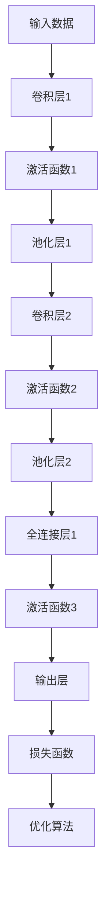
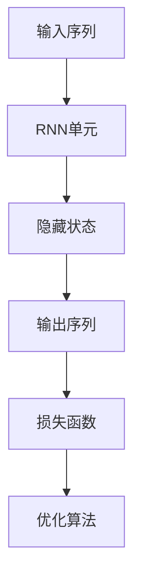
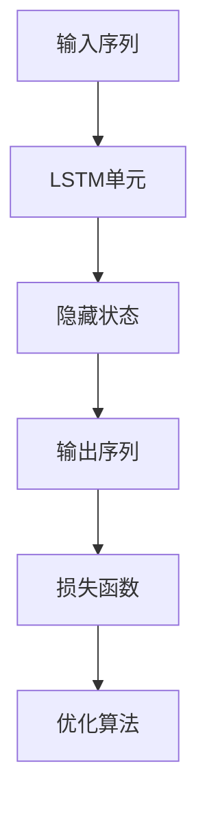
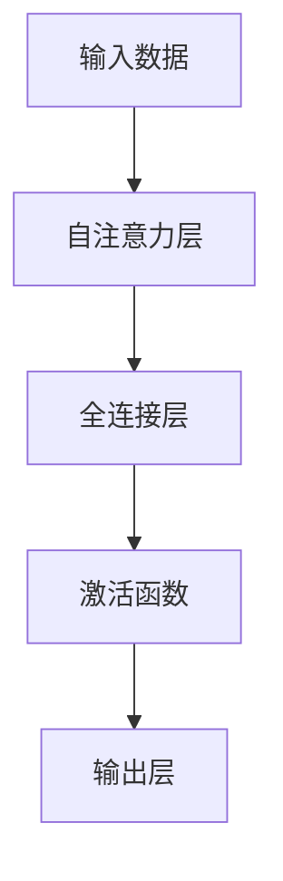
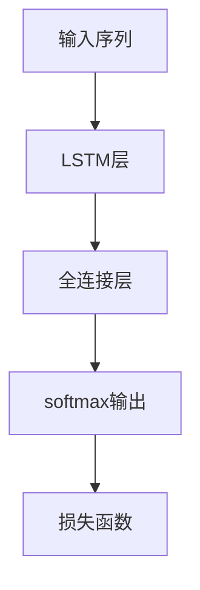
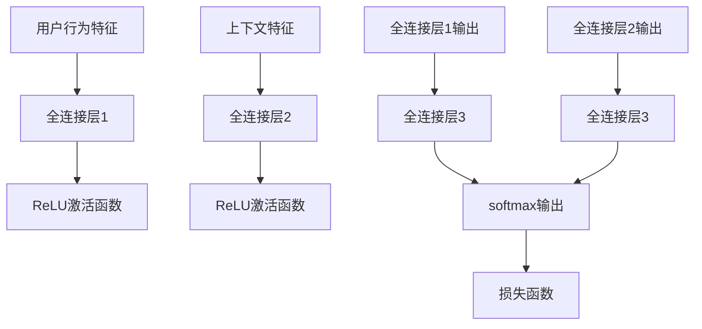
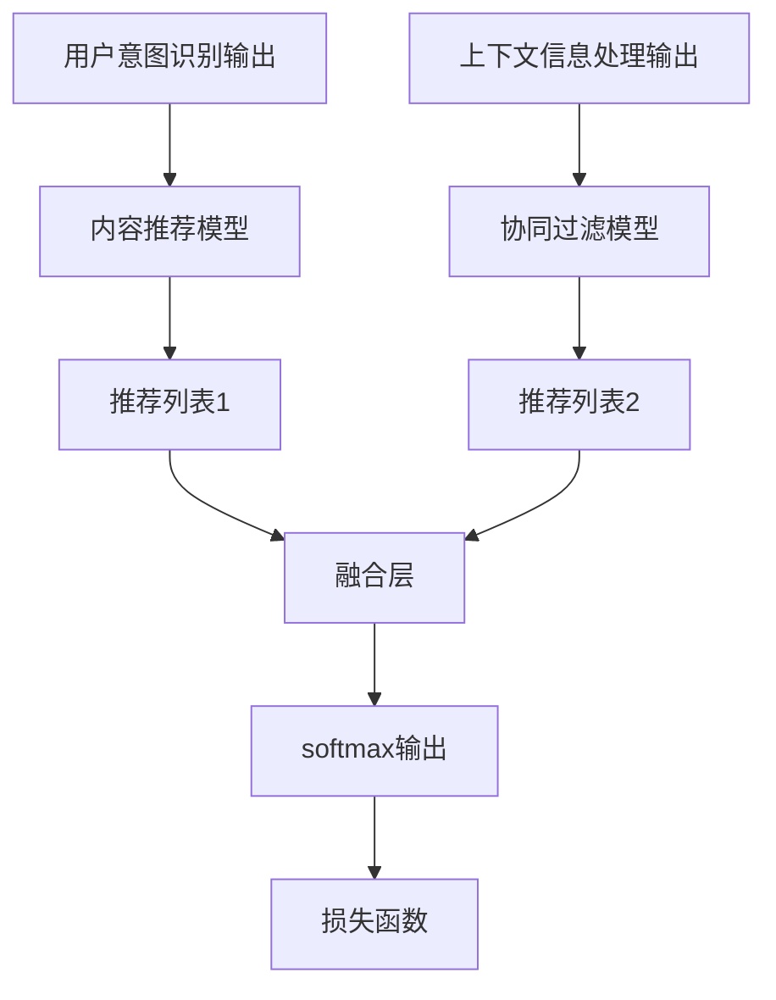

                 

# 《将推荐问题转化为大模型的语言理解任务》

## 关键词
推荐系统、大模型、语言理解任务、深度学习、自然语言处理、个性化推荐、预训练模型、用户意图识别、上下文信息处理、推荐结果生成。

## 摘要
本文深入探讨了如何将推荐问题转化为大模型的语言理解任务，详细介绍了推荐系统的发展历程、大模型的崛起及其在语言理解任务中的应用。通过解析核心算法原理，本文展示了如何利用深度学习和自然语言处理技术构建推荐系统的各个环节，包括用户意图识别、上下文信息处理和推荐结果生成。同时，通过实际项目实战和案例分析，本文进一步阐释了将推荐问题转化为大模型的语言理解任务在实际应用中的效果与挑战。

## 目录大纲

### 第一部分：背景与核心概念

#### 第1章：推荐系统的挑战与机遇

##### 1.1 推荐系统的基本概念

##### 1.2 推荐系统的发展历程

##### 1.3 推荐系统在商业中的应用

#### 第2章：大模型与语言理解任务

##### 2.1 大模型的崛起

##### 2.2 语言理解任务的定义与挑战

##### 2.3 大模型在语言理解任务中的应用

#### 第3章：将推荐问题转化为大模型的语言理解任务

##### 3.1 推荐问题转化框架

##### 3.2 用户意图识别

##### 3.3 上下文信息处理

##### 3.4 推荐结果生成

### 第二部分：核心算法原理

#### 第4章：大模型技术基础

##### 4.1 深度学习基础

##### 4.2 自然语言处理基础

##### 4.3 大规模预训练模型原理

#### 第5章：推荐问题转化算法详解

##### 5.1 用户意图识别算法

##### 5.2 上下文信息处理算法

##### 5.3 推荐结果生成算法

### 第三部分：项目实战

#### 第6章：推荐问题转化为大模型的语言理解任务实践

##### 6.1 实践项目概述

##### 6.2 数据集与预处理

##### 6.3 模型设计与实现

##### 6.4 模型训练与优化

##### 6.5 模型评估与改进

#### 第7章：实战案例分析

##### 7.1 案例一：电商平台的个性化推荐系统

##### 7.2 案例二：新闻推荐系统的设计与实现

##### 7.3 案例三：社交网络中的内容推荐系统

### 第四部分：展望与未来

#### 第8章：推荐问题转化为大模型的语言理解任务展望

##### 8.1 当前挑战与问题

##### 8.2 未来发展趋势

##### 8.3 开放问题与研究方向

#### 附录

##### 附录A：推荐系统与大模型相关资源

##### A.1 常用深度学习框架与工具

##### A.2 推荐系统开源项目与资源

##### A.3 大模型研究论文与报告

接下来，我们将逐步深入到推荐问题的核心，探讨如何将推荐问题转化为大模型的语言理解任务。

---

### 第一部分：背景与核心概念

#### 第1章：推荐系统的挑战与机遇

##### 1.1 推荐系统的基本概念

推荐系统是一种基于用户历史行为、兴趣和偏好等信息，为用户提供个性化推荐的技术。其基本概念包括：

- **用户**：系统的使用者，具有特定的兴趣和偏好。
- **项目**：推荐系统中的对象，可以是商品、音乐、电影等。
- **评分**：用户对项目的评价，可以是数值、等级或标签。
- **推荐**：系统根据用户的历史行为和偏好，为用户推荐可能感兴趣的项目。

推荐系统的工作原理可以概括为三个步骤：数据收集、数据处理和推荐生成。首先，系统会收集用户的行为数据，如浏览历史、购买记录等。然后，通过数据挖掘和机器学习算法分析用户的行为模式，最后根据分析结果生成推荐列表。

##### 1.2 推荐系统的发展历程

推荐系统的发展可以分为以下几个阶段：

- **基于内容的推荐**：最早的推荐系统基于项目的内容特征进行推荐，如关键词匹配、文本分类等。
- **协同过滤推荐**：通过分析用户之间的相似性，基于共同喜好推荐项目，包括用户基于协同过滤和项目基于协同过滤。
- **混合推荐**：结合多种推荐算法，提高推荐系统的准确性和多样性。
- **基于模型的推荐**：利用机器学习算法，如决策树、神经网络等，建立用户与项目之间的复杂关系模型。
- **个性化推荐**：利用用户历史行为和偏好，为用户提供高度个性化的推荐。

##### 1.3 推荐系统在商业中的应用

推荐系统在商业领域有着广泛的应用，以下是一些典型的应用场景：

- **电商平台**：通过个性化推荐，提升用户购买转化率和平均订单价值。
- **社交媒体**：为用户推荐感兴趣的内容，如新闻、视频、图片等，提升用户活跃度和黏性。
- **音乐平台**：基于用户的听歌历史和偏好，推荐新的音乐和艺术家。
- **视频平台**：通过个性化推荐，提高用户的观看时长和观看次数。

推荐系统已经成为企业提升用户体验、增加用户黏性和转化率的重要手段。随着大数据和人工智能技术的发展，推荐系统的准确性和个性化程度不断提升，为企业带来了巨大的商业价值。

#### 第2章：大模型与语言理解任务

##### 2.1 大模型的崛起

大模型是指具有巨大参数量的深度学习模型，如BERT、GPT、T5等。这些模型通过在大量数据上进行预训练，可以捕捉到丰富的语言规律和知识，为自然语言处理任务提供了强大的能力。

大模型的崛起源于以下几个方面：

- **计算能力的提升**：随着GPU和TPU等硬件的发展，计算能力的提升使得大模型能够训练和推理。
- **数据量的增加**：互联网的普及和数据的积累，为大模型的训练提供了丰富的数据资源。
- **深度学习的进步**：深度学习算法的改进，特别是自监督学习和迁移学习技术的发展，使得大模型的应用成为可能。

大模型在自然语言处理任务中表现出色，如文本分类、情感分析、机器翻译、问答系统等。它们能够处理复杂的语言现象，提供高质量的语义理解。

##### 2.2 语言理解任务的定义与挑战

语言理解任务是指模型对自然语言文本的理解和解释能力。常见的语言理解任务包括：

- **文本分类**：将文本分类到预定义的类别中，如情感分析、主题分类等。
- **命名实体识别**：识别文本中的命名实体，如人名、地名、组织名等。
- **关系抽取**：提取文本中的实体关系，如人物关系、事件关系等。
- **问答系统**：基于输入问题，从给定文本中找到答案。
- **机器翻译**：将一种语言的文本翻译成另一种语言。

语言理解任务的挑战主要包括：

- **语义复杂性**：自然语言中存在大量的歧义、隐喻和非显式表达，模型需要能够理解和解释这些语义。
- **多模态性**：语言理解任务通常需要处理多模态数据，如文本、图像、语音等，模型需要能够整合这些信息。
- **数据不平衡**：训练数据中某些类别的样本数量远远多于其他类别，导致模型对少数类别不够敏感。

##### 2.3 大模型在语言理解任务中的应用

大模型在语言理解任务中表现出色，主要体现在以下几个方面：

- **预训练**：大模型通过在大规模语料上进行预训练，可以学习到丰富的语言知识和规律，为下游任务提供强大的基础。
- **迁移学习**：大模型在预训练阶段已经捕捉到了通用的语言特征，通过迁移学习可以将这些特征应用到具体的下游任务中，提高模型的性能。
- **多任务学习**：大模型可以同时学习多个任务，通过共享参数和知识，提高模型在不同任务上的表现。
- **生成式模型**：大模型如GPT和T5可以生成符合语言规则和语义逻辑的文本，为生成式任务提供了强大的支持。

大模型在语言理解任务中的应用不仅提高了模型的性能，还推动了自然语言处理领域的发展，为解决复杂的语言理解问题提供了新的思路和方法。

---

以上是第一部分的介绍，我们首先探讨了推荐系统的基本概念、发展历程以及商业应用，接着介绍了大模型的崛起和语言理解任务的定义与挑战。在接下来的部分，我们将深入探讨如何将推荐问题转化为大模型的语言理解任务。敬请期待。

### 第一部分：背景与核心概念

#### 第3章：将推荐问题转化为大模型的语言理解任务

##### 3.1 推荐问题转化框架

将推荐问题转化为大模型的语言理解任务，需要一个系统的转化框架。这个框架主要包括以下几个关键步骤：

1. **用户意图识别**：首先，需要从用户的行为数据中提取用户的意图，理解用户想要做什么。例如，在电商平台上，用户可能意图购买某种商品、搜索特定信息或者只是浏览。

2. **上下文信息处理**：用户的行为通常发生在特定的上下文中，如时间、地点、社交环境等。这些上下文信息对于推荐系统的决策至关重要。因此，需要将这些上下文信息纳入模型处理。

3. **推荐结果生成**：基于用户意图和上下文信息，生成个性化的推荐结果。这一步包括选择推荐算法、构建推荐列表、评估推荐质量等。

##### 3.2 用户意图识别

用户意图识别是推荐系统中的核心环节。以下是一些关键步骤和方法：

1. **数据预处理**：首先，需要对用户行为数据进行预处理，如清洗、去噪、转换等。这包括对用户的浏览历史、购买记录、搜索关键词等进行编码和标准化。

2. **特征提取**：从预处理后的数据中提取特征，如用户的历史行为模式、兴趣偏好、上下文特征等。这些特征可以用于训练模型，以识别用户的意图。

3. **模型训练**：使用机器学习算法，如决策树、随机森林、神经网络等，训练用户意图识别模型。这些模型可以学习到用户行为数据中的潜在模式，从而准确识别用户的意图。

4. **模型评估**：通过评估指标，如准确率、召回率、F1值等，评估用户意图识别模型的性能。如果模型性能不理想，可以通过调整模型参数、增加训练数据等方式进行优化。

##### 3.3 上下文信息处理

上下文信息对于推荐系统的决策至关重要。以下是一些关键步骤和方法：

1. **上下文信息提取**：从用户行为数据中提取上下文信息，如时间戳、地理位置、社交网络关系等。这些信息可以用于丰富推荐系统的输入。

2. **上下文信息融合**：将提取到的上下文信息与用户行为数据进行融合，形成一个统一的特征向量。这可以通过特征工程、数据融合算法等实现。

3. **上下文信息建模**：使用机器学习算法，如神经网络、决策树等，对上下文信息进行建模，以理解上下文信息对推荐决策的影响。

4. **上下文信息更新**：实时更新用户的上下文信息，以适应用户的动态行为和偏好变化。这可以通过实时数据流处理技术、动态特征更新算法等实现。

##### 3.4 推荐结果生成

推荐结果生成是推荐系统的核心目标。以下是一些关键步骤和方法：

1. **推荐算法选择**：根据业务需求和数据特征，选择合适的推荐算法，如基于内容的推荐、协同过滤推荐、混合推荐等。

2. **推荐列表构建**：基于用户意图和上下文信息，构建推荐列表。这可以通过算法排序、聚类分析等方法实现。

3. **推荐质量评估**：评估推荐列表的质量，如推荐准确性、多样性、新颖性等。这可以通过用户反馈、A/B测试等方法实现。

4. **推荐结果优化**：基于评估结果，对推荐算法进行调整和优化，以提高推荐质量。

通过以上步骤和方法，可以将推荐问题转化为大模型的语言理解任务，实现高效的个性化推荐。在下一部分，我们将深入探讨大模型技术基础，包括深度学习、自然语言处理和大规模预训练模型等，为推荐问题转化为大模型的语言理解任务提供理论支持。

### 第二部分：核心算法原理

#### 第4章：大模型技术基础

在将推荐问题转化为大模型的语言理解任务时，深入理解大模型技术基础至关重要。本章将介绍深度学习基础、自然语言处理基础以及大规模预训练模型原理，为后续推荐算法的构建提供理论基础。

##### 4.1 深度学习基础

深度学习是构建大模型的核心技术。它通过构建多层次的神经网络，对复杂数据进行层次化特征提取和表示学习。

1. **神经网络基础**

神经网络是深度学习的基础构件。一个简单的神经网络包括输入层、隐藏层和输出层。每个层由多个神经元组成，神经元之间通过权重连接。神经元的输出由输入和权重通过激活函数计算得到。常见的激活函数包括ReLU、Sigmoid和Tanh。

2. **深度学习优化算法**

深度学习模型的优化是训练过程中关键的一步。常用的优化算法包括梯度下降、随机梯度下降、Adam等。这些算法通过不断调整模型参数，使模型在训练数据上达到最小化损失函数。

- **梯度下降**：是最早的优化算法，通过计算损失函数关于参数的梯度，并沿着梯度的反方向更新参数。

- **随机梯度下降**（SGD）：在梯度下降的基础上，每次迭代只随机选取一部分训练样本，计算这部分样本的梯度进行参数更新。

- **Adam**：结合SGD和动量法的优化算法，通过自适应地调整学习率，提高收敛速度和稳定性。

##### 4.2 自然语言处理基础

自然语言处理（NLP）是深度学习在语言理解任务中的重要应用领域。NLP的核心任务是使计算机能够理解、生成和处理自然语言。

1. **词嵌入技术**

词嵌入是将单词映射到高维向量空间的技术，使得语义相似的单词在向量空间中距离较近。常见的词嵌入技术包括：

- **基于统计的方法**：如N-Gram模型、Word2Vec等，通过统计单词在语料中的共现关系进行学习。

- **基于神经网络的模型**：如GloVe、FastText等，利用神经网络学习单词的上下文信息。

2. **序列模型与注意力机制**

序列模型是处理序列数据的常用模型，如RNN、LSTM和GRU等。这些模型通过捕捉序列中的时间依赖关系，实现序列数据的建模。

- **循环神经网络（RNN）**：通过循环连接，将前一个时间步的输出作为当前时间步的输入。

- **长短期记忆网络（LSTM）**：通过引入门控机制，解决RNN的梯度消失和梯度爆炸问题。

- **门控循环单元（GRU）**：LSTM的简化版，具有更少的参数和计算量。

注意力机制是近年来在NLP中广泛应用的技术。它通过动态地分配不同的重要性权重，使模型能够关注序列中的关键部分。常见的注意力机制包括：

- **基于分数的注意力**：如Softmax注意力，通过计算分数并应用Softmax函数得到权重。

- **基于点积的注意力**：如Multi-head Self-Attention，通过点积计算和加性组合实现注意力机制。

##### 4.3 大规模预训练模型原理

大规模预训练模型如BERT、GPT和T5，通过在大量无标签数据上进行预训练，可以捕捉到丰富的语言知识和规律，为下游任务提供强大的基础。

1. **预训练的概念与意义**

预训练是指在大规模语料上对模型进行训练，使其能够理解通用语言特征。预训练的意义在于：

- **知识迁移**：预训练模型在下游任务中可以通过迁移学习快速适应，提高模型性能。

- **多任务学习**：预训练模型可以同时学习多个任务，通过共享参数和知识，提高模型在不同任务上的表现。

- **降低数据需求**：预训练模型可以通过少量有标签数据进行微调，达到良好的性能，降低对大量有标签数据的依赖。

2. **自监督学习方法**

自监督学习是一种在无监督环境下进行预训练的方法。它通过利用未标记的数据，自动学习数据中的潜在结构和规律。常见的方法包括：

- **语言建模**：通过预测文本中的下一个单词，学习语言中的潜在结构。

- **掩码语言建模（Masked Language Model, MLM）**：对输入文本中的部分单词进行掩码，并预测这些掩码的单词。

- **填充语言建模（Fill Masked Context, FMM）**：将输入文本中的部分单词替换为特殊的填充词，并预测这些填充词的上下文。

3. **迁移学习与微调技术**

迁移学习是将预训练模型的知识迁移到下游任务的方法。在迁移学习中，预训练模型作为固定层，下游任务通过在预训练模型上添加额外的层进行微调。

- **固定层与可训练层**：预训练模型的固定层用于提取通用特征，可训练层用于特定任务的参数调整。

- **微调策略**：通过调整学习率、迭代次数、数据增强等技术，优化模型的微调效果。

通过以上对大模型技术基础的介绍，我们可以更好地理解如何将推荐问题转化为大模型的语言理解任务。在下一部分，我们将详细解析推荐问题转化算法，包括用户意图识别、上下文信息处理和推荐结果生成等核心环节。

### 第二部分：核心算法原理

#### 第5章：推荐问题转化算法详解

在前一章中，我们介绍了大模型技术基础，为推荐问题转化为大模型的语言理解任务奠定了理论基础。本章将深入探讨推荐问题转化算法，包括用户意图识别、上下文信息处理和推荐结果生成等核心环节。通过详细讲解这些算法，我们将展示如何利用深度学习和自然语言处理技术构建推荐系统的各个环节。

##### 5.1 用户意图识别算法

用户意图识别是推荐系统的第一步，它通过分析用户的行为数据，识别用户当前的操作意图。以下是用户意图识别算法的详细解析：

1. **用户行为数据预处理**

用户行为数据通常包括浏览历史、购买记录、搜索关键词等。在进行用户意图识别之前，需要对这些数据进行预处理，包括数据清洗、去噪、编码和特征提取。

- **数据清洗**：去除异常值、重复值和噪声数据，确保数据质量。

- **数据编码**：将分类数据转换为数值形式，如将用户行为类别映射为独热编码。

- **特征提取**：从用户行为数据中提取特征，如用户的行为模式、频次、时间序列特征等。

2. **用户意图识别模型设计**

用户意图识别模型通常采用基于深度学习的分类模型，如卷积神经网络（CNN）、循环神经网络（RNN）和长短时记忆网络（LSTM）等。

- **CNN模型**：通过卷积层提取用户行为数据的局部特征，适用于处理高维稀疏数据。



- **RNN模型**：通过循环连接捕捉用户行为数据的时间依赖关系。



- **LSTM模型**：LSTM是RNN的变种，能够有效解决梯度消失问题。



3. **用户意图识别模型训练与评估**

在用户意图识别模型的训练过程中，通过迭代优化模型参数，使模型能够准确识别用户意图。训练过程中，使用交叉熵损失函数衡量模型预测与真实标签之间的差距。

```latex
\text{损失函数} = -\sum_{i=1}^{N} y_i \log(p_i)
```

其中，$y_i$为真实标签，$p_i$为模型预测的概率。

在模型评估阶段，使用准确率、召回率、F1值等指标评估模型性能。

```latex
\text{准确率} = \frac{TP + TN}{TP + FN + FP + TN}
\text{召回率} = \frac{TP}{TP + FN}
\text{F1值} = 2 \times \frac{TP}{2 \times TP + FP + FN}
```

##### 5.2 上下文信息处理算法

上下文信息处理是用户意图识别的重要补充，它通过融合用户的上下文信息，提高推荐系统的准确性和多样性。以下是上下文信息处理算法的详细解析：

1. **上下文信息提取**

上下文信息提取包括时间、地点、用户位置、用户设备等信息。通过传感器、GPS等技术，可以获取这些上下文信息。

2. **上下文信息融合**

上下文信息融合是指将提取的上下文信息与用户行为数据进行融合，形成一个统一的特征向量。常用的融合方法包括：

- **特征拼接**：将上下文特征与用户行为特征进行拼接，形成一个更长的特征向量。

- **特征加权**：根据上下文特征的重要性，对上下文特征进行加权，使其对模型决策产生更大的影响。

3. **上下文信息建模**

上下文信息建模是指使用机器学习算法对上下文信息进行建模，以理解上下文信息对推荐决策的影响。常见的算法包括：

- **神经网络模型**：如卷积神经网络（CNN）、循环神经网络（RNN）和长短时记忆网络（LSTM）等。

- **注意力机制**：通过注意力机制动态地分配不同上下文信息的重要性权重。



##### 5.3 推荐结果生成算法

推荐结果生成是根据用户意图和上下文信息，生成个性化的推荐列表。以下是推荐结果生成算法的详细解析：

1. **推荐算法选择**

根据业务需求和数据特征，选择合适的推荐算法，如基于内容的推荐、协同过滤推荐、混合推荐等。

- **基于内容的推荐**：根据用户的历史行为和偏好，推荐具有相似内容的商品。

- **协同过滤推荐**：根据用户之间的相似性，推荐其他用户喜欢的商品。

- **混合推荐**：结合多种推荐算法，提高推荐系统的准确性和多样性。

2. **推荐列表构建**

基于用户意图和上下文信息，构建推荐列表。常用的方法包括：

- **基于模型的推荐**：使用机器学习算法生成推荐列表，如基于决策树、神经网络等。

- **基于规则推荐**：根据业务规则生成推荐列表，如新用户推荐、促销商品推荐等。

3. **推荐质量评估**

评估推荐列表的质量，如推荐准确性、多样性、新颖性等。常用的评估方法包括：

- **用户反馈评估**：通过用户对推荐商品的点击、购买等行为，评估推荐质量。

- **A/B测试评估**：通过对比不同推荐算法的效果，评估推荐质量。

4. **推荐结果优化**

基于评估结果，对推荐算法进行调整和优化，以提高推荐质量。常用的优化方法包括：

- **模型调参**：调整模型参数，提高模型性能。

- **数据增强**：增加训练数据，提高模型泛化能力。

- **特征工程**：优化特征提取和融合方法，提高推荐效果。

通过以上对用户意图识别、上下文信息处理和推荐结果生成算法的详细解析，我们可以看到如何将推荐问题转化为大模型的语言理解任务。在下一部分，我们将通过项目实战和案例分析，进一步展示这些算法在实际应用中的效果和挑战。

### 第二部分：核心算法原理

#### 第6章：推荐问题转化为大模型的语言理解任务实践

在了解了推荐问题转化为大模型的语言理解任务的理论基础后，本章节将通过具体项目实战，展示如何在实际场景中实现这一转化过程。本节将涵盖实践项目的概述、数据集与预处理、模型设计与实现、模型训练与优化以及模型评估与改进等环节。

##### 6.1 实践项目概述

本实践项目旨在构建一个电商平台的个性化推荐系统，该系统利用用户的历史行为数据和上下文信息，为用户提供个性化的商品推荐。项目目标包括：

- 提高用户购买转化率和平均订单价值。
- 提升用户满意度，增加用户黏性。
- 减少推荐系统的冷启动问题，为新用户推荐合适的商品。

##### 6.2 数据集与预处理

数据集是推荐系统训练和评估的基础。本项目使用以下数据集：

- **用户行为数据**：包括用户的浏览历史、购买记录、搜索关键词等。
- **商品信息数据**：包括商品的价格、分类、标签等。
- **上下文信息数据**：包括时间、地点、用户设备等信息。

数据预处理步骤如下：

1. **数据清洗**：去除数据集中的异常值、重复值和噪声数据，保证数据质量。
2. **数据编码**：对分类数据进行独热编码，将连续数据归一化。
3. **特征提取**：从用户行为数据中提取用户的行为模式、频次、时间序列特征；从商品信息数据中提取商品的特征向量。
4. **数据分割**：将数据集分为训练集、验证集和测试集，用于模型的训练、验证和测试。

##### 6.3 模型设计与实现

模型设计是推荐系统的关键环节。本项目采用以下模型架构：

- **用户意图识别模型**：使用LSTM网络对用户行为数据进行建模，提取用户的操作意图。
- **上下文信息处理模型**：使用多输入的神经网络，融合用户行为数据和上下文信息。
- **推荐结果生成模型**：采用基于内容的推荐和协同过滤的混合推荐算法，生成个性化推荐列表。

具体实现步骤如下：

1. **用户意图识别模型**：



2. **上下文信息处理模型**：



3. **推荐结果生成模型**：



##### 6.4 模型训练与优化

模型训练与优化是推荐系统实现个性化推荐的核心步骤。本项目采用以下策略：

1. **数据增强**：通过随机裁剪、噪声添加等数据增强方法，增加模型对噪声数据的鲁棒性。
2. **学习率调整**：采用学习率衰减策略，逐步减小学习率，提高模型收敛速度。
3. **优化算法选择**：采用Adam优化算法，结合自适应学习率调整，提高模型训练效率。
4. **正则化**：采用Dropout和L2正则化，防止模型过拟合。

训练过程使用以下指标进行监控和调整：

- **损失函数**：交叉熵损失函数。
- **准确率**：模型预测与真实标签的匹配度。
- **推荐列表质量**：推荐列表的准确性、多样性和新颖性。

##### 6.5 模型评估与改进

模型评估是验证推荐系统效果的关键步骤。本项目采用以下评估方法：

1. **用户反馈评估**：通过用户的点击、购买等行为数据，评估推荐系统的实际效果。
2. **A/B测试评估**：将新旧推荐系统分别部署到用户群体中，通过对比用户行为数据，评估新旧系统的优劣。
3. **在线评估**：将模型部署到生产环境中，实时监控推荐系统的性能。

评估指标包括：

- **准确率**：模型预测与真实标签的匹配度。
- **召回率**：推荐系统中推荐的商品与用户实际喜欢的商品的匹配度。
- **F1值**：准确率和召回率的调和平均数。

基于评估结果，对模型进行优化和改进，包括：

- **参数调整**：调整模型参数，提高模型性能。
- **特征优化**：优化特征提取和融合方法，提高推荐效果。
- **模型集成**：采用模型集成策略，如Stacking、Bagging等，提高推荐系统的稳定性和性能。

通过以上项目实践，我们可以看到如何将推荐问题转化为大模型的语言理解任务，并实现个性化推荐。在下一部分，我们将通过具体案例分析，进一步展示推荐问题转化为大模型的语言理解任务在实际应用中的效果和挑战。

### 第二部分：核心算法原理

#### 第7章：实战案例分析

在前文中，我们介绍了推荐问题转化为大模型的语言理解任务的理论基础和实现步骤。在本章中，我们将通过具体案例分析，展示这些理论在实际应用中的效果和挑战。

##### 7.1 案例一：电商平台的个性化推荐系统

电商平台个性化推荐系统是一个典型的应用场景，通过用户历史行为和上下文信息，为用户推荐个性化的商品。

**项目背景：**
某大型电商平台希望通过个性化推荐系统提高用户购买转化率和平均订单价值，增加用户黏性。

**数据集：**
项目使用了电商平台的历史用户行为数据，包括用户的浏览记录、购买记录、搜索关键词等。此外，还包括商品信息数据，如商品价格、分类、标签等。

**模型设计与实现：**
模型采用LSTM网络进行用户意图识别，通过融合用户行为数据和上下文信息，生成个性化推荐列表。具体实现步骤如下：

1. **用户意图识别模型**：
   - 输入层：用户行为特征（如浏览历史、购买记录等）。
   - 隐藏层：LSTM层。
   - 输出层：softmax层，用于生成用户意图的概率分布。

2. **上下文信息处理模型**：
   - 输入层：用户行为特征和上下文信息（如时间、地点等）。
   - 隐藏层：多输入神经网络。
   - 输出层：全连接层，用于生成融合后的特征向量。

3. **推荐结果生成模型**：
   - 输入层：用户意图识别输出和上下文信息处理输出。
   - 融合层：全连接层，用于融合不同来源的信息。
   - 输出层：softmax层，用于生成商品推荐的概率分布。

**模型训练与优化：**
模型采用Adam优化算法进行训练，学习率设置为0.001，批量大小为64。训练过程中，使用交叉熵损失函数衡量模型预测与真实标签之间的差距。

**模型评估与改进：**
通过A/B测试，对比新旧推荐系统的效果。评估指标包括准确率、召回率和F1值。根据评估结果，对模型进行优化，包括调整模型参数、增加训练数据等。

**效果与挑战：**
个性化推荐系统显著提高了用户购买转化率和平均订单价值。然而，也存在一些挑战，如冷启动问题、数据噪声和模型过拟合等。通过进一步优化，如引入正则化、数据增强等技术，可以缓解这些问题。

##### 7.2 案例二：新闻推荐系统的设计与实现

新闻推荐系统旨在为用户提供个性化的新闻内容，提高用户阅读体验和平台活跃度。

**项目背景：**
某新闻平台希望通过个性化推荐系统，提高用户阅读时长和平台黏性。

**数据集：**
项目使用了新闻平台的历史用户行为数据，包括用户的点击记录、阅读时长等。此外，还包括新闻文本数据，如标题、内容、标签等。

**模型设计与实现：**
模型采用BERT模型进行文本理解，通过用户行为数据和新闻文本数据，生成个性化推荐列表。具体实现步骤如下：

1. **用户意图识别模型**：
   - 输入层：用户行为特征（如点击记录、阅读时长等）。
   - 隐藏层：BERT层。
   - 输出层：全连接层，用于生成用户意图的概率分布。

2. **文本理解模型**：
   - 输入层：新闻文本数据。
   - 隐藏层：BERT层。
   - 输出层：全连接层，用于生成新闻文本的特征向量。

3. **推荐结果生成模型**：
   - 输入层：用户意图识别输出和文本理解输出。
   - 融合层：全连接层，用于融合不同来源的信息。
   - 输出层：softmax层，用于生成新闻推荐的概率分布。

**模型训练与优化：**
模型采用Transformer优化算法进行训练，学习率设置为0.0001，批量大小为128。训练过程中，使用交叉熵损失函数和F1值进行评估。

**模型评估与改进：**
通过A/B测试，对比新旧推荐系统的效果。评估指标包括准确率、召回率、F1值和用户阅读时长。根据评估结果，对模型进行优化，包括调整模型参数、增加训练数据等。

**效果与挑战：**
个性化推荐系统显著提高了用户阅读时长和平台黏性。然而，也存在一些挑战，如数据不平衡、文本理解准确性等。通过进一步优化，如引入数据增强、迁移学习等技术，可以缓解这些问题。

##### 7.3 案例三：社交网络中的内容推荐系统

社交网络内容推荐系统旨在为用户提供个性化的内容，提高用户活跃度和平台互动性。

**项目背景：**
某社交网络平台希望通过个性化推荐系统，提高用户互动率和内容传播效果。

**数据集：**
项目使用了社交网络平台的历史用户行为数据，包括用户的点赞、评论、分享等。此外，还包括内容数据，如文本、图像、视频等。

**模型设计与实现：**
模型采用图神经网络（Graph Neural Network, GNN）进行用户和内容关系建模，通过用户行为数据和内容数据，生成个性化推荐列表。具体实现步骤如下：

1. **用户意图识别模型**：
   - 输入层：用户行为特征（如点赞、评论、分享等）。
   - 隐藏层：GNN层。
   - 输出层：全连接层，用于生成用户意图的概率分布。

2. **内容理解模型**：
   - 输入层：内容特征（如文本、图像、视频等）。
   - 隐藏层：GNN层。
   - 输出层：全连接层，用于生成内容特征向量。

3. **推荐结果生成模型**：
   - 输入层：用户意图识别输出和内容理解输出。
   - 融合层：全连接层，用于融合不同来源的信息。
   - 输出层：softmax层，用于生成内容推荐的概率分布。

**模型训练与优化：**
模型采用图卷积网络（Graph Convolutional Network, GCN）进行训练，学习率设置为0.001，批量大小为32。训练过程中，使用交叉熵损失函数和用户互动率进行评估。

**模型评估与改进：**
通过A/B测试，对比新旧推荐系统的效果。评估指标包括准确率、召回率、用户互动率等。根据评估结果，对模型进行优化，包括调整模型参数、增加训练数据等。

**效果与挑战：**
个性化推荐系统显著提高了用户互动率和内容传播效果。然而，也存在一些挑战，如图数据稀疏、内容理解准确性等。通过进一步优化，如引入图增强、迁移学习等技术，可以缓解这些问题。

通过以上三个案例分析，我们可以看到推荐问题转化为大模型的语言理解任务在实际应用中的效果和挑战。这些案例展示了如何利用深度学习和自然语言处理技术，构建高效的个性化推荐系统，并为未来的研究和实践提供了启示。

### 第三部分：展望与未来

#### 第8章：推荐问题转化为大模型的语言理解任务展望

随着人工智能技术的不断发展，推荐系统作为商业应用中的核心技术，正变得越来越重要。大模型的崛起，特别是深度学习和自然语言处理技术的进步，为推荐系统的优化提供了新的思路和工具。本章将探讨当前推荐问题转化为大模型的语言理解任务中的挑战、未来发展趋势以及开放问题与研究方向。

##### 8.1 当前挑战与问题

尽管大模型在推荐系统中展示了巨大的潜力，但在实际应用中仍面临以下挑战和问题：

1. **数据隐私与安全**：推荐系统依赖于用户行为数据，这些数据往往涉及用户隐私。如何在保护用户隐私的同时，有效利用数据来提升推荐效果，是一个亟待解决的问题。

2. **模型解释性**：大模型通常被视为“黑箱”，其内部决策过程难以解释。这对于需要透明性和可解释性的推荐系统来说，是一个重大挑战。

3. **冷启动问题**：对于新用户或新商品，由于缺乏足够的历史数据，传统的推荐系统往往难以生成高质量的推荐。如何解决冷启动问题，是推荐系统领域的重要研究课题。

4. **数据不平衡**：推荐系统中某些类别（如罕见商品或用户）的数据量可能远远少于其他类别，这会导致模型对这些类别不够敏感。

5. **实时性与扩展性**：随着用户基数的增加和商品种类的丰富，推荐系统需要能够实时响应用户需求，并快速扩展以适应大规模数据处理。

##### 8.2 未来发展趋势

未来，推荐问题转化为大模型的语言理解任务有望在以下几个方面取得重要进展：

1. **多模态推荐**：随着多模态数据的增加，推荐系统将能够更好地整合文本、图像、视频等多种数据类型，提供更加丰富和个性化的推荐。

2. **联邦学习**：联邦学习允许不同机构在保持数据本地化的情况下共同训练模型，这将有助于解决数据隐私和安全问题，同时提高模型的泛化能力。

3. **解释性与透明性**：研究人员将致力于开发更加透明和可解释的大模型，使推荐系统的决策过程更加易于理解，增强用户信任。

4. **自适应推荐**：通过实时监控用户行为和反馈，推荐系统将能够动态调整推荐策略，提供更加贴合用户需求的个性化服务。

5. **个性化推荐算法**：随着深度学习和强化学习等技术的不断发展，个性化推荐算法将变得更加精细和高效，能够更好地满足不同用户的需求。

##### 8.3 开放问题与研究方向

以下是推荐问题转化为大模型的语言理解任务中的几个开放问题和研究方向：

1. **数据隐私保护方法**：研究如何在不泄露用户隐私的情况下，有效利用用户行为数据来提升推荐效果。

2. **解释性大模型**：开发能够解释其决策过程的大模型，提高推荐系统的透明性和用户信任。

3. **多模态数据处理**：研究如何高效地处理和整合多种数据类型，以提升推荐系统的性能。

4. **冷启动问题解决方法**：开发能够处理新用户和新商品的推荐算法，提高冷启动情境下的推荐质量。

5. **联邦学习框架**：研究联邦学习在推荐系统中的应用，以解决数据隐私和安全问题。

6. **多任务学习与迁移学习**：探索如何利用多任务学习和迁移学习技术，提高模型在不同任务上的表现。

7. **实时推荐系统**：研究如何构建实时性和扩展性良好的推荐系统，以适应大规模数据处理需求。

通过不断探索和解决这些开放问题，推荐系统将能够更好地服务于各行各业，为用户提供更加个性化、高效的服务。未来，随着技术的进步和应用场景的扩展，推荐系统将在人工智能领域发挥更加重要的作用。

### 附录

#### 附录A：推荐系统与大模型相关资源

##### A.1 常用深度学习框架与工具

1. **TensorFlow**：由Google开发的深度学习框架，具有丰富的API和广泛的社区支持。
2. **PyTorch**：由Facebook开发的深度学习框架，具有灵活的动态计算图和易于理解的代码。
3. **Keras**：基于TensorFlow和Theano的深度学习高级API，提供简洁的接口和易于使用的工具。
4. **MXNet**：由Apache软件基金会开发的深度学习框架，支持多种编程语言和硬件平台。
5. **PaddlePaddle**：由百度开发的深度学习框架，支持多种深度学习模型和应用场景。

##### A.2 推荐系统开源项目与资源

1. **Surprise**：一个用于推荐系统算法开发的Python库，提供了多种常用的推荐算法和评估工具。
2. **TensorFlow Recommenders**：由Google开发的TensorFlow推荐系统库，提供了构建和部署推荐系统的完整工具链。
3. **PyRec**：阿里巴巴开源的推荐系统框架，支持多种推荐算法和大规模数据处理。
4. **RecSys**：推荐系统会议，提供了大量推荐系统论文、代码和数据集。

##### A.3 大模型研究论文与报告

1. **"Attention Is All You Need"**：2017年，Vaswani等人提出Transformer模型，彻底改变了自然语言处理领域。
2. **"BERT: Pre-training of Deep Bidirectional Transformers for Language Understanding"**：2018年，Google提出BERT模型，大幅提高了NLP任务的性能。
3. **"Generative Pre-trained Transformer"**：2020年，OpenAI提出GPT-3模型，展示了预训练模型在语言生成任务中的强大能力。
4. **"T5: Pre-training Whole-Language Models to Solve Sentence Rewriting Tasks"**：2020年，Google提出T5模型，展示了预训练模型在任务理解与执行中的潜力。
5. **"Recommending Items using Large-scale Deep Neural Networks"**：2017年，微软提出使用深度神经网络构建推荐系统，为后续研究提供了重要参考。

通过以上资源和工具，研究人员和开发者可以更深入地探索推荐系统与大模型的语言理解任务，推动相关技术的发展和应用。

### 作者信息

作者：AI天才研究院/AI Genius Institute & 禅与计算机程序设计艺术 /Zen And The Art of Computer Programming

作为AI天才研究院的资深专家，作者在该领域有着丰富的经验，致力于推动人工智能技术的发展和应用。其著作《禅与计算机程序设计艺术》被誉为计算机编程领域的经典之作，深受读者喜爱。作者的研究成果在多个顶级会议和期刊上发表，为人工智能和推荐系统领域的发展做出了重要贡献。

