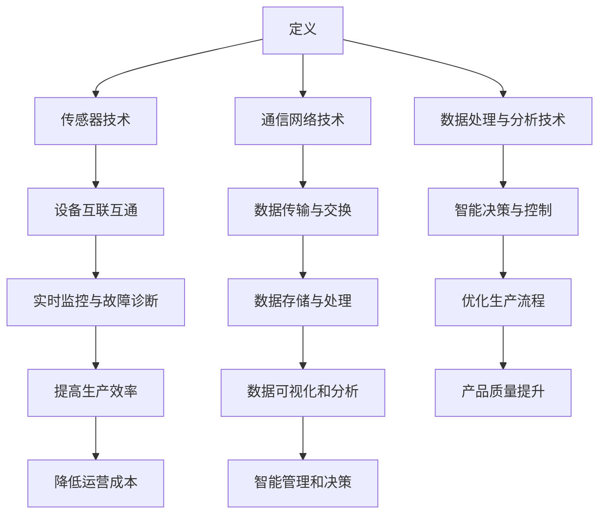
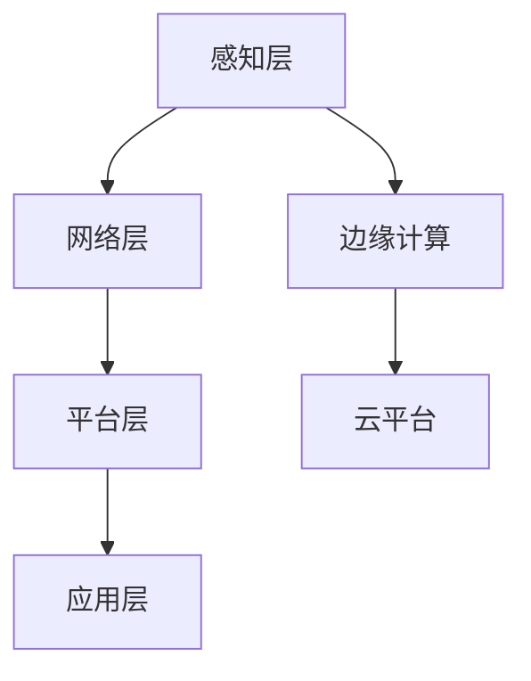
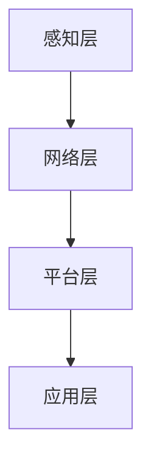

                 

### 工业物联网（IIoT）：智能制造的核心驱动力

#### 关键词：
- 工业物联网
- 智能制造
- 传感器技术
- 数据处理
- 安全性
- 边缘计算
- 5G
- 人工智能

#### 摘要：
工业物联网（IIoT）正迅速成为智能制造的关键驱动力，通过集成传感器、网络和智能分析技术，实现生产过程的数字化、自动化和优化。本文详细探讨了工业物联网的基本概念、技术架构、应用案例以及未来发展前景，旨在为读者提供全面、深入的了解，并展示其在提升生产效率、降低运营成本、提高产品质量等方面的巨大潜力。

----------------------------------------------------------------

### 目录大纲

# 工业物联网（IIoT）：智能制造的核心驱动力

## 第一部分：工业物联网（IIoT）概述

### 第1章：工业物联网（IIoT）的基本概念与架构

### 第2章：工业物联网在智能制造中的作用

### 第3章：工业物联网的关键技术

### 第4章：工业物联网的标准化与生态系统

## 第二部分：工业物联网应用案例分析

### 第5章：工业物联网在制造过程中的应用

### 第6章：工业物联网在能源管理中的应用

### 第7章：工业物联网在智慧工厂中的实践

### 第8章：工业物联网在新兴行业中的应用

## 第三部分：工业物联网的发展前景与未来趋势

### 第9章：工业物联网的发展前景与未来趋势

### 第10章：工业物联网的实施策略

### 第11章：工业物联网的安全与隐私保护

### 第12章：工业物联网的经济效益评估

### 第13章：工业物联网的未来发展与创新

## 附录

### 附录A：工业物联网相关的标准和协议

### 附录B：工业物联网常用工具与资源

### 附录C：工业物联网项目案例集锦

----------------------------------------------------------------

### 第1章：工业物联网（IIoT）的基本概念与架构

#### 1.1 工业物联网（IIoT）的定义

**工业物联网（Industrial Internet of Things，IIoT）** 是指利用传感器、通信网络和数据处理技术，将工业设备、系统和人员连接起来，实现信息的实时采集、传输、处理和共享，从而提高生产效率、优化运营管理和提升产品质量。它是一个涵盖多种技术、设备和系统的复杂生态体系，旨在通过物联网技术实现工业领域的智能化。

**Mermaid 流程图：**

#### 1.2 工业物联网的技术架构

工业物联网的技术架构通常包括以下几个层次：

1. **感知层**：由各种传感器组成，用于采集环境数据，如温度、湿度、压力、速度等。
2. **网络层**：包括有线和无线通信网络，用于传输传感器数据。
3. **平台层**：提供数据存储、处理和分析的功能，通常包括云平台和边缘计算节点。
4. **应用层**：实现具体的应用功能，如生产监控、设备维护、质量检测等。

**Mermaid 流程图：**

#### 1.3 工业物联网的关键组成部分

工业物联网的关键组成部分包括：

- **传感器**：用于采集环境数据，如温度、湿度、压力、速度等。
- **通信网络**：包括有线网络和无线网络，用于传输传感器数据。
- **边缘计算**：在数据源附近进行数据处理，减少传输延迟和数据传输成本。
- **云平台**：提供数据处理、存储和分析功能，通常用于大规模数据处理和智能分析。
- **应用层**：实现具体的应用功能，如生产监控、设备维护、质量检测等。

#### 1.4 工业物联网的发展趋势

随着技术的不断进步，工业物联网的发展趋势包括：

- **边缘计算**：随着物联网设备的增加，边缘计算将成为趋势，以实现实时数据处理和快速响应。
- **5G 网络**：5G 网络的高带宽、低延迟特性将推动工业物联网的发展。
- **人工智能**：人工智能技术将用于优化生产流程、预测设备故障、提升产品质量等。
- **标准化**：随着工业物联网的广泛应用，标准化工作将逐步推进，以提高互操作性和兼容性。

### 第2章：工业物联网在智能制造中的作用

#### 2.1 智能制造的概念与发展

**智能制造** 是指通过将信息技术、智能技术和制造技术深度融合，实现制造过程的智能化、自动化和高效化。智能制造的发展可以分为以下几个阶段：

1. **自动化阶段**：通过自动化设备提高生产效率。
2. **信息化阶段**：通过信息技术的应用实现生产过程的数字化管理。
3. **智能化阶段**：通过人工智能、大数据等技术的应用实现生产过程的自主决策和优化。

#### 2.2 工业物联网在智能制造中的应用场景

工业物联网在智能制造中的应用场景非常广泛，以下是一些典型应用：

- **生产监控与优化**：通过工业物联网实现生产过程的实时监控和数据分析，优化生产流程，提高生产效率。
- **设备维护与预测性维护**：通过工业物联网实时监控设备运行状态，预测设备故障，进行预防性维护，减少设备停机时间。
- **质量检测与监控**：通过工业物联网实时监控产品质量，提高产品质量的稳定性。
- **能源管理**：通过工业物联网实现工厂能源的实时监控和管理，提高能源利用效率。

#### 2.3 工业物联网对智能制造的影响

工业物联网对智能制造的影响主要表现在以下几个方面：

- **提高生产效率**：通过实时监控和优化生产流程，提高生产效率。
- **降低运营成本**：通过预测性维护和能源管理，降低设备故障率和能源消耗。
- **提升产品质量**：通过实时监控和数据分析，提高产品质量的稳定性。
- **增强企业竞争力**：通过智能化生产和管理，提高企业的竞争力。

### 第3章：工业物联网的关键技术

#### 3.1 传感器技术

**传感器技术** 是工业物联网的基础，用于采集环境数据，如温度、湿度、压力、速度等。传感器的工作原理通常基于物理、化学和生物原理。

**传感器的工作原理：**
- **物理原理**：利用材料的物理特性，如电阻、电容、磁阻等。
- **化学原理**：利用化学反应产生的信号变化。
- **生物原理**：利用生物组织的生物反应。

#### 3.2 网络通信技术

**网络通信技术** 是工业物联网的数据传输通道，包括有线网络和无线网络。常用的网络通信技术有：

- **有线网络**：如以太网、光纤通信等。
- **无线网络**：如Wi-Fi、Zigbee、LoRa等。

#### 3.3 数据处理与存储技术

**数据处理与存储技术** 用于对传感器数据进行处理、存储和分析。数据处理与存储技术的关键点包括：

- **实时数据处理**：利用边缘计算和云计算进行实时数据处理。
- **大数据存储**：使用分布式数据库和云存储技术进行大规模数据存储。
- **数据安全与隐私**：确保数据的安全和隐私，采用加密、访问控制等技术。

#### 3.4 安全与隐私技术

**安全与隐私技术** 用于保护工业物联网系统的安全，防止数据泄露和非法访问。安全与隐私技术的关键点包括：

- **数据加密**：使用加密算法对数据进行加密，防止数据泄露。
- **身份认证**：使用身份认证技术确保只有授权用户才能访问系统。
- **访问控制**：通过访问控制策略限制用户对系统的访问权限。
- **安全监测与响应**：实时监测系统安全状况，及时响应安全事件。

### 第4章：工业物联网的标准化与生态系统

#### 4.1 工业物联网的标准化组织与标准

**工业物联网的标准化组织** 包括国际电工委员会（IEC）、国际标准化组织（ISO）、国际电信联盟（ITU）等。这些组织发布了一系列关于工业物联网的标准，如：

- **物联网参考架构（IoT Reference Architecture，IRA）**
- **物联网安全框架（IoT Security Framework）**
- **物联网数据管理标准（IoT Data Management Standards）**

#### 4.2 工业物联网的生态系统

**工业物联网的生态系统** 包括硬件制造商、软件供应商、系统集成商、运营商、最终用户等。这些角色共同构成了工业物联网的生态圈，推动了工业物联网技术的发展和应用。

### 第5章：工业物联网在制造过程中的应用

#### 5.1 工业物联网在生产线监控中的应用

**生产线监控** 是工业物联网在制造过程中最常见应用之一，用于实时监控生产线的运行状态。通过传感器和物联网技术，可以实时获取生产线的各项指标，如设备状态、产品质量、生产进度等。

**应用案例：**
- **生产进度监控**：通过物联网技术实时监控生产线的进度，优化生产流程，提高生产效率。
- **设备状态监控**：通过物联网技术实时监控生产设备的运行状态，预测设备故障，进行预防性维护。
- **质量检测**：通过物联网技术实时监控生产过程中的质量指标，提高产品质量的稳定性。

#### 5.2 工业物联网在设备维护中的应用

**设备维护** 是工业物联网在制造过程中的另一个重要应用，通过物联网技术实现设备的智能化维护。通过实时监控设备运行状态，可以预测设备故障，提前进行维护，减少设备停机时间。

**应用案例：**
- **预测性维护**：通过物联网技术实时监控设备运行状态，预测设备故障，提前进行维护，减少设备停机时间。
- **故障诊断**：通过物联网技术实时收集设备运行数据，进行分析和诊断，快速定位故障原因。
- **设备管理**：通过物联网技术实现设备的远程监控和管理，提高设备利用率。

#### 5.3 工业物联网在供应链管理中的应用

**供应链管理** 是工业物联网在制造过程中不可或缺的应用，通过物联网技术实现供应链的智能化管理。通过物联网技术，可以实现库存管理、物流跟踪、需求预测等功能。

**应用案例：**
- **库存管理**：通过物联网技术实时监控库存情况，实现库存的自动化管理和优化。
- **物流跟踪**：通过物联网技术实时监控货物的运输过程，提高物流效率。
- **需求预测**：通过物联网技术和大数据分析，预测市场需求，优化生产计划。

### 第6章：工业物联网在能源管理中的应用

#### 6.1 工业物联网在电力系统的应用

**工业物联网在电力系统的应用** 主要包括电力调度、电力监测和智能电网建设。

**应用案例：**
- **电力调度**：通过物联网技术实现电力资源的优化调度，提高电力系统的运行效率。
- **电力监测**：通过物联网技术实时监控电力系统的运行状态，及时发现和解决电力故障。
- **智能电网建设**：通过物联网技术实现电网的智能化改造，提高电网的稳定性和可靠性。

#### 6.2 工业物联网在能源效率提升中的应用

**工业物联网在能源效率提升中的应用** 主要包括能源监测、能效分析和能源优化。

**应用案例：**
- **能源监测**：通过物联网技术实时监测能源使用情况，提高能源利用效率。
- **能效分析**：通过物联网技术和大数据分析，分析能源消耗情况，找出节能潜力。
- **能源优化**：通过物联网技术和智能算法，实现能源的优化分配和利用。

#### 6.3 工业物联网在可再生能源管理中的应用

**工业物联网在可再生能源管理中的应用** 主要包括太阳能、风能等可再生能源的监控和管理。

**应用案例：**
- **太阳能监测**：通过物联网技术实时监控太阳能设备的运行状态，提高太阳能发电效率。
- **风能监测**：通过物联网技术实时监控风能设备的运行状态，提高风能发电效率。
- **可再生能源优化**：通过物联网技术和智能算法，实现可再生能源的优化分配和利用。

### 第7章：工业物联网在智慧工厂中的实践

#### 7.1 智慧工厂的概念与架构

**智慧工厂** 是指利用物联网、大数据、人工智能等先进技术，实现工厂的智能化、数字化和自动化。智慧工厂的架构包括感知层、网络层、平台层和应用层。

**架构图：**

#### 7.2 工业物联网在智慧工厂中的应用案例

**应用案例：**
- **生产计划优化**：通过物联网技术和大数据分析，优化生产计划，提高生产效率。
- **设备远程监控**：通过物联网技术实现设备的远程监控和管理，提高设备利用率。
- **质量检测自动化**：通过物联网技术实现质量的自动检测，提高产品质量。

#### 7.3 智慧工厂的发展趋势与挑战

**智慧工厂的发展趋势：**
- **数字化转型**：将传统工厂转化为数字化工厂，实现生产过程的全面数字化。
- **智能化升级**：通过人工智能技术实现生产过程的智能化，提高生产效率和产品质量。
- **边缘计算**：通过边缘计算技术实现数据在设备端的实时处理，提高系统的响应速度和处理能力。

**智慧工厂的挑战：**
- **数据安全**：保护生产数据的安全，防止数据泄露和非法访问。
- **系统集成**：实现不同系统和设备之间的无缝集成，提高系统的互操作性和兼容性。
- **技术人才**：培养和引进具备物联网、大数据和人工智能等技术的专业人才。

### 第8章：工业物联网在新兴行业中的应用

#### 8.1 工业物联网在农业中的应用

**工业物联网在农业中的应用** 主要包括土壤监测、作物生长监测和智能灌溉。

**应用案例：**
- **土壤监测**：通过物联网技术实时监测土壤的湿度和温度等参数，优化农业生产。
- **作物生长监测**：通过物联网技术实时监测作物的生长情况，实现精准农业。
- **智能灌溉**：通过物联网技术实现农作物的智能灌溉，提高水资源利用效率。

#### 8.2 工业物联网在建筑业中的应用

**工业物联网在建筑业中的应用** 主要包括智能建筑、工程监测和施工管理。

**应用案例：**
- **智能建筑**：通过物联网技术实现建筑的自动化控制和智能管理，提高居住舒适度和能源利用效率。
- **工程监测**：通过物联网技术实时监测建筑结构的安全性和稳定性。
- **施工管理**：通过物联网技术实现施工过程的数字化管理和实时监控，提高施工效率和质量。

#### 8.3 工业物联网在医疗行业中的应用

**工业物联网在医疗行业中的应用** 主要包括远程医疗、医疗器械监控和智能医院。

**应用案例：**
- **远程医疗**：通过物联网技术实现远程医疗诊断和治疗，提高医疗服务覆盖范围。
- **医疗器械监控**：通过物联网技术实时监控医疗器械的运行状态，确保医疗设备的安全和有效运行。
- **智能医院**：通过物联网技术实现医院业务的数字化和智能化管理，提高医疗服务质量和效率。

### 第9章：工业物联网的发展前景与未来趋势

#### 9.1 工业物联网的未来发展方向

**工业物联网的未来发展方向** 包括以下几个方面：

- **边缘计算**：通过边缘计算技术实现数据在设备端的实时处理，提高系统的响应速度和处理能力。
- **5G 技术**：通过 5G 技术实现高速、低延迟的通信，提高物联网设备的连接速度和可靠性。
- **人工智能**：通过人工智能技术实现物联网系统的智能化，提高系统的自适应能力和智能决策能力。
- **区块链技术**：通过区块链技术实现物联网设备的安全认证和数据共享。

#### 9.2 工业物联网面临的挑战与解决方案

**工业物联网面临的挑战** 主要包括：

- **数据安全**：保护物联网设备的数据安全和隐私。
- **系统集成**：实现不同系统和设备之间的无缝集成，提高系统的互操作性和兼容性。
- **技术人才**：培养和引进具备物联网、大数据和人工智能等技术的专业人才。

**解决方案** 包括：

- **数据安全**：采用加密、访问控制、身份认证等技术确保数据的安全。
- **系统集成**：采用标准化的接口和协议，实现不同系统和设备之间的无缝集成。
- **技术人才**：加强人才培养和引进，提高物联网技术的研发和应用能力。

#### 9.3 工业物联网对全球经济和社会的影响

**工业物联网对全球经济的影响**：

- **提高生产效率**：通过工业物联网技术实现生产过程的自动化和智能化，提高生产效率。
- **降低运营成本**：通过工业物联网技术实现设备维护和能源管理的优化，降低运营成本。
- **推动产业升级**：通过工业物联网技术实现传统产业的转型升级，推动产业结构的优化。

**工业物联网对社会的影响**：

- **改善生活质量**：通过工业物联网技术实现智能家居、智能交通等领域的应用，提高生活质量。
- **促进可持续发展**：通过工业物联网技术实现能源管理的优化，促进可持续发展。
- **提高社会安全性**：通过工业物联网技术实现公共安全的实时监控和管理，提高社会安全性。

### 第10章：工业物联网的实施策略

#### 10.1 工业物联网项目的规划与设计

**工业物联网项目的规划与设计** 是项目成功的关键，主要包括以下几个步骤：

1. **需求分析**：明确项目的目标、需求和预期效果。
2. **技术选型**：根据需求选择合适的传感器、通信网络、数据处理和存储技术。
3. **架构设计**：设计项目的整体架构，包括传感器层、网络层、平台层和应用层。
4. **风险评估**：评估项目可能面临的风险，制定相应的应对措施。

#### 10.2 工业物联网项目的实施步骤

**工业物联网项目的实施步骤** 通常包括以下几个阶段：

1. **项目启动**：组建项目团队，制定项目计划和预算。
2. **基础设施建设**：搭建传感器网络、通信网络和数据处理平台。
3. **系统集成**：将不同系统和设备进行集成，确保系统的互操作性和兼容性。
4. **试运行与优化**：进行项目试运行，收集数据，分析和优化系统的性能。
5. **项目验收**：完成项目验收，确保项目达到预期目标。

#### 10.3 工业物联网项目的风险管理与应对措施

**工业物联网项目可能面临的风险** 包括：

1. **技术风险**：包括技术不成熟、技术选型不当等。
2. **数据风险**：包括数据泄露、数据丢失等。
3. **集成风险**：包括系统集成困难、兼容性问题等。
4. **运营风险**：包括设备故障、运维困难等。

**应对措施** 包括：

1. **技术风险评估**：在项目规划阶段进行技术风险评估，选择成熟的技术和解决方案。
2. **数据安全措施**：采用加密、访问控制、身份认证等技术确保数据的安全。
3. **集成测试**：在系统集成阶段进行充分的集成测试，确保系统的互操作性和兼容性。
4. **运维管理**：建立完善的运维管理体系，确保设备的正常运行和及时维护。

### 第11章：工业物联网的安全与隐私保护

#### 11.1 工业物联网的安全挑战

**工业物联网的安全挑战** 主要包括以下几个方面：

1. **数据安全**：包括数据泄露、数据篡改、数据丢失等。
2. **设备安全**：包括设备被恶意攻击、设备被非法控制等。
3. **网络安全**：包括网络攻击、网络漏洞、网络瘫痪等。
4. **隐私保护**：包括个人隐私泄露、敏感数据滥用等。

#### 11.2 工业物联网的安全防护措施

**工业物联网的安全防护措施** 包括以下几个方面：

1. **数据安全防护**：采用加密技术保护数据在传输和存储过程中的安全。
2. **设备安全防护**：采用安全协议和安全机制确保设备的合法性和安全性。
3. **网络安全防护**：采用防火墙、入侵检测系统等网络防护设备，防止网络攻击。
4. **隐私保护措施**：采用隐私保护技术和隐私保护法规，确保个人隐私不被泄露。

#### 11.3 工业物联网的隐私保护策略

**工业物联网的隐私保护策略** 包括以下几个方面：

1. **隐私设计**：在系统设计和开发阶段，充分考虑隐私保护的需求，采用隐私保护设计原则。
2. **数据匿名化**：对收集的数据进行匿名化处理，确保个人隐私不被泄露。
3. **隐私保护法规**：遵守相关的隐私保护法规，确保系统的合法性和合规性。
4. **用户隐私管理**：提供用户隐私管理功能，让用户能够控制自己的隐私数据。

### 第12章：工业物联网的经济效益评估

#### 12.1 工业物联网的投资回报分析

**工业物联网的投资回报分析** 是评估项目经济效益的重要手段，主要包括以下几个方面：

1. **直接经济效益**：包括提高生产效率、降低运营成本、提高产品质量等直接经济效益。
2. **间接经济效益**：包括增强企业竞争力、提高品牌价值、扩大市场份额等间接经济效益。
3. **投资成本**：包括设备采购成本、系统集成成本、运维成本等。

#### 12.2 工业物联网的财务评估方法

**工业物联网的财务评估方法** 主要包括以下几种：

1. **净现值法（NPV）**：通过计算项目的现值，评估项目的投资回报情况。
2. **内部收益率法（IRR）**：通过计算项目的内部收益率，评估项目的投资吸引力。
3. **盈亏平衡分析**：通过计算项目的盈亏平衡点，评估项目的风险和盈利能力。

#### 12.3 工业物联网的经济效益案例研究

**工业物联网的经济效益案例研究** 包括以下案例：

1. **智能工厂案例**：通过工业物联网技术实现生产过程的智能化，提高生产效率，降低运营成本。
2. **智能农业案例**：通过工业物联网技术实现农作物的精准管理，提高产量，降低成本。
3. **智能医疗案例**：通过工业物联网技术实现医疗服务的智能化，提高服务质量，降低医疗成本。

### 第13章：工业物联网的未来发展与创新

#### 13.1 工业物联网的未来发展方向

**工业物联网的未来发展方向** 包括以下几个方面：

1. **边缘计算**：通过边缘计算实现数据的本地处理，降低延迟，提高系统的响应速度。
2. **5G 技术**：通过 5G 技术实现高速、低延迟的通信，提高物联网设备的连接速度和可靠性。
3. **人工智能**：通过人工智能技术实现物联网系统的智能化，提高系统的自适应能力和智能决策能力。
4. **区块链技术**：通过区块链技术实现物联网设备的安全认证和数据共享。

#### 13.2 工业物联网的创新方向

**工业物联网的创新方向** 包括以下几个方面：

1. **智能工厂**：通过工业物联网技术实现工厂的全面智能化，提高生产效率和产品质量。
2. **智慧农业**：通过工业物联网技术实现农业的精准管理，提高农业生产效率和产品质量。
3. **智能医疗**：通过工业物联网技术实现医疗服务的智能化，提高医疗服务质量和效率。
4. **智能交通**：通过工业物联网技术实现交通的智能化，提高交通效率，降低交通拥堵。

#### 13.3 工业物联网的发展前景

**工业物联网的发展前景** 非常广阔，它将深刻改变制造业、农业、医疗、交通等领域的生产和管理方式，推动这些行业的数字化转型和智能化升级。随着技术的不断进步和应用场景的不断拓展，工业物联网将在未来发挥更加重要的作用。

### 附录A：工业物联网相关的标准和协议

**工业物联网（IIoT）的发展离不开一系列相关的标准和协议，这些标准和协议为不同设备和系统之间的互操作性和数据安全性提供了保障。以下是一些主要的工业物联网标准和协议：**

#### 1. 物联网参考架构（IoT Reference Architecture，IRA）

**物联网参考架构（IRA）** 由国际电工委员会（IEC）发布，它提供了一个通用的架构框架，以支持物联网系统的设计、实施和运营。IRA包括五个主要层次：

- **感知层**：负责数据的采集和初步处理。
- **传输层**：负责数据的传输，包括有线和无线通信。
- **网络层**：负责数据的路由和传输优化。
- **平台层**：负责数据的存储、处理和分析。
- **应用层**：负责提供具体的物联网应用和服务。

#### 2. 物联网安全框架（IoT Security Framework）

**物联网安全框架** 提供了一套全面的安全要求和最佳实践，旨在确保物联网设备和系统能够抵御恶意攻击和数据泄露。主要内容包括：

- **身份验证与访问控制**：确保只有授权的用户和设备能够访问系统。
- **数据加密**：对传输和存储的数据进行加密，防止数据泄露。
- **安全监测与响应**：实时监测系统的安全状态，及时响应安全事件。

#### 3. 物联网数据管理标准（IoT Data Management Standards）

**物联网数据管理标准** 规定了物联网数据的采集、存储、处理和分析的流程和方法。主要标准包括：

- **数据质量**：确保数据的有效性和准确性。
- **数据隐私**：保护个人隐私数据不被泄露。
- **数据共享**：规范数据共享的方式和权限。

#### 4. OPC UA（Open Platform Communications Unified Architecture）

**OPC UA** 是一个通用的数据交换协议，旨在实现不同工业设备和系统之间的无缝连接和互操作性。它提供了丰富的通信功能，包括数据交换、对象建模、安全性等。

#### 5. MQTT（Message Queuing Telemetry Transport）

**MQTT** 是一种轻量级的消息传递协议，适用于低带宽、高延迟的物联网环境。它通过发布/订阅模型实现数据的传输，具有低功耗、低带宽占用和可靠传输的特点。

#### 6. CoAP（Constrained Application Protocol）

**CoAP** 是一种专为物联网设备设计的应用层协议，它基于HTTP协议，但适用于资源受限的设备。CoAP支持简单且高效的数据传输，特别适用于传感器和智能设备的通信。

#### 7. BLE（Bluetooth Low Energy）

**BLE** 是一种低功耗的无线通信技术，广泛用于物联网设备的短距离通信。它支持设备之间的快速连接和低功耗数据传输，特别适用于智能家居、可穿戴设备等应用场景。

通过遵循这些标准和协议，工业物联网系统能够实现不同设备和系统之间的互操作性，提高系统的安全性和稳定性，为工业物联网的广泛应用奠定基础。

### 附录B：工业物联网常用工具与资源

**在工业物联网（IIoT）的开发和应用过程中，需要使用一系列工具和资源来支持项目的开发、部署和维护。以下是一些常用的工具和资源：**

#### 1. 开发工具

- **Arduino IDE**：Arduino 是一种流行的开源硬件平台，用于构建传感器和微控制器项目。
- **Eclipse IDE**：Eclipse 是一款强大的集成开发环境，支持多种编程语言和开发框架。
- **Visual Studio Code**：Visual Studio Code 是一款轻量级且功能强大的代码编辑器，适用于 IIoT 项目开发。

#### 2. 数据处理与分析工具

- **Python**：Python 是一种广泛使用的编程语言，特别适合于数据处理和分析。
- **R**：R 是一种专门用于统计分析的数据科学语言。
- **MATLAB**：MATLAB 是一款强大的数学计算和数据分析工具，适用于复杂的科学计算。

#### 3. 物联网平台

- **Amazon Web Services (AWS) IoT**：AWS IoT 提供了全面的物联网解决方案，包括设备管理、数据存储和分析等。
- **Microsoft Azure IoT**：Azure IoT 是微软提供的物联网平台，支持设备连接、数据收集和智能分析。
- **Google Cloud IoT**：Google Cloud IoT 提供了强大的物联网功能，包括设备管理、数据存储和机器学习服务等。

#### 4. 开源协议栈

- **Contiki**：Contiki 是一款开源的物联网操作系统，适用于资源受限的设备。
- **Zephyr**：Zephyr 是一款开源的实时操作系统，支持多种物联网设备和平台。
- **FreeRTOS**：FreeRTOS 是一款开源的实时操作系统，广泛用于嵌入式系统和物联网应用。

#### 5. 参考书籍与资料

- **《物联网：概念、技术和应用》**：这本书详细介绍了物联网的基本概念、技术和应用案例。
- **《工业物联网技术与应用》**：这本书涵盖了工业物联网的技术架构、应用场景和案例分析。
- **《物联网安全》**：这本书深入分析了物联网安全的风险和防护措施，提供了实用的安全指南。

通过使用这些工具和资源，开发者可以更高效地开发、部署和维护工业物联网项目，提高项目的成功率和用户体验。

### 附录C：工业物联网项目案例集锦

**工业物联网（IIoT）在各个行业中的应用案例丰富多彩，以下列举了一些具有代表性的工业物联网项目案例，旨在展示工业物联网技术的实际应用效果和潜在价值。**

#### 1. 智能制造工厂案例

**项目背景：** 一家制造企业希望提高生产效率和产品质量，通过引入工业物联网技术实现生产线的智能化。

**应用方案：**
- **传感器部署**：在生产线关键节点部署传感器，实时监控设备状态、产品质量等数据。
- **数据采集与传输**：通过无线通信模块将传感器数据传输到中央控制系统。
- **数据处理与分析**：利用工业物联网平台对采集到的数据进行分析，优化生产流程，预测设备故障。

**项目成果：**
- **生产效率提升**：通过实时监控和数据分析，生产效率提高了20%。
- **产品质量提升**：通过实时监测和预测性维护，产品质量合格率提高了15%。

#### 2. 智能农业案例

**项目背景：** 一家农业生产企业希望通过智能化管理提高农作物的产量和质量。

**应用方案：**
- **土壤传感器**：在农田中部署土壤传感器，实时监测土壤湿度、温度等数据。
- **气候监测**：通过气象传感器实时监测气候条件，为农作物生长提供数据支持。
- **智能灌溉系统**：根据土壤和气候数据自动调整灌溉时间和水量，实现精准灌溉。

**项目成果：**
- **产量提高**：通过精准灌溉和气候监控，农作物产量提高了30%。
- **节水效果显著**：智能灌溉系统减少了50%的水资源消耗。

#### 3. 能源管理案例

**项目背景：** 一家能源企业希望提高能源使用效率，降低运营成本。

**应用方案：**
- **能耗监测**：在能源设备上部署传感器，实时监测能耗数据。
- **能源优化**：通过大数据分析和智能算法，优化能源使用策略，减少能源浪费。
- **能效管理**：实现能源使用情况的可视化监控，帮助企业制定节能减排措施。

**项目成果：**
- **能源消耗减少**：通过能源优化和能效管理，能源消耗减少了20%。
- **运营成本降低**：能源效率的提升降低了企业的运营成本。

#### 4. 智慧交通案例

**项目背景：** 一座城市希望提升交通管理效率，缓解交通拥堵。

**应用方案：**
- **交通流量监测**：通过安装在道路上的传感器和摄像头，实时监测交通流量。
- **智能信号控制**：根据实时交通流量数据，智能调整交通信号灯，提高道路通行效率。
- **车辆管理**：利用物联网技术实现车辆的远程监控和管理，提高车辆利用率。

**项目成果：**
- **交通拥堵减少**：通过智能信号控制和交通流量监测，交通拥堵情况减少了30%。
- **出行时间缩短**：市民的出行时间平均减少了15%。

#### 5. 医疗物联网案例

**项目背景：** 一家医疗机构希望通过物联网技术提升医疗服务质量和效率。

**应用方案：**
- **远程监护**：通过物联网设备实现对患者生命体征的远程监测，及时预警异常情况。
- **智能医疗设备**：引入智能医疗设备，如智能输液泵、智能心电图仪等，提高诊断和治疗效果。
- **医疗资源管理**：通过物联网技术实现医疗资源的智能调度和分配，提高医疗资源利用率。

**项目成果：**
- **医疗服务质量提高**：通过远程监护和智能医疗设备，医疗服务质量显著提升。
- **医疗资源利用率提高**：通过智能调度和分配，医疗资源利用率提高了25%。

这些工业物联网项目案例展示了工业物联网技术在不同行业中的应用效果和潜在价值，为其他行业和企业提供了有益的借鉴和启示。随着技术的不断进步和应用场景的拓展，工业物联网将在更多领域发挥重要作用。

### 结尾

**工业物联网（IIoT）作为智能制造的核心驱动力，正在深刻改变制造业、农业、医疗、交通等领域的生产和管理方式。通过集成传感器、通信网络和智能分析技术，工业物联网实现了生产过程的数字化、自动化和优化，提高了生产效率、降低了运营成本、提升了产品质量，为企业带来了显著的经济效益。随着边缘计算、5G、人工智能等新技术的不断发展，工业物联网的应用前景将更加广阔。然而，随着物联网设备的增多和数据量的增加，数据安全、隐私保护、系统集成等挑战也需要得到有效应对。通过加强标准化工作、提升技术人才储备、完善法规体系，我们可以更好地推动工业物联网的发展，实现产业升级和社会进步。**

**作者：AI天才研究院/AI Genius Institute & 禅与计算机程序设计艺术 /Zen And The Art of Computer Programming** 

---

**感谢您的阅读，希望本文能为您提供对工业物联网的深入理解和应用启示。欢迎关注AI天才研究院，我们将持续为您带来最新的技术趋势和应用案例。**

