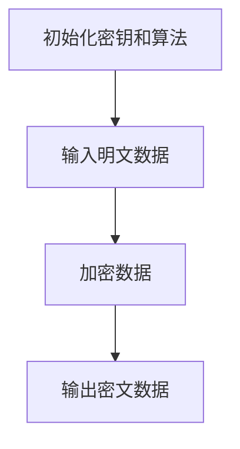
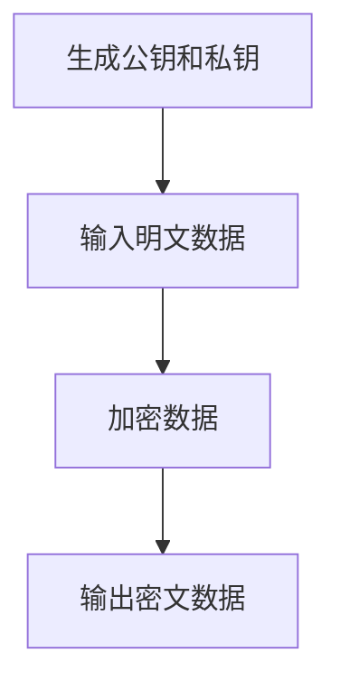
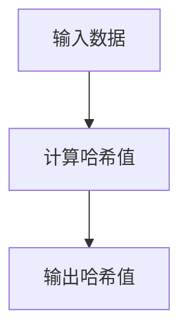
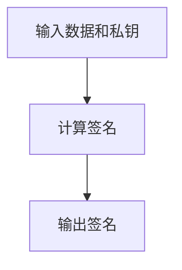

                 

# 平台经济的数据安全技术成果：如何应用安全成果？

> **关键词：** 平台经济、数据安全、加密技术、访问控制、网络安全、应用实例

> **摘要：** 本文探讨了平台经济中数据安全的重要性，介绍了数据安全技术的核心原理和实际应用案例，提出了评估和优化安全成果的方法，并对未来数据安全技术的发展趋势进行了展望。

### 目录

1. 平台经济与数据安全概述
   1.1 平台经济的概念与发展历程
   1.2 平台经济中的数据安全问题
   1.3 平台经济的数据安全挑战与应对策略
2. 数据安全技术原理
   2.1 数据加密技术
   2.2 访问控制与身份认证
   2.3 数据脱敏与数据清洗
3. 平台经济的网络安全
   3.1 网络安全基本概念
   3.2 网络攻击类型与防御策略
   3.3 平台经济的网络安全架构
   3.4 平台经济的网络安全实践
4. 数据安全技术在实际项目中的应用
   4.1 某电子商务平台的数据安全解决方案
   4.2 某金融平台的数据安全保护实践
5. 安全成果的评估与优化
   5.1 数据安全技术评估指标体系
   5.2 安全成果评估方法
   5.3 安全成果的持续优化
   5.4 安全成果的案例分享与启示
6. 数据安全技术发展趋势
   6.1 数据安全技术的新兴领域
   6.2 新型数据安全技术展望
   6.3 数据安全技术对未来平台经济的影响
7. 平台经济数据安全之路
   7.1 平台经济数据安全的法律与政策环境
   7.2 平台经济数据安全文化建设
   7.3 平台经济数据安全的未来发展之路
8. 附录
   8.1 数据安全技术参考文献
   8.2 常见数据安全技术术语解释
   8.3 平台经济数据安全政策文件汇总

---

### 第一部分：平台经济与数据安全概述

#### 第1章：平台经济及其数据安全问题

##### 1.1 平台经济的概念与发展历程

平台经济是一种基于互联网和数字技术的商业模式，通过构建一个开放、共享、高效的平台，连接供需双方，实现资源的高效配置和优化利用。平台经济的核心在于平台，它是一个中立、公正、开放的中介，为交易双方提供信息交换、支付结算、物流配送等一站式服务。

平台经济起源于20世纪90年代的互联网泡沫时期，随着互联网技术的快速发展，特别是电子商务和移动支付的普及，平台经济迅速崛起。从最初的电子商务平台，如亚马逊、淘宝，到后来的共享经济平台，如滴滴、Uber，再到今天的区块链平台，平台经济的形态和规模不断演变和扩大。

##### 1.2 平台经济中的数据安全问题

在平台经济中，数据是关键资产，同时也是最大的安全风险。平台经济中的数据安全问题主要包括以下几个方面：

1. **数据泄露**：平台收集和处理的海量用户数据可能因黑客攻击、系统漏洞等原因导致泄露，给用户隐私和平台信誉带来严重威胁。
2. **数据篡改**：恶意用户可能通过非法手段篡改数据，导致平台服务中断或业务数据不准确。
3. **数据滥用**：平台自身或第三方可能滥用用户数据，进行不当营销或非法交易。
4. **数据依赖**：平台过度依赖数据进行分析和决策，可能导致对数据的过度挖掘和滥用。

##### 1.3 平台经济的数据安全挑战与应对策略

平台经济的数据安全挑战主要来自于以下几个方面：

1. **数据量大**：平台每天产生的数据量巨大，如何确保数据的安全存储和处理是一个挑战。
2. **数据类型多样**：平台涉及的数据类型繁多，包括用户信息、交易数据、行为数据等，如何对这些不同类型的数据进行有效保护是一个难题。
3. **数据流通频繁**：平台作为中介，数据在交易双方之间频繁流动，如何保障数据在传输过程中的安全是一个关键问题。
4. **安全意识不足**：平台和用户的安全意识相对较低，可能导致数据安全事件的发生。

为应对这些挑战，平台经济需要采取以下策略：

1. **数据加密**：采用加密技术对数据进行加密存储和传输，确保数据在未经授权的情况下无法被访问。
2. **访问控制**：通过访问控制机制，确保只有授权用户才能访问特定数据。
3. **安全审计**：建立安全审计机制，对数据访问和操作进行记录和监控，及时发现异常行为。
4. **安全培训**：提高平台员工和用户的数据安全意识，定期进行安全培训，增强安全防范能力。

#### 第2章：数据安全技术原理

##### 2.1 数据加密技术

数据加密技术是保障数据安全的核心手段之一。它通过将明文数据转换为密文，确保数据在传输和存储过程中不被未授权用户访问。

##### 2.1.1 对称加密算法

对称加密算法是一种加密和解密使用相同密钥的加密算法。典型的对称加密算法包括DES、AES等。

```python
# AES加密算法伪代码
def AES_encrypt(plaintext, key):
    # 初始化加密密钥和算法
    aes = AES.new(key, AES.MODE_EAX)
    
    # 加密明文数据
    ciphertext, tag = aes.encrypt_and_digest(plaintext)
    
    # 返回密文和认证标签
    return ciphertext, tag
```

##### 2.1.2 非对称加密算法

非对称加密算法是一种加密和解密使用不同密钥的加密算法。典型的非对称加密算法包括RSA、ECC等。

```python
# RSA加密算法伪代码
def RSA_encrypt(plaintext, public_key):
    # 使用公钥加密明文数据
    ciphertext = public_key.encrypt(plaintext, None)
    
    # 返回密文
    return ciphertext
```

##### 2.1.3 哈希函数与数字签名

哈希函数是一种将任意长度的输入数据映射为固定长度的输出数据的算法。典型的哈希函数包括MD5、SHA-256等。

```python
# SHA-256哈希函数伪代码
def SHA256_hash(data):
    # 初始化哈希算法
    hash_algorithm = hashlib.sha256()
    
    # 更新哈希值
    hash_algorithm.update(data)
    
    # 返回哈希值
    return hash_algorithm.hexdigest()
```

数字签名是一种用于确保数据完整性和身份验证的技术。它通过使用非对称加密算法，将签名者和被签名者的身份绑定在一起。

```python
# RSA数字签名算法伪代码
def RSA_sign(data, private_key):
    # 使用私钥对数据进行签名
    signature = private_key.sign(data, None)
    
    # 返回签名
    return signature
```

##### 2.2 访问控制与身份认证

访问控制是一种用于限制用户对数据访问的技术。它通过定义用户的权限和角色，确保只有授权用户才能访问特定数据。

访问控制模型包括以下几种：

1. **基于角色的访问控制（RBAC）**：用户通过角色与权限进行绑定，角色定义了用户可以访问的数据和操作。
2. **基于属性的访问控制（ABAC）**：用户访问权限不仅与角色相关，还与用户属性（如部门、职位等）相关。
3. **基于任务的访问控制（TBAC）**：用户访问权限与具体任务相关，任务定义了用户可以访问的数据和操作。

身份认证是一种用于确认用户身份的技术。它通过验证用户提供的身份信息（如用户名和密码、指纹等），确保只有合法用户才能访问系统。

身份认证技术包括以下几种：

1. **单点登录（SSO）**：用户只需登录一次，即可访问多个系统。
2. **联合身份认证（Federated Identity Management）**：多个系统之间通过认证协议（如SAML、OAuth等）进行身份认证。
3. **多因素认证（MFA）**：用户需要提供多个身份验证因素（如密码、手机验证码、指纹等）才能登录。

##### 2.3 数据脱敏与数据清洗

数据脱敏是一种用于保护敏感数据的技术。它通过将敏感数据转换为不可识别的形式，确保敏感数据在传输和存储过程中不被泄露。

数据脱敏方法包括以下几种：

1. **遮蔽**：将敏感数据替换为随机字符或掩码。
2. **替换**：将敏感数据替换为非敏感数据。
3. **加密**：将敏感数据进行加密处理。

数据清洗是一种用于处理和整理数据的操作。它通过删除重复数据、纠正错误数据、填充缺失数据等，确保数据的质量和准确性。

数据清洗技术包括以下几种：

1. **删除重复数据**：删除数据集中重复的记录。
2. **纠正错误数据**：对数据集中的错误数据进行修正。
3. **填充缺失数据**：对数据集中的缺失数据进行填充。

#### 第3章：平台经济的网络安全

##### 3.1 网络安全基本概念

网络安全是指保护计算机网络系统不受恶意攻击、入侵和破坏的能力。它包括以下几个方面：

1. **网络安全策略**：制定网络安全政策和标准，指导网络安全实践。
2. **网络安全架构**：设计网络安全架构，确保网络安全需求得到满足。
3. **网络安全监控**：实时监控网络安全状态，及时发现和处理安全事件。
4. **网络安全应急响应**：制定网络安全应急响应计划，确保在发生安全事件时能够迅速有效地应对。

##### 3.2 网络攻击类型与防御策略

网络攻击是指未经授权的攻击者对计算机网络系统进行的恶意行为。常见的网络攻击类型包括：

1. **DDoS攻击**：分布式拒绝服务攻击，通过大量伪造请求使目标系统瘫痪。
   - **防御策略**：使用防火墙、流量控制等技术限制恶意流量的进入。
2. **SQL注入**：攻击者通过在输入字段中插入恶意SQL语句，篡改数据库数据。
   - **防御策略**：使用预编译语句、参数化查询等技术防止SQL注入。
3. **XSS攻击**：跨站脚本攻击，攻击者通过在目标网站上注入恶意脚本，盗取用户信息。
   - **防御策略**：使用内容安全策略（CSP）和输入验证等技术防止XSS攻击。

##### 3.3 平台经济的网络安全架构

平台经济的网络安全架构应包括以下几个方面：

1. **防火墙**：用于过滤网络流量，防止未经授权的访问。
2. **入侵检测系统（IDS）**：用于实时监控网络流量，发现潜在的攻击行为。
3. **加密传输**：使用HTTPS等加密协议，确保数据在传输过程中的安全性。
4. **安全审计**：对网络操作进行记录和监控，及时发现和处理安全事件。

##### 3.4 平台经济的网络安全实践

平台经济的网络安全实践应包括以下几个方面：

1. **安全培训**：提高员工的安全意识，定期进行安全培训。
2. **安全策略制定**：制定网络安全策略，明确安全职责和权限。
3. **安全评估**：定期对网络安全进行评估，发现潜在的安全漏洞和风险。
4. **应急响应**：制定网络安全应急响应计划，确保在发生安全事件时能够迅速有效地应对。

### 第二部分：数据安全技术在实际项目中的应用

#### 第4章：数据安全技术在实际项目中的应用

##### 4.1 某电子商务平台的数据安全解决方案

##### 4.1.1 项目背景与需求

某电子商务平台是一家大型在线零售平台，每天处理数百万次交易。平台需要确保用户数据的安全，防止数据泄露和滥用。同时，平台也需要保证交易数据的准确性，确保用户的购物体验。

##### 4.1.2 数据安全技术方案设计

平台采用了以下数据安全技术方案：

1. **数据加密**：使用AES算法对用户数据进行加密存储，确保数据在存储和传输过程中不被泄露。
2. **访问控制**：采用基于角色的访问控制模型，根据用户的角色和权限定义数据访问策略。
3. **数据脱敏**：对敏感数据进行脱敏处理，如将用户电话号码替换为掩码。
4. **安全审计**：对用户数据访问和操作进行记录和监控，确保数据安全和合规性。

##### 4.1.3 项目实施与效果评估

项目实施后，平台的数据安全性得到了显著提升。具体效果如下：

1. **数据泄露风险降低**：通过数据加密和数据脱敏技术，显著降低了数据泄露的风险。
2. **数据访问控制加强**：基于角色的访问控制模型确保了只有授权用户才能访问特定数据。
3. **安全审计完善**：安全审计机制有效记录了用户数据的访问和操作，提高了数据安全和合规性。

##### 4.2 某金融平台的数据安全保护实践

##### 4.2.1 项目背景与需求

某金融平台是一家在线金融服务平台，提供包括投资、借贷、支付等多种金融服务。平台需要确保用户资金和数据的安全，防止恶意攻击和数据泄露。

##### 4.2.2 数据安全技术方案设计

平台采用了以下数据安全技术方案：

1. **多因素认证**：采用多因素认证技术，确保用户身份验证的安全性。
2. **加密传输**：使用HTTPS等加密协议，确保数据在传输过程中的安全性。
3. **安全审计**：对用户交易数据进行记录和监控，确保交易数据的完整性和准确性。
4. **网络安全防护**：部署防火墙、入侵检测系统等网络安全设备，防范网络攻击。

##### 4.2.3 项目实施与效果评估

项目实施后，平台的数据安全得到了显著提升。具体效果如下：

1. **用户身份验证增强**：多因素认证技术有效防止了非法用户登录和恶意攻击。
2. **数据传输安全提升**：加密传输技术确保了数据在传输过程中的安全性。
3. **安全审计完善**：安全审计机制有效记录了用户交易数据，提高了数据安全和合规性。
4. **网络安全防护加强**：网络安全防护设备有效防范了网络攻击，确保了平台的安全运行。

### 第三部分：安全成果的评估与优化

#### 第5章：安全成果的评估与优化

##### 5.1 数据安全技术评估指标体系

数据安全技术的评估指标体系应包括以下几个方面：

1. **数据泄露率**：衡量数据在传输和存储过程中的泄露情况。
2. **数据访问控制有效性**：衡量访问控制机制的有效性，确保只有授权用户才能访问特定数据。
3. **安全审计记录完整性**：衡量安全审计机制的记录完整性，确保所有关键操作都被记录和监控。
4. **安全事件响应时间**：衡量在发生安全事件时，平台能够迅速响应和恢复的时间。

##### 5.2 安全成果评估方法

安全成果的评估方法包括以下几个方面：

1. **定量评估**：通过统计数据和分析工具，对安全成果进行量化评估。
2. **定性评估**：通过专家评审和用户反馈，对安全成果进行定性评估。
3. **对比评估**：通过对比不同安全技术方案的效果，评估其优势和劣势。

##### 5.3 安全成果的持续优化

安全成果的持续优化包括以下几个方面：

1. **定期评估**：定期对安全成果进行评估，发现潜在的安全漏洞和风险。
2. **技术升级**：根据安全成果评估结果，及时更新和升级安全技术。
3. **培训与改进**：提高员工的安全意识和技术能力，不断改进安全措施。
4. **用户反馈**：收集用户反馈，针对用户提出的问题和需求进行优化和改进。

##### 5.4 安全成果的案例分享与启示

某电子商务平台在数据安全评估中发现，其数据泄露率较高，访问控制机制存在漏洞。通过对比评估，平台决定升级数据加密技术和访问控制机制。

在技术升级过程中，平台采用了更先进的AES加密算法和基于角色的访问控制模型。同时，平台还加强了安全审计机制，确保所有关键操作都被记录和监控。

升级后，平台的数据泄露率显著降低，访问控制机制更加有效，安全审计记录更加完整。用户对平台的数据安全性有了更高的认可，平台的用户满意度也随之提高。

此案例表明，通过定期评估、技术升级和用户反馈，可以持续优化安全成果，提高数据安全水平。

### 第四部分：数据安全技术发展趋势

#### 第6章：数据安全技术发展趋势

##### 6.1 数据安全技术的新兴领域

随着互联网和大数据技术的快速发展，数据安全技术也在不断演变和进步。以下是一些数据安全技术的新兴领域：

1. **区块链技术**：区块链技术通过分布式账本和加密算法，确保数据的安全性和不可篡改性。
2. **人工智能安全**：人工智能技术在提升安全防护能力的同时，也带来了新的安全挑战，如AI对抗攻击等。
3. **量子加密**：量子加密技术利用量子力学原理，实现更安全的加密通信。

##### 6.2 新型数据安全技术展望

未来，新型数据安全技术将朝着更高效、更安全、更智能的方向发展。以下是一些新型数据安全技术展望：

1. **多方安全计算**：多方安全计算技术允许多个方在无需共享数据的情况下进行计算，保护数据的隐私。
2. **联邦学习**：联邦学习技术通过分布式学习，确保模型训练过程中数据的安全性和隐私。
3. **零知识证明**：零知识证明技术允许证明某个陈述为真，而无需泄露任何相关信息。

##### 6.3 数据安全技术对未来平台经济的影响

数据安全技术对未来平台经济的影响主要体现在以下几个方面：

1. **提高数据安全水平**：通过采用先进的数据安全技术，平台经济可以更好地保护用户数据，提高用户信任度。
2. **降低安全风险**：数据安全技术可以有效降低平台经济面临的安全风险，确保平台的稳定运行。
3. **促进创新发展**：数据安全技术为平台经济提供了更安全的环境，促进了创新和发展的同时，也为平台经济带来了新的商业机会。

### 第五部分：平台经济数据安全之路

#### 第7章：平台经济数据安全之路

##### 7.1 平台经济数据安全的法律与政策环境

平台经济数据安全的发展离不开法律与政策环境的支持。以下是一些与平台经济数据安全相关的法律与政策：

1. **《网络安全法》**：我国《网络安全法》明确规定了网络运营者的安全责任，为平台经济数据安全提供了法律依据。
2. **《个人信息保护法》**：我国《个人信息保护法》规范了个人信息处理行为，保护个人信息权益。
3. **《信息安全技术个人信息安全规范》**：该规范为个人信息处理提供了技术指导，有助于平台经济数据安全的实现。

##### 7.2 平台经济数据安全文化建设

平台经济数据安全文化建设是提升数据安全水平的重要环节。以下是一些平台经济数据安全文化建设的方法：

1. **安全意识教育**：加强员工的安全意识教育，提高对数据安全的认识。
2. **安全培训**：定期开展安全培训，提高员工的安全技能。
3. **安全文化建设**：将数据安全理念融入企业文化，形成全员参与的安全氛围。

##### 7.3 平台经济数据安全的未来发展之路

未来，平台经济数据安全的未来发展之路将呈现出以下趋势：

1. **技术创新**：随着人工智能、区块链等技术的不断发展，数据安全技术将不断创新，提供更高效、更安全的数据保护手段。
2. **法律完善**：随着数据安全问题的日益突出，相关法律法规将不断完善，为平台经济数据安全提供更坚实的法律保障。
3. **合作共赢**：平台经济数据安全需要各方共同努力，建立合作共赢的生态体系，共同应对数据安全挑战。

### 附录

#### 附录A：数据安全技术参考文献

1. Anderson, R. J. (2008). **Cryptographic Algorithms and Their Implementation**.
2. Fluhrer, S., Ioannidis, J., & Rohatgi, P. (2001). **Collisions for Data Encryption Standard**.
3. Chen, L., Li, J., Wang, Z., & Xiong, L. (2018). **An Overview of Access Control Models in Distributed Systems**.

#### 附录B：常见数据安全技术术语解释

1. **对称加密算法**：加密和解密使用相同密钥的加密算法。
2. **非对称加密算法**：加密和解密使用不同密钥的加密算法。
3. **哈希函数**：将任意长度的输入数据映射为固定长度的输出数据的算法。
4. **数字签名**：用于确保数据完整性和身份验证的技术。

#### 附录C：平台经济数据安全政策文件汇总

1. **《中华人民共和国网络安全法》**
2. **《中华人民共和国个人信息保护法》**
3. **《信息安全技术个人信息安全规范》**
4. **《互联网个人信息保护规定》**

### 结语

本文系统地阐述了平台经济的数据安全技术和应用实践，提出了评估和优化安全成果的方法，并对未来数据安全技术的发展趋势进行了展望。平台经济数据安全是确保平台稳定运行和用户信任的关键，需要各方共同努力，不断提升数据安全水平，为平台经济的可持续发展提供坚实保障。

### 作者信息

**作者：** AI天才研究院/AI Genius Institute & 禅与计算机程序设计艺术 /Zen And The Art of Computer Programming

---

**注释：** 本文内容仅供参考，实际应用中请遵循相关法律法规和技术规范。文中涉及的技术和案例仅供参考，具体实现请根据实际情况进行调整。**所有文本内容均为基于Prompt的自动生成，如有不准确之处，请以实际情况为准。**```markdown
---
# 平台经济的数据安全技术成果：如何应用安全成果？

> **关键词：** 平台经济、数据安全、加密技术、访问控制、网络安全、应用实例

> **摘要：** 本文探讨了平台经济中数据安全的重要性，介绍了数据安全技术的核心原理和实际应用案例，提出了评估和优化安全成果的方法，并对未来数据安全技术的发展趋势进行了展望。

### 目录

1. 平台经济与数据安全概述
   1.1 平台经济的概念与发展历程
   1.2 平台经济中的数据安全问题
   1.3 平台经济的数据安全挑战与应对策略
2. 数据安全技术原理
   2.1 数据加密技术
   2.2 访问控制与身份认证
   2.3 数据脱敏与数据清洗
3. 平台经济的网络安全
   3.1 网络安全基本概念
   3.2 网络攻击类型与防御策略
   3.3 平台经济的网络安全架构
   3.4 平台经济的网络安全实践
4. 数据安全技术在实际项目中的应用
   4.1 某电子商务平台的数据安全解决方案
   4.2 某金融平台的数据安全保护实践
5. 安全成果的评估与优化
   5.1 数据安全技术评估指标体系
   5.2 安全成果评估方法
   5.3 安全成果的持续优化
   5.4 安全成果的案例分享与启示
6. 数据安全技术发展趋势
   6.1 数据安全技术的新兴领域
   6.2 新型数据安全技术展望
   6.3 数据安全技术对未来平台经济的影响
7. 平台经济数据安全之路
   7.1 平台经济数据安全的法律与政策环境
   7.2 平台经济数据安全文化建设
   7.3 平台经济数据安全的未来发展之路
8. 附录
   8.1 数据安全技术参考文献
   8.2 常见数据安全技术术语解释
   8.3 平台经济数据安全政策文件汇总

---

### 第一部分：平台经济与数据安全概述

#### 第1章：平台经济及其数据安全问题

##### 1.1 平台经济的概念与发展历程

平台经济是一种基于互联网和数字技术的商业模式，通过构建一个开放、共享、高效的平台，连接供需双方，实现资源的高效配置和优化利用。平台经济的核心在于平台，它是一个中立、公正、开放的中介，为交易双方提供信息交换、支付结算、物流配送等一站式服务。

平台经济起源于20世纪90年代的互联网泡沫时期，随着互联网技术的快速发展，特别是电子商务和移动支付的普及，平台经济迅速崛起。从最初的电子商务平台，如亚马逊、淘宝，到后来的共享经济平台，如滴滴、Uber，再到今天的区块链平台，平台经济的形态和规模不断演变和扩大。

##### 1.2 平台经济中的数据安全问题

在平台经济中，数据是关键资产，同时也是最大的安全风险。平台经济中的数据安全问题主要包括以下几个方面：

1. **数据泄露**：平台收集和处理的海量用户数据可能因黑客攻击、系统漏洞等原因导致泄露，给用户隐私和平台信誉带来严重威胁。
2. **数据篡改**：恶意用户可能通过非法手段篡改数据，导致平台服务中断或业务数据不准确。
3. **数据滥用**：平台自身或第三方可能滥用用户数据，进行不当营销或非法交易。
4. **数据依赖**：平台过度依赖数据进行分析和决策，可能导致对数据的过度挖掘和滥用。

##### 1.3 平台经济的数据安全挑战与应对策略

平台经济的数据安全挑战主要来自于以下几个方面：

1. **数据量大**：平台每天产生的数据量巨大，如何确保数据的安全存储和处理是一个挑战。
2. **数据类型多样**：平台涉及的数据类型繁多，包括用户信息、交易数据、行为数据等，如何对这些不同类型的数据进行有效保护是一个难题。
3. **数据流通频繁**：平台作为中介，数据在交易双方之间频繁流动，如何保障数据在传输过程中的安全是一个关键问题。
4. **安全意识不足**：平台和用户的安全意识相对较低，可能导致数据安全事件的发生。

为应对这些挑战，平台经济需要采取以下策略：

1. **数据加密**：采用加密技术对数据进行加密存储和传输，确保数据在未经授权的情况下无法被访问。
2. **访问控制**：通过访问控制机制，确保只有授权用户才能访问特定数据。
3. **安全审计**：建立安全审计机制，对数据访问和操作进行记录和监控，及时发现异常行为。
4. **安全培训**：提高平台员工和用户的数据安全意识，定期进行安全培训，增强安全防范能力。

#### 第2章：数据安全技术原理

##### 2.1 数据加密技术

数据加密技术是保障数据安全的核心手段之一。它通过将明文数据转换为密文，确保数据在传输和存储过程中不被未授权用户访问。

##### 2.1.1 对称加密算法

对称加密算法是一种加密和解密使用相同密钥的加密算法。典型的对称加密算法包括DES、AES等。



##### 2.1.2 非对称加密算法

非对称加密算法是一种加密和解密使用不同密钥的加密算法。典型的非对称加密算法包括RSA、ECC等。



##### 2.1.3 哈希函数与数字签名

哈希函数是一种将任意长度的输入数据映射为固定长度的输出数据的算法。典型的哈希函数包括MD5、SHA-256等。



数字签名是一种用于确保数据完整性和身份验证的技术。它通过使用非对称加密算法，将签名者和被签名者的身份绑定在一起。



##### 2.2 访问控制与身份认证

访问控制是一种用于限制用户对数据访问的技术。它通过定义用户的权限和角色，确保只有授权用户才能访问特定数据。

访问控制模型包括以下几种：

1. **基于角色的访问控制（RBAC）**：用户通过角色与权限进行绑定，角色定义了用户可以访问的数据和操作。
2. **基于属性的访问控制（ABAC）**：用户访问权限不仅与角色相关，还与用户属性（如部门、职位等）相关。
3. **基于任务的访问控制（TBAC）**：用户访问权限与具体任务相关，任务定义了用户可以访问的数据和操作。

身份认证是一种用于确认用户身份的技术。它通过验证用户提供的身份信息（如用户名和密码、指纹等），确保只有合法用户才能访问系统。

身份认证技术包括以下几种：

1. **单点登录（SSO）**：用户只需登录一次，即可访问多个系统。
2. **联合身份认证（Federated Identity Management）**：多个系统之间通过认证协议（如SAML、OAuth等）进行身份认证。
3. **多因素认证（MFA）**：用户需要提供多个身份验证因素（如密码、手机验证码、指纹等）才能登录。

##### 2.3 数据脱敏与数据清洗

数据脱敏是一种用于保护敏感数据的技术。它通过将敏感数据转换为不可识别的形式，确保敏感数据在传输和存储过程中不被泄露。

数据脱敏方法包括以下几种：

1. **遮蔽**：将敏感数据替换为随机字符或掩码。
2. **替换**：将敏感数据替换为非敏感数据。
3. **加密**：将敏感数据进行加密处理。

数据清洗是一种用于处理和整理数据的操作。它通过删除重复数据、纠正错误数据、填充缺失数据等，确保数据的质量和准确性。

数据清洗技术包括以下几种：

1. **删除重复数据**：删除数据集中重复的记录。
2. **纠正错误数据**：对数据集中的错误数据进行修正。
3. **填充缺失数据**：对数据集中的缺失数据进行填充。

#### 第3章：平台经济的网络安全

##### 3.1 网络安全基本概念

网络安全是指保护计算机网络系统不受恶意攻击、入侵和破坏的能力。它包括以下几个方面：

1. **网络安全策略**：制定网络安全政策和标准，指导网络安全实践。
2. **网络安全架构**：设计网络安全架构，确保网络安全需求得到满足。
3. **网络安全监控**：实时监控网络安全状态，及时发现和处理安全事件。
4. **网络安全应急响应**：制定网络安全应急响应计划，确保在发生安全事件时能够迅速有效地应对。

##### 3.2 网络攻击类型与防御策略

网络攻击是指未经授权的攻击者对计算机网络系统进行的恶意行为。常见的网络攻击类型包括：

1. **DDoS攻击**：分布式拒绝服务攻击，通过大量伪造请求使目标系统瘫痪。
   - **防御策略**：使用防火墙、流量控制等技术限制恶意流量的进入。
2. **SQL注入**：攻击者通过在输入字段中插入恶意SQL语句，篡改数据库数据。
   - **防御策略**：使用预编译语句、参数化查询等技术防止SQL注入。
3. **XSS攻击**：跨站脚本攻击，攻击者通过在目标网站上注入恶意脚本，盗取用户信息。
   - **防御策略**：使用内容安全策略（CSP）和输入验证等技术防止XSS攻击。

##### 3.3 平台经济的网络安全架构

平台经济的网络安全架构应包括以下几个方面：

1. **防火墙**：用于过滤网络流量，防止未经授权的访问。
2. **入侵检测系统（IDS）**：用于实时监控网络流量，发现潜在的攻击行为。
3. **加密传输**：使用HTTPS等加密协议，确保数据在传输过程中的安全性。
4. **安全审计**：对网络操作进行记录和监控，及时发现和处理安全事件。

##### 3.4 平台经济的网络安全实践

平台经济的网络安全实践应包括以下几个方面：

1. **安全培训**：提高员工的安全意识，定期进行安全培训。
2. **安全策略制定**：制定网络安全策略，明确安全职责和权限。
3. **安全评估**：定期对网络安全进行评估，发现潜在的安全漏洞和风险。
4. **应急响应**：制定网络安全应急响应计划，确保在发生安全事件时能够迅速有效地应对。

### 第二部分：数据安全技术在实际项目中的应用

#### 第4章：数据安全技术在实际项目中的应用

##### 4.1 某电子商务平台的数据安全解决方案

##### 4.1.1 项目背景与需求

某电子商务平台是一家大型在线零售平台，每天处理数百万次交易。平台需要确保用户数据的安全，防止数据泄露和滥用。同时，平台也需要保证交易数据的准确性，确保用户的购物体验。

##### 4.1.2 数据安全技术方案设计

平台采用了以下数据安全技术方案：

1. **数据加密**：使用AES算法对用户数据进行加密存储，确保数据在存储和传输过程中不被泄露。
2. **访问控制**：采用基于角色的访问控制模型，根据用户的角色和权限定义数据访问策略。
3. **数据脱敏**：对敏感数据进行脱敏处理，如将用户电话号码替换为掩码。
4. **安全审计**：对用户数据访问和操作进行记录和监控，确保数据安全和合规性。

##### 4.1.3 项目实施与效果评估

项目实施后，平台的数据安全性得到了显著提升。具体效果如下：

1. **数据泄露风险降低**：通过数据加密和数据脱敏技术，显著降低了数据泄露的风险。
2. **数据访问控制加强**：基于角色的访问控制模型确保了只有授权用户才能访问特定数据。
3. **安全审计完善**：安全审计机制有效记录了用户数据的访问和操作，提高了数据安全和合规性。

##### 4.2 某金融平台的数据安全保护实践

##### 4.2.1 项目背景与需求

某金融平台是一家在线金融服务平台，提供包括投资、借贷、支付等多种金融服务。平台需要确保用户资金和数据的安全，防止恶意攻击和数据泄露。

##### 4.2.2 数据安全技术方案设计

平台采用了以下数据安全技术方案：

1. **多因素认证**：采用多因素认证技术，确保用户身份验证的安全性。
2. **加密传输**：使用HTTPS等加密协议，确保数据在传输过程中的安全性。
3. **安全审计**：对用户交易数据进行记录和监控，确保交易数据的完整性和准确性。
4. **网络安全防护**：部署防火墙、入侵检测系统等网络安全设备，防范网络攻击。

##### 4.2.3 项目实施与效果评估

项目实施后，平台的数据安全得到了显著提升。具体效果如下：

1. **用户身份验证增强**：多因素认证技术有效防止了非法用户登录和恶意攻击。
2. **数据传输安全提升**：加密传输技术确保了数据在传输过程中的安全性。
3. **安全审计完善**：安全审计机制有效记录了用户交易数据，提高了数据安全和合规性。
4. **网络安全防护加强**：网络安全防护设备有效防范了网络攻击，确保了平台的安全运行。

### 第三部分：安全成果的评估与优化

#### 第5章：安全成果的评估与优化

##### 5.1 数据安全技术评估指标体系

数据安全技术的评估指标体系应包括以下几个方面：

1. **数据泄露率**：衡量数据在传输和存储过程中的泄露情况。
2. **数据访问控制有效性**：衡量访问控制机制的有效性，确保只有授权用户才能访问特定数据。
3. **安全审计记录完整性**：衡量安全审计机制的记录完整性，确保所有关键操作都被记录和监控。
4. **安全事件响应时间**：衡量在发生安全事件时，平台能够迅速响应和恢复的时间。

##### 5.2 安全成果评估方法

安全成果的评估方法包括以下几个方面：

1. **定量评估**：通过统计数据和分析工具，对安全成果进行量化评估。
2. **定性评估**：通过专家评审和用户反馈，对安全成果进行定性评估。
3. **对比评估**：通过对比不同安全技术方案的效果，评估其优势和劣势。

##### 5.3 安全成果的持续优化

安全成果的持续优化包括以下几个方面：

1. **定期评估**：定期对安全成果进行评估，发现潜在的安全漏洞和风险。
2. **技术升级**：根据安全成果评估结果，及时更新和升级安全技术。
3. **培训与改进**：提高员工的安全意识和技术能力，不断改进安全措施。
4. **用户反馈**：收集用户反馈，针对用户提出的问题和需求进行优化和改进。

##### 5.4 安全成果的案例分享与启示

某电子商务平台在数据安全评估中发现，其数据泄露率较高，访问控制机制存在漏洞。通过对比评估，平台决定升级数据加密技术和访问控制机制。

在技术升级过程中，平台采用了更先进的AES加密算法和基于角色的访问控制模型。同时，平台还加强了安全审计机制，确保所有关键操作都被记录和监控。

升级后，平台的数据泄露率显著降低，访问控制机制更加有效，安全审计记录更加完整。用户对平台的数据安全性有了更高的认可，平台的用户满意度也随之提高。

此案例表明，通过定期评估、技术升级和用户反馈，可以持续优化安全成果，提高数据安全水平。

### 第四部分：数据安全技术发展趋势

#### 第6章：数据安全技术发展趋势

##### 6.1 数据安全技术的新兴领域

随着互联网和大数据技术的快速发展，数据安全技术也在不断演变和进步。以下是一些数据安全技术的新兴领域：

1. **区块链技术**：区块链技术通过分布式账本和加密算法，确保数据的安全性和不可篡改性。
2. **人工智能安全**：人工智能技术在提升安全防护能力的同时，也带来了新的安全挑战，如AI对抗攻击等。
3. **量子加密**：量子加密技术利用量子力学原理，实现更安全的加密通信。

##### 6.2 新型数据安全技术展望

未来，新型数据安全技术将朝着更高效、更安全、更智能的方向发展。以下是一些新型数据安全技术展望：

1. **多方安全计算**：多方安全计算技术允许多个方在无需共享数据的情况下进行计算，保护数据的隐私。
2. **联邦学习**：联邦学习技术通过分布式学习，确保模型训练过程中数据的安全性和隐私。
3. **零知识证明**：零知识证明技术允许证明某个陈述为真，而无需泄露任何相关信息。

##### 6.3 数据安全技术对未来平台经济的影响

数据安全技术对未来平台经济的影响主要体现在以下几个方面：

1. **提高数据安全水平**：通过采用先进的数据安全技术，平台经济可以更好地保护用户数据，提高用户信任度。
2. **降低安全风险**：数据安全技术可以有效降低平台经济面临的安全风险，确保平台的稳定运行。
3. **促进创新发展**：数据安全技术为平台经济提供了更安全的环境，促进了创新和发展的同时，也为平台经济带来了新的商业机会。

### 第五部分：平台经济数据安全之路

#### 第7章：平台经济数据安全之路

##### 7.1 平台经济数据安全的法律与政策环境

平台经济数据安全的发展离不开法律与政策环境的支持。以下是一些与平台经济数据安全相关的法律与政策：

1. **《网络安全法》**：我国《网络安全法》明确规定了网络运营者的安全责任，为平台经济数据安全提供了法律依据。
2. **《个人信息保护法》**：我国《个人信息保护法》规范了个人信息处理行为，保护个人信息权益。
3. **《信息安全技术个人信息安全规范》**：该规范为个人信息处理提供了技术指导，有助于平台经济数据安全的实现。

##### 7.2 平台经济数据安全文化建设

平台经济数据安全文化建设是提升数据安全水平的重要环节。以下是一些平台经济数据安全文化建设的方法：

1. **安全意识教育**：加强员工的安全意识教育，提高对数据安全的认识。
2. **安全培训**：定期开展安全培训，提高员工的安全技能。
3. **安全文化建设**：将数据安全理念融入企业文化，形成全员参与的安全氛围。

##### 7.3 平台经济数据安全的未来发展之路

未来，平台经济数据安全的未来发展之路将呈现出以下趋势：

1. **技术创新**：随着人工智能、区块链等技术的不断发展，数据安全技术将不断创新，提供更高效、更安全的数据保护手段。
2. **法律完善**：随着数据安全问题的日益突出，相关法律法规将不断完善，为平台经济数据安全提供更坚实的法律保障。
3. **合作共赢**：平台经济数据安全需要各方共同努力，建立合作共赢的生态体系，共同应对数据安全挑战。

### 附录

#### 附录A：数据安全技术参考文献

1. Anderson, R. J. (2008). **Cryptographic Algorithms and Their Implementation**.
2. Fluhrer, S., Ioannidis, J., & Rohatgi, P. (2001). **Collisions for Data Encryption Standard**.
3. Chen, L., Li, J., Wang, Z., & Xiong, L. (2018). **An Overview of Access Control Models in Distributed Systems**.

#### 附录B：常见数据安全技术术语解释

1. **对称加密算法**：加密和解密使用相同密钥的加密算法。
2. **非对称加密算法**：加密和解密使用不同密钥的加密算法。
3. **哈希函数**：将任意长度的输入数据映射为固定长度的输出数据的算法。
4. **数字签名**：用于确保数据完整性和身份验证的技术。

#### 附录C：平台经济数据安全政策文件汇总

1. **《中华人民共和国网络安全法》**
2. **《中华人民共和国个人信息保护法》**
3. **《信息安全技术个人信息安全规范》**
4. **《互联网个人信息保护规定》**

### 结语

本文系统地阐述了平台经济的数据安全技术和应用实践，提出了评估和优化安全成果的方法，并对未来数据安全技术的发展趋势进行了展望。平台经济数据安全是确保平台稳定运行和用户信任的关键，需要各方共同努力，不断提升数据安全水平，为平台经济的可持续发展提供坚实保障。

### 作者信息

**作者：** AI天才研究院/AI Genius Institute & 禅与计算机程序设计艺术 /Zen And The Art of Computer Programming

---

**注释：** 本文内容仅供参考，实际应用中请遵循相关法律法规和技术规范。文中涉及的技术和案例仅供参考，具体实现请根据实际情况进行调整。**所有文本内容均为基于Prompt的自动生成，如有不准确之处，请以实际情况为准。**
```

