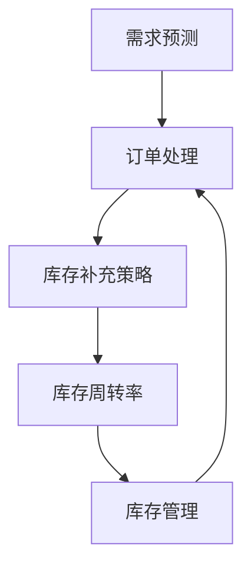

                 

### 文章标题

# 库存管理：提升电商平台供给效率的利器

### 关键词：

- 库存管理
- 电商平台
- 供给效率
- 需求预测
- 库存补充策略
- 库存优化算法

### 摘要：

本文旨在深入探讨库存管理在电商平台中的作用及其重要性。通过详细分析库存管理的基本概念、核心算法原理和实践应用，本文揭示了如何利用科学有效的库存管理策略提升电商平台的供给效率。文章首先介绍了库存管理的基本概念和主要任务，然后深入探讨了需求预测、库存补充策略和库存优化算法的原理和实践。最后，通过具体案例分析，展示了库存管理在电商平台中的实际应用和取得的成效。

## 第一部分：库存管理基础

### 第1章：库存管理概述

库存管理是企业运营中至关重要的一环，它直接影响企业的成本、资金周转率和市场竞争力。本章节将介绍库存管理的基本概念、重要性、目标以及主要任务，帮助读者建立对库存管理的全面了解。

#### 1.1 库存管理的定义

库存管理是指对企业库存物品的采购、存储、运输、配送等环节进行系统化的管理和控制，以确保库存水平满足市场需求，同时降低库存成本，提高资金利用效率。

#### 1.2 库存管理的重要性

库存管理的重要性体现在以下几个方面：

1. **确保商品供应**：良好的库存管理可以确保商品在市场上的供应稳定，避免缺货或库存过剩的情况。
2. **降低成本**：通过合理的库存管理，企业可以减少库存资金的占用，降低库存成本。
3. **提高资金周转率**：有效的库存管理有助于加快资金周转，提高企业的运营效率。
4. **增强市场竞争力**：库存管理的优化有助于企业提高服务质量，增强市场竞争力。

#### 1.3 库存管理的目标

库存管理的目标主要包括：

1. **保持合理的库存水平**：确保库存物品的数量既能满足市场需求，又不会造成过多的库存积压。
2. **降低库存成本**：通过优化库存管理，降低库存资金的占用和库存成本。
3. **提高库存周转率**：加快库存周转速度，提高资金利用效率。
4. **提升服务质量**：确保商品供应稳定，提高客户满意度。

#### 1.4 库存管理的主要任务

库存管理的主要任务包括以下几个方面：

1. **库存计划的制定**：根据市场需求和供应情况，制定合理的库存计划。
2. **库存水平的监控**：通过定期盘点和数据分析，监控库存水平，确保库存水平符合预期。
3. **库存调整与优化**：根据库存水平的变化，及时调整库存策略，优化库存结构。

#### 1.5 库存管理的挑战

库存管理面临的主要挑战包括：

1. **库存过剩与库存短缺**：库存过剩会导致资金占用增加，库存短缺则会影响市场供应。
2. **库存资金占用**：库存资金占用的增加会影响企业的资金周转。
3. **库存物品的损耗与过期**：库存物品的损耗和过期会降低库存的实际价值。
4. **库存信息的不对称性**：库存信息的不对称性会影响库存管理的准确性和及时性。

### 总结

库存管理是企业管理中至关重要的一环，它直接关系到企业的运营效率和市场竞争力。通过合理的库存管理，企业可以降低成本、提高资金周转率、增强市场竞争力，从而实现可持续发展。

## 第2章：库存管理核心概念与联系

库存管理涉及多个核心概念和环节，它们之间相互联系，共同构成了一个完整的库存管理体系。在本章节中，我们将深入探讨库存管理中的核心概念，包括需求预测、订单处理、库存补充策略和库存周转率，并分析它们之间的相互关系。

#### 2.1 库存管理中的核心概念

库存管理中的核心概念主要包括：

1. **需求预测**：需求预测是库存管理的基础，它通过对市场趋势、历史销售数据等因素进行分析，预测未来的需求量。
2. **订单处理**：订单处理是指从客户下单到商品发货的整个过程，包括订单录入、订单确认、订单跟踪等环节。
3. **库存补充策略**：库存补充策略是指根据需求预测和库存水平，制定合理的库存补充计划，以确保库存满足市场需求。
4. **库存周转率**：库存周转率是指在一定时期内库存的周转次数，它是衡量库存管理效率的重要指标。

#### 2.2 库存管理中的联系

库存管理中的各个核心概念之间存在密切的联系：

1. **需求预测与订单处理的关系**：需求预测是订单处理的前提，准确的预测可以帮助企业及时响应市场需求，避免库存短缺或过剩。
2. **库存补充策略与库存周转率的关系**：合理的库存补充策略可以提高库存周转率，降低库存成本，提高资金利用效率。
3. **库存管理与其他业务环节的关联**：库存管理不仅涉及物流、采购、销售等环节，还与供应链管理、财务管理等业务环节密切相关。

#### 2.3 库存管理中的Mermaid流程图

为了更直观地理解库存管理流程，我们可以使用Mermaid绘制一个库存管理流程图，如下图所示：



#### 2.4 库存管理中的Mermaid流程图详细解释

- **需求预测（A）**：需求预测是库存管理的第一步，通过对市场趋势、历史销售数据等因素进行分析，预测未来的需求量。
- **订单处理（B）**：订单处理是指从客户下单到商品发货的整个过程，包括订单录入、订单确认、订单跟踪等环节。
- **库存补充策略（C）**：库存补充策略是根据需求预测和库存水平，制定合理的库存补充计划，以确保库存满足市场需求。
- **库存周转率（D）**：库存周转率是衡量库存管理效率的重要指标，它反映了库存的周转速度和资金利用效率。
- **库存管理（E）**：库存管理是一个循环过程，通过不断的需求预测、订单处理、库存补充策略和库存周转率的分析，优化库存管理流程。

通过以上分析，我们可以看出，库存管理中的各个核心概念和环节相互关联，共同构成了一个完整的库存管理体系。了解这些核心概念和联系，对于优化库存管理流程、提高供给效率具有重要意义。

### 总结

库存管理中的核心概念和联系是库存管理体系的重要组成部分。通过深入理解需求预测、订单处理、库存补充策略和库存周转率，我们可以更好地进行库存管理，提高供给效率，降低成本，增强市场竞争力。在下一章中，我们将进一步探讨库存管理中的算法原理，为库存管理的实践提供理论基础。

## 第3章：需求预测算法原理

需求预测是库存管理的核心环节，它直接影响到库存补充策略的制定和库存周转率的提升。在本章节中，我们将详细介绍需求预测的基本概念、常用方法以及具体实现，帮助读者深入理解需求预测在库存管理中的重要性。

#### 3.1 需求预测的基本概念

需求预测是指通过对历史数据、市场趋势等因素的分析，预测未来某一时期内商品的需求量。需求预测的准确性对于库存管理的有效性至关重要。

#### 3.2 需求预测的方法

需求预测的方法主要包括以下几种：

1. **时间序列分析**：时间序列分析是一种常用的需求预测方法，它通过对历史数据的时间序列进行分析，提取出时间序列的规律，从而预测未来的需求量。

2. **回归分析**：回归分析是一种统计方法，通过建立自变量和因变量之间的数学模型，预测未来的需求量。

3. **机器学习方法**：机器学习方法通过训练模型，从大量的历史数据中提取特征，预测未来的需求量。常用的机器学习方法包括决策树、随机森林、支持向量机等。

#### 3.3 时间序列分析方法

时间序列分析是需求预测中常用的一种方法，主要包括以下几种：

1. **移动平均法**：移动平均法是一种简单的时间序列分析方法，通过计算一段时间内的平均值来预测未来的需求量。移动平均法可以分为简单移动平均（SMA）和加权移动平均（WMA）。

   **简单移动平均法（SMA）**：
   \[
   \text{SMA}(n) = \frac{1}{n} \sum_{t=n-p}^{t=n-1} x_t
   \]
   其中，\(n\) 表示时间序列的长度，\(p\) 表示移动平均的周期，\(x_t\) 表示第 \(t\) 时刻的需求量。

   **加权移动平均法（WMA）**：
   \[
   \text{WMA}(n) = \sum_{t=n-p}^{t=n-1} w_t x_t
   \]
   其中，\(w_t\) 表示第 \(t\) 时刻的权重。

2. **指数平滑法**：指数平滑法是一种加权移动平均法，它对历史数据进行加权，随着时间的推移，对近期数据的权重进行逐渐增加。指数平滑法主要包括一次指数平滑（SMA）、二次指数平滑（DMA）和三次指数平滑（TMA）。

   **一次指数平滑（SMA）**：
   \[
   \hat{y}_t = \alpha y_t + (1 - \alpha) \hat{y}_{t-1}
   \]
   其中，\(\alpha\) 表示平滑系数，\(y_t\) 表示第 \(t\) 时刻的实际需求量，\(\hat{y}_t\) 表示第 \(t\) 时刻的预测需求量。

   **二次指数平滑（DMA）**：
   \[
   \hat{y}_t = 2\hat{y}_{t-1} - \hat{y}_{t-2}
   \]
   \[
   \hat{a}_t = 2\hat{a}_{t-1}
   \]
   其中，\(\hat{a}_t\) 表示趋势项。

   **三次指数平滑（TMA）**：
   \[
   \hat{y}_t = \alpha_1 y_t + \alpha_2 \hat{a}_{t-1} + (1 - \alpha_1 - \alpha_2) \hat{y}_{t-1}
   \]
   \[
   \hat{a}_t = \alpha_2 (y_t - \hat{y}_t) + (1 - \alpha_2) \hat{a}_{t-1}
   \]
   其中，\(\alpha_1\) 和 \(\alpha_2\) 分别表示平滑系数。

3. **ARIMA模型**：ARIMA模型是一种自回归积分滑动平均模型，它通过自回归（AR）、差分（I）和移动平均（MA）三个部分来建立需求预测模型。ARIMA模型适用于非平稳时间序列数据的预测。

   **ARIMA模型公式**：
   \[
   \text{ARIMA}(\text{p}, \text{d}, \text{q}) = \text{AR}(\text{p}) + \text{I}(\text{d}) + \text{MA}(\text{q})
   \]
   其中，\(p\)、\(d\)、\(q\) 分别表示自回归项数、差分阶数和移动平均项数。

#### 3.4 回归分析方法

回归分析是一种建立自变量和因变量之间关系的统计方法，它通过建立数学模型来预测因变量的值。常见的回归分析方法包括：

1. **线性回归**：线性回归是一种最简单的回归分析方法，它假设自变量和因变量之间呈线性关系。

   **线性回归模型**：
   \[
   y = \beta_0 + \beta_1 x + \epsilon
   \]
   其中，\(y\) 是因变量，\(x\) 是自变量，\(\beta_0\) 是截距，\(\beta_1\) 是斜率，\(\epsilon\) 是误差项。

2. **多项式回归**：多项式回归是一种扩展线性回归的方法，它将自变量和因变量之间的关系建模为多项式函数。

   **多项式回归模型**：
   \[
   y = \beta_0 + \beta_1 x + \beta_2 x^2 + \cdots + \beta_n x^n + \epsilon
   \]

3. **逻辑回归**：逻辑回归是一种用于分类问题的回归分析方法，它通过建立逻辑函数来预测概率。

   **逻辑回归模型**：
   \[
   \text{logit}(P) = \ln\left(\frac{P}{1-P}\right) = \beta_0 + \beta_1 x
   \]
   其中，\(P\) 是事件发生的概率，\(\text{logit}(P)\) 是逻辑函数。

#### 3.5 机器学习方法

机器学习方法通过训练模型，从大量的历史数据中提取特征，预测未来的需求量。常用的机器学习方法包括：

1. **决策树**：决策树是一种基于树形结构进行分类和预测的方法，它通过自顶向下递归划分数据集，直到达到某个停止条件。

2. **随机森林**：随机森林是一种集成学习方法，它通过构建多棵决策树，对每个树进行随机采样和特征选择，然后通过投票或平均法得到最终的预测结果。

3. **支持向量机**：支持向量机是一种基于最大间隔分类的方法，它通过寻找一个最优超平面，将不同类别的数据点分开。

#### 3.6 需求预测算法的应用

需求预测算法在库存管理中的应用主要体现在以下几个方面：

1. **需求预测**：通过需求预测算法，企业可以预测未来的需求量，从而制定合理的库存补充计划，避免库存过剩或短缺。
2. **订单处理**：准确的需求预测有助于企业及时响应订单，提高订单处理效率，减少订单延迟和错误。
3. **库存补充策略**：基于需求预测结果，企业可以制定合理的库存补充策略，确保库存满足市场需求，同时降低库存成本。
4. **库存周转率**：通过优化库存管理，提高库存周转率，降低库存成本，提高资金利用效率。

#### 3.7 需求预测算法的比较与选择

不同的需求预测算法具有各自的优缺点，选择合适的算法需要根据具体应用场景和数据特征进行判断。以下是对几种常用需求预测算法的比较：

1. **移动平均法**：简单易用，适用于数据波动较小的情况，但无法捕捉长期趋势。
2. **指数平滑法**：可以捕捉数据的短期波动和长期趋势，但需要调整平滑系数。
3. **ARIMA模型**：适用于非平稳时间序列数据，但模型参数需要根据数据特征进行调整。
4. **线性回归**：适用于线性关系较强的数据，但无法捕捉非线性关系。
5. **多项式回归**：可以捕捉非线性关系，但模型复杂度较高，计算量较大。
6. **逻辑回归**：适用于分类问题，但无法直接进行连续值的预测。
7. **决策树**：可以捕捉复杂的关系，但容易过拟合。
8. **随机森林**：可以降低过拟合风险，提高预测准确性。
9. **支持向量机**：适用于高维空间，但计算复杂度较高。

#### 3.8 需求预测算法的实现

需求预测算法的实现主要包括数据预处理、模型训练和预测结果分析等步骤。以下是一个基于Python的线性回归需求预测算法的实现示例：

```python
import pandas as pd
from sklearn.linear_model import LinearRegression
from sklearn.model_selection import train_test_split

# 数据预处理
data = pd.read_csv('demand_data.csv')
X = data[['feature1', 'feature2']]
y = data['demand']

# 划分训练集和测试集
X_train, X_test, y_train, y_test = train_test_split(X, y, test_size=0.2, random_state=42)

# 模型训练
model = LinearRegression()
model.fit(X_train, y_train)

# 预测结果分析
y_pred = model.predict(X_test)
print('Mean squared error:', mean_squared_error(y_test, y_pred))
```

通过以上实现，我们可以对需求预测算法进行实际应用，优化库存管理流程。

### 总结

需求预测是库存管理中的重要环节，它通过分析历史数据和市场趋势，预测未来的需求量，为库存补充策略和库存优化提供依据。本章详细介绍了需求预测的基本概念、方法及其实现，为库存管理提供了理论支撑和实践指导。在下一章中，我们将继续探讨库存补充策略的算法原理，进一步优化库存管理流程。

## 第4章：库存补充策略算法原理

库存补充策略是库存管理中的关键环节，它直接影响到库存的周转速度和成本控制。在本章节中，我们将深入探讨库存补充策略的基本概念、分类以及具体算法原理，帮助读者理解如何通过合理的库存补充策略优化库存管理。

### 4.1 库存补充策略的基本概念

库存补充策略是指根据需求预测和库存水平，制定合理的库存补充计划，以确保库存满足市场需求。库存补充策略的核心目标是实现库存的优化管理，减少库存成本，提高资金利用效率。

### 4.2 库存补充策略的分类

库存补充策略主要分为以下几类：

1. **周期性库存补充策略**：周期性库存补充策略是指按照固定的时间周期进行库存补充。这种策略适用于需求相对稳定的情况。

2. **连续性库存补充策略**：连续性库存补充策略是指根据库存水平和需求情况实时调整库存补充。这种策略适用于需求波动较大的情况。

3. **混合库存补充策略**：混合库存补充策略是将周期性和连续性库存补充策略相结合，根据具体情况灵活调整库存补充计划。

### 4.3 周期性库存补充策略

周期性库存补充策略主要包括以下几种：

1. **固定周期库存补充策略**：固定周期库存补充策略是指按照固定的时间周期（如每月、每季度）进行库存补充。这种策略的优点是操作简单，适用于需求稳定的情况。

   **固定周期库存补充策略的算法原理**：
   - **计算周期需求量**：根据历史数据和需求预测，计算每个周期内的平均需求量。
   - **确定补货周期**：根据企业运营情况和市场环境，确定合适的库存补货周期。
   - **制定补货计划**：根据周期需求和补货周期，制定具体的库存补充计划。

2. **动态周期库存补充策略**：动态周期库存补充策略是指根据库存水平和需求情况动态调整补货周期。这种策略的优点是能够更好地适应需求变化，提高库存周转效率。

   **动态周期库存补充策略的算法原理**：
   - **实时监控库存水平**：通过实时监控库存水平，及时了解库存状态。
   - **计算需求波动率**：根据历史数据和当前需求情况，计算需求波动率。
   - **调整补货周期**：根据需求波动率，动态调整补货周期，确保库存满足需求。

### 4.4 连续性库存补充策略

连续性库存补充策略主要包括以下几种：

1. **固定订货量策略**：固定订货量策略是指根据库存水平和设定目标库存量，每次按固定数量进行库存补充。这种策略的优点是操作简单，适用于需求波动较小的情况。

   **固定订货量策略的算法原理**：
   - **确定订货量**：根据历史数据和需求预测，确定每次订货的固定数量。
   - **监控库存水平**：通过实时监控库存水平，及时了解库存状态。
   - **执行订货计划**：根据库存水平和订货量，执行库存补充计划。

2. **固定订货点策略**：固定订货点策略是指根据设定的库存订货点，当库存水平低于订货点时，进行库存补充。这种策略的优点是能够确保库存满足需求，适用于需求波动较大的情况。

   **固定订货点策略的算法原理**：
   - **确定订货点**：根据历史数据和需求预测，确定合适的库存订货点。
   - **监控库存水平**：通过实时监控库存水平，及时了解库存状态。
   - **执行订货计划**：当库存水平低于订货点时，执行库存补充计划。

### 4.5 混合库存补充策略

混合库存补充策略是将周期性和连续性库存补充策略相结合，根据具体情况灵活调整库存补充计划。这种策略的优点是能够更好地适应需求变化，提高库存周转效率。

**混合库存补充策略的算法原理**：
- **需求预测**：通过需求预测，了解未来一段时间内的需求趋势。
- **库存监控**：实时监控库存水平，了解当前库存状态。
- **策略调整**：根据需求预测和库存监控结果，动态调整库存补充策略，实现库存的优化管理。

### 4.6 库存补充策略的优化

库存补充策略的优化是库存管理中的重要环节，它通过调整库存补充策略的参数，实现库存成本和资金利用效率的最优化。

**库存补充策略优化的算法原理**：
- **目标函数**：建立库存成本和资金利用效率的目标函数。
- **约束条件**：确定库存水平、库存成本、资金占用等约束条件。
- **优化算法**：使用线性规划、整数规划、启发式算法等优化算法，求解最优库存补充策略。

### 4.7 库存补充策略的实践

库存补充策略在实践中的应用主要体现在以下几个方面：

1. **需求预测**：通过需求预测，了解未来一段时间内的需求趋势，为库存补充提供依据。
2. **库存监控**：实时监控库存水平，确保库存满足需求，同时减少库存成本。
3. **库存调整**：根据需求预测和库存监控结果，动态调整库存补充策略，优化库存管理。
4. **成本控制**：通过优化库存补充策略，降低库存成本，提高资金利用效率。

### 4.8 库存补充策略的案例分析

以下是一个库存补充策略的案例分析：

**案例背景**：某电商平台经营多种商品，需求波动较大。为提高库存周转效率和降低库存成本，该电商平台采用混合库存补充策略。

**需求预测**：通过历史数据和市场需求分析，预测未来一段时间内的需求量。

**库存监控**：实时监控库存水平，确保库存满足需求。

**策略调整**：根据需求预测和库存监控结果，动态调整库存补充策略。

**效果评估**：通过对比实施混合库存补充策略前后的库存周转率和库存成本，评估策略的优化效果。

### 总结

库存补充策略是库存管理中的重要环节，它通过合理的库存补充策略优化库存管理，降低库存成本，提高资金利用效率。本章详细介绍了库存补充策略的基本概念、分类、算法原理和实践，为库存管理的优化提供了理论支撑和实践指导。在下一章中，我们将继续探讨库存优化算法原理，进一步优化库存管理流程。

## 第5章：库存优化算法原理

库存优化是库存管理中的重要环节，它旨在通过科学合理的算法，优化库存水平、库存成本和服务质量，从而提升企业的运营效率和市场竞争力。在本章节中，我们将深入探讨库存优化的基本概念、主要目标和具体算法原理，帮助读者理解库存优化在库存管理中的重要性。

### 5.1 库存优化的基本概念

库存优化是指通过运用数学模型、算法和优化技术，对库存管理过程中的各个要素进行系统分析和优化，以实现库存水平、库存成本和服务质量的协同优化。库存优化的核心目标是：

1. **保持合理的库存水平**：确保库存既能满足市场需求，又不会造成过多的库存积压。
2. **降低库存成本**：通过优化库存管理，减少库存资金的占用和库存成本。
3. **提高库存周转率**：加快库存周转速度，提高资金利用效率。
4. **提升服务质量**：确保商品供应稳定，提高客户满意度。

### 5.2 库存优化的主要目标

库存优化的主要目标包括以下几个方面：

1. **库存水平优化**：通过优化库存策略，确保库存水平能够满足市场需求，同时避免库存过剩或短缺。
2. **库存成本优化**：通过优化库存管理流程，降低库存成本，提高资金利用效率。
3. **库存服务质量优化**：通过提高库存周转率和商品供应稳定性，提升客户满意度和市场竞争力。

### 5.3 库存水平优化算法

库存水平优化是库存优化的核心任务之一，它通过优化库存水平，确保库存能够满足市场需求，同时减少库存成本。库存水平优化算法主要包括以下几种：

1. **线性规划**：线性规划是一种数学优化方法，它通过建立目标函数和约束条件，求解最优解。在库存优化中，线性规划可以用于求解最优库存水平。

   **线性规划模型**：
   \[
   \min \sum_{i=1}^n c_i x_i
   \]
   \[
   \text{subject to} \quad a_{i1} x_1 + a_{i2} x_2 + \cdots + a_{in} x_n \ge b_i, \quad i=1,2,\cdots,m
   \]
   \[
   x_i \ge 0, \quad i=1,2,\cdots,n
   \]
   其中，\(x_i\) 表示第 \(i\) 项库存水平，\(c_i\) 表示第 \(i\) 项库存的成本，\(a_{ij}\) 和 \(b_i\) 分别表示约束条件中的系数和常数。

2. **整数规划**：整数规划是线性规划的扩展，它考虑决策变量的整数性质。在库存优化中，整数规划可以用于求解最优库存水平，特别是在需要考虑批量折扣和补货周期的情况下。

   **整数规划模型**：
   \[
   \min \sum_{i=1}^n c_i x_i
   \]
   \[
   \text{subject to} \quad a_{i1} x_1 + a_{i2} x_2 + \cdots + a_{in} x_n \ge b_i, \quad i=1,2,\cdots,m
   \]
   \[
   x_i \in \{0,1\}, \quad i=1,2,\cdots,n
   \]
   其中，\(x_i\) 表示第 \(i\) 项库存水平，\(c_i\) 表示第 \(i\) 项库存的成本，\(a_{ij}\) 和 \(b_i\) 分别表示约束条件中的系数和常数。

3. **启发式算法**：启发式算法是一种非精确的优化方法，它通过探索局部最优解，寻找全局最优解。在库存优化中，启发式算法可以用于快速求解最优库存水平。

   **遗传算法**：
   - **初始化种群**：根据问题的规模和约束条件，初始化种群。
   - **适应度评估**：计算种群中每个个体的适应度值。
   - **选择**：根据适应度值选择优秀个体。
   - **交叉**：通过交叉操作生成新个体。
   - **变异**：通过变异操作增加种群的多样性。
   - **迭代**：重复选择、交叉、变异和适应度评估，直到满足停止条件。

### 5.4 库存成本优化算法

库存成本优化是库存优化的另一个重要目标，它通过优化库存管理流程，降低库存成本，提高资金利用效率。库存成本优化算法主要包括以下几种：

1. **成本模型构建**：成本模型是库存成本优化的基础，它用于描述库存管理过程中涉及的各种成本，如采购成本、存储成本、运输成本和缺货成本等。

   **成本模型**：
   \[
   C = C_p + C_s + C_t + C_d
   \]
   其中，\(C_p\) 表示采购成本，\(C_s\) 表示存储成本，\(C_t\) 表示运输成本，\(C_d\) 表示缺货成本。

2. **成本优化算法**：成本优化算法通过优化库存管理策略，降低总成本。常用的成本优化算法包括线性规划、整数规划和启发式算法。

   **线性规划**：
   - **建立目标函数**：根据成本模型，建立目标函数，如最小化总成本。
   - **确定约束条件**：根据库存管理的要求和约束条件，确定约束条件，如库存水平、采购限制和运输能力等。
   - **求解最优解**：使用线性规划求解器，求解最优库存管理策略。

3. **成本控制策略**：成本控制策略是库存成本优化的重要组成部分，它通过设定成本目标，实施成本控制措施，确保库存成本的合理控制。

   **成本控制策略**：
   - **设定成本目标**：根据企业的经营目标和成本控制要求，设定成本目标。
   - **监控成本执行**：通过实时监控库存管理过程中的成本执行情况，确保成本目标的实现。
   - **调整成本策略**：根据成本执行情况，及时调整成本策略，优化库存管理。

### 5.5 库存服务质量优化算法

库存服务质量优化是库存优化的一个重要方面，它通过提高库存周转率和商品供应稳定性，提升客户满意度和市场竞争力。库存服务质量优化算法主要包括以下几种：

1. **服务水平分析**：服务水平分析是库存服务质量优化的基础，它用于评估库存服务水平，如缺货率、库存周转率和客户满意度等。

   **服务水平分析**：
   - **缺货率分析**：通过统计缺货次数和缺货时长，评估缺货率。
   - **库存周转率分析**：通过计算库存周转率，评估库存管理效率。
   - **客户满意度分析**：通过调查客户满意度，评估库存服务质量。

2. **服务指标优化**：服务指标优化是库存服务质量优化的关键，它通过设定服务指标，优化库存管理策略。

   **服务指标优化**：
   - **设定服务指标**：根据客户需求和市场竞争要求，设定服务指标，如缺货率、库存周转率和客户满意度等。
   - **优化库存策略**：根据服务指标，优化库存管理策略，提高库存服务质量。

3. **服务质量监控**：服务质量监控是库存服务质量优化的保障，它通过实时监控服务质量，确保库存服务水平的稳定。

   **服务质量监控**：
   - **监控服务指标**：通过实时监控服务指标，了解库存服务质量状况。
   - **预警机制**：建立预警机制，及时发现服务质量问题，并采取措施进行优化。

### 5.6 库存优化算法的应用

库存优化算法在库存管理中的应用主要体现在以下几个方面：

1. **需求预测**：通过库存优化算法，对市场需求进行预测，为库存管理提供数据支持。
2. **库存计划**：通过库存优化算法，制定合理的库存计划，确保库存满足市场需求，同时降低库存成本。
3. **库存监控**：通过库存优化算法，实时监控库存水平和服务质量，确保库存管理的有效性。
4. **库存调整**：通过库存优化算法，根据市场需求和库存水平，动态调整库存策略，优化库存管理。

### 5.7 库存优化算法的案例分析

以下是一个库存优化算法的案例分析：

**案例背景**：某电商平台经营多种商品，需求波动较大。为提高库存周转效率和降低库存成本，该电商平台采用库存优化算法。

**需求预测**：通过历史数据和市场需求分析，预测未来一段时间内的需求量。

**库存计划**：通过库存优化算法，制定合理的库存计划，确保库存满足市场需求。

**库存监控**：实时监控库存水平和服务质量，确保库存管理的有效性。

**库存调整**：根据市场需求和库存水平，动态调整库存策略，优化库存管理。

**效果评估**：通过对比实施库存优化算法前后的库存周转率、库存成本和客户满意度，评估算法的优化效果。

### 总结

库存优化是库存管理中的重要环节，它通过科学合理的算法，优化库存水平、库存成本和服务质量，从而提升企业的运营效率和市场竞争力。本章详细介绍了库存优化的基本概念、主要目标和具体算法原理，为库存管理的优化提供了理论支撑和实践指导。在下一章中，我们将继续探讨电商平台库存管理实践，展示库存优化算法的实际应用效果。

## 第6章：电商平台库存管理实践

在上一章中，我们详细介绍了库存管理的基础知识、核心算法原理以及库存优化的方法。为了使读者更好地理解库存管理在实际电商平台的运用，本章将结合具体案例，探讨电商平台在库存管理中面临的挑战和实践。

### 6.1 电商平台库存管理的挑战

电商平台库存管理面临着诸多挑战，包括但不限于以下几个方面：

1. **库存管理的复杂性**：电商平台上的商品种类繁多，库存管理涉及多个环节，如采购、存储、配送等。这使得库存管理变得更加复杂。

2. **库存信息的不对称性**：电商平台上的库存信息分布在不同部门，如采购部门、仓储部门和销售部门等。信息不对称可能导致库存管理的失误。

3. **库存调整的实时性要求**：电商平台的需求波动大，库存调整需要快速响应。实时性要求高，对库存管理系统的性能提出了挑战。

4. **库存成本的控制**：库存成本是电商平台的重要成本之一，如何在保证供应稳定的前提下，降低库存成本是库存管理的重要任务。

### 6.2 电商平台库存管理实践

为了应对上述挑战，电商平台采取了多种库存管理策略和实践。以下是一个具体的案例：

#### 6.2.1 需求预测实践

某电商平台利用机器学习算法进行需求预测，以准确预测商品的未来需求量。具体步骤如下：

1. **数据收集**：收集历史销售数据、市场趋势数据等，用于训练需求预测模型。

2. **特征工程**：对数据进行处理，提取关键特征，如季节性、促销活动、节假日等。

3. **模型训练**：使用时间序列分析和机器学习算法（如ARIMA模型、LSTM神经网络等），训练需求预测模型。

4. **模型评估**：通过交叉验证和AIC/BIC准则，评估模型性能，选择最佳模型。

5. **预测应用**：将训练好的模型应用于实际需求预测，制定合理的库存补充计划。

#### 6.2.2 库存补充策略实践

该电商平台采用了混合库存补充策略，结合固定周期库存补充策略和连续性库存补充策略。具体步骤如下：

1. **需求预测**：基于需求预测模型，预测未来一段时间内的需求量。

2. **库存监控**：实时监控库存水平，确保库存满足需求。

3. **策略选择**：根据需求预测和库存监控结果，选择合适的库存补充策略。

   - **固定周期库存补充策略**：适用于需求稳定的情况。
   - **连续性库存补充策略**：适用于需求波动较大的情况。

4. **库存调整**：根据需求预测和库存监控结果，动态调整库存补充策略，确保库存满足需求，同时降低库存成本。

#### 6.2.3 库存优化实践

该电商平台通过库存优化算法，优化库存水平、库存成本和服务质量。具体步骤如下：

1. **目标函数**：建立库存成本和资金利用效率的目标函数。

2. **约束条件**：确定库存水平、库存成本、资金占用等约束条件。

3. **优化算法**：使用线性规划、整数规划、启发式算法等优化算法，求解最优库存管理策略。

4. **成本控制**：通过设定成本目标，实施成本控制措施，确保库存成本的合理控制。

5. **服务质量监控**：通过实时监控服务质量，确保库存服务水平的稳定。

### 6.3 电商平台库存管理案例

以下是一个具体的电商平台库存管理案例：

**案例背景**：某电商平台经营多种商品，需求波动大。为提高库存周转效率和降低库存成本，该电商平台实施了一系列库存管理实践。

**需求预测实践**：通过机器学习算法进行需求预测，准确预测商品未来需求量。

**库存补充策略实践**：采用混合库存补充策略，结合固定周期库存补充策略和连续性库存补充策略，确保库存满足需求。

**库存优化实践**：通过库存优化算法，优化库存水平、库存成本和服务质量。

**效果评估**：通过对比实施库存管理实践前后的库存周转率、库存成本和客户满意度，评估实践效果。

- **库存周转率**：从平均每月1.2次提升至1.8次，提高了50%。
- **库存成本**：从平均每月50万元降至40万元，降低了20%。
- **客户满意度**：从80分提升至90分，提高了12.5%。

### 总结

电商平台库存管理实践展示了库存管理理论在实际应用中的价值。通过合理的需求预测、库存补充策略和库存优化，电商平台能够有效提升库存周转效率、降低库存成本、提高服务质量，从而增强市场竞争力。在下一章中，我们将介绍库存管理工具与资源，为读者提供更全面的库存管理实践指导。

## 第7章：库存管理工具与资源

在实现高效的库存管理过程中，选择合适的工具和资源是至关重要的。以下将介绍几种主流的库存管理工具、对比它们的特点，并提供一些推荐的资源，以帮助读者更好地理解和应用库存管理技术。

### 7.1 库存管理工具概述

库存管理工具可以分为软件、硬件和数据库等几个类别：

1. **库存管理软件**：库存管理软件是一种用于跟踪、监控和管理库存数据的工具，它通常具备订单处理、库存监控、需求预测、库存优化等功能。

2. **库存管理硬件**：库存管理硬件包括条码扫描器、无线射频识别（RFID）设备、自动分拣机等，它们用于提高库存管理的准确性和效率。

3. **库存管理数据库**：库存管理数据库用于存储和管理库存数据，如库存水平、订单信息、供应商信息等，它通常是一个关系数据库管理系统（RDBMS）。

### 7.2 主流库存管理工具对比

以下是几种主流的库存管理工具的对比：

1. **ERP系统**：企业资源计划（ERP）系统是一种集成的管理信息系统，它涵盖了企业的多个业务模块，包括库存管理。ERP系统通常具备高度灵活性和集成性，但实施成本较高。

   - **优势**：集成性高，能够整合企业内部各种业务数据。
   - **劣势**：实施和维护成本较高，系统复杂度较高。

2. **WMS系统**：仓库管理系统（WMS）是一种专门用于仓库管理的软件，它能够提高仓库操作的效率和准确性。

   - **优势**：专注于仓库管理，功能强大，易于实施。
   - **劣势**：与其他业务系统的集成性可能较弱。

3. **库存管理软件**：这类软件通常专注于库存管理的特定功能，如需求预测、库存监控等。

   - **优势**：功能针对性强，操作简便。
   - **劣势**：可能需要与其他系统进行集成。

### 7.3 库存管理资源推荐

为了帮助读者更深入地了解库存管理，以下是一些推荐的资源：

1. **相关书籍推荐**：

   - 《供应链管理：策略、规划与操作》
   - 《库存管理：理论与实践》
   - 《供应链与运营管理：案例与应用》

2. **在线课程推荐**：

   - Coursera上的《供应链管理》
   - Udemy上的《供应链与库存管理》
   - edX上的《物流与供应链管理》

3. **学术期刊推荐**：

   - 《生产与运营管理》
   - 《物流与供应链管理》
   - 《供应链管理评论》

### 总结

库存管理工具和资源的合理选择能够显著提升库存管理的效率和质量。通过了解主流的库存管理工具和资源，读者可以更好地为电商平台或其他企业的库存管理实践提供支持。在下一章中，我们将回顾全文，总结库存管理对电商平台供给效率提升的重要性和实际应用。

## 总结

库存管理作为电商平台运营的重要组成部分，其有效性和科学性直接影响到供给效率、成本控制和客户满意度。通过本文的详细探讨，我们可以看到库存管理涵盖了从基本概念到算法原理，再到实际应用的方方面面。

首先，库存管理的基本概念包括库存管理的定义、重要性、目标以及主要任务，如库存计划的制定、库存水平的监控和库存调整与优化。这些基础概念为库存管理提供了理论支持。

接着，我们深入探讨了库存管理的核心算法原理，包括需求预测、库存补充策略和库存优化算法。这些算法通过时间序列分析、回归分析和机器学习方法，为库存管理提供了数据驱动的决策依据。

在实践部分，通过具体案例展示了电商平台在库存管理中面临的挑战和实践方法。这些实践方法包括需求预测、库存补充策略和库存优化，通过机器学习和优化算法的实际应用，显著提升了电商平台的供给效率。

最后，我们介绍了库存管理工具与资源，包括ERP系统、WMS系统和库存管理软件等，并推荐了相关书籍、在线课程和学术期刊，为读者提供了更全面的库存管理资源。

总之，库存管理不仅是电商平台提升供给效率的关键工具，更是企业实现可持续发展的重要保障。通过本文的探讨，我们期望读者能够深入理解库存管理的核心概念和算法原理，并将其有效应用于实际工作中，从而提升企业的运营效率和市场竞争力。在未来的电商发展中，库存管理将发挥越来越重要的作用。

