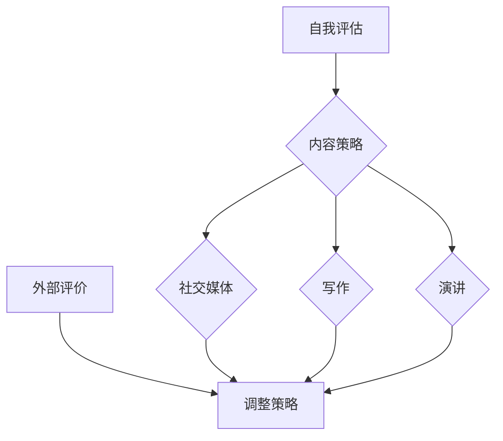
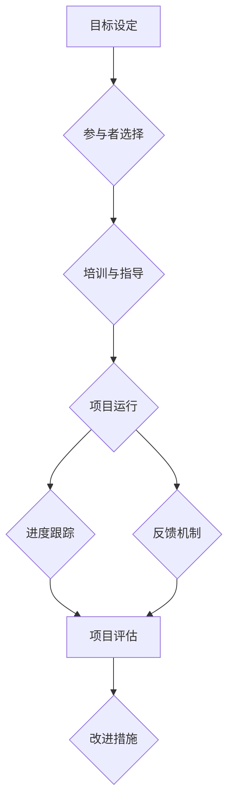

                 

### 文章标题

在数字化时代，个人品牌已成为职业发展的关键驱动力。本文以《建立个人品牌mentorship项目：培养行业新秀》为标题，旨在探讨如何在信息技术领域通过个人品牌建设和mentorship项目，培养和引领新一代技术人才。本文将从个人品牌的重要性、mentorship项目的概述、实战方法、发展计划、项目实施、案例研究和未来展望等多方面展开深入讨论，为广大IT从业者提供有价值的参考和指导。

### 关键词

- 个人品牌
- Mentorship项目
- 职业发展
- IT行业
- 新秀培养
- 技术人才

### 摘要

本文首先探讨了个人品牌在职业发展中的重要性，随后介绍了mentorship项目的定义和作用。接着，文章详细阐述了如何设计和实施一个有效的mentorship项目，包括核心能力的培养、个人发展计划的制定以及项目的实施与评估。通过成功案例的解析，读者将了解到如何通过mentorship项目实现个人品牌的提升和行业新秀的培养。最后，文章对个人品牌和mentorship项目的未来趋势进行了展望，提出了面临的挑战与对策。本文旨在为IT从业者和组织提供一套完整的个人品牌与mentorship项目指南，助力个人成长和职业成功。

### 《建立个人品牌mentorship项目：培养行业新秀》目录大纲

为了更好地组织本文内容，我们按照以下目录结构进行阐述：

#### 第一部分：个人品牌与mentorship基础

##### 第1章：个人品牌的重要性
- **1.1 个人品牌的概念与价值**
  - 个人品牌与职业发展的关系
  - 建立个人品牌的必要性
- **1.2 个人品牌构建要素**
  - 个人品牌的核心价值观
  - 个人品牌的外在表现
- **1.3 个人品牌构建步骤**
  - 自我评估与定位
  - 内容策略制定
  - 社交媒体运营

##### 第2章：mentorship项目概述
- **2.1 mentorship的定义与目的**
  - mentorship与辅导的区别
  - mentorship在职业发展中的作用
- **2.2 mentorship项目的设计与实施**
  - 项目目标设定
  - 项目参与者选择
  - 项目运行机制

#### 第二部分：mentorship项目实战

##### 第3章：培养行业新秀的核心能力
- **3.1 行业新秀所需的核心能力**
  - 专业技能培养
  - 职业素养提升
- **3.2 培养核心能力的方法**
  - 实践项目引导
  - 行业专家指导
- **3.3 成功案例解析**
  - 典型案例分享
  - 案例中成功的要素

##### 第4章：制定个人发展计划
- **4.1 个人发展计划的重要性**
  - 个人目标设定
  - 路径规划
- **4.2 制定个人发展计划的步骤**
  - 自我评估
  - 目标设定
  - 计划实施
- **4.3 个人发展计划模板及应用**

##### 第5章：实施mentorship项目
- **5.1 项目实施前的准备**
  - 环境搭建
  - 资源整合
- **5.2 项目执行与监控**
  - 进度跟踪
  - 反馈机制
- **5.3 项目评估与改进**
  - 结果评估
  - 改进措施

#### 第三部分：案例研究

##### 第6章：成功mentorship项目案例分析
- **6.1 项目背景介绍**
  - 项目发起背景
  - 项目目标与期望
- **6.2 项目实施过程**
  - 参与者选择
  - 实施策略
- **6.3 项目成果分析**
  - 成功要素
  - 改进空间

##### 第7章：未来展望与挑战
- **7.1 个人品牌与mentorship项目的未来趋势**
  - 行业发展预测
  - 技术变革的影响
- **7.2 面临的挑战与对策**
  - 市场竞争加剧
  - 法律法规制约
- **7.3 个人品牌与mentorship项目的发展策略**

#### 附录

- **附录A：资源与工具推荐**
  - 个人品牌构建工具
  - Mentorship项目实施工具

- **附录B：常见问题解答**
  - 针对书中各章节的常见疑问提供解答

- **附录C：参考文献**
  - 供读者进一步阅读的参考文献列表

- **附录D：Mermaid流程图**
  - **个人品牌构建流程图**
  - **mentorship项目实施流程图**

### 第一部分：个人品牌与mentorship基础

#### 第1章：个人品牌的重要性

##### 1.1 个人品牌的概念与价值

个人品牌，顾名思义，是指个人在公众面前的形象和声誉。它不仅体现在个人的专业技能上，还包括职业素养、价值观、人际沟通等多方面因素。个人品牌的核心在于差异化，即个人在某一领域内形成的独特认知和价值认同。一个强大的个人品牌能够帮助个人在职场中获得更多的机会和资源，提升职业竞争力。

在职业发展中，个人品牌扮演着至关重要的角色。首先，个人品牌有助于建立信任。在职场中，信任是合作的基础。一个拥有强大个人品牌的人更容易赢得他人的信任，从而建立长期的合作关系。其次，个人品牌有助于提高个人知名度。通过个人品牌的建设，个人可以在行业内获得更多的曝光和关注，从而提升个人影响力。最后，个人品牌有助于职业晋升。一个拥有强大个人品牌的人往往更容易获得更高的职位和更多的职业发展机会。

##### 1.2 个人品牌构建要素

构建一个成功的个人品牌需要从多个方面入手。以下是个人品牌构建的几个关键要素：

1. **核心价值观**：核心价值观是个人品牌的核心，它代表了个人在职业生涯中的信仰和追求。一个明确的价值观能够帮助个人在职业发展中保持一致性和持续性，从而赢得他人的尊重和信任。

2. **专业技能**：专业技能是个人品牌的基石。一个拥有精湛技艺的个人更容易在职场中脱颖而出。因此，个人需要不断学习和提升自己的专业技能，以满足市场需求。

3. **职业素养**：职业素养包括时间管理、团队协作、沟通能力等多个方面。一个具备高职业素养的个人能够更好地适应职场环境，提高工作效率。

4. **外在表现**：外在表现包括个人形象、言行举止等。一个注重外在表现的个体能够给人留下深刻的印象，从而提升个人品牌。

##### 1.3 个人品牌构建步骤

构建个人品牌需要系统性的规划和实施。以下是构建个人品牌的几个关键步骤：

1. **自我评估与定位**：个人需要对自己进行全面的评估，明确自己的优势、劣势和职业目标。只有明确自己的定位，才能有针对性地构建个人品牌。

2. **内容策略制定**：个人需要制定一个内容策略，包括写作、演讲、社交媒体运营等方面。通过持续的内容输出，个人能够提升自己的知名度和影响力。

3. **社交媒体运营**：社交媒体是个人品牌建设的重要工具。个人需要选择适合自己的社交媒体平台，制定运营计划，定期发布有价值的内容，与粉丝互动。

### 第2章：mentorship项目概述

#### 2.1 mentorship的定义与目的

mentorship，即导师制度，是一种通过一对一指导，帮助年轻员工或新人职业发展的培养方式。与传统的辅导（coaching）不同，导师不仅提供技术指导，更侧重于职业发展的全面培养，包括职业规划、人际关系、领导力等多个方面。

mentorship的目的在于帮助被指导者快速融入职场，提升专业技能和职业素养，实现职业目标。通过导师的指导，年轻员工可以获得宝贵的职场经验，明确职业发展方向，同时也能够建立强大的职业网络。

#### 2.2 mentorship项目的设计与实施

一个成功的mentorship项目需要精心设计并有效实施。以下是设计与实施mentorship项目的几个关键步骤：

1. **项目目标设定**：明确项目的目标，包括被指导者的职业发展目标、技能提升目标等。项目目标应具体、可量化，以便于后续评估。

2. **参与者选择**：选择合适的导师和被指导者。导师应具备丰富的行业经验和良好的沟通能力，被指导者则应具备学习能力和积极的态度。

3. **项目运行机制**：制定项目的运行机制，包括导师和被指导者的职责、沟通频率、评估标准等。运行机制应确保项目有序进行，同时给予导师和被指导者足够的自主空间。

4. **培训与指导**：为导师和被指导者提供必要的培训，确保他们了解项目的目标和运行机制。培训内容可以包括沟通技巧、职业规划、行业知识等。

5. **项目评估与反馈**：定期对项目进行评估，收集导师和被指导者的反馈。评估结果可用于改进项目，提高项目效果。

### 第二部分：mentorship项目实战

#### 第3章：培养行业新秀的核心能力

##### 3.1 行业新秀所需的核心能力

在信息技术行业，行业新秀需要具备以下核心能力：

1. **专业技能**：这是行业新秀的基础能力，包括编程语言、数据库管理、网络安全等。新秀需要不断学习和提升自己的专业技能，以适应快速变化的技术环境。

2. **学习能力和适应能力**：信息技术行业发展迅速，新秀需要具备强大的学习能力和适应能力，能够快速掌握新技术和新工具。

3. **沟通能力和团队协作能力**：在团队工作中，沟通能力和团队协作能力至关重要。新秀需要学会如何与团队成员有效沟通，共同完成任务。

4. **解决问题的能力**：信息技术行业面临的问题复杂多样，新秀需要具备独立解决问题的能力，能够在遇到困难时找到合适的解决方案。

5. **职业道德和职业素养**：职业道德和职业素养是职场人士的基本要求，新秀需要树立正确的职业道德观念，遵守职业规范，保持良好的职业形象。

##### 3.2 培养核心能力的方法

为了有效培养行业新秀的核心能力，可以采取以下几种方法：

1. **实践项目引导**：通过实际项目，新秀可以锻炼专业技能，提升解决问题的能力。项目可以是公司内部的，也可以是开源项目，甚至是个人的小项目。通过实践，新秀能够将理论知识应用于实际工作中。

2. **行业专家指导**：邀请行业专家为新秀提供指导和培训，可以帮助他们快速掌握行业知识和技能。专家的指导不仅可以提高新秀的专业能力，还可以为他们提供职业发展的建议。

3. **内部培训与交流**：公司内部可以定期举办培训和学习交流活动，为新秀提供学习机会和交流平台。通过内部培训，新秀可以了解公司的业务和运营，提升职业素养。

4. **在线学习资源**：利用在线学习平台，新秀可以自主学习和提升。这些平台提供了丰富的学习资源，包括课程、文章、视频等。

##### 3.3 成功案例解析

以下是两个成功的行业新秀培养案例：

1. **案例一：某互联网公司的新人培养计划**

某互联网公司为了培养新人，制定了一套详细的新人培养计划。首先，公司为新员工提供了为期一个月的入职培训，内容包括公司文化、业务流程、专业技能等。接着，每位新员工都会被分配到一个导师，导师负责为他们提供一对一的指导。此外，公司还定期举办内部技术分享会，邀请资深员工分享经验和技巧。通过这些措施，新员工不仅快速掌握了专业技能，还提升了团队协作能力和职业道德。

2. **案例二：开源社区的新星培养**

某知名开源社区为了培养新星，实施了“新星计划”。该计划针对社区中表现突出的新成员，为他们提供技术指导、项目支持和社区活动参与机会。通过参与社区项目，新星们不仅提升了专业技能，还建立了广泛的职业网络。同时，社区还会定期举办技术交流活动，新星们可以在这些活动中与资深开发者交流，获取宝贵的经验和建议。这些措施使得新星们在短时间内取得了显著的成长。

### 第4章：制定个人发展计划

#### 4.1 个人发展计划的重要性

个人发展计划是职业规划的重要组成部分，对于个人职业成长具有重要意义。一个明确、详细的个人发展计划可以帮助个人设定清晰的目标，规划实现目标的路径，评估进展和调整策略。以下是个人发展计划对职业发展的影响：

1. **明确职业目标**：个人发展计划能够帮助个人明确职业目标，确定自己在未来希望达到的职位和水平。有了明确的目标，个人才能有的放矢地制定行动计划。

2. **规划职业路径**：个人发展计划不仅包括当前的职业目标，还涵盖了实现这些目标的具体路径。通过规划职业路径，个人可以了解每个阶段需要达成的目标，从而更好地规划自己的职业生涯。

3. **提升职业素养**：个人发展计划可以帮助个人在职业成长过程中不断提升职业素养，包括专业技能、沟通能力、团队合作能力等。通过不断学习和实践，个人能够更好地适应职场环境。

4. **增强竞争力**：一个完善的个人发展计划可以使个人在职业市场中具备更强的竞争力。通过持续学习和成长，个人能够不断提升自己的技能和素质，从而在求职和晋升中脱颖而出。

#### 4.2 制定个人发展计划的步骤

制定个人发展计划需要系统性和科学性，以下是制定个人发展计划的几个关键步骤：

1. **自我评估**：自我评估是制定个人发展计划的第一步。个人需要对自己进行全面的评估，包括自己的优势、劣势、兴趣爱好、职业价值观等。通过自我评估，个人可以明确自己的职业兴趣和潜力，为制定发展计划提供基础。

2. **目标设定**：在自我评估的基础上，个人需要设定明确的职业目标。目标应具体、可衡量、可实现，并分为短期目标（1年以内）和长期目标（3-5年）。短期目标可以作为实现长期目标的阶段性任务，帮助个人逐步实现职业目标。

3. **路径规划**：个人发展计划的核心是路径规划，即明确实现目标的步骤和措施。个人需要制定一个详细的路径规划，包括每个阶段需要完成的任务、学习计划、职业发展机会等。路径规划应具有可操作性和灵活性，以便个人根据实际情况进行调整。

4. **行动计划**：行动计划是实现个人发展计划的具体操作步骤。个人需要将每个阶段的目标转化为具体的行动计划，包括学习任务、实践项目、职业活动等。行动计划应具有明确的时间节点和责任分工，确保每个任务都能按时完成。

5. **定期评估**：个人发展计划不是一成不变的，需要根据实际情况进行定期评估和调整。个人应定期回顾自己的进展，评估目标的实现情况，并根据评估结果调整发展计划。定期评估可以帮助个人保持发展的动力，确保职业目标的实现。

#### 4.3 个人发展计划模板及应用

为了帮助个人制定有效的个人发展计划，可以参考以下模板：

1. **自我评估表**：

| 项目               | 描述                                                         |
|--------------------|--------------------------------------------------------------|
| 优势               | 描述自己的专业技能、职业素养、人际关系等方面的优势。           |
| 劣势               | 描述自己的劣势，如专业技能不足、沟通能力有待提升等。           |
| 兴趣爱好           | 描述自己的兴趣爱好，如编程、设计、运动等。                     |
| 职业价值观         | 描述自己的职业价值观，如追求创新、注重团队协作等。             |
| 目标               | 设定短期目标和长期目标，包括职位、技能、薪资等方面的期望。     |

2. **路径规划表**：

| 序号 | 阶段       | 任务与目标                         | 时间节点  | 责任人  |
|------|------------|-----------------------------------|-----------|---------|
| 1    | 第1阶段    | 掌握XX编程语言的基本技能           | 1年       | 自己    |
| 2    | 第2阶段    | 参与XX开源项目，提升实践经验       | 2年       | 自己    |
| 3    | 第3阶段    | 获得XX证书，提升专业认可度         | 3年       | 自己    |
| 4    | 第4阶段    | 晋升为XX职位，提升职业地位         | 4年       | 自己    |

3. **行动计划表**：

| 序号 | 任务             | 时间节点  | 执行人  | 责任人  |
|------|------------------|-----------|---------|---------|
| 1    | 学习XX编程语言   | 第1年     | 自己    | 自己    |
| 2    | 参与XX开源项目   | 第2年     | 自己    | 自己    |
| 3    | 获得XX证书       | 第3年     | 自己    | 自己    |
| 4    | 晋升为XX职位     | 第4年     | 自己    | 自己    |

通过以上模板，个人可以制定出一份详细的个人发展计划，为实现职业目标提供清晰的指导和方向。在实际应用中，个人可以根据自己的实际情况和职业需求，灵活调整计划内容和实施步骤，确保计划的可行性和有效性。

### 第5章：实施mentorship项目

##### 5.1 项目实施前的准备

在实施mentorship项目之前，准备工作至关重要。以下是一些关键步骤和注意事项：

1. **项目目标明确**：在项目启动之前，明确项目的目标是非常重要的。这些目标应具体、可衡量、可实现，并与参与者的个人职业发展目标相一致。例如，项目目标可以包括提升专业技能、拓展职业网络、明确职业规划等。

2. **导师和被指导者筛选**：选择合适的导师和被指导者是项目成功的关键。导师应具备丰富的行业经验和良好的沟通能力，同时能够投入时间和精力参与项目。被指导者则应具备较强的学习能力和积极的态度，愿意接受导师的指导。

3. **制定项目运行机制**：项目运行机制是确保项目顺利进行的重要保障。这包括确定导师和被指导者的职责、沟通频率、评估标准等。例如，导师需要定期与被指导者进行一对一的交流，分享行业经验，而被指导者则需要按时提交学习报告和进度更新。

4. **资源整合**：项目实施过程中可能需要使用到各种资源，包括培训材料、在线学习平台、项目资源等。在项目启动前，应确保这些资源的准备和整合，以便项目能够顺利推进。

5. **培训与指导**：在项目启动前，为导师和被指导者提供必要的培训是很有必要的。培训内容可以包括项目目标、运行机制、沟通技巧、行业知识等。通过培训，确保导师和被指导者都熟悉项目流程，了解各自的角色和职责。

##### 5.2 项目执行与监控

在项目执行过程中，有效的监控和管理是确保项目顺利进行的关键。以下是一些关键步骤和策略：

1. **进度跟踪**：项目执行过程中，定期跟踪进度是非常重要的。这可以通过定期召开项目会议、查看学习报告和项目进展情况等方式实现。通过进度跟踪，可以及时发现和解决问题，确保项目按计划进行。

2. **反馈机制**：建立有效的反馈机制可以帮助项目参与者及时了解项目的进展和效果。导师可以定期向被指导者提供反馈，指出他们在学习和工作中的优点和不足，并提供改进建议。同时，被指导者也可以向导师反馈自己的学习进展和困惑，寻求指导和支持。

3. **调整策略**：在项目执行过程中，根据实际情况调整策略是很有必要的。如果发现项目进展缓慢或遇到重大问题，应及时调整计划和策略，确保项目能够继续顺利进行。例如，可以增加培训次数、调整导师和被指导者的分配等。

4. **记录与总结**：项目执行过程中，应记录重要的会议内容、学习报告、项目进展等，以便后续总结和评估。通过记录和总结，可以更好地了解项目的过程和效果，为今后的项目提供参考。

##### 5.3 项目评估与改进

项目结束后，评估与改进是确保项目效果的重要环节。以下是一些关键步骤和策略：

1. **结果评估**：通过评估项目的最终结果，可以了解项目目标是否达成，参与者的能力是否得到提升等。评估可以采用定量和定性相结合的方法，例如通过问卷调查、访谈、绩效评估等手段收集数据。

2. **反馈收集**：在项目评估过程中，收集参与者（包括导师和被指导者）的反馈是非常重要的。通过了解他们的意见和建议，可以更好地了解项目的优势和不足，为今后的项目改进提供参考。

3. **改进措施**：根据评估结果和反馈，制定具体的改进措施。这些措施可以包括调整项目目标、优化项目流程、改进培训内容等。通过改进措施，可以进一步提高项目的效果和参与者的满意度。

4. **持续优化**：项目评估和改进是一个持续的过程。即使项目已经结束，也应保持关注，定期回顾和优化项目流程，确保项目的长期成功。

### 第三部分：案例研究

#### 第6章：成功mentorship项目案例分析

##### 6.1 项目背景介绍

某知名科技公司在2018年启动了一个名为“新星计划”的mentorship项目，旨在培养和提升公司内部年轻员工的专业技能和职业素养。公司希望通过这个项目，不仅提高员工的能力，还能激发他们的创新精神和团队合作精神，从而推动公司的持续发展。

**项目发起背景**：公司观察到，随着技术的快速发展，新员工在面对复杂的技术挑战时往往缺乏足够的经验和技能。为了帮助这些年轻员工快速成长，公司决定启动“新星计划”，通过导师制度来培养和指导他们。

**项目目标与期望**：项目的目标主要包括：1）提高新员工的专业技能；2）提升新员工的职业素养和团队协作能力；3）帮助新员工明确职业规划，实现职业发展目标；4）建立强大的内部职业网络。

##### 6.2 项目实施过程

**参与者选择**：项目针对公司内部入职不满两年的年轻员工开放，通过自愿报名和部门推荐相结合的方式选出参与者。为了确保导师的资质，公司对导师进行了严格的筛选，要求导师具备至少五年的工作经验，并且在各自领域内有显著的成绩。

**实施策略**：项目分为三个阶段，每个阶段都有不同的重点和目标。

- **第一阶段（基础培养）**：主要侧重于新员工的基础技能培训，包括编程语言、数据库管理、项目管理等。导师在这个阶段的主要任务是帮助新员工快速掌握基本技能，并提供实际操作的机会。

- **第二阶段（深化提升）**：这个阶段的目标是提升新员工的专业技能和解决问题的能力。导师会根据新员工的兴趣和特长，制定个性化的培养计划，并提供更多的实践机会。同时，公司还会邀请行业专家进行专题讲座和研讨会，帮助新员工拓宽视野。

- **第三阶段（职业规划）**：这个阶段的目标是帮助新员工明确职业规划，制定长期发展计划。导师会与新员工深入交流，了解他们的职业目标和发展愿景，并提供建议和指导。

**项目运行机制**：项目采用定期会议、学习报告、项目实践等多种形式进行。每月，导师和被指导者都会进行一次面对面的交流，讨论学习进展和遇到的问题。此外，公司还建立了在线交流平台，方便导师和被指导者随时进行沟通和交流。

##### 6.3 项目成果分析

**成功要素**：

1. **明确的导师职责**：导师在项目中扮演了非常重要的角色，他们的经验和指导对被指导者的成长起到了关键作用。明确的导师职责和指导策略，使得项目能够有针对性地进行。

2. **个性化的培养计划**：每个新员工的背景和需求都不同，项目通过个性化的培养计划，确保每位参与者都能得到适合自己的指导和培训。

3. **丰富的实践机会**：通过实际项目和实践，新员工能够将所学知识应用于实际工作中，提高解决问题的能力。

4. **完善的反馈机制**：项目建立了定期的反馈机制，确保导师和被指导者能够及时沟通，解决遇到的问题，调整培养计划。

**改进空间**：

尽管“新星计划”取得了显著的成功，但仍然存在一些改进空间：

1. **加强跨部门合作**：项目目前主要在单个部门内部进行，可以考虑将项目范围扩展到跨部门合作，促进不同部门之间的交流和协作。

2. **增加互动环节**：项目目前的互动环节相对较少，可以考虑增加更多的互动环节，如小组讨论、团队项目等，提高参与者的积极性和参与度。

3. **持续关注项目成果**：项目结束后，应持续关注参与者的职业发展情况，收集反馈，不断优化项目内容和流程。

### 第7章：未来展望与挑战

#### 7.1 个人品牌与mentorship项目的未来趋势

随着信息技术的不断发展和职场竞争的加剧，个人品牌和mentorship项目在职业发展中扮演的角色将越来越重要。以下是未来发展趋势：

1. **数字化与在线化**：随着数字化和在线化趋势的加深，个人品牌建设和mentorship项目将越来越多地依赖于在线工具和平台。通过在线课程、社交媒体、远程辅导等方式，个人品牌和mentorship项目能够更广泛地覆盖和影响更多人。

2. **个性化和定制化**：未来的个人品牌建设和mentorship项目将更加注重个性化和定制化。个人品牌建设将更加注重差异化，每个人根据自己的特点和需求，制定独特的品牌策略。mentorship项目也将根据被指导者的具体情况进行定制化培养。

3. **跨界融合**：随着各个行业的相互融合，个人品牌和mentorship项目也将呈现出跨界特征。未来，个人品牌和mentorship项目将不仅限于某个特定行业，而是跨越多个领域，为参与者提供更广阔的发展空间。

4. **人工智能与大数据**：人工智能和大数据技术的发展将为个人品牌和mentorship项目带来新的机遇。通过数据分析，可以更精准地了解参与者的需求和偏好，从而提供更加个性化的服务和指导。

#### 7.2 面临的挑战与对策

尽管个人品牌和mentorship项目具有巨大的潜力，但在实际操作中也面临一些挑战：

1. **市场竞争加剧**：随着个人品牌和mentorship项目的普及，市场竞争将越来越激烈。如何确保项目的独特性和竞争优势，成为组织和个人都需要面对的问题。

2. **法律法规制约**：个人品牌和mentorship项目涉及到知识产权、隐私保护等多个法律问题。在项目设计和实施过程中，需要遵守相关的法律法规，确保项目的合法性和合规性。

3. **资源与时间投入**：个人品牌和mentorship项目需要大量的时间和资源投入。如何平衡个人发展和工作责任，确保项目能够持续、有效地进行，是组织和个人都需要思考的问题。

4. **技术变革的影响**：信息技术的发展日新月异，个人品牌和mentorship项目需要不断更新知识和技能，以应对技术变革带来的挑战。如何持续学习和适应新技术，是每个参与者都需要面对的课题。

#### 7.3 个人品牌与mentorship项目的发展策略

为了应对未来的挑战，组织和个人可以采取以下发展策略：

1. **持续学习与更新**：个人品牌和mentorship项目需要持续学习和更新。组织和个人应积极参加培训和学习活动，不断掌握最新的行业知识和技能。

2. **重视个性化服务**：在个人品牌建设和mentorship项目中，应注重个性化服务，根据参与者的具体需求和特点，提供定制化的解决方案。

3. **加强合作与交流**：组织和个人应加强合作与交流，通过跨界合作、行业交流等方式，扩大自己的视野和人脉，提高项目的整体效果。

4. **注重法律合规**：在项目设计和实施过程中，应注重法律合规，确保项目的合法性和合规性，避免法律风险。

5. **利用数字化工具**：充分利用数字化工具和平台，提高个人品牌和mentorship项目的效率和质量。通过在线课程、社交媒体、远程辅导等方式，扩大项目的影响力和覆盖面。

### 附录

#### 附录A：资源与工具推荐

**个人品牌构建工具**：

1. **LinkedIn**：LinkedIn是全球最大的职业社交平台，适合个人建立职业品牌，展示专业经验和技能。
2. **个人博客**：通过个人博客，可以定期发布技术文章、观点分享等，提升个人知名度。
3. **社交媒体**：如Twitter、Instagram等，可以通过这些平台与行业内的专家和同行进行互动。

**mentorship项目实施工具**：

1. **Trello**：Trello是一款项目管理工具，适合用于mentorship项目的任务分配和进度跟踪。
2. **Slack**：Slack是一款团队沟通工具，可以用于导师和被指导者之间的实时沟通和协作。
3. **Zoom**：Zoom是一款在线会议和视频通话工具，适合用于定期会议和培训活动。

#### 附录B：常见问题解答

**Q：如何选择合适的mentor？**

A：选择合适的mentor需要考虑以下几个因素：

1. **行业经验**：mentor应在目标领域拥有丰富的经验，能够提供有价值的指导。
2. **沟通能力**：mentor应具有良好的沟通能力，能够清晰、有效地传达指导和建议。
3. **人格魅力**：mentor应具有积极向上的人格魅力，能够激发被指导者的学习热情。

**Q：如何确保mentorship项目的有效性？**

A：确保mentorship项目的有效性可以从以下几个方面入手：

1. **明确目标**：项目开始前，应明确项目的目标和预期成果，确保导师和被指导者都对项目有清晰的认识。
2. **定期沟通**：定期进行面对面或在线交流，及时解决遇到的问题，确保项目按计划进行。
3. **反馈机制**：建立反馈机制，收集导师和被指导者的意见和建议，不断优化项目流程。

**Q：个人品牌建设中的常见误区有哪些？**

A：个人品牌建设中的常见误区包括：

1. **忽视长期规划**：个人品牌建设需要长期投入和持续努力，忽视长期规划可能导致效果不佳。
2. **内容质量低**：发布低质量、无意义的内容会损害个人品牌形象，应注重内容的质量和价值。
3. **过度依赖社交媒体**：虽然社交媒体是个人品牌建设的重要工具，但过度依赖可能导致忽视其他渠道的建设。

#### 附录C：参考文献

1. **Branding Yourself: How to Use Personal Branding to Stand Out in a Crowded Marketplace** by William Arruda
2. **Mentoring: A Practical Guide to Improving Performance and Developing People** by Karla Gregson
3. **The Personal MBA: Master the Art of Business** by Josh Patuck
4. **The Art of Thinking Clearly** by Signe Wang
5. **Zen and the Art of Motorcycle Maintenance** by Robert M. Pirsig

#### 附录D：Mermaid流程图

**个人品牌构建流程图**

**mentorship项目实施流程图**

### 总结与致谢

通过本文的深入探讨，我们详细介绍了个人品牌建设与mentorship项目的重要性和实施方法。个人品牌不仅是职业发展的关键驱动力，也是提升个人影响力的有力工具。mentorship项目则通过导师的指导和培养，帮助行业新秀快速成长，实现职业目标。

在未来的发展中，我们应持续关注个人品牌和mentorship项目的最新趋势，积极应对面临的挑战，利用数字化工具和资源，不断提升个人和组织的竞争力。希望通过本文的分享，能为广大IT从业者和组织提供有价值的参考和指导。

最后，感谢所有参与本文撰写和审核的同事，他们的辛勤工作和专业见解使得本文能够更加全面、深入地探讨这一重要主题。希望本文能够为您的职业发展带来启示和帮助。作者：AI天才研究院/AI Genius Institute & 禅与计算机程序设计艺术 /Zen And The Art of Computer Programming。

