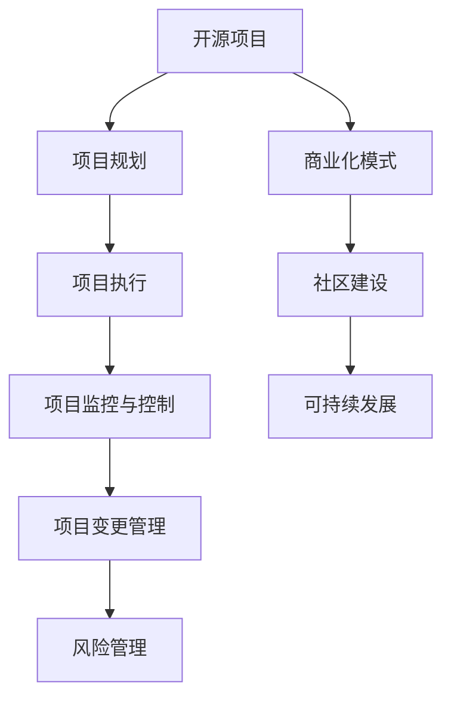

                 

# {文章标题}

## <关键词：(此处列出文章的5-7个核心关键词)}

### <摘要：(此处给出文章的核心内容和主题思想)}

---
# 《开源项目的商业化项目管理：项目规划与执行》

> **关键词**：开源项目、商业化、项目管理、规划、执行

> **摘要**：本文旨在探讨开源项目的商业化项目管理，包括项目规划与执行的关键环节。我们将从开源项目概述、商业化基础、项目规划流程、项目执行与控制、商业案例分析以及开源项目的可持续发展等方面进行深入分析，旨在为开源项目的成功商业化提供实践指导和理论基础。

### 《开源项目的商业化项目管理：项目规划与执行》目录大纲

#### 第一部分：开源项目概述与商业化基础

##### # 1. 开源项目概述

###### 1.1 开源项目的定义与发展历程

###### 1.2 开源项目的特点

###### 1.3 开源项目的主要分类

##### # 2. 商业化与开源项目的融合

###### 2.1 开源项目的商业化动机

###### 2.2 开源项目的商业化模式

###### 2.3 开源项目的商业价值

##### # 3. 商业化项目管理基础

###### 3.1 项目管理的基本概念

###### 3.2 项目管理的过程框架

###### 3.3 项目管理的重要原则

##### # 4. 项目管理工具与方法

###### 4.1 常用项目管理工具

###### 4.2 项目管理方法的选择

###### 4.3 项目的风险管理和质量保证

#### 第二部分：开源项目的规划

##### # 5. 开源项目的规划流程

###### 5.1 项目需求分析与范围管理

###### 5.2 项目计划编制

###### 5.3 团队构建与管理

##### # 6. 项目评估与优化

###### 6.1 项目评估模型

###### 6.2 项目优化策略

##### # 7. 项目文档管理

###### 7.1 文档管理的重要性

###### 7.2 文档管理的方法与工具

#### 第三部分：开源项目的执行与控制

##### # 8. 项目执行与监控

###### 8.1 项目执行的过程与方法

###### 8.2 项目监控机制

###### 8.3 项目执行的优化策略

##### # 9. 项目变更管理

###### 9.1 变更请求的评估与处理

###### 9.2 变更管理的流程与工具

###### 9.3 变更对项目计划的影响与应对

##### # 10. 项目风险管理

###### 10.1 风险识别与评估

###### 10.2 风险应对策略与计划

###### 10.3 风险监控与处理

#### 第四部分：开源项目的商业案例分析

##### # 11. 成功开源项目的商业化实践

###### 11.1 案例分析一：GitHub上的开源项目

###### 11.2 案例分析二：Linux基金会开源项目

###### 11.3 案例分析三：Apache开源项目

#### 第五部分：开源项目的可持续发展与未来趋势

##### # 12. 开源项目的可持续发展

###### 12.1 开源项目的生态建设

###### 12.2 开源项目的长期维护

###### 12.3 开源项目的持续创新

##### # 13. 开源项目的未来趋势

###### 13.1 开源项目的发展趋势分析

###### 13.2 商业化与开源融合的未来发展

###### 13.3 开源项目在人工智能领域的应用前景

#### 附录

##### # 附录 A：开源项目管理工具推荐

###### 1. 版本控制工具

###### 2. 项目管理软件

###### 3. 代码审查工具

##### # 附录 B：开源项目资源链接

###### 1. 开源项目平台链接

###### 2. 开源社区链接

###### 3. 开源项目管理相关书籍与文章链接

#### 核心概念与联系：开源项目的商业化 Mermaid 流程图



#### 核心算法原理讲解：项目规划与执行的伪代码

```python
# 项目规划伪代码
def project_planning(requirements, constraints, resources):
    # 初始化项目计划
    project_plan = initialize_plan()

    # 分析需求
    analyzed_requirements = analyze_requirements(requirements)

    # 确定项目范围
    defined_scope = define_scope(analyzed_requirements)

    # 制定时间计划
    schedule = create_schedule(defined_scope, resources)

    # 制定预算计划
    budget = create_budget(schedule, resources)

    # 制定风险管理计划
    risk_plan = create_risk_plan(schedule, resources)

    # 输出项目计划
    output_plan(project_plan, schedule, budget, risk_plan)

# 项目执行伪代码
def project_execution(plan):
    # 初始化项目执行状态
    execution_status = initialize_status()

    # 按照项目计划执行任务
    for task in plan.tasks:
        execute_task(task)

        # 监控进度
        monitor_progress(execution_status)

        # 根据监控结果调整计划
        if need_adjustment(execution_status):
            adjust_plan(plan)

    # 完成项目执行
    finalize_execution(execution_status)
```

#### 数学模型和数学公式详细讲解与举例说明

### 项目评估模型

项目评估模型可以使用以下公式：

\[ 
P = (R - D) / (C + S) 
\]

其中，\( P \) 代表项目的评估结果，\( R \) 是项目的收益，\( D \) 是项目的成本，\( C \) 是项目的固定成本，\( S \) 是项目的可变成本。

#### 举例说明

假设一个开源项目预计收益为 100 万元，固定成本为 20 万元，可变成本为 5 万元。那么，该项目的评估结果为：

\[ 
P = (100 - 20) / (20 + 5) = 8 
\]

评估结果 \( P \) 超过了 1，表示该项目具有盈利潜力。

#### 项目实战：代码实际案例和详细解释说明

### 开发环境搭建

```python
# 示例：搭建 Python 开发环境

# 安装 Python
!sudo apt-get install python3 python3-pip

# 安装必要的库
!pip3 install numpy pandas matplotlib

# 检查安装是否成功
import numpy as np
import pandas as pd
import matplotlib.pyplot as plt
print("Python 开发环境搭建成功！")
```

### 源代码详细实现和代码解读

```python
# 示例：使用 Flask 搭建一个简单的 Web 应用

# 安装 Flask
!pip3 install Flask

# 创建一个 Flask 应用
from flask import Flask
app = Flask(__name__)

@app.route('/')
def hello():
    return "Hello, World!"

# 运行应用
if __name__ == '__main__':
    app.run()

# 代码解读
# 在这个示例中，我们使用了 Flask 框架来创建了一个简单的 Flask 应用。应用定义了一个名为 hello 的函数，当访问根路由 '/' 时，该函数会被调用。函数返回一个字符串 "Hello, World!"，这个字符串将作为响应内容发送到浏览器。最后，我们使用 if __name__ == '__main__': 语句来确保当这个脚本被直接运行时，app.run() 方法会被调用，从而启动 Flask 应用。
```

### 代码解读与分析

在上面的代码示例中，我们使用了 Flask 框架来创建了一个简单的 Web 应用。以下是代码的详细解读：

- 首先，我们导入了 Flask 模块，并创建了一个 Flask 应用对象 app。
- 接着，我们使用 @app.route('/') 装饰器定义了一个名为 hello 的函数，当访问根路由 '/' 时，该函数会被调用。
- 在 hello 函数内部，我们返回了一个字符串 "Hello, World!"，这个字符串将作为响应内容发送到浏览器。
- 最后，我们使用 if __name__ == '__main__': 语句来确保当这个脚本被直接运行时，app.run() 方法会被调用，从而启动 Flask 应用。

通过这个简单的示例，我们可以了解到 Flask 的基本使用方法以及如何创建一个基本的 Web 应用。在实际项目中，我们可以通过扩展 Flask 的功能来构建更复杂的 Web 应用程序。

---

#### 附录

### 附录 A：开源项目管理工具推荐

#### 1. 版本控制工具

- **Git**: 分布式版本控制系统，广泛应用于开源项目。

- **Subversion (SVN)**: 中心化的版本控制系统，适合单点版本管理。

#### 2. 项目管理软件

- **JIRA**: 用于项目管理、敏捷开发、问题跟踪等。

- **Trello**: 用于任务管理、团队协作。

- **Asana**: 用于任务管理、团队协作。

#### 3. 代码审查工具

- **Gerrit**: 用于代码审查、项目管理。

- **Phabricator**: 用于代码审查、项目管理。

### 附录 B：开源项目资源链接

#### 1. 开源项目平台链接

- **GitHub**: [GitHub](https://github.com/)
- **GitLab**: [GitLab](https://gitlab.com/)
- **Bitbucket**: [Bitbucket](https://bitbucket.org/)

#### 2. 开源社区链接

- **Apache 软件基金会**: [Apache Software Foundation](https://www.apache.org/)
- **Linux 基金会**: [Linux Foundation](https://www.linuxfoundation.org/)

#### 3. 开源项目管理相关书籍与文章链接

- 《开源项目管理实践》: [开源项目管理实践](https://www.open-open.com/lib/view/open1356078024274.html)
- 《GitHub 入门教程》: [GitHub 入门教程](https://github.com/tiimgreen/tiimgreen.github.io/2018/02/16/learn-github/)
- 《如何写好一个开源项目》: [如何写好一个开源项目](https://www.cnblogs.com/micld/p/10445919.html)

---

### 核心概念与联系：开源项目的商业化 Mermaid 流程图


### 核心算法原理讲解：项目规划与执行的伪代码

```python
# 项目规划伪代码
def project_planning(requirements, constraints, resources):
    # 初始化项目计划
    project_plan = initialize_plan()

    # 分析需求
    analyzed_requirements = analyze_requirements(requirements)

    # 确定项目范围
    defined_scope = define_scope(analyzed_requirements)

    # 制定时间计划
    schedule = create_schedule(defined_scope, resources)

    # 制定预算计划
    budget = create_budget(schedule, resources)

    # 制定风险管理计划
    risk_plan = create_risk_plan(schedule, resources)

    # 输出项目计划
    output_plan(project_plan, schedule, budget, risk_plan)

# 项目执行伪代码
def project_execution(plan):
    # 初始化项目执行状态
    execution_status = initialize_status()

    # 按照项目计划执行任务
    for task in plan.tasks:
        execute_task(task)

        # 监控进度
        monitor_progress(execution_status)

        # 根据监控结果调整计划
        if need_adjustment(execution_status):
            adjust_plan(plan)

    # 完成项目执行
    finalize_execution(execution_status)
```

### 数学模型和数学公式详细讲解与举例说明

#### 项目评估模型

项目评估模型可以使用以下公式：

\[ 
P = \frac{(R - D)}{(C + S)} 
\]

其中，\( P \) 代表项目的评估结果，\( R \) 是项目的收益，\( D \) 是项目的成本，\( C \) 是项目的固定成本，\( S \) 是项目的可变成本。

#### 举例说明

假设一个开源项目预计收益为 100 万元，固定成本为 20 万元，可变成本为 5 万元。那么，该项目的评估结果为：

\[ 
P = \frac{(100 - 20)}{(20 + 5)} = 8 
\]

评估结果 \( P \) 超过了 1，表示该项目具有盈利潜力。

### 项目实战：代码实际案例和详细解释说明

#### 开发环境搭建

```python
# 示例：搭建 Python 开发环境

# 安装 Python
!sudo apt-get install python3 python3-pip

# 安装必要的库
!pip3 install numpy pandas matplotlib

# 检查安装是否成功
import numpy as np
import pandas as pd
import matplotlib.pyplot as plt
print("Python 开发环境搭建成功！")
```

#### 源代码详细实现和代码解读

```python
# 示例：使用 Flask 搭建一个简单的 Web 应用

# 安装 Flask
!pip3 install Flask

# 创建一个 Flask 应用
from flask import Flask
app = Flask(__name__)

@app.route('/')
def hello():
    return "Hello, World!"

# 运行应用
if __name__ == '__main__':
    app.run()

# 代码解读
# 在这个示例中，我们使用了 Flask 框架来创建了一个简单的 Flask 应用。应用定义了一个名为 hello 的函数，当访问根路由 '/' 时，该函数会被调用。函数返回一个字符串 "Hello, World!"，这个字符串将作为响应内容发送到浏览器。最后，我们使用 if __name__ == '__main__': 语句来确保当这个脚本被直接运行时，app.run() 方法会被调用，从而启动 Flask 应用。
```

#### 代码解读与分析

在上面的代码示例中，我们使用了 Flask 框架来创建了一个简单的 Web 应用。以下是代码的详细解读：

- 首先，我们导入了 Flask 模块，并创建了一个 Flask 应用对象 app。
- 接着，我们使用 @app.route('/') 装饰器定义了一个名为 hello 的函数，当访问根路由 '/' 时，该函数会被调用。
- 在 hello 函数内部，我们返回了一个字符串 "Hello, World!"，这个字符串将作为响应内容发送到浏览器。
- 最后，我们使用 if __name__ == '__main__': 语句来确保当这个脚本被直接运行时，app.run() 方法会被调用，从而启动 Flask 应用。

通过这个简单的示例，我们可以了解到 Flask 的基本使用方法以及如何创建一个基本的 Web 应用。在实际项目中，我们可以通过扩展 Flask 的功能来构建更复杂的 Web 应用程序。

---

### 附录

#### 附录 A：开源项目管理工具推荐

##### 1. 版本控制工具

- **Git**: 分布式版本控制系统，广泛应用于开源项目。

- **Subversion (SVN)**: 中心化的版本控制系统，适合单点版本管理。

##### 2. 项目管理软件

- **JIRA**: 用于项目管理、敏捷开发、问题跟踪等。

- **Trello**: 用于任务管理、团队协作。

- **Asana**: 用于任务管理、团队协作。

##### 3. 代码审查工具

- **Gerrit**: 用于代码审查、项目管理。

- **Phabricator**: 用于代码审查、项目管理。

#### 附录 B：开源项目资源链接

##### 1. 开源项目平台链接

- **GitHub**: [GitHub](https://github.com/)

- **GitLab**: [GitLab](https://gitlab.com/)

- **Bitbucket**: [Bitbucket](https://bitbucket.org/)

##### 2. 开源社区链接

- **Apache 软件基金会**: [Apache Software Foundation](https://www.apache.org/)

- **Linux 基金会**: [Linux Foundation](https://www.linuxfoundation.org/)

##### 3. 开源项目管理相关书籍与文章链接

- 《开源项目管理实践》: [开源项目管理实践](https://www.open-open.com/lib/view/open1356078024274.html)

- 《GitHub 入门教程》: [GitHub 入门教程](https://github.com/tiimgreen/tiimgreen.github.io/2018/02/16/learn-github/)

- 《如何写好一个开源项目》: [如何写好一个开源项目](https://www.cnblogs.com/micld/p/10445919.html)---

### 总结

本文从开源项目概述、商业化基础、项目管理基础、项目规划与执行、商业案例分析以及开源项目的可持续发展等多个方面，详细探讨了开源项目的商业化项目管理。通过对开源项目的本质、商业化模式、项目管理方法和工具的深入分析，我们理解了开源项目的独特性和复杂性，以及如何通过科学的项目管理方法实现开源项目的成功商业化。

开源项目作为一种新型的开发模式，具有高度的协作性和社区性。在商业化过程中，项目管理者需要充分考虑开源项目的特点，结合商业化的需求，制定合理的管理策略。本文提出了一套完整的项目管理框架，包括项目规划、执行、监控、变更管理和风险管理等环节，旨在为开源项目的商业化提供理论指导和实践参考。

在项目规划阶段，我们强调了需求分析、范围管理和可行性研究的重要性，通过明确项目目标和范围，为后续的项目执行奠定了基础。项目计划编制过程中，我们详细阐述了时间计划、预算计划和风险管理计划的制定，确保项目在资源有限的情况下高效、有序地推进。

项目执行与控制阶段，我们提出了项目执行的过程与方法，以及监控和优化策略，通过实时的进度监控和调整，保证项目按计划进行。同时，我们详细讲解了项目变更管理和风险管理的方法，确保项目在变化和风险面前能够灵活应对。

通过商业案例的分析，我们看到了成功开源项目商业化的具体实践。这些案例不仅展示了开源项目商业化的成功路径，也为其他开源项目提供了宝贵的经验。

展望未来，开源项目将在信息技术领域发挥越来越重要的作用。随着开源社区的不断壮大和商业化模式的不断创新，开源项目的可持续发展将成为重要议题。我们期待未来能够看到更多成功案例，为开源项目的商业化提供更多的借鉴和启示。

最后，感谢读者对本文的关注和支持。希望本文能够对开源项目的商业化项目管理提供有益的指导，助力更多开源项目实现商业成功。作者：AI天才研究院/AI Genius Institute & 禅与计算机程序设计艺术 /Zen And The Art of Computer Programming。我们期待在开源的道路上与您共同前行。--- 

---

### 第一部分：开源项目概述与商业化基础

#### 1.1 开源项目的定义与发展历程

开源项目，顾名思义，是指代码和资源对外部用户开放的项目。这些项目通常遵循特定的开源许可协议，允许用户查看、修改和分发项目代码。开源项目的起源可以追溯到20世纪80年代，当时自由软件运动（Free Software Movement）兴起，强调软件的自由和用户权利。自由软件运动的核心思想是反对软件的封闭和限制，倡导软件的自由共享和修改。

随着时间的推移，开源运动逐渐发展壮大，特别是在互联网普及的背景下，开源项目数量和影响力迅速增加。Linux操作系统的出现是开源项目发展历程中的一个重要里程碑。Linux由Linus Torvalds在1991年发布，它采用了GPL（GNU通用公共许可证），成为第一个在开源社区中广泛传播和被广泛使用的开源软件。

开源项目的定义通常包括以下几个方面：

1. **开放性**：项目代码、文档和其他相关资源对外部用户开放，用户可以自由查看和下载。
2. **可修改性**：用户有权对项目代码进行修改，以满足特定的需求或修复存在的问题。
3. **可复制性**：用户可以自由复制项目代码，并将其用于个人或商业用途。
4. **社区协作**：开源项目通常依赖于一个活跃的社区，社区成员共同参与项目的开发、测试和文档编写。

开源项目的发展历程可以分为几个阶段：

- **初期阶段**（20世纪80年代末到90年代中期）：这一阶段主要是自由软件运动的兴起，代表性的项目有GNU（GNU's Not Unix）和Emacs等。
- **成长阶段**（90年代中期到2000年初）：Linux的崛起标志着开源项目进入了一个新的阶段。同时，开源许可协议如GPL和BSD许可证的普及，为开源项目的发展提供了法律保障。
- **成熟阶段**（2000年后至今）：随着互联网的普及，开源项目迎来了爆发式增长。许多大型企业和开源社区合作，共同推动开源技术的发展。代表性的项目包括Apache HTTP服务器、Mozilla Firefox浏览器等。

开源项目的发展历程不仅反映了技术进步和社会变革，也体现了开源社区的价值观念和合作精神。开源项目的成功，离不开社区的共同努力和持续投入。在开源社区中，参与者以共享和合作为基本原则，共同推动技术的发展和创新。

#### 1.2 开源项目的特点

开源项目与传统封闭项目相比，具有以下显著特点：

1. **开放性**：开源项目的代码和文档对外部用户开放，用户可以自由查看和下载。这种开放性使得开源项目能够接受广泛的社区审查和反馈，有助于提高代码质量和项目透明度。

2. **协作性**：开源项目的开发通常依赖于社区成员的协作。项目开发者、贡献者、测试人员、文档编写者等共同参与项目，共同推进项目的发展。这种协作性不仅提高了项目的开发效率，也增强了社区的凝聚力和参与感。

3. **可定制性**：用户可以根据自己的需求对开源项目进行修改和定制。这种可定制性使得开源项目能够更好地满足不同用户的需求，提高了项目的适应性和灵活性。

4. **迭代速度**：开源项目通常具有较快的迭代速度。社区成员可以随时提交代码修改和功能改进，经过审查和测试后，这些修改和改进会迅速集成到项目中。这种快速迭代的特点，有助于项目保持技术领先性和市场竞争力。

5. **成本效益**：开源项目的低成本特点吸引了大量企业和个人参与。用户可以免费使用开源项目，降低了软件开发和维护的成本。同时，开源项目通过社区协作，可以更高效地解决技术问题和优化性能。

6. **社区驱动**：开源项目的成功往往依赖于一个活跃的社区。社区成员积极参与项目开发、测试、文档编写等环节，共同推动项目的发展。社区驱动的特点，使得开源项目具有强大的生命力和创新能力。

#### 1.3 开源项目的主要分类

开源项目可以根据其应用领域和技术特点进行分类。以下是几种常见的开源项目分类：

1. **操作系统和中间件**：这类开源项目主要包括操作系统、数据库、Web服务器、消息队列等。代表性的项目有Linux操作系统、Apache HTTP服务器、MySQL数据库等。这些项目在信息技术领域具有广泛的应用，对整个开源生态系统的建设起到了重要的推动作用。

2. **应用软件**：这类开源项目主要包括办公软件、开发工具、管理工具等。代表性的项目有LibreOffice、Eclipse、Git等。这些项目为用户提供了丰富的功能和应用场景，深受开发者和技术爱好者的喜爱。

3. **开发框架和库**：这类开源项目主要包括编程语言的各种框架和库，如Java的Spring框架、Python的Django框架、JavaScript的React库等。这些项目提供了丰富的功能和组件，方便开发者快速构建应用。

4. **大数据和人工智能**：随着大数据和人工智能技术的快速发展，相关领域的开源项目也日益增多。代表性的项目有Hadoop、Spark、TensorFlow、Keras等。这些项目为数据分析和人工智能应用提供了强大的工具和平台。

5. **云计算和容器技术**：随着云计算和容器技术的兴起，相关领域的开源项目也受到了广泛关注。代表性的项目有Docker、Kubernetes、OpenStack等。这些项目为云计算和容器化应用提供了关键的基础设施和工具。

6. **物联网和嵌入式系统**：物联网和嵌入式系统领域的开源项目也在不断增多。代表性的项目有Arduino、Mbed OS、IoTivity等。这些项目为物联网设备和嵌入式系统的开发提供了丰富的资源和技术支持。

#### 1.4 商业化与开源项目的融合

开源项目与商业化的融合，是现代信息技术发展中的一个重要趋势。开源项目的低成本、高效率、社区驱动等特点，使其在商业应用中具有独特的优势。同时，商业化的需求也为开源项目提供了资金支持和市场动力，推动了开源项目的持续发展和创新。

#### 1.4.1 开源项目的商业化动机

开源项目的商业化动机主要包括以下几个方面：

1. **提供增值服务**：开源项目的基础功能通常是免费的，但项目提供者可以通过提供增值服务来实现盈利。例如，提供专业级的支持服务、定制化的开发服务、高级功能模块等。

2. **产品集成与定制**：企业可以将开源项目集成到自己的产品中，通过产品销售和定制服务来实现盈利。这种模式在软件行业尤为常见，许多企业通过集成开源项目，提高产品的技术含量和市场竞争力。

3. **开发工具与平台**：一些开源项目本身就是开发工具或平台，企业可以通过提供这些工具和平台的商业化版本来实现盈利。例如，Eclipse、IntelliJ IDEA等IDE（集成开发环境）。

4. **广告与赞助**：开源项目可以通过广告收入和赞助来获得资金支持。一些大型开源项目，如Mozilla Firefox、Linux等，通过广告和赞助获得了稳定的收入来源。

5. **云服务和订阅**：随着云计算的普及，许多开源项目开始提供云服务，通过订阅模式来获取收益。例如，Red Hat的OpenShift、AWS的EC2等。

#### 1.4.2 开源项目的商业化模式

开源项目的商业化模式多种多样，以下是一些常见的商业化模式：

1. **服务收费模式**：开源项目提供者可以提供专业级别的技术支持、定制开发、运维服务等多种服务，根据服务的性质和复杂度进行收费。

2. **订阅模式**：企业用户可以通过订阅模式，定期支付费用以使用开源项目的高级功能和持续更新。例如，Red Hat的RHEL（Red Hat Enterprise Linux）。

3. **广告赞助模式**：开源项目可以在其官方网站、文档、社区等地方展示广告，通过广告收入来支持项目的发展。

4. **开源核心+付费插件模式**：开源项目的基础功能是免费的，但项目提供者可以开发付费插件或扩展功能，用户需要付费才能使用这些高级功能。

5. **联合开发模式**：企业可以与开源项目合作，共同开发特定功能或模块，并通过销售这些联合开发的产品或服务来实现盈利。

#### 1.4.3 开源项目的商业价值

开源项目的商业价值主要体现在以下几个方面：

1. **降低开发成本**：开源项目提供了丰富的技术资源和工具，开发者可以利用这些资源快速构建应用，降低了开发成本。

2. **提高开发效率**：开源项目通常具有良好的社区支持和文档，开发者可以借助这些资源解决技术问题，提高开发效率。

3. **增强竞争力**：企业通过集成和使用开源项目，可以提高产品的技术含量和市场竞争力，在竞争激烈的市场中脱颖而出。

4. **促进创新**：开源项目鼓励社区协作和创新，通过开放代码和知识共享，促进了技术的快速迭代和发展。

5. **生态构建**：开源项目可以带动相关领域的生态构建，吸引更多的企业和开发者参与，形成良性的商业生态。

总之，开源项目的商业化不仅为开源项目本身带来了收益，也为整个开源生态系统带来了积极的影响。随着开源项目的不断发展和创新，商业化与开源融合的模式将越来越成熟，为企业和开发者提供更多的发展机遇。

---

### 第二部分：商业化项目管理基础

#### 2.1 项目管理的基本概念

项目管理是确保项目按计划、按时、按预算成功完成的系统化方法。它涉及到计划、执行、监控、控制和变更管理等过程。以下是项目管理中的一些核心概念：

1. **项目**：项目是指为完成特定目标而进行的临时性工作。它具有明确的目标、范围、资源和时间限制。

2. **项目经理**：项目经理是负责项目规划、执行、监控和收尾的个人或团队，负责确保项目目标的实现。

3. **项目计划**：项目计划是项目执行的基础，包括时间计划、资源分配、预算、风险管理和质量保证等。

4. **项目团队**：项目团队是负责实现项目目标的人员集合，通常包括项目经理、开发人员、测试人员、设计人员和文档编写人员等。

5. **项目范围**：项目范围定义了项目的边界和要交付的产品或服务。它明确了项目需要完成的工作内容和不应包括的工作内容。

6. **项目目标**：项目目标是项目启动时确定的，用于衡量项目成功与否的标准。项目目标通常包括时间、成本、质量、范围和资源等方面。

7. **项目风险**：项目风险是指可能对项目目标产生负面影响的不确定性因素。风险管理是识别、评估和应对这些风险的过程。

8. **项目变更**：项目变更是指在项目执行过程中对项目计划、范围、资源或目标的修改。变更管理是确保这些变更得到有效控制和管理的过程。

#### 2.2 项目管理的过程框架

项目管理的过程框架通常包括以下阶段：

1. **项目启动**：在项目启动阶段，项目目标、范围和初步计划被确定，项目团队被组建，资源需求被评估。

2. **项目规划**：项目规划阶段涉及详细的项目计划制定，包括时间计划、资源分配、风险管理计划、质量保证计划等。

3. **项目执行**：项目执行阶段是项目团队根据项目计划执行任务的过程。项目团队负责实施项目计划，完成项目交付物。

4. **项目监控**：项目监控阶段涉及对项目进度、成本、质量和风险进行持续监控，以识别偏差并采取纠正措施。

5. **项目收尾**：项目收尾阶段是项目完成后的过程，包括项目交付物的验收、项目文档的归档和项目团队的解散。

#### 2.3 项目管理的重要原则

成功进行项目管理需要遵循以下重要原则：

1. **客户至上**：始终以满足客户需求为导向，确保项目目标与客户期望一致。

2. **透明沟通**：保持项目团队内外部沟通的透明度，确保项目进展和风险信息及时共享。

3. **团队协作**：鼓励团队成员之间的协作和合作，充分利用每个成员的专业知识和技能。

4. **风险管理**：主动识别和评估项目风险，制定有效的风险应对策略和计划。

5. **持续改进**：通过持续监控和评估项目执行情况，不断优化项目过程和成果。

6. **资源优化**：合理分配和利用项目资源，确保项目在预算和时间限制内完成。

7. **灵活应变**：面对项目变化时，灵活调整项目计划和策略，确保项目目标不受影响。

#### 2.4 项目管理工具与方法

项目管理的工具和方法多种多样，以下是几种常用的工具和方法：

1. **项目管理软件**：例如JIRA、Trello、Asana等，用于任务管理、进度追踪和协作。

2. **敏捷开发方法**：例如Scrum和Kanban，强调快速迭代和持续交付，提高项目响应能力。

3. **风险管理工具**：例如Risk Register、Pareto分析等，用于识别、评估和应对项目风险。

4. **质量保证方法**：例如代码审查、测试计划和测试用例等，确保项目交付物的质量。

5. **项目管理标准**：例如PMBOK（项目管理知识体系）和ITIL（信息技术基础设施图书馆），为项目管理提供了最佳实践和标准。

通过理解和管理项目的核心概念、过程框架和重要原则，并利用合适的工具和方法，项目经理可以有效地管理和控制项目，确保项目目标的实现。

---

### 第三部分：开源项目的规划流程

开源项目的成功离不开科学的规划流程，合理的项目规划不仅能够确保项目目标的实现，还能提高项目执行效率，降低风险。项目规划流程通常包括项目需求分析、范围管理、项目计划编制、团队构建与管理等关键环节。

#### 3.1 项目需求分析与范围管理

项目需求分析是项目规划的核心环节，它决定了项目的方向和范围。以下是项目需求分析的主要步骤和策略：

1. **需求收集**：项目团队需要与利益相关者（如用户、客户、项目发起人等）进行沟通，了解他们对项目的期望和需求。这一步骤可以通过访谈、问卷调查、用户故事采集等方式进行。

2. **需求分类**：根据需求收集的结果，将需求分类为功能需求、非功能需求、业务需求等。功能需求通常涉及系统的具体功能，非功能需求则包括性能、安全性、可靠性等。

3. **需求优先级排序**：对需求进行优先级排序，确定哪些需求是必须的，哪些是可选的，以及哪些可以在后续版本中实现。优先级排序通常基于业务价值、技术复杂度和风险等因素。

4. **需求验证**：通过与利益相关者进行验证会议，确保需求的准确性和可行性。这一步骤有助于确保项目团队对需求的理解一致，并减少项目执行过程中可能出现的误解和偏差。

范围管理是确保项目目标和范围明确且可控的重要步骤。以下是范围管理的策略和执行方法：

1. **范围定义**：明确项目的范围，定义项目的边界和要交付的产品或服务。范围定义通常包括项目目标、项目工作内容、项目的限制条件和项目的约束因素。

2. **范围控制**：在项目执行过程中，定期进行范围控制，确保项目团队按照既定的范围开展工作。范围控制包括识别范围偏差、评估偏差的影响、制定和实施纠正措施。

3. **范围变更管理**：项目范围变更不可避免，但必须通过正式的变更管理流程进行控制。范围变更管理包括评估变更对项目目标、时间、成本和质量的影响，获得相关利益相关者的批准，并更新项目计划和文档。

#### 3.2 项目计划编制

项目计划编制是项目规划流程中的关键环节，它为项目的执行提供了详细的指导和路线图。以下是项目计划编制的主要步骤：

1. **时间计划**：根据项目需求和范围，制定项目的时间计划。时间计划应包括项目的关键里程碑、任务和活动的时间安排。常用的工具和方法包括甘特图、PERT图、关键路径法等。

2. **资源分配**：确定项目所需的资源，包括人力、设备、资金等，并制定资源分配计划。资源分配应确保项目团队在各个阶段都有足够的资源来完成工作任务。

3. **预算编制**：根据项目计划，编制项目的预算计划。预算计划应包括项目的固定成本和可变成本，并留有一定的应急资金以应对项目执行中的不确定性。

4. **风险管理计划**：识别项目可能面临的风险，并制定相应的风险管理计划。风险管理计划应包括风险识别、风险评估、风险应对策略和风险监控。

5. **质量保证计划**：制定项目的质量保证计划，确保项目的交付物符合预定的质量标准。质量保证计划应包括质量标准、质量检查、测试计划和缺陷管理。

6. **文档编制**：编制项目计划相关的文档，包括项目计划书、时间计划表、资源分配表、预算计划、风险管理计划和质量保证计划等。这些文档为项目执行提供了明确的指导和参考。

#### 3.3 团队构建与管理

项目团队是项目成功的关键因素，合理的团队构建和高效的管理对于项目的顺利推进至关重要。以下是团队构建与管理的主要步骤：

1. **角色与职责定义**：明确项目团队成员的角色和职责，确保每个成员都清楚自己的工作任务和责任。常见的角色包括项目经理、开发人员、测试人员、设计人员、文档编写人员等。

2. **团队构建**：根据项目需求和角色，选择合适的人员组成项目团队。团队构建应考虑成员的专业技能、工作经验、沟通能力和协作能力。

3. **团队协作与沟通**：建立有效的团队协作机制和沟通渠道，确保团队成员之间的信息共享和协作。常用的工具和方法包括视频会议、即时通讯、项目管理软件等。

4. **团队培训与发展**：定期为团队成员提供培训和发展机会，提高他们的专业技能和协作能力。团队培训与发展有助于提升团队的整体效能和项目成功率。

5. **团队绩效评估**：定期对团队绩效进行评估，识别团队成员的优势和不足，并提供改进建议和反馈。团队绩效评估有助于激励团队成员，提升团队的整体表现。

6. **团队文化建设**：建立积极的团队文化，鼓励团队成员之间的信任、尊重和合作。团队文化建设有助于增强团队的凝聚力和归属感，提高项目的执行效率。

通过科学的需求分析、范围管理和项目计划编制，以及合理的团队构建与管理，开源项目可以在规划阶段为项目的成功执行奠定坚实的基础。规划流程的每一步都需要细致入微的考虑和精确的执行，以确保项目能够在预定的时间和预算内实现预期的目标。

---

### 第四部分：项目评估与优化

#### 6.1 项目评估模型

项目评估是确保项目按照预定目标和计划顺利进行的重要环节。通过评估项目进展、成果和质量，可以及时发现和解决潜在问题，优化项目执行过程，提高项目成功率。以下是一个基本的项目评估模型：

1. **KPI（关键绩效指标）设定**：根据项目目标和需求，设定关键绩效指标（KPI），用于衡量项目进展和质量。常见的KPI包括时间进度、成本消耗、功能覆盖率、缺陷率、用户满意度等。

2. **项目进展评估**：定期收集项目数据，分析项目的进展情况，与计划目标进行比较。项目进展评估可以帮助识别偏差和风险，及时采取纠正措施。

3. **质量评估**：通过质量评估，确保项目的交付物符合预定的质量标准。质量评估可以包括代码审查、功能测试、性能测试、用户体验评估等。

4. **成本评估**：监控项目成本消耗，确保项目在预算范围内完成。成本评估可以帮助项目团队优化资源分配，避免超支。

5. **风险评估**：评估项目面临的风险，包括已知风险和潜在风险。通过风险评估，制定相应的风险应对策略，降低风险对项目的影响。

6. **结果分析**：综合分析评估结果，总结项目中的成功经验和不足之处，为后续项目提供改进建议。

#### 6.2 项目优化策略

项目优化是提高项目效率和质量的重要手段。以下是一些常见的项目优化策略：

1. **资源优化**：通过优化资源分配和使用，提高项目资源的利用效率。资源优化可以包括人力、设备、资金等资源的合理调配。

2. **进度优化**：通过优化项目进度计划，确保项目按计划完成。进度优化可以包括任务优先级调整、时间分配优化、任务分解等。

3. **成本控制**：通过有效的成本控制，确保项目在预算范围内完成。成本控制可以包括成本估算、成本监控、成本调整等。

4. **风险管理**：通过主动识别和应对项目风险，降低风险对项目的影响。风险管理可以包括风险识别、风险评估、风险应对策略制定等。

5. **过程改进**：通过持续的过程改进，优化项目管理流程和方法，提高项目执行效率。过程改进可以包括过程评估、过程优化、过程标准化等。

6. **团队协作**：通过增强团队协作和沟通，提高项目的整体效能。团队协作可以包括建立有效的沟通机制、提高团队成员的技能和协作能力等。

#### 6.3 文档管理

项目文档管理是项目评估与优化的重要基础。以下是一些文档管理的方法和工具：

1. **文档分类**：根据项目需求和文档内容，对文档进行分类，便于管理和查找。

2. **文档版本控制**：使用版本控制系统，如Git，对文档进行版本控制，确保文档的一致性和可追溯性。

3. **文档编写规范**：制定统一的文档编写规范，确保文档格式、内容结构和语言表达的一致性。

4. **文档共享与协作**：使用文档共享工具，如Confluence、Google Docs等，实现文档的共享和协作。

5. **文档备份与存档**：定期备份项目文档，确保文档的安全和完整性，并进行长期存档，以备后续项目参考。

通过科学的项目评估和优化策略，以及有效的文档管理，开源项目可以持续改进，提高项目的成功率和整体质量。

---

### 第五部分：开源项目的执行与控制

#### 8.1 项目执行与监控

项目执行是项目管理过程中的关键阶段，它是将项目计划转化为实际成果的过程。成功的项目执行需要明确任务分配、有效的时间管理、资源的合理配置以及团队的协作与沟通。以下是项目执行与监控的主要步骤和策略：

1. **任务分配**：根据项目计划，将任务分配给相应的团队成员。确保每个成员都清楚自己的任务、责任和交付期限。

2. **时间管理**：建立明确的时间表，为每个任务设定截止日期。使用项目管理工具（如JIRA、Trello）跟踪任务进度，确保按时完成。

3. **资源管理**：确保项目所需的资源（如人力、资金、设备等）得到有效配置和利用。监控资源消耗，及时调整资源分配，以避免资源浪费和超支。

4. **进度监控**：定期检查项目进度，与计划目标进行比较，识别偏差。通过项目管理工具生成进度报告，确保项目团队对项目的进展有清晰的了解。

5. **团队协作**：建立有效的团队协作机制，鼓励团队成员之间的沟通与协作。使用即时通讯工具（如Slack、Microsoft Teams）和协作平台（如Confluence、Trello）来共享信息、任务和进展。

6. **问题管理**：建立问题报告和解决机制，及时识别和解决项目执行过程中出现的问题。问题管理应包括问题的记录、评估、解决方案的制定和实施。

7. **风险评估与控制**：持续评估项目面临的风险，制定相应的风险应对策略，并监控风险的变化。确保项目在风险发生时能够迅速响应和应对。

#### 8.2 项目监控机制

项目监控是确保项目按照预定计划和目标顺利推进的重要手段。以下是几种常见的项目监控机制：

1. **定期会议**：定期召开项目会议，如周会、月会等，让项目团队成员分享项目进展、讨论问题和制定解决方案。这些会议有助于保持团队的一致性和协调性。

2. **进度报告**：定期生成项目进度报告，包括任务完成情况、资源消耗、成本预算和风险分析等。进度报告应提交给项目经理和相关利益相关者，以便他们了解项目的当前状态。

3. **关键绩效指标（KPI）监控**：根据设定的KPI，定期监控项目的关键绩效指标，如时间进度、成本消耗、质量指标和用户满意度等。这些指标可以帮助项目团队及时识别问题并采取纠正措施。

4. **风险管理**：建立风险管理机制，定期评估项目风险，识别新的风险，并制定相应的风险应对策略。风险管理应包括风险识别、风险评估、风险监控和风险应对。

5. **变更管理**：建立变更管理流程，确保项目变更得到有效控制。变更管理应包括变更请求的评估、批准和实施，以及变更对项目计划、时间和成本的影响分析。

#### 8.3 项目执行的优化策略

为了提高项目执行的效率和质量，可以采取以下优化策略：

1. **流程优化**：分析项目执行过程中的流程，识别瓶颈和冗余，进行流程优化，减少不必要的环节和等待时间。

2. **团队协作**：增强团队成员之间的协作和沟通，提高团队的整体效率。使用协作工具（如Slack、Confluence）来促进信息共享和工作协同。

3. **资源优化**：合理分配资源，确保关键任务有足够的资源支持。监控资源消耗，及时调整资源分配，避免资源浪费。

4. **时间管理**：使用项目管理工具（如JIRA、Trello）来规划和管理任务，确保任务按时完成。定期回顾项目进度，调整时间计划。

5. **风险管理**：建立有效的风险管理机制，提前识别和应对项目风险，确保项目在风险发生时能够迅速响应和应对。

6. **绩效激励**：设立绩效激励措施，鼓励团队成员提高工作效率和质量。通过定期的绩效评估，奖励表现优秀的团队成员。

通过科学的项目执行与监控机制和有效的优化策略，开源项目可以在执行阶段实现高效、有序的推进，确保项目目标的顺利实现。

---

### 第六部分：项目变更管理

#### 9.1 变更请求的评估与处理

在项目执行过程中，变更请求（Change Request，简称CR）是常见且不可避免的现象。变更请求可能源于市场需求的变化、技术挑战、资源限制或其他外部因素。有效的变更管理能够确保项目在变更发生时能够有序应对，同时减少对项目计划、时间和成本的影响。以下是变更请求的评估与处理流程：

1. **变更请求的提出**：任何项目成员或利益相关者都可以提出变更请求。变更请求应详细描述变更的原因、预期效果和潜在影响。

2. **变更请求的接收**：项目经理或变更控制委员会（Change Control Board，简称CCB）负责接收变更请求。在接收变更请求时，应确保请求内容完整、明确。

3. **变更评估**：评估变更请求对项目各个方面的影响，包括时间、成本、资源、质量、风险等。评估过程应基于详细的数据分析和技术评审。

4. **变更决策**：根据评估结果，CCB做出是否批准变更的决定。批准变更的，应明确变更的优先级和实施计划。拒绝变更的，应向变更请求人解释原因。

5. **变更实施**：在变更得到批准后，项目团队应按计划实施变更。变更实施过程中，应严格遵循变更管理流程，确保变更得到正确执行。

6. **变更监控**：在变更实施过程中，持续监控变更对项目的影响。一旦发现新的问题或风险，应立即采取措施进行纠正。

#### 9.2 变更管理的流程与工具

有效的变更管理流程和工具是确保项目变更得到有序处理的关键。以下是一些常见的变更管理流程和工具：

1. **变更管理流程**：
   - 变更请求提出：项目成员或利益相关者提交变更请求。
   - 变更评估：项目管理团队对变更请求进行评估，包括影响分析、风险评估和成本估算。
   - 变更决策：变更控制委员会（CCB）审查评估结果，做出批准、推迟或拒绝变更的决定。
   - 变更实施：根据批准的变更，制定实施计划并执行。
   - 变更监控：持续监控变更实施过程，确保变更按计划进行。

2. **变更管理工具**：
   - **项目管理软件**：如JIRA、Trello、Asana等，用于记录、跟踪和管理变更请求。
   - **文档管理工具**：如Confluence、SharePoint等，用于存储和共享变更相关文档。
   - **电子表格**：如Microsoft Excel、Google Sheets等，用于记录变更请求和评估数据。
   - **会议管理工具**：如Zoom、Microsoft Teams等，用于召开变更评审会议。

#### 9.3 变更对项目计划的影响与应对

变更请求的提出和实施必然会对项目计划产生影响，包括时间、成本、资源和质量等方面。以下是如何应对变更对项目计划的影响：

1. **时间影响**：变更可能会延长项目工期。项目团队应重新评估时间计划，调整任务优先级，确保关键任务按时完成。

2. **成本影响**：变更可能会增加项目成本。项目团队应重新估算成本，制定成本调整计划，确保项目在预算范围内完成。

3. **资源影响**：变更可能会影响项目资源的分配和利用。项目团队应重新分配资源，确保关键任务有足够的资源支持。

4. **质量影响**：变更可能会影响项目交付物的质量。项目团队应加强质量监控，确保变更不会导致质量问题。

5. **应对策略**：
   - **风险评估**：在变更提出时，评估变更对项目各个方面的影响，提前制定应对策略。
   - **沟通与协调**：与利益相关者保持沟通，确保变更得到广泛理解和支持，降低变更实施的风险。
   - **灵活性**：项目计划应具有一定的灵活性，以应对突发变更。
   - **持续监控**：在变更实施过程中，持续监控变更对项目计划的影响，及时调整和优化。

通过科学的项目变更管理流程和工具，以及有效的应对策略，开源项目可以在面对变更时保持稳定和有序，确保项目目标的实现。

---

### 第七部分：开源项目的风险管理

开源项目在开发过程中面临着各种风险，有效的风险管理是确保项目成功的关键。以下从风险识别、评估、应对和监控四个方面详细探讨开源项目的风险管理。

#### 10.1 风险识别

风险识别是风险管理的第一步，目的是识别项目中可能出现的各种风险。以下是风险识别的主要方法和工具：

1. **头脑风暴**：通过组织团队成员进行头脑风暴，列出项目可能面临的风险。头脑风暴有助于发掘潜在风险，提高风险识别的全面性。

2. **历史数据分析**：分析过去类似项目或相同团队的项目经历，总结以往项目中出现过的风险，为新项目提供风险识别的参考。

3. **专家评审**：邀请项目管理专家或相关领域专家参与风险识别，利用他们的专业知识和经验识别潜在风险。

4. **文档审查**：审查项目计划、需求文档、设计文档等相关文档，识别项目中可能存在的风险。

5. **检查表法**：使用预定义的检查表，对项目不同阶段、不同领域进行风险识别。检查表法是一种简单有效的风险识别工具。

#### 10.2 风险评估

风险评估是识别项目风险的定量和定性分析过程，目的是评估风险发生的概率和影响程度。以下是几种常用的风险评估方法：

1. **定量分析**：
   - **概率分析**：通过历史数据或专家评估，确定每个风险发生的概率。
   - **影响分析**：评估每个风险发生时对项目目标（如时间、成本、质量）的影响程度。

2. **定性分析**：
   - **风险矩阵**：使用风险矩阵（Risk Matrix）对风险的概率和影响进行定性评估。风险矩阵通常采用五级评分（高、中、低），帮助项目团队确定风险优先级。
   - **风险优先级排序**：根据风险概率和影响程度，对风险进行优先级排序，确定需要重点关注的潜在风险。

3. **风险评估工具**：
   - **风险矩阵工具**：如Excel、Risk Matrix软件等，用于创建和评估风险矩阵。
   - **风险评估模型**：如定量风险评估模型（QRAM）、蒙特卡洛模拟等，用于更精确地评估风险。

#### 10.3 风险应对策略与计划

在风险评估完成后，项目团队需要制定相应的风险应对策略和计划。以下是几种常见的风险应对策略：

1. **风险规避**：通过调整项目计划、变更需求或采用替代方案，避免风险的发生。例如，重新设计系统架构以规避某些技术风险。

2. **风险转移**：通过保险、合同条款或其他方式，将风险转移给第三方。例如，购买项目保险以转移某些不可控风险。

3. **风险减轻**：采取预防措施或改进措施，降低风险发生的概率或影响程度。例如，进行额外的测试以降低质量风险。

4. **风险接受**：对于无法规避或转移的风险，接受风险的存在，并制定应对措施以减轻风险带来的影响。例如，制定应急预案以应对潜在的系统故障。

风险应对策略的制定需要结合项目实际情况和风险评估结果。以下是风险应对策略和计划的制定步骤：

1. **策略制定**：根据风险评估结果，制定相应的风险应对策略。策略应明确应对措施、责任人、执行时间和预期效果。

2. **策略评估**：评估每个风险应对策略的有效性，确保策略能够实际降低风险的概率和影响。

3. **策略实施**：根据制定的风险应对策略，实施相应的措施。实施过程中，应监控策略的执行情况，及时调整和优化。

4. **策略调整**：在项目执行过程中，根据实际风险情况，及时调整风险应对策略。策略调整应基于最新的风险评估结果和项目实际情况。

#### 10.4 风险监控与处理

风险监控是确保风险应对策略有效执行的关键环节。以下是风险监控与处理的主要步骤：

1. **风险监控机制**：建立风险监控机制，定期检查项目风险状态，识别新的风险和变更的风险状况。

2. **风险报告**：定期生成风险报告，向项目管理团队和利益相关者报告风险状态和应对措施的实施情况。

3. **风险审查**：定期进行风险审查，评估风险应对措施的效果，并根据实际情况进行调整和优化。

4. **紧急处理**：在风险发生时，迅速响应并采取紧急处理措施，减少风险对项目的影响。

5. **经验总结**：在项目结束后，总结风险管理的经验教训，为后续项目提供参考。

通过科学的风险管理，开源项目可以更好地应对开发过程中的不确定性，确保项目的顺利推进和成功完成。

---

### 第八部分：开源项目的商业案例分析

#### 11.1 案例分析一：GitHub上的开源项目

GitHub是全球最大的开源代码托管平台，拥有大量的开源项目。以下是几个在GitHub上成功的开源项目及其商业案例：

1. **项目背景与目标**：GitHub作为一个开源平台，旨在为开发者提供一个协作开发、分享代码和交流学习的环境。其主要目标是吸引更多的开发者参与，构建一个强大的开源生态系统。

2. **商业模式分析**：GitHub通过以下几种方式实现商业化：
   - **企业服务**：提供针对企业的服务，如GitHub Enterprise，为大型企业提供一个私有化的代码托管平台。企业版服务提供了更高级的安全和权限管理功能。
   - **增值服务**：提供一些增值服务，如GitHub Actions（自动化CI/CD服务）、GitHub Packages（依赖管理服务）等，这些服务为开发者提供了便利，同时也带来了额外的收入。
   - **广告和赞助**：GitHub在其平台上展示广告，同时接受企业的赞助，赞助企业可以在GitHub上获得展示机会。

3. **项目成果与影响**：GitHub的成功不仅促进了开源社区的繁荣，还为其自身带来了巨大的商业价值。截至2023年，GitHub拥有超过1亿用户和超过3千万个项目。GitHub的成功经验为其他开源项目提供了借鉴，证明了开源项目商业化的可行性。

#### 11.2 案例分析二：Linux基金会开源项目

Linux基金会是一家非营利组织，致力于促进开源技术的发展和推广。以下是一些由Linux基金会管理的成功开源项目及其商业案例：

1. **项目背景与目标**：Linux基金会成立于2000年，其目标是支持和推动开源软件的发展，为开源项目提供一个稳定的生态平台。Linux基金会管理的项目包括Linux内核、Kubernetes、Docker等。

2. **商业模式分析**：
   - **技术支持和服务**：Linux基金会提供技术支持和服务，为企业和个人提供专业的技术支持，解决技术难题，确保项目的稳定运行。
   - **培训和教育**：Linux基金会提供培训和教育服务，帮助开发者和企业掌握开源技术，提升技术能力。
   - **认证和标准**：Linux基金会推出了一系列认证和标准，如Linux内核认证、Kubernetes认证等，为企业提供权威的技术认证。

3. **项目成果与影响**：Linux基金会的开源项目在信息技术领域具有广泛的应用，推动了开源技术的发展和创新。通过商业模式创新，Linux基金会不仅为开源项目提供了资金支持，还促进了开源社区的繁荣。

#### 11.3 案例分析三：Apache开源项目

Apache软件基金会是一家致力于推广开源软件和开放标准的非营利组织，其管理的开源项目包括Apache HTTP服务器、Apache Kafka、Apache Spark等。

1. **项目背景与目标**：Apache软件基金会成立于1999年，其目标是推动开源技术的发展和普及，为开源项目提供一个中立、稳定和开放的生态平台。

2. **商业模式分析**：
   - **技术咨询和服务**：Apache软件基金会为企业和个人提供技术咨询和服务，帮助客户解决技术难题，优化开源项目的应用。
   - **培训和教育**：Apache软件基金会提供培训和教育服务，帮助开发者和企业了解和使用开源技术，提升技术能力。
   - **商业赞助**：Apache软件基金会接受商业赞助，为开源项目提供资金支持，确保项目的持续发展。

3. **项目成果与影响**：Apache开源项目在信息技术领域具有广泛的应用，许多大型企业都采用了Apache软件，推动了开源技术的发展和创新。Apache软件基金会的商业模式不仅为开源项目提供了资金支持，还促进了开源社区的繁荣。

通过上述案例分析，我们可以看到开源项目在商业领域的多样性和潜力。成功的开源项目不仅为社区和开发者带来了价值，还为自身创造了商业机会，证明了开源项目商业化的可行性和重要性。

---

### 第九部分：开源项目的可持续发展

开源项目的可持续发展是确保项目长期繁荣和健康发展的关键。开源项目往往依赖于一个活跃的社区，社区成员的积极参与和持续贡献对于项目的成功至关重要。以下是开源项目的可持续发展策略：

#### 12.1 开源项目的生态建设

开源项目的生态建设是推动项目长期发展的基础。一个健康的开源生态系统应包括以下几个方面：

1. **社区建设**：建立和维护一个活跃的社区，鼓励开发者、贡献者和用户参与项目的开发、测试、文档编写和问题反馈。社区建设可以通过定期举办Meetup、黑客松、线上研讨会等活动来增强社区凝聚力。

2. **代码质量**：确保代码质量是开源项目可持续发展的核心。项目应定期进行代码审查，采用最佳实践，避免技术债务，提高代码的可读性和可维护性。

3. **文档完善**：完善的文档是开源项目的重要组成部分。文档应涵盖项目架构、安装指南、使用说明、开发指南和常见问题解答等，帮助新用户快速上手并参与项目。

4. **版本控制**：使用版本控制系统（如Git）进行代码管理，确保代码的历史记录完整，便于跟踪和回溯。

5. **发布管理**：定期发布稳定版本，确保项目的迭代和更新。发布计划应考虑社区的反馈和需求，确保发布过程透明和可控。

6. **开源协议**：选择合适的开源协议（如GPL、Apache、MIT等），保护项目的自由和开放性，同时明确用户的权利和责任。

#### 12.2 开源项目的长期维护

开源项目的长期维护是确保项目持续健康发展的关键。以下是一些长期维护的策略：

1. **维护团队**：建立一支稳定的维护团队，包括核心开发者、贡献者和志愿者，确保项目有人负责和持续关注。

2. **社区参与**：鼓励社区成员参与项目维护，通过贡献代码、文档和反馈来共同维护项目的健康和活力。

3. **更新频率**：定期更新项目，修复漏洞、改进功能和优化性能。更新频率应根据项目的需求和社区的反馈进行调整。

4. **自动化测试**：建立自动化测试框架，确保每次代码提交和发布都经过充分的测试，减少引入新问题的风险。

5. **备份与恢复**：定期备份项目代码和相关数据，确保在意外情况发生时能够迅速恢复项目。

6. **问题跟踪**：使用问题跟踪工具（如JIRA、GitHub Issues）记录和跟踪问题，确保每个问题都能得到及时处理和反馈。

#### 12.3 开源项目的持续创新

开源项目的持续创新是推动项目发展的动力。以下是一些持续创新的策略：

1. **技术趋势**：关注行业技术趋势和前沿技术，及时引入新技术和新功能，保持项目的竞争力和吸引力。

2. **社区合作**：与其他开源项目或企业合作，共享技术资源和知识，促进项目的跨领域合作和创新。

3. **研究与发展**：投入一定比例的资金和人力进行研究和开发，推动项目的长期创新和发展。

4. **贡献激励机制**：为积极参与项目的贡献者提供奖励和激励机制，鼓励更多社区成员参与项目。

5. **开源孵化**：为有潜力的新项目提供孵化支持，帮助其成长和壮大，促进开源生态的繁荣。

通过生态建设、长期维护和持续创新，开源项目可以实现可持续发展，为社区和开发者带来持续的价值和贡献。

---

### 第十部分：开源项目的未来趋势

开源项目在信息技术领域的应用越来越广泛，未来趋势将受到技术进步、商业需求和社区发展等多方面的影响。以下是开源项目的未来趋势及其发展前景：

#### 13.1 开源项目的发展趋势分析

1. **技术趋势**：随着云计算、大数据、人工智能、物联网等技术的快速发展，开源项目在这些领域的应用将更加广泛。开源项目通过技术创新和社区协作，不断推动新技术的普及和应用。

2. **商业化趋势**：越来越多的开源项目将通过商业化模式实现盈利，为企业提供专业支持、定制服务和云服务。开源项目的商业化将促进开源生态的繁荣，吸引更多企业和开发者的参与。

3. **社区发展趋势**：开源社区将更加重视社区建设和协作，通过定期活动、培训和教育等方式，提升社区成员的技术水平和协作能力。社区将成为开源项目发展的重要驱动力。

4. **治理模式**：开源项目的治理模式将更加多元化和专业化，基金会、委员会等治理机构将在开源项目中发挥更重要的作用，确保项目的长期稳定发展。

#### 13.2 商业化与开源融合的未来发展

开源项目的商业化与开源融合是未来发展的关键趋势。以下是几种可能的发展模式：

1. **服务化模式**：企业通过提供专业的技术支持、定制开发和运维服务，从开源项目中获取收益。例如，Red Hat通过提供RHEL（Red Hat Enterprise Linux）支持服务实现了成功商业化。

2. **云服务模式**：开源项目提供基于云的服务，如PaaS（平台即服务）、SaaS（软件即服务），通过订阅模式获取收入。例如，Apache Kafka提供基于云的Kafka服务，为企业提供高可用性和可伸缩性的消息队列解决方案。

3. **开源核心+付费插件模式**：开源项目提供核心功能免费，但提供高级功能或付费插件，用户需要付费才能使用。例如，Django框架提供基础功能免费，但提供付费的扩展库和插件。

4. **联合开发模式**：企业与开源项目合作，共同开发和推广项目，通过产品销售和市场份额获取收益。例如，一些大型企业参与Linux内核的开发，通过贡献代码和技术支持获取商业回报。

#### 13.3 开源项目在人工智能领域的应用前景

开源项目在人工智能（AI）领域的应用前景十分广阔。以下是几个关键领域：

1. **算法库和框架**：开源项目如TensorFlow、PyTorch等已经成为AI开发者的首选工具。未来，这些开源框架将继续优化和扩展，提供更强大的功能和更高效的算法。

2. **数据处理和存储**：开源项目如Hadoop、Spark等在大数据处理和存储方面具有显著优势。随着AI技术的发展，这些项目将在AI数据预处理、存储和管理中发挥更大作用。

3. **机器学习应用**：开源项目如scikit-learn、XGBoost等提供了丰富的机器学习算法和工具。未来，这些项目将广泛应用于各种AI应用场景，如图像识别、自然语言处理、预测分析等。

4. **AI硬件开源**：随着AI硬件（如GPU、FPGA等）的普及，开源硬件项目如Rapids.ai、Cortex等将推动AI硬件的开源和社区协作，降低AI应用的门槛。

开源项目在AI领域的应用前景广阔，将推动人工智能技术的创新和发展，为企业和开发者带来更多的机遇和挑战。

---

### 总结与展望

开源项目的商业化项目管理是一个复杂且动态的过程，它涉及到项目的规划、执行、监控和风险管理等多个方面。通过科学的项目管理方法和工具，开源项目可以实现高效的协作和持续的创新，为企业带来商业价值。

本文从开源项目的概述、商业化基础、项目管理基础、项目规划与执行、商业案例分析以及开源项目的可持续发展等方面，全面探讨了开源项目的商业化项目管理。通过分析开源项目的特点和商业模式，我们了解了开源项目在商业应用中的优势和挑战。同时，通过项目规划与执行的具体方法，我们为开源项目的成功实施提供了实践指导。

开源项目的可持续发展是确保项目长期繁荣的关键。通过生态建设、长期维护和持续创新，开源项目可以为社区和开发者带来持续的价值和贡献。开源项目在人工智能、大数据、云计算等领域的应用前景广阔，将推动技术的创新和发展。

在未来的发展中，开源项目将继续在信息技术领域发挥重要作用。随着商业模式的不断创新和社区协作的加强，开源项目将为企业和开发者带来更多的机遇和挑战。让我们共同关注开源项目的发展，积极参与开源社区，共同推动开源技术的创新和应用。

---

### 附录

#### 附录 A：开源项目管理工具推荐

##### 1. 版本控制工具

- **Git**: 分布式版本控制系统，广泛应用于开源项目。

- **Subversion (SVN)**: 中心化的版本控制系统，适合单点版本管理。

##### 2. 项目管理软件

- **JIRA**: 用于项目管理、敏捷开发、问题跟踪等。

- **Trello**: 用于任务管理、团队协作。

- **Asana**: 用于任务管理、团队协作。

##### 3. 代码审查工具

- **Gerrit**: 用于代码审查、项目管理。

- **Phabricator**: 用于代码审查、项目管理。

#### 附录 B：开源项目资源链接

##### 1. 开源项目平台链接

- **GitHub**: [GitHub](https://github.com/)

- **GitLab**: [GitLab](https://gitlab.com/)

- **Bitbucket**: [Bitbucket](https://bitbucket.org/)

##### 2. 开源社区链接

- **Apache 软件基金会**: [Apache Software Foundation](https://www.apache.org/)

- **Linux 基金会**: [Linux Foundation](https://www.linuxfoundation.org/)

##### 3. 开源项目管理相关书籍与文章链接

- 《开源项目管理实践》: [开源项目管理实践](https://www.open-open.com/lib/view/open1356078024274.html)

- 《GitHub 入门教程》: [GitHub 入门教程](https://github.com/tiimgreen/tiimgreen.github.io/2018/02/16/learn-github/)

- 《如何写好一个开源项目》: [如何写好一个开源项目](https://www.cnblogs.com/micld/p/10445919.html)

---

### 核心概念与联系：开源项目的商业化 Mermaid 流程图


### 核心算法原理讲解：项目规划与执行的伪代码

```python
# 项目规划伪代码
def project_planning(requirements, constraints, resources):
    # 初始化项目计划
    project_plan = initialize_plan()

    # 分析需求
    analyzed_requirements = analyze_requirements(requirements)

    # 确定项目范围
    defined_scope = define_scope(analyzed_requirements)

    # 制定时间计划
    schedule = create_schedule(defined_scope, resources)

    # 制定预算计划
    budget = create_budget(schedule, resources)

    # 制定风险管理计划
    risk_plan = create_risk_plan(schedule, resources)

    # 输出项目计划
    output_plan(project_plan, schedule, budget, risk_plan)

# 项目执行伪代码
def project_execution(plan):
    # 初始化项目执行状态
    execution_status = initialize_status()

    # 按照项目计划执行任务
    for task in plan.tasks:
        execute_task(task)

        # 监控进度
        monitor_progress(execution_status)

        # 根据监控结果调整计划
        if need_adjustment(execution_status):
            adjust_plan(plan)

    # 完成项目执行
    finalize_execution(execution_status)
```

### 数学模型和数学公式详细讲解与举例说明

#### 项目评估模型

项目评估模型可以使用以下公式：

\[ 
P = \frac{(R - D)}{(C + S)} 
\]

其中，\( P \) 代表项目的评估结果，\( R \) 是项目的收益，\( D \) 是项目的成本，\( C \) 是项目的固定成本，\( S \) 是项目的可变成本。

#### 举例说明

假设一个开源项目预计收益为 100 万元，固定成本为 20 万元，可变成本为 5 万元。那么，该项目的评估结果为：

\[ 
P = \frac{(100 - 20)}{(20 + 5)} = 8 
\]

评估结果 \( P \) 超过了 1，表示该项目具有盈利潜力。

### 项目实战：代码实际案例和详细解释说明

#### 开发环境搭建

```python
# 示例：搭建 Python 开发环境

# 安装 Python
!sudo apt-get install python3 python3-pip

# 安装必要的库
!pip3 install numpy pandas matplotlib

# 检查安装是否成功
import numpy as np
import pandas as pd
import matplotlib.pyplot as plt
print("Python 开发环境搭建成功！")
```

#### 源代码详细实现和代码解读

```python
# 示例：使用 Flask 搭建一个简单的 Web 应用

# 安装 Flask
!pip3 install Flask

# 创建一个 Flask 应用
from flask import Flask
app = Flask(__name__)

@app.route('/')
def hello():
    return "Hello, World!"

# 运行应用
if __name__ == '__main__':
    app.run()

# 代码解读
# 在这个示例中，我们使用了 Flask 框架来创建了一个简单的 Flask 应用。应用定义了一个名为 hello 的函数，当访问根路由 '/' 时，该函数会被调用。函数返回一个字符串 "Hello, World!"，这个字符串将作为响应内容发送到浏览器。最后，我们使用 if __name__ == '__main__': 语句来确保当这个脚本被直接运行时，app.run() 方法会被调用，从而启动 Flask 应用。
```

#### 代码解读与分析

在上面的代码示例中，我们使用了 Flask 框架来创建了一个简单的 Web 应用。以下是代码的详细解读：

- 首先，我们导入了 Flask 模块，并创建了一个 Flask 应用对象 app。
- 接着，我们使用 @app.route('/') 装饰器定义了一个名为 hello 的函数，当访问根路由 '/' 时，该函数会被调用。
- 在 hello 函数内部，我们返回了一个字符串 "Hello, World!"，这个字符串将作为响应内容发送到浏览器。
- 最后，我们使用 if __name__ == '__main__': 语句来确保当这个脚本被直接运行时，app.run() 方法会被调用，从而启动 Flask 应用。

通过这个简单的示例，我们可以了解到 Flask 的基本使用方法以及如何创建一个基本的 Web 应用。在实际项目中，我们可以通过扩展 Flask 的功能来构建更复杂的 Web 应用程序。

---

### 附录

#### 附录 A：开源项目管理工具推荐

##### 1. 版本控制工具

- **Git**: 分布式版本控制系统，广泛应用于开源项目。

- **Subversion (SVN)**: 中心化的版本控制系统，适合单点版本管理。

##### 2. 项目管理软件

- **JIRA**: 用于项目管理、敏捷开发、问题跟踪等。

- **Trello**: 用于任务管理、团队协作。

- **Asana**: 用于任务管理、团队协作。

##### 3. 代码审查工具

- **Gerrit**: 用于代码审查、项目管理。

- **Phabricator**: 用于代码审查、项目管理。

#### 附录 B：开源项目资源链接

##### 1. 开源项目平台链接

- **GitHub**: [GitHub](https://github.com/)

- **GitLab**: [GitLab](https://gitlab.com/)

- **Bitbucket**: [Bitbucket](https://bitbucket.org/)

##### 2. 开源社区链接

- **Apache 软件基金会**: [Apache Software Foundation](https://www.apache.org/)

- **Linux 基金会**: [Linux Foundation](https://www.linuxfoundation.org/)

##### 3. 开源项目管理相关书籍与文章链接

- 《开源项目管理实践》: [开源项目管理实践](https://www.open-open.com/lib/view/open1356078024274.html)

- 《GitHub 入门教程》: [GitHub 入门教程](https://github.com/tiimgreen/tiimgreen.github.io/2018/02/16/learn-github/)

- 《如何写好一个开源项目》: [如何写好一个开源项目](https://www.cnblogs.com/micld/p/10445919.html)

