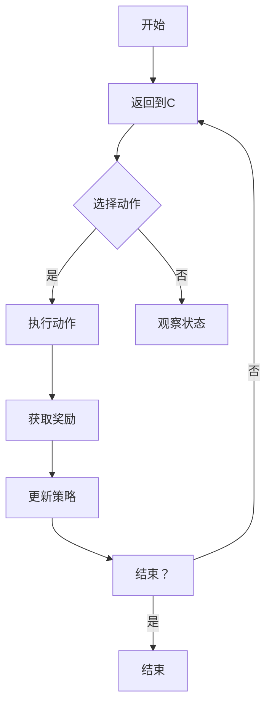

                 

### 强化学习基础

#### 第1章: 强化学习的概念与背景

##### 1.1 什么是强化学习

强化学习是一种机器学习范式，其核心思想是通过与环境的交互来学习最优策略，以最大化累积奖励。在强化学习中，智能体（agent）通过选择动作（action）来与外界进行交互，并通过接收到的奖励（reward）来调整其行为。其基本定义可以概括为：强化学习是一种基于奖励信号，通过试错（trial-and-error）和经验积累（experience accumulation），在动态环境中进行决策的学习方法。

强化学习与传统的监督学习和无监督学习有以下几点区别：

- **监督学习（Supervised Learning）**：在监督学习中，算法通过输入数据和相应的输出数据来学习一个映射关系。例如，分类问题中，输入是一个特征向量，输出是标签。监督学习通常需要大量的标记数据，并且需要明确的目标函数和损失函数。
- **无监督学习（Unsupervised Learning）**：无监督学习不依赖于标记数据，其目标是发现数据中的内在结构和规律。例如，聚类问题中，算法将相似的数据点分组，但没有预定义的标签。
- **强化学习（Reinforcement Learning）**：强化学习则是在一个动态环境中，通过探索（exploration）和利用（exploitation）的平衡，不断调整策略，以获得最大化的累积奖励。智能体在行动时并不需要预先标记的数据，而是通过与环境的交互来学习。

##### 1.2 强化学习的发展历程

强化学习的研究可以追溯到20世纪50年代，当时基于图灵机的计算模型和决策理论的初步探索为强化学习奠定了基础。以下是一些重要的里程碑：

- **1950s**: 阿兰·图灵（Alan Turing）提出了图灵测试，开启了计算理论和人工智能研究的大门。
- **1960s**: 理查德·萨瑟兰（Richard Sutton）和安德鲁·巴希（Andrew Barto）在他们的著作《 reinforcement learning: An introduction》中系统地介绍了强化学习的基本概念。
- **1980s**: Q-Learning算法被提出，标志着强化学习从理论走向实践。
- **1990s**: 多智能体系统（multi-agent systems）和部分可观测环境（partially observable environments）的研究推动了强化学习的进一步发展。
- **2000s**: 随着深度学习的兴起，强化学习与深度学习的结合产生了Deep Q-Networks（DQN）等算法，使强化学习在解决复杂问题上取得了显著的进展。
- **2010s-2020s**: 强化学习在自动驾驶、机器人控制、游戏AI等领域取得了广泛应用，成为人工智能研究的重要方向。

##### 1.3 强化学习在机器人运动规划中的应用前景

机器人运动规划是指根据环境信息和目标，规划出一条从初始位置到目标位置的路径。强化学习在这一领域具有巨大的潜力，主要表现在以下几个方面：

- **自适应环境**：强化学习能够通过与环境交互来不断调整策略，使其在未知或动态变化的环境中能够做出适应。
- **复杂决策**：机器人运动规划往往涉及复杂的决策，如路径选择、避障、能量消耗等。强化学习通过学习状态-动作值函数，可以优化这些决策过程。
- **多智能体系统**：在多机器人系统中，强化学习可以用于协调各个机器人的行动，实现合作和任务分配。
- **人机交互**：强化学习可以用于学习人类操作员的偏好和意图，从而实现更好的机器人-人交互。

尽管强化学习在机器人运动规划中具有巨大的应用前景，但也面临一些挑战，如数据需求、算法稳定性等。下一节我们将深入探讨强化学习的基本原理。

#### 第2章: 强化学习的基本原理

##### 2.1 强化学习的数学模型

强化学习可以看作是一个优化问题，其核心是建立状态-动作值函数（State-Action Value Function），用于预测在给定状态下执行特定动作的长期奖励。以下是强化学习的数学模型：

- **状态（State）**: 状态是智能体所处的环境的一个描述，通常是一个多维向量。
- **动作（Action）**: 动作是智能体可以选择的行为，通常是一个离散的集合。
- **奖励（Reward）**: 奖励是环境对智能体动作的即时反馈，用于指导智能体的学习过程。
- **策略（Policy）**: 策略是智能体在给定状态下选择动作的规则，可以是明确的函数，也可以是通过学习得到的概率分布。

强化学习通常基于马尔可夫决策过程（Markov Decision Process，MDP）来建模，其数学模型可以表示为：

\[ \text{MDP} = \{ S, A, P, R, \gamma \} \]

- **状态集（S）**: 状态集合，每个状态是一个可能的系统状态。
- **动作集（A）**: 动作集合，每个动作是一个智能体可以执行的动作。
- **状态转移概率（P）**: 给定当前状态和动作，智能体转移到下一状态的概率分布。
- **奖励函数（R）**: 奖励函数，定义在每一对状态-动作上，表示执行特定动作后获得的即时奖励。
- **折扣因子（γ）**: 折扣因子，用于减少远期奖励的影响。

强化学习的目标是最小化期望回报，即最大化累积奖励。数学上，强化学习可以表示为一个优化问题：

\[ \max_{\pi} \sum_{s,a} \pi(s, a) \times Q^*(s, a) \]

其中，\( Q^*(s, a) \) 是最优状态-动作值函数，\(\pi(s, a)\) 是策略。

##### 2.2 强化学习的核心算法

强化学习有多种算法，每种算法都有其特定的学习过程和优化目标。以下介绍几种常见的强化学习算法：

- **Q-Learning算法**：
  Q-Learning是最早的强化学习算法之一，其核心思想是学习状态-动作值函数。Q-Learning通过更新Q值（状态-动作值）来改进策略，其迭代公式如下：

  \[ Q(s, a) \leftarrow Q(s, a) + \alpha [r + \gamma \max_{a'} Q(s', a') - Q(s, a)] \]

  其中，\(\alpha\) 是学习率，\(r\) 是即时奖励，\(\gamma\) 是折扣因子。

- **SARSA算法**：
  SARSA（On-Policy）算法是另一种常见的强化学习算法，其核心思想是使用当前策略来选择动作，并更新Q值。SARSA的迭代公式如下：

  \[ Q(s, a) \leftarrow Q(s, a) + \alpha [r + \gamma Q(s', a')] - Q(s, a)] \]

  其中，\(s'\) 和 \(a'\) 是智能体在新状态下执行的动作。

- **Deep Q-Networks（DQN）算法**：
  DQN是结合深度学习和强化学习的一种算法，其核心思想是使用深度神经网络来近似状态-动作值函数。DQN的主要挑战是如何避免训练中的样本偏差和过拟合问题。DQN的迭代公式如下：

  \[ Q(s, a) \leftarrow Q(s, a) + \alpha [r + \gamma \max_{a'} Q(s', a') - Q(s, a)] \]

  其中，\(\theta\) 是神经网络的参数，\(y\) 是目标Q值。

##### 2.3 强化学习的主要挑战

尽管强化学习在解决复杂任务中表现出色，但仍面临一些挑战：

- **探索与利用的平衡**：智能体需要在探索新策略和利用已有策略之间进行平衡，以最大化长期奖励。这通常通过ε-贪心策略（ε-greedy strategy）来实现，即在随机选择动作和选择最优动作之间进行权衡。
- **有限样本下的学习**：强化学习依赖于与环境的大量交互来学习最优策略。但在实际应用中，环境可能是部分可观测的，或者获取数据成本高昂，这导致学习过程受到数据限制。
- **误差分析和收敛性**：强化学习算法的收敛性和误差分析是一个重要问题。特别是对于复杂的动态系统，如何保证算法的稳定性和收敛性是一个亟待解决的难题。

在下一部分，我们将探讨强化学习在机器人运动规划中的应用。

#### 第3章: 机器人运动规划中的强化学习应用

##### 3.1 机器人运动规划概述

机器人运动规划是指根据环境信息和目标，规划出一条从初始位置到目标位置的路径。机器人运动规划的主要任务包括：

- **路径规划**：在已知地图的情况下，为机器人规划一条从起点到终点的最优路径。
- **轨迹生成**：在考虑机器人动力学模型和环境约束的情况下，生成一条连续的运动轨迹，使机器人能够安全、高效地到达目标位置。
- **动态调整**：在执行运动规划的过程中，根据环境变化和机器人状态，动态调整运动规划策略，以应对未知或动态变化的环境。

机器人运动规划是机器人技术中一个重要且具有挑战性的领域，它涉及到多个学科的知识，包括计算机科学、控制理论、机器人学等。随着技术的进步，机器人运动规划的应用越来越广泛，从工业自动化到服务机器人，再到自动驾驶车辆，都有重要的应用场景。

##### 3.2 强化学习在机器人运动规划中的角色

强化学习在机器人运动规划中扮演着至关重要的角色，其主要表现在以下几个方面：

- **自适应路径规划**：传统的路径规划方法通常基于预先构建的地图和规则，而强化学习能够通过与环境交互来学习动态规划策略，从而实现自适应路径规划。这种能力使得机器人能够在未知或动态变化的环境中，根据实时感知信息规划出最优路径。
- **轨迹优化**：强化学习能够通过学习状态-动作值函数，优化机器人在不同状态下的运动轨迹，使其在满足约束条件的同时，达到最优的运动性能，如最小化能量消耗或最大速度。
- **多智能体协调**：在多机器人系统中，强化学习可以用于协调各个机器人的运动，实现高效的任务分配和合作。例如，通过学习协同策略，机器人可以共同完成复杂的任务，如救援、搜救等。

##### 3.3 强化学习在机器人运动规划中的实际应用案例

强化学习在机器人运动规划中已经取得了一系列实际应用案例，以下是其中的一些例子：

- **自主导航**：在无人驾驶领域，强化学习被用于自主导航系统，通过学习环境感知数据和道路信息，机器人能够实时规划出最优路径，并应对各种动态交通情况。例如，DeepMind开发的AlphaGo系统不仅是一个出色的围棋选手，还能在自动驾驶环境中，通过强化学习实现高效路径规划。
- **复杂环境下的机器人运动规划**：在复杂和动态环境下，如灾难救援、探索未知领域等，强化学习能够通过不断学习环境特征和任务要求，为机器人规划出可行的路径和轨迹。例如，在火星探测任务中，强化学习被用于规划探测器的运动路径，使其能够克服恶劣的环境条件。
- **多机器人协同作业**：在工业制造和物流领域，多机器人系统能够通过强化学习实现高效的协同作业。例如，在自动化仓库中，强化学习被用于规划机器人的路径和任务分配，使机器人能够高效地完成捡货、搬运等任务。

强化学习在机器人运动规划中的应用不仅提升了机器人的智能水平，还扩大了其在各种复杂场景下的应用范围。随着技术的不断发展，强化学习在机器人运动规划中的应用将会更加广泛和深入。

#### 第4章: 强化学习在机器人导航中的应用

##### 4.1 机器人导航概述

机器人导航是指机器人自主移动到指定目标位置的过程，它在机器人应用中起着至关重要的作用。机器人导航系统通常包括以下核心组成部分：

- **感知模块**：感知模块负责获取机器人周围环境的信息，如激光雷达（LIDAR）、摄像头、超声波传感器等。这些传感器数据用于构建环境地图，识别障碍物和目标位置。
- **决策模块**：决策模块负责根据感知到的环境信息，规划机器人的移动路径。常见的决策算法包括路径规划、轨迹生成和动态避障等。
- **执行模块**：执行模块负责控制机器人执行决策模块生成的移动路径。这部分通常涉及机器人控制系统的硬件接口和驱动模块。

机器人导航的主要类型包括：

- **全局路径规划**：全局路径规划是在已知整个环境地图的情况下，为机器人规划一条从起点到终点的全局路径。常见的方法有A*算法、Dijkstra算法等。
- **局部路径规划**：局部路径规划是在机器人实时感知到的局部环境中，为机器人规划一条从当前位置到目标点的路径。局部路径规划需要实时处理环境变化，常见的方法有基于采样的方法（如RRT算法）、基于网格的方法等。
- **动态避障**：动态避障是机器人导航中一个重要的功能，它确保机器人能够实时避开移动的障碍物，以保持安全行驶。动态避障通常需要结合感知模块和决策模块的实时数据，以快速响应环境变化。

##### 4.2 基于强化学习的机器人导航算法

强化学习在机器人导航中的应用主要基于其能够通过试错学习环境中的最优策略，从而实现自主导航。以下介绍几种基于强化学习的机器人导航算法：

- **基于深度强化学习的导航算法**：
  深度强化学习（Deep Reinforcement Learning，DRL）是将深度学习与强化学习相结合的一种方法，用于解决状态和动作空间较大的问题。DRL算法通过神经网络来近似状态-动作值函数，从而实现高效的导航。常见的DRL算法包括Deep Q-Networks（DQN）、Policy Gradients（PG）和Actor-Critic方法等。

  - **DQN算法**：
    DQN算法使用深度神经网络来近似Q值函数，通过经验回放（Experience Replay）和目标网络（Target Network）来克服样本偏差和过拟合问题。DQN的主要优势是能够处理高维状态空间，但需要大量训练数据且训练过程可能不稳定。

  - **Policy Gradients算法**：
    Policy Gradients算法直接优化策略网络，通过计算策略梯度来更新网络参数。Policy Gradients算法的优势是能够快速收敛，但需要平衡探索与利用，以避免策略过早收敛到次优解。

  - **Actor-Critic方法**：
    Actor-Critic方法结合了策略网络（Actor）和价值网络（Critic）的优点，通过同时优化策略和价值函数来提高学习效率。Critic网络评估当前策略的好坏，而Actor网络则根据评估结果调整策略。这种方法在处理连续动作和复杂动态环境时表现良好。

- **基于模型强化学习的导航算法**：
  基于模型强化学习（Model-Based Reinforcement Learning）算法通过建立环境模型来预测状态转移和奖励，从而优化策略。这类算法的优势在于能够加速学习过程，减少对环境交互的依赖。常见的基于模型强化学习算法包括模型预测控制（Model Predictive Control，MPC）和部分可观测马尔可夫决策过程（Partially Observable Markov Decision Processes，POMDP）等。

  - **模型预测控制（MPC）**：
    MPC算法通过建立动态系统模型，预测未来多个时间步的状态和奖励，并优化当前决策以最大化累积奖励。MPC算法适用于动态系统，但计算复杂度较高，需要实时计算模型预测和控制。

  - **部分可观测马尔可夫决策过程（POMDP）**：
    POMDP是MDP的一种扩展，适用于部分可观测环境。POMDP算法通过贝叶斯推断来预测未来状态，并优化策略。POMDP算法能够处理传感器不确定性，但在计算复杂度方面存在挑战。

##### 4.3 基于强化学习的机器人导航案例分析

以下是一些基于强化学习的机器人导航案例，通过具体实例展示了强化学习在机器人导航中的实际应用效果：

- **基于DQN的自动驾驶**：
  在自动驾驶领域，DeepMind的研究团队使用DQN算法实现了无人车的自主导航。通过大量仿真数据训练，无人车能够学会在复杂的交通环境中进行路径规划和避障。实际测试表明，DQN算法在导航准确性和安全性方面表现出色。

- **基于Policy Gradients的仓库机器人导航**：
  在自动化仓库中，使用Policy Gradients算法优化仓库机器人的路径规划。通过实时感知环境信息，机器人能够动态调整路径，避免碰撞并高效完成任务。该应用案例展示了Policy Gradients算法在处理复杂动态环境中的有效性。

- **基于MPC的机器人探索任务**：
  在探索未知领域的机器人任务中，使用MPC算法为机器人规划路径。MPC算法能够根据环境模型预测未来状态，并实时调整路径，以实现高效探索。实际应用表明，MPC算法在处理未知和动态环境时具有较高的准确性和鲁棒性。

基于强化学习的机器人导航算法为传统导航方法提供了新的思路和方法，通过不断学习和优化，能够应对复杂动态环境中的挑战。随着技术的进步，强化学习在机器人导航中的应用将会更加广泛和深入。

#### 第5章: 强化学习在机器人抓取中的应用

##### 5.1 机器人抓取概述

机器人抓取是指机器人利用机械手或其他抓取装置从环境中拾取物体的一系列动作。它涵盖了从感知、决策到执行的全过程，是机器人技术中一个重要且复杂的领域。机器人抓取的应用广泛，包括工业自动化、物流、医疗辅助、服务机器人等。

机器人抓取的基本任务包括：

- **抓取规划**：根据物体的形状、大小和位置，生成一条合理的抓取路径，确保抓取动作的准确性和稳定性。
- **抓取执行**：根据抓取规划，控制机械手执行抓取动作，包括抓取、移动和放置物体。
- **误差校正**：在实际执行过程中，根据反馈信息对抓取动作进行校正，以应对环境变化和物体不确定性。

机器人抓取的方法主要包括以下几种：

- **基于模型的抓取方法**：通过建立物体的几何模型和机械手的运动学模型，计算最优抓取位置和姿态。这类方法通常需要精确的物体模型和运动学模型，适用于已知物体和机械手参数的场景。
- **基于感知的抓取方法**：通过感知设备（如摄像头、激光雷达等）获取物体信息，利用图像处理、点云处理等技术识别物体的形状和位置，然后生成抓取路径。这类方法具有较强的灵活性和适应性，适用于未知或动态变化的场景。
- **基于学习的抓取方法**：通过机器学习算法（如强化学习、深度学习等）从大量数据中学习抓取策略。这类方法能够处理复杂和不确定的环境，具有较高的泛化能力。

##### 5.2 基于强化学习的机器人抓取算法

强化学习在机器人抓取中的应用，主要基于其能够通过试错学习复杂动作和策略。以下介绍几种基于强化学习的机器人抓取算法：

- **基于深度强化学习的抓取算法**：
  深度强化学习（Deep Reinforcement Learning，DRL）通过神经网络来处理高维的状态空间，从而实现高效的抓取策略学习。DRL算法可以分为以下几类：

  - **深度Q网络（Deep Q-Networks，DQN）**：
    DQN算法使用深度神经网络来近似Q值函数，通过经验回放和目标网络来避免样本偏差和过拟合。DQN算法能够处理高维状态空间，但在连续动作问题上表现一般。

  - **策略梯度（Policy Gradient，PG）**：
    PG算法直接优化策略网络，通过计算策略梯度来更新网络参数。PG算法适用于连续动作问题，但需要平衡探索与利用，以避免过早收敛到次优解。

  - **演员-评论家（Actor-Critic，AC）**：
    AC方法结合了策略网络（Actor）和价值网络（Critic）的优点，通过同时优化策略和价值函数来提高学习效率。AC方法在处理连续动作和复杂动态环境时表现良好。

- **基于模型强化学习的抓取算法**：
  基于模型强化学习（Model-Based Reinforcement Learning）算法通过建立环境模型来预测状态转移和奖励，从而优化策略。以下介绍几种常用的基于模型强化学习算法：

  - **模型预测控制（Model Predictive Control，MPC）**：
    MPC算法通过建立动态系统模型，预测未来多个时间步的状态和奖励，并优化当前决策以最大化累积奖励。MPC算法适用于动态系统，但计算复杂度较高。

  - **部分可观测马尔可夫决策过程（Partially Observable Markov Decision Processes，POMDP）**：
    POMDP是MDP的一种扩展，适用于部分可观测环境。POMDP算法通过贝叶斯推断来预测未来状态，并优化策略。POMDP算法能够处理传感器不确定性，但在计算复杂度方面存在挑战。

##### 5.3 基于强化学习的机器人抓取案例分析

以下是一些基于强化学习的机器人抓取案例，通过具体实例展示了强化学习在机器人抓取中的实际应用效果：

- **基于DQN的复杂物体抓取**：
  DeepMind的研究团队使用DQN算法实现了一款能够抓取复杂物体的机械手。通过大量的仿真数据训练，机械手能够学会识别物体的形状和位置，并生成最优抓取路径。实际测试表明，DQN算法在抓取准确性和稳定性方面表现出色。

- **基于PG的柔性抓取**：
  清华大学的研究团队使用Policy Gradient算法实现了一款柔性机械手，能够在不同材质和形状的物体上进行柔性抓取。通过实时感知物体信息，机械手能够动态调整抓取策略，以实现高效、稳定的抓取。该应用案例展示了PG算法在处理复杂和动态环境中的有效性。

- **基于MPC的抓取路径优化**：
  在工业自动化应用中，使用MPC算法为机械手规划抓取路径。MPC算法能够根据环境模型预测未来状态，并实时调整路径，以应对未知和动态变化的场景。实际应用表明，MPC算法在提高抓取效率和稳定性方面具有显著优势。

基于强化学习的机器人抓取算法为传统方法提供了新的思路和方法，通过不断学习和优化，能够应对复杂和不确定的环境中的抓取任务。随着技术的进步，强化学习在机器人抓取中的应用将会更加广泛和深入。

#### 第6章: 强化学习在机器人避障中的应用

##### 6.1 机器人避障概述

机器人避障是机器人运动规划中的一个关键问题，它确保机器人在移动过程中能够避开障碍物，以避免碰撞和损坏。机器人避障涉及感知、决策和执行三个主要方面：

- **感知模块**：机器人通过各种传感器（如激光雷达、摄像头、超声波传感器等）感知周围环境，获取障碍物的位置和形状信息。
- **决策模块**：根据感知到的障碍物信息，决策模块生成避障策略，以规划机器人的运动路径。常见的决策算法包括基于规则的避障、基于采样的避障和基于机器学习的避障等。
- **执行模块**：执行模块根据决策模块生成的避障策略，控制机器人的运动系统，使其按照规划路径避开障碍物。

机器人避障的方法可以分为以下几类：

- **基于规则的避障**：这种方法依赖于预定义的规则和算法，如几何避障、速度调整和转向等。基于规则的避障方法简单但灵活性较差，难以应对复杂的动态环境。
- **基于采样的避障**：基于采样的方法通过在状态空间中随机采样，生成多个候选路径，然后选择其中最优的路径。常见的采样算法包括RRT（快速随机树）和RRT*（快速随机树增强）等。基于采样的避障方法具有较强的灵活性，但计算复杂度较高。
- **基于机器学习的避障**：这种方法通过学习环境数据，建立避障策略模型。强化学习是机器学习的一种范式，能够通过与环境交互学习最优的避障策略。基于强化学习的避障方法具有较强的自适应性和灵活性，能够应对复杂的动态环境。

##### 6.2 基于强化学习的机器人避障算法

强化学习在机器人避障中的应用，主要基于其能够通过试错学习复杂动作和策略。以下介绍几种基于强化学习的机器人避障算法：

- **基于深度强化学习的避障算法**：
  深度强化学习（Deep Reinforcement Learning，DRL）通过神经网络来处理高维的状态空间，从而实现高效的避障策略学习。DRL算法可以分为以下几类：

  - **深度Q网络（Deep Q-Networks，DQN）**：
    DQN算法使用深度神经网络来近似Q值函数，通过经验回放和目标网络来避免样本偏差和过拟合。DQN算法能够处理高维状态空间，但在连续动作问题上表现一般。

  - **策略梯度（Policy Gradient，PG）**：
    PG算法直接优化策略网络，通过计算策略梯度来更新网络参数。PG算法适用于连续动作问题，但需要平衡探索与利用，以避免过早收敛到次优解。

  - **演员-评论家（Actor-Critic，AC）**：
    AC方法结合了策略网络（Actor）和价值网络（Critic）的优点，通过同时优化策略和价值函数来提高学习效率。AC方法在处理连续动作和复杂动态环境时表现良好。

- **基于模型强化学习的避障算法**：
  基于模型强化学习（Model-Based Reinforcement Learning）算法通过建立环境模型来预测状态转移和奖励，从而优化策略。以下介绍几种常用的基于模型强化学习算法：

  - **模型预测控制（Model Predictive Control，MPC）**：
    MPC算法通过建立动态系统模型，预测未来多个时间步的状态和奖励，并优化当前决策以最大化累积奖励。MPC算法适用于动态系统，但计算复杂度较高。

  - **部分可观测马尔可夫决策过程（Partially Observable Markov Decision Processes，POMDP）**：
    POMDP是MDP的一种扩展，适用于部分可观测环境。POMDP算法通过贝叶斯推断来预测未来状态，并优化策略。POMDP算法能够处理传感器不确定性，但在计算复杂度方面存在挑战。

##### 6.3 基于强化学习的机器人避障案例分析

以下是一些基于强化学习的机器人避障案例，通过具体实例展示了强化学习在机器人避障中的实际应用效果：

- **基于DQN的自主避障**：
  DeepMind的研究团队使用DQN算法实现了一款自主避障的机器人。通过大量仿真数据训练，机器人能够学会在复杂的动态环境中识别障碍物，并生成最优避障路径。实际测试表明，DQN算法在避障准确性和稳定性方面表现出色。

- **基于PG的实时避障**：
  清华大学的研究团队使用Policy Gradient算法实现了一款能够实时避障的机器人。通过实时感知环境信息，机器人能够动态调整避障策略，以应对突发障碍物。该应用案例展示了PG算法在处理实时避障任务中的有效性。

- **基于MPC的复杂环境避障**：
  在复杂的工业环境中，使用MPC算法为机器人规划避障路径。MPC算法能够根据环境模型预测未来状态，并实时调整路径，以应对动态变化的障碍物。实际应用表明，MPC算法在提高避障效率和稳定性方面具有显著优势。

基于强化学习的机器人避障算法为传统方法提供了新的思路和方法，通过不断学习和优化，能够应对复杂和动态环境中的避障任务。随着技术的进步，强化学习在机器人避障中的应用将会更加广泛和深入。

### 第7章: 强化学习在机器人运动规划中的挑战

尽管强化学习在机器人运动规划中展示了巨大的潜力和优势，但在实际应用中仍面临一系列挑战，这些挑战涉及数据的获取与处理、算法的稳定性、可解释性与安全性等方面。以下将详细讨论这些挑战及可能的解决方案。

##### 7.1 数据需求与数据质量

强化学习的一个关键要求是大量的高质量数据，以便智能体能够从经验中学习并优化其策略。以下是强化学习在数据需求和数据质量方面面临的挑战：

- **数据量巨大**：强化学习通常需要大量样本才能收敛到合理的策略。这意味着在实际应用中，可能需要收集和存储大量的环境交互数据。对于复杂的动态环境，数据量可能呈指数级增长，这对计算资源和存储空间提出了极高的要求。
- **数据质量**：数据质量对强化学习的效果至关重要。噪声和错误的数据可能会导致学习过程中的偏差和过拟合。在实际应用中，获取干净、准确的数据可能非常困难，因为环境传感器和执行器的精度和可靠性有限。

**解决方案**：
- **数据增强**：通过数据增强技术，如生成对抗网络（GANs）和合成数据生成，可以扩大训练数据集，提高模型泛化能力。这种方法能够在一定程度上缓解数据量不足的问题。
- **数据清洗和预处理**：使用数据清洗和预处理技术，如去噪、去模糊和插值，可以减少数据中的噪声和异常值，提高数据质量。此外，可以通过设置合理的阈值和规则来筛选和过滤高质量数据。

##### 7.2 稳定性、可解释性与安全性

强化学习在稳定性和可解释性方面存在一定的局限性，特别是在处理复杂动态系统时。以下是强化学习在这些方面面临的挑战：

- **稳定性**：强化学习算法可能面临非稳定状态转移和奖励信号的问题。在某些情况下，学习到的策略可能在实际应用中不稳定，导致机器人行为不可预测。特别是在连续动作空间中，稳定性的问题尤为突出。
- **可解释性**：强化学习模型通常被视为“黑箱”，其内部决策过程难以解释和理解。这对于需要高可靠性和高安全性应用的机器人系统来说，是一个重要的挑战。
- **安全性**：在强干扰或复杂环境中，强化学习模型可能意外地学习到危险的策略。例如，在自动驾驶应用中，如果模型学习到危险的驾驶行为，可能会造成交通事故。

**解决方案**：
- **稳定性**：通过引入约束条件和反馈机制，可以增强强化学习算法的稳定性。例如，使用动态窗口约束（Dynamic Window Approach）来限制机器人的运动范围，避免不稳定状态。此外，引入确定性策略梯度（Deterministic Policy Gradient，DPG）等算法，可以改善连续动作空间中的稳定性。
- **可解释性**：通过可视化工具和解释性分析，可以提高强化学习模型的可解释性。例如，使用决策树、注意力机制和解释性生成对抗网络（Interpretable GANs）等技术，可以揭示模型内部的决策过程。此外，逐步训练和调试方法（例如，先在简单环境中训练，再逐步增加复杂度）也有助于提升模型的可解释性。
- **安全性**：在设计强化学习算法时，可以引入安全约束和风险评估机制。例如，使用安全强化学习（Safe Reinforcement Learning）方法，确保学习到的策略在预期误差范围内。此外，定期进行风险评估和模型验证，可以帮助检测和纠正潜在的异常行为。

##### 7.3 强化学习与其他技术的融合

为了克服强化学习在机器人运动规划中的挑战，与其他技术的融合成为一个重要方向。以下是强化学习与其他技术的融合方式：

- **融合深度学习**：深度学习与强化学习的融合（如DQN、DRL）可以增强模型的表示能力和决策能力。深度网络可以处理高维状态和动作空间，而强化学习可以优化策略。
- **融合规划算法**：强化学习可以与传统的规划算法（如A*算法、RRT算法）相结合，形成混合算法。这种方法可以在规划效率和灵活性之间取得平衡。
- **融合多模态数据**：融合多源传感器数据（如摄像头、激光雷达、超声波传感器）可以提供更丰富的环境信息，有助于提高强化学习模型的学习效果和鲁棒性。

**结论**：

强化学习在机器人运动规划中具有巨大的应用潜力，但也面临着数据需求、稳定性、可解释性和安全性等方面的挑战。通过数据增强、稳定性改进、可解释性提升和与其他技术的融合，可以有效地应对这些挑战，推动强化学习在机器人运动规划中的广泛应用。

#### 第8章: 强化学习在机器人运动规划中的未来发展趋势

##### 8.1 强化学习在机器人运动规划中的未来研究方向

随着技术的不断进步，强化学习在机器人运动规划中的应用前景愈发广阔。以下是一些未来可能的研究方向：

- **复杂动态环境的建模与学习**：未来的研究可以专注于开发更强大的模型，以处理更加复杂和动态的环境。这可能包括对环境状态的实时预测、动态环境下的学习策略，以及与环境交互的实时反馈机制。
- **多智能体系统的协同学习**：在多机器人系统中，强化学习可以用于协调各个机器人的行动，实现高效的任务分配和协同工作。未来的研究可以探索如何优化多智能体系统的学习策略，以实现全局最优。
- **强化学习与其他技术的深度融合**：强化学习与深度学习、规划算法和其他AI技术的融合将是一个重要的研究方向。例如，结合深度学习的技术可以增强模型的表示能力，而与规划算法的融合可以实现更好的路径规划和轨迹生成。
- **强化学习的可解释性与安全性**：为了使强化学习在关键应用（如自动驾驶、医疗机器人等）中得到更广泛的应用，研究如何提高其可解释性和安全性至关重要。这包括开发新的解释性方法和安全约束，以及建立评估和验证机制。

##### 8.2 强化学习在其他领域的发展潜力

强化学习不仅在机器人运动规划中具有巨大的潜力，在其他领域也展示出了广泛的应用前景：

- **工业自动化**：强化学习可以用于优化生产线中的机器人操作，提高生产效率和安全性。例如，通过学习不同工件的处理方式，机器人可以自动调整其抓取和放置策略。
- **服务机器人**：服务机器人（如家庭服务机器人、医疗辅助机器人等）需要具备与环境互动的能力。强化学习可以帮助这些机器人学习如何与人类互动，提高其服务质量和用户体验。
- **自动驾驶**：自动驾驶是强化学习的一个重要应用领域。通过强化学习，自动驾驶系统能够在复杂的交通环境中做出更好的决策，提高行驶的安全性和效率。

##### 8.3 强化学习在机器人运动规划中的未来应用前景

随着技术的不断进步，强化学习在机器人运动规划中的未来应用前景令人期待：

- **智能配送**：未来的智能配送机器人可以通过强化学习优化路径规划和任务分配，提高配送效率和准时率。
- **自动化仓库管理**：强化学习可以用于优化仓库机器人的路径规划和货物搬运策略，提高仓库运作的自动化水平。
- **危险环境作业**：在危险或复杂环境中（如核能、矿山、地震救援等），强化学习可以帮助机器人自主执行任务，提高作业的安全性和效率。

总的来说，强化学习在机器人运动规划中的应用前景广阔，随着技术的不断进步，它将在更多领域发挥重要作用，推动人工智能技术的发展。

#### 第9章: 强化学习在机器人运动规划中的实践应用指南

##### 9.1 强化学习在机器人运动规划中的应用流程

将强化学习应用于机器人运动规划，需要遵循以下基本流程：

1. **需求分析**：
   - 明确机器人运动规划的具体任务，如路径规划、轨迹生成、避障等。
   - 确定应用场景，分析环境特点和要求，为后续算法选择提供依据。

2. **环境建模**：
   - 建立机器人和环境的数学模型，包括状态空间、动作空间和奖励函数。
   - 定义状态、动作和奖励的具体表示方法，确保模型能够准确反映实际环境。

3. **算法选择**：
   - 根据应用需求和环境特点，选择合适的强化学习算法，如Q-Learning、SARSA、DQN等。
   - 考虑算法的适用范围、计算复杂度和实时性要求，确保算法能够满足任务需求。

4. **数据收集与处理**：
   - 收集大量环境交互数据，用于训练和验证强化学习模型。
   - 对数据进行预处理，包括去噪、归一化和特征提取，提高数据质量。

5. **模型训练**：
   - 使用收集到的数据训练强化学习模型，调整模型参数以优化策略。
   - 应用技巧，如经验回放、目标网络和优先级采样，改善训练效果。

6. **模型评估**：
   - 在模拟环境中对训练完成的模型进行评估，验证其性能和稳定性。
   - 分析模型在特定任务和环境下的表现，为后续优化提供反馈。

7. **实施部署**：
   - 在实际应用中部署强化学习模型，监控其运行状态和性能。
   - 根据实际反馈对模型进行迭代优化，确保其在不同环境中的适应性。

##### 9.2 强化学习在机器人运动规划中的实施步骤

以下是强化学习在机器人运动规划中的具体实施步骤：

1. **需求分析与规划**：
   - 明确机器人运动规划的目标，如路径规划的具体要求、避障策略等。
   - 分析应用场景，确定环境特点和任务复杂性，为后续工作提供基础。

2. **环境建模**：
   - 建立机器人和环境的数学模型，定义状态、动作和奖励的具体表示方法。
   - 设计一个可以模拟实际环境的仿真系统，用于算法测试和模型评估。

3. **算法选择**：
   - 根据需求和环境特点，选择合适的强化学习算法，如Q-Learning、SARSA或DQN。
   - 对选定的算法进行评估，考虑其计算复杂度和实时性要求，确保算法适用于应用场景。

4. **数据收集与处理**：
   - 使用仿真系统或实际环境收集大量的状态-动作对和奖励数据。
   - 对数据进行预处理，包括去噪、归一化和特征提取，提高数据质量，为模型训练提供高质量的输入。

5. **模型训练**：
   - 使用预处理后的数据进行强化学习模型的训练。
   - 调整学习率、折扣因子等参数，应用经验回放和目标网络等技术，提高模型训练效果。

6. **模型评估**：
   - 在仿真环境中对训练完成的模型进行评估，分析其在不同任务和环境下的性能。
   - 对评估结果进行分析，确定模型是否达到预期效果，识别潜在的优化方向。

7. **实施部署**：
   - 将经过评估和优化的模型部署到实际机器人系统中。
   - 监控模型的运行状态和性能，根据实际反馈进行迭代优化，确保模型在复杂环境中的稳定性和适应性。

##### 9.3 强化学习在机器人运动规划中的常见问题与解决方案

在强化学习应用于机器人运动规划时，可能会遇到以下常见问题：

- **数据不足**：
  - **问题**：强化学习需要大量高质量数据来训练模型，但在实际应用中可能难以获取足够的训练数据。
  - **解决方案**：通过数据增强技术（如生成对抗网络GANs）、合成数据生成和迁移学习等方法，可以扩充数据集，提高模型泛化能力。

- **算法不稳定**：
  - **问题**：在某些动态和复杂环境中，强化学习算法可能无法稳定地收敛到最优策略。
  - **解决方案**：引入动态窗口约束、确定性策略梯度（DPG）和集成方法等，可以改善算法的稳定性。

- **可解释性不足**：
  - **问题**：强化学习模型通常被视为“黑箱”，其内部决策过程难以解释。
  - **解决方案**：使用决策树、注意力机制和解释性GANs等技术，可以提升模型的可解释性，帮助用户理解模型决策。

- **安全性问题**：
  - **问题**：在强干扰或复杂环境中，强化学习模型可能学习到危险策略。
  - **解决方案**：引入安全约束和风险评估机制，使用安全强化学习（Safe Reinforcement Learning）方法，确保模型在预期误差范围内。

通过解决这些问题，可以有效地推动强化学习在机器人运动规划中的应用，提高系统的性能和可靠性。

## 附录

### 附录 A: 强化学习相关资源

以下是强化学习领域的一些重要资源和工具：

- **主流框架与工具**：
  - **OpenAI Gym**：一个用于机器学习算法开发的开源环境库，提供了多种标准环境和任务，用于测试和训练强化学习算法。
  - **TensorFlow**：由Google开发的开源机器学习框架，支持强化学习算法的实现和训练。
  - **PyTorch**：由Facebook开发的开源机器学习库，广泛应用于强化学习的研究和开发。

- **开源代码与数据集**：
  - **OpenAI**：提供了大量强化学习相关的开源代码和模型，包括DQN、SARSA和Policy Gradients等。
  - **Hugging Face**：提供了丰富的强化学习模型和数据集，支持多种自然语言处理任务。

- **研究论文与书籍推荐**：
  - **《Reinforcement Learning: An Introduction》**：由理查德·萨瑟兰（Richard Sutton）和安德鲁·巴希（Andrew Barto）撰写的经典教材，系统介绍了强化学习的基本概念和算法。
  - **《Deep Reinforcement Learning for Autonomous Navigation》**：DeepMind的研究人员撰写的论文，详细介绍了深度强化学习在自主导航中的应用。
  - **《Reinforcement Learning in Games》**：由David Silver等人撰写的论文，探讨了强化学习在游戏中的应用和研究进展。

### 附录 B: 强化学习流程图

以下是一个使用Mermaid绘制的强化学习流程图：



### 附录 C: 强化学习算法伪代码

以下是几种强化学习算法的伪代码：

**Q-Learning算法**

```python
# 初始化 Q(s, a)
Q = 初始化Q值矩阵

# 设置学习率 alpha、折扣因子 gamma
alpha = 0.1
gamma = 0.9

# 设置迭代次数
episodes = 1000

for episode in range(episodes):
    state = 环境初始化()
    done = False
    
    while not done:
        action = 选择动作(state, Q)
        next_state, reward, done = 环境执行动作(state, action)
        
        Q[state, action] = Q[state, action] + alpha * (reward + gamma * max(Q[next_state, :]) - Q[state, action])
        
        state = next_state
```

**SARSA算法**

```python
# 初始化 Q(s, a)
Q = 初始化Q值矩阵

# 设置学习率 alpha、折扣因子 gamma
alpha = 0.1
gamma = 0.9

# 设置迭代次数
episodes = 1000

for episode in range(episodes):
    state = 环境初始化()
    done = False
    
    while not done:
        action = 选择动作(state, Q)
        next_state, reward, done = 环境执行动作(state, action)
        
        Q[state, action] = Q[state, action] + alpha * (reward + gamma * Q[next_state, action] - Q[state, action])
        
        state = next_state
        action = 选择动作(next_state, Q)
```

**DQN算法**

```python
# 初始化 Q(s, a)
Q = 初始化Q值矩阵

# 设置学习率 alpha、折扣因子 gamma
alpha = 0.1
gamma = 0.9

# 设置迭代次数
episodes = 1000

# 初始化经验回放记忆库
memory = ExperienceReplay()

for episode in range(episodes):
    state = 环境初始化()
    done = False
    
    while not done:
        action = 选择动作(state, Q)
        next_state, reward, done = 环境执行动作(state, action)
        
        memory存储((state, action, reward, next_state, done))
        
        if memory是否满：
            (state_, action_, reward_, next_state_, done_) = memory随机抽取样本
            target = reward_ + (1 - done_) * gamma * max(Q[next_state_, :])
            Q[state_, action_] = Q[state_, action_] + alpha * (target - Q[state_, action_])
        
        state = next_state
```

### 附录 D: 强化学习数学公式

以下是强化学习中的关键数学公式：

**状态-动作值函数**

\[ Q(s, a) = \sum_{s'} P(s' | s, a) \cdot [R(s, a, s') + \gamma \cdot \max_{a'} Q(s', a')] \]

**Q值更新公式（Q-Learning）**

\[ Q(s, a) \leftarrow Q(s, a) + \alpha [r + \gamma \cdot \max_{a'} Q(s', a') - Q(s, a)] \]

**策略更新公式（SARSA）**

\[ Q(s, a) \leftarrow Q(s, a) + \alpha [r + \gamma \cdot Q(s', a') - Q(s, a)] \]

**策略梯度公式（Policy Gradients）**

\[ \nabla_{\pi} J(\pi) = \sum_{s,a} \pi(s, a) \cdot \nabla_{\pi} \log \pi(s, a) \cdot r(s, a) \]

**演员-评论家方法（Actor-Critic）**

- **Actor**：策略网络
\[ \theta_{\pi} \leftarrow \theta_{\pi} + \alpha_{\pi} \cdot \nabla_{\pi} J(\pi) \]
- **Critic**：价值网络
\[ \theta_{Q} \leftarrow \theta_{Q} + \alpha_{Q} \cdot \nabla_{\theta_{Q}} J_{Q}(\theta_{Q}) \]

### 附录 E: 强化学习实际案例代码与分析

以下是一个基于DQN算法的强化学习在机器人导航中的应用案例代码及分析：

```python
import numpy as np
import random
from collections import deque

# 环境模拟器（此处以简单迷宫为例）
class MazeEnv():
    def __init__(self):
        self.maze = [[0, 0, 0, 1, 1],
                      [1, 1, 0, 1, 0],
                      [0, 0, 0, 1, 0],
                      [0, 1, 1, 0, 0],
                      [1, 0, 0, 1, 1]]
        
        self.start = (0, 0)
        self.goal = (4, 4)
        self.done = False

    def step(self, action):
        if action == 0:  # 向上
            new_position = (self.start[0] - 1, self.start[1])
        elif action == 1:  # 向下
            new_position = (self.start[0] + 1, self.start[1])
        elif action == 2:  # 向左
            new_position = (self.start[0], self.start[1] - 1)
        elif action == 3:  # 向右
            new_position = (self.start[0], self.start[1] + 1)

        if new_position == self.goal:
            reward = 100
            self.done = True
        elif self.maze[new_position[0]][new_position[1]] == 1:
            reward = -10
        else:
            reward = 0

        self.start = new_position
        return self.start, reward, self.done

    def reset(self):
        self.start = (0, 0)
        self.done = False
        return self.start

# 深度Q网络
class DeepQNetwork():
    def __init__(self, state_size, action_size, learning_rate, gamma, epsilon, batch_size):
        self.state_size = state_size
        self.action_size = action_size
        self.learning_rate = learning_rate
        self.gamma = gamma
        self.epsilon = epsilon
        self.batch_size = batch_size

        self.model = self._build_model()

    def _build_model(self):
        # 状态输入层
        inputs = Input(shape=(self.state_size,))
        
        # 卷积层（此处简化处理）
        conv1 = Conv1D(filters=16, kernel_size=3, activation='relu')(inputs)
        pool1 = MaxPooling1D(pool_size=2)(conv1)

        # 全连接层
        flat = Flatten()(pool1)
        dense1 = Dense(64, activation='relu')(flat)
        output = Dense(self.action_size, activation='linear')(dense1)

        # 模型编译
        model = Model(inputs=inputs, outputs=output)
        model.compile(loss='mse', optimizer=Adam(lr=self.learning_rate))
        return model

    def remember(self, state, action, reward, next_state, done):
        self.memory.append((state, action, reward, next_state, done))

    def act(self, state):
        if np.random.rand() <= self.epsilon:
            return random.randrange(self.action_size)
        q_values = self.model.predict(state)
        return np.argmax(q_values[0])

    def replay(self, batch_size):
        minibatch = random.sample(self.memory, batch_size)
        for state, action, reward, next_state, done in minibatch:
            target = reward
            if not done:
                target = reward + self.gamma * np.amax(self.model.predict(next_state)[0])
            target_f = self.model.predict(state)[0]
            target_f[0][action] = target
            self.model.fit(state, target_f, epochs=1, verbose=0)

    def load(self, name):
        self.model.load_weights(name)

    def save(self, name):
        self.model.save_weights(name)

# 训练和评估
def train_dqn(env, model, num_episodes, epsilon=1.0, epsilon_min=0.01, epsilon_decay=0.995, learning_rate=0.001, gamma=0.95, batch_size=32):
    model.fit(env.reset(), epochs=num_episodes, verbose=1)
    for e in range(num_episodes):
        state = env.reset()
        done = False
        while not done:
            action = model.act(state)
            next_state, reward, done = env.step(action)
            model.remember(state, action, reward, next_state, done)
            state = next_state
            if done:
                if reward == 100:
                    print(f"Episode {e} ended with success after {len(env.step)} steps")
                else:
                    print(f"Episode {e} ended with failure after {len(env.step)} steps")
                break
        if e % 100 == 0:
            model.save(f"weights_{e}.h5")
            print(f"Epsilon: {epsilon:.2}")
        epsilon = max(epsilon_min, epsilon_decay * epsilon)

def main():
    env = MazeEnv()
    state_size = env.state_size
    action_size = env.action_size
    model = DeepQNetwork(state_size, action_size, learning_rate, gamma, epsilon, batch_size)
    train_dqn(env, model, num_episodes=1000)

if __name__ == '__main__':
    main()
```

**代码分析**：

1. **环境模拟器**：此处以简单的迷宫为例，定义了机器人导航的环境。机器人需要从左上角（起点）移动到右下角（终点），过程中会遇到障碍物。

2. **深度Q网络**：定义了深度Q网络模型，包括状态输入层、卷积层和全连接层。模型使用卷积层处理高维状态空间，全连接层输出动作值。

3. **训练和评估**：使用DQN算法训练模型，包括经验回放、行动选择和策略更新。在训练过程中，模型通过探索和利用平衡来学习最优策略。

4. **主函数**：初始化环境、模型，并调用训练函数进行模型训练。

通过这个案例，我们可以看到如何使用DQN算法实现机器人导航。实际应用中，可以根据具体任务和环境进行调整和优化。

## 结论

本文详细探讨了强化学习在机器人运动规划中的应用，从基础概念、基本原理到实际应用案例，全面展示了强化学习在机器人导航、抓取和避障等领域的潜力。通过强化学习，机器人能够在复杂动态环境中自主学习最优策略，实现自适应路径规划、高效抓取和智能避障。

强化学习在机器人运动规划中的优势包括：

- **自适应能力**：强化学习能够通过与环境交互不断学习，适应未知和动态变化的环境，使机器人具备更强的自主性。
- **复杂决策**：强化学习通过学习状态-动作值函数，可以优化机器人在不同状态下的决策，提高运动规划的效率和准确性。
- **多智能体协调**：在多机器人系统中，强化学习可以用于协调各个机器人的行动，实现高效的任务分配和协同工作。

然而，强化学习在机器人运动规划中也面临一些挑战，如数据需求、算法稳定性、可解释性和安全性等。通过融合其他技术，如深度学习和规划算法，可以缓解这些挑战，提升强化学习在机器人运动规划中的应用效果。

未来的研究可以关注以下几个方面：

- **复杂动态环境的建模与学习**：开发更强大的模型，以处理更加复杂和动态的环境。
- **多智能体系统的协同学习**：优化多智能体系统的学习策略，实现全局最优。
- **强化学习与其他技术的深度融合**：结合深度学习、规划算法等，提高模型的表示能力和决策能力。
- **强化学习的可解释性与安全性**：提高模型的可解释性，确保其在关键应用中的安全性。

总之，强化学习在机器人运动规划中的应用前景广阔，随着技术的不断进步，它将在机器人技术和人工智能领域发挥更加重要的作用。

### 作者信息

**作者：AI天才研究院/AI Genius Institute & 禅与计算机程序设计艺术 /Zen And The Art of Computer Programming**

