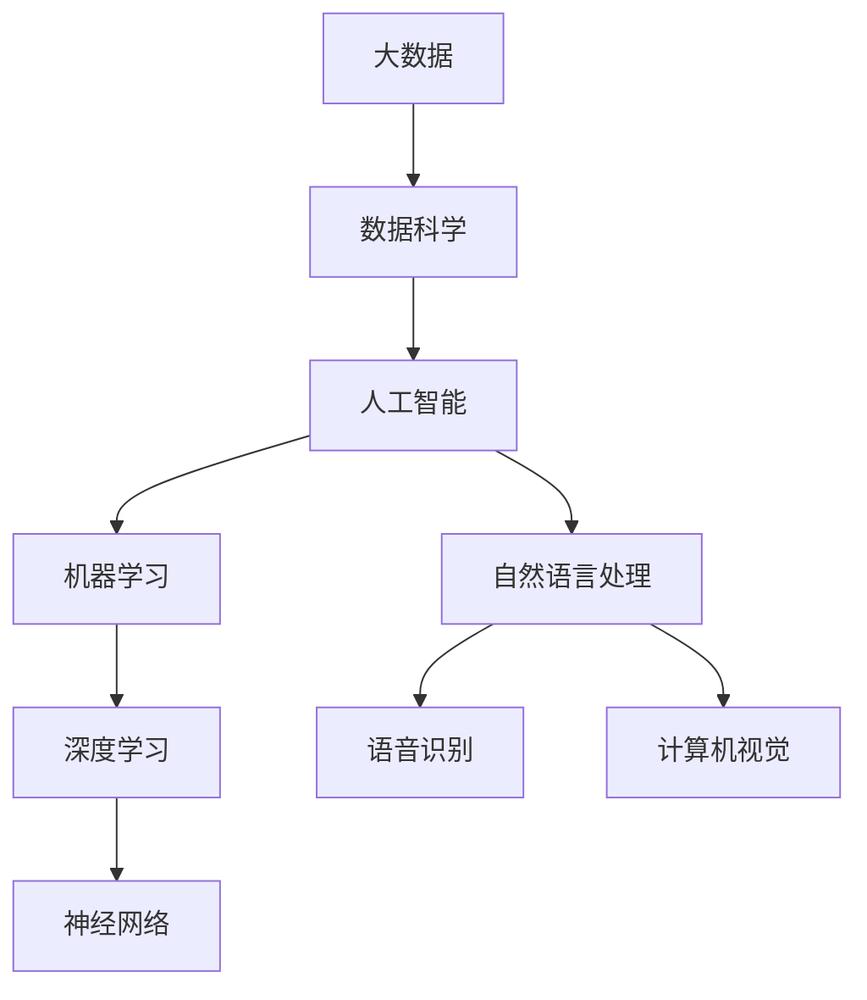
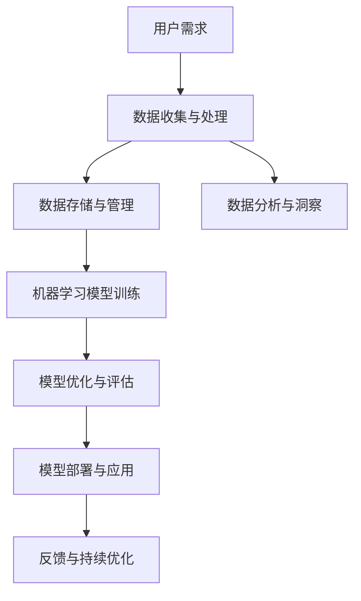
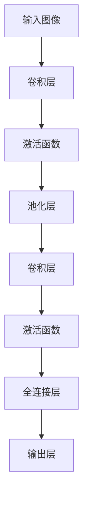

                 

# 《微软全面拥抱AI的战略布局》

## 概述

> 关键词：微软、AI战略、云计算、开发工具、办公自动化、案例分析、未来趋势

摘要：随着人工智能技术的迅猛发展，微软也迅速调整其战略，全面拥抱AI技术。本文将从背景与概述、AI核心概念与架构、微软AI核心产品与服务、AI在微软业务中的应用、微软AI战略布局与实践、未来发展趋势等多个角度，深入剖析微软拥抱AI的战略布局。通过本文，读者可以全面了解微软在AI领域的布局与举措，以及AI技术在未来发展中的重要作用。

## 目录大纲

### 第一部分：背景与概述

1. 微软拥抱AI的背景
   - 1.1 微软AI战略的发展历程
   - 1.2 AI技术在微软业务中的应用
   - 1.3 微软AI的优势与挑战

2. AI核心概念与架构
   - 2.1 人工智能的基本概念
   - 2.2 AI技术分类
   - 2.3 微软AI架构详解

3. 微软AI核心产品与服务
   - 3.1 Azure AI平台介绍
   - 3.2 微软AI工具与服务
   - 3.3 微软AI案例研究

### 第二部分：AI在微软业务中的应用

4. AI在云计算领域的应用
   - 4.1 云服务与AI的融合
   - 4.2 Azure AI云服务实例
   - 4.3 AI驱动的云计算创新

5. AI在开发与工具中的应用
   - 5.1 AI在软件开发中的应用
   - 5.2 AI驱动的开发工具
   - 5.3 AI在开发效率提升中的作用

6. AI在办公与生产力中的应用
   - 6.1 AI与办公自动化的结合
   - 6.2 AI在会议管理中的应用
   - 6.3 AI与个人效率的提升

### 第三部分：微软AI战略布局与实践

7. 微软AI战略布局
   - 7.1 微软AI战略的愿景与目标
   - 7.2 微软AI战略的关键举措
   - 7.3 微软AI战略的实施路径

8. 微软AI实践案例
   - 8.1 微软AI在医疗健康领域的应用
   - 8.2 微软AI在教育行业的应用
   - 8.3 微软AI在智能制造领域的应用

9. 微软AI的未来发展趋势
   - 9.1 AI技术发展趋势分析
   - 9.2 微软AI战略的未来规划
   - 9.3 AI行业的影响与挑战

### 第四部分：附录

10. AI资源与工具
    - 10.1 微软AI资源介绍
    - 10.2 AI开发工具汇总
    - 10.3 AI学习资源推荐

11. 参考文献

## 第一部分：背景与概述

### 第1章：微软拥抱AI的背景

#### 1.1 微软AI战略的发展历程

微软作为全球领先的科技公司，早在多年前就开始了对人工智能（AI）的关注和研究。其AI战略的发展历程可以分为以下几个阶段：

1. **早期探索阶段（2000年初）**：微软在2000年初开始关注机器学习和深度学习技术，并在内部成立了一些研究小组进行探索。
2. **初步发展阶段（2010年前后）**：随着AI技术的逐渐成熟，微软开始将其应用于搜索引擎、语音识别等领域，如Bing搜索引擎的智能搜索功能。
3. **全面布局阶段（2010年以后）**：在2010年之后，微软加大了对AI技术的投入，成立了AI研究院，并收购了多家AI初创公司，如Luminary Labs、Facet等。
4. **战略深化阶段（近年来）**：近年来，微软将AI技术全面应用于其各项业务中，如云计算、开发工具、办公自动化等，并在全球范围内积极推进AI战略。

#### 1.2 AI技术在微软业务中的应用

微软在AI技术方面的应用非常广泛，涵盖了云计算、开发工具、办公自动化等多个领域。以下是AI技术在微软业务中的几个重要应用实例：

1. **云计算**：微软的Azure云服务集成了多种AI功能，如图像识别、语音识别、自然语言处理等，为企业提供一站式的AI解决方案。
2. **开发工具**：微软的Visual Studio Code、Azure DevOps等开发工具都集成了AI功能，帮助开发者提高开发效率和代码质量。
3. **办公自动化**：微软的Office 365办公套件引入了AI功能，如智能助手、智能文档处理等，极大地提升了个人和团队的工作效率。
4. **智能医疗**：微软在医疗健康领域也进行了大量投入，通过AI技术提升医疗诊断、药物研发等方面的效率。

#### 1.3 微软AI的优势与挑战

微软拥抱AI的优势主要体现在以下几个方面：

1. **强大的技术实力**：微软拥有强大的AI技术团队和研究机构，具备丰富的AI技术储备和研发经验。
2. **全面的业务布局**：微软在云计算、开发工具、办公自动化等领域都有广泛的业务布局，为AI技术的应用提供了丰富的场景。
3. **深厚的用户基础**：微软拥有庞大的用户群体，这为AI技术的推广和应用提供了广阔的市场空间。

然而，微软在拥抱AI过程中也面临着一些挑战：

1. **数据隐私和安全**：随着AI技术的应用，数据隐私和安全问题日益突出，如何确保用户数据的安全成为微软需要关注的重要问题。
2. **技术突破和创新**：虽然微软在AI技术方面有强大的实力，但仍然需要不断突破和创新，以保持技术领先地位。

### 第2章：AI核心概念与架构

#### 2.1 人工智能的基本概念

人工智能（Artificial Intelligence，简称AI）是指使计算机系统具备人类智能特性的技术。AI的主要目标是让计算机能够执行通常需要人类智能的任务，如视觉识别、语音识别、自然语言处理、决策制定等。

#### 2.2 AI技术分类

AI技术可以按照不同的分类标准进行划分，以下是几种常见的分类方法：

1. **基于功能的分类**：
   - 机器学习（Machine Learning）：通过数据训练模型，使计算机具备自主学习和预测能力。
   - 深度学习（Deep Learning）：一种特殊的机器学习方法，使用多层神经网络进行数据建模。
   - 自然语言处理（Natural Language Processing，NLP）：研究计算机如何理解和生成自然语言。
   - 计算机视觉（Computer Vision）：使计算机能够识别和理解图像和视频。

2. **基于应用的分类**：
   - 智能客服
   - 自动驾驶
   - 医疗诊断
   - 药物研发

#### 2.3 微软AI架构详解

微软的AI架构分为以下几个层次：

1. **数据层**：包括数据收集、存储和管理等基础设施，为AI模型提供高质量的数据支持。
2. **算法层**：包含各种机器学习和深度学习算法，如神经网络、决策树、聚类等。
3. **应用层**：将AI模型应用于实际业务场景，如智能客服、智能诊断等。
4. **平台层**：提供一整套开发、部署和管理AI应用的服务，如Azure AI平台。

### 第3章：微软AI核心产品与服务

#### 3.1 Azure AI平台介绍

Azure AI平台是微软提供的一站式AI解决方案，包括多种AI服务、工具和API，帮助企业构建和部署AI应用。以下是Azure AI平台的主要服务：

1. **认知服务**：提供图像识别、语音识别、自然语言处理等功能，帮助企业快速集成AI能力。
2. **机器学习服务**：提供端到端的机器学习开发平台，包括数据预处理、模型训练、模型部署等。
3. **数据分析服务**：提供数据存储、数据分析和数据可视化等功能，帮助企业挖掘数据价值。

#### 3.2 微软AI工具与服务

微软提供了多种AI工具和服务，帮助开发者、数据科学家和企业快速构建AI应用。以下是几个重要工具和服务：

1. **Visual Studio Code**：集成AI开发插件，支持AI代码编辑、调试和自动化测试。
2. **Azure Machine Learning**：提供端到端的机器学习开发平台，支持模型训练、部署和管理。
3. **Azure Bot Service**：提供AI聊天机器人的开发、部署和管理工具。

#### 3.3 微软AI案例研究

以下是一些微软AI案例研究的实例：

1. **智能客服**：某企业使用Azure AI平台的认知服务和机器学习服务构建智能客服系统，提高了客户响应速度和服务质量。
2. **医疗诊断**：某医疗机构使用微软的AI技术进行医学图像分析和疾病预测，提高了诊断准确率和效率。
3. **自动驾驶**：某汽车厂商使用微软的AI技术和Azure云服务进行自动驾驶系统的开发，提升了自动驾驶的稳定性和安全性。

## 第二部分：AI在微软业务中的应用

### 第4章：AI在云计算领域的应用

#### 4.1 云服务与AI的融合

云计算与人工智能技术的融合，为企业和开发者提供了更强大的数据处理和分析能力。微软通过Azure AI平台，将AI技术与云计算紧密结合，为企业提供一站式的AI解决方案。

#### 4.2 Azure AI云服务实例

Azure AI平台提供了丰富的云服务，帮助企业快速构建AI应用。以下是一些典型实例：

1. **图像识别服务**：使用Azure Cognitive Services中的图像识别API，可以轻松实现对图片内容的自动分类和标注。
2. **语音识别服务**：利用Azure Cognitive Services中的语音识别API，可以将语音转换为文本，方便后续的自然语言处理。
3. **自然语言处理服务**：通过Azure Machine Learning服务，可以构建和部署自定义的自然语言处理模型，如文本分类、情感分析等。

#### 4.3 AI驱动的云计算创新

AI技术不仅提升了云计算服务的性能和效率，还推动了云计算领域的创新。以下是一些AI驱动的云计算创新实例：

1. **智能调度与优化**：通过AI技术，可以实现对云资源（如虚拟机、存储等）的智能调度和优化，提高资源利用率和性能。
2. **自动化运维**：使用AI技术，可以实现对云计算基础设施的自动化运维，如自动发现故障、自动修复等问题。
3. **安全防护**：通过AI技术，可以实现对网络攻击和异常行为的智能检测和防护，提高云服务的安全性。

### 第5章：AI在开发与工具中的应用

#### 5.1 AI在软件开发中的应用

AI技术正在逐渐改变软件开发的方式和流程，提高开发效率和代码质量。以下是一些AI在软件开发中的应用：

1. **代码自动生成**：使用AI技术，可以自动生成代码，如Python代码生成工具AutoKeras、AI代码生成平台TabNine等。
2. **代码审查与修复**：通过AI技术，可以自动审查代码中的错误和潜在风险，如AI代码审查工具DeepCode、CodeQL等。
3. **智能调试**：利用AI技术，可以实现智能调试，如AI调试工具IntelliJ IDEA的AI助手等。

#### 5.2 AI驱动的开发工具

微软提供了一系列AI驱动的开发工具，帮助开发者提高工作效率和代码质量。以下是几个重要工具：

1. **Visual Studio Code**：集成AI代码编辑插件，如AI代码补全工具CodeWhisperer、AI代码审查工具SonarQube等。
2. **Azure DevOps**：提供AI驱动的持续集成和持续交付服务，如AI测试工具Testify、AI代码审查工具DefectDojo等。
3. **Azure Machine Learning**：提供AI模型训练、部署和管理工具，如AI模型训练平台Azure Machine Learning Studio、AI模型部署工具Azure Container Instances等。

#### 5.3 AI在开发效率提升中的作用

AI技术为软件开发带来了诸多便利，极大地提升了开发效率。以下是AI在开发效率提升中的作用：

1. **自动化流程**：通过AI技术，可以实现软件开发流程的自动化，如自动化构建、自动化测试、自动化部署等。
2. **智能辅助**：AI驱动的开发工具可以提供智能代码补全、智能错误提示、智能代码审查等功能，帮助开发者快速解决问题。
3. **知识共享**：通过AI技术，可以实现对开发知识的自动化整理和共享，如代码生成工具、AI代码审查工具等。

### 第6章：AI在办公与生产力中的应用

#### 6.1 AI与办公自动化的结合

AI技术在办公自动化中的应用，极大地提高了工作效率和办公质量。以下是一些AI与办公自动化的结合实例：

1. **智能助手**：如微软的Office 365智能助手MyAnalytics，可以自动记录用户的日程安排、电子邮件沟通等信息，提供个性化的工作建议。
2. **自动化文档处理**：使用AI技术，可以自动提取、整理和分类文档内容，如微软的Office 365文档智能助手Smart Lookup。
3. **会议管理**：利用AI技术，可以实现智能会议安排、会议记录和会后总结，如微软的Office 365智能会议助手Teams。

#### 6.2 AI在会议管理中的应用

AI技术在会议管理中的应用，为企业和团队提供了更加高效、智能的会议体验。以下是AI在会议管理中的应用实例：

1. **智能会议预约**：使用AI技术，可以自动识别用户会议需求，自动生成会议预约通知，如微软的Office 365智能会议预约工具。
2. **会议记录与总结**：利用AI技术，可以自动记录会议内容、整理会议纪要，如微软的Office 365智能会议记录工具OneNote。
3. **智能会议提醒**：通过AI技术，可以自动检测用户的日程安排，提前发送会议提醒，如微软的Office 365智能会议提醒工具。

#### 6.3 AI与个人效率的提升

AI技术不仅为企业办公提供了智能化支持，还极大地提升了个人工作效率。以下是AI与个人效率提升的几个方面：

1. **任务管理**：使用AI技术，可以自动整理和分类个人任务，提供个性化的任务提醒和优先级排序，如微软的To Do任务管理工具。
2. **日程安排**：通过AI技术，可以自动识别用户的日程安排，智能推荐合适的休息时间和工作计划，如微软的Office 365日程管理工具。
3. **知识共享与学习**：利用AI技术，可以自动整理和推荐个人学习资料，如微软的Office 365学习助手。

## 第三部分：微软AI战略布局与实践

### 第7章：微软AI战略布局

#### 7.1 微软AI战略的愿景与目标

微软AI战略的愿景是“让智能成为每个人的延伸”，目标是通过AI技术赋能各行各业，提升人类生活质量。具体目标如下：

1. **推动技术创新**：持续投入AI研究，推动技术创新，保持技术领先地位。
2. **赋能业务领域**：将AI技术应用于微软的各项业务领域，提升业务效率和竞争力。
3. **促进社会进步**：通过AI技术解决社会问题，如医疗健康、教育、环境保护等。

#### 7.2 微软AI战略的关键举措

为了实现AI战略的愿景和目标，微软采取了一系列关键举措，主要包括：

1. **加大研发投入**：持续投入AI研究，建立全球领先的AI研究团队和实验室。
2. **开放平台与工具**：提供开放的AI平台和工具，降低企业、开发者使用AI的门槛。
3. **生态合作**：与产业链上下游企业合作，共同推动AI技术的发展和应用。

#### 7.3 微软AI战略的实施路径

微软AI战略的实施路径包括以下几个方面：

1. **技术突破**：通过研发投入，实现AI技术突破，提升技术竞争力。
2. **场景应用**：将AI技术应用于业务场景，推动AI技术在各行各业的普及和应用。
3. **生态构建**：建立AI产业生态，促进产业链上下游企业的合作和发展。

### 第8章：微软AI实践案例

#### 8.1 微软AI在医疗健康领域的应用

微软在医疗健康领域进行了大量AI应用实践，取得了一系列成果。以下是一些典型案例：

1. **智能诊断系统**：微软与某医疗机构合作，开发了一套基于AI的智能诊断系统，利用深度学习技术进行医学图像分析，提高了诊断准确率和效率。
2. **疾病预测模型**：微软利用大数据和AI技术，建立了疾病预测模型，帮助医疗机构提前预测疾病风险，为患者提供更个性化的治疗方案。
3. **智能药物研发**：微软与制药公司合作，利用AI技术加速药物研发过程，从实验设计到数据分析和结果预测，各个环节都得到了AI技术的支持。

#### 8.2 微软AI在教育行业的应用

微软在教育行业进行了广泛的AI应用实践，推动教育信息化和智能化发展。以下是一些典型案例：

1. **智能教学系统**：微软与某教育机构合作，开发了一套智能教学系统，利用AI技术进行个性化教学，根据学生的学习情况和需求，提供个性化的学习建议和资源。
2. **智能评测系统**：微软利用AI技术，开发了一套智能评测系统，通过对学生作业和考试进行智能批改和分析，提高了教学质量和效率。
3. **虚拟实验室**：微软与某高校合作，利用AI技术建设了虚拟实验室，学生可以通过虚拟实验室进行实验操作和数据分析，提高了实验教学的灵活性和安全性。

#### 8.3 微软AI在智能制造领域的应用

微软在智能制造领域进行了大量AI应用实践，助力企业提升生产效率和产品质量。以下是一些典型案例：

1. **智能生产线**：微软与某制造企业合作，利用AI技术对生产线进行智能化改造，通过实时监控和分析生产数据，实现生产线的自动化调度和优化。
2. **智能质量控制**：微软利用AI技术，对生产过程中的质量进行实时监控和分析，及时发现质量问题并进行调整，提高了产品质量和可靠性。
3. **智能设备维护**：微软与某设备制造商合作，利用AI技术对设备进行智能监控和维护，通过预测性维护减少设备故障率和停机时间，提高了设备利用率和生产效率。

### 第9章：微软AI的未来发展趋势

#### 9.1 AI技术发展趋势分析

随着AI技术的不断发展，未来几年内，AI技术将在以下几个方面取得重要进展：

1. **深度学习**：深度学习技术将继续快速发展，特别是在计算机视觉、自然语言处理等领域，深度学习模型的性能将不断提高。
2. **强化学习**：强化学习技术在自动驾驶、游戏AI等领域具有巨大潜力，未来将得到广泛应用。
3. **联邦学习**：联邦学习技术能够保护用户隐私，未来将在医疗健康、金融等领域得到广泛应用。

#### 9.2 微软AI战略的未来规划

微软AI战略的未来规划主要包括以下几个方面：

1. **技术创新**：持续投入AI研究，推动技术创新，保持技术领先地位。
2. **行业应用**：将AI技术广泛应用于各行各业，推动产业智能化升级。
3. **生态合作**：加强与产业链上下游企业的合作，共同推动AI技术的发展和应用。

#### 9.3 AI行业的影响与挑战

AI技术的发展将对各行各业产生深远影响，同时也面临一系列挑战：

1. **产业升级**：AI技术将推动产业智能化升级，提高生产效率和产品质量。
2. **就业变革**：AI技术将替代部分传统工作岗位，同时对人才需求提出更高要求。
3. **伦理与隐私**：AI技术在应用过程中，需要关注伦理和隐私问题，确保用户数据的安全和隐私保护。

## 第四部分：附录

### 第10章：AI资源与工具

#### 10.1 微软AI资源

1. **Azure AI平台**：https://azure.microsoft.com/zh-cn/services/cognitive-services/
2. **Microsoft AI研究院**：https://www.microsoft.com/research/ai/

#### 10.2 AI开发工具

1. **Visual Studio Code**：https://code.visualstudio.com/
2. **Azure Machine Learning**：https://azure.microsoft.com/zh-cn/services/machine-learning/

#### 10.3 AI学习资源

1. **Coursera**：https://www.coursera.org/
2. **edX**：https://www.edx.org/

### 第11章：参考文献

1. Goodfellow, I., Bengio, Y., & Courville, A. (2016). *Deep Learning*.
2. Russell, S., & Norvig, P. (2010). *Artificial Intelligence: A Modern Approach*.

## 附录A：AI核心概念与架构流程图

### 1.1 AI技术分类与核心原理



### 1.2 微软AI架构详解



### 1.3 AI算法原理与伪代码

#### 1.3.1 卷积神经网络（CNN）原理



#### 1.3.2 伪代码：卷积神经网络训练流程

```python
function train_CNN(input_image, label):
    # 初始化模型参数
    model = initialize_model()

    # 卷积层
    conv_output = conv2d(input_image, weights)

    # 激活函数
    activated_output = activation_function(conv_output)

    # 池化层
    pooled_output = pooling(activated_output)

    # 重复以上步骤，根据层数进行多层卷积

    # 全连接层
    fully_connected_output = fully_connected(pooled_output, weights)

    # 输出层
    prediction = activation_function(fully_connected_output)

    # 计算损失函数
    loss = compute_loss(prediction, label)

    # 反向传播，更新模型参数
    model = backpropagation(model, input_image, prediction, label)

    # 返回训练后的模型
    return model
```

#### 1.4 数学模型与公式讲解

#### 1.4.1 损失函数

$$
L = \frac{1}{n}\sum_{i=1}^{n}(y_i - \hat{y}_i)^2
$$

#### 1.4.2 梯度下降算法

$$
\theta_{\text{new}} = \theta_{\text{old}} - \alpha \frac{\partial L}{\partial \theta}
$$

### 1.5 AI项目实战案例

#### 1.5.1 实战案例1：基于Azure的智能客服系统

- **开发环境搭建**：搭建Azure云环境，配置虚拟机、存储等基础设施。
- **数据预处理与模型训练**：收集和预处理客户服务数据，使用机器学习算法训练客服模型。
- **模型评估与部署**：评估模型性能，部署到Azure云服务中，实现实时客服功能。
- **案例分析与代码解读**：分析智能客服系统的应用场景和效果，解析关键代码和算法。

#### 1.5.2 实战案例2：AI驱动的图像识别应用

- **数据集准备**：收集和准备图像数据集，进行数据预处理。
- **模型选择与训练**：选择卷积神经网络（CNN）模型，进行训练和优化。
- **模型优化与测试**：调整模型参数，优化模型性能，进行测试和评估。
- **案例分析与代码解读**：分析图像识别应用的实际效果，解析关键代码和算法。

### 第11章：参考文献

1. Goodfellow, I., Bengio, Y., & Courville, A. (2016). *Deep Learning*.
2. Russell, S., & Norvig, P. (2010). *Artificial Intelligence: A Modern Approach*.
3. Bengio, Y. (2009). *Learning Deep Architectures for AI*. Foundations and Trends in Machine Learning, 2(1), 1-127.
4. LeCun, Y., Bengio, Y., & Hinton, G. (2015). *Deep Learning*.
5. Thrun, S., & Norvig, P. (2014). *Fundamentals of Machine Learning for Predictive Data Analytics*.
6. Microsoft AI. (n.d.). Azure AI Platform. Retrieved from https://azure.microsoft.com/zh-cn/services/cognitive-services/
7. Azure Machine Learning. (n.d.). Azure Machine Learning Service. Retrieved from https://azure.microsoft.com/zh-cn/services/machine-learning/

