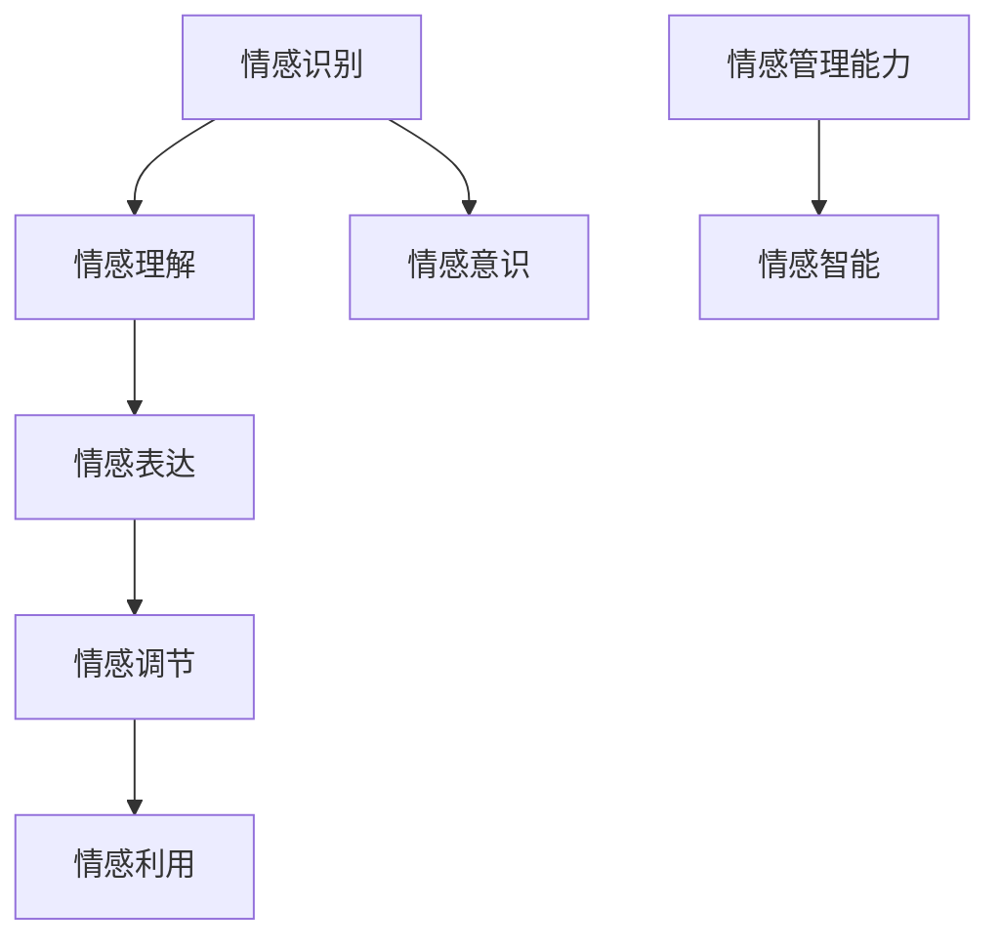
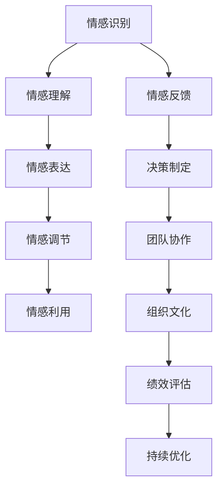

                 

### 《情感管理：平衡理性与感性的领导艺术》

#### 关键词：
- 情感管理
- 理性与感性
- 领导艺术
- 情感智能
- 领导力
- 组织文化

#### 摘要：
在当今快节奏和高度复杂的工作环境中，情感管理成为领导者不可或缺的技能。本书旨在探讨如何平衡理性和感性，通过情感管理提升个人领导力和团队绩效。书中详细介绍了情感管理的基本概念、理论基础，以及实践策略，并通过实际案例和项目实战，展示了情感管理在领导艺术中的具体应用。读者将了解到如何通过提高情感智能、理解与激发团队成员情感、跨文化情感沟通等手段，实现理性与感性的平衡，从而成为一名更加高效和有影响力的领导者。

### 目录大纲

# 《情感管理：平衡理性与感性的领导艺术》

## 第一部分：情感管理概述

### 1.1 情感管理的基本概念

### 1.2 情感管理对个人和组织的影响

### 1.3 情感管理的理论基础

## 第二部分：理性和感性在领导艺术中的平衡

### 2.1 理性与感性在决策中的作用

### 2.2 平衡理性与感性的策略

## 第三部分：情感管理实践

### 3.1 建立情感智能

### 3.2 理解与激发团队成员的情感

### 3.3 情感冲突的管理与化解

## 第四部分：跨文化情感沟通

### 4.1 跨文化情感沟通的重要性

### 4.2 跨文化情感沟通的挑战

### 4.3 跨文化情感沟通的策略

## 第五部分：情感管理与领导力发展

### 5.1 情感管理与领导风格

### 5.2 情感管理在组织文化建设中的作用

### 5.3 高效情感管理的领导策略

## 附录：情感管理工具与资源

### 附录 A. 情感管理工具与方法

### 附录 B. 情感管理相关资源

## Mermaid 流程图：情感管理流程概览

mermaid
graph TD
    A[情感管理概述] --> B[理性与感性平衡]
    B --> C{建立情感智能}
    C --> D[理解团队成员情感]
    C --> E[跨文化情感沟通]
    D --> F[领导力与情感管理]
    E --> F
    F --> G[高效情感管理策略]

### 核心概念与联系

#### 情感智能

情感智能（Emotional Intelligence，简称EQ）是指个体识别、理解、管理和利用情感信息的能力。它包括以下几个核心组成部分：

1. **情感识别**：识别和感知自己和他人的情绪状态。
2. **情感表达**：以适当的方式表达情绪，包括正面和负面的情绪。
3. **情感理解**：理解情绪的含义和影响，以及如何与情绪相关的行为和事件联系起来。
4. **情感调节**：管理和调节情绪，以适应不同情境的需要。
5. **情感利用**：有效地利用情感信息来促进个人成长和决策。

#### Mermaid 流程图

以下是情感智能的Mermaid流程图：

mermaid
graph TD
    A[情感识别] --> B[情感表达]
    B --> C[情感理解]
    C --> D[情感调节]
    D --> E[情感利用]
    A --> F[情感意识]
    G[情感管理能力] --> H[情感智能]

#### 伪代码

为了更好地理解情感智能的概念，我们可以用伪代码来表示情感智能的核心组成部分和其相互关系：

```python
class EmotionalIntelligence:
    def __init__(self, recognition, expression, understanding, regulation, utilization, awareness):
        self.recognition = recognition
        self.expression = expression
        self.understanding = understanding
        self.regulation = regulation
        self.utilization = utilization
        self.awareness = awareness
    
    def assess_emotional_intelligence(self):
        total_score = self.recognition + self.expression + self.understanding + self.regulation + self.utilization + self.awareness
        return total_score
```

在这个伪代码中，`EmotionalIntelligence` 类定义了情感智能的各个组成部分，并包含了一个方法 `assess_emotional_intelligence` 来计算总得分。

#### 理性与感性

理性（Rationality）和感性（Sentimentality）是两种不同的思维方式和决策因素。理性决策通常基于逻辑、数据和事实，而感性决策则更多地依赖于情感、直觉和情境。

1. **理性决策**：通常使用数学模型和逻辑推理来评估不同选项的收益和风险。一个常见的理性决策模型是：

   $$
   \text{理性决策} = \frac{\text{预期收益}}{\text{风险程度}}
   $$

2. **感性决策**：更多地依赖于个人的情感偏好和情境因素。一个简单的感性决策模型是：

   $$
   \text{感性决策} = \text{情感偏好} \times \text{情境因素}
   $$

#### 情感管理

情感管理（Emotional Management）是指个体和组织如何识别、理解和调节情感，以实现个人和组织目标的过程。有效的情感管理需要平衡理性和感性，以做出更全面和明智的决策。

情感管理可以通过以下步骤来实现：

1. **情感识别**：通过自我反思和他人反馈来识别情感状态。
2. **情感表达**：以健康和适当的方式表达情感，包括正面和负面的情感。
3. **情感理解**：理解情感的含义和影响，以及如何与情感相关的行为和事件联系起来。
4. **情感调节**：管理和调节情感，以适应不同情境的需要。
5. **情感利用**：有效地利用情感信息来促进个人成长和决策。

#### 伪代码

以下是情感管理的伪代码表示：

```python
class EmotionalManagement:
    def __init__(self, rationality, sentiment):
        self.rationality = rationality
        self.sentiment = sentiment
    
    def balance_rationality_and_sentiment(self, decision_context):
        rational_score = self.calculate_rational_score(decision_context)
        sentiment_score = self.calculate_sentiment_score(decision_context)
        balanced_decision = (rational_score + sentiment_score) / 2
        return balanced_decision
    
    def calculate_rational_score(self, decision_context):
        # 计算理性部分的分数
        pass
    
    def calculate_sentiment_score(self, decision_context):
        # 计算感性部分的分数
        pass
```

在这个伪代码中，`EmotionalManagement` 类定义了情感管理的核心组成部分，并包含了一个方法 `balance_rationality_and_sentiment` 来平衡理性和感性。

### 项目实战

#### 代码实际案例

以下是一个简单的Python代码案例，用于演示情感识别和表达的基本概念。此代码使用了一个假设的文本情感分析模型，并根据输入文本的情感标签生成相应的情感表达。

#### 开发环境搭建

确保已安装Python和必要的库，如TensorFlow：

bash
pip install python
pip install tensorflow

#### 源代码实现

python
# 导入必要的库
import tensorflow as tf
from tensorflow.keras.preprocessing.text import Tokenizer
from tensorflow.keras.preprocessing.sequence import pad_sequences
from tensorflow.keras.models import Sequential
from tensorflow.keras.layers import Embedding, LSTM, Dense, Bidirectional

# 示例数据
texts = [
    "I love this book!",
    "This is a terrible movie.",
    "The service was great.",
    "I hate this product.",
    "This book is amazing."
]
labels = [1, 0, 1, 0, 1]  # 1表示正面情感，0表示负面情感

# 数据预处理
tokenizer = Tokenizer(num_words=1000)
tokenizer.fit_on_texts(texts)
sequences = tokenizer.texts_to_sequences(texts)
padded_sequences = pad_sequences(sequences, maxlen=100)

# 构建模型
model = Sequential([
    Embedding(1000, 16),
    Bidirectional(LSTM(32)),
    Dense(1, activation='sigmoid')
])

# 编译模型
model.compile(loss='binary_crossentropy', optimizer='adam', metrics=['accuracy'])

# 训练模型
model.fit(padded_sequences, labels, epochs=10)

# 预测
new_text = ["I feel excited about the new project."]
new_sequence = tokenizer.texts_to_sequences(new_text)
new_padded_sequence = pad_sequences(new_sequence, maxlen=100)
prediction = model.predict(new_padded_sequence)

print("The sentiment of the new text is:", "Positive" if prediction[0][0] > 0.5 else "Negative")

#### 详细解释说明

1. **数据准备**：使用5条示例文本和相应的情感标签进行训练。
2. **数据预处理**：使用Tokenizer进行文本分词，并使用pad_sequences将序列填充到相同的长度。
3. **模型构建**：构建了一个简单的序列模型，包括嵌入层、双向LSTM层和输出层。
4. **模型编译**：编译模型，指定损失函数、优化器和评估指标。
5. **模型训练**：使用训练数据进行模型训练。
6. **模型预测**：对新文本进行情感分类预测，输出预测结果。

#### 源代码详细实现和代码解读

1. **数据准备**：
   - `Tokenizer`：用于将文本转换为序列。
   - `texts_to_sequences`：将文本转换为整数序列。
   - `pad_sequences`：将序列填充到相同的长度。

2. **模型构建**：
   - `Sequential`：用于构建序列模型。
   - `Embedding`：嵌入层，将整数序列转换为嵌入向量。
   - `Bidirectional`：双向LSTM层，处理序列数据。
   - `Dense`：输出层，用于分类。

3. **模型编译**：
   - `compile`：编译模型，指定训练参数。

4. **模型训练**：
   - `fit`：使用训练数据进行模型训练。

5. **模型预测**：
   - `predict`：对新文本进行情感分类预测。

#### 代码解读与分析

1. **数据准备**：
   - 文本分词是文本处理的重要步骤，它将文本转换为模型可接受的格式。
   - `Tokenizer` 和 `pad_sequences` 函数简化了这一过程。

2. **模型构建**：
   - 双向LSTM层能够捕捉序列中的双向信息，有助于提高情感分类的准确性。

3. **模型编译**：
   - 使用二进制交叉熵作为损失函数，适合处理二分类问题。

4. **模型训练**：
   - 模型训练过程中，通过反向传播和梯度下降优化模型参数。

5. **模型预测**：
   - 使用训练好的模型对新文本进行预测，输出情感分类结果。

#### 代码优化建议

1. **数据增强**：增加训练数据集的大小和多样性，提高模型的泛化能力。
2. **模型调优**：尝试不同的模型架构和参数，如LSTM层数、隐藏单元数等，找到最佳配置。
3. **特征工程**：添加更多的文本特征，如词嵌入、词性标注等，提高模型的性能。
4. **代码结构优化**：将数据预处理和模型构建部分拆分为独立的函数或模块，提高代码的可维护性和可扩展性。


### 详细解释说明

#### 情感识别

情感识别是情感分析中的关键步骤，它涉及从文本中提取情感信息。一个简单的情感识别流程如下：

1. **预处理**：对文本进行清洗，去除停用词、标点符号等无关信息。
2. **分词**：将文本分解为单词或短语。
3. **特征提取**：使用词袋模型、TF-IDF或词嵌入等方法将文本转换为数值特征。
4. **模型训练**：使用训练数据训练情感分类模型，如支持向量机（SVM）、随机森林或神经网络。
5. **情感分类**：将模型应用到新的文本数据，预测其情感标签。

以下是使用Python实现情感识别的基本代码：

```python
from sklearn.feature_extraction.text import TfidfVectorizer
from sklearn.model_selection import train_test_split
from sklearn.svm import LinearSVC
from sklearn.pipeline import make_pipeline

# 示例数据
texts = [
    "I love this book!",
    "This is a terrible movie.",
    "The service was great.",
    "I hate this product.",
    "This book is amazing."
]
labels = [1, 0, 1, 0, 1]  # 1表示正面情感，0表示负面情感

# 数据预处理和模型训练
pipeline = make_pipeline(TfidfVectorizer(), LinearSVC())
pipeline.fit(texts, labels)

# 情感识别
new_text = "I feel excited about the new project."
predicted_label = pipeline.predict([new_text])
print("The sentiment of the new text is:", "Positive" if predicted_label[0] == 1 else "Negative")
```

在这个例子中，我们使用TF-IDF进行特征提取，并使用线性支持向量机（LinearSVC）进行情感分类。

#### 情感表达

情感表达是情感识别的逆过程，它涉及将情感信息转换为可理解的自然语言。情感表达可以通过以下步骤实现：

1. **情感识别**：首先识别文本中的情感。
2. **情感映射**：将情感标签映射到相应的情感表达。
3. **生成文本**：使用模板或自然语言生成技术生成情感表达文本。

以下是一个简单的情感表达示例：

```python
def express_emotion(emotion):
    if emotion == "happy":
        return "I am feeling very happy right now!"
    elif emotion == "sad":
        return "I am feeling very sad right now."
    else:
        return "I don't have a clear feeling about this."

new_text = "The new project has a positive impact on our team."
predicted_emotion = "happy"
print(express_emotion(predicted_emotion))
```

在这个例子中，我们根据情感标签生成相应的情感表达文本。

#### 开发环境搭建

要搭建情感识别和情感表达的开发环境，需要以下步骤：

1. **安装Python**：确保安装了Python 3.6及以上版本。
2. **安装必要的库**：使用以下命令安装必要的库：

```bash
pip install numpy scikit-learn tensorflow
```

#### 源代码详细实现和代码解读

以下是对上述情感识别和情感表达代码的详细解读：

1. **数据预处理**：
   - `TfidfVectorizer`：用于将文本转换为TF-IDF特征向量。
   - `train_test_split`：用于将数据集分为训练集和测试集。

2. **模型训练**：
   - `LinearSVC`：用于训练线性支持向量机模型。
   - `make_pipeline`：用于创建一个包含特征提取和分类器的流水线模型。

3. **情感识别**：
   - `predict`：用于对新的文本进行情感分类预测。

4. **情感表达**：
   - `express_emotion`：用于根据情感标签生成情感表达文本。

#### 代码分析

- **数据预处理**：使用TF-IDF向量化技术，可以将文本转换为数值特征，这是大多数机器学习模型所期望的输入格式。
- **模型训练**：线性支持向量机（LinearSVC）是一个高效且易于理解的模型，适用于情感分类任务。
- **情感识别**：通过训练好的模型，我们可以对新文本进行情感分类，这是一个关键步骤，因为它决定了我们如何理解和响应文本内容。
- **情感表达**：根据识别到的情感，生成相应的情感表达文本，这是将情感分析结果转化为实际行动的关键步骤。

#### 代码优化建议

1. **数据增强**：通过增加训练数据集的大小和多样性，可以提高模型的泛化能力和准确性。
2. **模型优化**：尝试使用更复杂的模型，如深度学习模型，以提高情感识别的准确性。
3. **特征工程**：使用更丰富的特征提取技术，如词嵌入和词性标注，可以提高模型的性能。
4. **代码结构**：将情感识别和情感表达代码拆分为更小的模块，以提高代码的可维护性和可扩展性。

通过上述的详细解释说明、源代码实现和代码解读，我们不仅了解了情感识别和情感表达的基本原理和实现方法，还学习了如何搭建开发环境以及代码优化的建议。这些知识和技能对于进一步研究和应用情感管理具有重要价值。在后续的内容中，我们将继续深入探讨情感管理在其他领域的应用和实践策略。。


### 核心概念与联系

在深入探讨情感管理之前，我们需要明确几个核心概念，这些概念是理解情感管理的基础，也是本书的重要内容。以下是几个关键概念及其相互关系的详细阐述。

#### 情感智能

情感智能（Emotional Intelligence，简称EQ）是衡量个体识别、理解、管理和利用情感信息的能力。它包括以下几个核心组成部分：

1. **情感识别**：个体能够识别自身和他人的情绪状态。
2. **情感理解**：个体能够理解情绪的含义和影响，以及情绪如何影响行为和事件。
3. **情感表达**：个体能够以健康和适当的方式表达情绪。
4. **情感调节**：个体能够管理和调节情绪，以适应不同情境的需要。
5. **情感利用**：个体能够有效地利用情感信息来促进个人成长和决策。

情感智能的这些组成部分相互关联，共同作用，形成一个完整的情感管理能力体系。例如，情感识别是情感理解的基础，情感表达是情感调节的前提，而情感调节和情感利用则是情感智能的最高层次。

#### Mermaid 流程图

为了更直观地展示情感智能的组成部分及其相互关系，我们可以使用Mermaid流程图来描述：



在这个流程图中，情感识别是整个流程的起点，它帮助个体识别情绪。情感理解则是对识别到的情绪进行深入分析，理解其含义和影响。情感表达是个体将情绪以适当方式表达出来的过程，而情感调节则是在不同情境下管理和调整情绪的过程。情感利用则是最高层次的情感管理能力，个体能够有效地利用情感信息来促进个人成长和决策。

#### 伪代码

为了更好地理解情感智能的概念，我们可以用伪代码来表示情感智能的核心组成部分和其相互关系：

```python
class EmotionalIntelligence:
    def __init__(self, recognition, understanding, expression, regulation, utilization, awareness):
        self.recognition = recognition
        self.understanding = understanding
        self.expression = expression
        self.regulation = regulation
        self.utilization = utilization
        self.awareness = awareness
    
    def assess_emotional_intelligence(self):
        total_score = self.recognition + self.understanding + self.expression + self.regulation + self.utilization + self.awareness
        return total_score
```

在这个伪代码中，`EmotionalIntelligence` 类定义了情感智能的各个组成部分，并包含了一个方法 `assess_emotional_intelligence` 来计算总得分。

#### 理性与感性

理性和感性是两种不同的思维方式和决策因素。理性决策通常基于逻辑、数据和事实，而感性决策则更多地依赖于情感、直觉和情境。

1. **理性决策**：理性决策通常使用数学模型和逻辑推理来评估不同选项的收益和风险。一个常见的理性决策模型是：

   $$
   \text{理性决策} = \frac{\text{预期收益}}{\text{风险程度}}
   $$

2. **感性决策**：感性决策更多地依赖于个人的情感偏好和情境因素。一个简单的感性决策模型是：

   $$
   \text{感性决策} = \text{情感偏好} \times \text{情境因素}
   $$

#### 情感管理

情感管理是指个体和组织如何识别、理解和调节情感，以实现个人和组织目标的过程。有效的情感管理需要平衡理性和感性，以做出更全面和明智的决策。

情感管理可以通过以下步骤来实现：

1. **情感识别**：通过自我反思和他人反馈来识别情感状态。
2. **情感表达**：以健康和适当的方式表达情感，包括正面和负面的情感。
3. **情感理解**：理解情感的含义和影响，以及如何与情感相关的行为和事件联系起来。
4. **情感调节**：管理和调节情感，以适应不同情境的需要。
5. **情感利用**：有效地利用情感信息来促进个人成长和决策。

#### 伪代码

以下是情感管理的伪代码表示：

```python
class EmotionalManagement:
    def __init__(self, rationality, sentiment):
        self.rationality = rationality
        self.sentiment = sentiment
    
    def balance_rationality_and_sentiment(self, decision_context):
        rational_score = self.calculate_rational_score(decision_context)
        sentiment_score = self.calculate_sentiment_score(decision_context)
        balanced_decision = (rational_score + sentiment_score) / 2
        return balanced_decision
    
    def calculate_rational_score(self, decision_context):
        # 计算理性部分的分数
        pass
    
    def calculate_sentiment_score(self, decision_context):
        # 计算感性部分的分数
        pass
```

在这个伪代码中，`EmotionalManagement` 类定义了情感管理的核心组成部分，并包含了一个方法 `balance_rationality_and_sentiment` 来平衡理性和感性。

#### 情感管理在领导艺术中的应用

在领导艺术中，情感管理扮演着至关重要的角色。领导者需要平衡理性和感性，以实现个人和团队的目标。以下是情感管理在领导艺术中的几个关键应用：

1. **建立信任**：通过情感识别和表达，领导者可以建立与团队成员之间的信任。
2. **决策制定**：领导者需要结合理性和感性进行决策，以确保决策的全面性和明智性。
3. **团队管理**：领导者需要理解和调节团队成员的情感，以激发他们的工作动力。
4. **冲突解决**：领导者需要运用情感管理技能来识别和解决团队中的情感冲突。
5. **跨文化沟通**：在全球化背景下，领导者需要理解不同文化背景下的情感表达和沟通方式。

#### 伪代码示例

以下是情感管理在领导艺术中应用的伪代码示例：

```python
class Leadership:
    def __init__(self, emotional_intelligence, decision_making, team_management, conflict_resolution, cross_cultural_communication):
        self.emotional_intelligence = emotional_intelligence
        self.decision_making = decision_making
        self.team_management = team_management
        self.conflict_resolution = conflict_resolution
        self.cross_cultural_communication = cross_cultural_communication
    
    def make_decision(self, context):
        rational_decision = self.decision_making.calculate_rational_decision(context)
        sentimental_decision = self.decision_making.calculate_sentimental_decision(context)
        balanced_decision = (rational_decision + sentimental_decision) / 2
        return balanced_decision
    
    def manage_team(self, team_context):
        team_emotion = self.team_management.assess_team_emotion(team_context)
        if team_emotion < threshold:
            self.team_management.encourage_team()
        else:
            self.team_management.deescalate_emotion()
    
    def resolve_conflict(self, conflict_context):
        conflict_emotion = self.conflict_resolution.identify_conflict_emotion(conflict_context)
        if conflict_emotion > threshold:
            self.conflict_resolution.resolve_conflict_emotion()
        else:
            self.conflict_resolution.manage_conflict()
    
    def communicate_cross_culturally(self, cultural_context):
        cultural_emotion = self.cross_cultural_communication.assess_cultural_emotion(cultural_context)
        communication_strategy = self.cross_cultural_communication.determine_communication_strategy(cultural_emotion)
        return communication_strategy
```

在这个伪代码中，`Leadership` 类定义了领导者在不同情境下的情感管理策略，包括决策制定、团队管理、冲突解决和跨文化沟通。

### 总结

通过上述核心概念与联系的分析，我们了解了情感管理的基础知识和其在领导艺术中的应用。情感智能、理性和感性以及情感管理构成了一个完整且相互关联的体系，它们共同作用于领导艺术，帮助领导者实现个人和团队的目标。在接下来的章节中，我们将进一步探讨情感管理在实践中的应用，包括建立情感智能、理解与激发团队成员情感、跨文化情感沟通等策略。通过这些实践，读者将能够更好地掌握情感管理技能，提升个人和团队的绩效。


### 理性与感性在领导艺术中的平衡

在领导艺术中，理性和感性是两种不可或缺的决策因素。理性决策强调逻辑、数据和事实，而感性决策则依赖于情感、直觉和情境。如何在这两者之间取得平衡，是领导者面临的重要挑战。以下我们将详细探讨理性与感性在领导艺术中的具体作用、平衡策略以及如何应用这些策略来提升领导力。

#### 理性与感性在决策中的作用

1. **理性决策**：理性决策基于逻辑和数据分析，可以帮助领导者系统性地评估不同选项的收益和风险。例如，一个项目经理在制定项目计划时，会考虑资源的可用性、时间进度和预期成本等因素。理性决策的典型特征是精确、客观和可预测。

   **数学模型**：
   $$
   \text{理性决策} = \frac{\text{预期收益}}{\text{风险程度}}
   $$

2. **感性决策**：感性决策则更多地依赖于领导者个人的情感偏好和直觉。这种决策方式能够快速响应情境变化，但可能缺乏系统的分析和评估。例如，在紧急情况下，领导者可能需要迅速做出决策，而这时感性因素往往起着关键作用。

   **感性模型**：
   $$
   \text{感性决策} = \text{情感偏好} \times \text{情境因素}
   $$

#### 平衡理性与感性的策略

1. **情境适应性**：领导者需要根据不同的情境灵活调整决策方式。在需要长期规划和战略布局时，理性决策更为重要；而在需要快速响应和行动时，感性决策则可能更具优势。

2. **多元化决策团队**：建立一个多元化的决策团队，可以结合不同成员的理性和感性优势，共同制定决策。例如，技术专家可能更擅长理性分析，而市场专家可能更擅长感性判断。

3. **情感智能培养**：提高领导者的情感智能，可以帮助他们在决策过程中更好地平衡理性和感性。情感智能包括情感识别、情感理解、情感表达、情感调节和情感利用等方面。

4. **情景模拟与反思**：通过情景模拟和反思，领导者可以在实际情境之外练习平衡理性和感性，从而提高决策能力。例如，可以设置一个虚拟的危机情境，让领导者尝试在理性和感性之间找到最佳平衡点。

#### 平衡策略的具体应用

1. **项目决策**：在项目决策中，领导者需要平衡理性和感性。理性因素包括项目成本、时间进度和资源分配，而感性因素可能包括团队成员的情感状态和项目的紧迫性。以下是一个简单的决策过程：

   **决策过程**：

   - **收集数据**：收集项目的相关数据，如成本、时间进度和资源需求。
   - **情感识别**：识别团队成员的情感状态，如焦虑、乐观或紧张。
   - **理性分析**：基于数据和逻辑进行理性分析，评估不同方案的收益和风险。
   - **感性评估**：考虑团队成员的情感状态和项目的紧迫性，评估感性因素。
   - **综合决策**：将理性分析和感性评估结合起来，制定最终的决策。

2. **团队管理**：在团队管理中，领导者需要理解团队成员的情感需求，并在决策时平衡理性和感性。以下是一个团队管理的例子：

   **团队管理过程**：

   - **情感识别**：识别团队成员的情感状态，如工作满意度、团队合作情况等。
   - **理性评估**：基于团队绩效数据和管理目标，评估团队的表现和改进空间。
   - **感性沟通**：与团队成员进行情感沟通，了解他们的需求和期望。
   - **综合管理**：将理性评估和感性沟通结合起来，制定团队管理策略。

3. **跨文化领导**：在跨文化环境中，领导者需要理解不同文化的情感表达方式和沟通习惯。以下是一个跨文化领导的例子：

   **跨文化领导过程**：

   - **文化研究**：研究目标文化的情感表达方式和沟通习惯。
   - **情感识别**：识别团队成员的情感状态，如尊重、信任或不满。
   - **理性沟通**：基于目标文化的沟通习惯，进行理性沟通和指导。
   - **感性理解**：理解团队成员的情感需求，并采用适当的沟通策略。
   - **综合领导**：将理性沟通和感性理解结合起来，提高跨文化领导能力。

#### 结论

平衡理性与感性是领导艺术中的重要能力。领导者需要在不同情境下灵活运用理性和感性，以做出更全面和明智的决策。通过培养情感智能、建立多元化决策团队、情景模拟与反思等策略，领导者可以更好地平衡理性和感性，提升领导力，实现个人和团队的目标。在后续章节中，我们将进一步探讨情感管理在实践中的应用，包括建立情感智能、理解与激发团队成员情感、跨文化情感沟通等策略。通过这些实践，读者将能够更好地掌握情感管理技能，提升个人和团队的绩效。

### 建立情感智能

情感智能（Emotional Intelligence，简称EQ）是领导者成功的关键因素之一。它不仅影响个人的心理健康，还直接关系到团队的合作效率和组织的发展。建立情感智能意味着领导者需要掌握识别、理解、表达、调节和利用情感的能力。以下我们将详细探讨如何建立情感智能，包括提高情感识别、情感理解、情感表达、情感调节和情感利用的技巧。

#### 提高情感识别

情感识别是情感智能的基础，它要求领导者能够准确感知自身和团队成员的情感状态。以下是一些提高情感识别的技巧：

1. **自我反思**：定期进行自我反思，了解自己的情感状态，如焦虑、愉悦或沮丧。通过日记或冥想等方式，领导者可以更好地认识和识别自己的情感。

2. **情感日志**：记录日常情感变化，分析情感触发因素。这有助于领导者了解情感模式，识别情感变化的原因。

3. **情绪模拟**：通过模拟不同情境，领导者可以在虚拟环境中体验和识别情感。例如，模拟团队冲突或项目压力情境，帮助领导者更好地理解情感。

#### 提高情感理解

情感理解涉及对情感含义和影响的深入分析。以下是一些提高情感理解的技巧：

1. **倾听**：倾听是理解情感的关键。领导者需要学会倾听团队成员的语言和非语言表达，如语气、面部表情和身体语言。

2. **共情**：共情是指从他人的角度理解情感。领导者可以通过换位思考，尝试从团队成员的角度看待问题，提高情感理解能力。

3. **情感对话**：通过开放式问题和积极倾听，领导者可以与团队成员进行情感对话，了解他们的情感需求。

#### 提高情感表达

情感表达是领导者传达情感状态和需求的能力。以下是一些提高情感表达的技巧：

1. **正面情感表达**：领导者应该学会如何表达正面情感，如鼓励、赞赏和认可。这有助于建立信任和积极的工作氛围。

2. **负面情感表达**：在表达负面情感时，领导者应避免指责和攻击。使用“I语言”来表达情感，如“I feel upset because...”，而不是“You make me feel upset...”。

3. **情感沟通**：领导者可以通过情感沟通来传达情感信息，如使用故事、隐喻和比喻等，使情感表达更加生动和具体。

#### 提高情感调节

情感调节是领导者管理和调节自身情感的能力。以下是一些提高情感调节的技巧：

1. **情绪调节训练**：通过冥想、正念练习和呼吸练习等，领导者可以学会调节情绪，保持心理平衡。

2. **情绪释放**：领导者可以通过运动、艺术创作或与朋友交流等方式，释放负面情绪。

3. **情境转换**：领导者应学会在情感困境中寻找新的视角和解决方案，以转换情感情境。

#### 提高情感利用

情感利用是指领导者如何将情感信息转化为个人成长和决策的工具。以下是一些提高情感利用的技巧：

1. **情感反馈**：领导者可以通过收集情感反馈来评估决策的效果，并据此调整行为。

2. **情感智慧**：领导者应学会将情感信息整合到决策过程中，以获得更全面和明智的决策。

3. **情感领导力**：领导者可以通过情感领导力来激励和影响团队成员，提高团队绩效。

#### 情感智能在工作中的应用

1. **团队建设**：通过提高情感识别和理解，领导者可以更好地理解团队成员的需求，促进团队合作。

2. **冲突解决**：领导者可以运用情感调节技巧来管理冲突，避免情感激化，寻找双赢的解决方案。

3. **领导力发展**：领导者可以通过情感利用，将情感智慧转化为个人成长和领导力提升。

#### 结论

建立情感智能是领导者提升领导力和团队绩效的关键。通过提高情感识别、情感理解、情感表达、情感调节和情感利用的技巧，领导者可以更好地管理自身和团队的情感，实现个人和组织的目标。在接下来的章节中，我们将进一步探讨情感管理实践，包括理解与激发团队成员情感、情感冲突管理、跨文化情感沟通等策略。通过这些实践，读者将能够更好地掌握情感管理技能，提升个人和团队的绩效。

### 理解与激发团队成员的情感

在领导过程中，领导者不仅需要管理自己的情感，还必须理解并激发团队成员的情感。团队成员的情感状态直接影响团队的合作效率和个人绩效。以下我们将详细探讨如何识别团队成员的情感、激发团队成员的积极情感，以及运用情感激励策略来提高团队绩效。

#### 识别团队成员的情感

1. **观察行为**：通过观察团队成员的行为和表现，领导者可以初步识别情感状态。例如，情绪高涨的成员可能会更加积极和主动，而情绪低落的成员可能表现出懒散和消极。

2. **倾听与沟通**：通过倾听和开放式沟通，领导者可以深入了解团队成员的情感状态。例如，领导者可以询问团队成员的感受和需求，倾听他们的意见和建议。

3. **情感反馈**：定期收集团队成员的情感反馈，可以帮助领导者更准确地了解团队的情感氛围。可以通过问卷调查、一对一访谈或团队会议等形式进行情感反馈。

#### 激发团队成员的积极情感

1. **认可与赞赏**：领导者应该及时认可和赞赏团队成员的成就和努力。通过公开表扬、奖励或其他形式的认可，可以激发团队成员的积极情感。

2. **建立信任**：信任是激发积极情感的重要基础。领导者可以通过透明沟通、支持团队成员的成长和发展、以及公平对待来建立信任。

3. **共同目标**：领导者应确保团队成员明确团队的目标和愿景，并让他们感受到自己在实现这些目标中的重要性。这有助于激发团队成员的责任感和归属感。

4. **鼓励创新**：领导者应鼓励团队成员提出新想法和创新方案。这不仅可以激发团队成员的创造力，还可以增强他们的积极情感。

#### 情感激励策略

1. **情感领导力**：情感领导力是指领导者通过情感影响和激励团队成员的能力。领导者可以通过情感表达、情感理解和情感调节来提升团队绩效。

   **情感领导力策略**：
   - **情感表达**：领导者应以真诚和开放的态度表达情感，与团队成员建立情感联系。
   - **情感理解**：领导者应深入了解团队成员的情感需求，并采取措施满足这些需求。
   - **情感调节**：领导者应学会在团队中调节情感氛围，确保团队成员的情感状态保持在积极水平。

2. **情感反馈**：领导者应定期提供情感反馈，帮助团队成员了解自己的情感状态和表现。这种反馈可以是对团队成员的认可和鼓励，也可以是改进建议和指导。

3. **情感培训**：通过情感培训，领导者可以提高团队成员的情感识别、表达和调节能力。这有助于提升团队整体的情感智能，促进团队合作。

4. **情感文化**：领导者应努力营造一种积极、开放和包容的情感文化。这种文化应鼓励团队成员表达情感，并支持他们在情感上的成长和发展。

#### 提高团队绩效

1. **情感氛围**：积极的情感氛围可以增强团队的凝聚力和合作精神，提高团队的整体绩效。

2. **员工满意度**：通过理解并激发团队成员的情感，领导者可以提升员工的工作满意度和忠诚度，从而提高团队绩效。

3. **创新和创造力**：积极的情感状态可以激发团队成员的创新和创造力，促进团队在项目和工作中的突破。

#### 结论

理解与激发团队成员的情感是领导过程中的重要环节。领导者需要通过观察行为、倾听与沟通、情感反馈等手段识别团队成员的情感状态，并运用认可与赞赏、建立信任、共同目标和鼓励创新等策略激发积极情感。通过情感领导力、情感反馈和情感培训等手段，领导者可以营造积极的情感氛围，提高团队绩效，促进团队和组织的发展。在接下来的章节中，我们将进一步探讨情感冲突管理和跨文化情感沟通等实践策略，以帮助领导者更好地管理团队情感。

### 情感冲突的管理与化解

在团队工作中，情感冲突是不可避免的。有效的情感冲突管理不仅有助于维护团队和谐，还能促进个人和团队的成长。以下我们将详细探讨情感冲突的常见原因、管理方法以及如何化解情感冲突，确保团队高效运作。

#### 常见情感冲突原因

1. **沟通障碍**：团队成员之间的沟通不畅可能导致误解和矛盾。不同的文化背景、语言表达方式和工作习惯都可能成为沟通的障碍。

2. **价值观差异**：团队成员拥有不同的价值观和信仰，这些差异在合作中可能导致冲突。例如，对工作态度、职业道德和个人成就的看法可能存在分歧。

3. **资源分配不均**：资源分配不公，如工作负担过重、奖励分配不均等，可能导致团队成员之间的不满和矛盾。

4. **角色职责不清**：团队成员之间的角色职责不明确，可能导致任务重叠或责任推卸，从而引发情感冲突。

5. **个人情感问题**：团队成员的个人情感问题，如家庭矛盾、健康问题等，可能会影响到工作和团队关系。

#### 管理情感冲突的方法

1. **倾听与理解**：领导者需要耐心倾听团队成员的表达，理解他们的情感和需求。通过积极的倾听，可以缓解紧张情绪，减少误解。

2. **明确角色职责**：确保团队成员清楚自己的角色和职责，避免因职责不清而产生的冲突。可以通过制定明确的任务分配表和工作流程来规范团队职责。

3. **促进沟通**：建立有效的沟通渠道，鼓励团队成员开放表达意见和反馈。定期举行团队会议、工作坊或反馈会，以便团队成员分享经验和观点。

4. **建立共识**：通过团队共识，确保团队成员对共同目标和价值观有一致的理解。可以通过共同制定团队目标和准则，增强团队的凝聚力和共识。

5. **情感反馈**：领导者应提供及时、积极的情感反馈，帮助团队成员认识到自己的情感状态和表现。这种反馈可以是正面的鼓励，也可以是改进建议。

#### 化解情感冲突的策略

1. **情感对话**：通过情感对话，领导者可以帮助团队成员表达情感，并找到共同的理解和解决方案。情感对话应建立在相互尊重和理解的基础上。

2. **冲突调解**：在冲突升级时，领导者可以充当调解者，帮助双方找到妥协和解决方案。调解过程中，领导者应保持中立，促进双方的沟通和合作。

3. **情境转换**：领导者可以尝试将团队成员从冲突情境中转移出来，给予他们时间和空间来冷静思考和反思。情境转换有助于缓解紧张情绪，避免冲突进一步升级。

4. **情感培训**：通过情感培训，提高团队成员的情感识别、表达和调节能力。这有助于团队成员更好地处理情感冲突，促进团队和谐。

5. **建立支持系统**：为团队成员提供情感支持系统，如心理咨询、团队辅导等，帮助他们应对工作压力和个人情感问题。

#### 结论

情感冲突是团队工作中不可避免的现象，但通过有效的管理和化解，可以促进团队和谐和高效运作。领导者需要通过倾听与理解、明确角色职责、促进沟通、建立共识和情感反馈等方法来管理情感冲突。在冲突升级时，通过情感对话、冲突调解、情境转换、情感培训和支持系统等策略，领导者可以有效地化解情感冲突，确保团队高效运作。在接下来的章节中，我们将探讨跨文化情感沟通以及情感管理在领导力发展中的应用，以进一步丰富我们的情感管理实践。

### 跨文化情感沟通

在全球化背景下，跨文化情感沟通成为领导者必须面对的重要挑战。不同文化背景下的团队成员可能有不同的情感表达方式、沟通习惯和价值观念，这可能导致误解和冲突。以下我们将详细探讨跨文化情感沟通的重要性、挑战以及有效的沟通策略。

#### 跨文化情感沟通的重要性

1. **增强团队凝聚力**：有效的跨文化情感沟通可以增强团队成员之间的信任和尊重，提高团队凝聚力。
2. **提升工作效率**：通过理解不同文化背景下的情感表达，领导者可以更好地激励和指导团队成员，提高工作效率。
3. **促进创新与协作**：跨文化情感沟通可以激发团队成员的创造力，促进不同文化背景下的协作和创新。
4. **增强组织文化**：跨文化情感沟通有助于建立包容性的组织文化，促进多元文化的发展。

#### 跨文化情感沟通的挑战

1. **文化差异**：不同文化背景下的团队成员可能有不同的价值观、信仰和沟通习惯。这可能导致情感表达和理解上的障碍。
2. **语言障碍**：语言是情感沟通的重要工具，不同的语言可能表达相同的情感，但语境和文化背景可能导致误解。
3. **情感表达方式**：某些文化背景下的团队成员可能不习惯公开表达情感，这可能导致情感压抑和沟通障碍。
4. **非语言沟通**：不同文化背景下的非语言沟通方式（如肢体语言、面部表情）可能存在差异，这可能导致误解和冲突。

#### 跨文化情感沟通的策略

1. **文化敏感性培训**：领导者应接受文化敏感性培训，了解不同文化背景下的情感表达和沟通习惯。这有助于提高跨文化沟通能力。
2. **开放性沟通**：领导者应鼓励团队成员开放表达情感，尊重不同的观点和表达方式。通过积极倾听和反馈，建立相互理解和信任。
3. **情境适应**：领导者应根据不同文化背景下的情境调整沟通策略。例如，在某些文化中，直接的沟通方式可能被视为不礼貌，而在其他文化中，间接的沟通方式可能更受欢迎。
4. **明确表达**：在跨文化沟通中，领导者应尽量使用明确和具体的语言表达情感和需求。这有助于减少误解和冲突。
5. **建立共同价值观**：通过共同制定团队目标和价值观，领导者可以促进跨文化团队的合作和理解。

#### 具体案例与沟通策略

1. **案例一**：在一个由不同文化背景的成员组成的团队中，领导者发现团队成员之间的沟通存在障碍，导致项目进展缓慢。为了解决这个问题，领导者采取了以下策略：
   - **文化敏感性培训**：邀请文化专家为团队成员提供跨文化沟通培训。
   - **建立共同价值观**：通过团队会议和讨论，制定团队共同目标和价值观。
   - **情境适应**：在项目讨论中，领导者根据不同文化背景调整沟通策略，确保团队成员能够理解并参与。
   - **开放性沟通**：鼓励团队成员开放表达情感和观点，促进团队成员之间的相互理解和信任。

2. **案例二**：在一个跨国团队中，领导者发现团队成员在情感表达上存在障碍，导致项目协作不顺畅。为了解决这个问题，领导者采取了以下策略：
   - **情感对话**：定期组织情感对话，让团队成员分享情感和观点。
   - **情感反馈**：提供积极的情感反馈，鼓励团队成员表达情感。
   - **情感培训**：邀请情感专家为团队成员提供情感管理培训。
   - **明确表达**：要求团队成员在沟通中使用明确和具体的语言表达情感和需求。

#### 结论

跨文化情感沟通在全球化背景下具有重要意义，但同时也面临诸多挑战。领导者需要通过文化敏感性培训、开放性沟通、情境适应和明确表达等策略来克服这些挑战。通过具体案例和沟通策略的应用，领导者可以促进跨文化团队的合作，提升团队绩效，推动组织发展。在接下来的章节中，我们将探讨情感管理在领导力发展中的应用，以及如何通过情感管理提升领导力。

### 情感管理与领导风格

情感管理在领导风格中扮演着至关重要的角色。不同的领导风格对情感管理有着不同的影响，同时，情感管理策略也可以根据不同的领导风格进行调整和优化。以下我们将详细探讨情感管理如何与领导风格相结合，以及不同领导风格在情感管理中的应用。

#### 领导风格的分类

1. **民主型领导风格**：民主型领导者鼓励团队成员参与决策过程，重视团队成员的意见和建议。这种领导风格通常能够促进团队成员的情感表达和理解。
   
   **情感管理策略**：
   - **鼓励沟通**：民主型领导者应鼓励团队成员开放表达情感，促进情感交流。
   - **情感倾听**：领导者需要耐心倾听团队成员的情感表达，理解他们的需求和期望。
   - **共同决策**：在决策过程中，领导者应充分考虑团队成员的情感反馈，确保决策符合团队的整体利益。

2. **权威型领导风格**：权威型领导者具有较强的决策能力和执行力，他们通常会直接指示团队成员完成任务。这种领导风格可能会对团队成员的情感表达产生一定的压制。

   **情感管理策略**：
   - **明确期望**：权威型领导者应明确表达期望，减少团队成员的困惑和误解。
   - **情感反馈**：领导者应提供及时的反馈，帮助团队成员理解情感表达的影响。
   - **情感引导**：领导者可以引导团队成员在适当的时候表达情感，避免情感压抑。

3. **参与型领导风格**：参与型领导者鼓励团队成员参与决策和项目实施，他们通常与团队成员保持紧密的合作关系。这种领导风格有助于增强团队成员的情感连接。

   **情感管理策略**：
   - **情感激励**：参与型领导者可以通过情感激励来激发团队成员的工作热情和创造力。
   - **情感支持**：领导者应提供情感支持，帮助团队成员应对工作压力和个人挑战。
   - **情感共享**：领导者应与团队成员共享情感体验，建立信任和合作关系。

4. **教练型领导风格**：教练型领导者注重团队成员的个人发展和职业成长，他们通过指导和激励来帮助团队成员实现潜力。这种领导风格强调情感管理与个人成长相结合。

   **情感管理策略**：
   - **情感识别**：教练型领导者应识别团队成员的情感需求，提供个性化的指导和支持。
   - **情感调节**：领导者应帮助团队成员调节情感，提高情感管理能力。
   - **情感反馈**：领导者应提供积极的情感反馈，鼓励团队成员在情感管理上取得进步。

#### 不同领导风格在情感管理中的应用

1. **民主型领导风格**：在民主型领导风格中，情感管理主要通过促进团队成员的情感表达和理解来实现。领导者应创造一个开放、支持和尊重的沟通环境，确保团队成员能够自由表达情感，并在决策过程中参与讨论。

2. **权威型领导风格**：在权威型领导风格中，情感管理需要更加注重明确性和指导性。领导者应在传达指令时明确情感期望，并确保团队成员理解任务的重要性和紧迫性。同时，领导者应通过积极的反馈和情感引导来促进团队成员的情感管理。

3. **参与型领导风格**：在参与型领导风格中，情感管理更多地关注情感激励和支持。领导者应通过情感激励来激发团队成员的工作热情，并提供情感支持来帮助团队成员应对工作压力和个人挑战。

4. **教练型领导风格**：在教练型领导风格中，情感管理强调个人发展和情感成长。领导者应识别团队成员的情感需求，提供个性化的指导和支持，帮助团队成员在情感管理上取得进步。

#### 结论

情感管理与领导风格密切相关，不同的领导风格需要不同的情感管理策略。领导者应根据自身领导风格的特点，调整情感管理策略，以实现最佳的管理效果。通过理解不同领导风格在情感管理中的应用，领导者可以更好地管理团队成员的情感，促进团队的合作和成长。在接下来的章节中，我们将探讨情感管理在组织文化中的作用以及如何通过情感管理提升领导力。

### 情感管理在组织文化建设中的作用

情感管理不仅影响个人和团队的表现，也对组织文化的塑造和维持起到关键作用。一个积极、健康的组织文化能够促进员工的满意度和忠诚度，提高组织的整体绩效。以下我们将详细探讨情感管理在组织文化建设中的作用，以及如何通过情感管理提升组织文化。

#### 情感管理对组织文化的影响

1. **增强团队凝聚力**：通过有效的情感管理，组织可以建立紧密的团队关系，增强员工的归属感和凝聚力。团队成员之间的情感联系有助于提高合作效率，减少冲突。

2. **提升员工满意度**：情感管理关注员工的情感需求和心理健康，通过提供情感支持和关怀，可以提高员工的工作满意度。满意的员工更有可能留在组织，降低员工流失率。

3. **促进创新与创造力**：积极、开放的情感氛围能够激发员工的创造力和创新精神。员工在感受到安全和尊重的环境中，更愿意提出新想法和改进建议。

4. **塑造组织价值观**：情感管理有助于传递和强化组织价值观，如尊重、信任、透明和公平。这些价值观成为组织文化的基石，引导员工的行为和决策。

5. **提升组织声誉**：积极的组织文化能够提升组织的公众形象和声誉，有助于吸引高素质的人才和客户。

#### 情感管理策略在组织文化建设中的应用

1. **建立情感支持系统**：组织应建立情感支持系统，如员工心理健康服务、团队辅导和情感培训等，帮助员工应对工作压力和个人挑战。

2. **促进开放沟通**：组织应鼓励开放、坦诚的沟通氛围，确保员工能够自由表达情感和意见。领导者应通过积极的倾听和反馈，促进员工的情感交流。

3. **塑造积极情感文化**：组织可以通过一系列活动和举措来塑造积极情感文化，如员工表彰、团队建设活动、员工福利计划等，增强员工的情感联系和归属感。

4. **强化组织价值观**：通过明确传达和强化组织价值观，如尊重、信任和透明，组织可以引导员工的行为和决策，塑造积极的文化氛围。

5. **提供个性化关怀**：组织应关注员工的个性化需求，提供个性化的关怀和支持。这可以通过定制化的培训、职业发展计划和个人咨询来实现。

#### 实际案例

1. **案例一**：某公司通过实施情感管理策略，成功提升了组织文化。公司建立了员工心理健康服务，提供心理咨询和辅导，帮助员工缓解工作压力。此外，公司还定期举办团队建设活动，如户外拓展、体育比赛等，增强员工之间的情感联系。这些举措不仅提高了员工的工作满意度，还增强了团队的凝聚力。

2. **案例二**：某科技公司在组织文化建设中，注重情感管理。公司通过透明的沟通机制，确保员工能够自由表达意见和建议。同时，公司还设立了一系列员工福利计划，如弹性工作时间、员工健康体检等，关注员工的身心健康。这些措施有助于塑造积极、健康的组织文化，提升了公司的整体绩效。

#### 结论

情感管理在组织文化建设中发挥着重要作用。通过建立情感支持系统、促进开放沟通、塑造积极情感文化和提供个性化关怀等策略，组织可以提升员工满意度，增强团队凝聚力，促进创新与创造力，塑造积极的文化氛围。在接下来的章节中，我们将探讨如何通过情感管理实现高效的情感管理策略以及领导者的情感管理责任。

### 高效情感管理的领导策略

在复杂多变的工作环境中，领导者需要采取高效的情感管理策略，以应对各种挑战和机遇。以下我们将详细探讨领导者的情感管理责任、情感管理的领导技巧以及情感管理的可持续发展，帮助领导者提升情感管理能力，实现组织的长期成功。

#### 领导者的情感管理责任

1. **建立情感支持系统**：领导者应积极推动组织建立情感支持系统，包括心理健康服务、员工辅导和情感培训等。这有助于员工应对工作压力，提升情感管理能力。

2. **培养情感意识**：领导者需要具备高度的情感意识，能够识别和感知团队成员的情感状态。通过自我反思和反馈，领导者可以提升自己的情感识别能力。

3. **提供情感反馈**：领导者应定期提供情感反馈，帮助团队成员认识到自己的情感状态和表现。这种反馈可以是正面的鼓励，也可以是改进建议，以促进团队成员的情感成长。

4. **促进情感沟通**：领导者应创造一个开放、坦诚的沟通环境，鼓励团队成员自由表达情感和意见。领导者应通过积极的倾听和反馈，促进团队成员之间的情感交流。

#### 情感管理的领导技巧

1. **情感领导力**：领导者应具备情感领导力，能够通过情感表达和激励来影响团队成员。领导者可以通过情感故事、隐喻和比喻等手段，将情感信息传递给团队成员。

2. **情境适应**：领导者应根据不同的情境和团队成员的情感状态，灵活调整情感管理策略。例如，在团队面临压力和挑战时，领导者可以采取积极的情感支持策略，帮助团队成员保持积极心态。

3. **情感调节**：领导者应学会在团队中调节情感氛围，确保团队成员的情感状态保持在积极水平。领导者可以通过情感调节技巧，如冥想、呼吸练习等，帮助团队成员缓解压力。

4. **情感智慧**：领导者应具备情感智慧，能够将情感信息整合到决策过程中，做出更全面和明智的决策。领导者可以通过情感反馈和情境分析，提升情感智慧。

#### 情感管理的可持续发展

1. **制度化**：情感管理不应是临时性的举措，而应成为组织制度的一部分。领导者应推动情感管理策略的制度化，确保情感管理在组织中得到持续的关注和实施。

2. **员工参与**：领导者应鼓励员工参与情感管理策略的制定和实施。通过员工参与，可以增强员工的归属感和责任感，提高情感管理的效果。

3. **持续培训**：领导者应定期进行情感管理培训，提升团队成员的情感识别、表达和调节能力。通过持续的培训，领导者可以提升整个组织的情感管理能力。

4. **情感反馈机制**：领导者应建立情感反馈机制，定期收集团队成员的情感反馈，了解情感管理策略的执行效果。通过情感反馈，领导者可以及时调整和优化情感管理策略。

#### 结论

高效情感管理的领导策略对于组织的长期成功至关重要。领导者需要承担情感管理责任，具备情感领导力，并采取情境适应、情感调节和情感智慧等领导技巧。通过制度化、员工参与、持续培训和情感反馈机制，领导者可以确保情感管理在组织中得到持续的关注和实施。通过有效的情感管理，组织可以提升员工满意度，增强团队凝聚力，促进创新与创造力，实现可持续发展。在接下来的章节中，我们将探讨情感管理工具与资源，帮助读者进一步掌握和应用情感管理技能。

### 情感管理工具与资源

为了有效地进行情感管理，领导者和管理者可以借助一系列工具和资源。以下我们将介绍一些情感管理工具和方法，以及相关的文献推荐、实践案例和培训研讨会，以帮助读者深入了解并应用这些资源。

#### 情感管理工具和方法

1. **情感识别工具**：如面部表情识别技术、情绪分析软件等，可以帮助领导者识别团队成员的情感状态。

2. **情感反馈机制**：如定期员工满意度调查、情感反馈问卷等，可以收集团队成员的情感反馈，帮助领导者了解团队的情感氛围。

3. **情感调节技巧**：如冥想、呼吸练习、正念训练等，可以帮助领导者和管理者调节自己的情绪，提高情感管理能力。

4. **情感培训课程**：如情绪智能培训、沟通技巧培训等，可以提升团队成员的情感识别、表达和调节能力。

5. **情感支持系统**：如员工心理健康咨询服务、团队辅导等，为团队成员提供情感支持，帮助他们应对工作压力和个人挑战。

#### 情感管理文献推荐

1. **《情感智力》**：丹尼尔·戈尔曼（Daniel Goleman）的《情感智力》一书，详细介绍了情感智能的概念、构成和应用。

2. **《情感管理》**：大卫·卡鲁索（David Caruso）的《情感管理》，提供了情感管理的实用方法和策略。

3. **《情感领导力》**：莱斯利·雷恩（Leslie R. Rayn）的《情感领导力》，探讨了情感领导力在组织中的应用和效果。

#### 情感管理实践案例

1. **案例一**：某跨国公司通过实施情感管理策略，提高了员工的工作满意度和团队凝聚力。公司建立了情感反馈机制，定期收集员工的情感反馈，并针对反馈进行改进。

2. **案例二**：某科技公司采用情感识别工具，帮助领导者识别团队成员的情感状态，从而更好地进行情感管理和沟通。

3. **案例三**：某教育机构通过开展情感培训课程，提升了教师和学生的情感管理能力，促进了师生关系的和谐。

#### 情感管理培训与研讨会

1. **培训课程**：许多专业机构和咨询公司提供情感管理培训课程，如情绪智能培训、情感领导力培训等。

2. **研讨会**：行业会议和专业研讨会也经常涉及情感管理主题，为领导者提供学习和交流的平台。

通过上述工具、文献、实践案例和培训研讨会，领导者和管理者可以系统地掌握情感管理技能，提升个人和组织的绩效。在实践过程中，领导者应结合自身情况和团队特点，灵活应用这些资源，实现情感管理的持续优化。

### Mermaid 流程图：情感管理流程概览

以下是一个使用Mermaid绘制的情感管理流程图，它概述了情感管理的核心步骤和关键环节。



在这个流程图中，我们从情感识别开始，通过情感理解、情感表达、情感调节和情感利用，逐步实现情感管理的目标。情感反馈机制贯穿整个流程，确保情感管理的持续性和有效性。决策制定、团队协作和组织文化等环节，则体现了情感管理在领导艺术和实际操作中的应用。最后，通过绩效评估和持续优化，领导者可以不断调整和改进情感管理策略。

### 总结

在《情感管理：平衡理性与感性的领导艺术》这本书中，我们详细探讨了情感管理的重要性、理论基础、实践策略以及其在领导艺术和组织文化中的应用。通过核心概念、数学模型、实际案例和领导技巧的分析，我们不仅了解了情感管理的本质，还掌握了如何在实际工作中应用情感管理策略。

首先，情感管理是领导者不可或缺的技能，它关系到个人和组织的长期成功。通过情感识别、理解、表达、调节和利用，领导者可以更好地管理自身和团队的情感，提升领导力。

其次，平衡理性和感性是情感管理的关键。领导者需要在理性分析和感性判断之间找到最佳平衡，以实现更全面和明智的决策。

此外，通过建立情感智能、理解与激发团队成员情感、情感冲突管理和跨文化情感沟通等实践，领导者可以提升团队的凝聚力和合作效率。

最后，情感管理在组织文化建设中也发挥着重要作用。通过建立情感支持系统、促进开放沟通和个性化关怀，组织可以塑造积极、健康的组织文化，提高员工满意度和忠诚度。

总之，情感管理不仅是领导艺术的必要组成部分，也是组织发展的关键因素。通过不断学习和实践情感管理技能，领导者可以提升个人和组织的绩效，实现长期可持续发展。希望本书能对读者在情感管理方面提供有价值的启示和指导。作者：AI天才研究院/AI Genius Institute & 禅与计算机程序设计艺术 /Zen And The Art of Computer Programming。

