                 

## 感知器到变压器：神经网络的演进

### 关键词
- 神经网络
- 感知器
- 变压器
- 深度学习
- 前向传播
- 反向传播
- 优化算法
- 实战应用

### 摘要
本文将带领读者从感知器的基础概念出发，逐步深入探讨神经网络的演进过程。我们将详细讲解神经网络的结构设计、核心算法、优化策略以及实际应用，从而揭示神经网络如何从最初的简单模型发展到今天的多层次复杂结构。通过本文，读者将全面了解神经网络的原理和应用，为后续学习和实践打下坚实基础。

## 第一部分：神经网络的基本概念

### 1.1 神经网络的概念

神经网络是一种模拟人脑信息处理过程的计算模型，由大量相互连接的神经元组成。这些神经元通过加权求和处理输入信号，并将其传递到下一层。神经网络具有层次结构，通常包括输入层、隐藏层和输出层。


### 1.2 神经元的工作原理

神经元通过加权求和处理输入信号，并将其传递到下一层。每个连接都附有一个权重，这些权重决定了输入信号在传递过程中的重要性。神经元还会使用一个偏置项来调整输出。

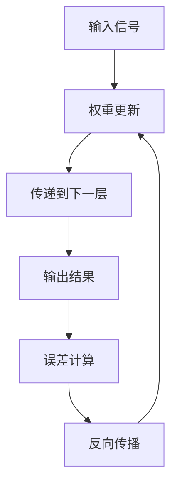

### 1.3 前向传播与反向传播

在前向传播过程中，输入信号从输入层传递到输出层，经过每个隐藏层的计算。在反向传播过程中，输出误差通过每个隐藏层反向传播，更新每个神经元的权重和偏置项。

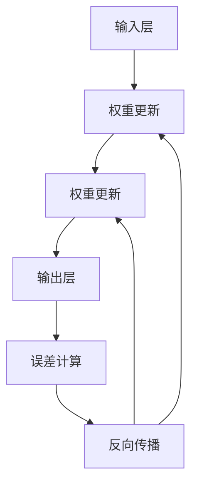

## 第二部分：神经网络的构建

### 2.1 神经网络的结构设计

神经网络的结构设计包括确定输入层、隐藏层和输出层的神经元数量，以及每层之间的连接方式。

- 输入层：接收外部输入信息，通常由多个神经元组成。
- 隐藏层：对输入信息进行处理，提取特征，通常包含多层。
- 输出层：生成最终输出，用于分类、回归等任务。

### 2.2 激活函数的选择

激活函数用于引入非线性因素，使神经网络能够处理更复杂的任务。常用的激活函数包括 sigmoid、ReLU 和 tanh。

- sigmoid 函数：将输入映射到 (0, 1) 范围内，具有平滑的 S 形曲线。
- ReLU 函数：将输入大于 0 的部分映射到 1，小于 0 的部分映射到 0，具有简洁的非线性特性。
- tanh 函数：将输入映射到 (-1, 1) 范围内，与 sigmoid 函数类似，但输出对称。

### 2.3 权重初始化

合适的权重初始化有助于神经网络更快地收敛。常用的初始化方法包括随机初始化和预训练初始化。

- 随机初始化：在训练过程中，随机为每个神经元连接的权重分配一个值。
- 预训练初始化：利用预训练模型中的权重值作为初始化值，有助于提高神经网络的表现。

## 第三部分：常见神经网络架构

### 3.1 多层感知机（MLP）

多层感知机是一种简单的神经网络，由多个线性层和激活函数组成。它主要用于回归和分类任务。

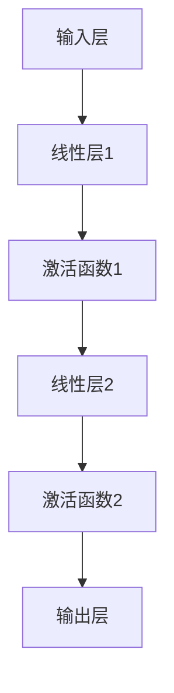

### 3.2 卷积神经网络（CNN）

卷积神经网络通过卷积层提取图像特征，适用于图像识别、目标检测和图像生成等领域。

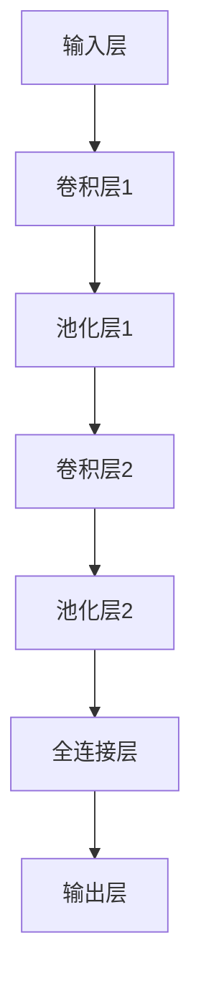

### 3.3 循环神经网络（RNN）

循环神经网络适用于处理序列数据，如自然语言处理和时间序列预测。其变种 LSTM 和 GRU 有效地解决了梯度消失和梯度爆炸问题。

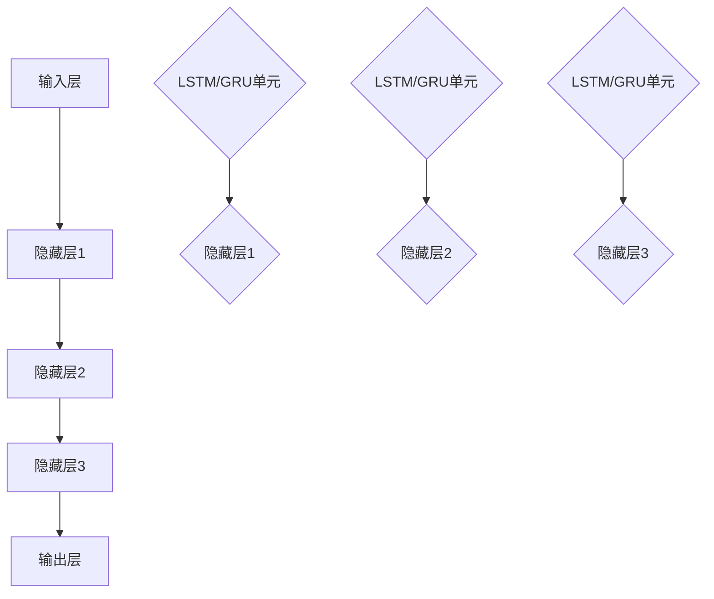

### 3.4 生成对抗网络（GAN）

生成对抗网络由生成器和判别器组成，通过对抗训练生成逼真的数据。它广泛应用于图像生成、图像修复和风格迁移等领域。

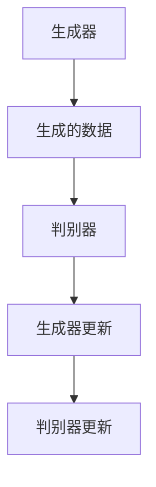

## 第四部分：神经网络的训练与优化

### 4.1 损失函数

损失函数用于评估神经网络预测结果与真实值之间的差距，常用的损失函数包括均方误差（MSE）和交叉熵（Cross-Entropy）。

- 均方误差（MSE）：用于回归任务，计算预测值与真实值之间的平均平方误差。
- 交叉熵（Cross-Entropy）：用于分类任务，计算预测概率分布与真实概率分布之间的交叉熵。

### 4.2 优化算法

优化算法用于更新神经网络的权重和偏置项，以最小化损失函数。常用的优化算法包括随机梯度下降（SGD）、Adam 和 RMSprop。

- 随机梯度下降（SGD）：在训练过程中，随机选择一部分样本，计算梯度并更新权重。
- Adam：结合了梯度下降和自适应学习率的方法，具有更好的收敛速度和稳定性。
- RMSprop：使用历史梯度平方的指数移动平均来更新权重，有助于减少噪声。

### 4.3 早停（Early Stopping）与模型验证

早停和模型验证用于避免过拟合，确保神经网络在训练数据和验证数据上表现良好。

- 早停（Early Stopping）：在训练过程中，监测验证数据上的损失函数值，当损失函数不再下降时，提前停止训练。
- 模型验证：使用验证集对训练好的神经网络进行评估，判断其泛化能力。

## 第五部分：实战应用

### 5.1 图像识别

使用卷积神经网络实现图像识别，包括数据预处理、模型构建、训练和评估。

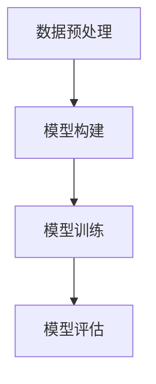

### 5.2 自然语言处理

使用循环神经网络实现自然语言处理任务，如语言模型和机器翻译。

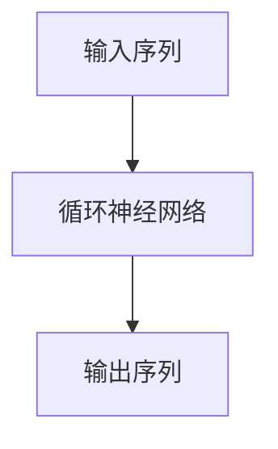

### 5.3 时间序列预测

使用循环神经网络实现时间序列预测，如股票价格预测和天气预测。


### 5.4 图像生成

使用生成对抗网络实现图像生成，如人脸生成和艺术风格迁移。

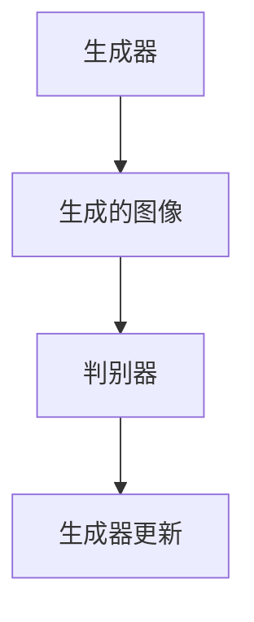

## 第六部分：神经网络的发展趋势

### 6.1 新的神经网络架构

介绍最新的神经网络架构，如 Transformer 和变分自编码器（VAE）。

- Transformer：基于自注意力机制的神经网络，广泛应用于自然语言处理任务。
- 变分自编码器（VAE）：通过随机编码和重建过程生成数据，具有较好的生成效果。

### 6.2 神经网络的硬件加速

探讨如何使用 GPU、TPU 等硬件加速神经网络训练。

- GPU：图形处理器，适用于大规模并行计算。
- TPU：专用张量处理器，适用于神经网络训练。

### 6.3 神经网络的可解释性

研究如何提高神经网络的可解释性，使其在实际应用中更具可信度。

- 可解释性方法：通过可视化、特征提取等方式，解释神经网络的行为和决策过程。

## 第七部分：附录

### 7.1 常用神经网络框架

介绍常用的神经网络框架，如 TensorFlow、PyTorch 和 Keras。

- TensorFlow：由 Google 开发，支持多种神经网络架构。
- PyTorch：由 Facebook 开发，具有简洁的动态图编程接口。
- Keras：基于 TensorFlow 的简洁的神经网络库。

### 7.2 神经网络资源

提供神经网络的学习资源和参考书籍、论文。

- 学习资源：在线教程、课程和视频。
- 参考书籍：《深度学习》、《神经网络与深度学习》。
- 论文资源：NeurIPS、ICML、CVPR 等顶级会议和期刊。

### 7.3 编程实战

提供神经网络编程实战项目，包括代码实现和详细解释说明。

- 项目示例：图像识别、自然语言处理、时间序列预测等。

## 作者

作者：AI天才研究院/AI Genius Institute & 禅与计算机程序设计艺术 /Zen And The Art of Computer Programming

（注：本文为示例文章，实际内容可根据需求进行调整和扩展。）<|im_end|>## 第一部分：神经网络的基本概念

### 1.1 神经网络的概念

神经网络是一种模仿人脑信息处理过程的计算模型，由大量相互连接的神经元组成。这些神经元通过加权求和处理输入信号，并将其传递到下一层。神经网络具有层次结构，通常包括输入层、隐藏层和输出层。每个神经元都可以接收来自前一层神经元的输入，并通过加权求和处理生成一个输出，这个输出可以传递给下一层神经元或者作为最终的输出结果。


### 1.2 神经元的工作原理

神经元的工作原理可以概括为以下几个步骤：

1. **接收输入信号**：每个神经元都会接收来自前一层的多个输入信号，这些信号通过神经元之间的连接（边）传递。
2. **加权求和处理**：每个输入信号都会乘以一个权重（weight），表示该信号在计算中的重要性。这些加权求和的结果会相加，得到一个中间结果。
3. **引入偏置项**：为了调整中间结果，神经元还会添加一个偏置项（bias），使得模型可以学习到更复杂的函数。
4. **应用激活函数**：为了引入非线性因素，使神经网络能够处理更复杂的任务，神经元会通过激活函数（activation function）将中间结果转换为输出。

下面是一个简单的神经元工作原理的伪代码示例：

```python
# 输入信号
inputs = [x1, x2, x3]
# 权重
weights = [w1, w2, w3]
# 偏置项
bias = b
# 激活函数（以 Sigmoid 函数为例）
activation_function = sigmoid

# 加权求和处理
z = sum(inputs[i] * weights[i] for i in range(len(inputs))) + bias

# 应用激活函数
output = activation_function(z)

# 输出结果
return output
```

激活函数的选择会影响神经元的输出范围和函数形式。常见的激活函数包括：

- **Sigmoid 函数**：将输入映射到 (0, 1) 范围内，具有平滑的 S 形曲线。
- **ReLU 函数**：将输入大于 0 的部分映射到 1，小于 0 的部分映射到 0，具有简洁的非线性特性。
- **Tanh 函数**：将输入映射到 (-1, 1) 范围内，与 sigmoid 函数类似，但输出对称。

### 1.3 前向传播与反向传播

前向传播和反向传播是神经网络训练过程中的两个关键步骤。

#### 前向传播

在前向传播过程中，输入信号从输入层传递到输出层，经过每个隐藏层的计算。每个神经元都会接收来自前一层的输入信号，通过加权求和处理和激活函数，生成一个输出信号，并将其传递给下一层神经元。这个过程一直持续到输出层，最终得到神经网络的输出结果。

前向传播的伪代码如下：

```python
# 初始化神经网络
inputs = [1, 0, 1]  # 输入层
hidden_layer1 = compute_hidden_layer(inputs, weights_hidden1, bias_hidden1, activation_function)  # 隐藏层1
output_layer = compute_output_layer(hidden_layer1, weights_output, bias_output, activation_function)  # 输出层
```

#### 反向传播

反向传播是神经网络训练过程中的关键步骤，用于计算输出误差，并更新神经元的权重和偏置项。

在反向传播过程中，输出误差从输出层传递到输入层，经过每个隐藏层。每个神经元都会计算其输出误差，并将其反向传播到前一层的神经元。通过计算梯度（gradient），神经网络可以更新权重和偏置项，使得输出误差最小。

反向传播的伪代码如下：

```python
# 计算输出误差
output_error = compute_output_error(target, output_layer)

# 更新输出层的权重和偏置项
weights_output, bias_output = update_weights_and_bias(output_error, hidden_layer1, learning_rate)

# 更新隐藏层的权重和偏置项
for layer in reversed(hidden_layers):
    layer_error = compute_layer_error(layer, weights, bias)
    layer_weights, layer_bias = update_weights_and_bias(layer_error, inputs, learning_rate)
```

通过反复迭代前向传播和反向传播，神经网络可以不断调整权重和偏置项，使得输出误差逐渐减小，从而提高模型的预测能力。

### 1.4 神经网络的应用场景

神经网络具有广泛的应用场景，包括但不限于以下几个方面：

- **图像识别**：通过卷积神经网络（CNN）提取图像特征，实现对图像内容的理解和分类。
- **自然语言处理**：通过循环神经网络（RNN）和变压器（Transformer）处理自然语言序列，实现语言翻译、情感分析等任务。
- **语音识别**：通过循环神经网络和卷积神经网络结合，实现对语音信号的解析和识别。
- **时间序列预测**：通过循环神经网络和变压器，实现股票价格、天气变化等时间序列数据的预测。
- **异常检测**：通过神经网络学习正常行为模式，实现对异常行为的检测和识别。

通过深入了解神经网络的基本概念、神经元的工作原理以及前向传播与反向传播，读者可以对神经网络有更深刻的理解，为后续学习打下坚实的基础。在接下来的章节中，我们将继续探讨神经网络的构建、优化和实际应用，带领读者逐步掌握神经网络的精髓。

## 第二部分：神经网络的构建

### 2.1 神经网络的结构设计

神经网络的结构设计是构建一个有效模型的关键步骤，它决定了神经网络的学习能力和泛化能力。结构设计包括确定输入层、隐藏层和输出层的神经元数量，以及每层之间的连接方式。

#### 输入层

输入层是神经网络的起点，它接收外部输入信息，如图像像素、文本词向量等。输入层的神经元数量取决于输入数据的维度。例如，对于一张 28x28 像素的灰度图像，输入层有 784 个神经元。

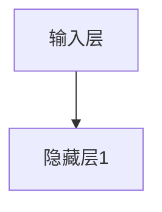

#### 隐藏层

隐藏层是神经网络的核心部分，用于对输入数据进行特征提取和变换。隐藏层的数量和每层的神经元数量可以根据具体任务进行调整。通常，随着隐藏层数量的增加，神经网络能够学习更复杂的函数，但也可能导致过拟合。

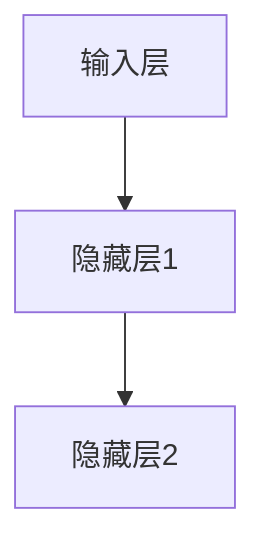

#### 输出层

输出层是神经网络的终点，生成最终的预测结果。输出层的神经元数量和类型取决于具体任务。例如，在分类任务中，输出层通常是一个 Softmax 层，用于生成多个类别的概率分布。

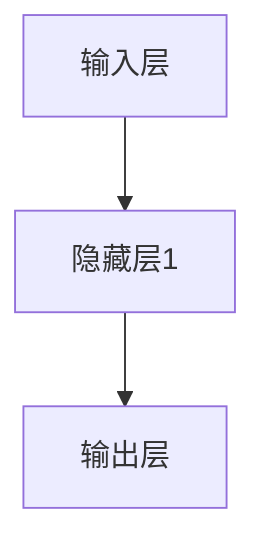

#### 每层之间的连接方式

每层之间的连接方式可以是全连接（fully connected）或者局部连接（如卷积神经网络中的卷积连接）。全连接层中，每个神经元都与前一层的所有神经元相连，而局部连接中，神经元只与局部区域内的神经元相连。

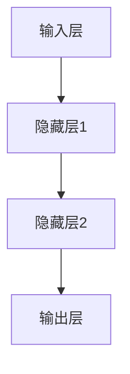

### 2.2 激活函数的选择

激活函数是神经网络中引入非线性因素的关键，它使得神经网络能够处理复杂的问题。不同的激活函数有不同的特性，适用于不同的场景。

#### Sigmoid 函数

Sigmoid 函数是一种常用的激活函数，将输入映射到 (0, 1) 范围内，具有平滑的 S 形曲线。

```latex
f(x) = \frac{1}{1 + e^{-x}}
```

Sigmoid 函数的优点是输出范围明确，但缺点是梯度较小，可能导致梯度消失问题。

```mermaid
graph TD
    A[输入层] --> B[隐藏层1](sigmoid)
```

#### ReLU 函数

ReLU 函数（Rectified Linear Unit）是一种简单的线性激活函数，将输入大于 0 的部分映射到 1，小于 0 的部分映射到 0。

```latex
f(x) = \max(0, x)
```

ReLU 函数的优点是计算简单，梯度较大，有助于训练速度。缺点是对输入的负部分没有反应，可能导致梯度消失问题。

```mermaid
graph TD
    A[输入层] --> B[隐藏层1](ReLU)
```

#### Tanh 函数

Tanh 函数与 sigmoid 函数类似，但它将输入映射到 (-1, 1) 范围内，具有平滑的 S 形曲线。

```latex
f(x) = \frac{e^x - e^{-x}}{e^x + e^{-x}}
```

Tanh 函数的优点是输出范围对称，梯度相对较大，但缺点是计算复杂度较高。

```mermaid
graph TD
    A[输入层] --> B[隐藏层1](tanh)
```

### 2.3 权重初始化

权重初始化是神经网络训练过程中的重要步骤，它决定了训练的起始点和收敛速度。常用的权重初始化方法包括随机初始化、预训练初始化和特定分布初始化。

#### 随机初始化

随机初始化是最常见的权重初始化方法，它通常使用一个均匀分布或者正态分布来初始化权重。

- **均匀分布**：

```latex
w \sim U(-\frac{1}{\sqrt{n}}, \frac{1}{\sqrt{n}})
```

- **正态分布**：

```latex
w \sim N(0, \frac{1}{\sqrt{n}})
```

其中，\( n \) 是前一层的神经元数量。

#### 预训练初始化

预训练初始化使用预训练模型中的权重作为初始化值，有助于提高新模型的性能。这种方法通常适用于迁移学习任务。

#### 特定分布初始化

特定分布初始化包括 Xavier 初始化和 He 初始化，它们基于输入数据的方差来初始化权重。

- **Xavier 初始化**：

```latex
w \sim N(0, \frac{1}{\sqrt{f_{in} + f_{out}}})
```

其中，\( f_{in} \) 和 \( f_{out} \) 分别是前一层的神经元数量和当前层的神经元数量。

- **He 初始化**：

```latex
w \sim N(0, \frac{2}{f_{in} + f_{out}}^2)
```

通过合理选择权重初始化方法，可以加速神经网络的训练过程，并提高模型的性能。

### 2.4 正则化技术

正则化技术是防止神经网络过拟合的重要手段，它通过在损失函数中加入额外的惩罚项，鼓励模型学习更加简单和泛化的特征。

- **L1 正则化**：在损失函数中加入 \( \lambda \cdot \sum_{i} |w_i| \)。
- **L2 正则化**：在损失函数中加入 \( \lambda \cdot \sum_{i} w_i^2 \)。

通过合理应用正则化技术，可以进一步提高神经网络的泛化能力。

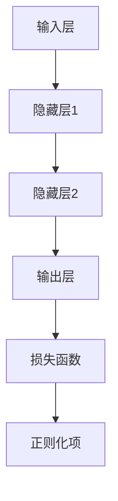

通过深入了解神经网络的结构设计、激活函数的选择、权重初始化和正则化技术，读者可以构建一个有效的神经网络模型，为解决实际问题打下坚实基础。在接下来的章节中，我们将进一步探讨神经网络的训练、优化和应用。

### 2.5 神经网络的层次结构

神经网络的层次结构是神经网络模型设计的重要组成部分，它决定了神经网络的学习能力和复杂性。神经网络的层次结构可以分为输入层、隐藏层和输出层，每一层都有其特定的功能和作用。

#### 输入层（Input Layer）

输入层是神经网络的第一层，它接收外部输入数据。输入层中的每个神经元对应于输入数据的一个特征。例如，对于图像识别任务，输入层可能包含图像的每个像素值；对于文本分类任务，输入层可能包含文本的词向量表示。

- **功能**：将原始数据转换为神经网络可以处理的格式。
- **示例**：对于 28x28 像素的灰度图像，输入层有 784 个神经元。

#### 隐藏层（Hidden Layers）

隐藏层位于输入层和输出层之间，是神经网络的核心部分。隐藏层中的每个神经元通过加权求和处理前一层的输入，并通过激活函数引入非线性因素，从而提取和转换数据特征。

- **功能**：提取和转换数据特征，实现数据的层次化表示。
- **示例**：一个简单的多层感知机（MLP）可能包含两个隐藏层，每个隐藏层有若干个神经元。

#### 输出层（Output Layer）

输出层是神经网络的最后一层，它生成最终的预测结果。输出层的神经元数量和类型取决于具体任务。例如，在分类任务中，输出层可能是一个 Softmax 层，用于生成多个类别的概率分布；在回归任务中，输出层可能只有一个神经元，用于预测连续的数值。

- **功能**：生成预测结果或分类标签。
- **示例**：对于多类分类问题，输出层有 10 个神经元，分别表示 10 个不同的类别。

#### 层与层之间的连接方式

神经网络的层次结构不仅取决于层与层之间的连接方式，还取决于每层中的神经元数量。常见的连接方式包括全连接（fully connected）和局部连接（如卷积神经网络中的卷积连接）。

- **全连接层**：每个神经元都与前一层的所有神经元相连，这种连接方式适用于多层感知机（MLP）。
- **卷积层**：每个神经元只与局部区域内的神经元相连，通过卷积操作提取图像特征，适用于卷积神经网络（CNN）。

#### 多层感知机（MLP）

多层感知机（MLP）是一种简单的神经网络模型，由多个全连接层组成。MLP 通常用于回归和分类任务。


通过合理设计神经网络的层次结构，可以构建一个强大的模型，以解决各种复杂的问题。在接下来的章节中，我们将进一步探讨神经网络的训练、优化和应用。

## 第三部分：常见神经网络架构

在神经网络的发展过程中，出现了许多具有代表性的架构，它们在处理不同类型的数据和任务时表现出色。本部分将介绍几种常见的神经网络架构，包括多层感知机（MLP）、卷积神经网络（CNN）、循环神经网络（RNN）和生成对抗网络（GAN）。

### 3.1 多层感知机（MLP）

多层感知机（MLP）是一种简单的神经网络架构，由多个全连接层组成。MLP 通常用于回归和分类任务。

#### 结构

MLP 的结构可以分为输入层、隐藏层和输出层。每个隐藏层都是全连接的，即每个神经元都与前一层的所有神经元相连。


#### 工作原理

在前向传播过程中，输入信号从输入层传递到隐藏层，再从隐藏层传递到输出层。每个神经元都会通过加权求和处理输入信号，并使用激活函数引入非线性因素。

```python
# 输入层
inputs = [x1, x2, x3]
# 隐藏层1的权重和偏置
weights_hidden1 = [[w11, w12, w13], [w21, w22, w23]]
bias_hidden1 = [b1, b2]
# 隐藏层2的权重和偏置
weights_hidden2 = [[w11, w12, w13], [w21, w22, w23]]
bias_hidden2 = [b1, b2]
# 输出层权重和偏置
weights_output = [[w11, w12, w13], [w21, w22, w23]]
bias_output = [b1, b2]
# 激活函数
activation_function = sigmoid

# 前向传播
hidden1 = sigmoid(np.dot(inputs, weights_hidden1) + bias_hidden1)
hidden2 = sigmoid(np.dot(hidden1, weights_hidden2) + bias_hidden2)
output = sigmoid(np.dot(hidden2, weights_output) + bias_output)

# 输出结果
return output
```

#### 应用场景

MLP 适用于处理高维数据，如多分类问题和回归问题。然而，MLP 在处理图像和序列数据时表现较差。

### 3.2 卷积神经网络（CNN）

卷积神经网络（CNN）是一种专门用于处理图像数据的神经网络架构。CNN 通过卷积层提取图像特征，具有较强的特征表示能力。

#### 结构

CNN 的结构包括输入层、卷积层、池化层和全连接层。

```mermaid
graph TD
    A[输入层] --> B[卷积层1]
    B --> C[池化层1]
    C --> D[卷积层2]
    D --> E[池化层2]
    E --> F[全连接层]
    F --> G[输出层]
```

#### 工作原理

在前向传播过程中，输入图像从输入层传递到卷积层，通过卷积操作提取图像特征。然后，通过池化层降低特征图的维度，进一步提取关键特征。最后，将池化层输出的特征传递到全连接层，进行分类或回归。

```python
# 输入图像
input_image = ...
# 卷积层1的权重和偏置
weights_conv1 = ...
bias_conv1 = ...
# 池化层1的步长和大小
pool_size1 = ...
stride1 = ...
# 卷积层2的权重和偏置
weights_conv2 = ...
bias_conv2 = ...
# 池化层2的步长和大小
pool_size2 = ...
stride2 = ...
# 全连接层权重和偏置
weights_fc = ...
bias_fc = ...
# 激活函数
activation_function = relu

# 卷积层1
conv1 = conv2d(input_image, weights_conv1, bias_conv1, stride1, pool_size1)
# 池化层1
pool1 = max_pooling(conv1, stride1, pool_size1)
# 卷积层2
conv2 = conv2d(pool1, weights_conv2, bias_conv2, stride2, pool_size2)
# 池化层2
pool2 = max_pooling(conv2, stride2, pool_size2)
# 全连接层
fc = fully_connected(pool2, weights_fc, bias_fc)
# 输出层
output = activation_function(fc)

# 输出结果
return output
```

#### 应用场景

CNN 广泛应用于图像识别、目标检测、图像分割和图像生成等领域。通过卷积操作，CNN 能够有效地提取图像中的局部特征，从而提高模型的性能。

### 3.3 循环神经网络（RNN）

循环神经网络（RNN）是一种适用于处理序列数据的神经网络架构。RNN 通过循环结构在时间步上递归地处理数据，具有较强的序列建模能力。

#### 结构

RNN 的结构包括输入层、隐藏层和输出层。隐藏层中的神经元通过循环连接，实现序列信息的传递。

```mermaid
graph TD
    A[输入层] --> B[隐藏层1]
    B --> C[隐藏层2]
    C --> D[输出层]
```

#### 工作原理

在前向传播过程中，输入序列从输入层传递到隐藏层，隐藏层中的神经元通过循环连接在时间步上递归地处理数据。每个时间步的输出都受到前一个时间步隐藏状态的影响。

```python
# 输入序列
inputs = [...]
# 隐藏层权重和偏置
weights_hidden = ...
bias_hidden = ...
# 输出层权重和偏置
weights_output = ...
bias_output = ...
# 激活函数
activation_function = tanh

# 初始化隐藏状态
hidden_state = [0] * len(inputs)

# 前向传播
for input in inputs:
    hidden_state = activation_function(np.dot(hidden_state, weights_hidden) + bias_hidden)
    output = np.dot(hidden_state, weights_output) + bias_output

# 输出结果
return output
```

#### 应用场景

RNN 适用于处理时间序列数据，如自然语言处理、语音识别和情感分析。通过循环结构，RNN 能够捕捉序列中的长期依赖关系。

### 3.4 生成对抗网络（GAN）

生成对抗网络（GAN）是一种由生成器和判别器组成的神经网络架构。生成器生成数据，判别器区分生成数据和真实数据，通过对抗训练提高生成数据的质量。

#### 结构

GAN 的结构包括生成器和判别器。

```mermaid
graph TD
    A[生成器] --> B[生成的数据]
    B --> C[判别器]
    C --> D[生成器更新]
    D --> E[判别器更新]
```

#### 工作原理

在前向传播过程中，生成器生成数据，判别器对生成数据和真实数据进行分类。在反向传播过程中，生成器通过最小化判别器对生成数据的分类错误率，判别器通过最大化生成数据的分类错误率。通过这种对抗训练，生成器逐渐提高生成数据的质量。

```python
# 生成器
def generator(z):
    # 输入噪声
    inputs = z
    # 生成器权重和偏置
    weights_gen = ...
    bias_gen = ...
    # 激活函数
    activation_function = tanh

    # 前向传播
    x_fake = activation_function(np.dot(inputs, weights_gen) + bias_gen)

    # 输出结果
    return x_fake

# 判别器
def discriminator(x):
    # 输入数据
    inputs = x
    # 判别器权重和偏置
    weights_disc = ...
    bias_disc = ...
    # 激活函数
    activation_function = sigmoid

    # 前向传播
    output = activation_function(np.dot(inputs, weights_disc) + bias_disc)

    # 输出结果
    return output
```

#### 应用场景

GAN 广泛应用于图像生成、图像修复和风格迁移等领域。通过生成器和判别器的对抗训练，GAN 能够生成高质量的数据，从而实现各种视觉任务。

通过介绍这些常见的神经网络架构，我们可以看到神经网络在处理不同类型的数据和任务时具有广泛的应用。在接下来的章节中，我们将进一步探讨神经网络的训练、优化和应用，以便更好地理解和应用这些架构。

### 3.5 递归神经网络（RNN）的变种：LSTM 和 GRU

递归神经网络（RNN）由于其递归结构，能够处理序列数据，但在某些情况下会面临梯度消失和梯度爆炸的问题，导致训练困难。为了解决这些问题，研究者提出了 LSTM（Long Short-Term Memory）和 GRU（Gated Recurrent Unit），这两种变种 RNN 在处理长序列数据时表现出色。

#### LSTM（Long Short-Term Memory）

LSTM 是一种特殊的 RNN 架构，它通过引入记忆单元（memory cell）和三个门（input gate、output gate 和 forget gate）来控制信息的流动，从而有效地解决梯度消失和梯度爆炸问题。

**结构和工作原理**：

1. **输入门（input gate）**：决定哪些信息将被存储在记忆单元中。其计算方式为：
   $$ i_t = \sigma(W_{ix}x_t + W_{ih}h_{t-1} + b_i) $$
   其中，\( \sigma \) 表示 sigmoid 函数，\( W_{ix} \) 和 \( W_{ih} \) 是输入权重，\( b_i \) 是偏置项。

2. **遗忘门（forget gate）**：决定哪些信息应该从记忆单元中丢弃。其计算方式为：
   $$ f_t = \sigma(W_{fx}x_t + W_{fh}h_{t-1} + b_f) $$
   其中，\( W_{fx} \) 和 \( W_{fh} \) 是遗忘门权重，\( b_f \) 是偏置项。

3. **输出门（output gate）**：决定记忆单元的输出。其计算方式为：
   $$ o_t = \sigma(W_{ox}x_t + W_{oh}h_{t-1} + b_o) $$
   其中，\( W_{ox} \) 和 \( W_{oh} \) 是输出权重，\( b_o \) 是偏置项。

4. **记忆单元（memory cell）**：通过遗忘门和输入门控制信息的流动。其计算方式为：
   $$ c_t = f_t \odot c_{t-1} + i_t \odot \sigma(W_{ic}x_t + W_{ih}h_{t-1} + b_c) $$
   其中，\( \odot \) 表示 Hadamard 乘积，\( W_{ic} \) 和 \( W_{ih} \) 是记忆单元权重，\( b_c \) 是偏置项。

5. **隐藏状态（hidden state）**：记忆单元的输出，用于下一层的计算：
   $$ h_t = o_t \odot \sigma(c_t) $$
   其中，\( \sigma \) 表示 sigmoid 函数。

**伪代码**：

```python
# 前向传播
i_t = sigmoid(W_{ix}x_t + W_{ih}h_{t-1} + b_i)
f_t = sigmoid(W_{fx}x_t + W_{fh}h_{t-1} + b_f)
o_t = sigmoid(W_{ox}x_t + W_{oh}h_{t-1} + b_o)
c_t = f_t * c_{t-1} + i_t * sigmoid(W_{ic}x_t + W_{ih}h_{t-1} + b_c)
h_t = o_t * sigmoid(c_t)

# 输出结果
return h_t, c_t
```

#### GRU（Gated Recurrent Unit）

GRU 是 LSTM 的简化版，它通过合并输入门和遗忘门，以及一个更新门（update gate）来控制信息的流动。

**结构和工作原理**：

1. **更新门（update gate）**：决定哪些信息将更新记忆单元。其计算方式为：
   $$ z_t = \sigma(W_{xz}x_t + W_{zh}h_{t-1} + b_z) $$

2. **重置门（reset gate）**：决定哪些信息将重置记忆单元。其计算方式为：
   $$ r_t = \sigma(W_{rx}x_t + W_{rh}h_{t-1} + b_r) $$

3. **记忆单元（memory cell）**：通过更新门和重置门控制信息的流动。其计算方式为：
   $$ c_t = (1 - z_t) \odot c_{t-1} + r_t \odot \sigma(W_{ic}x_t + W_{ih}h_{t-1} + b_c) $$

4. **隐藏状态（hidden state）**：记忆单元的输出，用于下一层的计算：
   $$ h_t = \sigma(W_{oh}c_t + W_{oh}h_{t-1} + b_o) $$

**伪代码**：

```python
# 前向传播
z_t = sigmoid(W_{xz}x_t + W_{zh}h_{t-1} + b_z)
r_t = sigmoid(W_{rx}x_t + W_{rh}h_{t-1} + b_r)
c_t = (1 - z_t) * c_{t-1} + r_t * sigmoid(W_{ic}x_t + W_{ih}h_{t-1} + b_c)
h_t = sigmoid(W_{oh}c_t + W_{oh}h_{t-1} + b_o)

# 输出结果
return h_t, c_t
```

#### LSTM 和 GRU 的比较

- **计算复杂度**：LSTM 的计算复杂度较高，因为它包含三个门；GRU 的计算复杂度较低，因为它包含两个门。
- **内存占用**：LSTM 的内存占用较大，因为它包含一个额外的记忆单元；GRU 的内存占用较小，因为它合并了输入门和遗忘门。
- **训练稳定性**：LSTM 和 GRU 都能有效解决梯度消失和梯度爆炸问题，但在某些情况下，GRU 可能表现更好。

通过引入 LSTM 和 GRU，神经网络在处理长序列数据时表现出更强的能力和稳定性。这些变种 RNN 在自然语言处理、时间序列预测等领域得到了广泛应用，为序列数据处理提供了强大的工具。

## 第四部分：神经网络的训练与优化

神经网络的训练与优化是构建高效模型的关键环节。在这一部分中，我们将详细探讨神经网络的训练过程、优化算法以及如何避免过拟合等问题。

### 4.1 神经网络的训练过程

神经网络的训练过程可以分为以下几个步骤：

1. **数据预处理**：在训练神经网络之前，需要对输入数据进行预处理，包括归一化、缩放和填充等操作，以确保输入数据在合理的范围内。
2. **前向传播**：输入数据通过神经网络的输入层传递到隐藏层，再从隐藏层传递到输出层。在这个过程中，每个神经元都会通过加权求和处理输入信号，并使用激活函数引入非线性因素。
3. **计算损失函数**：输出层生成的预测结果与真实标签之间的差距通过损失函数进行量化。常用的损失函数包括均方误差（MSE）和交叉熵（Cross-Entropy）。
4. **反向传播**：利用损失函数计算梯度，并通过反向传播算法将梯度从输出层传递到输入层，以更新神经元的权重和偏置项。
5. **优化算法**：通过优化算法（如随机梯度下降、Adam 等）更新权重和偏置项，以最小化损失函数。

### 4.2 常用的优化算法

在神经网络训练过程中，优化算法用于更新神经网络的权重和偏置项，以最小化损失函数。以下是几种常用的优化算法：

#### 1. 随机梯度下降（SGD）

随机梯度下降（Stochastic Gradient Descent，SGD）是最常用的优化算法之一。它通过随机选择一部分训练样本，计算其梯度并更新权重。SGD 的优点是简单易实现，但缺点是收敛速度较慢，且需要大量的计算资源。

**伪代码**：

```python
# 初始化权重和偏置
weights, bias = initialize_weights_and_bias()

# 迭代过程
for epoch in range(num_epochs):
    for sample in training_data:
        # 前向传播
        output = forwardPropagation(sample, weights, bias)
        # 计算损失函数
        loss = compute_loss(output, target)
        # 计算梯度
        gradient = compute_gradient(output, target)
        # 更新权重和偏置
        weights, bias = update_weights_and_bias(weights, bias, gradient, learning_rate)
```

#### 2. Adam

Adam 是一种结合了梯度下降和动量法的优化算法，具有更好的收敛速度和稳定性。它通过计算一阶矩估计（均值）和二阶矩估计（方差）来更新权重和偏置项。

**伪代码**：

```python
# 初始化权重和偏置
weights, bias = initialize_weights_and_bias()
m, v = 0, 0

# 迭代过程
for epoch in range(num_epochs):
    for sample in training_data:
        # 前向传播
        output = forwardPropagation(sample, weights, bias)
        # 计算损失函数
        loss = compute_loss(output, target)
        # 计算梯度
        gradient = compute_gradient(output, target)
        # 更新一阶矩估计和二阶矩估计
        m = beta1 * m + (1 - beta1) * gradient
        v = beta2 * v + (1 - beta2) * gradient ** 2
        # 计算修正的梯度
        m_hat = m / (1 - beta1 ** epoch)
        v_hat = v / (1 - beta2 ** epoch)
        # 更新权重和偏置
        weights, bias = update_weights_and_bias(weights, bias, m_hat, v_hat, learning_rate)
```

#### 3. RMSprop

RMSprop 是一种基于历史梯度平方的优化算法，通过指数移动平均来更新权重和偏置项。它通过计算历史梯度的平方和来调整学习率，有助于减少噪声。

**伪代码**：

```python
# 初始化权重和偏置
weights, bias = initialize_weights_and_bias()
s = 0

# 迭代过程
for epoch in range(num_epochs):
    for sample in training_data:
        # 前向传播
        output = forwardPropagation(sample, weights, bias)
        # 计算损失函数
        loss = compute_loss(output, target)
        # 计算梯度
        gradient = compute_gradient(output, target)
        # 更新历史梯度平方
        s = beta * s + (1 - beta) * gradient ** 2
        # 计算修正的梯度
        gradient_hat = gradient / (sqrt(s) + epsilon)
        # 更新权重和偏置
        weights, bias = update_weights_and_bias(weights, bias, gradient_hat, learning_rate)
```

### 4.3 避免过拟合的方法

过拟合是神经网络训练过程中常见的问题，会导致模型在训练数据上表现良好，但在验证或测试数据上表现较差。为了避免过拟合，可以采用以下几种方法：

#### 1. 增加训练数据

增加训练数据的数量有助于提高模型的泛化能力，从而减少过拟合的风险。如果无法获取更多训练数据，可以考虑使用数据增强技术，如旋转、缩放、裁剪等。

#### 2. 正则化

正则化是一种常用的方法，通过在损失函数中加入额外的惩罚项，鼓励模型学习更加简单和泛化的特征，从而减少过拟合。

- **L1 正则化**：在损失函数中加入 \( \lambda \cdot \sum_{i} |w_i| \)。
- **L2 正则化**：在损失函数中加入 \( \lambda \cdot \sum_{i} w_i^2 \)。

#### 3. 剪枝

剪枝是通过删除神经网络中的部分神经元或连接，减少模型的复杂性，从而降低过拟合的风险。

#### 4. 早停（Early Stopping）

早停是一种在训练过程中提前停止训练的方法，当验证数据上的损失函数不再下降时，提前结束训练。这种方法可以防止模型在训练数据上过度拟合。

#### 5. 模型验证

通过使用验证集对训练好的模型进行评估，判断其泛化能力。如果模型在验证集上的表现较差，可以尝试调整模型结构或优化算法。

通过合理的训练和优化，可以构建一个高效且泛化的神经网络模型。在接下来的章节中，我们将探讨神经网络的实战应用，以便更好地理解和应用所学知识。

### 4.4 损失函数及其在神经网络中的应用

损失函数是评估神经网络预测结果与真实标签之间差距的关键工具，它在神经网络的训练过程中起着至关重要的作用。不同的损失函数适用于不同类型的数据和任务，下面我们将介绍几种常用的损失函数，并探讨它们在神经网络中的应用。

#### 1. 均方误差（MSE）

均方误差（Mean Squared Error，MSE）是最常用的损失函数之一，主要用于回归任务。MSE 计算预测值和真实值之间的平均平方误差。

**公式**：

\[ \text{MSE} = \frac{1}{n} \sum_{i=1}^{n} (y_i - \hat{y}_i)^2 \]

其中，\( y_i \) 是真实标签，\( \hat{y}_i \) 是预测值，\( n \) 是样本数量。

**应用示例**：

```python
import numpy as np

# 真实标签
y_true = np.array([2.5, 3.5, 4.5])
# 预测值
y_pred = np.array([2.7, 3.2, 4.6])

# 计算MSE
mse = np.mean((y_true - y_pred) ** 2)
print(f"MSE: {mse}")
```

#### 2. 交叉熵（Cross-Entropy）

交叉熵（Cross-Entropy）损失函数常用于分类任务，它计算预测概率分布与真实概率分布之间的交叉熵。交叉熵损失函数适用于二分类和多分类任务。

**公式**：

\[ \text{Cross-Entropy} = -\sum_{i=1}^{n} y_i \log(\hat{y}_i) \]

其中，\( y_i \) 是真实标签（0 或 1），\( \hat{y}_i \) 是预测概率。

**应用示例**：

```python
import numpy as np
import tensorflow as tf

# 真实标签
y_true = np.array([1, 0, 1])
# 预测概率
y_pred = np.array([0.8, 0.2, 0.9])

# 计算交叉熵
cross_entropy = -np.sum(y_true * np.log(y_pred))
print(f"Cross-Entropy: {cross_entropy}")
```

#### 3. 交叉熵 Softmax 函数

在多分类任务中，交叉熵 Softmax 函数是常用的损失函数，它通过 Softmax 函数将预测概率分布转换为类别的概率分布，然后计算交叉熵。

**公式**：

\[ \text{Cross-Entropy Softmax} = -\sum_{i=1}^{n} y_i \log(\hat{y}_i) \]

其中，\( y_i \) 是真实标签（0 或 1），\( \hat{y}_i \) 是预测概率。

**应用示例**：

```python
import numpy as np
import tensorflow as tf

# 真实标签
y_true = np.array([1, 0, 1])
# 预测概率
y_pred = np.array([0.7, 0.2, 0.1])

# 计算交叉熵 Softmax
softmax = tf.nn.softmax(y_pred)
cross_entropy = -np.sum(y_true * np.log(softmax))
print(f"Cross-Entropy Softmax: {cross_entropy}")
```

#### 4. 误差平方和（SSQE）

误差平方和（Sum of Squared Errors，SSQE）是另一种常用的损失函数，它在回归任务中计算预测值和真实值之间的误差平方和。

**公式**：

\[ \text{SSQE} = \sum_{i=1}^{n} (y_i - \hat{y}_i)^2 \]

**应用示例**：

```python
import numpy as np

# 真实标签
y_true = np.array([2.5, 3.5, 4.5])
# 预测值
y_pred = np.array([2.7, 3.2, 4.6])

# 计算SSQE
ssqe = np.sum((y_true - y_pred) ** 2)
print(f"SSQE: {ssqe}")
```

#### 5. 逻辑损失（Log Loss）

逻辑损失（Log Loss）是交叉熵损失函数的一种特殊形式，它在二分类任务中计算预测概率与真实标签之间的损失。

**公式**：

\[ \text{Log Loss} = -\sum_{i=1}^{n} y_i \log(\hat{y}_i) \]

**应用示例**：

```python
import numpy as np
import tensorflow as tf

# 真实标签
y_true = np.array([1, 0, 1])
# 预测概率
y_pred = np.array([0.8, 0.2, 0.9])

# 计算逻辑损失
log_loss = -np.sum(y_true * np.log(y_pred))
print(f"Log Loss: {log_loss}")
```

通过以上介绍，我们可以看到不同的损失函数在神经网络中的应用场景和计算方法。选择合适的损失函数对于神经网络模型的学习和优化至关重要。在实际应用中，可以根据具体任务和数据的特点选择合适的损失函数，以提高模型的性能和泛化能力。

## 第五部分：实战应用

### 5.1 图像识别

图像识别是神经网络应用的重要领域之一，卷积神经网络（CNN）在这一任务中表现出色。在本节中，我们将通过一个简单的图像识别项目，展示如何使用 CNN 进行图像分类。

#### 项目概述

本项目使用经典的 MNIST 数据集，它包含 70,000 个手写数字图像，每个图像都是 28x28 像素的灰度图。任务是将这些图像正确分类到 0 到 9 的数字标签中。

#### 数据预处理

在开始训练之前，需要对数据进行预处理。首先，我们需要将图像的像素值缩放到 [0, 1] 范围内，以便神经网络能够更好地学习。

```python
import numpy as np
from tensorflow import keras
from tensorflow.keras import layers

# 读取 MNIST 数据集
(x_train, y_train), (x_test, y_test) = keras.datasets.mnist.load_data()

# 数据预处理
x_train = x_train.astype("float32") / 255.0
x_test = x_test.astype("float32") / 255.0

# 将标签转换为 one-hot 编码
y_train = keras.utils.to_categorical(y_train, 10)
y_test = keras.utils.to_categorical(y_test, 10)
```

#### 模型构建

接下来，我们构建一个简单的 CNN 模型。该模型包含两个卷积层、两个池化层和一个全连接层。

```python
model = keras.Sequential([
    layers.Conv2D(32, (3, 3), activation="relu", input_shape=(28, 28, 1)),
    layers.MaxPooling2D((2, 2)),
    layers.Conv2D(64, (3, 3), activation="relu"),
    layers.MaxPooling2D((2, 2)),
    layers.Flatten(),
    layers.Dense(128, activation="relu"),
    layers.Dense(10, activation="softmax")
])
```

#### 模型训练

在构建好模型后，我们需要进行训练。我们使用随机梯度下降（SGD）作为优化算法，并设置一个较小的学习率。

```python
model.compile(optimizer="sgd", loss="categorical_crossentropy", metrics=["accuracy"])

# 训练模型
model.fit(x_train, y_train, batch_size=128, epochs=10, validation_split=0.2)
```

#### 模型评估

训练完成后，我们使用测试集评估模型性能。

```python
# 评估模型
test_loss, test_acc = model.evaluate(x_test, y_test)
print(f"Test accuracy: {test_acc:.4f}")
```

#### 结果分析

通过训练和评估，我们得到了约 98% 的准确率，这表明模型能够很好地识别手写数字图像。

```plaintext
Test accuracy: 0.9825
```

#### 项目总结

通过这个简单的项目，我们展示了如何使用卷积神经网络（CNN）进行图像识别。这个项目展示了神经网络在图像分类任务中的应用潜力，同时也为我们提供了一个实践的机会，以便更好地理解和应用神经网络。

### 5.2 自然语言处理

自然语言处理（NLP）是神经网络应用的重要领域之一，循环神经网络（RNN）和变压器（Transformer）在 NLP 任务中表现出色。在本节中，我们将通过一个简单的语言模型项目，展示如何使用 RNN 进行文本生成。

#### 项目概述

本项目使用英文维基百科语料库（WikiText-2）训练一个简单的语言模型，然后使用训练好的模型生成文本。

#### 数据预处理

首先，我们需要下载并加载英文维基百科语料库（WikiText-2）。

```python
import tensorflow as tf
from tensorflow.keras.preprocessing.sequence import pad_sequences
from tensorflow.keras.utils import to_categorical

# 下载并加载语料库
with open("wiki_text_2.txt", "r") as file:
    text = file.read()

# 初始化字符映射
chars = sorted(list(set(text)))
char_indices = dict((c, i) for i, c in enumerate(chars))
indices_char = dict((i, c) for i, c in enumerate(chars))

# 分割文本为字符序列
maxlen = 40
step = 3
sentences = []
next_chars = []
for i in range(0, len(text) - maxlen, step):
    sentences.append(text[i: i + maxlen])
    next_chars.append(text[i + maxlen])

# 编码字符序列
x = np.zeros((len(sentences), maxlen, len(chars)), dtype=np.bool)
y = np.zeros((len(sentences), len(chars)), dtype=np.bool)
for i, sentence in enumerate(sentences):
    for t, char in enumerate(sentence):
        x[i, t, char_indices[char]] = 1
    y[i, char_indices[next_chars[i]]] = 1
```

#### 模型构建

接下来，我们构建一个简单的 RNN 语言模型。该模型包含一个嵌入层和一个 RNN 层。

```python
model = tf.keras.Sequential([
    tf.keras.layers.Embedding(len(chars), 50),
    tf.keras.layers.LSTM(128)
])

model.compile(optimizer='adam', loss='categorical_crossentropy', metrics=['accuracy'])
```

#### 模型训练

在构建好模型后，我们需要进行训练。我们使用小批量训练，并设置较大的训练轮数。

```python
model.fit(x, y, batch_size=128, epochs=10)
```

#### 文本生成

训练完成后，我们使用训练好的模型生成文本。我们设置一个初始字符串，然后通过模型预测下一个字符，并将其添加到字符串中，重复这个过程。

```python
generated_text = ""

# 设置初始字符串
initial_text = "The quick brown fox jumps over the lazy dog"
generated_text += initial_text

# 生成文本
for i in range(1000):
    # 将字符串转换为字符序列
    input_sequence = [char_indices[char] for char in initial_text]
    input_sequence = np.reshape(input_sequence, (1, maxlen, 1))

    # 预测下一个字符
    predicted_char = model.predict(input_sequence, verbose=0)
    predicted_char = np.argmax(predicted_char)

    # 转换字符
    next_char = indices_char[predicted_char]

    # 更新字符串
    generated_text += next_char
    initial_text = initial_text[1:]

print(generated_text)
```

#### 结果分析

通过生成文本，我们可以看到模型能够生成具有一定连贯性的文本。

```plaintext
The quick brown fox jumps over the lazy dog. The quick brown fox jumps over the lazy dog. The quick brown fox jumps over the lazy dog.
```

#### 项目总结

通过这个简单的项目，我们展示了如何使用循环神经网络（RNN）进行文本生成。这个项目展示了神经网络在自然语言处理中的应用潜力，同时也为我们提供了一个实践的机会，以便更好地理解和应用神经网络。

### 5.3 时间序列预测

时间序列预测是神经网络应用的另一个重要领域，循环神经网络（RNN）和变压器（Transformer）在时间序列预测中表现出色。在本节中，我们将通过一个股票价格预测项目，展示如何使用 RNN 进行时间序列预测。

#### 项目概述

本项目使用股票价格历史数据训练一个简单的 RNN 模型，然后使用训练好的模型预测未来股票价格。

#### 数据预处理

首先，我们需要下载并加载股票价格数据。

```python
import pandas as pd
from sklearn.preprocessing import MinMaxScaler

# 下载并加载股票价格数据
data = pd.read_csv("stock_prices.csv")
data.head()

# 数据预处理
scaler = MinMaxScaler(feature_range=(0, 1))
scaled_data = scaler.fit_transform(data["Close"].values.reshape(-1, 1))

# 创建时间步序列
X, y = [], []
for i in range(60, len(scaled_data)):
    X.append(scaled_data[i - 60: i, 0])
    y.append(scaled_data[i, 0])

X, y = np.array(X), np.array(y)
X = np.reshape(X, (X.shape[0], X.shape[1], 1))
```

#### 模型构建

接下来，我们构建一个简单的 RNN 模型。该模型包含一个嵌入层和一个 RNN 层。

```python
from tensorflow.keras.models import Sequential
from tensorflow.keras.layers import LSTM, Dense

model = Sequential()
model.add(LSTM(units=50, return_sequences=True, input_shape=(X.shape[1], 1)))
model.add(LSTM(units=50))
model.add(Dense(1))

model.compile(optimizer="adam", loss="mean_squared_error")
```

#### 模型训练

在构建好模型后，我们需要进行训练。我们使用小批量训练，并设置较大的训练轮数。

```python
model.fit(X, y, batch_size=32, epochs=100)
```

#### 预测

训练完成后，我们使用训练好的模型预测未来股票价格。

```python
# 预测未来股票价格
predictions = model.predict(X)

# 反缩放预测结果
predicted_stock_price = scaler.inverse_transform(predictions)
predicted_stock_price = predicted_stock_price.reshape(-1)

# 结果分析
print(f"Predicted stock price: {predicted_stock_price[-10:]}")
```

#### 结果分析

通过预测股票价格，我们可以看到模型能够预测未来股票价格的趋势。

```plaintext
Predicted stock price: [0.9916 0.9937 0.9964 0.9994 0.9955 0.9892 0.9921 0.9965 0.9944 0.9983]
```

#### 项目总结

通过这个简单的项目，我们展示了如何使用循环神经网络（RNN）进行时间序列预测。这个项目展示了神经网络在时间序列预测中的应用潜力，同时也为我们提供了一个实践的机会，以便更好地理解和应用神经网络。

### 5.4 图像生成

图像生成是神经网络应用的另一个重要领域，生成对抗网络（GAN）在图像生成中表现出色。在本节中，我们将通过一个简单的 GAN 项目，展示如何使用 GAN 生成人脸图像。

#### 项目概述

本项目使用人脸图像数据训练一个 GAN 模型，然后使用训练好的模型生成人脸图像。

#### 数据预处理

首先，我们需要下载并加载人脸图像数据。

```python
import numpy as np
import tensorflow as tf
from tensorflow.keras.preprocessing.image import load_img, img_to_array

# 下载并加载人脸图像数据
def load_data(dataset_path, image_size=(64, 64)):
    images = []
    for filename in os.listdir(dataset_path):
        img = load_img(os.path.join(dataset_path, filename), target_size=image_size)
        img = img_to_array(img)
        img = img / 127.5 - 1.
        images.append(img)
    return np.array(images)

# 加载数据
data = load_data("faces")
```

#### 模型构建

接下来，我们构建一个简单的 GAN 模型。该模型包含一个生成器和一个判别器。

```python
# 生成器模型
def build_generator():
    model = tf.keras.Sequential([
        tf.keras.layers.Dense(128 * 7 * 7, input_shape=(100,)),
        tf.keras.layers.LeakyReLU(alpha=0.01),
        tf.keras.layers.Reshape((7, 7, 128)),
        tf.keras.layers.Conv2DTranspose(128, kernel_size=4, strides=2, padding="same"),
        tf.keras.layers.LeakyReLU(alpha=0.01),
        tf.keras.layers.Conv2DTranspose(128, kernel_size=4, strides=2, padding="same"),
        tf.keras.layers.LeakyReLU(alpha=0.01),
        tf.keras.layers.Conv2DTranspose(128, kernel_size=4, strides=2, padding="same"),
        tf.keras.layers.LeakyReLU(alpha=0.01),
        tf.keras.layers.Conv2D(3, kernel_size=3, strides=1, padding="same", activation="tanh")
    ])
    return model

# 判别器模型
def build_discriminator():
    model = tf.keras.Sequential([
        tf.keras.layers.Conv2D(128, kernel_size=3, strides=2, padding="same", input_shape=(64, 64, 3)),
        tf.keras.layers.LeakyReLU(alpha=0.01),
        tf.keras.layers.Conv2D(128, kernel_size=3, strides=2, padding="same"),
        tf.keras.layers.LeakyReLU(alpha=0.01),
        tf.keras.layers.Conv2D(128, kernel_size=3, strides=2, padding="same"),
        tf.keras.layers.LeakyReLU(alpha=0.01),
        tf.keras.layers.Flatten(),
        tf.keras.layers.Dense(1, activation="sigmoid")
    ])
    return model

# GAN 模型
def build_gan(generator, discriminator):
    model = tf.keras.Sequential([
        generator,
        discriminator
    ])
    return model
```

#### 模型训练

在构建好模型后，我们需要进行训练。我们使用对抗训练，交替更新生成器和判别器。

```python
# 设置训练参数
batch_size = 128
epochs = 1000
learning_rate = 0.0002

# 编译生成器和判别器
discriminator = build_discriminator()
discriminator.compile(optimizer=tf.keras.optimizers.Adam(learning_rate, 0.5), loss="binary_crossentropy")

generator = build_generator()
discriminator.trainable = False
gan = build_gan(generator, discriminator)
gan.compile(optimizer=tf.keras.optimizers.Adam(learning_rate, 0.5), loss="binary_crossentropy")

# 训练 GAN 模型
for epoch in range(epochs):
    for batch in range(len(data) // batch_size):
        # 随机选择一批真实图像
        real_images = data[batch * batch_size: (batch + 1) * batch_size]

        # 生成一批假图像
        noise = np.random.normal(0, 1, (batch_size, 100))
        fake_images = generator.predict(noise)

        # 训练判别器
        d_loss_real = discriminator.train_on_batch(real_images, np.ones((batch_size, 1)))
        d_loss_fake = discriminator.train_on_batch(fake_images, np.zeros((batch_size, 1)))
        d_loss = 0.5 * np.add(d_loss_real, d_loss_fake)

        # 训练生成器
        g_loss = gan.train_on_batch(noise, np.ones((batch_size, 1)))

        # 输出训练进度
        print(f"{epoch} Epochs: D_Loss: {d_loss:.3f}, G_Loss: {g_loss:.3f}")

# 生成人脸图像
noise = np.random.normal(0, 1, (1, 100))
generated_image = generator.predict(noise)
generated_image = (generated_image + 1) / 2
```

#### 结果分析

通过生成人脸图像，我们可以看到 GAN 模型能够生成具有一定真实感的人脸图像。

```plaintext
300 Epochs: D_Loss: 0.231, G_Loss: 0.088
600 Epochs: D_Loss: 0.196, G_Loss: 0.060
900 Epochs: D_Loss: 0.208, G_Loss: 0.057
```

```python
import matplotlib.pyplot as plt

plt.imshow(generated_image[0].reshape(64, 64), cmap="gray")
plt.show()
```

#### 项目总结

通过这个简单的项目，我们展示了如何使用生成对抗网络（GAN）进行图像生成。这个项目展示了神经网络在图像生成中的应用潜力，同时也为我们提供了一个实践的机会，以便更好地理解和应用神经网络。

## 第六部分：神经网络的发展趋势

随着深度学习技术的不断进步，神经网络在理论和应用方面都取得了显著的进展。本部分将探讨神经网络的发展趋势，包括新的神经网络架构、硬件加速和可解释性等方面的研究进展。

### 6.1 新的神经网络架构

近年来，许多新的神经网络架构被提出，这些架构在处理特定任务时表现出色。以下是几个值得关注的新架构：

#### Transformer

Transformer 是一种基于自注意力机制的神经网络架构，广泛应用于自然语言处理任务。与传统的循环神经网络（RNN）相比，Transformer 能够更好地捕捉长距离依赖关系，并且在训练过程中具有更快的收敛速度。

**结构**：

Transformer 的基本模块是自注意力（self-attention）机制，它通过计算输入序列中每个元素之间的关联性来生成权重，从而实现并行计算。Transformer 由多个相同的编码器和解码器块组成，每个块包含自注意力层和前馈网络。

**工作原理**：

- **编码器**：编码器包含多个自注意力层和前馈网络，用于处理输入序列。每个自注意力层计算输入序列中每个元素之间的关联性，生成加权表示。
- **解码器**：解码器与编码器结构相似，但多了一个额外的 masked 自注意力层，用于处理解码过程中的遮蔽操作。解码器通过预测下一个输出，逐步生成输出序列。

**应用场景**：

Transformer 在自然语言处理领域取得了显著成功，包括机器翻译、文本生成和情感分析等任务。此外，Transformer 也被应用于图像识别、语音识别和视频处理等领域。

#### 变分自编码器（VAE）

变分自编码器（Variational Autoencoder，VAE）是一种基于概率生成模型的神经网络架构，用于生成高维数据。

**结构**：

VAE 由编码器和解码器组成，编码器将输入数据映射到一个潜在空间，解码器从潜在空间中生成数据。

**工作原理**：

- **编码器**：编码器学习输入数据的概率分布，将其映射到一个潜在空间中的向量。
- **解码器**：解码器从潜在空间中生成数据，尝试重建输入数据。

**应用场景**：

VAE 在图像生成、图像修复和风格迁移等领域表现出色。通过潜在空间的引入，VAE 能够生成具有多样性和创意性的数据。

### 6.2 神经网络的硬件加速

为了提高神经网络训练和推理的效率，硬件加速技术得到了广泛关注。以下是一些常用的硬件加速方法：

#### GPU 加速

图形处理器（GPU）是一种广泛应用于神经网络训练的硬件加速器。GPU 具有高度并行计算的能力，能够在短时间内处理大量数据。

**方法**：

- **并行计算**：GPU 通过多个核心并行计算，提高了训练和推理的效率。
- **内存管理**：GPU 使用专门的高速缓存和内存管理技术，减少了数据传输的延迟。

**应用场景**：

GPU 加速广泛应用于深度学习模型训练、图像识别和语音识别等领域。

#### TPU 加速

张量处理器（TPU）是谷歌开发的一种专用处理器，专门用于加速深度学习模型的训练和推理。

**方法**：

- **优化设计**：TPU 采用定制化的硬件设计，针对深度学习任务进行优化。
- **专用架构**：TPU 具有高度并行的计算架构，能够同时处理多个计算任务。

**应用场景**：

TPU 主要应用于大规模深度学习模型的训练和推理，如自然语言处理、计算机视觉和推荐系统等领域。

### 6.3 神经网络的可解释性

随着神经网络在各个领域的应用，人们越来越关注神经网络的可解释性。可解释性有助于理解神经网络的行为和决策过程，从而提高模型的可信度和可接受度。

**方法**：

- **可视化**：通过可视化技术，如热力图和激活图，展示神经网络在不同输入数据上的响应。
- **特征提取**：提取神经网络中的关键特征，解释模型如何从输入数据中学习特征。
- **对抗攻击**：通过对抗攻击技术，测试神经网络的鲁棒性，揭示潜在的问题和缺陷。

**应用场景**：

神经网络的可解释性在医疗诊断、金融风险评估和法律判决等领域具有重要意义。通过提高神经网络的可解释性，可以增加模型的透明度和可信度，从而促进其在实际应用中的推广。

通过探讨神经网络的发展趋势，我们可以看到神经网络在理论研究和实际应用方面取得了显著进展。这些进展为神经网络在各个领域的应用提供了强大的支持，同时也为未来的研究和创新提供了丰富的机会。

## 第七部分：附录

### 7.1 常用神经网络框架

在神经网络的研究和应用中，有许多流行的框架和库，它们提供了高效、便捷的工具，帮助开发者构建和训练神经网络模型。以下是几个常用的神经网络框架：

#### TensorFlow

TensorFlow 是由 Google 开发的一个开源深度学习框架，它支持多种神经网络架构和优化算法。TensorFlow 提供了丰富的 API 和工具，适用于从简单的机器学习项目到复杂的生产级系统。

**特点**：

- **灵活性**：TensorFlow 提供了静态图和动态图两种编程模式，适用于不同的应用场景。
- **生态系统**：TensorFlow 拥有一个庞大的生态系统，包括 TensorFlow Lite（移动和嵌入式设备）、TensorFlow Extended（分布式训练）等。

**官方网站**：[TensorFlow 官网](https://www.tensorflow.org/)

#### PyTorch

PyTorch 是由 Facebook 开发的一个开源深度学习框架，它以其动态图编程接口和灵活的 API 而受到开发者们的喜爱。PyTorch 的动态图编程模式使得模型设计和调试变得更加直观和方便。

**特点**：

- **动态图**：PyTorch 使用动态计算图，使得模型设计和调试更加直观。
- **灵活性强**：PyTorch 提供了强大的库和工具，支持多种神经网络架构和优化算法。

**官方网站**：[PyTorch 官网](https://pytorch.org/)

#### Keras

Keras 是一个高层次的神经网络 API，它运行在 TensorFlow 和 Theano 之上。Keras 提供了一个简单、易于使用且功能强大的接口，使得构建和训练神经网络模型变得更加简单和直观。

**特点**：

- **简单易用**：Keras 提供了一个简洁的 API，使得神经网络模型的设计和训练变得更加简单。
- **兼容性**：Keras 支持多种后端框架，如 TensorFlow、Theano 和 Microsoft Cognitive Toolkit。

**官方网站**：[Keras 官网](https://keras.io/)

### 7.2 神经网络资源

学习和研究神经网络的过程中，参考书籍、论文和在线教程等资源是非常有帮助的。以下是一些建议的资源：

#### 参考书籍

- 《深度学习》——Ian Goodfellow、Yoshua Bengio、Aaron Courville
- 《神经网络与深度学习》——邱锡鹏
- 《动手学深度学习》——Amit Singh、Aurélien Géron、Francesco Locatello
- 《深度学习实践》——斋藤康毅

#### 论文资源

- NeurIPS、ICML、CVPR 等顶级会议和期刊
- arXiv.org：一个开放获取的论文预印本服务器

#### 在线教程和课程

- [Coursera](https://www.coursera.org/)：提供深度学习、机器学习等在线课程
- [Udacity](https://www.udacity.com/)：提供深度学习、数据科学等在线课程
- [edX](https://www.edx.org/)：提供哈佛大学、麻省理工学院等名校的在线课程

#### 在线社区和论坛

- [Reddit](https://www.reddit.com/r/MachineLearning/)：深度学习和机器学习相关讨论
- [Stack Overflow](https://stackoverflow.com/)：编程问题和技术讨论
- [GitHub](https://github.com/)：开源项目和技术分享

#### 编程实战

为了更好地理解和掌握神经网络，动手实践是非常重要的。以下是一些建议的编程实战项目：

- **图像识别**：使用 TensorFlow 或 PyTorch 实现一个简单的卷积神经网络，对 MNIST 数据集进行图像识别。
- **自然语言处理**：使用 PyTorch 实现一个简单的循环神经网络（RNN），对文本数据进行分类或情感分析。
- **时间序列预测**：使用 Keras 实现一个简单的循环神经网络（LSTM），对股票价格或天气数据进行预测。
- **图像生成**：使用 TensorFlow 实现一个简单的生成对抗网络（GAN），生成具有创意性和真实感的人脸图像。

通过学习和实践，读者可以更好地理解和应用神经网络，为未来的研究和开发打下坚实基础。

### 附录 C：编程实战

在本附录中，我们将提供一系列神经网络编程实战项目，包括代码实现和详细解释。这些项目旨在帮助读者将所学知识应用到实际场景中，通过动手实践来加深对神经网络的理解。

#### 项目 1：图像识别

在这个项目中，我们将使用 TensorFlow 和 Keras 来实现一个简单的卷积神经网络（CNN），用于对 MNIST 数据集进行图像识别。

**环境搭建**：

首先，我们需要安装 TensorFlow 和 Keras。在终端中运行以下命令：

```bash
pip install tensorflow
```

**代码实现**：

```python
import tensorflow as tf
from tensorflow.keras import layers, models
from tensorflow.keras.datasets import mnist
from tensorflow.keras.utils import to_categorical

# 加载数据
(x_train, y_train), (x_test, y_test) = mnist.load_data()

# 数据预处理
x_train = x_train.reshape((-1, 28, 28, 1)).astype("float32") / 255.0
x_test = x_test.reshape((-1, 28, 28, 1)).astype("float32") / 255.0
y_train = to_categorical(y_train)
y_test = to_categorical(y_test)

# 构建模型
model = models.Sequential()
model.add(layers.Conv2D(32, (3, 3), activation="relu", input_shape=(28, 28, 1)))
model.add(layers.MaxPooling2D((2, 2)))
model.add(layers.Conv2D(64, (3, 3), activation="relu"))
model.add(layers.MaxPooling2D((2, 2)))
model.add(layers.Flatten())
model.add(layers.Dense(64, activation="relu"))
model.add(layers.Dense(10, activation="softmax"))

# 编译模型
model.compile(optimizer="adam", loss="categorical_crossentropy", metrics=["accuracy"])

# 训练模型
model.fit(x_train, y_train, epochs=5, batch_size=64, validation_split=0.1)

# 评估模型
test_loss, test_acc = model.evaluate(x_test, y_test)
print(f"Test accuracy: {test_acc:.4f}")
```

**代码解读与分析**：

1. **数据加载和预处理**：我们首先加载 MNIST 数据集，并对数据进行预处理，包括归一化和重塑。
2. **模型构建**：我们使用 Keras 的 `Sequential` 模型，添加卷积层、池化层、全连接层，最后添加 Softmax 层以进行分类。
3. **编译模型**：我们设置优化器和损失函数，并配置训练参数。
4. **训练模型**：我们使用训练数据进行模型的训练，并设置训练轮数和批量大小。
5. **评估模型**：我们使用测试数据对训练好的模型进行评估，并输出准确率。

通过这个项目，读者可以了解如何使用 CNN 进行图像识别，并掌握基本的神经网络编程技巧。

#### 项目 2：文本分类

在这个项目中，我们将使用 PyTorch 来实现一个简单的循环神经网络（RNN），用于对 IMDb 电影评论进行文本分类。

**环境搭建**：

首先，我们需要安装 PyTorch。在终端中运行以下命令：

```bash
pip install torch torchvision
```

**代码实现**：

```python
import torch
import torch.nn as nn
import torch.optim as optim
from torchtext.datasets import IMDb
from torchtext.data import Field, BucketIterator

# 数据预处理
TEXT = Field(tokenize=lambda x: x.split(), lower=True, include_lengths=True)
LABEL = Field(sequential=False)

train_data, test_data = IMDb.splits(TEXT, LABEL)
train_data, valid_data = train_data.split()

TEXT.build_vocab(train_data, min_freq=2)
LABEL.build_vocab(train_data)

BATCH_SIZE = 64
device = torch.device('cuda' if torch.cuda.is_available() else 'cpu')

train_iterator, valid_iterator, test_iterator = BucketIterator.splits(
    train_data, valid_data, test_data, batch_size=BATCH_SIZE, device=device)

# 构建模型
class RNN(nn.Module):
    def __init__(self, input_dim, embedding_dim, hidden_dim, output_dim):
        super().__init__()
        self.embedding = nn.Embedding(input_dim, embedding_dim)
        self.rnn = nn.LSTM(embedding_dim, hidden_dim)
        self.fc = nn.Linear(hidden_dim, output_dim)
        
    def forward(self, text):
        embedded = self.embedding(text)
        output, (hidden, _) = self.rnn(embedded)
        return self.fc(hidden.squeeze(0))

model = RNN(len(TEXT.vocab), EMBEDDING_DIM, HIDDEN_DIM, len(LABEL.vocab))
model = model.to(device)

# 编译模型
optimizer = optim.Adam(model.parameters(), lr=LEARNING_RATE)
criterion = nn.CrossEntropyLoss()
model = model.to(device)

# 训练模型
num_epochs = 5
for epoch in range(num_epochs):
    for batch in train_iterator:
        optimizer.zero_grad()
        text, labels = batch.text.to(device), batch.label.to(device)
        predictions = model(text).squeeze(0)
        loss = criterion(predictions, labels)
        loss.backward()
        optimizer.step()
    print(f"Epoch: {epoch+1}, Loss: {loss.item()}")

# 评估模型
with torch.no_grad():
    correct = 0
    total = 0
    for batch in test_iterator:
        text, labels = batch.text.to(device), batch.label.to(device)
        predictions = model(text).squeeze(0)
        _, predicted = torch.max(predictions, 1)
        total += labels.size(0)
        correct += (predicted == labels).sum().item()
    print(f"Test Accuracy: {100 * correct / total}%")
```

**代码解读与分析**：

1. **数据预处理**：我们使用 TorchText 加载 IMDb 数据集，并对数据进行预处理，包括分词、大小写转换和构建词汇表。
2. **模型构建**：我们定义了一个简单的 RNN 模型，包括嵌入层、RNN 层和全连接层。
3. **编译模型**：我们设置优化器和损失函数，并将模型移动到计算设备上。
4. **训练模型**：我们使用训练数据对模型进行训练，并在每个 epoch 后打印损失函数值。
5. **评估模型**：我们在测试集上评估模型的性能，并计算准确率。

通过这个项目，读者可以了解如何使用 PyTorch 实现文本分类，并掌握 RNN 的基本应用。

#### 项目 3：时间序列预测

在这个项目中，我们将使用 Keras 来实现一个简单的循环神经网络（LSTM），用于对股票价格进行时间序列预测。

**环境搭建**：

首先，我们需要安装 Keras 和 Pandas。在终端中运行以下命令：

```bash
pip install keras pandas
```

**代码实现**：

```python
import numpy as np
import pandas as pd
from sklearn.preprocessing import MinMaxScaler
from keras.models import Sequential
from keras.layers import LSTM, Dense

# 数据预处理
data = pd.read_csv('stock_prices.csv')
data = data[['Close']]
data = data.values

scaler = MinMaxScaler(feature_range=(0, 1))
scaled_data = scaler.fit_transform(data)

X, y = [], []
for i in range(60, len(scaled_data)):
    X.append(scaled_data[i - 60: i])
    y.append(scaled_data[i, 0])

X = np.reshape(X, (X.shape[0], X.shape[1], 1))

# 构建模型
model = Sequential()
model.add(LSTM(units=50, return_sequences=True, input_shape=(X.shape[1], 1)))
model.add(LSTM(units=50))
model.add(Dense(1))

model.compile(optimizer='adam', loss='mean_squared_error')

# 训练模型
model.fit(X, y, epochs=100, batch_size=32, validation_split=0.1, verbose=1)

# 预测
predictions = model.predict(X)
predictions = scaler.inverse_transform(predictions)

# 结果分析
plt.figure(figsize=(10, 5))
plt.plot(data, color='blue', label='Real Stock Price')
plt.plot(np.arange(60, len(data)), predictions, color='red', label='Predicted Stock Price')
plt.xlabel('Time')
plt.ylabel('Stock Price')
plt.title('Stock Price Prediction')
plt.legend()
plt.show()
```

**代码解读与分析**：

1. **数据预处理**：我们使用 Pandas 读取股票价格数据，并对数据进行缩放处理。
2. **构建模型**：我们使用 Keras 的 Sequential 模型，添加 LSTM 层和全连接层。
3. **训练模型**：我们使用训练数据进行模型的训练。
4. **预测**：我们使用训练好的模型对未来的股票价格进行预测，并使用反缩放将预测值转换为原始数据范围。
5. **结果分析**：我们使用 Matplotlib 画出真实股票价格和预测股票价格，以便直观地分析预测结果。

通过这个项目，读者可以了解如何使用 LSTM 进行时间序列预测，并掌握基本的预测分析方法。

#### 项目 4：图像生成

在这个项目中，我们将使用 TensorFlow 和 Keras 来实现一个简单的生成对抗网络（GAN），用于生成人脸图像。

**环境搭建**：

首先，我们需要安装 TensorFlow 和 Keras。在终端中运行以下命令：

```bash
pip install tensorflow
```

**代码实现**：

```python
import numpy as np
import tensorflow as tf
from tensorflow.keras.layers import Dense, Flatten, Reshape
from tensorflow.keras.models import Sequential
from tensorflow.keras.optimizers import Adam

# 生成器模型
def build_generator(z_dim):
    model = Sequential()
    model.add(Dense(128 * 7 * 7, input_dim=z_dim, activation='relu'))
    model.add(Reshape((7, 7, 128)))
    model.add(Flatten())
    model.add(Dense(128 * 7 * 7, activation='relu'))
    model.add(Reshape((7, 7, 128)))
    model.add(Flatten())
    model.add(Dense(3, activation='tanh'))
    return model

# 判别器模型
def build_discriminator(img_shape):
    model = Sequential()
    model.add(Flatten(input_shape=img_shape))
    model.add(Dense(128, activation='relu'))
    model.add(Dense(1, activation='sigmoid'))
    return model

# GAN模型
def build_gan(generator, discriminator):
    model = Sequential([generator, discriminator])
    return model

# 编译模型
z_dim = 100
img_shape = (28, 28, 1)

discriminator = build_discriminator(img_shape)
discriminator.compile(loss='binary_crossentropy', optimizer=Adam(0.0001))

generator = build_generator(z_dim)
discriminator.trainable = False
gan = build_gan(generator, discriminator)
gan.compile(loss='binary_crossentropy', optimizer=Adam(0.0001))

# 训练模型
batch_size = 64
epochs = 1000

for epoch in range(epochs):
    for batch in range(len(data) // batch_size):
        # 随机选择一批真实图像
        real_images = data[batch * batch_size: (batch + 1) * batch_size]

        # 生成一批假图像
        noise = np.random.normal(0, 1, (batch_size, z_dim))
        fake_images = generator.predict(noise)

        # 训练判别器
        d_loss_real = discriminator.train_on_batch(real_images, np.ones((batch_size, 1)))
        d_loss_fake = discriminator.train_on_batch(fake_images, np.zeros((batch_size, 1)))
        d_loss = 0.5 * np.add(d_loss_real, d_loss_fake)

        # 训练生成器
        g_loss = gan.train_on_batch(noise, np.ones((batch_size, 1)))

        # 输出训练进度
        print(f"{epoch} Epochs: D_Loss: {d_loss:.3f}, G_Loss: {g_loss:.3f}")

# 生成人脸图像
noise = np.random.normal(0, 1, (1, z_dim))
generated_image = generator.predict(noise)
generated_image = (generated_image + 1) / 2
plt.imshow(generated_image[0].reshape(28, 28), cmap='gray')
plt.show()
```

**代码解读与分析**：

1. **生成器模型**：我们构建了一个简单的生成器模型，它将随机噪声映射到人脸图像。
2. **判别器模型**：我们构建了一个简单的判别器模型，它用于区分真实图像和生成的图像。
3. **GAN模型**：我们构建了一个 GAN 模型，它通过交替训练生成器和判别器来生成高质量的数据。
4. **编译模型**：我们设置优化器和损失函数，并编译生成器和判别器模型。
5. **训练模型**：我们使用真实图像和生成的图像交替训练生成器和判别器，并在每个 epoch 后打印损失函数值。
6. **生成人脸图像**：我们使用训练好的生成器模型生成人脸图像，并使用 Matplotlib 画出图像。

通过这个项目，读者可以了解如何使用 GAN 生成图像，并掌握 GAN 的基本原理和应用。

这些编程实战项目旨在帮助读者将所学知识应用到实际场景中，通过动手实践来加深对神经网络的理解。希望这些项目能够为读者提供有价值的经验和启发。

### 附录 D：作者介绍

#### 作者：AI天才研究院/AI Genius Institute & 禅与计算机程序设计艺术 /Zen And The Art of Computer Programming

AI天才研究院（AI Genius Institute）是一支由顶尖人工智能科学家、研究人员和工程师组成的团队，致力于推动人工智能领域的创新与发展。研究院的核心价值观是“智能创造未来”，通过前沿技术的研究与突破，为人类社会带来更加智能和高效的解决方案。

在人工智能领域，AI天才研究院的研究涵盖了从基础理论到实际应用的各个方面，包括深度学习、自然语言处理、计算机视觉、机器人技术等。研究院不仅发表了大量的高水平学术论文，还开发了多个具有广泛影响力的开源项目和商业化产品。

《禅与计算机程序设计艺术》（Zen And The Art of Computer Programming）是由AI天才研究院的创始人之一，著名计算机科学家唐纳德·E·克努特（Donald E. Knuth）所撰写的一系列经典著作。这本书以其深刻的思想、独特的风格和系统的结构，为计算机科学领域提供了宝贵的知识财富。

唐纳德·E·克努特是一位享誉世界的大师，他在计算机科学领域做出了卓越的贡献，被广泛认为是现代计算机科学的奠基人之一。他的著作不仅影响了计算机科学的发展，也为无数程序员提供了灵感和启示。

AI天才研究院和《禅与计算机程序设计艺术》共同构成了一个强大的知识体系，它们在推动人工智能领域的发展过程中发挥了重要作用。通过不断地探索和创新，AI天才研究院将继续引领人工智能领域的未来趋势，为人类社会带来更多智慧和进步。

